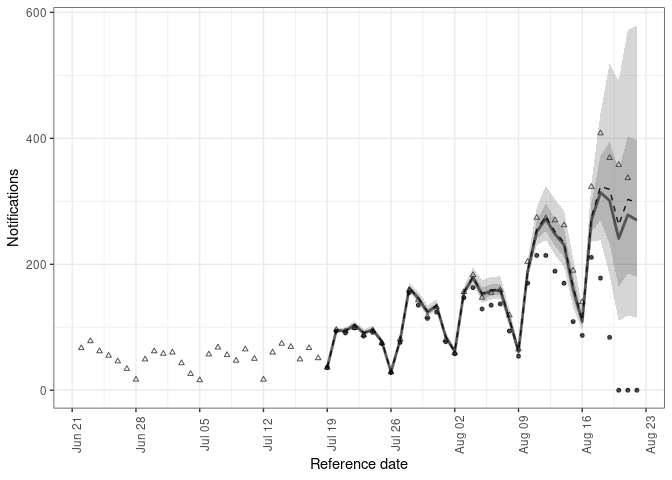
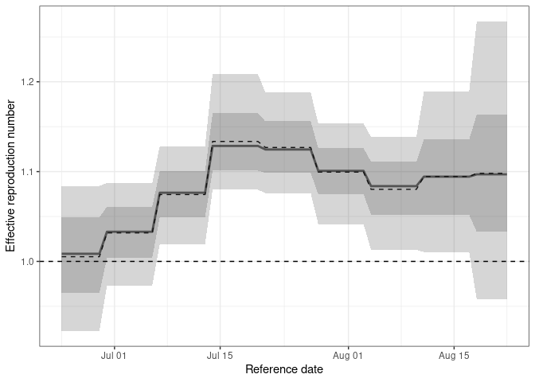
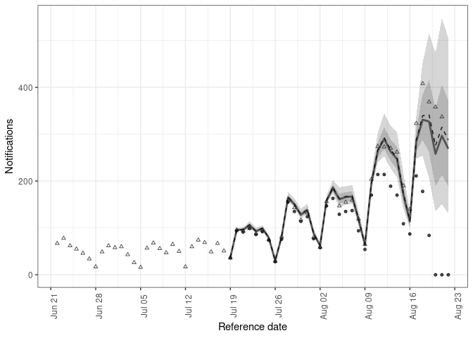
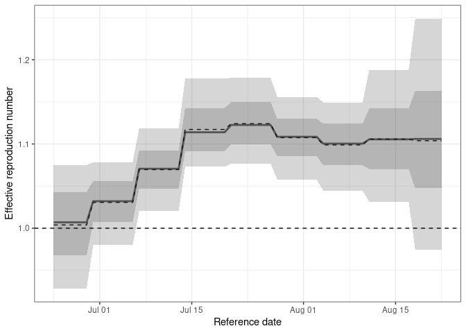

# Adapting `{epinowcast}` to have a fixed reporting schedule

## The problem

I have data that has a fixed reporting schedule (for example it is
reported weekly on a thursday at 9am). I want to use `{epinowcast}` to
nowcast the data and estimate the effective reproduction number, but I
want to be able to specify the reporting schedule.

## The solution

`{epinowcast}` doesn’t yet support this functionality, but it is
possible to adapt the package to do this.

> Before doing this note that we also have the option of pretending we
> do not know the fixed reporting schedule and so need to learn it from
> the data. This should work but it will likely not be very efficient.
> If you want to try this load the default `{epinowcast}` model in
> `main.R` rather than the adapted one.

## Getting setup with this example

1.  Clone this repository
2.  Open an R session in the root of the repository. `renv` should
    handle installing the dependencies.
3.  Make sure you have `cmdstan` installed (for example via
    `cmdstanr::install_cmdstan()`).
4.  Either run through this `README` interactively or render it using
    `quarto`.

## Load Packages

``` r
library(epinowcast)
library(data.table)
library(ggplot2)
library(here)
```

    here() starts at /home/seabbs/Dropbox/academic/projects/epinowcast-fixed-reporting-example

## Load Synthetic Data

We load in the synthetic data from `data` that we generated in
`data-raw/synthetic-weekly-data.R`. We also load in the latest available
data by reference date (i.e. the data that we want to nowcast).

``` r
rt_synth_data <- fread("data/synthetic-weekly-data.csv")
latest_synth_data <- fread("data/latest-synthetic-weekly-data.csv")
```

## Filter the latest data for the period we are nowcasting

``` r
filt_latest_synth_data <- enw_filter_reference_dates(
  latest_synth_data,
  remove_days = 40, include_days = 60
)
```

## Preprocess Observations

As for all uses of `{epinowcast}` we need to first preprocess the data.

``` r
pobs <- enw_preprocess_data(rt_synth_data, max_delay = 35)
```

    Warning in enw_add_metaobs_features(metareport, ...): Pre-existing columns in
    `metaobs` will be overwritten: {day_of_week}.

    Warning in enw_add_metaobs_features(metareference, ...): Pre-existing columns
    in `metaobs` will be overwritten: {day_of_week}.

## Compile Nowcasting Model

We now load in our custom model (`model.stan`). If we would like to use
the default model we would drop the `model` - try this out and see what
difference it makes.

``` r
model <- enw_model(
  model = here("model.stan"),
  threads = TRUE, stanc_options = list("O1")
)
```

    Using model /home/seabbs/Dropbox/academic/projects/epinowcast-fixed-reporting-example/model.stan.

    include is /home/seabbs/.cache/R/renv/cache/v5/R-4.3/x86_64-pc-linux-gnu/epinowcast/0.2.3.2000/642a461f38b2083f8c696a37edb32486/epinowcast/stan.

## Define Expectation Model

This model includes:

- A random walk on the log of expected cases.
- A generation time with probability mass spread over 4 days.
- A latent reporting delay representing the incubation period and
  assumed ascertainment.
- A day of the week reporting effect.

``` r
expectation_module <- enw_expectation(
  r = ~ 1 + rw(week),
  generation_time = c(0.1, 0.4, 0.4, 0.1),
  observation = ~ (1 | day_of_week),
  latent_reporting_delay = c(0.05, 0.3, 0.6, 0.05),
  data = pobs
)
```

## Define Reference Date Model

This model assumes a non-parametric reporting process with a random
effect on the week of the delay.

``` r
reference_module <- enw_reference(~ 1, data = pobs)
```

## Define Report Date Model

This model accounts for the day of the week reporting effect using a
binary indicator “not_thursday” which is present in our syntrhetic data.

``` r
report_module <- enw_report(~ not_thursday, data = pobs)
```

## Fit Nowcast Model

We’ll fit the model with the modules defined above and produce a
nowcast.

``` r
# | echo: true
# | output: false
nowcast <- epinowcast(pobs,
  expectation = expectation_module,
  reference = reference_module,
  report = report_module,
  fit = enw_fit_opts(
    save_warmup = FALSE, pp = TRUE,
    # Warning: I have 16 cores and so this setting is fine for me
    # but you need to change it if you have fewer cores (or more!)
    # so that chains * threads_per_chain = your number of cores
    # of cores.
    chains = 4, threads_per_chain = 4,
    parallel_chains = 4,
    iter_warmup = 1000, iter_sampling = 1000,
    adapt_delta = 0.96
  ),
  model = model
)
```

    Running MCMC with 4 parallel chains, with 4 thread(s) per chain...

    Chain 1 Iteration:    1 / 2000 [  0%]  (Warmup) 

    Chain 1 Informational Message: The current Metropolis proposal is about to be rejected because of the following issue:

    Chain 1 Exception: Exception: Exception: neg_binomial_2_log_lpmf: Precision parameter is 0, but must be positive finite! (in '/tmp/RtmpQheQNL/include_1/stan/functions/obs_lpmf.stan', line 6, column 4, included from

    Chain 1 '/tmp/RtmpQheQNL/model-3bb88c30d4419b.stan', line 13, column 0) (in '/tmp/RtmpQheQNL/include_1/stan/functions/delay_lpmf.stan', line 22, column 2, included from

    Chain 1 '/tmp/RtmpQheQNL/model-3bb88c30d4419b.stan', line 17, column 0) (in '/tmp/RtmpQheQNL/model-3bb88c30d4419b.stan', line 398, column 6 to line 402, column 8)

    Chain 1 If this warning occurs sporadically, such as for highly constrained variable types like covariance matrices, then the sampler is fine,

    Chain 1 but if this warning occurs often then your model may be either severely ill-conditioned or misspecified.

    Chain 1 

    Chain 1 Informational Message: The current Metropolis proposal is about to be rejected because of the following issue:

    Chain 1 Exception: Exception: Exception: neg_binomial_2_log_lpmf: Log location parameter[1] is inf, but must be finite! (in '/tmp/RtmpQheQNL/include_1/stan/functions/obs_lpmf.stan', line 6, column 4, included from

    Chain 1 '/tmp/RtmpQheQNL/model-3bb88c30d4419b.stan', line 13, column 0) (in '/tmp/RtmpQheQNL/include_1/stan/functions/delay_lpmf.stan', line 22, column 2, included from

    Chain 1 '/tmp/RtmpQheQNL/model-3bb88c30d4419b.stan', line 17, column 0) (in '/tmp/RtmpQheQNL/model-3bb88c30d4419b.stan', line 398, column 6 to line 402, column 8)

    Chain 1 If this warning occurs sporadically, such as for highly constrained variable types like covariance matrices, then the sampler is fine,

    Chain 1 but if this warning occurs often then your model may be either severely ill-conditioned or misspecified.

    Chain 1 

    Chain 1 Informational Message: The current Metropolis proposal is about to be rejected because of the following issue:

    Chain 1 Exception: Exception: Exception: neg_binomial_2_log_lpmf: Log location parameter[1] is inf, but must be finite! (in '/tmp/RtmpQheQNL/include_1/stan/functions/obs_lpmf.stan', line 6, column 4, included from

    Chain 1 '/tmp/RtmpQheQNL/model-3bb88c30d4419b.stan', line 13, column 0) (in '/tmp/RtmpQheQNL/include_1/stan/functions/delay_lpmf.stan', line 22, column 2, included from

    Chain 1 '/tmp/RtmpQheQNL/model-3bb88c30d4419b.stan', line 17, column 0) (in '/tmp/RtmpQheQNL/model-3bb88c30d4419b.stan', line 398, column 6 to line 402, column 8)

    Chain 1 If this warning occurs sporadically, such as for highly constrained variable types like covariance matrices, then the sampler is fine,

    Chain 1 but if this warning occurs often then your model may be either severely ill-conditioned or misspecified.

    Chain 1 

    Chain 1 Informational Message: The current Metropolis proposal is about to be rejected because of the following issue:

    Chain 1 Exception: Exception: Exception: neg_binomial_2_log_lpmf: Log location parameter[1] is inf, but must be finite! (in '/tmp/RtmpQheQNL/include_1/stan/functions/obs_lpmf.stan', line 6, column 4, included from

    Chain 1 '/tmp/RtmpQheQNL/model-3bb88c30d4419b.stan', line 13, column 0) (in '/tmp/RtmpQheQNL/include_1/stan/functions/delay_lpmf.stan', line 22, column 2, included from

    Chain 1 '/tmp/RtmpQheQNL/model-3bb88c30d4419b.stan', line 17, column 0) (in '/tmp/RtmpQheQNL/model-3bb88c30d4419b.stan', line 398, column 6 to line 402, column 8)

    Chain 1 If this warning occurs sporadically, such as for highly constrained variable types like covariance matrices, then the sampler is fine,

    Chain 1 but if this warning occurs often then your model may be either severely ill-conditioned or misspecified.

    Chain 1 

    Chain 1 Informational Message: The current Metropolis proposal is about to be rejected because of the following issue:

    Chain 1 Exception: Exception: Exception: neg_binomial_2_log_lpmf: Log location parameter[1] is inf, but must be finite! (in '/tmp/RtmpQheQNL/include_1/stan/functions/obs_lpmf.stan', line 6, column 4, included from

    Chain 1 '/tmp/RtmpQheQNL/model-3bb88c30d4419b.stan', line 13, column 0) (in '/tmp/RtmpQheQNL/include_1/stan/functions/delay_lpmf.stan', line 22, column 2, included from

    Chain 1 '/tmp/RtmpQheQNL/model-3bb88c30d4419b.stan', line 17, column 0) (in '/tmp/RtmpQheQNL/model-3bb88c30d4419b.stan', line 398, column 6 to line 402, column 8)

    Chain 1 If this warning occurs sporadically, such as for highly constrained variable types like covariance matrices, then the sampler is fine,

    Chain 1 but if this warning occurs often then your model may be either severely ill-conditioned or misspecified.

    Chain 1 

    Chain 1 Informational Message: The current Metropolis proposal is about to be rejected because of the following issue:

    Chain 1 Exception: Exception: Exception: neg_binomial_2_log_lpmf: Log location parameter[1] is inf, but must be finite! (in '/tmp/RtmpQheQNL/include_1/stan/functions/obs_lpmf.stan', line 6, column 4, included from

    Chain 1 '/tmp/RtmpQheQNL/model-3bb88c30d4419b.stan', line 13, column 0) (in '/tmp/RtmpQheQNL/include_1/stan/functions/delay_lpmf.stan', line 22, column 2, included from

    Chain 1 '/tmp/RtmpQheQNL/model-3bb88c30d4419b.stan', line 17, column 0) (in '/tmp/RtmpQheQNL/model-3bb88c30d4419b.stan', line 398, column 6 to line 402, column 8)

    Chain 1 If this warning occurs sporadically, such as for highly constrained variable types like covariance matrices, then the sampler is fine,

    Chain 1 but if this warning occurs often then your model may be either severely ill-conditioned or misspecified.

    Chain 1 

    Chain 1 Informational Message: The current Metropolis proposal is about to be rejected because of the following issue:

    Chain 1 Exception: Exception: Exception: neg_binomial_2_log_lpmf: Log location parameter[3] is nan, but must be finite! (in '/tmp/RtmpQheQNL/include_1/stan/functions/obs_lpmf.stan', line 6, column 4, included from

    Chain 1 '/tmp/RtmpQheQNL/model-3bb88c30d4419b.stan', line 13, column 0) (in '/tmp/RtmpQheQNL/include_1/stan/functions/delay_lpmf.stan', line 22, column 2, included from

    Chain 1 '/tmp/RtmpQheQNL/model-3bb88c30d4419b.stan', line 17, column 0) (in '/tmp/RtmpQheQNL/model-3bb88c30d4419b.stan', line 398, column 6 to line 402, column 8)

    Chain 1 If this warning occurs sporadically, such as for highly constrained variable types like covariance matrices, then the sampler is fine,

    Chain 1 but if this warning occurs often then your model may be either severely ill-conditioned or misspecified.

    Chain 1 

    Chain 1 Informational Message: The current Metropolis proposal is about to be rejected because of the following issue:

    Chain 1 Exception: Exception: Exception: neg_binomial_2_log_lpmf: Log location parameter[3] is nan, but must be finite! (in '/tmp/RtmpQheQNL/include_1/stan/functions/obs_lpmf.stan', line 6, column 4, included from

    Chain 1 '/tmp/RtmpQheQNL/model-3bb88c30d4419b.stan', line 13, column 0) (in '/tmp/RtmpQheQNL/include_1/stan/functions/delay_lpmf.stan', line 22, column 2, included from

    Chain 1 '/tmp/RtmpQheQNL/model-3bb88c30d4419b.stan', line 17, column 0) (in '/tmp/RtmpQheQNL/model-3bb88c30d4419b.stan', line 398, column 6 to line 402, column 8)

    Chain 1 If this warning occurs sporadically, such as for highly constrained variable types like covariance matrices, then the sampler is fine,

    Chain 1 but if this warning occurs often then your model may be either severely ill-conditioned or misspecified.

    Chain 1 

    Chain 1 Informational Message: The current Metropolis proposal is about to be rejected because of the following issue:

    Chain 1 Exception: Exception: Exception: neg_binomial_2_log_lpmf: Log location parameter[11] is nan, but must be finite! (in '/tmp/RtmpQheQNL/include_1/stan/functions/obs_lpmf.stan', line 6, column 4, included from

    Chain 1 '/tmp/RtmpQheQNL/model-3bb88c30d4419b.stan', line 13, column 0) (in '/tmp/RtmpQheQNL/include_1/stan/functions/delay_lpmf.stan', line 22, column 2, included from

    Chain 1 '/tmp/RtmpQheQNL/model-3bb88c30d4419b.stan', line 17, column 0) (in '/tmp/RtmpQheQNL/model-3bb88c30d4419b.stan', line 398, column 6 to line 402, column 8)

    Chain 1 If this warning occurs sporadically, such as for highly constrained variable types like covariance matrices, then the sampler is fine,

    Chain 1 but if this warning occurs often then your model may be either severely ill-conditioned or misspecified.

    Chain 1 

    Chain 1 Informational Message: The current Metropolis proposal is about to be rejected because of the following issue:

    Chain 1 Exception: Exception: Exception: neg_binomial_2_log_lpmf: Log location parameter[32] is nan, but must be finite! (in '/tmp/RtmpQheQNL/include_1/stan/functions/obs_lpmf.stan', line 6, column 4, included from

    Chain 1 '/tmp/RtmpQheQNL/model-3bb88c30d4419b.stan', line 13, column 0) (in '/tmp/RtmpQheQNL/include_1/stan/functions/delay_lpmf.stan', line 22, column 2, included from

    Chain 1 '/tmp/RtmpQheQNL/model-3bb88c30d4419b.stan', line 17, column 0) (in '/tmp/RtmpQheQNL/model-3bb88c30d4419b.stan', line 398, column 6 to line 402, column 8)

    Chain 1 If this warning occurs sporadically, such as for highly constrained variable types like covariance matrices, then the sampler is fine,

    Chain 1 but if this warning occurs often then your model may be either severely ill-conditioned or misspecified.

    Chain 1 

    Chain 1 Informational Message: The current Metropolis proposal is about to be rejected because of the following issue:

    Chain 1 Exception: Exception: Exception: neg_binomial_2_log_lpmf: Log location parameter[34] is nan, but must be finite! (in '/tmp/RtmpQheQNL/include_1/stan/functions/obs_lpmf.stan', line 6, column 4, included from

    Chain 1 '/tmp/RtmpQheQNL/model-3bb88c30d4419b.stan', line 13, column 0) (in '/tmp/RtmpQheQNL/include_1/stan/functions/delay_lpmf.stan', line 22, column 2, included from

    Chain 1 '/tmp/RtmpQheQNL/model-3bb88c30d4419b.stan', line 17, column 0) (in '/tmp/RtmpQheQNL/model-3bb88c30d4419b.stan', line 398, column 6 to line 402, column 8)

    Chain 1 If this warning occurs sporadically, such as for highly constrained variable types like covariance matrices, then the sampler is fine,

    Chain 1 but if this warning occurs often then your model may be either severely ill-conditioned or misspecified.

    Chain 1 

    Chain 1 Informational Message: The current Metropolis proposal is about to be rejected because of the following issue:

    Chain 1 Exception: Exception: Exception: neg_binomial_2_log_lpmf: Log location parameter[1] is inf, but must be finite! (in '/tmp/RtmpQheQNL/include_1/stan/functions/obs_lpmf.stan', line 6, column 4, included from

    Chain 1 '/tmp/RtmpQheQNL/model-3bb88c30d4419b.stan', line 13, column 0) (in '/tmp/RtmpQheQNL/include_1/stan/functions/delay_lpmf.stan', line 22, column 2, included from

    Chain 1 '/tmp/RtmpQheQNL/model-3bb88c30d4419b.stan', line 17, column 0) (in '/tmp/RtmpQheQNL/model-3bb88c30d4419b.stan', line 398, column 6 to line 402, column 8)

    Chain 1 If this warning occurs sporadically, such as for highly constrained variable types like covariance matrices, then the sampler is fine,

    Chain 1 but if this warning occurs often then your model may be either severely ill-conditioned or misspecified.

    Chain 1 

    Chain 1 Informational Message: The current Metropolis proposal is about to be rejected because of the following issue:

    Chain 1 Exception: Exception: Exception: neg_binomial_2_log_lpmf: Log location parameter[1] is inf, but must be finite! (in '/tmp/RtmpQheQNL/include_1/stan/functions/obs_lpmf.stan', line 6, column 4, included from

    Chain 1 '/tmp/RtmpQheQNL/model-3bb88c30d4419b.stan', line 13, column 0) (in '/tmp/RtmpQheQNL/include_1/stan/functions/delay_lpmf.stan', line 22, column 2, included from

    Chain 1 '/tmp/RtmpQheQNL/model-3bb88c30d4419b.stan', line 17, column 0) (in '/tmp/RtmpQheQNL/model-3bb88c30d4419b.stan', line 398, column 6 to line 402, column 8)

    Chain 1 If this warning occurs sporadically, such as for highly constrained variable types like covariance matrices, then the sampler is fine,

    Chain 1 but if this warning occurs often then your model may be either severely ill-conditioned or misspecified.

    Chain 1 

    Chain 1 Informational Message: The current Metropolis proposal is about to be rejected because of the following issue:

    Chain 1 Exception: Exception: Exception: neg_binomial_2_log_lpmf: Log location parameter[3] is nan, but must be finite! (in '/tmp/RtmpQheQNL/include_1/stan/functions/obs_lpmf.stan', line 6, column 4, included from

    Chain 1 '/tmp/RtmpQheQNL/model-3bb88c30d4419b.stan', line 13, column 0) (in '/tmp/RtmpQheQNL/include_1/stan/functions/delay_lpmf.stan', line 22, column 2, included from

    Chain 1 '/tmp/RtmpQheQNL/model-3bb88c30d4419b.stan', line 17, column 0) (in '/tmp/RtmpQheQNL/model-3bb88c30d4419b.stan', line 398, column 6 to line 402, column 8)

    Chain 1 If this warning occurs sporadically, such as for highly constrained variable types like covariance matrices, then the sampler is fine,

    Chain 1 but if this warning occurs often then your model may be either severely ill-conditioned or misspecified.

    Chain 1 

    Chain 1 Informational Message: The current Metropolis proposal is about to be rejected because of the following issue:

    Chain 1 Exception: Exception: Exception: neg_binomial_2_log_lpmf: Log location parameter[30] is nan, but must be finite! (in '/tmp/RtmpQheQNL/include_1/stan/functions/obs_lpmf.stan', line 6, column 4, included from

    Chain 1 '/tmp/RtmpQheQNL/model-3bb88c30d4419b.stan', line 13, column 0) (in '/tmp/RtmpQheQNL/include_1/stan/functions/delay_lpmf.stan', line 22, column 2, included from

    Chain 1 '/tmp/RtmpQheQNL/model-3bb88c30d4419b.stan', line 17, column 0) (in '/tmp/RtmpQheQNL/model-3bb88c30d4419b.stan', line 398, column 6 to line 402, column 8)

    Chain 1 If this warning occurs sporadically, such as for highly constrained variable types like covariance matrices, then the sampler is fine,

    Chain 1 but if this warning occurs often then your model may be either severely ill-conditioned or misspecified.

    Chain 1 

    Chain 1 Informational Message: The current Metropolis proposal is about to be rejected because of the following issue:

    Chain 1 Exception: Exception: Exception: neg_binomial_2_log_lpmf: Log location parameter[34] is nan, but must be finite! (in '/tmp/RtmpQheQNL/include_1/stan/functions/obs_lpmf.stan', line 6, column 4, included from

    Chain 1 '/tmp/RtmpQheQNL/model-3bb88c30d4419b.stan', line 13, column 0) (in '/tmp/RtmpQheQNL/include_1/stan/functions/delay_lpmf.stan', line 22, column 2, included from

    Chain 1 '/tmp/RtmpQheQNL/model-3bb88c30d4419b.stan', line 17, column 0) (in '/tmp/RtmpQheQNL/model-3bb88c30d4419b.stan', line 398, column 6 to line 402, column 8)

    Chain 1 If this warning occurs sporadically, such as for highly constrained variable types like covariance matrices, then the sampler is fine,

    Chain 1 but if this warning occurs often then your model may be either severely ill-conditioned or misspecified.

    Chain 1 

    Chain 1 Informational Message: The current Metropolis proposal is about to be rejected because of the following issue:

    Chain 1 Exception: Exception: Exception: neg_binomial_2_log_lpmf: Log location parameter[35] is -inf, but must be finite! (in '/tmp/RtmpQheQNL/include_1/stan/functions/obs_lpmf.stan', line 6, column 4, included from

    Chain 1 '/tmp/RtmpQheQNL/model-3bb88c30d4419b.stan', line 13, column 0) (in '/tmp/RtmpQheQNL/include_1/stan/functions/delay_lpmf.stan', line 22, column 2, included from

    Chain 1 '/tmp/RtmpQheQNL/model-3bb88c30d4419b.stan', line 17, column 0) (in '/tmp/RtmpQheQNL/model-3bb88c30d4419b.stan', line 398, column 6 to line 402, column 8)

    Chain 1 If this warning occurs sporadically, such as for highly constrained variable types like covariance matrices, then the sampler is fine,

    Chain 1 but if this warning occurs often then your model may be either severely ill-conditioned or misspecified.

    Chain 1 

    Chain 1 Informational Message: The current Metropolis proposal is about to be rejected because of the following issue:

    Chain 1 Exception: Exception: Exception: neg_binomial_2_log_lpmf: Log location parameter[35] is -inf, but must be finite! (in '/tmp/RtmpQheQNL/include_1/stan/functions/obs_lpmf.stan', line 6, column 4, included from

    Chain 1 '/tmp/RtmpQheQNL/model-3bb88c30d4419b.stan', line 13, column 0) (in '/tmp/RtmpQheQNL/include_1/stan/functions/delay_lpmf.stan', line 22, column 2, included from

    Chain 1 '/tmp/RtmpQheQNL/model-3bb88c30d4419b.stan', line 17, column 0) (in '/tmp/RtmpQheQNL/model-3bb88c30d4419b.stan', line 398, column 6 to line 402, column 8)

    Chain 1 If this warning occurs sporadically, such as for highly constrained variable types like covariance matrices, then the sampler is fine,

    Chain 1 but if this warning occurs often then your model may be either severely ill-conditioned or misspecified.

    Chain 1 

    Chain 1 Informational Message: The current Metropolis proposal is about to be rejected because of the following issue:

    Chain 1 Exception: Exception: Exception: neg_binomial_2_log_lpmf: Log location parameter[35] is -inf, but must be finite! (in '/tmp/RtmpQheQNL/include_1/stan/functions/obs_lpmf.stan', line 6, column 4, included from

    Chain 1 '/tmp/RtmpQheQNL/model-3bb88c30d4419b.stan', line 13, column 0) (in '/tmp/RtmpQheQNL/include_1/stan/functions/delay_lpmf.stan', line 22, column 2, included from

    Chain 1 '/tmp/RtmpQheQNL/model-3bb88c30d4419b.stan', line 17, column 0) (in '/tmp/RtmpQheQNL/model-3bb88c30d4419b.stan', line 398, column 6 to line 402, column 8)

    Chain 1 If this warning occurs sporadically, such as for highly constrained variable types like covariance matrices, then the sampler is fine,

    Chain 1 but if this warning occurs often then your model may be either severely ill-conditioned or misspecified.

    Chain 1 

    Chain 1 Informational Message: The current Metropolis proposal is about to be rejected because of the following issue:

    Chain 1 Exception: Exception: Exception: neg_binomial_2_log_lpmf: Log location parameter[35] is -inf, but must be finite! (in '/tmp/RtmpQheQNL/include_1/stan/functions/obs_lpmf.stan', line 6, column 4, included from

    Chain 1 '/tmp/RtmpQheQNL/model-3bb88c30d4419b.stan', line 13, column 0) (in '/tmp/RtmpQheQNL/include_1/stan/functions/delay_lpmf.stan', line 22, column 2, included from

    Chain 1 '/tmp/RtmpQheQNL/model-3bb88c30d4419b.stan', line 17, column 0) (in '/tmp/RtmpQheQNL/model-3bb88c30d4419b.stan', line 398, column 6 to line 402, column 8)

    Chain 1 If this warning occurs sporadically, such as for highly constrained variable types like covariance matrices, then the sampler is fine,

    Chain 1 but if this warning occurs often then your model may be either severely ill-conditioned or misspecified.

    Chain 1 

    Chain 2 Iteration:    1 / 2000 [  0%]  (Warmup) 

    Chain 2 Informational Message: The current Metropolis proposal is about to be rejected because of the following issue:

    Chain 2 Exception: Exception: Exception: neg_binomial_2_log_lpmf: Log location parameter[1] is inf, but must be finite! (in '/tmp/RtmpQheQNL/include_1/stan/functions/obs_lpmf.stan', line 6, column 4, included from

    Chain 2 '/tmp/RtmpQheQNL/model-3bb88c30d4419b.stan', line 13, column 0) (in '/tmp/RtmpQheQNL/include_1/stan/functions/delay_lpmf.stan', line 22, column 2, included from

    Chain 2 '/tmp/RtmpQheQNL/model-3bb88c30d4419b.stan', line 17, column 0) (in '/tmp/RtmpQheQNL/model-3bb88c30d4419b.stan', line 398, column 6 to line 402, column 8)

    Chain 2 If this warning occurs sporadically, such as for highly constrained variable types like covariance matrices, then the sampler is fine,

    Chain 2 but if this warning occurs often then your model may be either severely ill-conditioned or misspecified.

    Chain 2 

    Chain 2 Informational Message: The current Metropolis proposal is about to be rejected because of the following issue:

    Chain 2 Exception: Exception: Exception: neg_binomial_2_log_lpmf: Precision parameter is 0, but must be positive finite! (in '/tmp/RtmpQheQNL/include_1/stan/functions/obs_lpmf.stan', line 6, column 4, included from

    Chain 2 '/tmp/RtmpQheQNL/model-3bb88c30d4419b.stan', line 13, column 0) (in '/tmp/RtmpQheQNL/include_1/stan/functions/delay_lpmf.stan', line 22, column 2, included from

    Chain 2 '/tmp/RtmpQheQNL/model-3bb88c30d4419b.stan', line 17, column 0) (in '/tmp/RtmpQheQNL/model-3bb88c30d4419b.stan', line 398, column 6 to line 402, column 8)

    Chain 2 If this warning occurs sporadically, such as for highly constrained variable types like covariance matrices, then the sampler is fine,

    Chain 2 but if this warning occurs often then your model may be either severely ill-conditioned or misspecified.

    Chain 2 

    Chain 2 Informational Message: The current Metropolis proposal is about to be rejected because of the following issue:

    Chain 2 Exception: Exception: Exception: neg_binomial_2_log_lpmf: Log location parameter[1] is inf, but must be finite! (in '/tmp/RtmpQheQNL/include_1/stan/functions/obs_lpmf.stan', line 6, column 4, included from

    Chain 2 '/tmp/RtmpQheQNL/model-3bb88c30d4419b.stan', line 13, column 0) (in '/tmp/RtmpQheQNL/include_1/stan/functions/delay_lpmf.stan', line 22, column 2, included from

    Chain 2 '/tmp/RtmpQheQNL/model-3bb88c30d4419b.stan', line 17, column 0) (in '/tmp/RtmpQheQNL/model-3bb88c30d4419b.stan', line 398, column 6 to line 402, column 8)

    Chain 2 If this warning occurs sporadically, such as for highly constrained variable types like covariance matrices, then the sampler is fine,

    Chain 2 but if this warning occurs often then your model may be either severely ill-conditioned or misspecified.

    Chain 2 

    Chain 2 Informational Message: The current Metropolis proposal is about to be rejected because of the following issue:

    Chain 2 Exception: Exception: Exception: neg_binomial_2_log_lpmf: Log location parameter[1] is inf, but must be finite! (in '/tmp/RtmpQheQNL/include_1/stan/functions/obs_lpmf.stan', line 6, column 4, included from

    Chain 2 '/tmp/RtmpQheQNL/model-3bb88c30d4419b.stan', line 13, column 0) (in '/tmp/RtmpQheQNL/include_1/stan/functions/delay_lpmf.stan', line 22, column 2, included from

    Chain 2 '/tmp/RtmpQheQNL/model-3bb88c30d4419b.stan', line 17, column 0) (in '/tmp/RtmpQheQNL/model-3bb88c30d4419b.stan', line 398, column 6 to line 402, column 8)

    Chain 2 If this warning occurs sporadically, such as for highly constrained variable types like covariance matrices, then the sampler is fine,

    Chain 2 but if this warning occurs often then your model may be either severely ill-conditioned or misspecified.

    Chain 2 

    Chain 2 Informational Message: The current Metropolis proposal is about to be rejected because of the following issue:

    Chain 2 Exception: Exception: Exception: neg_binomial_2_log_lpmf: Log location parameter[1] is inf, but must be finite! (in '/tmp/RtmpQheQNL/include_1/stan/functions/obs_lpmf.stan', line 6, column 4, included from

    Chain 2 '/tmp/RtmpQheQNL/model-3bb88c30d4419b.stan', line 13, column 0) (in '/tmp/RtmpQheQNL/include_1/stan/functions/delay_lpmf.stan', line 22, column 2, included from

    Chain 2 '/tmp/RtmpQheQNL/model-3bb88c30d4419b.stan', line 17, column 0) (in '/tmp/RtmpQheQNL/model-3bb88c30d4419b.stan', line 398, column 6 to line 402, column 8)

    Chain 2 If this warning occurs sporadically, such as for highly constrained variable types like covariance matrices, then the sampler is fine,

    Chain 2 but if this warning occurs often then your model may be either severely ill-conditioned or misspecified.

    Chain 2 

    Chain 2 Informational Message: The current Metropolis proposal is about to be rejected because of the following issue:

    Chain 2 Exception: Exception: Exception: neg_binomial_2_log_lpmf: Log location parameter[1] is inf, but must be finite! (in '/tmp/RtmpQheQNL/include_1/stan/functions/obs_lpmf.stan', line 6, column 4, included from

    Chain 2 '/tmp/RtmpQheQNL/model-3bb88c30d4419b.stan', line 13, column 0) (in '/tmp/RtmpQheQNL/include_1/stan/functions/delay_lpmf.stan', line 22, column 2, included from

    Chain 2 '/tmp/RtmpQheQNL/model-3bb88c30d4419b.stan', line 17, column 0) (in '/tmp/RtmpQheQNL/model-3bb88c30d4419b.stan', line 398, column 6 to line 402, column 8)

    Chain 2 If this warning occurs sporadically, such as for highly constrained variable types like covariance matrices, then the sampler is fine,

    Chain 2 but if this warning occurs often then your model may be either severely ill-conditioned or misspecified.

    Chain 2 

    Chain 2 Informational Message: The current Metropolis proposal is about to be rejected because of the following issue:

    Chain 2 Exception: Exception: Exception: neg_binomial_2_log_lpmf: Log location parameter[3] is nan, but must be finite! (in '/tmp/RtmpQheQNL/include_1/stan/functions/obs_lpmf.stan', line 6, column 4, included from

    Chain 2 '/tmp/RtmpQheQNL/model-3bb88c30d4419b.stan', line 13, column 0) (in '/tmp/RtmpQheQNL/include_1/stan/functions/delay_lpmf.stan', line 22, column 2, included from

    Chain 2 '/tmp/RtmpQheQNL/model-3bb88c30d4419b.stan', line 17, column 0) (in '/tmp/RtmpQheQNL/model-3bb88c30d4419b.stan', line 398, column 6 to line 402, column 8)

    Chain 2 If this warning occurs sporadically, such as for highly constrained variable types like covariance matrices, then the sampler is fine,

    Chain 2 but if this warning occurs often then your model may be either severely ill-conditioned or misspecified.

    Chain 2 

    Chain 2 Informational Message: The current Metropolis proposal is about to be rejected because of the following issue:

    Chain 2 Exception: Exception: Exception: neg_binomial_2_log_lpmf: Log location parameter[3] is nan, but must be finite! (in '/tmp/RtmpQheQNL/include_1/stan/functions/obs_lpmf.stan', line 6, column 4, included from

    Chain 2 '/tmp/RtmpQheQNL/model-3bb88c30d4419b.stan', line 13, column 0) (in '/tmp/RtmpQheQNL/include_1/stan/functions/delay_lpmf.stan', line 22, column 2, included from

    Chain 2 '/tmp/RtmpQheQNL/model-3bb88c30d4419b.stan', line 17, column 0) (in '/tmp/RtmpQheQNL/model-3bb88c30d4419b.stan', line 398, column 6 to line 402, column 8)

    Chain 2 If this warning occurs sporadically, such as for highly constrained variable types like covariance matrices, then the sampler is fine,

    Chain 2 but if this warning occurs often then your model may be either severely ill-conditioned or misspecified.

    Chain 2 

    Chain 2 Informational Message: The current Metropolis proposal is about to be rejected because of the following issue:

    Chain 2 Exception: Exception: Exception: neg_binomial_2_log_lpmf: Log location parameter[3] is nan, but must be finite! (in '/tmp/RtmpQheQNL/include_1/stan/functions/obs_lpmf.stan', line 6, column 4, included from

    Chain 2 '/tmp/RtmpQheQNL/model-3bb88c30d4419b.stan', line 13, column 0) (in '/tmp/RtmpQheQNL/include_1/stan/functions/delay_lpmf.stan', line 22, column 2, included from

    Chain 2 '/tmp/RtmpQheQNL/model-3bb88c30d4419b.stan', line 17, column 0) (in '/tmp/RtmpQheQNL/model-3bb88c30d4419b.stan', line 398, column 6 to line 402, column 8)

    Chain 2 If this warning occurs sporadically, such as for highly constrained variable types like covariance matrices, then the sampler is fine,

    Chain 2 but if this warning occurs often then your model may be either severely ill-conditioned or misspecified.

    Chain 2 

    Chain 2 Informational Message: The current Metropolis proposal is about to be rejected because of the following issue:

    Chain 2 Exception: Exception: Exception: neg_binomial_2_log_lpmf: Log location parameter[18] is nan, but must be finite! (in '/tmp/RtmpQheQNL/include_1/stan/functions/obs_lpmf.stan', line 6, column 4, included from

    Chain 2 '/tmp/RtmpQheQNL/model-3bb88c30d4419b.stan', line 13, column 0) (in '/tmp/RtmpQheQNL/include_1/stan/functions/delay_lpmf.stan', line 22, column 2, included from

    Chain 2 '/tmp/RtmpQheQNL/model-3bb88c30d4419b.stan', line 17, column 0) (in '/tmp/RtmpQheQNL/model-3bb88c30d4419b.stan', line 398, column 6 to line 402, column 8)

    Chain 2 If this warning occurs sporadically, such as for highly constrained variable types like covariance matrices, then the sampler is fine,

    Chain 2 but if this warning occurs often then your model may be either severely ill-conditioned or misspecified.

    Chain 2 

    Chain 2 Informational Message: The current Metropolis proposal is about to be rejected because of the following issue:

    Chain 2 Exception: Exception: Exception: neg_binomial_2_log_lpmf: Log location parameter[33] is nan, but must be finite! (in '/tmp/RtmpQheQNL/include_1/stan/functions/obs_lpmf.stan', line 6, column 4, included from

    Chain 2 '/tmp/RtmpQheQNL/model-3bb88c30d4419b.stan', line 13, column 0) (in '/tmp/RtmpQheQNL/include_1/stan/functions/delay_lpmf.stan', line 22, column 2, included from

    Chain 2 '/tmp/RtmpQheQNL/model-3bb88c30d4419b.stan', line 17, column 0) (in '/tmp/RtmpQheQNL/model-3bb88c30d4419b.stan', line 398, column 6 to line 402, column 8)

    Chain 2 If this warning occurs sporadically, such as for highly constrained variable types like covariance matrices, then the sampler is fine,

    Chain 2 but if this warning occurs often then your model may be either severely ill-conditioned or misspecified.

    Chain 2 

    Chain 2 Informational Message: The current Metropolis proposal is about to be rejected because of the following issue:

    Chain 2 Exception: Exception: Exception: neg_binomial_2_log_lpmf: Log location parameter[1] is -inf, but must be finite! (in '/tmp/RtmpQheQNL/include_1/stan/functions/obs_lpmf.stan', line 6, column 4, included from

    Chain 2 '/tmp/RtmpQheQNL/model-3bb88c30d4419b.stan', line 13, column 0) (in '/tmp/RtmpQheQNL/include_1/stan/functions/delay_lpmf.stan', line 22, column 2, included from

    Chain 2 '/tmp/RtmpQheQNL/model-3bb88c30d4419b.stan', line 17, column 0) (in '/tmp/RtmpQheQNL/model-3bb88c30d4419b.stan', line 398, column 6 to line 402, column 8)

    Chain 2 If this warning occurs sporadically, such as for highly constrained variable types like covariance matrices, then the sampler is fine,

    Chain 2 but if this warning occurs often then your model may be either severely ill-conditioned or misspecified.

    Chain 2 

    Chain 2 Informational Message: The current Metropolis proposal is about to be rejected because of the following issue:

    Chain 2 Exception: Exception: Exception: neg_binomial_2_log_lpmf: Log location parameter[1] is -inf, but must be finite! (in '/tmp/RtmpQheQNL/include_1/stan/functions/obs_lpmf.stan', line 6, column 4, included from

    Chain 2 '/tmp/RtmpQheQNL/model-3bb88c30d4419b.stan', line 13, column 0) (in '/tmp/RtmpQheQNL/include_1/stan/functions/delay_lpmf.stan', line 22, column 2, included from

    Chain 2 '/tmp/RtmpQheQNL/model-3bb88c30d4419b.stan', line 17, column 0) (in '/tmp/RtmpQheQNL/model-3bb88c30d4419b.stan', line 398, column 6 to line 402, column 8)

    Chain 2 If this warning occurs sporadically, such as for highly constrained variable types like covariance matrices, then the sampler is fine,

    Chain 2 but if this warning occurs often then your model may be either severely ill-conditioned or misspecified.

    Chain 2 

    Chain 2 Informational Message: The current Metropolis proposal is about to be rejected because of the following issue:

    Chain 2 Exception: Exception: Exception: neg_binomial_2_log_lpmf: Log location parameter[3] is nan, but must be finite! (in '/tmp/RtmpQheQNL/include_1/stan/functions/obs_lpmf.stan', line 6, column 4, included from

    Chain 2 '/tmp/RtmpQheQNL/model-3bb88c30d4419b.stan', line 13, column 0) (in '/tmp/RtmpQheQNL/include_1/stan/functions/delay_lpmf.stan', line 22, column 2, included from

    Chain 2 '/tmp/RtmpQheQNL/model-3bb88c30d4419b.stan', line 17, column 0) (in '/tmp/RtmpQheQNL/model-3bb88c30d4419b.stan', line 398, column 6 to line 402, column 8)

    Chain 2 If this warning occurs sporadically, such as for highly constrained variable types like covariance matrices, then the sampler is fine,

    Chain 2 but if this warning occurs often then your model may be either severely ill-conditioned or misspecified.

    Chain 2 

    Chain 3 Iteration:    1 / 2000 [  0%]  (Warmup) 

    Chain 3 Informational Message: The current Metropolis proposal is about to be rejected because of the following issue:

    Chain 3 Exception: Exception: Exception: neg_binomial_2_log_lpmf: Log location parameter[1] is inf, but must be finite! (in '/tmp/RtmpQheQNL/include_1/stan/functions/obs_lpmf.stan', line 6, column 4, included from

    Chain 3 '/tmp/RtmpQheQNL/model-3bb88c30d4419b.stan', line 13, column 0) (in '/tmp/RtmpQheQNL/include_1/stan/functions/delay_lpmf.stan', line 22, column 2, included from

    Chain 3 '/tmp/RtmpQheQNL/model-3bb88c30d4419b.stan', line 17, column 0) (in '/tmp/RtmpQheQNL/model-3bb88c30d4419b.stan', line 398, column 6 to line 402, column 8)

    Chain 3 If this warning occurs sporadically, such as for highly constrained variable types like covariance matrices, then the sampler is fine,

    Chain 3 but if this warning occurs often then your model may be either severely ill-conditioned or misspecified.

    Chain 3 

    Chain 3 Informational Message: The current Metropolis proposal is about to be rejected because of the following issue:

    Chain 3 Exception: Exception: Exception: neg_binomial_2_log_lpmf: Log location parameter[1] is inf, but must be finite! (in '/tmp/RtmpQheQNL/include_1/stan/functions/obs_lpmf.stan', line 6, column 4, included from

    Chain 3 '/tmp/RtmpQheQNL/model-3bb88c30d4419b.stan', line 13, column 0) (in '/tmp/RtmpQheQNL/include_1/stan/functions/delay_lpmf.stan', line 22, column 2, included from

    Chain 3 '/tmp/RtmpQheQNL/model-3bb88c30d4419b.stan', line 17, column 0) (in '/tmp/RtmpQheQNL/model-3bb88c30d4419b.stan', line 398, column 6 to line 402, column 8)

    Chain 3 If this warning occurs sporadically, such as for highly constrained variable types like covariance matrices, then the sampler is fine,

    Chain 3 but if this warning occurs often then your model may be either severely ill-conditioned or misspecified.

    Chain 3 

    Chain 3 Informational Message: The current Metropolis proposal is about to be rejected because of the following issue:

    Chain 3 Exception: Exception: Exception: neg_binomial_2_log_lpmf: Log location parameter[1] is inf, but must be finite! (in '/tmp/RtmpQheQNL/include_1/stan/functions/obs_lpmf.stan', line 6, column 4, included from

    Chain 3 '/tmp/RtmpQheQNL/model-3bb88c30d4419b.stan', line 13, column 0) (in '/tmp/RtmpQheQNL/include_1/stan/functions/delay_lpmf.stan', line 22, column 2, included from

    Chain 3 '/tmp/RtmpQheQNL/model-3bb88c30d4419b.stan', line 17, column 0) (in '/tmp/RtmpQheQNL/model-3bb88c30d4419b.stan', line 398, column 6 to line 402, column 8)

    Chain 3 If this warning occurs sporadically, such as for highly constrained variable types like covariance matrices, then the sampler is fine,

    Chain 3 but if this warning occurs often then your model may be either severely ill-conditioned or misspecified.

    Chain 3 

    Chain 3 Informational Message: The current Metropolis proposal is about to be rejected because of the following issue:

    Chain 3 Exception: Exception: Exception: neg_binomial_2_log_lpmf: Log location parameter[1] is inf, but must be finite! (in '/tmp/RtmpQheQNL/include_1/stan/functions/obs_lpmf.stan', line 6, column 4, included from

    Chain 3 '/tmp/RtmpQheQNL/model-3bb88c30d4419b.stan', line 13, column 0) (in '/tmp/RtmpQheQNL/include_1/stan/functions/delay_lpmf.stan', line 22, column 2, included from

    Chain 3 '/tmp/RtmpQheQNL/model-3bb88c30d4419b.stan', line 17, column 0) (in '/tmp/RtmpQheQNL/model-3bb88c30d4419b.stan', line 398, column 6 to line 402, column 8)

    Chain 3 If this warning occurs sporadically, such as for highly constrained variable types like covariance matrices, then the sampler is fine,

    Chain 3 but if this warning occurs often then your model may be either severely ill-conditioned or misspecified.

    Chain 3 

    Chain 3 Informational Message: The current Metropolis proposal is about to be rejected because of the following issue:

    Chain 3 Exception: Exception: Exception: neg_binomial_2_log_lpmf: Log location parameter[1] is inf, but must be finite! (in '/tmp/RtmpQheQNL/include_1/stan/functions/obs_lpmf.stan', line 6, column 4, included from

    Chain 3 '/tmp/RtmpQheQNL/model-3bb88c30d4419b.stan', line 13, column 0) (in '/tmp/RtmpQheQNL/include_1/stan/functions/delay_lpmf.stan', line 22, column 2, included from

    Chain 3 '/tmp/RtmpQheQNL/model-3bb88c30d4419b.stan', line 17, column 0) (in '/tmp/RtmpQheQNL/model-3bb88c30d4419b.stan', line 398, column 6 to line 402, column 8)

    Chain 3 If this warning occurs sporadically, such as for highly constrained variable types like covariance matrices, then the sampler is fine,

    Chain 3 but if this warning occurs often then your model may be either severely ill-conditioned or misspecified.

    Chain 3 

    Chain 3 Informational Message: The current Metropolis proposal is about to be rejected because of the following issue:

    Chain 3 Exception: Exception: Exception: neg_binomial_2_log_lpmf: Log location parameter[1] is inf, but must be finite! (in '/tmp/RtmpQheQNL/include_1/stan/functions/obs_lpmf.stan', line 6, column 4, included from

    Chain 3 '/tmp/RtmpQheQNL/model-3bb88c30d4419b.stan', line 13, column 0) (in '/tmp/RtmpQheQNL/include_1/stan/functions/delay_lpmf.stan', line 22, column 2, included from

    Chain 3 '/tmp/RtmpQheQNL/model-3bb88c30d4419b.stan', line 17, column 0) (in '/tmp/RtmpQheQNL/model-3bb88c30d4419b.stan', line 398, column 6 to line 402, column 8)

    Chain 3 If this warning occurs sporadically, such as for highly constrained variable types like covariance matrices, then the sampler is fine,

    Chain 3 but if this warning occurs often then your model may be either severely ill-conditioned or misspecified.

    Chain 3 

    Chain 3 Informational Message: The current Metropolis proposal is about to be rejected because of the following issue:

    Chain 3 Exception: Exception: Exception: neg_binomial_2_log_lpmf: Log location parameter[3] is nan, but must be finite! (in '/tmp/RtmpQheQNL/include_1/stan/functions/obs_lpmf.stan', line 6, column 4, included from

    Chain 3 '/tmp/RtmpQheQNL/model-3bb88c30d4419b.stan', line 13, column 0) (in '/tmp/RtmpQheQNL/include_1/stan/functions/delay_lpmf.stan', line 22, column 2, included from

    Chain 3 '/tmp/RtmpQheQNL/model-3bb88c30d4419b.stan', line 17, column 0) (in '/tmp/RtmpQheQNL/model-3bb88c30d4419b.stan', line 398, column 6 to line 402, column 8)

    Chain 3 If this warning occurs sporadically, such as for highly constrained variable types like covariance matrices, then the sampler is fine,

    Chain 3 but if this warning occurs often then your model may be either severely ill-conditioned or misspecified.

    Chain 3 

    Chain 3 Informational Message: The current Metropolis proposal is about to be rejected because of the following issue:

    Chain 3 Exception: Exception: Exception: neg_binomial_2_log_lpmf: Log location parameter[3] is nan, but must be finite! (in '/tmp/RtmpQheQNL/include_1/stan/functions/obs_lpmf.stan', line 6, column 4, included from

    Chain 3 '/tmp/RtmpQheQNL/model-3bb88c30d4419b.stan', line 13, column 0) (in '/tmp/RtmpQheQNL/include_1/stan/functions/delay_lpmf.stan', line 22, column 2, included from

    Chain 3 '/tmp/RtmpQheQNL/model-3bb88c30d4419b.stan', line 17, column 0) (in '/tmp/RtmpQheQNL/model-3bb88c30d4419b.stan', line 398, column 6 to line 402, column 8)

    Chain 3 If this warning occurs sporadically, such as for highly constrained variable types like covariance matrices, then the sampler is fine,

    Chain 3 but if this warning occurs often then your model may be either severely ill-conditioned or misspecified.

    Chain 3 

    Chain 3 Informational Message: The current Metropolis proposal is about to be rejected because of the following issue:

    Chain 3 Exception: Exception: Exception: neg_binomial_2_log_lpmf: Log location parameter[3] is nan, but must be finite! (in '/tmp/RtmpQheQNL/include_1/stan/functions/obs_lpmf.stan', line 6, column 4, included from

    Chain 3 '/tmp/RtmpQheQNL/model-3bb88c30d4419b.stan', line 13, column 0) (in '/tmp/RtmpQheQNL/include_1/stan/functions/delay_lpmf.stan', line 22, column 2, included from

    Chain 3 '/tmp/RtmpQheQNL/model-3bb88c30d4419b.stan', line 17, column 0) (in '/tmp/RtmpQheQNL/model-3bb88c30d4419b.stan', line 398, column 6 to line 402, column 8)

    Chain 3 If this warning occurs sporadically, such as for highly constrained variable types like covariance matrices, then the sampler is fine,

    Chain 3 but if this warning occurs often then your model may be either severely ill-conditioned or misspecified.

    Chain 3 

    Chain 3 Informational Message: The current Metropolis proposal is about to be rejected because of the following issue:

    Chain 3 Exception: Exception: Exception: neg_binomial_2_log_lpmf: Log location parameter[32] is nan, but must be finite! (in '/tmp/RtmpQheQNL/include_1/stan/functions/obs_lpmf.stan', line 6, column 4, included from

    Chain 3 '/tmp/RtmpQheQNL/model-3bb88c30d4419b.stan', line 13, column 0) (in '/tmp/RtmpQheQNL/include_1/stan/functions/delay_lpmf.stan', line 22, column 2, included from

    Chain 3 '/tmp/RtmpQheQNL/model-3bb88c30d4419b.stan', line 17, column 0) (in '/tmp/RtmpQheQNL/model-3bb88c30d4419b.stan', line 398, column 6 to line 402, column 8)

    Chain 3 If this warning occurs sporadically, such as for highly constrained variable types like covariance matrices, then the sampler is fine,

    Chain 3 but if this warning occurs often then your model may be either severely ill-conditioned or misspecified.

    Chain 3 

    Chain 3 Informational Message: The current Metropolis proposal is about to be rejected because of the following issue:

    Chain 3 Exception: Exception: Exception: neg_binomial_2_log_lpmf: Log location parameter[34] is nan, but must be finite! (in '/tmp/RtmpQheQNL/include_1/stan/functions/obs_lpmf.stan', line 6, column 4, included from

    Chain 3 '/tmp/RtmpQheQNL/model-3bb88c30d4419b.stan', line 13, column 0) (in '/tmp/RtmpQheQNL/include_1/stan/functions/delay_lpmf.stan', line 22, column 2, included from

    Chain 3 '/tmp/RtmpQheQNL/model-3bb88c30d4419b.stan', line 17, column 0) (in '/tmp/RtmpQheQNL/model-3bb88c30d4419b.stan', line 398, column 6 to line 402, column 8)

    Chain 3 If this warning occurs sporadically, such as for highly constrained variable types like covariance matrices, then the sampler is fine,

    Chain 3 but if this warning occurs often then your model may be either severely ill-conditioned or misspecified.

    Chain 3 

    Chain 3 Informational Message: The current Metropolis proposal is about to be rejected because of the following issue:

    Chain 3 Exception: Exception: Exception: neg_binomial_2_log_lpmf: Log location parameter[1] is -inf, but must be finite! (in '/tmp/RtmpQheQNL/include_1/stan/functions/obs_lpmf.stan', line 6, column 4, included from

    Chain 3 '/tmp/RtmpQheQNL/model-3bb88c30d4419b.stan', line 13, column 0) (in '/tmp/RtmpQheQNL/include_1/stan/functions/delay_lpmf.stan', line 22, column 2, included from

    Chain 3 '/tmp/RtmpQheQNL/model-3bb88c30d4419b.stan', line 17, column 0) (in '/tmp/RtmpQheQNL/model-3bb88c30d4419b.stan', line 398, column 6 to line 402, column 8)

    Chain 3 If this warning occurs sporadically, such as for highly constrained variable types like covariance matrices, then the sampler is fine,

    Chain 3 but if this warning occurs often then your model may be either severely ill-conditioned or misspecified.

    Chain 3 

    Chain 3 Informational Message: The current Metropolis proposal is about to be rejected because of the following issue:

    Chain 3 Exception: Exception: Exception: neg_binomial_2_log_lpmf: Log location parameter[1] is -inf, but must be finite! (in '/tmp/RtmpQheQNL/include_1/stan/functions/obs_lpmf.stan', line 6, column 4, included from

    Chain 3 '/tmp/RtmpQheQNL/model-3bb88c30d4419b.stan', line 13, column 0) (in '/tmp/RtmpQheQNL/include_1/stan/functions/delay_lpmf.stan', line 22, column 2, included from

    Chain 3 '/tmp/RtmpQheQNL/model-3bb88c30d4419b.stan', line 17, column 0) (in '/tmp/RtmpQheQNL/model-3bb88c30d4419b.stan', line 398, column 6 to line 402, column 8)

    Chain 3 If this warning occurs sporadically, such as for highly constrained variable types like covariance matrices, then the sampler is fine,

    Chain 3 but if this warning occurs often then your model may be either severely ill-conditioned or misspecified.

    Chain 3 

    Chain 3 Informational Message: The current Metropolis proposal is about to be rejected because of the following issue:

    Chain 3 Exception: Exception: Exception: neg_binomial_2_log_lpmf: Log location parameter[3] is nan, but must be finite! (in '/tmp/RtmpQheQNL/include_1/stan/functions/obs_lpmf.stan', line 6, column 4, included from

    Chain 3 '/tmp/RtmpQheQNL/model-3bb88c30d4419b.stan', line 13, column 0) (in '/tmp/RtmpQheQNL/include_1/stan/functions/delay_lpmf.stan', line 22, column 2, included from

    Chain 3 '/tmp/RtmpQheQNL/model-3bb88c30d4419b.stan', line 17, column 0) (in '/tmp/RtmpQheQNL/model-3bb88c30d4419b.stan', line 398, column 6 to line 402, column 8)

    Chain 3 If this warning occurs sporadically, such as for highly constrained variable types like covariance matrices, then the sampler is fine,

    Chain 3 but if this warning occurs often then your model may be either severely ill-conditioned or misspecified.

    Chain 3 

    Chain 4 Iteration:    1 / 2000 [  0%]  (Warmup) 

    Chain 4 Informational Message: The current Metropolis proposal is about to be rejected because of the following issue:

    Chain 4 Exception: Exception: Exception: neg_binomial_2_log_lpmf: Log location parameter[1] is inf, but must be finite! (in '/tmp/RtmpQheQNL/include_1/stan/functions/obs_lpmf.stan', line 6, column 4, included from

    Chain 4 '/tmp/RtmpQheQNL/model-3bb88c30d4419b.stan', line 13, column 0) (in '/tmp/RtmpQheQNL/include_1/stan/functions/delay_lpmf.stan', line 22, column 2, included from

    Chain 4 '/tmp/RtmpQheQNL/model-3bb88c30d4419b.stan', line 17, column 0) (in '/tmp/RtmpQheQNL/model-3bb88c30d4419b.stan', line 398, column 6 to line 402, column 8)

    Chain 4 If this warning occurs sporadically, such as for highly constrained variable types like covariance matrices, then the sampler is fine,

    Chain 4 but if this warning occurs often then your model may be either severely ill-conditioned or misspecified.

    Chain 4 

    Chain 4 Informational Message: The current Metropolis proposal is about to be rejected because of the following issue:

    Chain 4 Exception: Exception: Exception: neg_binomial_2_log_lpmf: Log location parameter[1] is inf, but must be finite! (in '/tmp/RtmpQheQNL/include_1/stan/functions/obs_lpmf.stan', line 6, column 4, included from

    Chain 4 '/tmp/RtmpQheQNL/model-3bb88c30d4419b.stan', line 13, column 0) (in '/tmp/RtmpQheQNL/include_1/stan/functions/delay_lpmf.stan', line 22, column 2, included from

    Chain 4 '/tmp/RtmpQheQNL/model-3bb88c30d4419b.stan', line 17, column 0) (in '/tmp/RtmpQheQNL/model-3bb88c30d4419b.stan', line 398, column 6 to line 402, column 8)

    Chain 4 If this warning occurs sporadically, such as for highly constrained variable types like covariance matrices, then the sampler is fine,

    Chain 4 but if this warning occurs often then your model may be either severely ill-conditioned or misspecified.

    Chain 4 

    Chain 4 Informational Message: The current Metropolis proposal is about to be rejected because of the following issue:

    Chain 4 Exception: Exception: Exception: neg_binomial_2_log_lpmf: Log location parameter[1] is inf, but must be finite! (in '/tmp/RtmpQheQNL/include_1/stan/functions/obs_lpmf.stan', line 6, column 4, included from

    Chain 4 '/tmp/RtmpQheQNL/model-3bb88c30d4419b.stan', line 13, column 0) (in '/tmp/RtmpQheQNL/include_1/stan/functions/delay_lpmf.stan', line 22, column 2, included from

    Chain 4 '/tmp/RtmpQheQNL/model-3bb88c30d4419b.stan', line 17, column 0) (in '/tmp/RtmpQheQNL/model-3bb88c30d4419b.stan', line 398, column 6 to line 402, column 8)

    Chain 4 If this warning occurs sporadically, such as for highly constrained variable types like covariance matrices, then the sampler is fine,

    Chain 4 but if this warning occurs often then your model may be either severely ill-conditioned or misspecified.

    Chain 4 

    Chain 4 Informational Message: The current Metropolis proposal is about to be rejected because of the following issue:

    Chain 4 Exception: Exception: Exception: neg_binomial_2_log_lpmf: Log location parameter[1] is inf, but must be finite! (in '/tmp/RtmpQheQNL/include_1/stan/functions/obs_lpmf.stan', line 6, column 4, included from

    Chain 4 '/tmp/RtmpQheQNL/model-3bb88c30d4419b.stan', line 13, column 0) (in '/tmp/RtmpQheQNL/include_1/stan/functions/delay_lpmf.stan', line 22, column 2, included from

    Chain 4 '/tmp/RtmpQheQNL/model-3bb88c30d4419b.stan', line 17, column 0) (in '/tmp/RtmpQheQNL/model-3bb88c30d4419b.stan', line 398, column 6 to line 402, column 8)

    Chain 4 If this warning occurs sporadically, such as for highly constrained variable types like covariance matrices, then the sampler is fine,

    Chain 4 but if this warning occurs often then your model may be either severely ill-conditioned or misspecified.

    Chain 4 

    Chain 4 Informational Message: The current Metropolis proposal is about to be rejected because of the following issue:

    Chain 4 Exception: Exception: Exception: neg_binomial_2_log_lpmf: Log location parameter[1] is inf, but must be finite! (in '/tmp/RtmpQheQNL/include_1/stan/functions/obs_lpmf.stan', line 6, column 4, included from

    Chain 4 '/tmp/RtmpQheQNL/model-3bb88c30d4419b.stan', line 13, column 0) (in '/tmp/RtmpQheQNL/include_1/stan/functions/delay_lpmf.stan', line 22, column 2, included from

    Chain 4 '/tmp/RtmpQheQNL/model-3bb88c30d4419b.stan', line 17, column 0) (in '/tmp/RtmpQheQNL/model-3bb88c30d4419b.stan', line 398, column 6 to line 402, column 8)

    Chain 4 If this warning occurs sporadically, such as for highly constrained variable types like covariance matrices, then the sampler is fine,

    Chain 4 but if this warning occurs often then your model may be either severely ill-conditioned or misspecified.

    Chain 4 

    Chain 4 Informational Message: The current Metropolis proposal is about to be rejected because of the following issue:

    Chain 4 Exception: Exception: Exception: neg_binomial_2_log_lpmf: Log location parameter[1] is inf, but must be finite! (in '/tmp/RtmpQheQNL/include_1/stan/functions/obs_lpmf.stan', line 6, column 4, included from

    Chain 4 '/tmp/RtmpQheQNL/model-3bb88c30d4419b.stan', line 13, column 0) (in '/tmp/RtmpQheQNL/include_1/stan/functions/delay_lpmf.stan', line 22, column 2, included from

    Chain 4 '/tmp/RtmpQheQNL/model-3bb88c30d4419b.stan', line 17, column 0) (in '/tmp/RtmpQheQNL/model-3bb88c30d4419b.stan', line 398, column 6 to line 402, column 8)

    Chain 4 If this warning occurs sporadically, such as for highly constrained variable types like covariance matrices, then the sampler is fine,

    Chain 4 but if this warning occurs often then your model may be either severely ill-conditioned or misspecified.

    Chain 4 

    Chain 4 Informational Message: The current Metropolis proposal is about to be rejected because of the following issue:

    Chain 4 Exception: Exception: Exception: neg_binomial_2_log_lpmf: Log location parameter[31] is -inf, but must be finite! (in '/tmp/RtmpQheQNL/include_1/stan/functions/obs_lpmf.stan', line 6, column 4, included from

    Chain 4 '/tmp/RtmpQheQNL/model-3bb88c30d4419b.stan', line 13, column 0) (in '/tmp/RtmpQheQNL/include_1/stan/functions/delay_lpmf.stan', line 22, column 2, included from

    Chain 4 '/tmp/RtmpQheQNL/model-3bb88c30d4419b.stan', line 17, column 0) (in '/tmp/RtmpQheQNL/model-3bb88c30d4419b.stan', line 398, column 6 to line 402, column 8)

    Chain 4 If this warning occurs sporadically, such as for highly constrained variable types like covariance matrices, then the sampler is fine,

    Chain 4 but if this warning occurs often then your model may be either severely ill-conditioned or misspecified.

    Chain 4 

    Chain 4 Informational Message: The current Metropolis proposal is about to be rejected because of the following issue:

    Chain 4 Exception: Exception: Exception: neg_binomial_2_log_lpmf: Log location parameter[3] is nan, but must be finite! (in '/tmp/RtmpQheQNL/include_1/stan/functions/obs_lpmf.stan', line 6, column 4, included from

    Chain 4 '/tmp/RtmpQheQNL/model-3bb88c30d4419b.stan', line 13, column 0) (in '/tmp/RtmpQheQNL/include_1/stan/functions/delay_lpmf.stan', line 22, column 2, included from

    Chain 4 '/tmp/RtmpQheQNL/model-3bb88c30d4419b.stan', line 17, column 0) (in '/tmp/RtmpQheQNL/model-3bb88c30d4419b.stan', line 398, column 6 to line 402, column 8)

    Chain 4 If this warning occurs sporadically, such as for highly constrained variable types like covariance matrices, then the sampler is fine,

    Chain 4 but if this warning occurs often then your model may be either severely ill-conditioned or misspecified.

    Chain 4 

    Chain 4 Informational Message: The current Metropolis proposal is about to be rejected because of the following issue:

    Chain 4 Exception: Exception: Exception: neg_binomial_2_log_lpmf: Log location parameter[3] is nan, but must be finite! (in '/tmp/RtmpQheQNL/include_1/stan/functions/obs_lpmf.stan', line 6, column 4, included from

    Chain 4 '/tmp/RtmpQheQNL/model-3bb88c30d4419b.stan', line 13, column 0) (in '/tmp/RtmpQheQNL/include_1/stan/functions/delay_lpmf.stan', line 22, column 2, included from

    Chain 4 '/tmp/RtmpQheQNL/model-3bb88c30d4419b.stan', line 17, column 0) (in '/tmp/RtmpQheQNL/model-3bb88c30d4419b.stan', line 398, column 6 to line 402, column 8)

    Chain 4 If this warning occurs sporadically, such as for highly constrained variable types like covariance matrices, then the sampler is fine,

    Chain 4 but if this warning occurs often then your model may be either severely ill-conditioned or misspecified.

    Chain 4 

    Chain 4 Informational Message: The current Metropolis proposal is about to be rejected because of the following issue:

    Chain 4 Exception: Exception: Exception: neg_binomial_2_log_lpmf: Log location parameter[10] is nan, but must be finite! (in '/tmp/RtmpQheQNL/include_1/stan/functions/obs_lpmf.stan', line 6, column 4, included from

    Chain 4 '/tmp/RtmpQheQNL/model-3bb88c30d4419b.stan', line 13, column 0) (in '/tmp/RtmpQheQNL/include_1/stan/functions/delay_lpmf.stan', line 22, column 2, included from

    Chain 4 '/tmp/RtmpQheQNL/model-3bb88c30d4419b.stan', line 17, column 0) (in '/tmp/RtmpQheQNL/model-3bb88c30d4419b.stan', line 398, column 6 to line 402, column 8)

    Chain 4 If this warning occurs sporadically, such as for highly constrained variable types like covariance matrices, then the sampler is fine,

    Chain 4 but if this warning occurs often then your model may be either severely ill-conditioned or misspecified.

    Chain 4 

    Chain 4 Informational Message: The current Metropolis proposal is about to be rejected because of the following issue:

    Chain 4 Exception: Exception: Exception: neg_binomial_2_log_lpmf: Log location parameter[1] is -inf, but must be finite! (in '/tmp/RtmpQheQNL/include_1/stan/functions/obs_lpmf.stan', line 6, column 4, included from

    Chain 4 '/tmp/RtmpQheQNL/model-3bb88c30d4419b.stan', line 13, column 0) (in '/tmp/RtmpQheQNL/include_1/stan/functions/delay_lpmf.stan', line 22, column 2, included from

    Chain 4 '/tmp/RtmpQheQNL/model-3bb88c30d4419b.stan', line 17, column 0) (in '/tmp/RtmpQheQNL/model-3bb88c30d4419b.stan', line 398, column 6 to line 402, column 8)

    Chain 4 If this warning occurs sporadically, such as for highly constrained variable types like covariance matrices, then the sampler is fine,

    Chain 4 but if this warning occurs often then your model may be either severely ill-conditioned or misspecified.

    Chain 4 

    Chain 4 Informational Message: The current Metropolis proposal is about to be rejected because of the following issue:

    Chain 4 Exception: Exception: Exception: neg_binomial_2_log_lpmf: Log location parameter[1] is -inf, but must be finite! (in '/tmp/RtmpQheQNL/include_1/stan/functions/obs_lpmf.stan', line 6, column 4, included from

    Chain 4 '/tmp/RtmpQheQNL/model-3bb88c30d4419b.stan', line 13, column 0) (in '/tmp/RtmpQheQNL/include_1/stan/functions/delay_lpmf.stan', line 22, column 2, included from

    Chain 4 '/tmp/RtmpQheQNL/model-3bb88c30d4419b.stan', line 17, column 0) (in '/tmp/RtmpQheQNL/model-3bb88c30d4419b.stan', line 398, column 6 to line 402, column 8)

    Chain 4 If this warning occurs sporadically, such as for highly constrained variable types like covariance matrices, then the sampler is fine,

    Chain 4 but if this warning occurs often then your model may be either severely ill-conditioned or misspecified.

    Chain 4 

    Chain 4 Informational Message: The current Metropolis proposal is about to be rejected because of the following issue:

    Chain 4 Exception: Exception: Exception: neg_binomial_2_log_lpmf: Log location parameter[1] is -inf, but must be finite! (in '/tmp/RtmpQheQNL/include_1/stan/functions/obs_lpmf.stan', line 6, column 4, included from

    Chain 4 '/tmp/RtmpQheQNL/model-3bb88c30d4419b.stan', line 13, column 0) (in '/tmp/RtmpQheQNL/include_1/stan/functions/delay_lpmf.stan', line 22, column 2, included from

    Chain 4 '/tmp/RtmpQheQNL/model-3bb88c30d4419b.stan', line 17, column 0) (in '/tmp/RtmpQheQNL/model-3bb88c30d4419b.stan', line 398, column 6 to line 402, column 8)

    Chain 4 If this warning occurs sporadically, such as for highly constrained variable types like covariance matrices, then the sampler is fine,

    Chain 4 but if this warning occurs often then your model may be either severely ill-conditioned or misspecified.

    Chain 4 

    Chain 4 Informational Message: The current Metropolis proposal is about to be rejected because of the following issue:

    Chain 4 Exception: Exception: Exception: neg_binomial_2_log_lpmf: Log location parameter[35] is -inf, but must be finite! (in '/tmp/RtmpQheQNL/include_1/stan/functions/obs_lpmf.stan', line 6, column 4, included from

    Chain 4 '/tmp/RtmpQheQNL/model-3bb88c30d4419b.stan', line 13, column 0) (in '/tmp/RtmpQheQNL/include_1/stan/functions/delay_lpmf.stan', line 22, column 2, included from

    Chain 4 '/tmp/RtmpQheQNL/model-3bb88c30d4419b.stan', line 17, column 0) (in '/tmp/RtmpQheQNL/model-3bb88c30d4419b.stan', line 398, column 6 to line 402, column 8)

    Chain 4 If this warning occurs sporadically, such as for highly constrained variable types like covariance matrices, then the sampler is fine,

    Chain 4 but if this warning occurs often then your model may be either severely ill-conditioned or misspecified.

    Chain 4 

    Chain 1 Informational Message: The current Metropolis proposal is about to be rejected because of the following issue:

    Chain 1 Exception: Exception: Exception: neg_binomial_2_log_lpmf: Log location parameter[35] is -inf, but must be finite! (in '/tmp/RtmpQheQNL/include_1/stan/functions/obs_lpmf.stan', line 6, column 4, included from

    Chain 1 '/tmp/RtmpQheQNL/model-3bb88c30d4419b.stan', line 13, column 0) (in '/tmp/RtmpQheQNL/include_1/stan/functions/delay_lpmf.stan', line 22, column 2, included from

    Chain 1 '/tmp/RtmpQheQNL/model-3bb88c30d4419b.stan', line 17, column 0) (in '/tmp/RtmpQheQNL/model-3bb88c30d4419b.stan', line 398, column 6 to line 402, column 8)

    Chain 1 If this warning occurs sporadically, such as for highly constrained variable types like covariance matrices, then the sampler is fine,

    Chain 1 but if this warning occurs often then your model may be either severely ill-conditioned or misspecified.

    Chain 1 

    Chain 1 Informational Message: The current Metropolis proposal is about to be rejected because of the following issue:

    Chain 1 Exception: Exception: Exception: neg_binomial_2_log_lpmf: Log location parameter[35] is -inf, but must be finite! (in '/tmp/RtmpQheQNL/include_1/stan/functions/obs_lpmf.stan', line 6, column 4, included from

    Chain 1 '/tmp/RtmpQheQNL/model-3bb88c30d4419b.stan', line 13, column 0) (in '/tmp/RtmpQheQNL/include_1/stan/functions/delay_lpmf.stan', line 22, column 2, included from

    Chain 1 '/tmp/RtmpQheQNL/model-3bb88c30d4419b.stan', line 17, column 0) (in '/tmp/RtmpQheQNL/model-3bb88c30d4419b.stan', line 398, column 6 to line 402, column 8)

    Chain 1 If this warning occurs sporadically, such as for highly constrained variable types like covariance matrices, then the sampler is fine,

    Chain 1 but if this warning occurs often then your model may be either severely ill-conditioned or misspecified.

    Chain 1 

    Chain 1 Informational Message: The current Metropolis proposal is about to be rejected because of the following issue:

    Chain 1 Exception: Exception: Exception: neg_binomial_2_log_lpmf: Log location parameter[35] is -inf, but must be finite! (in '/tmp/RtmpQheQNL/include_1/stan/functions/obs_lpmf.stan', line 6, column 4, included from

    Chain 1 '/tmp/RtmpQheQNL/model-3bb88c30d4419b.stan', line 13, column 0) (in '/tmp/RtmpQheQNL/include_1/stan/functions/delay_lpmf.stan', line 22, column 2, included from

    Chain 1 '/tmp/RtmpQheQNL/model-3bb88c30d4419b.stan', line 17, column 0) (in '/tmp/RtmpQheQNL/model-3bb88c30d4419b.stan', line 398, column 6 to line 402, column 8)

    Chain 1 If this warning occurs sporadically, such as for highly constrained variable types like covariance matrices, then the sampler is fine,

    Chain 1 but if this warning occurs often then your model may be either severely ill-conditioned or misspecified.

    Chain 1 

    Chain 1 Informational Message: The current Metropolis proposal is about to be rejected because of the following issue:

    Chain 1 Exception: Exception: Exception: neg_binomial_2_log_lpmf: Log location parameter[35] is -inf, but must be finite! (in '/tmp/RtmpQheQNL/include_1/stan/functions/obs_lpmf.stan', line 6, column 4, included from

    Chain 1 '/tmp/RtmpQheQNL/model-3bb88c30d4419b.stan', line 13, column 0) (in '/tmp/RtmpQheQNL/include_1/stan/functions/delay_lpmf.stan', line 22, column 2, included from

    Chain 1 '/tmp/RtmpQheQNL/model-3bb88c30d4419b.stan', line 17, column 0) (in '/tmp/RtmpQheQNL/model-3bb88c30d4419b.stan', line 398, column 6 to line 402, column 8)

    Chain 1 If this warning occurs sporadically, such as for highly constrained variable types like covariance matrices, then the sampler is fine,

    Chain 1 but if this warning occurs often then your model may be either severely ill-conditioned or misspecified.

    Chain 1 

    Chain 1 Informational Message: The current Metropolis proposal is about to be rejected because of the following issue:

    Chain 1 Exception: Exception: Exception: neg_binomial_2_log_lpmf: Log location parameter[35] is -inf, but must be finite! (in '/tmp/RtmpQheQNL/include_1/stan/functions/obs_lpmf.stan', line 6, column 4, included from

    Chain 1 '/tmp/RtmpQheQNL/model-3bb88c30d4419b.stan', line 13, column 0) (in '/tmp/RtmpQheQNL/include_1/stan/functions/delay_lpmf.stan', line 22, column 2, included from

    Chain 1 '/tmp/RtmpQheQNL/model-3bb88c30d4419b.stan', line 17, column 0) (in '/tmp/RtmpQheQNL/model-3bb88c30d4419b.stan', line 398, column 6 to line 402, column 8)

    Chain 1 If this warning occurs sporadically, such as for highly constrained variable types like covariance matrices, then the sampler is fine,

    Chain 1 but if this warning occurs often then your model may be either severely ill-conditioned or misspecified.

    Chain 1 

    Chain 1 Informational Message: The current Metropolis proposal is about to be rejected because of the following issue:

    Chain 1 Exception: Exception: Exception: neg_binomial_2_log_lpmf: Log location parameter[35] is -inf, but must be finite! (in '/tmp/RtmpQheQNL/include_1/stan/functions/obs_lpmf.stan', line 6, column 4, included from

    Chain 1 '/tmp/RtmpQheQNL/model-3bb88c30d4419b.stan', line 13, column 0) (in '/tmp/RtmpQheQNL/include_1/stan/functions/delay_lpmf.stan', line 22, column 2, included from

    Chain 1 '/tmp/RtmpQheQNL/model-3bb88c30d4419b.stan', line 17, column 0) (in '/tmp/RtmpQheQNL/model-3bb88c30d4419b.stan', line 398, column 6 to line 402, column 8)

    Chain 1 If this warning occurs sporadically, such as for highly constrained variable types like covariance matrices, then the sampler is fine,

    Chain 1 but if this warning occurs often then your model may be either severely ill-conditioned or misspecified.

    Chain 1 

    Chain 1 Informational Message: The current Metropolis proposal is about to be rejected because of the following issue:

    Chain 1 Exception: Exception: Exception: neg_binomial_2_log_lpmf: Log location parameter[35] is -inf, but must be finite! (in '/tmp/RtmpQheQNL/include_1/stan/functions/obs_lpmf.stan', line 6, column 4, included from

    Chain 1 '/tmp/RtmpQheQNL/model-3bb88c30d4419b.stan', line 13, column 0) (in '/tmp/RtmpQheQNL/include_1/stan/functions/delay_lpmf.stan', line 22, column 2, included from

    Chain 1 '/tmp/RtmpQheQNL/model-3bb88c30d4419b.stan', line 17, column 0) (in '/tmp/RtmpQheQNL/model-3bb88c30d4419b.stan', line 398, column 6 to line 402, column 8)

    Chain 1 If this warning occurs sporadically, such as for highly constrained variable types like covariance matrices, then the sampler is fine,

    Chain 1 but if this warning occurs often then your model may be either severely ill-conditioned or misspecified.

    Chain 1 

    Chain 1 Informational Message: The current Metropolis proposal is about to be rejected because of the following issue:

    Chain 1 Exception: Exception: Exception: neg_binomial_2_log_lpmf: Log location parameter[35] is -inf, but must be finite! (in '/tmp/RtmpQheQNL/include_1/stan/functions/obs_lpmf.stan', line 6, column 4, included from

    Chain 1 '/tmp/RtmpQheQNL/model-3bb88c30d4419b.stan', line 13, column 0) (in '/tmp/RtmpQheQNL/include_1/stan/functions/delay_lpmf.stan', line 22, column 2, included from

    Chain 1 '/tmp/RtmpQheQNL/model-3bb88c30d4419b.stan', line 17, column 0) (in '/tmp/RtmpQheQNL/model-3bb88c30d4419b.stan', line 398, column 6 to line 402, column 8)

    Chain 1 If this warning occurs sporadically, such as for highly constrained variable types like covariance matrices, then the sampler is fine,

    Chain 1 but if this warning occurs often then your model may be either severely ill-conditioned or misspecified.

    Chain 1 

    Chain 1 Informational Message: The current Metropolis proposal is about to be rejected because of the following issue:

    Chain 1 Exception: Exception: Exception: neg_binomial_2_log_lpmf: Log location parameter[35] is -inf, but must be finite! (in '/tmp/RtmpQheQNL/include_1/stan/functions/obs_lpmf.stan', line 6, column 4, included from

    Chain 1 '/tmp/RtmpQheQNL/model-3bb88c30d4419b.stan', line 13, column 0) (in '/tmp/RtmpQheQNL/include_1/stan/functions/delay_lpmf.stan', line 22, column 2, included from

    Chain 1 '/tmp/RtmpQheQNL/model-3bb88c30d4419b.stan', line 17, column 0) (in '/tmp/RtmpQheQNL/model-3bb88c30d4419b.stan', line 398, column 6 to line 402, column 8)

    Chain 1 If this warning occurs sporadically, such as for highly constrained variable types like covariance matrices, then the sampler is fine,

    Chain 1 but if this warning occurs often then your model may be either severely ill-conditioned or misspecified.

    Chain 1 

    Chain 1 Informational Message: The current Metropolis proposal is about to be rejected because of the following issue:

    Chain 1 Exception: Exception: Exception: neg_binomial_2_log_lpmf: Log location parameter[35] is -inf, but must be finite! (in '/tmp/RtmpQheQNL/include_1/stan/functions/obs_lpmf.stan', line 6, column 4, included from

    Chain 1 '/tmp/RtmpQheQNL/model-3bb88c30d4419b.stan', line 13, column 0) (in '/tmp/RtmpQheQNL/include_1/stan/functions/delay_lpmf.stan', line 22, column 2, included from

    Chain 1 '/tmp/RtmpQheQNL/model-3bb88c30d4419b.stan', line 17, column 0) (in '/tmp/RtmpQheQNL/model-3bb88c30d4419b.stan', line 398, column 6 to line 402, column 8)

    Chain 1 If this warning occurs sporadically, such as for highly constrained variable types like covariance matrices, then the sampler is fine,

    Chain 1 but if this warning occurs often then your model may be either severely ill-conditioned or misspecified.

    Chain 1 

    Chain 1 Informational Message: The current Metropolis proposal is about to be rejected because of the following issue:

    Chain 1 Exception: Exception: Exception: neg_binomial_2_log_lpmf: Log location parameter[35] is -inf, but must be finite! (in '/tmp/RtmpQheQNL/include_1/stan/functions/obs_lpmf.stan', line 6, column 4, included from

    Chain 1 '/tmp/RtmpQheQNL/model-3bb88c30d4419b.stan', line 13, column 0) (in '/tmp/RtmpQheQNL/include_1/stan/functions/delay_lpmf.stan', line 22, column 2, included from

    Chain 1 '/tmp/RtmpQheQNL/model-3bb88c30d4419b.stan', line 17, column 0) (in '/tmp/RtmpQheQNL/model-3bb88c30d4419b.stan', line 398, column 6 to line 402, column 8)

    Chain 1 If this warning occurs sporadically, such as for highly constrained variable types like covariance matrices, then the sampler is fine,

    Chain 1 but if this warning occurs often then your model may be either severely ill-conditioned or misspecified.

    Chain 1 

    Chain 1 Informational Message: The current Metropolis proposal is about to be rejected because of the following issue:

    Chain 1 Exception: Exception: Exception: neg_binomial_2_log_lpmf: Log location parameter[35] is -inf, but must be finite! (in '/tmp/RtmpQheQNL/include_1/stan/functions/obs_lpmf.stan', line 6, column 4, included from

    Chain 1 '/tmp/RtmpQheQNL/model-3bb88c30d4419b.stan', line 13, column 0) (in '/tmp/RtmpQheQNL/include_1/stan/functions/delay_lpmf.stan', line 22, column 2, included from

    Chain 1 '/tmp/RtmpQheQNL/model-3bb88c30d4419b.stan', line 17, column 0) (in '/tmp/RtmpQheQNL/model-3bb88c30d4419b.stan', line 398, column 6 to line 402, column 8)

    Chain 1 If this warning occurs sporadically, such as for highly constrained variable types like covariance matrices, then the sampler is fine,

    Chain 1 but if this warning occurs often then your model may be either severely ill-conditioned or misspecified.

    Chain 1 

    Chain 1 Informational Message: The current Metropolis proposal is about to be rejected because of the following issue:

    Chain 1 Exception: Exception: Exception: neg_binomial_2_log_lpmf: Log location parameter[35] is -inf, but must be finite! (in '/tmp/RtmpQheQNL/include_1/stan/functions/obs_lpmf.stan', line 6, column 4, included from

    Chain 1 '/tmp/RtmpQheQNL/model-3bb88c30d4419b.stan', line 13, column 0) (in '/tmp/RtmpQheQNL/include_1/stan/functions/delay_lpmf.stan', line 22, column 2, included from

    Chain 1 '/tmp/RtmpQheQNL/model-3bb88c30d4419b.stan', line 17, column 0) (in '/tmp/RtmpQheQNL/model-3bb88c30d4419b.stan', line 398, column 6 to line 402, column 8)

    Chain 1 If this warning occurs sporadically, such as for highly constrained variable types like covariance matrices, then the sampler is fine,

    Chain 1 but if this warning occurs often then your model may be either severely ill-conditioned or misspecified.

    Chain 1 

    Chain 1 Informational Message: The current Metropolis proposal is about to be rejected because of the following issue:

    Chain 1 Exception: Exception: Exception: neg_binomial_2_log_lpmf: Log location parameter[35] is -inf, but must be finite! (in '/tmp/RtmpQheQNL/include_1/stan/functions/obs_lpmf.stan', line 6, column 4, included from

    Chain 1 '/tmp/RtmpQheQNL/model-3bb88c30d4419b.stan', line 13, column 0) (in '/tmp/RtmpQheQNL/include_1/stan/functions/delay_lpmf.stan', line 22, column 2, included from

    Chain 1 '/tmp/RtmpQheQNL/model-3bb88c30d4419b.stan', line 17, column 0) (in '/tmp/RtmpQheQNL/model-3bb88c30d4419b.stan', line 398, column 6 to line 402, column 8)

    Chain 1 If this warning occurs sporadically, such as for highly constrained variable types like covariance matrices, then the sampler is fine,

    Chain 1 but if this warning occurs often then your model may be either severely ill-conditioned or misspecified.

    Chain 1 

    Chain 1 Informational Message: The current Metropolis proposal is about to be rejected because of the following issue:

    Chain 1 Exception: Exception: Exception: neg_binomial_2_log_lpmf: Log location parameter[35] is -inf, but must be finite! (in '/tmp/RtmpQheQNL/include_1/stan/functions/obs_lpmf.stan', line 6, column 4, included from

    Chain 1 '/tmp/RtmpQheQNL/model-3bb88c30d4419b.stan', line 13, column 0) (in '/tmp/RtmpQheQNL/include_1/stan/functions/delay_lpmf.stan', line 22, column 2, included from

    Chain 1 '/tmp/RtmpQheQNL/model-3bb88c30d4419b.stan', line 17, column 0) (in '/tmp/RtmpQheQNL/model-3bb88c30d4419b.stan', line 398, column 6 to line 402, column 8)

    Chain 1 If this warning occurs sporadically, such as for highly constrained variable types like covariance matrices, then the sampler is fine,

    Chain 1 but if this warning occurs often then your model may be either severely ill-conditioned or misspecified.

    Chain 1 

    Chain 1 Informational Message: The current Metropolis proposal is about to be rejected because of the following issue:

    Chain 1 Exception: Exception: Exception: neg_binomial_2_log_lpmf: Log location parameter[35] is -inf, but must be finite! (in '/tmp/RtmpQheQNL/include_1/stan/functions/obs_lpmf.stan', line 6, column 4, included from

    Chain 1 '/tmp/RtmpQheQNL/model-3bb88c30d4419b.stan', line 13, column 0) (in '/tmp/RtmpQheQNL/include_1/stan/functions/delay_lpmf.stan', line 22, column 2, included from

    Chain 1 '/tmp/RtmpQheQNL/model-3bb88c30d4419b.stan', line 17, column 0) (in '/tmp/RtmpQheQNL/model-3bb88c30d4419b.stan', line 398, column 6 to line 402, column 8)

    Chain 1 If this warning occurs sporadically, such as for highly constrained variable types like covariance matrices, then the sampler is fine,

    Chain 1 but if this warning occurs often then your model may be either severely ill-conditioned or misspecified.

    Chain 1 

    Chain 1 Informational Message: The current Metropolis proposal is about to be rejected because of the following issue:

    Chain 1 Exception: Exception: Exception: neg_binomial_2_log_lpmf: Log location parameter[35] is -inf, but must be finite! (in '/tmp/RtmpQheQNL/include_1/stan/functions/obs_lpmf.stan', line 6, column 4, included from

    Chain 1 '/tmp/RtmpQheQNL/model-3bb88c30d4419b.stan', line 13, column 0) (in '/tmp/RtmpQheQNL/include_1/stan/functions/delay_lpmf.stan', line 22, column 2, included from

    Chain 1 '/tmp/RtmpQheQNL/model-3bb88c30d4419b.stan', line 17, column 0) (in '/tmp/RtmpQheQNL/model-3bb88c30d4419b.stan', line 398, column 6 to line 402, column 8)

    Chain 1 If this warning occurs sporadically, such as for highly constrained variable types like covariance matrices, then the sampler is fine,

    Chain 1 but if this warning occurs often then your model may be either severely ill-conditioned or misspecified.

    Chain 1 

    Chain 1 Informational Message: The current Metropolis proposal is about to be rejected because of the following issue:

    Chain 1 Exception: Exception: Exception: neg_binomial_2_log_lpmf: Log location parameter[35] is -inf, but must be finite! (in '/tmp/RtmpQheQNL/include_1/stan/functions/obs_lpmf.stan', line 6, column 4, included from

    Chain 1 '/tmp/RtmpQheQNL/model-3bb88c30d4419b.stan', line 13, column 0) (in '/tmp/RtmpQheQNL/include_1/stan/functions/delay_lpmf.stan', line 22, column 2, included from

    Chain 1 '/tmp/RtmpQheQNL/model-3bb88c30d4419b.stan', line 17, column 0) (in '/tmp/RtmpQheQNL/model-3bb88c30d4419b.stan', line 398, column 6 to line 402, column 8)

    Chain 1 If this warning occurs sporadically, such as for highly constrained variable types like covariance matrices, then the sampler is fine,

    Chain 1 but if this warning occurs often then your model may be either severely ill-conditioned or misspecified.

    Chain 1 

    Chain 1 Informational Message: The current Metropolis proposal is about to be rejected because of the following issue:

    Chain 1 Exception: Exception: Exception: neg_binomial_2_log_lpmf: Log location parameter[35] is -inf, but must be finite! (in '/tmp/RtmpQheQNL/include_1/stan/functions/obs_lpmf.stan', line 6, column 4, included from

    Chain 1 '/tmp/RtmpQheQNL/model-3bb88c30d4419b.stan', line 13, column 0) (in '/tmp/RtmpQheQNL/include_1/stan/functions/delay_lpmf.stan', line 22, column 2, included from

    Chain 1 '/tmp/RtmpQheQNL/model-3bb88c30d4419b.stan', line 17, column 0) (in '/tmp/RtmpQheQNL/model-3bb88c30d4419b.stan', line 398, column 6 to line 402, column 8)

    Chain 1 If this warning occurs sporadically, such as for highly constrained variable types like covariance matrices, then the sampler is fine,

    Chain 1 but if this warning occurs often then your model may be either severely ill-conditioned or misspecified.

    Chain 1 

    Chain 1 Informational Message: The current Metropolis proposal is about to be rejected because of the following issue:

    Chain 1 Exception: Exception: Exception: neg_binomial_2_log_lpmf: Log location parameter[35] is -inf, but must be finite! (in '/tmp/RtmpQheQNL/include_1/stan/functions/obs_lpmf.stan', line 6, column 4, included from

    Chain 1 '/tmp/RtmpQheQNL/model-3bb88c30d4419b.stan', line 13, column 0) (in '/tmp/RtmpQheQNL/include_1/stan/functions/delay_lpmf.stan', line 22, column 2, included from

    Chain 1 '/tmp/RtmpQheQNL/model-3bb88c30d4419b.stan', line 17, column 0) (in '/tmp/RtmpQheQNL/model-3bb88c30d4419b.stan', line 398, column 6 to line 402, column 8)

    Chain 1 If this warning occurs sporadically, such as for highly constrained variable types like covariance matrices, then the sampler is fine,

    Chain 1 but if this warning occurs often then your model may be either severely ill-conditioned or misspecified.

    Chain 1 

    Chain 1 Informational Message: The current Metropolis proposal is about to be rejected because of the following issue:

    Chain 1 Exception: Exception: Exception: neg_binomial_2_log_lpmf: Log location parameter[35] is -inf, but must be finite! (in '/tmp/RtmpQheQNL/include_1/stan/functions/obs_lpmf.stan', line 6, column 4, included from

    Chain 1 '/tmp/RtmpQheQNL/model-3bb88c30d4419b.stan', line 13, column 0) (in '/tmp/RtmpQheQNL/include_1/stan/functions/delay_lpmf.stan', line 22, column 2, included from

    Chain 1 '/tmp/RtmpQheQNL/model-3bb88c30d4419b.stan', line 17, column 0) (in '/tmp/RtmpQheQNL/model-3bb88c30d4419b.stan', line 398, column 6 to line 402, column 8)

    Chain 1 If this warning occurs sporadically, such as for highly constrained variable types like covariance matrices, then the sampler is fine,

    Chain 1 but if this warning occurs often then your model may be either severely ill-conditioned or misspecified.

    Chain 1 

    Chain 1 Informational Message: The current Metropolis proposal is about to be rejected because of the following issue:

    Chain 1 Exception: Exception: Exception: neg_binomial_2_log_lpmf: Log location parameter[35] is -inf, but must be finite! (in '/tmp/RtmpQheQNL/include_1/stan/functions/obs_lpmf.stan', line 6, column 4, included from

    Chain 1 '/tmp/RtmpQheQNL/model-3bb88c30d4419b.stan', line 13, column 0) (in '/tmp/RtmpQheQNL/include_1/stan/functions/delay_lpmf.stan', line 22, column 2, included from

    Chain 1 '/tmp/RtmpQheQNL/model-3bb88c30d4419b.stan', line 17, column 0) (in '/tmp/RtmpQheQNL/model-3bb88c30d4419b.stan', line 398, column 6 to line 402, column 8)

    Chain 1 If this warning occurs sporadically, such as for highly constrained variable types like covariance matrices, then the sampler is fine,

    Chain 1 but if this warning occurs often then your model may be either severely ill-conditioned or misspecified.

    Chain 1 

    Chain 1 Informational Message: The current Metropolis proposal is about to be rejected because of the following issue:

    Chain 1 Exception: Exception: Exception: neg_binomial_2_log_lpmf: Log location parameter[35] is -inf, but must be finite! (in '/tmp/RtmpQheQNL/include_1/stan/functions/obs_lpmf.stan', line 6, column 4, included from

    Chain 1 '/tmp/RtmpQheQNL/model-3bb88c30d4419b.stan', line 13, column 0) (in '/tmp/RtmpQheQNL/include_1/stan/functions/delay_lpmf.stan', line 22, column 2, included from

    Chain 1 '/tmp/RtmpQheQNL/model-3bb88c30d4419b.stan', line 17, column 0) (in '/tmp/RtmpQheQNL/model-3bb88c30d4419b.stan', line 398, column 6 to line 402, column 8)

    Chain 1 If this warning occurs sporadically, such as for highly constrained variable types like covariance matrices, then the sampler is fine,

    Chain 1 but if this warning occurs often then your model may be either severely ill-conditioned or misspecified.

    Chain 1 

    Chain 1 Informational Message: The current Metropolis proposal is about to be rejected because of the following issue:

    Chain 1 Exception: Exception: Exception: neg_binomial_2_log_lpmf: Log location parameter[35] is -inf, but must be finite! (in '/tmp/RtmpQheQNL/include_1/stan/functions/obs_lpmf.stan', line 6, column 4, included from

    Chain 1 '/tmp/RtmpQheQNL/model-3bb88c30d4419b.stan', line 13, column 0) (in '/tmp/RtmpQheQNL/include_1/stan/functions/delay_lpmf.stan', line 22, column 2, included from

    Chain 1 '/tmp/RtmpQheQNL/model-3bb88c30d4419b.stan', line 17, column 0) (in '/tmp/RtmpQheQNL/model-3bb88c30d4419b.stan', line 398, column 6 to line 402, column 8)

    Chain 1 If this warning occurs sporadically, such as for highly constrained variable types like covariance matrices, then the sampler is fine,

    Chain 1 but if this warning occurs often then your model may be either severely ill-conditioned or misspecified.

    Chain 1 

    Chain 1 Informational Message: The current Metropolis proposal is about to be rejected because of the following issue:

    Chain 1 Exception: Exception: Exception: neg_binomial_2_log_lpmf: Log location parameter[35] is -inf, but must be finite! (in '/tmp/RtmpQheQNL/include_1/stan/functions/obs_lpmf.stan', line 6, column 4, included from

    Chain 1 '/tmp/RtmpQheQNL/model-3bb88c30d4419b.stan', line 13, column 0) (in '/tmp/RtmpQheQNL/include_1/stan/functions/delay_lpmf.stan', line 22, column 2, included from

    Chain 1 '/tmp/RtmpQheQNL/model-3bb88c30d4419b.stan', line 17, column 0) (in '/tmp/RtmpQheQNL/model-3bb88c30d4419b.stan', line 398, column 6 to line 402, column 8)

    Chain 1 If this warning occurs sporadically, such as for highly constrained variable types like covariance matrices, then the sampler is fine,

    Chain 1 but if this warning occurs often then your model may be either severely ill-conditioned or misspecified.

    Chain 1 

    Chain 1 Informational Message: The current Metropolis proposal is about to be rejected because of the following issue:

    Chain 1 Exception: Exception: Exception: neg_binomial_2_log_lpmf: Log location parameter[35] is -inf, but must be finite! (in '/tmp/RtmpQheQNL/include_1/stan/functions/obs_lpmf.stan', line 6, column 4, included from

    Chain 1 '/tmp/RtmpQheQNL/model-3bb88c30d4419b.stan', line 13, column 0) (in '/tmp/RtmpQheQNL/include_1/stan/functions/delay_lpmf.stan', line 22, column 2, included from

    Chain 1 '/tmp/RtmpQheQNL/model-3bb88c30d4419b.stan', line 17, column 0) (in '/tmp/RtmpQheQNL/model-3bb88c30d4419b.stan', line 398, column 6 to line 402, column 8)

    Chain 1 If this warning occurs sporadically, such as for highly constrained variable types like covariance matrices, then the sampler is fine,

    Chain 1 but if this warning occurs often then your model may be either severely ill-conditioned or misspecified.

    Chain 1 

    Chain 1 Informational Message: The current Metropolis proposal is about to be rejected because of the following issue:

    Chain 1 Exception: Exception: Exception: neg_binomial_2_log_lpmf: Log location parameter[35] is -inf, but must be finite! (in '/tmp/RtmpQheQNL/include_1/stan/functions/obs_lpmf.stan', line 6, column 4, included from

    Chain 1 '/tmp/RtmpQheQNL/model-3bb88c30d4419b.stan', line 13, column 0) (in '/tmp/RtmpQheQNL/include_1/stan/functions/delay_lpmf.stan', line 22, column 2, included from

    Chain 1 '/tmp/RtmpQheQNL/model-3bb88c30d4419b.stan', line 17, column 0) (in '/tmp/RtmpQheQNL/model-3bb88c30d4419b.stan', line 398, column 6 to line 402, column 8)

    Chain 1 If this warning occurs sporadically, such as for highly constrained variable types like covariance matrices, then the sampler is fine,

    Chain 1 but if this warning occurs often then your model may be either severely ill-conditioned or misspecified.

    Chain 1 

    Chain 1 Informational Message: The current Metropolis proposal is about to be rejected because of the following issue:

    Chain 1 Exception: Exception: Exception: neg_binomial_2_log_lpmf: Log location parameter[35] is -inf, but must be finite! (in '/tmp/RtmpQheQNL/include_1/stan/functions/obs_lpmf.stan', line 6, column 4, included from

    Chain 1 '/tmp/RtmpQheQNL/model-3bb88c30d4419b.stan', line 13, column 0) (in '/tmp/RtmpQheQNL/include_1/stan/functions/delay_lpmf.stan', line 22, column 2, included from

    Chain 1 '/tmp/RtmpQheQNL/model-3bb88c30d4419b.stan', line 17, column 0) (in '/tmp/RtmpQheQNL/model-3bb88c30d4419b.stan', line 398, column 6 to line 402, column 8)

    Chain 1 If this warning occurs sporadically, such as for highly constrained variable types like covariance matrices, then the sampler is fine,

    Chain 1 but if this warning occurs often then your model may be either severely ill-conditioned or misspecified.

    Chain 1 

    Chain 1 Informational Message: The current Metropolis proposal is about to be rejected because of the following issue:

    Chain 1 Exception: Exception: Exception: neg_binomial_2_log_lpmf: Log location parameter[35] is -inf, but must be finite! (in '/tmp/RtmpQheQNL/include_1/stan/functions/obs_lpmf.stan', line 6, column 4, included from

    Chain 1 '/tmp/RtmpQheQNL/model-3bb88c30d4419b.stan', line 13, column 0) (in '/tmp/RtmpQheQNL/include_1/stan/functions/delay_lpmf.stan', line 22, column 2, included from

    Chain 1 '/tmp/RtmpQheQNL/model-3bb88c30d4419b.stan', line 17, column 0) (in '/tmp/RtmpQheQNL/model-3bb88c30d4419b.stan', line 398, column 6 to line 402, column 8)

    Chain 1 If this warning occurs sporadically, such as for highly constrained variable types like covariance matrices, then the sampler is fine,

    Chain 1 but if this warning occurs often then your model may be either severely ill-conditioned or misspecified.

    Chain 1 

    Chain 1 Informational Message: The current Metropolis proposal is about to be rejected because of the following issue:

    Chain 1 Exception: Exception: Exception: neg_binomial_2_log_lpmf: Log location parameter[35] is -inf, but must be finite! (in '/tmp/RtmpQheQNL/include_1/stan/functions/obs_lpmf.stan', line 6, column 4, included from

    Chain 1 '/tmp/RtmpQheQNL/model-3bb88c30d4419b.stan', line 13, column 0) (in '/tmp/RtmpQheQNL/include_1/stan/functions/delay_lpmf.stan', line 22, column 2, included from

    Chain 1 '/tmp/RtmpQheQNL/model-3bb88c30d4419b.stan', line 17, column 0) (in '/tmp/RtmpQheQNL/model-3bb88c30d4419b.stan', line 398, column 6 to line 402, column 8)

    Chain 1 If this warning occurs sporadically, such as for highly constrained variable types like covariance matrices, then the sampler is fine,

    Chain 1 but if this warning occurs often then your model may be either severely ill-conditioned or misspecified.

    Chain 1 

    Chain 1 Informational Message: The current Metropolis proposal is about to be rejected because of the following issue:

    Chain 1 Exception: Exception: Exception: neg_binomial_2_log_lpmf: Log location parameter[35] is -inf, but must be finite! (in '/tmp/RtmpQheQNL/include_1/stan/functions/obs_lpmf.stan', line 6, column 4, included from

    Chain 1 '/tmp/RtmpQheQNL/model-3bb88c30d4419b.stan', line 13, column 0) (in '/tmp/RtmpQheQNL/include_1/stan/functions/delay_lpmf.stan', line 22, column 2, included from

    Chain 1 '/tmp/RtmpQheQNL/model-3bb88c30d4419b.stan', line 17, column 0) (in '/tmp/RtmpQheQNL/model-3bb88c30d4419b.stan', line 398, column 6 to line 402, column 8)

    Chain 1 If this warning occurs sporadically, such as for highly constrained variable types like covariance matrices, then the sampler is fine,

    Chain 1 but if this warning occurs often then your model may be either severely ill-conditioned or misspecified.

    Chain 1 

    Chain 1 Informational Message: The current Metropolis proposal is about to be rejected because of the following issue:

    Chain 1 Exception: Exception: Exception: neg_binomial_2_log_lpmf: Log location parameter[35] is -inf, but must be finite! (in '/tmp/RtmpQheQNL/include_1/stan/functions/obs_lpmf.stan', line 6, column 4, included from

    Chain 1 '/tmp/RtmpQheQNL/model-3bb88c30d4419b.stan', line 13, column 0) (in '/tmp/RtmpQheQNL/include_1/stan/functions/delay_lpmf.stan', line 22, column 2, included from

    Chain 1 '/tmp/RtmpQheQNL/model-3bb88c30d4419b.stan', line 17, column 0) (in '/tmp/RtmpQheQNL/model-3bb88c30d4419b.stan', line 398, column 6 to line 402, column 8)

    Chain 1 If this warning occurs sporadically, such as for highly constrained variable types like covariance matrices, then the sampler is fine,

    Chain 1 but if this warning occurs often then your model may be either severely ill-conditioned or misspecified.

    Chain 1 

    Chain 1 Informational Message: The current Metropolis proposal is about to be rejected because of the following issue:

    Chain 1 Exception: Exception: Exception: neg_binomial_2_log_lpmf: Log location parameter[35] is -inf, but must be finite! (in '/tmp/RtmpQheQNL/include_1/stan/functions/obs_lpmf.stan', line 6, column 4, included from

    Chain 1 '/tmp/RtmpQheQNL/model-3bb88c30d4419b.stan', line 13, column 0) (in '/tmp/RtmpQheQNL/include_1/stan/functions/delay_lpmf.stan', line 22, column 2, included from

    Chain 1 '/tmp/RtmpQheQNL/model-3bb88c30d4419b.stan', line 17, column 0) (in '/tmp/RtmpQheQNL/model-3bb88c30d4419b.stan', line 398, column 6 to line 402, column 8)

    Chain 1 If this warning occurs sporadically, such as for highly constrained variable types like covariance matrices, then the sampler is fine,

    Chain 1 but if this warning occurs often then your model may be either severely ill-conditioned or misspecified.

    Chain 1 

    Chain 1 Informational Message: The current Metropolis proposal is about to be rejected because of the following issue:

    Chain 1 Exception: Exception: Exception: neg_binomial_2_log_lpmf: Log location parameter[35] is -inf, but must be finite! (in '/tmp/RtmpQheQNL/include_1/stan/functions/obs_lpmf.stan', line 6, column 4, included from

    Chain 1 '/tmp/RtmpQheQNL/model-3bb88c30d4419b.stan', line 13, column 0) (in '/tmp/RtmpQheQNL/include_1/stan/functions/delay_lpmf.stan', line 22, column 2, included from

    Chain 1 '/tmp/RtmpQheQNL/model-3bb88c30d4419b.stan', line 17, column 0) (in '/tmp/RtmpQheQNL/model-3bb88c30d4419b.stan', line 398, column 6 to line 402, column 8)

    Chain 1 If this warning occurs sporadically, such as for highly constrained variable types like covariance matrices, then the sampler is fine,

    Chain 1 but if this warning occurs often then your model may be either severely ill-conditioned or misspecified.

    Chain 1 

    Chain 1 Informational Message: The current Metropolis proposal is about to be rejected because of the following issue:

    Chain 1 Exception: Exception: Exception: neg_binomial_2_log_lpmf: Log location parameter[35] is -inf, but must be finite! (in '/tmp/RtmpQheQNL/include_1/stan/functions/obs_lpmf.stan', line 6, column 4, included from

    Chain 1 '/tmp/RtmpQheQNL/model-3bb88c30d4419b.stan', line 13, column 0) (in '/tmp/RtmpQheQNL/include_1/stan/functions/delay_lpmf.stan', line 22, column 2, included from

    Chain 1 '/tmp/RtmpQheQNL/model-3bb88c30d4419b.stan', line 17, column 0) (in '/tmp/RtmpQheQNL/model-3bb88c30d4419b.stan', line 398, column 6 to line 402, column 8)

    Chain 1 If this warning occurs sporadically, such as for highly constrained variable types like covariance matrices, then the sampler is fine,

    Chain 1 but if this warning occurs often then your model may be either severely ill-conditioned or misspecified.

    Chain 1 

    Chain 1 Informational Message: The current Metropolis proposal is about to be rejected because of the following issue:

    Chain 1 Exception: Exception: Exception: neg_binomial_2_log_lpmf: Log location parameter[35] is -inf, but must be finite! (in '/tmp/RtmpQheQNL/include_1/stan/functions/obs_lpmf.stan', line 6, column 4, included from

    Chain 1 '/tmp/RtmpQheQNL/model-3bb88c30d4419b.stan', line 13, column 0) (in '/tmp/RtmpQheQNL/include_1/stan/functions/delay_lpmf.stan', line 22, column 2, included from

    Chain 1 '/tmp/RtmpQheQNL/model-3bb88c30d4419b.stan', line 17, column 0) (in '/tmp/RtmpQheQNL/model-3bb88c30d4419b.stan', line 398, column 6 to line 402, column 8)

    Chain 1 If this warning occurs sporadically, such as for highly constrained variable types like covariance matrices, then the sampler is fine,

    Chain 1 but if this warning occurs often then your model may be either severely ill-conditioned or misspecified.

    Chain 1 

    Chain 1 Informational Message: The current Metropolis proposal is about to be rejected because of the following issue:

    Chain 1 Exception: Exception: Exception: neg_binomial_2_log_lpmf: Log location parameter[35] is -inf, but must be finite! (in '/tmp/RtmpQheQNL/include_1/stan/functions/obs_lpmf.stan', line 6, column 4, included from

    Chain 1 '/tmp/RtmpQheQNL/model-3bb88c30d4419b.stan', line 13, column 0) (in '/tmp/RtmpQheQNL/include_1/stan/functions/delay_lpmf.stan', line 22, column 2, included from

    Chain 1 '/tmp/RtmpQheQNL/model-3bb88c30d4419b.stan', line 17, column 0) (in '/tmp/RtmpQheQNL/model-3bb88c30d4419b.stan', line 398, column 6 to line 402, column 8)

    Chain 1 If this warning occurs sporadically, such as for highly constrained variable types like covariance matrices, then the sampler is fine,

    Chain 1 but if this warning occurs often then your model may be either severely ill-conditioned or misspecified.

    Chain 1 

    Chain 1 Informational Message: The current Metropolis proposal is about to be rejected because of the following issue:

    Chain 1 Exception: Exception: Exception: neg_binomial_2_log_lpmf: Log location parameter[35] is -inf, but must be finite! (in '/tmp/RtmpQheQNL/include_1/stan/functions/obs_lpmf.stan', line 6, column 4, included from

    Chain 1 '/tmp/RtmpQheQNL/model-3bb88c30d4419b.stan', line 13, column 0) (in '/tmp/RtmpQheQNL/include_1/stan/functions/delay_lpmf.stan', line 22, column 2, included from

    Chain 1 '/tmp/RtmpQheQNL/model-3bb88c30d4419b.stan', line 17, column 0) (in '/tmp/RtmpQheQNL/model-3bb88c30d4419b.stan', line 398, column 6 to line 402, column 8)

    Chain 1 If this warning occurs sporadically, such as for highly constrained variable types like covariance matrices, then the sampler is fine,

    Chain 1 but if this warning occurs often then your model may be either severely ill-conditioned or misspecified.

    Chain 1 

    Chain 1 Informational Message: The current Metropolis proposal is about to be rejected because of the following issue:

    Chain 1 Exception: Exception: Exception: neg_binomial_2_log_lpmf: Log location parameter[35] is -inf, but must be finite! (in '/tmp/RtmpQheQNL/include_1/stan/functions/obs_lpmf.stan', line 6, column 4, included from

    Chain 1 '/tmp/RtmpQheQNL/model-3bb88c30d4419b.stan', line 13, column 0) (in '/tmp/RtmpQheQNL/include_1/stan/functions/delay_lpmf.stan', line 22, column 2, included from

    Chain 1 '/tmp/RtmpQheQNL/model-3bb88c30d4419b.stan', line 17, column 0) (in '/tmp/RtmpQheQNL/model-3bb88c30d4419b.stan', line 398, column 6 to line 402, column 8)

    Chain 1 If this warning occurs sporadically, such as for highly constrained variable types like covariance matrices, then the sampler is fine,

    Chain 1 but if this warning occurs often then your model may be either severely ill-conditioned or misspecified.

    Chain 1 

    Chain 1 Informational Message: The current Metropolis proposal is about to be rejected because of the following issue:

    Chain 1 Exception: Exception: Exception: neg_binomial_2_log_lpmf: Log location parameter[35] is -inf, but must be finite! (in '/tmp/RtmpQheQNL/include_1/stan/functions/obs_lpmf.stan', line 6, column 4, included from

    Chain 1 '/tmp/RtmpQheQNL/model-3bb88c30d4419b.stan', line 13, column 0) (in '/tmp/RtmpQheQNL/include_1/stan/functions/delay_lpmf.stan', line 22, column 2, included from

    Chain 1 '/tmp/RtmpQheQNL/model-3bb88c30d4419b.stan', line 17, column 0) (in '/tmp/RtmpQheQNL/model-3bb88c30d4419b.stan', line 398, column 6 to line 402, column 8)

    Chain 1 If this warning occurs sporadically, such as for highly constrained variable types like covariance matrices, then the sampler is fine,

    Chain 1 but if this warning occurs often then your model may be either severely ill-conditioned or misspecified.

    Chain 1 

    Chain 1 Informational Message: The current Metropolis proposal is about to be rejected because of the following issue:

    Chain 1 Exception: Exception: Exception: neg_binomial_2_log_lpmf: Log location parameter[35] is -inf, but must be finite! (in '/tmp/RtmpQheQNL/include_1/stan/functions/obs_lpmf.stan', line 6, column 4, included from

    Chain 1 '/tmp/RtmpQheQNL/model-3bb88c30d4419b.stan', line 13, column 0) (in '/tmp/RtmpQheQNL/include_1/stan/functions/delay_lpmf.stan', line 22, column 2, included from

    Chain 1 '/tmp/RtmpQheQNL/model-3bb88c30d4419b.stan', line 17, column 0) (in '/tmp/RtmpQheQNL/model-3bb88c30d4419b.stan', line 398, column 6 to line 402, column 8)

    Chain 1 If this warning occurs sporadically, such as for highly constrained variable types like covariance matrices, then the sampler is fine,

    Chain 1 but if this warning occurs often then your model may be either severely ill-conditioned or misspecified.

    Chain 1 

    Chain 1 Informational Message: The current Metropolis proposal is about to be rejected because of the following issue:

    Chain 1 Exception: Exception: Exception: neg_binomial_2_log_lpmf: Log location parameter[35] is -inf, but must be finite! (in '/tmp/RtmpQheQNL/include_1/stan/functions/obs_lpmf.stan', line 6, column 4, included from

    Chain 1 '/tmp/RtmpQheQNL/model-3bb88c30d4419b.stan', line 13, column 0) (in '/tmp/RtmpQheQNL/include_1/stan/functions/delay_lpmf.stan', line 22, column 2, included from

    Chain 1 '/tmp/RtmpQheQNL/model-3bb88c30d4419b.stan', line 17, column 0) (in '/tmp/RtmpQheQNL/model-3bb88c30d4419b.stan', line 398, column 6 to line 402, column 8)

    Chain 1 If this warning occurs sporadically, such as for highly constrained variable types like covariance matrices, then the sampler is fine,

    Chain 1 but if this warning occurs often then your model may be either severely ill-conditioned or misspecified.

    Chain 1 

    Chain 1 Informational Message: The current Metropolis proposal is about to be rejected because of the following issue:

    Chain 1 Exception: Exception: Exception: neg_binomial_2_log_lpmf: Log location parameter[35] is -inf, but must be finite! (in '/tmp/RtmpQheQNL/include_1/stan/functions/obs_lpmf.stan', line 6, column 4, included from

    Chain 1 '/tmp/RtmpQheQNL/model-3bb88c30d4419b.stan', line 13, column 0) (in '/tmp/RtmpQheQNL/include_1/stan/functions/delay_lpmf.stan', line 22, column 2, included from

    Chain 1 '/tmp/RtmpQheQNL/model-3bb88c30d4419b.stan', line 17, column 0) (in '/tmp/RtmpQheQNL/model-3bb88c30d4419b.stan', line 398, column 6 to line 402, column 8)

    Chain 1 If this warning occurs sporadically, such as for highly constrained variable types like covariance matrices, then the sampler is fine,

    Chain 1 but if this warning occurs often then your model may be either severely ill-conditioned or misspecified.

    Chain 1 

    Chain 1 Informational Message: The current Metropolis proposal is about to be rejected because of the following issue:

    Chain 1 Exception: Exception: Exception: neg_binomial_2_log_lpmf: Log location parameter[35] is -inf, but must be finite! (in '/tmp/RtmpQheQNL/include_1/stan/functions/obs_lpmf.stan', line 6, column 4, included from

    Chain 1 '/tmp/RtmpQheQNL/model-3bb88c30d4419b.stan', line 13, column 0) (in '/tmp/RtmpQheQNL/include_1/stan/functions/delay_lpmf.stan', line 22, column 2, included from

    Chain 1 '/tmp/RtmpQheQNL/model-3bb88c30d4419b.stan', line 17, column 0) (in '/tmp/RtmpQheQNL/model-3bb88c30d4419b.stan', line 398, column 6 to line 402, column 8)

    Chain 1 If this warning occurs sporadically, such as for highly constrained variable types like covariance matrices, then the sampler is fine,

    Chain 1 but if this warning occurs often then your model may be either severely ill-conditioned or misspecified.

    Chain 1 

    Chain 1 Informational Message: The current Metropolis proposal is about to be rejected because of the following issue:

    Chain 1 Exception: Exception: Exception: neg_binomial_2_log_lpmf: Log location parameter[35] is -inf, but must be finite! (in '/tmp/RtmpQheQNL/include_1/stan/functions/obs_lpmf.stan', line 6, column 4, included from

    Chain 1 '/tmp/RtmpQheQNL/model-3bb88c30d4419b.stan', line 13, column 0) (in '/tmp/RtmpQheQNL/include_1/stan/functions/delay_lpmf.stan', line 22, column 2, included from

    Chain 1 '/tmp/RtmpQheQNL/model-3bb88c30d4419b.stan', line 17, column 0) (in '/tmp/RtmpQheQNL/model-3bb88c30d4419b.stan', line 398, column 6 to line 402, column 8)

    Chain 1 If this warning occurs sporadically, such as for highly constrained variable types like covariance matrices, then the sampler is fine,

    Chain 1 but if this warning occurs often then your model may be either severely ill-conditioned or misspecified.

    Chain 1 

    Chain 1 Informational Message: The current Metropolis proposal is about to be rejected because of the following issue:

    Chain 1 Exception: Exception: Exception: neg_binomial_2_log_lpmf: Log location parameter[35] is -inf, but must be finite! (in '/tmp/RtmpQheQNL/include_1/stan/functions/obs_lpmf.stan', line 6, column 4, included from

    Chain 1 '/tmp/RtmpQheQNL/model-3bb88c30d4419b.stan', line 13, column 0) (in '/tmp/RtmpQheQNL/include_1/stan/functions/delay_lpmf.stan', line 22, column 2, included from

    Chain 1 '/tmp/RtmpQheQNL/model-3bb88c30d4419b.stan', line 17, column 0) (in '/tmp/RtmpQheQNL/model-3bb88c30d4419b.stan', line 398, column 6 to line 402, column 8)

    Chain 1 If this warning occurs sporadically, such as for highly constrained variable types like covariance matrices, then the sampler is fine,

    Chain 1 but if this warning occurs often then your model may be either severely ill-conditioned or misspecified.

    Chain 1 

    Chain 1 Informational Message: The current Metropolis proposal is about to be rejected because of the following issue:

    Chain 1 Exception: Exception: Exception: neg_binomial_2_log_lpmf: Log location parameter[35] is -inf, but must be finite! (in '/tmp/RtmpQheQNL/include_1/stan/functions/obs_lpmf.stan', line 6, column 4, included from

    Chain 1 '/tmp/RtmpQheQNL/model-3bb88c30d4419b.stan', line 13, column 0) (in '/tmp/RtmpQheQNL/include_1/stan/functions/delay_lpmf.stan', line 22, column 2, included from

    Chain 1 '/tmp/RtmpQheQNL/model-3bb88c30d4419b.stan', line 17, column 0) (in '/tmp/RtmpQheQNL/model-3bb88c30d4419b.stan', line 398, column 6 to line 402, column 8)

    Chain 1 If this warning occurs sporadically, such as for highly constrained variable types like covariance matrices, then the sampler is fine,

    Chain 1 but if this warning occurs often then your model may be either severely ill-conditioned or misspecified.

    Chain 1 

    Chain 1 Informational Message: The current Metropolis proposal is about to be rejected because of the following issue:

    Chain 1 Exception: Exception: Exception: neg_binomial_2_log_lpmf: Log location parameter[35] is -inf, but must be finite! (in '/tmp/RtmpQheQNL/include_1/stan/functions/obs_lpmf.stan', line 6, column 4, included from

    Chain 1 '/tmp/RtmpQheQNL/model-3bb88c30d4419b.stan', line 13, column 0) (in '/tmp/RtmpQheQNL/include_1/stan/functions/delay_lpmf.stan', line 22, column 2, included from

    Chain 1 '/tmp/RtmpQheQNL/model-3bb88c30d4419b.stan', line 17, column 0) (in '/tmp/RtmpQheQNL/model-3bb88c30d4419b.stan', line 398, column 6 to line 402, column 8)

    Chain 1 If this warning occurs sporadically, such as for highly constrained variable types like covariance matrices, then the sampler is fine,

    Chain 1 but if this warning occurs often then your model may be either severely ill-conditioned or misspecified.

    Chain 1 

    Chain 1 Informational Message: The current Metropolis proposal is about to be rejected because of the following issue:

    Chain 1 Exception: Exception: Exception: neg_binomial_2_log_lpmf: Log location parameter[35] is -inf, but must be finite! (in '/tmp/RtmpQheQNL/include_1/stan/functions/obs_lpmf.stan', line 6, column 4, included from

    Chain 1 '/tmp/RtmpQheQNL/model-3bb88c30d4419b.stan', line 13, column 0) (in '/tmp/RtmpQheQNL/include_1/stan/functions/delay_lpmf.stan', line 22, column 2, included from

    Chain 1 '/tmp/RtmpQheQNL/model-3bb88c30d4419b.stan', line 17, column 0) (in '/tmp/RtmpQheQNL/model-3bb88c30d4419b.stan', line 398, column 6 to line 402, column 8)

    Chain 1 If this warning occurs sporadically, such as for highly constrained variable types like covariance matrices, then the sampler is fine,

    Chain 1 but if this warning occurs often then your model may be either severely ill-conditioned or misspecified.

    Chain 1 

    Chain 1 Informational Message: The current Metropolis proposal is about to be rejected because of the following issue:

    Chain 1 Exception: Exception: Exception: neg_binomial_2_log_lpmf: Log location parameter[35] is -inf, but must be finite! (in '/tmp/RtmpQheQNL/include_1/stan/functions/obs_lpmf.stan', line 6, column 4, included from

    Chain 1 '/tmp/RtmpQheQNL/model-3bb88c30d4419b.stan', line 13, column 0) (in '/tmp/RtmpQheQNL/include_1/stan/functions/delay_lpmf.stan', line 22, column 2, included from

    Chain 1 '/tmp/RtmpQheQNL/model-3bb88c30d4419b.stan', line 17, column 0) (in '/tmp/RtmpQheQNL/model-3bb88c30d4419b.stan', line 398, column 6 to line 402, column 8)

    Chain 1 If this warning occurs sporadically, such as for highly constrained variable types like covariance matrices, then the sampler is fine,

    Chain 1 but if this warning occurs often then your model may be either severely ill-conditioned or misspecified.

    Chain 1 

    Chain 1 Informational Message: The current Metropolis proposal is about to be rejected because of the following issue:

    Chain 1 Exception: Exception: Exception: neg_binomial_2_log_lpmf: Log location parameter[35] is -inf, but must be finite! (in '/tmp/RtmpQheQNL/include_1/stan/functions/obs_lpmf.stan', line 6, column 4, included from

    Chain 1 '/tmp/RtmpQheQNL/model-3bb88c30d4419b.stan', line 13, column 0) (in '/tmp/RtmpQheQNL/include_1/stan/functions/delay_lpmf.stan', line 22, column 2, included from

    Chain 1 '/tmp/RtmpQheQNL/model-3bb88c30d4419b.stan', line 17, column 0) (in '/tmp/RtmpQheQNL/model-3bb88c30d4419b.stan', line 398, column 6 to line 402, column 8)

    Chain 1 If this warning occurs sporadically, such as for highly constrained variable types like covariance matrices, then the sampler is fine,

    Chain 1 but if this warning occurs often then your model may be either severely ill-conditioned or misspecified.

    Chain 1 

    Chain 1 Informational Message: The current Metropolis proposal is about to be rejected because of the following issue:

    Chain 1 Exception: Exception: Exception: neg_binomial_2_log_lpmf: Log location parameter[35] is -inf, but must be finite! (in '/tmp/RtmpQheQNL/include_1/stan/functions/obs_lpmf.stan', line 6, column 4, included from

    Chain 1 '/tmp/RtmpQheQNL/model-3bb88c30d4419b.stan', line 13, column 0) (in '/tmp/RtmpQheQNL/include_1/stan/functions/delay_lpmf.stan', line 22, column 2, included from

    Chain 1 '/tmp/RtmpQheQNL/model-3bb88c30d4419b.stan', line 17, column 0) (in '/tmp/RtmpQheQNL/model-3bb88c30d4419b.stan', line 398, column 6 to line 402, column 8)

    Chain 1 If this warning occurs sporadically, such as for highly constrained variable types like covariance matrices, then the sampler is fine,

    Chain 1 but if this warning occurs often then your model may be either severely ill-conditioned or misspecified.

    Chain 1 

    Chain 1 Informational Message: The current Metropolis proposal is about to be rejected because of the following issue:

    Chain 1 Exception: Exception: Exception: neg_binomial_2_log_lpmf: Log location parameter[35] is -inf, but must be finite! (in '/tmp/RtmpQheQNL/include_1/stan/functions/obs_lpmf.stan', line 6, column 4, included from

    Chain 1 '/tmp/RtmpQheQNL/model-3bb88c30d4419b.stan', line 13, column 0) (in '/tmp/RtmpQheQNL/include_1/stan/functions/delay_lpmf.stan', line 22, column 2, included from

    Chain 1 '/tmp/RtmpQheQNL/model-3bb88c30d4419b.stan', line 17, column 0) (in '/tmp/RtmpQheQNL/model-3bb88c30d4419b.stan', line 398, column 6 to line 402, column 8)

    Chain 1 If this warning occurs sporadically, such as for highly constrained variable types like covariance matrices, then the sampler is fine,

    Chain 1 but if this warning occurs often then your model may be either severely ill-conditioned or misspecified.

    Chain 1 

    Chain 1 Informational Message: The current Metropolis proposal is about to be rejected because of the following issue:

    Chain 1 Exception: Exception: Exception: neg_binomial_2_log_lpmf: Log location parameter[35] is -inf, but must be finite! (in '/tmp/RtmpQheQNL/include_1/stan/functions/obs_lpmf.stan', line 6, column 4, included from

    Chain 1 '/tmp/RtmpQheQNL/model-3bb88c30d4419b.stan', line 13, column 0) (in '/tmp/RtmpQheQNL/include_1/stan/functions/delay_lpmf.stan', line 22, column 2, included from

    Chain 1 '/tmp/RtmpQheQNL/model-3bb88c30d4419b.stan', line 17, column 0) (in '/tmp/RtmpQheQNL/model-3bb88c30d4419b.stan', line 398, column 6 to line 402, column 8)

    Chain 1 If this warning occurs sporadically, such as for highly constrained variable types like covariance matrices, then the sampler is fine,

    Chain 1 but if this warning occurs often then your model may be either severely ill-conditioned or misspecified.

    Chain 1 

    Chain 1 Informational Message: The current Metropolis proposal is about to be rejected because of the following issue:

    Chain 1 Exception: Exception: Exception: neg_binomial_2_log_lpmf: Log location parameter[35] is -inf, but must be finite! (in '/tmp/RtmpQheQNL/include_1/stan/functions/obs_lpmf.stan', line 6, column 4, included from

    Chain 1 '/tmp/RtmpQheQNL/model-3bb88c30d4419b.stan', line 13, column 0) (in '/tmp/RtmpQheQNL/include_1/stan/functions/delay_lpmf.stan', line 22, column 2, included from

    Chain 1 '/tmp/RtmpQheQNL/model-3bb88c30d4419b.stan', line 17, column 0) (in '/tmp/RtmpQheQNL/model-3bb88c30d4419b.stan', line 398, column 6 to line 402, column 8)

    Chain 1 If this warning occurs sporadically, such as for highly constrained variable types like covariance matrices, then the sampler is fine,

    Chain 1 but if this warning occurs often then your model may be either severely ill-conditioned or misspecified.

    Chain 1 

    Chain 1 Informational Message: The current Metropolis proposal is about to be rejected because of the following issue:

    Chain 1 Exception: Exception: Exception: neg_binomial_2_log_lpmf: Log location parameter[35] is -inf, but must be finite! (in '/tmp/RtmpQheQNL/include_1/stan/functions/obs_lpmf.stan', line 6, column 4, included from

    Chain 1 '/tmp/RtmpQheQNL/model-3bb88c30d4419b.stan', line 13, column 0) (in '/tmp/RtmpQheQNL/include_1/stan/functions/delay_lpmf.stan', line 22, column 2, included from

    Chain 1 '/tmp/RtmpQheQNL/model-3bb88c30d4419b.stan', line 17, column 0) (in '/tmp/RtmpQheQNL/model-3bb88c30d4419b.stan', line 398, column 6 to line 402, column 8)

    Chain 1 If this warning occurs sporadically, such as for highly constrained variable types like covariance matrices, then the sampler is fine,

    Chain 1 but if this warning occurs often then your model may be either severely ill-conditioned or misspecified.

    Chain 1 

    Chain 1 Informational Message: The current Metropolis proposal is about to be rejected because of the following issue:

    Chain 1 Exception: Exception: Exception: neg_binomial_2_log_lpmf: Log location parameter[35] is -inf, but must be finite! (in '/tmp/RtmpQheQNL/include_1/stan/functions/obs_lpmf.stan', line 6, column 4, included from

    Chain 1 '/tmp/RtmpQheQNL/model-3bb88c30d4419b.stan', line 13, column 0) (in '/tmp/RtmpQheQNL/include_1/stan/functions/delay_lpmf.stan', line 22, column 2, included from

    Chain 1 '/tmp/RtmpQheQNL/model-3bb88c30d4419b.stan', line 17, column 0) (in '/tmp/RtmpQheQNL/model-3bb88c30d4419b.stan', line 398, column 6 to line 402, column 8)

    Chain 1 If this warning occurs sporadically, such as for highly constrained variable types like covariance matrices, then the sampler is fine,

    Chain 1 but if this warning occurs often then your model may be either severely ill-conditioned or misspecified.

    Chain 1 

    Chain 1 Informational Message: The current Metropolis proposal is about to be rejected because of the following issue:

    Chain 1 Exception: Exception: Exception: neg_binomial_2_log_lpmf: Log location parameter[35] is -inf, but must be finite! (in '/tmp/RtmpQheQNL/include_1/stan/functions/obs_lpmf.stan', line 6, column 4, included from

    Chain 1 '/tmp/RtmpQheQNL/model-3bb88c30d4419b.stan', line 13, column 0) (in '/tmp/RtmpQheQNL/include_1/stan/functions/delay_lpmf.stan', line 22, column 2, included from

    Chain 1 '/tmp/RtmpQheQNL/model-3bb88c30d4419b.stan', line 17, column 0) (in '/tmp/RtmpQheQNL/model-3bb88c30d4419b.stan', line 398, column 6 to line 402, column 8)

    Chain 1 If this warning occurs sporadically, such as for highly constrained variable types like covariance matrices, then the sampler is fine,

    Chain 1 but if this warning occurs often then your model may be either severely ill-conditioned or misspecified.

    Chain 1 

    Chain 1 Informational Message: The current Metropolis proposal is about to be rejected because of the following issue:

    Chain 1 Exception: Exception: Exception: neg_binomial_2_log_lpmf: Log location parameter[35] is -inf, but must be finite! (in '/tmp/RtmpQheQNL/include_1/stan/functions/obs_lpmf.stan', line 6, column 4, included from

    Chain 1 '/tmp/RtmpQheQNL/model-3bb88c30d4419b.stan', line 13, column 0) (in '/tmp/RtmpQheQNL/include_1/stan/functions/delay_lpmf.stan', line 22, column 2, included from

    Chain 1 '/tmp/RtmpQheQNL/model-3bb88c30d4419b.stan', line 17, column 0) (in '/tmp/RtmpQheQNL/model-3bb88c30d4419b.stan', line 398, column 6 to line 402, column 8)

    Chain 1 If this warning occurs sporadically, such as for highly constrained variable types like covariance matrices, then the sampler is fine,

    Chain 1 but if this warning occurs often then your model may be either severely ill-conditioned or misspecified.

    Chain 1 

    Chain 1 Informational Message: The current Metropolis proposal is about to be rejected because of the following issue:

    Chain 1 Exception: Exception: Exception: neg_binomial_2_log_lpmf: Log location parameter[35] is -inf, but must be finite! (in '/tmp/RtmpQheQNL/include_1/stan/functions/obs_lpmf.stan', line 6, column 4, included from

    Chain 1 '/tmp/RtmpQheQNL/model-3bb88c30d4419b.stan', line 13, column 0) (in '/tmp/RtmpQheQNL/include_1/stan/functions/delay_lpmf.stan', line 22, column 2, included from

    Chain 1 '/tmp/RtmpQheQNL/model-3bb88c30d4419b.stan', line 17, column 0) (in '/tmp/RtmpQheQNL/model-3bb88c30d4419b.stan', line 398, column 6 to line 402, column 8)

    Chain 1 If this warning occurs sporadically, such as for highly constrained variable types like covariance matrices, then the sampler is fine,

    Chain 1 but if this warning occurs often then your model may be either severely ill-conditioned or misspecified.

    Chain 1 

    Chain 1 Informational Message: The current Metropolis proposal is about to be rejected because of the following issue:

    Chain 1 Exception: Exception: Exception: neg_binomial_2_log_lpmf: Log location parameter[35] is -inf, but must be finite! (in '/tmp/RtmpQheQNL/include_1/stan/functions/obs_lpmf.stan', line 6, column 4, included from

    Chain 1 '/tmp/RtmpQheQNL/model-3bb88c30d4419b.stan', line 13, column 0) (in '/tmp/RtmpQheQNL/include_1/stan/functions/delay_lpmf.stan', line 22, column 2, included from

    Chain 1 '/tmp/RtmpQheQNL/model-3bb88c30d4419b.stan', line 17, column 0) (in '/tmp/RtmpQheQNL/model-3bb88c30d4419b.stan', line 398, column 6 to line 402, column 8)

    Chain 1 If this warning occurs sporadically, such as for highly constrained variable types like covariance matrices, then the sampler is fine,

    Chain 1 but if this warning occurs often then your model may be either severely ill-conditioned or misspecified.

    Chain 1 

    Chain 1 Informational Message: The current Metropolis proposal is about to be rejected because of the following issue:

    Chain 1 Exception: Exception: Exception: neg_binomial_2_log_lpmf: Log location parameter[35] is -inf, but must be finite! (in '/tmp/RtmpQheQNL/include_1/stan/functions/obs_lpmf.stan', line 6, column 4, included from

    Chain 1 '/tmp/RtmpQheQNL/model-3bb88c30d4419b.stan', line 13, column 0) (in '/tmp/RtmpQheQNL/include_1/stan/functions/delay_lpmf.stan', line 22, column 2, included from

    Chain 1 '/tmp/RtmpQheQNL/model-3bb88c30d4419b.stan', line 17, column 0) (in '/tmp/RtmpQheQNL/model-3bb88c30d4419b.stan', line 398, column 6 to line 402, column 8)

    Chain 1 If this warning occurs sporadically, such as for highly constrained variable types like covariance matrices, then the sampler is fine,

    Chain 1 but if this warning occurs often then your model may be either severely ill-conditioned or misspecified.

    Chain 1 

    Chain 1 Iteration:  100 / 2000 [  5%]  (Warmup) 

    Chain 1 Informational Message: The current Metropolis proposal is about to be rejected because of the following issue:

    Chain 1 Exception: Exception: Exception: neg_binomial_2_log_lpmf: Log location parameter[35] is -inf, but must be finite! (in '/tmp/RtmpQheQNL/include_1/stan/functions/obs_lpmf.stan', line 6, column 4, included from

    Chain 1 '/tmp/RtmpQheQNL/model-3bb88c30d4419b.stan', line 13, column 0) (in '/tmp/RtmpQheQNL/include_1/stan/functions/delay_lpmf.stan', line 22, column 2, included from

    Chain 1 '/tmp/RtmpQheQNL/model-3bb88c30d4419b.stan', line 17, column 0) (in '/tmp/RtmpQheQNL/model-3bb88c30d4419b.stan', line 398, column 6 to line 402, column 8)

    Chain 1 If this warning occurs sporadically, such as for highly constrained variable types like covariance matrices, then the sampler is fine,

    Chain 1 but if this warning occurs often then your model may be either severely ill-conditioned or misspecified.

    Chain 1 

    Chain 1 Informational Message: The current Metropolis proposal is about to be rejected because of the following issue:

    Chain 1 Exception: Exception: Exception: neg_binomial_2_log_lpmf: Log location parameter[35] is -inf, but must be finite! (in '/tmp/RtmpQheQNL/include_1/stan/functions/obs_lpmf.stan', line 6, column 4, included from

    Chain 1 '/tmp/RtmpQheQNL/model-3bb88c30d4419b.stan', line 13, column 0) (in '/tmp/RtmpQheQNL/include_1/stan/functions/delay_lpmf.stan', line 22, column 2, included from

    Chain 1 '/tmp/RtmpQheQNL/model-3bb88c30d4419b.stan', line 17, column 0) (in '/tmp/RtmpQheQNL/model-3bb88c30d4419b.stan', line 398, column 6 to line 402, column 8)

    Chain 1 If this warning occurs sporadically, such as for highly constrained variable types like covariance matrices, then the sampler is fine,

    Chain 1 but if this warning occurs often then your model may be either severely ill-conditioned or misspecified.

    Chain 1 

    Chain 1 Informational Message: The current Metropolis proposal is about to be rejected because of the following issue:

    Chain 1 Exception: Exception: Exception: neg_binomial_2_log_lpmf: Log location parameter[35] is -inf, but must be finite! (in '/tmp/RtmpQheQNL/include_1/stan/functions/obs_lpmf.stan', line 6, column 4, included from

    Chain 1 '/tmp/RtmpQheQNL/model-3bb88c30d4419b.stan', line 13, column 0) (in '/tmp/RtmpQheQNL/include_1/stan/functions/delay_lpmf.stan', line 22, column 2, included from

    Chain 1 '/tmp/RtmpQheQNL/model-3bb88c30d4419b.stan', line 17, column 0) (in '/tmp/RtmpQheQNL/model-3bb88c30d4419b.stan', line 398, column 6 to line 402, column 8)

    Chain 1 If this warning occurs sporadically, such as for highly constrained variable types like covariance matrices, then the sampler is fine,

    Chain 1 but if this warning occurs often then your model may be either severely ill-conditioned or misspecified.

    Chain 1 

    Chain 1 Informational Message: The current Metropolis proposal is about to be rejected because of the following issue:

    Chain 1 Exception: Exception: Exception: neg_binomial_2_log_lpmf: Log location parameter[35] is -inf, but must be finite! (in '/tmp/RtmpQheQNL/include_1/stan/functions/obs_lpmf.stan', line 6, column 4, included from

    Chain 1 '/tmp/RtmpQheQNL/model-3bb88c30d4419b.stan', line 13, column 0) (in '/tmp/RtmpQheQNL/include_1/stan/functions/delay_lpmf.stan', line 22, column 2, included from

    Chain 1 '/tmp/RtmpQheQNL/model-3bb88c30d4419b.stan', line 17, column 0) (in '/tmp/RtmpQheQNL/model-3bb88c30d4419b.stan', line 398, column 6 to line 402, column 8)

    Chain 1 If this warning occurs sporadically, such as for highly constrained variable types like covariance matrices, then the sampler is fine,

    Chain 1 but if this warning occurs often then your model may be either severely ill-conditioned or misspecified.

    Chain 1 

    Chain 1 Informational Message: The current Metropolis proposal is about to be rejected because of the following issue:

    Chain 1 Exception: Exception: Exception: neg_binomial_2_log_lpmf: Log location parameter[35] is -inf, but must be finite! (in '/tmp/RtmpQheQNL/include_1/stan/functions/obs_lpmf.stan', line 6, column 4, included from

    Chain 1 '/tmp/RtmpQheQNL/model-3bb88c30d4419b.stan', line 13, column 0) (in '/tmp/RtmpQheQNL/include_1/stan/functions/delay_lpmf.stan', line 22, column 2, included from

    Chain 1 '/tmp/RtmpQheQNL/model-3bb88c30d4419b.stan', line 17, column 0) (in '/tmp/RtmpQheQNL/model-3bb88c30d4419b.stan', line 398, column 6 to line 402, column 8)

    Chain 1 If this warning occurs sporadically, such as for highly constrained variable types like covariance matrices, then the sampler is fine,

    Chain 1 but if this warning occurs often then your model may be either severely ill-conditioned or misspecified.

    Chain 1 

    Chain 1 Informational Message: The current Metropolis proposal is about to be rejected because of the following issue:

    Chain 1 Exception: Exception: Exception: neg_binomial_2_log_lpmf: Log location parameter[35] is -inf, but must be finite! (in '/tmp/RtmpQheQNL/include_1/stan/functions/obs_lpmf.stan', line 6, column 4, included from

    Chain 1 '/tmp/RtmpQheQNL/model-3bb88c30d4419b.stan', line 13, column 0) (in '/tmp/RtmpQheQNL/include_1/stan/functions/delay_lpmf.stan', line 22, column 2, included from

    Chain 1 '/tmp/RtmpQheQNL/model-3bb88c30d4419b.stan', line 17, column 0) (in '/tmp/RtmpQheQNL/model-3bb88c30d4419b.stan', line 398, column 6 to line 402, column 8)

    Chain 1 If this warning occurs sporadically, such as for highly constrained variable types like covariance matrices, then the sampler is fine,

    Chain 1 but if this warning occurs often then your model may be either severely ill-conditioned or misspecified.

    Chain 1 

    Chain 1 Informational Message: The current Metropolis proposal is about to be rejected because of the following issue:

    Chain 1 Exception: Exception: Exception: neg_binomial_2_log_lpmf: Log location parameter[35] is -inf, but must be finite! (in '/tmp/RtmpQheQNL/include_1/stan/functions/obs_lpmf.stan', line 6, column 4, included from

    Chain 1 '/tmp/RtmpQheQNL/model-3bb88c30d4419b.stan', line 13, column 0) (in '/tmp/RtmpQheQNL/include_1/stan/functions/delay_lpmf.stan', line 22, column 2, included from

    Chain 1 '/tmp/RtmpQheQNL/model-3bb88c30d4419b.stan', line 17, column 0) (in '/tmp/RtmpQheQNL/model-3bb88c30d4419b.stan', line 398, column 6 to line 402, column 8)

    Chain 1 If this warning occurs sporadically, such as for highly constrained variable types like covariance matrices, then the sampler is fine,

    Chain 1 but if this warning occurs often then your model may be either severely ill-conditioned or misspecified.

    Chain 1 

    Chain 1 Informational Message: The current Metropolis proposal is about to be rejected because of the following issue:

    Chain 1 Exception: Exception: Exception: neg_binomial_2_log_lpmf: Log location parameter[35] is -inf, but must be finite! (in '/tmp/RtmpQheQNL/include_1/stan/functions/obs_lpmf.stan', line 6, column 4, included from

    Chain 1 '/tmp/RtmpQheQNL/model-3bb88c30d4419b.stan', line 13, column 0) (in '/tmp/RtmpQheQNL/include_1/stan/functions/delay_lpmf.stan', line 22, column 2, included from

    Chain 1 '/tmp/RtmpQheQNL/model-3bb88c30d4419b.stan', line 17, column 0) (in '/tmp/RtmpQheQNL/model-3bb88c30d4419b.stan', line 398, column 6 to line 402, column 8)

    Chain 1 If this warning occurs sporadically, such as for highly constrained variable types like covariance matrices, then the sampler is fine,

    Chain 1 but if this warning occurs often then your model may be either severely ill-conditioned or misspecified.

    Chain 1 

    Chain 1 Informational Message: The current Metropolis proposal is about to be rejected because of the following issue:

    Chain 1 Exception: Exception: Exception: neg_binomial_2_log_lpmf: Log location parameter[35] is -inf, but must be finite! (in '/tmp/RtmpQheQNL/include_1/stan/functions/obs_lpmf.stan', line 6, column 4, included from

    Chain 1 '/tmp/RtmpQheQNL/model-3bb88c30d4419b.stan', line 13, column 0) (in '/tmp/RtmpQheQNL/include_1/stan/functions/delay_lpmf.stan', line 22, column 2, included from

    Chain 1 '/tmp/RtmpQheQNL/model-3bb88c30d4419b.stan', line 17, column 0) (in '/tmp/RtmpQheQNL/model-3bb88c30d4419b.stan', line 398, column 6 to line 402, column 8)

    Chain 1 If this warning occurs sporadically, such as for highly constrained variable types like covariance matrices, then the sampler is fine,

    Chain 1 but if this warning occurs often then your model may be either severely ill-conditioned or misspecified.

    Chain 1 

    Chain 1 Informational Message: The current Metropolis proposal is about to be rejected because of the following issue:

    Chain 1 Exception: Exception: Exception: neg_binomial_2_log_lpmf: Log location parameter[35] is -inf, but must be finite! (in '/tmp/RtmpQheQNL/include_1/stan/functions/obs_lpmf.stan', line 6, column 4, included from

    Chain 1 '/tmp/RtmpQheQNL/model-3bb88c30d4419b.stan', line 13, column 0) (in '/tmp/RtmpQheQNL/include_1/stan/functions/delay_lpmf.stan', line 22, column 2, included from

    Chain 1 '/tmp/RtmpQheQNL/model-3bb88c30d4419b.stan', line 17, column 0) (in '/tmp/RtmpQheQNL/model-3bb88c30d4419b.stan', line 398, column 6 to line 402, column 8)

    Chain 1 If this warning occurs sporadically, such as for highly constrained variable types like covariance matrices, then the sampler is fine,

    Chain 1 but if this warning occurs often then your model may be either severely ill-conditioned or misspecified.

    Chain 1 

    Chain 1 Informational Message: The current Metropolis proposal is about to be rejected because of the following issue:

    Chain 1 Exception: Exception: Exception: neg_binomial_2_log_lpmf: Log location parameter[35] is -inf, but must be finite! (in '/tmp/RtmpQheQNL/include_1/stan/functions/obs_lpmf.stan', line 6, column 4, included from

    Chain 1 '/tmp/RtmpQheQNL/model-3bb88c30d4419b.stan', line 13, column 0) (in '/tmp/RtmpQheQNL/include_1/stan/functions/delay_lpmf.stan', line 22, column 2, included from

    Chain 1 '/tmp/RtmpQheQNL/model-3bb88c30d4419b.stan', line 17, column 0) (in '/tmp/RtmpQheQNL/model-3bb88c30d4419b.stan', line 398, column 6 to line 402, column 8)

    Chain 1 If this warning occurs sporadically, such as for highly constrained variable types like covariance matrices, then the sampler is fine,

    Chain 1 but if this warning occurs often then your model may be either severely ill-conditioned or misspecified.

    Chain 1 

    Chain 1 Informational Message: The current Metropolis proposal is about to be rejected because of the following issue:

    Chain 1 Exception: Exception: Exception: neg_binomial_2_log_lpmf: Log location parameter[35] is -inf, but must be finite! (in '/tmp/RtmpQheQNL/include_1/stan/functions/obs_lpmf.stan', line 6, column 4, included from

    Chain 1 '/tmp/RtmpQheQNL/model-3bb88c30d4419b.stan', line 13, column 0) (in '/tmp/RtmpQheQNL/include_1/stan/functions/delay_lpmf.stan', line 22, column 2, included from

    Chain 1 '/tmp/RtmpQheQNL/model-3bb88c30d4419b.stan', line 17, column 0) (in '/tmp/RtmpQheQNL/model-3bb88c30d4419b.stan', line 398, column 6 to line 402, column 8)

    Chain 1 If this warning occurs sporadically, such as for highly constrained variable types like covariance matrices, then the sampler is fine,

    Chain 1 but if this warning occurs often then your model may be either severely ill-conditioned or misspecified.

    Chain 1 

    Chain 1 Informational Message: The current Metropolis proposal is about to be rejected because of the following issue:

    Chain 1 Exception: Exception: Exception: neg_binomial_2_log_lpmf: Log location parameter[35] is -inf, but must be finite! (in '/tmp/RtmpQheQNL/include_1/stan/functions/obs_lpmf.stan', line 6, column 4, included from

    Chain 1 '/tmp/RtmpQheQNL/model-3bb88c30d4419b.stan', line 13, column 0) (in '/tmp/RtmpQheQNL/include_1/stan/functions/delay_lpmf.stan', line 22, column 2, included from

    Chain 1 '/tmp/RtmpQheQNL/model-3bb88c30d4419b.stan', line 17, column 0) (in '/tmp/RtmpQheQNL/model-3bb88c30d4419b.stan', line 398, column 6 to line 402, column 8)

    Chain 1 If this warning occurs sporadically, such as for highly constrained variable types like covariance matrices, then the sampler is fine,

    Chain 1 but if this warning occurs often then your model may be either severely ill-conditioned or misspecified.

    Chain 1 

    Chain 1 Informational Message: The current Metropolis proposal is about to be rejected because of the following issue:

    Chain 1 Exception: Exception: Exception: neg_binomial_2_log_lpmf: Log location parameter[35] is -inf, but must be finite! (in '/tmp/RtmpQheQNL/include_1/stan/functions/obs_lpmf.stan', line 6, column 4, included from

    Chain 1 '/tmp/RtmpQheQNL/model-3bb88c30d4419b.stan', line 13, column 0) (in '/tmp/RtmpQheQNL/include_1/stan/functions/delay_lpmf.stan', line 22, column 2, included from

    Chain 1 '/tmp/RtmpQheQNL/model-3bb88c30d4419b.stan', line 17, column 0) (in '/tmp/RtmpQheQNL/model-3bb88c30d4419b.stan', line 398, column 6 to line 402, column 8)

    Chain 1 If this warning occurs sporadically, such as for highly constrained variable types like covariance matrices, then the sampler is fine,

    Chain 1 but if this warning occurs often then your model may be either severely ill-conditioned or misspecified.

    Chain 1 

    Chain 1 Informational Message: The current Metropolis proposal is about to be rejected because of the following issue:

    Chain 1 Exception: Exception: Exception: neg_binomial_2_log_lpmf: Log location parameter[35] is -inf, but must be finite! (in '/tmp/RtmpQheQNL/include_1/stan/functions/obs_lpmf.stan', line 6, column 4, included from

    Chain 1 '/tmp/RtmpQheQNL/model-3bb88c30d4419b.stan', line 13, column 0) (in '/tmp/RtmpQheQNL/include_1/stan/functions/delay_lpmf.stan', line 22, column 2, included from

    Chain 1 '/tmp/RtmpQheQNL/model-3bb88c30d4419b.stan', line 17, column 0) (in '/tmp/RtmpQheQNL/model-3bb88c30d4419b.stan', line 398, column 6 to line 402, column 8)

    Chain 1 If this warning occurs sporadically, such as for highly constrained variable types like covariance matrices, then the sampler is fine,

    Chain 1 but if this warning occurs often then your model may be either severely ill-conditioned or misspecified.

    Chain 1 

    Chain 1 Informational Message: The current Metropolis proposal is about to be rejected because of the following issue:

    Chain 1 Exception: Exception: Exception: neg_binomial_2_log_lpmf: Log location parameter[35] is -inf, but must be finite! (in '/tmp/RtmpQheQNL/include_1/stan/functions/obs_lpmf.stan', line 6, column 4, included from

    Chain 1 '/tmp/RtmpQheQNL/model-3bb88c30d4419b.stan', line 13, column 0) (in '/tmp/RtmpQheQNL/include_1/stan/functions/delay_lpmf.stan', line 22, column 2, included from

    Chain 1 '/tmp/RtmpQheQNL/model-3bb88c30d4419b.stan', line 17, column 0) (in '/tmp/RtmpQheQNL/model-3bb88c30d4419b.stan', line 398, column 6 to line 402, column 8)

    Chain 1 If this warning occurs sporadically, such as for highly constrained variable types like covariance matrices, then the sampler is fine,

    Chain 1 but if this warning occurs often then your model may be either severely ill-conditioned or misspecified.

    Chain 1 

    Chain 1 Informational Message: The current Metropolis proposal is about to be rejected because of the following issue:

    Chain 1 Exception: Exception: Exception: neg_binomial_2_log_lpmf: Log location parameter[35] is -inf, but must be finite! (in '/tmp/RtmpQheQNL/include_1/stan/functions/obs_lpmf.stan', line 6, column 4, included from

    Chain 1 '/tmp/RtmpQheQNL/model-3bb88c30d4419b.stan', line 13, column 0) (in '/tmp/RtmpQheQNL/include_1/stan/functions/delay_lpmf.stan', line 22, column 2, included from

    Chain 1 '/tmp/RtmpQheQNL/model-3bb88c30d4419b.stan', line 17, column 0) (in '/tmp/RtmpQheQNL/model-3bb88c30d4419b.stan', line 398, column 6 to line 402, column 8)

    Chain 1 If this warning occurs sporadically, such as for highly constrained variable types like covariance matrices, then the sampler is fine,

    Chain 1 but if this warning occurs often then your model may be either severely ill-conditioned or misspecified.

    Chain 1 

    Chain 1 Informational Message: The current Metropolis proposal is about to be rejected because of the following issue:

    Chain 1 Exception: Exception: Exception: neg_binomial_2_log_lpmf: Log location parameter[35] is -inf, but must be finite! (in '/tmp/RtmpQheQNL/include_1/stan/functions/obs_lpmf.stan', line 6, column 4, included from

    Chain 1 '/tmp/RtmpQheQNL/model-3bb88c30d4419b.stan', line 13, column 0) (in '/tmp/RtmpQheQNL/include_1/stan/functions/delay_lpmf.stan', line 22, column 2, included from

    Chain 1 '/tmp/RtmpQheQNL/model-3bb88c30d4419b.stan', line 17, column 0) (in '/tmp/RtmpQheQNL/model-3bb88c30d4419b.stan', line 398, column 6 to line 402, column 8)

    Chain 1 If this warning occurs sporadically, such as for highly constrained variable types like covariance matrices, then the sampler is fine,

    Chain 1 but if this warning occurs often then your model may be either severely ill-conditioned or misspecified.

    Chain 1 

    Chain 1 Informational Message: The current Metropolis proposal is about to be rejected because of the following issue:

    Chain 1 Exception: Exception: Exception: neg_binomial_2_log_lpmf: Log location parameter[35] is -inf, but must be finite! (in '/tmp/RtmpQheQNL/include_1/stan/functions/obs_lpmf.stan', line 6, column 4, included from

    Chain 1 '/tmp/RtmpQheQNL/model-3bb88c30d4419b.stan', line 13, column 0) (in '/tmp/RtmpQheQNL/include_1/stan/functions/delay_lpmf.stan', line 22, column 2, included from

    Chain 1 '/tmp/RtmpQheQNL/model-3bb88c30d4419b.stan', line 17, column 0) (in '/tmp/RtmpQheQNL/model-3bb88c30d4419b.stan', line 398, column 6 to line 402, column 8)

    Chain 1 If this warning occurs sporadically, such as for highly constrained variable types like covariance matrices, then the sampler is fine,

    Chain 1 but if this warning occurs often then your model may be either severely ill-conditioned or misspecified.

    Chain 1 

    Chain 1 Informational Message: The current Metropolis proposal is about to be rejected because of the following issue:

    Chain 1 Exception: Exception: Exception: neg_binomial_2_log_lpmf: Log location parameter[35] is -inf, but must be finite! (in '/tmp/RtmpQheQNL/include_1/stan/functions/obs_lpmf.stan', line 6, column 4, included from

    Chain 1 '/tmp/RtmpQheQNL/model-3bb88c30d4419b.stan', line 13, column 0) (in '/tmp/RtmpQheQNL/include_1/stan/functions/delay_lpmf.stan', line 22, column 2, included from

    Chain 1 '/tmp/RtmpQheQNL/model-3bb88c30d4419b.stan', line 17, column 0) (in '/tmp/RtmpQheQNL/model-3bb88c30d4419b.stan', line 398, column 6 to line 402, column 8)

    Chain 1 If this warning occurs sporadically, such as for highly constrained variable types like covariance matrices, then the sampler is fine,

    Chain 1 but if this warning occurs often then your model may be either severely ill-conditioned or misspecified.

    Chain 1 

    Chain 1 Informational Message: The current Metropolis proposal is about to be rejected because of the following issue:

    Chain 1 Exception: Exception: Exception: neg_binomial_2_log_lpmf: Log location parameter[35] is -inf, but must be finite! (in '/tmp/RtmpQheQNL/include_1/stan/functions/obs_lpmf.stan', line 6, column 4, included from

    Chain 1 '/tmp/RtmpQheQNL/model-3bb88c30d4419b.stan', line 13, column 0) (in '/tmp/RtmpQheQNL/include_1/stan/functions/delay_lpmf.stan', line 22, column 2, included from

    Chain 1 '/tmp/RtmpQheQNL/model-3bb88c30d4419b.stan', line 17, column 0) (in '/tmp/RtmpQheQNL/model-3bb88c30d4419b.stan', line 398, column 6 to line 402, column 8)

    Chain 1 If this warning occurs sporadically, such as for highly constrained variable types like covariance matrices, then the sampler is fine,

    Chain 1 but if this warning occurs often then your model may be either severely ill-conditioned or misspecified.

    Chain 1 

    Chain 1 Informational Message: The current Metropolis proposal is about to be rejected because of the following issue:

    Chain 1 Exception: Exception: Exception: neg_binomial_2_log_lpmf: Log location parameter[35] is -inf, but must be finite! (in '/tmp/RtmpQheQNL/include_1/stan/functions/obs_lpmf.stan', line 6, column 4, included from

    Chain 1 '/tmp/RtmpQheQNL/model-3bb88c30d4419b.stan', line 13, column 0) (in '/tmp/RtmpQheQNL/include_1/stan/functions/delay_lpmf.stan', line 22, column 2, included from

    Chain 1 '/tmp/RtmpQheQNL/model-3bb88c30d4419b.stan', line 17, column 0) (in '/tmp/RtmpQheQNL/model-3bb88c30d4419b.stan', line 398, column 6 to line 402, column 8)

    Chain 1 If this warning occurs sporadically, such as for highly constrained variable types like covariance matrices, then the sampler is fine,

    Chain 1 but if this warning occurs often then your model may be either severely ill-conditioned or misspecified.

    Chain 1 

    Chain 1 Informational Message: The current Metropolis proposal is about to be rejected because of the following issue:

    Chain 1 Exception: Exception: Exception: neg_binomial_2_log_lpmf: Log location parameter[35] is -inf, but must be finite! (in '/tmp/RtmpQheQNL/include_1/stan/functions/obs_lpmf.stan', line 6, column 4, included from

    Chain 1 '/tmp/RtmpQheQNL/model-3bb88c30d4419b.stan', line 13, column 0) (in '/tmp/RtmpQheQNL/include_1/stan/functions/delay_lpmf.stan', line 22, column 2, included from

    Chain 1 '/tmp/RtmpQheQNL/model-3bb88c30d4419b.stan', line 17, column 0) (in '/tmp/RtmpQheQNL/model-3bb88c30d4419b.stan', line 398, column 6 to line 402, column 8)

    Chain 1 If this warning occurs sporadically, such as for highly constrained variable types like covariance matrices, then the sampler is fine,

    Chain 1 but if this warning occurs often then your model may be either severely ill-conditioned or misspecified.

    Chain 1 

    Chain 1 Informational Message: The current Metropolis proposal is about to be rejected because of the following issue:

    Chain 1 Exception: Exception: Exception: neg_binomial_2_log_lpmf: Log location parameter[35] is -inf, but must be finite! (in '/tmp/RtmpQheQNL/include_1/stan/functions/obs_lpmf.stan', line 6, column 4, included from

    Chain 1 '/tmp/RtmpQheQNL/model-3bb88c30d4419b.stan', line 13, column 0) (in '/tmp/RtmpQheQNL/include_1/stan/functions/delay_lpmf.stan', line 22, column 2, included from

    Chain 1 '/tmp/RtmpQheQNL/model-3bb88c30d4419b.stan', line 17, column 0) (in '/tmp/RtmpQheQNL/model-3bb88c30d4419b.stan', line 398, column 6 to line 402, column 8)

    Chain 1 If this warning occurs sporadically, such as for highly constrained variable types like covariance matrices, then the sampler is fine,

    Chain 1 but if this warning occurs often then your model may be either severely ill-conditioned or misspecified.

    Chain 1 

    Chain 1 Informational Message: The current Metropolis proposal is about to be rejected because of the following issue:

    Chain 1 Exception: Exception: Exception: neg_binomial_2_log_lpmf: Log location parameter[35] is -inf, but must be finite! (in '/tmp/RtmpQheQNL/include_1/stan/functions/obs_lpmf.stan', line 6, column 4, included from

    Chain 1 '/tmp/RtmpQheQNL/model-3bb88c30d4419b.stan', line 13, column 0) (in '/tmp/RtmpQheQNL/include_1/stan/functions/delay_lpmf.stan', line 22, column 2, included from

    Chain 1 '/tmp/RtmpQheQNL/model-3bb88c30d4419b.stan', line 17, column 0) (in '/tmp/RtmpQheQNL/model-3bb88c30d4419b.stan', line 398, column 6 to line 402, column 8)

    Chain 1 If this warning occurs sporadically, such as for highly constrained variable types like covariance matrices, then the sampler is fine,

    Chain 1 but if this warning occurs often then your model may be either severely ill-conditioned or misspecified.

    Chain 1 

    Chain 1 Informational Message: The current Metropolis proposal is about to be rejected because of the following issue:

    Chain 1 Exception: Exception: Exception: neg_binomial_2_log_lpmf: Log location parameter[35] is -inf, but must be finite! (in '/tmp/RtmpQheQNL/include_1/stan/functions/obs_lpmf.stan', line 6, column 4, included from

    Chain 1 '/tmp/RtmpQheQNL/model-3bb88c30d4419b.stan', line 13, column 0) (in '/tmp/RtmpQheQNL/include_1/stan/functions/delay_lpmf.stan', line 22, column 2, included from

    Chain 1 '/tmp/RtmpQheQNL/model-3bb88c30d4419b.stan', line 17, column 0) (in '/tmp/RtmpQheQNL/model-3bb88c30d4419b.stan', line 398, column 6 to line 402, column 8)

    Chain 1 If this warning occurs sporadically, such as for highly constrained variable types like covariance matrices, then the sampler is fine,

    Chain 1 but if this warning occurs often then your model may be either severely ill-conditioned or misspecified.

    Chain 1 

    Chain 1 Informational Message: The current Metropolis proposal is about to be rejected because of the following issue:

    Chain 1 Exception: Exception: Exception: neg_binomial_2_log_lpmf: Log location parameter[35] is -inf, but must be finite! (in '/tmp/RtmpQheQNL/include_1/stan/functions/obs_lpmf.stan', line 6, column 4, included from

    Chain 1 '/tmp/RtmpQheQNL/model-3bb88c30d4419b.stan', line 13, column 0) (in '/tmp/RtmpQheQNL/include_1/stan/functions/delay_lpmf.stan', line 22, column 2, included from

    Chain 1 '/tmp/RtmpQheQNL/model-3bb88c30d4419b.stan', line 17, column 0) (in '/tmp/RtmpQheQNL/model-3bb88c30d4419b.stan', line 398, column 6 to line 402, column 8)

    Chain 1 If this warning occurs sporadically, such as for highly constrained variable types like covariance matrices, then the sampler is fine,

    Chain 1 but if this warning occurs often then your model may be either severely ill-conditioned or misspecified.

    Chain 1 

    Chain 1 Informational Message: The current Metropolis proposal is about to be rejected because of the following issue:

    Chain 1 Exception: Exception: Exception: neg_binomial_2_log_lpmf: Log location parameter[35] is -inf, but must be finite! (in '/tmp/RtmpQheQNL/include_1/stan/functions/obs_lpmf.stan', line 6, column 4, included from

    Chain 1 '/tmp/RtmpQheQNL/model-3bb88c30d4419b.stan', line 13, column 0) (in '/tmp/RtmpQheQNL/include_1/stan/functions/delay_lpmf.stan', line 22, column 2, included from

    Chain 1 '/tmp/RtmpQheQNL/model-3bb88c30d4419b.stan', line 17, column 0) (in '/tmp/RtmpQheQNL/model-3bb88c30d4419b.stan', line 398, column 6 to line 402, column 8)

    Chain 1 If this warning occurs sporadically, such as for highly constrained variable types like covariance matrices, then the sampler is fine,

    Chain 1 but if this warning occurs often then your model may be either severely ill-conditioned or misspecified.

    Chain 1 

    Chain 1 Informational Message: The current Metropolis proposal is about to be rejected because of the following issue:

    Chain 1 Exception: Exception: Exception: neg_binomial_2_log_lpmf: Log location parameter[35] is -inf, but must be finite! (in '/tmp/RtmpQheQNL/include_1/stan/functions/obs_lpmf.stan', line 6, column 4, included from

    Chain 1 '/tmp/RtmpQheQNL/model-3bb88c30d4419b.stan', line 13, column 0) (in '/tmp/RtmpQheQNL/include_1/stan/functions/delay_lpmf.stan', line 22, column 2, included from

    Chain 1 '/tmp/RtmpQheQNL/model-3bb88c30d4419b.stan', line 17, column 0) (in '/tmp/RtmpQheQNL/model-3bb88c30d4419b.stan', line 398, column 6 to line 402, column 8)

    Chain 1 If this warning occurs sporadically, such as for highly constrained variable types like covariance matrices, then the sampler is fine,

    Chain 1 but if this warning occurs often then your model may be either severely ill-conditioned or misspecified.

    Chain 1 

    Chain 1 Informational Message: The current Metropolis proposal is about to be rejected because of the following issue:

    Chain 1 Exception: Exception: Exception: neg_binomial_2_log_lpmf: Log location parameter[35] is -inf, but must be finite! (in '/tmp/RtmpQheQNL/include_1/stan/functions/obs_lpmf.stan', line 6, column 4, included from

    Chain 1 '/tmp/RtmpQheQNL/model-3bb88c30d4419b.stan', line 13, column 0) (in '/tmp/RtmpQheQNL/include_1/stan/functions/delay_lpmf.stan', line 22, column 2, included from

    Chain 1 '/tmp/RtmpQheQNL/model-3bb88c30d4419b.stan', line 17, column 0) (in '/tmp/RtmpQheQNL/model-3bb88c30d4419b.stan', line 398, column 6 to line 402, column 8)

    Chain 1 If this warning occurs sporadically, such as for highly constrained variable types like covariance matrices, then the sampler is fine,

    Chain 1 but if this warning occurs often then your model may be either severely ill-conditioned or misspecified.

    Chain 1 

    Chain 1 Informational Message: The current Metropolis proposal is about to be rejected because of the following issue:

    Chain 1 Exception: Exception: Exception: neg_binomial_2_log_lpmf: Log location parameter[35] is -inf, but must be finite! (in '/tmp/RtmpQheQNL/include_1/stan/functions/obs_lpmf.stan', line 6, column 4, included from

    Chain 1 '/tmp/RtmpQheQNL/model-3bb88c30d4419b.stan', line 13, column 0) (in '/tmp/RtmpQheQNL/include_1/stan/functions/delay_lpmf.stan', line 22, column 2, included from

    Chain 1 '/tmp/RtmpQheQNL/model-3bb88c30d4419b.stan', line 17, column 0) (in '/tmp/RtmpQheQNL/model-3bb88c30d4419b.stan', line 398, column 6 to line 402, column 8)

    Chain 1 If this warning occurs sporadically, such as for highly constrained variable types like covariance matrices, then the sampler is fine,

    Chain 1 but if this warning occurs often then your model may be either severely ill-conditioned or misspecified.

    Chain 1 

    Chain 1 Informational Message: The current Metropolis proposal is about to be rejected because of the following issue:

    Chain 1 Exception: Exception: Exception: neg_binomial_2_log_lpmf: Log location parameter[35] is -inf, but must be finite! (in '/tmp/RtmpQheQNL/include_1/stan/functions/obs_lpmf.stan', line 6, column 4, included from

    Chain 1 '/tmp/RtmpQheQNL/model-3bb88c30d4419b.stan', line 13, column 0) (in '/tmp/RtmpQheQNL/include_1/stan/functions/delay_lpmf.stan', line 22, column 2, included from

    Chain 1 '/tmp/RtmpQheQNL/model-3bb88c30d4419b.stan', line 17, column 0) (in '/tmp/RtmpQheQNL/model-3bb88c30d4419b.stan', line 398, column 6 to line 402, column 8)

    Chain 1 If this warning occurs sporadically, such as for highly constrained variable types like covariance matrices, then the sampler is fine,

    Chain 1 but if this warning occurs often then your model may be either severely ill-conditioned or misspecified.

    Chain 1 

    Chain 1 Informational Message: The current Metropolis proposal is about to be rejected because of the following issue:

    Chain 1 Exception: Exception: Exception: neg_binomial_2_log_lpmf: Log location parameter[35] is -inf, but must be finite! (in '/tmp/RtmpQheQNL/include_1/stan/functions/obs_lpmf.stan', line 6, column 4, included from

    Chain 1 '/tmp/RtmpQheQNL/model-3bb88c30d4419b.stan', line 13, column 0) (in '/tmp/RtmpQheQNL/include_1/stan/functions/delay_lpmf.stan', line 22, column 2, included from

    Chain 1 '/tmp/RtmpQheQNL/model-3bb88c30d4419b.stan', line 17, column 0) (in '/tmp/RtmpQheQNL/model-3bb88c30d4419b.stan', line 398, column 6 to line 402, column 8)

    Chain 1 If this warning occurs sporadically, such as for highly constrained variable types like covariance matrices, then the sampler is fine,

    Chain 1 but if this warning occurs often then your model may be either severely ill-conditioned or misspecified.

    Chain 1 

    Chain 1 Informational Message: The current Metropolis proposal is about to be rejected because of the following issue:

    Chain 1 Exception: Exception: Exception: neg_binomial_2_log_lpmf: Log location parameter[35] is -inf, but must be finite! (in '/tmp/RtmpQheQNL/include_1/stan/functions/obs_lpmf.stan', line 6, column 4, included from

    Chain 1 '/tmp/RtmpQheQNL/model-3bb88c30d4419b.stan', line 13, column 0) (in '/tmp/RtmpQheQNL/include_1/stan/functions/delay_lpmf.stan', line 22, column 2, included from

    Chain 1 '/tmp/RtmpQheQNL/model-3bb88c30d4419b.stan', line 17, column 0) (in '/tmp/RtmpQheQNL/model-3bb88c30d4419b.stan', line 398, column 6 to line 402, column 8)

    Chain 1 If this warning occurs sporadically, such as for highly constrained variable types like covariance matrices, then the sampler is fine,

    Chain 1 but if this warning occurs often then your model may be either severely ill-conditioned or misspecified.

    Chain 1 

    Chain 1 Informational Message: The current Metropolis proposal is about to be rejected because of the following issue:

    Chain 1 Exception: Exception: Exception: neg_binomial_2_log_lpmf: Log location parameter[35] is -inf, but must be finite! (in '/tmp/RtmpQheQNL/include_1/stan/functions/obs_lpmf.stan', line 6, column 4, included from

    Chain 1 '/tmp/RtmpQheQNL/model-3bb88c30d4419b.stan', line 13, column 0) (in '/tmp/RtmpQheQNL/include_1/stan/functions/delay_lpmf.stan', line 22, column 2, included from

    Chain 1 '/tmp/RtmpQheQNL/model-3bb88c30d4419b.stan', line 17, column 0) (in '/tmp/RtmpQheQNL/model-3bb88c30d4419b.stan', line 398, column 6 to line 402, column 8)

    Chain 1 If this warning occurs sporadically, such as for highly constrained variable types like covariance matrices, then the sampler is fine,

    Chain 1 but if this warning occurs often then your model may be either severely ill-conditioned or misspecified.

    Chain 1 

    Chain 1 Informational Message: The current Metropolis proposal is about to be rejected because of the following issue:

    Chain 1 Exception: Exception: Exception: neg_binomial_2_log_lpmf: Log location parameter[35] is -inf, but must be finite! (in '/tmp/RtmpQheQNL/include_1/stan/functions/obs_lpmf.stan', line 6, column 4, included from

    Chain 1 '/tmp/RtmpQheQNL/model-3bb88c30d4419b.stan', line 13, column 0) (in '/tmp/RtmpQheQNL/include_1/stan/functions/delay_lpmf.stan', line 22, column 2, included from

    Chain 1 '/tmp/RtmpQheQNL/model-3bb88c30d4419b.stan', line 17, column 0) (in '/tmp/RtmpQheQNL/model-3bb88c30d4419b.stan', line 398, column 6 to line 402, column 8)

    Chain 1 If this warning occurs sporadically, such as for highly constrained variable types like covariance matrices, then the sampler is fine,

    Chain 1 but if this warning occurs often then your model may be either severely ill-conditioned or misspecified.

    Chain 1 

    Chain 1 Informational Message: The current Metropolis proposal is about to be rejected because of the following issue:

    Chain 1 Exception: Exception: Exception: neg_binomial_2_log_lpmf: Log location parameter[35] is -inf, but must be finite! (in '/tmp/RtmpQheQNL/include_1/stan/functions/obs_lpmf.stan', line 6, column 4, included from

    Chain 1 '/tmp/RtmpQheQNL/model-3bb88c30d4419b.stan', line 13, column 0) (in '/tmp/RtmpQheQNL/include_1/stan/functions/delay_lpmf.stan', line 22, column 2, included from

    Chain 1 '/tmp/RtmpQheQNL/model-3bb88c30d4419b.stan', line 17, column 0) (in '/tmp/RtmpQheQNL/model-3bb88c30d4419b.stan', line 398, column 6 to line 402, column 8)

    Chain 1 If this warning occurs sporadically, such as for highly constrained variable types like covariance matrices, then the sampler is fine,

    Chain 1 but if this warning occurs often then your model may be either severely ill-conditioned or misspecified.

    Chain 1 

    Chain 1 Informational Message: The current Metropolis proposal is about to be rejected because of the following issue:

    Chain 1 Exception: Exception: Exception: neg_binomial_2_log_lpmf: Log location parameter[35] is -inf, but must be finite! (in '/tmp/RtmpQheQNL/include_1/stan/functions/obs_lpmf.stan', line 6, column 4, included from

    Chain 1 '/tmp/RtmpQheQNL/model-3bb88c30d4419b.stan', line 13, column 0) (in '/tmp/RtmpQheQNL/include_1/stan/functions/delay_lpmf.stan', line 22, column 2, included from

    Chain 1 '/tmp/RtmpQheQNL/model-3bb88c30d4419b.stan', line 17, column 0) (in '/tmp/RtmpQheQNL/model-3bb88c30d4419b.stan', line 398, column 6 to line 402, column 8)

    Chain 1 If this warning occurs sporadically, such as for highly constrained variable types like covariance matrices, then the sampler is fine,

    Chain 1 but if this warning occurs often then your model may be either severely ill-conditioned or misspecified.

    Chain 1 

    Chain 1 Informational Message: The current Metropolis proposal is about to be rejected because of the following issue:

    Chain 1 Exception: Exception: Exception: neg_binomial_2_log_lpmf: Log location parameter[35] is -inf, but must be finite! (in '/tmp/RtmpQheQNL/include_1/stan/functions/obs_lpmf.stan', line 6, column 4, included from

    Chain 1 '/tmp/RtmpQheQNL/model-3bb88c30d4419b.stan', line 13, column 0) (in '/tmp/RtmpQheQNL/include_1/stan/functions/delay_lpmf.stan', line 22, column 2, included from

    Chain 1 '/tmp/RtmpQheQNL/model-3bb88c30d4419b.stan', line 17, column 0) (in '/tmp/RtmpQheQNL/model-3bb88c30d4419b.stan', line 398, column 6 to line 402, column 8)

    Chain 1 If this warning occurs sporadically, such as for highly constrained variable types like covariance matrices, then the sampler is fine,

    Chain 1 but if this warning occurs often then your model may be either severely ill-conditioned or misspecified.

    Chain 1 

    Chain 1 Informational Message: The current Metropolis proposal is about to be rejected because of the following issue:

    Chain 1 Exception: Exception: Exception: neg_binomial_2_log_lpmf: Log location parameter[35] is -inf, but must be finite! (in '/tmp/RtmpQheQNL/include_1/stan/functions/obs_lpmf.stan', line 6, column 4, included from

    Chain 1 '/tmp/RtmpQheQNL/model-3bb88c30d4419b.stan', line 13, column 0) (in '/tmp/RtmpQheQNL/include_1/stan/functions/delay_lpmf.stan', line 22, column 2, included from

    Chain 1 '/tmp/RtmpQheQNL/model-3bb88c30d4419b.stan', line 17, column 0) (in '/tmp/RtmpQheQNL/model-3bb88c30d4419b.stan', line 398, column 6 to line 402, column 8)

    Chain 1 If this warning occurs sporadically, such as for highly constrained variable types like covariance matrices, then the sampler is fine,

    Chain 1 but if this warning occurs often then your model may be either severely ill-conditioned or misspecified.

    Chain 1 

    Chain 1 Informational Message: The current Metropolis proposal is about to be rejected because of the following issue:

    Chain 1 Exception: Exception: Exception: neg_binomial_2_log_lpmf: Log location parameter[35] is -inf, but must be finite! (in '/tmp/RtmpQheQNL/include_1/stan/functions/obs_lpmf.stan', line 6, column 4, included from

    Chain 1 '/tmp/RtmpQheQNL/model-3bb88c30d4419b.stan', line 13, column 0) (in '/tmp/RtmpQheQNL/include_1/stan/functions/delay_lpmf.stan', line 22, column 2, included from

    Chain 1 '/tmp/RtmpQheQNL/model-3bb88c30d4419b.stan', line 17, column 0) (in '/tmp/RtmpQheQNL/model-3bb88c30d4419b.stan', line 398, column 6 to line 402, column 8)

    Chain 1 If this warning occurs sporadically, such as for highly constrained variable types like covariance matrices, then the sampler is fine,

    Chain 1 but if this warning occurs often then your model may be either severely ill-conditioned or misspecified.

    Chain 1 

    Chain 1 Informational Message: The current Metropolis proposal is about to be rejected because of the following issue:

    Chain 1 Exception: Exception: Exception: neg_binomial_2_log_lpmf: Log location parameter[35] is -inf, but must be finite! (in '/tmp/RtmpQheQNL/include_1/stan/functions/obs_lpmf.stan', line 6, column 4, included from

    Chain 1 '/tmp/RtmpQheQNL/model-3bb88c30d4419b.stan', line 13, column 0) (in '/tmp/RtmpQheQNL/include_1/stan/functions/delay_lpmf.stan', line 22, column 2, included from

    Chain 1 '/tmp/RtmpQheQNL/model-3bb88c30d4419b.stan', line 17, column 0) (in '/tmp/RtmpQheQNL/model-3bb88c30d4419b.stan', line 398, column 6 to line 402, column 8)

    Chain 1 If this warning occurs sporadically, such as for highly constrained variable types like covariance matrices, then the sampler is fine,

    Chain 1 but if this warning occurs often then your model may be either severely ill-conditioned or misspecified.

    Chain 1 

    Chain 1 Informational Message: The current Metropolis proposal is about to be rejected because of the following issue:

    Chain 1 Exception: Exception: Exception: neg_binomial_2_log_lpmf: Log location parameter[35] is -inf, but must be finite! (in '/tmp/RtmpQheQNL/include_1/stan/functions/obs_lpmf.stan', line 6, column 4, included from

    Chain 1 '/tmp/RtmpQheQNL/model-3bb88c30d4419b.stan', line 13, column 0) (in '/tmp/RtmpQheQNL/include_1/stan/functions/delay_lpmf.stan', line 22, column 2, included from

    Chain 1 '/tmp/RtmpQheQNL/model-3bb88c30d4419b.stan', line 17, column 0) (in '/tmp/RtmpQheQNL/model-3bb88c30d4419b.stan', line 398, column 6 to line 402, column 8)

    Chain 1 If this warning occurs sporadically, such as for highly constrained variable types like covariance matrices, then the sampler is fine,

    Chain 1 but if this warning occurs often then your model may be either severely ill-conditioned or misspecified.

    Chain 1 

    Chain 1 Informational Message: The current Metropolis proposal is about to be rejected because of the following issue:

    Chain 1 Exception: Exception: Exception: neg_binomial_2_log_lpmf: Log location parameter[35] is -inf, but must be finite! (in '/tmp/RtmpQheQNL/include_1/stan/functions/obs_lpmf.stan', line 6, column 4, included from

    Chain 1 '/tmp/RtmpQheQNL/model-3bb88c30d4419b.stan', line 13, column 0) (in '/tmp/RtmpQheQNL/include_1/stan/functions/delay_lpmf.stan', line 22, column 2, included from

    Chain 1 '/tmp/RtmpQheQNL/model-3bb88c30d4419b.stan', line 17, column 0) (in '/tmp/RtmpQheQNL/model-3bb88c30d4419b.stan', line 398, column 6 to line 402, column 8)

    Chain 1 If this warning occurs sporadically, such as for highly constrained variable types like covariance matrices, then the sampler is fine,

    Chain 1 but if this warning occurs often then your model may be either severely ill-conditioned or misspecified.

    Chain 1 

    Chain 1 Informational Message: The current Metropolis proposal is about to be rejected because of the following issue:

    Chain 1 Exception: Exception: Exception: neg_binomial_2_log_lpmf: Log location parameter[35] is -inf, but must be finite! (in '/tmp/RtmpQheQNL/include_1/stan/functions/obs_lpmf.stan', line 6, column 4, included from

    Chain 1 '/tmp/RtmpQheQNL/model-3bb88c30d4419b.stan', line 13, column 0) (in '/tmp/RtmpQheQNL/include_1/stan/functions/delay_lpmf.stan', line 22, column 2, included from

    Chain 1 '/tmp/RtmpQheQNL/model-3bb88c30d4419b.stan', line 17, column 0) (in '/tmp/RtmpQheQNL/model-3bb88c30d4419b.stan', line 398, column 6 to line 402, column 8)

    Chain 1 If this warning occurs sporadically, such as for highly constrained variable types like covariance matrices, then the sampler is fine,

    Chain 1 but if this warning occurs often then your model may be either severely ill-conditioned or misspecified.

    Chain 1 

    Chain 1 Informational Message: The current Metropolis proposal is about to be rejected because of the following issue:

    Chain 1 Exception: Exception: Exception: neg_binomial_2_log_lpmf: Log location parameter[35] is -inf, but must be finite! (in '/tmp/RtmpQheQNL/include_1/stan/functions/obs_lpmf.stan', line 6, column 4, included from

    Chain 1 '/tmp/RtmpQheQNL/model-3bb88c30d4419b.stan', line 13, column 0) (in '/tmp/RtmpQheQNL/include_1/stan/functions/delay_lpmf.stan', line 22, column 2, included from

    Chain 1 '/tmp/RtmpQheQNL/model-3bb88c30d4419b.stan', line 17, column 0) (in '/tmp/RtmpQheQNL/model-3bb88c30d4419b.stan', line 398, column 6 to line 402, column 8)

    Chain 1 If this warning occurs sporadically, such as for highly constrained variable types like covariance matrices, then the sampler is fine,

    Chain 1 but if this warning occurs often then your model may be either severely ill-conditioned or misspecified.

    Chain 1 

    Chain 1 Informational Message: The current Metropolis proposal is about to be rejected because of the following issue:

    Chain 1 Exception: Exception: Exception: neg_binomial_2_log_lpmf: Log location parameter[35] is -inf, but must be finite! (in '/tmp/RtmpQheQNL/include_1/stan/functions/obs_lpmf.stan', line 6, column 4, included from

    Chain 1 '/tmp/RtmpQheQNL/model-3bb88c30d4419b.stan', line 13, column 0) (in '/tmp/RtmpQheQNL/include_1/stan/functions/delay_lpmf.stan', line 22, column 2, included from

    Chain 1 '/tmp/RtmpQheQNL/model-3bb88c30d4419b.stan', line 17, column 0) (in '/tmp/RtmpQheQNL/model-3bb88c30d4419b.stan', line 398, column 6 to line 402, column 8)

    Chain 1 If this warning occurs sporadically, such as for highly constrained variable types like covariance matrices, then the sampler is fine,

    Chain 1 but if this warning occurs often then your model may be either severely ill-conditioned or misspecified.

    Chain 1 

    Chain 1 Informational Message: The current Metropolis proposal is about to be rejected because of the following issue:

    Chain 1 Exception: Exception: Exception: neg_binomial_2_log_lpmf: Log location parameter[35] is -inf, but must be finite! (in '/tmp/RtmpQheQNL/include_1/stan/functions/obs_lpmf.stan', line 6, column 4, included from

    Chain 1 '/tmp/RtmpQheQNL/model-3bb88c30d4419b.stan', line 13, column 0) (in '/tmp/RtmpQheQNL/include_1/stan/functions/delay_lpmf.stan', line 22, column 2, included from

    Chain 1 '/tmp/RtmpQheQNL/model-3bb88c30d4419b.stan', line 17, column 0) (in '/tmp/RtmpQheQNL/model-3bb88c30d4419b.stan', line 398, column 6 to line 402, column 8)

    Chain 1 If this warning occurs sporadically, such as for highly constrained variable types like covariance matrices, then the sampler is fine,

    Chain 1 but if this warning occurs often then your model may be either severely ill-conditioned or misspecified.

    Chain 1 

    Chain 1 Informational Message: The current Metropolis proposal is about to be rejected because of the following issue:

    Chain 1 Exception: Exception: Exception: neg_binomial_2_log_lpmf: Log location parameter[35] is -inf, but must be finite! (in '/tmp/RtmpQheQNL/include_1/stan/functions/obs_lpmf.stan', line 6, column 4, included from

    Chain 1 '/tmp/RtmpQheQNL/model-3bb88c30d4419b.stan', line 13, column 0) (in '/tmp/RtmpQheQNL/include_1/stan/functions/delay_lpmf.stan', line 22, column 2, included from

    Chain 1 '/tmp/RtmpQheQNL/model-3bb88c30d4419b.stan', line 17, column 0) (in '/tmp/RtmpQheQNL/model-3bb88c30d4419b.stan', line 398, column 6 to line 402, column 8)

    Chain 1 If this warning occurs sporadically, such as for highly constrained variable types like covariance matrices, then the sampler is fine,

    Chain 1 but if this warning occurs often then your model may be either severely ill-conditioned or misspecified.

    Chain 1 

    Chain 1 Informational Message: The current Metropolis proposal is about to be rejected because of the following issue:

    Chain 1 Exception: Exception: Exception: neg_binomial_2_log_lpmf: Log location parameter[35] is -inf, but must be finite! (in '/tmp/RtmpQheQNL/include_1/stan/functions/obs_lpmf.stan', line 6, column 4, included from

    Chain 1 '/tmp/RtmpQheQNL/model-3bb88c30d4419b.stan', line 13, column 0) (in '/tmp/RtmpQheQNL/include_1/stan/functions/delay_lpmf.stan', line 22, column 2, included from

    Chain 1 '/tmp/RtmpQheQNL/model-3bb88c30d4419b.stan', line 17, column 0) (in '/tmp/RtmpQheQNL/model-3bb88c30d4419b.stan', line 398, column 6 to line 402, column 8)

    Chain 1 If this warning occurs sporadically, such as for highly constrained variable types like covariance matrices, then the sampler is fine,

    Chain 1 but if this warning occurs often then your model may be either severely ill-conditioned or misspecified.

    Chain 1 

    Chain 1 Informational Message: The current Metropolis proposal is about to be rejected because of the following issue:

    Chain 1 Exception: Exception: Exception: neg_binomial_2_log_lpmf: Log location parameter[35] is -inf, but must be finite! (in '/tmp/RtmpQheQNL/include_1/stan/functions/obs_lpmf.stan', line 6, column 4, included from

    Chain 1 '/tmp/RtmpQheQNL/model-3bb88c30d4419b.stan', line 13, column 0) (in '/tmp/RtmpQheQNL/include_1/stan/functions/delay_lpmf.stan', line 22, column 2, included from

    Chain 1 '/tmp/RtmpQheQNL/model-3bb88c30d4419b.stan', line 17, column 0) (in '/tmp/RtmpQheQNL/model-3bb88c30d4419b.stan', line 398, column 6 to line 402, column 8)

    Chain 1 If this warning occurs sporadically, such as for highly constrained variable types like covariance matrices, then the sampler is fine,

    Chain 1 but if this warning occurs often then your model may be either severely ill-conditioned or misspecified.

    Chain 1 

    Chain 1 Informational Message: The current Metropolis proposal is about to be rejected because of the following issue:

    Chain 1 Exception: Exception: Exception: neg_binomial_2_log_lpmf: Log location parameter[35] is -inf, but must be finite! (in '/tmp/RtmpQheQNL/include_1/stan/functions/obs_lpmf.stan', line 6, column 4, included from

    Chain 1 '/tmp/RtmpQheQNL/model-3bb88c30d4419b.stan', line 13, column 0) (in '/tmp/RtmpQheQNL/include_1/stan/functions/delay_lpmf.stan', line 22, column 2, included from

    Chain 1 '/tmp/RtmpQheQNL/model-3bb88c30d4419b.stan', line 17, column 0) (in '/tmp/RtmpQheQNL/model-3bb88c30d4419b.stan', line 398, column 6 to line 402, column 8)

    Chain 1 If this warning occurs sporadically, such as for highly constrained variable types like covariance matrices, then the sampler is fine,

    Chain 1 but if this warning occurs often then your model may be either severely ill-conditioned or misspecified.

    Chain 1 

    Chain 1 Informational Message: The current Metropolis proposal is about to be rejected because of the following issue:

    Chain 1 Exception: Exception: Exception: neg_binomial_2_log_lpmf: Log location parameter[35] is -inf, but must be finite! (in '/tmp/RtmpQheQNL/include_1/stan/functions/obs_lpmf.stan', line 6, column 4, included from

    Chain 1 '/tmp/RtmpQheQNL/model-3bb88c30d4419b.stan', line 13, column 0) (in '/tmp/RtmpQheQNL/include_1/stan/functions/delay_lpmf.stan', line 22, column 2, included from

    Chain 1 '/tmp/RtmpQheQNL/model-3bb88c30d4419b.stan', line 17, column 0) (in '/tmp/RtmpQheQNL/model-3bb88c30d4419b.stan', line 398, column 6 to line 402, column 8)

    Chain 1 If this warning occurs sporadically, such as for highly constrained variable types like covariance matrices, then the sampler is fine,

    Chain 1 but if this warning occurs often then your model may be either severely ill-conditioned or misspecified.

    Chain 1 

    Chain 1 Informational Message: The current Metropolis proposal is about to be rejected because of the following issue:

    Chain 1 Exception: Exception: Exception: neg_binomial_2_log_lpmf: Log location parameter[35] is -inf, but must be finite! (in '/tmp/RtmpQheQNL/include_1/stan/functions/obs_lpmf.stan', line 6, column 4, included from

    Chain 1 '/tmp/RtmpQheQNL/model-3bb88c30d4419b.stan', line 13, column 0) (in '/tmp/RtmpQheQNL/include_1/stan/functions/delay_lpmf.stan', line 22, column 2, included from

    Chain 1 '/tmp/RtmpQheQNL/model-3bb88c30d4419b.stan', line 17, column 0) (in '/tmp/RtmpQheQNL/model-3bb88c30d4419b.stan', line 398, column 6 to line 402, column 8)

    Chain 1 If this warning occurs sporadically, such as for highly constrained variable types like covariance matrices, then the sampler is fine,

    Chain 1 but if this warning occurs often then your model may be either severely ill-conditioned or misspecified.

    Chain 1 

    Chain 1 Informational Message: The current Metropolis proposal is about to be rejected because of the following issue:

    Chain 1 Exception: Exception: Exception: neg_binomial_2_log_lpmf: Log location parameter[35] is -inf, but must be finite! (in '/tmp/RtmpQheQNL/include_1/stan/functions/obs_lpmf.stan', line 6, column 4, included from

    Chain 1 '/tmp/RtmpQheQNL/model-3bb88c30d4419b.stan', line 13, column 0) (in '/tmp/RtmpQheQNL/include_1/stan/functions/delay_lpmf.stan', line 22, column 2, included from

    Chain 1 '/tmp/RtmpQheQNL/model-3bb88c30d4419b.stan', line 17, column 0) (in '/tmp/RtmpQheQNL/model-3bb88c30d4419b.stan', line 398, column 6 to line 402, column 8)

    Chain 1 If this warning occurs sporadically, such as for highly constrained variable types like covariance matrices, then the sampler is fine,

    Chain 1 but if this warning occurs often then your model may be either severely ill-conditioned or misspecified.

    Chain 1 

    Chain 1 Informational Message: The current Metropolis proposal is about to be rejected because of the following issue:

    Chain 1 Exception: Exception: Exception: neg_binomial_2_log_lpmf: Log location parameter[35] is -inf, but must be finite! (in '/tmp/RtmpQheQNL/include_1/stan/functions/obs_lpmf.stan', line 6, column 4, included from

    Chain 1 '/tmp/RtmpQheQNL/model-3bb88c30d4419b.stan', line 13, column 0) (in '/tmp/RtmpQheQNL/include_1/stan/functions/delay_lpmf.stan', line 22, column 2, included from

    Chain 1 '/tmp/RtmpQheQNL/model-3bb88c30d4419b.stan', line 17, column 0) (in '/tmp/RtmpQheQNL/model-3bb88c30d4419b.stan', line 398, column 6 to line 402, column 8)

    Chain 1 If this warning occurs sporadically, such as for highly constrained variable types like covariance matrices, then the sampler is fine,

    Chain 1 but if this warning occurs often then your model may be either severely ill-conditioned or misspecified.

    Chain 1 

    Chain 1 Informational Message: The current Metropolis proposal is about to be rejected because of the following issue:

    Chain 1 Exception: Exception: Exception: neg_binomial_2_log_lpmf: Log location parameter[35] is -inf, but must be finite! (in '/tmp/RtmpQheQNL/include_1/stan/functions/obs_lpmf.stan', line 6, column 4, included from

    Chain 1 '/tmp/RtmpQheQNL/model-3bb88c30d4419b.stan', line 13, column 0) (in '/tmp/RtmpQheQNL/include_1/stan/functions/delay_lpmf.stan', line 22, column 2, included from

    Chain 1 '/tmp/RtmpQheQNL/model-3bb88c30d4419b.stan', line 17, column 0) (in '/tmp/RtmpQheQNL/model-3bb88c30d4419b.stan', line 398, column 6 to line 402, column 8)

    Chain 1 If this warning occurs sporadically, such as for highly constrained variable types like covariance matrices, then the sampler is fine,

    Chain 1 but if this warning occurs often then your model may be either severely ill-conditioned or misspecified.

    Chain 1 

    Chain 1 Informational Message: The current Metropolis proposal is about to be rejected because of the following issue:

    Chain 1 Exception: Exception: Exception: neg_binomial_2_log_lpmf: Log location parameter[35] is -inf, but must be finite! (in '/tmp/RtmpQheQNL/include_1/stan/functions/obs_lpmf.stan', line 6, column 4, included from

    Chain 1 '/tmp/RtmpQheQNL/model-3bb88c30d4419b.stan', line 13, column 0) (in '/tmp/RtmpQheQNL/include_1/stan/functions/delay_lpmf.stan', line 22, column 2, included from

    Chain 1 '/tmp/RtmpQheQNL/model-3bb88c30d4419b.stan', line 17, column 0) (in '/tmp/RtmpQheQNL/model-3bb88c30d4419b.stan', line 398, column 6 to line 402, column 8)

    Chain 1 If this warning occurs sporadically, such as for highly constrained variable types like covariance matrices, then the sampler is fine,

    Chain 1 but if this warning occurs often then your model may be either severely ill-conditioned or misspecified.

    Chain 1 

    Chain 1 Informational Message: The current Metropolis proposal is about to be rejected because of the following issue:

    Chain 1 Exception: Exception: Exception: neg_binomial_2_log_lpmf: Log location parameter[35] is -inf, but must be finite! (in '/tmp/RtmpQheQNL/include_1/stan/functions/obs_lpmf.stan', line 6, column 4, included from

    Chain 1 '/tmp/RtmpQheQNL/model-3bb88c30d4419b.stan', line 13, column 0) (in '/tmp/RtmpQheQNL/include_1/stan/functions/delay_lpmf.stan', line 22, column 2, included from

    Chain 1 '/tmp/RtmpQheQNL/model-3bb88c30d4419b.stan', line 17, column 0) (in '/tmp/RtmpQheQNL/model-3bb88c30d4419b.stan', line 398, column 6 to line 402, column 8)

    Chain 1 If this warning occurs sporadically, such as for highly constrained variable types like covariance matrices, then the sampler is fine,

    Chain 1 but if this warning occurs often then your model may be either severely ill-conditioned or misspecified.

    Chain 1 

    Chain 1 Informational Message: The current Metropolis proposal is about to be rejected because of the following issue:

    Chain 1 Exception: Exception: Exception: neg_binomial_2_log_lpmf: Log location parameter[35] is -inf, but must be finite! (in '/tmp/RtmpQheQNL/include_1/stan/functions/obs_lpmf.stan', line 6, column 4, included from

    Chain 1 '/tmp/RtmpQheQNL/model-3bb88c30d4419b.stan', line 13, column 0) (in '/tmp/RtmpQheQNL/include_1/stan/functions/delay_lpmf.stan', line 22, column 2, included from

    Chain 1 '/tmp/RtmpQheQNL/model-3bb88c30d4419b.stan', line 17, column 0) (in '/tmp/RtmpQheQNL/model-3bb88c30d4419b.stan', line 398, column 6 to line 402, column 8)

    Chain 1 If this warning occurs sporadically, such as for highly constrained variable types like covariance matrices, then the sampler is fine,

    Chain 1 but if this warning occurs often then your model may be either severely ill-conditioned or misspecified.

    Chain 1 

    Chain 1 Informational Message: The current Metropolis proposal is about to be rejected because of the following issue:

    Chain 1 Exception: Exception: Exception: neg_binomial_2_log_lpmf: Log location parameter[35] is -inf, but must be finite! (in '/tmp/RtmpQheQNL/include_1/stan/functions/obs_lpmf.stan', line 6, column 4, included from

    Chain 1 '/tmp/RtmpQheQNL/model-3bb88c30d4419b.stan', line 13, column 0) (in '/tmp/RtmpQheQNL/include_1/stan/functions/delay_lpmf.stan', line 22, column 2, included from

    Chain 1 '/tmp/RtmpQheQNL/model-3bb88c30d4419b.stan', line 17, column 0) (in '/tmp/RtmpQheQNL/model-3bb88c30d4419b.stan', line 398, column 6 to line 402, column 8)

    Chain 1 If this warning occurs sporadically, such as for highly constrained variable types like covariance matrices, then the sampler is fine,

    Chain 1 but if this warning occurs often then your model may be either severely ill-conditioned or misspecified.

    Chain 1 

    Chain 1 Informational Message: The current Metropolis proposal is about to be rejected because of the following issue:

    Chain 1 Exception: Exception: Exception: neg_binomial_2_log_lpmf: Log location parameter[35] is -inf, but must be finite! (in '/tmp/RtmpQheQNL/include_1/stan/functions/obs_lpmf.stan', line 6, column 4, included from

    Chain 1 '/tmp/RtmpQheQNL/model-3bb88c30d4419b.stan', line 13, column 0) (in '/tmp/RtmpQheQNL/include_1/stan/functions/delay_lpmf.stan', line 22, column 2, included from

    Chain 1 '/tmp/RtmpQheQNL/model-3bb88c30d4419b.stan', line 17, column 0) (in '/tmp/RtmpQheQNL/model-3bb88c30d4419b.stan', line 398, column 6 to line 402, column 8)

    Chain 1 If this warning occurs sporadically, such as for highly constrained variable types like covariance matrices, then the sampler is fine,

    Chain 1 but if this warning occurs often then your model may be either severely ill-conditioned or misspecified.

    Chain 1 

    Chain 1 Informational Message: The current Metropolis proposal is about to be rejected because of the following issue:

    Chain 1 Exception: Exception: Exception: neg_binomial_2_log_lpmf: Log location parameter[35] is -inf, but must be finite! (in '/tmp/RtmpQheQNL/include_1/stan/functions/obs_lpmf.stan', line 6, column 4, included from

    Chain 1 '/tmp/RtmpQheQNL/model-3bb88c30d4419b.stan', line 13, column 0) (in '/tmp/RtmpQheQNL/include_1/stan/functions/delay_lpmf.stan', line 22, column 2, included from

    Chain 1 '/tmp/RtmpQheQNL/model-3bb88c30d4419b.stan', line 17, column 0) (in '/tmp/RtmpQheQNL/model-3bb88c30d4419b.stan', line 398, column 6 to line 402, column 8)

    Chain 1 If this warning occurs sporadically, such as for highly constrained variable types like covariance matrices, then the sampler is fine,

    Chain 1 but if this warning occurs often then your model may be either severely ill-conditioned or misspecified.

    Chain 1 

    Chain 1 Informational Message: The current Metropolis proposal is about to be rejected because of the following issue:

    Chain 1 Exception: Exception: Exception: neg_binomial_2_log_lpmf: Log location parameter[35] is -inf, but must be finite! (in '/tmp/RtmpQheQNL/include_1/stan/functions/obs_lpmf.stan', line 6, column 4, included from

    Chain 1 '/tmp/RtmpQheQNL/model-3bb88c30d4419b.stan', line 13, column 0) (in '/tmp/RtmpQheQNL/include_1/stan/functions/delay_lpmf.stan', line 22, column 2, included from

    Chain 1 '/tmp/RtmpQheQNL/model-3bb88c30d4419b.stan', line 17, column 0) (in '/tmp/RtmpQheQNL/model-3bb88c30d4419b.stan', line 398, column 6 to line 402, column 8)

    Chain 1 If this warning occurs sporadically, such as for highly constrained variable types like covariance matrices, then the sampler is fine,

    Chain 1 but if this warning occurs often then your model may be either severely ill-conditioned or misspecified.

    Chain 1 

    Chain 1 Informational Message: The current Metropolis proposal is about to be rejected because of the following issue:

    Chain 1 Exception: Exception: Exception: neg_binomial_2_log_lpmf: Log location parameter[35] is -inf, but must be finite! (in '/tmp/RtmpQheQNL/include_1/stan/functions/obs_lpmf.stan', line 6, column 4, included from

    Chain 1 '/tmp/RtmpQheQNL/model-3bb88c30d4419b.stan', line 13, column 0) (in '/tmp/RtmpQheQNL/include_1/stan/functions/delay_lpmf.stan', line 22, column 2, included from

    Chain 1 '/tmp/RtmpQheQNL/model-3bb88c30d4419b.stan', line 17, column 0) (in '/tmp/RtmpQheQNL/model-3bb88c30d4419b.stan', line 398, column 6 to line 402, column 8)

    Chain 1 If this warning occurs sporadically, such as for highly constrained variable types like covariance matrices, then the sampler is fine,

    Chain 1 but if this warning occurs often then your model may be either severely ill-conditioned or misspecified.

    Chain 1 

    Chain 1 Informational Message: The current Metropolis proposal is about to be rejected because of the following issue:

    Chain 1 Exception: Exception: Exception: neg_binomial_2_log_lpmf: Log location parameter[35] is -inf, but must be finite! (in '/tmp/RtmpQheQNL/include_1/stan/functions/obs_lpmf.stan', line 6, column 4, included from

    Chain 1 '/tmp/RtmpQheQNL/model-3bb88c30d4419b.stan', line 13, column 0) (in '/tmp/RtmpQheQNL/include_1/stan/functions/delay_lpmf.stan', line 22, column 2, included from

    Chain 1 '/tmp/RtmpQheQNL/model-3bb88c30d4419b.stan', line 17, column 0) (in '/tmp/RtmpQheQNL/model-3bb88c30d4419b.stan', line 398, column 6 to line 402, column 8)

    Chain 1 If this warning occurs sporadically, such as for highly constrained variable types like covariance matrices, then the sampler is fine,

    Chain 1 but if this warning occurs often then your model may be either severely ill-conditioned or misspecified.

    Chain 1 

    Chain 1 Informational Message: The current Metropolis proposal is about to be rejected because of the following issue:

    Chain 1 Exception: Exception: Exception: neg_binomial_2_log_lpmf: Log location parameter[35] is -inf, but must be finite! (in '/tmp/RtmpQheQNL/include_1/stan/functions/obs_lpmf.stan', line 6, column 4, included from

    Chain 1 '/tmp/RtmpQheQNL/model-3bb88c30d4419b.stan', line 13, column 0) (in '/tmp/RtmpQheQNL/include_1/stan/functions/delay_lpmf.stan', line 22, column 2, included from

    Chain 1 '/tmp/RtmpQheQNL/model-3bb88c30d4419b.stan', line 17, column 0) (in '/tmp/RtmpQheQNL/model-3bb88c30d4419b.stan', line 398, column 6 to line 402, column 8)

    Chain 1 If this warning occurs sporadically, such as for highly constrained variable types like covariance matrices, then the sampler is fine,

    Chain 1 but if this warning occurs often then your model may be either severely ill-conditioned or misspecified.

    Chain 1 

    Chain 1 Informational Message: The current Metropolis proposal is about to be rejected because of the following issue:

    Chain 1 Exception: Exception: Exception: neg_binomial_2_log_lpmf: Log location parameter[35] is -inf, but must be finite! (in '/tmp/RtmpQheQNL/include_1/stan/functions/obs_lpmf.stan', line 6, column 4, included from

    Chain 1 '/tmp/RtmpQheQNL/model-3bb88c30d4419b.stan', line 13, column 0) (in '/tmp/RtmpQheQNL/include_1/stan/functions/delay_lpmf.stan', line 22, column 2, included from

    Chain 1 '/tmp/RtmpQheQNL/model-3bb88c30d4419b.stan', line 17, column 0) (in '/tmp/RtmpQheQNL/model-3bb88c30d4419b.stan', line 398, column 6 to line 402, column 8)

    Chain 1 If this warning occurs sporadically, such as for highly constrained variable types like covariance matrices, then the sampler is fine,

    Chain 1 but if this warning occurs often then your model may be either severely ill-conditioned or misspecified.

    Chain 1 

    Chain 1 Informational Message: The current Metropolis proposal is about to be rejected because of the following issue:

    Chain 1 Exception: Exception: Exception: neg_binomial_2_log_lpmf: Log location parameter[35] is -inf, but must be finite! (in '/tmp/RtmpQheQNL/include_1/stan/functions/obs_lpmf.stan', line 6, column 4, included from

    Chain 1 '/tmp/RtmpQheQNL/model-3bb88c30d4419b.stan', line 13, column 0) (in '/tmp/RtmpQheQNL/include_1/stan/functions/delay_lpmf.stan', line 22, column 2, included from

    Chain 1 '/tmp/RtmpQheQNL/model-3bb88c30d4419b.stan', line 17, column 0) (in '/tmp/RtmpQheQNL/model-3bb88c30d4419b.stan', line 398, column 6 to line 402, column 8)

    Chain 1 If this warning occurs sporadically, such as for highly constrained variable types like covariance matrices, then the sampler is fine,

    Chain 1 but if this warning occurs often then your model may be either severely ill-conditioned or misspecified.

    Chain 1 

    Chain 1 Informational Message: The current Metropolis proposal is about to be rejected because of the following issue:

    Chain 1 Exception: Exception: Exception: neg_binomial_2_log_lpmf: Log location parameter[35] is -inf, but must be finite! (in '/tmp/RtmpQheQNL/include_1/stan/functions/obs_lpmf.stan', line 6, column 4, included from

    Chain 1 '/tmp/RtmpQheQNL/model-3bb88c30d4419b.stan', line 13, column 0) (in '/tmp/RtmpQheQNL/include_1/stan/functions/delay_lpmf.stan', line 22, column 2, included from

    Chain 1 '/tmp/RtmpQheQNL/model-3bb88c30d4419b.stan', line 17, column 0) (in '/tmp/RtmpQheQNL/model-3bb88c30d4419b.stan', line 398, column 6 to line 402, column 8)

    Chain 1 If this warning occurs sporadically, such as for highly constrained variable types like covariance matrices, then the sampler is fine,

    Chain 1 but if this warning occurs often then your model may be either severely ill-conditioned or misspecified.

    Chain 1 

    Chain 1 Informational Message: The current Metropolis proposal is about to be rejected because of the following issue:

    Chain 1 Exception: Exception: Exception: neg_binomial_2_log_lpmf: Log location parameter[35] is -inf, but must be finite! (in '/tmp/RtmpQheQNL/include_1/stan/functions/obs_lpmf.stan', line 6, column 4, included from

    Chain 1 '/tmp/RtmpQheQNL/model-3bb88c30d4419b.stan', line 13, column 0) (in '/tmp/RtmpQheQNL/include_1/stan/functions/delay_lpmf.stan', line 22, column 2, included from

    Chain 1 '/tmp/RtmpQheQNL/model-3bb88c30d4419b.stan', line 17, column 0) (in '/tmp/RtmpQheQNL/model-3bb88c30d4419b.stan', line 398, column 6 to line 402, column 8)

    Chain 1 If this warning occurs sporadically, such as for highly constrained variable types like covariance matrices, then the sampler is fine,

    Chain 1 but if this warning occurs often then your model may be either severely ill-conditioned or misspecified.

    Chain 1 

    Chain 1 Informational Message: The current Metropolis proposal is about to be rejected because of the following issue:

    Chain 1 Exception: Exception: Exception: neg_binomial_2_log_lpmf: Log location parameter[35] is -inf, but must be finite! (in '/tmp/RtmpQheQNL/include_1/stan/functions/obs_lpmf.stan', line 6, column 4, included from

    Chain 1 '/tmp/RtmpQheQNL/model-3bb88c30d4419b.stan', line 13, column 0) (in '/tmp/RtmpQheQNL/include_1/stan/functions/delay_lpmf.stan', line 22, column 2, included from

    Chain 1 '/tmp/RtmpQheQNL/model-3bb88c30d4419b.stan', line 17, column 0) (in '/tmp/RtmpQheQNL/model-3bb88c30d4419b.stan', line 398, column 6 to line 402, column 8)

    Chain 1 If this warning occurs sporadically, such as for highly constrained variable types like covariance matrices, then the sampler is fine,

    Chain 1 but if this warning occurs often then your model may be either severely ill-conditioned or misspecified.

    Chain 1 

    Chain 1 Informational Message: The current Metropolis proposal is about to be rejected because of the following issue:

    Chain 1 Exception: Exception: Exception: neg_binomial_2_log_lpmf: Log location parameter[35] is -inf, but must be finite! (in '/tmp/RtmpQheQNL/include_1/stan/functions/obs_lpmf.stan', line 6, column 4, included from

    Chain 1 '/tmp/RtmpQheQNL/model-3bb88c30d4419b.stan', line 13, column 0) (in '/tmp/RtmpQheQNL/include_1/stan/functions/delay_lpmf.stan', line 22, column 2, included from

    Chain 1 '/tmp/RtmpQheQNL/model-3bb88c30d4419b.stan', line 17, column 0) (in '/tmp/RtmpQheQNL/model-3bb88c30d4419b.stan', line 398, column 6 to line 402, column 8)

    Chain 1 If this warning occurs sporadically, such as for highly constrained variable types like covariance matrices, then the sampler is fine,

    Chain 1 but if this warning occurs often then your model may be either severely ill-conditioned or misspecified.

    Chain 1 

    Chain 1 Informational Message: The current Metropolis proposal is about to be rejected because of the following issue:

    Chain 1 Exception: Exception: Exception: neg_binomial_2_log_lpmf: Log location parameter[35] is -inf, but must be finite! (in '/tmp/RtmpQheQNL/include_1/stan/functions/obs_lpmf.stan', line 6, column 4, included from

    Chain 1 '/tmp/RtmpQheQNL/model-3bb88c30d4419b.stan', line 13, column 0) (in '/tmp/RtmpQheQNL/include_1/stan/functions/delay_lpmf.stan', line 22, column 2, included from

    Chain 1 '/tmp/RtmpQheQNL/model-3bb88c30d4419b.stan', line 17, column 0) (in '/tmp/RtmpQheQNL/model-3bb88c30d4419b.stan', line 398, column 6 to line 402, column 8)

    Chain 1 If this warning occurs sporadically, such as for highly constrained variable types like covariance matrices, then the sampler is fine,

    Chain 1 but if this warning occurs often then your model may be either severely ill-conditioned or misspecified.

    Chain 1 

    Chain 1 Informational Message: The current Metropolis proposal is about to be rejected because of the following issue:

    Chain 1 Exception: Exception: Exception: neg_binomial_2_log_lpmf: Log location parameter[35] is -inf, but must be finite! (in '/tmp/RtmpQheQNL/include_1/stan/functions/obs_lpmf.stan', line 6, column 4, included from

    Chain 1 '/tmp/RtmpQheQNL/model-3bb88c30d4419b.stan', line 13, column 0) (in '/tmp/RtmpQheQNL/include_1/stan/functions/delay_lpmf.stan', line 22, column 2, included from

    Chain 1 '/tmp/RtmpQheQNL/model-3bb88c30d4419b.stan', line 17, column 0) (in '/tmp/RtmpQheQNL/model-3bb88c30d4419b.stan', line 398, column 6 to line 402, column 8)

    Chain 1 If this warning occurs sporadically, such as for highly constrained variable types like covariance matrices, then the sampler is fine,

    Chain 1 but if this warning occurs often then your model may be either severely ill-conditioned or misspecified.

    Chain 1 

    Chain 1 Informational Message: The current Metropolis proposal is about to be rejected because of the following issue:

    Chain 1 Exception: Exception: Exception: neg_binomial_2_log_lpmf: Log location parameter[35] is -inf, but must be finite! (in '/tmp/RtmpQheQNL/include_1/stan/functions/obs_lpmf.stan', line 6, column 4, included from

    Chain 1 '/tmp/RtmpQheQNL/model-3bb88c30d4419b.stan', line 13, column 0) (in '/tmp/RtmpQheQNL/include_1/stan/functions/delay_lpmf.stan', line 22, column 2, included from

    Chain 1 '/tmp/RtmpQheQNL/model-3bb88c30d4419b.stan', line 17, column 0) (in '/tmp/RtmpQheQNL/model-3bb88c30d4419b.stan', line 398, column 6 to line 402, column 8)

    Chain 1 If this warning occurs sporadically, such as for highly constrained variable types like covariance matrices, then the sampler is fine,

    Chain 1 but if this warning occurs often then your model may be either severely ill-conditioned or misspecified.

    Chain 1 

    Chain 1 Informational Message: The current Metropolis proposal is about to be rejected because of the following issue:

    Chain 1 Exception: Exception: Exception: neg_binomial_2_log_lpmf: Log location parameter[35] is -inf, but must be finite! (in '/tmp/RtmpQheQNL/include_1/stan/functions/obs_lpmf.stan', line 6, column 4, included from

    Chain 1 '/tmp/RtmpQheQNL/model-3bb88c30d4419b.stan', line 13, column 0) (in '/tmp/RtmpQheQNL/include_1/stan/functions/delay_lpmf.stan', line 22, column 2, included from

    Chain 1 '/tmp/RtmpQheQNL/model-3bb88c30d4419b.stan', line 17, column 0) (in '/tmp/RtmpQheQNL/model-3bb88c30d4419b.stan', line 398, column 6 to line 402, column 8)

    Chain 1 If this warning occurs sporadically, such as for highly constrained variable types like covariance matrices, then the sampler is fine,

    Chain 1 but if this warning occurs often then your model may be either severely ill-conditioned or misspecified.

    Chain 1 

    Chain 1 Informational Message: The current Metropolis proposal is about to be rejected because of the following issue:

    Chain 1 Exception: Exception: Exception: neg_binomial_2_log_lpmf: Log location parameter[35] is -inf, but must be finite! (in '/tmp/RtmpQheQNL/include_1/stan/functions/obs_lpmf.stan', line 6, column 4, included from

    Chain 1 '/tmp/RtmpQheQNL/model-3bb88c30d4419b.stan', line 13, column 0) (in '/tmp/RtmpQheQNL/include_1/stan/functions/delay_lpmf.stan', line 22, column 2, included from

    Chain 1 '/tmp/RtmpQheQNL/model-3bb88c30d4419b.stan', line 17, column 0) (in '/tmp/RtmpQheQNL/model-3bb88c30d4419b.stan', line 398, column 6 to line 402, column 8)

    Chain 1 If this warning occurs sporadically, such as for highly constrained variable types like covariance matrices, then the sampler is fine,

    Chain 1 but if this warning occurs often then your model may be either severely ill-conditioned or misspecified.

    Chain 1 

    Chain 1 Informational Message: The current Metropolis proposal is about to be rejected because of the following issue:

    Chain 1 Exception: Exception: Exception: neg_binomial_2_log_lpmf: Log location parameter[35] is -inf, but must be finite! (in '/tmp/RtmpQheQNL/include_1/stan/functions/obs_lpmf.stan', line 6, column 4, included from

    Chain 1 '/tmp/RtmpQheQNL/model-3bb88c30d4419b.stan', line 13, column 0) (in '/tmp/RtmpQheQNL/include_1/stan/functions/delay_lpmf.stan', line 22, column 2, included from

    Chain 1 '/tmp/RtmpQheQNL/model-3bb88c30d4419b.stan', line 17, column 0) (in '/tmp/RtmpQheQNL/model-3bb88c30d4419b.stan', line 398, column 6 to line 402, column 8)

    Chain 1 If this warning occurs sporadically, such as for highly constrained variable types like covariance matrices, then the sampler is fine,

    Chain 1 but if this warning occurs often then your model may be either severely ill-conditioned or misspecified.

    Chain 1 

    Chain 1 Informational Message: The current Metropolis proposal is about to be rejected because of the following issue:

    Chain 1 Exception: Exception: Exception: neg_binomial_2_log_lpmf: Log location parameter[35] is -inf, but must be finite! (in '/tmp/RtmpQheQNL/include_1/stan/functions/obs_lpmf.stan', line 6, column 4, included from

    Chain 1 '/tmp/RtmpQheQNL/model-3bb88c30d4419b.stan', line 13, column 0) (in '/tmp/RtmpQheQNL/include_1/stan/functions/delay_lpmf.stan', line 22, column 2, included from

    Chain 1 '/tmp/RtmpQheQNL/model-3bb88c30d4419b.stan', line 17, column 0) (in '/tmp/RtmpQheQNL/model-3bb88c30d4419b.stan', line 398, column 6 to line 402, column 8)

    Chain 1 If this warning occurs sporadically, such as for highly constrained variable types like covariance matrices, then the sampler is fine,

    Chain 1 but if this warning occurs often then your model may be either severely ill-conditioned or misspecified.

    Chain 1 

    Chain 1 Informational Message: The current Metropolis proposal is about to be rejected because of the following issue:

    Chain 1 Exception: Exception: Exception: neg_binomial_2_log_lpmf: Log location parameter[35] is -inf, but must be finite! (in '/tmp/RtmpQheQNL/include_1/stan/functions/obs_lpmf.stan', line 6, column 4, included from

    Chain 1 '/tmp/RtmpQheQNL/model-3bb88c30d4419b.stan', line 13, column 0) (in '/tmp/RtmpQheQNL/include_1/stan/functions/delay_lpmf.stan', line 22, column 2, included from

    Chain 1 '/tmp/RtmpQheQNL/model-3bb88c30d4419b.stan', line 17, column 0) (in '/tmp/RtmpQheQNL/model-3bb88c30d4419b.stan', line 398, column 6 to line 402, column 8)

    Chain 1 If this warning occurs sporadically, such as for highly constrained variable types like covariance matrices, then the sampler is fine,

    Chain 1 but if this warning occurs often then your model may be either severely ill-conditioned or misspecified.

    Chain 1 

    Chain 1 Informational Message: The current Metropolis proposal is about to be rejected because of the following issue:

    Chain 1 Exception: Exception: Exception: neg_binomial_2_log_lpmf: Log location parameter[35] is -inf, but must be finite! (in '/tmp/RtmpQheQNL/include_1/stan/functions/obs_lpmf.stan', line 6, column 4, included from

    Chain 1 '/tmp/RtmpQheQNL/model-3bb88c30d4419b.stan', line 13, column 0) (in '/tmp/RtmpQheQNL/include_1/stan/functions/delay_lpmf.stan', line 22, column 2, included from

    Chain 1 '/tmp/RtmpQheQNL/model-3bb88c30d4419b.stan', line 17, column 0) (in '/tmp/RtmpQheQNL/model-3bb88c30d4419b.stan', line 398, column 6 to line 402, column 8)

    Chain 1 If this warning occurs sporadically, such as for highly constrained variable types like covariance matrices, then the sampler is fine,

    Chain 1 but if this warning occurs often then your model may be either severely ill-conditioned or misspecified.

    Chain 1 

    Chain 1 Informational Message: The current Metropolis proposal is about to be rejected because of the following issue:

    Chain 1 Exception: Exception: Exception: neg_binomial_2_log_lpmf: Log location parameter[35] is -inf, but must be finite! (in '/tmp/RtmpQheQNL/include_1/stan/functions/obs_lpmf.stan', line 6, column 4, included from

    Chain 1 '/tmp/RtmpQheQNL/model-3bb88c30d4419b.stan', line 13, column 0) (in '/tmp/RtmpQheQNL/include_1/stan/functions/delay_lpmf.stan', line 22, column 2, included from

    Chain 1 '/tmp/RtmpQheQNL/model-3bb88c30d4419b.stan', line 17, column 0) (in '/tmp/RtmpQheQNL/model-3bb88c30d4419b.stan', line 398, column 6 to line 402, column 8)

    Chain 1 If this warning occurs sporadically, such as for highly constrained variable types like covariance matrices, then the sampler is fine,

    Chain 1 but if this warning occurs often then your model may be either severely ill-conditioned or misspecified.

    Chain 1 

    Chain 1 Informational Message: The current Metropolis proposal is about to be rejected because of the following issue:

    Chain 1 Exception: Exception: Exception: neg_binomial_2_log_lpmf: Log location parameter[35] is -inf, but must be finite! (in '/tmp/RtmpQheQNL/include_1/stan/functions/obs_lpmf.stan', line 6, column 4, included from

    Chain 1 '/tmp/RtmpQheQNL/model-3bb88c30d4419b.stan', line 13, column 0) (in '/tmp/RtmpQheQNL/include_1/stan/functions/delay_lpmf.stan', line 22, column 2, included from

    Chain 1 '/tmp/RtmpQheQNL/model-3bb88c30d4419b.stan', line 17, column 0) (in '/tmp/RtmpQheQNL/model-3bb88c30d4419b.stan', line 398, column 6 to line 402, column 8)

    Chain 1 If this warning occurs sporadically, such as for highly constrained variable types like covariance matrices, then the sampler is fine,

    Chain 1 but if this warning occurs often then your model may be either severely ill-conditioned or misspecified.

    Chain 1 

    Chain 1 Informational Message: The current Metropolis proposal is about to be rejected because of the following issue:

    Chain 1 Exception: Exception: Exception: neg_binomial_2_log_lpmf: Log location parameter[35] is -inf, but must be finite! (in '/tmp/RtmpQheQNL/include_1/stan/functions/obs_lpmf.stan', line 6, column 4, included from

    Chain 1 '/tmp/RtmpQheQNL/model-3bb88c30d4419b.stan', line 13, column 0) (in '/tmp/RtmpQheQNL/include_1/stan/functions/delay_lpmf.stan', line 22, column 2, included from

    Chain 1 '/tmp/RtmpQheQNL/model-3bb88c30d4419b.stan', line 17, column 0) (in '/tmp/RtmpQheQNL/model-3bb88c30d4419b.stan', line 398, column 6 to line 402, column 8)

    Chain 1 If this warning occurs sporadically, such as for highly constrained variable types like covariance matrices, then the sampler is fine,

    Chain 1 but if this warning occurs often then your model may be either severely ill-conditioned or misspecified.

    Chain 1 

    Chain 1 Informational Message: The current Metropolis proposal is about to be rejected because of the following issue:

    Chain 1 Exception: Exception: Exception: neg_binomial_2_log_lpmf: Log location parameter[35] is -inf, but must be finite! (in '/tmp/RtmpQheQNL/include_1/stan/functions/obs_lpmf.stan', line 6, column 4, included from

    Chain 1 '/tmp/RtmpQheQNL/model-3bb88c30d4419b.stan', line 13, column 0) (in '/tmp/RtmpQheQNL/include_1/stan/functions/delay_lpmf.stan', line 22, column 2, included from

    Chain 1 '/tmp/RtmpQheQNL/model-3bb88c30d4419b.stan', line 17, column 0) (in '/tmp/RtmpQheQNL/model-3bb88c30d4419b.stan', line 398, column 6 to line 402, column 8)

    Chain 1 If this warning occurs sporadically, such as for highly constrained variable types like covariance matrices, then the sampler is fine,

    Chain 1 but if this warning occurs often then your model may be either severely ill-conditioned or misspecified.

    Chain 1 

    Chain 1 Informational Message: The current Metropolis proposal is about to be rejected because of the following issue:

    Chain 1 Exception: Exception: Exception: neg_binomial_2_log_lpmf: Log location parameter[35] is -inf, but must be finite! (in '/tmp/RtmpQheQNL/include_1/stan/functions/obs_lpmf.stan', line 6, column 4, included from

    Chain 1 '/tmp/RtmpQheQNL/model-3bb88c30d4419b.stan', line 13, column 0) (in '/tmp/RtmpQheQNL/include_1/stan/functions/delay_lpmf.stan', line 22, column 2, included from

    Chain 1 '/tmp/RtmpQheQNL/model-3bb88c30d4419b.stan', line 17, column 0) (in '/tmp/RtmpQheQNL/model-3bb88c30d4419b.stan', line 398, column 6 to line 402, column 8)

    Chain 1 If this warning occurs sporadically, such as for highly constrained variable types like covariance matrices, then the sampler is fine,

    Chain 1 but if this warning occurs often then your model may be either severely ill-conditioned or misspecified.

    Chain 1 

    Chain 1 Informational Message: The current Metropolis proposal is about to be rejected because of the following issue:

    Chain 1 Exception: Exception: Exception: neg_binomial_2_log_lpmf: Log location parameter[35] is -inf, but must be finite! (in '/tmp/RtmpQheQNL/include_1/stan/functions/obs_lpmf.stan', line 6, column 4, included from

    Chain 1 '/tmp/RtmpQheQNL/model-3bb88c30d4419b.stan', line 13, column 0) (in '/tmp/RtmpQheQNL/include_1/stan/functions/delay_lpmf.stan', line 22, column 2, included from

    Chain 1 '/tmp/RtmpQheQNL/model-3bb88c30d4419b.stan', line 17, column 0) (in '/tmp/RtmpQheQNL/model-3bb88c30d4419b.stan', line 398, column 6 to line 402, column 8)

    Chain 1 If this warning occurs sporadically, such as for highly constrained variable types like covariance matrices, then the sampler is fine,

    Chain 1 but if this warning occurs often then your model may be either severely ill-conditioned or misspecified.

    Chain 1 

    Chain 1 Informational Message: The current Metropolis proposal is about to be rejected because of the following issue:

    Chain 1 Exception: Exception: Exception: neg_binomial_2_log_lpmf: Log location parameter[35] is -inf, but must be finite! (in '/tmp/RtmpQheQNL/include_1/stan/functions/obs_lpmf.stan', line 6, column 4, included from

    Chain 1 '/tmp/RtmpQheQNL/model-3bb88c30d4419b.stan', line 13, column 0) (in '/tmp/RtmpQheQNL/include_1/stan/functions/delay_lpmf.stan', line 22, column 2, included from

    Chain 1 '/tmp/RtmpQheQNL/model-3bb88c30d4419b.stan', line 17, column 0) (in '/tmp/RtmpQheQNL/model-3bb88c30d4419b.stan', line 398, column 6 to line 402, column 8)

    Chain 1 If this warning occurs sporadically, such as for highly constrained variable types like covariance matrices, then the sampler is fine,

    Chain 1 but if this warning occurs often then your model may be either severely ill-conditioned or misspecified.

    Chain 1 

    Chain 1 Informational Message: The current Metropolis proposal is about to be rejected because of the following issue:

    Chain 1 Exception: Exception: Exception: neg_binomial_2_log_lpmf: Log location parameter[35] is -inf, but must be finite! (in '/tmp/RtmpQheQNL/include_1/stan/functions/obs_lpmf.stan', line 6, column 4, included from

    Chain 1 '/tmp/RtmpQheQNL/model-3bb88c30d4419b.stan', line 13, column 0) (in '/tmp/RtmpQheQNL/include_1/stan/functions/delay_lpmf.stan', line 22, column 2, included from

    Chain 1 '/tmp/RtmpQheQNL/model-3bb88c30d4419b.stan', line 17, column 0) (in '/tmp/RtmpQheQNL/model-3bb88c30d4419b.stan', line 398, column 6 to line 402, column 8)

    Chain 1 If this warning occurs sporadically, such as for highly constrained variable types like covariance matrices, then the sampler is fine,

    Chain 1 but if this warning occurs often then your model may be either severely ill-conditioned or misspecified.

    Chain 1 

    Chain 1 Informational Message: The current Metropolis proposal is about to be rejected because of the following issue:

    Chain 1 Exception: Exception: Exception: neg_binomial_2_log_lpmf: Log location parameter[35] is -inf, but must be finite! (in '/tmp/RtmpQheQNL/include_1/stan/functions/obs_lpmf.stan', line 6, column 4, included from

    Chain 1 '/tmp/RtmpQheQNL/model-3bb88c30d4419b.stan', line 13, column 0) (in '/tmp/RtmpQheQNL/include_1/stan/functions/delay_lpmf.stan', line 22, column 2, included from

    Chain 1 '/tmp/RtmpQheQNL/model-3bb88c30d4419b.stan', line 17, column 0) (in '/tmp/RtmpQheQNL/model-3bb88c30d4419b.stan', line 398, column 6 to line 402, column 8)

    Chain 1 If this warning occurs sporadically, such as for highly constrained variable types like covariance matrices, then the sampler is fine,

    Chain 1 but if this warning occurs often then your model may be either severely ill-conditioned or misspecified.

    Chain 1 

    Chain 1 Informational Message: The current Metropolis proposal is about to be rejected because of the following issue:

    Chain 1 Exception: Exception: Exception: neg_binomial_2_log_lpmf: Log location parameter[35] is -inf, but must be finite! (in '/tmp/RtmpQheQNL/include_1/stan/functions/obs_lpmf.stan', line 6, column 4, included from

    Chain 1 '/tmp/RtmpQheQNL/model-3bb88c30d4419b.stan', line 13, column 0) (in '/tmp/RtmpQheQNL/include_1/stan/functions/delay_lpmf.stan', line 22, column 2, included from

    Chain 1 '/tmp/RtmpQheQNL/model-3bb88c30d4419b.stan', line 17, column 0) (in '/tmp/RtmpQheQNL/model-3bb88c30d4419b.stan', line 398, column 6 to line 402, column 8)

    Chain 1 If this warning occurs sporadically, such as for highly constrained variable types like covariance matrices, then the sampler is fine,

    Chain 1 but if this warning occurs often then your model may be either severely ill-conditioned or misspecified.

    Chain 1 

    Chain 1 Informational Message: The current Metropolis proposal is about to be rejected because of the following issue:

    Chain 1 Exception: Exception: Exception: neg_binomial_2_log_lpmf: Log location parameter[35] is -inf, but must be finite! (in '/tmp/RtmpQheQNL/include_1/stan/functions/obs_lpmf.stan', line 6, column 4, included from

    Chain 1 '/tmp/RtmpQheQNL/model-3bb88c30d4419b.stan', line 13, column 0) (in '/tmp/RtmpQheQNL/include_1/stan/functions/delay_lpmf.stan', line 22, column 2, included from

    Chain 1 '/tmp/RtmpQheQNL/model-3bb88c30d4419b.stan', line 17, column 0) (in '/tmp/RtmpQheQNL/model-3bb88c30d4419b.stan', line 398, column 6 to line 402, column 8)

    Chain 1 If this warning occurs sporadically, such as for highly constrained variable types like covariance matrices, then the sampler is fine,

    Chain 1 but if this warning occurs often then your model may be either severely ill-conditioned or misspecified.

    Chain 1 

    Chain 1 Informational Message: The current Metropolis proposal is about to be rejected because of the following issue:

    Chain 1 Exception: Exception: Exception: neg_binomial_2_log_lpmf: Log location parameter[35] is -inf, but must be finite! (in '/tmp/RtmpQheQNL/include_1/stan/functions/obs_lpmf.stan', line 6, column 4, included from

    Chain 1 '/tmp/RtmpQheQNL/model-3bb88c30d4419b.stan', line 13, column 0) (in '/tmp/RtmpQheQNL/include_1/stan/functions/delay_lpmf.stan', line 22, column 2, included from

    Chain 1 '/tmp/RtmpQheQNL/model-3bb88c30d4419b.stan', line 17, column 0) (in '/tmp/RtmpQheQNL/model-3bb88c30d4419b.stan', line 398, column 6 to line 402, column 8)

    Chain 1 If this warning occurs sporadically, such as for highly constrained variable types like covariance matrices, then the sampler is fine,

    Chain 1 but if this warning occurs often then your model may be either severely ill-conditioned or misspecified.

    Chain 1 

    Chain 1 Informational Message: The current Metropolis proposal is about to be rejected because of the following issue:

    Chain 1 Exception: Exception: Exception: neg_binomial_2_log_lpmf: Log location parameter[35] is -inf, but must be finite! (in '/tmp/RtmpQheQNL/include_1/stan/functions/obs_lpmf.stan', line 6, column 4, included from

    Chain 1 '/tmp/RtmpQheQNL/model-3bb88c30d4419b.stan', line 13, column 0) (in '/tmp/RtmpQheQNL/include_1/stan/functions/delay_lpmf.stan', line 22, column 2, included from

    Chain 1 '/tmp/RtmpQheQNL/model-3bb88c30d4419b.stan', line 17, column 0) (in '/tmp/RtmpQheQNL/model-3bb88c30d4419b.stan', line 398, column 6 to line 402, column 8)

    Chain 1 If this warning occurs sporadically, such as for highly constrained variable types like covariance matrices, then the sampler is fine,

    Chain 1 but if this warning occurs often then your model may be either severely ill-conditioned or misspecified.

    Chain 1 

    Chain 1 Informational Message: The current Metropolis proposal is about to be rejected because of the following issue:

    Chain 1 Exception: Exception: Exception: neg_binomial_2_log_lpmf: Log location parameter[35] is -inf, but must be finite! (in '/tmp/RtmpQheQNL/include_1/stan/functions/obs_lpmf.stan', line 6, column 4, included from

    Chain 1 '/tmp/RtmpQheQNL/model-3bb88c30d4419b.stan', line 13, column 0) (in '/tmp/RtmpQheQNL/include_1/stan/functions/delay_lpmf.stan', line 22, column 2, included from

    Chain 1 '/tmp/RtmpQheQNL/model-3bb88c30d4419b.stan', line 17, column 0) (in '/tmp/RtmpQheQNL/model-3bb88c30d4419b.stan', line 398, column 6 to line 402, column 8)

    Chain 1 If this warning occurs sporadically, such as for highly constrained variable types like covariance matrices, then the sampler is fine,

    Chain 1 but if this warning occurs often then your model may be either severely ill-conditioned or misspecified.

    Chain 1 

    Chain 1 Informational Message: The current Metropolis proposal is about to be rejected because of the following issue:

    Chain 1 Exception: Exception: Exception: neg_binomial_2_log_lpmf: Log location parameter[35] is -inf, but must be finite! (in '/tmp/RtmpQheQNL/include_1/stan/functions/obs_lpmf.stan', line 6, column 4, included from

    Chain 1 '/tmp/RtmpQheQNL/model-3bb88c30d4419b.stan', line 13, column 0) (in '/tmp/RtmpQheQNL/include_1/stan/functions/delay_lpmf.stan', line 22, column 2, included from

    Chain 1 '/tmp/RtmpQheQNL/model-3bb88c30d4419b.stan', line 17, column 0) (in '/tmp/RtmpQheQNL/model-3bb88c30d4419b.stan', line 398, column 6 to line 402, column 8)

    Chain 1 If this warning occurs sporadically, such as for highly constrained variable types like covariance matrices, then the sampler is fine,

    Chain 1 but if this warning occurs often then your model may be either severely ill-conditioned or misspecified.

    Chain 1 

    Chain 1 Informational Message: The current Metropolis proposal is about to be rejected because of the following issue:

    Chain 1 Exception: Exception: Exception: neg_binomial_2_log_lpmf: Log location parameter[35] is -inf, but must be finite! (in '/tmp/RtmpQheQNL/include_1/stan/functions/obs_lpmf.stan', line 6, column 4, included from

    Chain 1 '/tmp/RtmpQheQNL/model-3bb88c30d4419b.stan', line 13, column 0) (in '/tmp/RtmpQheQNL/include_1/stan/functions/delay_lpmf.stan', line 22, column 2, included from

    Chain 1 '/tmp/RtmpQheQNL/model-3bb88c30d4419b.stan', line 17, column 0) (in '/tmp/RtmpQheQNL/model-3bb88c30d4419b.stan', line 398, column 6 to line 402, column 8)

    Chain 1 If this warning occurs sporadically, such as for highly constrained variable types like covariance matrices, then the sampler is fine,

    Chain 1 but if this warning occurs often then your model may be either severely ill-conditioned or misspecified.

    Chain 1 

    Chain 1 Informational Message: The current Metropolis proposal is about to be rejected because of the following issue:

    Chain 1 Exception: Exception: Exception: neg_binomial_2_log_lpmf: Log location parameter[35] is -inf, but must be finite! (in '/tmp/RtmpQheQNL/include_1/stan/functions/obs_lpmf.stan', line 6, column 4, included from

    Chain 1 '/tmp/RtmpQheQNL/model-3bb88c30d4419b.stan', line 13, column 0) (in '/tmp/RtmpQheQNL/include_1/stan/functions/delay_lpmf.stan', line 22, column 2, included from

    Chain 1 '/tmp/RtmpQheQNL/model-3bb88c30d4419b.stan', line 17, column 0) (in '/tmp/RtmpQheQNL/model-3bb88c30d4419b.stan', line 398, column 6 to line 402, column 8)

    Chain 1 If this warning occurs sporadically, such as for highly constrained variable types like covariance matrices, then the sampler is fine,

    Chain 1 but if this warning occurs often then your model may be either severely ill-conditioned or misspecified.

    Chain 1 

    Chain 1 Informational Message: The current Metropolis proposal is about to be rejected because of the following issue:

    Chain 1 Exception: Exception: Exception: neg_binomial_2_log_lpmf: Log location parameter[35] is -inf, but must be finite! (in '/tmp/RtmpQheQNL/include_1/stan/functions/obs_lpmf.stan', line 6, column 4, included from

    Chain 1 '/tmp/RtmpQheQNL/model-3bb88c30d4419b.stan', line 13, column 0) (in '/tmp/RtmpQheQNL/include_1/stan/functions/delay_lpmf.stan', line 22, column 2, included from

    Chain 1 '/tmp/RtmpQheQNL/model-3bb88c30d4419b.stan', line 17, column 0) (in '/tmp/RtmpQheQNL/model-3bb88c30d4419b.stan', line 398, column 6 to line 402, column 8)

    Chain 1 If this warning occurs sporadically, such as for highly constrained variable types like covariance matrices, then the sampler is fine,

    Chain 1 but if this warning occurs often then your model may be either severely ill-conditioned or misspecified.

    Chain 1 

    Chain 1 Informational Message: The current Metropolis proposal is about to be rejected because of the following issue:

    Chain 1 Exception: Exception: Exception: neg_binomial_2_log_lpmf: Log location parameter[35] is -inf, but must be finite! (in '/tmp/RtmpQheQNL/include_1/stan/functions/obs_lpmf.stan', line 6, column 4, included from

    Chain 1 '/tmp/RtmpQheQNL/model-3bb88c30d4419b.stan', line 13, column 0) (in '/tmp/RtmpQheQNL/include_1/stan/functions/delay_lpmf.stan', line 22, column 2, included from

    Chain 1 '/tmp/RtmpQheQNL/model-3bb88c30d4419b.stan', line 17, column 0) (in '/tmp/RtmpQheQNL/model-3bb88c30d4419b.stan', line 398, column 6 to line 402, column 8)

    Chain 1 If this warning occurs sporadically, such as for highly constrained variable types like covariance matrices, then the sampler is fine,

    Chain 1 but if this warning occurs often then your model may be either severely ill-conditioned or misspecified.

    Chain 1 

    Chain 1 Iteration:  200 / 2000 [ 10%]  (Warmup) 

    Chain 1 Informational Message: The current Metropolis proposal is about to be rejected because of the following issue:

    Chain 1 Exception: Exception: Exception: neg_binomial_2_log_lpmf: Log location parameter[35] is -inf, but must be finite! (in '/tmp/RtmpQheQNL/include_1/stan/functions/obs_lpmf.stan', line 6, column 4, included from

    Chain 1 '/tmp/RtmpQheQNL/model-3bb88c30d4419b.stan', line 13, column 0) (in '/tmp/RtmpQheQNL/include_1/stan/functions/delay_lpmf.stan', line 22, column 2, included from

    Chain 1 '/tmp/RtmpQheQNL/model-3bb88c30d4419b.stan', line 17, column 0) (in '/tmp/RtmpQheQNL/model-3bb88c30d4419b.stan', line 398, column 6 to line 402, column 8)

    Chain 1 If this warning occurs sporadically, such as for highly constrained variable types like covariance matrices, then the sampler is fine,

    Chain 1 but if this warning occurs often then your model may be either severely ill-conditioned or misspecified.

    Chain 1 

    Chain 1 Informational Message: The current Metropolis proposal is about to be rejected because of the following issue:

    Chain 1 Exception: Exception: Exception: neg_binomial_2_log_lpmf: Log location parameter[35] is -inf, but must be finite! (in '/tmp/RtmpQheQNL/include_1/stan/functions/obs_lpmf.stan', line 6, column 4, included from

    Chain 1 '/tmp/RtmpQheQNL/model-3bb88c30d4419b.stan', line 13, column 0) (in '/tmp/RtmpQheQNL/include_1/stan/functions/delay_lpmf.stan', line 22, column 2, included from

    Chain 1 '/tmp/RtmpQheQNL/model-3bb88c30d4419b.stan', line 17, column 0) (in '/tmp/RtmpQheQNL/model-3bb88c30d4419b.stan', line 398, column 6 to line 402, column 8)

    Chain 1 If this warning occurs sporadically, such as for highly constrained variable types like covariance matrices, then the sampler is fine,

    Chain 1 but if this warning occurs often then your model may be either severely ill-conditioned or misspecified.

    Chain 1 

    Chain 1 Informational Message: The current Metropolis proposal is about to be rejected because of the following issue:

    Chain 1 Exception: Exception: Exception: neg_binomial_2_log_lpmf: Log location parameter[35] is -inf, but must be finite! (in '/tmp/RtmpQheQNL/include_1/stan/functions/obs_lpmf.stan', line 6, column 4, included from

    Chain 1 '/tmp/RtmpQheQNL/model-3bb88c30d4419b.stan', line 13, column 0) (in '/tmp/RtmpQheQNL/include_1/stan/functions/delay_lpmf.stan', line 22, column 2, included from

    Chain 1 '/tmp/RtmpQheQNL/model-3bb88c30d4419b.stan', line 17, column 0) (in '/tmp/RtmpQheQNL/model-3bb88c30d4419b.stan', line 398, column 6 to line 402, column 8)

    Chain 1 If this warning occurs sporadically, such as for highly constrained variable types like covariance matrices, then the sampler is fine,

    Chain 1 but if this warning occurs often then your model may be either severely ill-conditioned or misspecified.

    Chain 1 

    Chain 1 Informational Message: The current Metropolis proposal is about to be rejected because of the following issue:

    Chain 1 Exception: Exception: Exception: neg_binomial_2_log_lpmf: Log location parameter[35] is -inf, but must be finite! (in '/tmp/RtmpQheQNL/include_1/stan/functions/obs_lpmf.stan', line 6, column 4, included from

    Chain 1 '/tmp/RtmpQheQNL/model-3bb88c30d4419b.stan', line 13, column 0) (in '/tmp/RtmpQheQNL/include_1/stan/functions/delay_lpmf.stan', line 22, column 2, included from

    Chain 1 '/tmp/RtmpQheQNL/model-3bb88c30d4419b.stan', line 17, column 0) (in '/tmp/RtmpQheQNL/model-3bb88c30d4419b.stan', line 398, column 6 to line 402, column 8)

    Chain 1 If this warning occurs sporadically, such as for highly constrained variable types like covariance matrices, then the sampler is fine,

    Chain 1 but if this warning occurs often then your model may be either severely ill-conditioned or misspecified.

    Chain 1 

    Chain 1 Informational Message: The current Metropolis proposal is about to be rejected because of the following issue:

    Chain 1 Exception: Exception: Exception: neg_binomial_2_log_lpmf: Log location parameter[35] is -inf, but must be finite! (in '/tmp/RtmpQheQNL/include_1/stan/functions/obs_lpmf.stan', line 6, column 4, included from

    Chain 1 '/tmp/RtmpQheQNL/model-3bb88c30d4419b.stan', line 13, column 0) (in '/tmp/RtmpQheQNL/include_1/stan/functions/delay_lpmf.stan', line 22, column 2, included from

    Chain 1 '/tmp/RtmpQheQNL/model-3bb88c30d4419b.stan', line 17, column 0) (in '/tmp/RtmpQheQNL/model-3bb88c30d4419b.stan', line 398, column 6 to line 402, column 8)

    Chain 1 If this warning occurs sporadically, such as for highly constrained variable types like covariance matrices, then the sampler is fine,

    Chain 1 but if this warning occurs often then your model may be either severely ill-conditioned or misspecified.

    Chain 1 

    Chain 1 Informational Message: The current Metropolis proposal is about to be rejected because of the following issue:

    Chain 1 Exception: Exception: Exception: neg_binomial_2_log_lpmf: Log location parameter[35] is -inf, but must be finite! (in '/tmp/RtmpQheQNL/include_1/stan/functions/obs_lpmf.stan', line 6, column 4, included from

    Chain 1 '/tmp/RtmpQheQNL/model-3bb88c30d4419b.stan', line 13, column 0) (in '/tmp/RtmpQheQNL/include_1/stan/functions/delay_lpmf.stan', line 22, column 2, included from

    Chain 1 '/tmp/RtmpQheQNL/model-3bb88c30d4419b.stan', line 17, column 0) (in '/tmp/RtmpQheQNL/model-3bb88c30d4419b.stan', line 398, column 6 to line 402, column 8)

    Chain 1 If this warning occurs sporadically, such as for highly constrained variable types like covariance matrices, then the sampler is fine,

    Chain 1 but if this warning occurs often then your model may be either severely ill-conditioned or misspecified.

    Chain 1 

    Chain 1 Informational Message: The current Metropolis proposal is about to be rejected because of the following issue:

    Chain 1 Exception: Exception: Exception: neg_binomial_2_log_lpmf: Log location parameter[35] is -inf, but must be finite! (in '/tmp/RtmpQheQNL/include_1/stan/functions/obs_lpmf.stan', line 6, column 4, included from

    Chain 1 '/tmp/RtmpQheQNL/model-3bb88c30d4419b.stan', line 13, column 0) (in '/tmp/RtmpQheQNL/include_1/stan/functions/delay_lpmf.stan', line 22, column 2, included from

    Chain 1 '/tmp/RtmpQheQNL/model-3bb88c30d4419b.stan', line 17, column 0) (in '/tmp/RtmpQheQNL/model-3bb88c30d4419b.stan', line 398, column 6 to line 402, column 8)

    Chain 1 If this warning occurs sporadically, such as for highly constrained variable types like covariance matrices, then the sampler is fine,

    Chain 1 but if this warning occurs often then your model may be either severely ill-conditioned or misspecified.

    Chain 1 

    Chain 1 Informational Message: The current Metropolis proposal is about to be rejected because of the following issue:

    Chain 1 Exception: Exception: Exception: neg_binomial_2_log_lpmf: Log location parameter[35] is -inf, but must be finite! (in '/tmp/RtmpQheQNL/include_1/stan/functions/obs_lpmf.stan', line 6, column 4, included from

    Chain 1 '/tmp/RtmpQheQNL/model-3bb88c30d4419b.stan', line 13, column 0) (in '/tmp/RtmpQheQNL/include_1/stan/functions/delay_lpmf.stan', line 22, column 2, included from

    Chain 1 '/tmp/RtmpQheQNL/model-3bb88c30d4419b.stan', line 17, column 0) (in '/tmp/RtmpQheQNL/model-3bb88c30d4419b.stan', line 398, column 6 to line 402, column 8)

    Chain 1 If this warning occurs sporadically, such as for highly constrained variable types like covariance matrices, then the sampler is fine,

    Chain 1 but if this warning occurs often then your model may be either severely ill-conditioned or misspecified.

    Chain 1 

    Chain 1 Informational Message: The current Metropolis proposal is about to be rejected because of the following issue:

    Chain 1 Exception: Exception: Exception: neg_binomial_2_log_lpmf: Log location parameter[35] is -inf, but must be finite! (in '/tmp/RtmpQheQNL/include_1/stan/functions/obs_lpmf.stan', line 6, column 4, included from

    Chain 1 '/tmp/RtmpQheQNL/model-3bb88c30d4419b.stan', line 13, column 0) (in '/tmp/RtmpQheQNL/include_1/stan/functions/delay_lpmf.stan', line 22, column 2, included from

    Chain 1 '/tmp/RtmpQheQNL/model-3bb88c30d4419b.stan', line 17, column 0) (in '/tmp/RtmpQheQNL/model-3bb88c30d4419b.stan', line 398, column 6 to line 402, column 8)

    Chain 1 If this warning occurs sporadically, such as for highly constrained variable types like covariance matrices, then the sampler is fine,

    Chain 1 but if this warning occurs often then your model may be either severely ill-conditioned or misspecified.

    Chain 1 

    Chain 1 Informational Message: The current Metropolis proposal is about to be rejected because of the following issue:

    Chain 1 Exception: Exception: Exception: neg_binomial_2_log_lpmf: Log location parameter[35] is -inf, but must be finite! (in '/tmp/RtmpQheQNL/include_1/stan/functions/obs_lpmf.stan', line 6, column 4, included from

    Chain 1 '/tmp/RtmpQheQNL/model-3bb88c30d4419b.stan', line 13, column 0) (in '/tmp/RtmpQheQNL/include_1/stan/functions/delay_lpmf.stan', line 22, column 2, included from

    Chain 1 '/tmp/RtmpQheQNL/model-3bb88c30d4419b.stan', line 17, column 0) (in '/tmp/RtmpQheQNL/model-3bb88c30d4419b.stan', line 398, column 6 to line 402, column 8)

    Chain 1 If this warning occurs sporadically, such as for highly constrained variable types like covariance matrices, then the sampler is fine,

    Chain 1 but if this warning occurs often then your model may be either severely ill-conditioned or misspecified.

    Chain 1 

    Chain 1 Informational Message: The current Metropolis proposal is about to be rejected because of the following issue:

    Chain 1 Exception: Exception: Exception: neg_binomial_2_log_lpmf: Log location parameter[35] is -inf, but must be finite! (in '/tmp/RtmpQheQNL/include_1/stan/functions/obs_lpmf.stan', line 6, column 4, included from

    Chain 1 '/tmp/RtmpQheQNL/model-3bb88c30d4419b.stan', line 13, column 0) (in '/tmp/RtmpQheQNL/include_1/stan/functions/delay_lpmf.stan', line 22, column 2, included from

    Chain 1 '/tmp/RtmpQheQNL/model-3bb88c30d4419b.stan', line 17, column 0) (in '/tmp/RtmpQheQNL/model-3bb88c30d4419b.stan', line 398, column 6 to line 402, column 8)

    Chain 1 If this warning occurs sporadically, such as for highly constrained variable types like covariance matrices, then the sampler is fine,

    Chain 1 but if this warning occurs often then your model may be either severely ill-conditioned or misspecified.

    Chain 1 

    Chain 1 Informational Message: The current Metropolis proposal is about to be rejected because of the following issue:

    Chain 1 Exception: Exception: Exception: neg_binomial_2_log_lpmf: Log location parameter[35] is -inf, but must be finite! (in '/tmp/RtmpQheQNL/include_1/stan/functions/obs_lpmf.stan', line 6, column 4, included from

    Chain 1 '/tmp/RtmpQheQNL/model-3bb88c30d4419b.stan', line 13, column 0) (in '/tmp/RtmpQheQNL/include_1/stan/functions/delay_lpmf.stan', line 22, column 2, included from

    Chain 1 '/tmp/RtmpQheQNL/model-3bb88c30d4419b.stan', line 17, column 0) (in '/tmp/RtmpQheQNL/model-3bb88c30d4419b.stan', line 398, column 6 to line 402, column 8)

    Chain 1 If this warning occurs sporadically, such as for highly constrained variable types like covariance matrices, then the sampler is fine,

    Chain 1 but if this warning occurs often then your model may be either severely ill-conditioned or misspecified.

    Chain 1 

    Chain 1 Informational Message: The current Metropolis proposal is about to be rejected because of the following issue:

    Chain 1 Exception: Exception: Exception: neg_binomial_2_log_lpmf: Log location parameter[35] is -inf, but must be finite! (in '/tmp/RtmpQheQNL/include_1/stan/functions/obs_lpmf.stan', line 6, column 4, included from

    Chain 1 '/tmp/RtmpQheQNL/model-3bb88c30d4419b.stan', line 13, column 0) (in '/tmp/RtmpQheQNL/include_1/stan/functions/delay_lpmf.stan', line 22, column 2, included from

    Chain 1 '/tmp/RtmpQheQNL/model-3bb88c30d4419b.stan', line 17, column 0) (in '/tmp/RtmpQheQNL/model-3bb88c30d4419b.stan', line 398, column 6 to line 402, column 8)

    Chain 1 If this warning occurs sporadically, such as for highly constrained variable types like covariance matrices, then the sampler is fine,

    Chain 1 but if this warning occurs often then your model may be either severely ill-conditioned or misspecified.

    Chain 1 

    Chain 1 Informational Message: The current Metropolis proposal is about to be rejected because of the following issue:

    Chain 1 Exception: Exception: Exception: neg_binomial_2_log_lpmf: Log location parameter[35] is -inf, but must be finite! (in '/tmp/RtmpQheQNL/include_1/stan/functions/obs_lpmf.stan', line 6, column 4, included from

    Chain 1 '/tmp/RtmpQheQNL/model-3bb88c30d4419b.stan', line 13, column 0) (in '/tmp/RtmpQheQNL/include_1/stan/functions/delay_lpmf.stan', line 22, column 2, included from

    Chain 1 '/tmp/RtmpQheQNL/model-3bb88c30d4419b.stan', line 17, column 0) (in '/tmp/RtmpQheQNL/model-3bb88c30d4419b.stan', line 398, column 6 to line 402, column 8)

    Chain 1 If this warning occurs sporadically, such as for highly constrained variable types like covariance matrices, then the sampler is fine,

    Chain 1 but if this warning occurs often then your model may be either severely ill-conditioned or misspecified.

    Chain 1 

    Chain 1 Informational Message: The current Metropolis proposal is about to be rejected because of the following issue:

    Chain 1 Exception: Exception: Exception: neg_binomial_2_log_lpmf: Log location parameter[35] is -inf, but must be finite! (in '/tmp/RtmpQheQNL/include_1/stan/functions/obs_lpmf.stan', line 6, column 4, included from

    Chain 1 '/tmp/RtmpQheQNL/model-3bb88c30d4419b.stan', line 13, column 0) (in '/tmp/RtmpQheQNL/include_1/stan/functions/delay_lpmf.stan', line 22, column 2, included from

    Chain 1 '/tmp/RtmpQheQNL/model-3bb88c30d4419b.stan', line 17, column 0) (in '/tmp/RtmpQheQNL/model-3bb88c30d4419b.stan', line 398, column 6 to line 402, column 8)

    Chain 1 If this warning occurs sporadically, such as for highly constrained variable types like covariance matrices, then the sampler is fine,

    Chain 1 but if this warning occurs often then your model may be either severely ill-conditioned or misspecified.

    Chain 1 

    Chain 1 Informational Message: The current Metropolis proposal is about to be rejected because of the following issue:

    Chain 1 Exception: Exception: Exception: neg_binomial_2_log_lpmf: Log location parameter[35] is -inf, but must be finite! (in '/tmp/RtmpQheQNL/include_1/stan/functions/obs_lpmf.stan', line 6, column 4, included from

    Chain 1 '/tmp/RtmpQheQNL/model-3bb88c30d4419b.stan', line 13, column 0) (in '/tmp/RtmpQheQNL/include_1/stan/functions/delay_lpmf.stan', line 22, column 2, included from

    Chain 1 '/tmp/RtmpQheQNL/model-3bb88c30d4419b.stan', line 17, column 0) (in '/tmp/RtmpQheQNL/model-3bb88c30d4419b.stan', line 398, column 6 to line 402, column 8)

    Chain 1 If this warning occurs sporadically, such as for highly constrained variable types like covariance matrices, then the sampler is fine,

    Chain 1 but if this warning occurs often then your model may be either severely ill-conditioned or misspecified.

    Chain 1 

    Chain 1 Informational Message: The current Metropolis proposal is about to be rejected because of the following issue:

    Chain 1 Exception: Exception: Exception: neg_binomial_2_log_lpmf: Log location parameter[35] is -inf, but must be finite! (in '/tmp/RtmpQheQNL/include_1/stan/functions/obs_lpmf.stan', line 6, column 4, included from

    Chain 1 '/tmp/RtmpQheQNL/model-3bb88c30d4419b.stan', line 13, column 0) (in '/tmp/RtmpQheQNL/include_1/stan/functions/delay_lpmf.stan', line 22, column 2, included from

    Chain 1 '/tmp/RtmpQheQNL/model-3bb88c30d4419b.stan', line 17, column 0) (in '/tmp/RtmpQheQNL/model-3bb88c30d4419b.stan', line 398, column 6 to line 402, column 8)

    Chain 1 If this warning occurs sporadically, such as for highly constrained variable types like covariance matrices, then the sampler is fine,

    Chain 1 but if this warning occurs often then your model may be either severely ill-conditioned or misspecified.

    Chain 1 

    Chain 1 Informational Message: The current Metropolis proposal is about to be rejected because of the following issue:

    Chain 1 Exception: Exception: Exception: neg_binomial_2_log_lpmf: Log location parameter[35] is -inf, but must be finite! (in '/tmp/RtmpQheQNL/include_1/stan/functions/obs_lpmf.stan', line 6, column 4, included from

    Chain 1 '/tmp/RtmpQheQNL/model-3bb88c30d4419b.stan', line 13, column 0) (in '/tmp/RtmpQheQNL/include_1/stan/functions/delay_lpmf.stan', line 22, column 2, included from

    Chain 1 '/tmp/RtmpQheQNL/model-3bb88c30d4419b.stan', line 17, column 0) (in '/tmp/RtmpQheQNL/model-3bb88c30d4419b.stan', line 398, column 6 to line 402, column 8)

    Chain 1 If this warning occurs sporadically, such as for highly constrained variable types like covariance matrices, then the sampler is fine,

    Chain 1 but if this warning occurs often then your model may be either severely ill-conditioned or misspecified.

    Chain 1 

    Chain 1 Informational Message: The current Metropolis proposal is about to be rejected because of the following issue:

    Chain 1 Exception: Exception: Exception: neg_binomial_2_log_lpmf: Log location parameter[35] is -inf, but must be finite! (in '/tmp/RtmpQheQNL/include_1/stan/functions/obs_lpmf.stan', line 6, column 4, included from

    Chain 1 '/tmp/RtmpQheQNL/model-3bb88c30d4419b.stan', line 13, column 0) (in '/tmp/RtmpQheQNL/include_1/stan/functions/delay_lpmf.stan', line 22, column 2, included from

    Chain 1 '/tmp/RtmpQheQNL/model-3bb88c30d4419b.stan', line 17, column 0) (in '/tmp/RtmpQheQNL/model-3bb88c30d4419b.stan', line 398, column 6 to line 402, column 8)

    Chain 1 If this warning occurs sporadically, such as for highly constrained variable types like covariance matrices, then the sampler is fine,

    Chain 1 but if this warning occurs often then your model may be either severely ill-conditioned or misspecified.

    Chain 1 

    Chain 1 Informational Message: The current Metropolis proposal is about to be rejected because of the following issue:

    Chain 1 Exception: Exception: Exception: neg_binomial_2_log_lpmf: Log location parameter[35] is -inf, but must be finite! (in '/tmp/RtmpQheQNL/include_1/stan/functions/obs_lpmf.stan', line 6, column 4, included from

    Chain 1 '/tmp/RtmpQheQNL/model-3bb88c30d4419b.stan', line 13, column 0) (in '/tmp/RtmpQheQNL/include_1/stan/functions/delay_lpmf.stan', line 22, column 2, included from

    Chain 1 '/tmp/RtmpQheQNL/model-3bb88c30d4419b.stan', line 17, column 0) (in '/tmp/RtmpQheQNL/model-3bb88c30d4419b.stan', line 398, column 6 to line 402, column 8)

    Chain 1 If this warning occurs sporadically, such as for highly constrained variable types like covariance matrices, then the sampler is fine,

    Chain 1 but if this warning occurs often then your model may be either severely ill-conditioned or misspecified.

    Chain 1 

    Chain 1 Informational Message: The current Metropolis proposal is about to be rejected because of the following issue:

    Chain 1 Exception: Exception: Exception: neg_binomial_2_log_lpmf: Log location parameter[35] is -inf, but must be finite! (in '/tmp/RtmpQheQNL/include_1/stan/functions/obs_lpmf.stan', line 6, column 4, included from

    Chain 1 '/tmp/RtmpQheQNL/model-3bb88c30d4419b.stan', line 13, column 0) (in '/tmp/RtmpQheQNL/include_1/stan/functions/delay_lpmf.stan', line 22, column 2, included from

    Chain 1 '/tmp/RtmpQheQNL/model-3bb88c30d4419b.stan', line 17, column 0) (in '/tmp/RtmpQheQNL/model-3bb88c30d4419b.stan', line 398, column 6 to line 402, column 8)

    Chain 1 If this warning occurs sporadically, such as for highly constrained variable types like covariance matrices, then the sampler is fine,

    Chain 1 but if this warning occurs often then your model may be either severely ill-conditioned or misspecified.

    Chain 1 

    Chain 1 Informational Message: The current Metropolis proposal is about to be rejected because of the following issue:

    Chain 1 Exception: Exception: Exception: neg_binomial_2_log_lpmf: Log location parameter[35] is -inf, but must be finite! (in '/tmp/RtmpQheQNL/include_1/stan/functions/obs_lpmf.stan', line 6, column 4, included from

    Chain 1 '/tmp/RtmpQheQNL/model-3bb88c30d4419b.stan', line 13, column 0) (in '/tmp/RtmpQheQNL/include_1/stan/functions/delay_lpmf.stan', line 22, column 2, included from

    Chain 1 '/tmp/RtmpQheQNL/model-3bb88c30d4419b.stan', line 17, column 0) (in '/tmp/RtmpQheQNL/model-3bb88c30d4419b.stan', line 398, column 6 to line 402, column 8)

    Chain 1 If this warning occurs sporadically, such as for highly constrained variable types like covariance matrices, then the sampler is fine,

    Chain 1 but if this warning occurs often then your model may be either severely ill-conditioned or misspecified.

    Chain 1 

    Chain 1 Informational Message: The current Metropolis proposal is about to be rejected because of the following issue:

    Chain 1 Exception: Exception: Exception: neg_binomial_2_log_lpmf: Log location parameter[35] is -inf, but must be finite! (in '/tmp/RtmpQheQNL/include_1/stan/functions/obs_lpmf.stan', line 6, column 4, included from

    Chain 1 '/tmp/RtmpQheQNL/model-3bb88c30d4419b.stan', line 13, column 0) (in '/tmp/RtmpQheQNL/include_1/stan/functions/delay_lpmf.stan', line 22, column 2, included from

    Chain 1 '/tmp/RtmpQheQNL/model-3bb88c30d4419b.stan', line 17, column 0) (in '/tmp/RtmpQheQNL/model-3bb88c30d4419b.stan', line 398, column 6 to line 402, column 8)

    Chain 1 If this warning occurs sporadically, such as for highly constrained variable types like covariance matrices, then the sampler is fine,

    Chain 1 but if this warning occurs often then your model may be either severely ill-conditioned or misspecified.

    Chain 1 

    Chain 1 Informational Message: The current Metropolis proposal is about to be rejected because of the following issue:

    Chain 1 Exception: Exception: Exception: neg_binomial_2_log_lpmf: Log location parameter[35] is -inf, but must be finite! (in '/tmp/RtmpQheQNL/include_1/stan/functions/obs_lpmf.stan', line 6, column 4, included from

    Chain 1 '/tmp/RtmpQheQNL/model-3bb88c30d4419b.stan', line 13, column 0) (in '/tmp/RtmpQheQNL/include_1/stan/functions/delay_lpmf.stan', line 22, column 2, included from

    Chain 1 '/tmp/RtmpQheQNL/model-3bb88c30d4419b.stan', line 17, column 0) (in '/tmp/RtmpQheQNL/model-3bb88c30d4419b.stan', line 398, column 6 to line 402, column 8)

    Chain 1 If this warning occurs sporadically, such as for highly constrained variable types like covariance matrices, then the sampler is fine,

    Chain 1 but if this warning occurs often then your model may be either severely ill-conditioned or misspecified.

    Chain 1 

    Chain 1 Informational Message: The current Metropolis proposal is about to be rejected because of the following issue:

    Chain 1 Exception: Exception: Exception: neg_binomial_2_log_lpmf: Log location parameter[35] is -inf, but must be finite! (in '/tmp/RtmpQheQNL/include_1/stan/functions/obs_lpmf.stan', line 6, column 4, included from

    Chain 1 '/tmp/RtmpQheQNL/model-3bb88c30d4419b.stan', line 13, column 0) (in '/tmp/RtmpQheQNL/include_1/stan/functions/delay_lpmf.stan', line 22, column 2, included from

    Chain 1 '/tmp/RtmpQheQNL/model-3bb88c30d4419b.stan', line 17, column 0) (in '/tmp/RtmpQheQNL/model-3bb88c30d4419b.stan', line 398, column 6 to line 402, column 8)

    Chain 1 If this warning occurs sporadically, such as for highly constrained variable types like covariance matrices, then the sampler is fine,

    Chain 1 but if this warning occurs often then your model may be either severely ill-conditioned or misspecified.

    Chain 1 

    Chain 1 Informational Message: The current Metropolis proposal is about to be rejected because of the following issue:

    Chain 1 Exception: Exception: Exception: neg_binomial_2_log_lpmf: Log location parameter[35] is -inf, but must be finite! (in '/tmp/RtmpQheQNL/include_1/stan/functions/obs_lpmf.stan', line 6, column 4, included from

    Chain 1 '/tmp/RtmpQheQNL/model-3bb88c30d4419b.stan', line 13, column 0) (in '/tmp/RtmpQheQNL/include_1/stan/functions/delay_lpmf.stan', line 22, column 2, included from

    Chain 1 '/tmp/RtmpQheQNL/model-3bb88c30d4419b.stan', line 17, column 0) (in '/tmp/RtmpQheQNL/model-3bb88c30d4419b.stan', line 398, column 6 to line 402, column 8)

    Chain 1 If this warning occurs sporadically, such as for highly constrained variable types like covariance matrices, then the sampler is fine,

    Chain 1 but if this warning occurs often then your model may be either severely ill-conditioned or misspecified.

    Chain 1 

    Chain 1 Informational Message: The current Metropolis proposal is about to be rejected because of the following issue:

    Chain 1 Exception: Exception: Exception: neg_binomial_2_log_lpmf: Log location parameter[35] is -inf, but must be finite! (in '/tmp/RtmpQheQNL/include_1/stan/functions/obs_lpmf.stan', line 6, column 4, included from

    Chain 1 '/tmp/RtmpQheQNL/model-3bb88c30d4419b.stan', line 13, column 0) (in '/tmp/RtmpQheQNL/include_1/stan/functions/delay_lpmf.stan', line 22, column 2, included from

    Chain 1 '/tmp/RtmpQheQNL/model-3bb88c30d4419b.stan', line 17, column 0) (in '/tmp/RtmpQheQNL/model-3bb88c30d4419b.stan', line 398, column 6 to line 402, column 8)

    Chain 1 If this warning occurs sporadically, such as for highly constrained variable types like covariance matrices, then the sampler is fine,

    Chain 1 but if this warning occurs often then your model may be either severely ill-conditioned or misspecified.

    Chain 1 

    Chain 1 Informational Message: The current Metropolis proposal is about to be rejected because of the following issue:

    Chain 1 Exception: Exception: Exception: neg_binomial_2_log_lpmf: Log location parameter[35] is -inf, but must be finite! (in '/tmp/RtmpQheQNL/include_1/stan/functions/obs_lpmf.stan', line 6, column 4, included from

    Chain 1 '/tmp/RtmpQheQNL/model-3bb88c30d4419b.stan', line 13, column 0) (in '/tmp/RtmpQheQNL/include_1/stan/functions/delay_lpmf.stan', line 22, column 2, included from

    Chain 1 '/tmp/RtmpQheQNL/model-3bb88c30d4419b.stan', line 17, column 0) (in '/tmp/RtmpQheQNL/model-3bb88c30d4419b.stan', line 398, column 6 to line 402, column 8)

    Chain 1 If this warning occurs sporadically, such as for highly constrained variable types like covariance matrices, then the sampler is fine,

    Chain 1 but if this warning occurs often then your model may be either severely ill-conditioned or misspecified.

    Chain 1 

    Chain 1 Informational Message: The current Metropolis proposal is about to be rejected because of the following issue:

    Chain 1 Exception: Exception: Exception: neg_binomial_2_log_lpmf: Log location parameter[35] is -inf, but must be finite! (in '/tmp/RtmpQheQNL/include_1/stan/functions/obs_lpmf.stan', line 6, column 4, included from

    Chain 1 '/tmp/RtmpQheQNL/model-3bb88c30d4419b.stan', line 13, column 0) (in '/tmp/RtmpQheQNL/include_1/stan/functions/delay_lpmf.stan', line 22, column 2, included from

    Chain 1 '/tmp/RtmpQheQNL/model-3bb88c30d4419b.stan', line 17, column 0) (in '/tmp/RtmpQheQNL/model-3bb88c30d4419b.stan', line 398, column 6 to line 402, column 8)

    Chain 1 If this warning occurs sporadically, such as for highly constrained variable types like covariance matrices, then the sampler is fine,

    Chain 1 but if this warning occurs often then your model may be either severely ill-conditioned or misspecified.

    Chain 1 

    Chain 1 Informational Message: The current Metropolis proposal is about to be rejected because of the following issue:

    Chain 1 Exception: Exception: Exception: neg_binomial_2_log_lpmf: Log location parameter[35] is -inf, but must be finite! (in '/tmp/RtmpQheQNL/include_1/stan/functions/obs_lpmf.stan', line 6, column 4, included from

    Chain 1 '/tmp/RtmpQheQNL/model-3bb88c30d4419b.stan', line 13, column 0) (in '/tmp/RtmpQheQNL/include_1/stan/functions/delay_lpmf.stan', line 22, column 2, included from

    Chain 1 '/tmp/RtmpQheQNL/model-3bb88c30d4419b.stan', line 17, column 0) (in '/tmp/RtmpQheQNL/model-3bb88c30d4419b.stan', line 398, column 6 to line 402, column 8)

    Chain 1 If this warning occurs sporadically, such as for highly constrained variable types like covariance matrices, then the sampler is fine,

    Chain 1 but if this warning occurs often then your model may be either severely ill-conditioned or misspecified.

    Chain 1 

    Chain 1 Informational Message: The current Metropolis proposal is about to be rejected because of the following issue:

    Chain 1 Exception: Exception: Exception: neg_binomial_2_log_lpmf: Log location parameter[35] is -inf, but must be finite! (in '/tmp/RtmpQheQNL/include_1/stan/functions/obs_lpmf.stan', line 6, column 4, included from

    Chain 1 '/tmp/RtmpQheQNL/model-3bb88c30d4419b.stan', line 13, column 0) (in '/tmp/RtmpQheQNL/include_1/stan/functions/delay_lpmf.stan', line 22, column 2, included from

    Chain 1 '/tmp/RtmpQheQNL/model-3bb88c30d4419b.stan', line 17, column 0) (in '/tmp/RtmpQheQNL/model-3bb88c30d4419b.stan', line 398, column 6 to line 402, column 8)

    Chain 1 If this warning occurs sporadically, such as for highly constrained variable types like covariance matrices, then the sampler is fine,

    Chain 1 but if this warning occurs often then your model may be either severely ill-conditioned or misspecified.

    Chain 1 

    Chain 1 Informational Message: The current Metropolis proposal is about to be rejected because of the following issue:

    Chain 1 Exception: Exception: Exception: neg_binomial_2_log_lpmf: Log location parameter[35] is -inf, but must be finite! (in '/tmp/RtmpQheQNL/include_1/stan/functions/obs_lpmf.stan', line 6, column 4, included from

    Chain 1 '/tmp/RtmpQheQNL/model-3bb88c30d4419b.stan', line 13, column 0) (in '/tmp/RtmpQheQNL/include_1/stan/functions/delay_lpmf.stan', line 22, column 2, included from

    Chain 1 '/tmp/RtmpQheQNL/model-3bb88c30d4419b.stan', line 17, column 0) (in '/tmp/RtmpQheQNL/model-3bb88c30d4419b.stan', line 398, column 6 to line 402, column 8)

    Chain 1 If this warning occurs sporadically, such as for highly constrained variable types like covariance matrices, then the sampler is fine,

    Chain 1 but if this warning occurs often then your model may be either severely ill-conditioned or misspecified.

    Chain 1 

    Chain 1 Informational Message: The current Metropolis proposal is about to be rejected because of the following issue:

    Chain 1 Exception: Exception: Exception: neg_binomial_2_log_lpmf: Log location parameter[35] is -inf, but must be finite! (in '/tmp/RtmpQheQNL/include_1/stan/functions/obs_lpmf.stan', line 6, column 4, included from

    Chain 1 '/tmp/RtmpQheQNL/model-3bb88c30d4419b.stan', line 13, column 0) (in '/tmp/RtmpQheQNL/include_1/stan/functions/delay_lpmf.stan', line 22, column 2, included from

    Chain 1 '/tmp/RtmpQheQNL/model-3bb88c30d4419b.stan', line 17, column 0) (in '/tmp/RtmpQheQNL/model-3bb88c30d4419b.stan', line 398, column 6 to line 402, column 8)

    Chain 1 If this warning occurs sporadically, such as for highly constrained variable types like covariance matrices, then the sampler is fine,

    Chain 1 but if this warning occurs often then your model may be either severely ill-conditioned or misspecified.

    Chain 1 

    Chain 1 Informational Message: The current Metropolis proposal is about to be rejected because of the following issue:

    Chain 1 Exception: Exception: Exception: neg_binomial_2_log_lpmf: Log location parameter[35] is -inf, but must be finite! (in '/tmp/RtmpQheQNL/include_1/stan/functions/obs_lpmf.stan', line 6, column 4, included from

    Chain 1 '/tmp/RtmpQheQNL/model-3bb88c30d4419b.stan', line 13, column 0) (in '/tmp/RtmpQheQNL/include_1/stan/functions/delay_lpmf.stan', line 22, column 2, included from

    Chain 1 '/tmp/RtmpQheQNL/model-3bb88c30d4419b.stan', line 17, column 0) (in '/tmp/RtmpQheQNL/model-3bb88c30d4419b.stan', line 398, column 6 to line 402, column 8)

    Chain 1 If this warning occurs sporadically, such as for highly constrained variable types like covariance matrices, then the sampler is fine,

    Chain 1 but if this warning occurs often then your model may be either severely ill-conditioned or misspecified.

    Chain 1 

    Chain 1 Informational Message: The current Metropolis proposal is about to be rejected because of the following issue:

    Chain 1 Exception: Exception: Exception: neg_binomial_2_log_lpmf: Log location parameter[35] is -inf, but must be finite! (in '/tmp/RtmpQheQNL/include_1/stan/functions/obs_lpmf.stan', line 6, column 4, included from

    Chain 1 '/tmp/RtmpQheQNL/model-3bb88c30d4419b.stan', line 13, column 0) (in '/tmp/RtmpQheQNL/include_1/stan/functions/delay_lpmf.stan', line 22, column 2, included from

    Chain 1 '/tmp/RtmpQheQNL/model-3bb88c30d4419b.stan', line 17, column 0) (in '/tmp/RtmpQheQNL/model-3bb88c30d4419b.stan', line 398, column 6 to line 402, column 8)

    Chain 1 If this warning occurs sporadically, such as for highly constrained variable types like covariance matrices, then the sampler is fine,

    Chain 1 but if this warning occurs often then your model may be either severely ill-conditioned or misspecified.

    Chain 1 

    Chain 1 Informational Message: The current Metropolis proposal is about to be rejected because of the following issue:

    Chain 1 Exception: Exception: Exception: neg_binomial_2_log_lpmf: Log location parameter[35] is -inf, but must be finite! (in '/tmp/RtmpQheQNL/include_1/stan/functions/obs_lpmf.stan', line 6, column 4, included from

    Chain 1 '/tmp/RtmpQheQNL/model-3bb88c30d4419b.stan', line 13, column 0) (in '/tmp/RtmpQheQNL/include_1/stan/functions/delay_lpmf.stan', line 22, column 2, included from

    Chain 1 '/tmp/RtmpQheQNL/model-3bb88c30d4419b.stan', line 17, column 0) (in '/tmp/RtmpQheQNL/model-3bb88c30d4419b.stan', line 398, column 6 to line 402, column 8)

    Chain 1 If this warning occurs sporadically, such as for highly constrained variable types like covariance matrices, then the sampler is fine,

    Chain 1 but if this warning occurs often then your model may be either severely ill-conditioned or misspecified.

    Chain 1 

    Chain 1 Informational Message: The current Metropolis proposal is about to be rejected because of the following issue:

    Chain 1 Exception: Exception: Exception: neg_binomial_2_log_lpmf: Log location parameter[35] is -inf, but must be finite! (in '/tmp/RtmpQheQNL/include_1/stan/functions/obs_lpmf.stan', line 6, column 4, included from

    Chain 1 '/tmp/RtmpQheQNL/model-3bb88c30d4419b.stan', line 13, column 0) (in '/tmp/RtmpQheQNL/include_1/stan/functions/delay_lpmf.stan', line 22, column 2, included from

    Chain 1 '/tmp/RtmpQheQNL/model-3bb88c30d4419b.stan', line 17, column 0) (in '/tmp/RtmpQheQNL/model-3bb88c30d4419b.stan', line 398, column 6 to line 402, column 8)

    Chain 1 If this warning occurs sporadically, such as for highly constrained variable types like covariance matrices, then the sampler is fine,

    Chain 1 but if this warning occurs often then your model may be either severely ill-conditioned or misspecified.

    Chain 1 

    Chain 1 Informational Message: The current Metropolis proposal is about to be rejected because of the following issue:

    Chain 1 Exception: Exception: Exception: neg_binomial_2_log_lpmf: Log location parameter[35] is -inf, but must be finite! (in '/tmp/RtmpQheQNL/include_1/stan/functions/obs_lpmf.stan', line 6, column 4, included from

    Chain 1 '/tmp/RtmpQheQNL/model-3bb88c30d4419b.stan', line 13, column 0) (in '/tmp/RtmpQheQNL/include_1/stan/functions/delay_lpmf.stan', line 22, column 2, included from

    Chain 1 '/tmp/RtmpQheQNL/model-3bb88c30d4419b.stan', line 17, column 0) (in '/tmp/RtmpQheQNL/model-3bb88c30d4419b.stan', line 398, column 6 to line 402, column 8)

    Chain 1 If this warning occurs sporadically, such as for highly constrained variable types like covariance matrices, then the sampler is fine,

    Chain 1 but if this warning occurs often then your model may be either severely ill-conditioned or misspecified.

    Chain 1 

    Chain 1 Informational Message: The current Metropolis proposal is about to be rejected because of the following issue:

    Chain 1 Exception: Exception: Exception: neg_binomial_2_log_lpmf: Log location parameter[35] is -inf, but must be finite! (in '/tmp/RtmpQheQNL/include_1/stan/functions/obs_lpmf.stan', line 6, column 4, included from

    Chain 1 '/tmp/RtmpQheQNL/model-3bb88c30d4419b.stan', line 13, column 0) (in '/tmp/RtmpQheQNL/include_1/stan/functions/delay_lpmf.stan', line 22, column 2, included from

    Chain 1 '/tmp/RtmpQheQNL/model-3bb88c30d4419b.stan', line 17, column 0) (in '/tmp/RtmpQheQNL/model-3bb88c30d4419b.stan', line 398, column 6 to line 402, column 8)

    Chain 1 If this warning occurs sporadically, such as for highly constrained variable types like covariance matrices, then the sampler is fine,

    Chain 1 but if this warning occurs often then your model may be either severely ill-conditioned or misspecified.

    Chain 1 

    Chain 1 Informational Message: The current Metropolis proposal is about to be rejected because of the following issue:

    Chain 1 Exception: Exception: Exception: neg_binomial_2_log_lpmf: Log location parameter[35] is -inf, but must be finite! (in '/tmp/RtmpQheQNL/include_1/stan/functions/obs_lpmf.stan', line 6, column 4, included from

    Chain 1 '/tmp/RtmpQheQNL/model-3bb88c30d4419b.stan', line 13, column 0) (in '/tmp/RtmpQheQNL/include_1/stan/functions/delay_lpmf.stan', line 22, column 2, included from

    Chain 1 '/tmp/RtmpQheQNL/model-3bb88c30d4419b.stan', line 17, column 0) (in '/tmp/RtmpQheQNL/model-3bb88c30d4419b.stan', line 398, column 6 to line 402, column 8)

    Chain 1 If this warning occurs sporadically, such as for highly constrained variable types like covariance matrices, then the sampler is fine,

    Chain 1 but if this warning occurs often then your model may be either severely ill-conditioned or misspecified.

    Chain 1 

    Chain 1 Informational Message: The current Metropolis proposal is about to be rejected because of the following issue:

    Chain 1 Exception: Exception: Exception: neg_binomial_2_log_lpmf: Log location parameter[35] is -inf, but must be finite! (in '/tmp/RtmpQheQNL/include_1/stan/functions/obs_lpmf.stan', line 6, column 4, included from

    Chain 1 '/tmp/RtmpQheQNL/model-3bb88c30d4419b.stan', line 13, column 0) (in '/tmp/RtmpQheQNL/include_1/stan/functions/delay_lpmf.stan', line 22, column 2, included from

    Chain 1 '/tmp/RtmpQheQNL/model-3bb88c30d4419b.stan', line 17, column 0) (in '/tmp/RtmpQheQNL/model-3bb88c30d4419b.stan', line 398, column 6 to line 402, column 8)

    Chain 1 If this warning occurs sporadically, such as for highly constrained variable types like covariance matrices, then the sampler is fine,

    Chain 1 but if this warning occurs often then your model may be either severely ill-conditioned or misspecified.

    Chain 1 

    Chain 1 Informational Message: The current Metropolis proposal is about to be rejected because of the following issue:

    Chain 1 Exception: Exception: Exception: neg_binomial_2_log_lpmf: Log location parameter[35] is -inf, but must be finite! (in '/tmp/RtmpQheQNL/include_1/stan/functions/obs_lpmf.stan', line 6, column 4, included from

    Chain 1 '/tmp/RtmpQheQNL/model-3bb88c30d4419b.stan', line 13, column 0) (in '/tmp/RtmpQheQNL/include_1/stan/functions/delay_lpmf.stan', line 22, column 2, included from

    Chain 1 '/tmp/RtmpQheQNL/model-3bb88c30d4419b.stan', line 17, column 0) (in '/tmp/RtmpQheQNL/model-3bb88c30d4419b.stan', line 398, column 6 to line 402, column 8)

    Chain 1 If this warning occurs sporadically, such as for highly constrained variable types like covariance matrices, then the sampler is fine,

    Chain 1 but if this warning occurs often then your model may be either severely ill-conditioned or misspecified.

    Chain 1 

    Chain 1 Informational Message: The current Metropolis proposal is about to be rejected because of the following issue:

    Chain 1 Exception: Exception: Exception: neg_binomial_2_log_lpmf: Log location parameter[35] is -inf, but must be finite! (in '/tmp/RtmpQheQNL/include_1/stan/functions/obs_lpmf.stan', line 6, column 4, included from

    Chain 1 '/tmp/RtmpQheQNL/model-3bb88c30d4419b.stan', line 13, column 0) (in '/tmp/RtmpQheQNL/include_1/stan/functions/delay_lpmf.stan', line 22, column 2, included from

    Chain 1 '/tmp/RtmpQheQNL/model-3bb88c30d4419b.stan', line 17, column 0) (in '/tmp/RtmpQheQNL/model-3bb88c30d4419b.stan', line 398, column 6 to line 402, column 8)

    Chain 1 If this warning occurs sporadically, such as for highly constrained variable types like covariance matrices, then the sampler is fine,

    Chain 1 but if this warning occurs often then your model may be either severely ill-conditioned or misspecified.

    Chain 1 

    Chain 1 Informational Message: The current Metropolis proposal is about to be rejected because of the following issue:

    Chain 1 Exception: Exception: Exception: neg_binomial_2_log_lpmf: Log location parameter[35] is -inf, but must be finite! (in '/tmp/RtmpQheQNL/include_1/stan/functions/obs_lpmf.stan', line 6, column 4, included from

    Chain 1 '/tmp/RtmpQheQNL/model-3bb88c30d4419b.stan', line 13, column 0) (in '/tmp/RtmpQheQNL/include_1/stan/functions/delay_lpmf.stan', line 22, column 2, included from

    Chain 1 '/tmp/RtmpQheQNL/model-3bb88c30d4419b.stan', line 17, column 0) (in '/tmp/RtmpQheQNL/model-3bb88c30d4419b.stan', line 398, column 6 to line 402, column 8)

    Chain 1 If this warning occurs sporadically, such as for highly constrained variable types like covariance matrices, then the sampler is fine,

    Chain 1 but if this warning occurs often then your model may be either severely ill-conditioned or misspecified.

    Chain 1 

    Chain 1 Informational Message: The current Metropolis proposal is about to be rejected because of the following issue:

    Chain 1 Exception: Exception: Exception: neg_binomial_2_log_lpmf: Log location parameter[35] is -inf, but must be finite! (in '/tmp/RtmpQheQNL/include_1/stan/functions/obs_lpmf.stan', line 6, column 4, included from

    Chain 1 '/tmp/RtmpQheQNL/model-3bb88c30d4419b.stan', line 13, column 0) (in '/tmp/RtmpQheQNL/include_1/stan/functions/delay_lpmf.stan', line 22, column 2, included from

    Chain 1 '/tmp/RtmpQheQNL/model-3bb88c30d4419b.stan', line 17, column 0) (in '/tmp/RtmpQheQNL/model-3bb88c30d4419b.stan', line 398, column 6 to line 402, column 8)

    Chain 1 If this warning occurs sporadically, such as for highly constrained variable types like covariance matrices, then the sampler is fine,

    Chain 1 but if this warning occurs often then your model may be either severely ill-conditioned or misspecified.

    Chain 1 

    Chain 1 Informational Message: The current Metropolis proposal is about to be rejected because of the following issue:

    Chain 1 Exception: Exception: Exception: neg_binomial_2_log_lpmf: Log location parameter[35] is -inf, but must be finite! (in '/tmp/RtmpQheQNL/include_1/stan/functions/obs_lpmf.stan', line 6, column 4, included from

    Chain 1 '/tmp/RtmpQheQNL/model-3bb88c30d4419b.stan', line 13, column 0) (in '/tmp/RtmpQheQNL/include_1/stan/functions/delay_lpmf.stan', line 22, column 2, included from

    Chain 1 '/tmp/RtmpQheQNL/model-3bb88c30d4419b.stan', line 17, column 0) (in '/tmp/RtmpQheQNL/model-3bb88c30d4419b.stan', line 398, column 6 to line 402, column 8)

    Chain 1 If this warning occurs sporadically, such as for highly constrained variable types like covariance matrices, then the sampler is fine,

    Chain 1 but if this warning occurs often then your model may be either severely ill-conditioned or misspecified.

    Chain 1 

    Chain 1 Informational Message: The current Metropolis proposal is about to be rejected because of the following issue:

    Chain 1 Exception: Exception: Exception: neg_binomial_2_log_lpmf: Log location parameter[35] is -inf, but must be finite! (in '/tmp/RtmpQheQNL/include_1/stan/functions/obs_lpmf.stan', line 6, column 4, included from

    Chain 1 '/tmp/RtmpQheQNL/model-3bb88c30d4419b.stan', line 13, column 0) (in '/tmp/RtmpQheQNL/include_1/stan/functions/delay_lpmf.stan', line 22, column 2, included from

    Chain 1 '/tmp/RtmpQheQNL/model-3bb88c30d4419b.stan', line 17, column 0) (in '/tmp/RtmpQheQNL/model-3bb88c30d4419b.stan', line 398, column 6 to line 402, column 8)

    Chain 1 If this warning occurs sporadically, such as for highly constrained variable types like covariance matrices, then the sampler is fine,

    Chain 1 but if this warning occurs often then your model may be either severely ill-conditioned or misspecified.

    Chain 1 

    Chain 1 Informational Message: The current Metropolis proposal is about to be rejected because of the following issue:

    Chain 1 Exception: Exception: Exception: neg_binomial_2_log_lpmf: Log location parameter[35] is -inf, but must be finite! (in '/tmp/RtmpQheQNL/include_1/stan/functions/obs_lpmf.stan', line 6, column 4, included from

    Chain 1 '/tmp/RtmpQheQNL/model-3bb88c30d4419b.stan', line 13, column 0) (in '/tmp/RtmpQheQNL/include_1/stan/functions/delay_lpmf.stan', line 22, column 2, included from

    Chain 1 '/tmp/RtmpQheQNL/model-3bb88c30d4419b.stan', line 17, column 0) (in '/tmp/RtmpQheQNL/model-3bb88c30d4419b.stan', line 398, column 6 to line 402, column 8)

    Chain 1 If this warning occurs sporadically, such as for highly constrained variable types like covariance matrices, then the sampler is fine,

    Chain 1 but if this warning occurs often then your model may be either severely ill-conditioned or misspecified.

    Chain 1 

    Chain 1 Informational Message: The current Metropolis proposal is about to be rejected because of the following issue:

    Chain 1 Exception: Exception: Exception: neg_binomial_2_log_lpmf: Log location parameter[35] is -inf, but must be finite! (in '/tmp/RtmpQheQNL/include_1/stan/functions/obs_lpmf.stan', line 6, column 4, included from

    Chain 1 '/tmp/RtmpQheQNL/model-3bb88c30d4419b.stan', line 13, column 0) (in '/tmp/RtmpQheQNL/include_1/stan/functions/delay_lpmf.stan', line 22, column 2, included from

    Chain 1 '/tmp/RtmpQheQNL/model-3bb88c30d4419b.stan', line 17, column 0) (in '/tmp/RtmpQheQNL/model-3bb88c30d4419b.stan', line 398, column 6 to line 402, column 8)

    Chain 1 If this warning occurs sporadically, such as for highly constrained variable types like covariance matrices, then the sampler is fine,

    Chain 1 but if this warning occurs often then your model may be either severely ill-conditioned or misspecified.

    Chain 1 

    Chain 1 Informational Message: The current Metropolis proposal is about to be rejected because of the following issue:

    Chain 1 Exception: Exception: Exception: neg_binomial_2_log_lpmf: Log location parameter[35] is -inf, but must be finite! (in '/tmp/RtmpQheQNL/include_1/stan/functions/obs_lpmf.stan', line 6, column 4, included from

    Chain 1 '/tmp/RtmpQheQNL/model-3bb88c30d4419b.stan', line 13, column 0) (in '/tmp/RtmpQheQNL/include_1/stan/functions/delay_lpmf.stan', line 22, column 2, included from

    Chain 1 '/tmp/RtmpQheQNL/model-3bb88c30d4419b.stan', line 17, column 0) (in '/tmp/RtmpQheQNL/model-3bb88c30d4419b.stan', line 398, column 6 to line 402, column 8)

    Chain 1 If this warning occurs sporadically, such as for highly constrained variable types like covariance matrices, then the sampler is fine,

    Chain 1 but if this warning occurs often then your model may be either severely ill-conditioned or misspecified.

    Chain 1 

    Chain 1 Informational Message: The current Metropolis proposal is about to be rejected because of the following issue:

    Chain 1 Exception: Exception: Exception: neg_binomial_2_log_lpmf: Log location parameter[35] is -inf, but must be finite! (in '/tmp/RtmpQheQNL/include_1/stan/functions/obs_lpmf.stan', line 6, column 4, included from

    Chain 1 '/tmp/RtmpQheQNL/model-3bb88c30d4419b.stan', line 13, column 0) (in '/tmp/RtmpQheQNL/include_1/stan/functions/delay_lpmf.stan', line 22, column 2, included from

    Chain 1 '/tmp/RtmpQheQNL/model-3bb88c30d4419b.stan', line 17, column 0) (in '/tmp/RtmpQheQNL/model-3bb88c30d4419b.stan', line 398, column 6 to line 402, column 8)

    Chain 1 If this warning occurs sporadically, such as for highly constrained variable types like covariance matrices, then the sampler is fine,

    Chain 1 but if this warning occurs often then your model may be either severely ill-conditioned or misspecified.

    Chain 1 

    Chain 1 Informational Message: The current Metropolis proposal is about to be rejected because of the following issue:

    Chain 1 Exception: Exception: Exception: neg_binomial_2_log_lpmf: Log location parameter[35] is -inf, but must be finite! (in '/tmp/RtmpQheQNL/include_1/stan/functions/obs_lpmf.stan', line 6, column 4, included from

    Chain 1 '/tmp/RtmpQheQNL/model-3bb88c30d4419b.stan', line 13, column 0) (in '/tmp/RtmpQheQNL/include_1/stan/functions/delay_lpmf.stan', line 22, column 2, included from

    Chain 1 '/tmp/RtmpQheQNL/model-3bb88c30d4419b.stan', line 17, column 0) (in '/tmp/RtmpQheQNL/model-3bb88c30d4419b.stan', line 398, column 6 to line 402, column 8)

    Chain 1 If this warning occurs sporadically, such as for highly constrained variable types like covariance matrices, then the sampler is fine,

    Chain 1 but if this warning occurs often then your model may be either severely ill-conditioned or misspecified.

    Chain 1 

    Chain 1 Informational Message: The current Metropolis proposal is about to be rejected because of the following issue:

    Chain 1 Exception: Exception: Exception: neg_binomial_2_log_lpmf: Log location parameter[35] is -inf, but must be finite! (in '/tmp/RtmpQheQNL/include_1/stan/functions/obs_lpmf.stan', line 6, column 4, included from

    Chain 1 '/tmp/RtmpQheQNL/model-3bb88c30d4419b.stan', line 13, column 0) (in '/tmp/RtmpQheQNL/include_1/stan/functions/delay_lpmf.stan', line 22, column 2, included from

    Chain 1 '/tmp/RtmpQheQNL/model-3bb88c30d4419b.stan', line 17, column 0) (in '/tmp/RtmpQheQNL/model-3bb88c30d4419b.stan', line 398, column 6 to line 402, column 8)

    Chain 1 If this warning occurs sporadically, such as for highly constrained variable types like covariance matrices, then the sampler is fine,

    Chain 1 but if this warning occurs often then your model may be either severely ill-conditioned or misspecified.

    Chain 1 

    Chain 1 Informational Message: The current Metropolis proposal is about to be rejected because of the following issue:

    Chain 1 Exception: Exception: Exception: neg_binomial_2_log_lpmf: Log location parameter[35] is -inf, but must be finite! (in '/tmp/RtmpQheQNL/include_1/stan/functions/obs_lpmf.stan', line 6, column 4, included from

    Chain 1 '/tmp/RtmpQheQNL/model-3bb88c30d4419b.stan', line 13, column 0) (in '/tmp/RtmpQheQNL/include_1/stan/functions/delay_lpmf.stan', line 22, column 2, included from

    Chain 1 '/tmp/RtmpQheQNL/model-3bb88c30d4419b.stan', line 17, column 0) (in '/tmp/RtmpQheQNL/model-3bb88c30d4419b.stan', line 398, column 6 to line 402, column 8)

    Chain 1 If this warning occurs sporadically, such as for highly constrained variable types like covariance matrices, then the sampler is fine,

    Chain 1 but if this warning occurs often then your model may be either severely ill-conditioned or misspecified.

    Chain 1 

    Chain 1 Informational Message: The current Metropolis proposal is about to be rejected because of the following issue:

    Chain 1 Exception: Exception: Exception: neg_binomial_2_log_lpmf: Log location parameter[35] is -inf, but must be finite! (in '/tmp/RtmpQheQNL/include_1/stan/functions/obs_lpmf.stan', line 6, column 4, included from

    Chain 1 '/tmp/RtmpQheQNL/model-3bb88c30d4419b.stan', line 13, column 0) (in '/tmp/RtmpQheQNL/include_1/stan/functions/delay_lpmf.stan', line 22, column 2, included from

    Chain 1 '/tmp/RtmpQheQNL/model-3bb88c30d4419b.stan', line 17, column 0) (in '/tmp/RtmpQheQNL/model-3bb88c30d4419b.stan', line 398, column 6 to line 402, column 8)

    Chain 1 If this warning occurs sporadically, such as for highly constrained variable types like covariance matrices, then the sampler is fine,

    Chain 1 but if this warning occurs often then your model may be either severely ill-conditioned or misspecified.

    Chain 1 

    Chain 1 Informational Message: The current Metropolis proposal is about to be rejected because of the following issue:

    Chain 1 Exception: Exception: Exception: neg_binomial_2_log_lpmf: Log location parameter[35] is -inf, but must be finite! (in '/tmp/RtmpQheQNL/include_1/stan/functions/obs_lpmf.stan', line 6, column 4, included from

    Chain 1 '/tmp/RtmpQheQNL/model-3bb88c30d4419b.stan', line 13, column 0) (in '/tmp/RtmpQheQNL/include_1/stan/functions/delay_lpmf.stan', line 22, column 2, included from

    Chain 1 '/tmp/RtmpQheQNL/model-3bb88c30d4419b.stan', line 17, column 0) (in '/tmp/RtmpQheQNL/model-3bb88c30d4419b.stan', line 398, column 6 to line 402, column 8)

    Chain 1 If this warning occurs sporadically, such as for highly constrained variable types like covariance matrices, then the sampler is fine,

    Chain 1 but if this warning occurs often then your model may be either severely ill-conditioned or misspecified.

    Chain 1 

    Chain 1 Informational Message: The current Metropolis proposal is about to be rejected because of the following issue:

    Chain 1 Exception: Exception: Exception: neg_binomial_2_log_lpmf: Log location parameter[35] is -inf, but must be finite! (in '/tmp/RtmpQheQNL/include_1/stan/functions/obs_lpmf.stan', line 6, column 4, included from

    Chain 1 '/tmp/RtmpQheQNL/model-3bb88c30d4419b.stan', line 13, column 0) (in '/tmp/RtmpQheQNL/include_1/stan/functions/delay_lpmf.stan', line 22, column 2, included from

    Chain 1 '/tmp/RtmpQheQNL/model-3bb88c30d4419b.stan', line 17, column 0) (in '/tmp/RtmpQheQNL/model-3bb88c30d4419b.stan', line 398, column 6 to line 402, column 8)

    Chain 1 If this warning occurs sporadically, such as for highly constrained variable types like covariance matrices, then the sampler is fine,

    Chain 1 but if this warning occurs often then your model may be either severely ill-conditioned or misspecified.

    Chain 1 

    Chain 1 Informational Message: The current Metropolis proposal is about to be rejected because of the following issue:

    Chain 1 Exception: Exception: Exception: neg_binomial_2_log_lpmf: Log location parameter[35] is -inf, but must be finite! (in '/tmp/RtmpQheQNL/include_1/stan/functions/obs_lpmf.stan', line 6, column 4, included from

    Chain 1 '/tmp/RtmpQheQNL/model-3bb88c30d4419b.stan', line 13, column 0) (in '/tmp/RtmpQheQNL/include_1/stan/functions/delay_lpmf.stan', line 22, column 2, included from

    Chain 1 '/tmp/RtmpQheQNL/model-3bb88c30d4419b.stan', line 17, column 0) (in '/tmp/RtmpQheQNL/model-3bb88c30d4419b.stan', line 398, column 6 to line 402, column 8)

    Chain 1 If this warning occurs sporadically, such as for highly constrained variable types like covariance matrices, then the sampler is fine,

    Chain 1 but if this warning occurs often then your model may be either severely ill-conditioned or misspecified.

    Chain 1 

    Chain 1 Informational Message: The current Metropolis proposal is about to be rejected because of the following issue:

    Chain 1 Exception: Exception: Exception: neg_binomial_2_log_lpmf: Log location parameter[35] is -inf, but must be finite! (in '/tmp/RtmpQheQNL/include_1/stan/functions/obs_lpmf.stan', line 6, column 4, included from

    Chain 1 '/tmp/RtmpQheQNL/model-3bb88c30d4419b.stan', line 13, column 0) (in '/tmp/RtmpQheQNL/include_1/stan/functions/delay_lpmf.stan', line 22, column 2, included from

    Chain 1 '/tmp/RtmpQheQNL/model-3bb88c30d4419b.stan', line 17, column 0) (in '/tmp/RtmpQheQNL/model-3bb88c30d4419b.stan', line 398, column 6 to line 402, column 8)

    Chain 1 If this warning occurs sporadically, such as for highly constrained variable types like covariance matrices, then the sampler is fine,

    Chain 1 but if this warning occurs often then your model may be either severely ill-conditioned or misspecified.

    Chain 1 

    Chain 1 Informational Message: The current Metropolis proposal is about to be rejected because of the following issue:

    Chain 1 Exception: Exception: Exception: neg_binomial_2_log_lpmf: Log location parameter[35] is -inf, but must be finite! (in '/tmp/RtmpQheQNL/include_1/stan/functions/obs_lpmf.stan', line 6, column 4, included from

    Chain 1 '/tmp/RtmpQheQNL/model-3bb88c30d4419b.stan', line 13, column 0) (in '/tmp/RtmpQheQNL/include_1/stan/functions/delay_lpmf.stan', line 22, column 2, included from

    Chain 1 '/tmp/RtmpQheQNL/model-3bb88c30d4419b.stan', line 17, column 0) (in '/tmp/RtmpQheQNL/model-3bb88c30d4419b.stan', line 398, column 6 to line 402, column 8)

    Chain 1 If this warning occurs sporadically, such as for highly constrained variable types like covariance matrices, then the sampler is fine,

    Chain 1 but if this warning occurs often then your model may be either severely ill-conditioned or misspecified.

    Chain 1 

    Chain 1 Informational Message: The current Metropolis proposal is about to be rejected because of the following issue:

    Chain 1 Exception: Exception: Exception: neg_binomial_2_log_lpmf: Log location parameter[35] is -inf, but must be finite! (in '/tmp/RtmpQheQNL/include_1/stan/functions/obs_lpmf.stan', line 6, column 4, included from

    Chain 1 '/tmp/RtmpQheQNL/model-3bb88c30d4419b.stan', line 13, column 0) (in '/tmp/RtmpQheQNL/include_1/stan/functions/delay_lpmf.stan', line 22, column 2, included from

    Chain 1 '/tmp/RtmpQheQNL/model-3bb88c30d4419b.stan', line 17, column 0) (in '/tmp/RtmpQheQNL/model-3bb88c30d4419b.stan', line 398, column 6 to line 402, column 8)

    Chain 1 If this warning occurs sporadically, such as for highly constrained variable types like covariance matrices, then the sampler is fine,

    Chain 1 but if this warning occurs often then your model may be either severely ill-conditioned or misspecified.

    Chain 1 

    Chain 1 Informational Message: The current Metropolis proposal is about to be rejected because of the following issue:

    Chain 1 Exception: Exception: Exception: neg_binomial_2_log_lpmf: Log location parameter[35] is -inf, but must be finite! (in '/tmp/RtmpQheQNL/include_1/stan/functions/obs_lpmf.stan', line 6, column 4, included from

    Chain 1 '/tmp/RtmpQheQNL/model-3bb88c30d4419b.stan', line 13, column 0) (in '/tmp/RtmpQheQNL/include_1/stan/functions/delay_lpmf.stan', line 22, column 2, included from

    Chain 1 '/tmp/RtmpQheQNL/model-3bb88c30d4419b.stan', line 17, column 0) (in '/tmp/RtmpQheQNL/model-3bb88c30d4419b.stan', line 398, column 6 to line 402, column 8)

    Chain 1 If this warning occurs sporadically, such as for highly constrained variable types like covariance matrices, then the sampler is fine,

    Chain 1 but if this warning occurs often then your model may be either severely ill-conditioned or misspecified.

    Chain 1 

    Chain 1 Informational Message: The current Metropolis proposal is about to be rejected because of the following issue:

    Chain 1 Exception: Exception: Exception: neg_binomial_2_log_lpmf: Log location parameter[35] is -inf, but must be finite! (in '/tmp/RtmpQheQNL/include_1/stan/functions/obs_lpmf.stan', line 6, column 4, included from

    Chain 1 '/tmp/RtmpQheQNL/model-3bb88c30d4419b.stan', line 13, column 0) (in '/tmp/RtmpQheQNL/include_1/stan/functions/delay_lpmf.stan', line 22, column 2, included from

    Chain 1 '/tmp/RtmpQheQNL/model-3bb88c30d4419b.stan', line 17, column 0) (in '/tmp/RtmpQheQNL/model-3bb88c30d4419b.stan', line 398, column 6 to line 402, column 8)

    Chain 1 If this warning occurs sporadically, such as for highly constrained variable types like covariance matrices, then the sampler is fine,

    Chain 1 but if this warning occurs often then your model may be either severely ill-conditioned or misspecified.

    Chain 1 

    Chain 1 Informational Message: The current Metropolis proposal is about to be rejected because of the following issue:

    Chain 1 Exception: Exception: Exception: neg_binomial_2_log_lpmf: Log location parameter[35] is -inf, but must be finite! (in '/tmp/RtmpQheQNL/include_1/stan/functions/obs_lpmf.stan', line 6, column 4, included from

    Chain 1 '/tmp/RtmpQheQNL/model-3bb88c30d4419b.stan', line 13, column 0) (in '/tmp/RtmpQheQNL/include_1/stan/functions/delay_lpmf.stan', line 22, column 2, included from

    Chain 1 '/tmp/RtmpQheQNL/model-3bb88c30d4419b.stan', line 17, column 0) (in '/tmp/RtmpQheQNL/model-3bb88c30d4419b.stan', line 398, column 6 to line 402, column 8)

    Chain 1 If this warning occurs sporadically, such as for highly constrained variable types like covariance matrices, then the sampler is fine,

    Chain 1 but if this warning occurs often then your model may be either severely ill-conditioned or misspecified.

    Chain 1 

    Chain 1 Informational Message: The current Metropolis proposal is about to be rejected because of the following issue:

    Chain 1 Exception: Exception: Exception: neg_binomial_2_log_lpmf: Log location parameter[35] is -inf, but must be finite! (in '/tmp/RtmpQheQNL/include_1/stan/functions/obs_lpmf.stan', line 6, column 4, included from

    Chain 1 '/tmp/RtmpQheQNL/model-3bb88c30d4419b.stan', line 13, column 0) (in '/tmp/RtmpQheQNL/include_1/stan/functions/delay_lpmf.stan', line 22, column 2, included from

    Chain 1 '/tmp/RtmpQheQNL/model-3bb88c30d4419b.stan', line 17, column 0) (in '/tmp/RtmpQheQNL/model-3bb88c30d4419b.stan', line 398, column 6 to line 402, column 8)

    Chain 1 If this warning occurs sporadically, such as for highly constrained variable types like covariance matrices, then the sampler is fine,

    Chain 1 but if this warning occurs often then your model may be either severely ill-conditioned or misspecified.

    Chain 1 

    Chain 1 Informational Message: The current Metropolis proposal is about to be rejected because of the following issue:

    Chain 1 Exception: Exception: Exception: neg_binomial_2_log_lpmf: Log location parameter[35] is -inf, but must be finite! (in '/tmp/RtmpQheQNL/include_1/stan/functions/obs_lpmf.stan', line 6, column 4, included from

    Chain 1 '/tmp/RtmpQheQNL/model-3bb88c30d4419b.stan', line 13, column 0) (in '/tmp/RtmpQheQNL/include_1/stan/functions/delay_lpmf.stan', line 22, column 2, included from

    Chain 1 '/tmp/RtmpQheQNL/model-3bb88c30d4419b.stan', line 17, column 0) (in '/tmp/RtmpQheQNL/model-3bb88c30d4419b.stan', line 398, column 6 to line 402, column 8)

    Chain 1 If this warning occurs sporadically, such as for highly constrained variable types like covariance matrices, then the sampler is fine,

    Chain 1 but if this warning occurs often then your model may be either severely ill-conditioned or misspecified.

    Chain 1 

    Chain 1 Informational Message: The current Metropolis proposal is about to be rejected because of the following issue:

    Chain 1 Exception: Exception: Exception: neg_binomial_2_log_lpmf: Log location parameter[35] is -inf, but must be finite! (in '/tmp/RtmpQheQNL/include_1/stan/functions/obs_lpmf.stan', line 6, column 4, included from

    Chain 1 '/tmp/RtmpQheQNL/model-3bb88c30d4419b.stan', line 13, column 0) (in '/tmp/RtmpQheQNL/include_1/stan/functions/delay_lpmf.stan', line 22, column 2, included from

    Chain 1 '/tmp/RtmpQheQNL/model-3bb88c30d4419b.stan', line 17, column 0) (in '/tmp/RtmpQheQNL/model-3bb88c30d4419b.stan', line 398, column 6 to line 402, column 8)

    Chain 1 If this warning occurs sporadically, such as for highly constrained variable types like covariance matrices, then the sampler is fine,

    Chain 1 but if this warning occurs often then your model may be either severely ill-conditioned or misspecified.

    Chain 1 

    Chain 1 Informational Message: The current Metropolis proposal is about to be rejected because of the following issue:

    Chain 1 Exception: Exception: Exception: neg_binomial_2_log_lpmf: Log location parameter[35] is -inf, but must be finite! (in '/tmp/RtmpQheQNL/include_1/stan/functions/obs_lpmf.stan', line 6, column 4, included from

    Chain 1 '/tmp/RtmpQheQNL/model-3bb88c30d4419b.stan', line 13, column 0) (in '/tmp/RtmpQheQNL/include_1/stan/functions/delay_lpmf.stan', line 22, column 2, included from

    Chain 1 '/tmp/RtmpQheQNL/model-3bb88c30d4419b.stan', line 17, column 0) (in '/tmp/RtmpQheQNL/model-3bb88c30d4419b.stan', line 398, column 6 to line 402, column 8)

    Chain 1 If this warning occurs sporadically, such as for highly constrained variable types like covariance matrices, then the sampler is fine,

    Chain 1 but if this warning occurs often then your model may be either severely ill-conditioned or misspecified.

    Chain 1 

    Chain 1 Informational Message: The current Metropolis proposal is about to be rejected because of the following issue:

    Chain 1 Exception: Exception: Exception: neg_binomial_2_log_lpmf: Log location parameter[35] is -inf, but must be finite! (in '/tmp/RtmpQheQNL/include_1/stan/functions/obs_lpmf.stan', line 6, column 4, included from

    Chain 1 '/tmp/RtmpQheQNL/model-3bb88c30d4419b.stan', line 13, column 0) (in '/tmp/RtmpQheQNL/include_1/stan/functions/delay_lpmf.stan', line 22, column 2, included from

    Chain 1 '/tmp/RtmpQheQNL/model-3bb88c30d4419b.stan', line 17, column 0) (in '/tmp/RtmpQheQNL/model-3bb88c30d4419b.stan', line 398, column 6 to line 402, column 8)

    Chain 1 If this warning occurs sporadically, such as for highly constrained variable types like covariance matrices, then the sampler is fine,

    Chain 1 but if this warning occurs often then your model may be either severely ill-conditioned or misspecified.

    Chain 1 

    Chain 1 Informational Message: The current Metropolis proposal is about to be rejected because of the following issue:

    Chain 1 Exception: Exception: Exception: neg_binomial_2_log_lpmf: Log location parameter[35] is -inf, but must be finite! (in '/tmp/RtmpQheQNL/include_1/stan/functions/obs_lpmf.stan', line 6, column 4, included from

    Chain 1 '/tmp/RtmpQheQNL/model-3bb88c30d4419b.stan', line 13, column 0) (in '/tmp/RtmpQheQNL/include_1/stan/functions/delay_lpmf.stan', line 22, column 2, included from

    Chain 1 '/tmp/RtmpQheQNL/model-3bb88c30d4419b.stan', line 17, column 0) (in '/tmp/RtmpQheQNL/model-3bb88c30d4419b.stan', line 398, column 6 to line 402, column 8)

    Chain 1 If this warning occurs sporadically, such as for highly constrained variable types like covariance matrices, then the sampler is fine,

    Chain 1 but if this warning occurs often then your model may be either severely ill-conditioned or misspecified.

    Chain 1 

    Chain 1 Informational Message: The current Metropolis proposal is about to be rejected because of the following issue:

    Chain 1 Exception: Exception: Exception: neg_binomial_2_log_lpmf: Log location parameter[35] is -inf, but must be finite! (in '/tmp/RtmpQheQNL/include_1/stan/functions/obs_lpmf.stan', line 6, column 4, included from

    Chain 1 '/tmp/RtmpQheQNL/model-3bb88c30d4419b.stan', line 13, column 0) (in '/tmp/RtmpQheQNL/include_1/stan/functions/delay_lpmf.stan', line 22, column 2, included from

    Chain 1 '/tmp/RtmpQheQNL/model-3bb88c30d4419b.stan', line 17, column 0) (in '/tmp/RtmpQheQNL/model-3bb88c30d4419b.stan', line 398, column 6 to line 402, column 8)

    Chain 1 If this warning occurs sporadically, such as for highly constrained variable types like covariance matrices, then the sampler is fine,

    Chain 1 but if this warning occurs often then your model may be either severely ill-conditioned or misspecified.

    Chain 1 

    Chain 1 Informational Message: The current Metropolis proposal is about to be rejected because of the following issue:

    Chain 1 Exception: Exception: Exception: neg_binomial_2_log_lpmf: Log location parameter[35] is -inf, but must be finite! (in '/tmp/RtmpQheQNL/include_1/stan/functions/obs_lpmf.stan', line 6, column 4, included from

    Chain 1 '/tmp/RtmpQheQNL/model-3bb88c30d4419b.stan', line 13, column 0) (in '/tmp/RtmpQheQNL/include_1/stan/functions/delay_lpmf.stan', line 22, column 2, included from

    Chain 1 '/tmp/RtmpQheQNL/model-3bb88c30d4419b.stan', line 17, column 0) (in '/tmp/RtmpQheQNL/model-3bb88c30d4419b.stan', line 398, column 6 to line 402, column 8)

    Chain 1 If this warning occurs sporadically, such as for highly constrained variable types like covariance matrices, then the sampler is fine,

    Chain 1 but if this warning occurs often then your model may be either severely ill-conditioned or misspecified.

    Chain 1 

    Chain 1 Informational Message: The current Metropolis proposal is about to be rejected because of the following issue:

    Chain 1 Exception: Exception: Exception: neg_binomial_2_log_lpmf: Log location parameter[35] is -inf, but must be finite! (in '/tmp/RtmpQheQNL/include_1/stan/functions/obs_lpmf.stan', line 6, column 4, included from

    Chain 1 '/tmp/RtmpQheQNL/model-3bb88c30d4419b.stan', line 13, column 0) (in '/tmp/RtmpQheQNL/include_1/stan/functions/delay_lpmf.stan', line 22, column 2, included from

    Chain 1 '/tmp/RtmpQheQNL/model-3bb88c30d4419b.stan', line 17, column 0) (in '/tmp/RtmpQheQNL/model-3bb88c30d4419b.stan', line 398, column 6 to line 402, column 8)

    Chain 1 If this warning occurs sporadically, such as for highly constrained variable types like covariance matrices, then the sampler is fine,

    Chain 1 but if this warning occurs often then your model may be either severely ill-conditioned or misspecified.

    Chain 1 

    Chain 1 Informational Message: The current Metropolis proposal is about to be rejected because of the following issue:

    Chain 1 Exception: Exception: Exception: neg_binomial_2_log_lpmf: Log location parameter[35] is -inf, but must be finite! (in '/tmp/RtmpQheQNL/include_1/stan/functions/obs_lpmf.stan', line 6, column 4, included from

    Chain 1 '/tmp/RtmpQheQNL/model-3bb88c30d4419b.stan', line 13, column 0) (in '/tmp/RtmpQheQNL/include_1/stan/functions/delay_lpmf.stan', line 22, column 2, included from

    Chain 1 '/tmp/RtmpQheQNL/model-3bb88c30d4419b.stan', line 17, column 0) (in '/tmp/RtmpQheQNL/model-3bb88c30d4419b.stan', line 398, column 6 to line 402, column 8)

    Chain 1 If this warning occurs sporadically, such as for highly constrained variable types like covariance matrices, then the sampler is fine,

    Chain 1 but if this warning occurs often then your model may be either severely ill-conditioned or misspecified.

    Chain 1 

    Chain 1 Informational Message: The current Metropolis proposal is about to be rejected because of the following issue:

    Chain 1 Exception: Exception: Exception: neg_binomial_2_log_lpmf: Log location parameter[35] is -inf, but must be finite! (in '/tmp/RtmpQheQNL/include_1/stan/functions/obs_lpmf.stan', line 6, column 4, included from

    Chain 1 '/tmp/RtmpQheQNL/model-3bb88c30d4419b.stan', line 13, column 0) (in '/tmp/RtmpQheQNL/include_1/stan/functions/delay_lpmf.stan', line 22, column 2, included from

    Chain 1 '/tmp/RtmpQheQNL/model-3bb88c30d4419b.stan', line 17, column 0) (in '/tmp/RtmpQheQNL/model-3bb88c30d4419b.stan', line 398, column 6 to line 402, column 8)

    Chain 1 If this warning occurs sporadically, such as for highly constrained variable types like covariance matrices, then the sampler is fine,

    Chain 1 but if this warning occurs often then your model may be either severely ill-conditioned or misspecified.

    Chain 1 

    Chain 1 Informational Message: The current Metropolis proposal is about to be rejected because of the following issue:

    Chain 1 Exception: Exception: Exception: neg_binomial_2_log_lpmf: Log location parameter[35] is -inf, but must be finite! (in '/tmp/RtmpQheQNL/include_1/stan/functions/obs_lpmf.stan', line 6, column 4, included from

    Chain 1 '/tmp/RtmpQheQNL/model-3bb88c30d4419b.stan', line 13, column 0) (in '/tmp/RtmpQheQNL/include_1/stan/functions/delay_lpmf.stan', line 22, column 2, included from

    Chain 1 '/tmp/RtmpQheQNL/model-3bb88c30d4419b.stan', line 17, column 0) (in '/tmp/RtmpQheQNL/model-3bb88c30d4419b.stan', line 398, column 6 to line 402, column 8)

    Chain 1 If this warning occurs sporadically, such as for highly constrained variable types like covariance matrices, then the sampler is fine,

    Chain 1 but if this warning occurs often then your model may be either severely ill-conditioned or misspecified.

    Chain 1 

    Chain 1 Informational Message: The current Metropolis proposal is about to be rejected because of the following issue:

    Chain 1 Exception: Exception: Exception: neg_binomial_2_log_lpmf: Log location parameter[35] is -inf, but must be finite! (in '/tmp/RtmpQheQNL/include_1/stan/functions/obs_lpmf.stan', line 6, column 4, included from

    Chain 1 '/tmp/RtmpQheQNL/model-3bb88c30d4419b.stan', line 13, column 0) (in '/tmp/RtmpQheQNL/include_1/stan/functions/delay_lpmf.stan', line 22, column 2, included from

    Chain 1 '/tmp/RtmpQheQNL/model-3bb88c30d4419b.stan', line 17, column 0) (in '/tmp/RtmpQheQNL/model-3bb88c30d4419b.stan', line 398, column 6 to line 402, column 8)

    Chain 1 If this warning occurs sporadically, such as for highly constrained variable types like covariance matrices, then the sampler is fine,

    Chain 1 but if this warning occurs often then your model may be either severely ill-conditioned or misspecified.

    Chain 1 

    Chain 1 Informational Message: The current Metropolis proposal is about to be rejected because of the following issue:

    Chain 1 Exception: Exception: Exception: neg_binomial_2_log_lpmf: Log location parameter[35] is -inf, but must be finite! (in '/tmp/RtmpQheQNL/include_1/stan/functions/obs_lpmf.stan', line 6, column 4, included from

    Chain 1 '/tmp/RtmpQheQNL/model-3bb88c30d4419b.stan', line 13, column 0) (in '/tmp/RtmpQheQNL/include_1/stan/functions/delay_lpmf.stan', line 22, column 2, included from

    Chain 1 '/tmp/RtmpQheQNL/model-3bb88c30d4419b.stan', line 17, column 0) (in '/tmp/RtmpQheQNL/model-3bb88c30d4419b.stan', line 398, column 6 to line 402, column 8)

    Chain 1 If this warning occurs sporadically, such as for highly constrained variable types like covariance matrices, then the sampler is fine,

    Chain 1 but if this warning occurs often then your model may be either severely ill-conditioned or misspecified.

    Chain 1 

    Chain 1 Informational Message: The current Metropolis proposal is about to be rejected because of the following issue:

    Chain 1 Exception: Exception: Exception: neg_binomial_2_log_lpmf: Log location parameter[35] is -inf, but must be finite! (in '/tmp/RtmpQheQNL/include_1/stan/functions/obs_lpmf.stan', line 6, column 4, included from

    Chain 1 '/tmp/RtmpQheQNL/model-3bb88c30d4419b.stan', line 13, column 0) (in '/tmp/RtmpQheQNL/include_1/stan/functions/delay_lpmf.stan', line 22, column 2, included from

    Chain 1 '/tmp/RtmpQheQNL/model-3bb88c30d4419b.stan', line 17, column 0) (in '/tmp/RtmpQheQNL/model-3bb88c30d4419b.stan', line 398, column 6 to line 402, column 8)

    Chain 1 If this warning occurs sporadically, such as for highly constrained variable types like covariance matrices, then the sampler is fine,

    Chain 1 but if this warning occurs often then your model may be either severely ill-conditioned or misspecified.

    Chain 1 

    Chain 1 Informational Message: The current Metropolis proposal is about to be rejected because of the following issue:

    Chain 1 Exception: Exception: Exception: neg_binomial_2_log_lpmf: Log location parameter[35] is -inf, but must be finite! (in '/tmp/RtmpQheQNL/include_1/stan/functions/obs_lpmf.stan', line 6, column 4, included from

    Chain 1 '/tmp/RtmpQheQNL/model-3bb88c30d4419b.stan', line 13, column 0) (in '/tmp/RtmpQheQNL/include_1/stan/functions/delay_lpmf.stan', line 22, column 2, included from

    Chain 1 '/tmp/RtmpQheQNL/model-3bb88c30d4419b.stan', line 17, column 0) (in '/tmp/RtmpQheQNL/model-3bb88c30d4419b.stan', line 398, column 6 to line 402, column 8)

    Chain 1 If this warning occurs sporadically, such as for highly constrained variable types like covariance matrices, then the sampler is fine,

    Chain 1 but if this warning occurs often then your model may be either severely ill-conditioned or misspecified.

    Chain 1 

    Chain 1 Informational Message: The current Metropolis proposal is about to be rejected because of the following issue:

    Chain 1 Exception: Exception: Exception: neg_binomial_2_log_lpmf: Log location parameter[35] is -inf, but must be finite! (in '/tmp/RtmpQheQNL/include_1/stan/functions/obs_lpmf.stan', line 6, column 4, included from

    Chain 1 '/tmp/RtmpQheQNL/model-3bb88c30d4419b.stan', line 13, column 0) (in '/tmp/RtmpQheQNL/include_1/stan/functions/delay_lpmf.stan', line 22, column 2, included from

    Chain 1 '/tmp/RtmpQheQNL/model-3bb88c30d4419b.stan', line 17, column 0) (in '/tmp/RtmpQheQNL/model-3bb88c30d4419b.stan', line 398, column 6 to line 402, column 8)

    Chain 1 If this warning occurs sporadically, such as for highly constrained variable types like covariance matrices, then the sampler is fine,

    Chain 1 but if this warning occurs often then your model may be either severely ill-conditioned or misspecified.

    Chain 1 

    Chain 1 Informational Message: The current Metropolis proposal is about to be rejected because of the following issue:

    Chain 1 Exception: Exception: Exception: neg_binomial_2_log_lpmf: Log location parameter[35] is -inf, but must be finite! (in '/tmp/RtmpQheQNL/include_1/stan/functions/obs_lpmf.stan', line 6, column 4, included from

    Chain 1 '/tmp/RtmpQheQNL/model-3bb88c30d4419b.stan', line 13, column 0) (in '/tmp/RtmpQheQNL/include_1/stan/functions/delay_lpmf.stan', line 22, column 2, included from

    Chain 1 '/tmp/RtmpQheQNL/model-3bb88c30d4419b.stan', line 17, column 0) (in '/tmp/RtmpQheQNL/model-3bb88c30d4419b.stan', line 398, column 6 to line 402, column 8)

    Chain 1 If this warning occurs sporadically, such as for highly constrained variable types like covariance matrices, then the sampler is fine,

    Chain 1 but if this warning occurs often then your model may be either severely ill-conditioned or misspecified.

    Chain 1 

    Chain 1 Informational Message: The current Metropolis proposal is about to be rejected because of the following issue:

    Chain 1 Exception: Exception: Exception: neg_binomial_2_log_lpmf: Log location parameter[35] is -inf, but must be finite! (in '/tmp/RtmpQheQNL/include_1/stan/functions/obs_lpmf.stan', line 6, column 4, included from

    Chain 1 '/tmp/RtmpQheQNL/model-3bb88c30d4419b.stan', line 13, column 0) (in '/tmp/RtmpQheQNL/include_1/stan/functions/delay_lpmf.stan', line 22, column 2, included from

    Chain 1 '/tmp/RtmpQheQNL/model-3bb88c30d4419b.stan', line 17, column 0) (in '/tmp/RtmpQheQNL/model-3bb88c30d4419b.stan', line 398, column 6 to line 402, column 8)

    Chain 1 If this warning occurs sporadically, such as for highly constrained variable types like covariance matrices, then the sampler is fine,

    Chain 1 but if this warning occurs often then your model may be either severely ill-conditioned or misspecified.

    Chain 1 

    Chain 1 Informational Message: The current Metropolis proposal is about to be rejected because of the following issue:

    Chain 1 Exception: Exception: Exception: neg_binomial_2_log_lpmf: Log location parameter[35] is -inf, but must be finite! (in '/tmp/RtmpQheQNL/include_1/stan/functions/obs_lpmf.stan', line 6, column 4, included from

    Chain 1 '/tmp/RtmpQheQNL/model-3bb88c30d4419b.stan', line 13, column 0) (in '/tmp/RtmpQheQNL/include_1/stan/functions/delay_lpmf.stan', line 22, column 2, included from

    Chain 1 '/tmp/RtmpQheQNL/model-3bb88c30d4419b.stan', line 17, column 0) (in '/tmp/RtmpQheQNL/model-3bb88c30d4419b.stan', line 398, column 6 to line 402, column 8)

    Chain 1 If this warning occurs sporadically, such as for highly constrained variable types like covariance matrices, then the sampler is fine,

    Chain 1 but if this warning occurs often then your model may be either severely ill-conditioned or misspecified.

    Chain 1 

    Chain 1 Informational Message: The current Metropolis proposal is about to be rejected because of the following issue:

    Chain 1 Exception: Exception: Exception: neg_binomial_2_log_lpmf: Log location parameter[35] is -inf, but must be finite! (in '/tmp/RtmpQheQNL/include_1/stan/functions/obs_lpmf.stan', line 6, column 4, included from

    Chain 1 '/tmp/RtmpQheQNL/model-3bb88c30d4419b.stan', line 13, column 0) (in '/tmp/RtmpQheQNL/include_1/stan/functions/delay_lpmf.stan', line 22, column 2, included from

    Chain 1 '/tmp/RtmpQheQNL/model-3bb88c30d4419b.stan', line 17, column 0) (in '/tmp/RtmpQheQNL/model-3bb88c30d4419b.stan', line 398, column 6 to line 402, column 8)

    Chain 1 If this warning occurs sporadically, such as for highly constrained variable types like covariance matrices, then the sampler is fine,

    Chain 1 but if this warning occurs often then your model may be either severely ill-conditioned or misspecified.

    Chain 1 

    Chain 1 Informational Message: The current Metropolis proposal is about to be rejected because of the following issue:

    Chain 1 Exception: Exception: Exception: neg_binomial_2_log_lpmf: Log location parameter[35] is -inf, but must be finite! (in '/tmp/RtmpQheQNL/include_1/stan/functions/obs_lpmf.stan', line 6, column 4, included from

    Chain 1 '/tmp/RtmpQheQNL/model-3bb88c30d4419b.stan', line 13, column 0) (in '/tmp/RtmpQheQNL/include_1/stan/functions/delay_lpmf.stan', line 22, column 2, included from

    Chain 1 '/tmp/RtmpQheQNL/model-3bb88c30d4419b.stan', line 17, column 0) (in '/tmp/RtmpQheQNL/model-3bb88c30d4419b.stan', line 398, column 6 to line 402, column 8)

    Chain 1 If this warning occurs sporadically, such as for highly constrained variable types like covariance matrices, then the sampler is fine,

    Chain 1 but if this warning occurs often then your model may be either severely ill-conditioned or misspecified.

    Chain 1 

    Chain 1 Informational Message: The current Metropolis proposal is about to be rejected because of the following issue:

    Chain 1 Exception: Exception: Exception: neg_binomial_2_log_lpmf: Log location parameter[35] is -inf, but must be finite! (in '/tmp/RtmpQheQNL/include_1/stan/functions/obs_lpmf.stan', line 6, column 4, included from

    Chain 1 '/tmp/RtmpQheQNL/model-3bb88c30d4419b.stan', line 13, column 0) (in '/tmp/RtmpQheQNL/include_1/stan/functions/delay_lpmf.stan', line 22, column 2, included from

    Chain 1 '/tmp/RtmpQheQNL/model-3bb88c30d4419b.stan', line 17, column 0) (in '/tmp/RtmpQheQNL/model-3bb88c30d4419b.stan', line 398, column 6 to line 402, column 8)

    Chain 1 If this warning occurs sporadically, such as for highly constrained variable types like covariance matrices, then the sampler is fine,

    Chain 1 but if this warning occurs often then your model may be either severely ill-conditioned or misspecified.

    Chain 1 

    Chain 1 Informational Message: The current Metropolis proposal is about to be rejected because of the following issue:

    Chain 1 Exception: Exception: Exception: neg_binomial_2_log_lpmf: Log location parameter[35] is -inf, but must be finite! (in '/tmp/RtmpQheQNL/include_1/stan/functions/obs_lpmf.stan', line 6, column 4, included from

    Chain 1 '/tmp/RtmpQheQNL/model-3bb88c30d4419b.stan', line 13, column 0) (in '/tmp/RtmpQheQNL/include_1/stan/functions/delay_lpmf.stan', line 22, column 2, included from

    Chain 1 '/tmp/RtmpQheQNL/model-3bb88c30d4419b.stan', line 17, column 0) (in '/tmp/RtmpQheQNL/model-3bb88c30d4419b.stan', line 398, column 6 to line 402, column 8)

    Chain 1 If this warning occurs sporadically, such as for highly constrained variable types like covariance matrices, then the sampler is fine,

    Chain 1 but if this warning occurs often then your model may be either severely ill-conditioned or misspecified.

    Chain 1 

    Chain 1 Informational Message: The current Metropolis proposal is about to be rejected because of the following issue:

    Chain 1 Exception: Exception: Exception: neg_binomial_2_log_lpmf: Log location parameter[35] is -inf, but must be finite! (in '/tmp/RtmpQheQNL/include_1/stan/functions/obs_lpmf.stan', line 6, column 4, included from

    Chain 1 '/tmp/RtmpQheQNL/model-3bb88c30d4419b.stan', line 13, column 0) (in '/tmp/RtmpQheQNL/include_1/stan/functions/delay_lpmf.stan', line 22, column 2, included from

    Chain 1 '/tmp/RtmpQheQNL/model-3bb88c30d4419b.stan', line 17, column 0) (in '/tmp/RtmpQheQNL/model-3bb88c30d4419b.stan', line 398, column 6 to line 402, column 8)

    Chain 1 If this warning occurs sporadically, such as for highly constrained variable types like covariance matrices, then the sampler is fine,

    Chain 1 but if this warning occurs often then your model may be either severely ill-conditioned or misspecified.

    Chain 1 

    Chain 1 Informational Message: The current Metropolis proposal is about to be rejected because of the following issue:

    Chain 1 Exception: Exception: Exception: neg_binomial_2_log_lpmf: Log location parameter[35] is -inf, but must be finite! (in '/tmp/RtmpQheQNL/include_1/stan/functions/obs_lpmf.stan', line 6, column 4, included from

    Chain 1 '/tmp/RtmpQheQNL/model-3bb88c30d4419b.stan', line 13, column 0) (in '/tmp/RtmpQheQNL/include_1/stan/functions/delay_lpmf.stan', line 22, column 2, included from

    Chain 1 '/tmp/RtmpQheQNL/model-3bb88c30d4419b.stan', line 17, column 0) (in '/tmp/RtmpQheQNL/model-3bb88c30d4419b.stan', line 398, column 6 to line 402, column 8)

    Chain 1 If this warning occurs sporadically, such as for highly constrained variable types like covariance matrices, then the sampler is fine,

    Chain 1 but if this warning occurs often then your model may be either severely ill-conditioned or misspecified.

    Chain 1 

    Chain 1 Informational Message: The current Metropolis proposal is about to be rejected because of the following issue:

    Chain 1 Exception: Exception: Exception: neg_binomial_2_log_lpmf: Log location parameter[35] is -inf, but must be finite! (in '/tmp/RtmpQheQNL/include_1/stan/functions/obs_lpmf.stan', line 6, column 4, included from

    Chain 1 '/tmp/RtmpQheQNL/model-3bb88c30d4419b.stan', line 13, column 0) (in '/tmp/RtmpQheQNL/include_1/stan/functions/delay_lpmf.stan', line 22, column 2, included from

    Chain 1 '/tmp/RtmpQheQNL/model-3bb88c30d4419b.stan', line 17, column 0) (in '/tmp/RtmpQheQNL/model-3bb88c30d4419b.stan', line 398, column 6 to line 402, column 8)

    Chain 1 If this warning occurs sporadically, such as for highly constrained variable types like covariance matrices, then the sampler is fine,

    Chain 1 but if this warning occurs often then your model may be either severely ill-conditioned or misspecified.

    Chain 1 

    Chain 1 Informational Message: The current Metropolis proposal is about to be rejected because of the following issue:

    Chain 1 Exception: Exception: Exception: neg_binomial_2_log_lpmf: Log location parameter[35] is -inf, but must be finite! (in '/tmp/RtmpQheQNL/include_1/stan/functions/obs_lpmf.stan', line 6, column 4, included from

    Chain 1 '/tmp/RtmpQheQNL/model-3bb88c30d4419b.stan', line 13, column 0) (in '/tmp/RtmpQheQNL/include_1/stan/functions/delay_lpmf.stan', line 22, column 2, included from

    Chain 1 '/tmp/RtmpQheQNL/model-3bb88c30d4419b.stan', line 17, column 0) (in '/tmp/RtmpQheQNL/model-3bb88c30d4419b.stan', line 398, column 6 to line 402, column 8)

    Chain 1 If this warning occurs sporadically, such as for highly constrained variable types like covariance matrices, then the sampler is fine,

    Chain 1 but if this warning occurs often then your model may be either severely ill-conditioned or misspecified.

    Chain 1 

    Chain 1 Informational Message: The current Metropolis proposal is about to be rejected because of the following issue:

    Chain 1 Exception: Exception: Exception: neg_binomial_2_log_lpmf: Log location parameter[35] is -inf, but must be finite! (in '/tmp/RtmpQheQNL/include_1/stan/functions/obs_lpmf.stan', line 6, column 4, included from

    Chain 1 '/tmp/RtmpQheQNL/model-3bb88c30d4419b.stan', line 13, column 0) (in '/tmp/RtmpQheQNL/include_1/stan/functions/delay_lpmf.stan', line 22, column 2, included from

    Chain 1 '/tmp/RtmpQheQNL/model-3bb88c30d4419b.stan', line 17, column 0) (in '/tmp/RtmpQheQNL/model-3bb88c30d4419b.stan', line 398, column 6 to line 402, column 8)

    Chain 1 If this warning occurs sporadically, such as for highly constrained variable types like covariance matrices, then the sampler is fine,

    Chain 1 but if this warning occurs often then your model may be either severely ill-conditioned or misspecified.

    Chain 1 

    Chain 1 Informational Message: The current Metropolis proposal is about to be rejected because of the following issue:

    Chain 1 Exception: Exception: Exception: neg_binomial_2_log_lpmf: Log location parameter[35] is -inf, but must be finite! (in '/tmp/RtmpQheQNL/include_1/stan/functions/obs_lpmf.stan', line 6, column 4, included from

    Chain 1 '/tmp/RtmpQheQNL/model-3bb88c30d4419b.stan', line 13, column 0) (in '/tmp/RtmpQheQNL/include_1/stan/functions/delay_lpmf.stan', line 22, column 2, included from

    Chain 1 '/tmp/RtmpQheQNL/model-3bb88c30d4419b.stan', line 17, column 0) (in '/tmp/RtmpQheQNL/model-3bb88c30d4419b.stan', line 398, column 6 to line 402, column 8)

    Chain 1 If this warning occurs sporadically, such as for highly constrained variable types like covariance matrices, then the sampler is fine,

    Chain 1 but if this warning occurs often then your model may be either severely ill-conditioned or misspecified.

    Chain 1 

    Chain 1 Informational Message: The current Metropolis proposal is about to be rejected because of the following issue:

    Chain 1 Exception: Exception: Exception: neg_binomial_2_log_lpmf: Log location parameter[35] is -inf, but must be finite! (in '/tmp/RtmpQheQNL/include_1/stan/functions/obs_lpmf.stan', line 6, column 4, included from

    Chain 1 '/tmp/RtmpQheQNL/model-3bb88c30d4419b.stan', line 13, column 0) (in '/tmp/RtmpQheQNL/include_1/stan/functions/delay_lpmf.stan', line 22, column 2, included from

    Chain 1 '/tmp/RtmpQheQNL/model-3bb88c30d4419b.stan', line 17, column 0) (in '/tmp/RtmpQheQNL/model-3bb88c30d4419b.stan', line 398, column 6 to line 402, column 8)

    Chain 1 If this warning occurs sporadically, such as for highly constrained variable types like covariance matrices, then the sampler is fine,

    Chain 1 but if this warning occurs often then your model may be either severely ill-conditioned or misspecified.

    Chain 1 

    Chain 1 Informational Message: The current Metropolis proposal is about to be rejected because of the following issue:

    Chain 1 Exception: Exception: Exception: neg_binomial_2_log_lpmf: Log location parameter[35] is -inf, but must be finite! (in '/tmp/RtmpQheQNL/include_1/stan/functions/obs_lpmf.stan', line 6, column 4, included from

    Chain 1 '/tmp/RtmpQheQNL/model-3bb88c30d4419b.stan', line 13, column 0) (in '/tmp/RtmpQheQNL/include_1/stan/functions/delay_lpmf.stan', line 22, column 2, included from

    Chain 1 '/tmp/RtmpQheQNL/model-3bb88c30d4419b.stan', line 17, column 0) (in '/tmp/RtmpQheQNL/model-3bb88c30d4419b.stan', line 398, column 6 to line 402, column 8)

    Chain 1 If this warning occurs sporadically, such as for highly constrained variable types like covariance matrices, then the sampler is fine,

    Chain 1 but if this warning occurs often then your model may be either severely ill-conditioned or misspecified.

    Chain 1 

    Chain 1 Informational Message: The current Metropolis proposal is about to be rejected because of the following issue:

    Chain 1 Exception: Exception: Exception: neg_binomial_2_log_lpmf: Log location parameter[35] is -inf, but must be finite! (in '/tmp/RtmpQheQNL/include_1/stan/functions/obs_lpmf.stan', line 6, column 4, included from

    Chain 1 '/tmp/RtmpQheQNL/model-3bb88c30d4419b.stan', line 13, column 0) (in '/tmp/RtmpQheQNL/include_1/stan/functions/delay_lpmf.stan', line 22, column 2, included from

    Chain 1 '/tmp/RtmpQheQNL/model-3bb88c30d4419b.stan', line 17, column 0) (in '/tmp/RtmpQheQNL/model-3bb88c30d4419b.stan', line 398, column 6 to line 402, column 8)

    Chain 1 If this warning occurs sporadically, such as for highly constrained variable types like covariance matrices, then the sampler is fine,

    Chain 1 but if this warning occurs often then your model may be either severely ill-conditioned or misspecified.

    Chain 1 

    Chain 1 Informational Message: The current Metropolis proposal is about to be rejected because of the following issue:

    Chain 1 Exception: Exception: Exception: neg_binomial_2_log_lpmf: Log location parameter[35] is -inf, but must be finite! (in '/tmp/RtmpQheQNL/include_1/stan/functions/obs_lpmf.stan', line 6, column 4, included from

    Chain 1 '/tmp/RtmpQheQNL/model-3bb88c30d4419b.stan', line 13, column 0) (in '/tmp/RtmpQheQNL/include_1/stan/functions/delay_lpmf.stan', line 22, column 2, included from

    Chain 1 '/tmp/RtmpQheQNL/model-3bb88c30d4419b.stan', line 17, column 0) (in '/tmp/RtmpQheQNL/model-3bb88c30d4419b.stan', line 398, column 6 to line 402, column 8)

    Chain 1 If this warning occurs sporadically, such as for highly constrained variable types like covariance matrices, then the sampler is fine,

    Chain 1 but if this warning occurs often then your model may be either severely ill-conditioned or misspecified.

    Chain 1 

    Chain 1 Informational Message: The current Metropolis proposal is about to be rejected because of the following issue:

    Chain 1 Exception: Exception: Exception: neg_binomial_2_log_lpmf: Log location parameter[35] is -inf, but must be finite! (in '/tmp/RtmpQheQNL/include_1/stan/functions/obs_lpmf.stan', line 6, column 4, included from

    Chain 1 '/tmp/RtmpQheQNL/model-3bb88c30d4419b.stan', line 13, column 0) (in '/tmp/RtmpQheQNL/include_1/stan/functions/delay_lpmf.stan', line 22, column 2, included from

    Chain 1 '/tmp/RtmpQheQNL/model-3bb88c30d4419b.stan', line 17, column 0) (in '/tmp/RtmpQheQNL/model-3bb88c30d4419b.stan', line 398, column 6 to line 402, column 8)

    Chain 1 If this warning occurs sporadically, such as for highly constrained variable types like covariance matrices, then the sampler is fine,

    Chain 1 but if this warning occurs often then your model may be either severely ill-conditioned or misspecified.

    Chain 1 

    Chain 1 Informational Message: The current Metropolis proposal is about to be rejected because of the following issue:

    Chain 1 Exception: Exception: Exception: neg_binomial_2_log_lpmf: Log location parameter[35] is -inf, but must be finite! (in '/tmp/RtmpQheQNL/include_1/stan/functions/obs_lpmf.stan', line 6, column 4, included from

    Chain 1 '/tmp/RtmpQheQNL/model-3bb88c30d4419b.stan', line 13, column 0) (in '/tmp/RtmpQheQNL/include_1/stan/functions/delay_lpmf.stan', line 22, column 2, included from

    Chain 1 '/tmp/RtmpQheQNL/model-3bb88c30d4419b.stan', line 17, column 0) (in '/tmp/RtmpQheQNL/model-3bb88c30d4419b.stan', line 398, column 6 to line 402, column 8)

    Chain 1 If this warning occurs sporadically, such as for highly constrained variable types like covariance matrices, then the sampler is fine,

    Chain 1 but if this warning occurs often then your model may be either severely ill-conditioned or misspecified.

    Chain 1 

    Chain 1 Informational Message: The current Metropolis proposal is about to be rejected because of the following issue:

    Chain 1 Exception: Exception: Exception: neg_binomial_2_log_lpmf: Log location parameter[35] is -inf, but must be finite! (in '/tmp/RtmpQheQNL/include_1/stan/functions/obs_lpmf.stan', line 6, column 4, included from

    Chain 1 '/tmp/RtmpQheQNL/model-3bb88c30d4419b.stan', line 13, column 0) (in '/tmp/RtmpQheQNL/include_1/stan/functions/delay_lpmf.stan', line 22, column 2, included from

    Chain 1 '/tmp/RtmpQheQNL/model-3bb88c30d4419b.stan', line 17, column 0) (in '/tmp/RtmpQheQNL/model-3bb88c30d4419b.stan', line 398, column 6 to line 402, column 8)

    Chain 1 If this warning occurs sporadically, such as for highly constrained variable types like covariance matrices, then the sampler is fine,

    Chain 1 but if this warning occurs often then your model may be either severely ill-conditioned or misspecified.

    Chain 1 

    Chain 1 Informational Message: The current Metropolis proposal is about to be rejected because of the following issue:

    Chain 1 Exception: Exception: Exception: neg_binomial_2_log_lpmf: Log location parameter[35] is -inf, but must be finite! (in '/tmp/RtmpQheQNL/include_1/stan/functions/obs_lpmf.stan', line 6, column 4, included from

    Chain 1 '/tmp/RtmpQheQNL/model-3bb88c30d4419b.stan', line 13, column 0) (in '/tmp/RtmpQheQNL/include_1/stan/functions/delay_lpmf.stan', line 22, column 2, included from

    Chain 1 '/tmp/RtmpQheQNL/model-3bb88c30d4419b.stan', line 17, column 0) (in '/tmp/RtmpQheQNL/model-3bb88c30d4419b.stan', line 398, column 6 to line 402, column 8)

    Chain 1 If this warning occurs sporadically, such as for highly constrained variable types like covariance matrices, then the sampler is fine,

    Chain 1 but if this warning occurs often then your model may be either severely ill-conditioned or misspecified.

    Chain 1 

    Chain 1 Informational Message: The current Metropolis proposal is about to be rejected because of the following issue:

    Chain 1 Exception: Exception: Exception: neg_binomial_2_log_lpmf: Log location parameter[35] is -inf, but must be finite! (in '/tmp/RtmpQheQNL/include_1/stan/functions/obs_lpmf.stan', line 6, column 4, included from

    Chain 1 '/tmp/RtmpQheQNL/model-3bb88c30d4419b.stan', line 13, column 0) (in '/tmp/RtmpQheQNL/include_1/stan/functions/delay_lpmf.stan', line 22, column 2, included from

    Chain 1 '/tmp/RtmpQheQNL/model-3bb88c30d4419b.stan', line 17, column 0) (in '/tmp/RtmpQheQNL/model-3bb88c30d4419b.stan', line 398, column 6 to line 402, column 8)

    Chain 1 If this warning occurs sporadically, such as for highly constrained variable types like covariance matrices, then the sampler is fine,

    Chain 1 but if this warning occurs often then your model may be either severely ill-conditioned or misspecified.

    Chain 1 

    Chain 1 Informational Message: The current Metropolis proposal is about to be rejected because of the following issue:

    Chain 1 Exception: Exception: Exception: neg_binomial_2_log_lpmf: Log location parameter[35] is -inf, but must be finite! (in '/tmp/RtmpQheQNL/include_1/stan/functions/obs_lpmf.stan', line 6, column 4, included from

    Chain 1 '/tmp/RtmpQheQNL/model-3bb88c30d4419b.stan', line 13, column 0) (in '/tmp/RtmpQheQNL/include_1/stan/functions/delay_lpmf.stan', line 22, column 2, included from

    Chain 1 '/tmp/RtmpQheQNL/model-3bb88c30d4419b.stan', line 17, column 0) (in '/tmp/RtmpQheQNL/model-3bb88c30d4419b.stan', line 398, column 6 to line 402, column 8)

    Chain 1 If this warning occurs sporadically, such as for highly constrained variable types like covariance matrices, then the sampler is fine,

    Chain 1 but if this warning occurs often then your model may be either severely ill-conditioned or misspecified.

    Chain 1 

    Chain 1 Informational Message: The current Metropolis proposal is about to be rejected because of the following issue:

    Chain 1 Exception: Exception: Exception: neg_binomial_2_log_lpmf: Log location parameter[35] is -inf, but must be finite! (in '/tmp/RtmpQheQNL/include_1/stan/functions/obs_lpmf.stan', line 6, column 4, included from

    Chain 1 '/tmp/RtmpQheQNL/model-3bb88c30d4419b.stan', line 13, column 0) (in '/tmp/RtmpQheQNL/include_1/stan/functions/delay_lpmf.stan', line 22, column 2, included from

    Chain 1 '/tmp/RtmpQheQNL/model-3bb88c30d4419b.stan', line 17, column 0) (in '/tmp/RtmpQheQNL/model-3bb88c30d4419b.stan', line 398, column 6 to line 402, column 8)

    Chain 1 If this warning occurs sporadically, such as for highly constrained variable types like covariance matrices, then the sampler is fine,

    Chain 1 but if this warning occurs often then your model may be either severely ill-conditioned or misspecified.

    Chain 1 

    Chain 1 Iteration:  300 / 2000 [ 15%]  (Warmup) 

    Chain 1 Informational Message: The current Metropolis proposal is about to be rejected because of the following issue:

    Chain 1 Exception: Exception: Exception: neg_binomial_2_log_lpmf: Log location parameter[35] is -inf, but must be finite! (in '/tmp/RtmpQheQNL/include_1/stan/functions/obs_lpmf.stan', line 6, column 4, included from

    Chain 1 '/tmp/RtmpQheQNL/model-3bb88c30d4419b.stan', line 13, column 0) (in '/tmp/RtmpQheQNL/include_1/stan/functions/delay_lpmf.stan', line 22, column 2, included from

    Chain 1 '/tmp/RtmpQheQNL/model-3bb88c30d4419b.stan', line 17, column 0) (in '/tmp/RtmpQheQNL/model-3bb88c30d4419b.stan', line 398, column 6 to line 402, column 8)

    Chain 1 If this warning occurs sporadically, such as for highly constrained variable types like covariance matrices, then the sampler is fine,

    Chain 1 but if this warning occurs often then your model may be either severely ill-conditioned or misspecified.

    Chain 1 

    Chain 1 Informational Message: The current Metropolis proposal is about to be rejected because of the following issue:

    Chain 1 Exception: Exception: Exception: neg_binomial_2_log_lpmf: Log location parameter[35] is -inf, but must be finite! (in '/tmp/RtmpQheQNL/include_1/stan/functions/obs_lpmf.stan', line 6, column 4, included from

    Chain 1 '/tmp/RtmpQheQNL/model-3bb88c30d4419b.stan', line 13, column 0) (in '/tmp/RtmpQheQNL/include_1/stan/functions/delay_lpmf.stan', line 22, column 2, included from

    Chain 1 '/tmp/RtmpQheQNL/model-3bb88c30d4419b.stan', line 17, column 0) (in '/tmp/RtmpQheQNL/model-3bb88c30d4419b.stan', line 398, column 6 to line 402, column 8)

    Chain 1 If this warning occurs sporadically, such as for highly constrained variable types like covariance matrices, then the sampler is fine,

    Chain 1 but if this warning occurs often then your model may be either severely ill-conditioned or misspecified.

    Chain 1 

    Chain 1 Informational Message: The current Metropolis proposal is about to be rejected because of the following issue:

    Chain 1 Exception: Exception: Exception: neg_binomial_2_log_lpmf: Log location parameter[35] is -inf, but must be finite! (in '/tmp/RtmpQheQNL/include_1/stan/functions/obs_lpmf.stan', line 6, column 4, included from

    Chain 1 '/tmp/RtmpQheQNL/model-3bb88c30d4419b.stan', line 13, column 0) (in '/tmp/RtmpQheQNL/include_1/stan/functions/delay_lpmf.stan', line 22, column 2, included from

    Chain 1 '/tmp/RtmpQheQNL/model-3bb88c30d4419b.stan', line 17, column 0) (in '/tmp/RtmpQheQNL/model-3bb88c30d4419b.stan', line 398, column 6 to line 402, column 8)

    Chain 1 If this warning occurs sporadically, such as for highly constrained variable types like covariance matrices, then the sampler is fine,

    Chain 1 but if this warning occurs often then your model may be either severely ill-conditioned or misspecified.

    Chain 1 

    Chain 1 Informational Message: The current Metropolis proposal is about to be rejected because of the following issue:

    Chain 1 Exception: Exception: Exception: neg_binomial_2_log_lpmf: Log location parameter[35] is -inf, but must be finite! (in '/tmp/RtmpQheQNL/include_1/stan/functions/obs_lpmf.stan', line 6, column 4, included from

    Chain 1 '/tmp/RtmpQheQNL/model-3bb88c30d4419b.stan', line 13, column 0) (in '/tmp/RtmpQheQNL/include_1/stan/functions/delay_lpmf.stan', line 22, column 2, included from

    Chain 1 '/tmp/RtmpQheQNL/model-3bb88c30d4419b.stan', line 17, column 0) (in '/tmp/RtmpQheQNL/model-3bb88c30d4419b.stan', line 398, column 6 to line 402, column 8)

    Chain 1 If this warning occurs sporadically, such as for highly constrained variable types like covariance matrices, then the sampler is fine,

    Chain 1 but if this warning occurs often then your model may be either severely ill-conditioned or misspecified.

    Chain 1 

    Chain 1 Informational Message: The current Metropolis proposal is about to be rejected because of the following issue:

    Chain 1 Exception: Exception: Exception: neg_binomial_2_log_lpmf: Log location parameter[35] is -inf, but must be finite! (in '/tmp/RtmpQheQNL/include_1/stan/functions/obs_lpmf.stan', line 6, column 4, included from

    Chain 1 '/tmp/RtmpQheQNL/model-3bb88c30d4419b.stan', line 13, column 0) (in '/tmp/RtmpQheQNL/include_1/stan/functions/delay_lpmf.stan', line 22, column 2, included from

    Chain 1 '/tmp/RtmpQheQNL/model-3bb88c30d4419b.stan', line 17, column 0) (in '/tmp/RtmpQheQNL/model-3bb88c30d4419b.stan', line 398, column 6 to line 402, column 8)

    Chain 1 If this warning occurs sporadically, such as for highly constrained variable types like covariance matrices, then the sampler is fine,

    Chain 1 but if this warning occurs often then your model may be either severely ill-conditioned or misspecified.

    Chain 1 

    Chain 1 Informational Message: The current Metropolis proposal is about to be rejected because of the following issue:

    Chain 1 Exception: Exception: Exception: neg_binomial_2_log_lpmf: Log location parameter[35] is -inf, but must be finite! (in '/tmp/RtmpQheQNL/include_1/stan/functions/obs_lpmf.stan', line 6, column 4, included from

    Chain 1 '/tmp/RtmpQheQNL/model-3bb88c30d4419b.stan', line 13, column 0) (in '/tmp/RtmpQheQNL/include_1/stan/functions/delay_lpmf.stan', line 22, column 2, included from

    Chain 1 '/tmp/RtmpQheQNL/model-3bb88c30d4419b.stan', line 17, column 0) (in '/tmp/RtmpQheQNL/model-3bb88c30d4419b.stan', line 398, column 6 to line 402, column 8)

    Chain 1 If this warning occurs sporadically, such as for highly constrained variable types like covariance matrices, then the sampler is fine,

    Chain 1 but if this warning occurs often then your model may be either severely ill-conditioned or misspecified.

    Chain 1 

    Chain 1 Informational Message: The current Metropolis proposal is about to be rejected because of the following issue:

    Chain 1 Exception: Exception: Exception: neg_binomial_2_log_lpmf: Log location parameter[35] is -inf, but must be finite! (in '/tmp/RtmpQheQNL/include_1/stan/functions/obs_lpmf.stan', line 6, column 4, included from

    Chain 1 '/tmp/RtmpQheQNL/model-3bb88c30d4419b.stan', line 13, column 0) (in '/tmp/RtmpQheQNL/include_1/stan/functions/delay_lpmf.stan', line 22, column 2, included from

    Chain 1 '/tmp/RtmpQheQNL/model-3bb88c30d4419b.stan', line 17, column 0) (in '/tmp/RtmpQheQNL/model-3bb88c30d4419b.stan', line 398, column 6 to line 402, column 8)

    Chain 1 If this warning occurs sporadically, such as for highly constrained variable types like covariance matrices, then the sampler is fine,

    Chain 1 but if this warning occurs often then your model may be either severely ill-conditioned or misspecified.

    Chain 1 

    Chain 1 Informational Message: The current Metropolis proposal is about to be rejected because of the following issue:

    Chain 1 Exception: Exception: Exception: neg_binomial_2_log_lpmf: Log location parameter[35] is -inf, but must be finite! (in '/tmp/RtmpQheQNL/include_1/stan/functions/obs_lpmf.stan', line 6, column 4, included from

    Chain 1 '/tmp/RtmpQheQNL/model-3bb88c30d4419b.stan', line 13, column 0) (in '/tmp/RtmpQheQNL/include_1/stan/functions/delay_lpmf.stan', line 22, column 2, included from

    Chain 1 '/tmp/RtmpQheQNL/model-3bb88c30d4419b.stan', line 17, column 0) (in '/tmp/RtmpQheQNL/model-3bb88c30d4419b.stan', line 398, column 6 to line 402, column 8)

    Chain 1 If this warning occurs sporadically, such as for highly constrained variable types like covariance matrices, then the sampler is fine,

    Chain 1 but if this warning occurs often then your model may be either severely ill-conditioned or misspecified.

    Chain 1 

    Chain 1 Informational Message: The current Metropolis proposal is about to be rejected because of the following issue:

    Chain 1 Exception: Exception: Exception: neg_binomial_2_log_lpmf: Log location parameter[35] is -inf, but must be finite! (in '/tmp/RtmpQheQNL/include_1/stan/functions/obs_lpmf.stan', line 6, column 4, included from

    Chain 1 '/tmp/RtmpQheQNL/model-3bb88c30d4419b.stan', line 13, column 0) (in '/tmp/RtmpQheQNL/include_1/stan/functions/delay_lpmf.stan', line 22, column 2, included from

    Chain 1 '/tmp/RtmpQheQNL/model-3bb88c30d4419b.stan', line 17, column 0) (in '/tmp/RtmpQheQNL/model-3bb88c30d4419b.stan', line 398, column 6 to line 402, column 8)

    Chain 1 If this warning occurs sporadically, such as for highly constrained variable types like covariance matrices, then the sampler is fine,

    Chain 1 but if this warning occurs often then your model may be either severely ill-conditioned or misspecified.

    Chain 1 

    Chain 1 Informational Message: The current Metropolis proposal is about to be rejected because of the following issue:

    Chain 1 Exception: Exception: Exception: neg_binomial_2_log_lpmf: Log location parameter[35] is -inf, but must be finite! (in '/tmp/RtmpQheQNL/include_1/stan/functions/obs_lpmf.stan', line 6, column 4, included from

    Chain 1 '/tmp/RtmpQheQNL/model-3bb88c30d4419b.stan', line 13, column 0) (in '/tmp/RtmpQheQNL/include_1/stan/functions/delay_lpmf.stan', line 22, column 2, included from

    Chain 1 '/tmp/RtmpQheQNL/model-3bb88c30d4419b.stan', line 17, column 0) (in '/tmp/RtmpQheQNL/model-3bb88c30d4419b.stan', line 398, column 6 to line 402, column 8)

    Chain 1 If this warning occurs sporadically, such as for highly constrained variable types like covariance matrices, then the sampler is fine,

    Chain 1 but if this warning occurs often then your model may be either severely ill-conditioned or misspecified.

    Chain 1 

    Chain 1 Informational Message: The current Metropolis proposal is about to be rejected because of the following issue:

    Chain 1 Exception: Exception: Exception: neg_binomial_2_log_lpmf: Log location parameter[35] is -inf, but must be finite! (in '/tmp/RtmpQheQNL/include_1/stan/functions/obs_lpmf.stan', line 6, column 4, included from

    Chain 1 '/tmp/RtmpQheQNL/model-3bb88c30d4419b.stan', line 13, column 0) (in '/tmp/RtmpQheQNL/include_1/stan/functions/delay_lpmf.stan', line 22, column 2, included from

    Chain 1 '/tmp/RtmpQheQNL/model-3bb88c30d4419b.stan', line 17, column 0) (in '/tmp/RtmpQheQNL/model-3bb88c30d4419b.stan', line 398, column 6 to line 402, column 8)

    Chain 1 If this warning occurs sporadically, such as for highly constrained variable types like covariance matrices, then the sampler is fine,

    Chain 1 but if this warning occurs often then your model may be either severely ill-conditioned or misspecified.

    Chain 1 

    Chain 1 Informational Message: The current Metropolis proposal is about to be rejected because of the following issue:

    Chain 1 Exception: Exception: Exception: neg_binomial_2_log_lpmf: Log location parameter[35] is -inf, but must be finite! (in '/tmp/RtmpQheQNL/include_1/stan/functions/obs_lpmf.stan', line 6, column 4, included from

    Chain 1 '/tmp/RtmpQheQNL/model-3bb88c30d4419b.stan', line 13, column 0) (in '/tmp/RtmpQheQNL/include_1/stan/functions/delay_lpmf.stan', line 22, column 2, included from

    Chain 1 '/tmp/RtmpQheQNL/model-3bb88c30d4419b.stan', line 17, column 0) (in '/tmp/RtmpQheQNL/model-3bb88c30d4419b.stan', line 398, column 6 to line 402, column 8)

    Chain 1 If this warning occurs sporadically, such as for highly constrained variable types like covariance matrices, then the sampler is fine,

    Chain 1 but if this warning occurs often then your model may be either severely ill-conditioned or misspecified.

    Chain 1 

    Chain 1 Informational Message: The current Metropolis proposal is about to be rejected because of the following issue:

    Chain 1 Exception: Exception: Exception: neg_binomial_2_log_lpmf: Log location parameter[35] is -inf, but must be finite! (in '/tmp/RtmpQheQNL/include_1/stan/functions/obs_lpmf.stan', line 6, column 4, included from

    Chain 1 '/tmp/RtmpQheQNL/model-3bb88c30d4419b.stan', line 13, column 0) (in '/tmp/RtmpQheQNL/include_1/stan/functions/delay_lpmf.stan', line 22, column 2, included from

    Chain 1 '/tmp/RtmpQheQNL/model-3bb88c30d4419b.stan', line 17, column 0) (in '/tmp/RtmpQheQNL/model-3bb88c30d4419b.stan', line 398, column 6 to line 402, column 8)

    Chain 1 If this warning occurs sporadically, such as for highly constrained variable types like covariance matrices, then the sampler is fine,

    Chain 1 but if this warning occurs often then your model may be either severely ill-conditioned or misspecified.

    Chain 1 

    Chain 1 Informational Message: The current Metropolis proposal is about to be rejected because of the following issue:

    Chain 1 Exception: Exception: Exception: neg_binomial_2_log_lpmf: Log location parameter[35] is -inf, but must be finite! (in '/tmp/RtmpQheQNL/include_1/stan/functions/obs_lpmf.stan', line 6, column 4, included from

    Chain 1 '/tmp/RtmpQheQNL/model-3bb88c30d4419b.stan', line 13, column 0) (in '/tmp/RtmpQheQNL/include_1/stan/functions/delay_lpmf.stan', line 22, column 2, included from

    Chain 1 '/tmp/RtmpQheQNL/model-3bb88c30d4419b.stan', line 17, column 0) (in '/tmp/RtmpQheQNL/model-3bb88c30d4419b.stan', line 398, column 6 to line 402, column 8)

    Chain 1 If this warning occurs sporadically, such as for highly constrained variable types like covariance matrices, then the sampler is fine,

    Chain 1 but if this warning occurs often then your model may be either severely ill-conditioned or misspecified.

    Chain 1 

    Chain 1 Informational Message: The current Metropolis proposal is about to be rejected because of the following issue:

    Chain 1 Exception: Exception: Exception: neg_binomial_2_log_lpmf: Log location parameter[35] is -inf, but must be finite! (in '/tmp/RtmpQheQNL/include_1/stan/functions/obs_lpmf.stan', line 6, column 4, included from

    Chain 1 '/tmp/RtmpQheQNL/model-3bb88c30d4419b.stan', line 13, column 0) (in '/tmp/RtmpQheQNL/include_1/stan/functions/delay_lpmf.stan', line 22, column 2, included from

    Chain 1 '/tmp/RtmpQheQNL/model-3bb88c30d4419b.stan', line 17, column 0) (in '/tmp/RtmpQheQNL/model-3bb88c30d4419b.stan', line 398, column 6 to line 402, column 8)

    Chain 1 If this warning occurs sporadically, such as for highly constrained variable types like covariance matrices, then the sampler is fine,

    Chain 1 but if this warning occurs often then your model may be either severely ill-conditioned or misspecified.

    Chain 1 

    Chain 1 Informational Message: The current Metropolis proposal is about to be rejected because of the following issue:

    Chain 1 Exception: Exception: Exception: neg_binomial_2_log_lpmf: Log location parameter[35] is -inf, but must be finite! (in '/tmp/RtmpQheQNL/include_1/stan/functions/obs_lpmf.stan', line 6, column 4, included from

    Chain 1 '/tmp/RtmpQheQNL/model-3bb88c30d4419b.stan', line 13, column 0) (in '/tmp/RtmpQheQNL/include_1/stan/functions/delay_lpmf.stan', line 22, column 2, included from

    Chain 1 '/tmp/RtmpQheQNL/model-3bb88c30d4419b.stan', line 17, column 0) (in '/tmp/RtmpQheQNL/model-3bb88c30d4419b.stan', line 398, column 6 to line 402, column 8)

    Chain 1 If this warning occurs sporadically, such as for highly constrained variable types like covariance matrices, then the sampler is fine,

    Chain 1 but if this warning occurs often then your model may be either severely ill-conditioned or misspecified.

    Chain 1 

    Chain 1 Informational Message: The current Metropolis proposal is about to be rejected because of the following issue:

    Chain 1 Exception: Exception: Exception: neg_binomial_2_log_lpmf: Log location parameter[35] is -inf, but must be finite! (in '/tmp/RtmpQheQNL/include_1/stan/functions/obs_lpmf.stan', line 6, column 4, included from

    Chain 1 '/tmp/RtmpQheQNL/model-3bb88c30d4419b.stan', line 13, column 0) (in '/tmp/RtmpQheQNL/include_1/stan/functions/delay_lpmf.stan', line 22, column 2, included from

    Chain 1 '/tmp/RtmpQheQNL/model-3bb88c30d4419b.stan', line 17, column 0) (in '/tmp/RtmpQheQNL/model-3bb88c30d4419b.stan', line 398, column 6 to line 402, column 8)

    Chain 1 If this warning occurs sporadically, such as for highly constrained variable types like covariance matrices, then the sampler is fine,

    Chain 1 but if this warning occurs often then your model may be either severely ill-conditioned or misspecified.

    Chain 1 

    Chain 1 Informational Message: The current Metropolis proposal is about to be rejected because of the following issue:

    Chain 1 Exception: Exception: Exception: neg_binomial_2_log_lpmf: Log location parameter[35] is -inf, but must be finite! (in '/tmp/RtmpQheQNL/include_1/stan/functions/obs_lpmf.stan', line 6, column 4, included from

    Chain 1 '/tmp/RtmpQheQNL/model-3bb88c30d4419b.stan', line 13, column 0) (in '/tmp/RtmpQheQNL/include_1/stan/functions/delay_lpmf.stan', line 22, column 2, included from

    Chain 1 '/tmp/RtmpQheQNL/model-3bb88c30d4419b.stan', line 17, column 0) (in '/tmp/RtmpQheQNL/model-3bb88c30d4419b.stan', line 398, column 6 to line 402, column 8)

    Chain 1 If this warning occurs sporadically, such as for highly constrained variable types like covariance matrices, then the sampler is fine,

    Chain 1 but if this warning occurs often then your model may be either severely ill-conditioned or misspecified.

    Chain 1 

    Chain 1 Informational Message: The current Metropolis proposal is about to be rejected because of the following issue:

    Chain 1 Exception: Exception: Exception: neg_binomial_2_log_lpmf: Log location parameter[35] is -inf, but must be finite! (in '/tmp/RtmpQheQNL/include_1/stan/functions/obs_lpmf.stan', line 6, column 4, included from

    Chain 1 '/tmp/RtmpQheQNL/model-3bb88c30d4419b.stan', line 13, column 0) (in '/tmp/RtmpQheQNL/include_1/stan/functions/delay_lpmf.stan', line 22, column 2, included from

    Chain 1 '/tmp/RtmpQheQNL/model-3bb88c30d4419b.stan', line 17, column 0) (in '/tmp/RtmpQheQNL/model-3bb88c30d4419b.stan', line 398, column 6 to line 402, column 8)

    Chain 1 If this warning occurs sporadically, such as for highly constrained variable types like covariance matrices, then the sampler is fine,

    Chain 1 but if this warning occurs often then your model may be either severely ill-conditioned or misspecified.

    Chain 1 

    Chain 1 Informational Message: The current Metropolis proposal is about to be rejected because of the following issue:

    Chain 1 Exception: Exception: Exception: neg_binomial_2_log_lpmf: Log location parameter[35] is -inf, but must be finite! (in '/tmp/RtmpQheQNL/include_1/stan/functions/obs_lpmf.stan', line 6, column 4, included from

    Chain 1 '/tmp/RtmpQheQNL/model-3bb88c30d4419b.stan', line 13, column 0) (in '/tmp/RtmpQheQNL/include_1/stan/functions/delay_lpmf.stan', line 22, column 2, included from

    Chain 1 '/tmp/RtmpQheQNL/model-3bb88c30d4419b.stan', line 17, column 0) (in '/tmp/RtmpQheQNL/model-3bb88c30d4419b.stan', line 398, column 6 to line 402, column 8)

    Chain 1 If this warning occurs sporadically, such as for highly constrained variable types like covariance matrices, then the sampler is fine,

    Chain 1 but if this warning occurs often then your model may be either severely ill-conditioned or misspecified.

    Chain 1 

    Chain 1 Informational Message: The current Metropolis proposal is about to be rejected because of the following issue:

    Chain 1 Exception: Exception: Exception: neg_binomial_2_log_lpmf: Log location parameter[35] is -inf, but must be finite! (in '/tmp/RtmpQheQNL/include_1/stan/functions/obs_lpmf.stan', line 6, column 4, included from

    Chain 1 '/tmp/RtmpQheQNL/model-3bb88c30d4419b.stan', line 13, column 0) (in '/tmp/RtmpQheQNL/include_1/stan/functions/delay_lpmf.stan', line 22, column 2, included from

    Chain 1 '/tmp/RtmpQheQNL/model-3bb88c30d4419b.stan', line 17, column 0) (in '/tmp/RtmpQheQNL/model-3bb88c30d4419b.stan', line 398, column 6 to line 402, column 8)

    Chain 1 If this warning occurs sporadically, such as for highly constrained variable types like covariance matrices, then the sampler is fine,

    Chain 1 but if this warning occurs often then your model may be either severely ill-conditioned or misspecified.

    Chain 1 

    Chain 1 Informational Message: The current Metropolis proposal is about to be rejected because of the following issue:

    Chain 1 Exception: Exception: Exception: neg_binomial_2_log_lpmf: Log location parameter[35] is -inf, but must be finite! (in '/tmp/RtmpQheQNL/include_1/stan/functions/obs_lpmf.stan', line 6, column 4, included from

    Chain 1 '/tmp/RtmpQheQNL/model-3bb88c30d4419b.stan', line 13, column 0) (in '/tmp/RtmpQheQNL/include_1/stan/functions/delay_lpmf.stan', line 22, column 2, included from

    Chain 1 '/tmp/RtmpQheQNL/model-3bb88c30d4419b.stan', line 17, column 0) (in '/tmp/RtmpQheQNL/model-3bb88c30d4419b.stan', line 398, column 6 to line 402, column 8)

    Chain 1 If this warning occurs sporadically, such as for highly constrained variable types like covariance matrices, then the sampler is fine,

    Chain 1 but if this warning occurs often then your model may be either severely ill-conditioned or misspecified.

    Chain 1 

    Chain 1 Informational Message: The current Metropolis proposal is about to be rejected because of the following issue:

    Chain 1 Exception: Exception: Exception: neg_binomial_2_log_lpmf: Log location parameter[35] is -inf, but must be finite! (in '/tmp/RtmpQheQNL/include_1/stan/functions/obs_lpmf.stan', line 6, column 4, included from

    Chain 1 '/tmp/RtmpQheQNL/model-3bb88c30d4419b.stan', line 13, column 0) (in '/tmp/RtmpQheQNL/include_1/stan/functions/delay_lpmf.stan', line 22, column 2, included from

    Chain 1 '/tmp/RtmpQheQNL/model-3bb88c30d4419b.stan', line 17, column 0) (in '/tmp/RtmpQheQNL/model-3bb88c30d4419b.stan', line 398, column 6 to line 402, column 8)

    Chain 1 If this warning occurs sporadically, such as for highly constrained variable types like covariance matrices, then the sampler is fine,

    Chain 1 but if this warning occurs often then your model may be either severely ill-conditioned or misspecified.

    Chain 1 

    Chain 1 Informational Message: The current Metropolis proposal is about to be rejected because of the following issue:

    Chain 1 Exception: Exception: Exception: neg_binomial_2_log_lpmf: Log location parameter[35] is -inf, but must be finite! (in '/tmp/RtmpQheQNL/include_1/stan/functions/obs_lpmf.stan', line 6, column 4, included from

    Chain 1 '/tmp/RtmpQheQNL/model-3bb88c30d4419b.stan', line 13, column 0) (in '/tmp/RtmpQheQNL/include_1/stan/functions/delay_lpmf.stan', line 22, column 2, included from

    Chain 1 '/tmp/RtmpQheQNL/model-3bb88c30d4419b.stan', line 17, column 0) (in '/tmp/RtmpQheQNL/model-3bb88c30d4419b.stan', line 398, column 6 to line 402, column 8)

    Chain 1 If this warning occurs sporadically, such as for highly constrained variable types like covariance matrices, then the sampler is fine,

    Chain 1 but if this warning occurs often then your model may be either severely ill-conditioned or misspecified.

    Chain 1 

    Chain 1 Informational Message: The current Metropolis proposal is about to be rejected because of the following issue:

    Chain 1 Exception: Exception: Exception: neg_binomial_2_log_lpmf: Log location parameter[35] is -inf, but must be finite! (in '/tmp/RtmpQheQNL/include_1/stan/functions/obs_lpmf.stan', line 6, column 4, included from

    Chain 1 '/tmp/RtmpQheQNL/model-3bb88c30d4419b.stan', line 13, column 0) (in '/tmp/RtmpQheQNL/include_1/stan/functions/delay_lpmf.stan', line 22, column 2, included from

    Chain 1 '/tmp/RtmpQheQNL/model-3bb88c30d4419b.stan', line 17, column 0) (in '/tmp/RtmpQheQNL/model-3bb88c30d4419b.stan', line 398, column 6 to line 402, column 8)

    Chain 1 If this warning occurs sporadically, such as for highly constrained variable types like covariance matrices, then the sampler is fine,

    Chain 1 but if this warning occurs often then your model may be either severely ill-conditioned or misspecified.

    Chain 1 

    Chain 1 Informational Message: The current Metropolis proposal is about to be rejected because of the following issue:

    Chain 1 Exception: Exception: Exception: neg_binomial_2_log_lpmf: Log location parameter[35] is -inf, but must be finite! (in '/tmp/RtmpQheQNL/include_1/stan/functions/obs_lpmf.stan', line 6, column 4, included from

    Chain 1 '/tmp/RtmpQheQNL/model-3bb88c30d4419b.stan', line 13, column 0) (in '/tmp/RtmpQheQNL/include_1/stan/functions/delay_lpmf.stan', line 22, column 2, included from

    Chain 1 '/tmp/RtmpQheQNL/model-3bb88c30d4419b.stan', line 17, column 0) (in '/tmp/RtmpQheQNL/model-3bb88c30d4419b.stan', line 398, column 6 to line 402, column 8)

    Chain 1 If this warning occurs sporadically, such as for highly constrained variable types like covariance matrices, then the sampler is fine,

    Chain 1 but if this warning occurs often then your model may be either severely ill-conditioned or misspecified.

    Chain 1 

    Chain 1 Informational Message: The current Metropolis proposal is about to be rejected because of the following issue:

    Chain 1 Exception: Exception: Exception: neg_binomial_2_log_lpmf: Log location parameter[35] is -inf, but must be finite! (in '/tmp/RtmpQheQNL/include_1/stan/functions/obs_lpmf.stan', line 6, column 4, included from

    Chain 1 '/tmp/RtmpQheQNL/model-3bb88c30d4419b.stan', line 13, column 0) (in '/tmp/RtmpQheQNL/include_1/stan/functions/delay_lpmf.stan', line 22, column 2, included from

    Chain 1 '/tmp/RtmpQheQNL/model-3bb88c30d4419b.stan', line 17, column 0) (in '/tmp/RtmpQheQNL/model-3bb88c30d4419b.stan', line 398, column 6 to line 402, column 8)

    Chain 1 If this warning occurs sporadically, such as for highly constrained variable types like covariance matrices, then the sampler is fine,

    Chain 1 but if this warning occurs often then your model may be either severely ill-conditioned or misspecified.

    Chain 1 

    Chain 1 Informational Message: The current Metropolis proposal is about to be rejected because of the following issue:

    Chain 1 Exception: Exception: Exception: neg_binomial_2_log_lpmf: Log location parameter[35] is -inf, but must be finite! (in '/tmp/RtmpQheQNL/include_1/stan/functions/obs_lpmf.stan', line 6, column 4, included from

    Chain 1 '/tmp/RtmpQheQNL/model-3bb88c30d4419b.stan', line 13, column 0) (in '/tmp/RtmpQheQNL/include_1/stan/functions/delay_lpmf.stan', line 22, column 2, included from

    Chain 1 '/tmp/RtmpQheQNL/model-3bb88c30d4419b.stan', line 17, column 0) (in '/tmp/RtmpQheQNL/model-3bb88c30d4419b.stan', line 398, column 6 to line 402, column 8)

    Chain 1 If this warning occurs sporadically, such as for highly constrained variable types like covariance matrices, then the sampler is fine,

    Chain 1 but if this warning occurs often then your model may be either severely ill-conditioned or misspecified.

    Chain 1 

    Chain 1 Informational Message: The current Metropolis proposal is about to be rejected because of the following issue:

    Chain 1 Exception: Exception: Exception: neg_binomial_2_log_lpmf: Log location parameter[35] is -inf, but must be finite! (in '/tmp/RtmpQheQNL/include_1/stan/functions/obs_lpmf.stan', line 6, column 4, included from

    Chain 1 '/tmp/RtmpQheQNL/model-3bb88c30d4419b.stan', line 13, column 0) (in '/tmp/RtmpQheQNL/include_1/stan/functions/delay_lpmf.stan', line 22, column 2, included from

    Chain 1 '/tmp/RtmpQheQNL/model-3bb88c30d4419b.stan', line 17, column 0) (in '/tmp/RtmpQheQNL/model-3bb88c30d4419b.stan', line 398, column 6 to line 402, column 8)

    Chain 1 If this warning occurs sporadically, such as for highly constrained variable types like covariance matrices, then the sampler is fine,

    Chain 1 but if this warning occurs often then your model may be either severely ill-conditioned or misspecified.

    Chain 1 

    Chain 1 Informational Message: The current Metropolis proposal is about to be rejected because of the following issue:

    Chain 1 Exception: Exception: Exception: neg_binomial_2_log_lpmf: Log location parameter[35] is -inf, but must be finite! (in '/tmp/RtmpQheQNL/include_1/stan/functions/obs_lpmf.stan', line 6, column 4, included from

    Chain 1 '/tmp/RtmpQheQNL/model-3bb88c30d4419b.stan', line 13, column 0) (in '/tmp/RtmpQheQNL/include_1/stan/functions/delay_lpmf.stan', line 22, column 2, included from

    Chain 1 '/tmp/RtmpQheQNL/model-3bb88c30d4419b.stan', line 17, column 0) (in '/tmp/RtmpQheQNL/model-3bb88c30d4419b.stan', line 398, column 6 to line 402, column 8)

    Chain 1 If this warning occurs sporadically, such as for highly constrained variable types like covariance matrices, then the sampler is fine,

    Chain 1 but if this warning occurs often then your model may be either severely ill-conditioned or misspecified.

    Chain 1 

    Chain 1 Informational Message: The current Metropolis proposal is about to be rejected because of the following issue:

    Chain 1 Exception: Exception: Exception: neg_binomial_2_log_lpmf: Log location parameter[35] is -inf, but must be finite! (in '/tmp/RtmpQheQNL/include_1/stan/functions/obs_lpmf.stan', line 6, column 4, included from

    Chain 1 '/tmp/RtmpQheQNL/model-3bb88c30d4419b.stan', line 13, column 0) (in '/tmp/RtmpQheQNL/include_1/stan/functions/delay_lpmf.stan', line 22, column 2, included from

    Chain 1 '/tmp/RtmpQheQNL/model-3bb88c30d4419b.stan', line 17, column 0) (in '/tmp/RtmpQheQNL/model-3bb88c30d4419b.stan', line 398, column 6 to line 402, column 8)

    Chain 1 If this warning occurs sporadically, such as for highly constrained variable types like covariance matrices, then the sampler is fine,

    Chain 1 but if this warning occurs often then your model may be either severely ill-conditioned or misspecified.

    Chain 1 

    Chain 1 Informational Message: The current Metropolis proposal is about to be rejected because of the following issue:

    Chain 1 Exception: Exception: Exception: neg_binomial_2_log_lpmf: Log location parameter[35] is -inf, but must be finite! (in '/tmp/RtmpQheQNL/include_1/stan/functions/obs_lpmf.stan', line 6, column 4, included from

    Chain 1 '/tmp/RtmpQheQNL/model-3bb88c30d4419b.stan', line 13, column 0) (in '/tmp/RtmpQheQNL/include_1/stan/functions/delay_lpmf.stan', line 22, column 2, included from

    Chain 1 '/tmp/RtmpQheQNL/model-3bb88c30d4419b.stan', line 17, column 0) (in '/tmp/RtmpQheQNL/model-3bb88c30d4419b.stan', line 398, column 6 to line 402, column 8)

    Chain 1 If this warning occurs sporadically, such as for highly constrained variable types like covariance matrices, then the sampler is fine,

    Chain 1 but if this warning occurs often then your model may be either severely ill-conditioned or misspecified.

    Chain 1 

    Chain 1 Informational Message: The current Metropolis proposal is about to be rejected because of the following issue:

    Chain 1 Exception: Exception: Exception: neg_binomial_2_log_lpmf: Log location parameter[35] is -inf, but must be finite! (in '/tmp/RtmpQheQNL/include_1/stan/functions/obs_lpmf.stan', line 6, column 4, included from

    Chain 1 '/tmp/RtmpQheQNL/model-3bb88c30d4419b.stan', line 13, column 0) (in '/tmp/RtmpQheQNL/include_1/stan/functions/delay_lpmf.stan', line 22, column 2, included from

    Chain 1 '/tmp/RtmpQheQNL/model-3bb88c30d4419b.stan', line 17, column 0) (in '/tmp/RtmpQheQNL/model-3bb88c30d4419b.stan', line 398, column 6 to line 402, column 8)

    Chain 1 If this warning occurs sporadically, such as for highly constrained variable types like covariance matrices, then the sampler is fine,

    Chain 1 but if this warning occurs often then your model may be either severely ill-conditioned or misspecified.

    Chain 1 

    Chain 1 Informational Message: The current Metropolis proposal is about to be rejected because of the following issue:

    Chain 1 Exception: Exception: Exception: neg_binomial_2_log_lpmf: Log location parameter[35] is -inf, but must be finite! (in '/tmp/RtmpQheQNL/include_1/stan/functions/obs_lpmf.stan', line 6, column 4, included from

    Chain 1 '/tmp/RtmpQheQNL/model-3bb88c30d4419b.stan', line 13, column 0) (in '/tmp/RtmpQheQNL/include_1/stan/functions/delay_lpmf.stan', line 22, column 2, included from

    Chain 1 '/tmp/RtmpQheQNL/model-3bb88c30d4419b.stan', line 17, column 0) (in '/tmp/RtmpQheQNL/model-3bb88c30d4419b.stan', line 398, column 6 to line 402, column 8)

    Chain 1 If this warning occurs sporadically, such as for highly constrained variable types like covariance matrices, then the sampler is fine,

    Chain 1 but if this warning occurs often then your model may be either severely ill-conditioned or misspecified.

    Chain 1 

    Chain 1 Informational Message: The current Metropolis proposal is about to be rejected because of the following issue:

    Chain 1 Exception: Exception: Exception: neg_binomial_2_log_lpmf: Log location parameter[35] is -inf, but must be finite! (in '/tmp/RtmpQheQNL/include_1/stan/functions/obs_lpmf.stan', line 6, column 4, included from

    Chain 1 '/tmp/RtmpQheQNL/model-3bb88c30d4419b.stan', line 13, column 0) (in '/tmp/RtmpQheQNL/include_1/stan/functions/delay_lpmf.stan', line 22, column 2, included from

    Chain 1 '/tmp/RtmpQheQNL/model-3bb88c30d4419b.stan', line 17, column 0) (in '/tmp/RtmpQheQNL/model-3bb88c30d4419b.stan', line 398, column 6 to line 402, column 8)

    Chain 1 If this warning occurs sporadically, such as for highly constrained variable types like covariance matrices, then the sampler is fine,

    Chain 1 but if this warning occurs often then your model may be either severely ill-conditioned or misspecified.

    Chain 1 

    Chain 1 Informational Message: The current Metropolis proposal is about to be rejected because of the following issue:

    Chain 1 Exception: Exception: Exception: neg_binomial_2_log_lpmf: Log location parameter[35] is -inf, but must be finite! (in '/tmp/RtmpQheQNL/include_1/stan/functions/obs_lpmf.stan', line 6, column 4, included from

    Chain 1 '/tmp/RtmpQheQNL/model-3bb88c30d4419b.stan', line 13, column 0) (in '/tmp/RtmpQheQNL/include_1/stan/functions/delay_lpmf.stan', line 22, column 2, included from

    Chain 1 '/tmp/RtmpQheQNL/model-3bb88c30d4419b.stan', line 17, column 0) (in '/tmp/RtmpQheQNL/model-3bb88c30d4419b.stan', line 398, column 6 to line 402, column 8)

    Chain 1 If this warning occurs sporadically, such as for highly constrained variable types like covariance matrices, then the sampler is fine,

    Chain 1 but if this warning occurs often then your model may be either severely ill-conditioned or misspecified.

    Chain 1 

    Chain 1 Informational Message: The current Metropolis proposal is about to be rejected because of the following issue:

    Chain 1 Exception: Exception: Exception: neg_binomial_2_log_lpmf: Log location parameter[35] is -inf, but must be finite! (in '/tmp/RtmpQheQNL/include_1/stan/functions/obs_lpmf.stan', line 6, column 4, included from

    Chain 1 '/tmp/RtmpQheQNL/model-3bb88c30d4419b.stan', line 13, column 0) (in '/tmp/RtmpQheQNL/include_1/stan/functions/delay_lpmf.stan', line 22, column 2, included from

    Chain 1 '/tmp/RtmpQheQNL/model-3bb88c30d4419b.stan', line 17, column 0) (in '/tmp/RtmpQheQNL/model-3bb88c30d4419b.stan', line 398, column 6 to line 402, column 8)

    Chain 1 If this warning occurs sporadically, such as for highly constrained variable types like covariance matrices, then the sampler is fine,

    Chain 1 but if this warning occurs often then your model may be either severely ill-conditioned or misspecified.

    Chain 1 

    Chain 1 Informational Message: The current Metropolis proposal is about to be rejected because of the following issue:

    Chain 1 Exception: Exception: Exception: neg_binomial_2_log_lpmf: Log location parameter[35] is -inf, but must be finite! (in '/tmp/RtmpQheQNL/include_1/stan/functions/obs_lpmf.stan', line 6, column 4, included from

    Chain 1 '/tmp/RtmpQheQNL/model-3bb88c30d4419b.stan', line 13, column 0) (in '/tmp/RtmpQheQNL/include_1/stan/functions/delay_lpmf.stan', line 22, column 2, included from

    Chain 1 '/tmp/RtmpQheQNL/model-3bb88c30d4419b.stan', line 17, column 0) (in '/tmp/RtmpQheQNL/model-3bb88c30d4419b.stan', line 398, column 6 to line 402, column 8)

    Chain 1 If this warning occurs sporadically, such as for highly constrained variable types like covariance matrices, then the sampler is fine,

    Chain 1 but if this warning occurs often then your model may be either severely ill-conditioned or misspecified.

    Chain 1 

    Chain 1 Informational Message: The current Metropolis proposal is about to be rejected because of the following issue:

    Chain 1 Exception: Exception: Exception: neg_binomial_2_log_lpmf: Log location parameter[35] is -inf, but must be finite! (in '/tmp/RtmpQheQNL/include_1/stan/functions/obs_lpmf.stan', line 6, column 4, included from

    Chain 1 '/tmp/RtmpQheQNL/model-3bb88c30d4419b.stan', line 13, column 0) (in '/tmp/RtmpQheQNL/include_1/stan/functions/delay_lpmf.stan', line 22, column 2, included from

    Chain 1 '/tmp/RtmpQheQNL/model-3bb88c30d4419b.stan', line 17, column 0) (in '/tmp/RtmpQheQNL/model-3bb88c30d4419b.stan', line 398, column 6 to line 402, column 8)

    Chain 1 If this warning occurs sporadically, such as for highly constrained variable types like covariance matrices, then the sampler is fine,

    Chain 1 but if this warning occurs often then your model may be either severely ill-conditioned or misspecified.

    Chain 1 

    Chain 1 Informational Message: The current Metropolis proposal is about to be rejected because of the following issue:

    Chain 1 Exception: Exception: Exception: neg_binomial_2_log_lpmf: Log location parameter[35] is -inf, but must be finite! (in '/tmp/RtmpQheQNL/include_1/stan/functions/obs_lpmf.stan', line 6, column 4, included from

    Chain 1 '/tmp/RtmpQheQNL/model-3bb88c30d4419b.stan', line 13, column 0) (in '/tmp/RtmpQheQNL/include_1/stan/functions/delay_lpmf.stan', line 22, column 2, included from

    Chain 1 '/tmp/RtmpQheQNL/model-3bb88c30d4419b.stan', line 17, column 0) (in '/tmp/RtmpQheQNL/model-3bb88c30d4419b.stan', line 398, column 6 to line 402, column 8)

    Chain 1 If this warning occurs sporadically, such as for highly constrained variable types like covariance matrices, then the sampler is fine,

    Chain 1 but if this warning occurs often then your model may be either severely ill-conditioned or misspecified.

    Chain 1 

    Chain 1 Informational Message: The current Metropolis proposal is about to be rejected because of the following issue:

    Chain 1 Exception: Exception: Exception: neg_binomial_2_log_lpmf: Log location parameter[35] is -inf, but must be finite! (in '/tmp/RtmpQheQNL/include_1/stan/functions/obs_lpmf.stan', line 6, column 4, included from

    Chain 1 '/tmp/RtmpQheQNL/model-3bb88c30d4419b.stan', line 13, column 0) (in '/tmp/RtmpQheQNL/include_1/stan/functions/delay_lpmf.stan', line 22, column 2, included from

    Chain 1 '/tmp/RtmpQheQNL/model-3bb88c30d4419b.stan', line 17, column 0) (in '/tmp/RtmpQheQNL/model-3bb88c30d4419b.stan', line 398, column 6 to line 402, column 8)

    Chain 1 If this warning occurs sporadically, such as for highly constrained variable types like covariance matrices, then the sampler is fine,

    Chain 1 but if this warning occurs often then your model may be either severely ill-conditioned or misspecified.

    Chain 1 

    Chain 1 Informational Message: The current Metropolis proposal is about to be rejected because of the following issue:

    Chain 1 Exception: Exception: Exception: neg_binomial_2_log_lpmf: Log location parameter[35] is -inf, but must be finite! (in '/tmp/RtmpQheQNL/include_1/stan/functions/obs_lpmf.stan', line 6, column 4, included from

    Chain 1 '/tmp/RtmpQheQNL/model-3bb88c30d4419b.stan', line 13, column 0) (in '/tmp/RtmpQheQNL/include_1/stan/functions/delay_lpmf.stan', line 22, column 2, included from

    Chain 1 '/tmp/RtmpQheQNL/model-3bb88c30d4419b.stan', line 17, column 0) (in '/tmp/RtmpQheQNL/model-3bb88c30d4419b.stan', line 398, column 6 to line 402, column 8)

    Chain 1 If this warning occurs sporadically, such as for highly constrained variable types like covariance matrices, then the sampler is fine,

    Chain 1 but if this warning occurs often then your model may be either severely ill-conditioned or misspecified.

    Chain 1 

    Chain 1 Informational Message: The current Metropolis proposal is about to be rejected because of the following issue:

    Chain 1 Exception: Exception: Exception: neg_binomial_2_log_lpmf: Log location parameter[35] is -inf, but must be finite! (in '/tmp/RtmpQheQNL/include_1/stan/functions/obs_lpmf.stan', line 6, column 4, included from

    Chain 1 '/tmp/RtmpQheQNL/model-3bb88c30d4419b.stan', line 13, column 0) (in '/tmp/RtmpQheQNL/include_1/stan/functions/delay_lpmf.stan', line 22, column 2, included from

    Chain 1 '/tmp/RtmpQheQNL/model-3bb88c30d4419b.stan', line 17, column 0) (in '/tmp/RtmpQheQNL/model-3bb88c30d4419b.stan', line 398, column 6 to line 402, column 8)

    Chain 1 If this warning occurs sporadically, such as for highly constrained variable types like covariance matrices, then the sampler is fine,

    Chain 1 but if this warning occurs often then your model may be either severely ill-conditioned or misspecified.

    Chain 1 

    Chain 1 Informational Message: The current Metropolis proposal is about to be rejected because of the following issue:

    Chain 1 Exception: Exception: Exception: neg_binomial_2_log_lpmf: Log location parameter[35] is -inf, but must be finite! (in '/tmp/RtmpQheQNL/include_1/stan/functions/obs_lpmf.stan', line 6, column 4, included from

    Chain 1 '/tmp/RtmpQheQNL/model-3bb88c30d4419b.stan', line 13, column 0) (in '/tmp/RtmpQheQNL/include_1/stan/functions/delay_lpmf.stan', line 22, column 2, included from

    Chain 1 '/tmp/RtmpQheQNL/model-3bb88c30d4419b.stan', line 17, column 0) (in '/tmp/RtmpQheQNL/model-3bb88c30d4419b.stan', line 398, column 6 to line 402, column 8)

    Chain 1 If this warning occurs sporadically, such as for highly constrained variable types like covariance matrices, then the sampler is fine,

    Chain 1 but if this warning occurs often then your model may be either severely ill-conditioned or misspecified.

    Chain 1 

    Chain 1 Informational Message: The current Metropolis proposal is about to be rejected because of the following issue:

    Chain 1 Exception: Exception: Exception: neg_binomial_2_log_lpmf: Log location parameter[35] is -inf, but must be finite! (in '/tmp/RtmpQheQNL/include_1/stan/functions/obs_lpmf.stan', line 6, column 4, included from

    Chain 1 '/tmp/RtmpQheQNL/model-3bb88c30d4419b.stan', line 13, column 0) (in '/tmp/RtmpQheQNL/include_1/stan/functions/delay_lpmf.stan', line 22, column 2, included from

    Chain 1 '/tmp/RtmpQheQNL/model-3bb88c30d4419b.stan', line 17, column 0) (in '/tmp/RtmpQheQNL/model-3bb88c30d4419b.stan', line 398, column 6 to line 402, column 8)

    Chain 1 If this warning occurs sporadically, such as for highly constrained variable types like covariance matrices, then the sampler is fine,

    Chain 1 but if this warning occurs often then your model may be either severely ill-conditioned or misspecified.

    Chain 1 

    Chain 1 Informational Message: The current Metropolis proposal is about to be rejected because of the following issue:

    Chain 1 Exception: Exception: Exception: neg_binomial_2_log_lpmf: Log location parameter[35] is -inf, but must be finite! (in '/tmp/RtmpQheQNL/include_1/stan/functions/obs_lpmf.stan', line 6, column 4, included from

    Chain 1 '/tmp/RtmpQheQNL/model-3bb88c30d4419b.stan', line 13, column 0) (in '/tmp/RtmpQheQNL/include_1/stan/functions/delay_lpmf.stan', line 22, column 2, included from

    Chain 1 '/tmp/RtmpQheQNL/model-3bb88c30d4419b.stan', line 17, column 0) (in '/tmp/RtmpQheQNL/model-3bb88c30d4419b.stan', line 398, column 6 to line 402, column 8)

    Chain 1 If this warning occurs sporadically, such as for highly constrained variable types like covariance matrices, then the sampler is fine,

    Chain 1 but if this warning occurs often then your model may be either severely ill-conditioned or misspecified.

    Chain 1 

    Chain 1 Informational Message: The current Metropolis proposal is about to be rejected because of the following issue:

    Chain 1 Exception: Exception: Exception: neg_binomial_2_log_lpmf: Log location parameter[35] is -inf, but must be finite! (in '/tmp/RtmpQheQNL/include_1/stan/functions/obs_lpmf.stan', line 6, column 4, included from

    Chain 1 '/tmp/RtmpQheQNL/model-3bb88c30d4419b.stan', line 13, column 0) (in '/tmp/RtmpQheQNL/include_1/stan/functions/delay_lpmf.stan', line 22, column 2, included from

    Chain 1 '/tmp/RtmpQheQNL/model-3bb88c30d4419b.stan', line 17, column 0) (in '/tmp/RtmpQheQNL/model-3bb88c30d4419b.stan', line 398, column 6 to line 402, column 8)

    Chain 1 If this warning occurs sporadically, such as for highly constrained variable types like covariance matrices, then the sampler is fine,

    Chain 1 but if this warning occurs often then your model may be either severely ill-conditioned or misspecified.

    Chain 1 

    Chain 1 Informational Message: The current Metropolis proposal is about to be rejected because of the following issue:

    Chain 1 Exception: Exception: Exception: neg_binomial_2_log_lpmf: Log location parameter[35] is -inf, but must be finite! (in '/tmp/RtmpQheQNL/include_1/stan/functions/obs_lpmf.stan', line 6, column 4, included from

    Chain 1 '/tmp/RtmpQheQNL/model-3bb88c30d4419b.stan', line 13, column 0) (in '/tmp/RtmpQheQNL/include_1/stan/functions/delay_lpmf.stan', line 22, column 2, included from

    Chain 1 '/tmp/RtmpQheQNL/model-3bb88c30d4419b.stan', line 17, column 0) (in '/tmp/RtmpQheQNL/model-3bb88c30d4419b.stan', line 398, column 6 to line 402, column 8)

    Chain 1 If this warning occurs sporadically, such as for highly constrained variable types like covariance matrices, then the sampler is fine,

    Chain 1 but if this warning occurs often then your model may be either severely ill-conditioned or misspecified.

    Chain 1 

    Chain 1 Informational Message: The current Metropolis proposal is about to be rejected because of the following issue:

    Chain 1 Exception: Exception: Exception: neg_binomial_2_log_lpmf: Log location parameter[35] is -inf, but must be finite! (in '/tmp/RtmpQheQNL/include_1/stan/functions/obs_lpmf.stan', line 6, column 4, included from

    Chain 1 '/tmp/RtmpQheQNL/model-3bb88c30d4419b.stan', line 13, column 0) (in '/tmp/RtmpQheQNL/include_1/stan/functions/delay_lpmf.stan', line 22, column 2, included from

    Chain 1 '/tmp/RtmpQheQNL/model-3bb88c30d4419b.stan', line 17, column 0) (in '/tmp/RtmpQheQNL/model-3bb88c30d4419b.stan', line 398, column 6 to line 402, column 8)

    Chain 1 If this warning occurs sporadically, such as for highly constrained variable types like covariance matrices, then the sampler is fine,

    Chain 1 but if this warning occurs often then your model may be either severely ill-conditioned or misspecified.

    Chain 1 

    Chain 1 Informational Message: The current Metropolis proposal is about to be rejected because of the following issue:

    Chain 1 Exception: Exception: Exception: neg_binomial_2_log_lpmf: Log location parameter[35] is -inf, but must be finite! (in '/tmp/RtmpQheQNL/include_1/stan/functions/obs_lpmf.stan', line 6, column 4, included from

    Chain 1 '/tmp/RtmpQheQNL/model-3bb88c30d4419b.stan', line 13, column 0) (in '/tmp/RtmpQheQNL/include_1/stan/functions/delay_lpmf.stan', line 22, column 2, included from

    Chain 1 '/tmp/RtmpQheQNL/model-3bb88c30d4419b.stan', line 17, column 0) (in '/tmp/RtmpQheQNL/model-3bb88c30d4419b.stan', line 398, column 6 to line 402, column 8)

    Chain 1 If this warning occurs sporadically, such as for highly constrained variable types like covariance matrices, then the sampler is fine,

    Chain 1 but if this warning occurs often then your model may be either severely ill-conditioned or misspecified.

    Chain 1 

    Chain 1 Informational Message: The current Metropolis proposal is about to be rejected because of the following issue:

    Chain 1 Exception: Exception: Exception: neg_binomial_2_log_lpmf: Log location parameter[35] is -inf, but must be finite! (in '/tmp/RtmpQheQNL/include_1/stan/functions/obs_lpmf.stan', line 6, column 4, included from

    Chain 1 '/tmp/RtmpQheQNL/model-3bb88c30d4419b.stan', line 13, column 0) (in '/tmp/RtmpQheQNL/include_1/stan/functions/delay_lpmf.stan', line 22, column 2, included from

    Chain 1 '/tmp/RtmpQheQNL/model-3bb88c30d4419b.stan', line 17, column 0) (in '/tmp/RtmpQheQNL/model-3bb88c30d4419b.stan', line 398, column 6 to line 402, column 8)

    Chain 1 If this warning occurs sporadically, such as for highly constrained variable types like covariance matrices, then the sampler is fine,

    Chain 1 but if this warning occurs often then your model may be either severely ill-conditioned or misspecified.

    Chain 1 

    Chain 1 Informational Message: The current Metropolis proposal is about to be rejected because of the following issue:

    Chain 1 Exception: Exception: Exception: neg_binomial_2_log_lpmf: Log location parameter[35] is -inf, but must be finite! (in '/tmp/RtmpQheQNL/include_1/stan/functions/obs_lpmf.stan', line 6, column 4, included from

    Chain 1 '/tmp/RtmpQheQNL/model-3bb88c30d4419b.stan', line 13, column 0) (in '/tmp/RtmpQheQNL/include_1/stan/functions/delay_lpmf.stan', line 22, column 2, included from

    Chain 1 '/tmp/RtmpQheQNL/model-3bb88c30d4419b.stan', line 17, column 0) (in '/tmp/RtmpQheQNL/model-3bb88c30d4419b.stan', line 398, column 6 to line 402, column 8)

    Chain 1 If this warning occurs sporadically, such as for highly constrained variable types like covariance matrices, then the sampler is fine,

    Chain 1 but if this warning occurs often then your model may be either severely ill-conditioned or misspecified.

    Chain 1 

    Chain 1 Informational Message: The current Metropolis proposal is about to be rejected because of the following issue:

    Chain 1 Exception: Exception: Exception: neg_binomial_2_log_lpmf: Log location parameter[35] is -inf, but must be finite! (in '/tmp/RtmpQheQNL/include_1/stan/functions/obs_lpmf.stan', line 6, column 4, included from

    Chain 1 '/tmp/RtmpQheQNL/model-3bb88c30d4419b.stan', line 13, column 0) (in '/tmp/RtmpQheQNL/include_1/stan/functions/delay_lpmf.stan', line 22, column 2, included from

    Chain 1 '/tmp/RtmpQheQNL/model-3bb88c30d4419b.stan', line 17, column 0) (in '/tmp/RtmpQheQNL/model-3bb88c30d4419b.stan', line 398, column 6 to line 402, column 8)

    Chain 1 If this warning occurs sporadically, such as for highly constrained variable types like covariance matrices, then the sampler is fine,

    Chain 1 but if this warning occurs often then your model may be either severely ill-conditioned or misspecified.

    Chain 1 

    Chain 1 Informational Message: The current Metropolis proposal is about to be rejected because of the following issue:

    Chain 1 Exception: Exception: Exception: neg_binomial_2_log_lpmf: Log location parameter[35] is -inf, but must be finite! (in '/tmp/RtmpQheQNL/include_1/stan/functions/obs_lpmf.stan', line 6, column 4, included from

    Chain 1 '/tmp/RtmpQheQNL/model-3bb88c30d4419b.stan', line 13, column 0) (in '/tmp/RtmpQheQNL/include_1/stan/functions/delay_lpmf.stan', line 22, column 2, included from

    Chain 1 '/tmp/RtmpQheQNL/model-3bb88c30d4419b.stan', line 17, column 0) (in '/tmp/RtmpQheQNL/model-3bb88c30d4419b.stan', line 398, column 6 to line 402, column 8)

    Chain 1 If this warning occurs sporadically, such as for highly constrained variable types like covariance matrices, then the sampler is fine,

    Chain 1 but if this warning occurs often then your model may be either severely ill-conditioned or misspecified.

    Chain 1 

    Chain 1 Informational Message: The current Metropolis proposal is about to be rejected because of the following issue:

    Chain 1 Exception: Exception: Exception: neg_binomial_2_log_lpmf: Log location parameter[35] is -inf, but must be finite! (in '/tmp/RtmpQheQNL/include_1/stan/functions/obs_lpmf.stan', line 6, column 4, included from

    Chain 1 '/tmp/RtmpQheQNL/model-3bb88c30d4419b.stan', line 13, column 0) (in '/tmp/RtmpQheQNL/include_1/stan/functions/delay_lpmf.stan', line 22, column 2, included from

    Chain 1 '/tmp/RtmpQheQNL/model-3bb88c30d4419b.stan', line 17, column 0) (in '/tmp/RtmpQheQNL/model-3bb88c30d4419b.stan', line 398, column 6 to line 402, column 8)

    Chain 1 If this warning occurs sporadically, such as for highly constrained variable types like covariance matrices, then the sampler is fine,

    Chain 1 but if this warning occurs often then your model may be either severely ill-conditioned or misspecified.

    Chain 1 

    Chain 1 Informational Message: The current Metropolis proposal is about to be rejected because of the following issue:

    Chain 1 Exception: Exception: Exception: neg_binomial_2_log_lpmf: Log location parameter[35] is -inf, but must be finite! (in '/tmp/RtmpQheQNL/include_1/stan/functions/obs_lpmf.stan', line 6, column 4, included from

    Chain 1 '/tmp/RtmpQheQNL/model-3bb88c30d4419b.stan', line 13, column 0) (in '/tmp/RtmpQheQNL/include_1/stan/functions/delay_lpmf.stan', line 22, column 2, included from

    Chain 1 '/tmp/RtmpQheQNL/model-3bb88c30d4419b.stan', line 17, column 0) (in '/tmp/RtmpQheQNL/model-3bb88c30d4419b.stan', line 398, column 6 to line 402, column 8)

    Chain 1 If this warning occurs sporadically, such as for highly constrained variable types like covariance matrices, then the sampler is fine,

    Chain 1 but if this warning occurs often then your model may be either severely ill-conditioned or misspecified.

    Chain 1 

    Chain 1 Informational Message: The current Metropolis proposal is about to be rejected because of the following issue:

    Chain 1 Exception: Exception: Exception: neg_binomial_2_log_lpmf: Log location parameter[35] is -inf, but must be finite! (in '/tmp/RtmpQheQNL/include_1/stan/functions/obs_lpmf.stan', line 6, column 4, included from

    Chain 1 '/tmp/RtmpQheQNL/model-3bb88c30d4419b.stan', line 13, column 0) (in '/tmp/RtmpQheQNL/include_1/stan/functions/delay_lpmf.stan', line 22, column 2, included from

    Chain 1 '/tmp/RtmpQheQNL/model-3bb88c30d4419b.stan', line 17, column 0) (in '/tmp/RtmpQheQNL/model-3bb88c30d4419b.stan', line 398, column 6 to line 402, column 8)

    Chain 1 If this warning occurs sporadically, such as for highly constrained variable types like covariance matrices, then the sampler is fine,

    Chain 1 but if this warning occurs often then your model may be either severely ill-conditioned or misspecified.

    Chain 1 

    Chain 1 Informational Message: The current Metropolis proposal is about to be rejected because of the following issue:

    Chain 1 Exception: Exception: Exception: neg_binomial_2_log_lpmf: Log location parameter[35] is -inf, but must be finite! (in '/tmp/RtmpQheQNL/include_1/stan/functions/obs_lpmf.stan', line 6, column 4, included from

    Chain 1 '/tmp/RtmpQheQNL/model-3bb88c30d4419b.stan', line 13, column 0) (in '/tmp/RtmpQheQNL/include_1/stan/functions/delay_lpmf.stan', line 22, column 2, included from

    Chain 1 '/tmp/RtmpQheQNL/model-3bb88c30d4419b.stan', line 17, column 0) (in '/tmp/RtmpQheQNL/model-3bb88c30d4419b.stan', line 398, column 6 to line 402, column 8)

    Chain 1 If this warning occurs sporadically, such as for highly constrained variable types like covariance matrices, then the sampler is fine,

    Chain 1 but if this warning occurs often then your model may be either severely ill-conditioned or misspecified.

    Chain 1 

    Chain 1 Informational Message: The current Metropolis proposal is about to be rejected because of the following issue:

    Chain 1 Exception: Exception: Exception: neg_binomial_2_log_lpmf: Log location parameter[35] is -inf, but must be finite! (in '/tmp/RtmpQheQNL/include_1/stan/functions/obs_lpmf.stan', line 6, column 4, included from

    Chain 1 '/tmp/RtmpQheQNL/model-3bb88c30d4419b.stan', line 13, column 0) (in '/tmp/RtmpQheQNL/include_1/stan/functions/delay_lpmf.stan', line 22, column 2, included from

    Chain 1 '/tmp/RtmpQheQNL/model-3bb88c30d4419b.stan', line 17, column 0) (in '/tmp/RtmpQheQNL/model-3bb88c30d4419b.stan', line 398, column 6 to line 402, column 8)

    Chain 1 If this warning occurs sporadically, such as for highly constrained variable types like covariance matrices, then the sampler is fine,

    Chain 1 but if this warning occurs often then your model may be either severely ill-conditioned or misspecified.

    Chain 1 

    Chain 1 Informational Message: The current Metropolis proposal is about to be rejected because of the following issue:

    Chain 1 Exception: Exception: Exception: neg_binomial_2_log_lpmf: Log location parameter[35] is -inf, but must be finite! (in '/tmp/RtmpQheQNL/include_1/stan/functions/obs_lpmf.stan', line 6, column 4, included from

    Chain 1 '/tmp/RtmpQheQNL/model-3bb88c30d4419b.stan', line 13, column 0) (in '/tmp/RtmpQheQNL/include_1/stan/functions/delay_lpmf.stan', line 22, column 2, included from

    Chain 1 '/tmp/RtmpQheQNL/model-3bb88c30d4419b.stan', line 17, column 0) (in '/tmp/RtmpQheQNL/model-3bb88c30d4419b.stan', line 398, column 6 to line 402, column 8)

    Chain 1 If this warning occurs sporadically, such as for highly constrained variable types like covariance matrices, then the sampler is fine,

    Chain 1 but if this warning occurs often then your model may be either severely ill-conditioned or misspecified.

    Chain 1 

    Chain 1 Informational Message: The current Metropolis proposal is about to be rejected because of the following issue:

    Chain 1 Exception: Exception: Exception: neg_binomial_2_log_lpmf: Log location parameter[35] is -inf, but must be finite! (in '/tmp/RtmpQheQNL/include_1/stan/functions/obs_lpmf.stan', line 6, column 4, included from

    Chain 1 '/tmp/RtmpQheQNL/model-3bb88c30d4419b.stan', line 13, column 0) (in '/tmp/RtmpQheQNL/include_1/stan/functions/delay_lpmf.stan', line 22, column 2, included from

    Chain 1 '/tmp/RtmpQheQNL/model-3bb88c30d4419b.stan', line 17, column 0) (in '/tmp/RtmpQheQNL/model-3bb88c30d4419b.stan', line 398, column 6 to line 402, column 8)

    Chain 1 If this warning occurs sporadically, such as for highly constrained variable types like covariance matrices, then the sampler is fine,

    Chain 1 but if this warning occurs often then your model may be either severely ill-conditioned or misspecified.

    Chain 1 

    Chain 1 Informational Message: The current Metropolis proposal is about to be rejected because of the following issue:

    Chain 1 Exception: Exception: Exception: neg_binomial_2_log_lpmf: Log location parameter[35] is -inf, but must be finite! (in '/tmp/RtmpQheQNL/include_1/stan/functions/obs_lpmf.stan', line 6, column 4, included from

    Chain 1 '/tmp/RtmpQheQNL/model-3bb88c30d4419b.stan', line 13, column 0) (in '/tmp/RtmpQheQNL/include_1/stan/functions/delay_lpmf.stan', line 22, column 2, included from

    Chain 1 '/tmp/RtmpQheQNL/model-3bb88c30d4419b.stan', line 17, column 0) (in '/tmp/RtmpQheQNL/model-3bb88c30d4419b.stan', line 398, column 6 to line 402, column 8)

    Chain 1 If this warning occurs sporadically, such as for highly constrained variable types like covariance matrices, then the sampler is fine,

    Chain 1 but if this warning occurs often then your model may be either severely ill-conditioned or misspecified.

    Chain 1 

    Chain 1 Informational Message: The current Metropolis proposal is about to be rejected because of the following issue:

    Chain 1 Exception: Exception: Exception: neg_binomial_2_log_lpmf: Log location parameter[35] is -inf, but must be finite! (in '/tmp/RtmpQheQNL/include_1/stan/functions/obs_lpmf.stan', line 6, column 4, included from

    Chain 1 '/tmp/RtmpQheQNL/model-3bb88c30d4419b.stan', line 13, column 0) (in '/tmp/RtmpQheQNL/include_1/stan/functions/delay_lpmf.stan', line 22, column 2, included from

    Chain 1 '/tmp/RtmpQheQNL/model-3bb88c30d4419b.stan', line 17, column 0) (in '/tmp/RtmpQheQNL/model-3bb88c30d4419b.stan', line 398, column 6 to line 402, column 8)

    Chain 1 If this warning occurs sporadically, such as for highly constrained variable types like covariance matrices, then the sampler is fine,

    Chain 1 but if this warning occurs often then your model may be either severely ill-conditioned or misspecified.

    Chain 1 

    Chain 1 Informational Message: The current Metropolis proposal is about to be rejected because of the following issue:

    Chain 1 Exception: Exception: Exception: neg_binomial_2_log_lpmf: Log location parameter[35] is -inf, but must be finite! (in '/tmp/RtmpQheQNL/include_1/stan/functions/obs_lpmf.stan', line 6, column 4, included from

    Chain 1 '/tmp/RtmpQheQNL/model-3bb88c30d4419b.stan', line 13, column 0) (in '/tmp/RtmpQheQNL/include_1/stan/functions/delay_lpmf.stan', line 22, column 2, included from

    Chain 1 '/tmp/RtmpQheQNL/model-3bb88c30d4419b.stan', line 17, column 0) (in '/tmp/RtmpQheQNL/model-3bb88c30d4419b.stan', line 398, column 6 to line 402, column 8)

    Chain 1 If this warning occurs sporadically, such as for highly constrained variable types like covariance matrices, then the sampler is fine,

    Chain 1 but if this warning occurs often then your model may be either severely ill-conditioned or misspecified.

    Chain 1 

    Chain 1 Informational Message: The current Metropolis proposal is about to be rejected because of the following issue:

    Chain 1 Exception: Exception: Exception: neg_binomial_2_log_lpmf: Log location parameter[35] is -inf, but must be finite! (in '/tmp/RtmpQheQNL/include_1/stan/functions/obs_lpmf.stan', line 6, column 4, included from

    Chain 1 '/tmp/RtmpQheQNL/model-3bb88c30d4419b.stan', line 13, column 0) (in '/tmp/RtmpQheQNL/include_1/stan/functions/delay_lpmf.stan', line 22, column 2, included from

    Chain 1 '/tmp/RtmpQheQNL/model-3bb88c30d4419b.stan', line 17, column 0) (in '/tmp/RtmpQheQNL/model-3bb88c30d4419b.stan', line 398, column 6 to line 402, column 8)

    Chain 1 If this warning occurs sporadically, such as for highly constrained variable types like covariance matrices, then the sampler is fine,

    Chain 1 but if this warning occurs often then your model may be either severely ill-conditioned or misspecified.

    Chain 1 

    Chain 1 Informational Message: The current Metropolis proposal is about to be rejected because of the following issue:

    Chain 1 Exception: Exception: Exception: neg_binomial_2_log_lpmf: Log location parameter[35] is -inf, but must be finite! (in '/tmp/RtmpQheQNL/include_1/stan/functions/obs_lpmf.stan', line 6, column 4, included from

    Chain 1 '/tmp/RtmpQheQNL/model-3bb88c30d4419b.stan', line 13, column 0) (in '/tmp/RtmpQheQNL/include_1/stan/functions/delay_lpmf.stan', line 22, column 2, included from

    Chain 1 '/tmp/RtmpQheQNL/model-3bb88c30d4419b.stan', line 17, column 0) (in '/tmp/RtmpQheQNL/model-3bb88c30d4419b.stan', line 398, column 6 to line 402, column 8)

    Chain 1 If this warning occurs sporadically, such as for highly constrained variable types like covariance matrices, then the sampler is fine,

    Chain 1 but if this warning occurs often then your model may be either severely ill-conditioned or misspecified.

    Chain 1 

    Chain 1 Informational Message: The current Metropolis proposal is about to be rejected because of the following issue:

    Chain 1 Exception: Exception: Exception: neg_binomial_2_log_lpmf: Log location parameter[35] is -inf, but must be finite! (in '/tmp/RtmpQheQNL/include_1/stan/functions/obs_lpmf.stan', line 6, column 4, included from

    Chain 1 '/tmp/RtmpQheQNL/model-3bb88c30d4419b.stan', line 13, column 0) (in '/tmp/RtmpQheQNL/include_1/stan/functions/delay_lpmf.stan', line 22, column 2, included from

    Chain 1 '/tmp/RtmpQheQNL/model-3bb88c30d4419b.stan', line 17, column 0) (in '/tmp/RtmpQheQNL/model-3bb88c30d4419b.stan', line 398, column 6 to line 402, column 8)

    Chain 1 If this warning occurs sporadically, such as for highly constrained variable types like covariance matrices, then the sampler is fine,

    Chain 1 but if this warning occurs often then your model may be either severely ill-conditioned or misspecified.

    Chain 1 

    Chain 1 Informational Message: The current Metropolis proposal is about to be rejected because of the following issue:

    Chain 1 Exception: Exception: Exception: neg_binomial_2_log_lpmf: Log location parameter[35] is -inf, but must be finite! (in '/tmp/RtmpQheQNL/include_1/stan/functions/obs_lpmf.stan', line 6, column 4, included from

    Chain 1 '/tmp/RtmpQheQNL/model-3bb88c30d4419b.stan', line 13, column 0) (in '/tmp/RtmpQheQNL/include_1/stan/functions/delay_lpmf.stan', line 22, column 2, included from

    Chain 1 '/tmp/RtmpQheQNL/model-3bb88c30d4419b.stan', line 17, column 0) (in '/tmp/RtmpQheQNL/model-3bb88c30d4419b.stan', line 398, column 6 to line 402, column 8)

    Chain 1 If this warning occurs sporadically, such as for highly constrained variable types like covariance matrices, then the sampler is fine,

    Chain 1 but if this warning occurs often then your model may be either severely ill-conditioned or misspecified.

    Chain 1 

    Chain 1 Informational Message: The current Metropolis proposal is about to be rejected because of the following issue:

    Chain 1 Exception: Exception: Exception: neg_binomial_2_log_lpmf: Log location parameter[35] is -inf, but must be finite! (in '/tmp/RtmpQheQNL/include_1/stan/functions/obs_lpmf.stan', line 6, column 4, included from

    Chain 1 '/tmp/RtmpQheQNL/model-3bb88c30d4419b.stan', line 13, column 0) (in '/tmp/RtmpQheQNL/include_1/stan/functions/delay_lpmf.stan', line 22, column 2, included from

    Chain 1 '/tmp/RtmpQheQNL/model-3bb88c30d4419b.stan', line 17, column 0) (in '/tmp/RtmpQheQNL/model-3bb88c30d4419b.stan', line 398, column 6 to line 402, column 8)

    Chain 1 If this warning occurs sporadically, such as for highly constrained variable types like covariance matrices, then the sampler is fine,

    Chain 1 but if this warning occurs often then your model may be either severely ill-conditioned or misspecified.

    Chain 1 

    Chain 1 Informational Message: The current Metropolis proposal is about to be rejected because of the following issue:

    Chain 1 Exception: Exception: Exception: neg_binomial_2_log_lpmf: Log location parameter[35] is -inf, but must be finite! (in '/tmp/RtmpQheQNL/include_1/stan/functions/obs_lpmf.stan', line 6, column 4, included from

    Chain 1 '/tmp/RtmpQheQNL/model-3bb88c30d4419b.stan', line 13, column 0) (in '/tmp/RtmpQheQNL/include_1/stan/functions/delay_lpmf.stan', line 22, column 2, included from

    Chain 1 '/tmp/RtmpQheQNL/model-3bb88c30d4419b.stan', line 17, column 0) (in '/tmp/RtmpQheQNL/model-3bb88c30d4419b.stan', line 398, column 6 to line 402, column 8)

    Chain 1 If this warning occurs sporadically, such as for highly constrained variable types like covariance matrices, then the sampler is fine,

    Chain 1 but if this warning occurs often then your model may be either severely ill-conditioned or misspecified.

    Chain 1 

    Chain 1 Informational Message: The current Metropolis proposal is about to be rejected because of the following issue:

    Chain 1 Exception: Exception: Exception: neg_binomial_2_log_lpmf: Log location parameter[35] is -inf, but must be finite! (in '/tmp/RtmpQheQNL/include_1/stan/functions/obs_lpmf.stan', line 6, column 4, included from

    Chain 1 '/tmp/RtmpQheQNL/model-3bb88c30d4419b.stan', line 13, column 0) (in '/tmp/RtmpQheQNL/include_1/stan/functions/delay_lpmf.stan', line 22, column 2, included from

    Chain 1 '/tmp/RtmpQheQNL/model-3bb88c30d4419b.stan', line 17, column 0) (in '/tmp/RtmpQheQNL/model-3bb88c30d4419b.stan', line 398, column 6 to line 402, column 8)

    Chain 1 If this warning occurs sporadically, such as for highly constrained variable types like covariance matrices, then the sampler is fine,

    Chain 1 but if this warning occurs often then your model may be either severely ill-conditioned or misspecified.

    Chain 1 

    Chain 1 Informational Message: The current Metropolis proposal is about to be rejected because of the following issue:

    Chain 1 Exception: Exception: Exception: neg_binomial_2_log_lpmf: Log location parameter[35] is -inf, but must be finite! (in '/tmp/RtmpQheQNL/include_1/stan/functions/obs_lpmf.stan', line 6, column 4, included from

    Chain 1 '/tmp/RtmpQheQNL/model-3bb88c30d4419b.stan', line 13, column 0) (in '/tmp/RtmpQheQNL/include_1/stan/functions/delay_lpmf.stan', line 22, column 2, included from

    Chain 1 '/tmp/RtmpQheQNL/model-3bb88c30d4419b.stan', line 17, column 0) (in '/tmp/RtmpQheQNL/model-3bb88c30d4419b.stan', line 398, column 6 to line 402, column 8)

    Chain 1 If this warning occurs sporadically, such as for highly constrained variable types like covariance matrices, then the sampler is fine,

    Chain 1 but if this warning occurs often then your model may be either severely ill-conditioned or misspecified.

    Chain 1 

    Chain 1 Informational Message: The current Metropolis proposal is about to be rejected because of the following issue:

    Chain 1 Exception: Exception: Exception: neg_binomial_2_log_lpmf: Log location parameter[35] is -inf, but must be finite! (in '/tmp/RtmpQheQNL/include_1/stan/functions/obs_lpmf.stan', line 6, column 4, included from

    Chain 1 '/tmp/RtmpQheQNL/model-3bb88c30d4419b.stan', line 13, column 0) (in '/tmp/RtmpQheQNL/include_1/stan/functions/delay_lpmf.stan', line 22, column 2, included from

    Chain 1 '/tmp/RtmpQheQNL/model-3bb88c30d4419b.stan', line 17, column 0) (in '/tmp/RtmpQheQNL/model-3bb88c30d4419b.stan', line 398, column 6 to line 402, column 8)

    Chain 1 If this warning occurs sporadically, such as for highly constrained variable types like covariance matrices, then the sampler is fine,

    Chain 1 but if this warning occurs often then your model may be either severely ill-conditioned or misspecified.

    Chain 1 

    Chain 1 Informational Message: The current Metropolis proposal is about to be rejected because of the following issue:

    Chain 1 Exception: Exception: Exception: neg_binomial_2_log_lpmf: Log location parameter[35] is -inf, but must be finite! (in '/tmp/RtmpQheQNL/include_1/stan/functions/obs_lpmf.stan', line 6, column 4, included from

    Chain 1 '/tmp/RtmpQheQNL/model-3bb88c30d4419b.stan', line 13, column 0) (in '/tmp/RtmpQheQNL/include_1/stan/functions/delay_lpmf.stan', line 22, column 2, included from

    Chain 1 '/tmp/RtmpQheQNL/model-3bb88c30d4419b.stan', line 17, column 0) (in '/tmp/RtmpQheQNL/model-3bb88c30d4419b.stan', line 398, column 6 to line 402, column 8)

    Chain 1 If this warning occurs sporadically, such as for highly constrained variable types like covariance matrices, then the sampler is fine,

    Chain 1 but if this warning occurs often then your model may be either severely ill-conditioned or misspecified.

    Chain 1 

    Chain 1 Informational Message: The current Metropolis proposal is about to be rejected because of the following issue:

    Chain 1 Exception: Exception: Exception: neg_binomial_2_log_lpmf: Log location parameter[35] is -inf, but must be finite! (in '/tmp/RtmpQheQNL/include_1/stan/functions/obs_lpmf.stan', line 6, column 4, included from

    Chain 1 '/tmp/RtmpQheQNL/model-3bb88c30d4419b.stan', line 13, column 0) (in '/tmp/RtmpQheQNL/include_1/stan/functions/delay_lpmf.stan', line 22, column 2, included from

    Chain 1 '/tmp/RtmpQheQNL/model-3bb88c30d4419b.stan', line 17, column 0) (in '/tmp/RtmpQheQNL/model-3bb88c30d4419b.stan', line 398, column 6 to line 402, column 8)

    Chain 1 If this warning occurs sporadically, such as for highly constrained variable types like covariance matrices, then the sampler is fine,

    Chain 1 but if this warning occurs often then your model may be either severely ill-conditioned or misspecified.

    Chain 1 

    Chain 1 Informational Message: The current Metropolis proposal is about to be rejected because of the following issue:

    Chain 1 Exception: Exception: Exception: neg_binomial_2_log_lpmf: Log location parameter[35] is -inf, but must be finite! (in '/tmp/RtmpQheQNL/include_1/stan/functions/obs_lpmf.stan', line 6, column 4, included from

    Chain 1 '/tmp/RtmpQheQNL/model-3bb88c30d4419b.stan', line 13, column 0) (in '/tmp/RtmpQheQNL/include_1/stan/functions/delay_lpmf.stan', line 22, column 2, included from

    Chain 1 '/tmp/RtmpQheQNL/model-3bb88c30d4419b.stan', line 17, column 0) (in '/tmp/RtmpQheQNL/model-3bb88c30d4419b.stan', line 398, column 6 to line 402, column 8)

    Chain 1 If this warning occurs sporadically, such as for highly constrained variable types like covariance matrices, then the sampler is fine,

    Chain 1 but if this warning occurs often then your model may be either severely ill-conditioned or misspecified.

    Chain 1 

    Chain 1 Informational Message: The current Metropolis proposal is about to be rejected because of the following issue:

    Chain 1 Exception: Exception: Exception: neg_binomial_2_log_lpmf: Log location parameter[35] is -inf, but must be finite! (in '/tmp/RtmpQheQNL/include_1/stan/functions/obs_lpmf.stan', line 6, column 4, included from

    Chain 1 '/tmp/RtmpQheQNL/model-3bb88c30d4419b.stan', line 13, column 0) (in '/tmp/RtmpQheQNL/include_1/stan/functions/delay_lpmf.stan', line 22, column 2, included from

    Chain 1 '/tmp/RtmpQheQNL/model-3bb88c30d4419b.stan', line 17, column 0) (in '/tmp/RtmpQheQNL/model-3bb88c30d4419b.stan', line 398, column 6 to line 402, column 8)

    Chain 1 If this warning occurs sporadically, such as for highly constrained variable types like covariance matrices, then the sampler is fine,

    Chain 1 but if this warning occurs often then your model may be either severely ill-conditioned or misspecified.

    Chain 1 

    Chain 1 Informational Message: The current Metropolis proposal is about to be rejected because of the following issue:

    Chain 1 Exception: Exception: Exception: neg_binomial_2_log_lpmf: Log location parameter[35] is -inf, but must be finite! (in '/tmp/RtmpQheQNL/include_1/stan/functions/obs_lpmf.stan', line 6, column 4, included from

    Chain 1 '/tmp/RtmpQheQNL/model-3bb88c30d4419b.stan', line 13, column 0) (in '/tmp/RtmpQheQNL/include_1/stan/functions/delay_lpmf.stan', line 22, column 2, included from

    Chain 1 '/tmp/RtmpQheQNL/model-3bb88c30d4419b.stan', line 17, column 0) (in '/tmp/RtmpQheQNL/model-3bb88c30d4419b.stan', line 398, column 6 to line 402, column 8)

    Chain 1 If this warning occurs sporadically, such as for highly constrained variable types like covariance matrices, then the sampler is fine,

    Chain 1 but if this warning occurs often then your model may be either severely ill-conditioned or misspecified.

    Chain 1 

    Chain 1 Informational Message: The current Metropolis proposal is about to be rejected because of the following issue:

    Chain 1 Exception: Exception: Exception: neg_binomial_2_log_lpmf: Log location parameter[35] is -inf, but must be finite! (in '/tmp/RtmpQheQNL/include_1/stan/functions/obs_lpmf.stan', line 6, column 4, included from

    Chain 1 '/tmp/RtmpQheQNL/model-3bb88c30d4419b.stan', line 13, column 0) (in '/tmp/RtmpQheQNL/include_1/stan/functions/delay_lpmf.stan', line 22, column 2, included from

    Chain 1 '/tmp/RtmpQheQNL/model-3bb88c30d4419b.stan', line 17, column 0) (in '/tmp/RtmpQheQNL/model-3bb88c30d4419b.stan', line 398, column 6 to line 402, column 8)

    Chain 1 If this warning occurs sporadically, such as for highly constrained variable types like covariance matrices, then the sampler is fine,

    Chain 1 but if this warning occurs often then your model may be either severely ill-conditioned or misspecified.

    Chain 1 

    Chain 1 Informational Message: The current Metropolis proposal is about to be rejected because of the following issue:

    Chain 1 Exception: Exception: Exception: neg_binomial_2_log_lpmf: Log location parameter[35] is -inf, but must be finite! (in '/tmp/RtmpQheQNL/include_1/stan/functions/obs_lpmf.stan', line 6, column 4, included from

    Chain 1 '/tmp/RtmpQheQNL/model-3bb88c30d4419b.stan', line 13, column 0) (in '/tmp/RtmpQheQNL/include_1/stan/functions/delay_lpmf.stan', line 22, column 2, included from

    Chain 1 '/tmp/RtmpQheQNL/model-3bb88c30d4419b.stan', line 17, column 0) (in '/tmp/RtmpQheQNL/model-3bb88c30d4419b.stan', line 398, column 6 to line 402, column 8)

    Chain 1 If this warning occurs sporadically, such as for highly constrained variable types like covariance matrices, then the sampler is fine,

    Chain 1 but if this warning occurs often then your model may be either severely ill-conditioned or misspecified.

    Chain 1 

    Chain 1 Informational Message: The current Metropolis proposal is about to be rejected because of the following issue:

    Chain 1 Exception: Exception: Exception: neg_binomial_2_log_lpmf: Log location parameter[35] is -inf, but must be finite! (in '/tmp/RtmpQheQNL/include_1/stan/functions/obs_lpmf.stan', line 6, column 4, included from

    Chain 1 '/tmp/RtmpQheQNL/model-3bb88c30d4419b.stan', line 13, column 0) (in '/tmp/RtmpQheQNL/include_1/stan/functions/delay_lpmf.stan', line 22, column 2, included from

    Chain 1 '/tmp/RtmpQheQNL/model-3bb88c30d4419b.stan', line 17, column 0) (in '/tmp/RtmpQheQNL/model-3bb88c30d4419b.stan', line 398, column 6 to line 402, column 8)

    Chain 1 If this warning occurs sporadically, such as for highly constrained variable types like covariance matrices, then the sampler is fine,

    Chain 1 but if this warning occurs often then your model may be either severely ill-conditioned or misspecified.

    Chain 1 

    Chain 1 Informational Message: The current Metropolis proposal is about to be rejected because of the following issue:

    Chain 1 Exception: Exception: Exception: neg_binomial_2_log_lpmf: Log location parameter[35] is -inf, but must be finite! (in '/tmp/RtmpQheQNL/include_1/stan/functions/obs_lpmf.stan', line 6, column 4, included from

    Chain 1 '/tmp/RtmpQheQNL/model-3bb88c30d4419b.stan', line 13, column 0) (in '/tmp/RtmpQheQNL/include_1/stan/functions/delay_lpmf.stan', line 22, column 2, included from

    Chain 1 '/tmp/RtmpQheQNL/model-3bb88c30d4419b.stan', line 17, column 0) (in '/tmp/RtmpQheQNL/model-3bb88c30d4419b.stan', line 398, column 6 to line 402, column 8)

    Chain 1 If this warning occurs sporadically, such as for highly constrained variable types like covariance matrices, then the sampler is fine,

    Chain 1 but if this warning occurs often then your model may be either severely ill-conditioned or misspecified.

    Chain 1 

    Chain 1 Informational Message: The current Metropolis proposal is about to be rejected because of the following issue:

    Chain 1 Exception: Exception: Exception: neg_binomial_2_log_lpmf: Log location parameter[35] is -inf, but must be finite! (in '/tmp/RtmpQheQNL/include_1/stan/functions/obs_lpmf.stan', line 6, column 4, included from

    Chain 1 '/tmp/RtmpQheQNL/model-3bb88c30d4419b.stan', line 13, column 0) (in '/tmp/RtmpQheQNL/include_1/stan/functions/delay_lpmf.stan', line 22, column 2, included from

    Chain 1 '/tmp/RtmpQheQNL/model-3bb88c30d4419b.stan', line 17, column 0) (in '/tmp/RtmpQheQNL/model-3bb88c30d4419b.stan', line 398, column 6 to line 402, column 8)

    Chain 1 If this warning occurs sporadically, such as for highly constrained variable types like covariance matrices, then the sampler is fine,

    Chain 1 but if this warning occurs often then your model may be either severely ill-conditioned or misspecified.

    Chain 1 

    Chain 1 Informational Message: The current Metropolis proposal is about to be rejected because of the following issue:

    Chain 1 Exception: Exception: Exception: neg_binomial_2_log_lpmf: Log location parameter[35] is -inf, but must be finite! (in '/tmp/RtmpQheQNL/include_1/stan/functions/obs_lpmf.stan', line 6, column 4, included from

    Chain 1 '/tmp/RtmpQheQNL/model-3bb88c30d4419b.stan', line 13, column 0) (in '/tmp/RtmpQheQNL/include_1/stan/functions/delay_lpmf.stan', line 22, column 2, included from

    Chain 1 '/tmp/RtmpQheQNL/model-3bb88c30d4419b.stan', line 17, column 0) (in '/tmp/RtmpQheQNL/model-3bb88c30d4419b.stan', line 398, column 6 to line 402, column 8)

    Chain 1 If this warning occurs sporadically, such as for highly constrained variable types like covariance matrices, then the sampler is fine,

    Chain 1 but if this warning occurs often then your model may be either severely ill-conditioned or misspecified.

    Chain 1 

    Chain 1 Informational Message: The current Metropolis proposal is about to be rejected because of the following issue:

    Chain 1 Exception: Exception: Exception: neg_binomial_2_log_lpmf: Log location parameter[35] is -inf, but must be finite! (in '/tmp/RtmpQheQNL/include_1/stan/functions/obs_lpmf.stan', line 6, column 4, included from

    Chain 1 '/tmp/RtmpQheQNL/model-3bb88c30d4419b.stan', line 13, column 0) (in '/tmp/RtmpQheQNL/include_1/stan/functions/delay_lpmf.stan', line 22, column 2, included from

    Chain 1 '/tmp/RtmpQheQNL/model-3bb88c30d4419b.stan', line 17, column 0) (in '/tmp/RtmpQheQNL/model-3bb88c30d4419b.stan', line 398, column 6 to line 402, column 8)

    Chain 1 If this warning occurs sporadically, such as for highly constrained variable types like covariance matrices, then the sampler is fine,

    Chain 1 but if this warning occurs often then your model may be either severely ill-conditioned or misspecified.

    Chain 1 

    Chain 1 Informational Message: The current Metropolis proposal is about to be rejected because of the following issue:

    Chain 1 Exception: Exception: Exception: neg_binomial_2_log_lpmf: Log location parameter[35] is -inf, but must be finite! (in '/tmp/RtmpQheQNL/include_1/stan/functions/obs_lpmf.stan', line 6, column 4, included from

    Chain 1 '/tmp/RtmpQheQNL/model-3bb88c30d4419b.stan', line 13, column 0) (in '/tmp/RtmpQheQNL/include_1/stan/functions/delay_lpmf.stan', line 22, column 2, included from

    Chain 1 '/tmp/RtmpQheQNL/model-3bb88c30d4419b.stan', line 17, column 0) (in '/tmp/RtmpQheQNL/model-3bb88c30d4419b.stan', line 398, column 6 to line 402, column 8)

    Chain 1 If this warning occurs sporadically, such as for highly constrained variable types like covariance matrices, then the sampler is fine,

    Chain 1 but if this warning occurs often then your model may be either severely ill-conditioned or misspecified.

    Chain 1 

    Chain 1 Informational Message: The current Metropolis proposal is about to be rejected because of the following issue:

    Chain 1 Exception: Exception: Exception: neg_binomial_2_log_lpmf: Log location parameter[35] is -inf, but must be finite! (in '/tmp/RtmpQheQNL/include_1/stan/functions/obs_lpmf.stan', line 6, column 4, included from

    Chain 1 '/tmp/RtmpQheQNL/model-3bb88c30d4419b.stan', line 13, column 0) (in '/tmp/RtmpQheQNL/include_1/stan/functions/delay_lpmf.stan', line 22, column 2, included from

    Chain 1 '/tmp/RtmpQheQNL/model-3bb88c30d4419b.stan', line 17, column 0) (in '/tmp/RtmpQheQNL/model-3bb88c30d4419b.stan', line 398, column 6 to line 402, column 8)

    Chain 1 If this warning occurs sporadically, such as for highly constrained variable types like covariance matrices, then the sampler is fine,

    Chain 1 but if this warning occurs often then your model may be either severely ill-conditioned or misspecified.

    Chain 1 

    Chain 1 Informational Message: The current Metropolis proposal is about to be rejected because of the following issue:

    Chain 1 Exception: Exception: Exception: neg_binomial_2_log_lpmf: Log location parameter[35] is -inf, but must be finite! (in '/tmp/RtmpQheQNL/include_1/stan/functions/obs_lpmf.stan', line 6, column 4, included from

    Chain 1 '/tmp/RtmpQheQNL/model-3bb88c30d4419b.stan', line 13, column 0) (in '/tmp/RtmpQheQNL/include_1/stan/functions/delay_lpmf.stan', line 22, column 2, included from

    Chain 1 '/tmp/RtmpQheQNL/model-3bb88c30d4419b.stan', line 17, column 0) (in '/tmp/RtmpQheQNL/model-3bb88c30d4419b.stan', line 398, column 6 to line 402, column 8)

    Chain 1 If this warning occurs sporadically, such as for highly constrained variable types like covariance matrices, then the sampler is fine,

    Chain 1 but if this warning occurs often then your model may be either severely ill-conditioned or misspecified.

    Chain 1 

    Chain 1 Informational Message: The current Metropolis proposal is about to be rejected because of the following issue:

    Chain 1 Exception: Exception: Exception: neg_binomial_2_log_lpmf: Log location parameter[35] is -inf, but must be finite! (in '/tmp/RtmpQheQNL/include_1/stan/functions/obs_lpmf.stan', line 6, column 4, included from

    Chain 1 '/tmp/RtmpQheQNL/model-3bb88c30d4419b.stan', line 13, column 0) (in '/tmp/RtmpQheQNL/include_1/stan/functions/delay_lpmf.stan', line 22, column 2, included from

    Chain 1 '/tmp/RtmpQheQNL/model-3bb88c30d4419b.stan', line 17, column 0) (in '/tmp/RtmpQheQNL/model-3bb88c30d4419b.stan', line 398, column 6 to line 402, column 8)

    Chain 1 If this warning occurs sporadically, such as for highly constrained variable types like covariance matrices, then the sampler is fine,

    Chain 1 but if this warning occurs often then your model may be either severely ill-conditioned or misspecified.

    Chain 1 

    Chain 1 Informational Message: The current Metropolis proposal is about to be rejected because of the following issue:

    Chain 1 Exception: Exception: Exception: neg_binomial_2_log_lpmf: Log location parameter[35] is -inf, but must be finite! (in '/tmp/RtmpQheQNL/include_1/stan/functions/obs_lpmf.stan', line 6, column 4, included from

    Chain 1 '/tmp/RtmpQheQNL/model-3bb88c30d4419b.stan', line 13, column 0) (in '/tmp/RtmpQheQNL/include_1/stan/functions/delay_lpmf.stan', line 22, column 2, included from

    Chain 1 '/tmp/RtmpQheQNL/model-3bb88c30d4419b.stan', line 17, column 0) (in '/tmp/RtmpQheQNL/model-3bb88c30d4419b.stan', line 398, column 6 to line 402, column 8)

    Chain 1 If this warning occurs sporadically, such as for highly constrained variable types like covariance matrices, then the sampler is fine,

    Chain 1 but if this warning occurs often then your model may be either severely ill-conditioned or misspecified.

    Chain 1 

    Chain 1 Informational Message: The current Metropolis proposal is about to be rejected because of the following issue:

    Chain 1 Exception: Exception: Exception: neg_binomial_2_log_lpmf: Log location parameter[35] is -inf, but must be finite! (in '/tmp/RtmpQheQNL/include_1/stan/functions/obs_lpmf.stan', line 6, column 4, included from

    Chain 1 '/tmp/RtmpQheQNL/model-3bb88c30d4419b.stan', line 13, column 0) (in '/tmp/RtmpQheQNL/include_1/stan/functions/delay_lpmf.stan', line 22, column 2, included from

    Chain 1 '/tmp/RtmpQheQNL/model-3bb88c30d4419b.stan', line 17, column 0) (in '/tmp/RtmpQheQNL/model-3bb88c30d4419b.stan', line 398, column 6 to line 402, column 8)

    Chain 1 If this warning occurs sporadically, such as for highly constrained variable types like covariance matrices, then the sampler is fine,

    Chain 1 but if this warning occurs often then your model may be either severely ill-conditioned or misspecified.

    Chain 1 

    Chain 1 Informational Message: The current Metropolis proposal is about to be rejected because of the following issue:

    Chain 1 Exception: Exception: Exception: neg_binomial_2_log_lpmf: Log location parameter[35] is -inf, but must be finite! (in '/tmp/RtmpQheQNL/include_1/stan/functions/obs_lpmf.stan', line 6, column 4, included from

    Chain 1 '/tmp/RtmpQheQNL/model-3bb88c30d4419b.stan', line 13, column 0) (in '/tmp/RtmpQheQNL/include_1/stan/functions/delay_lpmf.stan', line 22, column 2, included from

    Chain 1 '/tmp/RtmpQheQNL/model-3bb88c30d4419b.stan', line 17, column 0) (in '/tmp/RtmpQheQNL/model-3bb88c30d4419b.stan', line 398, column 6 to line 402, column 8)

    Chain 1 If this warning occurs sporadically, such as for highly constrained variable types like covariance matrices, then the sampler is fine,

    Chain 1 but if this warning occurs often then your model may be either severely ill-conditioned or misspecified.

    Chain 1 

    Chain 1 Informational Message: The current Metropolis proposal is about to be rejected because of the following issue:

    Chain 1 Exception: Exception: Exception: neg_binomial_2_log_lpmf: Log location parameter[35] is -inf, but must be finite! (in '/tmp/RtmpQheQNL/include_1/stan/functions/obs_lpmf.stan', line 6, column 4, included from

    Chain 1 '/tmp/RtmpQheQNL/model-3bb88c30d4419b.stan', line 13, column 0) (in '/tmp/RtmpQheQNL/include_1/stan/functions/delay_lpmf.stan', line 22, column 2, included from

    Chain 1 '/tmp/RtmpQheQNL/model-3bb88c30d4419b.stan', line 17, column 0) (in '/tmp/RtmpQheQNL/model-3bb88c30d4419b.stan', line 398, column 6 to line 402, column 8)

    Chain 1 If this warning occurs sporadically, such as for highly constrained variable types like covariance matrices, then the sampler is fine,

    Chain 1 but if this warning occurs often then your model may be either severely ill-conditioned or misspecified.

    Chain 1 

    Chain 1 Informational Message: The current Metropolis proposal is about to be rejected because of the following issue:

    Chain 1 Exception: Exception: Exception: neg_binomial_2_log_lpmf: Log location parameter[35] is -inf, but must be finite! (in '/tmp/RtmpQheQNL/include_1/stan/functions/obs_lpmf.stan', line 6, column 4, included from

    Chain 1 '/tmp/RtmpQheQNL/model-3bb88c30d4419b.stan', line 13, column 0) (in '/tmp/RtmpQheQNL/include_1/stan/functions/delay_lpmf.stan', line 22, column 2, included from

    Chain 1 '/tmp/RtmpQheQNL/model-3bb88c30d4419b.stan', line 17, column 0) (in '/tmp/RtmpQheQNL/model-3bb88c30d4419b.stan', line 398, column 6 to line 402, column 8)

    Chain 1 If this warning occurs sporadically, such as for highly constrained variable types like covariance matrices, then the sampler is fine,

    Chain 1 but if this warning occurs often then your model may be either severely ill-conditioned or misspecified.

    Chain 1 

    Chain 1 Informational Message: The current Metropolis proposal is about to be rejected because of the following issue:

    Chain 1 Exception: Exception: Exception: neg_binomial_2_log_lpmf: Log location parameter[35] is -inf, but must be finite! (in '/tmp/RtmpQheQNL/include_1/stan/functions/obs_lpmf.stan', line 6, column 4, included from

    Chain 1 '/tmp/RtmpQheQNL/model-3bb88c30d4419b.stan', line 13, column 0) (in '/tmp/RtmpQheQNL/include_1/stan/functions/delay_lpmf.stan', line 22, column 2, included from

    Chain 1 '/tmp/RtmpQheQNL/model-3bb88c30d4419b.stan', line 17, column 0) (in '/tmp/RtmpQheQNL/model-3bb88c30d4419b.stan', line 398, column 6 to line 402, column 8)

    Chain 1 If this warning occurs sporadically, such as for highly constrained variable types like covariance matrices, then the sampler is fine,

    Chain 1 but if this warning occurs often then your model may be either severely ill-conditioned or misspecified.

    Chain 1 

    Chain 1 Informational Message: The current Metropolis proposal is about to be rejected because of the following issue:

    Chain 1 Exception: Exception: Exception: neg_binomial_2_log_lpmf: Log location parameter[35] is -inf, but must be finite! (in '/tmp/RtmpQheQNL/include_1/stan/functions/obs_lpmf.stan', line 6, column 4, included from

    Chain 1 '/tmp/RtmpQheQNL/model-3bb88c30d4419b.stan', line 13, column 0) (in '/tmp/RtmpQheQNL/include_1/stan/functions/delay_lpmf.stan', line 22, column 2, included from

    Chain 1 '/tmp/RtmpQheQNL/model-3bb88c30d4419b.stan', line 17, column 0) (in '/tmp/RtmpQheQNL/model-3bb88c30d4419b.stan', line 398, column 6 to line 402, column 8)

    Chain 1 If this warning occurs sporadically, such as for highly constrained variable types like covariance matrices, then the sampler is fine,

    Chain 1 but if this warning occurs often then your model may be either severely ill-conditioned or misspecified.

    Chain 1 

    Chain 1 Informational Message: The current Metropolis proposal is about to be rejected because of the following issue:

    Chain 1 Exception: Exception: Exception: neg_binomial_2_log_lpmf: Log location parameter[35] is -inf, but must be finite! (in '/tmp/RtmpQheQNL/include_1/stan/functions/obs_lpmf.stan', line 6, column 4, included from

    Chain 1 '/tmp/RtmpQheQNL/model-3bb88c30d4419b.stan', line 13, column 0) (in '/tmp/RtmpQheQNL/include_1/stan/functions/delay_lpmf.stan', line 22, column 2, included from

    Chain 1 '/tmp/RtmpQheQNL/model-3bb88c30d4419b.stan', line 17, column 0) (in '/tmp/RtmpQheQNL/model-3bb88c30d4419b.stan', line 398, column 6 to line 402, column 8)

    Chain 1 If this warning occurs sporadically, such as for highly constrained variable types like covariance matrices, then the sampler is fine,

    Chain 1 but if this warning occurs often then your model may be either severely ill-conditioned or misspecified.

    Chain 1 

    Chain 1 Informational Message: The current Metropolis proposal is about to be rejected because of the following issue:

    Chain 1 Exception: Exception: Exception: neg_binomial_2_log_lpmf: Log location parameter[35] is -inf, but must be finite! (in '/tmp/RtmpQheQNL/include_1/stan/functions/obs_lpmf.stan', line 6, column 4, included from

    Chain 1 '/tmp/RtmpQheQNL/model-3bb88c30d4419b.stan', line 13, column 0) (in '/tmp/RtmpQheQNL/include_1/stan/functions/delay_lpmf.stan', line 22, column 2, included from

    Chain 1 '/tmp/RtmpQheQNL/model-3bb88c30d4419b.stan', line 17, column 0) (in '/tmp/RtmpQheQNL/model-3bb88c30d4419b.stan', line 398, column 6 to line 402, column 8)

    Chain 1 If this warning occurs sporadically, such as for highly constrained variable types like covariance matrices, then the sampler is fine,

    Chain 1 but if this warning occurs often then your model may be either severely ill-conditioned or misspecified.

    Chain 1 

    Chain 1 Informational Message: The current Metropolis proposal is about to be rejected because of the following issue:

    Chain 1 Exception: Exception: Exception: neg_binomial_2_log_lpmf: Log location parameter[35] is -inf, but must be finite! (in '/tmp/RtmpQheQNL/include_1/stan/functions/obs_lpmf.stan', line 6, column 4, included from

    Chain 1 '/tmp/RtmpQheQNL/model-3bb88c30d4419b.stan', line 13, column 0) (in '/tmp/RtmpQheQNL/include_1/stan/functions/delay_lpmf.stan', line 22, column 2, included from

    Chain 1 '/tmp/RtmpQheQNL/model-3bb88c30d4419b.stan', line 17, column 0) (in '/tmp/RtmpQheQNL/model-3bb88c30d4419b.stan', line 398, column 6 to line 402, column 8)

    Chain 1 If this warning occurs sporadically, such as for highly constrained variable types like covariance matrices, then the sampler is fine,

    Chain 1 but if this warning occurs often then your model may be either severely ill-conditioned or misspecified.

    Chain 1 

    Chain 1 Informational Message: The current Metropolis proposal is about to be rejected because of the following issue:

    Chain 1 Exception: Exception: Exception: neg_binomial_2_log_lpmf: Log location parameter[35] is -inf, but must be finite! (in '/tmp/RtmpQheQNL/include_1/stan/functions/obs_lpmf.stan', line 6, column 4, included from

    Chain 1 '/tmp/RtmpQheQNL/model-3bb88c30d4419b.stan', line 13, column 0) (in '/tmp/RtmpQheQNL/include_1/stan/functions/delay_lpmf.stan', line 22, column 2, included from

    Chain 1 '/tmp/RtmpQheQNL/model-3bb88c30d4419b.stan', line 17, column 0) (in '/tmp/RtmpQheQNL/model-3bb88c30d4419b.stan', line 398, column 6 to line 402, column 8)

    Chain 1 If this warning occurs sporadically, such as for highly constrained variable types like covariance matrices, then the sampler is fine,

    Chain 1 but if this warning occurs often then your model may be either severely ill-conditioned or misspecified.

    Chain 1 

    Chain 1 Iteration:  400 / 2000 [ 20%]  (Warmup) 

    Chain 1 Informational Message: The current Metropolis proposal is about to be rejected because of the following issue:

    Chain 1 Exception: Exception: Exception: neg_binomial_2_log_lpmf: Log location parameter[35] is -inf, but must be finite! (in '/tmp/RtmpQheQNL/include_1/stan/functions/obs_lpmf.stan', line 6, column 4, included from

    Chain 1 '/tmp/RtmpQheQNL/model-3bb88c30d4419b.stan', line 13, column 0) (in '/tmp/RtmpQheQNL/include_1/stan/functions/delay_lpmf.stan', line 22, column 2, included from

    Chain 1 '/tmp/RtmpQheQNL/model-3bb88c30d4419b.stan', line 17, column 0) (in '/tmp/RtmpQheQNL/model-3bb88c30d4419b.stan', line 398, column 6 to line 402, column 8)

    Chain 1 If this warning occurs sporadically, such as for highly constrained variable types like covariance matrices, then the sampler is fine,

    Chain 1 but if this warning occurs often then your model may be either severely ill-conditioned or misspecified.

    Chain 1 

    Chain 1 Informational Message: The current Metropolis proposal is about to be rejected because of the following issue:

    Chain 1 Exception: Exception: Exception: neg_binomial_2_log_lpmf: Log location parameter[35] is -inf, but must be finite! (in '/tmp/RtmpQheQNL/include_1/stan/functions/obs_lpmf.stan', line 6, column 4, included from

    Chain 1 '/tmp/RtmpQheQNL/model-3bb88c30d4419b.stan', line 13, column 0) (in '/tmp/RtmpQheQNL/include_1/stan/functions/delay_lpmf.stan', line 22, column 2, included from

    Chain 1 '/tmp/RtmpQheQNL/model-3bb88c30d4419b.stan', line 17, column 0) (in '/tmp/RtmpQheQNL/model-3bb88c30d4419b.stan', line 398, column 6 to line 402, column 8)

    Chain 1 If this warning occurs sporadically, such as for highly constrained variable types like covariance matrices, then the sampler is fine,

    Chain 1 but if this warning occurs often then your model may be either severely ill-conditioned or misspecified.

    Chain 1 

    Chain 1 Informational Message: The current Metropolis proposal is about to be rejected because of the following issue:

    Chain 1 Exception: Exception: Exception: neg_binomial_2_log_lpmf: Log location parameter[35] is -inf, but must be finite! (in '/tmp/RtmpQheQNL/include_1/stan/functions/obs_lpmf.stan', line 6, column 4, included from

    Chain 1 '/tmp/RtmpQheQNL/model-3bb88c30d4419b.stan', line 13, column 0) (in '/tmp/RtmpQheQNL/include_1/stan/functions/delay_lpmf.stan', line 22, column 2, included from

    Chain 1 '/tmp/RtmpQheQNL/model-3bb88c30d4419b.stan', line 17, column 0) (in '/tmp/RtmpQheQNL/model-3bb88c30d4419b.stan', line 398, column 6 to line 402, column 8)

    Chain 1 If this warning occurs sporadically, such as for highly constrained variable types like covariance matrices, then the sampler is fine,

    Chain 1 but if this warning occurs often then your model may be either severely ill-conditioned or misspecified.

    Chain 1 

    Chain 1 Informational Message: The current Metropolis proposal is about to be rejected because of the following issue:

    Chain 1 Exception: Exception: Exception: neg_binomial_2_log_lpmf: Log location parameter[35] is -inf, but must be finite! (in '/tmp/RtmpQheQNL/include_1/stan/functions/obs_lpmf.stan', line 6, column 4, included from

    Chain 1 '/tmp/RtmpQheQNL/model-3bb88c30d4419b.stan', line 13, column 0) (in '/tmp/RtmpQheQNL/include_1/stan/functions/delay_lpmf.stan', line 22, column 2, included from

    Chain 1 '/tmp/RtmpQheQNL/model-3bb88c30d4419b.stan', line 17, column 0) (in '/tmp/RtmpQheQNL/model-3bb88c30d4419b.stan', line 398, column 6 to line 402, column 8)

    Chain 1 If this warning occurs sporadically, such as for highly constrained variable types like covariance matrices, then the sampler is fine,

    Chain 1 but if this warning occurs often then your model may be either severely ill-conditioned or misspecified.

    Chain 1 

    Chain 1 Informational Message: The current Metropolis proposal is about to be rejected because of the following issue:

    Chain 1 Exception: Exception: Exception: neg_binomial_2_log_lpmf: Log location parameter[35] is -inf, but must be finite! (in '/tmp/RtmpQheQNL/include_1/stan/functions/obs_lpmf.stan', line 6, column 4, included from

    Chain 1 '/tmp/RtmpQheQNL/model-3bb88c30d4419b.stan', line 13, column 0) (in '/tmp/RtmpQheQNL/include_1/stan/functions/delay_lpmf.stan', line 22, column 2, included from

    Chain 1 '/tmp/RtmpQheQNL/model-3bb88c30d4419b.stan', line 17, column 0) (in '/tmp/RtmpQheQNL/model-3bb88c30d4419b.stan', line 398, column 6 to line 402, column 8)

    Chain 1 If this warning occurs sporadically, such as for highly constrained variable types like covariance matrices, then the sampler is fine,

    Chain 1 but if this warning occurs often then your model may be either severely ill-conditioned or misspecified.

    Chain 1 

    Chain 1 Informational Message: The current Metropolis proposal is about to be rejected because of the following issue:

    Chain 1 Exception: Exception: Exception: neg_binomial_2_log_lpmf: Log location parameter[35] is -inf, but must be finite! (in '/tmp/RtmpQheQNL/include_1/stan/functions/obs_lpmf.stan', line 6, column 4, included from

    Chain 1 '/tmp/RtmpQheQNL/model-3bb88c30d4419b.stan', line 13, column 0) (in '/tmp/RtmpQheQNL/include_1/stan/functions/delay_lpmf.stan', line 22, column 2, included from

    Chain 1 '/tmp/RtmpQheQNL/model-3bb88c30d4419b.stan', line 17, column 0) (in '/tmp/RtmpQheQNL/model-3bb88c30d4419b.stan', line 398, column 6 to line 402, column 8)

    Chain 1 If this warning occurs sporadically, such as for highly constrained variable types like covariance matrices, then the sampler is fine,

    Chain 1 but if this warning occurs often then your model may be either severely ill-conditioned or misspecified.

    Chain 1 

    Chain 1 Informational Message: The current Metropolis proposal is about to be rejected because of the following issue:

    Chain 1 Exception: Exception: Exception: neg_binomial_2_log_lpmf: Log location parameter[35] is -inf, but must be finite! (in '/tmp/RtmpQheQNL/include_1/stan/functions/obs_lpmf.stan', line 6, column 4, included from

    Chain 1 '/tmp/RtmpQheQNL/model-3bb88c30d4419b.stan', line 13, column 0) (in '/tmp/RtmpQheQNL/include_1/stan/functions/delay_lpmf.stan', line 22, column 2, included from

    Chain 1 '/tmp/RtmpQheQNL/model-3bb88c30d4419b.stan', line 17, column 0) (in '/tmp/RtmpQheQNL/model-3bb88c30d4419b.stan', line 398, column 6 to line 402, column 8)

    Chain 1 If this warning occurs sporadically, such as for highly constrained variable types like covariance matrices, then the sampler is fine,

    Chain 1 but if this warning occurs often then your model may be either severely ill-conditioned or misspecified.

    Chain 1 

    Chain 1 Informational Message: The current Metropolis proposal is about to be rejected because of the following issue:

    Chain 1 Exception: Exception: Exception: neg_binomial_2_log_lpmf: Log location parameter[35] is -inf, but must be finite! (in '/tmp/RtmpQheQNL/include_1/stan/functions/obs_lpmf.stan', line 6, column 4, included from

    Chain 1 '/tmp/RtmpQheQNL/model-3bb88c30d4419b.stan', line 13, column 0) (in '/tmp/RtmpQheQNL/include_1/stan/functions/delay_lpmf.stan', line 22, column 2, included from

    Chain 1 '/tmp/RtmpQheQNL/model-3bb88c30d4419b.stan', line 17, column 0) (in '/tmp/RtmpQheQNL/model-3bb88c30d4419b.stan', line 398, column 6 to line 402, column 8)

    Chain 1 If this warning occurs sporadically, such as for highly constrained variable types like covariance matrices, then the sampler is fine,

    Chain 1 but if this warning occurs often then your model may be either severely ill-conditioned or misspecified.

    Chain 1 

    Chain 1 Informational Message: The current Metropolis proposal is about to be rejected because of the following issue:

    Chain 1 Exception: Exception: Exception: neg_binomial_2_log_lpmf: Log location parameter[35] is -inf, but must be finite! (in '/tmp/RtmpQheQNL/include_1/stan/functions/obs_lpmf.stan', line 6, column 4, included from

    Chain 1 '/tmp/RtmpQheQNL/model-3bb88c30d4419b.stan', line 13, column 0) (in '/tmp/RtmpQheQNL/include_1/stan/functions/delay_lpmf.stan', line 22, column 2, included from

    Chain 1 '/tmp/RtmpQheQNL/model-3bb88c30d4419b.stan', line 17, column 0) (in '/tmp/RtmpQheQNL/model-3bb88c30d4419b.stan', line 398, column 6 to line 402, column 8)

    Chain 1 If this warning occurs sporadically, such as for highly constrained variable types like covariance matrices, then the sampler is fine,

    Chain 1 but if this warning occurs often then your model may be either severely ill-conditioned or misspecified.

    Chain 1 

    Chain 1 Informational Message: The current Metropolis proposal is about to be rejected because of the following issue:

    Chain 1 Exception: Exception: Exception: neg_binomial_2_log_lpmf: Log location parameter[35] is -inf, but must be finite! (in '/tmp/RtmpQheQNL/include_1/stan/functions/obs_lpmf.stan', line 6, column 4, included from

    Chain 1 '/tmp/RtmpQheQNL/model-3bb88c30d4419b.stan', line 13, column 0) (in '/tmp/RtmpQheQNL/include_1/stan/functions/delay_lpmf.stan', line 22, column 2, included from

    Chain 1 '/tmp/RtmpQheQNL/model-3bb88c30d4419b.stan', line 17, column 0) (in '/tmp/RtmpQheQNL/model-3bb88c30d4419b.stan', line 398, column 6 to line 402, column 8)

    Chain 1 If this warning occurs sporadically, such as for highly constrained variable types like covariance matrices, then the sampler is fine,

    Chain 1 but if this warning occurs often then your model may be either severely ill-conditioned or misspecified.

    Chain 1 

    Chain 1 Informational Message: The current Metropolis proposal is about to be rejected because of the following issue:

    Chain 1 Exception: Exception: Exception: neg_binomial_2_log_lpmf: Log location parameter[35] is -inf, but must be finite! (in '/tmp/RtmpQheQNL/include_1/stan/functions/obs_lpmf.stan', line 6, column 4, included from

    Chain 1 '/tmp/RtmpQheQNL/model-3bb88c30d4419b.stan', line 13, column 0) (in '/tmp/RtmpQheQNL/include_1/stan/functions/delay_lpmf.stan', line 22, column 2, included from

    Chain 1 '/tmp/RtmpQheQNL/model-3bb88c30d4419b.stan', line 17, column 0) (in '/tmp/RtmpQheQNL/model-3bb88c30d4419b.stan', line 398, column 6 to line 402, column 8)

    Chain 1 If this warning occurs sporadically, such as for highly constrained variable types like covariance matrices, then the sampler is fine,

    Chain 1 but if this warning occurs often then your model may be either severely ill-conditioned or misspecified.

    Chain 1 

    Chain 1 Informational Message: The current Metropolis proposal is about to be rejected because of the following issue:

    Chain 1 Exception: Exception: Exception: neg_binomial_2_log_lpmf: Log location parameter[35] is -inf, but must be finite! (in '/tmp/RtmpQheQNL/include_1/stan/functions/obs_lpmf.stan', line 6, column 4, included from

    Chain 1 '/tmp/RtmpQheQNL/model-3bb88c30d4419b.stan', line 13, column 0) (in '/tmp/RtmpQheQNL/include_1/stan/functions/delay_lpmf.stan', line 22, column 2, included from

    Chain 1 '/tmp/RtmpQheQNL/model-3bb88c30d4419b.stan', line 17, column 0) (in '/tmp/RtmpQheQNL/model-3bb88c30d4419b.stan', line 398, column 6 to line 402, column 8)

    Chain 1 If this warning occurs sporadically, such as for highly constrained variable types like covariance matrices, then the sampler is fine,

    Chain 1 but if this warning occurs often then your model may be either severely ill-conditioned or misspecified.

    Chain 1 

    Chain 1 Informational Message: The current Metropolis proposal is about to be rejected because of the following issue:

    Chain 1 Exception: Exception: Exception: neg_binomial_2_log_lpmf: Log location parameter[35] is -inf, but must be finite! (in '/tmp/RtmpQheQNL/include_1/stan/functions/obs_lpmf.stan', line 6, column 4, included from

    Chain 1 '/tmp/RtmpQheQNL/model-3bb88c30d4419b.stan', line 13, column 0) (in '/tmp/RtmpQheQNL/include_1/stan/functions/delay_lpmf.stan', line 22, column 2, included from

    Chain 1 '/tmp/RtmpQheQNL/model-3bb88c30d4419b.stan', line 17, column 0) (in '/tmp/RtmpQheQNL/model-3bb88c30d4419b.stan', line 398, column 6 to line 402, column 8)

    Chain 1 If this warning occurs sporadically, such as for highly constrained variable types like covariance matrices, then the sampler is fine,

    Chain 1 but if this warning occurs often then your model may be either severely ill-conditioned or misspecified.

    Chain 1 

    Chain 1 Informational Message: The current Metropolis proposal is about to be rejected because of the following issue:

    Chain 1 Exception: Exception: Exception: neg_binomial_2_log_lpmf: Log location parameter[35] is -inf, but must be finite! (in '/tmp/RtmpQheQNL/include_1/stan/functions/obs_lpmf.stan', line 6, column 4, included from

    Chain 1 '/tmp/RtmpQheQNL/model-3bb88c30d4419b.stan', line 13, column 0) (in '/tmp/RtmpQheQNL/include_1/stan/functions/delay_lpmf.stan', line 22, column 2, included from

    Chain 1 '/tmp/RtmpQheQNL/model-3bb88c30d4419b.stan', line 17, column 0) (in '/tmp/RtmpQheQNL/model-3bb88c30d4419b.stan', line 398, column 6 to line 402, column 8)

    Chain 1 If this warning occurs sporadically, such as for highly constrained variable types like covariance matrices, then the sampler is fine,

    Chain 1 but if this warning occurs often then your model may be either severely ill-conditioned or misspecified.

    Chain 1 

    Chain 1 Informational Message: The current Metropolis proposal is about to be rejected because of the following issue:

    Chain 1 Exception: Exception: Exception: neg_binomial_2_log_lpmf: Log location parameter[35] is -inf, but must be finite! (in '/tmp/RtmpQheQNL/include_1/stan/functions/obs_lpmf.stan', line 6, column 4, included from

    Chain 1 '/tmp/RtmpQheQNL/model-3bb88c30d4419b.stan', line 13, column 0) (in '/tmp/RtmpQheQNL/include_1/stan/functions/delay_lpmf.stan', line 22, column 2, included from

    Chain 1 '/tmp/RtmpQheQNL/model-3bb88c30d4419b.stan', line 17, column 0) (in '/tmp/RtmpQheQNL/model-3bb88c30d4419b.stan', line 398, column 6 to line 402, column 8)

    Chain 1 If this warning occurs sporadically, such as for highly constrained variable types like covariance matrices, then the sampler is fine,

    Chain 1 but if this warning occurs often then your model may be either severely ill-conditioned or misspecified.

    Chain 1 

    Chain 1 Informational Message: The current Metropolis proposal is about to be rejected because of the following issue:

    Chain 1 Exception: Exception: Exception: neg_binomial_2_log_lpmf: Log location parameter[35] is -inf, but must be finite! (in '/tmp/RtmpQheQNL/include_1/stan/functions/obs_lpmf.stan', line 6, column 4, included from

    Chain 1 '/tmp/RtmpQheQNL/model-3bb88c30d4419b.stan', line 13, column 0) (in '/tmp/RtmpQheQNL/include_1/stan/functions/delay_lpmf.stan', line 22, column 2, included from

    Chain 1 '/tmp/RtmpQheQNL/model-3bb88c30d4419b.stan', line 17, column 0) (in '/tmp/RtmpQheQNL/model-3bb88c30d4419b.stan', line 398, column 6 to line 402, column 8)

    Chain 1 If this warning occurs sporadically, such as for highly constrained variable types like covariance matrices, then the sampler is fine,

    Chain 1 but if this warning occurs often then your model may be either severely ill-conditioned or misspecified.

    Chain 1 

    Chain 1 Informational Message: The current Metropolis proposal is about to be rejected because of the following issue:

    Chain 1 Exception: Exception: Exception: neg_binomial_2_log_lpmf: Log location parameter[35] is -inf, but must be finite! (in '/tmp/RtmpQheQNL/include_1/stan/functions/obs_lpmf.stan', line 6, column 4, included from

    Chain 1 '/tmp/RtmpQheQNL/model-3bb88c30d4419b.stan', line 13, column 0) (in '/tmp/RtmpQheQNL/include_1/stan/functions/delay_lpmf.stan', line 22, column 2, included from

    Chain 1 '/tmp/RtmpQheQNL/model-3bb88c30d4419b.stan', line 17, column 0) (in '/tmp/RtmpQheQNL/model-3bb88c30d4419b.stan', line 398, column 6 to line 402, column 8)

    Chain 1 If this warning occurs sporadically, such as for highly constrained variable types like covariance matrices, then the sampler is fine,

    Chain 1 but if this warning occurs often then your model may be either severely ill-conditioned or misspecified.

    Chain 1 

    Chain 1 Informational Message: The current Metropolis proposal is about to be rejected because of the following issue:

    Chain 1 Exception: Exception: Exception: neg_binomial_2_log_lpmf: Log location parameter[35] is -inf, but must be finite! (in '/tmp/RtmpQheQNL/include_1/stan/functions/obs_lpmf.stan', line 6, column 4, included from

    Chain 1 '/tmp/RtmpQheQNL/model-3bb88c30d4419b.stan', line 13, column 0) (in '/tmp/RtmpQheQNL/include_1/stan/functions/delay_lpmf.stan', line 22, column 2, included from

    Chain 1 '/tmp/RtmpQheQNL/model-3bb88c30d4419b.stan', line 17, column 0) (in '/tmp/RtmpQheQNL/model-3bb88c30d4419b.stan', line 398, column 6 to line 402, column 8)

    Chain 1 If this warning occurs sporadically, such as for highly constrained variable types like covariance matrices, then the sampler is fine,

    Chain 1 but if this warning occurs often then your model may be either severely ill-conditioned or misspecified.

    Chain 1 

    Chain 1 Informational Message: The current Metropolis proposal is about to be rejected because of the following issue:

    Chain 1 Exception: Exception: Exception: neg_binomial_2_log_lpmf: Log location parameter[35] is -inf, but must be finite! (in '/tmp/RtmpQheQNL/include_1/stan/functions/obs_lpmf.stan', line 6, column 4, included from

    Chain 1 '/tmp/RtmpQheQNL/model-3bb88c30d4419b.stan', line 13, column 0) (in '/tmp/RtmpQheQNL/include_1/stan/functions/delay_lpmf.stan', line 22, column 2, included from

    Chain 1 '/tmp/RtmpQheQNL/model-3bb88c30d4419b.stan', line 17, column 0) (in '/tmp/RtmpQheQNL/model-3bb88c30d4419b.stan', line 398, column 6 to line 402, column 8)

    Chain 1 If this warning occurs sporadically, such as for highly constrained variable types like covariance matrices, then the sampler is fine,

    Chain 1 but if this warning occurs often then your model may be either severely ill-conditioned or misspecified.

    Chain 1 

    Chain 1 Informational Message: The current Metropolis proposal is about to be rejected because of the following issue:

    Chain 1 Exception: Exception: Exception: neg_binomial_2_log_lpmf: Log location parameter[35] is -inf, but must be finite! (in '/tmp/RtmpQheQNL/include_1/stan/functions/obs_lpmf.stan', line 6, column 4, included from

    Chain 1 '/tmp/RtmpQheQNL/model-3bb88c30d4419b.stan', line 13, column 0) (in '/tmp/RtmpQheQNL/include_1/stan/functions/delay_lpmf.stan', line 22, column 2, included from

    Chain 1 '/tmp/RtmpQheQNL/model-3bb88c30d4419b.stan', line 17, column 0) (in '/tmp/RtmpQheQNL/model-3bb88c30d4419b.stan', line 398, column 6 to line 402, column 8)

    Chain 1 If this warning occurs sporadically, such as for highly constrained variable types like covariance matrices, then the sampler is fine,

    Chain 1 but if this warning occurs often then your model may be either severely ill-conditioned or misspecified.

    Chain 1 

    Chain 1 Informational Message: The current Metropolis proposal is about to be rejected because of the following issue:

    Chain 1 Exception: Exception: Exception: neg_binomial_2_log_lpmf: Log location parameter[35] is -inf, but must be finite! (in '/tmp/RtmpQheQNL/include_1/stan/functions/obs_lpmf.stan', line 6, column 4, included from

    Chain 1 '/tmp/RtmpQheQNL/model-3bb88c30d4419b.stan', line 13, column 0) (in '/tmp/RtmpQheQNL/include_1/stan/functions/delay_lpmf.stan', line 22, column 2, included from

    Chain 1 '/tmp/RtmpQheQNL/model-3bb88c30d4419b.stan', line 17, column 0) (in '/tmp/RtmpQheQNL/model-3bb88c30d4419b.stan', line 398, column 6 to line 402, column 8)

    Chain 1 If this warning occurs sporadically, such as for highly constrained variable types like covariance matrices, then the sampler is fine,

    Chain 1 but if this warning occurs often then your model may be either severely ill-conditioned or misspecified.

    Chain 1 

    Chain 1 Informational Message: The current Metropolis proposal is about to be rejected because of the following issue:

    Chain 1 Exception: Exception: Exception: neg_binomial_2_log_lpmf: Log location parameter[35] is -inf, but must be finite! (in '/tmp/RtmpQheQNL/include_1/stan/functions/obs_lpmf.stan', line 6, column 4, included from

    Chain 1 '/tmp/RtmpQheQNL/model-3bb88c30d4419b.stan', line 13, column 0) (in '/tmp/RtmpQheQNL/include_1/stan/functions/delay_lpmf.stan', line 22, column 2, included from

    Chain 1 '/tmp/RtmpQheQNL/model-3bb88c30d4419b.stan', line 17, column 0) (in '/tmp/RtmpQheQNL/model-3bb88c30d4419b.stan', line 398, column 6 to line 402, column 8)

    Chain 1 If this warning occurs sporadically, such as for highly constrained variable types like covariance matrices, then the sampler is fine,

    Chain 1 but if this warning occurs often then your model may be either severely ill-conditioned or misspecified.

    Chain 1 

    Chain 1 Informational Message: The current Metropolis proposal is about to be rejected because of the following issue:

    Chain 1 Exception: Exception: Exception: neg_binomial_2_log_lpmf: Log location parameter[35] is -inf, but must be finite! (in '/tmp/RtmpQheQNL/include_1/stan/functions/obs_lpmf.stan', line 6, column 4, included from

    Chain 1 '/tmp/RtmpQheQNL/model-3bb88c30d4419b.stan', line 13, column 0) (in '/tmp/RtmpQheQNL/include_1/stan/functions/delay_lpmf.stan', line 22, column 2, included from

    Chain 1 '/tmp/RtmpQheQNL/model-3bb88c30d4419b.stan', line 17, column 0) (in '/tmp/RtmpQheQNL/model-3bb88c30d4419b.stan', line 398, column 6 to line 402, column 8)

    Chain 1 If this warning occurs sporadically, such as for highly constrained variable types like covariance matrices, then the sampler is fine,

    Chain 1 but if this warning occurs often then your model may be either severely ill-conditioned or misspecified.

    Chain 1 

    Chain 1 Informational Message: The current Metropolis proposal is about to be rejected because of the following issue:

    Chain 1 Exception: Exception: Exception: neg_binomial_2_log_lpmf: Log location parameter[35] is -inf, but must be finite! (in '/tmp/RtmpQheQNL/include_1/stan/functions/obs_lpmf.stan', line 6, column 4, included from

    Chain 1 '/tmp/RtmpQheQNL/model-3bb88c30d4419b.stan', line 13, column 0) (in '/tmp/RtmpQheQNL/include_1/stan/functions/delay_lpmf.stan', line 22, column 2, included from

    Chain 1 '/tmp/RtmpQheQNL/model-3bb88c30d4419b.stan', line 17, column 0) (in '/tmp/RtmpQheQNL/model-3bb88c30d4419b.stan', line 398, column 6 to line 402, column 8)

    Chain 1 If this warning occurs sporadically, such as for highly constrained variable types like covariance matrices, then the sampler is fine,

    Chain 1 but if this warning occurs often then your model may be either severely ill-conditioned or misspecified.

    Chain 1 

    Chain 1 Informational Message: The current Metropolis proposal is about to be rejected because of the following issue:

    Chain 1 Exception: Exception: Exception: neg_binomial_2_log_lpmf: Log location parameter[35] is -inf, but must be finite! (in '/tmp/RtmpQheQNL/include_1/stan/functions/obs_lpmf.stan', line 6, column 4, included from

    Chain 1 '/tmp/RtmpQheQNL/model-3bb88c30d4419b.stan', line 13, column 0) (in '/tmp/RtmpQheQNL/include_1/stan/functions/delay_lpmf.stan', line 22, column 2, included from

    Chain 1 '/tmp/RtmpQheQNL/model-3bb88c30d4419b.stan', line 17, column 0) (in '/tmp/RtmpQheQNL/model-3bb88c30d4419b.stan', line 398, column 6 to line 402, column 8)

    Chain 1 If this warning occurs sporadically, such as for highly constrained variable types like covariance matrices, then the sampler is fine,

    Chain 1 but if this warning occurs often then your model may be either severely ill-conditioned or misspecified.

    Chain 1 

    Chain 1 Informational Message: The current Metropolis proposal is about to be rejected because of the following issue:

    Chain 1 Exception: Exception: Exception: neg_binomial_2_log_lpmf: Log location parameter[35] is -inf, but must be finite! (in '/tmp/RtmpQheQNL/include_1/stan/functions/obs_lpmf.stan', line 6, column 4, included from

    Chain 1 '/tmp/RtmpQheQNL/model-3bb88c30d4419b.stan', line 13, column 0) (in '/tmp/RtmpQheQNL/include_1/stan/functions/delay_lpmf.stan', line 22, column 2, included from

    Chain 1 '/tmp/RtmpQheQNL/model-3bb88c30d4419b.stan', line 17, column 0) (in '/tmp/RtmpQheQNL/model-3bb88c30d4419b.stan', line 398, column 6 to line 402, column 8)

    Chain 1 If this warning occurs sporadically, such as for highly constrained variable types like covariance matrices, then the sampler is fine,

    Chain 1 but if this warning occurs often then your model may be either severely ill-conditioned or misspecified.

    Chain 1 

    Chain 1 Informational Message: The current Metropolis proposal is about to be rejected because of the following issue:

    Chain 1 Exception: Exception: Exception: neg_binomial_2_log_lpmf: Log location parameter[35] is -inf, but must be finite! (in '/tmp/RtmpQheQNL/include_1/stan/functions/obs_lpmf.stan', line 6, column 4, included from

    Chain 1 '/tmp/RtmpQheQNL/model-3bb88c30d4419b.stan', line 13, column 0) (in '/tmp/RtmpQheQNL/include_1/stan/functions/delay_lpmf.stan', line 22, column 2, included from

    Chain 1 '/tmp/RtmpQheQNL/model-3bb88c30d4419b.stan', line 17, column 0) (in '/tmp/RtmpQheQNL/model-3bb88c30d4419b.stan', line 398, column 6 to line 402, column 8)

    Chain 1 If this warning occurs sporadically, such as for highly constrained variable types like covariance matrices, then the sampler is fine,

    Chain 1 but if this warning occurs often then your model may be either severely ill-conditioned or misspecified.

    Chain 1 

    Chain 1 Informational Message: The current Metropolis proposal is about to be rejected because of the following issue:

    Chain 1 Exception: Exception: Exception: neg_binomial_2_log_lpmf: Log location parameter[35] is -inf, but must be finite! (in '/tmp/RtmpQheQNL/include_1/stan/functions/obs_lpmf.stan', line 6, column 4, included from

    Chain 1 '/tmp/RtmpQheQNL/model-3bb88c30d4419b.stan', line 13, column 0) (in '/tmp/RtmpQheQNL/include_1/stan/functions/delay_lpmf.stan', line 22, column 2, included from

    Chain 1 '/tmp/RtmpQheQNL/model-3bb88c30d4419b.stan', line 17, column 0) (in '/tmp/RtmpQheQNL/model-3bb88c30d4419b.stan', line 398, column 6 to line 402, column 8)

    Chain 1 If this warning occurs sporadically, such as for highly constrained variable types like covariance matrices, then the sampler is fine,

    Chain 1 but if this warning occurs often then your model may be either severely ill-conditioned or misspecified.

    Chain 1 

    Chain 1 Informational Message: The current Metropolis proposal is about to be rejected because of the following issue:

    Chain 1 Exception: Exception: Exception: neg_binomial_2_log_lpmf: Log location parameter[35] is -inf, but must be finite! (in '/tmp/RtmpQheQNL/include_1/stan/functions/obs_lpmf.stan', line 6, column 4, included from

    Chain 1 '/tmp/RtmpQheQNL/model-3bb88c30d4419b.stan', line 13, column 0) (in '/tmp/RtmpQheQNL/include_1/stan/functions/delay_lpmf.stan', line 22, column 2, included from

    Chain 1 '/tmp/RtmpQheQNL/model-3bb88c30d4419b.stan', line 17, column 0) (in '/tmp/RtmpQheQNL/model-3bb88c30d4419b.stan', line 398, column 6 to line 402, column 8)

    Chain 1 If this warning occurs sporadically, such as for highly constrained variable types like covariance matrices, then the sampler is fine,

    Chain 1 but if this warning occurs often then your model may be either severely ill-conditioned or misspecified.

    Chain 1 

    Chain 1 Informational Message: The current Metropolis proposal is about to be rejected because of the following issue:

    Chain 1 Exception: Exception: Exception: neg_binomial_2_log_lpmf: Log location parameter[35] is -inf, but must be finite! (in '/tmp/RtmpQheQNL/include_1/stan/functions/obs_lpmf.stan', line 6, column 4, included from

    Chain 1 '/tmp/RtmpQheQNL/model-3bb88c30d4419b.stan', line 13, column 0) (in '/tmp/RtmpQheQNL/include_1/stan/functions/delay_lpmf.stan', line 22, column 2, included from

    Chain 1 '/tmp/RtmpQheQNL/model-3bb88c30d4419b.stan', line 17, column 0) (in '/tmp/RtmpQheQNL/model-3bb88c30d4419b.stan', line 398, column 6 to line 402, column 8)

    Chain 1 If this warning occurs sporadically, such as for highly constrained variable types like covariance matrices, then the sampler is fine,

    Chain 1 but if this warning occurs often then your model may be either severely ill-conditioned or misspecified.

    Chain 1 

    Chain 1 Informational Message: The current Metropolis proposal is about to be rejected because of the following issue:

    Chain 1 Exception: Exception: Exception: neg_binomial_2_log_lpmf: Log location parameter[35] is -inf, but must be finite! (in '/tmp/RtmpQheQNL/include_1/stan/functions/obs_lpmf.stan', line 6, column 4, included from

    Chain 1 '/tmp/RtmpQheQNL/model-3bb88c30d4419b.stan', line 13, column 0) (in '/tmp/RtmpQheQNL/include_1/stan/functions/delay_lpmf.stan', line 22, column 2, included from

    Chain 1 '/tmp/RtmpQheQNL/model-3bb88c30d4419b.stan', line 17, column 0) (in '/tmp/RtmpQheQNL/model-3bb88c30d4419b.stan', line 398, column 6 to line 402, column 8)

    Chain 1 If this warning occurs sporadically, such as for highly constrained variable types like covariance matrices, then the sampler is fine,

    Chain 1 but if this warning occurs often then your model may be either severely ill-conditioned or misspecified.

    Chain 1 

    Chain 1 Informational Message: The current Metropolis proposal is about to be rejected because of the following issue:

    Chain 1 Exception: Exception: Exception: neg_binomial_2_log_lpmf: Log location parameter[35] is -inf, but must be finite! (in '/tmp/RtmpQheQNL/include_1/stan/functions/obs_lpmf.stan', line 6, column 4, included from

    Chain 1 '/tmp/RtmpQheQNL/model-3bb88c30d4419b.stan', line 13, column 0) (in '/tmp/RtmpQheQNL/include_1/stan/functions/delay_lpmf.stan', line 22, column 2, included from

    Chain 1 '/tmp/RtmpQheQNL/model-3bb88c30d4419b.stan', line 17, column 0) (in '/tmp/RtmpQheQNL/model-3bb88c30d4419b.stan', line 398, column 6 to line 402, column 8)

    Chain 1 If this warning occurs sporadically, such as for highly constrained variable types like covariance matrices, then the sampler is fine,

    Chain 1 but if this warning occurs often then your model may be either severely ill-conditioned or misspecified.

    Chain 1 

    Chain 1 Informational Message: The current Metropolis proposal is about to be rejected because of the following issue:

    Chain 1 Exception: Exception: Exception: neg_binomial_2_log_lpmf: Log location parameter[35] is -inf, but must be finite! (in '/tmp/RtmpQheQNL/include_1/stan/functions/obs_lpmf.stan', line 6, column 4, included from

    Chain 1 '/tmp/RtmpQheQNL/model-3bb88c30d4419b.stan', line 13, column 0) (in '/tmp/RtmpQheQNL/include_1/stan/functions/delay_lpmf.stan', line 22, column 2, included from

    Chain 1 '/tmp/RtmpQheQNL/model-3bb88c30d4419b.stan', line 17, column 0) (in '/tmp/RtmpQheQNL/model-3bb88c30d4419b.stan', line 398, column 6 to line 402, column 8)

    Chain 1 If this warning occurs sporadically, such as for highly constrained variable types like covariance matrices, then the sampler is fine,

    Chain 1 but if this warning occurs often then your model may be either severely ill-conditioned or misspecified.

    Chain 1 

    Chain 1 Informational Message: The current Metropolis proposal is about to be rejected because of the following issue:

    Chain 1 Exception: Exception: Exception: neg_binomial_2_log_lpmf: Log location parameter[35] is -inf, but must be finite! (in '/tmp/RtmpQheQNL/include_1/stan/functions/obs_lpmf.stan', line 6, column 4, included from

    Chain 1 '/tmp/RtmpQheQNL/model-3bb88c30d4419b.stan', line 13, column 0) (in '/tmp/RtmpQheQNL/include_1/stan/functions/delay_lpmf.stan', line 22, column 2, included from

    Chain 1 '/tmp/RtmpQheQNL/model-3bb88c30d4419b.stan', line 17, column 0) (in '/tmp/RtmpQheQNL/model-3bb88c30d4419b.stan', line 398, column 6 to line 402, column 8)

    Chain 1 If this warning occurs sporadically, such as for highly constrained variable types like covariance matrices, then the sampler is fine,

    Chain 1 but if this warning occurs often then your model may be either severely ill-conditioned or misspecified.

    Chain 1 

    Chain 1 Informational Message: The current Metropolis proposal is about to be rejected because of the following issue:

    Chain 1 Exception: Exception: Exception: neg_binomial_2_log_lpmf: Log location parameter[35] is -inf, but must be finite! (in '/tmp/RtmpQheQNL/include_1/stan/functions/obs_lpmf.stan', line 6, column 4, included from

    Chain 1 '/tmp/RtmpQheQNL/model-3bb88c30d4419b.stan', line 13, column 0) (in '/tmp/RtmpQheQNL/include_1/stan/functions/delay_lpmf.stan', line 22, column 2, included from

    Chain 1 '/tmp/RtmpQheQNL/model-3bb88c30d4419b.stan', line 17, column 0) (in '/tmp/RtmpQheQNL/model-3bb88c30d4419b.stan', line 398, column 6 to line 402, column 8)

    Chain 1 If this warning occurs sporadically, such as for highly constrained variable types like covariance matrices, then the sampler is fine,

    Chain 1 but if this warning occurs often then your model may be either severely ill-conditioned or misspecified.

    Chain 1 

    Chain 1 Informational Message: The current Metropolis proposal is about to be rejected because of the following issue:

    Chain 1 Exception: Exception: Exception: neg_binomial_2_log_lpmf: Log location parameter[35] is -inf, but must be finite! (in '/tmp/RtmpQheQNL/include_1/stan/functions/obs_lpmf.stan', line 6, column 4, included from

    Chain 1 '/tmp/RtmpQheQNL/model-3bb88c30d4419b.stan', line 13, column 0) (in '/tmp/RtmpQheQNL/include_1/stan/functions/delay_lpmf.stan', line 22, column 2, included from

    Chain 1 '/tmp/RtmpQheQNL/model-3bb88c30d4419b.stan', line 17, column 0) (in '/tmp/RtmpQheQNL/model-3bb88c30d4419b.stan', line 398, column 6 to line 402, column 8)

    Chain 1 If this warning occurs sporadically, such as for highly constrained variable types like covariance matrices, then the sampler is fine,

    Chain 1 but if this warning occurs often then your model may be either severely ill-conditioned or misspecified.

    Chain 1 

    Chain 1 Informational Message: The current Metropolis proposal is about to be rejected because of the following issue:

    Chain 1 Exception: Exception: Exception: neg_binomial_2_log_lpmf: Log location parameter[35] is -inf, but must be finite! (in '/tmp/RtmpQheQNL/include_1/stan/functions/obs_lpmf.stan', line 6, column 4, included from

    Chain 1 '/tmp/RtmpQheQNL/model-3bb88c30d4419b.stan', line 13, column 0) (in '/tmp/RtmpQheQNL/include_1/stan/functions/delay_lpmf.stan', line 22, column 2, included from

    Chain 1 '/tmp/RtmpQheQNL/model-3bb88c30d4419b.stan', line 17, column 0) (in '/tmp/RtmpQheQNL/model-3bb88c30d4419b.stan', line 398, column 6 to line 402, column 8)

    Chain 1 If this warning occurs sporadically, such as for highly constrained variable types like covariance matrices, then the sampler is fine,

    Chain 1 but if this warning occurs often then your model may be either severely ill-conditioned or misspecified.

    Chain 1 

    Chain 1 Informational Message: The current Metropolis proposal is about to be rejected because of the following issue:

    Chain 1 Exception: Exception: Exception: neg_binomial_2_log_lpmf: Log location parameter[35] is -inf, but must be finite! (in '/tmp/RtmpQheQNL/include_1/stan/functions/obs_lpmf.stan', line 6, column 4, included from

    Chain 1 '/tmp/RtmpQheQNL/model-3bb88c30d4419b.stan', line 13, column 0) (in '/tmp/RtmpQheQNL/include_1/stan/functions/delay_lpmf.stan', line 22, column 2, included from

    Chain 1 '/tmp/RtmpQheQNL/model-3bb88c30d4419b.stan', line 17, column 0) (in '/tmp/RtmpQheQNL/model-3bb88c30d4419b.stan', line 398, column 6 to line 402, column 8)

    Chain 1 If this warning occurs sporadically, such as for highly constrained variable types like covariance matrices, then the sampler is fine,

    Chain 1 but if this warning occurs often then your model may be either severely ill-conditioned or misspecified.

    Chain 1 

    Chain 1 Informational Message: The current Metropolis proposal is about to be rejected because of the following issue:

    Chain 1 Exception: Exception: Exception: neg_binomial_2_log_lpmf: Log location parameter[35] is -inf, but must be finite! (in '/tmp/RtmpQheQNL/include_1/stan/functions/obs_lpmf.stan', line 6, column 4, included from

    Chain 1 '/tmp/RtmpQheQNL/model-3bb88c30d4419b.stan', line 13, column 0) (in '/tmp/RtmpQheQNL/include_1/stan/functions/delay_lpmf.stan', line 22, column 2, included from

    Chain 1 '/tmp/RtmpQheQNL/model-3bb88c30d4419b.stan', line 17, column 0) (in '/tmp/RtmpQheQNL/model-3bb88c30d4419b.stan', line 398, column 6 to line 402, column 8)

    Chain 1 If this warning occurs sporadically, such as for highly constrained variable types like covariance matrices, then the sampler is fine,

    Chain 1 but if this warning occurs often then your model may be either severely ill-conditioned or misspecified.

    Chain 1 

    Chain 1 Informational Message: The current Metropolis proposal is about to be rejected because of the following issue:

    Chain 1 Exception: Exception: Exception: neg_binomial_2_log_lpmf: Log location parameter[35] is -inf, but must be finite! (in '/tmp/RtmpQheQNL/include_1/stan/functions/obs_lpmf.stan', line 6, column 4, included from

    Chain 1 '/tmp/RtmpQheQNL/model-3bb88c30d4419b.stan', line 13, column 0) (in '/tmp/RtmpQheQNL/include_1/stan/functions/delay_lpmf.stan', line 22, column 2, included from

    Chain 1 '/tmp/RtmpQheQNL/model-3bb88c30d4419b.stan', line 17, column 0) (in '/tmp/RtmpQheQNL/model-3bb88c30d4419b.stan', line 398, column 6 to line 402, column 8)

    Chain 1 If this warning occurs sporadically, such as for highly constrained variable types like covariance matrices, then the sampler is fine,

    Chain 1 but if this warning occurs often then your model may be either severely ill-conditioned or misspecified.

    Chain 1 

    Chain 1 Informational Message: The current Metropolis proposal is about to be rejected because of the following issue:

    Chain 1 Exception: Exception: Exception: neg_binomial_2_log_lpmf: Log location parameter[35] is -inf, but must be finite! (in '/tmp/RtmpQheQNL/include_1/stan/functions/obs_lpmf.stan', line 6, column 4, included from

    Chain 1 '/tmp/RtmpQheQNL/model-3bb88c30d4419b.stan', line 13, column 0) (in '/tmp/RtmpQheQNL/include_1/stan/functions/delay_lpmf.stan', line 22, column 2, included from

    Chain 1 '/tmp/RtmpQheQNL/model-3bb88c30d4419b.stan', line 17, column 0) (in '/tmp/RtmpQheQNL/model-3bb88c30d4419b.stan', line 398, column 6 to line 402, column 8)

    Chain 1 If this warning occurs sporadically, such as for highly constrained variable types like covariance matrices, then the sampler is fine,

    Chain 1 but if this warning occurs often then your model may be either severely ill-conditioned or misspecified.

    Chain 1 

    Chain 1 Informational Message: The current Metropolis proposal is about to be rejected because of the following issue:

    Chain 1 Exception: Exception: Exception: neg_binomial_2_log_lpmf: Log location parameter[35] is -inf, but must be finite! (in '/tmp/RtmpQheQNL/include_1/stan/functions/obs_lpmf.stan', line 6, column 4, included from

    Chain 1 '/tmp/RtmpQheQNL/model-3bb88c30d4419b.stan', line 13, column 0) (in '/tmp/RtmpQheQNL/include_1/stan/functions/delay_lpmf.stan', line 22, column 2, included from

    Chain 1 '/tmp/RtmpQheQNL/model-3bb88c30d4419b.stan', line 17, column 0) (in '/tmp/RtmpQheQNL/model-3bb88c30d4419b.stan', line 398, column 6 to line 402, column 8)

    Chain 1 If this warning occurs sporadically, such as for highly constrained variable types like covariance matrices, then the sampler is fine,

    Chain 1 but if this warning occurs often then your model may be either severely ill-conditioned or misspecified.

    Chain 1 

    Chain 1 Informational Message: The current Metropolis proposal is about to be rejected because of the following issue:

    Chain 1 Exception: Exception: Exception: neg_binomial_2_log_lpmf: Log location parameter[35] is -inf, but must be finite! (in '/tmp/RtmpQheQNL/include_1/stan/functions/obs_lpmf.stan', line 6, column 4, included from

    Chain 1 '/tmp/RtmpQheQNL/model-3bb88c30d4419b.stan', line 13, column 0) (in '/tmp/RtmpQheQNL/include_1/stan/functions/delay_lpmf.stan', line 22, column 2, included from

    Chain 1 '/tmp/RtmpQheQNL/model-3bb88c30d4419b.stan', line 17, column 0) (in '/tmp/RtmpQheQNL/model-3bb88c30d4419b.stan', line 398, column 6 to line 402, column 8)

    Chain 1 If this warning occurs sporadically, such as for highly constrained variable types like covariance matrices, then the sampler is fine,

    Chain 1 but if this warning occurs often then your model may be either severely ill-conditioned or misspecified.

    Chain 1 

    Chain 1 Informational Message: The current Metropolis proposal is about to be rejected because of the following issue:

    Chain 1 Exception: Exception: Exception: neg_binomial_2_log_lpmf: Log location parameter[35] is -inf, but must be finite! (in '/tmp/RtmpQheQNL/include_1/stan/functions/obs_lpmf.stan', line 6, column 4, included from

    Chain 1 '/tmp/RtmpQheQNL/model-3bb88c30d4419b.stan', line 13, column 0) (in '/tmp/RtmpQheQNL/include_1/stan/functions/delay_lpmf.stan', line 22, column 2, included from

    Chain 1 '/tmp/RtmpQheQNL/model-3bb88c30d4419b.stan', line 17, column 0) (in '/tmp/RtmpQheQNL/model-3bb88c30d4419b.stan', line 398, column 6 to line 402, column 8)

    Chain 1 If this warning occurs sporadically, such as for highly constrained variable types like covariance matrices, then the sampler is fine,

    Chain 1 but if this warning occurs often then your model may be either severely ill-conditioned or misspecified.

    Chain 1 

    Chain 1 Informational Message: The current Metropolis proposal is about to be rejected because of the following issue:

    Chain 1 Exception: Exception: Exception: neg_binomial_2_log_lpmf: Log location parameter[35] is -inf, but must be finite! (in '/tmp/RtmpQheQNL/include_1/stan/functions/obs_lpmf.stan', line 6, column 4, included from

    Chain 1 '/tmp/RtmpQheQNL/model-3bb88c30d4419b.stan', line 13, column 0) (in '/tmp/RtmpQheQNL/include_1/stan/functions/delay_lpmf.stan', line 22, column 2, included from

    Chain 1 '/tmp/RtmpQheQNL/model-3bb88c30d4419b.stan', line 17, column 0) (in '/tmp/RtmpQheQNL/model-3bb88c30d4419b.stan', line 398, column 6 to line 402, column 8)

    Chain 1 If this warning occurs sporadically, such as for highly constrained variable types like covariance matrices, then the sampler is fine,

    Chain 1 but if this warning occurs often then your model may be either severely ill-conditioned or misspecified.

    Chain 1 

    Chain 1 Informational Message: The current Metropolis proposal is about to be rejected because of the following issue:

    Chain 1 Exception: Exception: Exception: neg_binomial_2_log_lpmf: Log location parameter[35] is -inf, but must be finite! (in '/tmp/RtmpQheQNL/include_1/stan/functions/obs_lpmf.stan', line 6, column 4, included from

    Chain 1 '/tmp/RtmpQheQNL/model-3bb88c30d4419b.stan', line 13, column 0) (in '/tmp/RtmpQheQNL/include_1/stan/functions/delay_lpmf.stan', line 22, column 2, included from

    Chain 1 '/tmp/RtmpQheQNL/model-3bb88c30d4419b.stan', line 17, column 0) (in '/tmp/RtmpQheQNL/model-3bb88c30d4419b.stan', line 398, column 6 to line 402, column 8)

    Chain 1 If this warning occurs sporadically, such as for highly constrained variable types like covariance matrices, then the sampler is fine,

    Chain 1 but if this warning occurs often then your model may be either severely ill-conditioned or misspecified.

    Chain 1 

    Chain 1 Informational Message: The current Metropolis proposal is about to be rejected because of the following issue:

    Chain 1 Exception: Exception: Exception: neg_binomial_2_log_lpmf: Log location parameter[35] is -inf, but must be finite! (in '/tmp/RtmpQheQNL/include_1/stan/functions/obs_lpmf.stan', line 6, column 4, included from

    Chain 1 '/tmp/RtmpQheQNL/model-3bb88c30d4419b.stan', line 13, column 0) (in '/tmp/RtmpQheQNL/include_1/stan/functions/delay_lpmf.stan', line 22, column 2, included from

    Chain 1 '/tmp/RtmpQheQNL/model-3bb88c30d4419b.stan', line 17, column 0) (in '/tmp/RtmpQheQNL/model-3bb88c30d4419b.stan', line 398, column 6 to line 402, column 8)

    Chain 1 If this warning occurs sporadically, such as for highly constrained variable types like covariance matrices, then the sampler is fine,

    Chain 1 but if this warning occurs often then your model may be either severely ill-conditioned or misspecified.

    Chain 1 

    Chain 1 Informational Message: The current Metropolis proposal is about to be rejected because of the following issue:

    Chain 1 Exception: Exception: Exception: neg_binomial_2_log_lpmf: Log location parameter[35] is -inf, but must be finite! (in '/tmp/RtmpQheQNL/include_1/stan/functions/obs_lpmf.stan', line 6, column 4, included from

    Chain 1 '/tmp/RtmpQheQNL/model-3bb88c30d4419b.stan', line 13, column 0) (in '/tmp/RtmpQheQNL/include_1/stan/functions/delay_lpmf.stan', line 22, column 2, included from

    Chain 1 '/tmp/RtmpQheQNL/model-3bb88c30d4419b.stan', line 17, column 0) (in '/tmp/RtmpQheQNL/model-3bb88c30d4419b.stan', line 398, column 6 to line 402, column 8)

    Chain 1 If this warning occurs sporadically, such as for highly constrained variable types like covariance matrices, then the sampler is fine,

    Chain 1 but if this warning occurs often then your model may be either severely ill-conditioned or misspecified.

    Chain 1 

    Chain 1 Informational Message: The current Metropolis proposal is about to be rejected because of the following issue:

    Chain 1 Exception: Exception: Exception: neg_binomial_2_log_lpmf: Log location parameter[35] is -inf, but must be finite! (in '/tmp/RtmpQheQNL/include_1/stan/functions/obs_lpmf.stan', line 6, column 4, included from

    Chain 1 '/tmp/RtmpQheQNL/model-3bb88c30d4419b.stan', line 13, column 0) (in '/tmp/RtmpQheQNL/include_1/stan/functions/delay_lpmf.stan', line 22, column 2, included from

    Chain 1 '/tmp/RtmpQheQNL/model-3bb88c30d4419b.stan', line 17, column 0) (in '/tmp/RtmpQheQNL/model-3bb88c30d4419b.stan', line 398, column 6 to line 402, column 8)

    Chain 1 If this warning occurs sporadically, such as for highly constrained variable types like covariance matrices, then the sampler is fine,

    Chain 1 but if this warning occurs often then your model may be either severely ill-conditioned or misspecified.

    Chain 1 

    Chain 1 Informational Message: The current Metropolis proposal is about to be rejected because of the following issue:

    Chain 1 Exception: Exception: Exception: neg_binomial_2_log_lpmf: Log location parameter[35] is -inf, but must be finite! (in '/tmp/RtmpQheQNL/include_1/stan/functions/obs_lpmf.stan', line 6, column 4, included from

    Chain 1 '/tmp/RtmpQheQNL/model-3bb88c30d4419b.stan', line 13, column 0) (in '/tmp/RtmpQheQNL/include_1/stan/functions/delay_lpmf.stan', line 22, column 2, included from

    Chain 1 '/tmp/RtmpQheQNL/model-3bb88c30d4419b.stan', line 17, column 0) (in '/tmp/RtmpQheQNL/model-3bb88c30d4419b.stan', line 398, column 6 to line 402, column 8)

    Chain 1 If this warning occurs sporadically, such as for highly constrained variable types like covariance matrices, then the sampler is fine,

    Chain 1 but if this warning occurs often then your model may be either severely ill-conditioned or misspecified.

    Chain 1 

    Chain 1 Informational Message: The current Metropolis proposal is about to be rejected because of the following issue:

    Chain 1 Exception: Exception: Exception: neg_binomial_2_log_lpmf: Log location parameter[35] is -inf, but must be finite! (in '/tmp/RtmpQheQNL/include_1/stan/functions/obs_lpmf.stan', line 6, column 4, included from

    Chain 1 '/tmp/RtmpQheQNL/model-3bb88c30d4419b.stan', line 13, column 0) (in '/tmp/RtmpQheQNL/include_1/stan/functions/delay_lpmf.stan', line 22, column 2, included from

    Chain 1 '/tmp/RtmpQheQNL/model-3bb88c30d4419b.stan', line 17, column 0) (in '/tmp/RtmpQheQNL/model-3bb88c30d4419b.stan', line 398, column 6 to line 402, column 8)

    Chain 1 If this warning occurs sporadically, such as for highly constrained variable types like covariance matrices, then the sampler is fine,

    Chain 1 but if this warning occurs often then your model may be either severely ill-conditioned or misspecified.

    Chain 1 

    Chain 1 Informational Message: The current Metropolis proposal is about to be rejected because of the following issue:

    Chain 1 Exception: Exception: Exception: neg_binomial_2_log_lpmf: Log location parameter[35] is -inf, but must be finite! (in '/tmp/RtmpQheQNL/include_1/stan/functions/obs_lpmf.stan', line 6, column 4, included from

    Chain 1 '/tmp/RtmpQheQNL/model-3bb88c30d4419b.stan', line 13, column 0) (in '/tmp/RtmpQheQNL/include_1/stan/functions/delay_lpmf.stan', line 22, column 2, included from

    Chain 1 '/tmp/RtmpQheQNL/model-3bb88c30d4419b.stan', line 17, column 0) (in '/tmp/RtmpQheQNL/model-3bb88c30d4419b.stan', line 398, column 6 to line 402, column 8)

    Chain 1 If this warning occurs sporadically, such as for highly constrained variable types like covariance matrices, then the sampler is fine,

    Chain 1 but if this warning occurs often then your model may be either severely ill-conditioned or misspecified.

    Chain 1 

    Chain 1 Informational Message: The current Metropolis proposal is about to be rejected because of the following issue:

    Chain 1 Exception: Exception: Exception: neg_binomial_2_log_lpmf: Log location parameter[35] is -inf, but must be finite! (in '/tmp/RtmpQheQNL/include_1/stan/functions/obs_lpmf.stan', line 6, column 4, included from

    Chain 1 '/tmp/RtmpQheQNL/model-3bb88c30d4419b.stan', line 13, column 0) (in '/tmp/RtmpQheQNL/include_1/stan/functions/delay_lpmf.stan', line 22, column 2, included from

    Chain 1 '/tmp/RtmpQheQNL/model-3bb88c30d4419b.stan', line 17, column 0) (in '/tmp/RtmpQheQNL/model-3bb88c30d4419b.stan', line 398, column 6 to line 402, column 8)

    Chain 1 If this warning occurs sporadically, such as for highly constrained variable types like covariance matrices, then the sampler is fine,

    Chain 1 but if this warning occurs often then your model may be either severely ill-conditioned or misspecified.

    Chain 1 

    Chain 1 Informational Message: The current Metropolis proposal is about to be rejected because of the following issue:

    Chain 1 Exception: Exception: Exception: neg_binomial_2_log_lpmf: Log location parameter[35] is -inf, but must be finite! (in '/tmp/RtmpQheQNL/include_1/stan/functions/obs_lpmf.stan', line 6, column 4, included from

    Chain 1 '/tmp/RtmpQheQNL/model-3bb88c30d4419b.stan', line 13, column 0) (in '/tmp/RtmpQheQNL/include_1/stan/functions/delay_lpmf.stan', line 22, column 2, included from

    Chain 1 '/tmp/RtmpQheQNL/model-3bb88c30d4419b.stan', line 17, column 0) (in '/tmp/RtmpQheQNL/model-3bb88c30d4419b.stan', line 398, column 6 to line 402, column 8)

    Chain 1 If this warning occurs sporadically, such as for highly constrained variable types like covariance matrices, then the sampler is fine,

    Chain 1 but if this warning occurs often then your model may be either severely ill-conditioned or misspecified.

    Chain 1 

    Chain 1 Informational Message: The current Metropolis proposal is about to be rejected because of the following issue:

    Chain 1 Exception: Exception: Exception: neg_binomial_2_log_lpmf: Log location parameter[35] is -inf, but must be finite! (in '/tmp/RtmpQheQNL/include_1/stan/functions/obs_lpmf.stan', line 6, column 4, included from

    Chain 1 '/tmp/RtmpQheQNL/model-3bb88c30d4419b.stan', line 13, column 0) (in '/tmp/RtmpQheQNL/include_1/stan/functions/delay_lpmf.stan', line 22, column 2, included from

    Chain 1 '/tmp/RtmpQheQNL/model-3bb88c30d4419b.stan', line 17, column 0) (in '/tmp/RtmpQheQNL/model-3bb88c30d4419b.stan', line 398, column 6 to line 402, column 8)

    Chain 1 If this warning occurs sporadically, such as for highly constrained variable types like covariance matrices, then the sampler is fine,

    Chain 1 but if this warning occurs often then your model may be either severely ill-conditioned or misspecified.

    Chain 1 

    Chain 1 Informational Message: The current Metropolis proposal is about to be rejected because of the following issue:

    Chain 1 Exception: Exception: Exception: neg_binomial_2_log_lpmf: Log location parameter[35] is -inf, but must be finite! (in '/tmp/RtmpQheQNL/include_1/stan/functions/obs_lpmf.stan', line 6, column 4, included from

    Chain 1 '/tmp/RtmpQheQNL/model-3bb88c30d4419b.stan', line 13, column 0) (in '/tmp/RtmpQheQNL/include_1/stan/functions/delay_lpmf.stan', line 22, column 2, included from

    Chain 1 '/tmp/RtmpQheQNL/model-3bb88c30d4419b.stan', line 17, column 0) (in '/tmp/RtmpQheQNL/model-3bb88c30d4419b.stan', line 398, column 6 to line 402, column 8)

    Chain 1 If this warning occurs sporadically, such as for highly constrained variable types like covariance matrices, then the sampler is fine,

    Chain 1 but if this warning occurs often then your model may be either severely ill-conditioned or misspecified.

    Chain 1 

    Chain 1 Informational Message: The current Metropolis proposal is about to be rejected because of the following issue:

    Chain 1 Exception: Exception: Exception: neg_binomial_2_log_lpmf: Log location parameter[35] is -inf, but must be finite! (in '/tmp/RtmpQheQNL/include_1/stan/functions/obs_lpmf.stan', line 6, column 4, included from

    Chain 1 '/tmp/RtmpQheQNL/model-3bb88c30d4419b.stan', line 13, column 0) (in '/tmp/RtmpQheQNL/include_1/stan/functions/delay_lpmf.stan', line 22, column 2, included from

    Chain 1 '/tmp/RtmpQheQNL/model-3bb88c30d4419b.stan', line 17, column 0) (in '/tmp/RtmpQheQNL/model-3bb88c30d4419b.stan', line 398, column 6 to line 402, column 8)

    Chain 1 If this warning occurs sporadically, such as for highly constrained variable types like covariance matrices, then the sampler is fine,

    Chain 1 but if this warning occurs often then your model may be either severely ill-conditioned or misspecified.

    Chain 1 

    Chain 1 Informational Message: The current Metropolis proposal is about to be rejected because of the following issue:

    Chain 1 Exception: Exception: Exception: neg_binomial_2_log_lpmf: Log location parameter[35] is -inf, but must be finite! (in '/tmp/RtmpQheQNL/include_1/stan/functions/obs_lpmf.stan', line 6, column 4, included from

    Chain 1 '/tmp/RtmpQheQNL/model-3bb88c30d4419b.stan', line 13, column 0) (in '/tmp/RtmpQheQNL/include_1/stan/functions/delay_lpmf.stan', line 22, column 2, included from

    Chain 1 '/tmp/RtmpQheQNL/model-3bb88c30d4419b.stan', line 17, column 0) (in '/tmp/RtmpQheQNL/model-3bb88c30d4419b.stan', line 398, column 6 to line 402, column 8)

    Chain 1 If this warning occurs sporadically, such as for highly constrained variable types like covariance matrices, then the sampler is fine,

    Chain 1 but if this warning occurs often then your model may be either severely ill-conditioned or misspecified.

    Chain 1 

    Chain 1 Informational Message: The current Metropolis proposal is about to be rejected because of the following issue:

    Chain 1 Exception: Exception: Exception: neg_binomial_2_log_lpmf: Log location parameter[35] is -inf, but must be finite! (in '/tmp/RtmpQheQNL/include_1/stan/functions/obs_lpmf.stan', line 6, column 4, included from

    Chain 1 '/tmp/RtmpQheQNL/model-3bb88c30d4419b.stan', line 13, column 0) (in '/tmp/RtmpQheQNL/include_1/stan/functions/delay_lpmf.stan', line 22, column 2, included from

    Chain 1 '/tmp/RtmpQheQNL/model-3bb88c30d4419b.stan', line 17, column 0) (in '/tmp/RtmpQheQNL/model-3bb88c30d4419b.stan', line 398, column 6 to line 402, column 8)

    Chain 1 If this warning occurs sporadically, such as for highly constrained variable types like covariance matrices, then the sampler is fine,

    Chain 1 but if this warning occurs often then your model may be either severely ill-conditioned or misspecified.

    Chain 1 

    Chain 1 Informational Message: The current Metropolis proposal is about to be rejected because of the following issue:

    Chain 1 Exception: Exception: Exception: neg_binomial_2_log_lpmf: Log location parameter[35] is -inf, but must be finite! (in '/tmp/RtmpQheQNL/include_1/stan/functions/obs_lpmf.stan', line 6, column 4, included from

    Chain 1 '/tmp/RtmpQheQNL/model-3bb88c30d4419b.stan', line 13, column 0) (in '/tmp/RtmpQheQNL/include_1/stan/functions/delay_lpmf.stan', line 22, column 2, included from

    Chain 1 '/tmp/RtmpQheQNL/model-3bb88c30d4419b.stan', line 17, column 0) (in '/tmp/RtmpQheQNL/model-3bb88c30d4419b.stan', line 398, column 6 to line 402, column 8)

    Chain 1 If this warning occurs sporadically, such as for highly constrained variable types like covariance matrices, then the sampler is fine,

    Chain 1 but if this warning occurs often then your model may be either severely ill-conditioned or misspecified.

    Chain 1 

    Chain 1 Informational Message: The current Metropolis proposal is about to be rejected because of the following issue:

    Chain 1 Exception: Exception: Exception: neg_binomial_2_log_lpmf: Log location parameter[35] is -inf, but must be finite! (in '/tmp/RtmpQheQNL/include_1/stan/functions/obs_lpmf.stan', line 6, column 4, included from

    Chain 1 '/tmp/RtmpQheQNL/model-3bb88c30d4419b.stan', line 13, column 0) (in '/tmp/RtmpQheQNL/include_1/stan/functions/delay_lpmf.stan', line 22, column 2, included from

    Chain 1 '/tmp/RtmpQheQNL/model-3bb88c30d4419b.stan', line 17, column 0) (in '/tmp/RtmpQheQNL/model-3bb88c30d4419b.stan', line 398, column 6 to line 402, column 8)

    Chain 1 If this warning occurs sporadically, such as for highly constrained variable types like covariance matrices, then the sampler is fine,

    Chain 1 but if this warning occurs often then your model may be either severely ill-conditioned or misspecified.

    Chain 1 

    Chain 1 Informational Message: The current Metropolis proposal is about to be rejected because of the following issue:

    Chain 1 Exception: Exception: Exception: neg_binomial_2_log_lpmf: Log location parameter[35] is -inf, but must be finite! (in '/tmp/RtmpQheQNL/include_1/stan/functions/obs_lpmf.stan', line 6, column 4, included from

    Chain 1 '/tmp/RtmpQheQNL/model-3bb88c30d4419b.stan', line 13, column 0) (in '/tmp/RtmpQheQNL/include_1/stan/functions/delay_lpmf.stan', line 22, column 2, included from

    Chain 1 '/tmp/RtmpQheQNL/model-3bb88c30d4419b.stan', line 17, column 0) (in '/tmp/RtmpQheQNL/model-3bb88c30d4419b.stan', line 398, column 6 to line 402, column 8)

    Chain 1 If this warning occurs sporadically, such as for highly constrained variable types like covariance matrices, then the sampler is fine,

    Chain 1 but if this warning occurs often then your model may be either severely ill-conditioned or misspecified.

    Chain 1 

    Chain 1 Informational Message: The current Metropolis proposal is about to be rejected because of the following issue:

    Chain 1 Exception: Exception: Exception: neg_binomial_2_log_lpmf: Log location parameter[35] is -inf, but must be finite! (in '/tmp/RtmpQheQNL/include_1/stan/functions/obs_lpmf.stan', line 6, column 4, included from

    Chain 1 '/tmp/RtmpQheQNL/model-3bb88c30d4419b.stan', line 13, column 0) (in '/tmp/RtmpQheQNL/include_1/stan/functions/delay_lpmf.stan', line 22, column 2, included from

    Chain 1 '/tmp/RtmpQheQNL/model-3bb88c30d4419b.stan', line 17, column 0) (in '/tmp/RtmpQheQNL/model-3bb88c30d4419b.stan', line 398, column 6 to line 402, column 8)

    Chain 1 If this warning occurs sporadically, such as for highly constrained variable types like covariance matrices, then the sampler is fine,

    Chain 1 but if this warning occurs often then your model may be either severely ill-conditioned or misspecified.

    Chain 1 

    Chain 1 Informational Message: The current Metropolis proposal is about to be rejected because of the following issue:

    Chain 1 Exception: Exception: Exception: neg_binomial_2_log_lpmf: Log location parameter[35] is -inf, but must be finite! (in '/tmp/RtmpQheQNL/include_1/stan/functions/obs_lpmf.stan', line 6, column 4, included from

    Chain 1 '/tmp/RtmpQheQNL/model-3bb88c30d4419b.stan', line 13, column 0) (in '/tmp/RtmpQheQNL/include_1/stan/functions/delay_lpmf.stan', line 22, column 2, included from

    Chain 1 '/tmp/RtmpQheQNL/model-3bb88c30d4419b.stan', line 17, column 0) (in '/tmp/RtmpQheQNL/model-3bb88c30d4419b.stan', line 398, column 6 to line 402, column 8)

    Chain 1 If this warning occurs sporadically, such as for highly constrained variable types like covariance matrices, then the sampler is fine,

    Chain 1 but if this warning occurs often then your model may be either severely ill-conditioned or misspecified.

    Chain 1 

    Chain 1 Informational Message: The current Metropolis proposal is about to be rejected because of the following issue:

    Chain 1 Exception: Exception: Exception: neg_binomial_2_log_lpmf: Log location parameter[35] is -inf, but must be finite! (in '/tmp/RtmpQheQNL/include_1/stan/functions/obs_lpmf.stan', line 6, column 4, included from

    Chain 1 '/tmp/RtmpQheQNL/model-3bb88c30d4419b.stan', line 13, column 0) (in '/tmp/RtmpQheQNL/include_1/stan/functions/delay_lpmf.stan', line 22, column 2, included from

    Chain 1 '/tmp/RtmpQheQNL/model-3bb88c30d4419b.stan', line 17, column 0) (in '/tmp/RtmpQheQNL/model-3bb88c30d4419b.stan', line 398, column 6 to line 402, column 8)

    Chain 1 If this warning occurs sporadically, such as for highly constrained variable types like covariance matrices, then the sampler is fine,

    Chain 1 but if this warning occurs often then your model may be either severely ill-conditioned or misspecified.

    Chain 1 

    Chain 1 Informational Message: The current Metropolis proposal is about to be rejected because of the following issue:

    Chain 1 Exception: Exception: Exception: neg_binomial_2_log_lpmf: Log location parameter[35] is -inf, but must be finite! (in '/tmp/RtmpQheQNL/include_1/stan/functions/obs_lpmf.stan', line 6, column 4, included from

    Chain 1 '/tmp/RtmpQheQNL/model-3bb88c30d4419b.stan', line 13, column 0) (in '/tmp/RtmpQheQNL/include_1/stan/functions/delay_lpmf.stan', line 22, column 2, included from

    Chain 1 '/tmp/RtmpQheQNL/model-3bb88c30d4419b.stan', line 17, column 0) (in '/tmp/RtmpQheQNL/model-3bb88c30d4419b.stan', line 398, column 6 to line 402, column 8)

    Chain 1 If this warning occurs sporadically, such as for highly constrained variable types like covariance matrices, then the sampler is fine,

    Chain 1 but if this warning occurs often then your model may be either severely ill-conditioned or misspecified.

    Chain 1 

    Chain 1 Informational Message: The current Metropolis proposal is about to be rejected because of the following issue:

    Chain 1 Exception: Exception: Exception: neg_binomial_2_log_lpmf: Log location parameter[35] is -inf, but must be finite! (in '/tmp/RtmpQheQNL/include_1/stan/functions/obs_lpmf.stan', line 6, column 4, included from

    Chain 1 '/tmp/RtmpQheQNL/model-3bb88c30d4419b.stan', line 13, column 0) (in '/tmp/RtmpQheQNL/include_1/stan/functions/delay_lpmf.stan', line 22, column 2, included from

    Chain 1 '/tmp/RtmpQheQNL/model-3bb88c30d4419b.stan', line 17, column 0) (in '/tmp/RtmpQheQNL/model-3bb88c30d4419b.stan', line 398, column 6 to line 402, column 8)

    Chain 1 If this warning occurs sporadically, such as for highly constrained variable types like covariance matrices, then the sampler is fine,

    Chain 1 but if this warning occurs often then your model may be either severely ill-conditioned or misspecified.

    Chain 1 

    Chain 1 Informational Message: The current Metropolis proposal is about to be rejected because of the following issue:

    Chain 1 Exception: Exception: Exception: neg_binomial_2_log_lpmf: Log location parameter[35] is -inf, but must be finite! (in '/tmp/RtmpQheQNL/include_1/stan/functions/obs_lpmf.stan', line 6, column 4, included from

    Chain 1 '/tmp/RtmpQheQNL/model-3bb88c30d4419b.stan', line 13, column 0) (in '/tmp/RtmpQheQNL/include_1/stan/functions/delay_lpmf.stan', line 22, column 2, included from

    Chain 1 '/tmp/RtmpQheQNL/model-3bb88c30d4419b.stan', line 17, column 0) (in '/tmp/RtmpQheQNL/model-3bb88c30d4419b.stan', line 398, column 6 to line 402, column 8)

    Chain 1 If this warning occurs sporadically, such as for highly constrained variable types like covariance matrices, then the sampler is fine,

    Chain 1 but if this warning occurs often then your model may be either severely ill-conditioned or misspecified.

    Chain 1 

    Chain 1 Informational Message: The current Metropolis proposal is about to be rejected because of the following issue:

    Chain 1 Exception: Exception: Exception: neg_binomial_2_log_lpmf: Log location parameter[35] is -inf, but must be finite! (in '/tmp/RtmpQheQNL/include_1/stan/functions/obs_lpmf.stan', line 6, column 4, included from

    Chain 1 '/tmp/RtmpQheQNL/model-3bb88c30d4419b.stan', line 13, column 0) (in '/tmp/RtmpQheQNL/include_1/stan/functions/delay_lpmf.stan', line 22, column 2, included from

    Chain 1 '/tmp/RtmpQheQNL/model-3bb88c30d4419b.stan', line 17, column 0) (in '/tmp/RtmpQheQNL/model-3bb88c30d4419b.stan', line 398, column 6 to line 402, column 8)

    Chain 1 If this warning occurs sporadically, such as for highly constrained variable types like covariance matrices, then the sampler is fine,

    Chain 1 but if this warning occurs often then your model may be either severely ill-conditioned or misspecified.

    Chain 1 

    Chain 1 Informational Message: The current Metropolis proposal is about to be rejected because of the following issue:

    Chain 1 Exception: Exception: Exception: neg_binomial_2_log_lpmf: Log location parameter[35] is -inf, but must be finite! (in '/tmp/RtmpQheQNL/include_1/stan/functions/obs_lpmf.stan', line 6, column 4, included from

    Chain 1 '/tmp/RtmpQheQNL/model-3bb88c30d4419b.stan', line 13, column 0) (in '/tmp/RtmpQheQNL/include_1/stan/functions/delay_lpmf.stan', line 22, column 2, included from

    Chain 1 '/tmp/RtmpQheQNL/model-3bb88c30d4419b.stan', line 17, column 0) (in '/tmp/RtmpQheQNL/model-3bb88c30d4419b.stan', line 398, column 6 to line 402, column 8)

    Chain 1 If this warning occurs sporadically, such as for highly constrained variable types like covariance matrices, then the sampler is fine,

    Chain 1 but if this warning occurs often then your model may be either severely ill-conditioned or misspecified.

    Chain 1 

    Chain 1 Informational Message: The current Metropolis proposal is about to be rejected because of the following issue:

    Chain 1 Exception: Exception: Exception: neg_binomial_2_log_lpmf: Log location parameter[35] is -inf, but must be finite! (in '/tmp/RtmpQheQNL/include_1/stan/functions/obs_lpmf.stan', line 6, column 4, included from

    Chain 1 '/tmp/RtmpQheQNL/model-3bb88c30d4419b.stan', line 13, column 0) (in '/tmp/RtmpQheQNL/include_1/stan/functions/delay_lpmf.stan', line 22, column 2, included from

    Chain 1 '/tmp/RtmpQheQNL/model-3bb88c30d4419b.stan', line 17, column 0) (in '/tmp/RtmpQheQNL/model-3bb88c30d4419b.stan', line 398, column 6 to line 402, column 8)

    Chain 1 If this warning occurs sporadically, such as for highly constrained variable types like covariance matrices, then the sampler is fine,

    Chain 1 but if this warning occurs often then your model may be either severely ill-conditioned or misspecified.

    Chain 1 

    Chain 1 Informational Message: The current Metropolis proposal is about to be rejected because of the following issue:

    Chain 1 Exception: Exception: Exception: neg_binomial_2_log_lpmf: Log location parameter[35] is -inf, but must be finite! (in '/tmp/RtmpQheQNL/include_1/stan/functions/obs_lpmf.stan', line 6, column 4, included from

    Chain 1 '/tmp/RtmpQheQNL/model-3bb88c30d4419b.stan', line 13, column 0) (in '/tmp/RtmpQheQNL/include_1/stan/functions/delay_lpmf.stan', line 22, column 2, included from

    Chain 1 '/tmp/RtmpQheQNL/model-3bb88c30d4419b.stan', line 17, column 0) (in '/tmp/RtmpQheQNL/model-3bb88c30d4419b.stan', line 398, column 6 to line 402, column 8)

    Chain 1 If this warning occurs sporadically, such as for highly constrained variable types like covariance matrices, then the sampler is fine,

    Chain 1 but if this warning occurs often then your model may be either severely ill-conditioned or misspecified.

    Chain 1 

    Chain 1 Informational Message: The current Metropolis proposal is about to be rejected because of the following issue:

    Chain 1 Exception: Exception: Exception: neg_binomial_2_log_lpmf: Log location parameter[35] is -inf, but must be finite! (in '/tmp/RtmpQheQNL/include_1/stan/functions/obs_lpmf.stan', line 6, column 4, included from

    Chain 1 '/tmp/RtmpQheQNL/model-3bb88c30d4419b.stan', line 13, column 0) (in '/tmp/RtmpQheQNL/include_1/stan/functions/delay_lpmf.stan', line 22, column 2, included from

    Chain 1 '/tmp/RtmpQheQNL/model-3bb88c30d4419b.stan', line 17, column 0) (in '/tmp/RtmpQheQNL/model-3bb88c30d4419b.stan', line 398, column 6 to line 402, column 8)

    Chain 1 If this warning occurs sporadically, such as for highly constrained variable types like covariance matrices, then the sampler is fine,

    Chain 1 but if this warning occurs often then your model may be either severely ill-conditioned or misspecified.

    Chain 1 

    Chain 1 Informational Message: The current Metropolis proposal is about to be rejected because of the following issue:

    Chain 1 Exception: Exception: Exception: neg_binomial_2_log_lpmf: Log location parameter[35] is -inf, but must be finite! (in '/tmp/RtmpQheQNL/include_1/stan/functions/obs_lpmf.stan', line 6, column 4, included from

    Chain 1 '/tmp/RtmpQheQNL/model-3bb88c30d4419b.stan', line 13, column 0) (in '/tmp/RtmpQheQNL/include_1/stan/functions/delay_lpmf.stan', line 22, column 2, included from

    Chain 1 '/tmp/RtmpQheQNL/model-3bb88c30d4419b.stan', line 17, column 0) (in '/tmp/RtmpQheQNL/model-3bb88c30d4419b.stan', line 398, column 6 to line 402, column 8)

    Chain 1 If this warning occurs sporadically, such as for highly constrained variable types like covariance matrices, then the sampler is fine,

    Chain 1 but if this warning occurs often then your model may be either severely ill-conditioned or misspecified.

    Chain 1 

    Chain 1 Informational Message: The current Metropolis proposal is about to be rejected because of the following issue:

    Chain 1 Exception: Exception: Exception: neg_binomial_2_log_lpmf: Log location parameter[35] is -inf, but must be finite! (in '/tmp/RtmpQheQNL/include_1/stan/functions/obs_lpmf.stan', line 6, column 4, included from

    Chain 1 '/tmp/RtmpQheQNL/model-3bb88c30d4419b.stan', line 13, column 0) (in '/tmp/RtmpQheQNL/include_1/stan/functions/delay_lpmf.stan', line 22, column 2, included from

    Chain 1 '/tmp/RtmpQheQNL/model-3bb88c30d4419b.stan', line 17, column 0) (in '/tmp/RtmpQheQNL/model-3bb88c30d4419b.stan', line 398, column 6 to line 402, column 8)

    Chain 1 If this warning occurs sporadically, such as for highly constrained variable types like covariance matrices, then the sampler is fine,

    Chain 1 but if this warning occurs often then your model may be either severely ill-conditioned or misspecified.

    Chain 1 

    Chain 1 Informational Message: The current Metropolis proposal is about to be rejected because of the following issue:

    Chain 1 Exception: Exception: Exception: neg_binomial_2_log_lpmf: Log location parameter[35] is -inf, but must be finite! (in '/tmp/RtmpQheQNL/include_1/stan/functions/obs_lpmf.stan', line 6, column 4, included from

    Chain 1 '/tmp/RtmpQheQNL/model-3bb88c30d4419b.stan', line 13, column 0) (in '/tmp/RtmpQheQNL/include_1/stan/functions/delay_lpmf.stan', line 22, column 2, included from

    Chain 1 '/tmp/RtmpQheQNL/model-3bb88c30d4419b.stan', line 17, column 0) (in '/tmp/RtmpQheQNL/model-3bb88c30d4419b.stan', line 398, column 6 to line 402, column 8)

    Chain 1 If this warning occurs sporadically, such as for highly constrained variable types like covariance matrices, then the sampler is fine,

    Chain 1 but if this warning occurs often then your model may be either severely ill-conditioned or misspecified.

    Chain 1 

    Chain 1 Informational Message: The current Metropolis proposal is about to be rejected because of the following issue:

    Chain 1 Exception: Exception: Exception: neg_binomial_2_log_lpmf: Log location parameter[35] is -inf, but must be finite! (in '/tmp/RtmpQheQNL/include_1/stan/functions/obs_lpmf.stan', line 6, column 4, included from

    Chain 1 '/tmp/RtmpQheQNL/model-3bb88c30d4419b.stan', line 13, column 0) (in '/tmp/RtmpQheQNL/include_1/stan/functions/delay_lpmf.stan', line 22, column 2, included from

    Chain 1 '/tmp/RtmpQheQNL/model-3bb88c30d4419b.stan', line 17, column 0) (in '/tmp/RtmpQheQNL/model-3bb88c30d4419b.stan', line 398, column 6 to line 402, column 8)

    Chain 1 If this warning occurs sporadically, such as for highly constrained variable types like covariance matrices, then the sampler is fine,

    Chain 1 but if this warning occurs often then your model may be either severely ill-conditioned or misspecified.

    Chain 1 

    Chain 1 Informational Message: The current Metropolis proposal is about to be rejected because of the following issue:

    Chain 1 Exception: Exception: Exception: neg_binomial_2_log_lpmf: Log location parameter[35] is -inf, but must be finite! (in '/tmp/RtmpQheQNL/include_1/stan/functions/obs_lpmf.stan', line 6, column 4, included from

    Chain 1 '/tmp/RtmpQheQNL/model-3bb88c30d4419b.stan', line 13, column 0) (in '/tmp/RtmpQheQNL/include_1/stan/functions/delay_lpmf.stan', line 22, column 2, included from

    Chain 1 '/tmp/RtmpQheQNL/model-3bb88c30d4419b.stan', line 17, column 0) (in '/tmp/RtmpQheQNL/model-3bb88c30d4419b.stan', line 398, column 6 to line 402, column 8)

    Chain 1 If this warning occurs sporadically, such as for highly constrained variable types like covariance matrices, then the sampler is fine,

    Chain 1 but if this warning occurs often then your model may be either severely ill-conditioned or misspecified.

    Chain 1 

    Chain 1 Informational Message: The current Metropolis proposal is about to be rejected because of the following issue:

    Chain 1 Exception: Exception: Exception: neg_binomial_2_log_lpmf: Log location parameter[35] is -inf, but must be finite! (in '/tmp/RtmpQheQNL/include_1/stan/functions/obs_lpmf.stan', line 6, column 4, included from

    Chain 1 '/tmp/RtmpQheQNL/model-3bb88c30d4419b.stan', line 13, column 0) (in '/tmp/RtmpQheQNL/include_1/stan/functions/delay_lpmf.stan', line 22, column 2, included from

    Chain 1 '/tmp/RtmpQheQNL/model-3bb88c30d4419b.stan', line 17, column 0) (in '/tmp/RtmpQheQNL/model-3bb88c30d4419b.stan', line 398, column 6 to line 402, column 8)

    Chain 1 If this warning occurs sporadically, such as for highly constrained variable types like covariance matrices, then the sampler is fine,

    Chain 1 but if this warning occurs often then your model may be either severely ill-conditioned or misspecified.

    Chain 1 

    Chain 1 Informational Message: The current Metropolis proposal is about to be rejected because of the following issue:

    Chain 1 Exception: Exception: Exception: neg_binomial_2_log_lpmf: Log location parameter[35] is -inf, but must be finite! (in '/tmp/RtmpQheQNL/include_1/stan/functions/obs_lpmf.stan', line 6, column 4, included from

    Chain 1 '/tmp/RtmpQheQNL/model-3bb88c30d4419b.stan', line 13, column 0) (in '/tmp/RtmpQheQNL/include_1/stan/functions/delay_lpmf.stan', line 22, column 2, included from

    Chain 1 '/tmp/RtmpQheQNL/model-3bb88c30d4419b.stan', line 17, column 0) (in '/tmp/RtmpQheQNL/model-3bb88c30d4419b.stan', line 398, column 6 to line 402, column 8)

    Chain 1 If this warning occurs sporadically, such as for highly constrained variable types like covariance matrices, then the sampler is fine,

    Chain 1 but if this warning occurs often then your model may be either severely ill-conditioned or misspecified.

    Chain 1 

    Chain 1 Informational Message: The current Metropolis proposal is about to be rejected because of the following issue:

    Chain 1 Exception: Exception: Exception: neg_binomial_2_log_lpmf: Log location parameter[35] is -inf, but must be finite! (in '/tmp/RtmpQheQNL/include_1/stan/functions/obs_lpmf.stan', line 6, column 4, included from

    Chain 1 '/tmp/RtmpQheQNL/model-3bb88c30d4419b.stan', line 13, column 0) (in '/tmp/RtmpQheQNL/include_1/stan/functions/delay_lpmf.stan', line 22, column 2, included from

    Chain 1 '/tmp/RtmpQheQNL/model-3bb88c30d4419b.stan', line 17, column 0) (in '/tmp/RtmpQheQNL/model-3bb88c30d4419b.stan', line 398, column 6 to line 402, column 8)

    Chain 1 If this warning occurs sporadically, such as for highly constrained variable types like covariance matrices, then the sampler is fine,

    Chain 1 but if this warning occurs often then your model may be either severely ill-conditioned or misspecified.

    Chain 1 

    Chain 1 Informational Message: The current Metropolis proposal is about to be rejected because of the following issue:

    Chain 1 Exception: Exception: Exception: neg_binomial_2_log_lpmf: Log location parameter[35] is -inf, but must be finite! (in '/tmp/RtmpQheQNL/include_1/stan/functions/obs_lpmf.stan', line 6, column 4, included from

    Chain 1 '/tmp/RtmpQheQNL/model-3bb88c30d4419b.stan', line 13, column 0) (in '/tmp/RtmpQheQNL/include_1/stan/functions/delay_lpmf.stan', line 22, column 2, included from

    Chain 1 '/tmp/RtmpQheQNL/model-3bb88c30d4419b.stan', line 17, column 0) (in '/tmp/RtmpQheQNL/model-3bb88c30d4419b.stan', line 398, column 6 to line 402, column 8)

    Chain 1 If this warning occurs sporadically, such as for highly constrained variable types like covariance matrices, then the sampler is fine,

    Chain 1 but if this warning occurs often then your model may be either severely ill-conditioned or misspecified.

    Chain 1 

    Chain 1 Informational Message: The current Metropolis proposal is about to be rejected because of the following issue:

    Chain 1 Exception: Exception: Exception: neg_binomial_2_log_lpmf: Log location parameter[35] is -inf, but must be finite! (in '/tmp/RtmpQheQNL/include_1/stan/functions/obs_lpmf.stan', line 6, column 4, included from

    Chain 1 '/tmp/RtmpQheQNL/model-3bb88c30d4419b.stan', line 13, column 0) (in '/tmp/RtmpQheQNL/include_1/stan/functions/delay_lpmf.stan', line 22, column 2, included from

    Chain 1 '/tmp/RtmpQheQNL/model-3bb88c30d4419b.stan', line 17, column 0) (in '/tmp/RtmpQheQNL/model-3bb88c30d4419b.stan', line 398, column 6 to line 402, column 8)

    Chain 1 If this warning occurs sporadically, such as for highly constrained variable types like covariance matrices, then the sampler is fine,

    Chain 1 but if this warning occurs often then your model may be either severely ill-conditioned or misspecified.

    Chain 1 

    Chain 1 Informational Message: The current Metropolis proposal is about to be rejected because of the following issue:

    Chain 1 Exception: Exception: Exception: neg_binomial_2_log_lpmf: Log location parameter[35] is -inf, but must be finite! (in '/tmp/RtmpQheQNL/include_1/stan/functions/obs_lpmf.stan', line 6, column 4, included from

    Chain 1 '/tmp/RtmpQheQNL/model-3bb88c30d4419b.stan', line 13, column 0) (in '/tmp/RtmpQheQNL/include_1/stan/functions/delay_lpmf.stan', line 22, column 2, included from

    Chain 1 '/tmp/RtmpQheQNL/model-3bb88c30d4419b.stan', line 17, column 0) (in '/tmp/RtmpQheQNL/model-3bb88c30d4419b.stan', line 398, column 6 to line 402, column 8)

    Chain 1 If this warning occurs sporadically, such as for highly constrained variable types like covariance matrices, then the sampler is fine,

    Chain 1 but if this warning occurs often then your model may be either severely ill-conditioned or misspecified.

    Chain 1 

    Chain 1 Informational Message: The current Metropolis proposal is about to be rejected because of the following issue:

    Chain 1 Exception: Exception: Exception: neg_binomial_2_log_lpmf: Log location parameter[35] is -inf, but must be finite! (in '/tmp/RtmpQheQNL/include_1/stan/functions/obs_lpmf.stan', line 6, column 4, included from

    Chain 1 '/tmp/RtmpQheQNL/model-3bb88c30d4419b.stan', line 13, column 0) (in '/tmp/RtmpQheQNL/include_1/stan/functions/delay_lpmf.stan', line 22, column 2, included from

    Chain 1 '/tmp/RtmpQheQNL/model-3bb88c30d4419b.stan', line 17, column 0) (in '/tmp/RtmpQheQNL/model-3bb88c30d4419b.stan', line 398, column 6 to line 402, column 8)

    Chain 1 If this warning occurs sporadically, such as for highly constrained variable types like covariance matrices, then the sampler is fine,

    Chain 1 but if this warning occurs often then your model may be either severely ill-conditioned or misspecified.

    Chain 1 

    Chain 1 Informational Message: The current Metropolis proposal is about to be rejected because of the following issue:

    Chain 1 Exception: Exception: Exception: neg_binomial_2_log_lpmf: Log location parameter[35] is -inf, but must be finite! (in '/tmp/RtmpQheQNL/include_1/stan/functions/obs_lpmf.stan', line 6, column 4, included from

    Chain 1 '/tmp/RtmpQheQNL/model-3bb88c30d4419b.stan', line 13, column 0) (in '/tmp/RtmpQheQNL/include_1/stan/functions/delay_lpmf.stan', line 22, column 2, included from

    Chain 1 '/tmp/RtmpQheQNL/model-3bb88c30d4419b.stan', line 17, column 0) (in '/tmp/RtmpQheQNL/model-3bb88c30d4419b.stan', line 398, column 6 to line 402, column 8)

    Chain 1 If this warning occurs sporadically, such as for highly constrained variable types like covariance matrices, then the sampler is fine,

    Chain 1 but if this warning occurs often then your model may be either severely ill-conditioned or misspecified.

    Chain 1 

    Chain 1 Informational Message: The current Metropolis proposal is about to be rejected because of the following issue:

    Chain 1 Exception: Exception: Exception: neg_binomial_2_log_lpmf: Log location parameter[35] is -inf, but must be finite! (in '/tmp/RtmpQheQNL/include_1/stan/functions/obs_lpmf.stan', line 6, column 4, included from

    Chain 1 '/tmp/RtmpQheQNL/model-3bb88c30d4419b.stan', line 13, column 0) (in '/tmp/RtmpQheQNL/include_1/stan/functions/delay_lpmf.stan', line 22, column 2, included from

    Chain 1 '/tmp/RtmpQheQNL/model-3bb88c30d4419b.stan', line 17, column 0) (in '/tmp/RtmpQheQNL/model-3bb88c30d4419b.stan', line 398, column 6 to line 402, column 8)

    Chain 1 If this warning occurs sporadically, such as for highly constrained variable types like covariance matrices, then the sampler is fine,

    Chain 1 but if this warning occurs often then your model may be either severely ill-conditioned or misspecified.

    Chain 1 

    Chain 1 Informational Message: The current Metropolis proposal is about to be rejected because of the following issue:

    Chain 1 Exception: Exception: Exception: neg_binomial_2_log_lpmf: Log location parameter[35] is -inf, but must be finite! (in '/tmp/RtmpQheQNL/include_1/stan/functions/obs_lpmf.stan', line 6, column 4, included from

    Chain 1 '/tmp/RtmpQheQNL/model-3bb88c30d4419b.stan', line 13, column 0) (in '/tmp/RtmpQheQNL/include_1/stan/functions/delay_lpmf.stan', line 22, column 2, included from

    Chain 1 '/tmp/RtmpQheQNL/model-3bb88c30d4419b.stan', line 17, column 0) (in '/tmp/RtmpQheQNL/model-3bb88c30d4419b.stan', line 398, column 6 to line 402, column 8)

    Chain 1 If this warning occurs sporadically, such as for highly constrained variable types like covariance matrices, then the sampler is fine,

    Chain 1 but if this warning occurs often then your model may be either severely ill-conditioned or misspecified.

    Chain 1 

    Chain 1 Informational Message: The current Metropolis proposal is about to be rejected because of the following issue:

    Chain 1 Exception: Exception: Exception: neg_binomial_2_log_lpmf: Log location parameter[35] is -inf, but must be finite! (in '/tmp/RtmpQheQNL/include_1/stan/functions/obs_lpmf.stan', line 6, column 4, included from

    Chain 1 '/tmp/RtmpQheQNL/model-3bb88c30d4419b.stan', line 13, column 0) (in '/tmp/RtmpQheQNL/include_1/stan/functions/delay_lpmf.stan', line 22, column 2, included from

    Chain 1 '/tmp/RtmpQheQNL/model-3bb88c30d4419b.stan', line 17, column 0) (in '/tmp/RtmpQheQNL/model-3bb88c30d4419b.stan', line 398, column 6 to line 402, column 8)

    Chain 1 If this warning occurs sporadically, such as for highly constrained variable types like covariance matrices, then the sampler is fine,

    Chain 1 but if this warning occurs often then your model may be either severely ill-conditioned or misspecified.

    Chain 1 

    Chain 1 Informational Message: The current Metropolis proposal is about to be rejected because of the following issue:

    Chain 1 Exception: Exception: Exception: neg_binomial_2_log_lpmf: Log location parameter[35] is -inf, but must be finite! (in '/tmp/RtmpQheQNL/include_1/stan/functions/obs_lpmf.stan', line 6, column 4, included from

    Chain 1 '/tmp/RtmpQheQNL/model-3bb88c30d4419b.stan', line 13, column 0) (in '/tmp/RtmpQheQNL/include_1/stan/functions/delay_lpmf.stan', line 22, column 2, included from

    Chain 1 '/tmp/RtmpQheQNL/model-3bb88c30d4419b.stan', line 17, column 0) (in '/tmp/RtmpQheQNL/model-3bb88c30d4419b.stan', line 398, column 6 to line 402, column 8)

    Chain 1 If this warning occurs sporadically, such as for highly constrained variable types like covariance matrices, then the sampler is fine,

    Chain 1 but if this warning occurs often then your model may be either severely ill-conditioned or misspecified.

    Chain 1 

    Chain 1 Informational Message: The current Metropolis proposal is about to be rejected because of the following issue:

    Chain 1 Exception: Exception: Exception: neg_binomial_2_log_lpmf: Log location parameter[35] is -inf, but must be finite! (in '/tmp/RtmpQheQNL/include_1/stan/functions/obs_lpmf.stan', line 6, column 4, included from

    Chain 1 '/tmp/RtmpQheQNL/model-3bb88c30d4419b.stan', line 13, column 0) (in '/tmp/RtmpQheQNL/include_1/stan/functions/delay_lpmf.stan', line 22, column 2, included from

    Chain 1 '/tmp/RtmpQheQNL/model-3bb88c30d4419b.stan', line 17, column 0) (in '/tmp/RtmpQheQNL/model-3bb88c30d4419b.stan', line 398, column 6 to line 402, column 8)

    Chain 1 If this warning occurs sporadically, such as for highly constrained variable types like covariance matrices, then the sampler is fine,

    Chain 1 but if this warning occurs often then your model may be either severely ill-conditioned or misspecified.

    Chain 1 

    Chain 1 Informational Message: The current Metropolis proposal is about to be rejected because of the following issue:

    Chain 1 Exception: Exception: Exception: neg_binomial_2_log_lpmf: Log location parameter[35] is -inf, but must be finite! (in '/tmp/RtmpQheQNL/include_1/stan/functions/obs_lpmf.stan', line 6, column 4, included from

    Chain 1 '/tmp/RtmpQheQNL/model-3bb88c30d4419b.stan', line 13, column 0) (in '/tmp/RtmpQheQNL/include_1/stan/functions/delay_lpmf.stan', line 22, column 2, included from

    Chain 1 '/tmp/RtmpQheQNL/model-3bb88c30d4419b.stan', line 17, column 0) (in '/tmp/RtmpQheQNL/model-3bb88c30d4419b.stan', line 398, column 6 to line 402, column 8)

    Chain 1 If this warning occurs sporadically, such as for highly constrained variable types like covariance matrices, then the sampler is fine,

    Chain 1 but if this warning occurs often then your model may be either severely ill-conditioned or misspecified.

    Chain 1 

    Chain 1 Informational Message: The current Metropolis proposal is about to be rejected because of the following issue:

    Chain 1 Exception: Exception: Exception: neg_binomial_2_log_lpmf: Log location parameter[35] is -inf, but must be finite! (in '/tmp/RtmpQheQNL/include_1/stan/functions/obs_lpmf.stan', line 6, column 4, included from

    Chain 1 '/tmp/RtmpQheQNL/model-3bb88c30d4419b.stan', line 13, column 0) (in '/tmp/RtmpQheQNL/include_1/stan/functions/delay_lpmf.stan', line 22, column 2, included from

    Chain 1 '/tmp/RtmpQheQNL/model-3bb88c30d4419b.stan', line 17, column 0) (in '/tmp/RtmpQheQNL/model-3bb88c30d4419b.stan', line 398, column 6 to line 402, column 8)

    Chain 1 If this warning occurs sporadically, such as for highly constrained variable types like covariance matrices, then the sampler is fine,

    Chain 1 but if this warning occurs often then your model may be either severely ill-conditioned or misspecified.

    Chain 1 

    Chain 1 Informational Message: The current Metropolis proposal is about to be rejected because of the following issue:

    Chain 1 Exception: Exception: Exception: neg_binomial_2_log_lpmf: Log location parameter[35] is -inf, but must be finite! (in '/tmp/RtmpQheQNL/include_1/stan/functions/obs_lpmf.stan', line 6, column 4, included from

    Chain 1 '/tmp/RtmpQheQNL/model-3bb88c30d4419b.stan', line 13, column 0) (in '/tmp/RtmpQheQNL/include_1/stan/functions/delay_lpmf.stan', line 22, column 2, included from

    Chain 1 '/tmp/RtmpQheQNL/model-3bb88c30d4419b.stan', line 17, column 0) (in '/tmp/RtmpQheQNL/model-3bb88c30d4419b.stan', line 398, column 6 to line 402, column 8)

    Chain 1 If this warning occurs sporadically, such as for highly constrained variable types like covariance matrices, then the sampler is fine,

    Chain 1 but if this warning occurs often then your model may be either severely ill-conditioned or misspecified.

    Chain 1 

    Chain 1 Informational Message: The current Metropolis proposal is about to be rejected because of the following issue:

    Chain 1 Exception: Exception: Exception: neg_binomial_2_log_lpmf: Log location parameter[35] is -inf, but must be finite! (in '/tmp/RtmpQheQNL/include_1/stan/functions/obs_lpmf.stan', line 6, column 4, included from

    Chain 1 '/tmp/RtmpQheQNL/model-3bb88c30d4419b.stan', line 13, column 0) (in '/tmp/RtmpQheQNL/include_1/stan/functions/delay_lpmf.stan', line 22, column 2, included from

    Chain 1 '/tmp/RtmpQheQNL/model-3bb88c30d4419b.stan', line 17, column 0) (in '/tmp/RtmpQheQNL/model-3bb88c30d4419b.stan', line 398, column 6 to line 402, column 8)

    Chain 1 If this warning occurs sporadically, such as for highly constrained variable types like covariance matrices, then the sampler is fine,

    Chain 1 but if this warning occurs often then your model may be either severely ill-conditioned or misspecified.

    Chain 1 

    Chain 1 Informational Message: The current Metropolis proposal is about to be rejected because of the following issue:

    Chain 1 Exception: Exception: Exception: neg_binomial_2_log_lpmf: Log location parameter[35] is -inf, but must be finite! (in '/tmp/RtmpQheQNL/include_1/stan/functions/obs_lpmf.stan', line 6, column 4, included from

    Chain 1 '/tmp/RtmpQheQNL/model-3bb88c30d4419b.stan', line 13, column 0) (in '/tmp/RtmpQheQNL/include_1/stan/functions/delay_lpmf.stan', line 22, column 2, included from

    Chain 1 '/tmp/RtmpQheQNL/model-3bb88c30d4419b.stan', line 17, column 0) (in '/tmp/RtmpQheQNL/model-3bb88c30d4419b.stan', line 398, column 6 to line 402, column 8)

    Chain 1 If this warning occurs sporadically, such as for highly constrained variable types like covariance matrices, then the sampler is fine,

    Chain 1 but if this warning occurs often then your model may be either severely ill-conditioned or misspecified.

    Chain 1 

    Chain 1 Informational Message: The current Metropolis proposal is about to be rejected because of the following issue:

    Chain 1 Exception: Exception: Exception: neg_binomial_2_log_lpmf: Log location parameter[35] is -inf, but must be finite! (in '/tmp/RtmpQheQNL/include_1/stan/functions/obs_lpmf.stan', line 6, column 4, included from

    Chain 1 '/tmp/RtmpQheQNL/model-3bb88c30d4419b.stan', line 13, column 0) (in '/tmp/RtmpQheQNL/include_1/stan/functions/delay_lpmf.stan', line 22, column 2, included from

    Chain 1 '/tmp/RtmpQheQNL/model-3bb88c30d4419b.stan', line 17, column 0) (in '/tmp/RtmpQheQNL/model-3bb88c30d4419b.stan', line 398, column 6 to line 402, column 8)

    Chain 1 If this warning occurs sporadically, such as for highly constrained variable types like covariance matrices, then the sampler is fine,

    Chain 1 but if this warning occurs often then your model may be either severely ill-conditioned or misspecified.

    Chain 1 

    Chain 1 Informational Message: The current Metropolis proposal is about to be rejected because of the following issue:

    Chain 1 Exception: Exception: Exception: neg_binomial_2_log_lpmf: Log location parameter[35] is -inf, but must be finite! (in '/tmp/RtmpQheQNL/include_1/stan/functions/obs_lpmf.stan', line 6, column 4, included from

    Chain 1 '/tmp/RtmpQheQNL/model-3bb88c30d4419b.stan', line 13, column 0) (in '/tmp/RtmpQheQNL/include_1/stan/functions/delay_lpmf.stan', line 22, column 2, included from

    Chain 1 '/tmp/RtmpQheQNL/model-3bb88c30d4419b.stan', line 17, column 0) (in '/tmp/RtmpQheQNL/model-3bb88c30d4419b.stan', line 398, column 6 to line 402, column 8)

    Chain 1 If this warning occurs sporadically, such as for highly constrained variable types like covariance matrices, then the sampler is fine,

    Chain 1 but if this warning occurs often then your model may be either severely ill-conditioned or misspecified.

    Chain 1 

    Chain 1 Informational Message: The current Metropolis proposal is about to be rejected because of the following issue:

    Chain 1 Exception: Exception: Exception: neg_binomial_2_log_lpmf: Log location parameter[35] is -inf, but must be finite! (in '/tmp/RtmpQheQNL/include_1/stan/functions/obs_lpmf.stan', line 6, column 4, included from

    Chain 1 '/tmp/RtmpQheQNL/model-3bb88c30d4419b.stan', line 13, column 0) (in '/tmp/RtmpQheQNL/include_1/stan/functions/delay_lpmf.stan', line 22, column 2, included from

    Chain 1 '/tmp/RtmpQheQNL/model-3bb88c30d4419b.stan', line 17, column 0) (in '/tmp/RtmpQheQNL/model-3bb88c30d4419b.stan', line 398, column 6 to line 402, column 8)

    Chain 1 If this warning occurs sporadically, such as for highly constrained variable types like covariance matrices, then the sampler is fine,

    Chain 1 but if this warning occurs often then your model may be either severely ill-conditioned or misspecified.

    Chain 1 

    Chain 1 Informational Message: The current Metropolis proposal is about to be rejected because of the following issue:

    Chain 1 Exception: Exception: Exception: neg_binomial_2_log_lpmf: Log location parameter[35] is -inf, but must be finite! (in '/tmp/RtmpQheQNL/include_1/stan/functions/obs_lpmf.stan', line 6, column 4, included from

    Chain 1 '/tmp/RtmpQheQNL/model-3bb88c30d4419b.stan', line 13, column 0) (in '/tmp/RtmpQheQNL/include_1/stan/functions/delay_lpmf.stan', line 22, column 2, included from

    Chain 1 '/tmp/RtmpQheQNL/model-3bb88c30d4419b.stan', line 17, column 0) (in '/tmp/RtmpQheQNL/model-3bb88c30d4419b.stan', line 398, column 6 to line 402, column 8)

    Chain 1 If this warning occurs sporadically, such as for highly constrained variable types like covariance matrices, then the sampler is fine,

    Chain 1 but if this warning occurs often then your model may be either severely ill-conditioned or misspecified.

    Chain 1 

    Chain 1 Informational Message: The current Metropolis proposal is about to be rejected because of the following issue:

    Chain 1 Exception: Exception: Exception: neg_binomial_2_log_lpmf: Log location parameter[35] is -inf, but must be finite! (in '/tmp/RtmpQheQNL/include_1/stan/functions/obs_lpmf.stan', line 6, column 4, included from

    Chain 1 '/tmp/RtmpQheQNL/model-3bb88c30d4419b.stan', line 13, column 0) (in '/tmp/RtmpQheQNL/include_1/stan/functions/delay_lpmf.stan', line 22, column 2, included from

    Chain 1 '/tmp/RtmpQheQNL/model-3bb88c30d4419b.stan', line 17, column 0) (in '/tmp/RtmpQheQNL/model-3bb88c30d4419b.stan', line 398, column 6 to line 402, column 8)

    Chain 1 If this warning occurs sporadically, such as for highly constrained variable types like covariance matrices, then the sampler is fine,

    Chain 1 but if this warning occurs often then your model may be either severely ill-conditioned or misspecified.

    Chain 1 

    Chain 1 Iteration:  500 / 2000 [ 25%]  (Warmup) 

    Chain 1 Informational Message: The current Metropolis proposal is about to be rejected because of the following issue:

    Chain 1 Exception: Exception: Exception: neg_binomial_2_log_lpmf: Log location parameter[35] is -inf, but must be finite! (in '/tmp/RtmpQheQNL/include_1/stan/functions/obs_lpmf.stan', line 6, column 4, included from

    Chain 1 '/tmp/RtmpQheQNL/model-3bb88c30d4419b.stan', line 13, column 0) (in '/tmp/RtmpQheQNL/include_1/stan/functions/delay_lpmf.stan', line 22, column 2, included from

    Chain 1 '/tmp/RtmpQheQNL/model-3bb88c30d4419b.stan', line 17, column 0) (in '/tmp/RtmpQheQNL/model-3bb88c30d4419b.stan', line 398, column 6 to line 402, column 8)

    Chain 1 If this warning occurs sporadically, such as for highly constrained variable types like covariance matrices, then the sampler is fine,

    Chain 1 but if this warning occurs often then your model may be either severely ill-conditioned or misspecified.

    Chain 1 

    Chain 1 Informational Message: The current Metropolis proposal is about to be rejected because of the following issue:

    Chain 1 Exception: Exception: Exception: neg_binomial_2_log_lpmf: Log location parameter[35] is -inf, but must be finite! (in '/tmp/RtmpQheQNL/include_1/stan/functions/obs_lpmf.stan', line 6, column 4, included from

    Chain 1 '/tmp/RtmpQheQNL/model-3bb88c30d4419b.stan', line 13, column 0) (in '/tmp/RtmpQheQNL/include_1/stan/functions/delay_lpmf.stan', line 22, column 2, included from

    Chain 1 '/tmp/RtmpQheQNL/model-3bb88c30d4419b.stan', line 17, column 0) (in '/tmp/RtmpQheQNL/model-3bb88c30d4419b.stan', line 398, column 6 to line 402, column 8)

    Chain 1 If this warning occurs sporadically, such as for highly constrained variable types like covariance matrices, then the sampler is fine,

    Chain 1 but if this warning occurs often then your model may be either severely ill-conditioned or misspecified.

    Chain 1 

    Chain 1 Informational Message: The current Metropolis proposal is about to be rejected because of the following issue:

    Chain 1 Exception: Exception: Exception: neg_binomial_2_log_lpmf: Log location parameter[35] is -inf, but must be finite! (in '/tmp/RtmpQheQNL/include_1/stan/functions/obs_lpmf.stan', line 6, column 4, included from

    Chain 1 '/tmp/RtmpQheQNL/model-3bb88c30d4419b.stan', line 13, column 0) (in '/tmp/RtmpQheQNL/include_1/stan/functions/delay_lpmf.stan', line 22, column 2, included from

    Chain 1 '/tmp/RtmpQheQNL/model-3bb88c30d4419b.stan', line 17, column 0) (in '/tmp/RtmpQheQNL/model-3bb88c30d4419b.stan', line 398, column 6 to line 402, column 8)

    Chain 1 If this warning occurs sporadically, such as for highly constrained variable types like covariance matrices, then the sampler is fine,

    Chain 1 but if this warning occurs often then your model may be either severely ill-conditioned or misspecified.

    Chain 1 

    Chain 1 Informational Message: The current Metropolis proposal is about to be rejected because of the following issue:

    Chain 1 Exception: Exception: Exception: neg_binomial_2_log_lpmf: Log location parameter[35] is -inf, but must be finite! (in '/tmp/RtmpQheQNL/include_1/stan/functions/obs_lpmf.stan', line 6, column 4, included from

    Chain 1 '/tmp/RtmpQheQNL/model-3bb88c30d4419b.stan', line 13, column 0) (in '/tmp/RtmpQheQNL/include_1/stan/functions/delay_lpmf.stan', line 22, column 2, included from

    Chain 1 '/tmp/RtmpQheQNL/model-3bb88c30d4419b.stan', line 17, column 0) (in '/tmp/RtmpQheQNL/model-3bb88c30d4419b.stan', line 398, column 6 to line 402, column 8)

    Chain 1 If this warning occurs sporadically, such as for highly constrained variable types like covariance matrices, then the sampler is fine,

    Chain 1 but if this warning occurs often then your model may be either severely ill-conditioned or misspecified.

    Chain 1 

    Chain 1 Informational Message: The current Metropolis proposal is about to be rejected because of the following issue:

    Chain 1 Exception: Exception: Exception: neg_binomial_2_log_lpmf: Log location parameter[35] is -inf, but must be finite! (in '/tmp/RtmpQheQNL/include_1/stan/functions/obs_lpmf.stan', line 6, column 4, included from

    Chain 1 '/tmp/RtmpQheQNL/model-3bb88c30d4419b.stan', line 13, column 0) (in '/tmp/RtmpQheQNL/include_1/stan/functions/delay_lpmf.stan', line 22, column 2, included from

    Chain 1 '/tmp/RtmpQheQNL/model-3bb88c30d4419b.stan', line 17, column 0) (in '/tmp/RtmpQheQNL/model-3bb88c30d4419b.stan', line 398, column 6 to line 402, column 8)

    Chain 1 If this warning occurs sporadically, such as for highly constrained variable types like covariance matrices, then the sampler is fine,

    Chain 1 but if this warning occurs often then your model may be either severely ill-conditioned or misspecified.

    Chain 1 

    Chain 1 Informational Message: The current Metropolis proposal is about to be rejected because of the following issue:

    Chain 1 Exception: Exception: Exception: neg_binomial_2_log_lpmf: Log location parameter[35] is -inf, but must be finite! (in '/tmp/RtmpQheQNL/include_1/stan/functions/obs_lpmf.stan', line 6, column 4, included from

    Chain 1 '/tmp/RtmpQheQNL/model-3bb88c30d4419b.stan', line 13, column 0) (in '/tmp/RtmpQheQNL/include_1/stan/functions/delay_lpmf.stan', line 22, column 2, included from

    Chain 1 '/tmp/RtmpQheQNL/model-3bb88c30d4419b.stan', line 17, column 0) (in '/tmp/RtmpQheQNL/model-3bb88c30d4419b.stan', line 398, column 6 to line 402, column 8)

    Chain 1 If this warning occurs sporadically, such as for highly constrained variable types like covariance matrices, then the sampler is fine,

    Chain 1 but if this warning occurs often then your model may be either severely ill-conditioned or misspecified.

    Chain 1 

    Chain 1 Informational Message: The current Metropolis proposal is about to be rejected because of the following issue:

    Chain 1 Exception: Exception: Exception: neg_binomial_2_log_lpmf: Log location parameter[35] is -inf, but must be finite! (in '/tmp/RtmpQheQNL/include_1/stan/functions/obs_lpmf.stan', line 6, column 4, included from

    Chain 1 '/tmp/RtmpQheQNL/model-3bb88c30d4419b.stan', line 13, column 0) (in '/tmp/RtmpQheQNL/include_1/stan/functions/delay_lpmf.stan', line 22, column 2, included from

    Chain 1 '/tmp/RtmpQheQNL/model-3bb88c30d4419b.stan', line 17, column 0) (in '/tmp/RtmpQheQNL/model-3bb88c30d4419b.stan', line 398, column 6 to line 402, column 8)

    Chain 1 If this warning occurs sporadically, such as for highly constrained variable types like covariance matrices, then the sampler is fine,

    Chain 1 but if this warning occurs often then your model may be either severely ill-conditioned or misspecified.

    Chain 1 

    Chain 1 Informational Message: The current Metropolis proposal is about to be rejected because of the following issue:

    Chain 1 Exception: Exception: Exception: neg_binomial_2_log_lpmf: Log location parameter[35] is -inf, but must be finite! (in '/tmp/RtmpQheQNL/include_1/stan/functions/obs_lpmf.stan', line 6, column 4, included from

    Chain 1 '/tmp/RtmpQheQNL/model-3bb88c30d4419b.stan', line 13, column 0) (in '/tmp/RtmpQheQNL/include_1/stan/functions/delay_lpmf.stan', line 22, column 2, included from

    Chain 1 '/tmp/RtmpQheQNL/model-3bb88c30d4419b.stan', line 17, column 0) (in '/tmp/RtmpQheQNL/model-3bb88c30d4419b.stan', line 398, column 6 to line 402, column 8)

    Chain 1 If this warning occurs sporadically, such as for highly constrained variable types like covariance matrices, then the sampler is fine,

    Chain 1 but if this warning occurs often then your model may be either severely ill-conditioned or misspecified.

    Chain 1 

    Chain 1 Informational Message: The current Metropolis proposal is about to be rejected because of the following issue:

    Chain 1 Exception: Exception: Exception: neg_binomial_2_log_lpmf: Log location parameter[35] is -inf, but must be finite! (in '/tmp/RtmpQheQNL/include_1/stan/functions/obs_lpmf.stan', line 6, column 4, included from

    Chain 1 '/tmp/RtmpQheQNL/model-3bb88c30d4419b.stan', line 13, column 0) (in '/tmp/RtmpQheQNL/include_1/stan/functions/delay_lpmf.stan', line 22, column 2, included from

    Chain 1 '/tmp/RtmpQheQNL/model-3bb88c30d4419b.stan', line 17, column 0) (in '/tmp/RtmpQheQNL/model-3bb88c30d4419b.stan', line 398, column 6 to line 402, column 8)

    Chain 1 If this warning occurs sporadically, such as for highly constrained variable types like covariance matrices, then the sampler is fine,

    Chain 1 but if this warning occurs often then your model may be either severely ill-conditioned or misspecified.

    Chain 1 

    Chain 1 Informational Message: The current Metropolis proposal is about to be rejected because of the following issue:

    Chain 1 Exception: Exception: Exception: neg_binomial_2_log_lpmf: Log location parameter[35] is -inf, but must be finite! (in '/tmp/RtmpQheQNL/include_1/stan/functions/obs_lpmf.stan', line 6, column 4, included from

    Chain 1 '/tmp/RtmpQheQNL/model-3bb88c30d4419b.stan', line 13, column 0) (in '/tmp/RtmpQheQNL/include_1/stan/functions/delay_lpmf.stan', line 22, column 2, included from

    Chain 1 '/tmp/RtmpQheQNL/model-3bb88c30d4419b.stan', line 17, column 0) (in '/tmp/RtmpQheQNL/model-3bb88c30d4419b.stan', line 398, column 6 to line 402, column 8)

    Chain 1 If this warning occurs sporadically, such as for highly constrained variable types like covariance matrices, then the sampler is fine,

    Chain 1 but if this warning occurs often then your model may be either severely ill-conditioned or misspecified.

    Chain 1 

    Chain 1 Informational Message: The current Metropolis proposal is about to be rejected because of the following issue:

    Chain 1 Exception: Exception: Exception: neg_binomial_2_log_lpmf: Log location parameter[35] is -inf, but must be finite! (in '/tmp/RtmpQheQNL/include_1/stan/functions/obs_lpmf.stan', line 6, column 4, included from

    Chain 1 '/tmp/RtmpQheQNL/model-3bb88c30d4419b.stan', line 13, column 0) (in '/tmp/RtmpQheQNL/include_1/stan/functions/delay_lpmf.stan', line 22, column 2, included from

    Chain 1 '/tmp/RtmpQheQNL/model-3bb88c30d4419b.stan', line 17, column 0) (in '/tmp/RtmpQheQNL/model-3bb88c30d4419b.stan', line 398, column 6 to line 402, column 8)

    Chain 1 If this warning occurs sporadically, such as for highly constrained variable types like covariance matrices, then the sampler is fine,

    Chain 1 but if this warning occurs often then your model may be either severely ill-conditioned or misspecified.

    Chain 1 

    Chain 1 Informational Message: The current Metropolis proposal is about to be rejected because of the following issue:

    Chain 1 Exception: Exception: Exception: neg_binomial_2_log_lpmf: Log location parameter[35] is -inf, but must be finite! (in '/tmp/RtmpQheQNL/include_1/stan/functions/obs_lpmf.stan', line 6, column 4, included from

    Chain 1 '/tmp/RtmpQheQNL/model-3bb88c30d4419b.stan', line 13, column 0) (in '/tmp/RtmpQheQNL/include_1/stan/functions/delay_lpmf.stan', line 22, column 2, included from

    Chain 1 '/tmp/RtmpQheQNL/model-3bb88c30d4419b.stan', line 17, column 0) (in '/tmp/RtmpQheQNL/model-3bb88c30d4419b.stan', line 398, column 6 to line 402, column 8)

    Chain 1 If this warning occurs sporadically, such as for highly constrained variable types like covariance matrices, then the sampler is fine,

    Chain 1 but if this warning occurs often then your model may be either severely ill-conditioned or misspecified.

    Chain 1 

    Chain 1 Informational Message: The current Metropolis proposal is about to be rejected because of the following issue:

    Chain 1 Exception: Exception: Exception: neg_binomial_2_log_lpmf: Log location parameter[35] is -inf, but must be finite! (in '/tmp/RtmpQheQNL/include_1/stan/functions/obs_lpmf.stan', line 6, column 4, included from

    Chain 1 '/tmp/RtmpQheQNL/model-3bb88c30d4419b.stan', line 13, column 0) (in '/tmp/RtmpQheQNL/include_1/stan/functions/delay_lpmf.stan', line 22, column 2, included from

    Chain 1 '/tmp/RtmpQheQNL/model-3bb88c30d4419b.stan', line 17, column 0) (in '/tmp/RtmpQheQNL/model-3bb88c30d4419b.stan', line 398, column 6 to line 402, column 8)

    Chain 1 If this warning occurs sporadically, such as for highly constrained variable types like covariance matrices, then the sampler is fine,

    Chain 1 but if this warning occurs often then your model may be either severely ill-conditioned or misspecified.

    Chain 1 

    Chain 1 Informational Message: The current Metropolis proposal is about to be rejected because of the following issue:

    Chain 1 Exception: Exception: Exception: neg_binomial_2_log_lpmf: Log location parameter[35] is -inf, but must be finite! (in '/tmp/RtmpQheQNL/include_1/stan/functions/obs_lpmf.stan', line 6, column 4, included from

    Chain 1 '/tmp/RtmpQheQNL/model-3bb88c30d4419b.stan', line 13, column 0) (in '/tmp/RtmpQheQNL/include_1/stan/functions/delay_lpmf.stan', line 22, column 2, included from

    Chain 1 '/tmp/RtmpQheQNL/model-3bb88c30d4419b.stan', line 17, column 0) (in '/tmp/RtmpQheQNL/model-3bb88c30d4419b.stan', line 398, column 6 to line 402, column 8)

    Chain 1 If this warning occurs sporadically, such as for highly constrained variable types like covariance matrices, then the sampler is fine,

    Chain 1 but if this warning occurs often then your model may be either severely ill-conditioned or misspecified.

    Chain 1 

    Chain 1 Informational Message: The current Metropolis proposal is about to be rejected because of the following issue:

    Chain 1 Exception: Exception: Exception: neg_binomial_2_log_lpmf: Log location parameter[35] is -inf, but must be finite! (in '/tmp/RtmpQheQNL/include_1/stan/functions/obs_lpmf.stan', line 6, column 4, included from

    Chain 1 '/tmp/RtmpQheQNL/model-3bb88c30d4419b.stan', line 13, column 0) (in '/tmp/RtmpQheQNL/include_1/stan/functions/delay_lpmf.stan', line 22, column 2, included from

    Chain 1 '/tmp/RtmpQheQNL/model-3bb88c30d4419b.stan', line 17, column 0) (in '/tmp/RtmpQheQNL/model-3bb88c30d4419b.stan', line 398, column 6 to line 402, column 8)

    Chain 1 If this warning occurs sporadically, such as for highly constrained variable types like covariance matrices, then the sampler is fine,

    Chain 1 but if this warning occurs often then your model may be either severely ill-conditioned or misspecified.

    Chain 1 

    Chain 1 Informational Message: The current Metropolis proposal is about to be rejected because of the following issue:

    Chain 1 Exception: Exception: Exception: neg_binomial_2_log_lpmf: Log location parameter[35] is -inf, but must be finite! (in '/tmp/RtmpQheQNL/include_1/stan/functions/obs_lpmf.stan', line 6, column 4, included from

    Chain 1 '/tmp/RtmpQheQNL/model-3bb88c30d4419b.stan', line 13, column 0) (in '/tmp/RtmpQheQNL/include_1/stan/functions/delay_lpmf.stan', line 22, column 2, included from

    Chain 1 '/tmp/RtmpQheQNL/model-3bb88c30d4419b.stan', line 17, column 0) (in '/tmp/RtmpQheQNL/model-3bb88c30d4419b.stan', line 398, column 6 to line 402, column 8)

    Chain 1 If this warning occurs sporadically, such as for highly constrained variable types like covariance matrices, then the sampler is fine,

    Chain 1 but if this warning occurs often then your model may be either severely ill-conditioned or misspecified.

    Chain 1 

    Chain 1 Informational Message: The current Metropolis proposal is about to be rejected because of the following issue:

    Chain 1 Exception: Exception: Exception: neg_binomial_2_log_lpmf: Log location parameter[35] is -inf, but must be finite! (in '/tmp/RtmpQheQNL/include_1/stan/functions/obs_lpmf.stan', line 6, column 4, included from

    Chain 1 '/tmp/RtmpQheQNL/model-3bb88c30d4419b.stan', line 13, column 0) (in '/tmp/RtmpQheQNL/include_1/stan/functions/delay_lpmf.stan', line 22, column 2, included from

    Chain 1 '/tmp/RtmpQheQNL/model-3bb88c30d4419b.stan', line 17, column 0) (in '/tmp/RtmpQheQNL/model-3bb88c30d4419b.stan', line 398, column 6 to line 402, column 8)

    Chain 1 If this warning occurs sporadically, such as for highly constrained variable types like covariance matrices, then the sampler is fine,

    Chain 1 but if this warning occurs often then your model may be either severely ill-conditioned or misspecified.

    Chain 1 

    Chain 1 Informational Message: The current Metropolis proposal is about to be rejected because of the following issue:

    Chain 1 Exception: Exception: Exception: neg_binomial_2_log_lpmf: Log location parameter[35] is -inf, but must be finite! (in '/tmp/RtmpQheQNL/include_1/stan/functions/obs_lpmf.stan', line 6, column 4, included from

    Chain 1 '/tmp/RtmpQheQNL/model-3bb88c30d4419b.stan', line 13, column 0) (in '/tmp/RtmpQheQNL/include_1/stan/functions/delay_lpmf.stan', line 22, column 2, included from

    Chain 1 '/tmp/RtmpQheQNL/model-3bb88c30d4419b.stan', line 17, column 0) (in '/tmp/RtmpQheQNL/model-3bb88c30d4419b.stan', line 398, column 6 to line 402, column 8)

    Chain 1 If this warning occurs sporadically, such as for highly constrained variable types like covariance matrices, then the sampler is fine,

    Chain 1 but if this warning occurs often then your model may be either severely ill-conditioned or misspecified.

    Chain 1 

    Chain 1 Informational Message: The current Metropolis proposal is about to be rejected because of the following issue:

    Chain 1 Exception: Exception: Exception: neg_binomial_2_log_lpmf: Log location parameter[35] is -inf, but must be finite! (in '/tmp/RtmpQheQNL/include_1/stan/functions/obs_lpmf.stan', line 6, column 4, included from

    Chain 1 '/tmp/RtmpQheQNL/model-3bb88c30d4419b.stan', line 13, column 0) (in '/tmp/RtmpQheQNL/include_1/stan/functions/delay_lpmf.stan', line 22, column 2, included from

    Chain 1 '/tmp/RtmpQheQNL/model-3bb88c30d4419b.stan', line 17, column 0) (in '/tmp/RtmpQheQNL/model-3bb88c30d4419b.stan', line 398, column 6 to line 402, column 8)

    Chain 1 If this warning occurs sporadically, such as for highly constrained variable types like covariance matrices, then the sampler is fine,

    Chain 1 but if this warning occurs often then your model may be either severely ill-conditioned or misspecified.

    Chain 1 

    Chain 1 Informational Message: The current Metropolis proposal is about to be rejected because of the following issue:

    Chain 1 Exception: Exception: Exception: neg_binomial_2_log_lpmf: Log location parameter[35] is -inf, but must be finite! (in '/tmp/RtmpQheQNL/include_1/stan/functions/obs_lpmf.stan', line 6, column 4, included from

    Chain 1 '/tmp/RtmpQheQNL/model-3bb88c30d4419b.stan', line 13, column 0) (in '/tmp/RtmpQheQNL/include_1/stan/functions/delay_lpmf.stan', line 22, column 2, included from

    Chain 1 '/tmp/RtmpQheQNL/model-3bb88c30d4419b.stan', line 17, column 0) (in '/tmp/RtmpQheQNL/model-3bb88c30d4419b.stan', line 398, column 6 to line 402, column 8)

    Chain 1 If this warning occurs sporadically, such as for highly constrained variable types like covariance matrices, then the sampler is fine,

    Chain 1 but if this warning occurs often then your model may be either severely ill-conditioned or misspecified.

    Chain 1 

    Chain 1 Informational Message: The current Metropolis proposal is about to be rejected because of the following issue:

    Chain 1 Exception: Exception: Exception: neg_binomial_2_log_lpmf: Log location parameter[35] is -inf, but must be finite! (in '/tmp/RtmpQheQNL/include_1/stan/functions/obs_lpmf.stan', line 6, column 4, included from

    Chain 1 '/tmp/RtmpQheQNL/model-3bb88c30d4419b.stan', line 13, column 0) (in '/tmp/RtmpQheQNL/include_1/stan/functions/delay_lpmf.stan', line 22, column 2, included from

    Chain 1 '/tmp/RtmpQheQNL/model-3bb88c30d4419b.stan', line 17, column 0) (in '/tmp/RtmpQheQNL/model-3bb88c30d4419b.stan', line 398, column 6 to line 402, column 8)

    Chain 1 If this warning occurs sporadically, such as for highly constrained variable types like covariance matrices, then the sampler is fine,

    Chain 1 but if this warning occurs often then your model may be either severely ill-conditioned or misspecified.

    Chain 1 

    Chain 1 Informational Message: The current Metropolis proposal is about to be rejected because of the following issue:

    Chain 1 Exception: Exception: Exception: neg_binomial_2_log_lpmf: Log location parameter[35] is -inf, but must be finite! (in '/tmp/RtmpQheQNL/include_1/stan/functions/obs_lpmf.stan', line 6, column 4, included from

    Chain 1 '/tmp/RtmpQheQNL/model-3bb88c30d4419b.stan', line 13, column 0) (in '/tmp/RtmpQheQNL/include_1/stan/functions/delay_lpmf.stan', line 22, column 2, included from

    Chain 1 '/tmp/RtmpQheQNL/model-3bb88c30d4419b.stan', line 17, column 0) (in '/tmp/RtmpQheQNL/model-3bb88c30d4419b.stan', line 398, column 6 to line 402, column 8)

    Chain 1 If this warning occurs sporadically, such as for highly constrained variable types like covariance matrices, then the sampler is fine,

    Chain 1 but if this warning occurs often then your model may be either severely ill-conditioned or misspecified.

    Chain 1 

    Chain 1 Informational Message: The current Metropolis proposal is about to be rejected because of the following issue:

    Chain 1 Exception: Exception: Exception: neg_binomial_2_log_lpmf: Log location parameter[35] is -inf, but must be finite! (in '/tmp/RtmpQheQNL/include_1/stan/functions/obs_lpmf.stan', line 6, column 4, included from

    Chain 1 '/tmp/RtmpQheQNL/model-3bb88c30d4419b.stan', line 13, column 0) (in '/tmp/RtmpQheQNL/include_1/stan/functions/delay_lpmf.stan', line 22, column 2, included from

    Chain 1 '/tmp/RtmpQheQNL/model-3bb88c30d4419b.stan', line 17, column 0) (in '/tmp/RtmpQheQNL/model-3bb88c30d4419b.stan', line 398, column 6 to line 402, column 8)

    Chain 1 If this warning occurs sporadically, such as for highly constrained variable types like covariance matrices, then the sampler is fine,

    Chain 1 but if this warning occurs often then your model may be either severely ill-conditioned or misspecified.

    Chain 1 

    Chain 1 Informational Message: The current Metropolis proposal is about to be rejected because of the following issue:

    Chain 1 Exception: Exception: Exception: neg_binomial_2_log_lpmf: Log location parameter[35] is -inf, but must be finite! (in '/tmp/RtmpQheQNL/include_1/stan/functions/obs_lpmf.stan', line 6, column 4, included from

    Chain 1 '/tmp/RtmpQheQNL/model-3bb88c30d4419b.stan', line 13, column 0) (in '/tmp/RtmpQheQNL/include_1/stan/functions/delay_lpmf.stan', line 22, column 2, included from

    Chain 1 '/tmp/RtmpQheQNL/model-3bb88c30d4419b.stan', line 17, column 0) (in '/tmp/RtmpQheQNL/model-3bb88c30d4419b.stan', line 398, column 6 to line 402, column 8)

    Chain 1 If this warning occurs sporadically, such as for highly constrained variable types like covariance matrices, then the sampler is fine,

    Chain 1 but if this warning occurs often then your model may be either severely ill-conditioned or misspecified.

    Chain 1 

    Chain 1 Informational Message: The current Metropolis proposal is about to be rejected because of the following issue:

    Chain 1 Exception: Exception: Exception: neg_binomial_2_log_lpmf: Log location parameter[35] is -inf, but must be finite! (in '/tmp/RtmpQheQNL/include_1/stan/functions/obs_lpmf.stan', line 6, column 4, included from

    Chain 1 '/tmp/RtmpQheQNL/model-3bb88c30d4419b.stan', line 13, column 0) (in '/tmp/RtmpQheQNL/include_1/stan/functions/delay_lpmf.stan', line 22, column 2, included from

    Chain 1 '/tmp/RtmpQheQNL/model-3bb88c30d4419b.stan', line 17, column 0) (in '/tmp/RtmpQheQNL/model-3bb88c30d4419b.stan', line 398, column 6 to line 402, column 8)

    Chain 1 If this warning occurs sporadically, such as for highly constrained variable types like covariance matrices, then the sampler is fine,

    Chain 1 but if this warning occurs often then your model may be either severely ill-conditioned or misspecified.

    Chain 1 

    Chain 1 Informational Message: The current Metropolis proposal is about to be rejected because of the following issue:

    Chain 1 Exception: Exception: Exception: neg_binomial_2_log_lpmf: Log location parameter[35] is -inf, but must be finite! (in '/tmp/RtmpQheQNL/include_1/stan/functions/obs_lpmf.stan', line 6, column 4, included from

    Chain 1 '/tmp/RtmpQheQNL/model-3bb88c30d4419b.stan', line 13, column 0) (in '/tmp/RtmpQheQNL/include_1/stan/functions/delay_lpmf.stan', line 22, column 2, included from

    Chain 1 '/tmp/RtmpQheQNL/model-3bb88c30d4419b.stan', line 17, column 0) (in '/tmp/RtmpQheQNL/model-3bb88c30d4419b.stan', line 398, column 6 to line 402, column 8)

    Chain 1 If this warning occurs sporadically, such as for highly constrained variable types like covariance matrices, then the sampler is fine,

    Chain 1 but if this warning occurs often then your model may be either severely ill-conditioned or misspecified.

    Chain 1 

    Chain 1 Informational Message: The current Metropolis proposal is about to be rejected because of the following issue:

    Chain 1 Exception: Exception: Exception: neg_binomial_2_log_lpmf: Log location parameter[35] is -inf, but must be finite! (in '/tmp/RtmpQheQNL/include_1/stan/functions/obs_lpmf.stan', line 6, column 4, included from

    Chain 1 '/tmp/RtmpQheQNL/model-3bb88c30d4419b.stan', line 13, column 0) (in '/tmp/RtmpQheQNL/include_1/stan/functions/delay_lpmf.stan', line 22, column 2, included from

    Chain 1 '/tmp/RtmpQheQNL/model-3bb88c30d4419b.stan', line 17, column 0) (in '/tmp/RtmpQheQNL/model-3bb88c30d4419b.stan', line 398, column 6 to line 402, column 8)

    Chain 1 If this warning occurs sporadically, such as for highly constrained variable types like covariance matrices, then the sampler is fine,

    Chain 1 but if this warning occurs often then your model may be either severely ill-conditioned or misspecified.

    Chain 1 

    Chain 1 Informational Message: The current Metropolis proposal is about to be rejected because of the following issue:

    Chain 1 Exception: Exception: Exception: neg_binomial_2_log_lpmf: Log location parameter[35] is -inf, but must be finite! (in '/tmp/RtmpQheQNL/include_1/stan/functions/obs_lpmf.stan', line 6, column 4, included from

    Chain 1 '/tmp/RtmpQheQNL/model-3bb88c30d4419b.stan', line 13, column 0) (in '/tmp/RtmpQheQNL/include_1/stan/functions/delay_lpmf.stan', line 22, column 2, included from

    Chain 1 '/tmp/RtmpQheQNL/model-3bb88c30d4419b.stan', line 17, column 0) (in '/tmp/RtmpQheQNL/model-3bb88c30d4419b.stan', line 398, column 6 to line 402, column 8)

    Chain 1 If this warning occurs sporadically, such as for highly constrained variable types like covariance matrices, then the sampler is fine,

    Chain 1 but if this warning occurs often then your model may be either severely ill-conditioned or misspecified.

    Chain 1 

    Chain 1 Informational Message: The current Metropolis proposal is about to be rejected because of the following issue:

    Chain 1 Exception: Exception: Exception: neg_binomial_2_log_lpmf: Log location parameter[35] is -inf, but must be finite! (in '/tmp/RtmpQheQNL/include_1/stan/functions/obs_lpmf.stan', line 6, column 4, included from

    Chain 1 '/tmp/RtmpQheQNL/model-3bb88c30d4419b.stan', line 13, column 0) (in '/tmp/RtmpQheQNL/include_1/stan/functions/delay_lpmf.stan', line 22, column 2, included from

    Chain 1 '/tmp/RtmpQheQNL/model-3bb88c30d4419b.stan', line 17, column 0) (in '/tmp/RtmpQheQNL/model-3bb88c30d4419b.stan', line 398, column 6 to line 402, column 8)

    Chain 1 If this warning occurs sporadically, such as for highly constrained variable types like covariance matrices, then the sampler is fine,

    Chain 1 but if this warning occurs often then your model may be either severely ill-conditioned or misspecified.

    Chain 1 

    Chain 1 Informational Message: The current Metropolis proposal is about to be rejected because of the following issue:

    Chain 1 Exception: Exception: Exception: neg_binomial_2_log_lpmf: Log location parameter[35] is -inf, but must be finite! (in '/tmp/RtmpQheQNL/include_1/stan/functions/obs_lpmf.stan', line 6, column 4, included from

    Chain 1 '/tmp/RtmpQheQNL/model-3bb88c30d4419b.stan', line 13, column 0) (in '/tmp/RtmpQheQNL/include_1/stan/functions/delay_lpmf.stan', line 22, column 2, included from

    Chain 1 '/tmp/RtmpQheQNL/model-3bb88c30d4419b.stan', line 17, column 0) (in '/tmp/RtmpQheQNL/model-3bb88c30d4419b.stan', line 398, column 6 to line 402, column 8)

    Chain 1 If this warning occurs sporadically, such as for highly constrained variable types like covariance matrices, then the sampler is fine,

    Chain 1 but if this warning occurs often then your model may be either severely ill-conditioned or misspecified.

    Chain 1 

    Chain 1 Informational Message: The current Metropolis proposal is about to be rejected because of the following issue:

    Chain 1 Exception: Exception: Exception: neg_binomial_2_log_lpmf: Log location parameter[35] is -inf, but must be finite! (in '/tmp/RtmpQheQNL/include_1/stan/functions/obs_lpmf.stan', line 6, column 4, included from

    Chain 1 '/tmp/RtmpQheQNL/model-3bb88c30d4419b.stan', line 13, column 0) (in '/tmp/RtmpQheQNL/include_1/stan/functions/delay_lpmf.stan', line 22, column 2, included from

    Chain 1 '/tmp/RtmpQheQNL/model-3bb88c30d4419b.stan', line 17, column 0) (in '/tmp/RtmpQheQNL/model-3bb88c30d4419b.stan', line 398, column 6 to line 402, column 8)

    Chain 1 If this warning occurs sporadically, such as for highly constrained variable types like covariance matrices, then the sampler is fine,

    Chain 1 but if this warning occurs often then your model may be either severely ill-conditioned or misspecified.

    Chain 1 

    Chain 1 Informational Message: The current Metropolis proposal is about to be rejected because of the following issue:

    Chain 1 Exception: Exception: Exception: neg_binomial_2_log_lpmf: Log location parameter[35] is -inf, but must be finite! (in '/tmp/RtmpQheQNL/include_1/stan/functions/obs_lpmf.stan', line 6, column 4, included from

    Chain 1 '/tmp/RtmpQheQNL/model-3bb88c30d4419b.stan', line 13, column 0) (in '/tmp/RtmpQheQNL/include_1/stan/functions/delay_lpmf.stan', line 22, column 2, included from

    Chain 1 '/tmp/RtmpQheQNL/model-3bb88c30d4419b.stan', line 17, column 0) (in '/tmp/RtmpQheQNL/model-3bb88c30d4419b.stan', line 398, column 6 to line 402, column 8)

    Chain 1 If this warning occurs sporadically, such as for highly constrained variable types like covariance matrices, then the sampler is fine,

    Chain 1 but if this warning occurs often then your model may be either severely ill-conditioned or misspecified.

    Chain 1 

    Chain 1 Informational Message: The current Metropolis proposal is about to be rejected because of the following issue:

    Chain 1 Exception: Exception: Exception: neg_binomial_2_log_lpmf: Log location parameter[35] is -inf, but must be finite! (in '/tmp/RtmpQheQNL/include_1/stan/functions/obs_lpmf.stan', line 6, column 4, included from

    Chain 1 '/tmp/RtmpQheQNL/model-3bb88c30d4419b.stan', line 13, column 0) (in '/tmp/RtmpQheQNL/include_1/stan/functions/delay_lpmf.stan', line 22, column 2, included from

    Chain 1 '/tmp/RtmpQheQNL/model-3bb88c30d4419b.stan', line 17, column 0) (in '/tmp/RtmpQheQNL/model-3bb88c30d4419b.stan', line 398, column 6 to line 402, column 8)

    Chain 1 If this warning occurs sporadically, such as for highly constrained variable types like covariance matrices, then the sampler is fine,

    Chain 1 but if this warning occurs often then your model may be either severely ill-conditioned or misspecified.

    Chain 1 

    Chain 1 Informational Message: The current Metropolis proposal is about to be rejected because of the following issue:

    Chain 1 Exception: Exception: Exception: neg_binomial_2_log_lpmf: Log location parameter[35] is -inf, but must be finite! (in '/tmp/RtmpQheQNL/include_1/stan/functions/obs_lpmf.stan', line 6, column 4, included from

    Chain 1 '/tmp/RtmpQheQNL/model-3bb88c30d4419b.stan', line 13, column 0) (in '/tmp/RtmpQheQNL/include_1/stan/functions/delay_lpmf.stan', line 22, column 2, included from

    Chain 1 '/tmp/RtmpQheQNL/model-3bb88c30d4419b.stan', line 17, column 0) (in '/tmp/RtmpQheQNL/model-3bb88c30d4419b.stan', line 398, column 6 to line 402, column 8)

    Chain 1 If this warning occurs sporadically, such as for highly constrained variable types like covariance matrices, then the sampler is fine,

    Chain 1 but if this warning occurs often then your model may be either severely ill-conditioned or misspecified.

    Chain 1 

    Chain 1 Informational Message: The current Metropolis proposal is about to be rejected because of the following issue:

    Chain 1 Exception: Exception: Exception: neg_binomial_2_log_lpmf: Log location parameter[35] is -inf, but must be finite! (in '/tmp/RtmpQheQNL/include_1/stan/functions/obs_lpmf.stan', line 6, column 4, included from

    Chain 1 '/tmp/RtmpQheQNL/model-3bb88c30d4419b.stan', line 13, column 0) (in '/tmp/RtmpQheQNL/include_1/stan/functions/delay_lpmf.stan', line 22, column 2, included from

    Chain 1 '/tmp/RtmpQheQNL/model-3bb88c30d4419b.stan', line 17, column 0) (in '/tmp/RtmpQheQNL/model-3bb88c30d4419b.stan', line 398, column 6 to line 402, column 8)

    Chain 1 If this warning occurs sporadically, such as for highly constrained variable types like covariance matrices, then the sampler is fine,

    Chain 1 but if this warning occurs often then your model may be either severely ill-conditioned or misspecified.

    Chain 1 

    Chain 1 Informational Message: The current Metropolis proposal is about to be rejected because of the following issue:

    Chain 1 Exception: Exception: Exception: neg_binomial_2_log_lpmf: Log location parameter[35] is -inf, but must be finite! (in '/tmp/RtmpQheQNL/include_1/stan/functions/obs_lpmf.stan', line 6, column 4, included from

    Chain 1 '/tmp/RtmpQheQNL/model-3bb88c30d4419b.stan', line 13, column 0) (in '/tmp/RtmpQheQNL/include_1/stan/functions/delay_lpmf.stan', line 22, column 2, included from

    Chain 1 '/tmp/RtmpQheQNL/model-3bb88c30d4419b.stan', line 17, column 0) (in '/tmp/RtmpQheQNL/model-3bb88c30d4419b.stan', line 398, column 6 to line 402, column 8)

    Chain 1 If this warning occurs sporadically, such as for highly constrained variable types like covariance matrices, then the sampler is fine,

    Chain 1 but if this warning occurs often then your model may be either severely ill-conditioned or misspecified.

    Chain 1 

    Chain 1 Informational Message: The current Metropolis proposal is about to be rejected because of the following issue:

    Chain 1 Exception: Exception: Exception: neg_binomial_2_log_lpmf: Log location parameter[35] is -inf, but must be finite! (in '/tmp/RtmpQheQNL/include_1/stan/functions/obs_lpmf.stan', line 6, column 4, included from

    Chain 1 '/tmp/RtmpQheQNL/model-3bb88c30d4419b.stan', line 13, column 0) (in '/tmp/RtmpQheQNL/include_1/stan/functions/delay_lpmf.stan', line 22, column 2, included from

    Chain 1 '/tmp/RtmpQheQNL/model-3bb88c30d4419b.stan', line 17, column 0) (in '/tmp/RtmpQheQNL/model-3bb88c30d4419b.stan', line 398, column 6 to line 402, column 8)

    Chain 1 If this warning occurs sporadically, such as for highly constrained variable types like covariance matrices, then the sampler is fine,

    Chain 1 but if this warning occurs often then your model may be either severely ill-conditioned or misspecified.

    Chain 1 

    Chain 1 Informational Message: The current Metropolis proposal is about to be rejected because of the following issue:

    Chain 1 Exception: Exception: Exception: neg_binomial_2_log_lpmf: Log location parameter[35] is -inf, but must be finite! (in '/tmp/RtmpQheQNL/include_1/stan/functions/obs_lpmf.stan', line 6, column 4, included from

    Chain 1 '/tmp/RtmpQheQNL/model-3bb88c30d4419b.stan', line 13, column 0) (in '/tmp/RtmpQheQNL/include_1/stan/functions/delay_lpmf.stan', line 22, column 2, included from

    Chain 1 '/tmp/RtmpQheQNL/model-3bb88c30d4419b.stan', line 17, column 0) (in '/tmp/RtmpQheQNL/model-3bb88c30d4419b.stan', line 398, column 6 to line 402, column 8)

    Chain 1 If this warning occurs sporadically, such as for highly constrained variable types like covariance matrices, then the sampler is fine,

    Chain 1 but if this warning occurs often then your model may be either severely ill-conditioned or misspecified.

    Chain 1 

    Chain 1 Informational Message: The current Metropolis proposal is about to be rejected because of the following issue:

    Chain 1 Exception: Exception: Exception: neg_binomial_2_log_lpmf: Log location parameter[35] is -inf, but must be finite! (in '/tmp/RtmpQheQNL/include_1/stan/functions/obs_lpmf.stan', line 6, column 4, included from

    Chain 1 '/tmp/RtmpQheQNL/model-3bb88c30d4419b.stan', line 13, column 0) (in '/tmp/RtmpQheQNL/include_1/stan/functions/delay_lpmf.stan', line 22, column 2, included from

    Chain 1 '/tmp/RtmpQheQNL/model-3bb88c30d4419b.stan', line 17, column 0) (in '/tmp/RtmpQheQNL/model-3bb88c30d4419b.stan', line 398, column 6 to line 402, column 8)

    Chain 1 If this warning occurs sporadically, such as for highly constrained variable types like covariance matrices, then the sampler is fine,

    Chain 1 but if this warning occurs often then your model may be either severely ill-conditioned or misspecified.

    Chain 1 

    Chain 1 Informational Message: The current Metropolis proposal is about to be rejected because of the following issue:

    Chain 1 Exception: Exception: Exception: neg_binomial_2_log_lpmf: Log location parameter[35] is -inf, but must be finite! (in '/tmp/RtmpQheQNL/include_1/stan/functions/obs_lpmf.stan', line 6, column 4, included from

    Chain 1 '/tmp/RtmpQheQNL/model-3bb88c30d4419b.stan', line 13, column 0) (in '/tmp/RtmpQheQNL/include_1/stan/functions/delay_lpmf.stan', line 22, column 2, included from

    Chain 1 '/tmp/RtmpQheQNL/model-3bb88c30d4419b.stan', line 17, column 0) (in '/tmp/RtmpQheQNL/model-3bb88c30d4419b.stan', line 398, column 6 to line 402, column 8)

    Chain 1 If this warning occurs sporadically, such as for highly constrained variable types like covariance matrices, then the sampler is fine,

    Chain 1 but if this warning occurs often then your model may be either severely ill-conditioned or misspecified.

    Chain 1 

    Chain 1 Informational Message: The current Metropolis proposal is about to be rejected because of the following issue:

    Chain 1 Exception: Exception: Exception: neg_binomial_2_log_lpmf: Log location parameter[35] is -inf, but must be finite! (in '/tmp/RtmpQheQNL/include_1/stan/functions/obs_lpmf.stan', line 6, column 4, included from

    Chain 1 '/tmp/RtmpQheQNL/model-3bb88c30d4419b.stan', line 13, column 0) (in '/tmp/RtmpQheQNL/include_1/stan/functions/delay_lpmf.stan', line 22, column 2, included from

    Chain 1 '/tmp/RtmpQheQNL/model-3bb88c30d4419b.stan', line 17, column 0) (in '/tmp/RtmpQheQNL/model-3bb88c30d4419b.stan', line 398, column 6 to line 402, column 8)

    Chain 1 If this warning occurs sporadically, such as for highly constrained variable types like covariance matrices, then the sampler is fine,

    Chain 1 but if this warning occurs often then your model may be either severely ill-conditioned or misspecified.

    Chain 1 

    Chain 1 Informational Message: The current Metropolis proposal is about to be rejected because of the following issue:

    Chain 1 Exception: Exception: Exception: neg_binomial_2_log_lpmf: Log location parameter[35] is -inf, but must be finite! (in '/tmp/RtmpQheQNL/include_1/stan/functions/obs_lpmf.stan', line 6, column 4, included from

    Chain 1 '/tmp/RtmpQheQNL/model-3bb88c30d4419b.stan', line 13, column 0) (in '/tmp/RtmpQheQNL/include_1/stan/functions/delay_lpmf.stan', line 22, column 2, included from

    Chain 1 '/tmp/RtmpQheQNL/model-3bb88c30d4419b.stan', line 17, column 0) (in '/tmp/RtmpQheQNL/model-3bb88c30d4419b.stan', line 398, column 6 to line 402, column 8)

    Chain 1 If this warning occurs sporadically, such as for highly constrained variable types like covariance matrices, then the sampler is fine,

    Chain 1 but if this warning occurs often then your model may be either severely ill-conditioned or misspecified.

    Chain 1 

    Chain 1 Informational Message: The current Metropolis proposal is about to be rejected because of the following issue:

    Chain 1 Exception: Exception: Exception: neg_binomial_2_log_lpmf: Log location parameter[35] is -inf, but must be finite! (in '/tmp/RtmpQheQNL/include_1/stan/functions/obs_lpmf.stan', line 6, column 4, included from

    Chain 1 '/tmp/RtmpQheQNL/model-3bb88c30d4419b.stan', line 13, column 0) (in '/tmp/RtmpQheQNL/include_1/stan/functions/delay_lpmf.stan', line 22, column 2, included from

    Chain 1 '/tmp/RtmpQheQNL/model-3bb88c30d4419b.stan', line 17, column 0) (in '/tmp/RtmpQheQNL/model-3bb88c30d4419b.stan', line 398, column 6 to line 402, column 8)

    Chain 1 If this warning occurs sporadically, such as for highly constrained variable types like covariance matrices, then the sampler is fine,

    Chain 1 but if this warning occurs often then your model may be either severely ill-conditioned or misspecified.

    Chain 1 

    Chain 1 Informational Message: The current Metropolis proposal is about to be rejected because of the following issue:

    Chain 1 Exception: Exception: Exception: neg_binomial_2_log_lpmf: Log location parameter[35] is -inf, but must be finite! (in '/tmp/RtmpQheQNL/include_1/stan/functions/obs_lpmf.stan', line 6, column 4, included from

    Chain 1 '/tmp/RtmpQheQNL/model-3bb88c30d4419b.stan', line 13, column 0) (in '/tmp/RtmpQheQNL/include_1/stan/functions/delay_lpmf.stan', line 22, column 2, included from

    Chain 1 '/tmp/RtmpQheQNL/model-3bb88c30d4419b.stan', line 17, column 0) (in '/tmp/RtmpQheQNL/model-3bb88c30d4419b.stan', line 398, column 6 to line 402, column 8)

    Chain 1 If this warning occurs sporadically, such as for highly constrained variable types like covariance matrices, then the sampler is fine,

    Chain 1 but if this warning occurs often then your model may be either severely ill-conditioned or misspecified.

    Chain 1 

    Chain 1 Informational Message: The current Metropolis proposal is about to be rejected because of the following issue:

    Chain 1 Exception: Exception: Exception: neg_binomial_2_log_lpmf: Log location parameter[35] is -inf, but must be finite! (in '/tmp/RtmpQheQNL/include_1/stan/functions/obs_lpmf.stan', line 6, column 4, included from

    Chain 1 '/tmp/RtmpQheQNL/model-3bb88c30d4419b.stan', line 13, column 0) (in '/tmp/RtmpQheQNL/include_1/stan/functions/delay_lpmf.stan', line 22, column 2, included from

    Chain 1 '/tmp/RtmpQheQNL/model-3bb88c30d4419b.stan', line 17, column 0) (in '/tmp/RtmpQheQNL/model-3bb88c30d4419b.stan', line 398, column 6 to line 402, column 8)

    Chain 1 If this warning occurs sporadically, such as for highly constrained variable types like covariance matrices, then the sampler is fine,

    Chain 1 but if this warning occurs often then your model may be either severely ill-conditioned or misspecified.

    Chain 1 

    Chain 1 Informational Message: The current Metropolis proposal is about to be rejected because of the following issue:

    Chain 1 Exception: Exception: Exception: neg_binomial_2_log_lpmf: Log location parameter[35] is -inf, but must be finite! (in '/tmp/RtmpQheQNL/include_1/stan/functions/obs_lpmf.stan', line 6, column 4, included from

    Chain 1 '/tmp/RtmpQheQNL/model-3bb88c30d4419b.stan', line 13, column 0) (in '/tmp/RtmpQheQNL/include_1/stan/functions/delay_lpmf.stan', line 22, column 2, included from

    Chain 1 '/tmp/RtmpQheQNL/model-3bb88c30d4419b.stan', line 17, column 0) (in '/tmp/RtmpQheQNL/model-3bb88c30d4419b.stan', line 398, column 6 to line 402, column 8)

    Chain 1 If this warning occurs sporadically, such as for highly constrained variable types like covariance matrices, then the sampler is fine,

    Chain 1 but if this warning occurs often then your model may be either severely ill-conditioned or misspecified.

    Chain 1 

    Chain 1 Informational Message: The current Metropolis proposal is about to be rejected because of the following issue:

    Chain 1 Exception: Exception: Exception: neg_binomial_2_log_lpmf: Log location parameter[35] is -inf, but must be finite! (in '/tmp/RtmpQheQNL/include_1/stan/functions/obs_lpmf.stan', line 6, column 4, included from

    Chain 1 '/tmp/RtmpQheQNL/model-3bb88c30d4419b.stan', line 13, column 0) (in '/tmp/RtmpQheQNL/include_1/stan/functions/delay_lpmf.stan', line 22, column 2, included from

    Chain 1 '/tmp/RtmpQheQNL/model-3bb88c30d4419b.stan', line 17, column 0) (in '/tmp/RtmpQheQNL/model-3bb88c30d4419b.stan', line 398, column 6 to line 402, column 8)

    Chain 1 If this warning occurs sporadically, such as for highly constrained variable types like covariance matrices, then the sampler is fine,

    Chain 1 but if this warning occurs often then your model may be either severely ill-conditioned or misspecified.

    Chain 1 

    Chain 1 Informational Message: The current Metropolis proposal is about to be rejected because of the following issue:

    Chain 1 Exception: Exception: Exception: neg_binomial_2_log_lpmf: Log location parameter[35] is -inf, but must be finite! (in '/tmp/RtmpQheQNL/include_1/stan/functions/obs_lpmf.stan', line 6, column 4, included from

    Chain 1 '/tmp/RtmpQheQNL/model-3bb88c30d4419b.stan', line 13, column 0) (in '/tmp/RtmpQheQNL/include_1/stan/functions/delay_lpmf.stan', line 22, column 2, included from

    Chain 1 '/tmp/RtmpQheQNL/model-3bb88c30d4419b.stan', line 17, column 0) (in '/tmp/RtmpQheQNL/model-3bb88c30d4419b.stan', line 398, column 6 to line 402, column 8)

    Chain 1 If this warning occurs sporadically, such as for highly constrained variable types like covariance matrices, then the sampler is fine,

    Chain 1 but if this warning occurs often then your model may be either severely ill-conditioned or misspecified.

    Chain 1 

    Chain 1 Informational Message: The current Metropolis proposal is about to be rejected because of the following issue:

    Chain 1 Exception: Exception: Exception: neg_binomial_2_log_lpmf: Log location parameter[35] is -inf, but must be finite! (in '/tmp/RtmpQheQNL/include_1/stan/functions/obs_lpmf.stan', line 6, column 4, included from

    Chain 1 '/tmp/RtmpQheQNL/model-3bb88c30d4419b.stan', line 13, column 0) (in '/tmp/RtmpQheQNL/include_1/stan/functions/delay_lpmf.stan', line 22, column 2, included from

    Chain 1 '/tmp/RtmpQheQNL/model-3bb88c30d4419b.stan', line 17, column 0) (in '/tmp/RtmpQheQNL/model-3bb88c30d4419b.stan', line 398, column 6 to line 402, column 8)

    Chain 1 If this warning occurs sporadically, such as for highly constrained variable types like covariance matrices, then the sampler is fine,

    Chain 1 but if this warning occurs often then your model may be either severely ill-conditioned or misspecified.

    Chain 1 

    Chain 1 Informational Message: The current Metropolis proposal is about to be rejected because of the following issue:

    Chain 1 Exception: Exception: Exception: neg_binomial_2_log_lpmf: Log location parameter[35] is -inf, but must be finite! (in '/tmp/RtmpQheQNL/include_1/stan/functions/obs_lpmf.stan', line 6, column 4, included from

    Chain 1 '/tmp/RtmpQheQNL/model-3bb88c30d4419b.stan', line 13, column 0) (in '/tmp/RtmpQheQNL/include_1/stan/functions/delay_lpmf.stan', line 22, column 2, included from

    Chain 1 '/tmp/RtmpQheQNL/model-3bb88c30d4419b.stan', line 17, column 0) (in '/tmp/RtmpQheQNL/model-3bb88c30d4419b.stan', line 398, column 6 to line 402, column 8)

    Chain 1 If this warning occurs sporadically, such as for highly constrained variable types like covariance matrices, then the sampler is fine,

    Chain 1 but if this warning occurs often then your model may be either severely ill-conditioned or misspecified.

    Chain 1 

    Chain 1 Informational Message: The current Metropolis proposal is about to be rejected because of the following issue:

    Chain 1 Exception: Exception: Exception: neg_binomial_2_log_lpmf: Log location parameter[35] is -inf, but must be finite! (in '/tmp/RtmpQheQNL/include_1/stan/functions/obs_lpmf.stan', line 6, column 4, included from

    Chain 1 '/tmp/RtmpQheQNL/model-3bb88c30d4419b.stan', line 13, column 0) (in '/tmp/RtmpQheQNL/include_1/stan/functions/delay_lpmf.stan', line 22, column 2, included from

    Chain 1 '/tmp/RtmpQheQNL/model-3bb88c30d4419b.stan', line 17, column 0) (in '/tmp/RtmpQheQNL/model-3bb88c30d4419b.stan', line 398, column 6 to line 402, column 8)

    Chain 1 If this warning occurs sporadically, such as for highly constrained variable types like covariance matrices, then the sampler is fine,

    Chain 1 but if this warning occurs often then your model may be either severely ill-conditioned or misspecified.

    Chain 1 

    Chain 1 Informational Message: The current Metropolis proposal is about to be rejected because of the following issue:

    Chain 1 Exception: Exception: Exception: neg_binomial_2_log_lpmf: Log location parameter[35] is -inf, but must be finite! (in '/tmp/RtmpQheQNL/include_1/stan/functions/obs_lpmf.stan', line 6, column 4, included from

    Chain 1 '/tmp/RtmpQheQNL/model-3bb88c30d4419b.stan', line 13, column 0) (in '/tmp/RtmpQheQNL/include_1/stan/functions/delay_lpmf.stan', line 22, column 2, included from

    Chain 1 '/tmp/RtmpQheQNL/model-3bb88c30d4419b.stan', line 17, column 0) (in '/tmp/RtmpQheQNL/model-3bb88c30d4419b.stan', line 398, column 6 to line 402, column 8)

    Chain 1 If this warning occurs sporadically, such as for highly constrained variable types like covariance matrices, then the sampler is fine,

    Chain 1 but if this warning occurs often then your model may be either severely ill-conditioned or misspecified.

    Chain 1 

    Chain 1 Informational Message: The current Metropolis proposal is about to be rejected because of the following issue:

    Chain 1 Exception: Exception: Exception: neg_binomial_2_log_lpmf: Log location parameter[35] is -inf, but must be finite! (in '/tmp/RtmpQheQNL/include_1/stan/functions/obs_lpmf.stan', line 6, column 4, included from

    Chain 1 '/tmp/RtmpQheQNL/model-3bb88c30d4419b.stan', line 13, column 0) (in '/tmp/RtmpQheQNL/include_1/stan/functions/delay_lpmf.stan', line 22, column 2, included from

    Chain 1 '/tmp/RtmpQheQNL/model-3bb88c30d4419b.stan', line 17, column 0) (in '/tmp/RtmpQheQNL/model-3bb88c30d4419b.stan', line 398, column 6 to line 402, column 8)

    Chain 1 If this warning occurs sporadically, such as for highly constrained variable types like covariance matrices, then the sampler is fine,

    Chain 1 but if this warning occurs often then your model may be either severely ill-conditioned or misspecified.

    Chain 1 

    Chain 1 Informational Message: The current Metropolis proposal is about to be rejected because of the following issue:

    Chain 1 Exception: Exception: Exception: neg_binomial_2_log_lpmf: Log location parameter[35] is -inf, but must be finite! (in '/tmp/RtmpQheQNL/include_1/stan/functions/obs_lpmf.stan', line 6, column 4, included from

    Chain 1 '/tmp/RtmpQheQNL/model-3bb88c30d4419b.stan', line 13, column 0) (in '/tmp/RtmpQheQNL/include_1/stan/functions/delay_lpmf.stan', line 22, column 2, included from

    Chain 1 '/tmp/RtmpQheQNL/model-3bb88c30d4419b.stan', line 17, column 0) (in '/tmp/RtmpQheQNL/model-3bb88c30d4419b.stan', line 398, column 6 to line 402, column 8)

    Chain 1 If this warning occurs sporadically, such as for highly constrained variable types like covariance matrices, then the sampler is fine,

    Chain 1 but if this warning occurs often then your model may be either severely ill-conditioned or misspecified.

    Chain 1 

    Chain 1 Informational Message: The current Metropolis proposal is about to be rejected because of the following issue:

    Chain 1 Exception: Exception: Exception: neg_binomial_2_log_lpmf: Log location parameter[35] is -inf, but must be finite! (in '/tmp/RtmpQheQNL/include_1/stan/functions/obs_lpmf.stan', line 6, column 4, included from

    Chain 1 '/tmp/RtmpQheQNL/model-3bb88c30d4419b.stan', line 13, column 0) (in '/tmp/RtmpQheQNL/include_1/stan/functions/delay_lpmf.stan', line 22, column 2, included from

    Chain 1 '/tmp/RtmpQheQNL/model-3bb88c30d4419b.stan', line 17, column 0) (in '/tmp/RtmpQheQNL/model-3bb88c30d4419b.stan', line 398, column 6 to line 402, column 8)

    Chain 1 If this warning occurs sporadically, such as for highly constrained variable types like covariance matrices, then the sampler is fine,

    Chain 1 but if this warning occurs often then your model may be either severely ill-conditioned or misspecified.

    Chain 1 

    Chain 1 Informational Message: The current Metropolis proposal is about to be rejected because of the following issue:

    Chain 1 Exception: Exception: Exception: neg_binomial_2_log_lpmf: Log location parameter[35] is -inf, but must be finite! (in '/tmp/RtmpQheQNL/include_1/stan/functions/obs_lpmf.stan', line 6, column 4, included from

    Chain 1 '/tmp/RtmpQheQNL/model-3bb88c30d4419b.stan', line 13, column 0) (in '/tmp/RtmpQheQNL/include_1/stan/functions/delay_lpmf.stan', line 22, column 2, included from

    Chain 1 '/tmp/RtmpQheQNL/model-3bb88c30d4419b.stan', line 17, column 0) (in '/tmp/RtmpQheQNL/model-3bb88c30d4419b.stan', line 398, column 6 to line 402, column 8)

    Chain 1 If this warning occurs sporadically, such as for highly constrained variable types like covariance matrices, then the sampler is fine,

    Chain 1 but if this warning occurs often then your model may be either severely ill-conditioned or misspecified.

    Chain 1 

    Chain 1 Informational Message: The current Metropolis proposal is about to be rejected because of the following issue:

    Chain 1 Exception: Exception: Exception: neg_binomial_2_log_lpmf: Log location parameter[35] is -inf, but must be finite! (in '/tmp/RtmpQheQNL/include_1/stan/functions/obs_lpmf.stan', line 6, column 4, included from

    Chain 1 '/tmp/RtmpQheQNL/model-3bb88c30d4419b.stan', line 13, column 0) (in '/tmp/RtmpQheQNL/include_1/stan/functions/delay_lpmf.stan', line 22, column 2, included from

    Chain 1 '/tmp/RtmpQheQNL/model-3bb88c30d4419b.stan', line 17, column 0) (in '/tmp/RtmpQheQNL/model-3bb88c30d4419b.stan', line 398, column 6 to line 402, column 8)

    Chain 1 If this warning occurs sporadically, such as for highly constrained variable types like covariance matrices, then the sampler is fine,

    Chain 1 but if this warning occurs often then your model may be either severely ill-conditioned or misspecified.

    Chain 1 

    Chain 1 Informational Message: The current Metropolis proposal is about to be rejected because of the following issue:

    Chain 1 Exception: Exception: Exception: neg_binomial_2_log_lpmf: Log location parameter[35] is -inf, but must be finite! (in '/tmp/RtmpQheQNL/include_1/stan/functions/obs_lpmf.stan', line 6, column 4, included from

    Chain 1 '/tmp/RtmpQheQNL/model-3bb88c30d4419b.stan', line 13, column 0) (in '/tmp/RtmpQheQNL/include_1/stan/functions/delay_lpmf.stan', line 22, column 2, included from

    Chain 1 '/tmp/RtmpQheQNL/model-3bb88c30d4419b.stan', line 17, column 0) (in '/tmp/RtmpQheQNL/model-3bb88c30d4419b.stan', line 398, column 6 to line 402, column 8)

    Chain 1 If this warning occurs sporadically, such as for highly constrained variable types like covariance matrices, then the sampler is fine,

    Chain 1 but if this warning occurs often then your model may be either severely ill-conditioned or misspecified.

    Chain 1 

    Chain 1 Informational Message: The current Metropolis proposal is about to be rejected because of the following issue:

    Chain 1 Exception: Exception: Exception: neg_binomial_2_log_lpmf: Log location parameter[35] is -inf, but must be finite! (in '/tmp/RtmpQheQNL/include_1/stan/functions/obs_lpmf.stan', line 6, column 4, included from

    Chain 1 '/tmp/RtmpQheQNL/model-3bb88c30d4419b.stan', line 13, column 0) (in '/tmp/RtmpQheQNL/include_1/stan/functions/delay_lpmf.stan', line 22, column 2, included from

    Chain 1 '/tmp/RtmpQheQNL/model-3bb88c30d4419b.stan', line 17, column 0) (in '/tmp/RtmpQheQNL/model-3bb88c30d4419b.stan', line 398, column 6 to line 402, column 8)

    Chain 1 If this warning occurs sporadically, such as for highly constrained variable types like covariance matrices, then the sampler is fine,

    Chain 1 but if this warning occurs often then your model may be either severely ill-conditioned or misspecified.

    Chain 1 

    Chain 1 Informational Message: The current Metropolis proposal is about to be rejected because of the following issue:

    Chain 1 Exception: Exception: Exception: neg_binomial_2_log_lpmf: Log location parameter[35] is -inf, but must be finite! (in '/tmp/RtmpQheQNL/include_1/stan/functions/obs_lpmf.stan', line 6, column 4, included from

    Chain 1 '/tmp/RtmpQheQNL/model-3bb88c30d4419b.stan', line 13, column 0) (in '/tmp/RtmpQheQNL/include_1/stan/functions/delay_lpmf.stan', line 22, column 2, included from

    Chain 1 '/tmp/RtmpQheQNL/model-3bb88c30d4419b.stan', line 17, column 0) (in '/tmp/RtmpQheQNL/model-3bb88c30d4419b.stan', line 398, column 6 to line 402, column 8)

    Chain 1 If this warning occurs sporadically, such as for highly constrained variable types like covariance matrices, then the sampler is fine,

    Chain 1 but if this warning occurs often then your model may be either severely ill-conditioned or misspecified.

    Chain 1 

    Chain 1 Informational Message: The current Metropolis proposal is about to be rejected because of the following issue:

    Chain 1 Exception: Exception: Exception: neg_binomial_2_log_lpmf: Log location parameter[35] is -inf, but must be finite! (in '/tmp/RtmpQheQNL/include_1/stan/functions/obs_lpmf.stan', line 6, column 4, included from

    Chain 1 '/tmp/RtmpQheQNL/model-3bb88c30d4419b.stan', line 13, column 0) (in '/tmp/RtmpQheQNL/include_1/stan/functions/delay_lpmf.stan', line 22, column 2, included from

    Chain 1 '/tmp/RtmpQheQNL/model-3bb88c30d4419b.stan', line 17, column 0) (in '/tmp/RtmpQheQNL/model-3bb88c30d4419b.stan', line 398, column 6 to line 402, column 8)

    Chain 1 If this warning occurs sporadically, such as for highly constrained variable types like covariance matrices, then the sampler is fine,

    Chain 1 but if this warning occurs often then your model may be either severely ill-conditioned or misspecified.

    Chain 1 

    Chain 1 Informational Message: The current Metropolis proposal is about to be rejected because of the following issue:

    Chain 1 Exception: Exception: Exception: neg_binomial_2_log_lpmf: Log location parameter[35] is -inf, but must be finite! (in '/tmp/RtmpQheQNL/include_1/stan/functions/obs_lpmf.stan', line 6, column 4, included from

    Chain 1 '/tmp/RtmpQheQNL/model-3bb88c30d4419b.stan', line 13, column 0) (in '/tmp/RtmpQheQNL/include_1/stan/functions/delay_lpmf.stan', line 22, column 2, included from

    Chain 1 '/tmp/RtmpQheQNL/model-3bb88c30d4419b.stan', line 17, column 0) (in '/tmp/RtmpQheQNL/model-3bb88c30d4419b.stan', line 398, column 6 to line 402, column 8)

    Chain 1 If this warning occurs sporadically, such as for highly constrained variable types like covariance matrices, then the sampler is fine,

    Chain 1 but if this warning occurs often then your model may be either severely ill-conditioned or misspecified.

    Chain 1 

    Chain 1 Informational Message: The current Metropolis proposal is about to be rejected because of the following issue:

    Chain 1 Exception: Exception: Exception: neg_binomial_2_log_lpmf: Log location parameter[35] is -inf, but must be finite! (in '/tmp/RtmpQheQNL/include_1/stan/functions/obs_lpmf.stan', line 6, column 4, included from

    Chain 1 '/tmp/RtmpQheQNL/model-3bb88c30d4419b.stan', line 13, column 0) (in '/tmp/RtmpQheQNL/include_1/stan/functions/delay_lpmf.stan', line 22, column 2, included from

    Chain 1 '/tmp/RtmpQheQNL/model-3bb88c30d4419b.stan', line 17, column 0) (in '/tmp/RtmpQheQNL/model-3bb88c30d4419b.stan', line 398, column 6 to line 402, column 8)

    Chain 1 If this warning occurs sporadically, such as for highly constrained variable types like covariance matrices, then the sampler is fine,

    Chain 1 but if this warning occurs often then your model may be either severely ill-conditioned or misspecified.

    Chain 1 

    Chain 1 Informational Message: The current Metropolis proposal is about to be rejected because of the following issue:

    Chain 1 Exception: Exception: Exception: neg_binomial_2_log_lpmf: Log location parameter[35] is -inf, but must be finite! (in '/tmp/RtmpQheQNL/include_1/stan/functions/obs_lpmf.stan', line 6, column 4, included from

    Chain 1 '/tmp/RtmpQheQNL/model-3bb88c30d4419b.stan', line 13, column 0) (in '/tmp/RtmpQheQNL/include_1/stan/functions/delay_lpmf.stan', line 22, column 2, included from

    Chain 1 '/tmp/RtmpQheQNL/model-3bb88c30d4419b.stan', line 17, column 0) (in '/tmp/RtmpQheQNL/model-3bb88c30d4419b.stan', line 398, column 6 to line 402, column 8)

    Chain 1 If this warning occurs sporadically, such as for highly constrained variable types like covariance matrices, then the sampler is fine,

    Chain 1 but if this warning occurs often then your model may be either severely ill-conditioned or misspecified.

    Chain 1 

    Chain 1 Informational Message: The current Metropolis proposal is about to be rejected because of the following issue:

    Chain 1 Exception: Exception: Exception: neg_binomial_2_log_lpmf: Log location parameter[35] is -inf, but must be finite! (in '/tmp/RtmpQheQNL/include_1/stan/functions/obs_lpmf.stan', line 6, column 4, included from

    Chain 1 '/tmp/RtmpQheQNL/model-3bb88c30d4419b.stan', line 13, column 0) (in '/tmp/RtmpQheQNL/include_1/stan/functions/delay_lpmf.stan', line 22, column 2, included from

    Chain 1 '/tmp/RtmpQheQNL/model-3bb88c30d4419b.stan', line 17, column 0) (in '/tmp/RtmpQheQNL/model-3bb88c30d4419b.stan', line 398, column 6 to line 402, column 8)

    Chain 1 If this warning occurs sporadically, such as for highly constrained variable types like covariance matrices, then the sampler is fine,

    Chain 1 but if this warning occurs often then your model may be either severely ill-conditioned or misspecified.

    Chain 1 

    Chain 1 Informational Message: The current Metropolis proposal is about to be rejected because of the following issue:

    Chain 1 Exception: Exception: Exception: neg_binomial_2_log_lpmf: Log location parameter[35] is -inf, but must be finite! (in '/tmp/RtmpQheQNL/include_1/stan/functions/obs_lpmf.stan', line 6, column 4, included from

    Chain 1 '/tmp/RtmpQheQNL/model-3bb88c30d4419b.stan', line 13, column 0) (in '/tmp/RtmpQheQNL/include_1/stan/functions/delay_lpmf.stan', line 22, column 2, included from

    Chain 1 '/tmp/RtmpQheQNL/model-3bb88c30d4419b.stan', line 17, column 0) (in '/tmp/RtmpQheQNL/model-3bb88c30d4419b.stan', line 398, column 6 to line 402, column 8)

    Chain 1 If this warning occurs sporadically, such as for highly constrained variable types like covariance matrices, then the sampler is fine,

    Chain 1 but if this warning occurs often then your model may be either severely ill-conditioned or misspecified.

    Chain 1 

    Chain 1 Informational Message: The current Metropolis proposal is about to be rejected because of the following issue:

    Chain 1 Exception: Exception: Exception: neg_binomial_2_log_lpmf: Log location parameter[35] is -inf, but must be finite! (in '/tmp/RtmpQheQNL/include_1/stan/functions/obs_lpmf.stan', line 6, column 4, included from

    Chain 1 '/tmp/RtmpQheQNL/model-3bb88c30d4419b.stan', line 13, column 0) (in '/tmp/RtmpQheQNL/include_1/stan/functions/delay_lpmf.stan', line 22, column 2, included from

    Chain 1 '/tmp/RtmpQheQNL/model-3bb88c30d4419b.stan', line 17, column 0) (in '/tmp/RtmpQheQNL/model-3bb88c30d4419b.stan', line 398, column 6 to line 402, column 8)

    Chain 1 If this warning occurs sporadically, such as for highly constrained variable types like covariance matrices, then the sampler is fine,

    Chain 1 but if this warning occurs often then your model may be either severely ill-conditioned or misspecified.

    Chain 1 

    Chain 1 Informational Message: The current Metropolis proposal is about to be rejected because of the following issue:

    Chain 1 Exception: Exception: Exception: neg_binomial_2_log_lpmf: Log location parameter[35] is -inf, but must be finite! (in '/tmp/RtmpQheQNL/include_1/stan/functions/obs_lpmf.stan', line 6, column 4, included from

    Chain 1 '/tmp/RtmpQheQNL/model-3bb88c30d4419b.stan', line 13, column 0) (in '/tmp/RtmpQheQNL/include_1/stan/functions/delay_lpmf.stan', line 22, column 2, included from

    Chain 1 '/tmp/RtmpQheQNL/model-3bb88c30d4419b.stan', line 17, column 0) (in '/tmp/RtmpQheQNL/model-3bb88c30d4419b.stan', line 398, column 6 to line 402, column 8)

    Chain 1 If this warning occurs sporadically, such as for highly constrained variable types like covariance matrices, then the sampler is fine,

    Chain 1 but if this warning occurs often then your model may be either severely ill-conditioned or misspecified.

    Chain 1 

    Chain 1 Informational Message: The current Metropolis proposal is about to be rejected because of the following issue:

    Chain 1 Exception: Exception: Exception: neg_binomial_2_log_lpmf: Log location parameter[35] is -inf, but must be finite! (in '/tmp/RtmpQheQNL/include_1/stan/functions/obs_lpmf.stan', line 6, column 4, included from

    Chain 1 '/tmp/RtmpQheQNL/model-3bb88c30d4419b.stan', line 13, column 0) (in '/tmp/RtmpQheQNL/include_1/stan/functions/delay_lpmf.stan', line 22, column 2, included from

    Chain 1 '/tmp/RtmpQheQNL/model-3bb88c30d4419b.stan', line 17, column 0) (in '/tmp/RtmpQheQNL/model-3bb88c30d4419b.stan', line 398, column 6 to line 402, column 8)

    Chain 1 If this warning occurs sporadically, such as for highly constrained variable types like covariance matrices, then the sampler is fine,

    Chain 1 but if this warning occurs often then your model may be either severely ill-conditioned or misspecified.

    Chain 1 

    Chain 1 Informational Message: The current Metropolis proposal is about to be rejected because of the following issue:

    Chain 1 Exception: Exception: Exception: neg_binomial_2_log_lpmf: Log location parameter[35] is -inf, but must be finite! (in '/tmp/RtmpQheQNL/include_1/stan/functions/obs_lpmf.stan', line 6, column 4, included from

    Chain 1 '/tmp/RtmpQheQNL/model-3bb88c30d4419b.stan', line 13, column 0) (in '/tmp/RtmpQheQNL/include_1/stan/functions/delay_lpmf.stan', line 22, column 2, included from

    Chain 1 '/tmp/RtmpQheQNL/model-3bb88c30d4419b.stan', line 17, column 0) (in '/tmp/RtmpQheQNL/model-3bb88c30d4419b.stan', line 398, column 6 to line 402, column 8)

    Chain 1 If this warning occurs sporadically, such as for highly constrained variable types like covariance matrices, then the sampler is fine,

    Chain 1 but if this warning occurs often then your model may be either severely ill-conditioned or misspecified.

    Chain 1 

    Chain 1 Informational Message: The current Metropolis proposal is about to be rejected because of the following issue:

    Chain 1 Exception: Exception: Exception: neg_binomial_2_log_lpmf: Log location parameter[35] is -inf, but must be finite! (in '/tmp/RtmpQheQNL/include_1/stan/functions/obs_lpmf.stan', line 6, column 4, included from

    Chain 1 '/tmp/RtmpQheQNL/model-3bb88c30d4419b.stan', line 13, column 0) (in '/tmp/RtmpQheQNL/include_1/stan/functions/delay_lpmf.stan', line 22, column 2, included from

    Chain 1 '/tmp/RtmpQheQNL/model-3bb88c30d4419b.stan', line 17, column 0) (in '/tmp/RtmpQheQNL/model-3bb88c30d4419b.stan', line 398, column 6 to line 402, column 8)

    Chain 1 If this warning occurs sporadically, such as for highly constrained variable types like covariance matrices, then the sampler is fine,

    Chain 1 but if this warning occurs often then your model may be either severely ill-conditioned or misspecified.

    Chain 1 

    Chain 1 Informational Message: The current Metropolis proposal is about to be rejected because of the following issue:

    Chain 1 Exception: Exception: Exception: neg_binomial_2_log_lpmf: Log location parameter[35] is -inf, but must be finite! (in '/tmp/RtmpQheQNL/include_1/stan/functions/obs_lpmf.stan', line 6, column 4, included from

    Chain 1 '/tmp/RtmpQheQNL/model-3bb88c30d4419b.stan', line 13, column 0) (in '/tmp/RtmpQheQNL/include_1/stan/functions/delay_lpmf.stan', line 22, column 2, included from

    Chain 1 '/tmp/RtmpQheQNL/model-3bb88c30d4419b.stan', line 17, column 0) (in '/tmp/RtmpQheQNL/model-3bb88c30d4419b.stan', line 398, column 6 to line 402, column 8)

    Chain 1 If this warning occurs sporadically, such as for highly constrained variable types like covariance matrices, then the sampler is fine,

    Chain 1 but if this warning occurs often then your model may be either severely ill-conditioned or misspecified.

    Chain 1 

    Chain 1 Informational Message: The current Metropolis proposal is about to be rejected because of the following issue:

    Chain 1 Exception: Exception: Exception: neg_binomial_2_log_lpmf: Log location parameter[35] is -inf, but must be finite! (in '/tmp/RtmpQheQNL/include_1/stan/functions/obs_lpmf.stan', line 6, column 4, included from

    Chain 1 '/tmp/RtmpQheQNL/model-3bb88c30d4419b.stan', line 13, column 0) (in '/tmp/RtmpQheQNL/include_1/stan/functions/delay_lpmf.stan', line 22, column 2, included from

    Chain 1 '/tmp/RtmpQheQNL/model-3bb88c30d4419b.stan', line 17, column 0) (in '/tmp/RtmpQheQNL/model-3bb88c30d4419b.stan', line 398, column 6 to line 402, column 8)

    Chain 1 If this warning occurs sporadically, such as for highly constrained variable types like covariance matrices, then the sampler is fine,

    Chain 1 but if this warning occurs often then your model may be either severely ill-conditioned or misspecified.

    Chain 1 

    Chain 1 Informational Message: The current Metropolis proposal is about to be rejected because of the following issue:

    Chain 1 Exception: Exception: Exception: neg_binomial_2_log_lpmf: Log location parameter[35] is -inf, but must be finite! (in '/tmp/RtmpQheQNL/include_1/stan/functions/obs_lpmf.stan', line 6, column 4, included from

    Chain 1 '/tmp/RtmpQheQNL/model-3bb88c30d4419b.stan', line 13, column 0) (in '/tmp/RtmpQheQNL/include_1/stan/functions/delay_lpmf.stan', line 22, column 2, included from

    Chain 1 '/tmp/RtmpQheQNL/model-3bb88c30d4419b.stan', line 17, column 0) (in '/tmp/RtmpQheQNL/model-3bb88c30d4419b.stan', line 398, column 6 to line 402, column 8)

    Chain 1 If this warning occurs sporadically, such as for highly constrained variable types like covariance matrices, then the sampler is fine,

    Chain 1 but if this warning occurs often then your model may be either severely ill-conditioned or misspecified.

    Chain 1 

    Chain 1 Informational Message: The current Metropolis proposal is about to be rejected because of the following issue:

    Chain 1 Exception: Exception: Exception: neg_binomial_2_log_lpmf: Log location parameter[35] is -inf, but must be finite! (in '/tmp/RtmpQheQNL/include_1/stan/functions/obs_lpmf.stan', line 6, column 4, included from

    Chain 1 '/tmp/RtmpQheQNL/model-3bb88c30d4419b.stan', line 13, column 0) (in '/tmp/RtmpQheQNL/include_1/stan/functions/delay_lpmf.stan', line 22, column 2, included from

    Chain 1 '/tmp/RtmpQheQNL/model-3bb88c30d4419b.stan', line 17, column 0) (in '/tmp/RtmpQheQNL/model-3bb88c30d4419b.stan', line 398, column 6 to line 402, column 8)

    Chain 1 If this warning occurs sporadically, such as for highly constrained variable types like covariance matrices, then the sampler is fine,

    Chain 1 but if this warning occurs often then your model may be either severely ill-conditioned or misspecified.

    Chain 1 

    Chain 1 Informational Message: The current Metropolis proposal is about to be rejected because of the following issue:

    Chain 1 Exception: Exception: Exception: neg_binomial_2_log_lpmf: Log location parameter[35] is -inf, but must be finite! (in '/tmp/RtmpQheQNL/include_1/stan/functions/obs_lpmf.stan', line 6, column 4, included from

    Chain 1 '/tmp/RtmpQheQNL/model-3bb88c30d4419b.stan', line 13, column 0) (in '/tmp/RtmpQheQNL/include_1/stan/functions/delay_lpmf.stan', line 22, column 2, included from

    Chain 1 '/tmp/RtmpQheQNL/model-3bb88c30d4419b.stan', line 17, column 0) (in '/tmp/RtmpQheQNL/model-3bb88c30d4419b.stan', line 398, column 6 to line 402, column 8)

    Chain 1 If this warning occurs sporadically, such as for highly constrained variable types like covariance matrices, then the sampler is fine,

    Chain 1 but if this warning occurs often then your model may be either severely ill-conditioned or misspecified.

    Chain 1 

    Chain 1 Informational Message: The current Metropolis proposal is about to be rejected because of the following issue:

    Chain 1 Exception: Exception: Exception: neg_binomial_2_log_lpmf: Log location parameter[35] is -inf, but must be finite! (in '/tmp/RtmpQheQNL/include_1/stan/functions/obs_lpmf.stan', line 6, column 4, included from

    Chain 1 '/tmp/RtmpQheQNL/model-3bb88c30d4419b.stan', line 13, column 0) (in '/tmp/RtmpQheQNL/include_1/stan/functions/delay_lpmf.stan', line 22, column 2, included from

    Chain 1 '/tmp/RtmpQheQNL/model-3bb88c30d4419b.stan', line 17, column 0) (in '/tmp/RtmpQheQNL/model-3bb88c30d4419b.stan', line 398, column 6 to line 402, column 8)

    Chain 1 If this warning occurs sporadically, such as for highly constrained variable types like covariance matrices, then the sampler is fine,

    Chain 1 but if this warning occurs often then your model may be either severely ill-conditioned or misspecified.

    Chain 1 

    Chain 1 Informational Message: The current Metropolis proposal is about to be rejected because of the following issue:

    Chain 1 Exception: Exception: Exception: neg_binomial_2_log_lpmf: Log location parameter[35] is -inf, but must be finite! (in '/tmp/RtmpQheQNL/include_1/stan/functions/obs_lpmf.stan', line 6, column 4, included from

    Chain 1 '/tmp/RtmpQheQNL/model-3bb88c30d4419b.stan', line 13, column 0) (in '/tmp/RtmpQheQNL/include_1/stan/functions/delay_lpmf.stan', line 22, column 2, included from

    Chain 1 '/tmp/RtmpQheQNL/model-3bb88c30d4419b.stan', line 17, column 0) (in '/tmp/RtmpQheQNL/model-3bb88c30d4419b.stan', line 398, column 6 to line 402, column 8)

    Chain 1 If this warning occurs sporadically, such as for highly constrained variable types like covariance matrices, then the sampler is fine,

    Chain 1 but if this warning occurs often then your model may be either severely ill-conditioned or misspecified.

    Chain 1 

    Chain 1 Informational Message: The current Metropolis proposal is about to be rejected because of the following issue:

    Chain 1 Exception: Exception: Exception: neg_binomial_2_log_lpmf: Log location parameter[35] is -inf, but must be finite! (in '/tmp/RtmpQheQNL/include_1/stan/functions/obs_lpmf.stan', line 6, column 4, included from

    Chain 1 '/tmp/RtmpQheQNL/model-3bb88c30d4419b.stan', line 13, column 0) (in '/tmp/RtmpQheQNL/include_1/stan/functions/delay_lpmf.stan', line 22, column 2, included from

    Chain 1 '/tmp/RtmpQheQNL/model-3bb88c30d4419b.stan', line 17, column 0) (in '/tmp/RtmpQheQNL/model-3bb88c30d4419b.stan', line 398, column 6 to line 402, column 8)

    Chain 1 If this warning occurs sporadically, such as for highly constrained variable types like covariance matrices, then the sampler is fine,

    Chain 1 but if this warning occurs often then your model may be either severely ill-conditioned or misspecified.

    Chain 1 

    Chain 1 Informational Message: The current Metropolis proposal is about to be rejected because of the following issue:

    Chain 1 Exception: Exception: Exception: neg_binomial_2_log_lpmf: Log location parameter[35] is -inf, but must be finite! (in '/tmp/RtmpQheQNL/include_1/stan/functions/obs_lpmf.stan', line 6, column 4, included from

    Chain 1 '/tmp/RtmpQheQNL/model-3bb88c30d4419b.stan', line 13, column 0) (in '/tmp/RtmpQheQNL/include_1/stan/functions/delay_lpmf.stan', line 22, column 2, included from

    Chain 1 '/tmp/RtmpQheQNL/model-3bb88c30d4419b.stan', line 17, column 0) (in '/tmp/RtmpQheQNL/model-3bb88c30d4419b.stan', line 398, column 6 to line 402, column 8)

    Chain 1 If this warning occurs sporadically, such as for highly constrained variable types like covariance matrices, then the sampler is fine,

    Chain 1 but if this warning occurs often then your model may be either severely ill-conditioned or misspecified.

    Chain 1 

    Chain 1 Informational Message: The current Metropolis proposal is about to be rejected because of the following issue:

    Chain 1 Exception: Exception: Exception: neg_binomial_2_log_lpmf: Log location parameter[35] is -inf, but must be finite! (in '/tmp/RtmpQheQNL/include_1/stan/functions/obs_lpmf.stan', line 6, column 4, included from

    Chain 1 '/tmp/RtmpQheQNL/model-3bb88c30d4419b.stan', line 13, column 0) (in '/tmp/RtmpQheQNL/include_1/stan/functions/delay_lpmf.stan', line 22, column 2, included from

    Chain 1 '/tmp/RtmpQheQNL/model-3bb88c30d4419b.stan', line 17, column 0) (in '/tmp/RtmpQheQNL/model-3bb88c30d4419b.stan', line 398, column 6 to line 402, column 8)

    Chain 1 If this warning occurs sporadically, such as for highly constrained variable types like covariance matrices, then the sampler is fine,

    Chain 1 but if this warning occurs often then your model may be either severely ill-conditioned or misspecified.

    Chain 1 

    Chain 1 Informational Message: The current Metropolis proposal is about to be rejected because of the following issue:

    Chain 1 Exception: Exception: Exception: neg_binomial_2_log_lpmf: Log location parameter[35] is -inf, but must be finite! (in '/tmp/RtmpQheQNL/include_1/stan/functions/obs_lpmf.stan', line 6, column 4, included from

    Chain 1 '/tmp/RtmpQheQNL/model-3bb88c30d4419b.stan', line 13, column 0) (in '/tmp/RtmpQheQNL/include_1/stan/functions/delay_lpmf.stan', line 22, column 2, included from

    Chain 1 '/tmp/RtmpQheQNL/model-3bb88c30d4419b.stan', line 17, column 0) (in '/tmp/RtmpQheQNL/model-3bb88c30d4419b.stan', line 398, column 6 to line 402, column 8)

    Chain 1 If this warning occurs sporadically, such as for highly constrained variable types like covariance matrices, then the sampler is fine,

    Chain 1 but if this warning occurs often then your model may be either severely ill-conditioned or misspecified.

    Chain 1 

    Chain 1 Informational Message: The current Metropolis proposal is about to be rejected because of the following issue:

    Chain 1 Exception: Exception: Exception: neg_binomial_2_log_lpmf: Log location parameter[35] is -inf, but must be finite! (in '/tmp/RtmpQheQNL/include_1/stan/functions/obs_lpmf.stan', line 6, column 4, included from

    Chain 1 '/tmp/RtmpQheQNL/model-3bb88c30d4419b.stan', line 13, column 0) (in '/tmp/RtmpQheQNL/include_1/stan/functions/delay_lpmf.stan', line 22, column 2, included from

    Chain 1 '/tmp/RtmpQheQNL/model-3bb88c30d4419b.stan', line 17, column 0) (in '/tmp/RtmpQheQNL/model-3bb88c30d4419b.stan', line 398, column 6 to line 402, column 8)

    Chain 1 If this warning occurs sporadically, such as for highly constrained variable types like covariance matrices, then the sampler is fine,

    Chain 1 but if this warning occurs often then your model may be either severely ill-conditioned or misspecified.

    Chain 1 

    Chain 1 Informational Message: The current Metropolis proposal is about to be rejected because of the following issue:

    Chain 1 Exception: Exception: Exception: neg_binomial_2_log_lpmf: Log location parameter[35] is -inf, but must be finite! (in '/tmp/RtmpQheQNL/include_1/stan/functions/obs_lpmf.stan', line 6, column 4, included from

    Chain 1 '/tmp/RtmpQheQNL/model-3bb88c30d4419b.stan', line 13, column 0) (in '/tmp/RtmpQheQNL/include_1/stan/functions/delay_lpmf.stan', line 22, column 2, included from

    Chain 1 '/tmp/RtmpQheQNL/model-3bb88c30d4419b.stan', line 17, column 0) (in '/tmp/RtmpQheQNL/model-3bb88c30d4419b.stan', line 398, column 6 to line 402, column 8)

    Chain 1 If this warning occurs sporadically, such as for highly constrained variable types like covariance matrices, then the sampler is fine,

    Chain 1 but if this warning occurs often then your model may be either severely ill-conditioned or misspecified.

    Chain 1 

    Chain 1 Informational Message: The current Metropolis proposal is about to be rejected because of the following issue:

    Chain 1 Exception: Exception: Exception: neg_binomial_2_log_lpmf: Log location parameter[35] is -inf, but must be finite! (in '/tmp/RtmpQheQNL/include_1/stan/functions/obs_lpmf.stan', line 6, column 4, included from

    Chain 1 '/tmp/RtmpQheQNL/model-3bb88c30d4419b.stan', line 13, column 0) (in '/tmp/RtmpQheQNL/include_1/stan/functions/delay_lpmf.stan', line 22, column 2, included from

    Chain 1 '/tmp/RtmpQheQNL/model-3bb88c30d4419b.stan', line 17, column 0) (in '/tmp/RtmpQheQNL/model-3bb88c30d4419b.stan', line 398, column 6 to line 402, column 8)

    Chain 1 If this warning occurs sporadically, such as for highly constrained variable types like covariance matrices, then the sampler is fine,

    Chain 1 but if this warning occurs often then your model may be either severely ill-conditioned or misspecified.

    Chain 1 

    Chain 1 Informational Message: The current Metropolis proposal is about to be rejected because of the following issue:

    Chain 1 Exception: Exception: Exception: neg_binomial_2_log_lpmf: Log location parameter[35] is -inf, but must be finite! (in '/tmp/RtmpQheQNL/include_1/stan/functions/obs_lpmf.stan', line 6, column 4, included from

    Chain 1 '/tmp/RtmpQheQNL/model-3bb88c30d4419b.stan', line 13, column 0) (in '/tmp/RtmpQheQNL/include_1/stan/functions/delay_lpmf.stan', line 22, column 2, included from

    Chain 1 '/tmp/RtmpQheQNL/model-3bb88c30d4419b.stan', line 17, column 0) (in '/tmp/RtmpQheQNL/model-3bb88c30d4419b.stan', line 398, column 6 to line 402, column 8)

    Chain 1 If this warning occurs sporadically, such as for highly constrained variable types like covariance matrices, then the sampler is fine,

    Chain 1 but if this warning occurs often then your model may be either severely ill-conditioned or misspecified.

    Chain 1 

    Chain 1 Informational Message: The current Metropolis proposal is about to be rejected because of the following issue:

    Chain 1 Exception: Exception: Exception: neg_binomial_2_log_lpmf: Log location parameter[35] is -inf, but must be finite! (in '/tmp/RtmpQheQNL/include_1/stan/functions/obs_lpmf.stan', line 6, column 4, included from

    Chain 1 '/tmp/RtmpQheQNL/model-3bb88c30d4419b.stan', line 13, column 0) (in '/tmp/RtmpQheQNL/include_1/stan/functions/delay_lpmf.stan', line 22, column 2, included from

    Chain 1 '/tmp/RtmpQheQNL/model-3bb88c30d4419b.stan', line 17, column 0) (in '/tmp/RtmpQheQNL/model-3bb88c30d4419b.stan', line 398, column 6 to line 402, column 8)

    Chain 1 If this warning occurs sporadically, such as for highly constrained variable types like covariance matrices, then the sampler is fine,

    Chain 1 but if this warning occurs often then your model may be either severely ill-conditioned or misspecified.

    Chain 1 

    Chain 1 Informational Message: The current Metropolis proposal is about to be rejected because of the following issue:

    Chain 1 Exception: Exception: Exception: neg_binomial_2_log_lpmf: Log location parameter[35] is -inf, but must be finite! (in '/tmp/RtmpQheQNL/include_1/stan/functions/obs_lpmf.stan', line 6, column 4, included from

    Chain 1 '/tmp/RtmpQheQNL/model-3bb88c30d4419b.stan', line 13, column 0) (in '/tmp/RtmpQheQNL/include_1/stan/functions/delay_lpmf.stan', line 22, column 2, included from

    Chain 1 '/tmp/RtmpQheQNL/model-3bb88c30d4419b.stan', line 17, column 0) (in '/tmp/RtmpQheQNL/model-3bb88c30d4419b.stan', line 398, column 6 to line 402, column 8)

    Chain 1 If this warning occurs sporadically, such as for highly constrained variable types like covariance matrices, then the sampler is fine,

    Chain 1 but if this warning occurs often then your model may be either severely ill-conditioned or misspecified.

    Chain 1 

    Chain 1 Informational Message: The current Metropolis proposal is about to be rejected because of the following issue:

    Chain 1 Exception: Exception: Exception: neg_binomial_2_log_lpmf: Log location parameter[35] is -inf, but must be finite! (in '/tmp/RtmpQheQNL/include_1/stan/functions/obs_lpmf.stan', line 6, column 4, included from

    Chain 1 '/tmp/RtmpQheQNL/model-3bb88c30d4419b.stan', line 13, column 0) (in '/tmp/RtmpQheQNL/include_1/stan/functions/delay_lpmf.stan', line 22, column 2, included from

    Chain 1 '/tmp/RtmpQheQNL/model-3bb88c30d4419b.stan', line 17, column 0) (in '/tmp/RtmpQheQNL/model-3bb88c30d4419b.stan', line 398, column 6 to line 402, column 8)

    Chain 1 If this warning occurs sporadically, such as for highly constrained variable types like covariance matrices, then the sampler is fine,

    Chain 1 but if this warning occurs often then your model may be either severely ill-conditioned or misspecified.

    Chain 1 

    Chain 1 Informational Message: The current Metropolis proposal is about to be rejected because of the following issue:

    Chain 1 Exception: Exception: Exception: neg_binomial_2_log_lpmf: Log location parameter[35] is -inf, but must be finite! (in '/tmp/RtmpQheQNL/include_1/stan/functions/obs_lpmf.stan', line 6, column 4, included from

    Chain 1 '/tmp/RtmpQheQNL/model-3bb88c30d4419b.stan', line 13, column 0) (in '/tmp/RtmpQheQNL/include_1/stan/functions/delay_lpmf.stan', line 22, column 2, included from

    Chain 1 '/tmp/RtmpQheQNL/model-3bb88c30d4419b.stan', line 17, column 0) (in '/tmp/RtmpQheQNL/model-3bb88c30d4419b.stan', line 398, column 6 to line 402, column 8)

    Chain 1 If this warning occurs sporadically, such as for highly constrained variable types like covariance matrices, then the sampler is fine,

    Chain 1 but if this warning occurs often then your model may be either severely ill-conditioned or misspecified.

    Chain 1 

    Chain 1 Informational Message: The current Metropolis proposal is about to be rejected because of the following issue:

    Chain 1 Exception: Exception: Exception: neg_binomial_2_log_lpmf: Log location parameter[35] is -inf, but must be finite! (in '/tmp/RtmpQheQNL/include_1/stan/functions/obs_lpmf.stan', line 6, column 4, included from

    Chain 1 '/tmp/RtmpQheQNL/model-3bb88c30d4419b.stan', line 13, column 0) (in '/tmp/RtmpQheQNL/include_1/stan/functions/delay_lpmf.stan', line 22, column 2, included from

    Chain 1 '/tmp/RtmpQheQNL/model-3bb88c30d4419b.stan', line 17, column 0) (in '/tmp/RtmpQheQNL/model-3bb88c30d4419b.stan', line 398, column 6 to line 402, column 8)

    Chain 1 If this warning occurs sporadically, such as for highly constrained variable types like covariance matrices, then the sampler is fine,

    Chain 1 but if this warning occurs often then your model may be either severely ill-conditioned or misspecified.

    Chain 1 

    Chain 1 Informational Message: The current Metropolis proposal is about to be rejected because of the following issue:

    Chain 1 Exception: Exception: Exception: neg_binomial_2_log_lpmf: Log location parameter[35] is -inf, but must be finite! (in '/tmp/RtmpQheQNL/include_1/stan/functions/obs_lpmf.stan', line 6, column 4, included from

    Chain 1 '/tmp/RtmpQheQNL/model-3bb88c30d4419b.stan', line 13, column 0) (in '/tmp/RtmpQheQNL/include_1/stan/functions/delay_lpmf.stan', line 22, column 2, included from

    Chain 1 '/tmp/RtmpQheQNL/model-3bb88c30d4419b.stan', line 17, column 0) (in '/tmp/RtmpQheQNL/model-3bb88c30d4419b.stan', line 398, column 6 to line 402, column 8)

    Chain 1 If this warning occurs sporadically, such as for highly constrained variable types like covariance matrices, then the sampler is fine,

    Chain 1 but if this warning occurs often then your model may be either severely ill-conditioned or misspecified.

    Chain 1 

    Chain 1 Informational Message: The current Metropolis proposal is about to be rejected because of the following issue:

    Chain 1 Exception: Exception: Exception: neg_binomial_2_log_lpmf: Log location parameter[35] is -inf, but must be finite! (in '/tmp/RtmpQheQNL/include_1/stan/functions/obs_lpmf.stan', line 6, column 4, included from

    Chain 1 '/tmp/RtmpQheQNL/model-3bb88c30d4419b.stan', line 13, column 0) (in '/tmp/RtmpQheQNL/include_1/stan/functions/delay_lpmf.stan', line 22, column 2, included from

    Chain 1 '/tmp/RtmpQheQNL/model-3bb88c30d4419b.stan', line 17, column 0) (in '/tmp/RtmpQheQNL/model-3bb88c30d4419b.stan', line 398, column 6 to line 402, column 8)

    Chain 1 If this warning occurs sporadically, such as for highly constrained variable types like covariance matrices, then the sampler is fine,

    Chain 1 but if this warning occurs often then your model may be either severely ill-conditioned or misspecified.

    Chain 1 

    Chain 1 Informational Message: The current Metropolis proposal is about to be rejected because of the following issue:

    Chain 1 Exception: Exception: Exception: neg_binomial_2_log_lpmf: Log location parameter[35] is -inf, but must be finite! (in '/tmp/RtmpQheQNL/include_1/stan/functions/obs_lpmf.stan', line 6, column 4, included from

    Chain 1 '/tmp/RtmpQheQNL/model-3bb88c30d4419b.stan', line 13, column 0) (in '/tmp/RtmpQheQNL/include_1/stan/functions/delay_lpmf.stan', line 22, column 2, included from

    Chain 1 '/tmp/RtmpQheQNL/model-3bb88c30d4419b.stan', line 17, column 0) (in '/tmp/RtmpQheQNL/model-3bb88c30d4419b.stan', line 398, column 6 to line 402, column 8)

    Chain 1 If this warning occurs sporadically, such as for highly constrained variable types like covariance matrices, then the sampler is fine,

    Chain 1 but if this warning occurs often then your model may be either severely ill-conditioned or misspecified.

    Chain 1 

    Chain 1 Informational Message: The current Metropolis proposal is about to be rejected because of the following issue:

    Chain 1 Exception: Exception: Exception: neg_binomial_2_log_lpmf: Log location parameter[35] is -inf, but must be finite! (in '/tmp/RtmpQheQNL/include_1/stan/functions/obs_lpmf.stan', line 6, column 4, included from

    Chain 1 '/tmp/RtmpQheQNL/model-3bb88c30d4419b.stan', line 13, column 0) (in '/tmp/RtmpQheQNL/include_1/stan/functions/delay_lpmf.stan', line 22, column 2, included from

    Chain 1 '/tmp/RtmpQheQNL/model-3bb88c30d4419b.stan', line 17, column 0) (in '/tmp/RtmpQheQNL/model-3bb88c30d4419b.stan', line 398, column 6 to line 402, column 8)

    Chain 1 If this warning occurs sporadically, such as for highly constrained variable types like covariance matrices, then the sampler is fine,

    Chain 1 but if this warning occurs often then your model may be either severely ill-conditioned or misspecified.

    Chain 1 

    Chain 1 Informational Message: The current Metropolis proposal is about to be rejected because of the following issue:

    Chain 1 Exception: Exception: Exception: neg_binomial_2_log_lpmf: Log location parameter[35] is -inf, but must be finite! (in '/tmp/RtmpQheQNL/include_1/stan/functions/obs_lpmf.stan', line 6, column 4, included from

    Chain 1 '/tmp/RtmpQheQNL/model-3bb88c30d4419b.stan', line 13, column 0) (in '/tmp/RtmpQheQNL/include_1/stan/functions/delay_lpmf.stan', line 22, column 2, included from

    Chain 1 '/tmp/RtmpQheQNL/model-3bb88c30d4419b.stan', line 17, column 0) (in '/tmp/RtmpQheQNL/model-3bb88c30d4419b.stan', line 398, column 6 to line 402, column 8)

    Chain 1 If this warning occurs sporadically, such as for highly constrained variable types like covariance matrices, then the sampler is fine,

    Chain 1 but if this warning occurs often then your model may be either severely ill-conditioned or misspecified.

    Chain 1 

    Chain 1 Informational Message: The current Metropolis proposal is about to be rejected because of the following issue:

    Chain 1 Exception: Exception: Exception: neg_binomial_2_log_lpmf: Log location parameter[35] is -inf, but must be finite! (in '/tmp/RtmpQheQNL/include_1/stan/functions/obs_lpmf.stan', line 6, column 4, included from

    Chain 1 '/tmp/RtmpQheQNL/model-3bb88c30d4419b.stan', line 13, column 0) (in '/tmp/RtmpQheQNL/include_1/stan/functions/delay_lpmf.stan', line 22, column 2, included from

    Chain 1 '/tmp/RtmpQheQNL/model-3bb88c30d4419b.stan', line 17, column 0) (in '/tmp/RtmpQheQNL/model-3bb88c30d4419b.stan', line 398, column 6 to line 402, column 8)

    Chain 1 If this warning occurs sporadically, such as for highly constrained variable types like covariance matrices, then the sampler is fine,

    Chain 1 but if this warning occurs often then your model may be either severely ill-conditioned or misspecified.

    Chain 1 

    Chain 1 Informational Message: The current Metropolis proposal is about to be rejected because of the following issue:

    Chain 1 Exception: Exception: Exception: neg_binomial_2_log_lpmf: Log location parameter[35] is -inf, but must be finite! (in '/tmp/RtmpQheQNL/include_1/stan/functions/obs_lpmf.stan', line 6, column 4, included from

    Chain 1 '/tmp/RtmpQheQNL/model-3bb88c30d4419b.stan', line 13, column 0) (in '/tmp/RtmpQheQNL/include_1/stan/functions/delay_lpmf.stan', line 22, column 2, included from

    Chain 1 '/tmp/RtmpQheQNL/model-3bb88c30d4419b.stan', line 17, column 0) (in '/tmp/RtmpQheQNL/model-3bb88c30d4419b.stan', line 398, column 6 to line 402, column 8)

    Chain 1 If this warning occurs sporadically, such as for highly constrained variable types like covariance matrices, then the sampler is fine,

    Chain 1 but if this warning occurs often then your model may be either severely ill-conditioned or misspecified.

    Chain 1 

    Chain 1 Informational Message: The current Metropolis proposal is about to be rejected because of the following issue:

    Chain 1 Exception: Exception: Exception: neg_binomial_2_log_lpmf: Log location parameter[35] is -inf, but must be finite! (in '/tmp/RtmpQheQNL/include_1/stan/functions/obs_lpmf.stan', line 6, column 4, included from

    Chain 1 '/tmp/RtmpQheQNL/model-3bb88c30d4419b.stan', line 13, column 0) (in '/tmp/RtmpQheQNL/include_1/stan/functions/delay_lpmf.stan', line 22, column 2, included from

    Chain 1 '/tmp/RtmpQheQNL/model-3bb88c30d4419b.stan', line 17, column 0) (in '/tmp/RtmpQheQNL/model-3bb88c30d4419b.stan', line 398, column 6 to line 402, column 8)

    Chain 1 If this warning occurs sporadically, such as for highly constrained variable types like covariance matrices, then the sampler is fine,

    Chain 1 but if this warning occurs often then your model may be either severely ill-conditioned or misspecified.

    Chain 1 

    Chain 1 Informational Message: The current Metropolis proposal is about to be rejected because of the following issue:

    Chain 1 Exception: Exception: Exception: neg_binomial_2_log_lpmf: Log location parameter[35] is -inf, but must be finite! (in '/tmp/RtmpQheQNL/include_1/stan/functions/obs_lpmf.stan', line 6, column 4, included from

    Chain 1 '/tmp/RtmpQheQNL/model-3bb88c30d4419b.stan', line 13, column 0) (in '/tmp/RtmpQheQNL/include_1/stan/functions/delay_lpmf.stan', line 22, column 2, included from

    Chain 1 '/tmp/RtmpQheQNL/model-3bb88c30d4419b.stan', line 17, column 0) (in '/tmp/RtmpQheQNL/model-3bb88c30d4419b.stan', line 398, column 6 to line 402, column 8)

    Chain 1 If this warning occurs sporadically, such as for highly constrained variable types like covariance matrices, then the sampler is fine,

    Chain 1 but if this warning occurs often then your model may be either severely ill-conditioned or misspecified.

    Chain 1 

    Chain 1 Iteration:  600 / 2000 [ 30%]  (Warmup) 

    Chain 1 Informational Message: The current Metropolis proposal is about to be rejected because of the following issue:

    Chain 1 Exception: Exception: Exception: neg_binomial_2_log_lpmf: Log location parameter[35] is -inf, but must be finite! (in '/tmp/RtmpQheQNL/include_1/stan/functions/obs_lpmf.stan', line 6, column 4, included from

    Chain 1 '/tmp/RtmpQheQNL/model-3bb88c30d4419b.stan', line 13, column 0) (in '/tmp/RtmpQheQNL/include_1/stan/functions/delay_lpmf.stan', line 22, column 2, included from

    Chain 1 '/tmp/RtmpQheQNL/model-3bb88c30d4419b.stan', line 17, column 0) (in '/tmp/RtmpQheQNL/model-3bb88c30d4419b.stan', line 398, column 6 to line 402, column 8)

    Chain 1 If this warning occurs sporadically, such as for highly constrained variable types like covariance matrices, then the sampler is fine,

    Chain 1 but if this warning occurs often then your model may be either severely ill-conditioned or misspecified.

    Chain 1 

    Chain 1 Informational Message: The current Metropolis proposal is about to be rejected because of the following issue:

    Chain 1 Exception: Exception: Exception: neg_binomial_2_log_lpmf: Log location parameter[35] is -inf, but must be finite! (in '/tmp/RtmpQheQNL/include_1/stan/functions/obs_lpmf.stan', line 6, column 4, included from

    Chain 1 '/tmp/RtmpQheQNL/model-3bb88c30d4419b.stan', line 13, column 0) (in '/tmp/RtmpQheQNL/include_1/stan/functions/delay_lpmf.stan', line 22, column 2, included from

    Chain 1 '/tmp/RtmpQheQNL/model-3bb88c30d4419b.stan', line 17, column 0) (in '/tmp/RtmpQheQNL/model-3bb88c30d4419b.stan', line 398, column 6 to line 402, column 8)

    Chain 1 If this warning occurs sporadically, such as for highly constrained variable types like covariance matrices, then the sampler is fine,

    Chain 1 but if this warning occurs often then your model may be either severely ill-conditioned or misspecified.

    Chain 1 

    Chain 1 Informational Message: The current Metropolis proposal is about to be rejected because of the following issue:

    Chain 1 Exception: Exception: Exception: neg_binomial_2_log_lpmf: Log location parameter[35] is -inf, but must be finite! (in '/tmp/RtmpQheQNL/include_1/stan/functions/obs_lpmf.stan', line 6, column 4, included from

    Chain 1 '/tmp/RtmpQheQNL/model-3bb88c30d4419b.stan', line 13, column 0) (in '/tmp/RtmpQheQNL/include_1/stan/functions/delay_lpmf.stan', line 22, column 2, included from

    Chain 1 '/tmp/RtmpQheQNL/model-3bb88c30d4419b.stan', line 17, column 0) (in '/tmp/RtmpQheQNL/model-3bb88c30d4419b.stan', line 398, column 6 to line 402, column 8)

    Chain 1 If this warning occurs sporadically, such as for highly constrained variable types like covariance matrices, then the sampler is fine,

    Chain 1 but if this warning occurs often then your model may be either severely ill-conditioned or misspecified.

    Chain 1 

    Chain 1 Informational Message: The current Metropolis proposal is about to be rejected because of the following issue:

    Chain 1 Exception: Exception: Exception: neg_binomial_2_log_lpmf: Log location parameter[35] is -inf, but must be finite! (in '/tmp/RtmpQheQNL/include_1/stan/functions/obs_lpmf.stan', line 6, column 4, included from

    Chain 1 '/tmp/RtmpQheQNL/model-3bb88c30d4419b.stan', line 13, column 0) (in '/tmp/RtmpQheQNL/include_1/stan/functions/delay_lpmf.stan', line 22, column 2, included from

    Chain 1 '/tmp/RtmpQheQNL/model-3bb88c30d4419b.stan', line 17, column 0) (in '/tmp/RtmpQheQNL/model-3bb88c30d4419b.stan', line 398, column 6 to line 402, column 8)

    Chain 1 If this warning occurs sporadically, such as for highly constrained variable types like covariance matrices, then the sampler is fine,

    Chain 1 but if this warning occurs often then your model may be either severely ill-conditioned or misspecified.

    Chain 1 

    Chain 1 Informational Message: The current Metropolis proposal is about to be rejected because of the following issue:

    Chain 1 Exception: Exception: Exception: neg_binomial_2_log_lpmf: Log location parameter[35] is -inf, but must be finite! (in '/tmp/RtmpQheQNL/include_1/stan/functions/obs_lpmf.stan', line 6, column 4, included from

    Chain 1 '/tmp/RtmpQheQNL/model-3bb88c30d4419b.stan', line 13, column 0) (in '/tmp/RtmpQheQNL/include_1/stan/functions/delay_lpmf.stan', line 22, column 2, included from

    Chain 1 '/tmp/RtmpQheQNL/model-3bb88c30d4419b.stan', line 17, column 0) (in '/tmp/RtmpQheQNL/model-3bb88c30d4419b.stan', line 398, column 6 to line 402, column 8)

    Chain 1 If this warning occurs sporadically, such as for highly constrained variable types like covariance matrices, then the sampler is fine,

    Chain 1 but if this warning occurs often then your model may be either severely ill-conditioned or misspecified.

    Chain 1 

    Chain 1 Informational Message: The current Metropolis proposal is about to be rejected because of the following issue:

    Chain 1 Exception: Exception: Exception: neg_binomial_2_log_lpmf: Log location parameter[35] is -inf, but must be finite! (in '/tmp/RtmpQheQNL/include_1/stan/functions/obs_lpmf.stan', line 6, column 4, included from

    Chain 1 '/tmp/RtmpQheQNL/model-3bb88c30d4419b.stan', line 13, column 0) (in '/tmp/RtmpQheQNL/include_1/stan/functions/delay_lpmf.stan', line 22, column 2, included from

    Chain 1 '/tmp/RtmpQheQNL/model-3bb88c30d4419b.stan', line 17, column 0) (in '/tmp/RtmpQheQNL/model-3bb88c30d4419b.stan', line 398, column 6 to line 402, column 8)

    Chain 1 If this warning occurs sporadically, such as for highly constrained variable types like covariance matrices, then the sampler is fine,

    Chain 1 but if this warning occurs often then your model may be either severely ill-conditioned or misspecified.

    Chain 1 

    Chain 3 Iteration:  100 / 2000 [  5%]  (Warmup) 

    Chain 1 Informational Message: The current Metropolis proposal is about to be rejected because of the following issue:

    Chain 1 Exception: Exception: Exception: neg_binomial_2_log_lpmf: Log location parameter[35] is -inf, but must be finite! (in '/tmp/RtmpQheQNL/include_1/stan/functions/obs_lpmf.stan', line 6, column 4, included from

    Chain 1 '/tmp/RtmpQheQNL/model-3bb88c30d4419b.stan', line 13, column 0) (in '/tmp/RtmpQheQNL/include_1/stan/functions/delay_lpmf.stan', line 22, column 2, included from

    Chain 1 '/tmp/RtmpQheQNL/model-3bb88c30d4419b.stan', line 17, column 0) (in '/tmp/RtmpQheQNL/model-3bb88c30d4419b.stan', line 398, column 6 to line 402, column 8)

    Chain 1 If this warning occurs sporadically, such as for highly constrained variable types like covariance matrices, then the sampler is fine,

    Chain 1 but if this warning occurs often then your model may be either severely ill-conditioned or misspecified.

    Chain 1 

    Chain 1 Informational Message: The current Metropolis proposal is about to be rejected because of the following issue:

    Chain 1 Exception: Exception: Exception: neg_binomial_2_log_lpmf: Log location parameter[35] is -inf, but must be finite! (in '/tmp/RtmpQheQNL/include_1/stan/functions/obs_lpmf.stan', line 6, column 4, included from

    Chain 1 '/tmp/RtmpQheQNL/model-3bb88c30d4419b.stan', line 13, column 0) (in '/tmp/RtmpQheQNL/include_1/stan/functions/delay_lpmf.stan', line 22, column 2, included from

    Chain 1 '/tmp/RtmpQheQNL/model-3bb88c30d4419b.stan', line 17, column 0) (in '/tmp/RtmpQheQNL/model-3bb88c30d4419b.stan', line 398, column 6 to line 402, column 8)

    Chain 1 If this warning occurs sporadically, such as for highly constrained variable types like covariance matrices, then the sampler is fine,

    Chain 1 but if this warning occurs often then your model may be either severely ill-conditioned or misspecified.

    Chain 1 

    Chain 1 Informational Message: The current Metropolis proposal is about to be rejected because of the following issue:

    Chain 1 Exception: Exception: Exception: neg_binomial_2_log_lpmf: Log location parameter[35] is -inf, but must be finite! (in '/tmp/RtmpQheQNL/include_1/stan/functions/obs_lpmf.stan', line 6, column 4, included from

    Chain 1 '/tmp/RtmpQheQNL/model-3bb88c30d4419b.stan', line 13, column 0) (in '/tmp/RtmpQheQNL/include_1/stan/functions/delay_lpmf.stan', line 22, column 2, included from

    Chain 1 '/tmp/RtmpQheQNL/model-3bb88c30d4419b.stan', line 17, column 0) (in '/tmp/RtmpQheQNL/model-3bb88c30d4419b.stan', line 398, column 6 to line 402, column 8)

    Chain 1 If this warning occurs sporadically, such as for highly constrained variable types like covariance matrices, then the sampler is fine,

    Chain 1 but if this warning occurs often then your model may be either severely ill-conditioned or misspecified.

    Chain 1 

    Chain 1 Informational Message: The current Metropolis proposal is about to be rejected because of the following issue:

    Chain 1 Exception: Exception: Exception: neg_binomial_2_log_lpmf: Log location parameter[35] is -inf, but must be finite! (in '/tmp/RtmpQheQNL/include_1/stan/functions/obs_lpmf.stan', line 6, column 4, included from

    Chain 1 '/tmp/RtmpQheQNL/model-3bb88c30d4419b.stan', line 13, column 0) (in '/tmp/RtmpQheQNL/include_1/stan/functions/delay_lpmf.stan', line 22, column 2, included from

    Chain 1 '/tmp/RtmpQheQNL/model-3bb88c30d4419b.stan', line 17, column 0) (in '/tmp/RtmpQheQNL/model-3bb88c30d4419b.stan', line 398, column 6 to line 402, column 8)

    Chain 1 If this warning occurs sporadically, such as for highly constrained variable types like covariance matrices, then the sampler is fine,

    Chain 1 but if this warning occurs often then your model may be either severely ill-conditioned or misspecified.

    Chain 1 

    Chain 1 Informational Message: The current Metropolis proposal is about to be rejected because of the following issue:

    Chain 1 Exception: Exception: Exception: neg_binomial_2_log_lpmf: Log location parameter[35] is -inf, but must be finite! (in '/tmp/RtmpQheQNL/include_1/stan/functions/obs_lpmf.stan', line 6, column 4, included from

    Chain 1 '/tmp/RtmpQheQNL/model-3bb88c30d4419b.stan', line 13, column 0) (in '/tmp/RtmpQheQNL/include_1/stan/functions/delay_lpmf.stan', line 22, column 2, included from

    Chain 1 '/tmp/RtmpQheQNL/model-3bb88c30d4419b.stan', line 17, column 0) (in '/tmp/RtmpQheQNL/model-3bb88c30d4419b.stan', line 398, column 6 to line 402, column 8)

    Chain 1 If this warning occurs sporadically, such as for highly constrained variable types like covariance matrices, then the sampler is fine,

    Chain 1 but if this warning occurs often then your model may be either severely ill-conditioned or misspecified.

    Chain 1 

    Chain 1 Informational Message: The current Metropolis proposal is about to be rejected because of the following issue:

    Chain 1 Exception: Exception: Exception: neg_binomial_2_log_lpmf: Log location parameter[35] is -inf, but must be finite! (in '/tmp/RtmpQheQNL/include_1/stan/functions/obs_lpmf.stan', line 6, column 4, included from

    Chain 1 '/tmp/RtmpQheQNL/model-3bb88c30d4419b.stan', line 13, column 0) (in '/tmp/RtmpQheQNL/include_1/stan/functions/delay_lpmf.stan', line 22, column 2, included from

    Chain 1 '/tmp/RtmpQheQNL/model-3bb88c30d4419b.stan', line 17, column 0) (in '/tmp/RtmpQheQNL/model-3bb88c30d4419b.stan', line 398, column 6 to line 402, column 8)

    Chain 1 If this warning occurs sporadically, such as for highly constrained variable types like covariance matrices, then the sampler is fine,

    Chain 1 but if this warning occurs often then your model may be either severely ill-conditioned or misspecified.

    Chain 1 

    Chain 1 Informational Message: The current Metropolis proposal is about to be rejected because of the following issue:

    Chain 1 Exception: Exception: Exception: neg_binomial_2_log_lpmf: Log location parameter[35] is -inf, but must be finite! (in '/tmp/RtmpQheQNL/include_1/stan/functions/obs_lpmf.stan', line 6, column 4, included from

    Chain 1 '/tmp/RtmpQheQNL/model-3bb88c30d4419b.stan', line 13, column 0) (in '/tmp/RtmpQheQNL/include_1/stan/functions/delay_lpmf.stan', line 22, column 2, included from

    Chain 1 '/tmp/RtmpQheQNL/model-3bb88c30d4419b.stan', line 17, column 0) (in '/tmp/RtmpQheQNL/model-3bb88c30d4419b.stan', line 398, column 6 to line 402, column 8)

    Chain 1 If this warning occurs sporadically, such as for highly constrained variable types like covariance matrices, then the sampler is fine,

    Chain 1 but if this warning occurs often then your model may be either severely ill-conditioned or misspecified.

    Chain 1 

    Chain 1 Informational Message: The current Metropolis proposal is about to be rejected because of the following issue:

    Chain 1 Exception: Exception: Exception: neg_binomial_2_log_lpmf: Log location parameter[35] is -inf, but must be finite! (in '/tmp/RtmpQheQNL/include_1/stan/functions/obs_lpmf.stan', line 6, column 4, included from

    Chain 1 '/tmp/RtmpQheQNL/model-3bb88c30d4419b.stan', line 13, column 0) (in '/tmp/RtmpQheQNL/include_1/stan/functions/delay_lpmf.stan', line 22, column 2, included from

    Chain 1 '/tmp/RtmpQheQNL/model-3bb88c30d4419b.stan', line 17, column 0) (in '/tmp/RtmpQheQNL/model-3bb88c30d4419b.stan', line 398, column 6 to line 402, column 8)

    Chain 1 If this warning occurs sporadically, such as for highly constrained variable types like covariance matrices, then the sampler is fine,

    Chain 1 but if this warning occurs often then your model may be either severely ill-conditioned or misspecified.

    Chain 1 

    Chain 1 Informational Message: The current Metropolis proposal is about to be rejected because of the following issue:

    Chain 1 Exception: Exception: Exception: neg_binomial_2_log_lpmf: Log location parameter[35] is -inf, but must be finite! (in '/tmp/RtmpQheQNL/include_1/stan/functions/obs_lpmf.stan', line 6, column 4, included from

    Chain 1 '/tmp/RtmpQheQNL/model-3bb88c30d4419b.stan', line 13, column 0) (in '/tmp/RtmpQheQNL/include_1/stan/functions/delay_lpmf.stan', line 22, column 2, included from

    Chain 1 '/tmp/RtmpQheQNL/model-3bb88c30d4419b.stan', line 17, column 0) (in '/tmp/RtmpQheQNL/model-3bb88c30d4419b.stan', line 398, column 6 to line 402, column 8)

    Chain 1 If this warning occurs sporadically, such as for highly constrained variable types like covariance matrices, then the sampler is fine,

    Chain 1 but if this warning occurs often then your model may be either severely ill-conditioned or misspecified.

    Chain 1 

    Chain 1 Informational Message: The current Metropolis proposal is about to be rejected because of the following issue:

    Chain 1 Exception: Exception: Exception: neg_binomial_2_log_lpmf: Log location parameter[35] is -inf, but must be finite! (in '/tmp/RtmpQheQNL/include_1/stan/functions/obs_lpmf.stan', line 6, column 4, included from

    Chain 1 '/tmp/RtmpQheQNL/model-3bb88c30d4419b.stan', line 13, column 0) (in '/tmp/RtmpQheQNL/include_1/stan/functions/delay_lpmf.stan', line 22, column 2, included from

    Chain 1 '/tmp/RtmpQheQNL/model-3bb88c30d4419b.stan', line 17, column 0) (in '/tmp/RtmpQheQNL/model-3bb88c30d4419b.stan', line 398, column 6 to line 402, column 8)

    Chain 1 If this warning occurs sporadically, such as for highly constrained variable types like covariance matrices, then the sampler is fine,

    Chain 1 but if this warning occurs often then your model may be either severely ill-conditioned or misspecified.

    Chain 1 

    Chain 1 Informational Message: The current Metropolis proposal is about to be rejected because of the following issue:

    Chain 1 Exception: Exception: Exception: neg_binomial_2_log_lpmf: Log location parameter[35] is -inf, but must be finite! (in '/tmp/RtmpQheQNL/include_1/stan/functions/obs_lpmf.stan', line 6, column 4, included from

    Chain 1 '/tmp/RtmpQheQNL/model-3bb88c30d4419b.stan', line 13, column 0) (in '/tmp/RtmpQheQNL/include_1/stan/functions/delay_lpmf.stan', line 22, column 2, included from

    Chain 1 '/tmp/RtmpQheQNL/model-3bb88c30d4419b.stan', line 17, column 0) (in '/tmp/RtmpQheQNL/model-3bb88c30d4419b.stan', line 398, column 6 to line 402, column 8)

    Chain 1 If this warning occurs sporadically, such as for highly constrained variable types like covariance matrices, then the sampler is fine,

    Chain 1 but if this warning occurs often then your model may be either severely ill-conditioned or misspecified.

    Chain 1 

    Chain 1 Informational Message: The current Metropolis proposal is about to be rejected because of the following issue:

    Chain 1 Exception: Exception: Exception: neg_binomial_2_log_lpmf: Log location parameter[35] is -inf, but must be finite! (in '/tmp/RtmpQheQNL/include_1/stan/functions/obs_lpmf.stan', line 6, column 4, included from

    Chain 1 '/tmp/RtmpQheQNL/model-3bb88c30d4419b.stan', line 13, column 0) (in '/tmp/RtmpQheQNL/include_1/stan/functions/delay_lpmf.stan', line 22, column 2, included from

    Chain 1 '/tmp/RtmpQheQNL/model-3bb88c30d4419b.stan', line 17, column 0) (in '/tmp/RtmpQheQNL/model-3bb88c30d4419b.stan', line 398, column 6 to line 402, column 8)

    Chain 1 If this warning occurs sporadically, such as for highly constrained variable types like covariance matrices, then the sampler is fine,

    Chain 1 but if this warning occurs often then your model may be either severely ill-conditioned or misspecified.

    Chain 1 

    Chain 1 Informational Message: The current Metropolis proposal is about to be rejected because of the following issue:

    Chain 1 Exception: Exception: Exception: neg_binomial_2_log_lpmf: Log location parameter[35] is -inf, but must be finite! (in '/tmp/RtmpQheQNL/include_1/stan/functions/obs_lpmf.stan', line 6, column 4, included from

    Chain 1 '/tmp/RtmpQheQNL/model-3bb88c30d4419b.stan', line 13, column 0) (in '/tmp/RtmpQheQNL/include_1/stan/functions/delay_lpmf.stan', line 22, column 2, included from

    Chain 1 '/tmp/RtmpQheQNL/model-3bb88c30d4419b.stan', line 17, column 0) (in '/tmp/RtmpQheQNL/model-3bb88c30d4419b.stan', line 398, column 6 to line 402, column 8)

    Chain 1 If this warning occurs sporadically, such as for highly constrained variable types like covariance matrices, then the sampler is fine,

    Chain 1 but if this warning occurs often then your model may be either severely ill-conditioned or misspecified.

    Chain 1 

    Chain 1 Informational Message: The current Metropolis proposal is about to be rejected because of the following issue:

    Chain 1 Exception: Exception: Exception: neg_binomial_2_log_lpmf: Log location parameter[35] is -inf, but must be finite! (in '/tmp/RtmpQheQNL/include_1/stan/functions/obs_lpmf.stan', line 6, column 4, included from

    Chain 1 '/tmp/RtmpQheQNL/model-3bb88c30d4419b.stan', line 13, column 0) (in '/tmp/RtmpQheQNL/include_1/stan/functions/delay_lpmf.stan', line 22, column 2, included from

    Chain 1 '/tmp/RtmpQheQNL/model-3bb88c30d4419b.stan', line 17, column 0) (in '/tmp/RtmpQheQNL/model-3bb88c30d4419b.stan', line 398, column 6 to line 402, column 8)

    Chain 1 If this warning occurs sporadically, such as for highly constrained variable types like covariance matrices, then the sampler is fine,

    Chain 1 but if this warning occurs often then your model may be either severely ill-conditioned or misspecified.

    Chain 1 

    Chain 1 Informational Message: The current Metropolis proposal is about to be rejected because of the following issue:

    Chain 1 Exception: Exception: Exception: neg_binomial_2_log_lpmf: Log location parameter[35] is -inf, but must be finite! (in '/tmp/RtmpQheQNL/include_1/stan/functions/obs_lpmf.stan', line 6, column 4, included from

    Chain 1 '/tmp/RtmpQheQNL/model-3bb88c30d4419b.stan', line 13, column 0) (in '/tmp/RtmpQheQNL/include_1/stan/functions/delay_lpmf.stan', line 22, column 2, included from

    Chain 1 '/tmp/RtmpQheQNL/model-3bb88c30d4419b.stan', line 17, column 0) (in '/tmp/RtmpQheQNL/model-3bb88c30d4419b.stan', line 398, column 6 to line 402, column 8)

    Chain 1 If this warning occurs sporadically, such as for highly constrained variable types like covariance matrices, then the sampler is fine,

    Chain 1 but if this warning occurs often then your model may be either severely ill-conditioned or misspecified.

    Chain 1 

    Chain 1 Informational Message: The current Metropolis proposal is about to be rejected because of the following issue:

    Chain 1 Exception: Exception: Exception: neg_binomial_2_log_lpmf: Log location parameter[35] is -inf, but must be finite! (in '/tmp/RtmpQheQNL/include_1/stan/functions/obs_lpmf.stan', line 6, column 4, included from

    Chain 1 '/tmp/RtmpQheQNL/model-3bb88c30d4419b.stan', line 13, column 0) (in '/tmp/RtmpQheQNL/include_1/stan/functions/delay_lpmf.stan', line 22, column 2, included from

    Chain 1 '/tmp/RtmpQheQNL/model-3bb88c30d4419b.stan', line 17, column 0) (in '/tmp/RtmpQheQNL/model-3bb88c30d4419b.stan', line 398, column 6 to line 402, column 8)

    Chain 1 If this warning occurs sporadically, such as for highly constrained variable types like covariance matrices, then the sampler is fine,

    Chain 1 but if this warning occurs often then your model may be either severely ill-conditioned or misspecified.

    Chain 1 

    Chain 1 Informational Message: The current Metropolis proposal is about to be rejected because of the following issue:

    Chain 1 Exception: Exception: Exception: neg_binomial_2_log_lpmf: Log location parameter[35] is -inf, but must be finite! (in '/tmp/RtmpQheQNL/include_1/stan/functions/obs_lpmf.stan', line 6, column 4, included from

    Chain 1 '/tmp/RtmpQheQNL/model-3bb88c30d4419b.stan', line 13, column 0) (in '/tmp/RtmpQheQNL/include_1/stan/functions/delay_lpmf.stan', line 22, column 2, included from

    Chain 1 '/tmp/RtmpQheQNL/model-3bb88c30d4419b.stan', line 17, column 0) (in '/tmp/RtmpQheQNL/model-3bb88c30d4419b.stan', line 398, column 6 to line 402, column 8)

    Chain 1 If this warning occurs sporadically, such as for highly constrained variable types like covariance matrices, then the sampler is fine,

    Chain 1 but if this warning occurs often then your model may be either severely ill-conditioned or misspecified.

    Chain 1 

    Chain 1 Informational Message: The current Metropolis proposal is about to be rejected because of the following issue:

    Chain 1 Exception: Exception: Exception: neg_binomial_2_log_lpmf: Log location parameter[35] is -inf, but must be finite! (in '/tmp/RtmpQheQNL/include_1/stan/functions/obs_lpmf.stan', line 6, column 4, included from

    Chain 1 '/tmp/RtmpQheQNL/model-3bb88c30d4419b.stan', line 13, column 0) (in '/tmp/RtmpQheQNL/include_1/stan/functions/delay_lpmf.stan', line 22, column 2, included from

    Chain 1 '/tmp/RtmpQheQNL/model-3bb88c30d4419b.stan', line 17, column 0) (in '/tmp/RtmpQheQNL/model-3bb88c30d4419b.stan', line 398, column 6 to line 402, column 8)

    Chain 1 If this warning occurs sporadically, such as for highly constrained variable types like covariance matrices, then the sampler is fine,

    Chain 1 but if this warning occurs often then your model may be either severely ill-conditioned or misspecified.

    Chain 1 

    Chain 1 Informational Message: The current Metropolis proposal is about to be rejected because of the following issue:

    Chain 1 Exception: Exception: Exception: neg_binomial_2_log_lpmf: Log location parameter[35] is -inf, but must be finite! (in '/tmp/RtmpQheQNL/include_1/stan/functions/obs_lpmf.stan', line 6, column 4, included from

    Chain 1 '/tmp/RtmpQheQNL/model-3bb88c30d4419b.stan', line 13, column 0) (in '/tmp/RtmpQheQNL/include_1/stan/functions/delay_lpmf.stan', line 22, column 2, included from

    Chain 1 '/tmp/RtmpQheQNL/model-3bb88c30d4419b.stan', line 17, column 0) (in '/tmp/RtmpQheQNL/model-3bb88c30d4419b.stan', line 398, column 6 to line 402, column 8)

    Chain 1 If this warning occurs sporadically, such as for highly constrained variable types like covariance matrices, then the sampler is fine,

    Chain 1 but if this warning occurs often then your model may be either severely ill-conditioned or misspecified.

    Chain 1 

    Chain 1 Informational Message: The current Metropolis proposal is about to be rejected because of the following issue:

    Chain 1 Exception: Exception: Exception: neg_binomial_2_log_lpmf: Log location parameter[35] is -inf, but must be finite! (in '/tmp/RtmpQheQNL/include_1/stan/functions/obs_lpmf.stan', line 6, column 4, included from

    Chain 1 '/tmp/RtmpQheQNL/model-3bb88c30d4419b.stan', line 13, column 0) (in '/tmp/RtmpQheQNL/include_1/stan/functions/delay_lpmf.stan', line 22, column 2, included from

    Chain 1 '/tmp/RtmpQheQNL/model-3bb88c30d4419b.stan', line 17, column 0) (in '/tmp/RtmpQheQNL/model-3bb88c30d4419b.stan', line 398, column 6 to line 402, column 8)

    Chain 1 If this warning occurs sporadically, such as for highly constrained variable types like covariance matrices, then the sampler is fine,

    Chain 1 but if this warning occurs often then your model may be either severely ill-conditioned or misspecified.

    Chain 1 

    Chain 1 Informational Message: The current Metropolis proposal is about to be rejected because of the following issue:

    Chain 1 Exception: Exception: Exception: neg_binomial_2_log_lpmf: Log location parameter[35] is -inf, but must be finite! (in '/tmp/RtmpQheQNL/include_1/stan/functions/obs_lpmf.stan', line 6, column 4, included from

    Chain 1 '/tmp/RtmpQheQNL/model-3bb88c30d4419b.stan', line 13, column 0) (in '/tmp/RtmpQheQNL/include_1/stan/functions/delay_lpmf.stan', line 22, column 2, included from

    Chain 1 '/tmp/RtmpQheQNL/model-3bb88c30d4419b.stan', line 17, column 0) (in '/tmp/RtmpQheQNL/model-3bb88c30d4419b.stan', line 398, column 6 to line 402, column 8)

    Chain 1 If this warning occurs sporadically, such as for highly constrained variable types like covariance matrices, then the sampler is fine,

    Chain 1 but if this warning occurs often then your model may be either severely ill-conditioned or misspecified.

    Chain 1 

    Chain 1 Informational Message: The current Metropolis proposal is about to be rejected because of the following issue:

    Chain 1 Exception: Exception: Exception: neg_binomial_2_log_lpmf: Log location parameter[35] is -inf, but must be finite! (in '/tmp/RtmpQheQNL/include_1/stan/functions/obs_lpmf.stan', line 6, column 4, included from

    Chain 1 '/tmp/RtmpQheQNL/model-3bb88c30d4419b.stan', line 13, column 0) (in '/tmp/RtmpQheQNL/include_1/stan/functions/delay_lpmf.stan', line 22, column 2, included from

    Chain 1 '/tmp/RtmpQheQNL/model-3bb88c30d4419b.stan', line 17, column 0) (in '/tmp/RtmpQheQNL/model-3bb88c30d4419b.stan', line 398, column 6 to line 402, column 8)

    Chain 1 If this warning occurs sporadically, such as for highly constrained variable types like covariance matrices, then the sampler is fine,

    Chain 1 but if this warning occurs often then your model may be either severely ill-conditioned or misspecified.

    Chain 1 

    Chain 1 Informational Message: The current Metropolis proposal is about to be rejected because of the following issue:

    Chain 1 Exception: Exception: Exception: neg_binomial_2_log_lpmf: Log location parameter[35] is -inf, but must be finite! (in '/tmp/RtmpQheQNL/include_1/stan/functions/obs_lpmf.stan', line 6, column 4, included from

    Chain 1 '/tmp/RtmpQheQNL/model-3bb88c30d4419b.stan', line 13, column 0) (in '/tmp/RtmpQheQNL/include_1/stan/functions/delay_lpmf.stan', line 22, column 2, included from

    Chain 1 '/tmp/RtmpQheQNL/model-3bb88c30d4419b.stan', line 17, column 0) (in '/tmp/RtmpQheQNL/model-3bb88c30d4419b.stan', line 398, column 6 to line 402, column 8)

    Chain 1 If this warning occurs sporadically, such as for highly constrained variable types like covariance matrices, then the sampler is fine,

    Chain 1 but if this warning occurs often then your model may be either severely ill-conditioned or misspecified.

    Chain 1 

    Chain 1 Informational Message: The current Metropolis proposal is about to be rejected because of the following issue:

    Chain 1 Exception: Exception: Exception: neg_binomial_2_log_lpmf: Log location parameter[35] is -inf, but must be finite! (in '/tmp/RtmpQheQNL/include_1/stan/functions/obs_lpmf.stan', line 6, column 4, included from

    Chain 1 '/tmp/RtmpQheQNL/model-3bb88c30d4419b.stan', line 13, column 0) (in '/tmp/RtmpQheQNL/include_1/stan/functions/delay_lpmf.stan', line 22, column 2, included from

    Chain 1 '/tmp/RtmpQheQNL/model-3bb88c30d4419b.stan', line 17, column 0) (in '/tmp/RtmpQheQNL/model-3bb88c30d4419b.stan', line 398, column 6 to line 402, column 8)

    Chain 1 If this warning occurs sporadically, such as for highly constrained variable types like covariance matrices, then the sampler is fine,

    Chain 1 but if this warning occurs often then your model may be either severely ill-conditioned or misspecified.

    Chain 1 

    Chain 1 Informational Message: The current Metropolis proposal is about to be rejected because of the following issue:

    Chain 1 Exception: Exception: Exception: neg_binomial_2_log_lpmf: Log location parameter[35] is -inf, but must be finite! (in '/tmp/RtmpQheQNL/include_1/stan/functions/obs_lpmf.stan', line 6, column 4, included from

    Chain 1 '/tmp/RtmpQheQNL/model-3bb88c30d4419b.stan', line 13, column 0) (in '/tmp/RtmpQheQNL/include_1/stan/functions/delay_lpmf.stan', line 22, column 2, included from

    Chain 1 '/tmp/RtmpQheQNL/model-3bb88c30d4419b.stan', line 17, column 0) (in '/tmp/RtmpQheQNL/model-3bb88c30d4419b.stan', line 398, column 6 to line 402, column 8)

    Chain 1 If this warning occurs sporadically, such as for highly constrained variable types like covariance matrices, then the sampler is fine,

    Chain 1 but if this warning occurs often then your model may be either severely ill-conditioned or misspecified.

    Chain 1 

    Chain 1 Informational Message: The current Metropolis proposal is about to be rejected because of the following issue:

    Chain 1 Exception: Exception: Exception: neg_binomial_2_log_lpmf: Log location parameter[35] is -inf, but must be finite! (in '/tmp/RtmpQheQNL/include_1/stan/functions/obs_lpmf.stan', line 6, column 4, included from

    Chain 1 '/tmp/RtmpQheQNL/model-3bb88c30d4419b.stan', line 13, column 0) (in '/tmp/RtmpQheQNL/include_1/stan/functions/delay_lpmf.stan', line 22, column 2, included from

    Chain 1 '/tmp/RtmpQheQNL/model-3bb88c30d4419b.stan', line 17, column 0) (in '/tmp/RtmpQheQNL/model-3bb88c30d4419b.stan', line 398, column 6 to line 402, column 8)

    Chain 1 If this warning occurs sporadically, such as for highly constrained variable types like covariance matrices, then the sampler is fine,

    Chain 1 but if this warning occurs often then your model may be either severely ill-conditioned or misspecified.

    Chain 1 

    Chain 1 Informational Message: The current Metropolis proposal is about to be rejected because of the following issue:

    Chain 1 Exception: Exception: Exception: neg_binomial_2_log_lpmf: Log location parameter[35] is -inf, but must be finite! (in '/tmp/RtmpQheQNL/include_1/stan/functions/obs_lpmf.stan', line 6, column 4, included from

    Chain 1 '/tmp/RtmpQheQNL/model-3bb88c30d4419b.stan', line 13, column 0) (in '/tmp/RtmpQheQNL/include_1/stan/functions/delay_lpmf.stan', line 22, column 2, included from

    Chain 1 '/tmp/RtmpQheQNL/model-3bb88c30d4419b.stan', line 17, column 0) (in '/tmp/RtmpQheQNL/model-3bb88c30d4419b.stan', line 398, column 6 to line 402, column 8)

    Chain 1 If this warning occurs sporadically, such as for highly constrained variable types like covariance matrices, then the sampler is fine,

    Chain 1 but if this warning occurs often then your model may be either severely ill-conditioned or misspecified.

    Chain 1 

    Chain 1 Informational Message: The current Metropolis proposal is about to be rejected because of the following issue:

    Chain 1 Exception: Exception: Exception: neg_binomial_2_log_lpmf: Log location parameter[35] is -inf, but must be finite! (in '/tmp/RtmpQheQNL/include_1/stan/functions/obs_lpmf.stan', line 6, column 4, included from

    Chain 1 '/tmp/RtmpQheQNL/model-3bb88c30d4419b.stan', line 13, column 0) (in '/tmp/RtmpQheQNL/include_1/stan/functions/delay_lpmf.stan', line 22, column 2, included from

    Chain 1 '/tmp/RtmpQheQNL/model-3bb88c30d4419b.stan', line 17, column 0) (in '/tmp/RtmpQheQNL/model-3bb88c30d4419b.stan', line 398, column 6 to line 402, column 8)

    Chain 1 If this warning occurs sporadically, such as for highly constrained variable types like covariance matrices, then the sampler is fine,

    Chain 1 but if this warning occurs often then your model may be either severely ill-conditioned or misspecified.

    Chain 1 

    Chain 1 Informational Message: The current Metropolis proposal is about to be rejected because of the following issue:

    Chain 1 Exception: Exception: Exception: neg_binomial_2_log_lpmf: Log location parameter[35] is -inf, but must be finite! (in '/tmp/RtmpQheQNL/include_1/stan/functions/obs_lpmf.stan', line 6, column 4, included from

    Chain 1 '/tmp/RtmpQheQNL/model-3bb88c30d4419b.stan', line 13, column 0) (in '/tmp/RtmpQheQNL/include_1/stan/functions/delay_lpmf.stan', line 22, column 2, included from

    Chain 1 '/tmp/RtmpQheQNL/model-3bb88c30d4419b.stan', line 17, column 0) (in '/tmp/RtmpQheQNL/model-3bb88c30d4419b.stan', line 398, column 6 to line 402, column 8)

    Chain 1 If this warning occurs sporadically, such as for highly constrained variable types like covariance matrices, then the sampler is fine,

    Chain 1 but if this warning occurs often then your model may be either severely ill-conditioned or misspecified.

    Chain 1 

    Chain 1 Informational Message: The current Metropolis proposal is about to be rejected because of the following issue:

    Chain 1 Exception: Exception: Exception: neg_binomial_2_log_lpmf: Log location parameter[35] is -inf, but must be finite! (in '/tmp/RtmpQheQNL/include_1/stan/functions/obs_lpmf.stan', line 6, column 4, included from

    Chain 1 '/tmp/RtmpQheQNL/model-3bb88c30d4419b.stan', line 13, column 0) (in '/tmp/RtmpQheQNL/include_1/stan/functions/delay_lpmf.stan', line 22, column 2, included from

    Chain 1 '/tmp/RtmpQheQNL/model-3bb88c30d4419b.stan', line 17, column 0) (in '/tmp/RtmpQheQNL/model-3bb88c30d4419b.stan', line 398, column 6 to line 402, column 8)

    Chain 1 If this warning occurs sporadically, such as for highly constrained variable types like covariance matrices, then the sampler is fine,

    Chain 1 but if this warning occurs often then your model may be either severely ill-conditioned or misspecified.

    Chain 1 

    Chain 2 Iteration:  100 / 2000 [  5%]  (Warmup) 
    Chain 4 Iteration:  100 / 2000 [  5%]  (Warmup) 

    Chain 1 Informational Message: The current Metropolis proposal is about to be rejected because of the following issue:

    Chain 1 Exception: Exception: Exception: neg_binomial_2_log_lpmf: Log location parameter[35] is -inf, but must be finite! (in '/tmp/RtmpQheQNL/include_1/stan/functions/obs_lpmf.stan', line 6, column 4, included from

    Chain 1 '/tmp/RtmpQheQNL/model-3bb88c30d4419b.stan', line 13, column 0) (in '/tmp/RtmpQheQNL/include_1/stan/functions/delay_lpmf.stan', line 22, column 2, included from

    Chain 1 '/tmp/RtmpQheQNL/model-3bb88c30d4419b.stan', line 17, column 0) (in '/tmp/RtmpQheQNL/model-3bb88c30d4419b.stan', line 398, column 6 to line 402, column 8)

    Chain 1 If this warning occurs sporadically, such as for highly constrained variable types like covariance matrices, then the sampler is fine,

    Chain 1 but if this warning occurs often then your model may be either severely ill-conditioned or misspecified.

    Chain 1 

    Chain 1 Informational Message: The current Metropolis proposal is about to be rejected because of the following issue:

    Chain 1 Exception: Exception: Exception: neg_binomial_2_log_lpmf: Log location parameter[35] is -inf, but must be finite! (in '/tmp/RtmpQheQNL/include_1/stan/functions/obs_lpmf.stan', line 6, column 4, included from

    Chain 1 '/tmp/RtmpQheQNL/model-3bb88c30d4419b.stan', line 13, column 0) (in '/tmp/RtmpQheQNL/include_1/stan/functions/delay_lpmf.stan', line 22, column 2, included from

    Chain 1 '/tmp/RtmpQheQNL/model-3bb88c30d4419b.stan', line 17, column 0) (in '/tmp/RtmpQheQNL/model-3bb88c30d4419b.stan', line 398, column 6 to line 402, column 8)

    Chain 1 If this warning occurs sporadically, such as for highly constrained variable types like covariance matrices, then the sampler is fine,

    Chain 1 but if this warning occurs often then your model may be either severely ill-conditioned or misspecified.

    Chain 1 

    Chain 1 Informational Message: The current Metropolis proposal is about to be rejected because of the following issue:

    Chain 1 Exception: Exception: Exception: neg_binomial_2_log_lpmf: Log location parameter[35] is -inf, but must be finite! (in '/tmp/RtmpQheQNL/include_1/stan/functions/obs_lpmf.stan', line 6, column 4, included from

    Chain 1 '/tmp/RtmpQheQNL/model-3bb88c30d4419b.stan', line 13, column 0) (in '/tmp/RtmpQheQNL/include_1/stan/functions/delay_lpmf.stan', line 22, column 2, included from

    Chain 1 '/tmp/RtmpQheQNL/model-3bb88c30d4419b.stan', line 17, column 0) (in '/tmp/RtmpQheQNL/model-3bb88c30d4419b.stan', line 398, column 6 to line 402, column 8)

    Chain 1 If this warning occurs sporadically, such as for highly constrained variable types like covariance matrices, then the sampler is fine,

    Chain 1 but if this warning occurs often then your model may be either severely ill-conditioned or misspecified.

    Chain 1 

    Chain 1 Informational Message: The current Metropolis proposal is about to be rejected because of the following issue:

    Chain 1 Exception: Exception: Exception: neg_binomial_2_log_lpmf: Log location parameter[35] is -inf, but must be finite! (in '/tmp/RtmpQheQNL/include_1/stan/functions/obs_lpmf.stan', line 6, column 4, included from

    Chain 1 '/tmp/RtmpQheQNL/model-3bb88c30d4419b.stan', line 13, column 0) (in '/tmp/RtmpQheQNL/include_1/stan/functions/delay_lpmf.stan', line 22, column 2, included from

    Chain 1 '/tmp/RtmpQheQNL/model-3bb88c30d4419b.stan', line 17, column 0) (in '/tmp/RtmpQheQNL/model-3bb88c30d4419b.stan', line 398, column 6 to line 402, column 8)

    Chain 1 If this warning occurs sporadically, such as for highly constrained variable types like covariance matrices, then the sampler is fine,

    Chain 1 but if this warning occurs often then your model may be either severely ill-conditioned or misspecified.

    Chain 1 

    Chain 1 Informational Message: The current Metropolis proposal is about to be rejected because of the following issue:

    Chain 1 Exception: Exception: Exception: neg_binomial_2_log_lpmf: Log location parameter[35] is -inf, but must be finite! (in '/tmp/RtmpQheQNL/include_1/stan/functions/obs_lpmf.stan', line 6, column 4, included from

    Chain 1 '/tmp/RtmpQheQNL/model-3bb88c30d4419b.stan', line 13, column 0) (in '/tmp/RtmpQheQNL/include_1/stan/functions/delay_lpmf.stan', line 22, column 2, included from

    Chain 1 '/tmp/RtmpQheQNL/model-3bb88c30d4419b.stan', line 17, column 0) (in '/tmp/RtmpQheQNL/model-3bb88c30d4419b.stan', line 398, column 6 to line 402, column 8)

    Chain 1 If this warning occurs sporadically, such as for highly constrained variable types like covariance matrices, then the sampler is fine,

    Chain 1 but if this warning occurs often then your model may be either severely ill-conditioned or misspecified.

    Chain 1 

    Chain 1 Informational Message: The current Metropolis proposal is about to be rejected because of the following issue:

    Chain 1 Exception: Exception: Exception: neg_binomial_2_log_lpmf: Log location parameter[35] is -inf, but must be finite! (in '/tmp/RtmpQheQNL/include_1/stan/functions/obs_lpmf.stan', line 6, column 4, included from

    Chain 1 '/tmp/RtmpQheQNL/model-3bb88c30d4419b.stan', line 13, column 0) (in '/tmp/RtmpQheQNL/include_1/stan/functions/delay_lpmf.stan', line 22, column 2, included from

    Chain 1 '/tmp/RtmpQheQNL/model-3bb88c30d4419b.stan', line 17, column 0) (in '/tmp/RtmpQheQNL/model-3bb88c30d4419b.stan', line 398, column 6 to line 402, column 8)

    Chain 1 If this warning occurs sporadically, such as for highly constrained variable types like covariance matrices, then the sampler is fine,

    Chain 1 but if this warning occurs often then your model may be either severely ill-conditioned or misspecified.

    Chain 1 

    Chain 1 Informational Message: The current Metropolis proposal is about to be rejected because of the following issue:

    Chain 1 Exception: Exception: Exception: neg_binomial_2_log_lpmf: Log location parameter[35] is -inf, but must be finite! (in '/tmp/RtmpQheQNL/include_1/stan/functions/obs_lpmf.stan', line 6, column 4, included from

    Chain 1 '/tmp/RtmpQheQNL/model-3bb88c30d4419b.stan', line 13, column 0) (in '/tmp/RtmpQheQNL/include_1/stan/functions/delay_lpmf.stan', line 22, column 2, included from

    Chain 1 '/tmp/RtmpQheQNL/model-3bb88c30d4419b.stan', line 17, column 0) (in '/tmp/RtmpQheQNL/model-3bb88c30d4419b.stan', line 398, column 6 to line 402, column 8)

    Chain 1 If this warning occurs sporadically, such as for highly constrained variable types like covariance matrices, then the sampler is fine,

    Chain 1 but if this warning occurs often then your model may be either severely ill-conditioned or misspecified.

    Chain 1 

    Chain 1 Informational Message: The current Metropolis proposal is about to be rejected because of the following issue:

    Chain 1 Exception: Exception: Exception: neg_binomial_2_log_lpmf: Log location parameter[35] is -inf, but must be finite! (in '/tmp/RtmpQheQNL/include_1/stan/functions/obs_lpmf.stan', line 6, column 4, included from

    Chain 1 '/tmp/RtmpQheQNL/model-3bb88c30d4419b.stan', line 13, column 0) (in '/tmp/RtmpQheQNL/include_1/stan/functions/delay_lpmf.stan', line 22, column 2, included from

    Chain 1 '/tmp/RtmpQheQNL/model-3bb88c30d4419b.stan', line 17, column 0) (in '/tmp/RtmpQheQNL/model-3bb88c30d4419b.stan', line 398, column 6 to line 402, column 8)

    Chain 1 If this warning occurs sporadically, such as for highly constrained variable types like covariance matrices, then the sampler is fine,

    Chain 1 but if this warning occurs often then your model may be either severely ill-conditioned or misspecified.

    Chain 1 

    Chain 1 Informational Message: The current Metropolis proposal is about to be rejected because of the following issue:

    Chain 1 Exception: Exception: Exception: neg_binomial_2_log_lpmf: Log location parameter[35] is -inf, but must be finite! (in '/tmp/RtmpQheQNL/include_1/stan/functions/obs_lpmf.stan', line 6, column 4, included from

    Chain 1 '/tmp/RtmpQheQNL/model-3bb88c30d4419b.stan', line 13, column 0) (in '/tmp/RtmpQheQNL/include_1/stan/functions/delay_lpmf.stan', line 22, column 2, included from

    Chain 1 '/tmp/RtmpQheQNL/model-3bb88c30d4419b.stan', line 17, column 0) (in '/tmp/RtmpQheQNL/model-3bb88c30d4419b.stan', line 398, column 6 to line 402, column 8)

    Chain 1 If this warning occurs sporadically, such as for highly constrained variable types like covariance matrices, then the sampler is fine,

    Chain 1 but if this warning occurs often then your model may be either severely ill-conditioned or misspecified.

    Chain 1 

    Chain 1 Informational Message: The current Metropolis proposal is about to be rejected because of the following issue:

    Chain 1 Exception: Exception: Exception: neg_binomial_2_log_lpmf: Log location parameter[35] is -inf, but must be finite! (in '/tmp/RtmpQheQNL/include_1/stan/functions/obs_lpmf.stan', line 6, column 4, included from

    Chain 1 '/tmp/RtmpQheQNL/model-3bb88c30d4419b.stan', line 13, column 0) (in '/tmp/RtmpQheQNL/include_1/stan/functions/delay_lpmf.stan', line 22, column 2, included from

    Chain 1 '/tmp/RtmpQheQNL/model-3bb88c30d4419b.stan', line 17, column 0) (in '/tmp/RtmpQheQNL/model-3bb88c30d4419b.stan', line 398, column 6 to line 402, column 8)

    Chain 1 If this warning occurs sporadically, such as for highly constrained variable types like covariance matrices, then the sampler is fine,

    Chain 1 but if this warning occurs often then your model may be either severely ill-conditioned or misspecified.

    Chain 1 

    Chain 1 Informational Message: The current Metropolis proposal is about to be rejected because of the following issue:

    Chain 1 Exception: Exception: Exception: neg_binomial_2_log_lpmf: Log location parameter[35] is -inf, but must be finite! (in '/tmp/RtmpQheQNL/include_1/stan/functions/obs_lpmf.stan', line 6, column 4, included from

    Chain 1 '/tmp/RtmpQheQNL/model-3bb88c30d4419b.stan', line 13, column 0) (in '/tmp/RtmpQheQNL/include_1/stan/functions/delay_lpmf.stan', line 22, column 2, included from

    Chain 1 '/tmp/RtmpQheQNL/model-3bb88c30d4419b.stan', line 17, column 0) (in '/tmp/RtmpQheQNL/model-3bb88c30d4419b.stan', line 398, column 6 to line 402, column 8)

    Chain 1 If this warning occurs sporadically, such as for highly constrained variable types like covariance matrices, then the sampler is fine,

    Chain 1 but if this warning occurs often then your model may be either severely ill-conditioned or misspecified.

    Chain 1 

    Chain 1 Informational Message: The current Metropolis proposal is about to be rejected because of the following issue:

    Chain 1 Exception: Exception: Exception: neg_binomial_2_log_lpmf: Log location parameter[35] is -inf, but must be finite! (in '/tmp/RtmpQheQNL/include_1/stan/functions/obs_lpmf.stan', line 6, column 4, included from

    Chain 1 '/tmp/RtmpQheQNL/model-3bb88c30d4419b.stan', line 13, column 0) (in '/tmp/RtmpQheQNL/include_1/stan/functions/delay_lpmf.stan', line 22, column 2, included from

    Chain 1 '/tmp/RtmpQheQNL/model-3bb88c30d4419b.stan', line 17, column 0) (in '/tmp/RtmpQheQNL/model-3bb88c30d4419b.stan', line 398, column 6 to line 402, column 8)

    Chain 1 If this warning occurs sporadically, such as for highly constrained variable types like covariance matrices, then the sampler is fine,

    Chain 1 but if this warning occurs often then your model may be either severely ill-conditioned or misspecified.

    Chain 1 

    Chain 1 Informational Message: The current Metropolis proposal is about to be rejected because of the following issue:

    Chain 1 Exception: Exception: Exception: neg_binomial_2_log_lpmf: Log location parameter[35] is -inf, but must be finite! (in '/tmp/RtmpQheQNL/include_1/stan/functions/obs_lpmf.stan', line 6, column 4, included from

    Chain 1 '/tmp/RtmpQheQNL/model-3bb88c30d4419b.stan', line 13, column 0) (in '/tmp/RtmpQheQNL/include_1/stan/functions/delay_lpmf.stan', line 22, column 2, included from

    Chain 1 '/tmp/RtmpQheQNL/model-3bb88c30d4419b.stan', line 17, column 0) (in '/tmp/RtmpQheQNL/model-3bb88c30d4419b.stan', line 398, column 6 to line 402, column 8)

    Chain 1 If this warning occurs sporadically, such as for highly constrained variable types like covariance matrices, then the sampler is fine,

    Chain 1 but if this warning occurs often then your model may be either severely ill-conditioned or misspecified.

    Chain 1 

    Chain 1 Informational Message: The current Metropolis proposal is about to be rejected because of the following issue:

    Chain 1 Exception: Exception: Exception: neg_binomial_2_log_lpmf: Log location parameter[35] is -inf, but must be finite! (in '/tmp/RtmpQheQNL/include_1/stan/functions/obs_lpmf.stan', line 6, column 4, included from

    Chain 1 '/tmp/RtmpQheQNL/model-3bb88c30d4419b.stan', line 13, column 0) (in '/tmp/RtmpQheQNL/include_1/stan/functions/delay_lpmf.stan', line 22, column 2, included from

    Chain 1 '/tmp/RtmpQheQNL/model-3bb88c30d4419b.stan', line 17, column 0) (in '/tmp/RtmpQheQNL/model-3bb88c30d4419b.stan', line 398, column 6 to line 402, column 8)

    Chain 1 If this warning occurs sporadically, such as for highly constrained variable types like covariance matrices, then the sampler is fine,

    Chain 1 but if this warning occurs often then your model may be either severely ill-conditioned or misspecified.

    Chain 1 

    Chain 1 Informational Message: The current Metropolis proposal is about to be rejected because of the following issue:

    Chain 1 Exception: Exception: Exception: neg_binomial_2_log_lpmf: Log location parameter[35] is -inf, but must be finite! (in '/tmp/RtmpQheQNL/include_1/stan/functions/obs_lpmf.stan', line 6, column 4, included from

    Chain 1 '/tmp/RtmpQheQNL/model-3bb88c30d4419b.stan', line 13, column 0) (in '/tmp/RtmpQheQNL/include_1/stan/functions/delay_lpmf.stan', line 22, column 2, included from

    Chain 1 '/tmp/RtmpQheQNL/model-3bb88c30d4419b.stan', line 17, column 0) (in '/tmp/RtmpQheQNL/model-3bb88c30d4419b.stan', line 398, column 6 to line 402, column 8)

    Chain 1 If this warning occurs sporadically, such as for highly constrained variable types like covariance matrices, then the sampler is fine,

    Chain 1 but if this warning occurs often then your model may be either severely ill-conditioned or misspecified.

    Chain 1 

    Chain 1 Informational Message: The current Metropolis proposal is about to be rejected because of the following issue:

    Chain 1 Exception: Exception: Exception: neg_binomial_2_log_lpmf: Log location parameter[35] is -inf, but must be finite! (in '/tmp/RtmpQheQNL/include_1/stan/functions/obs_lpmf.stan', line 6, column 4, included from

    Chain 1 '/tmp/RtmpQheQNL/model-3bb88c30d4419b.stan', line 13, column 0) (in '/tmp/RtmpQheQNL/include_1/stan/functions/delay_lpmf.stan', line 22, column 2, included from

    Chain 1 '/tmp/RtmpQheQNL/model-3bb88c30d4419b.stan', line 17, column 0) (in '/tmp/RtmpQheQNL/model-3bb88c30d4419b.stan', line 398, column 6 to line 402, column 8)

    Chain 1 If this warning occurs sporadically, such as for highly constrained variable types like covariance matrices, then the sampler is fine,

    Chain 1 but if this warning occurs often then your model may be either severely ill-conditioned or misspecified.

    Chain 1 

    Chain 1 Informational Message: The current Metropolis proposal is about to be rejected because of the following issue:

    Chain 1 Exception: Exception: Exception: neg_binomial_2_log_lpmf: Log location parameter[35] is -inf, but must be finite! (in '/tmp/RtmpQheQNL/include_1/stan/functions/obs_lpmf.stan', line 6, column 4, included from

    Chain 1 '/tmp/RtmpQheQNL/model-3bb88c30d4419b.stan', line 13, column 0) (in '/tmp/RtmpQheQNL/include_1/stan/functions/delay_lpmf.stan', line 22, column 2, included from

    Chain 1 '/tmp/RtmpQheQNL/model-3bb88c30d4419b.stan', line 17, column 0) (in '/tmp/RtmpQheQNL/model-3bb88c30d4419b.stan', line 398, column 6 to line 402, column 8)

    Chain 1 If this warning occurs sporadically, such as for highly constrained variable types like covariance matrices, then the sampler is fine,

    Chain 1 but if this warning occurs often then your model may be either severely ill-conditioned or misspecified.

    Chain 1 

    Chain 1 Informational Message: The current Metropolis proposal is about to be rejected because of the following issue:

    Chain 1 Exception: Exception: Exception: neg_binomial_2_log_lpmf: Log location parameter[35] is -inf, but must be finite! (in '/tmp/RtmpQheQNL/include_1/stan/functions/obs_lpmf.stan', line 6, column 4, included from

    Chain 1 '/tmp/RtmpQheQNL/model-3bb88c30d4419b.stan', line 13, column 0) (in '/tmp/RtmpQheQNL/include_1/stan/functions/delay_lpmf.stan', line 22, column 2, included from

    Chain 1 '/tmp/RtmpQheQNL/model-3bb88c30d4419b.stan', line 17, column 0) (in '/tmp/RtmpQheQNL/model-3bb88c30d4419b.stan', line 398, column 6 to line 402, column 8)

    Chain 1 If this warning occurs sporadically, such as for highly constrained variable types like covariance matrices, then the sampler is fine,

    Chain 1 but if this warning occurs often then your model may be either severely ill-conditioned or misspecified.

    Chain 1 

    Chain 1 Informational Message: The current Metropolis proposal is about to be rejected because of the following issue:

    Chain 1 Exception: Exception: Exception: neg_binomial_2_log_lpmf: Log location parameter[35] is -inf, but must be finite! (in '/tmp/RtmpQheQNL/include_1/stan/functions/obs_lpmf.stan', line 6, column 4, included from

    Chain 1 '/tmp/RtmpQheQNL/model-3bb88c30d4419b.stan', line 13, column 0) (in '/tmp/RtmpQheQNL/include_1/stan/functions/delay_lpmf.stan', line 22, column 2, included from

    Chain 1 '/tmp/RtmpQheQNL/model-3bb88c30d4419b.stan', line 17, column 0) (in '/tmp/RtmpQheQNL/model-3bb88c30d4419b.stan', line 398, column 6 to line 402, column 8)

    Chain 1 If this warning occurs sporadically, such as for highly constrained variable types like covariance matrices, then the sampler is fine,

    Chain 1 but if this warning occurs often then your model may be either severely ill-conditioned or misspecified.

    Chain 1 

    Chain 1 Informational Message: The current Metropolis proposal is about to be rejected because of the following issue:

    Chain 1 Exception: Exception: Exception: neg_binomial_2_log_lpmf: Log location parameter[35] is -inf, but must be finite! (in '/tmp/RtmpQheQNL/include_1/stan/functions/obs_lpmf.stan', line 6, column 4, included from

    Chain 1 '/tmp/RtmpQheQNL/model-3bb88c30d4419b.stan', line 13, column 0) (in '/tmp/RtmpQheQNL/include_1/stan/functions/delay_lpmf.stan', line 22, column 2, included from

    Chain 1 '/tmp/RtmpQheQNL/model-3bb88c30d4419b.stan', line 17, column 0) (in '/tmp/RtmpQheQNL/model-3bb88c30d4419b.stan', line 398, column 6 to line 402, column 8)

    Chain 1 If this warning occurs sporadically, such as for highly constrained variable types like covariance matrices, then the sampler is fine,

    Chain 1 but if this warning occurs often then your model may be either severely ill-conditioned or misspecified.

    Chain 1 

    Chain 1 Informational Message: The current Metropolis proposal is about to be rejected because of the following issue:

    Chain 1 Exception: Exception: Exception: neg_binomial_2_log_lpmf: Log location parameter[35] is -inf, but must be finite! (in '/tmp/RtmpQheQNL/include_1/stan/functions/obs_lpmf.stan', line 6, column 4, included from

    Chain 1 '/tmp/RtmpQheQNL/model-3bb88c30d4419b.stan', line 13, column 0) (in '/tmp/RtmpQheQNL/include_1/stan/functions/delay_lpmf.stan', line 22, column 2, included from

    Chain 1 '/tmp/RtmpQheQNL/model-3bb88c30d4419b.stan', line 17, column 0) (in '/tmp/RtmpQheQNL/model-3bb88c30d4419b.stan', line 398, column 6 to line 402, column 8)

    Chain 1 If this warning occurs sporadically, such as for highly constrained variable types like covariance matrices, then the sampler is fine,

    Chain 1 but if this warning occurs often then your model may be either severely ill-conditioned or misspecified.

    Chain 1 

    Chain 1 Informational Message: The current Metropolis proposal is about to be rejected because of the following issue:

    Chain 1 Exception: Exception: Exception: neg_binomial_2_log_lpmf: Log location parameter[35] is -inf, but must be finite! (in '/tmp/RtmpQheQNL/include_1/stan/functions/obs_lpmf.stan', line 6, column 4, included from

    Chain 1 '/tmp/RtmpQheQNL/model-3bb88c30d4419b.stan', line 13, column 0) (in '/tmp/RtmpQheQNL/include_1/stan/functions/delay_lpmf.stan', line 22, column 2, included from

    Chain 1 '/tmp/RtmpQheQNL/model-3bb88c30d4419b.stan', line 17, column 0) (in '/tmp/RtmpQheQNL/model-3bb88c30d4419b.stan', line 398, column 6 to line 402, column 8)

    Chain 1 If this warning occurs sporadically, such as for highly constrained variable types like covariance matrices, then the sampler is fine,

    Chain 1 but if this warning occurs often then your model may be either severely ill-conditioned or misspecified.

    Chain 1 

    Chain 1 Informational Message: The current Metropolis proposal is about to be rejected because of the following issue:

    Chain 1 Exception: Exception: Exception: neg_binomial_2_log_lpmf: Log location parameter[35] is -inf, but must be finite! (in '/tmp/RtmpQheQNL/include_1/stan/functions/obs_lpmf.stan', line 6, column 4, included from

    Chain 1 '/tmp/RtmpQheQNL/model-3bb88c30d4419b.stan', line 13, column 0) (in '/tmp/RtmpQheQNL/include_1/stan/functions/delay_lpmf.stan', line 22, column 2, included from

    Chain 1 '/tmp/RtmpQheQNL/model-3bb88c30d4419b.stan', line 17, column 0) (in '/tmp/RtmpQheQNL/model-3bb88c30d4419b.stan', line 398, column 6 to line 402, column 8)

    Chain 1 If this warning occurs sporadically, such as for highly constrained variable types like covariance matrices, then the sampler is fine,

    Chain 1 but if this warning occurs often then your model may be either severely ill-conditioned or misspecified.

    Chain 1 

    Chain 1 Informational Message: The current Metropolis proposal is about to be rejected because of the following issue:

    Chain 1 Exception: Exception: Exception: neg_binomial_2_log_lpmf: Log location parameter[35] is -inf, but must be finite! (in '/tmp/RtmpQheQNL/include_1/stan/functions/obs_lpmf.stan', line 6, column 4, included from

    Chain 1 '/tmp/RtmpQheQNL/model-3bb88c30d4419b.stan', line 13, column 0) (in '/tmp/RtmpQheQNL/include_1/stan/functions/delay_lpmf.stan', line 22, column 2, included from

    Chain 1 '/tmp/RtmpQheQNL/model-3bb88c30d4419b.stan', line 17, column 0) (in '/tmp/RtmpQheQNL/model-3bb88c30d4419b.stan', line 398, column 6 to line 402, column 8)

    Chain 1 If this warning occurs sporadically, such as for highly constrained variable types like covariance matrices, then the sampler is fine,

    Chain 1 but if this warning occurs often then your model may be either severely ill-conditioned or misspecified.

    Chain 1 

    Chain 1 Informational Message: The current Metropolis proposal is about to be rejected because of the following issue:

    Chain 1 Exception: Exception: Exception: neg_binomial_2_log_lpmf: Log location parameter[35] is -inf, but must be finite! (in '/tmp/RtmpQheQNL/include_1/stan/functions/obs_lpmf.stan', line 6, column 4, included from

    Chain 1 '/tmp/RtmpQheQNL/model-3bb88c30d4419b.stan', line 13, column 0) (in '/tmp/RtmpQheQNL/include_1/stan/functions/delay_lpmf.stan', line 22, column 2, included from

    Chain 1 '/tmp/RtmpQheQNL/model-3bb88c30d4419b.stan', line 17, column 0) (in '/tmp/RtmpQheQNL/model-3bb88c30d4419b.stan', line 398, column 6 to line 402, column 8)

    Chain 1 If this warning occurs sporadically, such as for highly constrained variable types like covariance matrices, then the sampler is fine,

    Chain 1 but if this warning occurs often then your model may be either severely ill-conditioned or misspecified.

    Chain 1 

    Chain 1 Informational Message: The current Metropolis proposal is about to be rejected because of the following issue:

    Chain 1 Exception: Exception: Exception: neg_binomial_2_log_lpmf: Log location parameter[35] is -inf, but must be finite! (in '/tmp/RtmpQheQNL/include_1/stan/functions/obs_lpmf.stan', line 6, column 4, included from

    Chain 1 '/tmp/RtmpQheQNL/model-3bb88c30d4419b.stan', line 13, column 0) (in '/tmp/RtmpQheQNL/include_1/stan/functions/delay_lpmf.stan', line 22, column 2, included from

    Chain 1 '/tmp/RtmpQheQNL/model-3bb88c30d4419b.stan', line 17, column 0) (in '/tmp/RtmpQheQNL/model-3bb88c30d4419b.stan', line 398, column 6 to line 402, column 8)

    Chain 1 If this warning occurs sporadically, such as for highly constrained variable types like covariance matrices, then the sampler is fine,

    Chain 1 but if this warning occurs often then your model may be either severely ill-conditioned or misspecified.

    Chain 1 

    Chain 1 Informational Message: The current Metropolis proposal is about to be rejected because of the following issue:

    Chain 1 Exception: Exception: Exception: neg_binomial_2_log_lpmf: Log location parameter[35] is -inf, but must be finite! (in '/tmp/RtmpQheQNL/include_1/stan/functions/obs_lpmf.stan', line 6, column 4, included from

    Chain 1 '/tmp/RtmpQheQNL/model-3bb88c30d4419b.stan', line 13, column 0) (in '/tmp/RtmpQheQNL/include_1/stan/functions/delay_lpmf.stan', line 22, column 2, included from

    Chain 1 '/tmp/RtmpQheQNL/model-3bb88c30d4419b.stan', line 17, column 0) (in '/tmp/RtmpQheQNL/model-3bb88c30d4419b.stan', line 398, column 6 to line 402, column 8)

    Chain 1 If this warning occurs sporadically, such as for highly constrained variable types like covariance matrices, then the sampler is fine,

    Chain 1 but if this warning occurs often then your model may be either severely ill-conditioned or misspecified.

    Chain 1 

    Chain 1 Informational Message: The current Metropolis proposal is about to be rejected because of the following issue:

    Chain 1 Exception: Exception: Exception: neg_binomial_2_log_lpmf: Log location parameter[35] is -inf, but must be finite! (in '/tmp/RtmpQheQNL/include_1/stan/functions/obs_lpmf.stan', line 6, column 4, included from

    Chain 1 '/tmp/RtmpQheQNL/model-3bb88c30d4419b.stan', line 13, column 0) (in '/tmp/RtmpQheQNL/include_1/stan/functions/delay_lpmf.stan', line 22, column 2, included from

    Chain 1 '/tmp/RtmpQheQNL/model-3bb88c30d4419b.stan', line 17, column 0) (in '/tmp/RtmpQheQNL/model-3bb88c30d4419b.stan', line 398, column 6 to line 402, column 8)

    Chain 1 If this warning occurs sporadically, such as for highly constrained variable types like covariance matrices, then the sampler is fine,

    Chain 1 but if this warning occurs often then your model may be either severely ill-conditioned or misspecified.

    Chain 1 

    Chain 1 Informational Message: The current Metropolis proposal is about to be rejected because of the following issue:

    Chain 1 Exception: Exception: Exception: neg_binomial_2_log_lpmf: Log location parameter[35] is -inf, but must be finite! (in '/tmp/RtmpQheQNL/include_1/stan/functions/obs_lpmf.stan', line 6, column 4, included from

    Chain 1 '/tmp/RtmpQheQNL/model-3bb88c30d4419b.stan', line 13, column 0) (in '/tmp/RtmpQheQNL/include_1/stan/functions/delay_lpmf.stan', line 22, column 2, included from

    Chain 1 '/tmp/RtmpQheQNL/model-3bb88c30d4419b.stan', line 17, column 0) (in '/tmp/RtmpQheQNL/model-3bb88c30d4419b.stan', line 398, column 6 to line 402, column 8)

    Chain 1 If this warning occurs sporadically, such as for highly constrained variable types like covariance matrices, then the sampler is fine,

    Chain 1 but if this warning occurs often then your model may be either severely ill-conditioned or misspecified.

    Chain 1 

    Chain 1 Informational Message: The current Metropolis proposal is about to be rejected because of the following issue:

    Chain 1 Exception: Exception: Exception: neg_binomial_2_log_lpmf: Log location parameter[35] is -inf, but must be finite! (in '/tmp/RtmpQheQNL/include_1/stan/functions/obs_lpmf.stan', line 6, column 4, included from

    Chain 1 '/tmp/RtmpQheQNL/model-3bb88c30d4419b.stan', line 13, column 0) (in '/tmp/RtmpQheQNL/include_1/stan/functions/delay_lpmf.stan', line 22, column 2, included from

    Chain 1 '/tmp/RtmpQheQNL/model-3bb88c30d4419b.stan', line 17, column 0) (in '/tmp/RtmpQheQNL/model-3bb88c30d4419b.stan', line 398, column 6 to line 402, column 8)

    Chain 1 If this warning occurs sporadically, such as for highly constrained variable types like covariance matrices, then the sampler is fine,

    Chain 1 but if this warning occurs often then your model may be either severely ill-conditioned or misspecified.

    Chain 1 

    Chain 1 Informational Message: The current Metropolis proposal is about to be rejected because of the following issue:

    Chain 1 Exception: Exception: Exception: neg_binomial_2_log_lpmf: Log location parameter[35] is -inf, but must be finite! (in '/tmp/RtmpQheQNL/include_1/stan/functions/obs_lpmf.stan', line 6, column 4, included from

    Chain 1 '/tmp/RtmpQheQNL/model-3bb88c30d4419b.stan', line 13, column 0) (in '/tmp/RtmpQheQNL/include_1/stan/functions/delay_lpmf.stan', line 22, column 2, included from

    Chain 1 '/tmp/RtmpQheQNL/model-3bb88c30d4419b.stan', line 17, column 0) (in '/tmp/RtmpQheQNL/model-3bb88c30d4419b.stan', line 398, column 6 to line 402, column 8)

    Chain 1 If this warning occurs sporadically, such as for highly constrained variable types like covariance matrices, then the sampler is fine,

    Chain 1 but if this warning occurs often then your model may be either severely ill-conditioned or misspecified.

    Chain 1 

    Chain 1 Informational Message: The current Metropolis proposal is about to be rejected because of the following issue:

    Chain 1 Exception: Exception: Exception: neg_binomial_2_log_lpmf: Log location parameter[35] is -inf, but must be finite! (in '/tmp/RtmpQheQNL/include_1/stan/functions/obs_lpmf.stan', line 6, column 4, included from

    Chain 1 '/tmp/RtmpQheQNL/model-3bb88c30d4419b.stan', line 13, column 0) (in '/tmp/RtmpQheQNL/include_1/stan/functions/delay_lpmf.stan', line 22, column 2, included from

    Chain 1 '/tmp/RtmpQheQNL/model-3bb88c30d4419b.stan', line 17, column 0) (in '/tmp/RtmpQheQNL/model-3bb88c30d4419b.stan', line 398, column 6 to line 402, column 8)

    Chain 1 If this warning occurs sporadically, such as for highly constrained variable types like covariance matrices, then the sampler is fine,

    Chain 1 but if this warning occurs often then your model may be either severely ill-conditioned or misspecified.

    Chain 1 

    Chain 1 Informational Message: The current Metropolis proposal is about to be rejected because of the following issue:

    Chain 1 Exception: Exception: Exception: neg_binomial_2_log_lpmf: Log location parameter[35] is -inf, but must be finite! (in '/tmp/RtmpQheQNL/include_1/stan/functions/obs_lpmf.stan', line 6, column 4, included from

    Chain 1 '/tmp/RtmpQheQNL/model-3bb88c30d4419b.stan', line 13, column 0) (in '/tmp/RtmpQheQNL/include_1/stan/functions/delay_lpmf.stan', line 22, column 2, included from

    Chain 1 '/tmp/RtmpQheQNL/model-3bb88c30d4419b.stan', line 17, column 0) (in '/tmp/RtmpQheQNL/model-3bb88c30d4419b.stan', line 398, column 6 to line 402, column 8)

    Chain 1 If this warning occurs sporadically, such as for highly constrained variable types like covariance matrices, then the sampler is fine,

    Chain 1 but if this warning occurs often then your model may be either severely ill-conditioned or misspecified.

    Chain 1 

    Chain 1 Informational Message: The current Metropolis proposal is about to be rejected because of the following issue:

    Chain 1 Exception: Exception: Exception: neg_binomial_2_log_lpmf: Log location parameter[35] is -inf, but must be finite! (in '/tmp/RtmpQheQNL/include_1/stan/functions/obs_lpmf.stan', line 6, column 4, included from

    Chain 1 '/tmp/RtmpQheQNL/model-3bb88c30d4419b.stan', line 13, column 0) (in '/tmp/RtmpQheQNL/include_1/stan/functions/delay_lpmf.stan', line 22, column 2, included from

    Chain 1 '/tmp/RtmpQheQNL/model-3bb88c30d4419b.stan', line 17, column 0) (in '/tmp/RtmpQheQNL/model-3bb88c30d4419b.stan', line 398, column 6 to line 402, column 8)

    Chain 1 If this warning occurs sporadically, such as for highly constrained variable types like covariance matrices, then the sampler is fine,

    Chain 1 but if this warning occurs often then your model may be either severely ill-conditioned or misspecified.

    Chain 1 

    Chain 1 Informational Message: The current Metropolis proposal is about to be rejected because of the following issue:

    Chain 1 Exception: Exception: Exception: neg_binomial_2_log_lpmf: Log location parameter[35] is -inf, but must be finite! (in '/tmp/RtmpQheQNL/include_1/stan/functions/obs_lpmf.stan', line 6, column 4, included from

    Chain 1 '/tmp/RtmpQheQNL/model-3bb88c30d4419b.stan', line 13, column 0) (in '/tmp/RtmpQheQNL/include_1/stan/functions/delay_lpmf.stan', line 22, column 2, included from

    Chain 1 '/tmp/RtmpQheQNL/model-3bb88c30d4419b.stan', line 17, column 0) (in '/tmp/RtmpQheQNL/model-3bb88c30d4419b.stan', line 398, column 6 to line 402, column 8)

    Chain 1 If this warning occurs sporadically, such as for highly constrained variable types like covariance matrices, then the sampler is fine,

    Chain 1 but if this warning occurs often then your model may be either severely ill-conditioned or misspecified.

    Chain 1 

    Chain 1 Informational Message: The current Metropolis proposal is about to be rejected because of the following issue:

    Chain 1 Exception: Exception: Exception: neg_binomial_2_log_lpmf: Log location parameter[35] is -inf, but must be finite! (in '/tmp/RtmpQheQNL/include_1/stan/functions/obs_lpmf.stan', line 6, column 4, included from

    Chain 1 '/tmp/RtmpQheQNL/model-3bb88c30d4419b.stan', line 13, column 0) (in '/tmp/RtmpQheQNL/include_1/stan/functions/delay_lpmf.stan', line 22, column 2, included from

    Chain 1 '/tmp/RtmpQheQNL/model-3bb88c30d4419b.stan', line 17, column 0) (in '/tmp/RtmpQheQNL/model-3bb88c30d4419b.stan', line 398, column 6 to line 402, column 8)

    Chain 1 If this warning occurs sporadically, such as for highly constrained variable types like covariance matrices, then the sampler is fine,

    Chain 1 but if this warning occurs often then your model may be either severely ill-conditioned or misspecified.

    Chain 1 

    Chain 1 Informational Message: The current Metropolis proposal is about to be rejected because of the following issue:

    Chain 1 Exception: Exception: Exception: neg_binomial_2_log_lpmf: Log location parameter[35] is -inf, but must be finite! (in '/tmp/RtmpQheQNL/include_1/stan/functions/obs_lpmf.stan', line 6, column 4, included from

    Chain 1 '/tmp/RtmpQheQNL/model-3bb88c30d4419b.stan', line 13, column 0) (in '/tmp/RtmpQheQNL/include_1/stan/functions/delay_lpmf.stan', line 22, column 2, included from

    Chain 1 '/tmp/RtmpQheQNL/model-3bb88c30d4419b.stan', line 17, column 0) (in '/tmp/RtmpQheQNL/model-3bb88c30d4419b.stan', line 398, column 6 to line 402, column 8)

    Chain 1 If this warning occurs sporadically, such as for highly constrained variable types like covariance matrices, then the sampler is fine,

    Chain 1 but if this warning occurs often then your model may be either severely ill-conditioned or misspecified.

    Chain 1 

    Chain 1 Informational Message: The current Metropolis proposal is about to be rejected because of the following issue:

    Chain 1 Exception: Exception: Exception: neg_binomial_2_log_lpmf: Log location parameter[35] is -inf, but must be finite! (in '/tmp/RtmpQheQNL/include_1/stan/functions/obs_lpmf.stan', line 6, column 4, included from

    Chain 1 '/tmp/RtmpQheQNL/model-3bb88c30d4419b.stan', line 13, column 0) (in '/tmp/RtmpQheQNL/include_1/stan/functions/delay_lpmf.stan', line 22, column 2, included from

    Chain 1 '/tmp/RtmpQheQNL/model-3bb88c30d4419b.stan', line 17, column 0) (in '/tmp/RtmpQheQNL/model-3bb88c30d4419b.stan', line 398, column 6 to line 402, column 8)

    Chain 1 If this warning occurs sporadically, such as for highly constrained variable types like covariance matrices, then the sampler is fine,

    Chain 1 but if this warning occurs often then your model may be either severely ill-conditioned or misspecified.

    Chain 1 

    Chain 1 Informational Message: The current Metropolis proposal is about to be rejected because of the following issue:

    Chain 1 Exception: Exception: Exception: neg_binomial_2_log_lpmf: Log location parameter[35] is -inf, but must be finite! (in '/tmp/RtmpQheQNL/include_1/stan/functions/obs_lpmf.stan', line 6, column 4, included from

    Chain 1 '/tmp/RtmpQheQNL/model-3bb88c30d4419b.stan', line 13, column 0) (in '/tmp/RtmpQheQNL/include_1/stan/functions/delay_lpmf.stan', line 22, column 2, included from

    Chain 1 '/tmp/RtmpQheQNL/model-3bb88c30d4419b.stan', line 17, column 0) (in '/tmp/RtmpQheQNL/model-3bb88c30d4419b.stan', line 398, column 6 to line 402, column 8)

    Chain 1 If this warning occurs sporadically, such as for highly constrained variable types like covariance matrices, then the sampler is fine,

    Chain 1 but if this warning occurs often then your model may be either severely ill-conditioned or misspecified.

    Chain 1 

    Chain 1 Informational Message: The current Metropolis proposal is about to be rejected because of the following issue:

    Chain 1 Exception: Exception: Exception: neg_binomial_2_log_lpmf: Log location parameter[35] is -inf, but must be finite! (in '/tmp/RtmpQheQNL/include_1/stan/functions/obs_lpmf.stan', line 6, column 4, included from

    Chain 1 '/tmp/RtmpQheQNL/model-3bb88c30d4419b.stan', line 13, column 0) (in '/tmp/RtmpQheQNL/include_1/stan/functions/delay_lpmf.stan', line 22, column 2, included from

    Chain 1 '/tmp/RtmpQheQNL/model-3bb88c30d4419b.stan', line 17, column 0) (in '/tmp/RtmpQheQNL/model-3bb88c30d4419b.stan', line 398, column 6 to line 402, column 8)

    Chain 1 If this warning occurs sporadically, such as for highly constrained variable types like covariance matrices, then the sampler is fine,

    Chain 1 but if this warning occurs often then your model may be either severely ill-conditioned or misspecified.

    Chain 1 

    Chain 1 Informational Message: The current Metropolis proposal is about to be rejected because of the following issue:

    Chain 1 Exception: Exception: Exception: neg_binomial_2_log_lpmf: Log location parameter[35] is -inf, but must be finite! (in '/tmp/RtmpQheQNL/include_1/stan/functions/obs_lpmf.stan', line 6, column 4, included from

    Chain 1 '/tmp/RtmpQheQNL/model-3bb88c30d4419b.stan', line 13, column 0) (in '/tmp/RtmpQheQNL/include_1/stan/functions/delay_lpmf.stan', line 22, column 2, included from

    Chain 1 '/tmp/RtmpQheQNL/model-3bb88c30d4419b.stan', line 17, column 0) (in '/tmp/RtmpQheQNL/model-3bb88c30d4419b.stan', line 398, column 6 to line 402, column 8)

    Chain 1 If this warning occurs sporadically, such as for highly constrained variable types like covariance matrices, then the sampler is fine,

    Chain 1 but if this warning occurs often then your model may be either severely ill-conditioned or misspecified.

    Chain 1 

    Chain 1 Informational Message: The current Metropolis proposal is about to be rejected because of the following issue:

    Chain 1 Exception: Exception: Exception: neg_binomial_2_log_lpmf: Log location parameter[35] is -inf, but must be finite! (in '/tmp/RtmpQheQNL/include_1/stan/functions/obs_lpmf.stan', line 6, column 4, included from

    Chain 1 '/tmp/RtmpQheQNL/model-3bb88c30d4419b.stan', line 13, column 0) (in '/tmp/RtmpQheQNL/include_1/stan/functions/delay_lpmf.stan', line 22, column 2, included from

    Chain 1 '/tmp/RtmpQheQNL/model-3bb88c30d4419b.stan', line 17, column 0) (in '/tmp/RtmpQheQNL/model-3bb88c30d4419b.stan', line 398, column 6 to line 402, column 8)

    Chain 1 If this warning occurs sporadically, such as for highly constrained variable types like covariance matrices, then the sampler is fine,

    Chain 1 but if this warning occurs often then your model may be either severely ill-conditioned or misspecified.

    Chain 1 

    Chain 1 Informational Message: The current Metropolis proposal is about to be rejected because of the following issue:

    Chain 1 Exception: Exception: Exception: neg_binomial_2_log_lpmf: Log location parameter[35] is -inf, but must be finite! (in '/tmp/RtmpQheQNL/include_1/stan/functions/obs_lpmf.stan', line 6, column 4, included from

    Chain 1 '/tmp/RtmpQheQNL/model-3bb88c30d4419b.stan', line 13, column 0) (in '/tmp/RtmpQheQNL/include_1/stan/functions/delay_lpmf.stan', line 22, column 2, included from

    Chain 1 '/tmp/RtmpQheQNL/model-3bb88c30d4419b.stan', line 17, column 0) (in '/tmp/RtmpQheQNL/model-3bb88c30d4419b.stan', line 398, column 6 to line 402, column 8)

    Chain 1 If this warning occurs sporadically, such as for highly constrained variable types like covariance matrices, then the sampler is fine,

    Chain 1 but if this warning occurs often then your model may be either severely ill-conditioned or misspecified.

    Chain 1 

    Chain 1 Informational Message: The current Metropolis proposal is about to be rejected because of the following issue:

    Chain 1 Exception: Exception: Exception: neg_binomial_2_log_lpmf: Log location parameter[35] is -inf, but must be finite! (in '/tmp/RtmpQheQNL/include_1/stan/functions/obs_lpmf.stan', line 6, column 4, included from

    Chain 1 '/tmp/RtmpQheQNL/model-3bb88c30d4419b.stan', line 13, column 0) (in '/tmp/RtmpQheQNL/include_1/stan/functions/delay_lpmf.stan', line 22, column 2, included from

    Chain 1 '/tmp/RtmpQheQNL/model-3bb88c30d4419b.stan', line 17, column 0) (in '/tmp/RtmpQheQNL/model-3bb88c30d4419b.stan', line 398, column 6 to line 402, column 8)

    Chain 1 If this warning occurs sporadically, such as for highly constrained variable types like covariance matrices, then the sampler is fine,

    Chain 1 but if this warning occurs often then your model may be either severely ill-conditioned or misspecified.

    Chain 1 

    Chain 1 Informational Message: The current Metropolis proposal is about to be rejected because of the following issue:

    Chain 1 Exception: Exception: Exception: neg_binomial_2_log_lpmf: Log location parameter[35] is -inf, but must be finite! (in '/tmp/RtmpQheQNL/include_1/stan/functions/obs_lpmf.stan', line 6, column 4, included from

    Chain 1 '/tmp/RtmpQheQNL/model-3bb88c30d4419b.stan', line 13, column 0) (in '/tmp/RtmpQheQNL/include_1/stan/functions/delay_lpmf.stan', line 22, column 2, included from

    Chain 1 '/tmp/RtmpQheQNL/model-3bb88c30d4419b.stan', line 17, column 0) (in '/tmp/RtmpQheQNL/model-3bb88c30d4419b.stan', line 398, column 6 to line 402, column 8)

    Chain 1 If this warning occurs sporadically, such as for highly constrained variable types like covariance matrices, then the sampler is fine,

    Chain 1 but if this warning occurs often then your model may be either severely ill-conditioned or misspecified.

    Chain 1 

    Chain 1 Informational Message: The current Metropolis proposal is about to be rejected because of the following issue:

    Chain 1 Exception: Exception: Exception: neg_binomial_2_log_lpmf: Log location parameter[35] is -inf, but must be finite! (in '/tmp/RtmpQheQNL/include_1/stan/functions/obs_lpmf.stan', line 6, column 4, included from

    Chain 1 '/tmp/RtmpQheQNL/model-3bb88c30d4419b.stan', line 13, column 0) (in '/tmp/RtmpQheQNL/include_1/stan/functions/delay_lpmf.stan', line 22, column 2, included from

    Chain 1 '/tmp/RtmpQheQNL/model-3bb88c30d4419b.stan', line 17, column 0) (in '/tmp/RtmpQheQNL/model-3bb88c30d4419b.stan', line 398, column 6 to line 402, column 8)

    Chain 1 If this warning occurs sporadically, such as for highly constrained variable types like covariance matrices, then the sampler is fine,

    Chain 1 but if this warning occurs often then your model may be either severely ill-conditioned or misspecified.

    Chain 1 

    Chain 1 Informational Message: The current Metropolis proposal is about to be rejected because of the following issue:

    Chain 1 Exception: Exception: Exception: neg_binomial_2_log_lpmf: Log location parameter[35] is -inf, but must be finite! (in '/tmp/RtmpQheQNL/include_1/stan/functions/obs_lpmf.stan', line 6, column 4, included from

    Chain 1 '/tmp/RtmpQheQNL/model-3bb88c30d4419b.stan', line 13, column 0) (in '/tmp/RtmpQheQNL/include_1/stan/functions/delay_lpmf.stan', line 22, column 2, included from

    Chain 1 '/tmp/RtmpQheQNL/model-3bb88c30d4419b.stan', line 17, column 0) (in '/tmp/RtmpQheQNL/model-3bb88c30d4419b.stan', line 398, column 6 to line 402, column 8)

    Chain 1 If this warning occurs sporadically, such as for highly constrained variable types like covariance matrices, then the sampler is fine,

    Chain 1 but if this warning occurs often then your model may be either severely ill-conditioned or misspecified.

    Chain 1 

    Chain 1 Informational Message: The current Metropolis proposal is about to be rejected because of the following issue:

    Chain 1 Exception: Exception: Exception: neg_binomial_2_log_lpmf: Log location parameter[35] is -inf, but must be finite! (in '/tmp/RtmpQheQNL/include_1/stan/functions/obs_lpmf.stan', line 6, column 4, included from

    Chain 1 '/tmp/RtmpQheQNL/model-3bb88c30d4419b.stan', line 13, column 0) (in '/tmp/RtmpQheQNL/include_1/stan/functions/delay_lpmf.stan', line 22, column 2, included from

    Chain 1 '/tmp/RtmpQheQNL/model-3bb88c30d4419b.stan', line 17, column 0) (in '/tmp/RtmpQheQNL/model-3bb88c30d4419b.stan', line 398, column 6 to line 402, column 8)

    Chain 1 If this warning occurs sporadically, such as for highly constrained variable types like covariance matrices, then the sampler is fine,

    Chain 1 but if this warning occurs often then your model may be either severely ill-conditioned or misspecified.

    Chain 1 

    Chain 1 Informational Message: The current Metropolis proposal is about to be rejected because of the following issue:

    Chain 1 Exception: Exception: Exception: neg_binomial_2_log_lpmf: Log location parameter[35] is -inf, but must be finite! (in '/tmp/RtmpQheQNL/include_1/stan/functions/obs_lpmf.stan', line 6, column 4, included from

    Chain 1 '/tmp/RtmpQheQNL/model-3bb88c30d4419b.stan', line 13, column 0) (in '/tmp/RtmpQheQNL/include_1/stan/functions/delay_lpmf.stan', line 22, column 2, included from

    Chain 1 '/tmp/RtmpQheQNL/model-3bb88c30d4419b.stan', line 17, column 0) (in '/tmp/RtmpQheQNL/model-3bb88c30d4419b.stan', line 398, column 6 to line 402, column 8)

    Chain 1 If this warning occurs sporadically, such as for highly constrained variable types like covariance matrices, then the sampler is fine,

    Chain 1 but if this warning occurs often then your model may be either severely ill-conditioned or misspecified.

    Chain 1 

    Chain 1 Informational Message: The current Metropolis proposal is about to be rejected because of the following issue:

    Chain 1 Exception: Exception: Exception: neg_binomial_2_log_lpmf: Log location parameter[35] is -inf, but must be finite! (in '/tmp/RtmpQheQNL/include_1/stan/functions/obs_lpmf.stan', line 6, column 4, included from

    Chain 1 '/tmp/RtmpQheQNL/model-3bb88c30d4419b.stan', line 13, column 0) (in '/tmp/RtmpQheQNL/include_1/stan/functions/delay_lpmf.stan', line 22, column 2, included from

    Chain 1 '/tmp/RtmpQheQNL/model-3bb88c30d4419b.stan', line 17, column 0) (in '/tmp/RtmpQheQNL/model-3bb88c30d4419b.stan', line 398, column 6 to line 402, column 8)

    Chain 1 If this warning occurs sporadically, such as for highly constrained variable types like covariance matrices, then the sampler is fine,

    Chain 1 but if this warning occurs often then your model may be either severely ill-conditioned or misspecified.

    Chain 1 

    Chain 1 Informational Message: The current Metropolis proposal is about to be rejected because of the following issue:

    Chain 1 Exception: Exception: Exception: neg_binomial_2_log_lpmf: Log location parameter[35] is -inf, but must be finite! (in '/tmp/RtmpQheQNL/include_1/stan/functions/obs_lpmf.stan', line 6, column 4, included from

    Chain 1 '/tmp/RtmpQheQNL/model-3bb88c30d4419b.stan', line 13, column 0) (in '/tmp/RtmpQheQNL/include_1/stan/functions/delay_lpmf.stan', line 22, column 2, included from

    Chain 1 '/tmp/RtmpQheQNL/model-3bb88c30d4419b.stan', line 17, column 0) (in '/tmp/RtmpQheQNL/model-3bb88c30d4419b.stan', line 398, column 6 to line 402, column 8)

    Chain 1 If this warning occurs sporadically, such as for highly constrained variable types like covariance matrices, then the sampler is fine,

    Chain 1 but if this warning occurs often then your model may be either severely ill-conditioned or misspecified.

    Chain 1 

    Chain 1 Informational Message: The current Metropolis proposal is about to be rejected because of the following issue:

    Chain 1 Exception: Exception: Exception: neg_binomial_2_log_lpmf: Log location parameter[35] is -inf, but must be finite! (in '/tmp/RtmpQheQNL/include_1/stan/functions/obs_lpmf.stan', line 6, column 4, included from

    Chain 1 '/tmp/RtmpQheQNL/model-3bb88c30d4419b.stan', line 13, column 0) (in '/tmp/RtmpQheQNL/include_1/stan/functions/delay_lpmf.stan', line 22, column 2, included from

    Chain 1 '/tmp/RtmpQheQNL/model-3bb88c30d4419b.stan', line 17, column 0) (in '/tmp/RtmpQheQNL/model-3bb88c30d4419b.stan', line 398, column 6 to line 402, column 8)

    Chain 1 If this warning occurs sporadically, such as for highly constrained variable types like covariance matrices, then the sampler is fine,

    Chain 1 but if this warning occurs often then your model may be either severely ill-conditioned or misspecified.

    Chain 1 

    Chain 1 Informational Message: The current Metropolis proposal is about to be rejected because of the following issue:

    Chain 1 Exception: Exception: Exception: neg_binomial_2_log_lpmf: Log location parameter[35] is -inf, but must be finite! (in '/tmp/RtmpQheQNL/include_1/stan/functions/obs_lpmf.stan', line 6, column 4, included from

    Chain 1 '/tmp/RtmpQheQNL/model-3bb88c30d4419b.stan', line 13, column 0) (in '/tmp/RtmpQheQNL/include_1/stan/functions/delay_lpmf.stan', line 22, column 2, included from

    Chain 1 '/tmp/RtmpQheQNL/model-3bb88c30d4419b.stan', line 17, column 0) (in '/tmp/RtmpQheQNL/model-3bb88c30d4419b.stan', line 398, column 6 to line 402, column 8)

    Chain 1 If this warning occurs sporadically, such as for highly constrained variable types like covariance matrices, then the sampler is fine,

    Chain 1 but if this warning occurs often then your model may be either severely ill-conditioned or misspecified.

    Chain 1 

    Chain 1 Informational Message: The current Metropolis proposal is about to be rejected because of the following issue:

    Chain 1 Exception: Exception: Exception: neg_binomial_2_log_lpmf: Log location parameter[35] is -inf, but must be finite! (in '/tmp/RtmpQheQNL/include_1/stan/functions/obs_lpmf.stan', line 6, column 4, included from

    Chain 1 '/tmp/RtmpQheQNL/model-3bb88c30d4419b.stan', line 13, column 0) (in '/tmp/RtmpQheQNL/include_1/stan/functions/delay_lpmf.stan', line 22, column 2, included from

    Chain 1 '/tmp/RtmpQheQNL/model-3bb88c30d4419b.stan', line 17, column 0) (in '/tmp/RtmpQheQNL/model-3bb88c30d4419b.stan', line 398, column 6 to line 402, column 8)

    Chain 1 If this warning occurs sporadically, such as for highly constrained variable types like covariance matrices, then the sampler is fine,

    Chain 1 but if this warning occurs often then your model may be either severely ill-conditioned or misspecified.

    Chain 1 

    Chain 1 Informational Message: The current Metropolis proposal is about to be rejected because of the following issue:

    Chain 1 Exception: Exception: Exception: neg_binomial_2_log_lpmf: Log location parameter[35] is -inf, but must be finite! (in '/tmp/RtmpQheQNL/include_1/stan/functions/obs_lpmf.stan', line 6, column 4, included from

    Chain 1 '/tmp/RtmpQheQNL/model-3bb88c30d4419b.stan', line 13, column 0) (in '/tmp/RtmpQheQNL/include_1/stan/functions/delay_lpmf.stan', line 22, column 2, included from

    Chain 1 '/tmp/RtmpQheQNL/model-3bb88c30d4419b.stan', line 17, column 0) (in '/tmp/RtmpQheQNL/model-3bb88c30d4419b.stan', line 398, column 6 to line 402, column 8)

    Chain 1 If this warning occurs sporadically, such as for highly constrained variable types like covariance matrices, then the sampler is fine,

    Chain 1 but if this warning occurs often then your model may be either severely ill-conditioned or misspecified.

    Chain 1 

    Chain 1 Informational Message: The current Metropolis proposal is about to be rejected because of the following issue:

    Chain 1 Exception: Exception: Exception: neg_binomial_2_log_lpmf: Log location parameter[35] is -inf, but must be finite! (in '/tmp/RtmpQheQNL/include_1/stan/functions/obs_lpmf.stan', line 6, column 4, included from

    Chain 1 '/tmp/RtmpQheQNL/model-3bb88c30d4419b.stan', line 13, column 0) (in '/tmp/RtmpQheQNL/include_1/stan/functions/delay_lpmf.stan', line 22, column 2, included from

    Chain 1 '/tmp/RtmpQheQNL/model-3bb88c30d4419b.stan', line 17, column 0) (in '/tmp/RtmpQheQNL/model-3bb88c30d4419b.stan', line 398, column 6 to line 402, column 8)

    Chain 1 If this warning occurs sporadically, such as for highly constrained variable types like covariance matrices, then the sampler is fine,

    Chain 1 but if this warning occurs often then your model may be either severely ill-conditioned or misspecified.

    Chain 1 

    Chain 1 Informational Message: The current Metropolis proposal is about to be rejected because of the following issue:

    Chain 1 Exception: Exception: Exception: neg_binomial_2_log_lpmf: Log location parameter[35] is -inf, but must be finite! (in '/tmp/RtmpQheQNL/include_1/stan/functions/obs_lpmf.stan', line 6, column 4, included from

    Chain 1 '/tmp/RtmpQheQNL/model-3bb88c30d4419b.stan', line 13, column 0) (in '/tmp/RtmpQheQNL/include_1/stan/functions/delay_lpmf.stan', line 22, column 2, included from

    Chain 1 '/tmp/RtmpQheQNL/model-3bb88c30d4419b.stan', line 17, column 0) (in '/tmp/RtmpQheQNL/model-3bb88c30d4419b.stan', line 398, column 6 to line 402, column 8)

    Chain 1 If this warning occurs sporadically, such as for highly constrained variable types like covariance matrices, then the sampler is fine,

    Chain 1 but if this warning occurs often then your model may be either severely ill-conditioned or misspecified.

    Chain 1 

    Chain 1 Informational Message: The current Metropolis proposal is about to be rejected because of the following issue:

    Chain 1 Exception: Exception: Exception: neg_binomial_2_log_lpmf: Log location parameter[35] is -inf, but must be finite! (in '/tmp/RtmpQheQNL/include_1/stan/functions/obs_lpmf.stan', line 6, column 4, included from

    Chain 1 '/tmp/RtmpQheQNL/model-3bb88c30d4419b.stan', line 13, column 0) (in '/tmp/RtmpQheQNL/include_1/stan/functions/delay_lpmf.stan', line 22, column 2, included from

    Chain 1 '/tmp/RtmpQheQNL/model-3bb88c30d4419b.stan', line 17, column 0) (in '/tmp/RtmpQheQNL/model-3bb88c30d4419b.stan', line 398, column 6 to line 402, column 8)

    Chain 1 If this warning occurs sporadically, such as for highly constrained variable types like covariance matrices, then the sampler is fine,

    Chain 1 but if this warning occurs often then your model may be either severely ill-conditioned or misspecified.

    Chain 1 

    Chain 1 Informational Message: The current Metropolis proposal is about to be rejected because of the following issue:

    Chain 1 Exception: Exception: Exception: neg_binomial_2_log_lpmf: Log location parameter[35] is -inf, but must be finite! (in '/tmp/RtmpQheQNL/include_1/stan/functions/obs_lpmf.stan', line 6, column 4, included from

    Chain 1 '/tmp/RtmpQheQNL/model-3bb88c30d4419b.stan', line 13, column 0) (in '/tmp/RtmpQheQNL/include_1/stan/functions/delay_lpmf.stan', line 22, column 2, included from

    Chain 1 '/tmp/RtmpQheQNL/model-3bb88c30d4419b.stan', line 17, column 0) (in '/tmp/RtmpQheQNL/model-3bb88c30d4419b.stan', line 398, column 6 to line 402, column 8)

    Chain 1 If this warning occurs sporadically, such as for highly constrained variable types like covariance matrices, then the sampler is fine,

    Chain 1 but if this warning occurs often then your model may be either severely ill-conditioned or misspecified.

    Chain 1 

    Chain 1 Iteration:  700 / 2000 [ 35%]  (Warmup) 

    Chain 1 Informational Message: The current Metropolis proposal is about to be rejected because of the following issue:

    Chain 1 Exception: Exception: Exception: neg_binomial_2_log_lpmf: Log location parameter[35] is -inf, but must be finite! (in '/tmp/RtmpQheQNL/include_1/stan/functions/obs_lpmf.stan', line 6, column 4, included from

    Chain 1 '/tmp/RtmpQheQNL/model-3bb88c30d4419b.stan', line 13, column 0) (in '/tmp/RtmpQheQNL/include_1/stan/functions/delay_lpmf.stan', line 22, column 2, included from

    Chain 1 '/tmp/RtmpQheQNL/model-3bb88c30d4419b.stan', line 17, column 0) (in '/tmp/RtmpQheQNL/model-3bb88c30d4419b.stan', line 398, column 6 to line 402, column 8)

    Chain 1 If this warning occurs sporadically, such as for highly constrained variable types like covariance matrices, then the sampler is fine,

    Chain 1 but if this warning occurs often then your model may be either severely ill-conditioned or misspecified.

    Chain 1 

    Chain 1 Informational Message: The current Metropolis proposal is about to be rejected because of the following issue:

    Chain 1 Exception: Exception: Exception: neg_binomial_2_log_lpmf: Log location parameter[35] is -inf, but must be finite! (in '/tmp/RtmpQheQNL/include_1/stan/functions/obs_lpmf.stan', line 6, column 4, included from

    Chain 1 '/tmp/RtmpQheQNL/model-3bb88c30d4419b.stan', line 13, column 0) (in '/tmp/RtmpQheQNL/include_1/stan/functions/delay_lpmf.stan', line 22, column 2, included from

    Chain 1 '/tmp/RtmpQheQNL/model-3bb88c30d4419b.stan', line 17, column 0) (in '/tmp/RtmpQheQNL/model-3bb88c30d4419b.stan', line 398, column 6 to line 402, column 8)

    Chain 1 If this warning occurs sporadically, such as for highly constrained variable types like covariance matrices, then the sampler is fine,

    Chain 1 but if this warning occurs often then your model may be either severely ill-conditioned or misspecified.

    Chain 1 

    Chain 1 Informational Message: The current Metropolis proposal is about to be rejected because of the following issue:

    Chain 1 Exception: Exception: Exception: neg_binomial_2_log_lpmf: Log location parameter[35] is -inf, but must be finite! (in '/tmp/RtmpQheQNL/include_1/stan/functions/obs_lpmf.stan', line 6, column 4, included from

    Chain 1 '/tmp/RtmpQheQNL/model-3bb88c30d4419b.stan', line 13, column 0) (in '/tmp/RtmpQheQNL/include_1/stan/functions/delay_lpmf.stan', line 22, column 2, included from

    Chain 1 '/tmp/RtmpQheQNL/model-3bb88c30d4419b.stan', line 17, column 0) (in '/tmp/RtmpQheQNL/model-3bb88c30d4419b.stan', line 398, column 6 to line 402, column 8)

    Chain 1 If this warning occurs sporadically, such as for highly constrained variable types like covariance matrices, then the sampler is fine,

    Chain 1 but if this warning occurs often then your model may be either severely ill-conditioned or misspecified.

    Chain 1 

    Chain 1 Informational Message: The current Metropolis proposal is about to be rejected because of the following issue:

    Chain 1 Exception: Exception: Exception: neg_binomial_2_log_lpmf: Log location parameter[35] is -inf, but must be finite! (in '/tmp/RtmpQheQNL/include_1/stan/functions/obs_lpmf.stan', line 6, column 4, included from

    Chain 1 '/tmp/RtmpQheQNL/model-3bb88c30d4419b.stan', line 13, column 0) (in '/tmp/RtmpQheQNL/include_1/stan/functions/delay_lpmf.stan', line 22, column 2, included from

    Chain 1 '/tmp/RtmpQheQNL/model-3bb88c30d4419b.stan', line 17, column 0) (in '/tmp/RtmpQheQNL/model-3bb88c30d4419b.stan', line 398, column 6 to line 402, column 8)

    Chain 1 If this warning occurs sporadically, such as for highly constrained variable types like covariance matrices, then the sampler is fine,

    Chain 1 but if this warning occurs often then your model may be either severely ill-conditioned or misspecified.

    Chain 1 

    Chain 1 Informational Message: The current Metropolis proposal is about to be rejected because of the following issue:

    Chain 1 Exception: Exception: Exception: neg_binomial_2_log_lpmf: Log location parameter[35] is -inf, but must be finite! (in '/tmp/RtmpQheQNL/include_1/stan/functions/obs_lpmf.stan', line 6, column 4, included from

    Chain 1 '/tmp/RtmpQheQNL/model-3bb88c30d4419b.stan', line 13, column 0) (in '/tmp/RtmpQheQNL/include_1/stan/functions/delay_lpmf.stan', line 22, column 2, included from

    Chain 1 '/tmp/RtmpQheQNL/model-3bb88c30d4419b.stan', line 17, column 0) (in '/tmp/RtmpQheQNL/model-3bb88c30d4419b.stan', line 398, column 6 to line 402, column 8)

    Chain 1 If this warning occurs sporadically, such as for highly constrained variable types like covariance matrices, then the sampler is fine,

    Chain 1 but if this warning occurs often then your model may be either severely ill-conditioned or misspecified.

    Chain 1 

    Chain 1 Informational Message: The current Metropolis proposal is about to be rejected because of the following issue:

    Chain 1 Exception: Exception: Exception: neg_binomial_2_log_lpmf: Log location parameter[35] is -inf, but must be finite! (in '/tmp/RtmpQheQNL/include_1/stan/functions/obs_lpmf.stan', line 6, column 4, included from

    Chain 1 '/tmp/RtmpQheQNL/model-3bb88c30d4419b.stan', line 13, column 0) (in '/tmp/RtmpQheQNL/include_1/stan/functions/delay_lpmf.stan', line 22, column 2, included from

    Chain 1 '/tmp/RtmpQheQNL/model-3bb88c30d4419b.stan', line 17, column 0) (in '/tmp/RtmpQheQNL/model-3bb88c30d4419b.stan', line 398, column 6 to line 402, column 8)

    Chain 1 If this warning occurs sporadically, such as for highly constrained variable types like covariance matrices, then the sampler is fine,

    Chain 1 but if this warning occurs often then your model may be either severely ill-conditioned or misspecified.

    Chain 1 

    Chain 1 Informational Message: The current Metropolis proposal is about to be rejected because of the following issue:

    Chain 1 Exception: Exception: Exception: neg_binomial_2_log_lpmf: Log location parameter[35] is -inf, but must be finite! (in '/tmp/RtmpQheQNL/include_1/stan/functions/obs_lpmf.stan', line 6, column 4, included from

    Chain 1 '/tmp/RtmpQheQNL/model-3bb88c30d4419b.stan', line 13, column 0) (in '/tmp/RtmpQheQNL/include_1/stan/functions/delay_lpmf.stan', line 22, column 2, included from

    Chain 1 '/tmp/RtmpQheQNL/model-3bb88c30d4419b.stan', line 17, column 0) (in '/tmp/RtmpQheQNL/model-3bb88c30d4419b.stan', line 398, column 6 to line 402, column 8)

    Chain 1 If this warning occurs sporadically, such as for highly constrained variable types like covariance matrices, then the sampler is fine,

    Chain 1 but if this warning occurs often then your model may be either severely ill-conditioned or misspecified.

    Chain 1 

    Chain 1 Informational Message: The current Metropolis proposal is about to be rejected because of the following issue:

    Chain 1 Exception: Exception: Exception: neg_binomial_2_log_lpmf: Log location parameter[35] is -inf, but must be finite! (in '/tmp/RtmpQheQNL/include_1/stan/functions/obs_lpmf.stan', line 6, column 4, included from

    Chain 1 '/tmp/RtmpQheQNL/model-3bb88c30d4419b.stan', line 13, column 0) (in '/tmp/RtmpQheQNL/include_1/stan/functions/delay_lpmf.stan', line 22, column 2, included from

    Chain 1 '/tmp/RtmpQheQNL/model-3bb88c30d4419b.stan', line 17, column 0) (in '/tmp/RtmpQheQNL/model-3bb88c30d4419b.stan', line 398, column 6 to line 402, column 8)

    Chain 1 If this warning occurs sporadically, such as for highly constrained variable types like covariance matrices, then the sampler is fine,

    Chain 1 but if this warning occurs often then your model may be either severely ill-conditioned or misspecified.

    Chain 1 

    Chain 1 Informational Message: The current Metropolis proposal is about to be rejected because of the following issue:

    Chain 1 Exception: Exception: Exception: neg_binomial_2_log_lpmf: Log location parameter[35] is -inf, but must be finite! (in '/tmp/RtmpQheQNL/include_1/stan/functions/obs_lpmf.stan', line 6, column 4, included from

    Chain 1 '/tmp/RtmpQheQNL/model-3bb88c30d4419b.stan', line 13, column 0) (in '/tmp/RtmpQheQNL/include_1/stan/functions/delay_lpmf.stan', line 22, column 2, included from

    Chain 1 '/tmp/RtmpQheQNL/model-3bb88c30d4419b.stan', line 17, column 0) (in '/tmp/RtmpQheQNL/model-3bb88c30d4419b.stan', line 398, column 6 to line 402, column 8)

    Chain 1 If this warning occurs sporadically, such as for highly constrained variable types like covariance matrices, then the sampler is fine,

    Chain 1 but if this warning occurs often then your model may be either severely ill-conditioned or misspecified.

    Chain 1 

    Chain 3 Iteration:  200 / 2000 [ 10%]  (Warmup) 
    Chain 2 Iteration:  200 / 2000 [ 10%]  (Warmup) 
    Chain 4 Iteration:  200 / 2000 [ 10%]  (Warmup) 
    Chain 3 Iteration:  300 / 2000 [ 15%]  (Warmup) 
    Chain 2 Iteration:  300 / 2000 [ 15%]  (Warmup) 

    Chain 1 Informational Message: The current Metropolis proposal is about to be rejected because of the following issue:

    Chain 1 Exception: Exception: Exception: neg_binomial_2_log_lpmf: Log location parameter[35] is -inf, but must be finite! (in '/tmp/RtmpQheQNL/include_1/stan/functions/obs_lpmf.stan', line 6, column 4, included from

    Chain 1 '/tmp/RtmpQheQNL/model-3bb88c30d4419b.stan', line 13, column 0) (in '/tmp/RtmpQheQNL/include_1/stan/functions/delay_lpmf.stan', line 22, column 2, included from

    Chain 1 '/tmp/RtmpQheQNL/model-3bb88c30d4419b.stan', line 17, column 0) (in '/tmp/RtmpQheQNL/model-3bb88c30d4419b.stan', line 398, column 6 to line 402, column 8)

    Chain 1 If this warning occurs sporadically, such as for highly constrained variable types like covariance matrices, then the sampler is fine,

    Chain 1 but if this warning occurs often then your model may be either severely ill-conditioned or misspecified.

    Chain 1 

    Chain 1 Informational Message: The current Metropolis proposal is about to be rejected because of the following issue:

    Chain 1 Exception: Exception: Exception: neg_binomial_2_log_lpmf: Log location parameter[35] is -inf, but must be finite! (in '/tmp/RtmpQheQNL/include_1/stan/functions/obs_lpmf.stan', line 6, column 4, included from

    Chain 1 '/tmp/RtmpQheQNL/model-3bb88c30d4419b.stan', line 13, column 0) (in '/tmp/RtmpQheQNL/include_1/stan/functions/delay_lpmf.stan', line 22, column 2, included from

    Chain 1 '/tmp/RtmpQheQNL/model-3bb88c30d4419b.stan', line 17, column 0) (in '/tmp/RtmpQheQNL/model-3bb88c30d4419b.stan', line 398, column 6 to line 402, column 8)

    Chain 1 If this warning occurs sporadically, such as for highly constrained variable types like covariance matrices, then the sampler is fine,

    Chain 1 but if this warning occurs often then your model may be either severely ill-conditioned or misspecified.

    Chain 1 

    Chain 1 Informational Message: The current Metropolis proposal is about to be rejected because of the following issue:

    Chain 1 Exception: Exception: Exception: neg_binomial_2_log_lpmf: Log location parameter[35] is -inf, but must be finite! (in '/tmp/RtmpQheQNL/include_1/stan/functions/obs_lpmf.stan', line 6, column 4, included from

    Chain 1 '/tmp/RtmpQheQNL/model-3bb88c30d4419b.stan', line 13, column 0) (in '/tmp/RtmpQheQNL/include_1/stan/functions/delay_lpmf.stan', line 22, column 2, included from

    Chain 1 '/tmp/RtmpQheQNL/model-3bb88c30d4419b.stan', line 17, column 0) (in '/tmp/RtmpQheQNL/model-3bb88c30d4419b.stan', line 398, column 6 to line 402, column 8)

    Chain 1 If this warning occurs sporadically, such as for highly constrained variable types like covariance matrices, then the sampler is fine,

    Chain 1 but if this warning occurs often then your model may be either severely ill-conditioned or misspecified.

    Chain 1 

    Chain 1 Informational Message: The current Metropolis proposal is about to be rejected because of the following issue:

    Chain 1 Exception: Exception: Exception: neg_binomial_2_log_lpmf: Log location parameter[35] is -inf, but must be finite! (in '/tmp/RtmpQheQNL/include_1/stan/functions/obs_lpmf.stan', line 6, column 4, included from

    Chain 1 '/tmp/RtmpQheQNL/model-3bb88c30d4419b.stan', line 13, column 0) (in '/tmp/RtmpQheQNL/include_1/stan/functions/delay_lpmf.stan', line 22, column 2, included from

    Chain 1 '/tmp/RtmpQheQNL/model-3bb88c30d4419b.stan', line 17, column 0) (in '/tmp/RtmpQheQNL/model-3bb88c30d4419b.stan', line 398, column 6 to line 402, column 8)

    Chain 1 If this warning occurs sporadically, such as for highly constrained variable types like covariance matrices, then the sampler is fine,

    Chain 1 but if this warning occurs often then your model may be either severely ill-conditioned or misspecified.

    Chain 1 

    Chain 1 Informational Message: The current Metropolis proposal is about to be rejected because of the following issue:

    Chain 1 Exception: Exception: Exception: neg_binomial_2_log_lpmf: Log location parameter[35] is -inf, but must be finite! (in '/tmp/RtmpQheQNL/include_1/stan/functions/obs_lpmf.stan', line 6, column 4, included from

    Chain 1 '/tmp/RtmpQheQNL/model-3bb88c30d4419b.stan', line 13, column 0) (in '/tmp/RtmpQheQNL/include_1/stan/functions/delay_lpmf.stan', line 22, column 2, included from

    Chain 1 '/tmp/RtmpQheQNL/model-3bb88c30d4419b.stan', line 17, column 0) (in '/tmp/RtmpQheQNL/model-3bb88c30d4419b.stan', line 398, column 6 to line 402, column 8)

    Chain 1 If this warning occurs sporadically, such as for highly constrained variable types like covariance matrices, then the sampler is fine,

    Chain 1 but if this warning occurs often then your model may be either severely ill-conditioned or misspecified.

    Chain 1 

    Chain 1 Informational Message: The current Metropolis proposal is about to be rejected because of the following issue:

    Chain 1 Exception: Exception: Exception: neg_binomial_2_log_lpmf: Log location parameter[35] is -inf, but must be finite! (in '/tmp/RtmpQheQNL/include_1/stan/functions/obs_lpmf.stan', line 6, column 4, included from

    Chain 1 '/tmp/RtmpQheQNL/model-3bb88c30d4419b.stan', line 13, column 0) (in '/tmp/RtmpQheQNL/include_1/stan/functions/delay_lpmf.stan', line 22, column 2, included from

    Chain 1 '/tmp/RtmpQheQNL/model-3bb88c30d4419b.stan', line 17, column 0) (in '/tmp/RtmpQheQNL/model-3bb88c30d4419b.stan', line 398, column 6 to line 402, column 8)

    Chain 1 If this warning occurs sporadically, such as for highly constrained variable types like covariance matrices, then the sampler is fine,

    Chain 1 but if this warning occurs often then your model may be either severely ill-conditioned or misspecified.

    Chain 1 

    Chain 1 Informational Message: The current Metropolis proposal is about to be rejected because of the following issue:

    Chain 1 Exception: Exception: Exception: neg_binomial_2_log_lpmf: Log location parameter[35] is -inf, but must be finite! (in '/tmp/RtmpQheQNL/include_1/stan/functions/obs_lpmf.stan', line 6, column 4, included from

    Chain 1 '/tmp/RtmpQheQNL/model-3bb88c30d4419b.stan', line 13, column 0) (in '/tmp/RtmpQheQNL/include_1/stan/functions/delay_lpmf.stan', line 22, column 2, included from

    Chain 1 '/tmp/RtmpQheQNL/model-3bb88c30d4419b.stan', line 17, column 0) (in '/tmp/RtmpQheQNL/model-3bb88c30d4419b.stan', line 398, column 6 to line 402, column 8)

    Chain 1 If this warning occurs sporadically, such as for highly constrained variable types like covariance matrices, then the sampler is fine,

    Chain 1 but if this warning occurs often then your model may be either severely ill-conditioned or misspecified.

    Chain 1 

    Chain 1 Informational Message: The current Metropolis proposal is about to be rejected because of the following issue:

    Chain 1 Exception: Exception: Exception: neg_binomial_2_log_lpmf: Log location parameter[35] is -inf, but must be finite! (in '/tmp/RtmpQheQNL/include_1/stan/functions/obs_lpmf.stan', line 6, column 4, included from

    Chain 1 '/tmp/RtmpQheQNL/model-3bb88c30d4419b.stan', line 13, column 0) (in '/tmp/RtmpQheQNL/include_1/stan/functions/delay_lpmf.stan', line 22, column 2, included from

    Chain 1 '/tmp/RtmpQheQNL/model-3bb88c30d4419b.stan', line 17, column 0) (in '/tmp/RtmpQheQNL/model-3bb88c30d4419b.stan', line 398, column 6 to line 402, column 8)

    Chain 1 If this warning occurs sporadically, such as for highly constrained variable types like covariance matrices, then the sampler is fine,

    Chain 1 but if this warning occurs often then your model may be either severely ill-conditioned or misspecified.

    Chain 1 

    Chain 1 Informational Message: The current Metropolis proposal is about to be rejected because of the following issue:

    Chain 1 Exception: Exception: Exception: neg_binomial_2_log_lpmf: Log location parameter[35] is -inf, but must be finite! (in '/tmp/RtmpQheQNL/include_1/stan/functions/obs_lpmf.stan', line 6, column 4, included from

    Chain 1 '/tmp/RtmpQheQNL/model-3bb88c30d4419b.stan', line 13, column 0) (in '/tmp/RtmpQheQNL/include_1/stan/functions/delay_lpmf.stan', line 22, column 2, included from

    Chain 1 '/tmp/RtmpQheQNL/model-3bb88c30d4419b.stan', line 17, column 0) (in '/tmp/RtmpQheQNL/model-3bb88c30d4419b.stan', line 398, column 6 to line 402, column 8)

    Chain 1 If this warning occurs sporadically, such as for highly constrained variable types like covariance matrices, then the sampler is fine,

    Chain 1 but if this warning occurs often then your model may be either severely ill-conditioned or misspecified.

    Chain 1 

    Chain 1 Informational Message: The current Metropolis proposal is about to be rejected because of the following issue:

    Chain 1 Exception: Exception: Exception: neg_binomial_2_log_lpmf: Log location parameter[35] is -inf, but must be finite! (in '/tmp/RtmpQheQNL/include_1/stan/functions/obs_lpmf.stan', line 6, column 4, included from

    Chain 1 '/tmp/RtmpQheQNL/model-3bb88c30d4419b.stan', line 13, column 0) (in '/tmp/RtmpQheQNL/include_1/stan/functions/delay_lpmf.stan', line 22, column 2, included from

    Chain 1 '/tmp/RtmpQheQNL/model-3bb88c30d4419b.stan', line 17, column 0) (in '/tmp/RtmpQheQNL/model-3bb88c30d4419b.stan', line 398, column 6 to line 402, column 8)

    Chain 1 If this warning occurs sporadically, such as for highly constrained variable types like covariance matrices, then the sampler is fine,

    Chain 1 but if this warning occurs often then your model may be either severely ill-conditioned or misspecified.

    Chain 1 

    Chain 1 Informational Message: The current Metropolis proposal is about to be rejected because of the following issue:

    Chain 1 Exception: Exception: Exception: neg_binomial_2_log_lpmf: Log location parameter[35] is -inf, but must be finite! (in '/tmp/RtmpQheQNL/include_1/stan/functions/obs_lpmf.stan', line 6, column 4, included from

    Chain 1 '/tmp/RtmpQheQNL/model-3bb88c30d4419b.stan', line 13, column 0) (in '/tmp/RtmpQheQNL/include_1/stan/functions/delay_lpmf.stan', line 22, column 2, included from

    Chain 1 '/tmp/RtmpQheQNL/model-3bb88c30d4419b.stan', line 17, column 0) (in '/tmp/RtmpQheQNL/model-3bb88c30d4419b.stan', line 398, column 6 to line 402, column 8)

    Chain 1 If this warning occurs sporadically, such as for highly constrained variable types like covariance matrices, then the sampler is fine,

    Chain 1 but if this warning occurs often then your model may be either severely ill-conditioned or misspecified.

    Chain 1 

    Chain 4 Iteration:  300 / 2000 [ 15%]  (Warmup) 

    Chain 1 Informational Message: The current Metropolis proposal is about to be rejected because of the following issue:

    Chain 1 Exception: Exception: Exception: neg_binomial_2_log_lpmf: Log location parameter[35] is -inf, but must be finite! (in '/tmp/RtmpQheQNL/include_1/stan/functions/obs_lpmf.stan', line 6, column 4, included from

    Chain 1 '/tmp/RtmpQheQNL/model-3bb88c30d4419b.stan', line 13, column 0) (in '/tmp/RtmpQheQNL/include_1/stan/functions/delay_lpmf.stan', line 22, column 2, included from

    Chain 1 '/tmp/RtmpQheQNL/model-3bb88c30d4419b.stan', line 17, column 0) (in '/tmp/RtmpQheQNL/model-3bb88c30d4419b.stan', line 398, column 6 to line 402, column 8)

    Chain 1 If this warning occurs sporadically, such as for highly constrained variable types like covariance matrices, then the sampler is fine,

    Chain 1 but if this warning occurs often then your model may be either severely ill-conditioned or misspecified.

    Chain 1 

    Chain 1 Informational Message: The current Metropolis proposal is about to be rejected because of the following issue:

    Chain 1 Exception: Exception: Exception: neg_binomial_2_log_lpmf: Log location parameter[35] is -inf, but must be finite! (in '/tmp/RtmpQheQNL/include_1/stan/functions/obs_lpmf.stan', line 6, column 4, included from

    Chain 1 '/tmp/RtmpQheQNL/model-3bb88c30d4419b.stan', line 13, column 0) (in '/tmp/RtmpQheQNL/include_1/stan/functions/delay_lpmf.stan', line 22, column 2, included from

    Chain 1 '/tmp/RtmpQheQNL/model-3bb88c30d4419b.stan', line 17, column 0) (in '/tmp/RtmpQheQNL/model-3bb88c30d4419b.stan', line 398, column 6 to line 402, column 8)

    Chain 1 If this warning occurs sporadically, such as for highly constrained variable types like covariance matrices, then the sampler is fine,

    Chain 1 but if this warning occurs often then your model may be either severely ill-conditioned or misspecified.

    Chain 1 

    Chain 1 Informational Message: The current Metropolis proposal is about to be rejected because of the following issue:

    Chain 1 Exception: Exception: Exception: neg_binomial_2_log_lpmf: Log location parameter[35] is -inf, but must be finite! (in '/tmp/RtmpQheQNL/include_1/stan/functions/obs_lpmf.stan', line 6, column 4, included from

    Chain 1 '/tmp/RtmpQheQNL/model-3bb88c30d4419b.stan', line 13, column 0) (in '/tmp/RtmpQheQNL/include_1/stan/functions/delay_lpmf.stan', line 22, column 2, included from

    Chain 1 '/tmp/RtmpQheQNL/model-3bb88c30d4419b.stan', line 17, column 0) (in '/tmp/RtmpQheQNL/model-3bb88c30d4419b.stan', line 398, column 6 to line 402, column 8)

    Chain 1 If this warning occurs sporadically, such as for highly constrained variable types like covariance matrices, then the sampler is fine,

    Chain 1 but if this warning occurs often then your model may be either severely ill-conditioned or misspecified.

    Chain 1 

    Chain 1 Informational Message: The current Metropolis proposal is about to be rejected because of the following issue:

    Chain 1 Exception: Exception: Exception: neg_binomial_2_log_lpmf: Log location parameter[35] is -inf, but must be finite! (in '/tmp/RtmpQheQNL/include_1/stan/functions/obs_lpmf.stan', line 6, column 4, included from

    Chain 1 '/tmp/RtmpQheQNL/model-3bb88c30d4419b.stan', line 13, column 0) (in '/tmp/RtmpQheQNL/include_1/stan/functions/delay_lpmf.stan', line 22, column 2, included from

    Chain 1 '/tmp/RtmpQheQNL/model-3bb88c30d4419b.stan', line 17, column 0) (in '/tmp/RtmpQheQNL/model-3bb88c30d4419b.stan', line 398, column 6 to line 402, column 8)

    Chain 1 If this warning occurs sporadically, such as for highly constrained variable types like covariance matrices, then the sampler is fine,

    Chain 1 but if this warning occurs often then your model may be either severely ill-conditioned or misspecified.

    Chain 1 

    Chain 1 Informational Message: The current Metropolis proposal is about to be rejected because of the following issue:

    Chain 1 Exception: Exception: Exception: neg_binomial_2_log_lpmf: Log location parameter[35] is -inf, but must be finite! (in '/tmp/RtmpQheQNL/include_1/stan/functions/obs_lpmf.stan', line 6, column 4, included from

    Chain 1 '/tmp/RtmpQheQNL/model-3bb88c30d4419b.stan', line 13, column 0) (in '/tmp/RtmpQheQNL/include_1/stan/functions/delay_lpmf.stan', line 22, column 2, included from

    Chain 1 '/tmp/RtmpQheQNL/model-3bb88c30d4419b.stan', line 17, column 0) (in '/tmp/RtmpQheQNL/model-3bb88c30d4419b.stan', line 398, column 6 to line 402, column 8)

    Chain 1 If this warning occurs sporadically, such as for highly constrained variable types like covariance matrices, then the sampler is fine,

    Chain 1 but if this warning occurs often then your model may be either severely ill-conditioned or misspecified.

    Chain 1 

    Chain 1 Informational Message: The current Metropolis proposal is about to be rejected because of the following issue:

    Chain 1 Exception: Exception: Exception: neg_binomial_2_log_lpmf: Log location parameter[35] is -inf, but must be finite! (in '/tmp/RtmpQheQNL/include_1/stan/functions/obs_lpmf.stan', line 6, column 4, included from

    Chain 1 '/tmp/RtmpQheQNL/model-3bb88c30d4419b.stan', line 13, column 0) (in '/tmp/RtmpQheQNL/include_1/stan/functions/delay_lpmf.stan', line 22, column 2, included from

    Chain 1 '/tmp/RtmpQheQNL/model-3bb88c30d4419b.stan', line 17, column 0) (in '/tmp/RtmpQheQNL/model-3bb88c30d4419b.stan', line 398, column 6 to line 402, column 8)

    Chain 1 If this warning occurs sporadically, such as for highly constrained variable types like covariance matrices, then the sampler is fine,

    Chain 1 but if this warning occurs often then your model may be either severely ill-conditioned or misspecified.

    Chain 1 

    Chain 1 Informational Message: The current Metropolis proposal is about to be rejected because of the following issue:

    Chain 1 Exception: Exception: Exception: neg_binomial_2_log_lpmf: Log location parameter[35] is -inf, but must be finite! (in '/tmp/RtmpQheQNL/include_1/stan/functions/obs_lpmf.stan', line 6, column 4, included from

    Chain 1 '/tmp/RtmpQheQNL/model-3bb88c30d4419b.stan', line 13, column 0) (in '/tmp/RtmpQheQNL/include_1/stan/functions/delay_lpmf.stan', line 22, column 2, included from

    Chain 1 '/tmp/RtmpQheQNL/model-3bb88c30d4419b.stan', line 17, column 0) (in '/tmp/RtmpQheQNL/model-3bb88c30d4419b.stan', line 398, column 6 to line 402, column 8)

    Chain 1 If this warning occurs sporadically, such as for highly constrained variable types like covariance matrices, then the sampler is fine,

    Chain 1 but if this warning occurs often then your model may be either severely ill-conditioned or misspecified.

    Chain 1 

    Chain 1 Informational Message: The current Metropolis proposal is about to be rejected because of the following issue:

    Chain 1 Exception: Exception: Exception: neg_binomial_2_log_lpmf: Log location parameter[35] is -inf, but must be finite! (in '/tmp/RtmpQheQNL/include_1/stan/functions/obs_lpmf.stan', line 6, column 4, included from

    Chain 1 '/tmp/RtmpQheQNL/model-3bb88c30d4419b.stan', line 13, column 0) (in '/tmp/RtmpQheQNL/include_1/stan/functions/delay_lpmf.stan', line 22, column 2, included from

    Chain 1 '/tmp/RtmpQheQNL/model-3bb88c30d4419b.stan', line 17, column 0) (in '/tmp/RtmpQheQNL/model-3bb88c30d4419b.stan', line 398, column 6 to line 402, column 8)

    Chain 1 If this warning occurs sporadically, such as for highly constrained variable types like covariance matrices, then the sampler is fine,

    Chain 1 but if this warning occurs often then your model may be either severely ill-conditioned or misspecified.

    Chain 1 

    Chain 1 Informational Message: The current Metropolis proposal is about to be rejected because of the following issue:

    Chain 1 Exception: Exception: Exception: neg_binomial_2_log_lpmf: Log location parameter[35] is -inf, but must be finite! (in '/tmp/RtmpQheQNL/include_1/stan/functions/obs_lpmf.stan', line 6, column 4, included from

    Chain 1 '/tmp/RtmpQheQNL/model-3bb88c30d4419b.stan', line 13, column 0) (in '/tmp/RtmpQheQNL/include_1/stan/functions/delay_lpmf.stan', line 22, column 2, included from

    Chain 1 '/tmp/RtmpQheQNL/model-3bb88c30d4419b.stan', line 17, column 0) (in '/tmp/RtmpQheQNL/model-3bb88c30d4419b.stan', line 398, column 6 to line 402, column 8)

    Chain 1 If this warning occurs sporadically, such as for highly constrained variable types like covariance matrices, then the sampler is fine,

    Chain 1 but if this warning occurs often then your model may be either severely ill-conditioned or misspecified.

    Chain 1 

    Chain 1 Informational Message: The current Metropolis proposal is about to be rejected because of the following issue:

    Chain 1 Exception: Exception: Exception: neg_binomial_2_log_lpmf: Log location parameter[35] is -inf, but must be finite! (in '/tmp/RtmpQheQNL/include_1/stan/functions/obs_lpmf.stan', line 6, column 4, included from

    Chain 1 '/tmp/RtmpQheQNL/model-3bb88c30d4419b.stan', line 13, column 0) (in '/tmp/RtmpQheQNL/include_1/stan/functions/delay_lpmf.stan', line 22, column 2, included from

    Chain 1 '/tmp/RtmpQheQNL/model-3bb88c30d4419b.stan', line 17, column 0) (in '/tmp/RtmpQheQNL/model-3bb88c30d4419b.stan', line 398, column 6 to line 402, column 8)

    Chain 1 If this warning occurs sporadically, such as for highly constrained variable types like covariance matrices, then the sampler is fine,

    Chain 1 but if this warning occurs often then your model may be either severely ill-conditioned or misspecified.

    Chain 1 

    Chain 1 Informational Message: The current Metropolis proposal is about to be rejected because of the following issue:

    Chain 1 Exception: Exception: Exception: neg_binomial_2_log_lpmf: Log location parameter[35] is -inf, but must be finite! (in '/tmp/RtmpQheQNL/include_1/stan/functions/obs_lpmf.stan', line 6, column 4, included from

    Chain 1 '/tmp/RtmpQheQNL/model-3bb88c30d4419b.stan', line 13, column 0) (in '/tmp/RtmpQheQNL/include_1/stan/functions/delay_lpmf.stan', line 22, column 2, included from

    Chain 1 '/tmp/RtmpQheQNL/model-3bb88c30d4419b.stan', line 17, column 0) (in '/tmp/RtmpQheQNL/model-3bb88c30d4419b.stan', line 398, column 6 to line 402, column 8)

    Chain 1 If this warning occurs sporadically, such as for highly constrained variable types like covariance matrices, then the sampler is fine,

    Chain 1 but if this warning occurs often then your model may be either severely ill-conditioned or misspecified.

    Chain 1 

    Chain 1 Informational Message: The current Metropolis proposal is about to be rejected because of the following issue:

    Chain 1 Exception: Exception: Exception: neg_binomial_2_log_lpmf: Log location parameter[35] is -inf, but must be finite! (in '/tmp/RtmpQheQNL/include_1/stan/functions/obs_lpmf.stan', line 6, column 4, included from

    Chain 1 '/tmp/RtmpQheQNL/model-3bb88c30d4419b.stan', line 13, column 0) (in '/tmp/RtmpQheQNL/include_1/stan/functions/delay_lpmf.stan', line 22, column 2, included from

    Chain 1 '/tmp/RtmpQheQNL/model-3bb88c30d4419b.stan', line 17, column 0) (in '/tmp/RtmpQheQNL/model-3bb88c30d4419b.stan', line 398, column 6 to line 402, column 8)

    Chain 1 If this warning occurs sporadically, such as for highly constrained variable types like covariance matrices, then the sampler is fine,

    Chain 1 but if this warning occurs often then your model may be either severely ill-conditioned or misspecified.

    Chain 1 

    Chain 1 Informational Message: The current Metropolis proposal is about to be rejected because of the following issue:

    Chain 1 Exception: Exception: Exception: neg_binomial_2_log_lpmf: Log location parameter[35] is -inf, but must be finite! (in '/tmp/RtmpQheQNL/include_1/stan/functions/obs_lpmf.stan', line 6, column 4, included from

    Chain 1 '/tmp/RtmpQheQNL/model-3bb88c30d4419b.stan', line 13, column 0) (in '/tmp/RtmpQheQNL/include_1/stan/functions/delay_lpmf.stan', line 22, column 2, included from

    Chain 1 '/tmp/RtmpQheQNL/model-3bb88c30d4419b.stan', line 17, column 0) (in '/tmp/RtmpQheQNL/model-3bb88c30d4419b.stan', line 398, column 6 to line 402, column 8)

    Chain 1 If this warning occurs sporadically, such as for highly constrained variable types like covariance matrices, then the sampler is fine,

    Chain 1 but if this warning occurs often then your model may be either severely ill-conditioned or misspecified.

    Chain 1 

    Chain 1 Informational Message: The current Metropolis proposal is about to be rejected because of the following issue:

    Chain 1 Exception: Exception: Exception: neg_binomial_2_log_lpmf: Log location parameter[35] is -inf, but must be finite! (in '/tmp/RtmpQheQNL/include_1/stan/functions/obs_lpmf.stan', line 6, column 4, included from

    Chain 1 '/tmp/RtmpQheQNL/model-3bb88c30d4419b.stan', line 13, column 0) (in '/tmp/RtmpQheQNL/include_1/stan/functions/delay_lpmf.stan', line 22, column 2, included from

    Chain 1 '/tmp/RtmpQheQNL/model-3bb88c30d4419b.stan', line 17, column 0) (in '/tmp/RtmpQheQNL/model-3bb88c30d4419b.stan', line 398, column 6 to line 402, column 8)

    Chain 1 If this warning occurs sporadically, such as for highly constrained variable types like covariance matrices, then the sampler is fine,

    Chain 1 but if this warning occurs often then your model may be either severely ill-conditioned or misspecified.

    Chain 1 

    Chain 1 Informational Message: The current Metropolis proposal is about to be rejected because of the following issue:

    Chain 1 Exception: Exception: Exception: neg_binomial_2_log_lpmf: Log location parameter[35] is -inf, but must be finite! (in '/tmp/RtmpQheQNL/include_1/stan/functions/obs_lpmf.stan', line 6, column 4, included from

    Chain 1 '/tmp/RtmpQheQNL/model-3bb88c30d4419b.stan', line 13, column 0) (in '/tmp/RtmpQheQNL/include_1/stan/functions/delay_lpmf.stan', line 22, column 2, included from

    Chain 1 '/tmp/RtmpQheQNL/model-3bb88c30d4419b.stan', line 17, column 0) (in '/tmp/RtmpQheQNL/model-3bb88c30d4419b.stan', line 398, column 6 to line 402, column 8)

    Chain 1 If this warning occurs sporadically, such as for highly constrained variable types like covariance matrices, then the sampler is fine,

    Chain 1 but if this warning occurs often then your model may be either severely ill-conditioned or misspecified.

    Chain 1 

    Chain 1 Informational Message: The current Metropolis proposal is about to be rejected because of the following issue:

    Chain 1 Exception: Exception: Exception: neg_binomial_2_log_lpmf: Log location parameter[35] is -inf, but must be finite! (in '/tmp/RtmpQheQNL/include_1/stan/functions/obs_lpmf.stan', line 6, column 4, included from

    Chain 1 '/tmp/RtmpQheQNL/model-3bb88c30d4419b.stan', line 13, column 0) (in '/tmp/RtmpQheQNL/include_1/stan/functions/delay_lpmf.stan', line 22, column 2, included from

    Chain 1 '/tmp/RtmpQheQNL/model-3bb88c30d4419b.stan', line 17, column 0) (in '/tmp/RtmpQheQNL/model-3bb88c30d4419b.stan', line 398, column 6 to line 402, column 8)

    Chain 1 If this warning occurs sporadically, such as for highly constrained variable types like covariance matrices, then the sampler is fine,

    Chain 1 but if this warning occurs often then your model may be either severely ill-conditioned or misspecified.

    Chain 1 

    Chain 1 Informational Message: The current Metropolis proposal is about to be rejected because of the following issue:

    Chain 1 Exception: Exception: Exception: neg_binomial_2_log_lpmf: Log location parameter[35] is -inf, but must be finite! (in '/tmp/RtmpQheQNL/include_1/stan/functions/obs_lpmf.stan', line 6, column 4, included from

    Chain 1 '/tmp/RtmpQheQNL/model-3bb88c30d4419b.stan', line 13, column 0) (in '/tmp/RtmpQheQNL/include_1/stan/functions/delay_lpmf.stan', line 22, column 2, included from

    Chain 1 '/tmp/RtmpQheQNL/model-3bb88c30d4419b.stan', line 17, column 0) (in '/tmp/RtmpQheQNL/model-3bb88c30d4419b.stan', line 398, column 6 to line 402, column 8)

    Chain 1 If this warning occurs sporadically, such as for highly constrained variable types like covariance matrices, then the sampler is fine,

    Chain 1 but if this warning occurs often then your model may be either severely ill-conditioned or misspecified.

    Chain 1 

    Chain 1 Informational Message: The current Metropolis proposal is about to be rejected because of the following issue:

    Chain 1 Exception: Exception: Exception: neg_binomial_2_log_lpmf: Log location parameter[35] is -inf, but must be finite! (in '/tmp/RtmpQheQNL/include_1/stan/functions/obs_lpmf.stan', line 6, column 4, included from

    Chain 1 '/tmp/RtmpQheQNL/model-3bb88c30d4419b.stan', line 13, column 0) (in '/tmp/RtmpQheQNL/include_1/stan/functions/delay_lpmf.stan', line 22, column 2, included from

    Chain 1 '/tmp/RtmpQheQNL/model-3bb88c30d4419b.stan', line 17, column 0) (in '/tmp/RtmpQheQNL/model-3bb88c30d4419b.stan', line 398, column 6 to line 402, column 8)

    Chain 1 If this warning occurs sporadically, such as for highly constrained variable types like covariance matrices, then the sampler is fine,

    Chain 1 but if this warning occurs often then your model may be either severely ill-conditioned or misspecified.

    Chain 1 

    Chain 1 Informational Message: The current Metropolis proposal is about to be rejected because of the following issue:

    Chain 1 Exception: Exception: Exception: neg_binomial_2_log_lpmf: Log location parameter[35] is -inf, but must be finite! (in '/tmp/RtmpQheQNL/include_1/stan/functions/obs_lpmf.stan', line 6, column 4, included from

    Chain 1 '/tmp/RtmpQheQNL/model-3bb88c30d4419b.stan', line 13, column 0) (in '/tmp/RtmpQheQNL/include_1/stan/functions/delay_lpmf.stan', line 22, column 2, included from

    Chain 1 '/tmp/RtmpQheQNL/model-3bb88c30d4419b.stan', line 17, column 0) (in '/tmp/RtmpQheQNL/model-3bb88c30d4419b.stan', line 398, column 6 to line 402, column 8)

    Chain 1 If this warning occurs sporadically, such as for highly constrained variable types like covariance matrices, then the sampler is fine,

    Chain 1 but if this warning occurs often then your model may be either severely ill-conditioned or misspecified.

    Chain 1 

    Chain 1 Informational Message: The current Metropolis proposal is about to be rejected because of the following issue:

    Chain 1 Exception: Exception: Exception: neg_binomial_2_log_lpmf: Log location parameter[35] is -inf, but must be finite! (in '/tmp/RtmpQheQNL/include_1/stan/functions/obs_lpmf.stan', line 6, column 4, included from

    Chain 1 '/tmp/RtmpQheQNL/model-3bb88c30d4419b.stan', line 13, column 0) (in '/tmp/RtmpQheQNL/include_1/stan/functions/delay_lpmf.stan', line 22, column 2, included from

    Chain 1 '/tmp/RtmpQheQNL/model-3bb88c30d4419b.stan', line 17, column 0) (in '/tmp/RtmpQheQNL/model-3bb88c30d4419b.stan', line 398, column 6 to line 402, column 8)

    Chain 1 If this warning occurs sporadically, such as for highly constrained variable types like covariance matrices, then the sampler is fine,

    Chain 1 but if this warning occurs often then your model may be either severely ill-conditioned or misspecified.

    Chain 1 

    Chain 1 Informational Message: The current Metropolis proposal is about to be rejected because of the following issue:

    Chain 1 Exception: Exception: Exception: neg_binomial_2_log_lpmf: Log location parameter[35] is -inf, but must be finite! (in '/tmp/RtmpQheQNL/include_1/stan/functions/obs_lpmf.stan', line 6, column 4, included from

    Chain 1 '/tmp/RtmpQheQNL/model-3bb88c30d4419b.stan', line 13, column 0) (in '/tmp/RtmpQheQNL/include_1/stan/functions/delay_lpmf.stan', line 22, column 2, included from

    Chain 1 '/tmp/RtmpQheQNL/model-3bb88c30d4419b.stan', line 17, column 0) (in '/tmp/RtmpQheQNL/model-3bb88c30d4419b.stan', line 398, column 6 to line 402, column 8)

    Chain 1 If this warning occurs sporadically, such as for highly constrained variable types like covariance matrices, then the sampler is fine,

    Chain 1 but if this warning occurs often then your model may be either severely ill-conditioned or misspecified.

    Chain 1 

    Chain 3 Iteration:  400 / 2000 [ 20%]  (Warmup) 

    Chain 1 Informational Message: The current Metropolis proposal is about to be rejected because of the following issue:

    Chain 1 Exception: Exception: Exception: neg_binomial_2_log_lpmf: Log location parameter[35] is -inf, but must be finite! (in '/tmp/RtmpQheQNL/include_1/stan/functions/obs_lpmf.stan', line 6, column 4, included from

    Chain 1 '/tmp/RtmpQheQNL/model-3bb88c30d4419b.stan', line 13, column 0) (in '/tmp/RtmpQheQNL/include_1/stan/functions/delay_lpmf.stan', line 22, column 2, included from

    Chain 1 '/tmp/RtmpQheQNL/model-3bb88c30d4419b.stan', line 17, column 0) (in '/tmp/RtmpQheQNL/model-3bb88c30d4419b.stan', line 398, column 6 to line 402, column 8)

    Chain 1 If this warning occurs sporadically, such as for highly constrained variable types like covariance matrices, then the sampler is fine,

    Chain 1 but if this warning occurs often then your model may be either severely ill-conditioned or misspecified.

    Chain 1 

    Chain 1 Informational Message: The current Metropolis proposal is about to be rejected because of the following issue:

    Chain 1 Exception: Exception: Exception: neg_binomial_2_log_lpmf: Log location parameter[35] is -inf, but must be finite! (in '/tmp/RtmpQheQNL/include_1/stan/functions/obs_lpmf.stan', line 6, column 4, included from

    Chain 1 '/tmp/RtmpQheQNL/model-3bb88c30d4419b.stan', line 13, column 0) (in '/tmp/RtmpQheQNL/include_1/stan/functions/delay_lpmf.stan', line 22, column 2, included from

    Chain 1 '/tmp/RtmpQheQNL/model-3bb88c30d4419b.stan', line 17, column 0) (in '/tmp/RtmpQheQNL/model-3bb88c30d4419b.stan', line 398, column 6 to line 402, column 8)

    Chain 1 If this warning occurs sporadically, such as for highly constrained variable types like covariance matrices, then the sampler is fine,

    Chain 1 but if this warning occurs often then your model may be either severely ill-conditioned or misspecified.

    Chain 1 

    Chain 1 Informational Message: The current Metropolis proposal is about to be rejected because of the following issue:

    Chain 1 Exception: Exception: Exception: neg_binomial_2_log_lpmf: Log location parameter[35] is -inf, but must be finite! (in '/tmp/RtmpQheQNL/include_1/stan/functions/obs_lpmf.stan', line 6, column 4, included from

    Chain 1 '/tmp/RtmpQheQNL/model-3bb88c30d4419b.stan', line 13, column 0) (in '/tmp/RtmpQheQNL/include_1/stan/functions/delay_lpmf.stan', line 22, column 2, included from

    Chain 1 '/tmp/RtmpQheQNL/model-3bb88c30d4419b.stan', line 17, column 0) (in '/tmp/RtmpQheQNL/model-3bb88c30d4419b.stan', line 398, column 6 to line 402, column 8)

    Chain 1 If this warning occurs sporadically, such as for highly constrained variable types like covariance matrices, then the sampler is fine,

    Chain 1 but if this warning occurs often then your model may be either severely ill-conditioned or misspecified.

    Chain 1 

    Chain 1 Informational Message: The current Metropolis proposal is about to be rejected because of the following issue:

    Chain 1 Exception: Exception: Exception: neg_binomial_2_log_lpmf: Log location parameter[35] is -inf, but must be finite! (in '/tmp/RtmpQheQNL/include_1/stan/functions/obs_lpmf.stan', line 6, column 4, included from

    Chain 1 '/tmp/RtmpQheQNL/model-3bb88c30d4419b.stan', line 13, column 0) (in '/tmp/RtmpQheQNL/include_1/stan/functions/delay_lpmf.stan', line 22, column 2, included from

    Chain 1 '/tmp/RtmpQheQNL/model-3bb88c30d4419b.stan', line 17, column 0) (in '/tmp/RtmpQheQNL/model-3bb88c30d4419b.stan', line 398, column 6 to line 402, column 8)

    Chain 1 If this warning occurs sporadically, such as for highly constrained variable types like covariance matrices, then the sampler is fine,

    Chain 1 but if this warning occurs often then your model may be either severely ill-conditioned or misspecified.

    Chain 1 

    Chain 1 Informational Message: The current Metropolis proposal is about to be rejected because of the following issue:

    Chain 1 Exception: Exception: Exception: neg_binomial_2_log_lpmf: Log location parameter[35] is -inf, but must be finite! (in '/tmp/RtmpQheQNL/include_1/stan/functions/obs_lpmf.stan', line 6, column 4, included from

    Chain 1 '/tmp/RtmpQheQNL/model-3bb88c30d4419b.stan', line 13, column 0) (in '/tmp/RtmpQheQNL/include_1/stan/functions/delay_lpmf.stan', line 22, column 2, included from

    Chain 1 '/tmp/RtmpQheQNL/model-3bb88c30d4419b.stan', line 17, column 0) (in '/tmp/RtmpQheQNL/model-3bb88c30d4419b.stan', line 398, column 6 to line 402, column 8)

    Chain 1 If this warning occurs sporadically, such as for highly constrained variable types like covariance matrices, then the sampler is fine,

    Chain 1 but if this warning occurs often then your model may be either severely ill-conditioned or misspecified.

    Chain 1 

    Chain 1 Informational Message: The current Metropolis proposal is about to be rejected because of the following issue:

    Chain 1 Exception: Exception: Exception: neg_binomial_2_log_lpmf: Log location parameter[35] is -inf, but must be finite! (in '/tmp/RtmpQheQNL/include_1/stan/functions/obs_lpmf.stan', line 6, column 4, included from

    Chain 1 '/tmp/RtmpQheQNL/model-3bb88c30d4419b.stan', line 13, column 0) (in '/tmp/RtmpQheQNL/include_1/stan/functions/delay_lpmf.stan', line 22, column 2, included from

    Chain 1 '/tmp/RtmpQheQNL/model-3bb88c30d4419b.stan', line 17, column 0) (in '/tmp/RtmpQheQNL/model-3bb88c30d4419b.stan', line 398, column 6 to line 402, column 8)

    Chain 1 If this warning occurs sporadically, such as for highly constrained variable types like covariance matrices, then the sampler is fine,

    Chain 1 but if this warning occurs often then your model may be either severely ill-conditioned or misspecified.

    Chain 1 

    Chain 1 Informational Message: The current Metropolis proposal is about to be rejected because of the following issue:

    Chain 1 Exception: Exception: Exception: neg_binomial_2_log_lpmf: Log location parameter[35] is -inf, but must be finite! (in '/tmp/RtmpQheQNL/include_1/stan/functions/obs_lpmf.stan', line 6, column 4, included from

    Chain 1 '/tmp/RtmpQheQNL/model-3bb88c30d4419b.stan', line 13, column 0) (in '/tmp/RtmpQheQNL/include_1/stan/functions/delay_lpmf.stan', line 22, column 2, included from

    Chain 1 '/tmp/RtmpQheQNL/model-3bb88c30d4419b.stan', line 17, column 0) (in '/tmp/RtmpQheQNL/model-3bb88c30d4419b.stan', line 398, column 6 to line 402, column 8)

    Chain 1 If this warning occurs sporadically, such as for highly constrained variable types like covariance matrices, then the sampler is fine,

    Chain 1 but if this warning occurs often then your model may be either severely ill-conditioned or misspecified.

    Chain 1 

    Chain 1 Informational Message: The current Metropolis proposal is about to be rejected because of the following issue:

    Chain 1 Exception: Exception: Exception: neg_binomial_2_log_lpmf: Log location parameter[35] is -inf, but must be finite! (in '/tmp/RtmpQheQNL/include_1/stan/functions/obs_lpmf.stan', line 6, column 4, included from

    Chain 1 '/tmp/RtmpQheQNL/model-3bb88c30d4419b.stan', line 13, column 0) (in '/tmp/RtmpQheQNL/include_1/stan/functions/delay_lpmf.stan', line 22, column 2, included from

    Chain 1 '/tmp/RtmpQheQNL/model-3bb88c30d4419b.stan', line 17, column 0) (in '/tmp/RtmpQheQNL/model-3bb88c30d4419b.stan', line 398, column 6 to line 402, column 8)

    Chain 1 If this warning occurs sporadically, such as for highly constrained variable types like covariance matrices, then the sampler is fine,

    Chain 1 but if this warning occurs often then your model may be either severely ill-conditioned or misspecified.

    Chain 1 

    Chain 1 Informational Message: The current Metropolis proposal is about to be rejected because of the following issue:

    Chain 1 Exception: Exception: Exception: neg_binomial_2_log_lpmf: Log location parameter[35] is -inf, but must be finite! (in '/tmp/RtmpQheQNL/include_1/stan/functions/obs_lpmf.stan', line 6, column 4, included from

    Chain 1 '/tmp/RtmpQheQNL/model-3bb88c30d4419b.stan', line 13, column 0) (in '/tmp/RtmpQheQNL/include_1/stan/functions/delay_lpmf.stan', line 22, column 2, included from

    Chain 1 '/tmp/RtmpQheQNL/model-3bb88c30d4419b.stan', line 17, column 0) (in '/tmp/RtmpQheQNL/model-3bb88c30d4419b.stan', line 398, column 6 to line 402, column 8)

    Chain 1 If this warning occurs sporadically, such as for highly constrained variable types like covariance matrices, then the sampler is fine,

    Chain 1 but if this warning occurs often then your model may be either severely ill-conditioned or misspecified.

    Chain 1 

    Chain 1 Informational Message: The current Metropolis proposal is about to be rejected because of the following issue:

    Chain 1 Exception: Exception: Exception: neg_binomial_2_log_lpmf: Log location parameter[35] is -inf, but must be finite! (in '/tmp/RtmpQheQNL/include_1/stan/functions/obs_lpmf.stan', line 6, column 4, included from

    Chain 1 '/tmp/RtmpQheQNL/model-3bb88c30d4419b.stan', line 13, column 0) (in '/tmp/RtmpQheQNL/include_1/stan/functions/delay_lpmf.stan', line 22, column 2, included from

    Chain 1 '/tmp/RtmpQheQNL/model-3bb88c30d4419b.stan', line 17, column 0) (in '/tmp/RtmpQheQNL/model-3bb88c30d4419b.stan', line 398, column 6 to line 402, column 8)

    Chain 1 If this warning occurs sporadically, such as for highly constrained variable types like covariance matrices, then the sampler is fine,

    Chain 1 but if this warning occurs often then your model may be either severely ill-conditioned or misspecified.

    Chain 1 

    Chain 1 Informational Message: The current Metropolis proposal is about to be rejected because of the following issue:

    Chain 1 Exception: Exception: Exception: neg_binomial_2_log_lpmf: Log location parameter[35] is -inf, but must be finite! (in '/tmp/RtmpQheQNL/include_1/stan/functions/obs_lpmf.stan', line 6, column 4, included from

    Chain 1 '/tmp/RtmpQheQNL/model-3bb88c30d4419b.stan', line 13, column 0) (in '/tmp/RtmpQheQNL/include_1/stan/functions/delay_lpmf.stan', line 22, column 2, included from

    Chain 1 '/tmp/RtmpQheQNL/model-3bb88c30d4419b.stan', line 17, column 0) (in '/tmp/RtmpQheQNL/model-3bb88c30d4419b.stan', line 398, column 6 to line 402, column 8)

    Chain 1 If this warning occurs sporadically, such as for highly constrained variable types like covariance matrices, then the sampler is fine,

    Chain 1 but if this warning occurs often then your model may be either severely ill-conditioned or misspecified.

    Chain 1 

    Chain 1 Informational Message: The current Metropolis proposal is about to be rejected because of the following issue:

    Chain 1 Exception: Exception: Exception: neg_binomial_2_log_lpmf: Log location parameter[35] is -inf, but must be finite! (in '/tmp/RtmpQheQNL/include_1/stan/functions/obs_lpmf.stan', line 6, column 4, included from

    Chain 1 '/tmp/RtmpQheQNL/model-3bb88c30d4419b.stan', line 13, column 0) (in '/tmp/RtmpQheQNL/include_1/stan/functions/delay_lpmf.stan', line 22, column 2, included from

    Chain 1 '/tmp/RtmpQheQNL/model-3bb88c30d4419b.stan', line 17, column 0) (in '/tmp/RtmpQheQNL/model-3bb88c30d4419b.stan', line 398, column 6 to line 402, column 8)

    Chain 1 If this warning occurs sporadically, such as for highly constrained variable types like covariance matrices, then the sampler is fine,

    Chain 1 but if this warning occurs often then your model may be either severely ill-conditioned or misspecified.

    Chain 1 

    Chain 1 Informational Message: The current Metropolis proposal is about to be rejected because of the following issue:

    Chain 1 Exception: Exception: Exception: neg_binomial_2_log_lpmf: Log location parameter[35] is -inf, but must be finite! (in '/tmp/RtmpQheQNL/include_1/stan/functions/obs_lpmf.stan', line 6, column 4, included from

    Chain 1 '/tmp/RtmpQheQNL/model-3bb88c30d4419b.stan', line 13, column 0) (in '/tmp/RtmpQheQNL/include_1/stan/functions/delay_lpmf.stan', line 22, column 2, included from

    Chain 1 '/tmp/RtmpQheQNL/model-3bb88c30d4419b.stan', line 17, column 0) (in '/tmp/RtmpQheQNL/model-3bb88c30d4419b.stan', line 398, column 6 to line 402, column 8)

    Chain 1 If this warning occurs sporadically, such as for highly constrained variable types like covariance matrices, then the sampler is fine,

    Chain 1 but if this warning occurs often then your model may be either severely ill-conditioned or misspecified.

    Chain 1 

    Chain 1 Informational Message: The current Metropolis proposal is about to be rejected because of the following issue:

    Chain 1 Exception: Exception: Exception: neg_binomial_2_log_lpmf: Log location parameter[35] is -inf, but must be finite! (in '/tmp/RtmpQheQNL/include_1/stan/functions/obs_lpmf.stan', line 6, column 4, included from

    Chain 1 '/tmp/RtmpQheQNL/model-3bb88c30d4419b.stan', line 13, column 0) (in '/tmp/RtmpQheQNL/include_1/stan/functions/delay_lpmf.stan', line 22, column 2, included from

    Chain 1 '/tmp/RtmpQheQNL/model-3bb88c30d4419b.stan', line 17, column 0) (in '/tmp/RtmpQheQNL/model-3bb88c30d4419b.stan', line 398, column 6 to line 402, column 8)

    Chain 1 If this warning occurs sporadically, such as for highly constrained variable types like covariance matrices, then the sampler is fine,

    Chain 1 but if this warning occurs often then your model may be either severely ill-conditioned or misspecified.

    Chain 1 

    Chain 1 Informational Message: The current Metropolis proposal is about to be rejected because of the following issue:

    Chain 1 Exception: Exception: Exception: neg_binomial_2_log_lpmf: Log location parameter[35] is -inf, but must be finite! (in '/tmp/RtmpQheQNL/include_1/stan/functions/obs_lpmf.stan', line 6, column 4, included from

    Chain 1 '/tmp/RtmpQheQNL/model-3bb88c30d4419b.stan', line 13, column 0) (in '/tmp/RtmpQheQNL/include_1/stan/functions/delay_lpmf.stan', line 22, column 2, included from

    Chain 1 '/tmp/RtmpQheQNL/model-3bb88c30d4419b.stan', line 17, column 0) (in '/tmp/RtmpQheQNL/model-3bb88c30d4419b.stan', line 398, column 6 to line 402, column 8)

    Chain 1 If this warning occurs sporadically, such as for highly constrained variable types like covariance matrices, then the sampler is fine,

    Chain 1 but if this warning occurs often then your model may be either severely ill-conditioned or misspecified.

    Chain 1 

    Chain 1 Informational Message: The current Metropolis proposal is about to be rejected because of the following issue:

    Chain 1 Exception: Exception: Exception: neg_binomial_2_log_lpmf: Log location parameter[35] is -inf, but must be finite! (in '/tmp/RtmpQheQNL/include_1/stan/functions/obs_lpmf.stan', line 6, column 4, included from

    Chain 1 '/tmp/RtmpQheQNL/model-3bb88c30d4419b.stan', line 13, column 0) (in '/tmp/RtmpQheQNL/include_1/stan/functions/delay_lpmf.stan', line 22, column 2, included from

    Chain 1 '/tmp/RtmpQheQNL/model-3bb88c30d4419b.stan', line 17, column 0) (in '/tmp/RtmpQheQNL/model-3bb88c30d4419b.stan', line 398, column 6 to line 402, column 8)

    Chain 1 If this warning occurs sporadically, such as for highly constrained variable types like covariance matrices, then the sampler is fine,

    Chain 1 but if this warning occurs often then your model may be either severely ill-conditioned or misspecified.

    Chain 1 

    Chain 1 Iteration:  800 / 2000 [ 40%]  (Warmup) 

    Chain 1 Informational Message: The current Metropolis proposal is about to be rejected because of the following issue:

    Chain 1 Exception: Exception: Exception: neg_binomial_2_log_lpmf: Log location parameter[35] is -inf, but must be finite! (in '/tmp/RtmpQheQNL/include_1/stan/functions/obs_lpmf.stan', line 6, column 4, included from

    Chain 1 '/tmp/RtmpQheQNL/model-3bb88c30d4419b.stan', line 13, column 0) (in '/tmp/RtmpQheQNL/include_1/stan/functions/delay_lpmf.stan', line 22, column 2, included from

    Chain 1 '/tmp/RtmpQheQNL/model-3bb88c30d4419b.stan', line 17, column 0) (in '/tmp/RtmpQheQNL/model-3bb88c30d4419b.stan', line 398, column 6 to line 402, column 8)

    Chain 1 If this warning occurs sporadically, such as for highly constrained variable types like covariance matrices, then the sampler is fine,

    Chain 1 but if this warning occurs often then your model may be either severely ill-conditioned or misspecified.

    Chain 1 

    Chain 1 Informational Message: The current Metropolis proposal is about to be rejected because of the following issue:

    Chain 1 Exception: Exception: Exception: neg_binomial_2_log_lpmf: Log location parameter[35] is -inf, but must be finite! (in '/tmp/RtmpQheQNL/include_1/stan/functions/obs_lpmf.stan', line 6, column 4, included from

    Chain 1 '/tmp/RtmpQheQNL/model-3bb88c30d4419b.stan', line 13, column 0) (in '/tmp/RtmpQheQNL/include_1/stan/functions/delay_lpmf.stan', line 22, column 2, included from

    Chain 1 '/tmp/RtmpQheQNL/model-3bb88c30d4419b.stan', line 17, column 0) (in '/tmp/RtmpQheQNL/model-3bb88c30d4419b.stan', line 398, column 6 to line 402, column 8)

    Chain 1 If this warning occurs sporadically, such as for highly constrained variable types like covariance matrices, then the sampler is fine,

    Chain 1 but if this warning occurs often then your model may be either severely ill-conditioned or misspecified.

    Chain 1 

    Chain 1 Informational Message: The current Metropolis proposal is about to be rejected because of the following issue:

    Chain 1 Exception: Exception: Exception: neg_binomial_2_log_lpmf: Log location parameter[35] is -inf, but must be finite! (in '/tmp/RtmpQheQNL/include_1/stan/functions/obs_lpmf.stan', line 6, column 4, included from

    Chain 1 '/tmp/RtmpQheQNL/model-3bb88c30d4419b.stan', line 13, column 0) (in '/tmp/RtmpQheQNL/include_1/stan/functions/delay_lpmf.stan', line 22, column 2, included from

    Chain 1 '/tmp/RtmpQheQNL/model-3bb88c30d4419b.stan', line 17, column 0) (in '/tmp/RtmpQheQNL/model-3bb88c30d4419b.stan', line 398, column 6 to line 402, column 8)

    Chain 1 If this warning occurs sporadically, such as for highly constrained variable types like covariance matrices, then the sampler is fine,

    Chain 1 but if this warning occurs often then your model may be either severely ill-conditioned or misspecified.

    Chain 1 

    Chain 1 Informational Message: The current Metropolis proposal is about to be rejected because of the following issue:

    Chain 1 Exception: Exception: Exception: neg_binomial_2_log_lpmf: Log location parameter[35] is -inf, but must be finite! (in '/tmp/RtmpQheQNL/include_1/stan/functions/obs_lpmf.stan', line 6, column 4, included from

    Chain 1 '/tmp/RtmpQheQNL/model-3bb88c30d4419b.stan', line 13, column 0) (in '/tmp/RtmpQheQNL/include_1/stan/functions/delay_lpmf.stan', line 22, column 2, included from

    Chain 1 '/tmp/RtmpQheQNL/model-3bb88c30d4419b.stan', line 17, column 0) (in '/tmp/RtmpQheQNL/model-3bb88c30d4419b.stan', line 398, column 6 to line 402, column 8)

    Chain 1 If this warning occurs sporadically, such as for highly constrained variable types like covariance matrices, then the sampler is fine,

    Chain 1 but if this warning occurs often then your model may be either severely ill-conditioned or misspecified.

    Chain 1 

    Chain 1 Informational Message: The current Metropolis proposal is about to be rejected because of the following issue:

    Chain 1 Exception: Exception: Exception: neg_binomial_2_log_lpmf: Log location parameter[35] is -inf, but must be finite! (in '/tmp/RtmpQheQNL/include_1/stan/functions/obs_lpmf.stan', line 6, column 4, included from

    Chain 1 '/tmp/RtmpQheQNL/model-3bb88c30d4419b.stan', line 13, column 0) (in '/tmp/RtmpQheQNL/include_1/stan/functions/delay_lpmf.stan', line 22, column 2, included from

    Chain 1 '/tmp/RtmpQheQNL/model-3bb88c30d4419b.stan', line 17, column 0) (in '/tmp/RtmpQheQNL/model-3bb88c30d4419b.stan', line 398, column 6 to line 402, column 8)

    Chain 1 If this warning occurs sporadically, such as for highly constrained variable types like covariance matrices, then the sampler is fine,

    Chain 1 but if this warning occurs often then your model may be either severely ill-conditioned or misspecified.

    Chain 1 

    Chain 1 Informational Message: The current Metropolis proposal is about to be rejected because of the following issue:

    Chain 1 Exception: Exception: Exception: neg_binomial_2_log_lpmf: Log location parameter[35] is -inf, but must be finite! (in '/tmp/RtmpQheQNL/include_1/stan/functions/obs_lpmf.stan', line 6, column 4, included from

    Chain 1 '/tmp/RtmpQheQNL/model-3bb88c30d4419b.stan', line 13, column 0) (in '/tmp/RtmpQheQNL/include_1/stan/functions/delay_lpmf.stan', line 22, column 2, included from

    Chain 1 '/tmp/RtmpQheQNL/model-3bb88c30d4419b.stan', line 17, column 0) (in '/tmp/RtmpQheQNL/model-3bb88c30d4419b.stan', line 398, column 6 to line 402, column 8)

    Chain 1 If this warning occurs sporadically, such as for highly constrained variable types like covariance matrices, then the sampler is fine,

    Chain 1 but if this warning occurs often then your model may be either severely ill-conditioned or misspecified.

    Chain 1 

    Chain 1 Informational Message: The current Metropolis proposal is about to be rejected because of the following issue:

    Chain 1 Exception: Exception: Exception: neg_binomial_2_log_lpmf: Log location parameter[35] is -inf, but must be finite! (in '/tmp/RtmpQheQNL/include_1/stan/functions/obs_lpmf.stan', line 6, column 4, included from

    Chain 1 '/tmp/RtmpQheQNL/model-3bb88c30d4419b.stan', line 13, column 0) (in '/tmp/RtmpQheQNL/include_1/stan/functions/delay_lpmf.stan', line 22, column 2, included from

    Chain 1 '/tmp/RtmpQheQNL/model-3bb88c30d4419b.stan', line 17, column 0) (in '/tmp/RtmpQheQNL/model-3bb88c30d4419b.stan', line 398, column 6 to line 402, column 8)

    Chain 1 If this warning occurs sporadically, such as for highly constrained variable types like covariance matrices, then the sampler is fine,

    Chain 1 but if this warning occurs often then your model may be either severely ill-conditioned or misspecified.

    Chain 1 

    Chain 1 Informational Message: The current Metropolis proposal is about to be rejected because of the following issue:

    Chain 1 Exception: Exception: Exception: neg_binomial_2_log_lpmf: Log location parameter[35] is -inf, but must be finite! (in '/tmp/RtmpQheQNL/include_1/stan/functions/obs_lpmf.stan', line 6, column 4, included from

    Chain 1 '/tmp/RtmpQheQNL/model-3bb88c30d4419b.stan', line 13, column 0) (in '/tmp/RtmpQheQNL/include_1/stan/functions/delay_lpmf.stan', line 22, column 2, included from

    Chain 1 '/tmp/RtmpQheQNL/model-3bb88c30d4419b.stan', line 17, column 0) (in '/tmp/RtmpQheQNL/model-3bb88c30d4419b.stan', line 398, column 6 to line 402, column 8)

    Chain 1 If this warning occurs sporadically, such as for highly constrained variable types like covariance matrices, then the sampler is fine,

    Chain 1 but if this warning occurs often then your model may be either severely ill-conditioned or misspecified.

    Chain 1 

    Chain 1 Informational Message: The current Metropolis proposal is about to be rejected because of the following issue:

    Chain 1 Exception: Exception: Exception: neg_binomial_2_log_lpmf: Log location parameter[35] is -inf, but must be finite! (in '/tmp/RtmpQheQNL/include_1/stan/functions/obs_lpmf.stan', line 6, column 4, included from

    Chain 1 '/tmp/RtmpQheQNL/model-3bb88c30d4419b.stan', line 13, column 0) (in '/tmp/RtmpQheQNL/include_1/stan/functions/delay_lpmf.stan', line 22, column 2, included from

    Chain 1 '/tmp/RtmpQheQNL/model-3bb88c30d4419b.stan', line 17, column 0) (in '/tmp/RtmpQheQNL/model-3bb88c30d4419b.stan', line 398, column 6 to line 402, column 8)

    Chain 1 If this warning occurs sporadically, such as for highly constrained variable types like covariance matrices, then the sampler is fine,

    Chain 1 but if this warning occurs often then your model may be either severely ill-conditioned or misspecified.

    Chain 1 

    Chain 1 Informational Message: The current Metropolis proposal is about to be rejected because of the following issue:

    Chain 1 Exception: Exception: Exception: neg_binomial_2_log_lpmf: Log location parameter[35] is -inf, but must be finite! (in '/tmp/RtmpQheQNL/include_1/stan/functions/obs_lpmf.stan', line 6, column 4, included from

    Chain 1 '/tmp/RtmpQheQNL/model-3bb88c30d4419b.stan', line 13, column 0) (in '/tmp/RtmpQheQNL/include_1/stan/functions/delay_lpmf.stan', line 22, column 2, included from

    Chain 1 '/tmp/RtmpQheQNL/model-3bb88c30d4419b.stan', line 17, column 0) (in '/tmp/RtmpQheQNL/model-3bb88c30d4419b.stan', line 398, column 6 to line 402, column 8)

    Chain 1 If this warning occurs sporadically, such as for highly constrained variable types like covariance matrices, then the sampler is fine,

    Chain 1 but if this warning occurs often then your model may be either severely ill-conditioned or misspecified.

    Chain 1 

    Chain 1 Informational Message: The current Metropolis proposal is about to be rejected because of the following issue:

    Chain 1 Exception: Exception: Exception: neg_binomial_2_log_lpmf: Log location parameter[35] is -inf, but must be finite! (in '/tmp/RtmpQheQNL/include_1/stan/functions/obs_lpmf.stan', line 6, column 4, included from

    Chain 1 '/tmp/RtmpQheQNL/model-3bb88c30d4419b.stan', line 13, column 0) (in '/tmp/RtmpQheQNL/include_1/stan/functions/delay_lpmf.stan', line 22, column 2, included from

    Chain 1 '/tmp/RtmpQheQNL/model-3bb88c30d4419b.stan', line 17, column 0) (in '/tmp/RtmpQheQNL/model-3bb88c30d4419b.stan', line 398, column 6 to line 402, column 8)

    Chain 1 If this warning occurs sporadically, such as for highly constrained variable types like covariance matrices, then the sampler is fine,

    Chain 1 but if this warning occurs often then your model may be either severely ill-conditioned or misspecified.

    Chain 1 

    Chain 1 Informational Message: The current Metropolis proposal is about to be rejected because of the following issue:

    Chain 1 Exception: Exception: Exception: neg_binomial_2_log_lpmf: Log location parameter[35] is -inf, but must be finite! (in '/tmp/RtmpQheQNL/include_1/stan/functions/obs_lpmf.stan', line 6, column 4, included from

    Chain 1 '/tmp/RtmpQheQNL/model-3bb88c30d4419b.stan', line 13, column 0) (in '/tmp/RtmpQheQNL/include_1/stan/functions/delay_lpmf.stan', line 22, column 2, included from

    Chain 1 '/tmp/RtmpQheQNL/model-3bb88c30d4419b.stan', line 17, column 0) (in '/tmp/RtmpQheQNL/model-3bb88c30d4419b.stan', line 398, column 6 to line 402, column 8)

    Chain 1 If this warning occurs sporadically, such as for highly constrained variable types like covariance matrices, then the sampler is fine,

    Chain 1 but if this warning occurs often then your model may be either severely ill-conditioned or misspecified.

    Chain 1 

    Chain 1 Informational Message: The current Metropolis proposal is about to be rejected because of the following issue:

    Chain 1 Exception: Exception: Exception: neg_binomial_2_log_lpmf: Log location parameter[35] is -inf, but must be finite! (in '/tmp/RtmpQheQNL/include_1/stan/functions/obs_lpmf.stan', line 6, column 4, included from

    Chain 1 '/tmp/RtmpQheQNL/model-3bb88c30d4419b.stan', line 13, column 0) (in '/tmp/RtmpQheQNL/include_1/stan/functions/delay_lpmf.stan', line 22, column 2, included from

    Chain 1 '/tmp/RtmpQheQNL/model-3bb88c30d4419b.stan', line 17, column 0) (in '/tmp/RtmpQheQNL/model-3bb88c30d4419b.stan', line 398, column 6 to line 402, column 8)

    Chain 1 If this warning occurs sporadically, such as for highly constrained variable types like covariance matrices, then the sampler is fine,

    Chain 1 but if this warning occurs often then your model may be either severely ill-conditioned or misspecified.

    Chain 1 

    Chain 1 Informational Message: The current Metropolis proposal is about to be rejected because of the following issue:

    Chain 1 Exception: Exception: Exception: neg_binomial_2_log_lpmf: Log location parameter[35] is -inf, but must be finite! (in '/tmp/RtmpQheQNL/include_1/stan/functions/obs_lpmf.stan', line 6, column 4, included from

    Chain 1 '/tmp/RtmpQheQNL/model-3bb88c30d4419b.stan', line 13, column 0) (in '/tmp/RtmpQheQNL/include_1/stan/functions/delay_lpmf.stan', line 22, column 2, included from

    Chain 1 '/tmp/RtmpQheQNL/model-3bb88c30d4419b.stan', line 17, column 0) (in '/tmp/RtmpQheQNL/model-3bb88c30d4419b.stan', line 398, column 6 to line 402, column 8)

    Chain 1 If this warning occurs sporadically, such as for highly constrained variable types like covariance matrices, then the sampler is fine,

    Chain 1 but if this warning occurs often then your model may be either severely ill-conditioned or misspecified.

    Chain 1 

    Chain 1 Informational Message: The current Metropolis proposal is about to be rejected because of the following issue:

    Chain 1 Exception: Exception: Exception: neg_binomial_2_log_lpmf: Log location parameter[35] is -inf, but must be finite! (in '/tmp/RtmpQheQNL/include_1/stan/functions/obs_lpmf.stan', line 6, column 4, included from

    Chain 1 '/tmp/RtmpQheQNL/model-3bb88c30d4419b.stan', line 13, column 0) (in '/tmp/RtmpQheQNL/include_1/stan/functions/delay_lpmf.stan', line 22, column 2, included from

    Chain 1 '/tmp/RtmpQheQNL/model-3bb88c30d4419b.stan', line 17, column 0) (in '/tmp/RtmpQheQNL/model-3bb88c30d4419b.stan', line 398, column 6 to line 402, column 8)

    Chain 1 If this warning occurs sporadically, such as for highly constrained variable types like covariance matrices, then the sampler is fine,

    Chain 1 but if this warning occurs often then your model may be either severely ill-conditioned or misspecified.

    Chain 1 

    Chain 1 Informational Message: The current Metropolis proposal is about to be rejected because of the following issue:

    Chain 1 Exception: Exception: Exception: neg_binomial_2_log_lpmf: Log location parameter[35] is -inf, but must be finite! (in '/tmp/RtmpQheQNL/include_1/stan/functions/obs_lpmf.stan', line 6, column 4, included from

    Chain 1 '/tmp/RtmpQheQNL/model-3bb88c30d4419b.stan', line 13, column 0) (in '/tmp/RtmpQheQNL/include_1/stan/functions/delay_lpmf.stan', line 22, column 2, included from

    Chain 1 '/tmp/RtmpQheQNL/model-3bb88c30d4419b.stan', line 17, column 0) (in '/tmp/RtmpQheQNL/model-3bb88c30d4419b.stan', line 398, column 6 to line 402, column 8)

    Chain 1 If this warning occurs sporadically, such as for highly constrained variable types like covariance matrices, then the sampler is fine,

    Chain 1 but if this warning occurs often then your model may be either severely ill-conditioned or misspecified.

    Chain 1 

    Chain 1 Informational Message: The current Metropolis proposal is about to be rejected because of the following issue:

    Chain 1 Exception: Exception: Exception: neg_binomial_2_log_lpmf: Log location parameter[35] is -inf, but must be finite! (in '/tmp/RtmpQheQNL/include_1/stan/functions/obs_lpmf.stan', line 6, column 4, included from

    Chain 1 '/tmp/RtmpQheQNL/model-3bb88c30d4419b.stan', line 13, column 0) (in '/tmp/RtmpQheQNL/include_1/stan/functions/delay_lpmf.stan', line 22, column 2, included from

    Chain 1 '/tmp/RtmpQheQNL/model-3bb88c30d4419b.stan', line 17, column 0) (in '/tmp/RtmpQheQNL/model-3bb88c30d4419b.stan', line 398, column 6 to line 402, column 8)

    Chain 1 If this warning occurs sporadically, such as for highly constrained variable types like covariance matrices, then the sampler is fine,

    Chain 1 but if this warning occurs often then your model may be either severely ill-conditioned or misspecified.

    Chain 1 

    Chain 1 Informational Message: The current Metropolis proposal is about to be rejected because of the following issue:

    Chain 1 Exception: Exception: Exception: neg_binomial_2_log_lpmf: Log location parameter[35] is -inf, but must be finite! (in '/tmp/RtmpQheQNL/include_1/stan/functions/obs_lpmf.stan', line 6, column 4, included from

    Chain 1 '/tmp/RtmpQheQNL/model-3bb88c30d4419b.stan', line 13, column 0) (in '/tmp/RtmpQheQNL/include_1/stan/functions/delay_lpmf.stan', line 22, column 2, included from

    Chain 1 '/tmp/RtmpQheQNL/model-3bb88c30d4419b.stan', line 17, column 0) (in '/tmp/RtmpQheQNL/model-3bb88c30d4419b.stan', line 398, column 6 to line 402, column 8)

    Chain 1 If this warning occurs sporadically, such as for highly constrained variable types like covariance matrices, then the sampler is fine,

    Chain 1 but if this warning occurs often then your model may be either severely ill-conditioned or misspecified.

    Chain 1 

    Chain 1 Informational Message: The current Metropolis proposal is about to be rejected because of the following issue:

    Chain 1 Exception: Exception: Exception: neg_binomial_2_log_lpmf: Log location parameter[35] is -inf, but must be finite! (in '/tmp/RtmpQheQNL/include_1/stan/functions/obs_lpmf.stan', line 6, column 4, included from

    Chain 1 '/tmp/RtmpQheQNL/model-3bb88c30d4419b.stan', line 13, column 0) (in '/tmp/RtmpQheQNL/include_1/stan/functions/delay_lpmf.stan', line 22, column 2, included from

    Chain 1 '/tmp/RtmpQheQNL/model-3bb88c30d4419b.stan', line 17, column 0) (in '/tmp/RtmpQheQNL/model-3bb88c30d4419b.stan', line 398, column 6 to line 402, column 8)

    Chain 1 If this warning occurs sporadically, such as for highly constrained variable types like covariance matrices, then the sampler is fine,

    Chain 1 but if this warning occurs often then your model may be either severely ill-conditioned or misspecified.

    Chain 1 

    Chain 1 Informational Message: The current Metropolis proposal is about to be rejected because of the following issue:

    Chain 1 Exception: Exception: Exception: neg_binomial_2_log_lpmf: Log location parameter[35] is -inf, but must be finite! (in '/tmp/RtmpQheQNL/include_1/stan/functions/obs_lpmf.stan', line 6, column 4, included from

    Chain 1 '/tmp/RtmpQheQNL/model-3bb88c30d4419b.stan', line 13, column 0) (in '/tmp/RtmpQheQNL/include_1/stan/functions/delay_lpmf.stan', line 22, column 2, included from

    Chain 1 '/tmp/RtmpQheQNL/model-3bb88c30d4419b.stan', line 17, column 0) (in '/tmp/RtmpQheQNL/model-3bb88c30d4419b.stan', line 398, column 6 to line 402, column 8)

    Chain 1 If this warning occurs sporadically, such as for highly constrained variable types like covariance matrices, then the sampler is fine,

    Chain 1 but if this warning occurs often then your model may be either severely ill-conditioned or misspecified.

    Chain 1 

    Chain 1 Informational Message: The current Metropolis proposal is about to be rejected because of the following issue:

    Chain 1 Exception: Exception: Exception: neg_binomial_2_log_lpmf: Log location parameter[35] is -inf, but must be finite! (in '/tmp/RtmpQheQNL/include_1/stan/functions/obs_lpmf.stan', line 6, column 4, included from

    Chain 1 '/tmp/RtmpQheQNL/model-3bb88c30d4419b.stan', line 13, column 0) (in '/tmp/RtmpQheQNL/include_1/stan/functions/delay_lpmf.stan', line 22, column 2, included from

    Chain 1 '/tmp/RtmpQheQNL/model-3bb88c30d4419b.stan', line 17, column 0) (in '/tmp/RtmpQheQNL/model-3bb88c30d4419b.stan', line 398, column 6 to line 402, column 8)

    Chain 1 If this warning occurs sporadically, such as for highly constrained variable types like covariance matrices, then the sampler is fine,

    Chain 1 but if this warning occurs often then your model may be either severely ill-conditioned or misspecified.

    Chain 1 

    Chain 1 Informational Message: The current Metropolis proposal is about to be rejected because of the following issue:

    Chain 1 Exception: Exception: Exception: neg_binomial_2_log_lpmf: Log location parameter[35] is -inf, but must be finite! (in '/tmp/RtmpQheQNL/include_1/stan/functions/obs_lpmf.stan', line 6, column 4, included from

    Chain 1 '/tmp/RtmpQheQNL/model-3bb88c30d4419b.stan', line 13, column 0) (in '/tmp/RtmpQheQNL/include_1/stan/functions/delay_lpmf.stan', line 22, column 2, included from

    Chain 1 '/tmp/RtmpQheQNL/model-3bb88c30d4419b.stan', line 17, column 0) (in '/tmp/RtmpQheQNL/model-3bb88c30d4419b.stan', line 398, column 6 to line 402, column 8)

    Chain 1 If this warning occurs sporadically, such as for highly constrained variable types like covariance matrices, then the sampler is fine,

    Chain 1 but if this warning occurs often then your model may be either severely ill-conditioned or misspecified.

    Chain 1 

    Chain 1 Informational Message: The current Metropolis proposal is about to be rejected because of the following issue:

    Chain 1 Exception: Exception: Exception: neg_binomial_2_log_lpmf: Log location parameter[35] is -inf, but must be finite! (in '/tmp/RtmpQheQNL/include_1/stan/functions/obs_lpmf.stan', line 6, column 4, included from

    Chain 1 '/tmp/RtmpQheQNL/model-3bb88c30d4419b.stan', line 13, column 0) (in '/tmp/RtmpQheQNL/include_1/stan/functions/delay_lpmf.stan', line 22, column 2, included from

    Chain 1 '/tmp/RtmpQheQNL/model-3bb88c30d4419b.stan', line 17, column 0) (in '/tmp/RtmpQheQNL/model-3bb88c30d4419b.stan', line 398, column 6 to line 402, column 8)

    Chain 1 If this warning occurs sporadically, such as for highly constrained variable types like covariance matrices, then the sampler is fine,

    Chain 1 but if this warning occurs often then your model may be either severely ill-conditioned or misspecified.

    Chain 1 

    Chain 1 Informational Message: The current Metropolis proposal is about to be rejected because of the following issue:

    Chain 1 Exception: Exception: Exception: neg_binomial_2_log_lpmf: Log location parameter[35] is -inf, but must be finite! (in '/tmp/RtmpQheQNL/include_1/stan/functions/obs_lpmf.stan', line 6, column 4, included from

    Chain 1 '/tmp/RtmpQheQNL/model-3bb88c30d4419b.stan', line 13, column 0) (in '/tmp/RtmpQheQNL/include_1/stan/functions/delay_lpmf.stan', line 22, column 2, included from

    Chain 1 '/tmp/RtmpQheQNL/model-3bb88c30d4419b.stan', line 17, column 0) (in '/tmp/RtmpQheQNL/model-3bb88c30d4419b.stan', line 398, column 6 to line 402, column 8)

    Chain 1 If this warning occurs sporadically, such as for highly constrained variable types like covariance matrices, then the sampler is fine,

    Chain 1 but if this warning occurs often then your model may be either severely ill-conditioned or misspecified.

    Chain 1 

    Chain 1 Informational Message: The current Metropolis proposal is about to be rejected because of the following issue:

    Chain 1 Exception: Exception: Exception: neg_binomial_2_log_lpmf: Log location parameter[35] is -inf, but must be finite! (in '/tmp/RtmpQheQNL/include_1/stan/functions/obs_lpmf.stan', line 6, column 4, included from

    Chain 1 '/tmp/RtmpQheQNL/model-3bb88c30d4419b.stan', line 13, column 0) (in '/tmp/RtmpQheQNL/include_1/stan/functions/delay_lpmf.stan', line 22, column 2, included from

    Chain 1 '/tmp/RtmpQheQNL/model-3bb88c30d4419b.stan', line 17, column 0) (in '/tmp/RtmpQheQNL/model-3bb88c30d4419b.stan', line 398, column 6 to line 402, column 8)

    Chain 1 If this warning occurs sporadically, such as for highly constrained variable types like covariance matrices, then the sampler is fine,

    Chain 1 but if this warning occurs often then your model may be either severely ill-conditioned or misspecified.

    Chain 1 

    Chain 1 Informational Message: The current Metropolis proposal is about to be rejected because of the following issue:

    Chain 1 Exception: Exception: Exception: neg_binomial_2_log_lpmf: Log location parameter[35] is -inf, but must be finite! (in '/tmp/RtmpQheQNL/include_1/stan/functions/obs_lpmf.stan', line 6, column 4, included from

    Chain 1 '/tmp/RtmpQheQNL/model-3bb88c30d4419b.stan', line 13, column 0) (in '/tmp/RtmpQheQNL/include_1/stan/functions/delay_lpmf.stan', line 22, column 2, included from

    Chain 1 '/tmp/RtmpQheQNL/model-3bb88c30d4419b.stan', line 17, column 0) (in '/tmp/RtmpQheQNL/model-3bb88c30d4419b.stan', line 398, column 6 to line 402, column 8)

    Chain 1 If this warning occurs sporadically, such as for highly constrained variable types like covariance matrices, then the sampler is fine,

    Chain 1 but if this warning occurs often then your model may be either severely ill-conditioned or misspecified.

    Chain 1 

    Chain 1 Informational Message: The current Metropolis proposal is about to be rejected because of the following issue:

    Chain 1 Exception: Exception: Exception: neg_binomial_2_log_lpmf: Log location parameter[35] is -inf, but must be finite! (in '/tmp/RtmpQheQNL/include_1/stan/functions/obs_lpmf.stan', line 6, column 4, included from

    Chain 1 '/tmp/RtmpQheQNL/model-3bb88c30d4419b.stan', line 13, column 0) (in '/tmp/RtmpQheQNL/include_1/stan/functions/delay_lpmf.stan', line 22, column 2, included from

    Chain 1 '/tmp/RtmpQheQNL/model-3bb88c30d4419b.stan', line 17, column 0) (in '/tmp/RtmpQheQNL/model-3bb88c30d4419b.stan', line 398, column 6 to line 402, column 8)

    Chain 1 If this warning occurs sporadically, such as for highly constrained variable types like covariance matrices, then the sampler is fine,

    Chain 1 but if this warning occurs often then your model may be either severely ill-conditioned or misspecified.

    Chain 1 

    Chain 1 Informational Message: The current Metropolis proposal is about to be rejected because of the following issue:

    Chain 1 Exception: Exception: Exception: neg_binomial_2_log_lpmf: Log location parameter[35] is -inf, but must be finite! (in '/tmp/RtmpQheQNL/include_1/stan/functions/obs_lpmf.stan', line 6, column 4, included from

    Chain 1 '/tmp/RtmpQheQNL/model-3bb88c30d4419b.stan', line 13, column 0) (in '/tmp/RtmpQheQNL/include_1/stan/functions/delay_lpmf.stan', line 22, column 2, included from

    Chain 1 '/tmp/RtmpQheQNL/model-3bb88c30d4419b.stan', line 17, column 0) (in '/tmp/RtmpQheQNL/model-3bb88c30d4419b.stan', line 398, column 6 to line 402, column 8)

    Chain 1 If this warning occurs sporadically, such as for highly constrained variable types like covariance matrices, then the sampler is fine,

    Chain 1 but if this warning occurs often then your model may be either severely ill-conditioned or misspecified.

    Chain 1 

    Chain 1 Informational Message: The current Metropolis proposal is about to be rejected because of the following issue:

    Chain 1 Exception: Exception: Exception: neg_binomial_2_log_lpmf: Log location parameter[35] is -inf, but must be finite! (in '/tmp/RtmpQheQNL/include_1/stan/functions/obs_lpmf.stan', line 6, column 4, included from

    Chain 1 '/tmp/RtmpQheQNL/model-3bb88c30d4419b.stan', line 13, column 0) (in '/tmp/RtmpQheQNL/include_1/stan/functions/delay_lpmf.stan', line 22, column 2, included from

    Chain 1 '/tmp/RtmpQheQNL/model-3bb88c30d4419b.stan', line 17, column 0) (in '/tmp/RtmpQheQNL/model-3bb88c30d4419b.stan', line 398, column 6 to line 402, column 8)

    Chain 1 If this warning occurs sporadically, such as for highly constrained variable types like covariance matrices, then the sampler is fine,

    Chain 1 but if this warning occurs often then your model may be either severely ill-conditioned or misspecified.

    Chain 1 

    Chain 1 Informational Message: The current Metropolis proposal is about to be rejected because of the following issue:

    Chain 1 Exception: Exception: Exception: neg_binomial_2_log_lpmf: Log location parameter[35] is -inf, but must be finite! (in '/tmp/RtmpQheQNL/include_1/stan/functions/obs_lpmf.stan', line 6, column 4, included from

    Chain 1 '/tmp/RtmpQheQNL/model-3bb88c30d4419b.stan', line 13, column 0) (in '/tmp/RtmpQheQNL/include_1/stan/functions/delay_lpmf.stan', line 22, column 2, included from

    Chain 1 '/tmp/RtmpQheQNL/model-3bb88c30d4419b.stan', line 17, column 0) (in '/tmp/RtmpQheQNL/model-3bb88c30d4419b.stan', line 398, column 6 to line 402, column 8)

    Chain 1 If this warning occurs sporadically, such as for highly constrained variable types like covariance matrices, then the sampler is fine,

    Chain 1 but if this warning occurs often then your model may be either severely ill-conditioned or misspecified.

    Chain 1 

    Chain 1 Informational Message: The current Metropolis proposal is about to be rejected because of the following issue:

    Chain 1 Exception: Exception: Exception: neg_binomial_2_log_lpmf: Log location parameter[35] is -inf, but must be finite! (in '/tmp/RtmpQheQNL/include_1/stan/functions/obs_lpmf.stan', line 6, column 4, included from

    Chain 1 '/tmp/RtmpQheQNL/model-3bb88c30d4419b.stan', line 13, column 0) (in '/tmp/RtmpQheQNL/include_1/stan/functions/delay_lpmf.stan', line 22, column 2, included from

    Chain 1 '/tmp/RtmpQheQNL/model-3bb88c30d4419b.stan', line 17, column 0) (in '/tmp/RtmpQheQNL/model-3bb88c30d4419b.stan', line 398, column 6 to line 402, column 8)

    Chain 1 If this warning occurs sporadically, such as for highly constrained variable types like covariance matrices, then the sampler is fine,

    Chain 1 but if this warning occurs often then your model may be either severely ill-conditioned or misspecified.

    Chain 1 

    Chain 1 Informational Message: The current Metropolis proposal is about to be rejected because of the following issue:

    Chain 1 Exception: Exception: Exception: neg_binomial_2_log_lpmf: Log location parameter[35] is -inf, but must be finite! (in '/tmp/RtmpQheQNL/include_1/stan/functions/obs_lpmf.stan', line 6, column 4, included from

    Chain 1 '/tmp/RtmpQheQNL/model-3bb88c30d4419b.stan', line 13, column 0) (in '/tmp/RtmpQheQNL/include_1/stan/functions/delay_lpmf.stan', line 22, column 2, included from

    Chain 1 '/tmp/RtmpQheQNL/model-3bb88c30d4419b.stan', line 17, column 0) (in '/tmp/RtmpQheQNL/model-3bb88c30d4419b.stan', line 398, column 6 to line 402, column 8)

    Chain 1 If this warning occurs sporadically, such as for highly constrained variable types like covariance matrices, then the sampler is fine,

    Chain 1 but if this warning occurs often then your model may be either severely ill-conditioned or misspecified.

    Chain 1 

    Chain 2 Iteration:  400 / 2000 [ 20%]  (Warmup) 

    Chain 1 Informational Message: The current Metropolis proposal is about to be rejected because of the following issue:

    Chain 1 Exception: Exception: Exception: neg_binomial_2_log_lpmf: Log location parameter[35] is -inf, but must be finite! (in '/tmp/RtmpQheQNL/include_1/stan/functions/obs_lpmf.stan', line 6, column 4, included from

    Chain 1 '/tmp/RtmpQheQNL/model-3bb88c30d4419b.stan', line 13, column 0) (in '/tmp/RtmpQheQNL/include_1/stan/functions/delay_lpmf.stan', line 22, column 2, included from

    Chain 1 '/tmp/RtmpQheQNL/model-3bb88c30d4419b.stan', line 17, column 0) (in '/tmp/RtmpQheQNL/model-3bb88c30d4419b.stan', line 398, column 6 to line 402, column 8)

    Chain 1 If this warning occurs sporadically, such as for highly constrained variable types like covariance matrices, then the sampler is fine,

    Chain 1 but if this warning occurs often then your model may be either severely ill-conditioned or misspecified.

    Chain 1 

    Chain 1 Informational Message: The current Metropolis proposal is about to be rejected because of the following issue:

    Chain 1 Exception: Exception: Exception: neg_binomial_2_log_lpmf: Log location parameter[35] is -inf, but must be finite! (in '/tmp/RtmpQheQNL/include_1/stan/functions/obs_lpmf.stan', line 6, column 4, included from

    Chain 1 '/tmp/RtmpQheQNL/model-3bb88c30d4419b.stan', line 13, column 0) (in '/tmp/RtmpQheQNL/include_1/stan/functions/delay_lpmf.stan', line 22, column 2, included from

    Chain 1 '/tmp/RtmpQheQNL/model-3bb88c30d4419b.stan', line 17, column 0) (in '/tmp/RtmpQheQNL/model-3bb88c30d4419b.stan', line 398, column 6 to line 402, column 8)

    Chain 1 If this warning occurs sporadically, such as for highly constrained variable types like covariance matrices, then the sampler is fine,

    Chain 1 but if this warning occurs often then your model may be either severely ill-conditioned or misspecified.

    Chain 1 

    Chain 1 Informational Message: The current Metropolis proposal is about to be rejected because of the following issue:

    Chain 1 Exception: Exception: Exception: neg_binomial_2_log_lpmf: Log location parameter[35] is -inf, but must be finite! (in '/tmp/RtmpQheQNL/include_1/stan/functions/obs_lpmf.stan', line 6, column 4, included from

    Chain 1 '/tmp/RtmpQheQNL/model-3bb88c30d4419b.stan', line 13, column 0) (in '/tmp/RtmpQheQNL/include_1/stan/functions/delay_lpmf.stan', line 22, column 2, included from

    Chain 1 '/tmp/RtmpQheQNL/model-3bb88c30d4419b.stan', line 17, column 0) (in '/tmp/RtmpQheQNL/model-3bb88c30d4419b.stan', line 398, column 6 to line 402, column 8)

    Chain 1 If this warning occurs sporadically, such as for highly constrained variable types like covariance matrices, then the sampler is fine,

    Chain 1 but if this warning occurs often then your model may be either severely ill-conditioned or misspecified.

    Chain 1 

    Chain 1 Informational Message: The current Metropolis proposal is about to be rejected because of the following issue:

    Chain 1 Exception: Exception: Exception: neg_binomial_2_log_lpmf: Log location parameter[35] is -inf, but must be finite! (in '/tmp/RtmpQheQNL/include_1/stan/functions/obs_lpmf.stan', line 6, column 4, included from

    Chain 1 '/tmp/RtmpQheQNL/model-3bb88c30d4419b.stan', line 13, column 0) (in '/tmp/RtmpQheQNL/include_1/stan/functions/delay_lpmf.stan', line 22, column 2, included from

    Chain 1 '/tmp/RtmpQheQNL/model-3bb88c30d4419b.stan', line 17, column 0) (in '/tmp/RtmpQheQNL/model-3bb88c30d4419b.stan', line 398, column 6 to line 402, column 8)

    Chain 1 If this warning occurs sporadically, such as for highly constrained variable types like covariance matrices, then the sampler is fine,

    Chain 1 but if this warning occurs often then your model may be either severely ill-conditioned or misspecified.

    Chain 1 

    Chain 1 Informational Message: The current Metropolis proposal is about to be rejected because of the following issue:

    Chain 1 Exception: Exception: Exception: neg_binomial_2_log_lpmf: Log location parameter[35] is -inf, but must be finite! (in '/tmp/RtmpQheQNL/include_1/stan/functions/obs_lpmf.stan', line 6, column 4, included from

    Chain 1 '/tmp/RtmpQheQNL/model-3bb88c30d4419b.stan', line 13, column 0) (in '/tmp/RtmpQheQNL/include_1/stan/functions/delay_lpmf.stan', line 22, column 2, included from

    Chain 1 '/tmp/RtmpQheQNL/model-3bb88c30d4419b.stan', line 17, column 0) (in '/tmp/RtmpQheQNL/model-3bb88c30d4419b.stan', line 398, column 6 to line 402, column 8)

    Chain 1 If this warning occurs sporadically, such as for highly constrained variable types like covariance matrices, then the sampler is fine,

    Chain 1 but if this warning occurs often then your model may be either severely ill-conditioned or misspecified.

    Chain 1 

    Chain 1 Informational Message: The current Metropolis proposal is about to be rejected because of the following issue:

    Chain 1 Exception: Exception: Exception: neg_binomial_2_log_lpmf: Log location parameter[35] is -inf, but must be finite! (in '/tmp/RtmpQheQNL/include_1/stan/functions/obs_lpmf.stan', line 6, column 4, included from

    Chain 1 '/tmp/RtmpQheQNL/model-3bb88c30d4419b.stan', line 13, column 0) (in '/tmp/RtmpQheQNL/include_1/stan/functions/delay_lpmf.stan', line 22, column 2, included from

    Chain 1 '/tmp/RtmpQheQNL/model-3bb88c30d4419b.stan', line 17, column 0) (in '/tmp/RtmpQheQNL/model-3bb88c30d4419b.stan', line 398, column 6 to line 402, column 8)

    Chain 1 If this warning occurs sporadically, such as for highly constrained variable types like covariance matrices, then the sampler is fine,

    Chain 1 but if this warning occurs often then your model may be either severely ill-conditioned or misspecified.

    Chain 1 

    Chain 4 Iteration:  400 / 2000 [ 20%]  (Warmup) 

    Chain 1 Informational Message: The current Metropolis proposal is about to be rejected because of the following issue:

    Chain 1 Exception: Exception: Exception: neg_binomial_2_log_lpmf: Log location parameter[35] is -inf, but must be finite! (in '/tmp/RtmpQheQNL/include_1/stan/functions/obs_lpmf.stan', line 6, column 4, included from

    Chain 1 '/tmp/RtmpQheQNL/model-3bb88c30d4419b.stan', line 13, column 0) (in '/tmp/RtmpQheQNL/include_1/stan/functions/delay_lpmf.stan', line 22, column 2, included from

    Chain 1 '/tmp/RtmpQheQNL/model-3bb88c30d4419b.stan', line 17, column 0) (in '/tmp/RtmpQheQNL/model-3bb88c30d4419b.stan', line 398, column 6 to line 402, column 8)

    Chain 1 If this warning occurs sporadically, such as for highly constrained variable types like covariance matrices, then the sampler is fine,

    Chain 1 but if this warning occurs often then your model may be either severely ill-conditioned or misspecified.

    Chain 1 

    Chain 1 Informational Message: The current Metropolis proposal is about to be rejected because of the following issue:

    Chain 1 Exception: Exception: Exception: neg_binomial_2_log_lpmf: Log location parameter[35] is -inf, but must be finite! (in '/tmp/RtmpQheQNL/include_1/stan/functions/obs_lpmf.stan', line 6, column 4, included from

    Chain 1 '/tmp/RtmpQheQNL/model-3bb88c30d4419b.stan', line 13, column 0) (in '/tmp/RtmpQheQNL/include_1/stan/functions/delay_lpmf.stan', line 22, column 2, included from

    Chain 1 '/tmp/RtmpQheQNL/model-3bb88c30d4419b.stan', line 17, column 0) (in '/tmp/RtmpQheQNL/model-3bb88c30d4419b.stan', line 398, column 6 to line 402, column 8)

    Chain 1 If this warning occurs sporadically, such as for highly constrained variable types like covariance matrices, then the sampler is fine,

    Chain 1 but if this warning occurs often then your model may be either severely ill-conditioned or misspecified.

    Chain 1 

    Chain 1 Informational Message: The current Metropolis proposal is about to be rejected because of the following issue:

    Chain 1 Exception: Exception: Exception: neg_binomial_2_log_lpmf: Log location parameter[35] is -inf, but must be finite! (in '/tmp/RtmpQheQNL/include_1/stan/functions/obs_lpmf.stan', line 6, column 4, included from

    Chain 1 '/tmp/RtmpQheQNL/model-3bb88c30d4419b.stan', line 13, column 0) (in '/tmp/RtmpQheQNL/include_1/stan/functions/delay_lpmf.stan', line 22, column 2, included from

    Chain 1 '/tmp/RtmpQheQNL/model-3bb88c30d4419b.stan', line 17, column 0) (in '/tmp/RtmpQheQNL/model-3bb88c30d4419b.stan', line 398, column 6 to line 402, column 8)

    Chain 1 If this warning occurs sporadically, such as for highly constrained variable types like covariance matrices, then the sampler is fine,

    Chain 1 but if this warning occurs often then your model may be either severely ill-conditioned or misspecified.

    Chain 1 

    Chain 1 Informational Message: The current Metropolis proposal is about to be rejected because of the following issue:

    Chain 1 Exception: Exception: Exception: neg_binomial_2_log_lpmf: Log location parameter[35] is -inf, but must be finite! (in '/tmp/RtmpQheQNL/include_1/stan/functions/obs_lpmf.stan', line 6, column 4, included from

    Chain 1 '/tmp/RtmpQheQNL/model-3bb88c30d4419b.stan', line 13, column 0) (in '/tmp/RtmpQheQNL/include_1/stan/functions/delay_lpmf.stan', line 22, column 2, included from

    Chain 1 '/tmp/RtmpQheQNL/model-3bb88c30d4419b.stan', line 17, column 0) (in '/tmp/RtmpQheQNL/model-3bb88c30d4419b.stan', line 398, column 6 to line 402, column 8)

    Chain 1 If this warning occurs sporadically, such as for highly constrained variable types like covariance matrices, then the sampler is fine,

    Chain 1 but if this warning occurs often then your model may be either severely ill-conditioned or misspecified.

    Chain 1 

    Chain 1 Informational Message: The current Metropolis proposal is about to be rejected because of the following issue:

    Chain 1 Exception: Exception: Exception: neg_binomial_2_log_lpmf: Log location parameter[35] is -inf, but must be finite! (in '/tmp/RtmpQheQNL/include_1/stan/functions/obs_lpmf.stan', line 6, column 4, included from

    Chain 1 '/tmp/RtmpQheQNL/model-3bb88c30d4419b.stan', line 13, column 0) (in '/tmp/RtmpQheQNL/include_1/stan/functions/delay_lpmf.stan', line 22, column 2, included from

    Chain 1 '/tmp/RtmpQheQNL/model-3bb88c30d4419b.stan', line 17, column 0) (in '/tmp/RtmpQheQNL/model-3bb88c30d4419b.stan', line 398, column 6 to line 402, column 8)

    Chain 1 If this warning occurs sporadically, such as for highly constrained variable types like covariance matrices, then the sampler is fine,

    Chain 1 but if this warning occurs often then your model may be either severely ill-conditioned or misspecified.

    Chain 1 

    Chain 1 Informational Message: The current Metropolis proposal is about to be rejected because of the following issue:

    Chain 1 Exception: Exception: Exception: neg_binomial_2_log_lpmf: Log location parameter[35] is -inf, but must be finite! (in '/tmp/RtmpQheQNL/include_1/stan/functions/obs_lpmf.stan', line 6, column 4, included from

    Chain 1 '/tmp/RtmpQheQNL/model-3bb88c30d4419b.stan', line 13, column 0) (in '/tmp/RtmpQheQNL/include_1/stan/functions/delay_lpmf.stan', line 22, column 2, included from

    Chain 1 '/tmp/RtmpQheQNL/model-3bb88c30d4419b.stan', line 17, column 0) (in '/tmp/RtmpQheQNL/model-3bb88c30d4419b.stan', line 398, column 6 to line 402, column 8)

    Chain 1 If this warning occurs sporadically, such as for highly constrained variable types like covariance matrices, then the sampler is fine,

    Chain 1 but if this warning occurs often then your model may be either severely ill-conditioned or misspecified.

    Chain 1 

    Chain 1 Informational Message: The current Metropolis proposal is about to be rejected because of the following issue:

    Chain 1 Exception: Exception: Exception: neg_binomial_2_log_lpmf: Log location parameter[35] is -inf, but must be finite! (in '/tmp/RtmpQheQNL/include_1/stan/functions/obs_lpmf.stan', line 6, column 4, included from

    Chain 1 '/tmp/RtmpQheQNL/model-3bb88c30d4419b.stan', line 13, column 0) (in '/tmp/RtmpQheQNL/include_1/stan/functions/delay_lpmf.stan', line 22, column 2, included from

    Chain 1 '/tmp/RtmpQheQNL/model-3bb88c30d4419b.stan', line 17, column 0) (in '/tmp/RtmpQheQNL/model-3bb88c30d4419b.stan', line 398, column 6 to line 402, column 8)

    Chain 1 If this warning occurs sporadically, such as for highly constrained variable types like covariance matrices, then the sampler is fine,

    Chain 1 but if this warning occurs often then your model may be either severely ill-conditioned or misspecified.

    Chain 1 

    Chain 1 Informational Message: The current Metropolis proposal is about to be rejected because of the following issue:

    Chain 1 Exception: Exception: Exception: neg_binomial_2_log_lpmf: Log location parameter[35] is -inf, but must be finite! (in '/tmp/RtmpQheQNL/include_1/stan/functions/obs_lpmf.stan', line 6, column 4, included from

    Chain 1 '/tmp/RtmpQheQNL/model-3bb88c30d4419b.stan', line 13, column 0) (in '/tmp/RtmpQheQNL/include_1/stan/functions/delay_lpmf.stan', line 22, column 2, included from

    Chain 1 '/tmp/RtmpQheQNL/model-3bb88c30d4419b.stan', line 17, column 0) (in '/tmp/RtmpQheQNL/model-3bb88c30d4419b.stan', line 398, column 6 to line 402, column 8)

    Chain 1 If this warning occurs sporadically, such as for highly constrained variable types like covariance matrices, then the sampler is fine,

    Chain 1 but if this warning occurs often then your model may be either severely ill-conditioned or misspecified.

    Chain 1 

    Chain 3 Iteration:  500 / 2000 [ 25%]  (Warmup) 

    Chain 1 Informational Message: The current Metropolis proposal is about to be rejected because of the following issue:

    Chain 1 Exception: Exception: Exception: neg_binomial_2_log_lpmf: Log location parameter[35] is -inf, but must be finite! (in '/tmp/RtmpQheQNL/include_1/stan/functions/obs_lpmf.stan', line 6, column 4, included from

    Chain 1 '/tmp/RtmpQheQNL/model-3bb88c30d4419b.stan', line 13, column 0) (in '/tmp/RtmpQheQNL/include_1/stan/functions/delay_lpmf.stan', line 22, column 2, included from

    Chain 1 '/tmp/RtmpQheQNL/model-3bb88c30d4419b.stan', line 17, column 0) (in '/tmp/RtmpQheQNL/model-3bb88c30d4419b.stan', line 398, column 6 to line 402, column 8)

    Chain 1 If this warning occurs sporadically, such as for highly constrained variable types like covariance matrices, then the sampler is fine,

    Chain 1 but if this warning occurs often then your model may be either severely ill-conditioned or misspecified.

    Chain 1 

    Chain 1 Informational Message: The current Metropolis proposal is about to be rejected because of the following issue:

    Chain 1 Exception: Exception: Exception: neg_binomial_2_log_lpmf: Log location parameter[35] is -inf, but must be finite! (in '/tmp/RtmpQheQNL/include_1/stan/functions/obs_lpmf.stan', line 6, column 4, included from

    Chain 1 '/tmp/RtmpQheQNL/model-3bb88c30d4419b.stan', line 13, column 0) (in '/tmp/RtmpQheQNL/include_1/stan/functions/delay_lpmf.stan', line 22, column 2, included from

    Chain 1 '/tmp/RtmpQheQNL/model-3bb88c30d4419b.stan', line 17, column 0) (in '/tmp/RtmpQheQNL/model-3bb88c30d4419b.stan', line 398, column 6 to line 402, column 8)

    Chain 1 If this warning occurs sporadically, such as for highly constrained variable types like covariance matrices, then the sampler is fine,

    Chain 1 but if this warning occurs often then your model may be either severely ill-conditioned or misspecified.

    Chain 1 

    Chain 1 Informational Message: The current Metropolis proposal is about to be rejected because of the following issue:

    Chain 1 Exception: Exception: Exception: neg_binomial_2_log_lpmf: Log location parameter[35] is -inf, but must be finite! (in '/tmp/RtmpQheQNL/include_1/stan/functions/obs_lpmf.stan', line 6, column 4, included from

    Chain 1 '/tmp/RtmpQheQNL/model-3bb88c30d4419b.stan', line 13, column 0) (in '/tmp/RtmpQheQNL/include_1/stan/functions/delay_lpmf.stan', line 22, column 2, included from

    Chain 1 '/tmp/RtmpQheQNL/model-3bb88c30d4419b.stan', line 17, column 0) (in '/tmp/RtmpQheQNL/model-3bb88c30d4419b.stan', line 398, column 6 to line 402, column 8)

    Chain 1 If this warning occurs sporadically, such as for highly constrained variable types like covariance matrices, then the sampler is fine,

    Chain 1 but if this warning occurs often then your model may be either severely ill-conditioned or misspecified.

    Chain 1 

    Chain 1 Informational Message: The current Metropolis proposal is about to be rejected because of the following issue:

    Chain 1 Exception: Exception: Exception: neg_binomial_2_log_lpmf: Log location parameter[35] is -inf, but must be finite! (in '/tmp/RtmpQheQNL/include_1/stan/functions/obs_lpmf.stan', line 6, column 4, included from

    Chain 1 '/tmp/RtmpQheQNL/model-3bb88c30d4419b.stan', line 13, column 0) (in '/tmp/RtmpQheQNL/include_1/stan/functions/delay_lpmf.stan', line 22, column 2, included from

    Chain 1 '/tmp/RtmpQheQNL/model-3bb88c30d4419b.stan', line 17, column 0) (in '/tmp/RtmpQheQNL/model-3bb88c30d4419b.stan', line 398, column 6 to line 402, column 8)

    Chain 1 If this warning occurs sporadically, such as for highly constrained variable types like covariance matrices, then the sampler is fine,

    Chain 1 but if this warning occurs often then your model may be either severely ill-conditioned or misspecified.

    Chain 1 

    Chain 1 Informational Message: The current Metropolis proposal is about to be rejected because of the following issue:

    Chain 1 Exception: Exception: Exception: neg_binomial_2_log_lpmf: Log location parameter[35] is -inf, but must be finite! (in '/tmp/RtmpQheQNL/include_1/stan/functions/obs_lpmf.stan', line 6, column 4, included from

    Chain 1 '/tmp/RtmpQheQNL/model-3bb88c30d4419b.stan', line 13, column 0) (in '/tmp/RtmpQheQNL/include_1/stan/functions/delay_lpmf.stan', line 22, column 2, included from

    Chain 1 '/tmp/RtmpQheQNL/model-3bb88c30d4419b.stan', line 17, column 0) (in '/tmp/RtmpQheQNL/model-3bb88c30d4419b.stan', line 398, column 6 to line 402, column 8)

    Chain 1 If this warning occurs sporadically, such as for highly constrained variable types like covariance matrices, then the sampler is fine,

    Chain 1 but if this warning occurs often then your model may be either severely ill-conditioned or misspecified.

    Chain 1 

    Chain 1 Informational Message: The current Metropolis proposal is about to be rejected because of the following issue:

    Chain 1 Exception: Exception: Exception: neg_binomial_2_log_lpmf: Log location parameter[35] is -inf, but must be finite! (in '/tmp/RtmpQheQNL/include_1/stan/functions/obs_lpmf.stan', line 6, column 4, included from

    Chain 1 '/tmp/RtmpQheQNL/model-3bb88c30d4419b.stan', line 13, column 0) (in '/tmp/RtmpQheQNL/include_1/stan/functions/delay_lpmf.stan', line 22, column 2, included from

    Chain 1 '/tmp/RtmpQheQNL/model-3bb88c30d4419b.stan', line 17, column 0) (in '/tmp/RtmpQheQNL/model-3bb88c30d4419b.stan', line 398, column 6 to line 402, column 8)

    Chain 1 If this warning occurs sporadically, such as for highly constrained variable types like covariance matrices, then the sampler is fine,

    Chain 1 but if this warning occurs often then your model may be either severely ill-conditioned or misspecified.

    Chain 1 

    Chain 1 Informational Message: The current Metropolis proposal is about to be rejected because of the following issue:

    Chain 1 Exception: Exception: Exception: neg_binomial_2_log_lpmf: Log location parameter[35] is -inf, but must be finite! (in '/tmp/RtmpQheQNL/include_1/stan/functions/obs_lpmf.stan', line 6, column 4, included from

    Chain 1 '/tmp/RtmpQheQNL/model-3bb88c30d4419b.stan', line 13, column 0) (in '/tmp/RtmpQheQNL/include_1/stan/functions/delay_lpmf.stan', line 22, column 2, included from

    Chain 1 '/tmp/RtmpQheQNL/model-3bb88c30d4419b.stan', line 17, column 0) (in '/tmp/RtmpQheQNL/model-3bb88c30d4419b.stan', line 398, column 6 to line 402, column 8)

    Chain 1 If this warning occurs sporadically, such as for highly constrained variable types like covariance matrices, then the sampler is fine,

    Chain 1 but if this warning occurs often then your model may be either severely ill-conditioned or misspecified.

    Chain 1 

    Chain 1 Informational Message: The current Metropolis proposal is about to be rejected because of the following issue:

    Chain 1 Exception: Exception: Exception: neg_binomial_2_log_lpmf: Log location parameter[35] is -inf, but must be finite! (in '/tmp/RtmpQheQNL/include_1/stan/functions/obs_lpmf.stan', line 6, column 4, included from

    Chain 1 '/tmp/RtmpQheQNL/model-3bb88c30d4419b.stan', line 13, column 0) (in '/tmp/RtmpQheQNL/include_1/stan/functions/delay_lpmf.stan', line 22, column 2, included from

    Chain 1 '/tmp/RtmpQheQNL/model-3bb88c30d4419b.stan', line 17, column 0) (in '/tmp/RtmpQheQNL/model-3bb88c30d4419b.stan', line 398, column 6 to line 402, column 8)

    Chain 1 If this warning occurs sporadically, such as for highly constrained variable types like covariance matrices, then the sampler is fine,

    Chain 1 but if this warning occurs often then your model may be either severely ill-conditioned or misspecified.

    Chain 1 

    Chain 1 Informational Message: The current Metropolis proposal is about to be rejected because of the following issue:

    Chain 1 Exception: Exception: Exception: neg_binomial_2_log_lpmf: Log location parameter[35] is -inf, but must be finite! (in '/tmp/RtmpQheQNL/include_1/stan/functions/obs_lpmf.stan', line 6, column 4, included from

    Chain 1 '/tmp/RtmpQheQNL/model-3bb88c30d4419b.stan', line 13, column 0) (in '/tmp/RtmpQheQNL/include_1/stan/functions/delay_lpmf.stan', line 22, column 2, included from

    Chain 1 '/tmp/RtmpQheQNL/model-3bb88c30d4419b.stan', line 17, column 0) (in '/tmp/RtmpQheQNL/model-3bb88c30d4419b.stan', line 398, column 6 to line 402, column 8)

    Chain 1 If this warning occurs sporadically, such as for highly constrained variable types like covariance matrices, then the sampler is fine,

    Chain 1 but if this warning occurs often then your model may be either severely ill-conditioned or misspecified.

    Chain 1 

    Chain 1 Informational Message: The current Metropolis proposal is about to be rejected because of the following issue:

    Chain 1 Exception: Exception: Exception: neg_binomial_2_log_lpmf: Log location parameter[35] is -inf, but must be finite! (in '/tmp/RtmpQheQNL/include_1/stan/functions/obs_lpmf.stan', line 6, column 4, included from

    Chain 1 '/tmp/RtmpQheQNL/model-3bb88c30d4419b.stan', line 13, column 0) (in '/tmp/RtmpQheQNL/include_1/stan/functions/delay_lpmf.stan', line 22, column 2, included from

    Chain 1 '/tmp/RtmpQheQNL/model-3bb88c30d4419b.stan', line 17, column 0) (in '/tmp/RtmpQheQNL/model-3bb88c30d4419b.stan', line 398, column 6 to line 402, column 8)

    Chain 1 If this warning occurs sporadically, such as for highly constrained variable types like covariance matrices, then the sampler is fine,

    Chain 1 but if this warning occurs often then your model may be either severely ill-conditioned or misspecified.

    Chain 1 

    Chain 1 Informational Message: The current Metropolis proposal is about to be rejected because of the following issue:

    Chain 1 Exception: Exception: Exception: neg_binomial_2_log_lpmf: Log location parameter[35] is -inf, but must be finite! (in '/tmp/RtmpQheQNL/include_1/stan/functions/obs_lpmf.stan', line 6, column 4, included from

    Chain 1 '/tmp/RtmpQheQNL/model-3bb88c30d4419b.stan', line 13, column 0) (in '/tmp/RtmpQheQNL/include_1/stan/functions/delay_lpmf.stan', line 22, column 2, included from

    Chain 1 '/tmp/RtmpQheQNL/model-3bb88c30d4419b.stan', line 17, column 0) (in '/tmp/RtmpQheQNL/model-3bb88c30d4419b.stan', line 398, column 6 to line 402, column 8)

    Chain 1 If this warning occurs sporadically, such as for highly constrained variable types like covariance matrices, then the sampler is fine,

    Chain 1 but if this warning occurs often then your model may be either severely ill-conditioned or misspecified.

    Chain 1 

    Chain 1 Informational Message: The current Metropolis proposal is about to be rejected because of the following issue:

    Chain 1 Exception: Exception: Exception: neg_binomial_2_log_lpmf: Log location parameter[35] is -inf, but must be finite! (in '/tmp/RtmpQheQNL/include_1/stan/functions/obs_lpmf.stan', line 6, column 4, included from

    Chain 1 '/tmp/RtmpQheQNL/model-3bb88c30d4419b.stan', line 13, column 0) (in '/tmp/RtmpQheQNL/include_1/stan/functions/delay_lpmf.stan', line 22, column 2, included from

    Chain 1 '/tmp/RtmpQheQNL/model-3bb88c30d4419b.stan', line 17, column 0) (in '/tmp/RtmpQheQNL/model-3bb88c30d4419b.stan', line 398, column 6 to line 402, column 8)

    Chain 1 If this warning occurs sporadically, such as for highly constrained variable types like covariance matrices, then the sampler is fine,

    Chain 1 but if this warning occurs often then your model may be either severely ill-conditioned or misspecified.

    Chain 1 

    Chain 1 Informational Message: The current Metropolis proposal is about to be rejected because of the following issue:

    Chain 1 Exception: Exception: Exception: neg_binomial_2_log_lpmf: Log location parameter[35] is -inf, but must be finite! (in '/tmp/RtmpQheQNL/include_1/stan/functions/obs_lpmf.stan', line 6, column 4, included from

    Chain 1 '/tmp/RtmpQheQNL/model-3bb88c30d4419b.stan', line 13, column 0) (in '/tmp/RtmpQheQNL/include_1/stan/functions/delay_lpmf.stan', line 22, column 2, included from

    Chain 1 '/tmp/RtmpQheQNL/model-3bb88c30d4419b.stan', line 17, column 0) (in '/tmp/RtmpQheQNL/model-3bb88c30d4419b.stan', line 398, column 6 to line 402, column 8)

    Chain 1 If this warning occurs sporadically, such as for highly constrained variable types like covariance matrices, then the sampler is fine,

    Chain 1 but if this warning occurs often then your model may be either severely ill-conditioned or misspecified.

    Chain 1 

    Chain 1 Informational Message: The current Metropolis proposal is about to be rejected because of the following issue:

    Chain 1 Exception: Exception: Exception: neg_binomial_2_log_lpmf: Log location parameter[35] is -inf, but must be finite! (in '/tmp/RtmpQheQNL/include_1/stan/functions/obs_lpmf.stan', line 6, column 4, included from

    Chain 1 '/tmp/RtmpQheQNL/model-3bb88c30d4419b.stan', line 13, column 0) (in '/tmp/RtmpQheQNL/include_1/stan/functions/delay_lpmf.stan', line 22, column 2, included from

    Chain 1 '/tmp/RtmpQheQNL/model-3bb88c30d4419b.stan', line 17, column 0) (in '/tmp/RtmpQheQNL/model-3bb88c30d4419b.stan', line 398, column 6 to line 402, column 8)

    Chain 1 If this warning occurs sporadically, such as for highly constrained variable types like covariance matrices, then the sampler is fine,

    Chain 1 but if this warning occurs often then your model may be either severely ill-conditioned or misspecified.

    Chain 1 

    Chain 2 Iteration:  500 / 2000 [ 25%]  (Warmup) 

    Chain 1 Informational Message: The current Metropolis proposal is about to be rejected because of the following issue:

    Chain 1 Exception: Exception: Exception: neg_binomial_2_log_lpmf: Log location parameter[35] is -inf, but must be finite! (in '/tmp/RtmpQheQNL/include_1/stan/functions/obs_lpmf.stan', line 6, column 4, included from

    Chain 1 '/tmp/RtmpQheQNL/model-3bb88c30d4419b.stan', line 13, column 0) (in '/tmp/RtmpQheQNL/include_1/stan/functions/delay_lpmf.stan', line 22, column 2, included from

    Chain 1 '/tmp/RtmpQheQNL/model-3bb88c30d4419b.stan', line 17, column 0) (in '/tmp/RtmpQheQNL/model-3bb88c30d4419b.stan', line 398, column 6 to line 402, column 8)

    Chain 1 If this warning occurs sporadically, such as for highly constrained variable types like covariance matrices, then the sampler is fine,

    Chain 1 but if this warning occurs often then your model may be either severely ill-conditioned or misspecified.

    Chain 1 

    Chain 1 Informational Message: The current Metropolis proposal is about to be rejected because of the following issue:

    Chain 1 Exception: Exception: Exception: neg_binomial_2_log_lpmf: Log location parameter[35] is -inf, but must be finite! (in '/tmp/RtmpQheQNL/include_1/stan/functions/obs_lpmf.stan', line 6, column 4, included from

    Chain 1 '/tmp/RtmpQheQNL/model-3bb88c30d4419b.stan', line 13, column 0) (in '/tmp/RtmpQheQNL/include_1/stan/functions/delay_lpmf.stan', line 22, column 2, included from

    Chain 1 '/tmp/RtmpQheQNL/model-3bb88c30d4419b.stan', line 17, column 0) (in '/tmp/RtmpQheQNL/model-3bb88c30d4419b.stan', line 398, column 6 to line 402, column 8)

    Chain 1 If this warning occurs sporadically, such as for highly constrained variable types like covariance matrices, then the sampler is fine,

    Chain 1 but if this warning occurs often then your model may be either severely ill-conditioned or misspecified.

    Chain 1 

    Chain 1 Informational Message: The current Metropolis proposal is about to be rejected because of the following issue:

    Chain 1 Exception: Exception: Exception: neg_binomial_2_log_lpmf: Log location parameter[35] is -inf, but must be finite! (in '/tmp/RtmpQheQNL/include_1/stan/functions/obs_lpmf.stan', line 6, column 4, included from

    Chain 1 '/tmp/RtmpQheQNL/model-3bb88c30d4419b.stan', line 13, column 0) (in '/tmp/RtmpQheQNL/include_1/stan/functions/delay_lpmf.stan', line 22, column 2, included from

    Chain 1 '/tmp/RtmpQheQNL/model-3bb88c30d4419b.stan', line 17, column 0) (in '/tmp/RtmpQheQNL/model-3bb88c30d4419b.stan', line 398, column 6 to line 402, column 8)

    Chain 1 If this warning occurs sporadically, such as for highly constrained variable types like covariance matrices, then the sampler is fine,

    Chain 1 but if this warning occurs often then your model may be either severely ill-conditioned or misspecified.

    Chain 1 

    Chain 1 Informational Message: The current Metropolis proposal is about to be rejected because of the following issue:

    Chain 1 Exception: Exception: Exception: neg_binomial_2_log_lpmf: Log location parameter[35] is -inf, but must be finite! (in '/tmp/RtmpQheQNL/include_1/stan/functions/obs_lpmf.stan', line 6, column 4, included from

    Chain 1 '/tmp/RtmpQheQNL/model-3bb88c30d4419b.stan', line 13, column 0) (in '/tmp/RtmpQheQNL/include_1/stan/functions/delay_lpmf.stan', line 22, column 2, included from

    Chain 1 '/tmp/RtmpQheQNL/model-3bb88c30d4419b.stan', line 17, column 0) (in '/tmp/RtmpQheQNL/model-3bb88c30d4419b.stan', line 398, column 6 to line 402, column 8)

    Chain 1 If this warning occurs sporadically, such as for highly constrained variable types like covariance matrices, then the sampler is fine,

    Chain 1 but if this warning occurs often then your model may be either severely ill-conditioned or misspecified.

    Chain 1 

    Chain 1 Informational Message: The current Metropolis proposal is about to be rejected because of the following issue:

    Chain 1 Exception: Exception: Exception: neg_binomial_2_log_lpmf: Log location parameter[35] is -inf, but must be finite! (in '/tmp/RtmpQheQNL/include_1/stan/functions/obs_lpmf.stan', line 6, column 4, included from

    Chain 1 '/tmp/RtmpQheQNL/model-3bb88c30d4419b.stan', line 13, column 0) (in '/tmp/RtmpQheQNL/include_1/stan/functions/delay_lpmf.stan', line 22, column 2, included from

    Chain 1 '/tmp/RtmpQheQNL/model-3bb88c30d4419b.stan', line 17, column 0) (in '/tmp/RtmpQheQNL/model-3bb88c30d4419b.stan', line 398, column 6 to line 402, column 8)

    Chain 1 If this warning occurs sporadically, such as for highly constrained variable types like covariance matrices, then the sampler is fine,

    Chain 1 but if this warning occurs often then your model may be either severely ill-conditioned or misspecified.

    Chain 1 

    Chain 1 Informational Message: The current Metropolis proposal is about to be rejected because of the following issue:

    Chain 1 Exception: Exception: Exception: neg_binomial_2_log_lpmf: Log location parameter[35] is -inf, but must be finite! (in '/tmp/RtmpQheQNL/include_1/stan/functions/obs_lpmf.stan', line 6, column 4, included from

    Chain 1 '/tmp/RtmpQheQNL/model-3bb88c30d4419b.stan', line 13, column 0) (in '/tmp/RtmpQheQNL/include_1/stan/functions/delay_lpmf.stan', line 22, column 2, included from

    Chain 1 '/tmp/RtmpQheQNL/model-3bb88c30d4419b.stan', line 17, column 0) (in '/tmp/RtmpQheQNL/model-3bb88c30d4419b.stan', line 398, column 6 to line 402, column 8)

    Chain 1 If this warning occurs sporadically, such as for highly constrained variable types like covariance matrices, then the sampler is fine,

    Chain 1 but if this warning occurs often then your model may be either severely ill-conditioned or misspecified.

    Chain 1 

    Chain 1 Informational Message: The current Metropolis proposal is about to be rejected because of the following issue:

    Chain 1 Exception: Exception: Exception: neg_binomial_2_log_lpmf: Log location parameter[35] is -inf, but must be finite! (in '/tmp/RtmpQheQNL/include_1/stan/functions/obs_lpmf.stan', line 6, column 4, included from

    Chain 1 '/tmp/RtmpQheQNL/model-3bb88c30d4419b.stan', line 13, column 0) (in '/tmp/RtmpQheQNL/include_1/stan/functions/delay_lpmf.stan', line 22, column 2, included from

    Chain 1 '/tmp/RtmpQheQNL/model-3bb88c30d4419b.stan', line 17, column 0) (in '/tmp/RtmpQheQNL/model-3bb88c30d4419b.stan', line 398, column 6 to line 402, column 8)

    Chain 1 If this warning occurs sporadically, such as for highly constrained variable types like covariance matrices, then the sampler is fine,

    Chain 1 but if this warning occurs often then your model may be either severely ill-conditioned or misspecified.

    Chain 1 

    Chain 1 Informational Message: The current Metropolis proposal is about to be rejected because of the following issue:

    Chain 1 Exception: Exception: Exception: neg_binomial_2_log_lpmf: Log location parameter[35] is -inf, but must be finite! (in '/tmp/RtmpQheQNL/include_1/stan/functions/obs_lpmf.stan', line 6, column 4, included from

    Chain 1 '/tmp/RtmpQheQNL/model-3bb88c30d4419b.stan', line 13, column 0) (in '/tmp/RtmpQheQNL/include_1/stan/functions/delay_lpmf.stan', line 22, column 2, included from

    Chain 1 '/tmp/RtmpQheQNL/model-3bb88c30d4419b.stan', line 17, column 0) (in '/tmp/RtmpQheQNL/model-3bb88c30d4419b.stan', line 398, column 6 to line 402, column 8)

    Chain 1 If this warning occurs sporadically, such as for highly constrained variable types like covariance matrices, then the sampler is fine,

    Chain 1 but if this warning occurs often then your model may be either severely ill-conditioned or misspecified.

    Chain 1 

    Chain 1 Informational Message: The current Metropolis proposal is about to be rejected because of the following issue:

    Chain 1 Exception: Exception: Exception: neg_binomial_2_log_lpmf: Log location parameter[35] is -inf, but must be finite! (in '/tmp/RtmpQheQNL/include_1/stan/functions/obs_lpmf.stan', line 6, column 4, included from

    Chain 1 '/tmp/RtmpQheQNL/model-3bb88c30d4419b.stan', line 13, column 0) (in '/tmp/RtmpQheQNL/include_1/stan/functions/delay_lpmf.stan', line 22, column 2, included from

    Chain 1 '/tmp/RtmpQheQNL/model-3bb88c30d4419b.stan', line 17, column 0) (in '/tmp/RtmpQheQNL/model-3bb88c30d4419b.stan', line 398, column 6 to line 402, column 8)

    Chain 1 If this warning occurs sporadically, such as for highly constrained variable types like covariance matrices, then the sampler is fine,

    Chain 1 but if this warning occurs often then your model may be either severely ill-conditioned or misspecified.

    Chain 1 

    Chain 1 Informational Message: The current Metropolis proposal is about to be rejected because of the following issue:

    Chain 1 Exception: Exception: Exception: neg_binomial_2_log_lpmf: Log location parameter[35] is -inf, but must be finite! (in '/tmp/RtmpQheQNL/include_1/stan/functions/obs_lpmf.stan', line 6, column 4, included from

    Chain 1 '/tmp/RtmpQheQNL/model-3bb88c30d4419b.stan', line 13, column 0) (in '/tmp/RtmpQheQNL/include_1/stan/functions/delay_lpmf.stan', line 22, column 2, included from

    Chain 1 '/tmp/RtmpQheQNL/model-3bb88c30d4419b.stan', line 17, column 0) (in '/tmp/RtmpQheQNL/model-3bb88c30d4419b.stan', line 398, column 6 to line 402, column 8)

    Chain 1 If this warning occurs sporadically, such as for highly constrained variable types like covariance matrices, then the sampler is fine,

    Chain 1 but if this warning occurs often then your model may be either severely ill-conditioned or misspecified.

    Chain 1 

    Chain 1 Informational Message: The current Metropolis proposal is about to be rejected because of the following issue:

    Chain 1 Exception: Exception: Exception: neg_binomial_2_log_lpmf: Log location parameter[35] is -inf, but must be finite! (in '/tmp/RtmpQheQNL/include_1/stan/functions/obs_lpmf.stan', line 6, column 4, included from

    Chain 1 '/tmp/RtmpQheQNL/model-3bb88c30d4419b.stan', line 13, column 0) (in '/tmp/RtmpQheQNL/include_1/stan/functions/delay_lpmf.stan', line 22, column 2, included from

    Chain 1 '/tmp/RtmpQheQNL/model-3bb88c30d4419b.stan', line 17, column 0) (in '/tmp/RtmpQheQNL/model-3bb88c30d4419b.stan', line 398, column 6 to line 402, column 8)

    Chain 1 If this warning occurs sporadically, such as for highly constrained variable types like covariance matrices, then the sampler is fine,

    Chain 1 but if this warning occurs often then your model may be either severely ill-conditioned or misspecified.

    Chain 1 

    Chain 1 Informational Message: The current Metropolis proposal is about to be rejected because of the following issue:

    Chain 1 Exception: Exception: Exception: neg_binomial_2_log_lpmf: Log location parameter[35] is -inf, but must be finite! (in '/tmp/RtmpQheQNL/include_1/stan/functions/obs_lpmf.stan', line 6, column 4, included from

    Chain 1 '/tmp/RtmpQheQNL/model-3bb88c30d4419b.stan', line 13, column 0) (in '/tmp/RtmpQheQNL/include_1/stan/functions/delay_lpmf.stan', line 22, column 2, included from

    Chain 1 '/tmp/RtmpQheQNL/model-3bb88c30d4419b.stan', line 17, column 0) (in '/tmp/RtmpQheQNL/model-3bb88c30d4419b.stan', line 398, column 6 to line 402, column 8)

    Chain 1 If this warning occurs sporadically, such as for highly constrained variable types like covariance matrices, then the sampler is fine,

    Chain 1 but if this warning occurs often then your model may be either severely ill-conditioned or misspecified.

    Chain 1 

    Chain 1 Informational Message: The current Metropolis proposal is about to be rejected because of the following issue:

    Chain 1 Exception: Exception: Exception: neg_binomial_2_log_lpmf: Log location parameter[35] is -inf, but must be finite! (in '/tmp/RtmpQheQNL/include_1/stan/functions/obs_lpmf.stan', line 6, column 4, included from

    Chain 1 '/tmp/RtmpQheQNL/model-3bb88c30d4419b.stan', line 13, column 0) (in '/tmp/RtmpQheQNL/include_1/stan/functions/delay_lpmf.stan', line 22, column 2, included from

    Chain 1 '/tmp/RtmpQheQNL/model-3bb88c30d4419b.stan', line 17, column 0) (in '/tmp/RtmpQheQNL/model-3bb88c30d4419b.stan', line 398, column 6 to line 402, column 8)

    Chain 1 If this warning occurs sporadically, such as for highly constrained variable types like covariance matrices, then the sampler is fine,

    Chain 1 but if this warning occurs often then your model may be either severely ill-conditioned or misspecified.

    Chain 1 

    Chain 1 Informational Message: The current Metropolis proposal is about to be rejected because of the following issue:

    Chain 1 Exception: Exception: Exception: neg_binomial_2_log_lpmf: Log location parameter[35] is -inf, but must be finite! (in '/tmp/RtmpQheQNL/include_1/stan/functions/obs_lpmf.stan', line 6, column 4, included from

    Chain 1 '/tmp/RtmpQheQNL/model-3bb88c30d4419b.stan', line 13, column 0) (in '/tmp/RtmpQheQNL/include_1/stan/functions/delay_lpmf.stan', line 22, column 2, included from

    Chain 1 '/tmp/RtmpQheQNL/model-3bb88c30d4419b.stan', line 17, column 0) (in '/tmp/RtmpQheQNL/model-3bb88c30d4419b.stan', line 398, column 6 to line 402, column 8)

    Chain 1 If this warning occurs sporadically, such as for highly constrained variable types like covariance matrices, then the sampler is fine,

    Chain 1 but if this warning occurs often then your model may be either severely ill-conditioned or misspecified.

    Chain 1 

    Chain 1 Informational Message: The current Metropolis proposal is about to be rejected because of the following issue:

    Chain 1 Exception: Exception: Exception: neg_binomial_2_log_lpmf: Log location parameter[35] is -inf, but must be finite! (in '/tmp/RtmpQheQNL/include_1/stan/functions/obs_lpmf.stan', line 6, column 4, included from

    Chain 1 '/tmp/RtmpQheQNL/model-3bb88c30d4419b.stan', line 13, column 0) (in '/tmp/RtmpQheQNL/include_1/stan/functions/delay_lpmf.stan', line 22, column 2, included from

    Chain 1 '/tmp/RtmpQheQNL/model-3bb88c30d4419b.stan', line 17, column 0) (in '/tmp/RtmpQheQNL/model-3bb88c30d4419b.stan', line 398, column 6 to line 402, column 8)

    Chain 1 If this warning occurs sporadically, such as for highly constrained variable types like covariance matrices, then the sampler is fine,

    Chain 1 but if this warning occurs often then your model may be either severely ill-conditioned or misspecified.

    Chain 1 

    Chain 1 Informational Message: The current Metropolis proposal is about to be rejected because of the following issue:

    Chain 1 Exception: Exception: Exception: neg_binomial_2_log_lpmf: Log location parameter[35] is -inf, but must be finite! (in '/tmp/RtmpQheQNL/include_1/stan/functions/obs_lpmf.stan', line 6, column 4, included from

    Chain 1 '/tmp/RtmpQheQNL/model-3bb88c30d4419b.stan', line 13, column 0) (in '/tmp/RtmpQheQNL/include_1/stan/functions/delay_lpmf.stan', line 22, column 2, included from

    Chain 1 '/tmp/RtmpQheQNL/model-3bb88c30d4419b.stan', line 17, column 0) (in '/tmp/RtmpQheQNL/model-3bb88c30d4419b.stan', line 398, column 6 to line 402, column 8)

    Chain 1 If this warning occurs sporadically, such as for highly constrained variable types like covariance matrices, then the sampler is fine,

    Chain 1 but if this warning occurs often then your model may be either severely ill-conditioned or misspecified.

    Chain 1 

    Chain 1 Informational Message: The current Metropolis proposal is about to be rejected because of the following issue:

    Chain 1 Exception: Exception: Exception: neg_binomial_2_log_lpmf: Log location parameter[35] is -inf, but must be finite! (in '/tmp/RtmpQheQNL/include_1/stan/functions/obs_lpmf.stan', line 6, column 4, included from

    Chain 1 '/tmp/RtmpQheQNL/model-3bb88c30d4419b.stan', line 13, column 0) (in '/tmp/RtmpQheQNL/include_1/stan/functions/delay_lpmf.stan', line 22, column 2, included from

    Chain 1 '/tmp/RtmpQheQNL/model-3bb88c30d4419b.stan', line 17, column 0) (in '/tmp/RtmpQheQNL/model-3bb88c30d4419b.stan', line 398, column 6 to line 402, column 8)

    Chain 1 If this warning occurs sporadically, such as for highly constrained variable types like covariance matrices, then the sampler is fine,

    Chain 1 but if this warning occurs often then your model may be either severely ill-conditioned or misspecified.

    Chain 1 

    Chain 1 Informational Message: The current Metropolis proposal is about to be rejected because of the following issue:

    Chain 1 Exception: Exception: Exception: neg_binomial_2_log_lpmf: Log location parameter[35] is -inf, but must be finite! (in '/tmp/RtmpQheQNL/include_1/stan/functions/obs_lpmf.stan', line 6, column 4, included from

    Chain 1 '/tmp/RtmpQheQNL/model-3bb88c30d4419b.stan', line 13, column 0) (in '/tmp/RtmpQheQNL/include_1/stan/functions/delay_lpmf.stan', line 22, column 2, included from

    Chain 1 '/tmp/RtmpQheQNL/model-3bb88c30d4419b.stan', line 17, column 0) (in '/tmp/RtmpQheQNL/model-3bb88c30d4419b.stan', line 398, column 6 to line 402, column 8)

    Chain 1 If this warning occurs sporadically, such as for highly constrained variable types like covariance matrices, then the sampler is fine,

    Chain 1 but if this warning occurs often then your model may be either severely ill-conditioned or misspecified.

    Chain 1 

    Chain 1 Informational Message: The current Metropolis proposal is about to be rejected because of the following issue:

    Chain 1 Exception: Exception: Exception: neg_binomial_2_log_lpmf: Log location parameter[35] is -inf, but must be finite! (in '/tmp/RtmpQheQNL/include_1/stan/functions/obs_lpmf.stan', line 6, column 4, included from

    Chain 1 '/tmp/RtmpQheQNL/model-3bb88c30d4419b.stan', line 13, column 0) (in '/tmp/RtmpQheQNL/include_1/stan/functions/delay_lpmf.stan', line 22, column 2, included from

    Chain 1 '/tmp/RtmpQheQNL/model-3bb88c30d4419b.stan', line 17, column 0) (in '/tmp/RtmpQheQNL/model-3bb88c30d4419b.stan', line 398, column 6 to line 402, column 8)

    Chain 1 If this warning occurs sporadically, such as for highly constrained variable types like covariance matrices, then the sampler is fine,

    Chain 1 but if this warning occurs often then your model may be either severely ill-conditioned or misspecified.

    Chain 1 

    Chain 1 Informational Message: The current Metropolis proposal is about to be rejected because of the following issue:

    Chain 1 Exception: Exception: Exception: neg_binomial_2_log_lpmf: Log location parameter[35] is -inf, but must be finite! (in '/tmp/RtmpQheQNL/include_1/stan/functions/obs_lpmf.stan', line 6, column 4, included from

    Chain 1 '/tmp/RtmpQheQNL/model-3bb88c30d4419b.stan', line 13, column 0) (in '/tmp/RtmpQheQNL/include_1/stan/functions/delay_lpmf.stan', line 22, column 2, included from

    Chain 1 '/tmp/RtmpQheQNL/model-3bb88c30d4419b.stan', line 17, column 0) (in '/tmp/RtmpQheQNL/model-3bb88c30d4419b.stan', line 398, column 6 to line 402, column 8)

    Chain 1 If this warning occurs sporadically, such as for highly constrained variable types like covariance matrices, then the sampler is fine,

    Chain 1 but if this warning occurs often then your model may be either severely ill-conditioned or misspecified.

    Chain 1 

    Chain 1 Informational Message: The current Metropolis proposal is about to be rejected because of the following issue:

    Chain 1 Exception: Exception: Exception: neg_binomial_2_log_lpmf: Log location parameter[35] is -inf, but must be finite! (in '/tmp/RtmpQheQNL/include_1/stan/functions/obs_lpmf.stan', line 6, column 4, included from

    Chain 1 '/tmp/RtmpQheQNL/model-3bb88c30d4419b.stan', line 13, column 0) (in '/tmp/RtmpQheQNL/include_1/stan/functions/delay_lpmf.stan', line 22, column 2, included from

    Chain 1 '/tmp/RtmpQheQNL/model-3bb88c30d4419b.stan', line 17, column 0) (in '/tmp/RtmpQheQNL/model-3bb88c30d4419b.stan', line 398, column 6 to line 402, column 8)

    Chain 1 If this warning occurs sporadically, such as for highly constrained variable types like covariance matrices, then the sampler is fine,

    Chain 1 but if this warning occurs often then your model may be either severely ill-conditioned or misspecified.

    Chain 1 

    Chain 1 Informational Message: The current Metropolis proposal is about to be rejected because of the following issue:

    Chain 1 Exception: Exception: Exception: neg_binomial_2_log_lpmf: Log location parameter[35] is -inf, but must be finite! (in '/tmp/RtmpQheQNL/include_1/stan/functions/obs_lpmf.stan', line 6, column 4, included from

    Chain 1 '/tmp/RtmpQheQNL/model-3bb88c30d4419b.stan', line 13, column 0) (in '/tmp/RtmpQheQNL/include_1/stan/functions/delay_lpmf.stan', line 22, column 2, included from

    Chain 1 '/tmp/RtmpQheQNL/model-3bb88c30d4419b.stan', line 17, column 0) (in '/tmp/RtmpQheQNL/model-3bb88c30d4419b.stan', line 398, column 6 to line 402, column 8)

    Chain 1 If this warning occurs sporadically, such as for highly constrained variable types like covariance matrices, then the sampler is fine,

    Chain 1 but if this warning occurs often then your model may be either severely ill-conditioned or misspecified.

    Chain 1 

    Chain 1 Iteration:  900 / 2000 [ 45%]  (Warmup) 

    Chain 1 Informational Message: The current Metropolis proposal is about to be rejected because of the following issue:

    Chain 1 Exception: Exception: Exception: neg_binomial_2_log_lpmf: Log location parameter[35] is -inf, but must be finite! (in '/tmp/RtmpQheQNL/include_1/stan/functions/obs_lpmf.stan', line 6, column 4, included from

    Chain 1 '/tmp/RtmpQheQNL/model-3bb88c30d4419b.stan', line 13, column 0) (in '/tmp/RtmpQheQNL/include_1/stan/functions/delay_lpmf.stan', line 22, column 2, included from

    Chain 1 '/tmp/RtmpQheQNL/model-3bb88c30d4419b.stan', line 17, column 0) (in '/tmp/RtmpQheQNL/model-3bb88c30d4419b.stan', line 398, column 6 to line 402, column 8)

    Chain 1 If this warning occurs sporadically, such as for highly constrained variable types like covariance matrices, then the sampler is fine,

    Chain 1 but if this warning occurs often then your model may be either severely ill-conditioned or misspecified.

    Chain 1 

    Chain 4 Iteration:  500 / 2000 [ 25%]  (Warmup) 
    Chain 3 Iteration:  600 / 2000 [ 30%]  (Warmup) 

    Chain 1 Informational Message: The current Metropolis proposal is about to be rejected because of the following issue:

    Chain 1 Exception: Exception: Exception: neg_binomial_2_log_lpmf: Log location parameter[35] is -inf, but must be finite! (in '/tmp/RtmpQheQNL/include_1/stan/functions/obs_lpmf.stan', line 6, column 4, included from

    Chain 1 '/tmp/RtmpQheQNL/model-3bb88c30d4419b.stan', line 13, column 0) (in '/tmp/RtmpQheQNL/include_1/stan/functions/delay_lpmf.stan', line 22, column 2, included from

    Chain 1 '/tmp/RtmpQheQNL/model-3bb88c30d4419b.stan', line 17, column 0) (in '/tmp/RtmpQheQNL/model-3bb88c30d4419b.stan', line 398, column 6 to line 402, column 8)

    Chain 1 If this warning occurs sporadically, such as for highly constrained variable types like covariance matrices, then the sampler is fine,

    Chain 1 but if this warning occurs often then your model may be either severely ill-conditioned or misspecified.

    Chain 1 

    Chain 2 Iteration:  600 / 2000 [ 30%]  (Warmup) 

    Chain 1 Informational Message: The current Metropolis proposal is about to be rejected because of the following issue:

    Chain 1 Exception: Exception: Exception: neg_binomial_2_log_lpmf: Log location parameter[35] is -inf, but must be finite! (in '/tmp/RtmpQheQNL/include_1/stan/functions/obs_lpmf.stan', line 6, column 4, included from

    Chain 1 '/tmp/RtmpQheQNL/model-3bb88c30d4419b.stan', line 13, column 0) (in '/tmp/RtmpQheQNL/include_1/stan/functions/delay_lpmf.stan', line 22, column 2, included from

    Chain 1 '/tmp/RtmpQheQNL/model-3bb88c30d4419b.stan', line 17, column 0) (in '/tmp/RtmpQheQNL/model-3bb88c30d4419b.stan', line 398, column 6 to line 402, column 8)

    Chain 1 If this warning occurs sporadically, such as for highly constrained variable types like covariance matrices, then the sampler is fine,

    Chain 1 but if this warning occurs often then your model may be either severely ill-conditioned or misspecified.

    Chain 1 

    Chain 1 Informational Message: The current Metropolis proposal is about to be rejected because of the following issue:

    Chain 1 Exception: Exception: Exception: neg_binomial_2_log_lpmf: Log location parameter[35] is -inf, but must be finite! (in '/tmp/RtmpQheQNL/include_1/stan/functions/obs_lpmf.stan', line 6, column 4, included from

    Chain 1 '/tmp/RtmpQheQNL/model-3bb88c30d4419b.stan', line 13, column 0) (in '/tmp/RtmpQheQNL/include_1/stan/functions/delay_lpmf.stan', line 22, column 2, included from

    Chain 1 '/tmp/RtmpQheQNL/model-3bb88c30d4419b.stan', line 17, column 0) (in '/tmp/RtmpQheQNL/model-3bb88c30d4419b.stan', line 398, column 6 to line 402, column 8)

    Chain 1 If this warning occurs sporadically, such as for highly constrained variable types like covariance matrices, then the sampler is fine,

    Chain 1 but if this warning occurs often then your model may be either severely ill-conditioned or misspecified.

    Chain 1 

    Chain 1 Informational Message: The current Metropolis proposal is about to be rejected because of the following issue:

    Chain 1 Exception: Exception: Exception: neg_binomial_2_log_lpmf: Log location parameter[35] is -inf, but must be finite! (in '/tmp/RtmpQheQNL/include_1/stan/functions/obs_lpmf.stan', line 6, column 4, included from

    Chain 1 '/tmp/RtmpQheQNL/model-3bb88c30d4419b.stan', line 13, column 0) (in '/tmp/RtmpQheQNL/include_1/stan/functions/delay_lpmf.stan', line 22, column 2, included from

    Chain 1 '/tmp/RtmpQheQNL/model-3bb88c30d4419b.stan', line 17, column 0) (in '/tmp/RtmpQheQNL/model-3bb88c30d4419b.stan', line 398, column 6 to line 402, column 8)

    Chain 1 If this warning occurs sporadically, such as for highly constrained variable types like covariance matrices, then the sampler is fine,

    Chain 1 but if this warning occurs often then your model may be either severely ill-conditioned or misspecified.

    Chain 1 

    Chain 1 Informational Message: The current Metropolis proposal is about to be rejected because of the following issue:

    Chain 1 Exception: Exception: Exception: neg_binomial_2_log_lpmf: Log location parameter[35] is -inf, but must be finite! (in '/tmp/RtmpQheQNL/include_1/stan/functions/obs_lpmf.stan', line 6, column 4, included from

    Chain 1 '/tmp/RtmpQheQNL/model-3bb88c30d4419b.stan', line 13, column 0) (in '/tmp/RtmpQheQNL/include_1/stan/functions/delay_lpmf.stan', line 22, column 2, included from

    Chain 1 '/tmp/RtmpQheQNL/model-3bb88c30d4419b.stan', line 17, column 0) (in '/tmp/RtmpQheQNL/model-3bb88c30d4419b.stan', line 398, column 6 to line 402, column 8)

    Chain 1 If this warning occurs sporadically, such as for highly constrained variable types like covariance matrices, then the sampler is fine,

    Chain 1 but if this warning occurs often then your model may be either severely ill-conditioned or misspecified.

    Chain 1 

    Chain 1 Informational Message: The current Metropolis proposal is about to be rejected because of the following issue:

    Chain 1 Exception: Exception: Exception: neg_binomial_2_log_lpmf: Log location parameter[35] is -inf, but must be finite! (in '/tmp/RtmpQheQNL/include_1/stan/functions/obs_lpmf.stan', line 6, column 4, included from

    Chain 1 '/tmp/RtmpQheQNL/model-3bb88c30d4419b.stan', line 13, column 0) (in '/tmp/RtmpQheQNL/include_1/stan/functions/delay_lpmf.stan', line 22, column 2, included from

    Chain 1 '/tmp/RtmpQheQNL/model-3bb88c30d4419b.stan', line 17, column 0) (in '/tmp/RtmpQheQNL/model-3bb88c30d4419b.stan', line 398, column 6 to line 402, column 8)

    Chain 1 If this warning occurs sporadically, such as for highly constrained variable types like covariance matrices, then the sampler is fine,

    Chain 1 but if this warning occurs often then your model may be either severely ill-conditioned or misspecified.

    Chain 1 

    Chain 1 Informational Message: The current Metropolis proposal is about to be rejected because of the following issue:

    Chain 1 Exception: Exception: Exception: neg_binomial_2_log_lpmf: Log location parameter[35] is -inf, but must be finite! (in '/tmp/RtmpQheQNL/include_1/stan/functions/obs_lpmf.stan', line 6, column 4, included from

    Chain 1 '/tmp/RtmpQheQNL/model-3bb88c30d4419b.stan', line 13, column 0) (in '/tmp/RtmpQheQNL/include_1/stan/functions/delay_lpmf.stan', line 22, column 2, included from

    Chain 1 '/tmp/RtmpQheQNL/model-3bb88c30d4419b.stan', line 17, column 0) (in '/tmp/RtmpQheQNL/model-3bb88c30d4419b.stan', line 398, column 6 to line 402, column 8)

    Chain 1 If this warning occurs sporadically, such as for highly constrained variable types like covariance matrices, then the sampler is fine,

    Chain 1 but if this warning occurs often then your model may be either severely ill-conditioned or misspecified.

    Chain 1 

    Chain 1 Informational Message: The current Metropolis proposal is about to be rejected because of the following issue:

    Chain 1 Exception: Exception: Exception: neg_binomial_2_log_lpmf: Log location parameter[35] is -inf, but must be finite! (in '/tmp/RtmpQheQNL/include_1/stan/functions/obs_lpmf.stan', line 6, column 4, included from

    Chain 1 '/tmp/RtmpQheQNL/model-3bb88c30d4419b.stan', line 13, column 0) (in '/tmp/RtmpQheQNL/include_1/stan/functions/delay_lpmf.stan', line 22, column 2, included from

    Chain 1 '/tmp/RtmpQheQNL/model-3bb88c30d4419b.stan', line 17, column 0) (in '/tmp/RtmpQheQNL/model-3bb88c30d4419b.stan', line 398, column 6 to line 402, column 8)

    Chain 1 If this warning occurs sporadically, such as for highly constrained variable types like covariance matrices, then the sampler is fine,

    Chain 1 but if this warning occurs often then your model may be either severely ill-conditioned or misspecified.

    Chain 1 

    Chain 1 Informational Message: The current Metropolis proposal is about to be rejected because of the following issue:

    Chain 1 Exception: Exception: Exception: neg_binomial_2_log_lpmf: Log location parameter[35] is -inf, but must be finite! (in '/tmp/RtmpQheQNL/include_1/stan/functions/obs_lpmf.stan', line 6, column 4, included from

    Chain 1 '/tmp/RtmpQheQNL/model-3bb88c30d4419b.stan', line 13, column 0) (in '/tmp/RtmpQheQNL/include_1/stan/functions/delay_lpmf.stan', line 22, column 2, included from

    Chain 1 '/tmp/RtmpQheQNL/model-3bb88c30d4419b.stan', line 17, column 0) (in '/tmp/RtmpQheQNL/model-3bb88c30d4419b.stan', line 398, column 6 to line 402, column 8)

    Chain 1 If this warning occurs sporadically, such as for highly constrained variable types like covariance matrices, then the sampler is fine,

    Chain 1 but if this warning occurs often then your model may be either severely ill-conditioned or misspecified.

    Chain 1 

    Chain 1 Informational Message: The current Metropolis proposal is about to be rejected because of the following issue:

    Chain 1 Exception: Exception: Exception: neg_binomial_2_log_lpmf: Log location parameter[35] is -inf, but must be finite! (in '/tmp/RtmpQheQNL/include_1/stan/functions/obs_lpmf.stan', line 6, column 4, included from

    Chain 1 '/tmp/RtmpQheQNL/model-3bb88c30d4419b.stan', line 13, column 0) (in '/tmp/RtmpQheQNL/include_1/stan/functions/delay_lpmf.stan', line 22, column 2, included from

    Chain 1 '/tmp/RtmpQheQNL/model-3bb88c30d4419b.stan', line 17, column 0) (in '/tmp/RtmpQheQNL/model-3bb88c30d4419b.stan', line 398, column 6 to line 402, column 8)

    Chain 1 If this warning occurs sporadically, such as for highly constrained variable types like covariance matrices, then the sampler is fine,

    Chain 1 but if this warning occurs often then your model may be either severely ill-conditioned or misspecified.

    Chain 1 

    Chain 1 Informational Message: The current Metropolis proposal is about to be rejected because of the following issue:

    Chain 1 Exception: Exception: Exception: neg_binomial_2_log_lpmf: Log location parameter[35] is -inf, but must be finite! (in '/tmp/RtmpQheQNL/include_1/stan/functions/obs_lpmf.stan', line 6, column 4, included from

    Chain 1 '/tmp/RtmpQheQNL/model-3bb88c30d4419b.stan', line 13, column 0) (in '/tmp/RtmpQheQNL/include_1/stan/functions/delay_lpmf.stan', line 22, column 2, included from

    Chain 1 '/tmp/RtmpQheQNL/model-3bb88c30d4419b.stan', line 17, column 0) (in '/tmp/RtmpQheQNL/model-3bb88c30d4419b.stan', line 398, column 6 to line 402, column 8)

    Chain 1 If this warning occurs sporadically, such as for highly constrained variable types like covariance matrices, then the sampler is fine,

    Chain 1 but if this warning occurs often then your model may be either severely ill-conditioned or misspecified.

    Chain 1 

    Chain 1 Informational Message: The current Metropolis proposal is about to be rejected because of the following issue:

    Chain 1 Exception: Exception: Exception: neg_binomial_2_log_lpmf: Log location parameter[35] is -inf, but must be finite! (in '/tmp/RtmpQheQNL/include_1/stan/functions/obs_lpmf.stan', line 6, column 4, included from

    Chain 1 '/tmp/RtmpQheQNL/model-3bb88c30d4419b.stan', line 13, column 0) (in '/tmp/RtmpQheQNL/include_1/stan/functions/delay_lpmf.stan', line 22, column 2, included from

    Chain 1 '/tmp/RtmpQheQNL/model-3bb88c30d4419b.stan', line 17, column 0) (in '/tmp/RtmpQheQNL/model-3bb88c30d4419b.stan', line 398, column 6 to line 402, column 8)

    Chain 1 If this warning occurs sporadically, such as for highly constrained variable types like covariance matrices, then the sampler is fine,

    Chain 1 but if this warning occurs often then your model may be either severely ill-conditioned or misspecified.

    Chain 1 

    Chain 1 Informational Message: The current Metropolis proposal is about to be rejected because of the following issue:

    Chain 1 Exception: Exception: Exception: neg_binomial_2_log_lpmf: Log location parameter[35] is -inf, but must be finite! (in '/tmp/RtmpQheQNL/include_1/stan/functions/obs_lpmf.stan', line 6, column 4, included from

    Chain 1 '/tmp/RtmpQheQNL/model-3bb88c30d4419b.stan', line 13, column 0) (in '/tmp/RtmpQheQNL/include_1/stan/functions/delay_lpmf.stan', line 22, column 2, included from

    Chain 1 '/tmp/RtmpQheQNL/model-3bb88c30d4419b.stan', line 17, column 0) (in '/tmp/RtmpQheQNL/model-3bb88c30d4419b.stan', line 398, column 6 to line 402, column 8)

    Chain 1 If this warning occurs sporadically, such as for highly constrained variable types like covariance matrices, then the sampler is fine,

    Chain 1 but if this warning occurs often then your model may be either severely ill-conditioned or misspecified.

    Chain 1 

    Chain 1 Informational Message: The current Metropolis proposal is about to be rejected because of the following issue:

    Chain 1 Exception: Exception: Exception: neg_binomial_2_log_lpmf: Log location parameter[35] is -inf, but must be finite! (in '/tmp/RtmpQheQNL/include_1/stan/functions/obs_lpmf.stan', line 6, column 4, included from

    Chain 1 '/tmp/RtmpQheQNL/model-3bb88c30d4419b.stan', line 13, column 0) (in '/tmp/RtmpQheQNL/include_1/stan/functions/delay_lpmf.stan', line 22, column 2, included from

    Chain 1 '/tmp/RtmpQheQNL/model-3bb88c30d4419b.stan', line 17, column 0) (in '/tmp/RtmpQheQNL/model-3bb88c30d4419b.stan', line 398, column 6 to line 402, column 8)

    Chain 1 If this warning occurs sporadically, such as for highly constrained variable types like covariance matrices, then the sampler is fine,

    Chain 1 but if this warning occurs often then your model may be either severely ill-conditioned or misspecified.

    Chain 1 

    Chain 1 Informational Message: The current Metropolis proposal is about to be rejected because of the following issue:

    Chain 1 Exception: Exception: Exception: neg_binomial_2_log_lpmf: Log location parameter[35] is -inf, but must be finite! (in '/tmp/RtmpQheQNL/include_1/stan/functions/obs_lpmf.stan', line 6, column 4, included from

    Chain 1 '/tmp/RtmpQheQNL/model-3bb88c30d4419b.stan', line 13, column 0) (in '/tmp/RtmpQheQNL/include_1/stan/functions/delay_lpmf.stan', line 22, column 2, included from

    Chain 1 '/tmp/RtmpQheQNL/model-3bb88c30d4419b.stan', line 17, column 0) (in '/tmp/RtmpQheQNL/model-3bb88c30d4419b.stan', line 398, column 6 to line 402, column 8)

    Chain 1 If this warning occurs sporadically, such as for highly constrained variable types like covariance matrices, then the sampler is fine,

    Chain 1 but if this warning occurs often then your model may be either severely ill-conditioned or misspecified.

    Chain 1 

    Chain 1 Informational Message: The current Metropolis proposal is about to be rejected because of the following issue:

    Chain 1 Exception: Exception: Exception: neg_binomial_2_log_lpmf: Log location parameter[35] is -inf, but must be finite! (in '/tmp/RtmpQheQNL/include_1/stan/functions/obs_lpmf.stan', line 6, column 4, included from

    Chain 1 '/tmp/RtmpQheQNL/model-3bb88c30d4419b.stan', line 13, column 0) (in '/tmp/RtmpQheQNL/include_1/stan/functions/delay_lpmf.stan', line 22, column 2, included from

    Chain 1 '/tmp/RtmpQheQNL/model-3bb88c30d4419b.stan', line 17, column 0) (in '/tmp/RtmpQheQNL/model-3bb88c30d4419b.stan', line 398, column 6 to line 402, column 8)

    Chain 1 If this warning occurs sporadically, such as for highly constrained variable types like covariance matrices, then the sampler is fine,

    Chain 1 but if this warning occurs often then your model may be either severely ill-conditioned or misspecified.

    Chain 1 

    Chain 1 Informational Message: The current Metropolis proposal is about to be rejected because of the following issue:

    Chain 1 Exception: Exception: Exception: neg_binomial_2_log_lpmf: Log location parameter[35] is -inf, but must be finite! (in '/tmp/RtmpQheQNL/include_1/stan/functions/obs_lpmf.stan', line 6, column 4, included from

    Chain 1 '/tmp/RtmpQheQNL/model-3bb88c30d4419b.stan', line 13, column 0) (in '/tmp/RtmpQheQNL/include_1/stan/functions/delay_lpmf.stan', line 22, column 2, included from

    Chain 1 '/tmp/RtmpQheQNL/model-3bb88c30d4419b.stan', line 17, column 0) (in '/tmp/RtmpQheQNL/model-3bb88c30d4419b.stan', line 398, column 6 to line 402, column 8)

    Chain 1 If this warning occurs sporadically, such as for highly constrained variable types like covariance matrices, then the sampler is fine,

    Chain 1 but if this warning occurs often then your model may be either severely ill-conditioned or misspecified.

    Chain 1 

    Chain 1 Informational Message: The current Metropolis proposal is about to be rejected because of the following issue:

    Chain 1 Exception: Exception: Exception: neg_binomial_2_log_lpmf: Log location parameter[35] is -inf, but must be finite! (in '/tmp/RtmpQheQNL/include_1/stan/functions/obs_lpmf.stan', line 6, column 4, included from

    Chain 1 '/tmp/RtmpQheQNL/model-3bb88c30d4419b.stan', line 13, column 0) (in '/tmp/RtmpQheQNL/include_1/stan/functions/delay_lpmf.stan', line 22, column 2, included from

    Chain 1 '/tmp/RtmpQheQNL/model-3bb88c30d4419b.stan', line 17, column 0) (in '/tmp/RtmpQheQNL/model-3bb88c30d4419b.stan', line 398, column 6 to line 402, column 8)

    Chain 1 If this warning occurs sporadically, such as for highly constrained variable types like covariance matrices, then the sampler is fine,

    Chain 1 but if this warning occurs often then your model may be either severely ill-conditioned or misspecified.

    Chain 1 

    Chain 1 Informational Message: The current Metropolis proposal is about to be rejected because of the following issue:

    Chain 1 Exception: Exception: Exception: neg_binomial_2_log_lpmf: Log location parameter[35] is -inf, but must be finite! (in '/tmp/RtmpQheQNL/include_1/stan/functions/obs_lpmf.stan', line 6, column 4, included from

    Chain 1 '/tmp/RtmpQheQNL/model-3bb88c30d4419b.stan', line 13, column 0) (in '/tmp/RtmpQheQNL/include_1/stan/functions/delay_lpmf.stan', line 22, column 2, included from

    Chain 1 '/tmp/RtmpQheQNL/model-3bb88c30d4419b.stan', line 17, column 0) (in '/tmp/RtmpQheQNL/model-3bb88c30d4419b.stan', line 398, column 6 to line 402, column 8)

    Chain 1 If this warning occurs sporadically, such as for highly constrained variable types like covariance matrices, then the sampler is fine,

    Chain 1 but if this warning occurs often then your model may be either severely ill-conditioned or misspecified.

    Chain 1 

    Chain 1 Informational Message: The current Metropolis proposal is about to be rejected because of the following issue:

    Chain 1 Exception: Exception: Exception: neg_binomial_2_log_lpmf: Log location parameter[35] is -inf, but must be finite! (in '/tmp/RtmpQheQNL/include_1/stan/functions/obs_lpmf.stan', line 6, column 4, included from

    Chain 1 '/tmp/RtmpQheQNL/model-3bb88c30d4419b.stan', line 13, column 0) (in '/tmp/RtmpQheQNL/include_1/stan/functions/delay_lpmf.stan', line 22, column 2, included from

    Chain 1 '/tmp/RtmpQheQNL/model-3bb88c30d4419b.stan', line 17, column 0) (in '/tmp/RtmpQheQNL/model-3bb88c30d4419b.stan', line 398, column 6 to line 402, column 8)

    Chain 1 If this warning occurs sporadically, such as for highly constrained variable types like covariance matrices, then the sampler is fine,

    Chain 1 but if this warning occurs often then your model may be either severely ill-conditioned or misspecified.

    Chain 1 

    Chain 1 Informational Message: The current Metropolis proposal is about to be rejected because of the following issue:

    Chain 1 Exception: Exception: Exception: neg_binomial_2_log_lpmf: Log location parameter[35] is -inf, but must be finite! (in '/tmp/RtmpQheQNL/include_1/stan/functions/obs_lpmf.stan', line 6, column 4, included from

    Chain 1 '/tmp/RtmpQheQNL/model-3bb88c30d4419b.stan', line 13, column 0) (in '/tmp/RtmpQheQNL/include_1/stan/functions/delay_lpmf.stan', line 22, column 2, included from

    Chain 1 '/tmp/RtmpQheQNL/model-3bb88c30d4419b.stan', line 17, column 0) (in '/tmp/RtmpQheQNL/model-3bb88c30d4419b.stan', line 398, column 6 to line 402, column 8)

    Chain 1 If this warning occurs sporadically, such as for highly constrained variable types like covariance matrices, then the sampler is fine,

    Chain 1 but if this warning occurs often then your model may be either severely ill-conditioned or misspecified.

    Chain 1 

    Chain 1 Informational Message: The current Metropolis proposal is about to be rejected because of the following issue:

    Chain 1 Exception: Exception: Exception: neg_binomial_2_log_lpmf: Log location parameter[35] is -inf, but must be finite! (in '/tmp/RtmpQheQNL/include_1/stan/functions/obs_lpmf.stan', line 6, column 4, included from

    Chain 1 '/tmp/RtmpQheQNL/model-3bb88c30d4419b.stan', line 13, column 0) (in '/tmp/RtmpQheQNL/include_1/stan/functions/delay_lpmf.stan', line 22, column 2, included from

    Chain 1 '/tmp/RtmpQheQNL/model-3bb88c30d4419b.stan', line 17, column 0) (in '/tmp/RtmpQheQNL/model-3bb88c30d4419b.stan', line 398, column 6 to line 402, column 8)

    Chain 1 If this warning occurs sporadically, such as for highly constrained variable types like covariance matrices, then the sampler is fine,

    Chain 1 but if this warning occurs often then your model may be either severely ill-conditioned or misspecified.

    Chain 1 

    Chain 1 Informational Message: The current Metropolis proposal is about to be rejected because of the following issue:

    Chain 1 Exception: Exception: Exception: neg_binomial_2_log_lpmf: Log location parameter[35] is -inf, but must be finite! (in '/tmp/RtmpQheQNL/include_1/stan/functions/obs_lpmf.stan', line 6, column 4, included from

    Chain 1 '/tmp/RtmpQheQNL/model-3bb88c30d4419b.stan', line 13, column 0) (in '/tmp/RtmpQheQNL/include_1/stan/functions/delay_lpmf.stan', line 22, column 2, included from

    Chain 1 '/tmp/RtmpQheQNL/model-3bb88c30d4419b.stan', line 17, column 0) (in '/tmp/RtmpQheQNL/model-3bb88c30d4419b.stan', line 398, column 6 to line 402, column 8)

    Chain 1 If this warning occurs sporadically, such as for highly constrained variable types like covariance matrices, then the sampler is fine,

    Chain 1 but if this warning occurs often then your model may be either severely ill-conditioned or misspecified.

    Chain 1 

    Chain 1 Informational Message: The current Metropolis proposal is about to be rejected because of the following issue:

    Chain 1 Exception: Exception: Exception: neg_binomial_2_log_lpmf: Log location parameter[35] is -inf, but must be finite! (in '/tmp/RtmpQheQNL/include_1/stan/functions/obs_lpmf.stan', line 6, column 4, included from

    Chain 1 '/tmp/RtmpQheQNL/model-3bb88c30d4419b.stan', line 13, column 0) (in '/tmp/RtmpQheQNL/include_1/stan/functions/delay_lpmf.stan', line 22, column 2, included from

    Chain 1 '/tmp/RtmpQheQNL/model-3bb88c30d4419b.stan', line 17, column 0) (in '/tmp/RtmpQheQNL/model-3bb88c30d4419b.stan', line 398, column 6 to line 402, column 8)

    Chain 1 If this warning occurs sporadically, such as for highly constrained variable types like covariance matrices, then the sampler is fine,

    Chain 1 but if this warning occurs often then your model may be either severely ill-conditioned or misspecified.

    Chain 1 

    Chain 1 Informational Message: The current Metropolis proposal is about to be rejected because of the following issue:

    Chain 1 Exception: Exception: Exception: neg_binomial_2_log_lpmf: Log location parameter[35] is -inf, but must be finite! (in '/tmp/RtmpQheQNL/include_1/stan/functions/obs_lpmf.stan', line 6, column 4, included from

    Chain 1 '/tmp/RtmpQheQNL/model-3bb88c30d4419b.stan', line 13, column 0) (in '/tmp/RtmpQheQNL/include_1/stan/functions/delay_lpmf.stan', line 22, column 2, included from

    Chain 1 '/tmp/RtmpQheQNL/model-3bb88c30d4419b.stan', line 17, column 0) (in '/tmp/RtmpQheQNL/model-3bb88c30d4419b.stan', line 398, column 6 to line 402, column 8)

    Chain 1 If this warning occurs sporadically, such as for highly constrained variable types like covariance matrices, then the sampler is fine,

    Chain 1 but if this warning occurs often then your model may be either severely ill-conditioned or misspecified.

    Chain 1 

    Chain 1 Informational Message: The current Metropolis proposal is about to be rejected because of the following issue:

    Chain 1 Exception: Exception: Exception: neg_binomial_2_log_lpmf: Log location parameter[35] is -inf, but must be finite! (in '/tmp/RtmpQheQNL/include_1/stan/functions/obs_lpmf.stan', line 6, column 4, included from

    Chain 1 '/tmp/RtmpQheQNL/model-3bb88c30d4419b.stan', line 13, column 0) (in '/tmp/RtmpQheQNL/include_1/stan/functions/delay_lpmf.stan', line 22, column 2, included from

    Chain 1 '/tmp/RtmpQheQNL/model-3bb88c30d4419b.stan', line 17, column 0) (in '/tmp/RtmpQheQNL/model-3bb88c30d4419b.stan', line 398, column 6 to line 402, column 8)

    Chain 1 If this warning occurs sporadically, such as for highly constrained variable types like covariance matrices, then the sampler is fine,

    Chain 1 but if this warning occurs often then your model may be either severely ill-conditioned or misspecified.

    Chain 1 

    Chain 1 Informational Message: The current Metropolis proposal is about to be rejected because of the following issue:

    Chain 1 Exception: Exception: Exception: neg_binomial_2_log_lpmf: Log location parameter[35] is -inf, but must be finite! (in '/tmp/RtmpQheQNL/include_1/stan/functions/obs_lpmf.stan', line 6, column 4, included from

    Chain 1 '/tmp/RtmpQheQNL/model-3bb88c30d4419b.stan', line 13, column 0) (in '/tmp/RtmpQheQNL/include_1/stan/functions/delay_lpmf.stan', line 22, column 2, included from

    Chain 1 '/tmp/RtmpQheQNL/model-3bb88c30d4419b.stan', line 17, column 0) (in '/tmp/RtmpQheQNL/model-3bb88c30d4419b.stan', line 398, column 6 to line 402, column 8)

    Chain 1 If this warning occurs sporadically, such as for highly constrained variable types like covariance matrices, then the sampler is fine,

    Chain 1 but if this warning occurs often then your model may be either severely ill-conditioned or misspecified.

    Chain 1 

    Chain 1 Informational Message: The current Metropolis proposal is about to be rejected because of the following issue:

    Chain 1 Exception: Exception: Exception: neg_binomial_2_log_lpmf: Log location parameter[35] is -inf, but must be finite! (in '/tmp/RtmpQheQNL/include_1/stan/functions/obs_lpmf.stan', line 6, column 4, included from

    Chain 1 '/tmp/RtmpQheQNL/model-3bb88c30d4419b.stan', line 13, column 0) (in '/tmp/RtmpQheQNL/include_1/stan/functions/delay_lpmf.stan', line 22, column 2, included from

    Chain 1 '/tmp/RtmpQheQNL/model-3bb88c30d4419b.stan', line 17, column 0) (in '/tmp/RtmpQheQNL/model-3bb88c30d4419b.stan', line 398, column 6 to line 402, column 8)

    Chain 1 If this warning occurs sporadically, such as for highly constrained variable types like covariance matrices, then the sampler is fine,

    Chain 1 but if this warning occurs often then your model may be either severely ill-conditioned or misspecified.

    Chain 1 

    Chain 1 Informational Message: The current Metropolis proposal is about to be rejected because of the following issue:

    Chain 1 Exception: Exception: Exception: neg_binomial_2_log_lpmf: Log location parameter[35] is -inf, but must be finite! (in '/tmp/RtmpQheQNL/include_1/stan/functions/obs_lpmf.stan', line 6, column 4, included from

    Chain 1 '/tmp/RtmpQheQNL/model-3bb88c30d4419b.stan', line 13, column 0) (in '/tmp/RtmpQheQNL/include_1/stan/functions/delay_lpmf.stan', line 22, column 2, included from

    Chain 1 '/tmp/RtmpQheQNL/model-3bb88c30d4419b.stan', line 17, column 0) (in '/tmp/RtmpQheQNL/model-3bb88c30d4419b.stan', line 398, column 6 to line 402, column 8)

    Chain 1 If this warning occurs sporadically, such as for highly constrained variable types like covariance matrices, then the sampler is fine,

    Chain 1 but if this warning occurs often then your model may be either severely ill-conditioned or misspecified.

    Chain 1 

    Chain 1 Informational Message: The current Metropolis proposal is about to be rejected because of the following issue:

    Chain 1 Exception: Exception: Exception: neg_binomial_2_log_lpmf: Log location parameter[35] is -inf, but must be finite! (in '/tmp/RtmpQheQNL/include_1/stan/functions/obs_lpmf.stan', line 6, column 4, included from

    Chain 1 '/tmp/RtmpQheQNL/model-3bb88c30d4419b.stan', line 13, column 0) (in '/tmp/RtmpQheQNL/include_1/stan/functions/delay_lpmf.stan', line 22, column 2, included from

    Chain 1 '/tmp/RtmpQheQNL/model-3bb88c30d4419b.stan', line 17, column 0) (in '/tmp/RtmpQheQNL/model-3bb88c30d4419b.stan', line 398, column 6 to line 402, column 8)

    Chain 1 If this warning occurs sporadically, such as for highly constrained variable types like covariance matrices, then the sampler is fine,

    Chain 1 but if this warning occurs often then your model may be either severely ill-conditioned or misspecified.

    Chain 1 

    Chain 1 Informational Message: The current Metropolis proposal is about to be rejected because of the following issue:

    Chain 1 Exception: Exception: Exception: neg_binomial_2_log_lpmf: Log location parameter[35] is -inf, but must be finite! (in '/tmp/RtmpQheQNL/include_1/stan/functions/obs_lpmf.stan', line 6, column 4, included from

    Chain 1 '/tmp/RtmpQheQNL/model-3bb88c30d4419b.stan', line 13, column 0) (in '/tmp/RtmpQheQNL/include_1/stan/functions/delay_lpmf.stan', line 22, column 2, included from

    Chain 1 '/tmp/RtmpQheQNL/model-3bb88c30d4419b.stan', line 17, column 0) (in '/tmp/RtmpQheQNL/model-3bb88c30d4419b.stan', line 398, column 6 to line 402, column 8)

    Chain 1 If this warning occurs sporadically, such as for highly constrained variable types like covariance matrices, then the sampler is fine,

    Chain 1 but if this warning occurs often then your model may be either severely ill-conditioned or misspecified.

    Chain 1 

    Chain 1 Informational Message: The current Metropolis proposal is about to be rejected because of the following issue:

    Chain 1 Exception: Exception: Exception: neg_binomial_2_log_lpmf: Log location parameter[35] is -inf, but must be finite! (in '/tmp/RtmpQheQNL/include_1/stan/functions/obs_lpmf.stan', line 6, column 4, included from

    Chain 1 '/tmp/RtmpQheQNL/model-3bb88c30d4419b.stan', line 13, column 0) (in '/tmp/RtmpQheQNL/include_1/stan/functions/delay_lpmf.stan', line 22, column 2, included from

    Chain 1 '/tmp/RtmpQheQNL/model-3bb88c30d4419b.stan', line 17, column 0) (in '/tmp/RtmpQheQNL/model-3bb88c30d4419b.stan', line 398, column 6 to line 402, column 8)

    Chain 1 If this warning occurs sporadically, such as for highly constrained variable types like covariance matrices, then the sampler is fine,

    Chain 1 but if this warning occurs often then your model may be either severely ill-conditioned or misspecified.

    Chain 1 

    Chain 1 Informational Message: The current Metropolis proposal is about to be rejected because of the following issue:

    Chain 1 Exception: Exception: Exception: neg_binomial_2_log_lpmf: Log location parameter[35] is -inf, but must be finite! (in '/tmp/RtmpQheQNL/include_1/stan/functions/obs_lpmf.stan', line 6, column 4, included from

    Chain 1 '/tmp/RtmpQheQNL/model-3bb88c30d4419b.stan', line 13, column 0) (in '/tmp/RtmpQheQNL/include_1/stan/functions/delay_lpmf.stan', line 22, column 2, included from

    Chain 1 '/tmp/RtmpQheQNL/model-3bb88c30d4419b.stan', line 17, column 0) (in '/tmp/RtmpQheQNL/model-3bb88c30d4419b.stan', line 398, column 6 to line 402, column 8)

    Chain 1 If this warning occurs sporadically, such as for highly constrained variable types like covariance matrices, then the sampler is fine,

    Chain 1 but if this warning occurs often then your model may be either severely ill-conditioned or misspecified.

    Chain 1 

    Chain 1 Informational Message: The current Metropolis proposal is about to be rejected because of the following issue:

    Chain 1 Exception: Exception: Exception: neg_binomial_2_log_lpmf: Log location parameter[35] is -inf, but must be finite! (in '/tmp/RtmpQheQNL/include_1/stan/functions/obs_lpmf.stan', line 6, column 4, included from

    Chain 1 '/tmp/RtmpQheQNL/model-3bb88c30d4419b.stan', line 13, column 0) (in '/tmp/RtmpQheQNL/include_1/stan/functions/delay_lpmf.stan', line 22, column 2, included from

    Chain 1 '/tmp/RtmpQheQNL/model-3bb88c30d4419b.stan', line 17, column 0) (in '/tmp/RtmpQheQNL/model-3bb88c30d4419b.stan', line 398, column 6 to line 402, column 8)

    Chain 1 If this warning occurs sporadically, such as for highly constrained variable types like covariance matrices, then the sampler is fine,

    Chain 1 but if this warning occurs often then your model may be either severely ill-conditioned or misspecified.

    Chain 1 

    Chain 1 Informational Message: The current Metropolis proposal is about to be rejected because of the following issue:

    Chain 1 Exception: Exception: Exception: neg_binomial_2_log_lpmf: Log location parameter[35] is -inf, but must be finite! (in '/tmp/RtmpQheQNL/include_1/stan/functions/obs_lpmf.stan', line 6, column 4, included from

    Chain 1 '/tmp/RtmpQheQNL/model-3bb88c30d4419b.stan', line 13, column 0) (in '/tmp/RtmpQheQNL/include_1/stan/functions/delay_lpmf.stan', line 22, column 2, included from

    Chain 1 '/tmp/RtmpQheQNL/model-3bb88c30d4419b.stan', line 17, column 0) (in '/tmp/RtmpQheQNL/model-3bb88c30d4419b.stan', line 398, column 6 to line 402, column 8)

    Chain 1 If this warning occurs sporadically, such as for highly constrained variable types like covariance matrices, then the sampler is fine,

    Chain 1 but if this warning occurs often then your model may be either severely ill-conditioned or misspecified.

    Chain 1 

    Chain 1 Informational Message: The current Metropolis proposal is about to be rejected because of the following issue:

    Chain 1 Exception: Exception: Exception: neg_binomial_2_log_lpmf: Log location parameter[35] is -inf, but must be finite! (in '/tmp/RtmpQheQNL/include_1/stan/functions/obs_lpmf.stan', line 6, column 4, included from

    Chain 1 '/tmp/RtmpQheQNL/model-3bb88c30d4419b.stan', line 13, column 0) (in '/tmp/RtmpQheQNL/include_1/stan/functions/delay_lpmf.stan', line 22, column 2, included from

    Chain 1 '/tmp/RtmpQheQNL/model-3bb88c30d4419b.stan', line 17, column 0) (in '/tmp/RtmpQheQNL/model-3bb88c30d4419b.stan', line 398, column 6 to line 402, column 8)

    Chain 1 If this warning occurs sporadically, such as for highly constrained variable types like covariance matrices, then the sampler is fine,

    Chain 1 but if this warning occurs often then your model may be either severely ill-conditioned or misspecified.

    Chain 1 

    Chain 1 Informational Message: The current Metropolis proposal is about to be rejected because of the following issue:

    Chain 1 Exception: Exception: Exception: neg_binomial_2_log_lpmf: Log location parameter[35] is -inf, but must be finite! (in '/tmp/RtmpQheQNL/include_1/stan/functions/obs_lpmf.stan', line 6, column 4, included from

    Chain 1 '/tmp/RtmpQheQNL/model-3bb88c30d4419b.stan', line 13, column 0) (in '/tmp/RtmpQheQNL/include_1/stan/functions/delay_lpmf.stan', line 22, column 2, included from

    Chain 1 '/tmp/RtmpQheQNL/model-3bb88c30d4419b.stan', line 17, column 0) (in '/tmp/RtmpQheQNL/model-3bb88c30d4419b.stan', line 398, column 6 to line 402, column 8)

    Chain 1 If this warning occurs sporadically, such as for highly constrained variable types like covariance matrices, then the sampler is fine,

    Chain 1 but if this warning occurs often then your model may be either severely ill-conditioned or misspecified.

    Chain 1 

    Chain 1 Informational Message: The current Metropolis proposal is about to be rejected because of the following issue:

    Chain 1 Exception: Exception: Exception: neg_binomial_2_log_lpmf: Log location parameter[35] is -inf, but must be finite! (in '/tmp/RtmpQheQNL/include_1/stan/functions/obs_lpmf.stan', line 6, column 4, included from

    Chain 1 '/tmp/RtmpQheQNL/model-3bb88c30d4419b.stan', line 13, column 0) (in '/tmp/RtmpQheQNL/include_1/stan/functions/delay_lpmf.stan', line 22, column 2, included from

    Chain 1 '/tmp/RtmpQheQNL/model-3bb88c30d4419b.stan', line 17, column 0) (in '/tmp/RtmpQheQNL/model-3bb88c30d4419b.stan', line 398, column 6 to line 402, column 8)

    Chain 1 If this warning occurs sporadically, such as for highly constrained variable types like covariance matrices, then the sampler is fine,

    Chain 1 but if this warning occurs often then your model may be either severely ill-conditioned or misspecified.

    Chain 1 

    Chain 1 Informational Message: The current Metropolis proposal is about to be rejected because of the following issue:

    Chain 1 Exception: Exception: Exception: neg_binomial_2_log_lpmf: Log location parameter[35] is -inf, but must be finite! (in '/tmp/RtmpQheQNL/include_1/stan/functions/obs_lpmf.stan', line 6, column 4, included from

    Chain 1 '/tmp/RtmpQheQNL/model-3bb88c30d4419b.stan', line 13, column 0) (in '/tmp/RtmpQheQNL/include_1/stan/functions/delay_lpmf.stan', line 22, column 2, included from

    Chain 1 '/tmp/RtmpQheQNL/model-3bb88c30d4419b.stan', line 17, column 0) (in '/tmp/RtmpQheQNL/model-3bb88c30d4419b.stan', line 398, column 6 to line 402, column 8)

    Chain 1 If this warning occurs sporadically, such as for highly constrained variable types like covariance matrices, then the sampler is fine,

    Chain 1 but if this warning occurs often then your model may be either severely ill-conditioned or misspecified.

    Chain 1 

    Chain 1 Informational Message: The current Metropolis proposal is about to be rejected because of the following issue:

    Chain 1 Exception: Exception: Exception: neg_binomial_2_log_lpmf: Log location parameter[34] is nan, but must be finite! (in '/tmp/RtmpQheQNL/include_1/stan/functions/obs_lpmf.stan', line 6, column 4, included from

    Chain 1 '/tmp/RtmpQheQNL/model-3bb88c30d4419b.stan', line 13, column 0) (in '/tmp/RtmpQheQNL/include_1/stan/functions/delay_lpmf.stan', line 22, column 2, included from

    Chain 1 '/tmp/RtmpQheQNL/model-3bb88c30d4419b.stan', line 17, column 0) (in '/tmp/RtmpQheQNL/model-3bb88c30d4419b.stan', line 398, column 6 to line 402, column 8)

    Chain 1 If this warning occurs sporadically, such as for highly constrained variable types like covariance matrices, then the sampler is fine,

    Chain 1 but if this warning occurs often then your model may be either severely ill-conditioned or misspecified.

    Chain 1 

    Chain 1 Informational Message: The current Metropolis proposal is about to be rejected because of the following issue:

    Chain 1 Exception: Exception: Exception: neg_binomial_2_log_lpmf: Log location parameter[35] is -inf, but must be finite! (in '/tmp/RtmpQheQNL/include_1/stan/functions/obs_lpmf.stan', line 6, column 4, included from

    Chain 1 '/tmp/RtmpQheQNL/model-3bb88c30d4419b.stan', line 13, column 0) (in '/tmp/RtmpQheQNL/include_1/stan/functions/delay_lpmf.stan', line 22, column 2, included from

    Chain 1 '/tmp/RtmpQheQNL/model-3bb88c30d4419b.stan', line 17, column 0) (in '/tmp/RtmpQheQNL/model-3bb88c30d4419b.stan', line 398, column 6 to line 402, column 8)

    Chain 1 If this warning occurs sporadically, such as for highly constrained variable types like covariance matrices, then the sampler is fine,

    Chain 1 but if this warning occurs often then your model may be either severely ill-conditioned or misspecified.

    Chain 1 

    Chain 1 Informational Message: The current Metropolis proposal is about to be rejected because of the following issue:

    Chain 1 Exception: Exception: Exception: neg_binomial_2_log_lpmf: Log location parameter[35] is -inf, but must be finite! (in '/tmp/RtmpQheQNL/include_1/stan/functions/obs_lpmf.stan', line 6, column 4, included from

    Chain 1 '/tmp/RtmpQheQNL/model-3bb88c30d4419b.stan', line 13, column 0) (in '/tmp/RtmpQheQNL/include_1/stan/functions/delay_lpmf.stan', line 22, column 2, included from

    Chain 1 '/tmp/RtmpQheQNL/model-3bb88c30d4419b.stan', line 17, column 0) (in '/tmp/RtmpQheQNL/model-3bb88c30d4419b.stan', line 398, column 6 to line 402, column 8)

    Chain 1 If this warning occurs sporadically, such as for highly constrained variable types like covariance matrices, then the sampler is fine,

    Chain 1 but if this warning occurs often then your model may be either severely ill-conditioned or misspecified.

    Chain 1 

    Chain 1 Informational Message: The current Metropolis proposal is about to be rejected because of the following issue:

    Chain 1 Exception: Exception: Exception: neg_binomial_2_log_lpmf: Log location parameter[35] is -inf, but must be finite! (in '/tmp/RtmpQheQNL/include_1/stan/functions/obs_lpmf.stan', line 6, column 4, included from

    Chain 1 '/tmp/RtmpQheQNL/model-3bb88c30d4419b.stan', line 13, column 0) (in '/tmp/RtmpQheQNL/include_1/stan/functions/delay_lpmf.stan', line 22, column 2, included from

    Chain 1 '/tmp/RtmpQheQNL/model-3bb88c30d4419b.stan', line 17, column 0) (in '/tmp/RtmpQheQNL/model-3bb88c30d4419b.stan', line 398, column 6 to line 402, column 8)

    Chain 1 If this warning occurs sporadically, such as for highly constrained variable types like covariance matrices, then the sampler is fine,

    Chain 1 but if this warning occurs often then your model may be either severely ill-conditioned or misspecified.

    Chain 1 

    Chain 1 Informational Message: The current Metropolis proposal is about to be rejected because of the following issue:

    Chain 1 Exception: Exception: Exception: neg_binomial_2_log_lpmf: Log location parameter[35] is -inf, but must be finite! (in '/tmp/RtmpQheQNL/include_1/stan/functions/obs_lpmf.stan', line 6, column 4, included from

    Chain 1 '/tmp/RtmpQheQNL/model-3bb88c30d4419b.stan', line 13, column 0) (in '/tmp/RtmpQheQNL/include_1/stan/functions/delay_lpmf.stan', line 22, column 2, included from

    Chain 1 '/tmp/RtmpQheQNL/model-3bb88c30d4419b.stan', line 17, column 0) (in '/tmp/RtmpQheQNL/model-3bb88c30d4419b.stan', line 398, column 6 to line 402, column 8)

    Chain 1 If this warning occurs sporadically, such as for highly constrained variable types like covariance matrices, then the sampler is fine,

    Chain 1 but if this warning occurs often then your model may be either severely ill-conditioned or misspecified.

    Chain 1 

    Chain 1 Informational Message: The current Metropolis proposal is about to be rejected because of the following issue:

    Chain 1 Exception: Exception: Exception: neg_binomial_2_log_lpmf: Log location parameter[35] is -inf, but must be finite! (in '/tmp/RtmpQheQNL/include_1/stan/functions/obs_lpmf.stan', line 6, column 4, included from

    Chain 1 '/tmp/RtmpQheQNL/model-3bb88c30d4419b.stan', line 13, column 0) (in '/tmp/RtmpQheQNL/include_1/stan/functions/delay_lpmf.stan', line 22, column 2, included from

    Chain 1 '/tmp/RtmpQheQNL/model-3bb88c30d4419b.stan', line 17, column 0) (in '/tmp/RtmpQheQNL/model-3bb88c30d4419b.stan', line 398, column 6 to line 402, column 8)

    Chain 1 If this warning occurs sporadically, such as for highly constrained variable types like covariance matrices, then the sampler is fine,

    Chain 1 but if this warning occurs often then your model may be either severely ill-conditioned or misspecified.

    Chain 1 

    Chain 1 Informational Message: The current Metropolis proposal is about to be rejected because of the following issue:

    Chain 1 Exception: Exception: Exception: neg_binomial_2_log_lpmf: Log location parameter[35] is -inf, but must be finite! (in '/tmp/RtmpQheQNL/include_1/stan/functions/obs_lpmf.stan', line 6, column 4, included from

    Chain 1 '/tmp/RtmpQheQNL/model-3bb88c30d4419b.stan', line 13, column 0) (in '/tmp/RtmpQheQNL/include_1/stan/functions/delay_lpmf.stan', line 22, column 2, included from

    Chain 1 '/tmp/RtmpQheQNL/model-3bb88c30d4419b.stan', line 17, column 0) (in '/tmp/RtmpQheQNL/model-3bb88c30d4419b.stan', line 398, column 6 to line 402, column 8)

    Chain 1 If this warning occurs sporadically, such as for highly constrained variable types like covariance matrices, then the sampler is fine,

    Chain 1 but if this warning occurs often then your model may be either severely ill-conditioned or misspecified.

    Chain 1 

    Chain 1 Informational Message: The current Metropolis proposal is about to be rejected because of the following issue:

    Chain 1 Exception: Exception: Exception: neg_binomial_2_log_lpmf: Log location parameter[35] is -inf, but must be finite! (in '/tmp/RtmpQheQNL/include_1/stan/functions/obs_lpmf.stan', line 6, column 4, included from

    Chain 1 '/tmp/RtmpQheQNL/model-3bb88c30d4419b.stan', line 13, column 0) (in '/tmp/RtmpQheQNL/include_1/stan/functions/delay_lpmf.stan', line 22, column 2, included from

    Chain 1 '/tmp/RtmpQheQNL/model-3bb88c30d4419b.stan', line 17, column 0) (in '/tmp/RtmpQheQNL/model-3bb88c30d4419b.stan', line 398, column 6 to line 402, column 8)

    Chain 1 If this warning occurs sporadically, such as for highly constrained variable types like covariance matrices, then the sampler is fine,

    Chain 1 but if this warning occurs often then your model may be either severely ill-conditioned or misspecified.

    Chain 1 

    Chain 1 Informational Message: The current Metropolis proposal is about to be rejected because of the following issue:

    Chain 1 Exception: Exception: Exception: neg_binomial_2_log_lpmf: Log location parameter[35] is -inf, but must be finite! (in '/tmp/RtmpQheQNL/include_1/stan/functions/obs_lpmf.stan', line 6, column 4, included from

    Chain 1 '/tmp/RtmpQheQNL/model-3bb88c30d4419b.stan', line 13, column 0) (in '/tmp/RtmpQheQNL/include_1/stan/functions/delay_lpmf.stan', line 22, column 2, included from

    Chain 1 '/tmp/RtmpQheQNL/model-3bb88c30d4419b.stan', line 17, column 0) (in '/tmp/RtmpQheQNL/model-3bb88c30d4419b.stan', line 398, column 6 to line 402, column 8)

    Chain 1 If this warning occurs sporadically, such as for highly constrained variable types like covariance matrices, then the sampler is fine,

    Chain 1 but if this warning occurs often then your model may be either severely ill-conditioned or misspecified.

    Chain 1 

    Chain 1 Informational Message: The current Metropolis proposal is about to be rejected because of the following issue:

    Chain 1 Exception: Exception: Exception: neg_binomial_2_log_lpmf: Log location parameter[35] is -inf, but must be finite! (in '/tmp/RtmpQheQNL/include_1/stan/functions/obs_lpmf.stan', line 6, column 4, included from

    Chain 1 '/tmp/RtmpQheQNL/model-3bb88c30d4419b.stan', line 13, column 0) (in '/tmp/RtmpQheQNL/include_1/stan/functions/delay_lpmf.stan', line 22, column 2, included from

    Chain 1 '/tmp/RtmpQheQNL/model-3bb88c30d4419b.stan', line 17, column 0) (in '/tmp/RtmpQheQNL/model-3bb88c30d4419b.stan', line 398, column 6 to line 402, column 8)

    Chain 1 If this warning occurs sporadically, such as for highly constrained variable types like covariance matrices, then the sampler is fine,

    Chain 1 but if this warning occurs often then your model may be either severely ill-conditioned or misspecified.

    Chain 1 

    Chain 1 Informational Message: The current Metropolis proposal is about to be rejected because of the following issue:

    Chain 1 Exception: Exception: Exception: neg_binomial_2_log_lpmf: Log location parameter[35] is -inf, but must be finite! (in '/tmp/RtmpQheQNL/include_1/stan/functions/obs_lpmf.stan', line 6, column 4, included from

    Chain 1 '/tmp/RtmpQheQNL/model-3bb88c30d4419b.stan', line 13, column 0) (in '/tmp/RtmpQheQNL/include_1/stan/functions/delay_lpmf.stan', line 22, column 2, included from

    Chain 1 '/tmp/RtmpQheQNL/model-3bb88c30d4419b.stan', line 17, column 0) (in '/tmp/RtmpQheQNL/model-3bb88c30d4419b.stan', line 398, column 6 to line 402, column 8)

    Chain 1 If this warning occurs sporadically, such as for highly constrained variable types like covariance matrices, then the sampler is fine,

    Chain 1 but if this warning occurs often then your model may be either severely ill-conditioned or misspecified.

    Chain 1 

    Chain 1 Informational Message: The current Metropolis proposal is about to be rejected because of the following issue:

    Chain 1 Exception: Exception: Exception: neg_binomial_2_log_lpmf: Log location parameter[35] is -inf, but must be finite! (in '/tmp/RtmpQheQNL/include_1/stan/functions/obs_lpmf.stan', line 6, column 4, included from

    Chain 1 '/tmp/RtmpQheQNL/model-3bb88c30d4419b.stan', line 13, column 0) (in '/tmp/RtmpQheQNL/include_1/stan/functions/delay_lpmf.stan', line 22, column 2, included from

    Chain 1 '/tmp/RtmpQheQNL/model-3bb88c30d4419b.stan', line 17, column 0) (in '/tmp/RtmpQheQNL/model-3bb88c30d4419b.stan', line 398, column 6 to line 402, column 8)

    Chain 1 If this warning occurs sporadically, such as for highly constrained variable types like covariance matrices, then the sampler is fine,

    Chain 1 but if this warning occurs often then your model may be either severely ill-conditioned or misspecified.

    Chain 1 

    Chain 1 Informational Message: The current Metropolis proposal is about to be rejected because of the following issue:

    Chain 1 Exception: Exception: Exception: neg_binomial_2_log_lpmf: Log location parameter[35] is -inf, but must be finite! (in '/tmp/RtmpQheQNL/include_1/stan/functions/obs_lpmf.stan', line 6, column 4, included from

    Chain 1 '/tmp/RtmpQheQNL/model-3bb88c30d4419b.stan', line 13, column 0) (in '/tmp/RtmpQheQNL/include_1/stan/functions/delay_lpmf.stan', line 22, column 2, included from

    Chain 1 '/tmp/RtmpQheQNL/model-3bb88c30d4419b.stan', line 17, column 0) (in '/tmp/RtmpQheQNL/model-3bb88c30d4419b.stan', line 398, column 6 to line 402, column 8)

    Chain 1 If this warning occurs sporadically, such as for highly constrained variable types like covariance matrices, then the sampler is fine,

    Chain 1 but if this warning occurs often then your model may be either severely ill-conditioned or misspecified.

    Chain 1 

    Chain 1 Informational Message: The current Metropolis proposal is about to be rejected because of the following issue:

    Chain 1 Exception: Exception: Exception: neg_binomial_2_log_lpmf: Log location parameter[35] is -inf, but must be finite! (in '/tmp/RtmpQheQNL/include_1/stan/functions/obs_lpmf.stan', line 6, column 4, included from

    Chain 1 '/tmp/RtmpQheQNL/model-3bb88c30d4419b.stan', line 13, column 0) (in '/tmp/RtmpQheQNL/include_1/stan/functions/delay_lpmf.stan', line 22, column 2, included from

    Chain 1 '/tmp/RtmpQheQNL/model-3bb88c30d4419b.stan', line 17, column 0) (in '/tmp/RtmpQheQNL/model-3bb88c30d4419b.stan', line 398, column 6 to line 402, column 8)

    Chain 1 If this warning occurs sporadically, such as for highly constrained variable types like covariance matrices, then the sampler is fine,

    Chain 1 but if this warning occurs often then your model may be either severely ill-conditioned or misspecified.

    Chain 1 

    Chain 1 Informational Message: The current Metropolis proposal is about to be rejected because of the following issue:

    Chain 1 Exception: Exception: Exception: neg_binomial_2_log_lpmf: Log location parameter[35] is -inf, but must be finite! (in '/tmp/RtmpQheQNL/include_1/stan/functions/obs_lpmf.stan', line 6, column 4, included from

    Chain 1 '/tmp/RtmpQheQNL/model-3bb88c30d4419b.stan', line 13, column 0) (in '/tmp/RtmpQheQNL/include_1/stan/functions/delay_lpmf.stan', line 22, column 2, included from

    Chain 1 '/tmp/RtmpQheQNL/model-3bb88c30d4419b.stan', line 17, column 0) (in '/tmp/RtmpQheQNL/model-3bb88c30d4419b.stan', line 398, column 6 to line 402, column 8)

    Chain 1 If this warning occurs sporadically, such as for highly constrained variable types like covariance matrices, then the sampler is fine,

    Chain 1 but if this warning occurs often then your model may be either severely ill-conditioned or misspecified.

    Chain 1 

    Chain 1 Informational Message: The current Metropolis proposal is about to be rejected because of the following issue:

    Chain 1 Exception: Exception: Exception: neg_binomial_2_log_lpmf: Log location parameter[35] is -inf, but must be finite! (in '/tmp/RtmpQheQNL/include_1/stan/functions/obs_lpmf.stan', line 6, column 4, included from

    Chain 1 '/tmp/RtmpQheQNL/model-3bb88c30d4419b.stan', line 13, column 0) (in '/tmp/RtmpQheQNL/include_1/stan/functions/delay_lpmf.stan', line 22, column 2, included from

    Chain 1 '/tmp/RtmpQheQNL/model-3bb88c30d4419b.stan', line 17, column 0) (in '/tmp/RtmpQheQNL/model-3bb88c30d4419b.stan', line 398, column 6 to line 402, column 8)

    Chain 1 If this warning occurs sporadically, such as for highly constrained variable types like covariance matrices, then the sampler is fine,

    Chain 1 but if this warning occurs often then your model may be either severely ill-conditioned or misspecified.

    Chain 1 

    Chain 1 Informational Message: The current Metropolis proposal is about to be rejected because of the following issue:

    Chain 1 Exception: Exception: Exception: neg_binomial_2_log_lpmf: Log location parameter[35] is -inf, but must be finite! (in '/tmp/RtmpQheQNL/include_1/stan/functions/obs_lpmf.stan', line 6, column 4, included from

    Chain 1 '/tmp/RtmpQheQNL/model-3bb88c30d4419b.stan', line 13, column 0) (in '/tmp/RtmpQheQNL/include_1/stan/functions/delay_lpmf.stan', line 22, column 2, included from

    Chain 1 '/tmp/RtmpQheQNL/model-3bb88c30d4419b.stan', line 17, column 0) (in '/tmp/RtmpQheQNL/model-3bb88c30d4419b.stan', line 398, column 6 to line 402, column 8)

    Chain 1 If this warning occurs sporadically, such as for highly constrained variable types like covariance matrices, then the sampler is fine,

    Chain 1 but if this warning occurs often then your model may be either severely ill-conditioned or misspecified.

    Chain 1 

    Chain 1 Informational Message: The current Metropolis proposal is about to be rejected because of the following issue:

    Chain 1 Exception: Exception: Exception: neg_binomial_2_log_lpmf: Log location parameter[35] is -inf, but must be finite! (in '/tmp/RtmpQheQNL/include_1/stan/functions/obs_lpmf.stan', line 6, column 4, included from

    Chain 1 '/tmp/RtmpQheQNL/model-3bb88c30d4419b.stan', line 13, column 0) (in '/tmp/RtmpQheQNL/include_1/stan/functions/delay_lpmf.stan', line 22, column 2, included from

    Chain 1 '/tmp/RtmpQheQNL/model-3bb88c30d4419b.stan', line 17, column 0) (in '/tmp/RtmpQheQNL/model-3bb88c30d4419b.stan', line 398, column 6 to line 402, column 8)

    Chain 1 If this warning occurs sporadically, such as for highly constrained variable types like covariance matrices, then the sampler is fine,

    Chain 1 but if this warning occurs often then your model may be either severely ill-conditioned or misspecified.

    Chain 1 

    Chain 1 Informational Message: The current Metropolis proposal is about to be rejected because of the following issue:

    Chain 1 Exception: Exception: Exception: neg_binomial_2_log_lpmf: Log location parameter[35] is -inf, but must be finite! (in '/tmp/RtmpQheQNL/include_1/stan/functions/obs_lpmf.stan', line 6, column 4, included from

    Chain 1 '/tmp/RtmpQheQNL/model-3bb88c30d4419b.stan', line 13, column 0) (in '/tmp/RtmpQheQNL/include_1/stan/functions/delay_lpmf.stan', line 22, column 2, included from

    Chain 1 '/tmp/RtmpQheQNL/model-3bb88c30d4419b.stan', line 17, column 0) (in '/tmp/RtmpQheQNL/model-3bb88c30d4419b.stan', line 398, column 6 to line 402, column 8)

    Chain 1 If this warning occurs sporadically, such as for highly constrained variable types like covariance matrices, then the sampler is fine,

    Chain 1 but if this warning occurs often then your model may be either severely ill-conditioned or misspecified.

    Chain 1 

    Chain 3 Iteration:  700 / 2000 [ 35%]  (Warmup) 

    Chain 1 Informational Message: The current Metropolis proposal is about to be rejected because of the following issue:

    Chain 1 Exception: Exception: Exception: neg_binomial_2_log_lpmf: Log location parameter[35] is -inf, but must be finite! (in '/tmp/RtmpQheQNL/include_1/stan/functions/obs_lpmf.stan', line 6, column 4, included from

    Chain 1 '/tmp/RtmpQheQNL/model-3bb88c30d4419b.stan', line 13, column 0) (in '/tmp/RtmpQheQNL/include_1/stan/functions/delay_lpmf.stan', line 22, column 2, included from

    Chain 1 '/tmp/RtmpQheQNL/model-3bb88c30d4419b.stan', line 17, column 0) (in '/tmp/RtmpQheQNL/model-3bb88c30d4419b.stan', line 398, column 6 to line 402, column 8)

    Chain 1 If this warning occurs sporadically, such as for highly constrained variable types like covariance matrices, then the sampler is fine,

    Chain 1 but if this warning occurs often then your model may be either severely ill-conditioned or misspecified.

    Chain 1 

    Chain 1 Informational Message: The current Metropolis proposal is about to be rejected because of the following issue:

    Chain 1 Exception: Exception: Exception: neg_binomial_2_log_lpmf: Log location parameter[35] is -inf, but must be finite! (in '/tmp/RtmpQheQNL/include_1/stan/functions/obs_lpmf.stan', line 6, column 4, included from

    Chain 1 '/tmp/RtmpQheQNL/model-3bb88c30d4419b.stan', line 13, column 0) (in '/tmp/RtmpQheQNL/include_1/stan/functions/delay_lpmf.stan', line 22, column 2, included from

    Chain 1 '/tmp/RtmpQheQNL/model-3bb88c30d4419b.stan', line 17, column 0) (in '/tmp/RtmpQheQNL/model-3bb88c30d4419b.stan', line 398, column 6 to line 402, column 8)

    Chain 1 If this warning occurs sporadically, such as for highly constrained variable types like covariance matrices, then the sampler is fine,

    Chain 1 but if this warning occurs often then your model may be either severely ill-conditioned or misspecified.

    Chain 1 

    Chain 1 Informational Message: The current Metropolis proposal is about to be rejected because of the following issue:

    Chain 1 Exception: Exception: Exception: neg_binomial_2_log_lpmf: Log location parameter[35] is -inf, but must be finite! (in '/tmp/RtmpQheQNL/include_1/stan/functions/obs_lpmf.stan', line 6, column 4, included from

    Chain 1 '/tmp/RtmpQheQNL/model-3bb88c30d4419b.stan', line 13, column 0) (in '/tmp/RtmpQheQNL/include_1/stan/functions/delay_lpmf.stan', line 22, column 2, included from

    Chain 1 '/tmp/RtmpQheQNL/model-3bb88c30d4419b.stan', line 17, column 0) (in '/tmp/RtmpQheQNL/model-3bb88c30d4419b.stan', line 398, column 6 to line 402, column 8)

    Chain 1 If this warning occurs sporadically, such as for highly constrained variable types like covariance matrices, then the sampler is fine,

    Chain 1 but if this warning occurs often then your model may be either severely ill-conditioned or misspecified.

    Chain 1 

    Chain 1 Informational Message: The current Metropolis proposal is about to be rejected because of the following issue:

    Chain 1 Exception: Exception: Exception: neg_binomial_2_log_lpmf: Log location parameter[35] is -inf, but must be finite! (in '/tmp/RtmpQheQNL/include_1/stan/functions/obs_lpmf.stan', line 6, column 4, included from

    Chain 1 '/tmp/RtmpQheQNL/model-3bb88c30d4419b.stan', line 13, column 0) (in '/tmp/RtmpQheQNL/include_1/stan/functions/delay_lpmf.stan', line 22, column 2, included from

    Chain 1 '/tmp/RtmpQheQNL/model-3bb88c30d4419b.stan', line 17, column 0) (in '/tmp/RtmpQheQNL/model-3bb88c30d4419b.stan', line 398, column 6 to line 402, column 8)

    Chain 1 If this warning occurs sporadically, such as for highly constrained variable types like covariance matrices, then the sampler is fine,

    Chain 1 but if this warning occurs often then your model may be either severely ill-conditioned or misspecified.

    Chain 1 

    Chain 1 Informational Message: The current Metropolis proposal is about to be rejected because of the following issue:

    Chain 1 Exception: Exception: Exception: neg_binomial_2_log_lpmf: Log location parameter[35] is -inf, but must be finite! (in '/tmp/RtmpQheQNL/include_1/stan/functions/obs_lpmf.stan', line 6, column 4, included from

    Chain 1 '/tmp/RtmpQheQNL/model-3bb88c30d4419b.stan', line 13, column 0) (in '/tmp/RtmpQheQNL/include_1/stan/functions/delay_lpmf.stan', line 22, column 2, included from

    Chain 1 '/tmp/RtmpQheQNL/model-3bb88c30d4419b.stan', line 17, column 0) (in '/tmp/RtmpQheQNL/model-3bb88c30d4419b.stan', line 398, column 6 to line 402, column 8)

    Chain 1 If this warning occurs sporadically, such as for highly constrained variable types like covariance matrices, then the sampler is fine,

    Chain 1 but if this warning occurs often then your model may be either severely ill-conditioned or misspecified.

    Chain 1 

    Chain 1 Informational Message: The current Metropolis proposal is about to be rejected because of the following issue:

    Chain 1 Exception: Exception: Exception: neg_binomial_2_log_lpmf: Log location parameter[35] is -inf, but must be finite! (in '/tmp/RtmpQheQNL/include_1/stan/functions/obs_lpmf.stan', line 6, column 4, included from

    Chain 1 '/tmp/RtmpQheQNL/model-3bb88c30d4419b.stan', line 13, column 0) (in '/tmp/RtmpQheQNL/include_1/stan/functions/delay_lpmf.stan', line 22, column 2, included from

    Chain 1 '/tmp/RtmpQheQNL/model-3bb88c30d4419b.stan', line 17, column 0) (in '/tmp/RtmpQheQNL/model-3bb88c30d4419b.stan', line 398, column 6 to line 402, column 8)

    Chain 1 If this warning occurs sporadically, such as for highly constrained variable types like covariance matrices, then the sampler is fine,

    Chain 1 but if this warning occurs often then your model may be either severely ill-conditioned or misspecified.

    Chain 1 

    Chain 1 Informational Message: The current Metropolis proposal is about to be rejected because of the following issue:

    Chain 1 Exception: Exception: Exception: neg_binomial_2_log_lpmf: Log location parameter[35] is -inf, but must be finite! (in '/tmp/RtmpQheQNL/include_1/stan/functions/obs_lpmf.stan', line 6, column 4, included from

    Chain 1 '/tmp/RtmpQheQNL/model-3bb88c30d4419b.stan', line 13, column 0) (in '/tmp/RtmpQheQNL/include_1/stan/functions/delay_lpmf.stan', line 22, column 2, included from

    Chain 1 '/tmp/RtmpQheQNL/model-3bb88c30d4419b.stan', line 17, column 0) (in '/tmp/RtmpQheQNL/model-3bb88c30d4419b.stan', line 398, column 6 to line 402, column 8)

    Chain 1 If this warning occurs sporadically, such as for highly constrained variable types like covariance matrices, then the sampler is fine,

    Chain 1 but if this warning occurs often then your model may be either severely ill-conditioned or misspecified.

    Chain 1 

    Chain 1 Informational Message: The current Metropolis proposal is about to be rejected because of the following issue:

    Chain 1 Exception: Exception: Exception: neg_binomial_2_log_lpmf: Log location parameter[35] is -inf, but must be finite! (in '/tmp/RtmpQheQNL/include_1/stan/functions/obs_lpmf.stan', line 6, column 4, included from

    Chain 1 '/tmp/RtmpQheQNL/model-3bb88c30d4419b.stan', line 13, column 0) (in '/tmp/RtmpQheQNL/include_1/stan/functions/delay_lpmf.stan', line 22, column 2, included from

    Chain 1 '/tmp/RtmpQheQNL/model-3bb88c30d4419b.stan', line 17, column 0) (in '/tmp/RtmpQheQNL/model-3bb88c30d4419b.stan', line 398, column 6 to line 402, column 8)

    Chain 1 If this warning occurs sporadically, such as for highly constrained variable types like covariance matrices, then the sampler is fine,

    Chain 1 but if this warning occurs often then your model may be either severely ill-conditioned or misspecified.

    Chain 1 

    Chain 1 Informational Message: The current Metropolis proposal is about to be rejected because of the following issue:

    Chain 1 Exception: Exception: Exception: neg_binomial_2_log_lpmf: Log location parameter[35] is -inf, but must be finite! (in '/tmp/RtmpQheQNL/include_1/stan/functions/obs_lpmf.stan', line 6, column 4, included from

    Chain 1 '/tmp/RtmpQheQNL/model-3bb88c30d4419b.stan', line 13, column 0) (in '/tmp/RtmpQheQNL/include_1/stan/functions/delay_lpmf.stan', line 22, column 2, included from

    Chain 1 '/tmp/RtmpQheQNL/model-3bb88c30d4419b.stan', line 17, column 0) (in '/tmp/RtmpQheQNL/model-3bb88c30d4419b.stan', line 398, column 6 to line 402, column 8)

    Chain 1 If this warning occurs sporadically, such as for highly constrained variable types like covariance matrices, then the sampler is fine,

    Chain 1 but if this warning occurs often then your model may be either severely ill-conditioned or misspecified.

    Chain 1 

    Chain 1 Informational Message: The current Metropolis proposal is about to be rejected because of the following issue:

    Chain 1 Exception: Exception: Exception: neg_binomial_2_log_lpmf: Log location parameter[35] is -inf, but must be finite! (in '/tmp/RtmpQheQNL/include_1/stan/functions/obs_lpmf.stan', line 6, column 4, included from

    Chain 1 '/tmp/RtmpQheQNL/model-3bb88c30d4419b.stan', line 13, column 0) (in '/tmp/RtmpQheQNL/include_1/stan/functions/delay_lpmf.stan', line 22, column 2, included from

    Chain 1 '/tmp/RtmpQheQNL/model-3bb88c30d4419b.stan', line 17, column 0) (in '/tmp/RtmpQheQNL/model-3bb88c30d4419b.stan', line 398, column 6 to line 402, column 8)

    Chain 1 If this warning occurs sporadically, such as for highly constrained variable types like covariance matrices, then the sampler is fine,

    Chain 1 but if this warning occurs often then your model may be either severely ill-conditioned or misspecified.

    Chain 1 

    Chain 1 Informational Message: The current Metropolis proposal is about to be rejected because of the following issue:

    Chain 1 Exception: Exception: Exception: neg_binomial_2_log_lpmf: Log location parameter[35] is -inf, but must be finite! (in '/tmp/RtmpQheQNL/include_1/stan/functions/obs_lpmf.stan', line 6, column 4, included from

    Chain 1 '/tmp/RtmpQheQNL/model-3bb88c30d4419b.stan', line 13, column 0) (in '/tmp/RtmpQheQNL/include_1/stan/functions/delay_lpmf.stan', line 22, column 2, included from

    Chain 1 '/tmp/RtmpQheQNL/model-3bb88c30d4419b.stan', line 17, column 0) (in '/tmp/RtmpQheQNL/model-3bb88c30d4419b.stan', line 398, column 6 to line 402, column 8)

    Chain 1 If this warning occurs sporadically, such as for highly constrained variable types like covariance matrices, then the sampler is fine,

    Chain 1 but if this warning occurs often then your model may be either severely ill-conditioned or misspecified.

    Chain 1 

    Chain 1 Informational Message: The current Metropolis proposal is about to be rejected because of the following issue:

    Chain 1 Exception: Exception: Exception: neg_binomial_2_log_lpmf: Log location parameter[35] is -inf, but must be finite! (in '/tmp/RtmpQheQNL/include_1/stan/functions/obs_lpmf.stan', line 6, column 4, included from

    Chain 1 '/tmp/RtmpQheQNL/model-3bb88c30d4419b.stan', line 13, column 0) (in '/tmp/RtmpQheQNL/include_1/stan/functions/delay_lpmf.stan', line 22, column 2, included from

    Chain 1 '/tmp/RtmpQheQNL/model-3bb88c30d4419b.stan', line 17, column 0) (in '/tmp/RtmpQheQNL/model-3bb88c30d4419b.stan', line 398, column 6 to line 402, column 8)

    Chain 1 If this warning occurs sporadically, such as for highly constrained variable types like covariance matrices, then the sampler is fine,

    Chain 1 but if this warning occurs often then your model may be either severely ill-conditioned or misspecified.

    Chain 1 

    Chain 1 Informational Message: The current Metropolis proposal is about to be rejected because of the following issue:

    Chain 1 Exception: Exception: Exception: neg_binomial_2_log_lpmf: Log location parameter[35] is -inf, but must be finite! (in '/tmp/RtmpQheQNL/include_1/stan/functions/obs_lpmf.stan', line 6, column 4, included from

    Chain 1 '/tmp/RtmpQheQNL/model-3bb88c30d4419b.stan', line 13, column 0) (in '/tmp/RtmpQheQNL/include_1/stan/functions/delay_lpmf.stan', line 22, column 2, included from

    Chain 1 '/tmp/RtmpQheQNL/model-3bb88c30d4419b.stan', line 17, column 0) (in '/tmp/RtmpQheQNL/model-3bb88c30d4419b.stan', line 398, column 6 to line 402, column 8)

    Chain 1 If this warning occurs sporadically, such as for highly constrained variable types like covariance matrices, then the sampler is fine,

    Chain 1 but if this warning occurs often then your model may be either severely ill-conditioned or misspecified.

    Chain 1 

    Chain 1 Informational Message: The current Metropolis proposal is about to be rejected because of the following issue:

    Chain 1 Exception: Exception: Exception: neg_binomial_2_log_lpmf: Log location parameter[35] is -inf, but must be finite! (in '/tmp/RtmpQheQNL/include_1/stan/functions/obs_lpmf.stan', line 6, column 4, included from

    Chain 1 '/tmp/RtmpQheQNL/model-3bb88c30d4419b.stan', line 13, column 0) (in '/tmp/RtmpQheQNL/include_1/stan/functions/delay_lpmf.stan', line 22, column 2, included from

    Chain 1 '/tmp/RtmpQheQNL/model-3bb88c30d4419b.stan', line 17, column 0) (in '/tmp/RtmpQheQNL/model-3bb88c30d4419b.stan', line 398, column 6 to line 402, column 8)

    Chain 1 If this warning occurs sporadically, such as for highly constrained variable types like covariance matrices, then the sampler is fine,

    Chain 1 but if this warning occurs often then your model may be either severely ill-conditioned or misspecified.

    Chain 1 

    Chain 1 Informational Message: The current Metropolis proposal is about to be rejected because of the following issue:

    Chain 1 Exception: Exception: Exception: neg_binomial_2_log_lpmf: Log location parameter[35] is -inf, but must be finite! (in '/tmp/RtmpQheQNL/include_1/stan/functions/obs_lpmf.stan', line 6, column 4, included from

    Chain 1 '/tmp/RtmpQheQNL/model-3bb88c30d4419b.stan', line 13, column 0) (in '/tmp/RtmpQheQNL/include_1/stan/functions/delay_lpmf.stan', line 22, column 2, included from

    Chain 1 '/tmp/RtmpQheQNL/model-3bb88c30d4419b.stan', line 17, column 0) (in '/tmp/RtmpQheQNL/model-3bb88c30d4419b.stan', line 398, column 6 to line 402, column 8)

    Chain 1 If this warning occurs sporadically, such as for highly constrained variable types like covariance matrices, then the sampler is fine,

    Chain 1 but if this warning occurs often then your model may be either severely ill-conditioned or misspecified.

    Chain 1 

    Chain 1 Informational Message: The current Metropolis proposal is about to be rejected because of the following issue:

    Chain 1 Exception: Exception: Exception: neg_binomial_2_log_lpmf: Log location parameter[35] is -inf, but must be finite! (in '/tmp/RtmpQheQNL/include_1/stan/functions/obs_lpmf.stan', line 6, column 4, included from

    Chain 1 '/tmp/RtmpQheQNL/model-3bb88c30d4419b.stan', line 13, column 0) (in '/tmp/RtmpQheQNL/include_1/stan/functions/delay_lpmf.stan', line 22, column 2, included from

    Chain 1 '/tmp/RtmpQheQNL/model-3bb88c30d4419b.stan', line 17, column 0) (in '/tmp/RtmpQheQNL/model-3bb88c30d4419b.stan', line 398, column 6 to line 402, column 8)

    Chain 1 If this warning occurs sporadically, such as for highly constrained variable types like covariance matrices, then the sampler is fine,

    Chain 1 but if this warning occurs often then your model may be either severely ill-conditioned or misspecified.

    Chain 1 

    Chain 1 Informational Message: The current Metropolis proposal is about to be rejected because of the following issue:

    Chain 1 Exception: Exception: Exception: neg_binomial_2_log_lpmf: Log location parameter[35] is -inf, but must be finite! (in '/tmp/RtmpQheQNL/include_1/stan/functions/obs_lpmf.stan', line 6, column 4, included from

    Chain 1 '/tmp/RtmpQheQNL/model-3bb88c30d4419b.stan', line 13, column 0) (in '/tmp/RtmpQheQNL/include_1/stan/functions/delay_lpmf.stan', line 22, column 2, included from

    Chain 1 '/tmp/RtmpQheQNL/model-3bb88c30d4419b.stan', line 17, column 0) (in '/tmp/RtmpQheQNL/model-3bb88c30d4419b.stan', line 398, column 6 to line 402, column 8)

    Chain 1 If this warning occurs sporadically, such as for highly constrained variable types like covariance matrices, then the sampler is fine,

    Chain 1 but if this warning occurs often then your model may be either severely ill-conditioned or misspecified.

    Chain 1 

    Chain 1 Informational Message: The current Metropolis proposal is about to be rejected because of the following issue:

    Chain 1 Exception: Exception: Exception: neg_binomial_2_log_lpmf: Log location parameter[35] is -inf, but must be finite! (in '/tmp/RtmpQheQNL/include_1/stan/functions/obs_lpmf.stan', line 6, column 4, included from

    Chain 1 '/tmp/RtmpQheQNL/model-3bb88c30d4419b.stan', line 13, column 0) (in '/tmp/RtmpQheQNL/include_1/stan/functions/delay_lpmf.stan', line 22, column 2, included from

    Chain 1 '/tmp/RtmpQheQNL/model-3bb88c30d4419b.stan', line 17, column 0) (in '/tmp/RtmpQheQNL/model-3bb88c30d4419b.stan', line 398, column 6 to line 402, column 8)

    Chain 1 If this warning occurs sporadically, such as for highly constrained variable types like covariance matrices, then the sampler is fine,

    Chain 1 but if this warning occurs often then your model may be either severely ill-conditioned or misspecified.

    Chain 1 

    Chain 1 Informational Message: The current Metropolis proposal is about to be rejected because of the following issue:

    Chain 1 Exception: Exception: Exception: neg_binomial_2_log_lpmf: Log location parameter[35] is -inf, but must be finite! (in '/tmp/RtmpQheQNL/include_1/stan/functions/obs_lpmf.stan', line 6, column 4, included from

    Chain 1 '/tmp/RtmpQheQNL/model-3bb88c30d4419b.stan', line 13, column 0) (in '/tmp/RtmpQheQNL/include_1/stan/functions/delay_lpmf.stan', line 22, column 2, included from

    Chain 1 '/tmp/RtmpQheQNL/model-3bb88c30d4419b.stan', line 17, column 0) (in '/tmp/RtmpQheQNL/model-3bb88c30d4419b.stan', line 398, column 6 to line 402, column 8)

    Chain 1 If this warning occurs sporadically, such as for highly constrained variable types like covariance matrices, then the sampler is fine,

    Chain 1 but if this warning occurs often then your model may be either severely ill-conditioned or misspecified.

    Chain 1 

    Chain 1 Informational Message: The current Metropolis proposal is about to be rejected because of the following issue:

    Chain 1 Exception: Exception: Exception: neg_binomial_2_log_lpmf: Log location parameter[35] is -inf, but must be finite! (in '/tmp/RtmpQheQNL/include_1/stan/functions/obs_lpmf.stan', line 6, column 4, included from

    Chain 1 '/tmp/RtmpQheQNL/model-3bb88c30d4419b.stan', line 13, column 0) (in '/tmp/RtmpQheQNL/include_1/stan/functions/delay_lpmf.stan', line 22, column 2, included from

    Chain 1 '/tmp/RtmpQheQNL/model-3bb88c30d4419b.stan', line 17, column 0) (in '/tmp/RtmpQheQNL/model-3bb88c30d4419b.stan', line 398, column 6 to line 402, column 8)

    Chain 1 If this warning occurs sporadically, such as for highly constrained variable types like covariance matrices, then the sampler is fine,

    Chain 1 but if this warning occurs often then your model may be either severely ill-conditioned or misspecified.

    Chain 1 

    Chain 1 Informational Message: The current Metropolis proposal is about to be rejected because of the following issue:

    Chain 1 Exception: Exception: Exception: neg_binomial_2_log_lpmf: Log location parameter[35] is -inf, but must be finite! (in '/tmp/RtmpQheQNL/include_1/stan/functions/obs_lpmf.stan', line 6, column 4, included from

    Chain 1 '/tmp/RtmpQheQNL/model-3bb88c30d4419b.stan', line 13, column 0) (in '/tmp/RtmpQheQNL/include_1/stan/functions/delay_lpmf.stan', line 22, column 2, included from

    Chain 1 '/tmp/RtmpQheQNL/model-3bb88c30d4419b.stan', line 17, column 0) (in '/tmp/RtmpQheQNL/model-3bb88c30d4419b.stan', line 398, column 6 to line 402, column 8)

    Chain 1 If this warning occurs sporadically, such as for highly constrained variable types like covariance matrices, then the sampler is fine,

    Chain 1 but if this warning occurs often then your model may be either severely ill-conditioned or misspecified.

    Chain 1 

    Chain 1 Informational Message: The current Metropolis proposal is about to be rejected because of the following issue:

    Chain 1 Exception: Exception: Exception: neg_binomial_2_log_lpmf: Log location parameter[35] is -inf, but must be finite! (in '/tmp/RtmpQheQNL/include_1/stan/functions/obs_lpmf.stan', line 6, column 4, included from

    Chain 1 '/tmp/RtmpQheQNL/model-3bb88c30d4419b.stan', line 13, column 0) (in '/tmp/RtmpQheQNL/include_1/stan/functions/delay_lpmf.stan', line 22, column 2, included from

    Chain 1 '/tmp/RtmpQheQNL/model-3bb88c30d4419b.stan', line 17, column 0) (in '/tmp/RtmpQheQNL/model-3bb88c30d4419b.stan', line 398, column 6 to line 402, column 8)

    Chain 1 If this warning occurs sporadically, such as for highly constrained variable types like covariance matrices, then the sampler is fine,

    Chain 1 but if this warning occurs often then your model may be either severely ill-conditioned or misspecified.

    Chain 1 

    Chain 1 Informational Message: The current Metropolis proposal is about to be rejected because of the following issue:

    Chain 1 Exception: Exception: Exception: neg_binomial_2_log_lpmf: Log location parameter[35] is -inf, but must be finite! (in '/tmp/RtmpQheQNL/include_1/stan/functions/obs_lpmf.stan', line 6, column 4, included from

    Chain 1 '/tmp/RtmpQheQNL/model-3bb88c30d4419b.stan', line 13, column 0) (in '/tmp/RtmpQheQNL/include_1/stan/functions/delay_lpmf.stan', line 22, column 2, included from

    Chain 1 '/tmp/RtmpQheQNL/model-3bb88c30d4419b.stan', line 17, column 0) (in '/tmp/RtmpQheQNL/model-3bb88c30d4419b.stan', line 398, column 6 to line 402, column 8)

    Chain 1 If this warning occurs sporadically, such as for highly constrained variable types like covariance matrices, then the sampler is fine,

    Chain 1 but if this warning occurs often then your model may be either severely ill-conditioned or misspecified.

    Chain 1 

    Chain 1 Informational Message: The current Metropolis proposal is about to be rejected because of the following issue:

    Chain 1 Exception: Exception: Exception: neg_binomial_2_log_lpmf: Log location parameter[35] is -inf, but must be finite! (in '/tmp/RtmpQheQNL/include_1/stan/functions/obs_lpmf.stan', line 6, column 4, included from

    Chain 1 '/tmp/RtmpQheQNL/model-3bb88c30d4419b.stan', line 13, column 0) (in '/tmp/RtmpQheQNL/include_1/stan/functions/delay_lpmf.stan', line 22, column 2, included from

    Chain 1 '/tmp/RtmpQheQNL/model-3bb88c30d4419b.stan', line 17, column 0) (in '/tmp/RtmpQheQNL/model-3bb88c30d4419b.stan', line 398, column 6 to line 402, column 8)

    Chain 1 If this warning occurs sporadically, such as for highly constrained variable types like covariance matrices, then the sampler is fine,

    Chain 1 but if this warning occurs often then your model may be either severely ill-conditioned or misspecified.

    Chain 1 

    Chain 1 Informational Message: The current Metropolis proposal is about to be rejected because of the following issue:

    Chain 1 Exception: Exception: Exception: neg_binomial_2_log_lpmf: Log location parameter[35] is -inf, but must be finite! (in '/tmp/RtmpQheQNL/include_1/stan/functions/obs_lpmf.stan', line 6, column 4, included from

    Chain 1 '/tmp/RtmpQheQNL/model-3bb88c30d4419b.stan', line 13, column 0) (in '/tmp/RtmpQheQNL/include_1/stan/functions/delay_lpmf.stan', line 22, column 2, included from

    Chain 1 '/tmp/RtmpQheQNL/model-3bb88c30d4419b.stan', line 17, column 0) (in '/tmp/RtmpQheQNL/model-3bb88c30d4419b.stan', line 398, column 6 to line 402, column 8)

    Chain 1 If this warning occurs sporadically, such as for highly constrained variable types like covariance matrices, then the sampler is fine,

    Chain 1 but if this warning occurs often then your model may be either severely ill-conditioned or misspecified.

    Chain 1 

    Chain 1 Informational Message: The current Metropolis proposal is about to be rejected because of the following issue:

    Chain 1 Exception: Exception: Exception: neg_binomial_2_log_lpmf: Log location parameter[35] is -inf, but must be finite! (in '/tmp/RtmpQheQNL/include_1/stan/functions/obs_lpmf.stan', line 6, column 4, included from

    Chain 1 '/tmp/RtmpQheQNL/model-3bb88c30d4419b.stan', line 13, column 0) (in '/tmp/RtmpQheQNL/include_1/stan/functions/delay_lpmf.stan', line 22, column 2, included from

    Chain 1 '/tmp/RtmpQheQNL/model-3bb88c30d4419b.stan', line 17, column 0) (in '/tmp/RtmpQheQNL/model-3bb88c30d4419b.stan', line 398, column 6 to line 402, column 8)

    Chain 1 If this warning occurs sporadically, such as for highly constrained variable types like covariance matrices, then the sampler is fine,

    Chain 1 but if this warning occurs often then your model may be either severely ill-conditioned or misspecified.

    Chain 1 

    Chain 1 Informational Message: The current Metropolis proposal is about to be rejected because of the following issue:

    Chain 1 Exception: Exception: Exception: neg_binomial_2_log_lpmf: Log location parameter[35] is -inf, but must be finite! (in '/tmp/RtmpQheQNL/include_1/stan/functions/obs_lpmf.stan', line 6, column 4, included from

    Chain 1 '/tmp/RtmpQheQNL/model-3bb88c30d4419b.stan', line 13, column 0) (in '/tmp/RtmpQheQNL/include_1/stan/functions/delay_lpmf.stan', line 22, column 2, included from

    Chain 1 '/tmp/RtmpQheQNL/model-3bb88c30d4419b.stan', line 17, column 0) (in '/tmp/RtmpQheQNL/model-3bb88c30d4419b.stan', line 398, column 6 to line 402, column 8)

    Chain 1 If this warning occurs sporadically, such as for highly constrained variable types like covariance matrices, then the sampler is fine,

    Chain 1 but if this warning occurs often then your model may be either severely ill-conditioned or misspecified.

    Chain 1 

    Chain 1 Informational Message: The current Metropolis proposal is about to be rejected because of the following issue:

    Chain 1 Exception: Exception: Exception: neg_binomial_2_log_lpmf: Log location parameter[35] is -inf, but must be finite! (in '/tmp/RtmpQheQNL/include_1/stan/functions/obs_lpmf.stan', line 6, column 4, included from

    Chain 1 '/tmp/RtmpQheQNL/model-3bb88c30d4419b.stan', line 13, column 0) (in '/tmp/RtmpQheQNL/include_1/stan/functions/delay_lpmf.stan', line 22, column 2, included from

    Chain 1 '/tmp/RtmpQheQNL/model-3bb88c30d4419b.stan', line 17, column 0) (in '/tmp/RtmpQheQNL/model-3bb88c30d4419b.stan', line 398, column 6 to line 402, column 8)

    Chain 1 If this warning occurs sporadically, such as for highly constrained variable types like covariance matrices, then the sampler is fine,

    Chain 1 but if this warning occurs often then your model may be either severely ill-conditioned or misspecified.

    Chain 1 

    Chain 1 Iteration: 1000 / 2000 [ 50%]  (Warmup) 
    Chain 1 Iteration: 1001 / 2000 [ 50%]  (Sampling) 

    Chain 1 Informational Message: The current Metropolis proposal is about to be rejected because of the following issue:

    Chain 1 Exception: Exception: Exception: neg_binomial_2_log_lpmf: Log location parameter[35] is -inf, but must be finite! (in '/tmp/RtmpQheQNL/include_1/stan/functions/obs_lpmf.stan', line 6, column 4, included from

    Chain 1 '/tmp/RtmpQheQNL/model-3bb88c30d4419b.stan', line 13, column 0) (in '/tmp/RtmpQheQNL/include_1/stan/functions/delay_lpmf.stan', line 22, column 2, included from

    Chain 1 '/tmp/RtmpQheQNL/model-3bb88c30d4419b.stan', line 17, column 0) (in '/tmp/RtmpQheQNL/model-3bb88c30d4419b.stan', line 398, column 6 to line 402, column 8)

    Chain 1 If this warning occurs sporadically, such as for highly constrained variable types like covariance matrices, then the sampler is fine,

    Chain 1 but if this warning occurs often then your model may be either severely ill-conditioned or misspecified.

    Chain 1 

    Chain 1 Informational Message: The current Metropolis proposal is about to be rejected because of the following issue:

    Chain 1 Exception: Exception: Exception: neg_binomial_2_log_lpmf: Log location parameter[35] is -inf, but must be finite! (in '/tmp/RtmpQheQNL/include_1/stan/functions/obs_lpmf.stan', line 6, column 4, included from

    Chain 1 '/tmp/RtmpQheQNL/model-3bb88c30d4419b.stan', line 13, column 0) (in '/tmp/RtmpQheQNL/include_1/stan/functions/delay_lpmf.stan', line 22, column 2, included from

    Chain 1 '/tmp/RtmpQheQNL/model-3bb88c30d4419b.stan', line 17, column 0) (in '/tmp/RtmpQheQNL/model-3bb88c30d4419b.stan', line 398, column 6 to line 402, column 8)

    Chain 1 If this warning occurs sporadically, such as for highly constrained variable types like covariance matrices, then the sampler is fine,

    Chain 1 but if this warning occurs often then your model may be either severely ill-conditioned or misspecified.

    Chain 1 

    Chain 1 Informational Message: The current Metropolis proposal is about to be rejected because of the following issue:

    Chain 1 Exception: Exception: Exception: neg_binomial_2_log_lpmf: Log location parameter[35] is -inf, but must be finite! (in '/tmp/RtmpQheQNL/include_1/stan/functions/obs_lpmf.stan', line 6, column 4, included from

    Chain 1 '/tmp/RtmpQheQNL/model-3bb88c30d4419b.stan', line 13, column 0) (in '/tmp/RtmpQheQNL/include_1/stan/functions/delay_lpmf.stan', line 22, column 2, included from

    Chain 1 '/tmp/RtmpQheQNL/model-3bb88c30d4419b.stan', line 17, column 0) (in '/tmp/RtmpQheQNL/model-3bb88c30d4419b.stan', line 398, column 6 to line 402, column 8)

    Chain 1 If this warning occurs sporadically, such as for highly constrained variable types like covariance matrices, then the sampler is fine,

    Chain 1 but if this warning occurs often then your model may be either severely ill-conditioned or misspecified.

    Chain 1 

    Chain 1 Informational Message: The current Metropolis proposal is about to be rejected because of the following issue:

    Chain 1 Exception: Exception: Exception: neg_binomial_2_log_lpmf: Log location parameter[35] is -inf, but must be finite! (in '/tmp/RtmpQheQNL/include_1/stan/functions/obs_lpmf.stan', line 6, column 4, included from

    Chain 1 '/tmp/RtmpQheQNL/model-3bb88c30d4419b.stan', line 13, column 0) (in '/tmp/RtmpQheQNL/include_1/stan/functions/delay_lpmf.stan', line 22, column 2, included from

    Chain 1 '/tmp/RtmpQheQNL/model-3bb88c30d4419b.stan', line 17, column 0) (in '/tmp/RtmpQheQNL/model-3bb88c30d4419b.stan', line 398, column 6 to line 402, column 8)

    Chain 1 If this warning occurs sporadically, such as for highly constrained variable types like covariance matrices, then the sampler is fine,

    Chain 1 but if this warning occurs often then your model may be either severely ill-conditioned or misspecified.

    Chain 1 

    Chain 1 Informational Message: The current Metropolis proposal is about to be rejected because of the following issue:

    Chain 1 Exception: Exception: Exception: neg_binomial_2_log_lpmf: Log location parameter[35] is -inf, but must be finite! (in '/tmp/RtmpQheQNL/include_1/stan/functions/obs_lpmf.stan', line 6, column 4, included from

    Chain 1 '/tmp/RtmpQheQNL/model-3bb88c30d4419b.stan', line 13, column 0) (in '/tmp/RtmpQheQNL/include_1/stan/functions/delay_lpmf.stan', line 22, column 2, included from

    Chain 1 '/tmp/RtmpQheQNL/model-3bb88c30d4419b.stan', line 17, column 0) (in '/tmp/RtmpQheQNL/model-3bb88c30d4419b.stan', line 398, column 6 to line 402, column 8)

    Chain 1 If this warning occurs sporadically, such as for highly constrained variable types like covariance matrices, then the sampler is fine,

    Chain 1 but if this warning occurs often then your model may be either severely ill-conditioned or misspecified.

    Chain 1 

    Chain 1 Informational Message: The current Metropolis proposal is about to be rejected because of the following issue:

    Chain 1 Exception: Exception: Exception: neg_binomial_2_log_lpmf: Log location parameter[35] is -inf, but must be finite! (in '/tmp/RtmpQheQNL/include_1/stan/functions/obs_lpmf.stan', line 6, column 4, included from

    Chain 1 '/tmp/RtmpQheQNL/model-3bb88c30d4419b.stan', line 13, column 0) (in '/tmp/RtmpQheQNL/include_1/stan/functions/delay_lpmf.stan', line 22, column 2, included from

    Chain 1 '/tmp/RtmpQheQNL/model-3bb88c30d4419b.stan', line 17, column 0) (in '/tmp/RtmpQheQNL/model-3bb88c30d4419b.stan', line 398, column 6 to line 402, column 8)

    Chain 1 If this warning occurs sporadically, such as for highly constrained variable types like covariance matrices, then the sampler is fine,

    Chain 1 but if this warning occurs often then your model may be either severely ill-conditioned or misspecified.

    Chain 1 

    Chain 1 Informational Message: The current Metropolis proposal is about to be rejected because of the following issue:

    Chain 1 Exception: Exception: Exception: neg_binomial_2_log_lpmf: Log location parameter[35] is -inf, but must be finite! (in '/tmp/RtmpQheQNL/include_1/stan/functions/obs_lpmf.stan', line 6, column 4, included from

    Chain 1 '/tmp/RtmpQheQNL/model-3bb88c30d4419b.stan', line 13, column 0) (in '/tmp/RtmpQheQNL/include_1/stan/functions/delay_lpmf.stan', line 22, column 2, included from

    Chain 1 '/tmp/RtmpQheQNL/model-3bb88c30d4419b.stan', line 17, column 0) (in '/tmp/RtmpQheQNL/model-3bb88c30d4419b.stan', line 398, column 6 to line 402, column 8)

    Chain 1 If this warning occurs sporadically, such as for highly constrained variable types like covariance matrices, then the sampler is fine,

    Chain 1 but if this warning occurs often then your model may be either severely ill-conditioned or misspecified.

    Chain 1 

    Chain 1 Informational Message: The current Metropolis proposal is about to be rejected because of the following issue:

    Chain 1 Exception: Exception: Exception: neg_binomial_2_log_lpmf: Log location parameter[35] is -inf, but must be finite! (in '/tmp/RtmpQheQNL/include_1/stan/functions/obs_lpmf.stan', line 6, column 4, included from

    Chain 1 '/tmp/RtmpQheQNL/model-3bb88c30d4419b.stan', line 13, column 0) (in '/tmp/RtmpQheQNL/include_1/stan/functions/delay_lpmf.stan', line 22, column 2, included from

    Chain 1 '/tmp/RtmpQheQNL/model-3bb88c30d4419b.stan', line 17, column 0) (in '/tmp/RtmpQheQNL/model-3bb88c30d4419b.stan', line 398, column 6 to line 402, column 8)

    Chain 1 If this warning occurs sporadically, such as for highly constrained variable types like covariance matrices, then the sampler is fine,

    Chain 1 but if this warning occurs often then your model may be either severely ill-conditioned or misspecified.

    Chain 1 

    Chain 1 Informational Message: The current Metropolis proposal is about to be rejected because of the following issue:

    Chain 1 Exception: Exception: Exception: neg_binomial_2_log_lpmf: Log location parameter[35] is -inf, but must be finite! (in '/tmp/RtmpQheQNL/include_1/stan/functions/obs_lpmf.stan', line 6, column 4, included from

    Chain 1 '/tmp/RtmpQheQNL/model-3bb88c30d4419b.stan', line 13, column 0) (in '/tmp/RtmpQheQNL/include_1/stan/functions/delay_lpmf.stan', line 22, column 2, included from

    Chain 1 '/tmp/RtmpQheQNL/model-3bb88c30d4419b.stan', line 17, column 0) (in '/tmp/RtmpQheQNL/model-3bb88c30d4419b.stan', line 398, column 6 to line 402, column 8)

    Chain 1 If this warning occurs sporadically, such as for highly constrained variable types like covariance matrices, then the sampler is fine,

    Chain 1 but if this warning occurs often then your model may be either severely ill-conditioned or misspecified.

    Chain 1 

    Chain 1 Informational Message: The current Metropolis proposal is about to be rejected because of the following issue:

    Chain 1 Exception: Exception: Exception: neg_binomial_2_log_lpmf: Log location parameter[35] is -inf, but must be finite! (in '/tmp/RtmpQheQNL/include_1/stan/functions/obs_lpmf.stan', line 6, column 4, included from

    Chain 1 '/tmp/RtmpQheQNL/model-3bb88c30d4419b.stan', line 13, column 0) (in '/tmp/RtmpQheQNL/include_1/stan/functions/delay_lpmf.stan', line 22, column 2, included from

    Chain 1 '/tmp/RtmpQheQNL/model-3bb88c30d4419b.stan', line 17, column 0) (in '/tmp/RtmpQheQNL/model-3bb88c30d4419b.stan', line 398, column 6 to line 402, column 8)

    Chain 1 If this warning occurs sporadically, such as for highly constrained variable types like covariance matrices, then the sampler is fine,

    Chain 1 but if this warning occurs often then your model may be either severely ill-conditioned or misspecified.

    Chain 1 

    Chain 1 Informational Message: The current Metropolis proposal is about to be rejected because of the following issue:

    Chain 1 Exception: Exception: Exception: neg_binomial_2_log_lpmf: Log location parameter[35] is -inf, but must be finite! (in '/tmp/RtmpQheQNL/include_1/stan/functions/obs_lpmf.stan', line 6, column 4, included from

    Chain 1 '/tmp/RtmpQheQNL/model-3bb88c30d4419b.stan', line 13, column 0) (in '/tmp/RtmpQheQNL/include_1/stan/functions/delay_lpmf.stan', line 22, column 2, included from

    Chain 1 '/tmp/RtmpQheQNL/model-3bb88c30d4419b.stan', line 17, column 0) (in '/tmp/RtmpQheQNL/model-3bb88c30d4419b.stan', line 398, column 6 to line 402, column 8)

    Chain 1 If this warning occurs sporadically, such as for highly constrained variable types like covariance matrices, then the sampler is fine,

    Chain 1 but if this warning occurs often then your model may be either severely ill-conditioned or misspecified.

    Chain 1 

    Chain 1 Informational Message: The current Metropolis proposal is about to be rejected because of the following issue:

    Chain 1 Exception: Exception: Exception: neg_binomial_2_log_lpmf: Log location parameter[35] is -inf, but must be finite! (in '/tmp/RtmpQheQNL/include_1/stan/functions/obs_lpmf.stan', line 6, column 4, included from

    Chain 1 '/tmp/RtmpQheQNL/model-3bb88c30d4419b.stan', line 13, column 0) (in '/tmp/RtmpQheQNL/include_1/stan/functions/delay_lpmf.stan', line 22, column 2, included from

    Chain 1 '/tmp/RtmpQheQNL/model-3bb88c30d4419b.stan', line 17, column 0) (in '/tmp/RtmpQheQNL/model-3bb88c30d4419b.stan', line 398, column 6 to line 402, column 8)

    Chain 1 If this warning occurs sporadically, such as for highly constrained variable types like covariance matrices, then the sampler is fine,

    Chain 1 but if this warning occurs often then your model may be either severely ill-conditioned or misspecified.

    Chain 1 

    Chain 1 Informational Message: The current Metropolis proposal is about to be rejected because of the following issue:

    Chain 1 Exception: Exception: Exception: neg_binomial_2_log_lpmf: Log location parameter[35] is -inf, but must be finite! (in '/tmp/RtmpQheQNL/include_1/stan/functions/obs_lpmf.stan', line 6, column 4, included from

    Chain 1 '/tmp/RtmpQheQNL/model-3bb88c30d4419b.stan', line 13, column 0) (in '/tmp/RtmpQheQNL/include_1/stan/functions/delay_lpmf.stan', line 22, column 2, included from

    Chain 1 '/tmp/RtmpQheQNL/model-3bb88c30d4419b.stan', line 17, column 0) (in '/tmp/RtmpQheQNL/model-3bb88c30d4419b.stan', line 398, column 6 to line 402, column 8)

    Chain 1 If this warning occurs sporadically, such as for highly constrained variable types like covariance matrices, then the sampler is fine,

    Chain 1 but if this warning occurs often then your model may be either severely ill-conditioned or misspecified.

    Chain 1 

    Chain 4 Iteration:  600 / 2000 [ 30%]  (Warmup) 

    Chain 1 Informational Message: The current Metropolis proposal is about to be rejected because of the following issue:

    Chain 1 Exception: Exception: Exception: neg_binomial_2_log_lpmf: Log location parameter[35] is -inf, but must be finite! (in '/tmp/RtmpQheQNL/include_1/stan/functions/obs_lpmf.stan', line 6, column 4, included from

    Chain 1 '/tmp/RtmpQheQNL/model-3bb88c30d4419b.stan', line 13, column 0) (in '/tmp/RtmpQheQNL/include_1/stan/functions/delay_lpmf.stan', line 22, column 2, included from

    Chain 1 '/tmp/RtmpQheQNL/model-3bb88c30d4419b.stan', line 17, column 0) (in '/tmp/RtmpQheQNL/model-3bb88c30d4419b.stan', line 398, column 6 to line 402, column 8)

    Chain 1 If this warning occurs sporadically, such as for highly constrained variable types like covariance matrices, then the sampler is fine,

    Chain 1 but if this warning occurs often then your model may be either severely ill-conditioned or misspecified.

    Chain 1 

    Chain 1 Informational Message: The current Metropolis proposal is about to be rejected because of the following issue:

    Chain 1 Exception: Exception: Exception: neg_binomial_2_log_lpmf: Log location parameter[35] is -inf, but must be finite! (in '/tmp/RtmpQheQNL/include_1/stan/functions/obs_lpmf.stan', line 6, column 4, included from

    Chain 1 '/tmp/RtmpQheQNL/model-3bb88c30d4419b.stan', line 13, column 0) (in '/tmp/RtmpQheQNL/include_1/stan/functions/delay_lpmf.stan', line 22, column 2, included from

    Chain 1 '/tmp/RtmpQheQNL/model-3bb88c30d4419b.stan', line 17, column 0) (in '/tmp/RtmpQheQNL/model-3bb88c30d4419b.stan', line 398, column 6 to line 402, column 8)

    Chain 1 If this warning occurs sporadically, such as for highly constrained variable types like covariance matrices, then the sampler is fine,

    Chain 1 but if this warning occurs often then your model may be either severely ill-conditioned or misspecified.

    Chain 1 

    Chain 1 Informational Message: The current Metropolis proposal is about to be rejected because of the following issue:

    Chain 1 Exception: Exception: Exception: neg_binomial_2_log_lpmf: Log location parameter[35] is -inf, but must be finite! (in '/tmp/RtmpQheQNL/include_1/stan/functions/obs_lpmf.stan', line 6, column 4, included from

    Chain 1 '/tmp/RtmpQheQNL/model-3bb88c30d4419b.stan', line 13, column 0) (in '/tmp/RtmpQheQNL/include_1/stan/functions/delay_lpmf.stan', line 22, column 2, included from

    Chain 1 '/tmp/RtmpQheQNL/model-3bb88c30d4419b.stan', line 17, column 0) (in '/tmp/RtmpQheQNL/model-3bb88c30d4419b.stan', line 398, column 6 to line 402, column 8)

    Chain 1 If this warning occurs sporadically, such as for highly constrained variable types like covariance matrices, then the sampler is fine,

    Chain 1 but if this warning occurs often then your model may be either severely ill-conditioned or misspecified.

    Chain 1 

    Chain 1 Informational Message: The current Metropolis proposal is about to be rejected because of the following issue:

    Chain 1 Exception: Exception: Exception: neg_binomial_2_log_lpmf: Log location parameter[35] is -inf, but must be finite! (in '/tmp/RtmpQheQNL/include_1/stan/functions/obs_lpmf.stan', line 6, column 4, included from

    Chain 1 '/tmp/RtmpQheQNL/model-3bb88c30d4419b.stan', line 13, column 0) (in '/tmp/RtmpQheQNL/include_1/stan/functions/delay_lpmf.stan', line 22, column 2, included from

    Chain 1 '/tmp/RtmpQheQNL/model-3bb88c30d4419b.stan', line 17, column 0) (in '/tmp/RtmpQheQNL/model-3bb88c30d4419b.stan', line 398, column 6 to line 402, column 8)

    Chain 1 If this warning occurs sporadically, such as for highly constrained variable types like covariance matrices, then the sampler is fine,

    Chain 1 but if this warning occurs often then your model may be either severely ill-conditioned or misspecified.

    Chain 1 

    Chain 1 Informational Message: The current Metropolis proposal is about to be rejected because of the following issue:

    Chain 1 Exception: Exception: Exception: neg_binomial_2_log_lpmf: Log location parameter[35] is -inf, but must be finite! (in '/tmp/RtmpQheQNL/include_1/stan/functions/obs_lpmf.stan', line 6, column 4, included from

    Chain 1 '/tmp/RtmpQheQNL/model-3bb88c30d4419b.stan', line 13, column 0) (in '/tmp/RtmpQheQNL/include_1/stan/functions/delay_lpmf.stan', line 22, column 2, included from

    Chain 1 '/tmp/RtmpQheQNL/model-3bb88c30d4419b.stan', line 17, column 0) (in '/tmp/RtmpQheQNL/model-3bb88c30d4419b.stan', line 398, column 6 to line 402, column 8)

    Chain 1 If this warning occurs sporadically, such as for highly constrained variable types like covariance matrices, then the sampler is fine,

    Chain 1 but if this warning occurs often then your model may be either severely ill-conditioned or misspecified.

    Chain 1 

    Chain 1 Informational Message: The current Metropolis proposal is about to be rejected because of the following issue:

    Chain 1 Exception: Exception: Exception: neg_binomial_2_log_lpmf: Log location parameter[35] is -inf, but must be finite! (in '/tmp/RtmpQheQNL/include_1/stan/functions/obs_lpmf.stan', line 6, column 4, included from

    Chain 1 '/tmp/RtmpQheQNL/model-3bb88c30d4419b.stan', line 13, column 0) (in '/tmp/RtmpQheQNL/include_1/stan/functions/delay_lpmf.stan', line 22, column 2, included from

    Chain 1 '/tmp/RtmpQheQNL/model-3bb88c30d4419b.stan', line 17, column 0) (in '/tmp/RtmpQheQNL/model-3bb88c30d4419b.stan', line 398, column 6 to line 402, column 8)

    Chain 1 If this warning occurs sporadically, such as for highly constrained variable types like covariance matrices, then the sampler is fine,

    Chain 1 but if this warning occurs often then your model may be either severely ill-conditioned or misspecified.

    Chain 1 

    Chain 1 Informational Message: The current Metropolis proposal is about to be rejected because of the following issue:

    Chain 1 Exception: Exception: Exception: neg_binomial_2_log_lpmf: Log location parameter[35] is -inf, but must be finite! (in '/tmp/RtmpQheQNL/include_1/stan/functions/obs_lpmf.stan', line 6, column 4, included from

    Chain 1 '/tmp/RtmpQheQNL/model-3bb88c30d4419b.stan', line 13, column 0) (in '/tmp/RtmpQheQNL/include_1/stan/functions/delay_lpmf.stan', line 22, column 2, included from

    Chain 1 '/tmp/RtmpQheQNL/model-3bb88c30d4419b.stan', line 17, column 0) (in '/tmp/RtmpQheQNL/model-3bb88c30d4419b.stan', line 398, column 6 to line 402, column 8)

    Chain 1 If this warning occurs sporadically, such as for highly constrained variable types like covariance matrices, then the sampler is fine,

    Chain 1 but if this warning occurs often then your model may be either severely ill-conditioned or misspecified.

    Chain 1 

    Chain 1 Informational Message: The current Metropolis proposal is about to be rejected because of the following issue:

    Chain 1 Exception: Exception: Exception: neg_binomial_2_log_lpmf: Log location parameter[35] is -inf, but must be finite! (in '/tmp/RtmpQheQNL/include_1/stan/functions/obs_lpmf.stan', line 6, column 4, included from

    Chain 1 '/tmp/RtmpQheQNL/model-3bb88c30d4419b.stan', line 13, column 0) (in '/tmp/RtmpQheQNL/include_1/stan/functions/delay_lpmf.stan', line 22, column 2, included from

    Chain 1 '/tmp/RtmpQheQNL/model-3bb88c30d4419b.stan', line 17, column 0) (in '/tmp/RtmpQheQNL/model-3bb88c30d4419b.stan', line 398, column 6 to line 402, column 8)

    Chain 1 If this warning occurs sporadically, such as for highly constrained variable types like covariance matrices, then the sampler is fine,

    Chain 1 but if this warning occurs often then your model may be either severely ill-conditioned or misspecified.

    Chain 1 

    Chain 1 Informational Message: The current Metropolis proposal is about to be rejected because of the following issue:

    Chain 1 Exception: Exception: Exception: neg_binomial_2_log_lpmf: Log location parameter[35] is -inf, but must be finite! (in '/tmp/RtmpQheQNL/include_1/stan/functions/obs_lpmf.stan', line 6, column 4, included from

    Chain 1 '/tmp/RtmpQheQNL/model-3bb88c30d4419b.stan', line 13, column 0) (in '/tmp/RtmpQheQNL/include_1/stan/functions/delay_lpmf.stan', line 22, column 2, included from

    Chain 1 '/tmp/RtmpQheQNL/model-3bb88c30d4419b.stan', line 17, column 0) (in '/tmp/RtmpQheQNL/model-3bb88c30d4419b.stan', line 398, column 6 to line 402, column 8)

    Chain 1 If this warning occurs sporadically, such as for highly constrained variable types like covariance matrices, then the sampler is fine,

    Chain 1 but if this warning occurs often then your model may be either severely ill-conditioned or misspecified.

    Chain 1 

    Chain 1 Informational Message: The current Metropolis proposal is about to be rejected because of the following issue:

    Chain 1 Exception: Exception: Exception: neg_binomial_2_log_lpmf: Log location parameter[35] is -inf, but must be finite! (in '/tmp/RtmpQheQNL/include_1/stan/functions/obs_lpmf.stan', line 6, column 4, included from

    Chain 1 '/tmp/RtmpQheQNL/model-3bb88c30d4419b.stan', line 13, column 0) (in '/tmp/RtmpQheQNL/include_1/stan/functions/delay_lpmf.stan', line 22, column 2, included from

    Chain 1 '/tmp/RtmpQheQNL/model-3bb88c30d4419b.stan', line 17, column 0) (in '/tmp/RtmpQheQNL/model-3bb88c30d4419b.stan', line 398, column 6 to line 402, column 8)

    Chain 1 If this warning occurs sporadically, such as for highly constrained variable types like covariance matrices, then the sampler is fine,

    Chain 1 but if this warning occurs often then your model may be either severely ill-conditioned or misspecified.

    Chain 1 

    Chain 1 Informational Message: The current Metropolis proposal is about to be rejected because of the following issue:

    Chain 1 Exception: Exception: Exception: neg_binomial_2_log_lpmf: Log location parameter[35] is -inf, but must be finite! (in '/tmp/RtmpQheQNL/include_1/stan/functions/obs_lpmf.stan', line 6, column 4, included from

    Chain 1 '/tmp/RtmpQheQNL/model-3bb88c30d4419b.stan', line 13, column 0) (in '/tmp/RtmpQheQNL/include_1/stan/functions/delay_lpmf.stan', line 22, column 2, included from

    Chain 1 '/tmp/RtmpQheQNL/model-3bb88c30d4419b.stan', line 17, column 0) (in '/tmp/RtmpQheQNL/model-3bb88c30d4419b.stan', line 398, column 6 to line 402, column 8)

    Chain 1 If this warning occurs sporadically, such as for highly constrained variable types like covariance matrices, then the sampler is fine,

    Chain 1 but if this warning occurs often then your model may be either severely ill-conditioned or misspecified.

    Chain 1 

    Chain 1 Informational Message: The current Metropolis proposal is about to be rejected because of the following issue:

    Chain 1 Exception: Exception: Exception: neg_binomial_2_log_lpmf: Log location parameter[35] is -inf, but must be finite! (in '/tmp/RtmpQheQNL/include_1/stan/functions/obs_lpmf.stan', line 6, column 4, included from

    Chain 1 '/tmp/RtmpQheQNL/model-3bb88c30d4419b.stan', line 13, column 0) (in '/tmp/RtmpQheQNL/include_1/stan/functions/delay_lpmf.stan', line 22, column 2, included from

    Chain 1 '/tmp/RtmpQheQNL/model-3bb88c30d4419b.stan', line 17, column 0) (in '/tmp/RtmpQheQNL/model-3bb88c30d4419b.stan', line 398, column 6 to line 402, column 8)

    Chain 1 If this warning occurs sporadically, such as for highly constrained variable types like covariance matrices, then the sampler is fine,

    Chain 1 but if this warning occurs often then your model may be either severely ill-conditioned or misspecified.

    Chain 1 

    Chain 1 Informational Message: The current Metropolis proposal is about to be rejected because of the following issue:

    Chain 1 Exception: Exception: Exception: neg_binomial_2_log_lpmf: Log location parameter[35] is -inf, but must be finite! (in '/tmp/RtmpQheQNL/include_1/stan/functions/obs_lpmf.stan', line 6, column 4, included from

    Chain 1 '/tmp/RtmpQheQNL/model-3bb88c30d4419b.stan', line 13, column 0) (in '/tmp/RtmpQheQNL/include_1/stan/functions/delay_lpmf.stan', line 22, column 2, included from

    Chain 1 '/tmp/RtmpQheQNL/model-3bb88c30d4419b.stan', line 17, column 0) (in '/tmp/RtmpQheQNL/model-3bb88c30d4419b.stan', line 398, column 6 to line 402, column 8)

    Chain 1 If this warning occurs sporadically, such as for highly constrained variable types like covariance matrices, then the sampler is fine,

    Chain 1 but if this warning occurs often then your model may be either severely ill-conditioned or misspecified.

    Chain 1 

    Chain 1 Informational Message: The current Metropolis proposal is about to be rejected because of the following issue:

    Chain 1 Exception: Exception: Exception: neg_binomial_2_log_lpmf: Log location parameter[35] is -inf, but must be finite! (in '/tmp/RtmpQheQNL/include_1/stan/functions/obs_lpmf.stan', line 6, column 4, included from

    Chain 1 '/tmp/RtmpQheQNL/model-3bb88c30d4419b.stan', line 13, column 0) (in '/tmp/RtmpQheQNL/include_1/stan/functions/delay_lpmf.stan', line 22, column 2, included from

    Chain 1 '/tmp/RtmpQheQNL/model-3bb88c30d4419b.stan', line 17, column 0) (in '/tmp/RtmpQheQNL/model-3bb88c30d4419b.stan', line 398, column 6 to line 402, column 8)

    Chain 1 If this warning occurs sporadically, such as for highly constrained variable types like covariance matrices, then the sampler is fine,

    Chain 1 but if this warning occurs often then your model may be either severely ill-conditioned or misspecified.

    Chain 1 

    Chain 1 Informational Message: The current Metropolis proposal is about to be rejected because of the following issue:

    Chain 1 Exception: Exception: Exception: neg_binomial_2_log_lpmf: Log location parameter[35] is -inf, but must be finite! (in '/tmp/RtmpQheQNL/include_1/stan/functions/obs_lpmf.stan', line 6, column 4, included from

    Chain 1 '/tmp/RtmpQheQNL/model-3bb88c30d4419b.stan', line 13, column 0) (in '/tmp/RtmpQheQNL/include_1/stan/functions/delay_lpmf.stan', line 22, column 2, included from

    Chain 1 '/tmp/RtmpQheQNL/model-3bb88c30d4419b.stan', line 17, column 0) (in '/tmp/RtmpQheQNL/model-3bb88c30d4419b.stan', line 398, column 6 to line 402, column 8)

    Chain 1 If this warning occurs sporadically, such as for highly constrained variable types like covariance matrices, then the sampler is fine,

    Chain 1 but if this warning occurs often then your model may be either severely ill-conditioned or misspecified.

    Chain 1 

    Chain 1 Informational Message: The current Metropolis proposal is about to be rejected because of the following issue:

    Chain 1 Exception: Exception: Exception: neg_binomial_2_log_lpmf: Log location parameter[35] is -inf, but must be finite! (in '/tmp/RtmpQheQNL/include_1/stan/functions/obs_lpmf.stan', line 6, column 4, included from

    Chain 1 '/tmp/RtmpQheQNL/model-3bb88c30d4419b.stan', line 13, column 0) (in '/tmp/RtmpQheQNL/include_1/stan/functions/delay_lpmf.stan', line 22, column 2, included from

    Chain 1 '/tmp/RtmpQheQNL/model-3bb88c30d4419b.stan', line 17, column 0) (in '/tmp/RtmpQheQNL/model-3bb88c30d4419b.stan', line 398, column 6 to line 402, column 8)

    Chain 1 If this warning occurs sporadically, such as for highly constrained variable types like covariance matrices, then the sampler is fine,

    Chain 1 but if this warning occurs often then your model may be either severely ill-conditioned or misspecified.

    Chain 1 

    Chain 1 Informational Message: The current Metropolis proposal is about to be rejected because of the following issue:

    Chain 1 Exception: Exception: Exception: neg_binomial_2_log_lpmf: Log location parameter[35] is -inf, but must be finite! (in '/tmp/RtmpQheQNL/include_1/stan/functions/obs_lpmf.stan', line 6, column 4, included from

    Chain 1 '/tmp/RtmpQheQNL/model-3bb88c30d4419b.stan', line 13, column 0) (in '/tmp/RtmpQheQNL/include_1/stan/functions/delay_lpmf.stan', line 22, column 2, included from

    Chain 1 '/tmp/RtmpQheQNL/model-3bb88c30d4419b.stan', line 17, column 0) (in '/tmp/RtmpQheQNL/model-3bb88c30d4419b.stan', line 398, column 6 to line 402, column 8)

    Chain 1 If this warning occurs sporadically, such as for highly constrained variable types like covariance matrices, then the sampler is fine,

    Chain 1 but if this warning occurs often then your model may be either severely ill-conditioned or misspecified.

    Chain 1 

    Chain 1 Informational Message: The current Metropolis proposal is about to be rejected because of the following issue:

    Chain 1 Exception: Exception: Exception: neg_binomial_2_log_lpmf: Log location parameter[35] is -inf, but must be finite! (in '/tmp/RtmpQheQNL/include_1/stan/functions/obs_lpmf.stan', line 6, column 4, included from

    Chain 1 '/tmp/RtmpQheQNL/model-3bb88c30d4419b.stan', line 13, column 0) (in '/tmp/RtmpQheQNL/include_1/stan/functions/delay_lpmf.stan', line 22, column 2, included from

    Chain 1 '/tmp/RtmpQheQNL/model-3bb88c30d4419b.stan', line 17, column 0) (in '/tmp/RtmpQheQNL/model-3bb88c30d4419b.stan', line 398, column 6 to line 402, column 8)

    Chain 1 If this warning occurs sporadically, such as for highly constrained variable types like covariance matrices, then the sampler is fine,

    Chain 1 but if this warning occurs often then your model may be either severely ill-conditioned or misspecified.

    Chain 1 

    Chain 1 Informational Message: The current Metropolis proposal is about to be rejected because of the following issue:

    Chain 1 Exception: Exception: Exception: neg_binomial_2_log_lpmf: Log location parameter[35] is -inf, but must be finite! (in '/tmp/RtmpQheQNL/include_1/stan/functions/obs_lpmf.stan', line 6, column 4, included from

    Chain 1 '/tmp/RtmpQheQNL/model-3bb88c30d4419b.stan', line 13, column 0) (in '/tmp/RtmpQheQNL/include_1/stan/functions/delay_lpmf.stan', line 22, column 2, included from

    Chain 1 '/tmp/RtmpQheQNL/model-3bb88c30d4419b.stan', line 17, column 0) (in '/tmp/RtmpQheQNL/model-3bb88c30d4419b.stan', line 398, column 6 to line 402, column 8)

    Chain 1 If this warning occurs sporadically, such as for highly constrained variable types like covariance matrices, then the sampler is fine,

    Chain 1 but if this warning occurs often then your model may be either severely ill-conditioned or misspecified.

    Chain 1 

    Chain 1 Informational Message: The current Metropolis proposal is about to be rejected because of the following issue:

    Chain 1 Exception: Exception: Exception: neg_binomial_2_log_lpmf: Log location parameter[35] is -inf, but must be finite! (in '/tmp/RtmpQheQNL/include_1/stan/functions/obs_lpmf.stan', line 6, column 4, included from

    Chain 1 '/tmp/RtmpQheQNL/model-3bb88c30d4419b.stan', line 13, column 0) (in '/tmp/RtmpQheQNL/include_1/stan/functions/delay_lpmf.stan', line 22, column 2, included from

    Chain 1 '/tmp/RtmpQheQNL/model-3bb88c30d4419b.stan', line 17, column 0) (in '/tmp/RtmpQheQNL/model-3bb88c30d4419b.stan', line 398, column 6 to line 402, column 8)

    Chain 1 If this warning occurs sporadically, such as for highly constrained variable types like covariance matrices, then the sampler is fine,

    Chain 1 but if this warning occurs often then your model may be either severely ill-conditioned or misspecified.

    Chain 1 

    Chain 2 Iteration:  700 / 2000 [ 35%]  (Warmup) 

    Chain 1 Informational Message: The current Metropolis proposal is about to be rejected because of the following issue:

    Chain 1 Exception: Exception: Exception: neg_binomial_2_log_lpmf: Log location parameter[35] is -inf, but must be finite! (in '/tmp/RtmpQheQNL/include_1/stan/functions/obs_lpmf.stan', line 6, column 4, included from

    Chain 1 '/tmp/RtmpQheQNL/model-3bb88c30d4419b.stan', line 13, column 0) (in '/tmp/RtmpQheQNL/include_1/stan/functions/delay_lpmf.stan', line 22, column 2, included from

    Chain 1 '/tmp/RtmpQheQNL/model-3bb88c30d4419b.stan', line 17, column 0) (in '/tmp/RtmpQheQNL/model-3bb88c30d4419b.stan', line 398, column 6 to line 402, column 8)

    Chain 1 If this warning occurs sporadically, such as for highly constrained variable types like covariance matrices, then the sampler is fine,

    Chain 1 but if this warning occurs often then your model may be either severely ill-conditioned or misspecified.

    Chain 1 

    Chain 1 Informational Message: The current Metropolis proposal is about to be rejected because of the following issue:

    Chain 1 Exception: Exception: Exception: neg_binomial_2_log_lpmf: Log location parameter[35] is -inf, but must be finite! (in '/tmp/RtmpQheQNL/include_1/stan/functions/obs_lpmf.stan', line 6, column 4, included from

    Chain 1 '/tmp/RtmpQheQNL/model-3bb88c30d4419b.stan', line 13, column 0) (in '/tmp/RtmpQheQNL/include_1/stan/functions/delay_lpmf.stan', line 22, column 2, included from

    Chain 1 '/tmp/RtmpQheQNL/model-3bb88c30d4419b.stan', line 17, column 0) (in '/tmp/RtmpQheQNL/model-3bb88c30d4419b.stan', line 398, column 6 to line 402, column 8)

    Chain 1 If this warning occurs sporadically, such as for highly constrained variable types like covariance matrices, then the sampler is fine,

    Chain 1 but if this warning occurs often then your model may be either severely ill-conditioned or misspecified.

    Chain 1 

    Chain 1 Informational Message: The current Metropolis proposal is about to be rejected because of the following issue:

    Chain 1 Exception: Exception: Exception: neg_binomial_2_log_lpmf: Log location parameter[35] is -inf, but must be finite! (in '/tmp/RtmpQheQNL/include_1/stan/functions/obs_lpmf.stan', line 6, column 4, included from

    Chain 1 '/tmp/RtmpQheQNL/model-3bb88c30d4419b.stan', line 13, column 0) (in '/tmp/RtmpQheQNL/include_1/stan/functions/delay_lpmf.stan', line 22, column 2, included from

    Chain 1 '/tmp/RtmpQheQNL/model-3bb88c30d4419b.stan', line 17, column 0) (in '/tmp/RtmpQheQNL/model-3bb88c30d4419b.stan', line 398, column 6 to line 402, column 8)

    Chain 1 If this warning occurs sporadically, such as for highly constrained variable types like covariance matrices, then the sampler is fine,

    Chain 1 but if this warning occurs often then your model may be either severely ill-conditioned or misspecified.

    Chain 1 

    Chain 1 Informational Message: The current Metropolis proposal is about to be rejected because of the following issue:

    Chain 1 Exception: Exception: Exception: neg_binomial_2_log_lpmf: Log location parameter[35] is -inf, but must be finite! (in '/tmp/RtmpQheQNL/include_1/stan/functions/obs_lpmf.stan', line 6, column 4, included from

    Chain 1 '/tmp/RtmpQheQNL/model-3bb88c30d4419b.stan', line 13, column 0) (in '/tmp/RtmpQheQNL/include_1/stan/functions/delay_lpmf.stan', line 22, column 2, included from

    Chain 1 '/tmp/RtmpQheQNL/model-3bb88c30d4419b.stan', line 17, column 0) (in '/tmp/RtmpQheQNL/model-3bb88c30d4419b.stan', line 398, column 6 to line 402, column 8)

    Chain 1 If this warning occurs sporadically, such as for highly constrained variable types like covariance matrices, then the sampler is fine,

    Chain 1 but if this warning occurs often then your model may be either severely ill-conditioned or misspecified.

    Chain 1 

    Chain 1 Informational Message: The current Metropolis proposal is about to be rejected because of the following issue:

    Chain 1 Exception: Exception: Exception: neg_binomial_2_log_lpmf: Log location parameter[35] is -inf, but must be finite! (in '/tmp/RtmpQheQNL/include_1/stan/functions/obs_lpmf.stan', line 6, column 4, included from

    Chain 1 '/tmp/RtmpQheQNL/model-3bb88c30d4419b.stan', line 13, column 0) (in '/tmp/RtmpQheQNL/include_1/stan/functions/delay_lpmf.stan', line 22, column 2, included from

    Chain 1 '/tmp/RtmpQheQNL/model-3bb88c30d4419b.stan', line 17, column 0) (in '/tmp/RtmpQheQNL/model-3bb88c30d4419b.stan', line 398, column 6 to line 402, column 8)

    Chain 1 If this warning occurs sporadically, such as for highly constrained variable types like covariance matrices, then the sampler is fine,

    Chain 1 but if this warning occurs often then your model may be either severely ill-conditioned or misspecified.

    Chain 1 

    Chain 1 Informational Message: The current Metropolis proposal is about to be rejected because of the following issue:

    Chain 1 Exception: Exception: Exception: neg_binomial_2_log_lpmf: Log location parameter[35] is -inf, but must be finite! (in '/tmp/RtmpQheQNL/include_1/stan/functions/obs_lpmf.stan', line 6, column 4, included from

    Chain 1 '/tmp/RtmpQheQNL/model-3bb88c30d4419b.stan', line 13, column 0) (in '/tmp/RtmpQheQNL/include_1/stan/functions/delay_lpmf.stan', line 22, column 2, included from

    Chain 1 '/tmp/RtmpQheQNL/model-3bb88c30d4419b.stan', line 17, column 0) (in '/tmp/RtmpQheQNL/model-3bb88c30d4419b.stan', line 398, column 6 to line 402, column 8)

    Chain 1 If this warning occurs sporadically, such as for highly constrained variable types like covariance matrices, then the sampler is fine,

    Chain 1 but if this warning occurs often then your model may be either severely ill-conditioned or misspecified.

    Chain 1 

    Chain 1 Informational Message: The current Metropolis proposal is about to be rejected because of the following issue:

    Chain 1 Exception: Exception: Exception: neg_binomial_2_log_lpmf: Log location parameter[35] is -inf, but must be finite! (in '/tmp/RtmpQheQNL/include_1/stan/functions/obs_lpmf.stan', line 6, column 4, included from

    Chain 1 '/tmp/RtmpQheQNL/model-3bb88c30d4419b.stan', line 13, column 0) (in '/tmp/RtmpQheQNL/include_1/stan/functions/delay_lpmf.stan', line 22, column 2, included from

    Chain 1 '/tmp/RtmpQheQNL/model-3bb88c30d4419b.stan', line 17, column 0) (in '/tmp/RtmpQheQNL/model-3bb88c30d4419b.stan', line 398, column 6 to line 402, column 8)

    Chain 1 If this warning occurs sporadically, such as for highly constrained variable types like covariance matrices, then the sampler is fine,

    Chain 1 but if this warning occurs often then your model may be either severely ill-conditioned or misspecified.

    Chain 1 

    Chain 1 Informational Message: The current Metropolis proposal is about to be rejected because of the following issue:

    Chain 1 Exception: Exception: Exception: neg_binomial_2_log_lpmf: Log location parameter[35] is -inf, but must be finite! (in '/tmp/RtmpQheQNL/include_1/stan/functions/obs_lpmf.stan', line 6, column 4, included from

    Chain 1 '/tmp/RtmpQheQNL/model-3bb88c30d4419b.stan', line 13, column 0) (in '/tmp/RtmpQheQNL/include_1/stan/functions/delay_lpmf.stan', line 22, column 2, included from

    Chain 1 '/tmp/RtmpQheQNL/model-3bb88c30d4419b.stan', line 17, column 0) (in '/tmp/RtmpQheQNL/model-3bb88c30d4419b.stan', line 398, column 6 to line 402, column 8)

    Chain 1 If this warning occurs sporadically, such as for highly constrained variable types like covariance matrices, then the sampler is fine,

    Chain 1 but if this warning occurs often then your model may be either severely ill-conditioned or misspecified.

    Chain 1 

    Chain 1 Informational Message: The current Metropolis proposal is about to be rejected because of the following issue:

    Chain 1 Exception: Exception: Exception: neg_binomial_2_log_lpmf: Log location parameter[35] is -inf, but must be finite! (in '/tmp/RtmpQheQNL/include_1/stan/functions/obs_lpmf.stan', line 6, column 4, included from

    Chain 1 '/tmp/RtmpQheQNL/model-3bb88c30d4419b.stan', line 13, column 0) (in '/tmp/RtmpQheQNL/include_1/stan/functions/delay_lpmf.stan', line 22, column 2, included from

    Chain 1 '/tmp/RtmpQheQNL/model-3bb88c30d4419b.stan', line 17, column 0) (in '/tmp/RtmpQheQNL/model-3bb88c30d4419b.stan', line 398, column 6 to line 402, column 8)

    Chain 1 If this warning occurs sporadically, such as for highly constrained variable types like covariance matrices, then the sampler is fine,

    Chain 1 but if this warning occurs often then your model may be either severely ill-conditioned or misspecified.

    Chain 1 

    Chain 1 Informational Message: The current Metropolis proposal is about to be rejected because of the following issue:

    Chain 1 Exception: Exception: Exception: neg_binomial_2_log_lpmf: Log location parameter[35] is -inf, but must be finite! (in '/tmp/RtmpQheQNL/include_1/stan/functions/obs_lpmf.stan', line 6, column 4, included from

    Chain 1 '/tmp/RtmpQheQNL/model-3bb88c30d4419b.stan', line 13, column 0) (in '/tmp/RtmpQheQNL/include_1/stan/functions/delay_lpmf.stan', line 22, column 2, included from

    Chain 1 '/tmp/RtmpQheQNL/model-3bb88c30d4419b.stan', line 17, column 0) (in '/tmp/RtmpQheQNL/model-3bb88c30d4419b.stan', line 398, column 6 to line 402, column 8)

    Chain 1 If this warning occurs sporadically, such as for highly constrained variable types like covariance matrices, then the sampler is fine,

    Chain 1 but if this warning occurs often then your model may be either severely ill-conditioned or misspecified.

    Chain 1 

    Chain 1 Informational Message: The current Metropolis proposal is about to be rejected because of the following issue:

    Chain 1 Exception: Exception: Exception: neg_binomial_2_log_lpmf: Log location parameter[35] is -inf, but must be finite! (in '/tmp/RtmpQheQNL/include_1/stan/functions/obs_lpmf.stan', line 6, column 4, included from

    Chain 1 '/tmp/RtmpQheQNL/model-3bb88c30d4419b.stan', line 13, column 0) (in '/tmp/RtmpQheQNL/include_1/stan/functions/delay_lpmf.stan', line 22, column 2, included from

    Chain 1 '/tmp/RtmpQheQNL/model-3bb88c30d4419b.stan', line 17, column 0) (in '/tmp/RtmpQheQNL/model-3bb88c30d4419b.stan', line 398, column 6 to line 402, column 8)

    Chain 1 If this warning occurs sporadically, such as for highly constrained variable types like covariance matrices, then the sampler is fine,

    Chain 1 but if this warning occurs often then your model may be either severely ill-conditioned or misspecified.

    Chain 1 

    Chain 1 Informational Message: The current Metropolis proposal is about to be rejected because of the following issue:

    Chain 1 Exception: Exception: Exception: neg_binomial_2_log_lpmf: Log location parameter[35] is -inf, but must be finite! (in '/tmp/RtmpQheQNL/include_1/stan/functions/obs_lpmf.stan', line 6, column 4, included from

    Chain 1 '/tmp/RtmpQheQNL/model-3bb88c30d4419b.stan', line 13, column 0) (in '/tmp/RtmpQheQNL/include_1/stan/functions/delay_lpmf.stan', line 22, column 2, included from

    Chain 1 '/tmp/RtmpQheQNL/model-3bb88c30d4419b.stan', line 17, column 0) (in '/tmp/RtmpQheQNL/model-3bb88c30d4419b.stan', line 398, column 6 to line 402, column 8)

    Chain 1 If this warning occurs sporadically, such as for highly constrained variable types like covariance matrices, then the sampler is fine,

    Chain 1 but if this warning occurs often then your model may be either severely ill-conditioned or misspecified.

    Chain 1 

    Chain 1 Informational Message: The current Metropolis proposal is about to be rejected because of the following issue:

    Chain 1 Exception: Exception: Exception: neg_binomial_2_log_lpmf: Log location parameter[35] is -inf, but must be finite! (in '/tmp/RtmpQheQNL/include_1/stan/functions/obs_lpmf.stan', line 6, column 4, included from

    Chain 1 '/tmp/RtmpQheQNL/model-3bb88c30d4419b.stan', line 13, column 0) (in '/tmp/RtmpQheQNL/include_1/stan/functions/delay_lpmf.stan', line 22, column 2, included from

    Chain 1 '/tmp/RtmpQheQNL/model-3bb88c30d4419b.stan', line 17, column 0) (in '/tmp/RtmpQheQNL/model-3bb88c30d4419b.stan', line 398, column 6 to line 402, column 8)

    Chain 1 If this warning occurs sporadically, such as for highly constrained variable types like covariance matrices, then the sampler is fine,

    Chain 1 but if this warning occurs often then your model may be either severely ill-conditioned or misspecified.

    Chain 1 

    Chain 1 Informational Message: The current Metropolis proposal is about to be rejected because of the following issue:

    Chain 1 Exception: Exception: Exception: neg_binomial_2_log_lpmf: Log location parameter[35] is -inf, but must be finite! (in '/tmp/RtmpQheQNL/include_1/stan/functions/obs_lpmf.stan', line 6, column 4, included from

    Chain 1 '/tmp/RtmpQheQNL/model-3bb88c30d4419b.stan', line 13, column 0) (in '/tmp/RtmpQheQNL/include_1/stan/functions/delay_lpmf.stan', line 22, column 2, included from

    Chain 1 '/tmp/RtmpQheQNL/model-3bb88c30d4419b.stan', line 17, column 0) (in '/tmp/RtmpQheQNL/model-3bb88c30d4419b.stan', line 398, column 6 to line 402, column 8)

    Chain 1 If this warning occurs sporadically, such as for highly constrained variable types like covariance matrices, then the sampler is fine,

    Chain 1 but if this warning occurs often then your model may be either severely ill-conditioned or misspecified.

    Chain 1 

    Chain 1 Informational Message: The current Metropolis proposal is about to be rejected because of the following issue:

    Chain 1 Exception: Exception: Exception: neg_binomial_2_log_lpmf: Log location parameter[35] is -inf, but must be finite! (in '/tmp/RtmpQheQNL/include_1/stan/functions/obs_lpmf.stan', line 6, column 4, included from

    Chain 1 '/tmp/RtmpQheQNL/model-3bb88c30d4419b.stan', line 13, column 0) (in '/tmp/RtmpQheQNL/include_1/stan/functions/delay_lpmf.stan', line 22, column 2, included from

    Chain 1 '/tmp/RtmpQheQNL/model-3bb88c30d4419b.stan', line 17, column 0) (in '/tmp/RtmpQheQNL/model-3bb88c30d4419b.stan', line 398, column 6 to line 402, column 8)

    Chain 1 If this warning occurs sporadically, such as for highly constrained variable types like covariance matrices, then the sampler is fine,

    Chain 1 but if this warning occurs often then your model may be either severely ill-conditioned or misspecified.

    Chain 1 

    Chain 3 Iteration:  800 / 2000 [ 40%]  (Warmup) 

    Chain 1 Informational Message: The current Metropolis proposal is about to be rejected because of the following issue:

    Chain 1 Exception: Exception: Exception: neg_binomial_2_log_lpmf: Log location parameter[35] is -inf, but must be finite! (in '/tmp/RtmpQheQNL/include_1/stan/functions/obs_lpmf.stan', line 6, column 4, included from

    Chain 1 '/tmp/RtmpQheQNL/model-3bb88c30d4419b.stan', line 13, column 0) (in '/tmp/RtmpQheQNL/include_1/stan/functions/delay_lpmf.stan', line 22, column 2, included from

    Chain 1 '/tmp/RtmpQheQNL/model-3bb88c30d4419b.stan', line 17, column 0) (in '/tmp/RtmpQheQNL/model-3bb88c30d4419b.stan', line 398, column 6 to line 402, column 8)

    Chain 1 If this warning occurs sporadically, such as for highly constrained variable types like covariance matrices, then the sampler is fine,

    Chain 1 but if this warning occurs often then your model may be either severely ill-conditioned or misspecified.

    Chain 1 

    Chain 1 Informational Message: The current Metropolis proposal is about to be rejected because of the following issue:

    Chain 1 Exception: Exception: Exception: neg_binomial_2_log_lpmf: Log location parameter[35] is -inf, but must be finite! (in '/tmp/RtmpQheQNL/include_1/stan/functions/obs_lpmf.stan', line 6, column 4, included from

    Chain 1 '/tmp/RtmpQheQNL/model-3bb88c30d4419b.stan', line 13, column 0) (in '/tmp/RtmpQheQNL/include_1/stan/functions/delay_lpmf.stan', line 22, column 2, included from

    Chain 1 '/tmp/RtmpQheQNL/model-3bb88c30d4419b.stan', line 17, column 0) (in '/tmp/RtmpQheQNL/model-3bb88c30d4419b.stan', line 398, column 6 to line 402, column 8)

    Chain 1 If this warning occurs sporadically, such as for highly constrained variable types like covariance matrices, then the sampler is fine,

    Chain 1 but if this warning occurs often then your model may be either severely ill-conditioned or misspecified.

    Chain 1 

    Chain 1 Informational Message: The current Metropolis proposal is about to be rejected because of the following issue:

    Chain 1 Exception: Exception: Exception: neg_binomial_2_log_lpmf: Log location parameter[35] is -inf, but must be finite! (in '/tmp/RtmpQheQNL/include_1/stan/functions/obs_lpmf.stan', line 6, column 4, included from

    Chain 1 '/tmp/RtmpQheQNL/model-3bb88c30d4419b.stan', line 13, column 0) (in '/tmp/RtmpQheQNL/include_1/stan/functions/delay_lpmf.stan', line 22, column 2, included from

    Chain 1 '/tmp/RtmpQheQNL/model-3bb88c30d4419b.stan', line 17, column 0) (in '/tmp/RtmpQheQNL/model-3bb88c30d4419b.stan', line 398, column 6 to line 402, column 8)

    Chain 1 If this warning occurs sporadically, such as for highly constrained variable types like covariance matrices, then the sampler is fine,

    Chain 1 but if this warning occurs often then your model may be either severely ill-conditioned or misspecified.

    Chain 1 

    Chain 1 Informational Message: The current Metropolis proposal is about to be rejected because of the following issue:

    Chain 1 Exception: Exception: Exception: neg_binomial_2_log_lpmf: Log location parameter[35] is -inf, but must be finite! (in '/tmp/RtmpQheQNL/include_1/stan/functions/obs_lpmf.stan', line 6, column 4, included from

    Chain 1 '/tmp/RtmpQheQNL/model-3bb88c30d4419b.stan', line 13, column 0) (in '/tmp/RtmpQheQNL/include_1/stan/functions/delay_lpmf.stan', line 22, column 2, included from

    Chain 1 '/tmp/RtmpQheQNL/model-3bb88c30d4419b.stan', line 17, column 0) (in '/tmp/RtmpQheQNL/model-3bb88c30d4419b.stan', line 398, column 6 to line 402, column 8)

    Chain 1 If this warning occurs sporadically, such as for highly constrained variable types like covariance matrices, then the sampler is fine,

    Chain 1 but if this warning occurs often then your model may be either severely ill-conditioned or misspecified.

    Chain 1 

    Chain 1 Informational Message: The current Metropolis proposal is about to be rejected because of the following issue:

    Chain 1 Exception: Exception: Exception: neg_binomial_2_log_lpmf: Log location parameter[35] is -inf, but must be finite! (in '/tmp/RtmpQheQNL/include_1/stan/functions/obs_lpmf.stan', line 6, column 4, included from

    Chain 1 '/tmp/RtmpQheQNL/model-3bb88c30d4419b.stan', line 13, column 0) (in '/tmp/RtmpQheQNL/include_1/stan/functions/delay_lpmf.stan', line 22, column 2, included from

    Chain 1 '/tmp/RtmpQheQNL/model-3bb88c30d4419b.stan', line 17, column 0) (in '/tmp/RtmpQheQNL/model-3bb88c30d4419b.stan', line 398, column 6 to line 402, column 8)

    Chain 1 If this warning occurs sporadically, such as for highly constrained variable types like covariance matrices, then the sampler is fine,

    Chain 1 but if this warning occurs often then your model may be either severely ill-conditioned or misspecified.

    Chain 1 

    Chain 1 Informational Message: The current Metropolis proposal is about to be rejected because of the following issue:

    Chain 1 Exception: Exception: Exception: neg_binomial_2_log_lpmf: Log location parameter[35] is -inf, but must be finite! (in '/tmp/RtmpQheQNL/include_1/stan/functions/obs_lpmf.stan', line 6, column 4, included from

    Chain 1 '/tmp/RtmpQheQNL/model-3bb88c30d4419b.stan', line 13, column 0) (in '/tmp/RtmpQheQNL/include_1/stan/functions/delay_lpmf.stan', line 22, column 2, included from

    Chain 1 '/tmp/RtmpQheQNL/model-3bb88c30d4419b.stan', line 17, column 0) (in '/tmp/RtmpQheQNL/model-3bb88c30d4419b.stan', line 398, column 6 to line 402, column 8)

    Chain 1 If this warning occurs sporadically, such as for highly constrained variable types like covariance matrices, then the sampler is fine,

    Chain 1 but if this warning occurs often then your model may be either severely ill-conditioned or misspecified.

    Chain 1 

    Chain 1 Informational Message: The current Metropolis proposal is about to be rejected because of the following issue:

    Chain 1 Exception: Exception: Exception: neg_binomial_2_log_lpmf: Log location parameter[35] is -inf, but must be finite! (in '/tmp/RtmpQheQNL/include_1/stan/functions/obs_lpmf.stan', line 6, column 4, included from

    Chain 1 '/tmp/RtmpQheQNL/model-3bb88c30d4419b.stan', line 13, column 0) (in '/tmp/RtmpQheQNL/include_1/stan/functions/delay_lpmf.stan', line 22, column 2, included from

    Chain 1 '/tmp/RtmpQheQNL/model-3bb88c30d4419b.stan', line 17, column 0) (in '/tmp/RtmpQheQNL/model-3bb88c30d4419b.stan', line 398, column 6 to line 402, column 8)

    Chain 1 If this warning occurs sporadically, such as for highly constrained variable types like covariance matrices, then the sampler is fine,

    Chain 1 but if this warning occurs often then your model may be either severely ill-conditioned or misspecified.

    Chain 1 

    Chain 1 Informational Message: The current Metropolis proposal is about to be rejected because of the following issue:

    Chain 1 Exception: Exception: Exception: neg_binomial_2_log_lpmf: Log location parameter[35] is -inf, but must be finite! (in '/tmp/RtmpQheQNL/include_1/stan/functions/obs_lpmf.stan', line 6, column 4, included from

    Chain 1 '/tmp/RtmpQheQNL/model-3bb88c30d4419b.stan', line 13, column 0) (in '/tmp/RtmpQheQNL/include_1/stan/functions/delay_lpmf.stan', line 22, column 2, included from

    Chain 1 '/tmp/RtmpQheQNL/model-3bb88c30d4419b.stan', line 17, column 0) (in '/tmp/RtmpQheQNL/model-3bb88c30d4419b.stan', line 398, column 6 to line 402, column 8)

    Chain 1 If this warning occurs sporadically, such as for highly constrained variable types like covariance matrices, then the sampler is fine,

    Chain 1 but if this warning occurs often then your model may be either severely ill-conditioned or misspecified.

    Chain 1 

    Chain 1 Informational Message: The current Metropolis proposal is about to be rejected because of the following issue:

    Chain 1 Exception: Exception: Exception: neg_binomial_2_log_lpmf: Log location parameter[35] is -inf, but must be finite! (in '/tmp/RtmpQheQNL/include_1/stan/functions/obs_lpmf.stan', line 6, column 4, included from

    Chain 1 '/tmp/RtmpQheQNL/model-3bb88c30d4419b.stan', line 13, column 0) (in '/tmp/RtmpQheQNL/include_1/stan/functions/delay_lpmf.stan', line 22, column 2, included from

    Chain 1 '/tmp/RtmpQheQNL/model-3bb88c30d4419b.stan', line 17, column 0) (in '/tmp/RtmpQheQNL/model-3bb88c30d4419b.stan', line 398, column 6 to line 402, column 8)

    Chain 1 If this warning occurs sporadically, such as for highly constrained variable types like covariance matrices, then the sampler is fine,

    Chain 1 but if this warning occurs often then your model may be either severely ill-conditioned or misspecified.

    Chain 1 

    Chain 1 Informational Message: The current Metropolis proposal is about to be rejected because of the following issue:

    Chain 1 Exception: Exception: Exception: neg_binomial_2_log_lpmf: Log location parameter[35] is -inf, but must be finite! (in '/tmp/RtmpQheQNL/include_1/stan/functions/obs_lpmf.stan', line 6, column 4, included from

    Chain 1 '/tmp/RtmpQheQNL/model-3bb88c30d4419b.stan', line 13, column 0) (in '/tmp/RtmpQheQNL/include_1/stan/functions/delay_lpmf.stan', line 22, column 2, included from

    Chain 1 '/tmp/RtmpQheQNL/model-3bb88c30d4419b.stan', line 17, column 0) (in '/tmp/RtmpQheQNL/model-3bb88c30d4419b.stan', line 398, column 6 to line 402, column 8)

    Chain 1 If this warning occurs sporadically, such as for highly constrained variable types like covariance matrices, then the sampler is fine,

    Chain 1 but if this warning occurs often then your model may be either severely ill-conditioned or misspecified.

    Chain 1 

    Chain 1 Informational Message: The current Metropolis proposal is about to be rejected because of the following issue:

    Chain 1 Exception: Exception: Exception: neg_binomial_2_log_lpmf: Log location parameter[35] is -inf, but must be finite! (in '/tmp/RtmpQheQNL/include_1/stan/functions/obs_lpmf.stan', line 6, column 4, included from

    Chain 1 '/tmp/RtmpQheQNL/model-3bb88c30d4419b.stan', line 13, column 0) (in '/tmp/RtmpQheQNL/include_1/stan/functions/delay_lpmf.stan', line 22, column 2, included from

    Chain 1 '/tmp/RtmpQheQNL/model-3bb88c30d4419b.stan', line 17, column 0) (in '/tmp/RtmpQheQNL/model-3bb88c30d4419b.stan', line 398, column 6 to line 402, column 8)

    Chain 1 If this warning occurs sporadically, such as for highly constrained variable types like covariance matrices, then the sampler is fine,

    Chain 1 but if this warning occurs often then your model may be either severely ill-conditioned or misspecified.

    Chain 1 

    Chain 1 Informational Message: The current Metropolis proposal is about to be rejected because of the following issue:

    Chain 1 Exception: Exception: Exception: neg_binomial_2_log_lpmf: Log location parameter[35] is -inf, but must be finite! (in '/tmp/RtmpQheQNL/include_1/stan/functions/obs_lpmf.stan', line 6, column 4, included from

    Chain 1 '/tmp/RtmpQheQNL/model-3bb88c30d4419b.stan', line 13, column 0) (in '/tmp/RtmpQheQNL/include_1/stan/functions/delay_lpmf.stan', line 22, column 2, included from

    Chain 1 '/tmp/RtmpQheQNL/model-3bb88c30d4419b.stan', line 17, column 0) (in '/tmp/RtmpQheQNL/model-3bb88c30d4419b.stan', line 398, column 6 to line 402, column 8)

    Chain 1 If this warning occurs sporadically, such as for highly constrained variable types like covariance matrices, then the sampler is fine,

    Chain 1 but if this warning occurs often then your model may be either severely ill-conditioned or misspecified.

    Chain 1 

    Chain 1 Informational Message: The current Metropolis proposal is about to be rejected because of the following issue:

    Chain 1 Exception: Exception: Exception: neg_binomial_2_log_lpmf: Log location parameter[35] is -inf, but must be finite! (in '/tmp/RtmpQheQNL/include_1/stan/functions/obs_lpmf.stan', line 6, column 4, included from

    Chain 1 '/tmp/RtmpQheQNL/model-3bb88c30d4419b.stan', line 13, column 0) (in '/tmp/RtmpQheQNL/include_1/stan/functions/delay_lpmf.stan', line 22, column 2, included from

    Chain 1 '/tmp/RtmpQheQNL/model-3bb88c30d4419b.stan', line 17, column 0) (in '/tmp/RtmpQheQNL/model-3bb88c30d4419b.stan', line 398, column 6 to line 402, column 8)

    Chain 1 If this warning occurs sporadically, such as for highly constrained variable types like covariance matrices, then the sampler is fine,

    Chain 1 but if this warning occurs often then your model may be either severely ill-conditioned or misspecified.

    Chain 1 

    Chain 1 Informational Message: The current Metropolis proposal is about to be rejected because of the following issue:

    Chain 1 Exception: Exception: Exception: neg_binomial_2_log_lpmf: Log location parameter[35] is -inf, but must be finite! (in '/tmp/RtmpQheQNL/include_1/stan/functions/obs_lpmf.stan', line 6, column 4, included from

    Chain 1 '/tmp/RtmpQheQNL/model-3bb88c30d4419b.stan', line 13, column 0) (in '/tmp/RtmpQheQNL/include_1/stan/functions/delay_lpmf.stan', line 22, column 2, included from

    Chain 1 '/tmp/RtmpQheQNL/model-3bb88c30d4419b.stan', line 17, column 0) (in '/tmp/RtmpQheQNL/model-3bb88c30d4419b.stan', line 398, column 6 to line 402, column 8)

    Chain 1 If this warning occurs sporadically, such as for highly constrained variable types like covariance matrices, then the sampler is fine,

    Chain 1 but if this warning occurs often then your model may be either severely ill-conditioned or misspecified.

    Chain 1 

    Chain 1 Informational Message: The current Metropolis proposal is about to be rejected because of the following issue:

    Chain 1 Exception: Exception: Exception: neg_binomial_2_log_lpmf: Log location parameter[35] is -inf, but must be finite! (in '/tmp/RtmpQheQNL/include_1/stan/functions/obs_lpmf.stan', line 6, column 4, included from

    Chain 1 '/tmp/RtmpQheQNL/model-3bb88c30d4419b.stan', line 13, column 0) (in '/tmp/RtmpQheQNL/include_1/stan/functions/delay_lpmf.stan', line 22, column 2, included from

    Chain 1 '/tmp/RtmpQheQNL/model-3bb88c30d4419b.stan', line 17, column 0) (in '/tmp/RtmpQheQNL/model-3bb88c30d4419b.stan', line 398, column 6 to line 402, column 8)

    Chain 1 If this warning occurs sporadically, such as for highly constrained variable types like covariance matrices, then the sampler is fine,

    Chain 1 but if this warning occurs often then your model may be either severely ill-conditioned or misspecified.

    Chain 1 

    Chain 1 Informational Message: The current Metropolis proposal is about to be rejected because of the following issue:

    Chain 1 Exception: Exception: Exception: neg_binomial_2_log_lpmf: Log location parameter[35] is -inf, but must be finite! (in '/tmp/RtmpQheQNL/include_1/stan/functions/obs_lpmf.stan', line 6, column 4, included from

    Chain 1 '/tmp/RtmpQheQNL/model-3bb88c30d4419b.stan', line 13, column 0) (in '/tmp/RtmpQheQNL/include_1/stan/functions/delay_lpmf.stan', line 22, column 2, included from

    Chain 1 '/tmp/RtmpQheQNL/model-3bb88c30d4419b.stan', line 17, column 0) (in '/tmp/RtmpQheQNL/model-3bb88c30d4419b.stan', line 398, column 6 to line 402, column 8)

    Chain 1 If this warning occurs sporadically, such as for highly constrained variable types like covariance matrices, then the sampler is fine,

    Chain 1 but if this warning occurs often then your model may be either severely ill-conditioned or misspecified.

    Chain 1 

    Chain 1 Informational Message: The current Metropolis proposal is about to be rejected because of the following issue:

    Chain 1 Exception: Exception: Exception: neg_binomial_2_log_lpmf: Log location parameter[35] is -inf, but must be finite! (in '/tmp/RtmpQheQNL/include_1/stan/functions/obs_lpmf.stan', line 6, column 4, included from

    Chain 1 '/tmp/RtmpQheQNL/model-3bb88c30d4419b.stan', line 13, column 0) (in '/tmp/RtmpQheQNL/include_1/stan/functions/delay_lpmf.stan', line 22, column 2, included from

    Chain 1 '/tmp/RtmpQheQNL/model-3bb88c30d4419b.stan', line 17, column 0) (in '/tmp/RtmpQheQNL/model-3bb88c30d4419b.stan', line 398, column 6 to line 402, column 8)

    Chain 1 If this warning occurs sporadically, such as for highly constrained variable types like covariance matrices, then the sampler is fine,

    Chain 1 but if this warning occurs often then your model may be either severely ill-conditioned or misspecified.

    Chain 1 

    Chain 1 Informational Message: The current Metropolis proposal is about to be rejected because of the following issue:

    Chain 1 Exception: Exception: Exception: neg_binomial_2_log_lpmf: Log location parameter[35] is -inf, but must be finite! (in '/tmp/RtmpQheQNL/include_1/stan/functions/obs_lpmf.stan', line 6, column 4, included from

    Chain 1 '/tmp/RtmpQheQNL/model-3bb88c30d4419b.stan', line 13, column 0) (in '/tmp/RtmpQheQNL/include_1/stan/functions/delay_lpmf.stan', line 22, column 2, included from

    Chain 1 '/tmp/RtmpQheQNL/model-3bb88c30d4419b.stan', line 17, column 0) (in '/tmp/RtmpQheQNL/model-3bb88c30d4419b.stan', line 398, column 6 to line 402, column 8)

    Chain 1 If this warning occurs sporadically, such as for highly constrained variable types like covariance matrices, then the sampler is fine,

    Chain 1 but if this warning occurs often then your model may be either severely ill-conditioned or misspecified.

    Chain 1 

    Chain 1 Informational Message: The current Metropolis proposal is about to be rejected because of the following issue:

    Chain 1 Exception: Exception: Exception: neg_binomial_2_log_lpmf: Log location parameter[35] is -inf, but must be finite! (in '/tmp/RtmpQheQNL/include_1/stan/functions/obs_lpmf.stan', line 6, column 4, included from

    Chain 1 '/tmp/RtmpQheQNL/model-3bb88c30d4419b.stan', line 13, column 0) (in '/tmp/RtmpQheQNL/include_1/stan/functions/delay_lpmf.stan', line 22, column 2, included from

    Chain 1 '/tmp/RtmpQheQNL/model-3bb88c30d4419b.stan', line 17, column 0) (in '/tmp/RtmpQheQNL/model-3bb88c30d4419b.stan', line 398, column 6 to line 402, column 8)

    Chain 1 If this warning occurs sporadically, such as for highly constrained variable types like covariance matrices, then the sampler is fine,

    Chain 1 but if this warning occurs often then your model may be either severely ill-conditioned or misspecified.

    Chain 1 

    Chain 1 Informational Message: The current Metropolis proposal is about to be rejected because of the following issue:

    Chain 1 Exception: Exception: Exception: neg_binomial_2_log_lpmf: Log location parameter[35] is -inf, but must be finite! (in '/tmp/RtmpQheQNL/include_1/stan/functions/obs_lpmf.stan', line 6, column 4, included from

    Chain 1 '/tmp/RtmpQheQNL/model-3bb88c30d4419b.stan', line 13, column 0) (in '/tmp/RtmpQheQNL/include_1/stan/functions/delay_lpmf.stan', line 22, column 2, included from

    Chain 1 '/tmp/RtmpQheQNL/model-3bb88c30d4419b.stan', line 17, column 0) (in '/tmp/RtmpQheQNL/model-3bb88c30d4419b.stan', line 398, column 6 to line 402, column 8)

    Chain 1 If this warning occurs sporadically, such as for highly constrained variable types like covariance matrices, then the sampler is fine,

    Chain 1 but if this warning occurs often then your model may be either severely ill-conditioned or misspecified.

    Chain 1 

    Chain 1 Informational Message: The current Metropolis proposal is about to be rejected because of the following issue:

    Chain 1 Exception: Exception: Exception: neg_binomial_2_log_lpmf: Log location parameter[35] is -inf, but must be finite! (in '/tmp/RtmpQheQNL/include_1/stan/functions/obs_lpmf.stan', line 6, column 4, included from

    Chain 1 '/tmp/RtmpQheQNL/model-3bb88c30d4419b.stan', line 13, column 0) (in '/tmp/RtmpQheQNL/include_1/stan/functions/delay_lpmf.stan', line 22, column 2, included from

    Chain 1 '/tmp/RtmpQheQNL/model-3bb88c30d4419b.stan', line 17, column 0) (in '/tmp/RtmpQheQNL/model-3bb88c30d4419b.stan', line 398, column 6 to line 402, column 8)

    Chain 1 If this warning occurs sporadically, such as for highly constrained variable types like covariance matrices, then the sampler is fine,

    Chain 1 but if this warning occurs often then your model may be either severely ill-conditioned or misspecified.

    Chain 1 

    Chain 4 Iteration:  700 / 2000 [ 35%]  (Warmup) 

    Chain 1 Informational Message: The current Metropolis proposal is about to be rejected because of the following issue:

    Chain 1 Exception: Exception: Exception: neg_binomial_2_log_lpmf: Log location parameter[35] is -inf, but must be finite! (in '/tmp/RtmpQheQNL/include_1/stan/functions/obs_lpmf.stan', line 6, column 4, included from

    Chain 1 '/tmp/RtmpQheQNL/model-3bb88c30d4419b.stan', line 13, column 0) (in '/tmp/RtmpQheQNL/include_1/stan/functions/delay_lpmf.stan', line 22, column 2, included from

    Chain 1 '/tmp/RtmpQheQNL/model-3bb88c30d4419b.stan', line 17, column 0) (in '/tmp/RtmpQheQNL/model-3bb88c30d4419b.stan', line 398, column 6 to line 402, column 8)

    Chain 1 If this warning occurs sporadically, such as for highly constrained variable types like covariance matrices, then the sampler is fine,

    Chain 1 but if this warning occurs often then your model may be either severely ill-conditioned or misspecified.

    Chain 1 

    Chain 1 Informational Message: The current Metropolis proposal is about to be rejected because of the following issue:

    Chain 1 Exception: Exception: Exception: neg_binomial_2_log_lpmf: Log location parameter[35] is -inf, but must be finite! (in '/tmp/RtmpQheQNL/include_1/stan/functions/obs_lpmf.stan', line 6, column 4, included from

    Chain 1 '/tmp/RtmpQheQNL/model-3bb88c30d4419b.stan', line 13, column 0) (in '/tmp/RtmpQheQNL/include_1/stan/functions/delay_lpmf.stan', line 22, column 2, included from

    Chain 1 '/tmp/RtmpQheQNL/model-3bb88c30d4419b.stan', line 17, column 0) (in '/tmp/RtmpQheQNL/model-3bb88c30d4419b.stan', line 398, column 6 to line 402, column 8)

    Chain 1 If this warning occurs sporadically, such as for highly constrained variable types like covariance matrices, then the sampler is fine,

    Chain 1 but if this warning occurs often then your model may be either severely ill-conditioned or misspecified.

    Chain 1 

    Chain 1 Informational Message: The current Metropolis proposal is about to be rejected because of the following issue:

    Chain 1 Exception: Exception: Exception: neg_binomial_2_log_lpmf: Log location parameter[35] is -inf, but must be finite! (in '/tmp/RtmpQheQNL/include_1/stan/functions/obs_lpmf.stan', line 6, column 4, included from

    Chain 1 '/tmp/RtmpQheQNL/model-3bb88c30d4419b.stan', line 13, column 0) (in '/tmp/RtmpQheQNL/include_1/stan/functions/delay_lpmf.stan', line 22, column 2, included from

    Chain 1 '/tmp/RtmpQheQNL/model-3bb88c30d4419b.stan', line 17, column 0) (in '/tmp/RtmpQheQNL/model-3bb88c30d4419b.stan', line 398, column 6 to line 402, column 8)

    Chain 1 If this warning occurs sporadically, such as for highly constrained variable types like covariance matrices, then the sampler is fine,

    Chain 1 but if this warning occurs often then your model may be either severely ill-conditioned or misspecified.

    Chain 1 

    Chain 1 Informational Message: The current Metropolis proposal is about to be rejected because of the following issue:

    Chain 1 Exception: Exception: Exception: neg_binomial_2_log_lpmf: Log location parameter[35] is -inf, but must be finite! (in '/tmp/RtmpQheQNL/include_1/stan/functions/obs_lpmf.stan', line 6, column 4, included from

    Chain 1 '/tmp/RtmpQheQNL/model-3bb88c30d4419b.stan', line 13, column 0) (in '/tmp/RtmpQheQNL/include_1/stan/functions/delay_lpmf.stan', line 22, column 2, included from

    Chain 1 '/tmp/RtmpQheQNL/model-3bb88c30d4419b.stan', line 17, column 0) (in '/tmp/RtmpQheQNL/model-3bb88c30d4419b.stan', line 398, column 6 to line 402, column 8)

    Chain 1 If this warning occurs sporadically, such as for highly constrained variable types like covariance matrices, then the sampler is fine,

    Chain 1 but if this warning occurs often then your model may be either severely ill-conditioned or misspecified.

    Chain 1 

    Chain 1 Informational Message: The current Metropolis proposal is about to be rejected because of the following issue:

    Chain 1 Exception: Exception: Exception: neg_binomial_2_log_lpmf: Log location parameter[35] is -inf, but must be finite! (in '/tmp/RtmpQheQNL/include_1/stan/functions/obs_lpmf.stan', line 6, column 4, included from

    Chain 1 '/tmp/RtmpQheQNL/model-3bb88c30d4419b.stan', line 13, column 0) (in '/tmp/RtmpQheQNL/include_1/stan/functions/delay_lpmf.stan', line 22, column 2, included from

    Chain 1 '/tmp/RtmpQheQNL/model-3bb88c30d4419b.stan', line 17, column 0) (in '/tmp/RtmpQheQNL/model-3bb88c30d4419b.stan', line 398, column 6 to line 402, column 8)

    Chain 1 If this warning occurs sporadically, such as for highly constrained variable types like covariance matrices, then the sampler is fine,

    Chain 1 but if this warning occurs often then your model may be either severely ill-conditioned or misspecified.

    Chain 1 

    Chain 1 Informational Message: The current Metropolis proposal is about to be rejected because of the following issue:

    Chain 1 Exception: Exception: Exception: neg_binomial_2_log_lpmf: Log location parameter[35] is -inf, but must be finite! (in '/tmp/RtmpQheQNL/include_1/stan/functions/obs_lpmf.stan', line 6, column 4, included from

    Chain 1 '/tmp/RtmpQheQNL/model-3bb88c30d4419b.stan', line 13, column 0) (in '/tmp/RtmpQheQNL/include_1/stan/functions/delay_lpmf.stan', line 22, column 2, included from

    Chain 1 '/tmp/RtmpQheQNL/model-3bb88c30d4419b.stan', line 17, column 0) (in '/tmp/RtmpQheQNL/model-3bb88c30d4419b.stan', line 398, column 6 to line 402, column 8)

    Chain 1 If this warning occurs sporadically, such as for highly constrained variable types like covariance matrices, then the sampler is fine,

    Chain 1 but if this warning occurs often then your model may be either severely ill-conditioned or misspecified.

    Chain 1 

    Chain 1 Informational Message: The current Metropolis proposal is about to be rejected because of the following issue:

    Chain 1 Exception: Exception: Exception: neg_binomial_2_log_lpmf: Log location parameter[35] is -inf, but must be finite! (in '/tmp/RtmpQheQNL/include_1/stan/functions/obs_lpmf.stan', line 6, column 4, included from

    Chain 1 '/tmp/RtmpQheQNL/model-3bb88c30d4419b.stan', line 13, column 0) (in '/tmp/RtmpQheQNL/include_1/stan/functions/delay_lpmf.stan', line 22, column 2, included from

    Chain 1 '/tmp/RtmpQheQNL/model-3bb88c30d4419b.stan', line 17, column 0) (in '/tmp/RtmpQheQNL/model-3bb88c30d4419b.stan', line 398, column 6 to line 402, column 8)

    Chain 1 If this warning occurs sporadically, such as for highly constrained variable types like covariance matrices, then the sampler is fine,

    Chain 1 but if this warning occurs often then your model may be either severely ill-conditioned or misspecified.

    Chain 1 

    Chain 1 Informational Message: The current Metropolis proposal is about to be rejected because of the following issue:

    Chain 1 Exception: Exception: Exception: neg_binomial_2_log_lpmf: Log location parameter[35] is -inf, but must be finite! (in '/tmp/RtmpQheQNL/include_1/stan/functions/obs_lpmf.stan', line 6, column 4, included from

    Chain 1 '/tmp/RtmpQheQNL/model-3bb88c30d4419b.stan', line 13, column 0) (in '/tmp/RtmpQheQNL/include_1/stan/functions/delay_lpmf.stan', line 22, column 2, included from

    Chain 1 '/tmp/RtmpQheQNL/model-3bb88c30d4419b.stan', line 17, column 0) (in '/tmp/RtmpQheQNL/model-3bb88c30d4419b.stan', line 398, column 6 to line 402, column 8)

    Chain 1 If this warning occurs sporadically, such as for highly constrained variable types like covariance matrices, then the sampler is fine,

    Chain 1 but if this warning occurs often then your model may be either severely ill-conditioned or misspecified.

    Chain 1 

    Chain 1 Informational Message: The current Metropolis proposal is about to be rejected because of the following issue:

    Chain 1 Exception: Exception: Exception: neg_binomial_2_log_lpmf: Log location parameter[35] is -inf, but must be finite! (in '/tmp/RtmpQheQNL/include_1/stan/functions/obs_lpmf.stan', line 6, column 4, included from

    Chain 1 '/tmp/RtmpQheQNL/model-3bb88c30d4419b.stan', line 13, column 0) (in '/tmp/RtmpQheQNL/include_1/stan/functions/delay_lpmf.stan', line 22, column 2, included from

    Chain 1 '/tmp/RtmpQheQNL/model-3bb88c30d4419b.stan', line 17, column 0) (in '/tmp/RtmpQheQNL/model-3bb88c30d4419b.stan', line 398, column 6 to line 402, column 8)

    Chain 1 If this warning occurs sporadically, such as for highly constrained variable types like covariance matrices, then the sampler is fine,

    Chain 1 but if this warning occurs often then your model may be either severely ill-conditioned or misspecified.

    Chain 1 

    Chain 1 Informational Message: The current Metropolis proposal is about to be rejected because of the following issue:

    Chain 1 Exception: Exception: Exception: neg_binomial_2_log_lpmf: Log location parameter[35] is -inf, but must be finite! (in '/tmp/RtmpQheQNL/include_1/stan/functions/obs_lpmf.stan', line 6, column 4, included from

    Chain 1 '/tmp/RtmpQheQNL/model-3bb88c30d4419b.stan', line 13, column 0) (in '/tmp/RtmpQheQNL/include_1/stan/functions/delay_lpmf.stan', line 22, column 2, included from

    Chain 1 '/tmp/RtmpQheQNL/model-3bb88c30d4419b.stan', line 17, column 0) (in '/tmp/RtmpQheQNL/model-3bb88c30d4419b.stan', line 398, column 6 to line 402, column 8)

    Chain 1 If this warning occurs sporadically, such as for highly constrained variable types like covariance matrices, then the sampler is fine,

    Chain 1 but if this warning occurs often then your model may be either severely ill-conditioned or misspecified.

    Chain 1 

    Chain 1 Informational Message: The current Metropolis proposal is about to be rejected because of the following issue:

    Chain 1 Exception: Exception: Exception: neg_binomial_2_log_lpmf: Log location parameter[35] is -inf, but must be finite! (in '/tmp/RtmpQheQNL/include_1/stan/functions/obs_lpmf.stan', line 6, column 4, included from

    Chain 1 '/tmp/RtmpQheQNL/model-3bb88c30d4419b.stan', line 13, column 0) (in '/tmp/RtmpQheQNL/include_1/stan/functions/delay_lpmf.stan', line 22, column 2, included from

    Chain 1 '/tmp/RtmpQheQNL/model-3bb88c30d4419b.stan', line 17, column 0) (in '/tmp/RtmpQheQNL/model-3bb88c30d4419b.stan', line 398, column 6 to line 402, column 8)

    Chain 1 If this warning occurs sporadically, such as for highly constrained variable types like covariance matrices, then the sampler is fine,

    Chain 1 but if this warning occurs often then your model may be either severely ill-conditioned or misspecified.

    Chain 1 

    Chain 1 Informational Message: The current Metropolis proposal is about to be rejected because of the following issue:

    Chain 1 Exception: Exception: Exception: neg_binomial_2_log_lpmf: Log location parameter[35] is -inf, but must be finite! (in '/tmp/RtmpQheQNL/include_1/stan/functions/obs_lpmf.stan', line 6, column 4, included from

    Chain 1 '/tmp/RtmpQheQNL/model-3bb88c30d4419b.stan', line 13, column 0) (in '/tmp/RtmpQheQNL/include_1/stan/functions/delay_lpmf.stan', line 22, column 2, included from

    Chain 1 '/tmp/RtmpQheQNL/model-3bb88c30d4419b.stan', line 17, column 0) (in '/tmp/RtmpQheQNL/model-3bb88c30d4419b.stan', line 398, column 6 to line 402, column 8)

    Chain 1 If this warning occurs sporadically, such as for highly constrained variable types like covariance matrices, then the sampler is fine,

    Chain 1 but if this warning occurs often then your model may be either severely ill-conditioned or misspecified.

    Chain 1 

    Chain 1 Informational Message: The current Metropolis proposal is about to be rejected because of the following issue:

    Chain 1 Exception: Exception: Exception: neg_binomial_2_log_lpmf: Log location parameter[35] is -inf, but must be finite! (in '/tmp/RtmpQheQNL/include_1/stan/functions/obs_lpmf.stan', line 6, column 4, included from

    Chain 1 '/tmp/RtmpQheQNL/model-3bb88c30d4419b.stan', line 13, column 0) (in '/tmp/RtmpQheQNL/include_1/stan/functions/delay_lpmf.stan', line 22, column 2, included from

    Chain 1 '/tmp/RtmpQheQNL/model-3bb88c30d4419b.stan', line 17, column 0) (in '/tmp/RtmpQheQNL/model-3bb88c30d4419b.stan', line 398, column 6 to line 402, column 8)

    Chain 1 If this warning occurs sporadically, such as for highly constrained variable types like covariance matrices, then the sampler is fine,

    Chain 1 but if this warning occurs often then your model may be either severely ill-conditioned or misspecified.

    Chain 1 

    Chain 1 Informational Message: The current Metropolis proposal is about to be rejected because of the following issue:

    Chain 1 Exception: Exception: Exception: neg_binomial_2_log_lpmf: Log location parameter[35] is -inf, but must be finite! (in '/tmp/RtmpQheQNL/include_1/stan/functions/obs_lpmf.stan', line 6, column 4, included from

    Chain 1 '/tmp/RtmpQheQNL/model-3bb88c30d4419b.stan', line 13, column 0) (in '/tmp/RtmpQheQNL/include_1/stan/functions/delay_lpmf.stan', line 22, column 2, included from

    Chain 1 '/tmp/RtmpQheQNL/model-3bb88c30d4419b.stan', line 17, column 0) (in '/tmp/RtmpQheQNL/model-3bb88c30d4419b.stan', line 398, column 6 to line 402, column 8)

    Chain 1 If this warning occurs sporadically, such as for highly constrained variable types like covariance matrices, then the sampler is fine,

    Chain 1 but if this warning occurs often then your model may be either severely ill-conditioned or misspecified.

    Chain 1 

    Chain 1 Informational Message: The current Metropolis proposal is about to be rejected because of the following issue:

    Chain 1 Exception: Exception: Exception: neg_binomial_2_log_lpmf: Log location parameter[35] is -inf, but must be finite! (in '/tmp/RtmpQheQNL/include_1/stan/functions/obs_lpmf.stan', line 6, column 4, included from

    Chain 1 '/tmp/RtmpQheQNL/model-3bb88c30d4419b.stan', line 13, column 0) (in '/tmp/RtmpQheQNL/include_1/stan/functions/delay_lpmf.stan', line 22, column 2, included from

    Chain 1 '/tmp/RtmpQheQNL/model-3bb88c30d4419b.stan', line 17, column 0) (in '/tmp/RtmpQheQNL/model-3bb88c30d4419b.stan', line 398, column 6 to line 402, column 8)

    Chain 1 If this warning occurs sporadically, such as for highly constrained variable types like covariance matrices, then the sampler is fine,

    Chain 1 but if this warning occurs often then your model may be either severely ill-conditioned or misspecified.

    Chain 1 

    Chain 1 Informational Message: The current Metropolis proposal is about to be rejected because of the following issue:

    Chain 1 Exception: Exception: Exception: neg_binomial_2_log_lpmf: Log location parameter[35] is -inf, but must be finite! (in '/tmp/RtmpQheQNL/include_1/stan/functions/obs_lpmf.stan', line 6, column 4, included from

    Chain 1 '/tmp/RtmpQheQNL/model-3bb88c30d4419b.stan', line 13, column 0) (in '/tmp/RtmpQheQNL/include_1/stan/functions/delay_lpmf.stan', line 22, column 2, included from

    Chain 1 '/tmp/RtmpQheQNL/model-3bb88c30d4419b.stan', line 17, column 0) (in '/tmp/RtmpQheQNL/model-3bb88c30d4419b.stan', line 398, column 6 to line 402, column 8)

    Chain 1 If this warning occurs sporadically, such as for highly constrained variable types like covariance matrices, then the sampler is fine,

    Chain 1 but if this warning occurs often then your model may be either severely ill-conditioned or misspecified.

    Chain 1 

    Chain 1 Informational Message: The current Metropolis proposal is about to be rejected because of the following issue:

    Chain 1 Exception: Exception: Exception: neg_binomial_2_log_lpmf: Log location parameter[35] is -inf, but must be finite! (in '/tmp/RtmpQheQNL/include_1/stan/functions/obs_lpmf.stan', line 6, column 4, included from

    Chain 1 '/tmp/RtmpQheQNL/model-3bb88c30d4419b.stan', line 13, column 0) (in '/tmp/RtmpQheQNL/include_1/stan/functions/delay_lpmf.stan', line 22, column 2, included from

    Chain 1 '/tmp/RtmpQheQNL/model-3bb88c30d4419b.stan', line 17, column 0) (in '/tmp/RtmpQheQNL/model-3bb88c30d4419b.stan', line 398, column 6 to line 402, column 8)

    Chain 1 If this warning occurs sporadically, such as for highly constrained variable types like covariance matrices, then the sampler is fine,

    Chain 1 but if this warning occurs often then your model may be either severely ill-conditioned or misspecified.

    Chain 1 

    Chain 1 Informational Message: The current Metropolis proposal is about to be rejected because of the following issue:

    Chain 1 Exception: Exception: Exception: neg_binomial_2_log_lpmf: Log location parameter[35] is -inf, but must be finite! (in '/tmp/RtmpQheQNL/include_1/stan/functions/obs_lpmf.stan', line 6, column 4, included from

    Chain 1 '/tmp/RtmpQheQNL/model-3bb88c30d4419b.stan', line 13, column 0) (in '/tmp/RtmpQheQNL/include_1/stan/functions/delay_lpmf.stan', line 22, column 2, included from

    Chain 1 '/tmp/RtmpQheQNL/model-3bb88c30d4419b.stan', line 17, column 0) (in '/tmp/RtmpQheQNL/model-3bb88c30d4419b.stan', line 398, column 6 to line 402, column 8)

    Chain 1 If this warning occurs sporadically, such as for highly constrained variable types like covariance matrices, then the sampler is fine,

    Chain 1 but if this warning occurs often then your model may be either severely ill-conditioned or misspecified.

    Chain 1 

    Chain 1 Informational Message: The current Metropolis proposal is about to be rejected because of the following issue:

    Chain 1 Exception: Exception: Exception: neg_binomial_2_log_lpmf: Log location parameter[35] is -inf, but must be finite! (in '/tmp/RtmpQheQNL/include_1/stan/functions/obs_lpmf.stan', line 6, column 4, included from

    Chain 1 '/tmp/RtmpQheQNL/model-3bb88c30d4419b.stan', line 13, column 0) (in '/tmp/RtmpQheQNL/include_1/stan/functions/delay_lpmf.stan', line 22, column 2, included from

    Chain 1 '/tmp/RtmpQheQNL/model-3bb88c30d4419b.stan', line 17, column 0) (in '/tmp/RtmpQheQNL/model-3bb88c30d4419b.stan', line 398, column 6 to line 402, column 8)

    Chain 1 If this warning occurs sporadically, such as for highly constrained variable types like covariance matrices, then the sampler is fine,

    Chain 1 but if this warning occurs often then your model may be either severely ill-conditioned or misspecified.

    Chain 1 

    Chain 1 Informational Message: The current Metropolis proposal is about to be rejected because of the following issue:

    Chain 1 Exception: Exception: Exception: neg_binomial_2_log_lpmf: Log location parameter[35] is -inf, but must be finite! (in '/tmp/RtmpQheQNL/include_1/stan/functions/obs_lpmf.stan', line 6, column 4, included from

    Chain 1 '/tmp/RtmpQheQNL/model-3bb88c30d4419b.stan', line 13, column 0) (in '/tmp/RtmpQheQNL/include_1/stan/functions/delay_lpmf.stan', line 22, column 2, included from

    Chain 1 '/tmp/RtmpQheQNL/model-3bb88c30d4419b.stan', line 17, column 0) (in '/tmp/RtmpQheQNL/model-3bb88c30d4419b.stan', line 398, column 6 to line 402, column 8)

    Chain 1 If this warning occurs sporadically, such as for highly constrained variable types like covariance matrices, then the sampler is fine,

    Chain 1 but if this warning occurs often then your model may be either severely ill-conditioned or misspecified.

    Chain 1 

    Chain 1 Informational Message: The current Metropolis proposal is about to be rejected because of the following issue:

    Chain 1 Exception: Exception: Exception: neg_binomial_2_log_lpmf: Log location parameter[35] is -inf, but must be finite! (in '/tmp/RtmpQheQNL/include_1/stan/functions/obs_lpmf.stan', line 6, column 4, included from

    Chain 1 '/tmp/RtmpQheQNL/model-3bb88c30d4419b.stan', line 13, column 0) (in '/tmp/RtmpQheQNL/include_1/stan/functions/delay_lpmf.stan', line 22, column 2, included from

    Chain 1 '/tmp/RtmpQheQNL/model-3bb88c30d4419b.stan', line 17, column 0) (in '/tmp/RtmpQheQNL/model-3bb88c30d4419b.stan', line 398, column 6 to line 402, column 8)

    Chain 1 If this warning occurs sporadically, such as for highly constrained variable types like covariance matrices, then the sampler is fine,

    Chain 1 but if this warning occurs often then your model may be either severely ill-conditioned or misspecified.

    Chain 1 

    Chain 1 Informational Message: The current Metropolis proposal is about to be rejected because of the following issue:

    Chain 1 Exception: Exception: Exception: neg_binomial_2_log_lpmf: Log location parameter[35] is -inf, but must be finite! (in '/tmp/RtmpQheQNL/include_1/stan/functions/obs_lpmf.stan', line 6, column 4, included from

    Chain 1 '/tmp/RtmpQheQNL/model-3bb88c30d4419b.stan', line 13, column 0) (in '/tmp/RtmpQheQNL/include_1/stan/functions/delay_lpmf.stan', line 22, column 2, included from

    Chain 1 '/tmp/RtmpQheQNL/model-3bb88c30d4419b.stan', line 17, column 0) (in '/tmp/RtmpQheQNL/model-3bb88c30d4419b.stan', line 398, column 6 to line 402, column 8)

    Chain 1 If this warning occurs sporadically, such as for highly constrained variable types like covariance matrices, then the sampler is fine,

    Chain 1 but if this warning occurs often then your model may be either severely ill-conditioned or misspecified.

    Chain 1 

    Chain 1 Informational Message: The current Metropolis proposal is about to be rejected because of the following issue:

    Chain 1 Exception: Exception: Exception: neg_binomial_2_log_lpmf: Log location parameter[35] is -inf, but must be finite! (in '/tmp/RtmpQheQNL/include_1/stan/functions/obs_lpmf.stan', line 6, column 4, included from

    Chain 1 '/tmp/RtmpQheQNL/model-3bb88c30d4419b.stan', line 13, column 0) (in '/tmp/RtmpQheQNL/include_1/stan/functions/delay_lpmf.stan', line 22, column 2, included from

    Chain 1 '/tmp/RtmpQheQNL/model-3bb88c30d4419b.stan', line 17, column 0) (in '/tmp/RtmpQheQNL/model-3bb88c30d4419b.stan', line 398, column 6 to line 402, column 8)

    Chain 1 If this warning occurs sporadically, such as for highly constrained variable types like covariance matrices, then the sampler is fine,

    Chain 1 but if this warning occurs often then your model may be either severely ill-conditioned or misspecified.

    Chain 1 

    Chain 1 Informational Message: The current Metropolis proposal is about to be rejected because of the following issue:

    Chain 1 Exception: Exception: Exception: neg_binomial_2_log_lpmf: Log location parameter[35] is -inf, but must be finite! (in '/tmp/RtmpQheQNL/include_1/stan/functions/obs_lpmf.stan', line 6, column 4, included from

    Chain 1 '/tmp/RtmpQheQNL/model-3bb88c30d4419b.stan', line 13, column 0) (in '/tmp/RtmpQheQNL/include_1/stan/functions/delay_lpmf.stan', line 22, column 2, included from

    Chain 1 '/tmp/RtmpQheQNL/model-3bb88c30d4419b.stan', line 17, column 0) (in '/tmp/RtmpQheQNL/model-3bb88c30d4419b.stan', line 398, column 6 to line 402, column 8)

    Chain 1 If this warning occurs sporadically, such as for highly constrained variable types like covariance matrices, then the sampler is fine,

    Chain 1 but if this warning occurs often then your model may be either severely ill-conditioned or misspecified.

    Chain 1 

    Chain 1 Informational Message: The current Metropolis proposal is about to be rejected because of the following issue:

    Chain 1 Exception: Exception: Exception: neg_binomial_2_log_lpmf: Log location parameter[35] is -inf, but must be finite! (in '/tmp/RtmpQheQNL/include_1/stan/functions/obs_lpmf.stan', line 6, column 4, included from

    Chain 1 '/tmp/RtmpQheQNL/model-3bb88c30d4419b.stan', line 13, column 0) (in '/tmp/RtmpQheQNL/include_1/stan/functions/delay_lpmf.stan', line 22, column 2, included from

    Chain 1 '/tmp/RtmpQheQNL/model-3bb88c30d4419b.stan', line 17, column 0) (in '/tmp/RtmpQheQNL/model-3bb88c30d4419b.stan', line 398, column 6 to line 402, column 8)

    Chain 1 If this warning occurs sporadically, such as for highly constrained variable types like covariance matrices, then the sampler is fine,

    Chain 1 but if this warning occurs often then your model may be either severely ill-conditioned or misspecified.

    Chain 1 

    Chain 1 Informational Message: The current Metropolis proposal is about to be rejected because of the following issue:

    Chain 1 Exception: Exception: Exception: neg_binomial_2_log_lpmf: Log location parameter[35] is -inf, but must be finite! (in '/tmp/RtmpQheQNL/include_1/stan/functions/obs_lpmf.stan', line 6, column 4, included from

    Chain 1 '/tmp/RtmpQheQNL/model-3bb88c30d4419b.stan', line 13, column 0) (in '/tmp/RtmpQheQNL/include_1/stan/functions/delay_lpmf.stan', line 22, column 2, included from

    Chain 1 '/tmp/RtmpQheQNL/model-3bb88c30d4419b.stan', line 17, column 0) (in '/tmp/RtmpQheQNL/model-3bb88c30d4419b.stan', line 398, column 6 to line 402, column 8)

    Chain 1 If this warning occurs sporadically, such as for highly constrained variable types like covariance matrices, then the sampler is fine,

    Chain 1 but if this warning occurs often then your model may be either severely ill-conditioned or misspecified.

    Chain 1 

    Chain 1 Iteration: 1100 / 2000 [ 55%]  (Sampling) 

    Chain 1 Informational Message: The current Metropolis proposal is about to be rejected because of the following issue:

    Chain 1 Exception: Exception: Exception: neg_binomial_2_log_lpmf: Log location parameter[35] is -inf, but must be finite! (in '/tmp/RtmpQheQNL/include_1/stan/functions/obs_lpmf.stan', line 6, column 4, included from

    Chain 1 '/tmp/RtmpQheQNL/model-3bb88c30d4419b.stan', line 13, column 0) (in '/tmp/RtmpQheQNL/include_1/stan/functions/delay_lpmf.stan', line 22, column 2, included from

    Chain 1 '/tmp/RtmpQheQNL/model-3bb88c30d4419b.stan', line 17, column 0) (in '/tmp/RtmpQheQNL/model-3bb88c30d4419b.stan', line 398, column 6 to line 402, column 8)

    Chain 1 If this warning occurs sporadically, such as for highly constrained variable types like covariance matrices, then the sampler is fine,

    Chain 1 but if this warning occurs often then your model may be either severely ill-conditioned or misspecified.

    Chain 1 

    Chain 1 Informational Message: The current Metropolis proposal is about to be rejected because of the following issue:

    Chain 1 Exception: Exception: Exception: neg_binomial_2_log_lpmf: Log location parameter[35] is -inf, but must be finite! (in '/tmp/RtmpQheQNL/include_1/stan/functions/obs_lpmf.stan', line 6, column 4, included from

    Chain 1 '/tmp/RtmpQheQNL/model-3bb88c30d4419b.stan', line 13, column 0) (in '/tmp/RtmpQheQNL/include_1/stan/functions/delay_lpmf.stan', line 22, column 2, included from

    Chain 1 '/tmp/RtmpQheQNL/model-3bb88c30d4419b.stan', line 17, column 0) (in '/tmp/RtmpQheQNL/model-3bb88c30d4419b.stan', line 398, column 6 to line 402, column 8)

    Chain 1 If this warning occurs sporadically, such as for highly constrained variable types like covariance matrices, then the sampler is fine,

    Chain 1 but if this warning occurs often then your model may be either severely ill-conditioned or misspecified.

    Chain 1 

    Chain 1 Informational Message: The current Metropolis proposal is about to be rejected because of the following issue:

    Chain 1 Exception: Exception: Exception: neg_binomial_2_log_lpmf: Log location parameter[35] is -inf, but must be finite! (in '/tmp/RtmpQheQNL/include_1/stan/functions/obs_lpmf.stan', line 6, column 4, included from

    Chain 1 '/tmp/RtmpQheQNL/model-3bb88c30d4419b.stan', line 13, column 0) (in '/tmp/RtmpQheQNL/include_1/stan/functions/delay_lpmf.stan', line 22, column 2, included from

    Chain 1 '/tmp/RtmpQheQNL/model-3bb88c30d4419b.stan', line 17, column 0) (in '/tmp/RtmpQheQNL/model-3bb88c30d4419b.stan', line 398, column 6 to line 402, column 8)

    Chain 1 If this warning occurs sporadically, such as for highly constrained variable types like covariance matrices, then the sampler is fine,

    Chain 1 but if this warning occurs often then your model may be either severely ill-conditioned or misspecified.

    Chain 1 

    Chain 1 Informational Message: The current Metropolis proposal is about to be rejected because of the following issue:

    Chain 1 Exception: Exception: Exception: neg_binomial_2_log_lpmf: Log location parameter[35] is -inf, but must be finite! (in '/tmp/RtmpQheQNL/include_1/stan/functions/obs_lpmf.stan', line 6, column 4, included from

    Chain 1 '/tmp/RtmpQheQNL/model-3bb88c30d4419b.stan', line 13, column 0) (in '/tmp/RtmpQheQNL/include_1/stan/functions/delay_lpmf.stan', line 22, column 2, included from

    Chain 1 '/tmp/RtmpQheQNL/model-3bb88c30d4419b.stan', line 17, column 0) (in '/tmp/RtmpQheQNL/model-3bb88c30d4419b.stan', line 398, column 6 to line 402, column 8)

    Chain 1 If this warning occurs sporadically, such as for highly constrained variable types like covariance matrices, then the sampler is fine,

    Chain 1 but if this warning occurs often then your model may be either severely ill-conditioned or misspecified.

    Chain 1 

    Chain 1 Informational Message: The current Metropolis proposal is about to be rejected because of the following issue:

    Chain 1 Exception: Exception: Exception: neg_binomial_2_log_lpmf: Log location parameter[35] is -inf, but must be finite! (in '/tmp/RtmpQheQNL/include_1/stan/functions/obs_lpmf.stan', line 6, column 4, included from

    Chain 1 '/tmp/RtmpQheQNL/model-3bb88c30d4419b.stan', line 13, column 0) (in '/tmp/RtmpQheQNL/include_1/stan/functions/delay_lpmf.stan', line 22, column 2, included from

    Chain 1 '/tmp/RtmpQheQNL/model-3bb88c30d4419b.stan', line 17, column 0) (in '/tmp/RtmpQheQNL/model-3bb88c30d4419b.stan', line 398, column 6 to line 402, column 8)

    Chain 1 If this warning occurs sporadically, such as for highly constrained variable types like covariance matrices, then the sampler is fine,

    Chain 1 but if this warning occurs often then your model may be either severely ill-conditioned or misspecified.

    Chain 1 

    Chain 1 Informational Message: The current Metropolis proposal is about to be rejected because of the following issue:

    Chain 1 Exception: Exception: Exception: neg_binomial_2_log_lpmf: Log location parameter[35] is -inf, but must be finite! (in '/tmp/RtmpQheQNL/include_1/stan/functions/obs_lpmf.stan', line 6, column 4, included from

    Chain 1 '/tmp/RtmpQheQNL/model-3bb88c30d4419b.stan', line 13, column 0) (in '/tmp/RtmpQheQNL/include_1/stan/functions/delay_lpmf.stan', line 22, column 2, included from

    Chain 1 '/tmp/RtmpQheQNL/model-3bb88c30d4419b.stan', line 17, column 0) (in '/tmp/RtmpQheQNL/model-3bb88c30d4419b.stan', line 398, column 6 to line 402, column 8)

    Chain 1 If this warning occurs sporadically, such as for highly constrained variable types like covariance matrices, then the sampler is fine,

    Chain 1 but if this warning occurs often then your model may be either severely ill-conditioned or misspecified.

    Chain 1 

    Chain 1 Informational Message: The current Metropolis proposal is about to be rejected because of the following issue:

    Chain 1 Exception: Exception: Exception: neg_binomial_2_log_lpmf: Log location parameter[35] is -inf, but must be finite! (in '/tmp/RtmpQheQNL/include_1/stan/functions/obs_lpmf.stan', line 6, column 4, included from

    Chain 1 '/tmp/RtmpQheQNL/model-3bb88c30d4419b.stan', line 13, column 0) (in '/tmp/RtmpQheQNL/include_1/stan/functions/delay_lpmf.stan', line 22, column 2, included from

    Chain 1 '/tmp/RtmpQheQNL/model-3bb88c30d4419b.stan', line 17, column 0) (in '/tmp/RtmpQheQNL/model-3bb88c30d4419b.stan', line 398, column 6 to line 402, column 8)

    Chain 1 If this warning occurs sporadically, such as for highly constrained variable types like covariance matrices, then the sampler is fine,

    Chain 1 but if this warning occurs often then your model may be either severely ill-conditioned or misspecified.

    Chain 1 

    Chain 1 Informational Message: The current Metropolis proposal is about to be rejected because of the following issue:

    Chain 1 Exception: Exception: Exception: neg_binomial_2_log_lpmf: Log location parameter[35] is -inf, but must be finite! (in '/tmp/RtmpQheQNL/include_1/stan/functions/obs_lpmf.stan', line 6, column 4, included from

    Chain 1 '/tmp/RtmpQheQNL/model-3bb88c30d4419b.stan', line 13, column 0) (in '/tmp/RtmpQheQNL/include_1/stan/functions/delay_lpmf.stan', line 22, column 2, included from

    Chain 1 '/tmp/RtmpQheQNL/model-3bb88c30d4419b.stan', line 17, column 0) (in '/tmp/RtmpQheQNL/model-3bb88c30d4419b.stan', line 398, column 6 to line 402, column 8)

    Chain 1 If this warning occurs sporadically, such as for highly constrained variable types like covariance matrices, then the sampler is fine,

    Chain 1 but if this warning occurs often then your model may be either severely ill-conditioned or misspecified.

    Chain 1 

    Chain 1 Informational Message: The current Metropolis proposal is about to be rejected because of the following issue:

    Chain 1 Exception: Exception: Exception: neg_binomial_2_log_lpmf: Log location parameter[35] is -inf, but must be finite! (in '/tmp/RtmpQheQNL/include_1/stan/functions/obs_lpmf.stan', line 6, column 4, included from

    Chain 1 '/tmp/RtmpQheQNL/model-3bb88c30d4419b.stan', line 13, column 0) (in '/tmp/RtmpQheQNL/include_1/stan/functions/delay_lpmf.stan', line 22, column 2, included from

    Chain 1 '/tmp/RtmpQheQNL/model-3bb88c30d4419b.stan', line 17, column 0) (in '/tmp/RtmpQheQNL/model-3bb88c30d4419b.stan', line 398, column 6 to line 402, column 8)

    Chain 1 If this warning occurs sporadically, such as for highly constrained variable types like covariance matrices, then the sampler is fine,

    Chain 1 but if this warning occurs often then your model may be either severely ill-conditioned or misspecified.

    Chain 1 

    Chain 1 Informational Message: The current Metropolis proposal is about to be rejected because of the following issue:

    Chain 1 Exception: Exception: Exception: neg_binomial_2_log_lpmf: Log location parameter[35] is -inf, but must be finite! (in '/tmp/RtmpQheQNL/include_1/stan/functions/obs_lpmf.stan', line 6, column 4, included from

    Chain 1 '/tmp/RtmpQheQNL/model-3bb88c30d4419b.stan', line 13, column 0) (in '/tmp/RtmpQheQNL/include_1/stan/functions/delay_lpmf.stan', line 22, column 2, included from

    Chain 1 '/tmp/RtmpQheQNL/model-3bb88c30d4419b.stan', line 17, column 0) (in '/tmp/RtmpQheQNL/model-3bb88c30d4419b.stan', line 398, column 6 to line 402, column 8)

    Chain 1 If this warning occurs sporadically, such as for highly constrained variable types like covariance matrices, then the sampler is fine,

    Chain 1 but if this warning occurs often then your model may be either severely ill-conditioned or misspecified.

    Chain 1 

    Chain 1 Informational Message: The current Metropolis proposal is about to be rejected because of the following issue:

    Chain 1 Exception: Exception: Exception: neg_binomial_2_log_lpmf: Log location parameter[35] is -inf, but must be finite! (in '/tmp/RtmpQheQNL/include_1/stan/functions/obs_lpmf.stan', line 6, column 4, included from

    Chain 1 '/tmp/RtmpQheQNL/model-3bb88c30d4419b.stan', line 13, column 0) (in '/tmp/RtmpQheQNL/include_1/stan/functions/delay_lpmf.stan', line 22, column 2, included from

    Chain 1 '/tmp/RtmpQheQNL/model-3bb88c30d4419b.stan', line 17, column 0) (in '/tmp/RtmpQheQNL/model-3bb88c30d4419b.stan', line 398, column 6 to line 402, column 8)

    Chain 1 If this warning occurs sporadically, such as for highly constrained variable types like covariance matrices, then the sampler is fine,

    Chain 1 but if this warning occurs often then your model may be either severely ill-conditioned or misspecified.

    Chain 1 

    Chain 1 Informational Message: The current Metropolis proposal is about to be rejected because of the following issue:

    Chain 1 Exception: Exception: Exception: neg_binomial_2_log_lpmf: Log location parameter[35] is -inf, but must be finite! (in '/tmp/RtmpQheQNL/include_1/stan/functions/obs_lpmf.stan', line 6, column 4, included from

    Chain 1 '/tmp/RtmpQheQNL/model-3bb88c30d4419b.stan', line 13, column 0) (in '/tmp/RtmpQheQNL/include_1/stan/functions/delay_lpmf.stan', line 22, column 2, included from

    Chain 1 '/tmp/RtmpQheQNL/model-3bb88c30d4419b.stan', line 17, column 0) (in '/tmp/RtmpQheQNL/model-3bb88c30d4419b.stan', line 398, column 6 to line 402, column 8)

    Chain 1 If this warning occurs sporadically, such as for highly constrained variable types like covariance matrices, then the sampler is fine,

    Chain 1 but if this warning occurs often then your model may be either severely ill-conditioned or misspecified.

    Chain 1 

    Chain 1 Informational Message: The current Metropolis proposal is about to be rejected because of the following issue:

    Chain 1 Exception: Exception: Exception: neg_binomial_2_log_lpmf: Log location parameter[35] is -inf, but must be finite! (in '/tmp/RtmpQheQNL/include_1/stan/functions/obs_lpmf.stan', line 6, column 4, included from

    Chain 1 '/tmp/RtmpQheQNL/model-3bb88c30d4419b.stan', line 13, column 0) (in '/tmp/RtmpQheQNL/include_1/stan/functions/delay_lpmf.stan', line 22, column 2, included from

    Chain 1 '/tmp/RtmpQheQNL/model-3bb88c30d4419b.stan', line 17, column 0) (in '/tmp/RtmpQheQNL/model-3bb88c30d4419b.stan', line 398, column 6 to line 402, column 8)

    Chain 1 If this warning occurs sporadically, such as for highly constrained variable types like covariance matrices, then the sampler is fine,

    Chain 1 but if this warning occurs often then your model may be either severely ill-conditioned or misspecified.

    Chain 1 

    Chain 1 Informational Message: The current Metropolis proposal is about to be rejected because of the following issue:

    Chain 1 Exception: Exception: Exception: neg_binomial_2_log_lpmf: Log location parameter[35] is -inf, but must be finite! (in '/tmp/RtmpQheQNL/include_1/stan/functions/obs_lpmf.stan', line 6, column 4, included from

    Chain 1 '/tmp/RtmpQheQNL/model-3bb88c30d4419b.stan', line 13, column 0) (in '/tmp/RtmpQheQNL/include_1/stan/functions/delay_lpmf.stan', line 22, column 2, included from

    Chain 1 '/tmp/RtmpQheQNL/model-3bb88c30d4419b.stan', line 17, column 0) (in '/tmp/RtmpQheQNL/model-3bb88c30d4419b.stan', line 398, column 6 to line 402, column 8)

    Chain 1 If this warning occurs sporadically, such as for highly constrained variable types like covariance matrices, then the sampler is fine,

    Chain 1 but if this warning occurs often then your model may be either severely ill-conditioned or misspecified.

    Chain 1 

    Chain 1 Informational Message: The current Metropolis proposal is about to be rejected because of the following issue:

    Chain 1 Exception: Exception: Exception: neg_binomial_2_log_lpmf: Log location parameter[35] is -inf, but must be finite! (in '/tmp/RtmpQheQNL/include_1/stan/functions/obs_lpmf.stan', line 6, column 4, included from

    Chain 1 '/tmp/RtmpQheQNL/model-3bb88c30d4419b.stan', line 13, column 0) (in '/tmp/RtmpQheQNL/include_1/stan/functions/delay_lpmf.stan', line 22, column 2, included from

    Chain 1 '/tmp/RtmpQheQNL/model-3bb88c30d4419b.stan', line 17, column 0) (in '/tmp/RtmpQheQNL/model-3bb88c30d4419b.stan', line 398, column 6 to line 402, column 8)

    Chain 1 If this warning occurs sporadically, such as for highly constrained variable types like covariance matrices, then the sampler is fine,

    Chain 1 but if this warning occurs often then your model may be either severely ill-conditioned or misspecified.

    Chain 1 

    Chain 1 Informational Message: The current Metropolis proposal is about to be rejected because of the following issue:

    Chain 1 Exception: Exception: Exception: neg_binomial_2_log_lpmf: Log location parameter[35] is -inf, but must be finite! (in '/tmp/RtmpQheQNL/include_1/stan/functions/obs_lpmf.stan', line 6, column 4, included from

    Chain 1 '/tmp/RtmpQheQNL/model-3bb88c30d4419b.stan', line 13, column 0) (in '/tmp/RtmpQheQNL/include_1/stan/functions/delay_lpmf.stan', line 22, column 2, included from

    Chain 1 '/tmp/RtmpQheQNL/model-3bb88c30d4419b.stan', line 17, column 0) (in '/tmp/RtmpQheQNL/model-3bb88c30d4419b.stan', line 398, column 6 to line 402, column 8)

    Chain 1 If this warning occurs sporadically, such as for highly constrained variable types like covariance matrices, then the sampler is fine,

    Chain 1 but if this warning occurs often then your model may be either severely ill-conditioned or misspecified.

    Chain 1 

    Chain 1 Informational Message: The current Metropolis proposal is about to be rejected because of the following issue:

    Chain 1 Exception: Exception: Exception: neg_binomial_2_log_lpmf: Log location parameter[35] is -inf, but must be finite! (in '/tmp/RtmpQheQNL/include_1/stan/functions/obs_lpmf.stan', line 6, column 4, included from

    Chain 1 '/tmp/RtmpQheQNL/model-3bb88c30d4419b.stan', line 13, column 0) (in '/tmp/RtmpQheQNL/include_1/stan/functions/delay_lpmf.stan', line 22, column 2, included from

    Chain 1 '/tmp/RtmpQheQNL/model-3bb88c30d4419b.stan', line 17, column 0) (in '/tmp/RtmpQheQNL/model-3bb88c30d4419b.stan', line 398, column 6 to line 402, column 8)

    Chain 1 If this warning occurs sporadically, such as for highly constrained variable types like covariance matrices, then the sampler is fine,

    Chain 1 but if this warning occurs often then your model may be either severely ill-conditioned or misspecified.

    Chain 1 

    Chain 1 Informational Message: The current Metropolis proposal is about to be rejected because of the following issue:

    Chain 1 Exception: Exception: Exception: neg_binomial_2_log_lpmf: Log location parameter[35] is -inf, but must be finite! (in '/tmp/RtmpQheQNL/include_1/stan/functions/obs_lpmf.stan', line 6, column 4, included from

    Chain 1 '/tmp/RtmpQheQNL/model-3bb88c30d4419b.stan', line 13, column 0) (in '/tmp/RtmpQheQNL/include_1/stan/functions/delay_lpmf.stan', line 22, column 2, included from

    Chain 1 '/tmp/RtmpQheQNL/model-3bb88c30d4419b.stan', line 17, column 0) (in '/tmp/RtmpQheQNL/model-3bb88c30d4419b.stan', line 398, column 6 to line 402, column 8)

    Chain 1 If this warning occurs sporadically, such as for highly constrained variable types like covariance matrices, then the sampler is fine,

    Chain 1 but if this warning occurs often then your model may be either severely ill-conditioned or misspecified.

    Chain 1 

    Chain 1 Informational Message: The current Metropolis proposal is about to be rejected because of the following issue:

    Chain 1 Exception: Exception: Exception: neg_binomial_2_log_lpmf: Log location parameter[35] is -inf, but must be finite! (in '/tmp/RtmpQheQNL/include_1/stan/functions/obs_lpmf.stan', line 6, column 4, included from

    Chain 1 '/tmp/RtmpQheQNL/model-3bb88c30d4419b.stan', line 13, column 0) (in '/tmp/RtmpQheQNL/include_1/stan/functions/delay_lpmf.stan', line 22, column 2, included from

    Chain 1 '/tmp/RtmpQheQNL/model-3bb88c30d4419b.stan', line 17, column 0) (in '/tmp/RtmpQheQNL/model-3bb88c30d4419b.stan', line 398, column 6 to line 402, column 8)

    Chain 1 If this warning occurs sporadically, such as for highly constrained variable types like covariance matrices, then the sampler is fine,

    Chain 1 but if this warning occurs often then your model may be either severely ill-conditioned or misspecified.

    Chain 1 

    Chain 1 Informational Message: The current Metropolis proposal is about to be rejected because of the following issue:

    Chain 1 Exception: Exception: Exception: neg_binomial_2_log_lpmf: Log location parameter[35] is -inf, but must be finite! (in '/tmp/RtmpQheQNL/include_1/stan/functions/obs_lpmf.stan', line 6, column 4, included from

    Chain 1 '/tmp/RtmpQheQNL/model-3bb88c30d4419b.stan', line 13, column 0) (in '/tmp/RtmpQheQNL/include_1/stan/functions/delay_lpmf.stan', line 22, column 2, included from

    Chain 1 '/tmp/RtmpQheQNL/model-3bb88c30d4419b.stan', line 17, column 0) (in '/tmp/RtmpQheQNL/model-3bb88c30d4419b.stan', line 398, column 6 to line 402, column 8)

    Chain 1 If this warning occurs sporadically, such as for highly constrained variable types like covariance matrices, then the sampler is fine,

    Chain 1 but if this warning occurs often then your model may be either severely ill-conditioned or misspecified.

    Chain 1 

    Chain 1 Informational Message: The current Metropolis proposal is about to be rejected because of the following issue:

    Chain 1 Exception: Exception: Exception: neg_binomial_2_log_lpmf: Log location parameter[35] is -inf, but must be finite! (in '/tmp/RtmpQheQNL/include_1/stan/functions/obs_lpmf.stan', line 6, column 4, included from

    Chain 1 '/tmp/RtmpQheQNL/model-3bb88c30d4419b.stan', line 13, column 0) (in '/tmp/RtmpQheQNL/include_1/stan/functions/delay_lpmf.stan', line 22, column 2, included from

    Chain 1 '/tmp/RtmpQheQNL/model-3bb88c30d4419b.stan', line 17, column 0) (in '/tmp/RtmpQheQNL/model-3bb88c30d4419b.stan', line 398, column 6 to line 402, column 8)

    Chain 1 If this warning occurs sporadically, such as for highly constrained variable types like covariance matrices, then the sampler is fine,

    Chain 1 but if this warning occurs often then your model may be either severely ill-conditioned or misspecified.

    Chain 1 

    Chain 1 Informational Message: The current Metropolis proposal is about to be rejected because of the following issue:

    Chain 1 Exception: Exception: Exception: neg_binomial_2_log_lpmf: Log location parameter[35] is -inf, but must be finite! (in '/tmp/RtmpQheQNL/include_1/stan/functions/obs_lpmf.stan', line 6, column 4, included from

    Chain 1 '/tmp/RtmpQheQNL/model-3bb88c30d4419b.stan', line 13, column 0) (in '/tmp/RtmpQheQNL/include_1/stan/functions/delay_lpmf.stan', line 22, column 2, included from

    Chain 1 '/tmp/RtmpQheQNL/model-3bb88c30d4419b.stan', line 17, column 0) (in '/tmp/RtmpQheQNL/model-3bb88c30d4419b.stan', line 398, column 6 to line 402, column 8)

    Chain 1 If this warning occurs sporadically, such as for highly constrained variable types like covariance matrices, then the sampler is fine,

    Chain 1 but if this warning occurs often then your model may be either severely ill-conditioned or misspecified.

    Chain 1 

    Chain 1 Informational Message: The current Metropolis proposal is about to be rejected because of the following issue:

    Chain 1 Exception: Exception: Exception: neg_binomial_2_log_lpmf: Log location parameter[35] is -inf, but must be finite! (in '/tmp/RtmpQheQNL/include_1/stan/functions/obs_lpmf.stan', line 6, column 4, included from

    Chain 1 '/tmp/RtmpQheQNL/model-3bb88c30d4419b.stan', line 13, column 0) (in '/tmp/RtmpQheQNL/include_1/stan/functions/delay_lpmf.stan', line 22, column 2, included from

    Chain 1 '/tmp/RtmpQheQNL/model-3bb88c30d4419b.stan', line 17, column 0) (in '/tmp/RtmpQheQNL/model-3bb88c30d4419b.stan', line 398, column 6 to line 402, column 8)

    Chain 1 If this warning occurs sporadically, such as for highly constrained variable types like covariance matrices, then the sampler is fine,

    Chain 1 but if this warning occurs often then your model may be either severely ill-conditioned or misspecified.

    Chain 1 

    Chain 1 Informational Message: The current Metropolis proposal is about to be rejected because of the following issue:

    Chain 1 Exception: Exception: Exception: neg_binomial_2_log_lpmf: Log location parameter[35] is -inf, but must be finite! (in '/tmp/RtmpQheQNL/include_1/stan/functions/obs_lpmf.stan', line 6, column 4, included from

    Chain 1 '/tmp/RtmpQheQNL/model-3bb88c30d4419b.stan', line 13, column 0) (in '/tmp/RtmpQheQNL/include_1/stan/functions/delay_lpmf.stan', line 22, column 2, included from

    Chain 1 '/tmp/RtmpQheQNL/model-3bb88c30d4419b.stan', line 17, column 0) (in '/tmp/RtmpQheQNL/model-3bb88c30d4419b.stan', line 398, column 6 to line 402, column 8)

    Chain 1 If this warning occurs sporadically, such as for highly constrained variable types like covariance matrices, then the sampler is fine,

    Chain 1 but if this warning occurs often then your model may be either severely ill-conditioned or misspecified.

    Chain 1 

    Chain 1 Informational Message: The current Metropolis proposal is about to be rejected because of the following issue:

    Chain 1 Exception: Exception: Exception: neg_binomial_2_log_lpmf: Log location parameter[35] is -inf, but must be finite! (in '/tmp/RtmpQheQNL/include_1/stan/functions/obs_lpmf.stan', line 6, column 4, included from

    Chain 1 '/tmp/RtmpQheQNL/model-3bb88c30d4419b.stan', line 13, column 0) (in '/tmp/RtmpQheQNL/include_1/stan/functions/delay_lpmf.stan', line 22, column 2, included from

    Chain 1 '/tmp/RtmpQheQNL/model-3bb88c30d4419b.stan', line 17, column 0) (in '/tmp/RtmpQheQNL/model-3bb88c30d4419b.stan', line 398, column 6 to line 402, column 8)

    Chain 1 If this warning occurs sporadically, such as for highly constrained variable types like covariance matrices, then the sampler is fine,

    Chain 1 but if this warning occurs often then your model may be either severely ill-conditioned or misspecified.

    Chain 1 

    Chain 1 Informational Message: The current Metropolis proposal is about to be rejected because of the following issue:

    Chain 1 Exception: Exception: Exception: neg_binomial_2_log_lpmf: Log location parameter[35] is -inf, but must be finite! (in '/tmp/RtmpQheQNL/include_1/stan/functions/obs_lpmf.stan', line 6, column 4, included from

    Chain 1 '/tmp/RtmpQheQNL/model-3bb88c30d4419b.stan', line 13, column 0) (in '/tmp/RtmpQheQNL/include_1/stan/functions/delay_lpmf.stan', line 22, column 2, included from

    Chain 1 '/tmp/RtmpQheQNL/model-3bb88c30d4419b.stan', line 17, column 0) (in '/tmp/RtmpQheQNL/model-3bb88c30d4419b.stan', line 398, column 6 to line 402, column 8)

    Chain 1 If this warning occurs sporadically, such as for highly constrained variable types like covariance matrices, then the sampler is fine,

    Chain 1 but if this warning occurs often then your model may be either severely ill-conditioned or misspecified.

    Chain 1 

    Chain 1 Informational Message: The current Metropolis proposal is about to be rejected because of the following issue:

    Chain 1 Exception: Exception: Exception: neg_binomial_2_log_lpmf: Log location parameter[35] is -inf, but must be finite! (in '/tmp/RtmpQheQNL/include_1/stan/functions/obs_lpmf.stan', line 6, column 4, included from

    Chain 1 '/tmp/RtmpQheQNL/model-3bb88c30d4419b.stan', line 13, column 0) (in '/tmp/RtmpQheQNL/include_1/stan/functions/delay_lpmf.stan', line 22, column 2, included from

    Chain 1 '/tmp/RtmpQheQNL/model-3bb88c30d4419b.stan', line 17, column 0) (in '/tmp/RtmpQheQNL/model-3bb88c30d4419b.stan', line 398, column 6 to line 402, column 8)

    Chain 1 If this warning occurs sporadically, such as for highly constrained variable types like covariance matrices, then the sampler is fine,

    Chain 1 but if this warning occurs often then your model may be either severely ill-conditioned or misspecified.

    Chain 1 

    Chain 1 Informational Message: The current Metropolis proposal is about to be rejected because of the following issue:

    Chain 1 Exception: Exception: Exception: neg_binomial_2_log_lpmf: Log location parameter[35] is -inf, but must be finite! (in '/tmp/RtmpQheQNL/include_1/stan/functions/obs_lpmf.stan', line 6, column 4, included from

    Chain 1 '/tmp/RtmpQheQNL/model-3bb88c30d4419b.stan', line 13, column 0) (in '/tmp/RtmpQheQNL/include_1/stan/functions/delay_lpmf.stan', line 22, column 2, included from

    Chain 1 '/tmp/RtmpQheQNL/model-3bb88c30d4419b.stan', line 17, column 0) (in '/tmp/RtmpQheQNL/model-3bb88c30d4419b.stan', line 398, column 6 to line 402, column 8)

    Chain 1 If this warning occurs sporadically, such as for highly constrained variable types like covariance matrices, then the sampler is fine,

    Chain 1 but if this warning occurs often then your model may be either severely ill-conditioned or misspecified.

    Chain 1 

    Chain 1 Informational Message: The current Metropolis proposal is about to be rejected because of the following issue:

    Chain 1 Exception: Exception: Exception: neg_binomial_2_log_lpmf: Log location parameter[35] is -inf, but must be finite! (in '/tmp/RtmpQheQNL/include_1/stan/functions/obs_lpmf.stan', line 6, column 4, included from

    Chain 1 '/tmp/RtmpQheQNL/model-3bb88c30d4419b.stan', line 13, column 0) (in '/tmp/RtmpQheQNL/include_1/stan/functions/delay_lpmf.stan', line 22, column 2, included from

    Chain 1 '/tmp/RtmpQheQNL/model-3bb88c30d4419b.stan', line 17, column 0) (in '/tmp/RtmpQheQNL/model-3bb88c30d4419b.stan', line 398, column 6 to line 402, column 8)

    Chain 1 If this warning occurs sporadically, such as for highly constrained variable types like covariance matrices, then the sampler is fine,

    Chain 1 but if this warning occurs often then your model may be either severely ill-conditioned or misspecified.

    Chain 1 

    Chain 1 Informational Message: The current Metropolis proposal is about to be rejected because of the following issue:

    Chain 1 Exception: Exception: Exception: neg_binomial_2_log_lpmf: Log location parameter[35] is -inf, but must be finite! (in '/tmp/RtmpQheQNL/include_1/stan/functions/obs_lpmf.stan', line 6, column 4, included from

    Chain 1 '/tmp/RtmpQheQNL/model-3bb88c30d4419b.stan', line 13, column 0) (in '/tmp/RtmpQheQNL/include_1/stan/functions/delay_lpmf.stan', line 22, column 2, included from

    Chain 1 '/tmp/RtmpQheQNL/model-3bb88c30d4419b.stan', line 17, column 0) (in '/tmp/RtmpQheQNL/model-3bb88c30d4419b.stan', line 398, column 6 to line 402, column 8)

    Chain 1 If this warning occurs sporadically, such as for highly constrained variable types like covariance matrices, then the sampler is fine,

    Chain 1 but if this warning occurs often then your model may be either severely ill-conditioned or misspecified.

    Chain 1 

    Chain 1 Informational Message: The current Metropolis proposal is about to be rejected because of the following issue:

    Chain 1 Exception: Exception: Exception: neg_binomial_2_log_lpmf: Log location parameter[35] is -inf, but must be finite! (in '/tmp/RtmpQheQNL/include_1/stan/functions/obs_lpmf.stan', line 6, column 4, included from

    Chain 1 '/tmp/RtmpQheQNL/model-3bb88c30d4419b.stan', line 13, column 0) (in '/tmp/RtmpQheQNL/include_1/stan/functions/delay_lpmf.stan', line 22, column 2, included from

    Chain 1 '/tmp/RtmpQheQNL/model-3bb88c30d4419b.stan', line 17, column 0) (in '/tmp/RtmpQheQNL/model-3bb88c30d4419b.stan', line 398, column 6 to line 402, column 8)

    Chain 1 If this warning occurs sporadically, such as for highly constrained variable types like covariance matrices, then the sampler is fine,

    Chain 1 but if this warning occurs often then your model may be either severely ill-conditioned or misspecified.

    Chain 1 

    Chain 1 Informational Message: The current Metropolis proposal is about to be rejected because of the following issue:

    Chain 1 Exception: Exception: Exception: neg_binomial_2_log_lpmf: Log location parameter[35] is -inf, but must be finite! (in '/tmp/RtmpQheQNL/include_1/stan/functions/obs_lpmf.stan', line 6, column 4, included from

    Chain 1 '/tmp/RtmpQheQNL/model-3bb88c30d4419b.stan', line 13, column 0) (in '/tmp/RtmpQheQNL/include_1/stan/functions/delay_lpmf.stan', line 22, column 2, included from

    Chain 1 '/tmp/RtmpQheQNL/model-3bb88c30d4419b.stan', line 17, column 0) (in '/tmp/RtmpQheQNL/model-3bb88c30d4419b.stan', line 398, column 6 to line 402, column 8)

    Chain 1 If this warning occurs sporadically, such as for highly constrained variable types like covariance matrices, then the sampler is fine,

    Chain 1 but if this warning occurs often then your model may be either severely ill-conditioned or misspecified.

    Chain 1 

    Chain 1 Informational Message: The current Metropolis proposal is about to be rejected because of the following issue:

    Chain 1 Exception: Exception: Exception: neg_binomial_2_log_lpmf: Log location parameter[35] is -inf, but must be finite! (in '/tmp/RtmpQheQNL/include_1/stan/functions/obs_lpmf.stan', line 6, column 4, included from

    Chain 1 '/tmp/RtmpQheQNL/model-3bb88c30d4419b.stan', line 13, column 0) (in '/tmp/RtmpQheQNL/include_1/stan/functions/delay_lpmf.stan', line 22, column 2, included from

    Chain 1 '/tmp/RtmpQheQNL/model-3bb88c30d4419b.stan', line 17, column 0) (in '/tmp/RtmpQheQNL/model-3bb88c30d4419b.stan', line 398, column 6 to line 402, column 8)

    Chain 1 If this warning occurs sporadically, such as for highly constrained variable types like covariance matrices, then the sampler is fine,

    Chain 1 but if this warning occurs often then your model may be either severely ill-conditioned or misspecified.

    Chain 1 

    Chain 1 Informational Message: The current Metropolis proposal is about to be rejected because of the following issue:

    Chain 1 Exception: Exception: Exception: neg_binomial_2_log_lpmf: Log location parameter[35] is -inf, but must be finite! (in '/tmp/RtmpQheQNL/include_1/stan/functions/obs_lpmf.stan', line 6, column 4, included from

    Chain 1 '/tmp/RtmpQheQNL/model-3bb88c30d4419b.stan', line 13, column 0) (in '/tmp/RtmpQheQNL/include_1/stan/functions/delay_lpmf.stan', line 22, column 2, included from

    Chain 1 '/tmp/RtmpQheQNL/model-3bb88c30d4419b.stan', line 17, column 0) (in '/tmp/RtmpQheQNL/model-3bb88c30d4419b.stan', line 398, column 6 to line 402, column 8)

    Chain 1 If this warning occurs sporadically, such as for highly constrained variable types like covariance matrices, then the sampler is fine,

    Chain 1 but if this warning occurs often then your model may be either severely ill-conditioned or misspecified.

    Chain 1 

    Chain 1 Informational Message: The current Metropolis proposal is about to be rejected because of the following issue:

    Chain 1 Exception: Exception: Exception: neg_binomial_2_log_lpmf: Log location parameter[35] is -inf, but must be finite! (in '/tmp/RtmpQheQNL/include_1/stan/functions/obs_lpmf.stan', line 6, column 4, included from

    Chain 1 '/tmp/RtmpQheQNL/model-3bb88c30d4419b.stan', line 13, column 0) (in '/tmp/RtmpQheQNL/include_1/stan/functions/delay_lpmf.stan', line 22, column 2, included from

    Chain 1 '/tmp/RtmpQheQNL/model-3bb88c30d4419b.stan', line 17, column 0) (in '/tmp/RtmpQheQNL/model-3bb88c30d4419b.stan', line 398, column 6 to line 402, column 8)

    Chain 1 If this warning occurs sporadically, such as for highly constrained variable types like covariance matrices, then the sampler is fine,

    Chain 1 but if this warning occurs often then your model may be either severely ill-conditioned or misspecified.

    Chain 1 

    Chain 1 Informational Message: The current Metropolis proposal is about to be rejected because of the following issue:

    Chain 1 Exception: Exception: Exception: neg_binomial_2_log_lpmf: Log location parameter[35] is -inf, but must be finite! (in '/tmp/RtmpQheQNL/include_1/stan/functions/obs_lpmf.stan', line 6, column 4, included from

    Chain 1 '/tmp/RtmpQheQNL/model-3bb88c30d4419b.stan', line 13, column 0) (in '/tmp/RtmpQheQNL/include_1/stan/functions/delay_lpmf.stan', line 22, column 2, included from

    Chain 1 '/tmp/RtmpQheQNL/model-3bb88c30d4419b.stan', line 17, column 0) (in '/tmp/RtmpQheQNL/model-3bb88c30d4419b.stan', line 398, column 6 to line 402, column 8)

    Chain 1 If this warning occurs sporadically, such as for highly constrained variable types like covariance matrices, then the sampler is fine,

    Chain 1 but if this warning occurs often then your model may be either severely ill-conditioned or misspecified.

    Chain 1 

    Chain 1 Informational Message: The current Metropolis proposal is about to be rejected because of the following issue:

    Chain 1 Exception: Exception: Exception: neg_binomial_2_log_lpmf: Log location parameter[35] is -inf, but must be finite! (in '/tmp/RtmpQheQNL/include_1/stan/functions/obs_lpmf.stan', line 6, column 4, included from

    Chain 1 '/tmp/RtmpQheQNL/model-3bb88c30d4419b.stan', line 13, column 0) (in '/tmp/RtmpQheQNL/include_1/stan/functions/delay_lpmf.stan', line 22, column 2, included from

    Chain 1 '/tmp/RtmpQheQNL/model-3bb88c30d4419b.stan', line 17, column 0) (in '/tmp/RtmpQheQNL/model-3bb88c30d4419b.stan', line 398, column 6 to line 402, column 8)

    Chain 1 If this warning occurs sporadically, such as for highly constrained variable types like covariance matrices, then the sampler is fine,

    Chain 1 but if this warning occurs often then your model may be either severely ill-conditioned or misspecified.

    Chain 1 

    Chain 3 Iteration:  900 / 2000 [ 45%]  (Warmup) 

    Chain 1 Informational Message: The current Metropolis proposal is about to be rejected because of the following issue:

    Chain 1 Exception: Exception: Exception: neg_binomial_2_log_lpmf: Log location parameter[35] is -inf, but must be finite! (in '/tmp/RtmpQheQNL/include_1/stan/functions/obs_lpmf.stan', line 6, column 4, included from

    Chain 1 '/tmp/RtmpQheQNL/model-3bb88c30d4419b.stan', line 13, column 0) (in '/tmp/RtmpQheQNL/include_1/stan/functions/delay_lpmf.stan', line 22, column 2, included from

    Chain 1 '/tmp/RtmpQheQNL/model-3bb88c30d4419b.stan', line 17, column 0) (in '/tmp/RtmpQheQNL/model-3bb88c30d4419b.stan', line 398, column 6 to line 402, column 8)

    Chain 1 If this warning occurs sporadically, such as for highly constrained variable types like covariance matrices, then the sampler is fine,

    Chain 1 but if this warning occurs often then your model may be either severely ill-conditioned or misspecified.

    Chain 1 

    Chain 1 Informational Message: The current Metropolis proposal is about to be rejected because of the following issue:

    Chain 1 Exception: Exception: Exception: neg_binomial_2_log_lpmf: Log location parameter[35] is -inf, but must be finite! (in '/tmp/RtmpQheQNL/include_1/stan/functions/obs_lpmf.stan', line 6, column 4, included from

    Chain 1 '/tmp/RtmpQheQNL/model-3bb88c30d4419b.stan', line 13, column 0) (in '/tmp/RtmpQheQNL/include_1/stan/functions/delay_lpmf.stan', line 22, column 2, included from

    Chain 1 '/tmp/RtmpQheQNL/model-3bb88c30d4419b.stan', line 17, column 0) (in '/tmp/RtmpQheQNL/model-3bb88c30d4419b.stan', line 398, column 6 to line 402, column 8)

    Chain 1 If this warning occurs sporadically, such as for highly constrained variable types like covariance matrices, then the sampler is fine,

    Chain 1 but if this warning occurs often then your model may be either severely ill-conditioned or misspecified.

    Chain 1 

    Chain 1 Informational Message: The current Metropolis proposal is about to be rejected because of the following issue:

    Chain 1 Exception: Exception: Exception: neg_binomial_2_log_lpmf: Log location parameter[35] is -inf, but must be finite! (in '/tmp/RtmpQheQNL/include_1/stan/functions/obs_lpmf.stan', line 6, column 4, included from

    Chain 1 '/tmp/RtmpQheQNL/model-3bb88c30d4419b.stan', line 13, column 0) (in '/tmp/RtmpQheQNL/include_1/stan/functions/delay_lpmf.stan', line 22, column 2, included from

    Chain 1 '/tmp/RtmpQheQNL/model-3bb88c30d4419b.stan', line 17, column 0) (in '/tmp/RtmpQheQNL/model-3bb88c30d4419b.stan', line 398, column 6 to line 402, column 8)

    Chain 1 If this warning occurs sporadically, such as for highly constrained variable types like covariance matrices, then the sampler is fine,

    Chain 1 but if this warning occurs often then your model may be either severely ill-conditioned or misspecified.

    Chain 1 

    Chain 2 Iteration:  800 / 2000 [ 40%]  (Warmup) 

    Chain 1 Informational Message: The current Metropolis proposal is about to be rejected because of the following issue:

    Chain 1 Exception: Exception: Exception: neg_binomial_2_log_lpmf: Log location parameter[35] is -inf, but must be finite! (in '/tmp/RtmpQheQNL/include_1/stan/functions/obs_lpmf.stan', line 6, column 4, included from

    Chain 1 '/tmp/RtmpQheQNL/model-3bb88c30d4419b.stan', line 13, column 0) (in '/tmp/RtmpQheQNL/include_1/stan/functions/delay_lpmf.stan', line 22, column 2, included from

    Chain 1 '/tmp/RtmpQheQNL/model-3bb88c30d4419b.stan', line 17, column 0) (in '/tmp/RtmpQheQNL/model-3bb88c30d4419b.stan', line 398, column 6 to line 402, column 8)

    Chain 1 If this warning occurs sporadically, such as for highly constrained variable types like covariance matrices, then the sampler is fine,

    Chain 1 but if this warning occurs often then your model may be either severely ill-conditioned or misspecified.

    Chain 1 

    Chain 1 Informational Message: The current Metropolis proposal is about to be rejected because of the following issue:

    Chain 1 Exception: Exception: Exception: neg_binomial_2_log_lpmf: Log location parameter[35] is -inf, but must be finite! (in '/tmp/RtmpQheQNL/include_1/stan/functions/obs_lpmf.stan', line 6, column 4, included from

    Chain 1 '/tmp/RtmpQheQNL/model-3bb88c30d4419b.stan', line 13, column 0) (in '/tmp/RtmpQheQNL/include_1/stan/functions/delay_lpmf.stan', line 22, column 2, included from

    Chain 1 '/tmp/RtmpQheQNL/model-3bb88c30d4419b.stan', line 17, column 0) (in '/tmp/RtmpQheQNL/model-3bb88c30d4419b.stan', line 398, column 6 to line 402, column 8)

    Chain 1 If this warning occurs sporadically, such as for highly constrained variable types like covariance matrices, then the sampler is fine,

    Chain 1 but if this warning occurs often then your model may be either severely ill-conditioned or misspecified.

    Chain 1 

    Chain 1 Informational Message: The current Metropolis proposal is about to be rejected because of the following issue:

    Chain 1 Exception: Exception: Exception: neg_binomial_2_log_lpmf: Log location parameter[35] is -inf, but must be finite! (in '/tmp/RtmpQheQNL/include_1/stan/functions/obs_lpmf.stan', line 6, column 4, included from

    Chain 1 '/tmp/RtmpQheQNL/model-3bb88c30d4419b.stan', line 13, column 0) (in '/tmp/RtmpQheQNL/include_1/stan/functions/delay_lpmf.stan', line 22, column 2, included from

    Chain 1 '/tmp/RtmpQheQNL/model-3bb88c30d4419b.stan', line 17, column 0) (in '/tmp/RtmpQheQNL/model-3bb88c30d4419b.stan', line 398, column 6 to line 402, column 8)

    Chain 1 If this warning occurs sporadically, such as for highly constrained variable types like covariance matrices, then the sampler is fine,

    Chain 1 but if this warning occurs often then your model may be either severely ill-conditioned or misspecified.

    Chain 1 

    Chain 1 Informational Message: The current Metropolis proposal is about to be rejected because of the following issue:

    Chain 1 Exception: Exception: Exception: neg_binomial_2_log_lpmf: Log location parameter[35] is -inf, but must be finite! (in '/tmp/RtmpQheQNL/include_1/stan/functions/obs_lpmf.stan', line 6, column 4, included from

    Chain 1 '/tmp/RtmpQheQNL/model-3bb88c30d4419b.stan', line 13, column 0) (in '/tmp/RtmpQheQNL/include_1/stan/functions/delay_lpmf.stan', line 22, column 2, included from

    Chain 1 '/tmp/RtmpQheQNL/model-3bb88c30d4419b.stan', line 17, column 0) (in '/tmp/RtmpQheQNL/model-3bb88c30d4419b.stan', line 398, column 6 to line 402, column 8)

    Chain 1 If this warning occurs sporadically, such as for highly constrained variable types like covariance matrices, then the sampler is fine,

    Chain 1 but if this warning occurs often then your model may be either severely ill-conditioned or misspecified.

    Chain 1 

    Chain 1 Informational Message: The current Metropolis proposal is about to be rejected because of the following issue:

    Chain 1 Exception: Exception: Exception: neg_binomial_2_log_lpmf: Log location parameter[35] is -inf, but must be finite! (in '/tmp/RtmpQheQNL/include_1/stan/functions/obs_lpmf.stan', line 6, column 4, included from

    Chain 1 '/tmp/RtmpQheQNL/model-3bb88c30d4419b.stan', line 13, column 0) (in '/tmp/RtmpQheQNL/include_1/stan/functions/delay_lpmf.stan', line 22, column 2, included from

    Chain 1 '/tmp/RtmpQheQNL/model-3bb88c30d4419b.stan', line 17, column 0) (in '/tmp/RtmpQheQNL/model-3bb88c30d4419b.stan', line 398, column 6 to line 402, column 8)

    Chain 1 If this warning occurs sporadically, such as for highly constrained variable types like covariance matrices, then the sampler is fine,

    Chain 1 but if this warning occurs often then your model may be either severely ill-conditioned or misspecified.

    Chain 1 

    Chain 1 Informational Message: The current Metropolis proposal is about to be rejected because of the following issue:

    Chain 1 Exception: Exception: Exception: neg_binomial_2_log_lpmf: Log location parameter[35] is -inf, but must be finite! (in '/tmp/RtmpQheQNL/include_1/stan/functions/obs_lpmf.stan', line 6, column 4, included from

    Chain 1 '/tmp/RtmpQheQNL/model-3bb88c30d4419b.stan', line 13, column 0) (in '/tmp/RtmpQheQNL/include_1/stan/functions/delay_lpmf.stan', line 22, column 2, included from

    Chain 1 '/tmp/RtmpQheQNL/model-3bb88c30d4419b.stan', line 17, column 0) (in '/tmp/RtmpQheQNL/model-3bb88c30d4419b.stan', line 398, column 6 to line 402, column 8)

    Chain 1 If this warning occurs sporadically, such as for highly constrained variable types like covariance matrices, then the sampler is fine,

    Chain 1 but if this warning occurs often then your model may be either severely ill-conditioned or misspecified.

    Chain 1 

    Chain 1 Informational Message: The current Metropolis proposal is about to be rejected because of the following issue:

    Chain 1 Exception: Exception: Exception: neg_binomial_2_log_lpmf: Log location parameter[35] is -inf, but must be finite! (in '/tmp/RtmpQheQNL/include_1/stan/functions/obs_lpmf.stan', line 6, column 4, included from

    Chain 1 '/tmp/RtmpQheQNL/model-3bb88c30d4419b.stan', line 13, column 0) (in '/tmp/RtmpQheQNL/include_1/stan/functions/delay_lpmf.stan', line 22, column 2, included from

    Chain 1 '/tmp/RtmpQheQNL/model-3bb88c30d4419b.stan', line 17, column 0) (in '/tmp/RtmpQheQNL/model-3bb88c30d4419b.stan', line 398, column 6 to line 402, column 8)

    Chain 1 If this warning occurs sporadically, such as for highly constrained variable types like covariance matrices, then the sampler is fine,

    Chain 1 but if this warning occurs often then your model may be either severely ill-conditioned or misspecified.

    Chain 1 

    Chain 1 Informational Message: The current Metropolis proposal is about to be rejected because of the following issue:

    Chain 1 Exception: Exception: Exception: neg_binomial_2_log_lpmf: Log location parameter[35] is -inf, but must be finite! (in '/tmp/RtmpQheQNL/include_1/stan/functions/obs_lpmf.stan', line 6, column 4, included from

    Chain 1 '/tmp/RtmpQheQNL/model-3bb88c30d4419b.stan', line 13, column 0) (in '/tmp/RtmpQheQNL/include_1/stan/functions/delay_lpmf.stan', line 22, column 2, included from

    Chain 1 '/tmp/RtmpQheQNL/model-3bb88c30d4419b.stan', line 17, column 0) (in '/tmp/RtmpQheQNL/model-3bb88c30d4419b.stan', line 398, column 6 to line 402, column 8)

    Chain 1 If this warning occurs sporadically, such as for highly constrained variable types like covariance matrices, then the sampler is fine,

    Chain 1 but if this warning occurs often then your model may be either severely ill-conditioned or misspecified.

    Chain 1 

    Chain 1 Informational Message: The current Metropolis proposal is about to be rejected because of the following issue:

    Chain 1 Exception: Exception: Exception: neg_binomial_2_log_lpmf: Log location parameter[35] is -inf, but must be finite! (in '/tmp/RtmpQheQNL/include_1/stan/functions/obs_lpmf.stan', line 6, column 4, included from

    Chain 1 '/tmp/RtmpQheQNL/model-3bb88c30d4419b.stan', line 13, column 0) (in '/tmp/RtmpQheQNL/include_1/stan/functions/delay_lpmf.stan', line 22, column 2, included from

    Chain 1 '/tmp/RtmpQheQNL/model-3bb88c30d4419b.stan', line 17, column 0) (in '/tmp/RtmpQheQNL/model-3bb88c30d4419b.stan', line 398, column 6 to line 402, column 8)

    Chain 1 If this warning occurs sporadically, such as for highly constrained variable types like covariance matrices, then the sampler is fine,

    Chain 1 but if this warning occurs often then your model may be either severely ill-conditioned or misspecified.

    Chain 1 

    Chain 1 Informational Message: The current Metropolis proposal is about to be rejected because of the following issue:

    Chain 1 Exception: Exception: Exception: neg_binomial_2_log_lpmf: Log location parameter[35] is -inf, but must be finite! (in '/tmp/RtmpQheQNL/include_1/stan/functions/obs_lpmf.stan', line 6, column 4, included from

    Chain 1 '/tmp/RtmpQheQNL/model-3bb88c30d4419b.stan', line 13, column 0) (in '/tmp/RtmpQheQNL/include_1/stan/functions/delay_lpmf.stan', line 22, column 2, included from

    Chain 1 '/tmp/RtmpQheQNL/model-3bb88c30d4419b.stan', line 17, column 0) (in '/tmp/RtmpQheQNL/model-3bb88c30d4419b.stan', line 398, column 6 to line 402, column 8)

    Chain 1 If this warning occurs sporadically, such as for highly constrained variable types like covariance matrices, then the sampler is fine,

    Chain 1 but if this warning occurs often then your model may be either severely ill-conditioned or misspecified.

    Chain 1 

    Chain 1 Informational Message: The current Metropolis proposal is about to be rejected because of the following issue:

    Chain 1 Exception: Exception: Exception: neg_binomial_2_log_lpmf: Log location parameter[35] is -inf, but must be finite! (in '/tmp/RtmpQheQNL/include_1/stan/functions/obs_lpmf.stan', line 6, column 4, included from

    Chain 1 '/tmp/RtmpQheQNL/model-3bb88c30d4419b.stan', line 13, column 0) (in '/tmp/RtmpQheQNL/include_1/stan/functions/delay_lpmf.stan', line 22, column 2, included from

    Chain 1 '/tmp/RtmpQheQNL/model-3bb88c30d4419b.stan', line 17, column 0) (in '/tmp/RtmpQheQNL/model-3bb88c30d4419b.stan', line 398, column 6 to line 402, column 8)

    Chain 1 If this warning occurs sporadically, such as for highly constrained variable types like covariance matrices, then the sampler is fine,

    Chain 1 but if this warning occurs often then your model may be either severely ill-conditioned or misspecified.

    Chain 1 

    Chain 1 Informational Message: The current Metropolis proposal is about to be rejected because of the following issue:

    Chain 1 Exception: Exception: Exception: neg_binomial_2_log_lpmf: Log location parameter[35] is -inf, but must be finite! (in '/tmp/RtmpQheQNL/include_1/stan/functions/obs_lpmf.stan', line 6, column 4, included from

    Chain 1 '/tmp/RtmpQheQNL/model-3bb88c30d4419b.stan', line 13, column 0) (in '/tmp/RtmpQheQNL/include_1/stan/functions/delay_lpmf.stan', line 22, column 2, included from

    Chain 1 '/tmp/RtmpQheQNL/model-3bb88c30d4419b.stan', line 17, column 0) (in '/tmp/RtmpQheQNL/model-3bb88c30d4419b.stan', line 398, column 6 to line 402, column 8)

    Chain 1 If this warning occurs sporadically, such as for highly constrained variable types like covariance matrices, then the sampler is fine,

    Chain 1 but if this warning occurs often then your model may be either severely ill-conditioned or misspecified.

    Chain 1 

    Chain 1 Informational Message: The current Metropolis proposal is about to be rejected because of the following issue:

    Chain 1 Exception: Exception: Exception: neg_binomial_2_log_lpmf: Log location parameter[35] is -inf, but must be finite! (in '/tmp/RtmpQheQNL/include_1/stan/functions/obs_lpmf.stan', line 6, column 4, included from

    Chain 1 '/tmp/RtmpQheQNL/model-3bb88c30d4419b.stan', line 13, column 0) (in '/tmp/RtmpQheQNL/include_1/stan/functions/delay_lpmf.stan', line 22, column 2, included from

    Chain 1 '/tmp/RtmpQheQNL/model-3bb88c30d4419b.stan', line 17, column 0) (in '/tmp/RtmpQheQNL/model-3bb88c30d4419b.stan', line 398, column 6 to line 402, column 8)

    Chain 1 If this warning occurs sporadically, such as for highly constrained variable types like covariance matrices, then the sampler is fine,

    Chain 1 but if this warning occurs often then your model may be either severely ill-conditioned or misspecified.

    Chain 1 

    Chain 1 Informational Message: The current Metropolis proposal is about to be rejected because of the following issue:

    Chain 1 Exception: Exception: Exception: neg_binomial_2_log_lpmf: Log location parameter[35] is -inf, but must be finite! (in '/tmp/RtmpQheQNL/include_1/stan/functions/obs_lpmf.stan', line 6, column 4, included from

    Chain 1 '/tmp/RtmpQheQNL/model-3bb88c30d4419b.stan', line 13, column 0) (in '/tmp/RtmpQheQNL/include_1/stan/functions/delay_lpmf.stan', line 22, column 2, included from

    Chain 1 '/tmp/RtmpQheQNL/model-3bb88c30d4419b.stan', line 17, column 0) (in '/tmp/RtmpQheQNL/model-3bb88c30d4419b.stan', line 398, column 6 to line 402, column 8)

    Chain 1 If this warning occurs sporadically, such as for highly constrained variable types like covariance matrices, then the sampler is fine,

    Chain 1 but if this warning occurs often then your model may be either severely ill-conditioned or misspecified.

    Chain 1 

    Chain 1 Informational Message: The current Metropolis proposal is about to be rejected because of the following issue:

    Chain 1 Exception: Exception: Exception: neg_binomial_2_log_lpmf: Log location parameter[35] is -inf, but must be finite! (in '/tmp/RtmpQheQNL/include_1/stan/functions/obs_lpmf.stan', line 6, column 4, included from

    Chain 1 '/tmp/RtmpQheQNL/model-3bb88c30d4419b.stan', line 13, column 0) (in '/tmp/RtmpQheQNL/include_1/stan/functions/delay_lpmf.stan', line 22, column 2, included from

    Chain 1 '/tmp/RtmpQheQNL/model-3bb88c30d4419b.stan', line 17, column 0) (in '/tmp/RtmpQheQNL/model-3bb88c30d4419b.stan', line 398, column 6 to line 402, column 8)

    Chain 1 If this warning occurs sporadically, such as for highly constrained variable types like covariance matrices, then the sampler is fine,

    Chain 1 but if this warning occurs often then your model may be either severely ill-conditioned or misspecified.

    Chain 1 

    Chain 1 Informational Message: The current Metropolis proposal is about to be rejected because of the following issue:

    Chain 1 Exception: Exception: Exception: neg_binomial_2_log_lpmf: Log location parameter[35] is -inf, but must be finite! (in '/tmp/RtmpQheQNL/include_1/stan/functions/obs_lpmf.stan', line 6, column 4, included from

    Chain 1 '/tmp/RtmpQheQNL/model-3bb88c30d4419b.stan', line 13, column 0) (in '/tmp/RtmpQheQNL/include_1/stan/functions/delay_lpmf.stan', line 22, column 2, included from

    Chain 1 '/tmp/RtmpQheQNL/model-3bb88c30d4419b.stan', line 17, column 0) (in '/tmp/RtmpQheQNL/model-3bb88c30d4419b.stan', line 398, column 6 to line 402, column 8)

    Chain 1 If this warning occurs sporadically, such as for highly constrained variable types like covariance matrices, then the sampler is fine,

    Chain 1 but if this warning occurs often then your model may be either severely ill-conditioned or misspecified.

    Chain 1 

    Chain 1 Informational Message: The current Metropolis proposal is about to be rejected because of the following issue:

    Chain 1 Exception: Exception: Exception: neg_binomial_2_log_lpmf: Log location parameter[35] is -inf, but must be finite! (in '/tmp/RtmpQheQNL/include_1/stan/functions/obs_lpmf.stan', line 6, column 4, included from

    Chain 1 '/tmp/RtmpQheQNL/model-3bb88c30d4419b.stan', line 13, column 0) (in '/tmp/RtmpQheQNL/include_1/stan/functions/delay_lpmf.stan', line 22, column 2, included from

    Chain 1 '/tmp/RtmpQheQNL/model-3bb88c30d4419b.stan', line 17, column 0) (in '/tmp/RtmpQheQNL/model-3bb88c30d4419b.stan', line 398, column 6 to line 402, column 8)

    Chain 1 If this warning occurs sporadically, such as for highly constrained variable types like covariance matrices, then the sampler is fine,

    Chain 1 but if this warning occurs often then your model may be either severely ill-conditioned or misspecified.

    Chain 1 

    Chain 1 Informational Message: The current Metropolis proposal is about to be rejected because of the following issue:

    Chain 1 Exception: Exception: Exception: neg_binomial_2_log_lpmf: Log location parameter[35] is -inf, but must be finite! (in '/tmp/RtmpQheQNL/include_1/stan/functions/obs_lpmf.stan', line 6, column 4, included from

    Chain 1 '/tmp/RtmpQheQNL/model-3bb88c30d4419b.stan', line 13, column 0) (in '/tmp/RtmpQheQNL/include_1/stan/functions/delay_lpmf.stan', line 22, column 2, included from

    Chain 1 '/tmp/RtmpQheQNL/model-3bb88c30d4419b.stan', line 17, column 0) (in '/tmp/RtmpQheQNL/model-3bb88c30d4419b.stan', line 398, column 6 to line 402, column 8)

    Chain 1 If this warning occurs sporadically, such as for highly constrained variable types like covariance matrices, then the sampler is fine,

    Chain 1 but if this warning occurs often then your model may be either severely ill-conditioned or misspecified.

    Chain 1 

    Chain 1 Informational Message: The current Metropolis proposal is about to be rejected because of the following issue:

    Chain 1 Exception: Exception: Exception: neg_binomial_2_log_lpmf: Log location parameter[35] is -inf, but must be finite! (in '/tmp/RtmpQheQNL/include_1/stan/functions/obs_lpmf.stan', line 6, column 4, included from

    Chain 1 '/tmp/RtmpQheQNL/model-3bb88c30d4419b.stan', line 13, column 0) (in '/tmp/RtmpQheQNL/include_1/stan/functions/delay_lpmf.stan', line 22, column 2, included from

    Chain 1 '/tmp/RtmpQheQNL/model-3bb88c30d4419b.stan', line 17, column 0) (in '/tmp/RtmpQheQNL/model-3bb88c30d4419b.stan', line 398, column 6 to line 402, column 8)

    Chain 1 If this warning occurs sporadically, such as for highly constrained variable types like covariance matrices, then the sampler is fine,

    Chain 1 but if this warning occurs often then your model may be either severely ill-conditioned or misspecified.

    Chain 1 

    Chain 1 Informational Message: The current Metropolis proposal is about to be rejected because of the following issue:

    Chain 1 Exception: Exception: Exception: neg_binomial_2_log_lpmf: Log location parameter[35] is -inf, but must be finite! (in '/tmp/RtmpQheQNL/include_1/stan/functions/obs_lpmf.stan', line 6, column 4, included from

    Chain 1 '/tmp/RtmpQheQNL/model-3bb88c30d4419b.stan', line 13, column 0) (in '/tmp/RtmpQheQNL/include_1/stan/functions/delay_lpmf.stan', line 22, column 2, included from

    Chain 1 '/tmp/RtmpQheQNL/model-3bb88c30d4419b.stan', line 17, column 0) (in '/tmp/RtmpQheQNL/model-3bb88c30d4419b.stan', line 398, column 6 to line 402, column 8)

    Chain 1 If this warning occurs sporadically, such as for highly constrained variable types like covariance matrices, then the sampler is fine,

    Chain 1 but if this warning occurs often then your model may be either severely ill-conditioned or misspecified.

    Chain 1 

    Chain 1 Informational Message: The current Metropolis proposal is about to be rejected because of the following issue:

    Chain 1 Exception: Exception: Exception: neg_binomial_2_log_lpmf: Log location parameter[35] is -inf, but must be finite! (in '/tmp/RtmpQheQNL/include_1/stan/functions/obs_lpmf.stan', line 6, column 4, included from

    Chain 1 '/tmp/RtmpQheQNL/model-3bb88c30d4419b.stan', line 13, column 0) (in '/tmp/RtmpQheQNL/include_1/stan/functions/delay_lpmf.stan', line 22, column 2, included from

    Chain 1 '/tmp/RtmpQheQNL/model-3bb88c30d4419b.stan', line 17, column 0) (in '/tmp/RtmpQheQNL/model-3bb88c30d4419b.stan', line 398, column 6 to line 402, column 8)

    Chain 1 If this warning occurs sporadically, such as for highly constrained variable types like covariance matrices, then the sampler is fine,

    Chain 1 but if this warning occurs often then your model may be either severely ill-conditioned or misspecified.

    Chain 1 

    Chain 1 Informational Message: The current Metropolis proposal is about to be rejected because of the following issue:

    Chain 1 Exception: Exception: Exception: neg_binomial_2_log_lpmf: Log location parameter[35] is -inf, but must be finite! (in '/tmp/RtmpQheQNL/include_1/stan/functions/obs_lpmf.stan', line 6, column 4, included from

    Chain 1 '/tmp/RtmpQheQNL/model-3bb88c30d4419b.stan', line 13, column 0) (in '/tmp/RtmpQheQNL/include_1/stan/functions/delay_lpmf.stan', line 22, column 2, included from

    Chain 1 '/tmp/RtmpQheQNL/model-3bb88c30d4419b.stan', line 17, column 0) (in '/tmp/RtmpQheQNL/model-3bb88c30d4419b.stan', line 398, column 6 to line 402, column 8)

    Chain 1 If this warning occurs sporadically, such as for highly constrained variable types like covariance matrices, then the sampler is fine,

    Chain 1 but if this warning occurs often then your model may be either severely ill-conditioned or misspecified.

    Chain 1 

    Chain 1 Informational Message: The current Metropolis proposal is about to be rejected because of the following issue:

    Chain 1 Exception: Exception: Exception: neg_binomial_2_log_lpmf: Log location parameter[35] is -inf, but must be finite! (in '/tmp/RtmpQheQNL/include_1/stan/functions/obs_lpmf.stan', line 6, column 4, included from

    Chain 1 '/tmp/RtmpQheQNL/model-3bb88c30d4419b.stan', line 13, column 0) (in '/tmp/RtmpQheQNL/include_1/stan/functions/delay_lpmf.stan', line 22, column 2, included from

    Chain 1 '/tmp/RtmpQheQNL/model-3bb88c30d4419b.stan', line 17, column 0) (in '/tmp/RtmpQheQNL/model-3bb88c30d4419b.stan', line 398, column 6 to line 402, column 8)

    Chain 1 If this warning occurs sporadically, such as for highly constrained variable types like covariance matrices, then the sampler is fine,

    Chain 1 but if this warning occurs often then your model may be either severely ill-conditioned or misspecified.

    Chain 1 

    Chain 1 Informational Message: The current Metropolis proposal is about to be rejected because of the following issue:

    Chain 1 Exception: Exception: Exception: neg_binomial_2_log_lpmf: Log location parameter[35] is -inf, but must be finite! (in '/tmp/RtmpQheQNL/include_1/stan/functions/obs_lpmf.stan', line 6, column 4, included from

    Chain 1 '/tmp/RtmpQheQNL/model-3bb88c30d4419b.stan', line 13, column 0) (in '/tmp/RtmpQheQNL/include_1/stan/functions/delay_lpmf.stan', line 22, column 2, included from

    Chain 1 '/tmp/RtmpQheQNL/model-3bb88c30d4419b.stan', line 17, column 0) (in '/tmp/RtmpQheQNL/model-3bb88c30d4419b.stan', line 398, column 6 to line 402, column 8)

    Chain 1 If this warning occurs sporadically, such as for highly constrained variable types like covariance matrices, then the sampler is fine,

    Chain 1 but if this warning occurs often then your model may be either severely ill-conditioned or misspecified.

    Chain 1 

    Chain 1 Informational Message: The current Metropolis proposal is about to be rejected because of the following issue:

    Chain 1 Exception: Exception: Exception: neg_binomial_2_log_lpmf: Log location parameter[35] is -inf, but must be finite! (in '/tmp/RtmpQheQNL/include_1/stan/functions/obs_lpmf.stan', line 6, column 4, included from

    Chain 1 '/tmp/RtmpQheQNL/model-3bb88c30d4419b.stan', line 13, column 0) (in '/tmp/RtmpQheQNL/include_1/stan/functions/delay_lpmf.stan', line 22, column 2, included from

    Chain 1 '/tmp/RtmpQheQNL/model-3bb88c30d4419b.stan', line 17, column 0) (in '/tmp/RtmpQheQNL/model-3bb88c30d4419b.stan', line 398, column 6 to line 402, column 8)

    Chain 1 If this warning occurs sporadically, such as for highly constrained variable types like covariance matrices, then the sampler is fine,

    Chain 1 but if this warning occurs often then your model may be either severely ill-conditioned or misspecified.

    Chain 1 

    Chain 1 Informational Message: The current Metropolis proposal is about to be rejected because of the following issue:

    Chain 1 Exception: Exception: Exception: neg_binomial_2_log_lpmf: Log location parameter[35] is -inf, but must be finite! (in '/tmp/RtmpQheQNL/include_1/stan/functions/obs_lpmf.stan', line 6, column 4, included from

    Chain 1 '/tmp/RtmpQheQNL/model-3bb88c30d4419b.stan', line 13, column 0) (in '/tmp/RtmpQheQNL/include_1/stan/functions/delay_lpmf.stan', line 22, column 2, included from

    Chain 1 '/tmp/RtmpQheQNL/model-3bb88c30d4419b.stan', line 17, column 0) (in '/tmp/RtmpQheQNL/model-3bb88c30d4419b.stan', line 398, column 6 to line 402, column 8)

    Chain 1 If this warning occurs sporadically, such as for highly constrained variable types like covariance matrices, then the sampler is fine,

    Chain 1 but if this warning occurs often then your model may be either severely ill-conditioned or misspecified.

    Chain 1 

    Chain 1 Informational Message: The current Metropolis proposal is about to be rejected because of the following issue:

    Chain 1 Exception: Exception: Exception: neg_binomial_2_log_lpmf: Log location parameter[35] is -inf, but must be finite! (in '/tmp/RtmpQheQNL/include_1/stan/functions/obs_lpmf.stan', line 6, column 4, included from

    Chain 1 '/tmp/RtmpQheQNL/model-3bb88c30d4419b.stan', line 13, column 0) (in '/tmp/RtmpQheQNL/include_1/stan/functions/delay_lpmf.stan', line 22, column 2, included from

    Chain 1 '/tmp/RtmpQheQNL/model-3bb88c30d4419b.stan', line 17, column 0) (in '/tmp/RtmpQheQNL/model-3bb88c30d4419b.stan', line 398, column 6 to line 402, column 8)

    Chain 1 If this warning occurs sporadically, such as for highly constrained variable types like covariance matrices, then the sampler is fine,

    Chain 1 but if this warning occurs often then your model may be either severely ill-conditioned or misspecified.

    Chain 1 

    Chain 1 Informational Message: The current Metropolis proposal is about to be rejected because of the following issue:

    Chain 1 Exception: Exception: Exception: neg_binomial_2_log_lpmf: Log location parameter[35] is -inf, but must be finite! (in '/tmp/RtmpQheQNL/include_1/stan/functions/obs_lpmf.stan', line 6, column 4, included from

    Chain 1 '/tmp/RtmpQheQNL/model-3bb88c30d4419b.stan', line 13, column 0) (in '/tmp/RtmpQheQNL/include_1/stan/functions/delay_lpmf.stan', line 22, column 2, included from

    Chain 1 '/tmp/RtmpQheQNL/model-3bb88c30d4419b.stan', line 17, column 0) (in '/tmp/RtmpQheQNL/model-3bb88c30d4419b.stan', line 398, column 6 to line 402, column 8)

    Chain 1 If this warning occurs sporadically, such as for highly constrained variable types like covariance matrices, then the sampler is fine,

    Chain 1 but if this warning occurs often then your model may be either severely ill-conditioned or misspecified.

    Chain 1 

    Chain 1 Informational Message: The current Metropolis proposal is about to be rejected because of the following issue:

    Chain 1 Exception: Exception: Exception: neg_binomial_2_log_lpmf: Log location parameter[35] is -inf, but must be finite! (in '/tmp/RtmpQheQNL/include_1/stan/functions/obs_lpmf.stan', line 6, column 4, included from

    Chain 1 '/tmp/RtmpQheQNL/model-3bb88c30d4419b.stan', line 13, column 0) (in '/tmp/RtmpQheQNL/include_1/stan/functions/delay_lpmf.stan', line 22, column 2, included from

    Chain 1 '/tmp/RtmpQheQNL/model-3bb88c30d4419b.stan', line 17, column 0) (in '/tmp/RtmpQheQNL/model-3bb88c30d4419b.stan', line 398, column 6 to line 402, column 8)

    Chain 1 If this warning occurs sporadically, such as for highly constrained variable types like covariance matrices, then the sampler is fine,

    Chain 1 but if this warning occurs often then your model may be either severely ill-conditioned or misspecified.

    Chain 1 

    Chain 1 Informational Message: The current Metropolis proposal is about to be rejected because of the following issue:

    Chain 1 Exception: Exception: Exception: neg_binomial_2_log_lpmf: Log location parameter[35] is -inf, but must be finite! (in '/tmp/RtmpQheQNL/include_1/stan/functions/obs_lpmf.stan', line 6, column 4, included from

    Chain 1 '/tmp/RtmpQheQNL/model-3bb88c30d4419b.stan', line 13, column 0) (in '/tmp/RtmpQheQNL/include_1/stan/functions/delay_lpmf.stan', line 22, column 2, included from

    Chain 1 '/tmp/RtmpQheQNL/model-3bb88c30d4419b.stan', line 17, column 0) (in '/tmp/RtmpQheQNL/model-3bb88c30d4419b.stan', line 398, column 6 to line 402, column 8)

    Chain 1 If this warning occurs sporadically, such as for highly constrained variable types like covariance matrices, then the sampler is fine,

    Chain 1 but if this warning occurs often then your model may be either severely ill-conditioned or misspecified.

    Chain 1 

    Chain 1 Informational Message: The current Metropolis proposal is about to be rejected because of the following issue:

    Chain 1 Exception: Exception: Exception: neg_binomial_2_log_lpmf: Log location parameter[35] is -inf, but must be finite! (in '/tmp/RtmpQheQNL/include_1/stan/functions/obs_lpmf.stan', line 6, column 4, included from

    Chain 1 '/tmp/RtmpQheQNL/model-3bb88c30d4419b.stan', line 13, column 0) (in '/tmp/RtmpQheQNL/include_1/stan/functions/delay_lpmf.stan', line 22, column 2, included from

    Chain 1 '/tmp/RtmpQheQNL/model-3bb88c30d4419b.stan', line 17, column 0) (in '/tmp/RtmpQheQNL/model-3bb88c30d4419b.stan', line 398, column 6 to line 402, column 8)

    Chain 1 If this warning occurs sporadically, such as for highly constrained variable types like covariance matrices, then the sampler is fine,

    Chain 1 but if this warning occurs often then your model may be either severely ill-conditioned or misspecified.

    Chain 1 

    Chain 1 Informational Message: The current Metropolis proposal is about to be rejected because of the following issue:

    Chain 1 Exception: Exception: Exception: neg_binomial_2_log_lpmf: Log location parameter[35] is -inf, but must be finite! (in '/tmp/RtmpQheQNL/include_1/stan/functions/obs_lpmf.stan', line 6, column 4, included from

    Chain 1 '/tmp/RtmpQheQNL/model-3bb88c30d4419b.stan', line 13, column 0) (in '/tmp/RtmpQheQNL/include_1/stan/functions/delay_lpmf.stan', line 22, column 2, included from

    Chain 1 '/tmp/RtmpQheQNL/model-3bb88c30d4419b.stan', line 17, column 0) (in '/tmp/RtmpQheQNL/model-3bb88c30d4419b.stan', line 398, column 6 to line 402, column 8)

    Chain 1 If this warning occurs sporadically, such as for highly constrained variable types like covariance matrices, then the sampler is fine,

    Chain 1 but if this warning occurs often then your model may be either severely ill-conditioned or misspecified.

    Chain 1 

    Chain 1 Informational Message: The current Metropolis proposal is about to be rejected because of the following issue:

    Chain 1 Exception: Exception: Exception: neg_binomial_2_log_lpmf: Log location parameter[35] is -inf, but must be finite! (in '/tmp/RtmpQheQNL/include_1/stan/functions/obs_lpmf.stan', line 6, column 4, included from

    Chain 1 '/tmp/RtmpQheQNL/model-3bb88c30d4419b.stan', line 13, column 0) (in '/tmp/RtmpQheQNL/include_1/stan/functions/delay_lpmf.stan', line 22, column 2, included from

    Chain 1 '/tmp/RtmpQheQNL/model-3bb88c30d4419b.stan', line 17, column 0) (in '/tmp/RtmpQheQNL/model-3bb88c30d4419b.stan', line 398, column 6 to line 402, column 8)

    Chain 1 If this warning occurs sporadically, such as for highly constrained variable types like covariance matrices, then the sampler is fine,

    Chain 1 but if this warning occurs often then your model may be either severely ill-conditioned or misspecified.

    Chain 1 

    Chain 1 Informational Message: The current Metropolis proposal is about to be rejected because of the following issue:

    Chain 1 Exception: Exception: Exception: neg_binomial_2_log_lpmf: Log location parameter[35] is -inf, but must be finite! (in '/tmp/RtmpQheQNL/include_1/stan/functions/obs_lpmf.stan', line 6, column 4, included from

    Chain 1 '/tmp/RtmpQheQNL/model-3bb88c30d4419b.stan', line 13, column 0) (in '/tmp/RtmpQheQNL/include_1/stan/functions/delay_lpmf.stan', line 22, column 2, included from

    Chain 1 '/tmp/RtmpQheQNL/model-3bb88c30d4419b.stan', line 17, column 0) (in '/tmp/RtmpQheQNL/model-3bb88c30d4419b.stan', line 398, column 6 to line 402, column 8)

    Chain 1 If this warning occurs sporadically, such as for highly constrained variable types like covariance matrices, then the sampler is fine,

    Chain 1 but if this warning occurs often then your model may be either severely ill-conditioned or misspecified.

    Chain 1 

    Chain 1 Informational Message: The current Metropolis proposal is about to be rejected because of the following issue:

    Chain 1 Exception: Exception: Exception: neg_binomial_2_log_lpmf: Log location parameter[35] is -inf, but must be finite! (in '/tmp/RtmpQheQNL/include_1/stan/functions/obs_lpmf.stan', line 6, column 4, included from

    Chain 1 '/tmp/RtmpQheQNL/model-3bb88c30d4419b.stan', line 13, column 0) (in '/tmp/RtmpQheQNL/include_1/stan/functions/delay_lpmf.stan', line 22, column 2, included from

    Chain 1 '/tmp/RtmpQheQNL/model-3bb88c30d4419b.stan', line 17, column 0) (in '/tmp/RtmpQheQNL/model-3bb88c30d4419b.stan', line 398, column 6 to line 402, column 8)

    Chain 1 If this warning occurs sporadically, such as for highly constrained variable types like covariance matrices, then the sampler is fine,

    Chain 1 but if this warning occurs often then your model may be either severely ill-conditioned or misspecified.

    Chain 1 

    Chain 1 Informational Message: The current Metropolis proposal is about to be rejected because of the following issue:

    Chain 1 Exception: Exception: Exception: neg_binomial_2_log_lpmf: Log location parameter[35] is -inf, but must be finite! (in '/tmp/RtmpQheQNL/include_1/stan/functions/obs_lpmf.stan', line 6, column 4, included from

    Chain 1 '/tmp/RtmpQheQNL/model-3bb88c30d4419b.stan', line 13, column 0) (in '/tmp/RtmpQheQNL/include_1/stan/functions/delay_lpmf.stan', line 22, column 2, included from

    Chain 1 '/tmp/RtmpQheQNL/model-3bb88c30d4419b.stan', line 17, column 0) (in '/tmp/RtmpQheQNL/model-3bb88c30d4419b.stan', line 398, column 6 to line 402, column 8)

    Chain 1 If this warning occurs sporadically, such as for highly constrained variable types like covariance matrices, then the sampler is fine,

    Chain 1 but if this warning occurs often then your model may be either severely ill-conditioned or misspecified.

    Chain 1 

    Chain 1 Informational Message: The current Metropolis proposal is about to be rejected because of the following issue:

    Chain 1 Exception: Exception: Exception: neg_binomial_2_log_lpmf: Log location parameter[35] is -inf, but must be finite! (in '/tmp/RtmpQheQNL/include_1/stan/functions/obs_lpmf.stan', line 6, column 4, included from

    Chain 1 '/tmp/RtmpQheQNL/model-3bb88c30d4419b.stan', line 13, column 0) (in '/tmp/RtmpQheQNL/include_1/stan/functions/delay_lpmf.stan', line 22, column 2, included from

    Chain 1 '/tmp/RtmpQheQNL/model-3bb88c30d4419b.stan', line 17, column 0) (in '/tmp/RtmpQheQNL/model-3bb88c30d4419b.stan', line 398, column 6 to line 402, column 8)

    Chain 1 If this warning occurs sporadically, such as for highly constrained variable types like covariance matrices, then the sampler is fine,

    Chain 1 but if this warning occurs often then your model may be either severely ill-conditioned or misspecified.

    Chain 1 

    Chain 1 Informational Message: The current Metropolis proposal is about to be rejected because of the following issue:

    Chain 1 Exception: Exception: Exception: neg_binomial_2_log_lpmf: Log location parameter[35] is -inf, but must be finite! (in '/tmp/RtmpQheQNL/include_1/stan/functions/obs_lpmf.stan', line 6, column 4, included from

    Chain 1 '/tmp/RtmpQheQNL/model-3bb88c30d4419b.stan', line 13, column 0) (in '/tmp/RtmpQheQNL/include_1/stan/functions/delay_lpmf.stan', line 22, column 2, included from

    Chain 1 '/tmp/RtmpQheQNL/model-3bb88c30d4419b.stan', line 17, column 0) (in '/tmp/RtmpQheQNL/model-3bb88c30d4419b.stan', line 398, column 6 to line 402, column 8)

    Chain 1 If this warning occurs sporadically, such as for highly constrained variable types like covariance matrices, then the sampler is fine,

    Chain 1 but if this warning occurs often then your model may be either severely ill-conditioned or misspecified.

    Chain 1 

    Chain 1 Informational Message: The current Metropolis proposal is about to be rejected because of the following issue:

    Chain 1 Exception: Exception: Exception: neg_binomial_2_log_lpmf: Log location parameter[35] is -inf, but must be finite! (in '/tmp/RtmpQheQNL/include_1/stan/functions/obs_lpmf.stan', line 6, column 4, included from

    Chain 1 '/tmp/RtmpQheQNL/model-3bb88c30d4419b.stan', line 13, column 0) (in '/tmp/RtmpQheQNL/include_1/stan/functions/delay_lpmf.stan', line 22, column 2, included from

    Chain 1 '/tmp/RtmpQheQNL/model-3bb88c30d4419b.stan', line 17, column 0) (in '/tmp/RtmpQheQNL/model-3bb88c30d4419b.stan', line 398, column 6 to line 402, column 8)

    Chain 1 If this warning occurs sporadically, such as for highly constrained variable types like covariance matrices, then the sampler is fine,

    Chain 1 but if this warning occurs often then your model may be either severely ill-conditioned or misspecified.

    Chain 1 

    Chain 1 Informational Message: The current Metropolis proposal is about to be rejected because of the following issue:

    Chain 1 Exception: Exception: Exception: neg_binomial_2_log_lpmf: Log location parameter[35] is -inf, but must be finite! (in '/tmp/RtmpQheQNL/include_1/stan/functions/obs_lpmf.stan', line 6, column 4, included from

    Chain 1 '/tmp/RtmpQheQNL/model-3bb88c30d4419b.stan', line 13, column 0) (in '/tmp/RtmpQheQNL/include_1/stan/functions/delay_lpmf.stan', line 22, column 2, included from

    Chain 1 '/tmp/RtmpQheQNL/model-3bb88c30d4419b.stan', line 17, column 0) (in '/tmp/RtmpQheQNL/model-3bb88c30d4419b.stan', line 398, column 6 to line 402, column 8)

    Chain 1 If this warning occurs sporadically, such as for highly constrained variable types like covariance matrices, then the sampler is fine,

    Chain 1 but if this warning occurs often then your model may be either severely ill-conditioned or misspecified.

    Chain 1 

    Chain 1 Informational Message: The current Metropolis proposal is about to be rejected because of the following issue:

    Chain 1 Exception: Exception: Exception: neg_binomial_2_log_lpmf: Log location parameter[35] is -inf, but must be finite! (in '/tmp/RtmpQheQNL/include_1/stan/functions/obs_lpmf.stan', line 6, column 4, included from

    Chain 1 '/tmp/RtmpQheQNL/model-3bb88c30d4419b.stan', line 13, column 0) (in '/tmp/RtmpQheQNL/include_1/stan/functions/delay_lpmf.stan', line 22, column 2, included from

    Chain 1 '/tmp/RtmpQheQNL/model-3bb88c30d4419b.stan', line 17, column 0) (in '/tmp/RtmpQheQNL/model-3bb88c30d4419b.stan', line 398, column 6 to line 402, column 8)

    Chain 1 If this warning occurs sporadically, such as for highly constrained variable types like covariance matrices, then the sampler is fine,

    Chain 1 but if this warning occurs often then your model may be either severely ill-conditioned or misspecified.

    Chain 1 

    Chain 1 Informational Message: The current Metropolis proposal is about to be rejected because of the following issue:

    Chain 1 Exception: Exception: Exception: neg_binomial_2_log_lpmf: Log location parameter[35] is -inf, but must be finite! (in '/tmp/RtmpQheQNL/include_1/stan/functions/obs_lpmf.stan', line 6, column 4, included from

    Chain 1 '/tmp/RtmpQheQNL/model-3bb88c30d4419b.stan', line 13, column 0) (in '/tmp/RtmpQheQNL/include_1/stan/functions/delay_lpmf.stan', line 22, column 2, included from

    Chain 1 '/tmp/RtmpQheQNL/model-3bb88c30d4419b.stan', line 17, column 0) (in '/tmp/RtmpQheQNL/model-3bb88c30d4419b.stan', line 398, column 6 to line 402, column 8)

    Chain 1 If this warning occurs sporadically, such as for highly constrained variable types like covariance matrices, then the sampler is fine,

    Chain 1 but if this warning occurs often then your model may be either severely ill-conditioned or misspecified.

    Chain 1 

    Chain 1 Informational Message: The current Metropolis proposal is about to be rejected because of the following issue:

    Chain 1 Exception: Exception: Exception: neg_binomial_2_log_lpmf: Log location parameter[35] is -inf, but must be finite! (in '/tmp/RtmpQheQNL/include_1/stan/functions/obs_lpmf.stan', line 6, column 4, included from

    Chain 1 '/tmp/RtmpQheQNL/model-3bb88c30d4419b.stan', line 13, column 0) (in '/tmp/RtmpQheQNL/include_1/stan/functions/delay_lpmf.stan', line 22, column 2, included from

    Chain 1 '/tmp/RtmpQheQNL/model-3bb88c30d4419b.stan', line 17, column 0) (in '/tmp/RtmpQheQNL/model-3bb88c30d4419b.stan', line 398, column 6 to line 402, column 8)

    Chain 1 If this warning occurs sporadically, such as for highly constrained variable types like covariance matrices, then the sampler is fine,

    Chain 1 but if this warning occurs often then your model may be either severely ill-conditioned or misspecified.

    Chain 1 

    Chain 1 Informational Message: The current Metropolis proposal is about to be rejected because of the following issue:

    Chain 1 Exception: Exception: Exception: neg_binomial_2_log_lpmf: Log location parameter[35] is -inf, but must be finite! (in '/tmp/RtmpQheQNL/include_1/stan/functions/obs_lpmf.stan', line 6, column 4, included from

    Chain 1 '/tmp/RtmpQheQNL/model-3bb88c30d4419b.stan', line 13, column 0) (in '/tmp/RtmpQheQNL/include_1/stan/functions/delay_lpmf.stan', line 22, column 2, included from

    Chain 1 '/tmp/RtmpQheQNL/model-3bb88c30d4419b.stan', line 17, column 0) (in '/tmp/RtmpQheQNL/model-3bb88c30d4419b.stan', line 398, column 6 to line 402, column 8)

    Chain 1 If this warning occurs sporadically, such as for highly constrained variable types like covariance matrices, then the sampler is fine,

    Chain 1 but if this warning occurs often then your model may be either severely ill-conditioned or misspecified.

    Chain 1 

    Chain 1 Informational Message: The current Metropolis proposal is about to be rejected because of the following issue:

    Chain 1 Exception: Exception: Exception: neg_binomial_2_log_lpmf: Log location parameter[35] is -inf, but must be finite! (in '/tmp/RtmpQheQNL/include_1/stan/functions/obs_lpmf.stan', line 6, column 4, included from

    Chain 1 '/tmp/RtmpQheQNL/model-3bb88c30d4419b.stan', line 13, column 0) (in '/tmp/RtmpQheQNL/include_1/stan/functions/delay_lpmf.stan', line 22, column 2, included from

    Chain 1 '/tmp/RtmpQheQNL/model-3bb88c30d4419b.stan', line 17, column 0) (in '/tmp/RtmpQheQNL/model-3bb88c30d4419b.stan', line 398, column 6 to line 402, column 8)

    Chain 1 If this warning occurs sporadically, such as for highly constrained variable types like covariance matrices, then the sampler is fine,

    Chain 1 but if this warning occurs often then your model may be either severely ill-conditioned or misspecified.

    Chain 1 

    Chain 1 Informational Message: The current Metropolis proposal is about to be rejected because of the following issue:

    Chain 1 Exception: Exception: Exception: neg_binomial_2_log_lpmf: Log location parameter[35] is -inf, but must be finite! (in '/tmp/RtmpQheQNL/include_1/stan/functions/obs_lpmf.stan', line 6, column 4, included from

    Chain 1 '/tmp/RtmpQheQNL/model-3bb88c30d4419b.stan', line 13, column 0) (in '/tmp/RtmpQheQNL/include_1/stan/functions/delay_lpmf.stan', line 22, column 2, included from

    Chain 1 '/tmp/RtmpQheQNL/model-3bb88c30d4419b.stan', line 17, column 0) (in '/tmp/RtmpQheQNL/model-3bb88c30d4419b.stan', line 398, column 6 to line 402, column 8)

    Chain 1 If this warning occurs sporadically, such as for highly constrained variable types like covariance matrices, then the sampler is fine,

    Chain 1 but if this warning occurs often then your model may be either severely ill-conditioned or misspecified.

    Chain 1 

    Chain 1 Informational Message: The current Metropolis proposal is about to be rejected because of the following issue:

    Chain 1 Exception: Exception: Exception: neg_binomial_2_log_lpmf: Log location parameter[35] is -inf, but must be finite! (in '/tmp/RtmpQheQNL/include_1/stan/functions/obs_lpmf.stan', line 6, column 4, included from

    Chain 1 '/tmp/RtmpQheQNL/model-3bb88c30d4419b.stan', line 13, column 0) (in '/tmp/RtmpQheQNL/include_1/stan/functions/delay_lpmf.stan', line 22, column 2, included from

    Chain 1 '/tmp/RtmpQheQNL/model-3bb88c30d4419b.stan', line 17, column 0) (in '/tmp/RtmpQheQNL/model-3bb88c30d4419b.stan', line 398, column 6 to line 402, column 8)

    Chain 1 If this warning occurs sporadically, such as for highly constrained variable types like covariance matrices, then the sampler is fine,

    Chain 1 but if this warning occurs often then your model may be either severely ill-conditioned or misspecified.

    Chain 1 

    Chain 1 Informational Message: The current Metropolis proposal is about to be rejected because of the following issue:

    Chain 1 Exception: Exception: Exception: neg_binomial_2_log_lpmf: Log location parameter[35] is -inf, but must be finite! (in '/tmp/RtmpQheQNL/include_1/stan/functions/obs_lpmf.stan', line 6, column 4, included from

    Chain 1 '/tmp/RtmpQheQNL/model-3bb88c30d4419b.stan', line 13, column 0) (in '/tmp/RtmpQheQNL/include_1/stan/functions/delay_lpmf.stan', line 22, column 2, included from

    Chain 1 '/tmp/RtmpQheQNL/model-3bb88c30d4419b.stan', line 17, column 0) (in '/tmp/RtmpQheQNL/model-3bb88c30d4419b.stan', line 398, column 6 to line 402, column 8)

    Chain 1 If this warning occurs sporadically, such as for highly constrained variable types like covariance matrices, then the sampler is fine,

    Chain 1 but if this warning occurs often then your model may be either severely ill-conditioned or misspecified.

    Chain 1 

    Chain 1 Informational Message: The current Metropolis proposal is about to be rejected because of the following issue:

    Chain 1 Exception: Exception: Exception: neg_binomial_2_log_lpmf: Log location parameter[35] is -inf, but must be finite! (in '/tmp/RtmpQheQNL/include_1/stan/functions/obs_lpmf.stan', line 6, column 4, included from

    Chain 1 '/tmp/RtmpQheQNL/model-3bb88c30d4419b.stan', line 13, column 0) (in '/tmp/RtmpQheQNL/include_1/stan/functions/delay_lpmf.stan', line 22, column 2, included from

    Chain 1 '/tmp/RtmpQheQNL/model-3bb88c30d4419b.stan', line 17, column 0) (in '/tmp/RtmpQheQNL/model-3bb88c30d4419b.stan', line 398, column 6 to line 402, column 8)

    Chain 1 If this warning occurs sporadically, such as for highly constrained variable types like covariance matrices, then the sampler is fine,

    Chain 1 but if this warning occurs often then your model may be either severely ill-conditioned or misspecified.

    Chain 1 

    Chain 1 Informational Message: The current Metropolis proposal is about to be rejected because of the following issue:

    Chain 1 Exception: Exception: Exception: neg_binomial_2_log_lpmf: Log location parameter[35] is -inf, but must be finite! (in '/tmp/RtmpQheQNL/include_1/stan/functions/obs_lpmf.stan', line 6, column 4, included from

    Chain 1 '/tmp/RtmpQheQNL/model-3bb88c30d4419b.stan', line 13, column 0) (in '/tmp/RtmpQheQNL/include_1/stan/functions/delay_lpmf.stan', line 22, column 2, included from

    Chain 1 '/tmp/RtmpQheQNL/model-3bb88c30d4419b.stan', line 17, column 0) (in '/tmp/RtmpQheQNL/model-3bb88c30d4419b.stan', line 398, column 6 to line 402, column 8)

    Chain 1 If this warning occurs sporadically, such as for highly constrained variable types like covariance matrices, then the sampler is fine,

    Chain 1 but if this warning occurs often then your model may be either severely ill-conditioned or misspecified.

    Chain 1 

    Chain 1 Informational Message: The current Metropolis proposal is about to be rejected because of the following issue:

    Chain 1 Exception: Exception: Exception: neg_binomial_2_log_lpmf: Log location parameter[35] is -inf, but must be finite! (in '/tmp/RtmpQheQNL/include_1/stan/functions/obs_lpmf.stan', line 6, column 4, included from

    Chain 1 '/tmp/RtmpQheQNL/model-3bb88c30d4419b.stan', line 13, column 0) (in '/tmp/RtmpQheQNL/include_1/stan/functions/delay_lpmf.stan', line 22, column 2, included from

    Chain 1 '/tmp/RtmpQheQNL/model-3bb88c30d4419b.stan', line 17, column 0) (in '/tmp/RtmpQheQNL/model-3bb88c30d4419b.stan', line 398, column 6 to line 402, column 8)

    Chain 1 If this warning occurs sporadically, such as for highly constrained variable types like covariance matrices, then the sampler is fine,

    Chain 1 but if this warning occurs often then your model may be either severely ill-conditioned or misspecified.

    Chain 1 

    Chain 1 Informational Message: The current Metropolis proposal is about to be rejected because of the following issue:

    Chain 1 Exception: Exception: Exception: neg_binomial_2_log_lpmf: Log location parameter[35] is -inf, but must be finite! (in '/tmp/RtmpQheQNL/include_1/stan/functions/obs_lpmf.stan', line 6, column 4, included from

    Chain 1 '/tmp/RtmpQheQNL/model-3bb88c30d4419b.stan', line 13, column 0) (in '/tmp/RtmpQheQNL/include_1/stan/functions/delay_lpmf.stan', line 22, column 2, included from

    Chain 1 '/tmp/RtmpQheQNL/model-3bb88c30d4419b.stan', line 17, column 0) (in '/tmp/RtmpQheQNL/model-3bb88c30d4419b.stan', line 398, column 6 to line 402, column 8)

    Chain 1 If this warning occurs sporadically, such as for highly constrained variable types like covariance matrices, then the sampler is fine,

    Chain 1 but if this warning occurs often then your model may be either severely ill-conditioned or misspecified.

    Chain 1 

    Chain 1 Informational Message: The current Metropolis proposal is about to be rejected because of the following issue:

    Chain 1 Exception: Exception: Exception: neg_binomial_2_log_lpmf: Log location parameter[35] is -inf, but must be finite! (in '/tmp/RtmpQheQNL/include_1/stan/functions/obs_lpmf.stan', line 6, column 4, included from

    Chain 1 '/tmp/RtmpQheQNL/model-3bb88c30d4419b.stan', line 13, column 0) (in '/tmp/RtmpQheQNL/include_1/stan/functions/delay_lpmf.stan', line 22, column 2, included from

    Chain 1 '/tmp/RtmpQheQNL/model-3bb88c30d4419b.stan', line 17, column 0) (in '/tmp/RtmpQheQNL/model-3bb88c30d4419b.stan', line 398, column 6 to line 402, column 8)

    Chain 1 If this warning occurs sporadically, such as for highly constrained variable types like covariance matrices, then the sampler is fine,

    Chain 1 but if this warning occurs often then your model may be either severely ill-conditioned or misspecified.

    Chain 1 

    Chain 1 Informational Message: The current Metropolis proposal is about to be rejected because of the following issue:

    Chain 1 Exception: Exception: Exception: neg_binomial_2_log_lpmf: Log location parameter[35] is -inf, but must be finite! (in '/tmp/RtmpQheQNL/include_1/stan/functions/obs_lpmf.stan', line 6, column 4, included from

    Chain 1 '/tmp/RtmpQheQNL/model-3bb88c30d4419b.stan', line 13, column 0) (in '/tmp/RtmpQheQNL/include_1/stan/functions/delay_lpmf.stan', line 22, column 2, included from

    Chain 1 '/tmp/RtmpQheQNL/model-3bb88c30d4419b.stan', line 17, column 0) (in '/tmp/RtmpQheQNL/model-3bb88c30d4419b.stan', line 398, column 6 to line 402, column 8)

    Chain 1 If this warning occurs sporadically, such as for highly constrained variable types like covariance matrices, then the sampler is fine,

    Chain 1 but if this warning occurs often then your model may be either severely ill-conditioned or misspecified.

    Chain 1 

    Chain 1 Informational Message: The current Metropolis proposal is about to be rejected because of the following issue:

    Chain 1 Exception: Exception: Exception: neg_binomial_2_log_lpmf: Log location parameter[35] is -inf, but must be finite! (in '/tmp/RtmpQheQNL/include_1/stan/functions/obs_lpmf.stan', line 6, column 4, included from

    Chain 1 '/tmp/RtmpQheQNL/model-3bb88c30d4419b.stan', line 13, column 0) (in '/tmp/RtmpQheQNL/include_1/stan/functions/delay_lpmf.stan', line 22, column 2, included from

    Chain 1 '/tmp/RtmpQheQNL/model-3bb88c30d4419b.stan', line 17, column 0) (in '/tmp/RtmpQheQNL/model-3bb88c30d4419b.stan', line 398, column 6 to line 402, column 8)

    Chain 1 If this warning occurs sporadically, such as for highly constrained variable types like covariance matrices, then the sampler is fine,

    Chain 1 but if this warning occurs often then your model may be either severely ill-conditioned or misspecified.

    Chain 1 

    Chain 1 Informational Message: The current Metropolis proposal is about to be rejected because of the following issue:

    Chain 1 Exception: Exception: Exception: neg_binomial_2_log_lpmf: Log location parameter[35] is -inf, but must be finite! (in '/tmp/RtmpQheQNL/include_1/stan/functions/obs_lpmf.stan', line 6, column 4, included from

    Chain 1 '/tmp/RtmpQheQNL/model-3bb88c30d4419b.stan', line 13, column 0) (in '/tmp/RtmpQheQNL/include_1/stan/functions/delay_lpmf.stan', line 22, column 2, included from

    Chain 1 '/tmp/RtmpQheQNL/model-3bb88c30d4419b.stan', line 17, column 0) (in '/tmp/RtmpQheQNL/model-3bb88c30d4419b.stan', line 398, column 6 to line 402, column 8)

    Chain 1 If this warning occurs sporadically, such as for highly constrained variable types like covariance matrices, then the sampler is fine,

    Chain 1 but if this warning occurs often then your model may be either severely ill-conditioned or misspecified.

    Chain 1 

    Chain 4 Iteration:  800 / 2000 [ 40%]  (Warmup) 

    Chain 1 Informational Message: The current Metropolis proposal is about to be rejected because of the following issue:

    Chain 1 Exception: Exception: Exception: neg_binomial_2_log_lpmf: Log location parameter[35] is -inf, but must be finite! (in '/tmp/RtmpQheQNL/include_1/stan/functions/obs_lpmf.stan', line 6, column 4, included from

    Chain 1 '/tmp/RtmpQheQNL/model-3bb88c30d4419b.stan', line 13, column 0) (in '/tmp/RtmpQheQNL/include_1/stan/functions/delay_lpmf.stan', line 22, column 2, included from

    Chain 1 '/tmp/RtmpQheQNL/model-3bb88c30d4419b.stan', line 17, column 0) (in '/tmp/RtmpQheQNL/model-3bb88c30d4419b.stan', line 398, column 6 to line 402, column 8)

    Chain 1 If this warning occurs sporadically, such as for highly constrained variable types like covariance matrices, then the sampler is fine,

    Chain 1 but if this warning occurs often then your model may be either severely ill-conditioned or misspecified.

    Chain 1 

    Chain 1 Informational Message: The current Metropolis proposal is about to be rejected because of the following issue:

    Chain 1 Exception: Exception: Exception: neg_binomial_2_log_lpmf: Log location parameter[35] is -inf, but must be finite! (in '/tmp/RtmpQheQNL/include_1/stan/functions/obs_lpmf.stan', line 6, column 4, included from

    Chain 1 '/tmp/RtmpQheQNL/model-3bb88c30d4419b.stan', line 13, column 0) (in '/tmp/RtmpQheQNL/include_1/stan/functions/delay_lpmf.stan', line 22, column 2, included from

    Chain 1 '/tmp/RtmpQheQNL/model-3bb88c30d4419b.stan', line 17, column 0) (in '/tmp/RtmpQheQNL/model-3bb88c30d4419b.stan', line 398, column 6 to line 402, column 8)

    Chain 1 If this warning occurs sporadically, such as for highly constrained variable types like covariance matrices, then the sampler is fine,

    Chain 1 but if this warning occurs often then your model may be either severely ill-conditioned or misspecified.

    Chain 1 

    Chain 1 Informational Message: The current Metropolis proposal is about to be rejected because of the following issue:

    Chain 1 Exception: Exception: Exception: neg_binomial_2_log_lpmf: Log location parameter[35] is -inf, but must be finite! (in '/tmp/RtmpQheQNL/include_1/stan/functions/obs_lpmf.stan', line 6, column 4, included from

    Chain 1 '/tmp/RtmpQheQNL/model-3bb88c30d4419b.stan', line 13, column 0) (in '/tmp/RtmpQheQNL/include_1/stan/functions/delay_lpmf.stan', line 22, column 2, included from

    Chain 1 '/tmp/RtmpQheQNL/model-3bb88c30d4419b.stan', line 17, column 0) (in '/tmp/RtmpQheQNL/model-3bb88c30d4419b.stan', line 398, column 6 to line 402, column 8)

    Chain 1 If this warning occurs sporadically, such as for highly constrained variable types like covariance matrices, then the sampler is fine,

    Chain 1 but if this warning occurs often then your model may be either severely ill-conditioned or misspecified.

    Chain 1 

    Chain 1 Informational Message: The current Metropolis proposal is about to be rejected because of the following issue:

    Chain 1 Exception: Exception: Exception: neg_binomial_2_log_lpmf: Log location parameter[35] is -inf, but must be finite! (in '/tmp/RtmpQheQNL/include_1/stan/functions/obs_lpmf.stan', line 6, column 4, included from

    Chain 1 '/tmp/RtmpQheQNL/model-3bb88c30d4419b.stan', line 13, column 0) (in '/tmp/RtmpQheQNL/include_1/stan/functions/delay_lpmf.stan', line 22, column 2, included from

    Chain 1 '/tmp/RtmpQheQNL/model-3bb88c30d4419b.stan', line 17, column 0) (in '/tmp/RtmpQheQNL/model-3bb88c30d4419b.stan', line 398, column 6 to line 402, column 8)

    Chain 1 If this warning occurs sporadically, such as for highly constrained variable types like covariance matrices, then the sampler is fine,

    Chain 1 but if this warning occurs often then your model may be either severely ill-conditioned or misspecified.

    Chain 1 

    Chain 1 Iteration: 1200 / 2000 [ 60%]  (Sampling) 

    Chain 1 Informational Message: The current Metropolis proposal is about to be rejected because of the following issue:

    Chain 1 Exception: Exception: Exception: neg_binomial_2_log_lpmf: Log location parameter[35] is -inf, but must be finite! (in '/tmp/RtmpQheQNL/include_1/stan/functions/obs_lpmf.stan', line 6, column 4, included from

    Chain 1 '/tmp/RtmpQheQNL/model-3bb88c30d4419b.stan', line 13, column 0) (in '/tmp/RtmpQheQNL/include_1/stan/functions/delay_lpmf.stan', line 22, column 2, included from

    Chain 1 '/tmp/RtmpQheQNL/model-3bb88c30d4419b.stan', line 17, column 0) (in '/tmp/RtmpQheQNL/model-3bb88c30d4419b.stan', line 398, column 6 to line 402, column 8)

    Chain 1 If this warning occurs sporadically, such as for highly constrained variable types like covariance matrices, then the sampler is fine,

    Chain 1 but if this warning occurs often then your model may be either severely ill-conditioned or misspecified.

    Chain 1 

    Chain 1 Informational Message: The current Metropolis proposal is about to be rejected because of the following issue:

    Chain 1 Exception: Exception: Exception: neg_binomial_2_log_lpmf: Log location parameter[35] is -inf, but must be finite! (in '/tmp/RtmpQheQNL/include_1/stan/functions/obs_lpmf.stan', line 6, column 4, included from

    Chain 1 '/tmp/RtmpQheQNL/model-3bb88c30d4419b.stan', line 13, column 0) (in '/tmp/RtmpQheQNL/include_1/stan/functions/delay_lpmf.stan', line 22, column 2, included from

    Chain 1 '/tmp/RtmpQheQNL/model-3bb88c30d4419b.stan', line 17, column 0) (in '/tmp/RtmpQheQNL/model-3bb88c30d4419b.stan', line 398, column 6 to line 402, column 8)

    Chain 1 If this warning occurs sporadically, such as for highly constrained variable types like covariance matrices, then the sampler is fine,

    Chain 1 but if this warning occurs often then your model may be either severely ill-conditioned or misspecified.

    Chain 1 

    Chain 1 Informational Message: The current Metropolis proposal is about to be rejected because of the following issue:

    Chain 1 Exception: Exception: Exception: neg_binomial_2_log_lpmf: Log location parameter[35] is -inf, but must be finite! (in '/tmp/RtmpQheQNL/include_1/stan/functions/obs_lpmf.stan', line 6, column 4, included from

    Chain 1 '/tmp/RtmpQheQNL/model-3bb88c30d4419b.stan', line 13, column 0) (in '/tmp/RtmpQheQNL/include_1/stan/functions/delay_lpmf.stan', line 22, column 2, included from

    Chain 1 '/tmp/RtmpQheQNL/model-3bb88c30d4419b.stan', line 17, column 0) (in '/tmp/RtmpQheQNL/model-3bb88c30d4419b.stan', line 398, column 6 to line 402, column 8)

    Chain 1 If this warning occurs sporadically, such as for highly constrained variable types like covariance matrices, then the sampler is fine,

    Chain 1 but if this warning occurs often then your model may be either severely ill-conditioned or misspecified.

    Chain 1 

    Chain 1 Informational Message: The current Metropolis proposal is about to be rejected because of the following issue:

    Chain 1 Exception: Exception: Exception: neg_binomial_2_log_lpmf: Log location parameter[35] is -inf, but must be finite! (in '/tmp/RtmpQheQNL/include_1/stan/functions/obs_lpmf.stan', line 6, column 4, included from

    Chain 1 '/tmp/RtmpQheQNL/model-3bb88c30d4419b.stan', line 13, column 0) (in '/tmp/RtmpQheQNL/include_1/stan/functions/delay_lpmf.stan', line 22, column 2, included from

    Chain 1 '/tmp/RtmpQheQNL/model-3bb88c30d4419b.stan', line 17, column 0) (in '/tmp/RtmpQheQNL/model-3bb88c30d4419b.stan', line 398, column 6 to line 402, column 8)

    Chain 1 If this warning occurs sporadically, such as for highly constrained variable types like covariance matrices, then the sampler is fine,

    Chain 1 but if this warning occurs often then your model may be either severely ill-conditioned or misspecified.

    Chain 1 

    Chain 1 Informational Message: The current Metropolis proposal is about to be rejected because of the following issue:

    Chain 1 Exception: Exception: Exception: neg_binomial_2_log_lpmf: Log location parameter[35] is -inf, but must be finite! (in '/tmp/RtmpQheQNL/include_1/stan/functions/obs_lpmf.stan', line 6, column 4, included from

    Chain 1 '/tmp/RtmpQheQNL/model-3bb88c30d4419b.stan', line 13, column 0) (in '/tmp/RtmpQheQNL/include_1/stan/functions/delay_lpmf.stan', line 22, column 2, included from

    Chain 1 '/tmp/RtmpQheQNL/model-3bb88c30d4419b.stan', line 17, column 0) (in '/tmp/RtmpQheQNL/model-3bb88c30d4419b.stan', line 398, column 6 to line 402, column 8)

    Chain 1 If this warning occurs sporadically, such as for highly constrained variable types like covariance matrices, then the sampler is fine,

    Chain 1 but if this warning occurs often then your model may be either severely ill-conditioned or misspecified.

    Chain 1 

    Chain 1 Informational Message: The current Metropolis proposal is about to be rejected because of the following issue:

    Chain 1 Exception: Exception: Exception: neg_binomial_2_log_lpmf: Log location parameter[35] is -inf, but must be finite! (in '/tmp/RtmpQheQNL/include_1/stan/functions/obs_lpmf.stan', line 6, column 4, included from

    Chain 1 '/tmp/RtmpQheQNL/model-3bb88c30d4419b.stan', line 13, column 0) (in '/tmp/RtmpQheQNL/include_1/stan/functions/delay_lpmf.stan', line 22, column 2, included from

    Chain 1 '/tmp/RtmpQheQNL/model-3bb88c30d4419b.stan', line 17, column 0) (in '/tmp/RtmpQheQNL/model-3bb88c30d4419b.stan', line 398, column 6 to line 402, column 8)

    Chain 1 If this warning occurs sporadically, such as for highly constrained variable types like covariance matrices, then the sampler is fine,

    Chain 1 but if this warning occurs often then your model may be either severely ill-conditioned or misspecified.

    Chain 1 

    Chain 1 Informational Message: The current Metropolis proposal is about to be rejected because of the following issue:

    Chain 1 Exception: Exception: Exception: neg_binomial_2_log_lpmf: Log location parameter[35] is -inf, but must be finite! (in '/tmp/RtmpQheQNL/include_1/stan/functions/obs_lpmf.stan', line 6, column 4, included from

    Chain 1 '/tmp/RtmpQheQNL/model-3bb88c30d4419b.stan', line 13, column 0) (in '/tmp/RtmpQheQNL/include_1/stan/functions/delay_lpmf.stan', line 22, column 2, included from

    Chain 1 '/tmp/RtmpQheQNL/model-3bb88c30d4419b.stan', line 17, column 0) (in '/tmp/RtmpQheQNL/model-3bb88c30d4419b.stan', line 398, column 6 to line 402, column 8)

    Chain 1 If this warning occurs sporadically, such as for highly constrained variable types like covariance matrices, then the sampler is fine,

    Chain 1 but if this warning occurs often then your model may be either severely ill-conditioned or misspecified.

    Chain 1 

    Chain 1 Informational Message: The current Metropolis proposal is about to be rejected because of the following issue:

    Chain 1 Exception: Exception: Exception: neg_binomial_2_log_lpmf: Log location parameter[35] is -inf, but must be finite! (in '/tmp/RtmpQheQNL/include_1/stan/functions/obs_lpmf.stan', line 6, column 4, included from

    Chain 1 '/tmp/RtmpQheQNL/model-3bb88c30d4419b.stan', line 13, column 0) (in '/tmp/RtmpQheQNL/include_1/stan/functions/delay_lpmf.stan', line 22, column 2, included from

    Chain 1 '/tmp/RtmpQheQNL/model-3bb88c30d4419b.stan', line 17, column 0) (in '/tmp/RtmpQheQNL/model-3bb88c30d4419b.stan', line 398, column 6 to line 402, column 8)

    Chain 1 If this warning occurs sporadically, such as for highly constrained variable types like covariance matrices, then the sampler is fine,

    Chain 1 but if this warning occurs often then your model may be either severely ill-conditioned or misspecified.

    Chain 1 

    Chain 1 Informational Message: The current Metropolis proposal is about to be rejected because of the following issue:

    Chain 1 Exception: Exception: Exception: neg_binomial_2_log_lpmf: Log location parameter[35] is -inf, but must be finite! (in '/tmp/RtmpQheQNL/include_1/stan/functions/obs_lpmf.stan', line 6, column 4, included from

    Chain 1 '/tmp/RtmpQheQNL/model-3bb88c30d4419b.stan', line 13, column 0) (in '/tmp/RtmpQheQNL/include_1/stan/functions/delay_lpmf.stan', line 22, column 2, included from

    Chain 1 '/tmp/RtmpQheQNL/model-3bb88c30d4419b.stan', line 17, column 0) (in '/tmp/RtmpQheQNL/model-3bb88c30d4419b.stan', line 398, column 6 to line 402, column 8)

    Chain 1 If this warning occurs sporadically, such as for highly constrained variable types like covariance matrices, then the sampler is fine,

    Chain 1 but if this warning occurs often then your model may be either severely ill-conditioned or misspecified.

    Chain 1 

    Chain 1 Informational Message: The current Metropolis proposal is about to be rejected because of the following issue:

    Chain 1 Exception: Exception: Exception: neg_binomial_2_log_lpmf: Log location parameter[35] is -inf, but must be finite! (in '/tmp/RtmpQheQNL/include_1/stan/functions/obs_lpmf.stan', line 6, column 4, included from

    Chain 1 '/tmp/RtmpQheQNL/model-3bb88c30d4419b.stan', line 13, column 0) (in '/tmp/RtmpQheQNL/include_1/stan/functions/delay_lpmf.stan', line 22, column 2, included from

    Chain 1 '/tmp/RtmpQheQNL/model-3bb88c30d4419b.stan', line 17, column 0) (in '/tmp/RtmpQheQNL/model-3bb88c30d4419b.stan', line 398, column 6 to line 402, column 8)

    Chain 1 If this warning occurs sporadically, such as for highly constrained variable types like covariance matrices, then the sampler is fine,

    Chain 1 but if this warning occurs often then your model may be either severely ill-conditioned or misspecified.

    Chain 1 

    Chain 1 Informational Message: The current Metropolis proposal is about to be rejected because of the following issue:

    Chain 1 Exception: Exception: Exception: neg_binomial_2_log_lpmf: Log location parameter[35] is -inf, but must be finite! (in '/tmp/RtmpQheQNL/include_1/stan/functions/obs_lpmf.stan', line 6, column 4, included from

    Chain 1 '/tmp/RtmpQheQNL/model-3bb88c30d4419b.stan', line 13, column 0) (in '/tmp/RtmpQheQNL/include_1/stan/functions/delay_lpmf.stan', line 22, column 2, included from

    Chain 1 '/tmp/RtmpQheQNL/model-3bb88c30d4419b.stan', line 17, column 0) (in '/tmp/RtmpQheQNL/model-3bb88c30d4419b.stan', line 398, column 6 to line 402, column 8)

    Chain 1 If this warning occurs sporadically, such as for highly constrained variable types like covariance matrices, then the sampler is fine,

    Chain 1 but if this warning occurs often then your model may be either severely ill-conditioned or misspecified.

    Chain 1 

    Chain 1 Informational Message: The current Metropolis proposal is about to be rejected because of the following issue:

    Chain 1 Exception: Exception: Exception: neg_binomial_2_log_lpmf: Log location parameter[35] is -inf, but must be finite! (in '/tmp/RtmpQheQNL/include_1/stan/functions/obs_lpmf.stan', line 6, column 4, included from

    Chain 1 '/tmp/RtmpQheQNL/model-3bb88c30d4419b.stan', line 13, column 0) (in '/tmp/RtmpQheQNL/include_1/stan/functions/delay_lpmf.stan', line 22, column 2, included from

    Chain 1 '/tmp/RtmpQheQNL/model-3bb88c30d4419b.stan', line 17, column 0) (in '/tmp/RtmpQheQNL/model-3bb88c30d4419b.stan', line 398, column 6 to line 402, column 8)

    Chain 1 If this warning occurs sporadically, such as for highly constrained variable types like covariance matrices, then the sampler is fine,

    Chain 1 but if this warning occurs often then your model may be either severely ill-conditioned or misspecified.

    Chain 1 

    Chain 1 Informational Message: The current Metropolis proposal is about to be rejected because of the following issue:

    Chain 1 Exception: Exception: Exception: neg_binomial_2_log_lpmf: Log location parameter[35] is -inf, but must be finite! (in '/tmp/RtmpQheQNL/include_1/stan/functions/obs_lpmf.stan', line 6, column 4, included from

    Chain 1 '/tmp/RtmpQheQNL/model-3bb88c30d4419b.stan', line 13, column 0) (in '/tmp/RtmpQheQNL/include_1/stan/functions/delay_lpmf.stan', line 22, column 2, included from

    Chain 1 '/tmp/RtmpQheQNL/model-3bb88c30d4419b.stan', line 17, column 0) (in '/tmp/RtmpQheQNL/model-3bb88c30d4419b.stan', line 398, column 6 to line 402, column 8)

    Chain 1 If this warning occurs sporadically, such as for highly constrained variable types like covariance matrices, then the sampler is fine,

    Chain 1 but if this warning occurs often then your model may be either severely ill-conditioned or misspecified.

    Chain 1 

    Chain 1 Informational Message: The current Metropolis proposal is about to be rejected because of the following issue:

    Chain 1 Exception: Exception: Exception: neg_binomial_2_log_lpmf: Log location parameter[35] is -inf, but must be finite! (in '/tmp/RtmpQheQNL/include_1/stan/functions/obs_lpmf.stan', line 6, column 4, included from

    Chain 1 '/tmp/RtmpQheQNL/model-3bb88c30d4419b.stan', line 13, column 0) (in '/tmp/RtmpQheQNL/include_1/stan/functions/delay_lpmf.stan', line 22, column 2, included from

    Chain 1 '/tmp/RtmpQheQNL/model-3bb88c30d4419b.stan', line 17, column 0) (in '/tmp/RtmpQheQNL/model-3bb88c30d4419b.stan', line 398, column 6 to line 402, column 8)

    Chain 1 If this warning occurs sporadically, such as for highly constrained variable types like covariance matrices, then the sampler is fine,

    Chain 1 but if this warning occurs often then your model may be either severely ill-conditioned or misspecified.

    Chain 1 

    Chain 1 Informational Message: The current Metropolis proposal is about to be rejected because of the following issue:

    Chain 1 Exception: Exception: Exception: neg_binomial_2_log_lpmf: Log location parameter[35] is -inf, but must be finite! (in '/tmp/RtmpQheQNL/include_1/stan/functions/obs_lpmf.stan', line 6, column 4, included from

    Chain 1 '/tmp/RtmpQheQNL/model-3bb88c30d4419b.stan', line 13, column 0) (in '/tmp/RtmpQheQNL/include_1/stan/functions/delay_lpmf.stan', line 22, column 2, included from

    Chain 1 '/tmp/RtmpQheQNL/model-3bb88c30d4419b.stan', line 17, column 0) (in '/tmp/RtmpQheQNL/model-3bb88c30d4419b.stan', line 398, column 6 to line 402, column 8)

    Chain 1 If this warning occurs sporadically, such as for highly constrained variable types like covariance matrices, then the sampler is fine,

    Chain 1 but if this warning occurs often then your model may be either severely ill-conditioned or misspecified.

    Chain 1 

    Chain 1 Informational Message: The current Metropolis proposal is about to be rejected because of the following issue:

    Chain 1 Exception: Exception: Exception: neg_binomial_2_log_lpmf: Log location parameter[35] is -inf, but must be finite! (in '/tmp/RtmpQheQNL/include_1/stan/functions/obs_lpmf.stan', line 6, column 4, included from

    Chain 1 '/tmp/RtmpQheQNL/model-3bb88c30d4419b.stan', line 13, column 0) (in '/tmp/RtmpQheQNL/include_1/stan/functions/delay_lpmf.stan', line 22, column 2, included from

    Chain 1 '/tmp/RtmpQheQNL/model-3bb88c30d4419b.stan', line 17, column 0) (in '/tmp/RtmpQheQNL/model-3bb88c30d4419b.stan', line 398, column 6 to line 402, column 8)

    Chain 1 If this warning occurs sporadically, such as for highly constrained variable types like covariance matrices, then the sampler is fine,

    Chain 1 but if this warning occurs often then your model may be either severely ill-conditioned or misspecified.

    Chain 1 

    Chain 1 Informational Message: The current Metropolis proposal is about to be rejected because of the following issue:

    Chain 1 Exception: Exception: Exception: neg_binomial_2_log_lpmf: Log location parameter[35] is -inf, but must be finite! (in '/tmp/RtmpQheQNL/include_1/stan/functions/obs_lpmf.stan', line 6, column 4, included from

    Chain 1 '/tmp/RtmpQheQNL/model-3bb88c30d4419b.stan', line 13, column 0) (in '/tmp/RtmpQheQNL/include_1/stan/functions/delay_lpmf.stan', line 22, column 2, included from

    Chain 1 '/tmp/RtmpQheQNL/model-3bb88c30d4419b.stan', line 17, column 0) (in '/tmp/RtmpQheQNL/model-3bb88c30d4419b.stan', line 398, column 6 to line 402, column 8)

    Chain 1 If this warning occurs sporadically, such as for highly constrained variable types like covariance matrices, then the sampler is fine,

    Chain 1 but if this warning occurs often then your model may be either severely ill-conditioned or misspecified.

    Chain 1 

    Chain 1 Informational Message: The current Metropolis proposal is about to be rejected because of the following issue:

    Chain 1 Exception: Exception: Exception: neg_binomial_2_log_lpmf: Log location parameter[35] is -inf, but must be finite! (in '/tmp/RtmpQheQNL/include_1/stan/functions/obs_lpmf.stan', line 6, column 4, included from

    Chain 1 '/tmp/RtmpQheQNL/model-3bb88c30d4419b.stan', line 13, column 0) (in '/tmp/RtmpQheQNL/include_1/stan/functions/delay_lpmf.stan', line 22, column 2, included from

    Chain 1 '/tmp/RtmpQheQNL/model-3bb88c30d4419b.stan', line 17, column 0) (in '/tmp/RtmpQheQNL/model-3bb88c30d4419b.stan', line 398, column 6 to line 402, column 8)

    Chain 1 If this warning occurs sporadically, such as for highly constrained variable types like covariance matrices, then the sampler is fine,

    Chain 1 but if this warning occurs often then your model may be either severely ill-conditioned or misspecified.

    Chain 1 

    Chain 1 Informational Message: The current Metropolis proposal is about to be rejected because of the following issue:

    Chain 1 Exception: Exception: Exception: neg_binomial_2_log_lpmf: Log location parameter[35] is -inf, but must be finite! (in '/tmp/RtmpQheQNL/include_1/stan/functions/obs_lpmf.stan', line 6, column 4, included from

    Chain 1 '/tmp/RtmpQheQNL/model-3bb88c30d4419b.stan', line 13, column 0) (in '/tmp/RtmpQheQNL/include_1/stan/functions/delay_lpmf.stan', line 22, column 2, included from

    Chain 1 '/tmp/RtmpQheQNL/model-3bb88c30d4419b.stan', line 17, column 0) (in '/tmp/RtmpQheQNL/model-3bb88c30d4419b.stan', line 398, column 6 to line 402, column 8)

    Chain 1 If this warning occurs sporadically, such as for highly constrained variable types like covariance matrices, then the sampler is fine,

    Chain 1 but if this warning occurs often then your model may be either severely ill-conditioned or misspecified.

    Chain 1 

    Chain 1 Informational Message: The current Metropolis proposal is about to be rejected because of the following issue:

    Chain 1 Exception: Exception: Exception: neg_binomial_2_log_lpmf: Log location parameter[35] is -inf, but must be finite! (in '/tmp/RtmpQheQNL/include_1/stan/functions/obs_lpmf.stan', line 6, column 4, included from

    Chain 1 '/tmp/RtmpQheQNL/model-3bb88c30d4419b.stan', line 13, column 0) (in '/tmp/RtmpQheQNL/include_1/stan/functions/delay_lpmf.stan', line 22, column 2, included from

    Chain 1 '/tmp/RtmpQheQNL/model-3bb88c30d4419b.stan', line 17, column 0) (in '/tmp/RtmpQheQNL/model-3bb88c30d4419b.stan', line 398, column 6 to line 402, column 8)

    Chain 1 If this warning occurs sporadically, such as for highly constrained variable types like covariance matrices, then the sampler is fine,

    Chain 1 but if this warning occurs often then your model may be either severely ill-conditioned or misspecified.

    Chain 1 

    Chain 1 Informational Message: The current Metropolis proposal is about to be rejected because of the following issue:

    Chain 1 Exception: Exception: Exception: neg_binomial_2_log_lpmf: Log location parameter[35] is -inf, but must be finite! (in '/tmp/RtmpQheQNL/include_1/stan/functions/obs_lpmf.stan', line 6, column 4, included from

    Chain 1 '/tmp/RtmpQheQNL/model-3bb88c30d4419b.stan', line 13, column 0) (in '/tmp/RtmpQheQNL/include_1/stan/functions/delay_lpmf.stan', line 22, column 2, included from

    Chain 1 '/tmp/RtmpQheQNL/model-3bb88c30d4419b.stan', line 17, column 0) (in '/tmp/RtmpQheQNL/model-3bb88c30d4419b.stan', line 398, column 6 to line 402, column 8)

    Chain 1 If this warning occurs sporadically, such as for highly constrained variable types like covariance matrices, then the sampler is fine,

    Chain 1 but if this warning occurs often then your model may be either severely ill-conditioned or misspecified.

    Chain 1 

    Chain 1 Informational Message: The current Metropolis proposal is about to be rejected because of the following issue:

    Chain 1 Exception: Exception: Exception: neg_binomial_2_log_lpmf: Log location parameter[35] is -inf, but must be finite! (in '/tmp/RtmpQheQNL/include_1/stan/functions/obs_lpmf.stan', line 6, column 4, included from

    Chain 1 '/tmp/RtmpQheQNL/model-3bb88c30d4419b.stan', line 13, column 0) (in '/tmp/RtmpQheQNL/include_1/stan/functions/delay_lpmf.stan', line 22, column 2, included from

    Chain 1 '/tmp/RtmpQheQNL/model-3bb88c30d4419b.stan', line 17, column 0) (in '/tmp/RtmpQheQNL/model-3bb88c30d4419b.stan', line 398, column 6 to line 402, column 8)

    Chain 1 If this warning occurs sporadically, such as for highly constrained variable types like covariance matrices, then the sampler is fine,

    Chain 1 but if this warning occurs often then your model may be either severely ill-conditioned or misspecified.

    Chain 1 

    Chain 1 Informational Message: The current Metropolis proposal is about to be rejected because of the following issue:

    Chain 1 Exception: Exception: Exception: neg_binomial_2_log_lpmf: Log location parameter[35] is -inf, but must be finite! (in '/tmp/RtmpQheQNL/include_1/stan/functions/obs_lpmf.stan', line 6, column 4, included from

    Chain 1 '/tmp/RtmpQheQNL/model-3bb88c30d4419b.stan', line 13, column 0) (in '/tmp/RtmpQheQNL/include_1/stan/functions/delay_lpmf.stan', line 22, column 2, included from

    Chain 1 '/tmp/RtmpQheQNL/model-3bb88c30d4419b.stan', line 17, column 0) (in '/tmp/RtmpQheQNL/model-3bb88c30d4419b.stan', line 398, column 6 to line 402, column 8)

    Chain 1 If this warning occurs sporadically, such as for highly constrained variable types like covariance matrices, then the sampler is fine,

    Chain 1 but if this warning occurs often then your model may be either severely ill-conditioned or misspecified.

    Chain 1 

    Chain 1 Informational Message: The current Metropolis proposal is about to be rejected because of the following issue:

    Chain 1 Exception: Exception: Exception: neg_binomial_2_log_lpmf: Log location parameter[35] is -inf, but must be finite! (in '/tmp/RtmpQheQNL/include_1/stan/functions/obs_lpmf.stan', line 6, column 4, included from

    Chain 1 '/tmp/RtmpQheQNL/model-3bb88c30d4419b.stan', line 13, column 0) (in '/tmp/RtmpQheQNL/include_1/stan/functions/delay_lpmf.stan', line 22, column 2, included from

    Chain 1 '/tmp/RtmpQheQNL/model-3bb88c30d4419b.stan', line 17, column 0) (in '/tmp/RtmpQheQNL/model-3bb88c30d4419b.stan', line 398, column 6 to line 402, column 8)

    Chain 1 If this warning occurs sporadically, such as for highly constrained variable types like covariance matrices, then the sampler is fine,

    Chain 1 but if this warning occurs often then your model may be either severely ill-conditioned or misspecified.

    Chain 1 

    Chain 1 Informational Message: The current Metropolis proposal is about to be rejected because of the following issue:

    Chain 1 Exception: Exception: Exception: neg_binomial_2_log_lpmf: Log location parameter[35] is -inf, but must be finite! (in '/tmp/RtmpQheQNL/include_1/stan/functions/obs_lpmf.stan', line 6, column 4, included from

    Chain 1 '/tmp/RtmpQheQNL/model-3bb88c30d4419b.stan', line 13, column 0) (in '/tmp/RtmpQheQNL/include_1/stan/functions/delay_lpmf.stan', line 22, column 2, included from

    Chain 1 '/tmp/RtmpQheQNL/model-3bb88c30d4419b.stan', line 17, column 0) (in '/tmp/RtmpQheQNL/model-3bb88c30d4419b.stan', line 398, column 6 to line 402, column 8)

    Chain 1 If this warning occurs sporadically, such as for highly constrained variable types like covariance matrices, then the sampler is fine,

    Chain 1 but if this warning occurs often then your model may be either severely ill-conditioned or misspecified.

    Chain 1 

    Chain 1 Informational Message: The current Metropolis proposal is about to be rejected because of the following issue:

    Chain 1 Exception: Exception: Exception: neg_binomial_2_log_lpmf: Log location parameter[35] is -inf, but must be finite! (in '/tmp/RtmpQheQNL/include_1/stan/functions/obs_lpmf.stan', line 6, column 4, included from

    Chain 1 '/tmp/RtmpQheQNL/model-3bb88c30d4419b.stan', line 13, column 0) (in '/tmp/RtmpQheQNL/include_1/stan/functions/delay_lpmf.stan', line 22, column 2, included from

    Chain 1 '/tmp/RtmpQheQNL/model-3bb88c30d4419b.stan', line 17, column 0) (in '/tmp/RtmpQheQNL/model-3bb88c30d4419b.stan', line 398, column 6 to line 402, column 8)

    Chain 1 If this warning occurs sporadically, such as for highly constrained variable types like covariance matrices, then the sampler is fine,

    Chain 1 but if this warning occurs often then your model may be either severely ill-conditioned or misspecified.

    Chain 1 

    Chain 1 Informational Message: The current Metropolis proposal is about to be rejected because of the following issue:

    Chain 1 Exception: Exception: Exception: neg_binomial_2_log_lpmf: Log location parameter[35] is -inf, but must be finite! (in '/tmp/RtmpQheQNL/include_1/stan/functions/obs_lpmf.stan', line 6, column 4, included from

    Chain 1 '/tmp/RtmpQheQNL/model-3bb88c30d4419b.stan', line 13, column 0) (in '/tmp/RtmpQheQNL/include_1/stan/functions/delay_lpmf.stan', line 22, column 2, included from

    Chain 1 '/tmp/RtmpQheQNL/model-3bb88c30d4419b.stan', line 17, column 0) (in '/tmp/RtmpQheQNL/model-3bb88c30d4419b.stan', line 398, column 6 to line 402, column 8)

    Chain 1 If this warning occurs sporadically, such as for highly constrained variable types like covariance matrices, then the sampler is fine,

    Chain 1 but if this warning occurs often then your model may be either severely ill-conditioned or misspecified.

    Chain 1 

    Chain 1 Informational Message: The current Metropolis proposal is about to be rejected because of the following issue:

    Chain 1 Exception: Exception: Exception: neg_binomial_2_log_lpmf: Log location parameter[35] is -inf, but must be finite! (in '/tmp/RtmpQheQNL/include_1/stan/functions/obs_lpmf.stan', line 6, column 4, included from

    Chain 1 '/tmp/RtmpQheQNL/model-3bb88c30d4419b.stan', line 13, column 0) (in '/tmp/RtmpQheQNL/include_1/stan/functions/delay_lpmf.stan', line 22, column 2, included from

    Chain 1 '/tmp/RtmpQheQNL/model-3bb88c30d4419b.stan', line 17, column 0) (in '/tmp/RtmpQheQNL/model-3bb88c30d4419b.stan', line 398, column 6 to line 402, column 8)

    Chain 1 If this warning occurs sporadically, such as for highly constrained variable types like covariance matrices, then the sampler is fine,

    Chain 1 but if this warning occurs often then your model may be either severely ill-conditioned or misspecified.

    Chain 1 

    Chain 1 Informational Message: The current Metropolis proposal is about to be rejected because of the following issue:

    Chain 1 Exception: Exception: Exception: neg_binomial_2_log_lpmf: Log location parameter[35] is -inf, but must be finite! (in '/tmp/RtmpQheQNL/include_1/stan/functions/obs_lpmf.stan', line 6, column 4, included from

    Chain 1 '/tmp/RtmpQheQNL/model-3bb88c30d4419b.stan', line 13, column 0) (in '/tmp/RtmpQheQNL/include_1/stan/functions/delay_lpmf.stan', line 22, column 2, included from

    Chain 1 '/tmp/RtmpQheQNL/model-3bb88c30d4419b.stan', line 17, column 0) (in '/tmp/RtmpQheQNL/model-3bb88c30d4419b.stan', line 398, column 6 to line 402, column 8)

    Chain 1 If this warning occurs sporadically, such as for highly constrained variable types like covariance matrices, then the sampler is fine,

    Chain 1 but if this warning occurs often then your model may be either severely ill-conditioned or misspecified.

    Chain 1 

    Chain 1 Informational Message: The current Metropolis proposal is about to be rejected because of the following issue:

    Chain 1 Exception: Exception: Exception: neg_binomial_2_log_lpmf: Log location parameter[35] is -inf, but must be finite! (in '/tmp/RtmpQheQNL/include_1/stan/functions/obs_lpmf.stan', line 6, column 4, included from

    Chain 1 '/tmp/RtmpQheQNL/model-3bb88c30d4419b.stan', line 13, column 0) (in '/tmp/RtmpQheQNL/include_1/stan/functions/delay_lpmf.stan', line 22, column 2, included from

    Chain 1 '/tmp/RtmpQheQNL/model-3bb88c30d4419b.stan', line 17, column 0) (in '/tmp/RtmpQheQNL/model-3bb88c30d4419b.stan', line 398, column 6 to line 402, column 8)

    Chain 1 If this warning occurs sporadically, such as for highly constrained variable types like covariance matrices, then the sampler is fine,

    Chain 1 but if this warning occurs often then your model may be either severely ill-conditioned or misspecified.

    Chain 1 

    Chain 1 Informational Message: The current Metropolis proposal is about to be rejected because of the following issue:

    Chain 1 Exception: Exception: Exception: neg_binomial_2_log_lpmf: Log location parameter[35] is -inf, but must be finite! (in '/tmp/RtmpQheQNL/include_1/stan/functions/obs_lpmf.stan', line 6, column 4, included from

    Chain 1 '/tmp/RtmpQheQNL/model-3bb88c30d4419b.stan', line 13, column 0) (in '/tmp/RtmpQheQNL/include_1/stan/functions/delay_lpmf.stan', line 22, column 2, included from

    Chain 1 '/tmp/RtmpQheQNL/model-3bb88c30d4419b.stan', line 17, column 0) (in '/tmp/RtmpQheQNL/model-3bb88c30d4419b.stan', line 398, column 6 to line 402, column 8)

    Chain 1 If this warning occurs sporadically, such as for highly constrained variable types like covariance matrices, then the sampler is fine,

    Chain 1 but if this warning occurs often then your model may be either severely ill-conditioned or misspecified.

    Chain 1 

    Chain 1 Informational Message: The current Metropolis proposal is about to be rejected because of the following issue:

    Chain 1 Exception: Exception: Exception: neg_binomial_2_log_lpmf: Log location parameter[35] is -inf, but must be finite! (in '/tmp/RtmpQheQNL/include_1/stan/functions/obs_lpmf.stan', line 6, column 4, included from

    Chain 1 '/tmp/RtmpQheQNL/model-3bb88c30d4419b.stan', line 13, column 0) (in '/tmp/RtmpQheQNL/include_1/stan/functions/delay_lpmf.stan', line 22, column 2, included from

    Chain 1 '/tmp/RtmpQheQNL/model-3bb88c30d4419b.stan', line 17, column 0) (in '/tmp/RtmpQheQNL/model-3bb88c30d4419b.stan', line 398, column 6 to line 402, column 8)

    Chain 1 If this warning occurs sporadically, such as for highly constrained variable types like covariance matrices, then the sampler is fine,

    Chain 1 but if this warning occurs often then your model may be either severely ill-conditioned or misspecified.

    Chain 1 

    Chain 1 Informational Message: The current Metropolis proposal is about to be rejected because of the following issue:

    Chain 1 Exception: Exception: Exception: neg_binomial_2_log_lpmf: Log location parameter[35] is -inf, but must be finite! (in '/tmp/RtmpQheQNL/include_1/stan/functions/obs_lpmf.stan', line 6, column 4, included from

    Chain 1 '/tmp/RtmpQheQNL/model-3bb88c30d4419b.stan', line 13, column 0) (in '/tmp/RtmpQheQNL/include_1/stan/functions/delay_lpmf.stan', line 22, column 2, included from

    Chain 1 '/tmp/RtmpQheQNL/model-3bb88c30d4419b.stan', line 17, column 0) (in '/tmp/RtmpQheQNL/model-3bb88c30d4419b.stan', line 398, column 6 to line 402, column 8)

    Chain 1 If this warning occurs sporadically, such as for highly constrained variable types like covariance matrices, then the sampler is fine,

    Chain 1 but if this warning occurs often then your model may be either severely ill-conditioned or misspecified.

    Chain 1 

    Chain 1 Informational Message: The current Metropolis proposal is about to be rejected because of the following issue:

    Chain 1 Exception: Exception: Exception: neg_binomial_2_log_lpmf: Log location parameter[35] is -inf, but must be finite! (in '/tmp/RtmpQheQNL/include_1/stan/functions/obs_lpmf.stan', line 6, column 4, included from

    Chain 1 '/tmp/RtmpQheQNL/model-3bb88c30d4419b.stan', line 13, column 0) (in '/tmp/RtmpQheQNL/include_1/stan/functions/delay_lpmf.stan', line 22, column 2, included from

    Chain 1 '/tmp/RtmpQheQNL/model-3bb88c30d4419b.stan', line 17, column 0) (in '/tmp/RtmpQheQNL/model-3bb88c30d4419b.stan', line 398, column 6 to line 402, column 8)

    Chain 1 If this warning occurs sporadically, such as for highly constrained variable types like covariance matrices, then the sampler is fine,

    Chain 1 but if this warning occurs often then your model may be either severely ill-conditioned or misspecified.

    Chain 1 

    Chain 1 Informational Message: The current Metropolis proposal is about to be rejected because of the following issue:

    Chain 1 Exception: Exception: Exception: neg_binomial_2_log_lpmf: Log location parameter[35] is -inf, but must be finite! (in '/tmp/RtmpQheQNL/include_1/stan/functions/obs_lpmf.stan', line 6, column 4, included from

    Chain 1 '/tmp/RtmpQheQNL/model-3bb88c30d4419b.stan', line 13, column 0) (in '/tmp/RtmpQheQNL/include_1/stan/functions/delay_lpmf.stan', line 22, column 2, included from

    Chain 1 '/tmp/RtmpQheQNL/model-3bb88c30d4419b.stan', line 17, column 0) (in '/tmp/RtmpQheQNL/model-3bb88c30d4419b.stan', line 398, column 6 to line 402, column 8)

    Chain 1 If this warning occurs sporadically, such as for highly constrained variable types like covariance matrices, then the sampler is fine,

    Chain 1 but if this warning occurs often then your model may be either severely ill-conditioned or misspecified.

    Chain 1 

    Chain 1 Informational Message: The current Metropolis proposal is about to be rejected because of the following issue:

    Chain 1 Exception: Exception: Exception: neg_binomial_2_log_lpmf: Log location parameter[35] is -inf, but must be finite! (in '/tmp/RtmpQheQNL/include_1/stan/functions/obs_lpmf.stan', line 6, column 4, included from

    Chain 1 '/tmp/RtmpQheQNL/model-3bb88c30d4419b.stan', line 13, column 0) (in '/tmp/RtmpQheQNL/include_1/stan/functions/delay_lpmf.stan', line 22, column 2, included from

    Chain 1 '/tmp/RtmpQheQNL/model-3bb88c30d4419b.stan', line 17, column 0) (in '/tmp/RtmpQheQNL/model-3bb88c30d4419b.stan', line 398, column 6 to line 402, column 8)

    Chain 1 If this warning occurs sporadically, such as for highly constrained variable types like covariance matrices, then the sampler is fine,

    Chain 1 but if this warning occurs often then your model may be either severely ill-conditioned or misspecified.

    Chain 1 

    Chain 1 Informational Message: The current Metropolis proposal is about to be rejected because of the following issue:

    Chain 1 Exception: Exception: Exception: neg_binomial_2_log_lpmf: Log location parameter[35] is -inf, but must be finite! (in '/tmp/RtmpQheQNL/include_1/stan/functions/obs_lpmf.stan', line 6, column 4, included from

    Chain 1 '/tmp/RtmpQheQNL/model-3bb88c30d4419b.stan', line 13, column 0) (in '/tmp/RtmpQheQNL/include_1/stan/functions/delay_lpmf.stan', line 22, column 2, included from

    Chain 1 '/tmp/RtmpQheQNL/model-3bb88c30d4419b.stan', line 17, column 0) (in '/tmp/RtmpQheQNL/model-3bb88c30d4419b.stan', line 398, column 6 to line 402, column 8)

    Chain 1 If this warning occurs sporadically, such as for highly constrained variable types like covariance matrices, then the sampler is fine,

    Chain 1 but if this warning occurs often then your model may be either severely ill-conditioned or misspecified.

    Chain 1 

    Chain 1 Informational Message: The current Metropolis proposal is about to be rejected because of the following issue:

    Chain 1 Exception: Exception: Exception: neg_binomial_2_log_lpmf: Log location parameter[35] is -inf, but must be finite! (in '/tmp/RtmpQheQNL/include_1/stan/functions/obs_lpmf.stan', line 6, column 4, included from

    Chain 1 '/tmp/RtmpQheQNL/model-3bb88c30d4419b.stan', line 13, column 0) (in '/tmp/RtmpQheQNL/include_1/stan/functions/delay_lpmf.stan', line 22, column 2, included from

    Chain 1 '/tmp/RtmpQheQNL/model-3bb88c30d4419b.stan', line 17, column 0) (in '/tmp/RtmpQheQNL/model-3bb88c30d4419b.stan', line 398, column 6 to line 402, column 8)

    Chain 1 If this warning occurs sporadically, such as for highly constrained variable types like covariance matrices, then the sampler is fine,

    Chain 1 but if this warning occurs often then your model may be either severely ill-conditioned or misspecified.

    Chain 1 

    Chain 1 Informational Message: The current Metropolis proposal is about to be rejected because of the following issue:

    Chain 1 Exception: Exception: Exception: neg_binomial_2_log_lpmf: Log location parameter[35] is -inf, but must be finite! (in '/tmp/RtmpQheQNL/include_1/stan/functions/obs_lpmf.stan', line 6, column 4, included from

    Chain 1 '/tmp/RtmpQheQNL/model-3bb88c30d4419b.stan', line 13, column 0) (in '/tmp/RtmpQheQNL/include_1/stan/functions/delay_lpmf.stan', line 22, column 2, included from

    Chain 1 '/tmp/RtmpQheQNL/model-3bb88c30d4419b.stan', line 17, column 0) (in '/tmp/RtmpQheQNL/model-3bb88c30d4419b.stan', line 398, column 6 to line 402, column 8)

    Chain 1 If this warning occurs sporadically, such as for highly constrained variable types like covariance matrices, then the sampler is fine,

    Chain 1 but if this warning occurs often then your model may be either severely ill-conditioned or misspecified.

    Chain 1 

    Chain 1 Informational Message: The current Metropolis proposal is about to be rejected because of the following issue:

    Chain 1 Exception: Exception: Exception: neg_binomial_2_log_lpmf: Log location parameter[35] is -inf, but must be finite! (in '/tmp/RtmpQheQNL/include_1/stan/functions/obs_lpmf.stan', line 6, column 4, included from

    Chain 1 '/tmp/RtmpQheQNL/model-3bb88c30d4419b.stan', line 13, column 0) (in '/tmp/RtmpQheQNL/include_1/stan/functions/delay_lpmf.stan', line 22, column 2, included from

    Chain 1 '/tmp/RtmpQheQNL/model-3bb88c30d4419b.stan', line 17, column 0) (in '/tmp/RtmpQheQNL/model-3bb88c30d4419b.stan', line 398, column 6 to line 402, column 8)

    Chain 1 If this warning occurs sporadically, such as for highly constrained variable types like covariance matrices, then the sampler is fine,

    Chain 1 but if this warning occurs often then your model may be either severely ill-conditioned or misspecified.

    Chain 1 

    Chain 1 Informational Message: The current Metropolis proposal is about to be rejected because of the following issue:

    Chain 1 Exception: Exception: Exception: neg_binomial_2_log_lpmf: Log location parameter[35] is -inf, but must be finite! (in '/tmp/RtmpQheQNL/include_1/stan/functions/obs_lpmf.stan', line 6, column 4, included from

    Chain 1 '/tmp/RtmpQheQNL/model-3bb88c30d4419b.stan', line 13, column 0) (in '/tmp/RtmpQheQNL/include_1/stan/functions/delay_lpmf.stan', line 22, column 2, included from

    Chain 1 '/tmp/RtmpQheQNL/model-3bb88c30d4419b.stan', line 17, column 0) (in '/tmp/RtmpQheQNL/model-3bb88c30d4419b.stan', line 398, column 6 to line 402, column 8)

    Chain 1 If this warning occurs sporadically, such as for highly constrained variable types like covariance matrices, then the sampler is fine,

    Chain 1 but if this warning occurs often then your model may be either severely ill-conditioned or misspecified.

    Chain 1 

    Chain 3 Iteration: 1000 / 2000 [ 50%]  (Warmup) 
    Chain 3 Iteration: 1001 / 2000 [ 50%]  (Sampling) 

    Chain 1 Informational Message: The current Metropolis proposal is about to be rejected because of the following issue:

    Chain 1 Exception: Exception: Exception: neg_binomial_2_log_lpmf: Log location parameter[35] is -inf, but must be finite! (in '/tmp/RtmpQheQNL/include_1/stan/functions/obs_lpmf.stan', line 6, column 4, included from

    Chain 1 '/tmp/RtmpQheQNL/model-3bb88c30d4419b.stan', line 13, column 0) (in '/tmp/RtmpQheQNL/include_1/stan/functions/delay_lpmf.stan', line 22, column 2, included from

    Chain 1 '/tmp/RtmpQheQNL/model-3bb88c30d4419b.stan', line 17, column 0) (in '/tmp/RtmpQheQNL/model-3bb88c30d4419b.stan', line 398, column 6 to line 402, column 8)

    Chain 1 If this warning occurs sporadically, such as for highly constrained variable types like covariance matrices, then the sampler is fine,

    Chain 1 but if this warning occurs often then your model may be either severely ill-conditioned or misspecified.

    Chain 1 

    Chain 1 Informational Message: The current Metropolis proposal is about to be rejected because of the following issue:

    Chain 1 Exception: Exception: Exception: neg_binomial_2_log_lpmf: Log location parameter[35] is -inf, but must be finite! (in '/tmp/RtmpQheQNL/include_1/stan/functions/obs_lpmf.stan', line 6, column 4, included from

    Chain 1 '/tmp/RtmpQheQNL/model-3bb88c30d4419b.stan', line 13, column 0) (in '/tmp/RtmpQheQNL/include_1/stan/functions/delay_lpmf.stan', line 22, column 2, included from

    Chain 1 '/tmp/RtmpQheQNL/model-3bb88c30d4419b.stan', line 17, column 0) (in '/tmp/RtmpQheQNL/model-3bb88c30d4419b.stan', line 398, column 6 to line 402, column 8)

    Chain 1 If this warning occurs sporadically, such as for highly constrained variable types like covariance matrices, then the sampler is fine,

    Chain 1 but if this warning occurs often then your model may be either severely ill-conditioned or misspecified.

    Chain 1 

    Chain 1 Informational Message: The current Metropolis proposal is about to be rejected because of the following issue:

    Chain 1 Exception: Exception: Exception: neg_binomial_2_log_lpmf: Log location parameter[35] is -inf, but must be finite! (in '/tmp/RtmpQheQNL/include_1/stan/functions/obs_lpmf.stan', line 6, column 4, included from

    Chain 1 '/tmp/RtmpQheQNL/model-3bb88c30d4419b.stan', line 13, column 0) (in '/tmp/RtmpQheQNL/include_1/stan/functions/delay_lpmf.stan', line 22, column 2, included from

    Chain 1 '/tmp/RtmpQheQNL/model-3bb88c30d4419b.stan', line 17, column 0) (in '/tmp/RtmpQheQNL/model-3bb88c30d4419b.stan', line 398, column 6 to line 402, column 8)

    Chain 1 If this warning occurs sporadically, such as for highly constrained variable types like covariance matrices, then the sampler is fine,

    Chain 1 but if this warning occurs often then your model may be either severely ill-conditioned or misspecified.

    Chain 1 

    Chain 1 Informational Message: The current Metropolis proposal is about to be rejected because of the following issue:

    Chain 1 Exception: Exception: Exception: neg_binomial_2_log_lpmf: Log location parameter[35] is -inf, but must be finite! (in '/tmp/RtmpQheQNL/include_1/stan/functions/obs_lpmf.stan', line 6, column 4, included from

    Chain 1 '/tmp/RtmpQheQNL/model-3bb88c30d4419b.stan', line 13, column 0) (in '/tmp/RtmpQheQNL/include_1/stan/functions/delay_lpmf.stan', line 22, column 2, included from

    Chain 1 '/tmp/RtmpQheQNL/model-3bb88c30d4419b.stan', line 17, column 0) (in '/tmp/RtmpQheQNL/model-3bb88c30d4419b.stan', line 398, column 6 to line 402, column 8)

    Chain 1 If this warning occurs sporadically, such as for highly constrained variable types like covariance matrices, then the sampler is fine,

    Chain 1 but if this warning occurs often then your model may be either severely ill-conditioned or misspecified.

    Chain 1 

    Chain 1 Informational Message: The current Metropolis proposal is about to be rejected because of the following issue:

    Chain 1 Exception: Exception: Exception: neg_binomial_2_log_lpmf: Log location parameter[35] is -inf, but must be finite! (in '/tmp/RtmpQheQNL/include_1/stan/functions/obs_lpmf.stan', line 6, column 4, included from

    Chain 1 '/tmp/RtmpQheQNL/model-3bb88c30d4419b.stan', line 13, column 0) (in '/tmp/RtmpQheQNL/include_1/stan/functions/delay_lpmf.stan', line 22, column 2, included from

    Chain 1 '/tmp/RtmpQheQNL/model-3bb88c30d4419b.stan', line 17, column 0) (in '/tmp/RtmpQheQNL/model-3bb88c30d4419b.stan', line 398, column 6 to line 402, column 8)

    Chain 1 If this warning occurs sporadically, such as for highly constrained variable types like covariance matrices, then the sampler is fine,

    Chain 1 but if this warning occurs often then your model may be either severely ill-conditioned or misspecified.

    Chain 1 

    Chain 1 Informational Message: The current Metropolis proposal is about to be rejected because of the following issue:

    Chain 1 Exception: Exception: Exception: neg_binomial_2_log_lpmf: Log location parameter[35] is -inf, but must be finite! (in '/tmp/RtmpQheQNL/include_1/stan/functions/obs_lpmf.stan', line 6, column 4, included from

    Chain 1 '/tmp/RtmpQheQNL/model-3bb88c30d4419b.stan', line 13, column 0) (in '/tmp/RtmpQheQNL/include_1/stan/functions/delay_lpmf.stan', line 22, column 2, included from

    Chain 1 '/tmp/RtmpQheQNL/model-3bb88c30d4419b.stan', line 17, column 0) (in '/tmp/RtmpQheQNL/model-3bb88c30d4419b.stan', line 398, column 6 to line 402, column 8)

    Chain 1 If this warning occurs sporadically, such as for highly constrained variable types like covariance matrices, then the sampler is fine,

    Chain 1 but if this warning occurs often then your model may be either severely ill-conditioned or misspecified.

    Chain 1 

    Chain 1 Informational Message: The current Metropolis proposal is about to be rejected because of the following issue:

    Chain 1 Exception: Exception: Exception: neg_binomial_2_log_lpmf: Log location parameter[35] is -inf, but must be finite! (in '/tmp/RtmpQheQNL/include_1/stan/functions/obs_lpmf.stan', line 6, column 4, included from

    Chain 1 '/tmp/RtmpQheQNL/model-3bb88c30d4419b.stan', line 13, column 0) (in '/tmp/RtmpQheQNL/include_1/stan/functions/delay_lpmf.stan', line 22, column 2, included from

    Chain 1 '/tmp/RtmpQheQNL/model-3bb88c30d4419b.stan', line 17, column 0) (in '/tmp/RtmpQheQNL/model-3bb88c30d4419b.stan', line 398, column 6 to line 402, column 8)

    Chain 1 If this warning occurs sporadically, such as for highly constrained variable types like covariance matrices, then the sampler is fine,

    Chain 1 but if this warning occurs often then your model may be either severely ill-conditioned or misspecified.

    Chain 1 

    Chain 1 Informational Message: The current Metropolis proposal is about to be rejected because of the following issue:

    Chain 1 Exception: Exception: Exception: neg_binomial_2_log_lpmf: Log location parameter[35] is -inf, but must be finite! (in '/tmp/RtmpQheQNL/include_1/stan/functions/obs_lpmf.stan', line 6, column 4, included from

    Chain 1 '/tmp/RtmpQheQNL/model-3bb88c30d4419b.stan', line 13, column 0) (in '/tmp/RtmpQheQNL/include_1/stan/functions/delay_lpmf.stan', line 22, column 2, included from

    Chain 1 '/tmp/RtmpQheQNL/model-3bb88c30d4419b.stan', line 17, column 0) (in '/tmp/RtmpQheQNL/model-3bb88c30d4419b.stan', line 398, column 6 to line 402, column 8)

    Chain 1 If this warning occurs sporadically, such as for highly constrained variable types like covariance matrices, then the sampler is fine,

    Chain 1 but if this warning occurs often then your model may be either severely ill-conditioned or misspecified.

    Chain 1 

    Chain 1 Informational Message: The current Metropolis proposal is about to be rejected because of the following issue:

    Chain 1 Exception: Exception: Exception: neg_binomial_2_log_lpmf: Log location parameter[35] is -inf, but must be finite! (in '/tmp/RtmpQheQNL/include_1/stan/functions/obs_lpmf.stan', line 6, column 4, included from

    Chain 1 '/tmp/RtmpQheQNL/model-3bb88c30d4419b.stan', line 13, column 0) (in '/tmp/RtmpQheQNL/include_1/stan/functions/delay_lpmf.stan', line 22, column 2, included from

    Chain 1 '/tmp/RtmpQheQNL/model-3bb88c30d4419b.stan', line 17, column 0) (in '/tmp/RtmpQheQNL/model-3bb88c30d4419b.stan', line 398, column 6 to line 402, column 8)

    Chain 1 If this warning occurs sporadically, such as for highly constrained variable types like covariance matrices, then the sampler is fine,

    Chain 1 but if this warning occurs often then your model may be either severely ill-conditioned or misspecified.

    Chain 1 

    Chain 1 Informational Message: The current Metropolis proposal is about to be rejected because of the following issue:

    Chain 1 Exception: Exception: Exception: neg_binomial_2_log_lpmf: Log location parameter[35] is -inf, but must be finite! (in '/tmp/RtmpQheQNL/include_1/stan/functions/obs_lpmf.stan', line 6, column 4, included from

    Chain 1 '/tmp/RtmpQheQNL/model-3bb88c30d4419b.stan', line 13, column 0) (in '/tmp/RtmpQheQNL/include_1/stan/functions/delay_lpmf.stan', line 22, column 2, included from

    Chain 1 '/tmp/RtmpQheQNL/model-3bb88c30d4419b.stan', line 17, column 0) (in '/tmp/RtmpQheQNL/model-3bb88c30d4419b.stan', line 398, column 6 to line 402, column 8)

    Chain 1 If this warning occurs sporadically, such as for highly constrained variable types like covariance matrices, then the sampler is fine,

    Chain 1 but if this warning occurs often then your model may be either severely ill-conditioned or misspecified.

    Chain 1 

    Chain 1 Informational Message: The current Metropolis proposal is about to be rejected because of the following issue:

    Chain 1 Exception: Exception: Exception: neg_binomial_2_log_lpmf: Log location parameter[35] is -inf, but must be finite! (in '/tmp/RtmpQheQNL/include_1/stan/functions/obs_lpmf.stan', line 6, column 4, included from

    Chain 1 '/tmp/RtmpQheQNL/model-3bb88c30d4419b.stan', line 13, column 0) (in '/tmp/RtmpQheQNL/include_1/stan/functions/delay_lpmf.stan', line 22, column 2, included from

    Chain 1 '/tmp/RtmpQheQNL/model-3bb88c30d4419b.stan', line 17, column 0) (in '/tmp/RtmpQheQNL/model-3bb88c30d4419b.stan', line 398, column 6 to line 402, column 8)

    Chain 1 If this warning occurs sporadically, such as for highly constrained variable types like covariance matrices, then the sampler is fine,

    Chain 1 but if this warning occurs often then your model may be either severely ill-conditioned or misspecified.

    Chain 1 

    Chain 1 Informational Message: The current Metropolis proposal is about to be rejected because of the following issue:

    Chain 1 Exception: Exception: Exception: neg_binomial_2_log_lpmf: Log location parameter[35] is -inf, but must be finite! (in '/tmp/RtmpQheQNL/include_1/stan/functions/obs_lpmf.stan', line 6, column 4, included from

    Chain 1 '/tmp/RtmpQheQNL/model-3bb88c30d4419b.stan', line 13, column 0) (in '/tmp/RtmpQheQNL/include_1/stan/functions/delay_lpmf.stan', line 22, column 2, included from

    Chain 1 '/tmp/RtmpQheQNL/model-3bb88c30d4419b.stan', line 17, column 0) (in '/tmp/RtmpQheQNL/model-3bb88c30d4419b.stan', line 398, column 6 to line 402, column 8)

    Chain 1 If this warning occurs sporadically, such as for highly constrained variable types like covariance matrices, then the sampler is fine,

    Chain 1 but if this warning occurs often then your model may be either severely ill-conditioned or misspecified.

    Chain 1 

    Chain 1 Informational Message: The current Metropolis proposal is about to be rejected because of the following issue:

    Chain 1 Exception: Exception: Exception: neg_binomial_2_log_lpmf: Log location parameter[35] is -inf, but must be finite! (in '/tmp/RtmpQheQNL/include_1/stan/functions/obs_lpmf.stan', line 6, column 4, included from

    Chain 1 '/tmp/RtmpQheQNL/model-3bb88c30d4419b.stan', line 13, column 0) (in '/tmp/RtmpQheQNL/include_1/stan/functions/delay_lpmf.stan', line 22, column 2, included from

    Chain 1 '/tmp/RtmpQheQNL/model-3bb88c30d4419b.stan', line 17, column 0) (in '/tmp/RtmpQheQNL/model-3bb88c30d4419b.stan', line 398, column 6 to line 402, column 8)

    Chain 1 If this warning occurs sporadically, such as for highly constrained variable types like covariance matrices, then the sampler is fine,

    Chain 1 but if this warning occurs often then your model may be either severely ill-conditioned or misspecified.

    Chain 1 

    Chain 1 Informational Message: The current Metropolis proposal is about to be rejected because of the following issue:

    Chain 1 Exception: Exception: Exception: neg_binomial_2_log_lpmf: Log location parameter[35] is -inf, but must be finite! (in '/tmp/RtmpQheQNL/include_1/stan/functions/obs_lpmf.stan', line 6, column 4, included from

    Chain 1 '/tmp/RtmpQheQNL/model-3bb88c30d4419b.stan', line 13, column 0) (in '/tmp/RtmpQheQNL/include_1/stan/functions/delay_lpmf.stan', line 22, column 2, included from

    Chain 1 '/tmp/RtmpQheQNL/model-3bb88c30d4419b.stan', line 17, column 0) (in '/tmp/RtmpQheQNL/model-3bb88c30d4419b.stan', line 398, column 6 to line 402, column 8)

    Chain 1 If this warning occurs sporadically, such as for highly constrained variable types like covariance matrices, then the sampler is fine,

    Chain 1 but if this warning occurs often then your model may be either severely ill-conditioned or misspecified.

    Chain 1 

    Chain 1 Informational Message: The current Metropolis proposal is about to be rejected because of the following issue:

    Chain 1 Exception: Exception: Exception: neg_binomial_2_log_lpmf: Log location parameter[35] is -inf, but must be finite! (in '/tmp/RtmpQheQNL/include_1/stan/functions/obs_lpmf.stan', line 6, column 4, included from

    Chain 1 '/tmp/RtmpQheQNL/model-3bb88c30d4419b.stan', line 13, column 0) (in '/tmp/RtmpQheQNL/include_1/stan/functions/delay_lpmf.stan', line 22, column 2, included from

    Chain 1 '/tmp/RtmpQheQNL/model-3bb88c30d4419b.stan', line 17, column 0) (in '/tmp/RtmpQheQNL/model-3bb88c30d4419b.stan', line 398, column 6 to line 402, column 8)

    Chain 1 If this warning occurs sporadically, such as for highly constrained variable types like covariance matrices, then the sampler is fine,

    Chain 1 but if this warning occurs often then your model may be either severely ill-conditioned or misspecified.

    Chain 1 

    Chain 1 Informational Message: The current Metropolis proposal is about to be rejected because of the following issue:

    Chain 1 Exception: Exception: Exception: neg_binomial_2_log_lpmf: Log location parameter[35] is -inf, but must be finite! (in '/tmp/RtmpQheQNL/include_1/stan/functions/obs_lpmf.stan', line 6, column 4, included from

    Chain 1 '/tmp/RtmpQheQNL/model-3bb88c30d4419b.stan', line 13, column 0) (in '/tmp/RtmpQheQNL/include_1/stan/functions/delay_lpmf.stan', line 22, column 2, included from

    Chain 1 '/tmp/RtmpQheQNL/model-3bb88c30d4419b.stan', line 17, column 0) (in '/tmp/RtmpQheQNL/model-3bb88c30d4419b.stan', line 398, column 6 to line 402, column 8)

    Chain 1 If this warning occurs sporadically, such as for highly constrained variable types like covariance matrices, then the sampler is fine,

    Chain 1 but if this warning occurs often then your model may be either severely ill-conditioned or misspecified.

    Chain 1 

    Chain 1 Informational Message: The current Metropolis proposal is about to be rejected because of the following issue:

    Chain 1 Exception: Exception: Exception: neg_binomial_2_log_lpmf: Log location parameter[35] is -inf, but must be finite! (in '/tmp/RtmpQheQNL/include_1/stan/functions/obs_lpmf.stan', line 6, column 4, included from

    Chain 1 '/tmp/RtmpQheQNL/model-3bb88c30d4419b.stan', line 13, column 0) (in '/tmp/RtmpQheQNL/include_1/stan/functions/delay_lpmf.stan', line 22, column 2, included from

    Chain 1 '/tmp/RtmpQheQNL/model-3bb88c30d4419b.stan', line 17, column 0) (in '/tmp/RtmpQheQNL/model-3bb88c30d4419b.stan', line 398, column 6 to line 402, column 8)

    Chain 1 If this warning occurs sporadically, such as for highly constrained variable types like covariance matrices, then the sampler is fine,

    Chain 1 but if this warning occurs often then your model may be either severely ill-conditioned or misspecified.

    Chain 1 

    Chain 2 Iteration:  900 / 2000 [ 45%]  (Warmup) 

    Chain 1 Informational Message: The current Metropolis proposal is about to be rejected because of the following issue:

    Chain 1 Exception: Exception: Exception: neg_binomial_2_log_lpmf: Log location parameter[35] is -inf, but must be finite! (in '/tmp/RtmpQheQNL/include_1/stan/functions/obs_lpmf.stan', line 6, column 4, included from

    Chain 1 '/tmp/RtmpQheQNL/model-3bb88c30d4419b.stan', line 13, column 0) (in '/tmp/RtmpQheQNL/include_1/stan/functions/delay_lpmf.stan', line 22, column 2, included from

    Chain 1 '/tmp/RtmpQheQNL/model-3bb88c30d4419b.stan', line 17, column 0) (in '/tmp/RtmpQheQNL/model-3bb88c30d4419b.stan', line 398, column 6 to line 402, column 8)

    Chain 1 If this warning occurs sporadically, such as for highly constrained variable types like covariance matrices, then the sampler is fine,

    Chain 1 but if this warning occurs often then your model may be either severely ill-conditioned or misspecified.

    Chain 1 

    Chain 1 Informational Message: The current Metropolis proposal is about to be rejected because of the following issue:

    Chain 1 Exception: Exception: Exception: neg_binomial_2_log_lpmf: Log location parameter[35] is -inf, but must be finite! (in '/tmp/RtmpQheQNL/include_1/stan/functions/obs_lpmf.stan', line 6, column 4, included from

    Chain 1 '/tmp/RtmpQheQNL/model-3bb88c30d4419b.stan', line 13, column 0) (in '/tmp/RtmpQheQNL/include_1/stan/functions/delay_lpmf.stan', line 22, column 2, included from

    Chain 1 '/tmp/RtmpQheQNL/model-3bb88c30d4419b.stan', line 17, column 0) (in '/tmp/RtmpQheQNL/model-3bb88c30d4419b.stan', line 398, column 6 to line 402, column 8)

    Chain 1 If this warning occurs sporadically, such as for highly constrained variable types like covariance matrices, then the sampler is fine,

    Chain 1 but if this warning occurs often then your model may be either severely ill-conditioned or misspecified.

    Chain 1 

    Chain 1 Informational Message: The current Metropolis proposal is about to be rejected because of the following issue:

    Chain 1 Exception: Exception: Exception: neg_binomial_2_log_lpmf: Log location parameter[35] is -inf, but must be finite! (in '/tmp/RtmpQheQNL/include_1/stan/functions/obs_lpmf.stan', line 6, column 4, included from

    Chain 1 '/tmp/RtmpQheQNL/model-3bb88c30d4419b.stan', line 13, column 0) (in '/tmp/RtmpQheQNL/include_1/stan/functions/delay_lpmf.stan', line 22, column 2, included from

    Chain 1 '/tmp/RtmpQheQNL/model-3bb88c30d4419b.stan', line 17, column 0) (in '/tmp/RtmpQheQNL/model-3bb88c30d4419b.stan', line 398, column 6 to line 402, column 8)

    Chain 1 If this warning occurs sporadically, such as for highly constrained variable types like covariance matrices, then the sampler is fine,

    Chain 1 but if this warning occurs often then your model may be either severely ill-conditioned or misspecified.

    Chain 1 

    Chain 1 Informational Message: The current Metropolis proposal is about to be rejected because of the following issue:

    Chain 1 Exception: Exception: Exception: neg_binomial_2_log_lpmf: Log location parameter[35] is -inf, but must be finite! (in '/tmp/RtmpQheQNL/include_1/stan/functions/obs_lpmf.stan', line 6, column 4, included from

    Chain 1 '/tmp/RtmpQheQNL/model-3bb88c30d4419b.stan', line 13, column 0) (in '/tmp/RtmpQheQNL/include_1/stan/functions/delay_lpmf.stan', line 22, column 2, included from

    Chain 1 '/tmp/RtmpQheQNL/model-3bb88c30d4419b.stan', line 17, column 0) (in '/tmp/RtmpQheQNL/model-3bb88c30d4419b.stan', line 398, column 6 to line 402, column 8)

    Chain 1 If this warning occurs sporadically, such as for highly constrained variable types like covariance matrices, then the sampler is fine,

    Chain 1 but if this warning occurs often then your model may be either severely ill-conditioned or misspecified.

    Chain 1 

    Chain 1 Informational Message: The current Metropolis proposal is about to be rejected because of the following issue:

    Chain 1 Exception: Exception: Exception: neg_binomial_2_log_lpmf: Log location parameter[35] is -inf, but must be finite! (in '/tmp/RtmpQheQNL/include_1/stan/functions/obs_lpmf.stan', line 6, column 4, included from

    Chain 1 '/tmp/RtmpQheQNL/model-3bb88c30d4419b.stan', line 13, column 0) (in '/tmp/RtmpQheQNL/include_1/stan/functions/delay_lpmf.stan', line 22, column 2, included from

    Chain 1 '/tmp/RtmpQheQNL/model-3bb88c30d4419b.stan', line 17, column 0) (in '/tmp/RtmpQheQNL/model-3bb88c30d4419b.stan', line 398, column 6 to line 402, column 8)

    Chain 1 If this warning occurs sporadically, such as for highly constrained variable types like covariance matrices, then the sampler is fine,

    Chain 1 but if this warning occurs often then your model may be either severely ill-conditioned or misspecified.

    Chain 1 

    Chain 1 Informational Message: The current Metropolis proposal is about to be rejected because of the following issue:

    Chain 1 Exception: Exception: Exception: neg_binomial_2_log_lpmf: Log location parameter[35] is -inf, but must be finite! (in '/tmp/RtmpQheQNL/include_1/stan/functions/obs_lpmf.stan', line 6, column 4, included from

    Chain 1 '/tmp/RtmpQheQNL/model-3bb88c30d4419b.stan', line 13, column 0) (in '/tmp/RtmpQheQNL/include_1/stan/functions/delay_lpmf.stan', line 22, column 2, included from

    Chain 1 '/tmp/RtmpQheQNL/model-3bb88c30d4419b.stan', line 17, column 0) (in '/tmp/RtmpQheQNL/model-3bb88c30d4419b.stan', line 398, column 6 to line 402, column 8)

    Chain 1 If this warning occurs sporadically, such as for highly constrained variable types like covariance matrices, then the sampler is fine,

    Chain 1 but if this warning occurs often then your model may be either severely ill-conditioned or misspecified.

    Chain 1 

    Chain 1 Informational Message: The current Metropolis proposal is about to be rejected because of the following issue:

    Chain 1 Exception: Exception: Exception: neg_binomial_2_log_lpmf: Log location parameter[35] is -inf, but must be finite! (in '/tmp/RtmpQheQNL/include_1/stan/functions/obs_lpmf.stan', line 6, column 4, included from

    Chain 1 '/tmp/RtmpQheQNL/model-3bb88c30d4419b.stan', line 13, column 0) (in '/tmp/RtmpQheQNL/include_1/stan/functions/delay_lpmf.stan', line 22, column 2, included from

    Chain 1 '/tmp/RtmpQheQNL/model-3bb88c30d4419b.stan', line 17, column 0) (in '/tmp/RtmpQheQNL/model-3bb88c30d4419b.stan', line 398, column 6 to line 402, column 8)

    Chain 1 If this warning occurs sporadically, such as for highly constrained variable types like covariance matrices, then the sampler is fine,

    Chain 1 but if this warning occurs often then your model may be either severely ill-conditioned or misspecified.

    Chain 1 

    Chain 1 Informational Message: The current Metropolis proposal is about to be rejected because of the following issue:

    Chain 1 Exception: Exception: Exception: neg_binomial_2_log_lpmf: Log location parameter[35] is -inf, but must be finite! (in '/tmp/RtmpQheQNL/include_1/stan/functions/obs_lpmf.stan', line 6, column 4, included from

    Chain 1 '/tmp/RtmpQheQNL/model-3bb88c30d4419b.stan', line 13, column 0) (in '/tmp/RtmpQheQNL/include_1/stan/functions/delay_lpmf.stan', line 22, column 2, included from

    Chain 1 '/tmp/RtmpQheQNL/model-3bb88c30d4419b.stan', line 17, column 0) (in '/tmp/RtmpQheQNL/model-3bb88c30d4419b.stan', line 398, column 6 to line 402, column 8)

    Chain 1 If this warning occurs sporadically, such as for highly constrained variable types like covariance matrices, then the sampler is fine,

    Chain 1 but if this warning occurs often then your model may be either severely ill-conditioned or misspecified.

    Chain 1 

    Chain 1 Informational Message: The current Metropolis proposal is about to be rejected because of the following issue:

    Chain 1 Exception: Exception: Exception: neg_binomial_2_log_lpmf: Log location parameter[35] is -inf, but must be finite! (in '/tmp/RtmpQheQNL/include_1/stan/functions/obs_lpmf.stan', line 6, column 4, included from

    Chain 1 '/tmp/RtmpQheQNL/model-3bb88c30d4419b.stan', line 13, column 0) (in '/tmp/RtmpQheQNL/include_1/stan/functions/delay_lpmf.stan', line 22, column 2, included from

    Chain 1 '/tmp/RtmpQheQNL/model-3bb88c30d4419b.stan', line 17, column 0) (in '/tmp/RtmpQheQNL/model-3bb88c30d4419b.stan', line 398, column 6 to line 402, column 8)

    Chain 1 If this warning occurs sporadically, such as for highly constrained variable types like covariance matrices, then the sampler is fine,

    Chain 1 but if this warning occurs often then your model may be either severely ill-conditioned or misspecified.

    Chain 1 

    Chain 1 Informational Message: The current Metropolis proposal is about to be rejected because of the following issue:

    Chain 1 Exception: Exception: Exception: neg_binomial_2_log_lpmf: Log location parameter[35] is -inf, but must be finite! (in '/tmp/RtmpQheQNL/include_1/stan/functions/obs_lpmf.stan', line 6, column 4, included from

    Chain 1 '/tmp/RtmpQheQNL/model-3bb88c30d4419b.stan', line 13, column 0) (in '/tmp/RtmpQheQNL/include_1/stan/functions/delay_lpmf.stan', line 22, column 2, included from

    Chain 1 '/tmp/RtmpQheQNL/model-3bb88c30d4419b.stan', line 17, column 0) (in '/tmp/RtmpQheQNL/model-3bb88c30d4419b.stan', line 398, column 6 to line 402, column 8)

    Chain 1 If this warning occurs sporadically, such as for highly constrained variable types like covariance matrices, then the sampler is fine,

    Chain 1 but if this warning occurs often then your model may be either severely ill-conditioned or misspecified.

    Chain 1 

    Chain 1 Informational Message: The current Metropolis proposal is about to be rejected because of the following issue:

    Chain 1 Exception: Exception: Exception: neg_binomial_2_log_lpmf: Log location parameter[35] is -inf, but must be finite! (in '/tmp/RtmpQheQNL/include_1/stan/functions/obs_lpmf.stan', line 6, column 4, included from

    Chain 1 '/tmp/RtmpQheQNL/model-3bb88c30d4419b.stan', line 13, column 0) (in '/tmp/RtmpQheQNL/include_1/stan/functions/delay_lpmf.stan', line 22, column 2, included from

    Chain 1 '/tmp/RtmpQheQNL/model-3bb88c30d4419b.stan', line 17, column 0) (in '/tmp/RtmpQheQNL/model-3bb88c30d4419b.stan', line 398, column 6 to line 402, column 8)

    Chain 1 If this warning occurs sporadically, such as for highly constrained variable types like covariance matrices, then the sampler is fine,

    Chain 1 but if this warning occurs often then your model may be either severely ill-conditioned or misspecified.

    Chain 1 

    Chain 1 Informational Message: The current Metropolis proposal is about to be rejected because of the following issue:

    Chain 1 Exception: Exception: Exception: neg_binomial_2_log_lpmf: Log location parameter[35] is -inf, but must be finite! (in '/tmp/RtmpQheQNL/include_1/stan/functions/obs_lpmf.stan', line 6, column 4, included from

    Chain 1 '/tmp/RtmpQheQNL/model-3bb88c30d4419b.stan', line 13, column 0) (in '/tmp/RtmpQheQNL/include_1/stan/functions/delay_lpmf.stan', line 22, column 2, included from

    Chain 1 '/tmp/RtmpQheQNL/model-3bb88c30d4419b.stan', line 17, column 0) (in '/tmp/RtmpQheQNL/model-3bb88c30d4419b.stan', line 398, column 6 to line 402, column 8)

    Chain 1 If this warning occurs sporadically, such as for highly constrained variable types like covariance matrices, then the sampler is fine,

    Chain 1 but if this warning occurs often then your model may be either severely ill-conditioned or misspecified.

    Chain 1 

    Chain 1 Informational Message: The current Metropolis proposal is about to be rejected because of the following issue:

    Chain 1 Exception: Exception: Exception: neg_binomial_2_log_lpmf: Log location parameter[35] is -inf, but must be finite! (in '/tmp/RtmpQheQNL/include_1/stan/functions/obs_lpmf.stan', line 6, column 4, included from

    Chain 1 '/tmp/RtmpQheQNL/model-3bb88c30d4419b.stan', line 13, column 0) (in '/tmp/RtmpQheQNL/include_1/stan/functions/delay_lpmf.stan', line 22, column 2, included from

    Chain 1 '/tmp/RtmpQheQNL/model-3bb88c30d4419b.stan', line 17, column 0) (in '/tmp/RtmpQheQNL/model-3bb88c30d4419b.stan', line 398, column 6 to line 402, column 8)

    Chain 1 If this warning occurs sporadically, such as for highly constrained variable types like covariance matrices, then the sampler is fine,

    Chain 1 but if this warning occurs often then your model may be either severely ill-conditioned or misspecified.

    Chain 1 

    Chain 1 Informational Message: The current Metropolis proposal is about to be rejected because of the following issue:

    Chain 1 Exception: Exception: Exception: neg_binomial_2_log_lpmf: Log location parameter[35] is -inf, but must be finite! (in '/tmp/RtmpQheQNL/include_1/stan/functions/obs_lpmf.stan', line 6, column 4, included from

    Chain 1 '/tmp/RtmpQheQNL/model-3bb88c30d4419b.stan', line 13, column 0) (in '/tmp/RtmpQheQNL/include_1/stan/functions/delay_lpmf.stan', line 22, column 2, included from

    Chain 1 '/tmp/RtmpQheQNL/model-3bb88c30d4419b.stan', line 17, column 0) (in '/tmp/RtmpQheQNL/model-3bb88c30d4419b.stan', line 398, column 6 to line 402, column 8)

    Chain 1 If this warning occurs sporadically, such as for highly constrained variable types like covariance matrices, then the sampler is fine,

    Chain 1 but if this warning occurs often then your model may be either severely ill-conditioned or misspecified.

    Chain 1 

    Chain 1 Informational Message: The current Metropolis proposal is about to be rejected because of the following issue:

    Chain 1 Exception: Exception: Exception: neg_binomial_2_log_lpmf: Log location parameter[35] is -inf, but must be finite! (in '/tmp/RtmpQheQNL/include_1/stan/functions/obs_lpmf.stan', line 6, column 4, included from

    Chain 1 '/tmp/RtmpQheQNL/model-3bb88c30d4419b.stan', line 13, column 0) (in '/tmp/RtmpQheQNL/include_1/stan/functions/delay_lpmf.stan', line 22, column 2, included from

    Chain 1 '/tmp/RtmpQheQNL/model-3bb88c30d4419b.stan', line 17, column 0) (in '/tmp/RtmpQheQNL/model-3bb88c30d4419b.stan', line 398, column 6 to line 402, column 8)

    Chain 1 If this warning occurs sporadically, such as for highly constrained variable types like covariance matrices, then the sampler is fine,

    Chain 1 but if this warning occurs often then your model may be either severely ill-conditioned or misspecified.

    Chain 1 

    Chain 1 Informational Message: The current Metropolis proposal is about to be rejected because of the following issue:

    Chain 1 Exception: Exception: Exception: neg_binomial_2_log_lpmf: Log location parameter[35] is -inf, but must be finite! (in '/tmp/RtmpQheQNL/include_1/stan/functions/obs_lpmf.stan', line 6, column 4, included from

    Chain 1 '/tmp/RtmpQheQNL/model-3bb88c30d4419b.stan', line 13, column 0) (in '/tmp/RtmpQheQNL/include_1/stan/functions/delay_lpmf.stan', line 22, column 2, included from

    Chain 1 '/tmp/RtmpQheQNL/model-3bb88c30d4419b.stan', line 17, column 0) (in '/tmp/RtmpQheQNL/model-3bb88c30d4419b.stan', line 398, column 6 to line 402, column 8)

    Chain 1 If this warning occurs sporadically, such as for highly constrained variable types like covariance matrices, then the sampler is fine,

    Chain 1 but if this warning occurs often then your model may be either severely ill-conditioned or misspecified.

    Chain 1 

    Chain 1 Informational Message: The current Metropolis proposal is about to be rejected because of the following issue:

    Chain 1 Exception: Exception: Exception: neg_binomial_2_log_lpmf: Log location parameter[35] is -inf, but must be finite! (in '/tmp/RtmpQheQNL/include_1/stan/functions/obs_lpmf.stan', line 6, column 4, included from

    Chain 1 '/tmp/RtmpQheQNL/model-3bb88c30d4419b.stan', line 13, column 0) (in '/tmp/RtmpQheQNL/include_1/stan/functions/delay_lpmf.stan', line 22, column 2, included from

    Chain 1 '/tmp/RtmpQheQNL/model-3bb88c30d4419b.stan', line 17, column 0) (in '/tmp/RtmpQheQNL/model-3bb88c30d4419b.stan', line 398, column 6 to line 402, column 8)

    Chain 1 If this warning occurs sporadically, such as for highly constrained variable types like covariance matrices, then the sampler is fine,

    Chain 1 but if this warning occurs often then your model may be either severely ill-conditioned or misspecified.

    Chain 1 

    Chain 1 Informational Message: The current Metropolis proposal is about to be rejected because of the following issue:

    Chain 1 Exception: Exception: Exception: neg_binomial_2_log_lpmf: Log location parameter[35] is -inf, but must be finite! (in '/tmp/RtmpQheQNL/include_1/stan/functions/obs_lpmf.stan', line 6, column 4, included from

    Chain 1 '/tmp/RtmpQheQNL/model-3bb88c30d4419b.stan', line 13, column 0) (in '/tmp/RtmpQheQNL/include_1/stan/functions/delay_lpmf.stan', line 22, column 2, included from

    Chain 1 '/tmp/RtmpQheQNL/model-3bb88c30d4419b.stan', line 17, column 0) (in '/tmp/RtmpQheQNL/model-3bb88c30d4419b.stan', line 398, column 6 to line 402, column 8)

    Chain 1 If this warning occurs sporadically, such as for highly constrained variable types like covariance matrices, then the sampler is fine,

    Chain 1 but if this warning occurs often then your model may be either severely ill-conditioned or misspecified.

    Chain 1 

    Chain 1 Informational Message: The current Metropolis proposal is about to be rejected because of the following issue:

    Chain 1 Exception: Exception: Exception: neg_binomial_2_log_lpmf: Log location parameter[35] is -inf, but must be finite! (in '/tmp/RtmpQheQNL/include_1/stan/functions/obs_lpmf.stan', line 6, column 4, included from

    Chain 1 '/tmp/RtmpQheQNL/model-3bb88c30d4419b.stan', line 13, column 0) (in '/tmp/RtmpQheQNL/include_1/stan/functions/delay_lpmf.stan', line 22, column 2, included from

    Chain 1 '/tmp/RtmpQheQNL/model-3bb88c30d4419b.stan', line 17, column 0) (in '/tmp/RtmpQheQNL/model-3bb88c30d4419b.stan', line 398, column 6 to line 402, column 8)

    Chain 1 If this warning occurs sporadically, such as for highly constrained variable types like covariance matrices, then the sampler is fine,

    Chain 1 but if this warning occurs often then your model may be either severely ill-conditioned or misspecified.

    Chain 1 

    Chain 1 Informational Message: The current Metropolis proposal is about to be rejected because of the following issue:

    Chain 1 Exception: Exception: Exception: neg_binomial_2_log_lpmf: Log location parameter[35] is -inf, but must be finite! (in '/tmp/RtmpQheQNL/include_1/stan/functions/obs_lpmf.stan', line 6, column 4, included from

    Chain 1 '/tmp/RtmpQheQNL/model-3bb88c30d4419b.stan', line 13, column 0) (in '/tmp/RtmpQheQNL/include_1/stan/functions/delay_lpmf.stan', line 22, column 2, included from

    Chain 1 '/tmp/RtmpQheQNL/model-3bb88c30d4419b.stan', line 17, column 0) (in '/tmp/RtmpQheQNL/model-3bb88c30d4419b.stan', line 398, column 6 to line 402, column 8)

    Chain 1 If this warning occurs sporadically, such as for highly constrained variable types like covariance matrices, then the sampler is fine,

    Chain 1 but if this warning occurs often then your model may be either severely ill-conditioned or misspecified.

    Chain 1 

    Chain 1 Informational Message: The current Metropolis proposal is about to be rejected because of the following issue:

    Chain 1 Exception: Exception: Exception: neg_binomial_2_log_lpmf: Log location parameter[35] is -inf, but must be finite! (in '/tmp/RtmpQheQNL/include_1/stan/functions/obs_lpmf.stan', line 6, column 4, included from

    Chain 1 '/tmp/RtmpQheQNL/model-3bb88c30d4419b.stan', line 13, column 0) (in '/tmp/RtmpQheQNL/include_1/stan/functions/delay_lpmf.stan', line 22, column 2, included from

    Chain 1 '/tmp/RtmpQheQNL/model-3bb88c30d4419b.stan', line 17, column 0) (in '/tmp/RtmpQheQNL/model-3bb88c30d4419b.stan', line 398, column 6 to line 402, column 8)

    Chain 1 If this warning occurs sporadically, such as for highly constrained variable types like covariance matrices, then the sampler is fine,

    Chain 1 but if this warning occurs often then your model may be either severely ill-conditioned or misspecified.

    Chain 1 

    Chain 1 Informational Message: The current Metropolis proposal is about to be rejected because of the following issue:

    Chain 1 Exception: Exception: Exception: neg_binomial_2_log_lpmf: Log location parameter[35] is -inf, but must be finite! (in '/tmp/RtmpQheQNL/include_1/stan/functions/obs_lpmf.stan', line 6, column 4, included from

    Chain 1 '/tmp/RtmpQheQNL/model-3bb88c30d4419b.stan', line 13, column 0) (in '/tmp/RtmpQheQNL/include_1/stan/functions/delay_lpmf.stan', line 22, column 2, included from

    Chain 1 '/tmp/RtmpQheQNL/model-3bb88c30d4419b.stan', line 17, column 0) (in '/tmp/RtmpQheQNL/model-3bb88c30d4419b.stan', line 398, column 6 to line 402, column 8)

    Chain 1 If this warning occurs sporadically, such as for highly constrained variable types like covariance matrices, then the sampler is fine,

    Chain 1 but if this warning occurs often then your model may be either severely ill-conditioned or misspecified.

    Chain 1 

    Chain 1 Informational Message: The current Metropolis proposal is about to be rejected because of the following issue:

    Chain 1 Exception: Exception: Exception: neg_binomial_2_log_lpmf: Log location parameter[35] is -inf, but must be finite! (in '/tmp/RtmpQheQNL/include_1/stan/functions/obs_lpmf.stan', line 6, column 4, included from

    Chain 1 '/tmp/RtmpQheQNL/model-3bb88c30d4419b.stan', line 13, column 0) (in '/tmp/RtmpQheQNL/include_1/stan/functions/delay_lpmf.stan', line 22, column 2, included from

    Chain 1 '/tmp/RtmpQheQNL/model-3bb88c30d4419b.stan', line 17, column 0) (in '/tmp/RtmpQheQNL/model-3bb88c30d4419b.stan', line 398, column 6 to line 402, column 8)

    Chain 1 If this warning occurs sporadically, such as for highly constrained variable types like covariance matrices, then the sampler is fine,

    Chain 1 but if this warning occurs often then your model may be either severely ill-conditioned or misspecified.

    Chain 1 

    Chain 1 Informational Message: The current Metropolis proposal is about to be rejected because of the following issue:

    Chain 1 Exception: Exception: Exception: neg_binomial_2_log_lpmf: Log location parameter[35] is -inf, but must be finite! (in '/tmp/RtmpQheQNL/include_1/stan/functions/obs_lpmf.stan', line 6, column 4, included from

    Chain 1 '/tmp/RtmpQheQNL/model-3bb88c30d4419b.stan', line 13, column 0) (in '/tmp/RtmpQheQNL/include_1/stan/functions/delay_lpmf.stan', line 22, column 2, included from

    Chain 1 '/tmp/RtmpQheQNL/model-3bb88c30d4419b.stan', line 17, column 0) (in '/tmp/RtmpQheQNL/model-3bb88c30d4419b.stan', line 398, column 6 to line 402, column 8)

    Chain 1 If this warning occurs sporadically, such as for highly constrained variable types like covariance matrices, then the sampler is fine,

    Chain 1 but if this warning occurs often then your model may be either severely ill-conditioned or misspecified.

    Chain 1 

    Chain 1 Informational Message: The current Metropolis proposal is about to be rejected because of the following issue:

    Chain 1 Exception: Exception: Exception: neg_binomial_2_log_lpmf: Log location parameter[35] is -inf, but must be finite! (in '/tmp/RtmpQheQNL/include_1/stan/functions/obs_lpmf.stan', line 6, column 4, included from

    Chain 1 '/tmp/RtmpQheQNL/model-3bb88c30d4419b.stan', line 13, column 0) (in '/tmp/RtmpQheQNL/include_1/stan/functions/delay_lpmf.stan', line 22, column 2, included from

    Chain 1 '/tmp/RtmpQheQNL/model-3bb88c30d4419b.stan', line 17, column 0) (in '/tmp/RtmpQheQNL/model-3bb88c30d4419b.stan', line 398, column 6 to line 402, column 8)

    Chain 1 If this warning occurs sporadically, such as for highly constrained variable types like covariance matrices, then the sampler is fine,

    Chain 1 but if this warning occurs often then your model may be either severely ill-conditioned or misspecified.

    Chain 1 

    Chain 1 Informational Message: The current Metropolis proposal is about to be rejected because of the following issue:

    Chain 1 Exception: Exception: Exception: neg_binomial_2_log_lpmf: Log location parameter[35] is -inf, but must be finite! (in '/tmp/RtmpQheQNL/include_1/stan/functions/obs_lpmf.stan', line 6, column 4, included from

    Chain 1 '/tmp/RtmpQheQNL/model-3bb88c30d4419b.stan', line 13, column 0) (in '/tmp/RtmpQheQNL/include_1/stan/functions/delay_lpmf.stan', line 22, column 2, included from

    Chain 1 '/tmp/RtmpQheQNL/model-3bb88c30d4419b.stan', line 17, column 0) (in '/tmp/RtmpQheQNL/model-3bb88c30d4419b.stan', line 398, column 6 to line 402, column 8)

    Chain 1 If this warning occurs sporadically, such as for highly constrained variable types like covariance matrices, then the sampler is fine,

    Chain 1 but if this warning occurs often then your model may be either severely ill-conditioned or misspecified.

    Chain 1 

    Chain 1 Informational Message: The current Metropolis proposal is about to be rejected because of the following issue:

    Chain 1 Exception: Exception: Exception: neg_binomial_2_log_lpmf: Log location parameter[35] is -inf, but must be finite! (in '/tmp/RtmpQheQNL/include_1/stan/functions/obs_lpmf.stan', line 6, column 4, included from

    Chain 1 '/tmp/RtmpQheQNL/model-3bb88c30d4419b.stan', line 13, column 0) (in '/tmp/RtmpQheQNL/include_1/stan/functions/delay_lpmf.stan', line 22, column 2, included from

    Chain 1 '/tmp/RtmpQheQNL/model-3bb88c30d4419b.stan', line 17, column 0) (in '/tmp/RtmpQheQNL/model-3bb88c30d4419b.stan', line 398, column 6 to line 402, column 8)

    Chain 1 If this warning occurs sporadically, such as for highly constrained variable types like covariance matrices, then the sampler is fine,

    Chain 1 but if this warning occurs often then your model may be either severely ill-conditioned or misspecified.

    Chain 1 

    Chain 1 Informational Message: The current Metropolis proposal is about to be rejected because of the following issue:

    Chain 1 Exception: Exception: Exception: neg_binomial_2_log_lpmf: Log location parameter[35] is -inf, but must be finite! (in '/tmp/RtmpQheQNL/include_1/stan/functions/obs_lpmf.stan', line 6, column 4, included from

    Chain 1 '/tmp/RtmpQheQNL/model-3bb88c30d4419b.stan', line 13, column 0) (in '/tmp/RtmpQheQNL/include_1/stan/functions/delay_lpmf.stan', line 22, column 2, included from

    Chain 1 '/tmp/RtmpQheQNL/model-3bb88c30d4419b.stan', line 17, column 0) (in '/tmp/RtmpQheQNL/model-3bb88c30d4419b.stan', line 398, column 6 to line 402, column 8)

    Chain 1 If this warning occurs sporadically, such as for highly constrained variable types like covariance matrices, then the sampler is fine,

    Chain 1 but if this warning occurs often then your model may be either severely ill-conditioned or misspecified.

    Chain 1 

    Chain 1 Informational Message: The current Metropolis proposal is about to be rejected because of the following issue:

    Chain 1 Exception: Exception: Exception: neg_binomial_2_log_lpmf: Log location parameter[35] is -inf, but must be finite! (in '/tmp/RtmpQheQNL/include_1/stan/functions/obs_lpmf.stan', line 6, column 4, included from

    Chain 1 '/tmp/RtmpQheQNL/model-3bb88c30d4419b.stan', line 13, column 0) (in '/tmp/RtmpQheQNL/include_1/stan/functions/delay_lpmf.stan', line 22, column 2, included from

    Chain 1 '/tmp/RtmpQheQNL/model-3bb88c30d4419b.stan', line 17, column 0) (in '/tmp/RtmpQheQNL/model-3bb88c30d4419b.stan', line 398, column 6 to line 402, column 8)

    Chain 1 If this warning occurs sporadically, such as for highly constrained variable types like covariance matrices, then the sampler is fine,

    Chain 1 but if this warning occurs often then your model may be either severely ill-conditioned or misspecified.

    Chain 1 

    Chain 1 Informational Message: The current Metropolis proposal is about to be rejected because of the following issue:

    Chain 1 Exception: Exception: Exception: neg_binomial_2_log_lpmf: Log location parameter[35] is -inf, but must be finite! (in '/tmp/RtmpQheQNL/include_1/stan/functions/obs_lpmf.stan', line 6, column 4, included from

    Chain 1 '/tmp/RtmpQheQNL/model-3bb88c30d4419b.stan', line 13, column 0) (in '/tmp/RtmpQheQNL/include_1/stan/functions/delay_lpmf.stan', line 22, column 2, included from

    Chain 1 '/tmp/RtmpQheQNL/model-3bb88c30d4419b.stan', line 17, column 0) (in '/tmp/RtmpQheQNL/model-3bb88c30d4419b.stan', line 398, column 6 to line 402, column 8)

    Chain 1 If this warning occurs sporadically, such as for highly constrained variable types like covariance matrices, then the sampler is fine,

    Chain 1 but if this warning occurs often then your model may be either severely ill-conditioned or misspecified.

    Chain 1 

    Chain 1 Informational Message: The current Metropolis proposal is about to be rejected because of the following issue:

    Chain 1 Exception: Exception: Exception: neg_binomial_2_log_lpmf: Log location parameter[35] is -inf, but must be finite! (in '/tmp/RtmpQheQNL/include_1/stan/functions/obs_lpmf.stan', line 6, column 4, included from

    Chain 1 '/tmp/RtmpQheQNL/model-3bb88c30d4419b.stan', line 13, column 0) (in '/tmp/RtmpQheQNL/include_1/stan/functions/delay_lpmf.stan', line 22, column 2, included from

    Chain 1 '/tmp/RtmpQheQNL/model-3bb88c30d4419b.stan', line 17, column 0) (in '/tmp/RtmpQheQNL/model-3bb88c30d4419b.stan', line 398, column 6 to line 402, column 8)

    Chain 1 If this warning occurs sporadically, such as for highly constrained variable types like covariance matrices, then the sampler is fine,

    Chain 1 but if this warning occurs often then your model may be either severely ill-conditioned or misspecified.

    Chain 1 

    Chain 1 Informational Message: The current Metropolis proposal is about to be rejected because of the following issue:

    Chain 1 Exception: Exception: Exception: neg_binomial_2_log_lpmf: Log location parameter[35] is -inf, but must be finite! (in '/tmp/RtmpQheQNL/include_1/stan/functions/obs_lpmf.stan', line 6, column 4, included from

    Chain 1 '/tmp/RtmpQheQNL/model-3bb88c30d4419b.stan', line 13, column 0) (in '/tmp/RtmpQheQNL/include_1/stan/functions/delay_lpmf.stan', line 22, column 2, included from

    Chain 1 '/tmp/RtmpQheQNL/model-3bb88c30d4419b.stan', line 17, column 0) (in '/tmp/RtmpQheQNL/model-3bb88c30d4419b.stan', line 398, column 6 to line 402, column 8)

    Chain 1 If this warning occurs sporadically, such as for highly constrained variable types like covariance matrices, then the sampler is fine,

    Chain 1 but if this warning occurs often then your model may be either severely ill-conditioned or misspecified.

    Chain 1 

    Chain 1 Informational Message: The current Metropolis proposal is about to be rejected because of the following issue:

    Chain 1 Exception: Exception: Exception: neg_binomial_2_log_lpmf: Log location parameter[35] is -inf, but must be finite! (in '/tmp/RtmpQheQNL/include_1/stan/functions/obs_lpmf.stan', line 6, column 4, included from

    Chain 1 '/tmp/RtmpQheQNL/model-3bb88c30d4419b.stan', line 13, column 0) (in '/tmp/RtmpQheQNL/include_1/stan/functions/delay_lpmf.stan', line 22, column 2, included from

    Chain 1 '/tmp/RtmpQheQNL/model-3bb88c30d4419b.stan', line 17, column 0) (in '/tmp/RtmpQheQNL/model-3bb88c30d4419b.stan', line 398, column 6 to line 402, column 8)

    Chain 1 If this warning occurs sporadically, such as for highly constrained variable types like covariance matrices, then the sampler is fine,

    Chain 1 but if this warning occurs often then your model may be either severely ill-conditioned or misspecified.

    Chain 1 

    Chain 1 Informational Message: The current Metropolis proposal is about to be rejected because of the following issue:

    Chain 1 Exception: Exception: Exception: neg_binomial_2_log_lpmf: Log location parameter[35] is -inf, but must be finite! (in '/tmp/RtmpQheQNL/include_1/stan/functions/obs_lpmf.stan', line 6, column 4, included from

    Chain 1 '/tmp/RtmpQheQNL/model-3bb88c30d4419b.stan', line 13, column 0) (in '/tmp/RtmpQheQNL/include_1/stan/functions/delay_lpmf.stan', line 22, column 2, included from

    Chain 1 '/tmp/RtmpQheQNL/model-3bb88c30d4419b.stan', line 17, column 0) (in '/tmp/RtmpQheQNL/model-3bb88c30d4419b.stan', line 398, column 6 to line 402, column 8)

    Chain 1 If this warning occurs sporadically, such as for highly constrained variable types like covariance matrices, then the sampler is fine,

    Chain 1 but if this warning occurs often then your model may be either severely ill-conditioned or misspecified.

    Chain 1 

    Chain 1 Informational Message: The current Metropolis proposal is about to be rejected because of the following issue:

    Chain 1 Exception: Exception: Exception: neg_binomial_2_log_lpmf: Log location parameter[35] is -inf, but must be finite! (in '/tmp/RtmpQheQNL/include_1/stan/functions/obs_lpmf.stan', line 6, column 4, included from

    Chain 1 '/tmp/RtmpQheQNL/model-3bb88c30d4419b.stan', line 13, column 0) (in '/tmp/RtmpQheQNL/include_1/stan/functions/delay_lpmf.stan', line 22, column 2, included from

    Chain 1 '/tmp/RtmpQheQNL/model-3bb88c30d4419b.stan', line 17, column 0) (in '/tmp/RtmpQheQNL/model-3bb88c30d4419b.stan', line 398, column 6 to line 402, column 8)

    Chain 1 If this warning occurs sporadically, such as for highly constrained variable types like covariance matrices, then the sampler is fine,

    Chain 1 but if this warning occurs often then your model may be either severely ill-conditioned or misspecified.

    Chain 1 

    Chain 1 Informational Message: The current Metropolis proposal is about to be rejected because of the following issue:

    Chain 1 Exception: Exception: Exception: neg_binomial_2_log_lpmf: Log location parameter[35] is -inf, but must be finite! (in '/tmp/RtmpQheQNL/include_1/stan/functions/obs_lpmf.stan', line 6, column 4, included from

    Chain 1 '/tmp/RtmpQheQNL/model-3bb88c30d4419b.stan', line 13, column 0) (in '/tmp/RtmpQheQNL/include_1/stan/functions/delay_lpmf.stan', line 22, column 2, included from

    Chain 1 '/tmp/RtmpQheQNL/model-3bb88c30d4419b.stan', line 17, column 0) (in '/tmp/RtmpQheQNL/model-3bb88c30d4419b.stan', line 398, column 6 to line 402, column 8)

    Chain 1 If this warning occurs sporadically, such as for highly constrained variable types like covariance matrices, then the sampler is fine,

    Chain 1 but if this warning occurs often then your model may be either severely ill-conditioned or misspecified.

    Chain 1 

    Chain 1 Informational Message: The current Metropolis proposal is about to be rejected because of the following issue:

    Chain 1 Exception: Exception: Exception: neg_binomial_2_log_lpmf: Log location parameter[35] is -inf, but must be finite! (in '/tmp/RtmpQheQNL/include_1/stan/functions/obs_lpmf.stan', line 6, column 4, included from

    Chain 1 '/tmp/RtmpQheQNL/model-3bb88c30d4419b.stan', line 13, column 0) (in '/tmp/RtmpQheQNL/include_1/stan/functions/delay_lpmf.stan', line 22, column 2, included from

    Chain 1 '/tmp/RtmpQheQNL/model-3bb88c30d4419b.stan', line 17, column 0) (in '/tmp/RtmpQheQNL/model-3bb88c30d4419b.stan', line 398, column 6 to line 402, column 8)

    Chain 1 If this warning occurs sporadically, such as for highly constrained variable types like covariance matrices, then the sampler is fine,

    Chain 1 but if this warning occurs often then your model may be either severely ill-conditioned or misspecified.

    Chain 1 

    Chain 1 Informational Message: The current Metropolis proposal is about to be rejected because of the following issue:

    Chain 1 Exception: Exception: Exception: neg_binomial_2_log_lpmf: Log location parameter[35] is -inf, but must be finite! (in '/tmp/RtmpQheQNL/include_1/stan/functions/obs_lpmf.stan', line 6, column 4, included from

    Chain 1 '/tmp/RtmpQheQNL/model-3bb88c30d4419b.stan', line 13, column 0) (in '/tmp/RtmpQheQNL/include_1/stan/functions/delay_lpmf.stan', line 22, column 2, included from

    Chain 1 '/tmp/RtmpQheQNL/model-3bb88c30d4419b.stan', line 17, column 0) (in '/tmp/RtmpQheQNL/model-3bb88c30d4419b.stan', line 398, column 6 to line 402, column 8)

    Chain 1 If this warning occurs sporadically, such as for highly constrained variable types like covariance matrices, then the sampler is fine,

    Chain 1 but if this warning occurs often then your model may be either severely ill-conditioned or misspecified.

    Chain 1 

    Chain 1 Informational Message: The current Metropolis proposal is about to be rejected because of the following issue:

    Chain 1 Exception: Exception: Exception: neg_binomial_2_log_lpmf: Log location parameter[35] is -inf, but must be finite! (in '/tmp/RtmpQheQNL/include_1/stan/functions/obs_lpmf.stan', line 6, column 4, included from

    Chain 1 '/tmp/RtmpQheQNL/model-3bb88c30d4419b.stan', line 13, column 0) (in '/tmp/RtmpQheQNL/include_1/stan/functions/delay_lpmf.stan', line 22, column 2, included from

    Chain 1 '/tmp/RtmpQheQNL/model-3bb88c30d4419b.stan', line 17, column 0) (in '/tmp/RtmpQheQNL/model-3bb88c30d4419b.stan', line 398, column 6 to line 402, column 8)

    Chain 1 If this warning occurs sporadically, such as for highly constrained variable types like covariance matrices, then the sampler is fine,

    Chain 1 but if this warning occurs often then your model may be either severely ill-conditioned or misspecified.

    Chain 1 

    Chain 4 Iteration:  900 / 2000 [ 45%]  (Warmup) 

    Chain 1 Informational Message: The current Metropolis proposal is about to be rejected because of the following issue:

    Chain 1 Exception: Exception: Exception: neg_binomial_2_log_lpmf: Log location parameter[35] is -inf, but must be finite! (in '/tmp/RtmpQheQNL/include_1/stan/functions/obs_lpmf.stan', line 6, column 4, included from

    Chain 1 '/tmp/RtmpQheQNL/model-3bb88c30d4419b.stan', line 13, column 0) (in '/tmp/RtmpQheQNL/include_1/stan/functions/delay_lpmf.stan', line 22, column 2, included from

    Chain 1 '/tmp/RtmpQheQNL/model-3bb88c30d4419b.stan', line 17, column 0) (in '/tmp/RtmpQheQNL/model-3bb88c30d4419b.stan', line 398, column 6 to line 402, column 8)

    Chain 1 If this warning occurs sporadically, such as for highly constrained variable types like covariance matrices, then the sampler is fine,

    Chain 1 but if this warning occurs often then your model may be either severely ill-conditioned or misspecified.

    Chain 1 

    Chain 1 Informational Message: The current Metropolis proposal is about to be rejected because of the following issue:

    Chain 1 Exception: Exception: Exception: neg_binomial_2_log_lpmf: Log location parameter[35] is -inf, but must be finite! (in '/tmp/RtmpQheQNL/include_1/stan/functions/obs_lpmf.stan', line 6, column 4, included from

    Chain 1 '/tmp/RtmpQheQNL/model-3bb88c30d4419b.stan', line 13, column 0) (in '/tmp/RtmpQheQNL/include_1/stan/functions/delay_lpmf.stan', line 22, column 2, included from

    Chain 1 '/tmp/RtmpQheQNL/model-3bb88c30d4419b.stan', line 17, column 0) (in '/tmp/RtmpQheQNL/model-3bb88c30d4419b.stan', line 398, column 6 to line 402, column 8)

    Chain 1 If this warning occurs sporadically, such as for highly constrained variable types like covariance matrices, then the sampler is fine,

    Chain 1 but if this warning occurs often then your model may be either severely ill-conditioned or misspecified.

    Chain 1 

    Chain 1 Iteration: 1300 / 2000 [ 65%]  (Sampling) 

    Chain 1 Informational Message: The current Metropolis proposal is about to be rejected because of the following issue:

    Chain 1 Exception: Exception: Exception: neg_binomial_2_log_lpmf: Log location parameter[35] is -inf, but must be finite! (in '/tmp/RtmpQheQNL/include_1/stan/functions/obs_lpmf.stan', line 6, column 4, included from

    Chain 1 '/tmp/RtmpQheQNL/model-3bb88c30d4419b.stan', line 13, column 0) (in '/tmp/RtmpQheQNL/include_1/stan/functions/delay_lpmf.stan', line 22, column 2, included from

    Chain 1 '/tmp/RtmpQheQNL/model-3bb88c30d4419b.stan', line 17, column 0) (in '/tmp/RtmpQheQNL/model-3bb88c30d4419b.stan', line 398, column 6 to line 402, column 8)

    Chain 1 If this warning occurs sporadically, such as for highly constrained variable types like covariance matrices, then the sampler is fine,

    Chain 1 but if this warning occurs often then your model may be either severely ill-conditioned or misspecified.

    Chain 1 

    Chain 1 Informational Message: The current Metropolis proposal is about to be rejected because of the following issue:

    Chain 1 Exception: Exception: Exception: neg_binomial_2_log_lpmf: Log location parameter[35] is -inf, but must be finite! (in '/tmp/RtmpQheQNL/include_1/stan/functions/obs_lpmf.stan', line 6, column 4, included from

    Chain 1 '/tmp/RtmpQheQNL/model-3bb88c30d4419b.stan', line 13, column 0) (in '/tmp/RtmpQheQNL/include_1/stan/functions/delay_lpmf.stan', line 22, column 2, included from

    Chain 1 '/tmp/RtmpQheQNL/model-3bb88c30d4419b.stan', line 17, column 0) (in '/tmp/RtmpQheQNL/model-3bb88c30d4419b.stan', line 398, column 6 to line 402, column 8)

    Chain 1 If this warning occurs sporadically, such as for highly constrained variable types like covariance matrices, then the sampler is fine,

    Chain 1 but if this warning occurs often then your model may be either severely ill-conditioned or misspecified.

    Chain 1 

    Chain 1 Informational Message: The current Metropolis proposal is about to be rejected because of the following issue:

    Chain 1 Exception: Exception: Exception: neg_binomial_2_log_lpmf: Log location parameter[35] is -inf, but must be finite! (in '/tmp/RtmpQheQNL/include_1/stan/functions/obs_lpmf.stan', line 6, column 4, included from

    Chain 1 '/tmp/RtmpQheQNL/model-3bb88c30d4419b.stan', line 13, column 0) (in '/tmp/RtmpQheQNL/include_1/stan/functions/delay_lpmf.stan', line 22, column 2, included from

    Chain 1 '/tmp/RtmpQheQNL/model-3bb88c30d4419b.stan', line 17, column 0) (in '/tmp/RtmpQheQNL/model-3bb88c30d4419b.stan', line 398, column 6 to line 402, column 8)

    Chain 1 If this warning occurs sporadically, such as for highly constrained variable types like covariance matrices, then the sampler is fine,

    Chain 1 but if this warning occurs often then your model may be either severely ill-conditioned or misspecified.

    Chain 1 

    Chain 1 Informational Message: The current Metropolis proposal is about to be rejected because of the following issue:

    Chain 1 Exception: Exception: Exception: neg_binomial_2_log_lpmf: Log location parameter[35] is -inf, but must be finite! (in '/tmp/RtmpQheQNL/include_1/stan/functions/obs_lpmf.stan', line 6, column 4, included from

    Chain 1 '/tmp/RtmpQheQNL/model-3bb88c30d4419b.stan', line 13, column 0) (in '/tmp/RtmpQheQNL/include_1/stan/functions/delay_lpmf.stan', line 22, column 2, included from

    Chain 1 '/tmp/RtmpQheQNL/model-3bb88c30d4419b.stan', line 17, column 0) (in '/tmp/RtmpQheQNL/model-3bb88c30d4419b.stan', line 398, column 6 to line 402, column 8)

    Chain 1 If this warning occurs sporadically, such as for highly constrained variable types like covariance matrices, then the sampler is fine,

    Chain 1 but if this warning occurs often then your model may be either severely ill-conditioned or misspecified.

    Chain 1 

    Chain 1 Informational Message: The current Metropolis proposal is about to be rejected because of the following issue:

    Chain 1 Exception: Exception: Exception: neg_binomial_2_log_lpmf: Log location parameter[35] is -inf, but must be finite! (in '/tmp/RtmpQheQNL/include_1/stan/functions/obs_lpmf.stan', line 6, column 4, included from

    Chain 1 '/tmp/RtmpQheQNL/model-3bb88c30d4419b.stan', line 13, column 0) (in '/tmp/RtmpQheQNL/include_1/stan/functions/delay_lpmf.stan', line 22, column 2, included from

    Chain 1 '/tmp/RtmpQheQNL/model-3bb88c30d4419b.stan', line 17, column 0) (in '/tmp/RtmpQheQNL/model-3bb88c30d4419b.stan', line 398, column 6 to line 402, column 8)

    Chain 1 If this warning occurs sporadically, such as for highly constrained variable types like covariance matrices, then the sampler is fine,

    Chain 1 but if this warning occurs often then your model may be either severely ill-conditioned or misspecified.

    Chain 1 

    Chain 1 Informational Message: The current Metropolis proposal is about to be rejected because of the following issue:

    Chain 1 Exception: Exception: Exception: neg_binomial_2_log_lpmf: Log location parameter[35] is -inf, but must be finite! (in '/tmp/RtmpQheQNL/include_1/stan/functions/obs_lpmf.stan', line 6, column 4, included from

    Chain 1 '/tmp/RtmpQheQNL/model-3bb88c30d4419b.stan', line 13, column 0) (in '/tmp/RtmpQheQNL/include_1/stan/functions/delay_lpmf.stan', line 22, column 2, included from

    Chain 1 '/tmp/RtmpQheQNL/model-3bb88c30d4419b.stan', line 17, column 0) (in '/tmp/RtmpQheQNL/model-3bb88c30d4419b.stan', line 398, column 6 to line 402, column 8)

    Chain 1 If this warning occurs sporadically, such as for highly constrained variable types like covariance matrices, then the sampler is fine,

    Chain 1 but if this warning occurs often then your model may be either severely ill-conditioned or misspecified.

    Chain 1 

    Chain 1 Informational Message: The current Metropolis proposal is about to be rejected because of the following issue:

    Chain 1 Exception: Exception: Exception: neg_binomial_2_log_lpmf: Log location parameter[35] is -inf, but must be finite! (in '/tmp/RtmpQheQNL/include_1/stan/functions/obs_lpmf.stan', line 6, column 4, included from

    Chain 1 '/tmp/RtmpQheQNL/model-3bb88c30d4419b.stan', line 13, column 0) (in '/tmp/RtmpQheQNL/include_1/stan/functions/delay_lpmf.stan', line 22, column 2, included from

    Chain 1 '/tmp/RtmpQheQNL/model-3bb88c30d4419b.stan', line 17, column 0) (in '/tmp/RtmpQheQNL/model-3bb88c30d4419b.stan', line 398, column 6 to line 402, column 8)

    Chain 1 If this warning occurs sporadically, such as for highly constrained variable types like covariance matrices, then the sampler is fine,

    Chain 1 but if this warning occurs often then your model may be either severely ill-conditioned or misspecified.

    Chain 1 

    Chain 1 Informational Message: The current Metropolis proposal is about to be rejected because of the following issue:

    Chain 1 Exception: Exception: Exception: neg_binomial_2_log_lpmf: Log location parameter[35] is -inf, but must be finite! (in '/tmp/RtmpQheQNL/include_1/stan/functions/obs_lpmf.stan', line 6, column 4, included from

    Chain 1 '/tmp/RtmpQheQNL/model-3bb88c30d4419b.stan', line 13, column 0) (in '/tmp/RtmpQheQNL/include_1/stan/functions/delay_lpmf.stan', line 22, column 2, included from

    Chain 1 '/tmp/RtmpQheQNL/model-3bb88c30d4419b.stan', line 17, column 0) (in '/tmp/RtmpQheQNL/model-3bb88c30d4419b.stan', line 398, column 6 to line 402, column 8)

    Chain 1 If this warning occurs sporadically, such as for highly constrained variable types like covariance matrices, then the sampler is fine,

    Chain 1 but if this warning occurs often then your model may be either severely ill-conditioned or misspecified.

    Chain 1 

    Chain 1 Informational Message: The current Metropolis proposal is about to be rejected because of the following issue:

    Chain 1 Exception: Exception: Exception: neg_binomial_2_log_lpmf: Log location parameter[35] is -inf, but must be finite! (in '/tmp/RtmpQheQNL/include_1/stan/functions/obs_lpmf.stan', line 6, column 4, included from

    Chain 1 '/tmp/RtmpQheQNL/model-3bb88c30d4419b.stan', line 13, column 0) (in '/tmp/RtmpQheQNL/include_1/stan/functions/delay_lpmf.stan', line 22, column 2, included from

    Chain 1 '/tmp/RtmpQheQNL/model-3bb88c30d4419b.stan', line 17, column 0) (in '/tmp/RtmpQheQNL/model-3bb88c30d4419b.stan', line 398, column 6 to line 402, column 8)

    Chain 1 If this warning occurs sporadically, such as for highly constrained variable types like covariance matrices, then the sampler is fine,

    Chain 1 but if this warning occurs often then your model may be either severely ill-conditioned or misspecified.

    Chain 1 

    Chain 1 Informational Message: The current Metropolis proposal is about to be rejected because of the following issue:

    Chain 1 Exception: Exception: Exception: neg_binomial_2_log_lpmf: Log location parameter[35] is -inf, but must be finite! (in '/tmp/RtmpQheQNL/include_1/stan/functions/obs_lpmf.stan', line 6, column 4, included from

    Chain 1 '/tmp/RtmpQheQNL/model-3bb88c30d4419b.stan', line 13, column 0) (in '/tmp/RtmpQheQNL/include_1/stan/functions/delay_lpmf.stan', line 22, column 2, included from

    Chain 1 '/tmp/RtmpQheQNL/model-3bb88c30d4419b.stan', line 17, column 0) (in '/tmp/RtmpQheQNL/model-3bb88c30d4419b.stan', line 398, column 6 to line 402, column 8)

    Chain 1 If this warning occurs sporadically, such as for highly constrained variable types like covariance matrices, then the sampler is fine,

    Chain 1 but if this warning occurs often then your model may be either severely ill-conditioned or misspecified.

    Chain 1 

    Chain 1 Informational Message: The current Metropolis proposal is about to be rejected because of the following issue:

    Chain 1 Exception: Exception: Exception: neg_binomial_2_log_lpmf: Log location parameter[35] is -inf, but must be finite! (in '/tmp/RtmpQheQNL/include_1/stan/functions/obs_lpmf.stan', line 6, column 4, included from

    Chain 1 '/tmp/RtmpQheQNL/model-3bb88c30d4419b.stan', line 13, column 0) (in '/tmp/RtmpQheQNL/include_1/stan/functions/delay_lpmf.stan', line 22, column 2, included from

    Chain 1 '/tmp/RtmpQheQNL/model-3bb88c30d4419b.stan', line 17, column 0) (in '/tmp/RtmpQheQNL/model-3bb88c30d4419b.stan', line 398, column 6 to line 402, column 8)

    Chain 1 If this warning occurs sporadically, such as for highly constrained variable types like covariance matrices, then the sampler is fine,

    Chain 1 but if this warning occurs often then your model may be either severely ill-conditioned or misspecified.

    Chain 1 

    Chain 3 Iteration: 1100 / 2000 [ 55%]  (Sampling) 

    Chain 1 Informational Message: The current Metropolis proposal is about to be rejected because of the following issue:

    Chain 1 Exception: Exception: Exception: neg_binomial_2_log_lpmf: Log location parameter[35] is -inf, but must be finite! (in '/tmp/RtmpQheQNL/include_1/stan/functions/obs_lpmf.stan', line 6, column 4, included from

    Chain 1 '/tmp/RtmpQheQNL/model-3bb88c30d4419b.stan', line 13, column 0) (in '/tmp/RtmpQheQNL/include_1/stan/functions/delay_lpmf.stan', line 22, column 2, included from

    Chain 1 '/tmp/RtmpQheQNL/model-3bb88c30d4419b.stan', line 17, column 0) (in '/tmp/RtmpQheQNL/model-3bb88c30d4419b.stan', line 398, column 6 to line 402, column 8)

    Chain 1 If this warning occurs sporadically, such as for highly constrained variable types like covariance matrices, then the sampler is fine,

    Chain 1 but if this warning occurs often then your model may be either severely ill-conditioned or misspecified.

    Chain 1 

    Chain 1 Informational Message: The current Metropolis proposal is about to be rejected because of the following issue:

    Chain 1 Exception: Exception: Exception: neg_binomial_2_log_lpmf: Log location parameter[35] is -inf, but must be finite! (in '/tmp/RtmpQheQNL/include_1/stan/functions/obs_lpmf.stan', line 6, column 4, included from

    Chain 1 '/tmp/RtmpQheQNL/model-3bb88c30d4419b.stan', line 13, column 0) (in '/tmp/RtmpQheQNL/include_1/stan/functions/delay_lpmf.stan', line 22, column 2, included from

    Chain 1 '/tmp/RtmpQheQNL/model-3bb88c30d4419b.stan', line 17, column 0) (in '/tmp/RtmpQheQNL/model-3bb88c30d4419b.stan', line 398, column 6 to line 402, column 8)

    Chain 1 If this warning occurs sporadically, such as for highly constrained variable types like covariance matrices, then the sampler is fine,

    Chain 1 but if this warning occurs often then your model may be either severely ill-conditioned or misspecified.

    Chain 1 

    Chain 1 Informational Message: The current Metropolis proposal is about to be rejected because of the following issue:

    Chain 1 Exception: Exception: Exception: neg_binomial_2_log_lpmf: Log location parameter[35] is -inf, but must be finite! (in '/tmp/RtmpQheQNL/include_1/stan/functions/obs_lpmf.stan', line 6, column 4, included from

    Chain 1 '/tmp/RtmpQheQNL/model-3bb88c30d4419b.stan', line 13, column 0) (in '/tmp/RtmpQheQNL/include_1/stan/functions/delay_lpmf.stan', line 22, column 2, included from

    Chain 1 '/tmp/RtmpQheQNL/model-3bb88c30d4419b.stan', line 17, column 0) (in '/tmp/RtmpQheQNL/model-3bb88c30d4419b.stan', line 398, column 6 to line 402, column 8)

    Chain 1 If this warning occurs sporadically, such as for highly constrained variable types like covariance matrices, then the sampler is fine,

    Chain 1 but if this warning occurs often then your model may be either severely ill-conditioned or misspecified.

    Chain 1 

    Chain 1 Informational Message: The current Metropolis proposal is about to be rejected because of the following issue:

    Chain 1 Exception: Exception: Exception: neg_binomial_2_log_lpmf: Log location parameter[35] is -inf, but must be finite! (in '/tmp/RtmpQheQNL/include_1/stan/functions/obs_lpmf.stan', line 6, column 4, included from

    Chain 1 '/tmp/RtmpQheQNL/model-3bb88c30d4419b.stan', line 13, column 0) (in '/tmp/RtmpQheQNL/include_1/stan/functions/delay_lpmf.stan', line 22, column 2, included from

    Chain 1 '/tmp/RtmpQheQNL/model-3bb88c30d4419b.stan', line 17, column 0) (in '/tmp/RtmpQheQNL/model-3bb88c30d4419b.stan', line 398, column 6 to line 402, column 8)

    Chain 1 If this warning occurs sporadically, such as for highly constrained variable types like covariance matrices, then the sampler is fine,

    Chain 1 but if this warning occurs often then your model may be either severely ill-conditioned or misspecified.

    Chain 1 

    Chain 1 Informational Message: The current Metropolis proposal is about to be rejected because of the following issue:

    Chain 1 Exception: Exception: Exception: neg_binomial_2_log_lpmf: Log location parameter[35] is -inf, but must be finite! (in '/tmp/RtmpQheQNL/include_1/stan/functions/obs_lpmf.stan', line 6, column 4, included from

    Chain 1 '/tmp/RtmpQheQNL/model-3bb88c30d4419b.stan', line 13, column 0) (in '/tmp/RtmpQheQNL/include_1/stan/functions/delay_lpmf.stan', line 22, column 2, included from

    Chain 1 '/tmp/RtmpQheQNL/model-3bb88c30d4419b.stan', line 17, column 0) (in '/tmp/RtmpQheQNL/model-3bb88c30d4419b.stan', line 398, column 6 to line 402, column 8)

    Chain 1 If this warning occurs sporadically, such as for highly constrained variable types like covariance matrices, then the sampler is fine,

    Chain 1 but if this warning occurs often then your model may be either severely ill-conditioned or misspecified.

    Chain 1 

    Chain 1 Informational Message: The current Metropolis proposal is about to be rejected because of the following issue:

    Chain 1 Exception: Exception: Exception: neg_binomial_2_log_lpmf: Log location parameter[35] is -inf, but must be finite! (in '/tmp/RtmpQheQNL/include_1/stan/functions/obs_lpmf.stan', line 6, column 4, included from

    Chain 1 '/tmp/RtmpQheQNL/model-3bb88c30d4419b.stan', line 13, column 0) (in '/tmp/RtmpQheQNL/include_1/stan/functions/delay_lpmf.stan', line 22, column 2, included from

    Chain 1 '/tmp/RtmpQheQNL/model-3bb88c30d4419b.stan', line 17, column 0) (in '/tmp/RtmpQheQNL/model-3bb88c30d4419b.stan', line 398, column 6 to line 402, column 8)

    Chain 1 If this warning occurs sporadically, such as for highly constrained variable types like covariance matrices, then the sampler is fine,

    Chain 1 but if this warning occurs often then your model may be either severely ill-conditioned or misspecified.

    Chain 1 

    Chain 1 Informational Message: The current Metropolis proposal is about to be rejected because of the following issue:

    Chain 1 Exception: Exception: Exception: neg_binomial_2_log_lpmf: Log location parameter[35] is -inf, but must be finite! (in '/tmp/RtmpQheQNL/include_1/stan/functions/obs_lpmf.stan', line 6, column 4, included from

    Chain 1 '/tmp/RtmpQheQNL/model-3bb88c30d4419b.stan', line 13, column 0) (in '/tmp/RtmpQheQNL/include_1/stan/functions/delay_lpmf.stan', line 22, column 2, included from

    Chain 1 '/tmp/RtmpQheQNL/model-3bb88c30d4419b.stan', line 17, column 0) (in '/tmp/RtmpQheQNL/model-3bb88c30d4419b.stan', line 398, column 6 to line 402, column 8)

    Chain 1 If this warning occurs sporadically, such as for highly constrained variable types like covariance matrices, then the sampler is fine,

    Chain 1 but if this warning occurs often then your model may be either severely ill-conditioned or misspecified.

    Chain 1 

    Chain 1 Informational Message: The current Metropolis proposal is about to be rejected because of the following issue:

    Chain 1 Exception: Exception: Exception: neg_binomial_2_log_lpmf: Log location parameter[35] is -inf, but must be finite! (in '/tmp/RtmpQheQNL/include_1/stan/functions/obs_lpmf.stan', line 6, column 4, included from

    Chain 1 '/tmp/RtmpQheQNL/model-3bb88c30d4419b.stan', line 13, column 0) (in '/tmp/RtmpQheQNL/include_1/stan/functions/delay_lpmf.stan', line 22, column 2, included from

    Chain 1 '/tmp/RtmpQheQNL/model-3bb88c30d4419b.stan', line 17, column 0) (in '/tmp/RtmpQheQNL/model-3bb88c30d4419b.stan', line 398, column 6 to line 402, column 8)

    Chain 1 If this warning occurs sporadically, such as for highly constrained variable types like covariance matrices, then the sampler is fine,

    Chain 1 but if this warning occurs often then your model may be either severely ill-conditioned or misspecified.

    Chain 1 

    Chain 1 Informational Message: The current Metropolis proposal is about to be rejected because of the following issue:

    Chain 1 Exception: Exception: Exception: neg_binomial_2_log_lpmf: Log location parameter[35] is -inf, but must be finite! (in '/tmp/RtmpQheQNL/include_1/stan/functions/obs_lpmf.stan', line 6, column 4, included from

    Chain 1 '/tmp/RtmpQheQNL/model-3bb88c30d4419b.stan', line 13, column 0) (in '/tmp/RtmpQheQNL/include_1/stan/functions/delay_lpmf.stan', line 22, column 2, included from

    Chain 1 '/tmp/RtmpQheQNL/model-3bb88c30d4419b.stan', line 17, column 0) (in '/tmp/RtmpQheQNL/model-3bb88c30d4419b.stan', line 398, column 6 to line 402, column 8)

    Chain 1 If this warning occurs sporadically, such as for highly constrained variable types like covariance matrices, then the sampler is fine,

    Chain 1 but if this warning occurs often then your model may be either severely ill-conditioned or misspecified.

    Chain 1 

    Chain 1 Informational Message: The current Metropolis proposal is about to be rejected because of the following issue:

    Chain 1 Exception: Exception: Exception: neg_binomial_2_log_lpmf: Log location parameter[35] is -inf, but must be finite! (in '/tmp/RtmpQheQNL/include_1/stan/functions/obs_lpmf.stan', line 6, column 4, included from

    Chain 1 '/tmp/RtmpQheQNL/model-3bb88c30d4419b.stan', line 13, column 0) (in '/tmp/RtmpQheQNL/include_1/stan/functions/delay_lpmf.stan', line 22, column 2, included from

    Chain 1 '/tmp/RtmpQheQNL/model-3bb88c30d4419b.stan', line 17, column 0) (in '/tmp/RtmpQheQNL/model-3bb88c30d4419b.stan', line 398, column 6 to line 402, column 8)

    Chain 1 If this warning occurs sporadically, such as for highly constrained variable types like covariance matrices, then the sampler is fine,

    Chain 1 but if this warning occurs often then your model may be either severely ill-conditioned or misspecified.

    Chain 1 

    Chain 1 Informational Message: The current Metropolis proposal is about to be rejected because of the following issue:

    Chain 1 Exception: Exception: Exception: neg_binomial_2_log_lpmf: Log location parameter[35] is -inf, but must be finite! (in '/tmp/RtmpQheQNL/include_1/stan/functions/obs_lpmf.stan', line 6, column 4, included from

    Chain 1 '/tmp/RtmpQheQNL/model-3bb88c30d4419b.stan', line 13, column 0) (in '/tmp/RtmpQheQNL/include_1/stan/functions/delay_lpmf.stan', line 22, column 2, included from

    Chain 1 '/tmp/RtmpQheQNL/model-3bb88c30d4419b.stan', line 17, column 0) (in '/tmp/RtmpQheQNL/model-3bb88c30d4419b.stan', line 398, column 6 to line 402, column 8)

    Chain 1 If this warning occurs sporadically, such as for highly constrained variable types like covariance matrices, then the sampler is fine,

    Chain 1 but if this warning occurs often then your model may be either severely ill-conditioned or misspecified.

    Chain 1 

    Chain 1 Informational Message: The current Metropolis proposal is about to be rejected because of the following issue:

    Chain 1 Exception: Exception: Exception: neg_binomial_2_log_lpmf: Log location parameter[35] is -inf, but must be finite! (in '/tmp/RtmpQheQNL/include_1/stan/functions/obs_lpmf.stan', line 6, column 4, included from

    Chain 1 '/tmp/RtmpQheQNL/model-3bb88c30d4419b.stan', line 13, column 0) (in '/tmp/RtmpQheQNL/include_1/stan/functions/delay_lpmf.stan', line 22, column 2, included from

    Chain 1 '/tmp/RtmpQheQNL/model-3bb88c30d4419b.stan', line 17, column 0) (in '/tmp/RtmpQheQNL/model-3bb88c30d4419b.stan', line 398, column 6 to line 402, column 8)

    Chain 1 If this warning occurs sporadically, such as for highly constrained variable types like covariance matrices, then the sampler is fine,

    Chain 1 but if this warning occurs often then your model may be either severely ill-conditioned or misspecified.

    Chain 1 

    Chain 1 Informational Message: The current Metropolis proposal is about to be rejected because of the following issue:

    Chain 1 Exception: Exception: Exception: neg_binomial_2_log_lpmf: Log location parameter[35] is -inf, but must be finite! (in '/tmp/RtmpQheQNL/include_1/stan/functions/obs_lpmf.stan', line 6, column 4, included from

    Chain 1 '/tmp/RtmpQheQNL/model-3bb88c30d4419b.stan', line 13, column 0) (in '/tmp/RtmpQheQNL/include_1/stan/functions/delay_lpmf.stan', line 22, column 2, included from

    Chain 1 '/tmp/RtmpQheQNL/model-3bb88c30d4419b.stan', line 17, column 0) (in '/tmp/RtmpQheQNL/model-3bb88c30d4419b.stan', line 398, column 6 to line 402, column 8)

    Chain 1 If this warning occurs sporadically, such as for highly constrained variable types like covariance matrices, then the sampler is fine,

    Chain 1 but if this warning occurs often then your model may be either severely ill-conditioned or misspecified.

    Chain 1 

    Chain 1 Informational Message: The current Metropolis proposal is about to be rejected because of the following issue:

    Chain 1 Exception: Exception: Exception: neg_binomial_2_log_lpmf: Log location parameter[35] is -inf, but must be finite! (in '/tmp/RtmpQheQNL/include_1/stan/functions/obs_lpmf.stan', line 6, column 4, included from

    Chain 1 '/tmp/RtmpQheQNL/model-3bb88c30d4419b.stan', line 13, column 0) (in '/tmp/RtmpQheQNL/include_1/stan/functions/delay_lpmf.stan', line 22, column 2, included from

    Chain 1 '/tmp/RtmpQheQNL/model-3bb88c30d4419b.stan', line 17, column 0) (in '/tmp/RtmpQheQNL/model-3bb88c30d4419b.stan', line 398, column 6 to line 402, column 8)

    Chain 1 If this warning occurs sporadically, such as for highly constrained variable types like covariance matrices, then the sampler is fine,

    Chain 1 but if this warning occurs often then your model may be either severely ill-conditioned or misspecified.

    Chain 1 

    Chain 1 Informational Message: The current Metropolis proposal is about to be rejected because of the following issue:

    Chain 1 Exception: Exception: Exception: neg_binomial_2_log_lpmf: Log location parameter[35] is -inf, but must be finite! (in '/tmp/RtmpQheQNL/include_1/stan/functions/obs_lpmf.stan', line 6, column 4, included from

    Chain 1 '/tmp/RtmpQheQNL/model-3bb88c30d4419b.stan', line 13, column 0) (in '/tmp/RtmpQheQNL/include_1/stan/functions/delay_lpmf.stan', line 22, column 2, included from

    Chain 1 '/tmp/RtmpQheQNL/model-3bb88c30d4419b.stan', line 17, column 0) (in '/tmp/RtmpQheQNL/model-3bb88c30d4419b.stan', line 398, column 6 to line 402, column 8)

    Chain 1 If this warning occurs sporadically, such as for highly constrained variable types like covariance matrices, then the sampler is fine,

    Chain 1 but if this warning occurs often then your model may be either severely ill-conditioned or misspecified.

    Chain 1 

    Chain 1 Informational Message: The current Metropolis proposal is about to be rejected because of the following issue:

    Chain 1 Exception: Exception: Exception: neg_binomial_2_log_lpmf: Log location parameter[35] is -inf, but must be finite! (in '/tmp/RtmpQheQNL/include_1/stan/functions/obs_lpmf.stan', line 6, column 4, included from

    Chain 1 '/tmp/RtmpQheQNL/model-3bb88c30d4419b.stan', line 13, column 0) (in '/tmp/RtmpQheQNL/include_1/stan/functions/delay_lpmf.stan', line 22, column 2, included from

    Chain 1 '/tmp/RtmpQheQNL/model-3bb88c30d4419b.stan', line 17, column 0) (in '/tmp/RtmpQheQNL/model-3bb88c30d4419b.stan', line 398, column 6 to line 402, column 8)

    Chain 1 If this warning occurs sporadically, such as for highly constrained variable types like covariance matrices, then the sampler is fine,

    Chain 1 but if this warning occurs often then your model may be either severely ill-conditioned or misspecified.

    Chain 1 

    Chain 1 Informational Message: The current Metropolis proposal is about to be rejected because of the following issue:

    Chain 1 Exception: Exception: Exception: neg_binomial_2_log_lpmf: Log location parameter[35] is -inf, but must be finite! (in '/tmp/RtmpQheQNL/include_1/stan/functions/obs_lpmf.stan', line 6, column 4, included from

    Chain 1 '/tmp/RtmpQheQNL/model-3bb88c30d4419b.stan', line 13, column 0) (in '/tmp/RtmpQheQNL/include_1/stan/functions/delay_lpmf.stan', line 22, column 2, included from

    Chain 1 '/tmp/RtmpQheQNL/model-3bb88c30d4419b.stan', line 17, column 0) (in '/tmp/RtmpQheQNL/model-3bb88c30d4419b.stan', line 398, column 6 to line 402, column 8)

    Chain 1 If this warning occurs sporadically, such as for highly constrained variable types like covariance matrices, then the sampler is fine,

    Chain 1 but if this warning occurs often then your model may be either severely ill-conditioned or misspecified.

    Chain 1 

    Chain 1 Informational Message: The current Metropolis proposal is about to be rejected because of the following issue:

    Chain 1 Exception: Exception: Exception: neg_binomial_2_log_lpmf: Log location parameter[35] is -inf, but must be finite! (in '/tmp/RtmpQheQNL/include_1/stan/functions/obs_lpmf.stan', line 6, column 4, included from

    Chain 1 '/tmp/RtmpQheQNL/model-3bb88c30d4419b.stan', line 13, column 0) (in '/tmp/RtmpQheQNL/include_1/stan/functions/delay_lpmf.stan', line 22, column 2, included from

    Chain 1 '/tmp/RtmpQheQNL/model-3bb88c30d4419b.stan', line 17, column 0) (in '/tmp/RtmpQheQNL/model-3bb88c30d4419b.stan', line 398, column 6 to line 402, column 8)

    Chain 1 If this warning occurs sporadically, such as for highly constrained variable types like covariance matrices, then the sampler is fine,

    Chain 1 but if this warning occurs often then your model may be either severely ill-conditioned or misspecified.

    Chain 1 

    Chain 1 Informational Message: The current Metropolis proposal is about to be rejected because of the following issue:

    Chain 1 Exception: Exception: Exception: neg_binomial_2_log_lpmf: Log location parameter[35] is -inf, but must be finite! (in '/tmp/RtmpQheQNL/include_1/stan/functions/obs_lpmf.stan', line 6, column 4, included from

    Chain 1 '/tmp/RtmpQheQNL/model-3bb88c30d4419b.stan', line 13, column 0) (in '/tmp/RtmpQheQNL/include_1/stan/functions/delay_lpmf.stan', line 22, column 2, included from

    Chain 1 '/tmp/RtmpQheQNL/model-3bb88c30d4419b.stan', line 17, column 0) (in '/tmp/RtmpQheQNL/model-3bb88c30d4419b.stan', line 398, column 6 to line 402, column 8)

    Chain 1 If this warning occurs sporadically, such as for highly constrained variable types like covariance matrices, then the sampler is fine,

    Chain 1 but if this warning occurs often then your model may be either severely ill-conditioned or misspecified.

    Chain 1 

    Chain 1 Informational Message: The current Metropolis proposal is about to be rejected because of the following issue:

    Chain 1 Exception: Exception: Exception: neg_binomial_2_log_lpmf: Log location parameter[35] is -inf, but must be finite! (in '/tmp/RtmpQheQNL/include_1/stan/functions/obs_lpmf.stan', line 6, column 4, included from

    Chain 1 '/tmp/RtmpQheQNL/model-3bb88c30d4419b.stan', line 13, column 0) (in '/tmp/RtmpQheQNL/include_1/stan/functions/delay_lpmf.stan', line 22, column 2, included from

    Chain 1 '/tmp/RtmpQheQNL/model-3bb88c30d4419b.stan', line 17, column 0) (in '/tmp/RtmpQheQNL/model-3bb88c30d4419b.stan', line 398, column 6 to line 402, column 8)

    Chain 1 If this warning occurs sporadically, such as for highly constrained variable types like covariance matrices, then the sampler is fine,

    Chain 1 but if this warning occurs often then your model may be either severely ill-conditioned or misspecified.

    Chain 1 

    Chain 1 Informational Message: The current Metropolis proposal is about to be rejected because of the following issue:

    Chain 1 Exception: Exception: Exception: neg_binomial_2_log_lpmf: Log location parameter[35] is -inf, but must be finite! (in '/tmp/RtmpQheQNL/include_1/stan/functions/obs_lpmf.stan', line 6, column 4, included from

    Chain 1 '/tmp/RtmpQheQNL/model-3bb88c30d4419b.stan', line 13, column 0) (in '/tmp/RtmpQheQNL/include_1/stan/functions/delay_lpmf.stan', line 22, column 2, included from

    Chain 1 '/tmp/RtmpQheQNL/model-3bb88c30d4419b.stan', line 17, column 0) (in '/tmp/RtmpQheQNL/model-3bb88c30d4419b.stan', line 398, column 6 to line 402, column 8)

    Chain 1 If this warning occurs sporadically, such as for highly constrained variable types like covariance matrices, then the sampler is fine,

    Chain 1 but if this warning occurs often then your model may be either severely ill-conditioned or misspecified.

    Chain 1 

    Chain 1 Informational Message: The current Metropolis proposal is about to be rejected because of the following issue:

    Chain 1 Exception: Exception: Exception: neg_binomial_2_log_lpmf: Log location parameter[35] is -inf, but must be finite! (in '/tmp/RtmpQheQNL/include_1/stan/functions/obs_lpmf.stan', line 6, column 4, included from

    Chain 1 '/tmp/RtmpQheQNL/model-3bb88c30d4419b.stan', line 13, column 0) (in '/tmp/RtmpQheQNL/include_1/stan/functions/delay_lpmf.stan', line 22, column 2, included from

    Chain 1 '/tmp/RtmpQheQNL/model-3bb88c30d4419b.stan', line 17, column 0) (in '/tmp/RtmpQheQNL/model-3bb88c30d4419b.stan', line 398, column 6 to line 402, column 8)

    Chain 1 If this warning occurs sporadically, such as for highly constrained variable types like covariance matrices, then the sampler is fine,

    Chain 1 but if this warning occurs often then your model may be either severely ill-conditioned or misspecified.

    Chain 1 

    Chain 1 Informational Message: The current Metropolis proposal is about to be rejected because of the following issue:

    Chain 1 Exception: Exception: Exception: neg_binomial_2_log_lpmf: Log location parameter[35] is -inf, but must be finite! (in '/tmp/RtmpQheQNL/include_1/stan/functions/obs_lpmf.stan', line 6, column 4, included from

    Chain 1 '/tmp/RtmpQheQNL/model-3bb88c30d4419b.stan', line 13, column 0) (in '/tmp/RtmpQheQNL/include_1/stan/functions/delay_lpmf.stan', line 22, column 2, included from

    Chain 1 '/tmp/RtmpQheQNL/model-3bb88c30d4419b.stan', line 17, column 0) (in '/tmp/RtmpQheQNL/model-3bb88c30d4419b.stan', line 398, column 6 to line 402, column 8)

    Chain 1 If this warning occurs sporadically, such as for highly constrained variable types like covariance matrices, then the sampler is fine,

    Chain 1 but if this warning occurs often then your model may be either severely ill-conditioned or misspecified.

    Chain 1 

    Chain 1 Informational Message: The current Metropolis proposal is about to be rejected because of the following issue:

    Chain 1 Exception: Exception: Exception: neg_binomial_2_log_lpmf: Log location parameter[35] is -inf, but must be finite! (in '/tmp/RtmpQheQNL/include_1/stan/functions/obs_lpmf.stan', line 6, column 4, included from

    Chain 1 '/tmp/RtmpQheQNL/model-3bb88c30d4419b.stan', line 13, column 0) (in '/tmp/RtmpQheQNL/include_1/stan/functions/delay_lpmf.stan', line 22, column 2, included from

    Chain 1 '/tmp/RtmpQheQNL/model-3bb88c30d4419b.stan', line 17, column 0) (in '/tmp/RtmpQheQNL/model-3bb88c30d4419b.stan', line 398, column 6 to line 402, column 8)

    Chain 1 If this warning occurs sporadically, such as for highly constrained variable types like covariance matrices, then the sampler is fine,

    Chain 1 but if this warning occurs often then your model may be either severely ill-conditioned or misspecified.

    Chain 1 

    Chain 1 Informational Message: The current Metropolis proposal is about to be rejected because of the following issue:

    Chain 1 Exception: Exception: Exception: neg_binomial_2_log_lpmf: Log location parameter[35] is -inf, but must be finite! (in '/tmp/RtmpQheQNL/include_1/stan/functions/obs_lpmf.stan', line 6, column 4, included from

    Chain 1 '/tmp/RtmpQheQNL/model-3bb88c30d4419b.stan', line 13, column 0) (in '/tmp/RtmpQheQNL/include_1/stan/functions/delay_lpmf.stan', line 22, column 2, included from

    Chain 1 '/tmp/RtmpQheQNL/model-3bb88c30d4419b.stan', line 17, column 0) (in '/tmp/RtmpQheQNL/model-3bb88c30d4419b.stan', line 398, column 6 to line 402, column 8)

    Chain 1 If this warning occurs sporadically, such as for highly constrained variable types like covariance matrices, then the sampler is fine,

    Chain 1 but if this warning occurs often then your model may be either severely ill-conditioned or misspecified.

    Chain 1 

    Chain 1 Informational Message: The current Metropolis proposal is about to be rejected because of the following issue:

    Chain 1 Exception: Exception: Exception: neg_binomial_2_log_lpmf: Log location parameter[35] is -inf, but must be finite! (in '/tmp/RtmpQheQNL/include_1/stan/functions/obs_lpmf.stan', line 6, column 4, included from

    Chain 1 '/tmp/RtmpQheQNL/model-3bb88c30d4419b.stan', line 13, column 0) (in '/tmp/RtmpQheQNL/include_1/stan/functions/delay_lpmf.stan', line 22, column 2, included from

    Chain 1 '/tmp/RtmpQheQNL/model-3bb88c30d4419b.stan', line 17, column 0) (in '/tmp/RtmpQheQNL/model-3bb88c30d4419b.stan', line 398, column 6 to line 402, column 8)

    Chain 1 If this warning occurs sporadically, such as for highly constrained variable types like covariance matrices, then the sampler is fine,

    Chain 1 but if this warning occurs often then your model may be either severely ill-conditioned or misspecified.

    Chain 1 

    Chain 1 Informational Message: The current Metropolis proposal is about to be rejected because of the following issue:

    Chain 1 Exception: Exception: Exception: neg_binomial_2_log_lpmf: Log location parameter[35] is -inf, but must be finite! (in '/tmp/RtmpQheQNL/include_1/stan/functions/obs_lpmf.stan', line 6, column 4, included from

    Chain 1 '/tmp/RtmpQheQNL/model-3bb88c30d4419b.stan', line 13, column 0) (in '/tmp/RtmpQheQNL/include_1/stan/functions/delay_lpmf.stan', line 22, column 2, included from

    Chain 1 '/tmp/RtmpQheQNL/model-3bb88c30d4419b.stan', line 17, column 0) (in '/tmp/RtmpQheQNL/model-3bb88c30d4419b.stan', line 398, column 6 to line 402, column 8)

    Chain 1 If this warning occurs sporadically, such as for highly constrained variable types like covariance matrices, then the sampler is fine,

    Chain 1 but if this warning occurs often then your model may be either severely ill-conditioned or misspecified.

    Chain 1 

    Chain 1 Informational Message: The current Metropolis proposal is about to be rejected because of the following issue:

    Chain 1 Exception: Exception: Exception: neg_binomial_2_log_lpmf: Log location parameter[35] is -inf, but must be finite! (in '/tmp/RtmpQheQNL/include_1/stan/functions/obs_lpmf.stan', line 6, column 4, included from

    Chain 1 '/tmp/RtmpQheQNL/model-3bb88c30d4419b.stan', line 13, column 0) (in '/tmp/RtmpQheQNL/include_1/stan/functions/delay_lpmf.stan', line 22, column 2, included from

    Chain 1 '/tmp/RtmpQheQNL/model-3bb88c30d4419b.stan', line 17, column 0) (in '/tmp/RtmpQheQNL/model-3bb88c30d4419b.stan', line 398, column 6 to line 402, column 8)

    Chain 1 If this warning occurs sporadically, such as for highly constrained variable types like covariance matrices, then the sampler is fine,

    Chain 1 but if this warning occurs often then your model may be either severely ill-conditioned or misspecified.

    Chain 1 

    Chain 1 Informational Message: The current Metropolis proposal is about to be rejected because of the following issue:

    Chain 1 Exception: Exception: Exception: neg_binomial_2_log_lpmf: Log location parameter[35] is -inf, but must be finite! (in '/tmp/RtmpQheQNL/include_1/stan/functions/obs_lpmf.stan', line 6, column 4, included from

    Chain 1 '/tmp/RtmpQheQNL/model-3bb88c30d4419b.stan', line 13, column 0) (in '/tmp/RtmpQheQNL/include_1/stan/functions/delay_lpmf.stan', line 22, column 2, included from

    Chain 1 '/tmp/RtmpQheQNL/model-3bb88c30d4419b.stan', line 17, column 0) (in '/tmp/RtmpQheQNL/model-3bb88c30d4419b.stan', line 398, column 6 to line 402, column 8)

    Chain 1 If this warning occurs sporadically, such as for highly constrained variable types like covariance matrices, then the sampler is fine,

    Chain 1 but if this warning occurs often then your model may be either severely ill-conditioned or misspecified.

    Chain 1 

    Chain 1 Informational Message: The current Metropolis proposal is about to be rejected because of the following issue:

    Chain 1 Exception: Exception: Exception: neg_binomial_2_log_lpmf: Log location parameter[35] is -inf, but must be finite! (in '/tmp/RtmpQheQNL/include_1/stan/functions/obs_lpmf.stan', line 6, column 4, included from

    Chain 1 '/tmp/RtmpQheQNL/model-3bb88c30d4419b.stan', line 13, column 0) (in '/tmp/RtmpQheQNL/include_1/stan/functions/delay_lpmf.stan', line 22, column 2, included from

    Chain 1 '/tmp/RtmpQheQNL/model-3bb88c30d4419b.stan', line 17, column 0) (in '/tmp/RtmpQheQNL/model-3bb88c30d4419b.stan', line 398, column 6 to line 402, column 8)

    Chain 1 If this warning occurs sporadically, such as for highly constrained variable types like covariance matrices, then the sampler is fine,

    Chain 1 but if this warning occurs often then your model may be either severely ill-conditioned or misspecified.

    Chain 1 

    Chain 1 Informational Message: The current Metropolis proposal is about to be rejected because of the following issue:

    Chain 1 Exception: Exception: Exception: neg_binomial_2_log_lpmf: Log location parameter[35] is -inf, but must be finite! (in '/tmp/RtmpQheQNL/include_1/stan/functions/obs_lpmf.stan', line 6, column 4, included from

    Chain 1 '/tmp/RtmpQheQNL/model-3bb88c30d4419b.stan', line 13, column 0) (in '/tmp/RtmpQheQNL/include_1/stan/functions/delay_lpmf.stan', line 22, column 2, included from

    Chain 1 '/tmp/RtmpQheQNL/model-3bb88c30d4419b.stan', line 17, column 0) (in '/tmp/RtmpQheQNL/model-3bb88c30d4419b.stan', line 398, column 6 to line 402, column 8)

    Chain 1 If this warning occurs sporadically, such as for highly constrained variable types like covariance matrices, then the sampler is fine,

    Chain 1 but if this warning occurs often then your model may be either severely ill-conditioned or misspecified.

    Chain 1 

    Chain 1 Informational Message: The current Metropolis proposal is about to be rejected because of the following issue:

    Chain 1 Exception: Exception: Exception: neg_binomial_2_log_lpmf: Log location parameter[35] is -inf, but must be finite! (in '/tmp/RtmpQheQNL/include_1/stan/functions/obs_lpmf.stan', line 6, column 4, included from

    Chain 1 '/tmp/RtmpQheQNL/model-3bb88c30d4419b.stan', line 13, column 0) (in '/tmp/RtmpQheQNL/include_1/stan/functions/delay_lpmf.stan', line 22, column 2, included from

    Chain 1 '/tmp/RtmpQheQNL/model-3bb88c30d4419b.stan', line 17, column 0) (in '/tmp/RtmpQheQNL/model-3bb88c30d4419b.stan', line 398, column 6 to line 402, column 8)

    Chain 1 If this warning occurs sporadically, such as for highly constrained variable types like covariance matrices, then the sampler is fine,

    Chain 1 but if this warning occurs often then your model may be either severely ill-conditioned or misspecified.

    Chain 1 

    Chain 1 Informational Message: The current Metropolis proposal is about to be rejected because of the following issue:

    Chain 1 Exception: Exception: Exception: neg_binomial_2_log_lpmf: Log location parameter[35] is -inf, but must be finite! (in '/tmp/RtmpQheQNL/include_1/stan/functions/obs_lpmf.stan', line 6, column 4, included from

    Chain 1 '/tmp/RtmpQheQNL/model-3bb88c30d4419b.stan', line 13, column 0) (in '/tmp/RtmpQheQNL/include_1/stan/functions/delay_lpmf.stan', line 22, column 2, included from

    Chain 1 '/tmp/RtmpQheQNL/model-3bb88c30d4419b.stan', line 17, column 0) (in '/tmp/RtmpQheQNL/model-3bb88c30d4419b.stan', line 398, column 6 to line 402, column 8)

    Chain 1 If this warning occurs sporadically, such as for highly constrained variable types like covariance matrices, then the sampler is fine,

    Chain 1 but if this warning occurs often then your model may be either severely ill-conditioned or misspecified.

    Chain 1 

    Chain 1 Informational Message: The current Metropolis proposal is about to be rejected because of the following issue:

    Chain 1 Exception: Exception: Exception: neg_binomial_2_log_lpmf: Log location parameter[35] is -inf, but must be finite! (in '/tmp/RtmpQheQNL/include_1/stan/functions/obs_lpmf.stan', line 6, column 4, included from

    Chain 1 '/tmp/RtmpQheQNL/model-3bb88c30d4419b.stan', line 13, column 0) (in '/tmp/RtmpQheQNL/include_1/stan/functions/delay_lpmf.stan', line 22, column 2, included from

    Chain 1 '/tmp/RtmpQheQNL/model-3bb88c30d4419b.stan', line 17, column 0) (in '/tmp/RtmpQheQNL/model-3bb88c30d4419b.stan', line 398, column 6 to line 402, column 8)

    Chain 1 If this warning occurs sporadically, such as for highly constrained variable types like covariance matrices, then the sampler is fine,

    Chain 1 but if this warning occurs often then your model may be either severely ill-conditioned or misspecified.

    Chain 1 

    Chain 1 Informational Message: The current Metropolis proposal is about to be rejected because of the following issue:

    Chain 1 Exception: Exception: Exception: neg_binomial_2_log_lpmf: Log location parameter[35] is -inf, but must be finite! (in '/tmp/RtmpQheQNL/include_1/stan/functions/obs_lpmf.stan', line 6, column 4, included from

    Chain 1 '/tmp/RtmpQheQNL/model-3bb88c30d4419b.stan', line 13, column 0) (in '/tmp/RtmpQheQNL/include_1/stan/functions/delay_lpmf.stan', line 22, column 2, included from

    Chain 1 '/tmp/RtmpQheQNL/model-3bb88c30d4419b.stan', line 17, column 0) (in '/tmp/RtmpQheQNL/model-3bb88c30d4419b.stan', line 398, column 6 to line 402, column 8)

    Chain 1 If this warning occurs sporadically, such as for highly constrained variable types like covariance matrices, then the sampler is fine,

    Chain 1 but if this warning occurs often then your model may be either severely ill-conditioned or misspecified.

    Chain 1 

    Chain 1 Informational Message: The current Metropolis proposal is about to be rejected because of the following issue:

    Chain 1 Exception: Exception: Exception: neg_binomial_2_log_lpmf: Log location parameter[35] is -inf, but must be finite! (in '/tmp/RtmpQheQNL/include_1/stan/functions/obs_lpmf.stan', line 6, column 4, included from

    Chain 1 '/tmp/RtmpQheQNL/model-3bb88c30d4419b.stan', line 13, column 0) (in '/tmp/RtmpQheQNL/include_1/stan/functions/delay_lpmf.stan', line 22, column 2, included from

    Chain 1 '/tmp/RtmpQheQNL/model-3bb88c30d4419b.stan', line 17, column 0) (in '/tmp/RtmpQheQNL/model-3bb88c30d4419b.stan', line 398, column 6 to line 402, column 8)

    Chain 1 If this warning occurs sporadically, such as for highly constrained variable types like covariance matrices, then the sampler is fine,

    Chain 1 but if this warning occurs often then your model may be either severely ill-conditioned or misspecified.

    Chain 1 

    Chain 2 Iteration: 1000 / 2000 [ 50%]  (Warmup) 
    Chain 2 Iteration: 1001 / 2000 [ 50%]  (Sampling) 

    Chain 1 Informational Message: The current Metropolis proposal is about to be rejected because of the following issue:

    Chain 1 Exception: Exception: Exception: neg_binomial_2_log_lpmf: Log location parameter[35] is -inf, but must be finite! (in '/tmp/RtmpQheQNL/include_1/stan/functions/obs_lpmf.stan', line 6, column 4, included from

    Chain 1 '/tmp/RtmpQheQNL/model-3bb88c30d4419b.stan', line 13, column 0) (in '/tmp/RtmpQheQNL/include_1/stan/functions/delay_lpmf.stan', line 22, column 2, included from

    Chain 1 '/tmp/RtmpQheQNL/model-3bb88c30d4419b.stan', line 17, column 0) (in '/tmp/RtmpQheQNL/model-3bb88c30d4419b.stan', line 398, column 6 to line 402, column 8)

    Chain 1 If this warning occurs sporadically, such as for highly constrained variable types like covariance matrices, then the sampler is fine,

    Chain 1 but if this warning occurs often then your model may be either severely ill-conditioned or misspecified.

    Chain 1 

    Chain 1 Informational Message: The current Metropolis proposal is about to be rejected because of the following issue:

    Chain 1 Exception: Exception: Exception: neg_binomial_2_log_lpmf: Log location parameter[35] is -inf, but must be finite! (in '/tmp/RtmpQheQNL/include_1/stan/functions/obs_lpmf.stan', line 6, column 4, included from

    Chain 1 '/tmp/RtmpQheQNL/model-3bb88c30d4419b.stan', line 13, column 0) (in '/tmp/RtmpQheQNL/include_1/stan/functions/delay_lpmf.stan', line 22, column 2, included from

    Chain 1 '/tmp/RtmpQheQNL/model-3bb88c30d4419b.stan', line 17, column 0) (in '/tmp/RtmpQheQNL/model-3bb88c30d4419b.stan', line 398, column 6 to line 402, column 8)

    Chain 1 If this warning occurs sporadically, such as for highly constrained variable types like covariance matrices, then the sampler is fine,

    Chain 1 but if this warning occurs often then your model may be either severely ill-conditioned or misspecified.

    Chain 1 

    Chain 1 Informational Message: The current Metropolis proposal is about to be rejected because of the following issue:

    Chain 1 Exception: Exception: Exception: neg_binomial_2_log_lpmf: Log location parameter[35] is -inf, but must be finite! (in '/tmp/RtmpQheQNL/include_1/stan/functions/obs_lpmf.stan', line 6, column 4, included from

    Chain 1 '/tmp/RtmpQheQNL/model-3bb88c30d4419b.stan', line 13, column 0) (in '/tmp/RtmpQheQNL/include_1/stan/functions/delay_lpmf.stan', line 22, column 2, included from

    Chain 1 '/tmp/RtmpQheQNL/model-3bb88c30d4419b.stan', line 17, column 0) (in '/tmp/RtmpQheQNL/model-3bb88c30d4419b.stan', line 398, column 6 to line 402, column 8)

    Chain 1 If this warning occurs sporadically, such as for highly constrained variable types like covariance matrices, then the sampler is fine,

    Chain 1 but if this warning occurs often then your model may be either severely ill-conditioned or misspecified.

    Chain 1 

    Chain 1 Informational Message: The current Metropolis proposal is about to be rejected because of the following issue:

    Chain 1 Exception: Exception: Exception: neg_binomial_2_log_lpmf: Log location parameter[35] is -inf, but must be finite! (in '/tmp/RtmpQheQNL/include_1/stan/functions/obs_lpmf.stan', line 6, column 4, included from

    Chain 1 '/tmp/RtmpQheQNL/model-3bb88c30d4419b.stan', line 13, column 0) (in '/tmp/RtmpQheQNL/include_1/stan/functions/delay_lpmf.stan', line 22, column 2, included from

    Chain 1 '/tmp/RtmpQheQNL/model-3bb88c30d4419b.stan', line 17, column 0) (in '/tmp/RtmpQheQNL/model-3bb88c30d4419b.stan', line 398, column 6 to line 402, column 8)

    Chain 1 If this warning occurs sporadically, such as for highly constrained variable types like covariance matrices, then the sampler is fine,

    Chain 1 but if this warning occurs often then your model may be either severely ill-conditioned or misspecified.

    Chain 1 

    Chain 1 Informational Message: The current Metropolis proposal is about to be rejected because of the following issue:

    Chain 1 Exception: Exception: Exception: neg_binomial_2_log_lpmf: Log location parameter[35] is -inf, but must be finite! (in '/tmp/RtmpQheQNL/include_1/stan/functions/obs_lpmf.stan', line 6, column 4, included from

    Chain 1 '/tmp/RtmpQheQNL/model-3bb88c30d4419b.stan', line 13, column 0) (in '/tmp/RtmpQheQNL/include_1/stan/functions/delay_lpmf.stan', line 22, column 2, included from

    Chain 1 '/tmp/RtmpQheQNL/model-3bb88c30d4419b.stan', line 17, column 0) (in '/tmp/RtmpQheQNL/model-3bb88c30d4419b.stan', line 398, column 6 to line 402, column 8)

    Chain 1 If this warning occurs sporadically, such as for highly constrained variable types like covariance matrices, then the sampler is fine,

    Chain 1 but if this warning occurs often then your model may be either severely ill-conditioned or misspecified.

    Chain 1 

    Chain 1 Informational Message: The current Metropolis proposal is about to be rejected because of the following issue:

    Chain 1 Exception: Exception: Exception: neg_binomial_2_log_lpmf: Log location parameter[35] is -inf, but must be finite! (in '/tmp/RtmpQheQNL/include_1/stan/functions/obs_lpmf.stan', line 6, column 4, included from

    Chain 1 '/tmp/RtmpQheQNL/model-3bb88c30d4419b.stan', line 13, column 0) (in '/tmp/RtmpQheQNL/include_1/stan/functions/delay_lpmf.stan', line 22, column 2, included from

    Chain 1 '/tmp/RtmpQheQNL/model-3bb88c30d4419b.stan', line 17, column 0) (in '/tmp/RtmpQheQNL/model-3bb88c30d4419b.stan', line 398, column 6 to line 402, column 8)

    Chain 1 If this warning occurs sporadically, such as for highly constrained variable types like covariance matrices, then the sampler is fine,

    Chain 1 but if this warning occurs often then your model may be either severely ill-conditioned or misspecified.

    Chain 1 

    Chain 1 Informational Message: The current Metropolis proposal is about to be rejected because of the following issue:

    Chain 1 Exception: Exception: Exception: neg_binomial_2_log_lpmf: Log location parameter[35] is -inf, but must be finite! (in '/tmp/RtmpQheQNL/include_1/stan/functions/obs_lpmf.stan', line 6, column 4, included from

    Chain 1 '/tmp/RtmpQheQNL/model-3bb88c30d4419b.stan', line 13, column 0) (in '/tmp/RtmpQheQNL/include_1/stan/functions/delay_lpmf.stan', line 22, column 2, included from

    Chain 1 '/tmp/RtmpQheQNL/model-3bb88c30d4419b.stan', line 17, column 0) (in '/tmp/RtmpQheQNL/model-3bb88c30d4419b.stan', line 398, column 6 to line 402, column 8)

    Chain 1 If this warning occurs sporadically, such as for highly constrained variable types like covariance matrices, then the sampler is fine,

    Chain 1 but if this warning occurs often then your model may be either severely ill-conditioned or misspecified.

    Chain 1 

    Chain 1 Informational Message: The current Metropolis proposal is about to be rejected because of the following issue:

    Chain 1 Exception: Exception: Exception: neg_binomial_2_log_lpmf: Log location parameter[35] is -inf, but must be finite! (in '/tmp/RtmpQheQNL/include_1/stan/functions/obs_lpmf.stan', line 6, column 4, included from

    Chain 1 '/tmp/RtmpQheQNL/model-3bb88c30d4419b.stan', line 13, column 0) (in '/tmp/RtmpQheQNL/include_1/stan/functions/delay_lpmf.stan', line 22, column 2, included from

    Chain 1 '/tmp/RtmpQheQNL/model-3bb88c30d4419b.stan', line 17, column 0) (in '/tmp/RtmpQheQNL/model-3bb88c30d4419b.stan', line 398, column 6 to line 402, column 8)

    Chain 1 If this warning occurs sporadically, such as for highly constrained variable types like covariance matrices, then the sampler is fine,

    Chain 1 but if this warning occurs often then your model may be either severely ill-conditioned or misspecified.

    Chain 1 

    Chain 1 Informational Message: The current Metropolis proposal is about to be rejected because of the following issue:

    Chain 1 Exception: Exception: Exception: neg_binomial_2_log_lpmf: Log location parameter[35] is -inf, but must be finite! (in '/tmp/RtmpQheQNL/include_1/stan/functions/obs_lpmf.stan', line 6, column 4, included from

    Chain 1 '/tmp/RtmpQheQNL/model-3bb88c30d4419b.stan', line 13, column 0) (in '/tmp/RtmpQheQNL/include_1/stan/functions/delay_lpmf.stan', line 22, column 2, included from

    Chain 1 '/tmp/RtmpQheQNL/model-3bb88c30d4419b.stan', line 17, column 0) (in '/tmp/RtmpQheQNL/model-3bb88c30d4419b.stan', line 398, column 6 to line 402, column 8)

    Chain 1 If this warning occurs sporadically, such as for highly constrained variable types like covariance matrices, then the sampler is fine,

    Chain 1 but if this warning occurs often then your model may be either severely ill-conditioned or misspecified.

    Chain 1 

    Chain 1 Informational Message: The current Metropolis proposal is about to be rejected because of the following issue:

    Chain 1 Exception: Exception: Exception: neg_binomial_2_log_lpmf: Log location parameter[35] is -inf, but must be finite! (in '/tmp/RtmpQheQNL/include_1/stan/functions/obs_lpmf.stan', line 6, column 4, included from

    Chain 1 '/tmp/RtmpQheQNL/model-3bb88c30d4419b.stan', line 13, column 0) (in '/tmp/RtmpQheQNL/include_1/stan/functions/delay_lpmf.stan', line 22, column 2, included from

    Chain 1 '/tmp/RtmpQheQNL/model-3bb88c30d4419b.stan', line 17, column 0) (in '/tmp/RtmpQheQNL/model-3bb88c30d4419b.stan', line 398, column 6 to line 402, column 8)

    Chain 1 If this warning occurs sporadically, such as for highly constrained variable types like covariance matrices, then the sampler is fine,

    Chain 1 but if this warning occurs often then your model may be either severely ill-conditioned or misspecified.

    Chain 1 

    Chain 1 Informational Message: The current Metropolis proposal is about to be rejected because of the following issue:

    Chain 1 Exception: Exception: Exception: neg_binomial_2_log_lpmf: Log location parameter[35] is -inf, but must be finite! (in '/tmp/RtmpQheQNL/include_1/stan/functions/obs_lpmf.stan', line 6, column 4, included from

    Chain 1 '/tmp/RtmpQheQNL/model-3bb88c30d4419b.stan', line 13, column 0) (in '/tmp/RtmpQheQNL/include_1/stan/functions/delay_lpmf.stan', line 22, column 2, included from

    Chain 1 '/tmp/RtmpQheQNL/model-3bb88c30d4419b.stan', line 17, column 0) (in '/tmp/RtmpQheQNL/model-3bb88c30d4419b.stan', line 398, column 6 to line 402, column 8)

    Chain 1 If this warning occurs sporadically, such as for highly constrained variable types like covariance matrices, then the sampler is fine,

    Chain 1 but if this warning occurs often then your model may be either severely ill-conditioned or misspecified.

    Chain 1 

    Chain 1 Informational Message: The current Metropolis proposal is about to be rejected because of the following issue:

    Chain 1 Exception: Exception: Exception: neg_binomial_2_log_lpmf: Log location parameter[35] is -inf, but must be finite! (in '/tmp/RtmpQheQNL/include_1/stan/functions/obs_lpmf.stan', line 6, column 4, included from

    Chain 1 '/tmp/RtmpQheQNL/model-3bb88c30d4419b.stan', line 13, column 0) (in '/tmp/RtmpQheQNL/include_1/stan/functions/delay_lpmf.stan', line 22, column 2, included from

    Chain 1 '/tmp/RtmpQheQNL/model-3bb88c30d4419b.stan', line 17, column 0) (in '/tmp/RtmpQheQNL/model-3bb88c30d4419b.stan', line 398, column 6 to line 402, column 8)

    Chain 1 If this warning occurs sporadically, such as for highly constrained variable types like covariance matrices, then the sampler is fine,

    Chain 1 but if this warning occurs often then your model may be either severely ill-conditioned or misspecified.

    Chain 1 

    Chain 1 Informational Message: The current Metropolis proposal is about to be rejected because of the following issue:

    Chain 1 Exception: Exception: Exception: neg_binomial_2_log_lpmf: Log location parameter[35] is -inf, but must be finite! (in '/tmp/RtmpQheQNL/include_1/stan/functions/obs_lpmf.stan', line 6, column 4, included from

    Chain 1 '/tmp/RtmpQheQNL/model-3bb88c30d4419b.stan', line 13, column 0) (in '/tmp/RtmpQheQNL/include_1/stan/functions/delay_lpmf.stan', line 22, column 2, included from

    Chain 1 '/tmp/RtmpQheQNL/model-3bb88c30d4419b.stan', line 17, column 0) (in '/tmp/RtmpQheQNL/model-3bb88c30d4419b.stan', line 398, column 6 to line 402, column 8)

    Chain 1 If this warning occurs sporadically, such as for highly constrained variable types like covariance matrices, then the sampler is fine,

    Chain 1 but if this warning occurs often then your model may be either severely ill-conditioned or misspecified.

    Chain 1 

    Chain 1 Informational Message: The current Metropolis proposal is about to be rejected because of the following issue:

    Chain 1 Exception: Exception: Exception: neg_binomial_2_log_lpmf: Log location parameter[35] is -inf, but must be finite! (in '/tmp/RtmpQheQNL/include_1/stan/functions/obs_lpmf.stan', line 6, column 4, included from

    Chain 1 '/tmp/RtmpQheQNL/model-3bb88c30d4419b.stan', line 13, column 0) (in '/tmp/RtmpQheQNL/include_1/stan/functions/delay_lpmf.stan', line 22, column 2, included from

    Chain 1 '/tmp/RtmpQheQNL/model-3bb88c30d4419b.stan', line 17, column 0) (in '/tmp/RtmpQheQNL/model-3bb88c30d4419b.stan', line 398, column 6 to line 402, column 8)

    Chain 1 If this warning occurs sporadically, such as for highly constrained variable types like covariance matrices, then the sampler is fine,

    Chain 1 but if this warning occurs often then your model may be either severely ill-conditioned or misspecified.

    Chain 1 

    Chain 3 Iteration: 1200 / 2000 [ 60%]  (Sampling) 

    Chain 1 Informational Message: The current Metropolis proposal is about to be rejected because of the following issue:

    Chain 1 Exception: Exception: Exception: neg_binomial_2_log_lpmf: Log location parameter[35] is -inf, but must be finite! (in '/tmp/RtmpQheQNL/include_1/stan/functions/obs_lpmf.stan', line 6, column 4, included from

    Chain 1 '/tmp/RtmpQheQNL/model-3bb88c30d4419b.stan', line 13, column 0) (in '/tmp/RtmpQheQNL/include_1/stan/functions/delay_lpmf.stan', line 22, column 2, included from

    Chain 1 '/tmp/RtmpQheQNL/model-3bb88c30d4419b.stan', line 17, column 0) (in '/tmp/RtmpQheQNL/model-3bb88c30d4419b.stan', line 398, column 6 to line 402, column 8)

    Chain 1 If this warning occurs sporadically, such as for highly constrained variable types like covariance matrices, then the sampler is fine,

    Chain 1 but if this warning occurs often then your model may be either severely ill-conditioned or misspecified.

    Chain 1 

    Chain 1 Informational Message: The current Metropolis proposal is about to be rejected because of the following issue:

    Chain 1 Exception: Exception: Exception: neg_binomial_2_log_lpmf: Log location parameter[35] is -inf, but must be finite! (in '/tmp/RtmpQheQNL/include_1/stan/functions/obs_lpmf.stan', line 6, column 4, included from

    Chain 1 '/tmp/RtmpQheQNL/model-3bb88c30d4419b.stan', line 13, column 0) (in '/tmp/RtmpQheQNL/include_1/stan/functions/delay_lpmf.stan', line 22, column 2, included from

    Chain 1 '/tmp/RtmpQheQNL/model-3bb88c30d4419b.stan', line 17, column 0) (in '/tmp/RtmpQheQNL/model-3bb88c30d4419b.stan', line 398, column 6 to line 402, column 8)

    Chain 1 If this warning occurs sporadically, such as for highly constrained variable types like covariance matrices, then the sampler is fine,

    Chain 1 but if this warning occurs often then your model may be either severely ill-conditioned or misspecified.

    Chain 1 

    Chain 4 Iteration: 1000 / 2000 [ 50%]  (Warmup) 
    Chain 4 Iteration: 1001 / 2000 [ 50%]  (Sampling) 

    Chain 1 Informational Message: The current Metropolis proposal is about to be rejected because of the following issue:

    Chain 1 Exception: Exception: Exception: neg_binomial_2_log_lpmf: Log location parameter[35] is -inf, but must be finite! (in '/tmp/RtmpQheQNL/include_1/stan/functions/obs_lpmf.stan', line 6, column 4, included from

    Chain 1 '/tmp/RtmpQheQNL/model-3bb88c30d4419b.stan', line 13, column 0) (in '/tmp/RtmpQheQNL/include_1/stan/functions/delay_lpmf.stan', line 22, column 2, included from

    Chain 1 '/tmp/RtmpQheQNL/model-3bb88c30d4419b.stan', line 17, column 0) (in '/tmp/RtmpQheQNL/model-3bb88c30d4419b.stan', line 398, column 6 to line 402, column 8)

    Chain 1 If this warning occurs sporadically, such as for highly constrained variable types like covariance matrices, then the sampler is fine,

    Chain 1 but if this warning occurs often then your model may be either severely ill-conditioned or misspecified.

    Chain 1 

    Chain 1 Informational Message: The current Metropolis proposal is about to be rejected because of the following issue:

    Chain 1 Exception: Exception: Exception: neg_binomial_2_log_lpmf: Log location parameter[35] is -inf, but must be finite! (in '/tmp/RtmpQheQNL/include_1/stan/functions/obs_lpmf.stan', line 6, column 4, included from

    Chain 1 '/tmp/RtmpQheQNL/model-3bb88c30d4419b.stan', line 13, column 0) (in '/tmp/RtmpQheQNL/include_1/stan/functions/delay_lpmf.stan', line 22, column 2, included from

    Chain 1 '/tmp/RtmpQheQNL/model-3bb88c30d4419b.stan', line 17, column 0) (in '/tmp/RtmpQheQNL/model-3bb88c30d4419b.stan', line 398, column 6 to line 402, column 8)

    Chain 1 If this warning occurs sporadically, such as for highly constrained variable types like covariance matrices, then the sampler is fine,

    Chain 1 but if this warning occurs often then your model may be either severely ill-conditioned or misspecified.

    Chain 1 

    Chain 1 Informational Message: The current Metropolis proposal is about to be rejected because of the following issue:

    Chain 1 Exception: Exception: Exception: neg_binomial_2_log_lpmf: Log location parameter[35] is -inf, but must be finite! (in '/tmp/RtmpQheQNL/include_1/stan/functions/obs_lpmf.stan', line 6, column 4, included from

    Chain 1 '/tmp/RtmpQheQNL/model-3bb88c30d4419b.stan', line 13, column 0) (in '/tmp/RtmpQheQNL/include_1/stan/functions/delay_lpmf.stan', line 22, column 2, included from

    Chain 1 '/tmp/RtmpQheQNL/model-3bb88c30d4419b.stan', line 17, column 0) (in '/tmp/RtmpQheQNL/model-3bb88c30d4419b.stan', line 398, column 6 to line 402, column 8)

    Chain 1 If this warning occurs sporadically, such as for highly constrained variable types like covariance matrices, then the sampler is fine,

    Chain 1 but if this warning occurs often then your model may be either severely ill-conditioned or misspecified.

    Chain 1 

    Chain 1 Informational Message: The current Metropolis proposal is about to be rejected because of the following issue:

    Chain 1 Exception: Exception: Exception: neg_binomial_2_log_lpmf: Log location parameter[35] is -inf, but must be finite! (in '/tmp/RtmpQheQNL/include_1/stan/functions/obs_lpmf.stan', line 6, column 4, included from

    Chain 1 '/tmp/RtmpQheQNL/model-3bb88c30d4419b.stan', line 13, column 0) (in '/tmp/RtmpQheQNL/include_1/stan/functions/delay_lpmf.stan', line 22, column 2, included from

    Chain 1 '/tmp/RtmpQheQNL/model-3bb88c30d4419b.stan', line 17, column 0) (in '/tmp/RtmpQheQNL/model-3bb88c30d4419b.stan', line 398, column 6 to line 402, column 8)

    Chain 1 If this warning occurs sporadically, such as for highly constrained variable types like covariance matrices, then the sampler is fine,

    Chain 1 but if this warning occurs often then your model may be either severely ill-conditioned or misspecified.

    Chain 1 

    Chain 1 Informational Message: The current Metropolis proposal is about to be rejected because of the following issue:

    Chain 1 Exception: Exception: Exception: neg_binomial_2_log_lpmf: Log location parameter[35] is -inf, but must be finite! (in '/tmp/RtmpQheQNL/include_1/stan/functions/obs_lpmf.stan', line 6, column 4, included from

    Chain 1 '/tmp/RtmpQheQNL/model-3bb88c30d4419b.stan', line 13, column 0) (in '/tmp/RtmpQheQNL/include_1/stan/functions/delay_lpmf.stan', line 22, column 2, included from

    Chain 1 '/tmp/RtmpQheQNL/model-3bb88c30d4419b.stan', line 17, column 0) (in '/tmp/RtmpQheQNL/model-3bb88c30d4419b.stan', line 398, column 6 to line 402, column 8)

    Chain 1 If this warning occurs sporadically, such as for highly constrained variable types like covariance matrices, then the sampler is fine,

    Chain 1 but if this warning occurs often then your model may be either severely ill-conditioned or misspecified.

    Chain 1 

    Chain 1 Informational Message: The current Metropolis proposal is about to be rejected because of the following issue:

    Chain 1 Exception: Exception: Exception: neg_binomial_2_log_lpmf: Log location parameter[35] is -inf, but must be finite! (in '/tmp/RtmpQheQNL/include_1/stan/functions/obs_lpmf.stan', line 6, column 4, included from

    Chain 1 '/tmp/RtmpQheQNL/model-3bb88c30d4419b.stan', line 13, column 0) (in '/tmp/RtmpQheQNL/include_1/stan/functions/delay_lpmf.stan', line 22, column 2, included from

    Chain 1 '/tmp/RtmpQheQNL/model-3bb88c30d4419b.stan', line 17, column 0) (in '/tmp/RtmpQheQNL/model-3bb88c30d4419b.stan', line 398, column 6 to line 402, column 8)

    Chain 1 If this warning occurs sporadically, such as for highly constrained variable types like covariance matrices, then the sampler is fine,

    Chain 1 but if this warning occurs often then your model may be either severely ill-conditioned or misspecified.

    Chain 1 

    Chain 1 Informational Message: The current Metropolis proposal is about to be rejected because of the following issue:

    Chain 1 Exception: Exception: Exception: neg_binomial_2_log_lpmf: Log location parameter[35] is -inf, but must be finite! (in '/tmp/RtmpQheQNL/include_1/stan/functions/obs_lpmf.stan', line 6, column 4, included from

    Chain 1 '/tmp/RtmpQheQNL/model-3bb88c30d4419b.stan', line 13, column 0) (in '/tmp/RtmpQheQNL/include_1/stan/functions/delay_lpmf.stan', line 22, column 2, included from

    Chain 1 '/tmp/RtmpQheQNL/model-3bb88c30d4419b.stan', line 17, column 0) (in '/tmp/RtmpQheQNL/model-3bb88c30d4419b.stan', line 398, column 6 to line 402, column 8)

    Chain 1 If this warning occurs sporadically, such as for highly constrained variable types like covariance matrices, then the sampler is fine,

    Chain 1 but if this warning occurs often then your model may be either severely ill-conditioned or misspecified.

    Chain 1 

    Chain 1 Informational Message: The current Metropolis proposal is about to be rejected because of the following issue:

    Chain 1 Exception: Exception: Exception: neg_binomial_2_log_lpmf: Log location parameter[35] is -inf, but must be finite! (in '/tmp/RtmpQheQNL/include_1/stan/functions/obs_lpmf.stan', line 6, column 4, included from

    Chain 1 '/tmp/RtmpQheQNL/model-3bb88c30d4419b.stan', line 13, column 0) (in '/tmp/RtmpQheQNL/include_1/stan/functions/delay_lpmf.stan', line 22, column 2, included from

    Chain 1 '/tmp/RtmpQheQNL/model-3bb88c30d4419b.stan', line 17, column 0) (in '/tmp/RtmpQheQNL/model-3bb88c30d4419b.stan', line 398, column 6 to line 402, column 8)

    Chain 1 If this warning occurs sporadically, such as for highly constrained variable types like covariance matrices, then the sampler is fine,

    Chain 1 but if this warning occurs often then your model may be either severely ill-conditioned or misspecified.

    Chain 1 

    Chain 1 Informational Message: The current Metropolis proposal is about to be rejected because of the following issue:

    Chain 1 Exception: Exception: Exception: neg_binomial_2_log_lpmf: Log location parameter[35] is -inf, but must be finite! (in '/tmp/RtmpQheQNL/include_1/stan/functions/obs_lpmf.stan', line 6, column 4, included from

    Chain 1 '/tmp/RtmpQheQNL/model-3bb88c30d4419b.stan', line 13, column 0) (in '/tmp/RtmpQheQNL/include_1/stan/functions/delay_lpmf.stan', line 22, column 2, included from

    Chain 1 '/tmp/RtmpQheQNL/model-3bb88c30d4419b.stan', line 17, column 0) (in '/tmp/RtmpQheQNL/model-3bb88c30d4419b.stan', line 398, column 6 to line 402, column 8)

    Chain 1 If this warning occurs sporadically, such as for highly constrained variable types like covariance matrices, then the sampler is fine,

    Chain 1 but if this warning occurs often then your model may be either severely ill-conditioned or misspecified.

    Chain 1 

    Chain 1 Informational Message: The current Metropolis proposal is about to be rejected because of the following issue:

    Chain 1 Exception: Exception: Exception: neg_binomial_2_log_lpmf: Log location parameter[35] is -inf, but must be finite! (in '/tmp/RtmpQheQNL/include_1/stan/functions/obs_lpmf.stan', line 6, column 4, included from

    Chain 1 '/tmp/RtmpQheQNL/model-3bb88c30d4419b.stan', line 13, column 0) (in '/tmp/RtmpQheQNL/include_1/stan/functions/delay_lpmf.stan', line 22, column 2, included from

    Chain 1 '/tmp/RtmpQheQNL/model-3bb88c30d4419b.stan', line 17, column 0) (in '/tmp/RtmpQheQNL/model-3bb88c30d4419b.stan', line 398, column 6 to line 402, column 8)

    Chain 1 If this warning occurs sporadically, such as for highly constrained variable types like covariance matrices, then the sampler is fine,

    Chain 1 but if this warning occurs often then your model may be either severely ill-conditioned or misspecified.

    Chain 1 

    Chain 1 Informational Message: The current Metropolis proposal is about to be rejected because of the following issue:

    Chain 1 Exception: Exception: Exception: neg_binomial_2_log_lpmf: Log location parameter[35] is -inf, but must be finite! (in '/tmp/RtmpQheQNL/include_1/stan/functions/obs_lpmf.stan', line 6, column 4, included from

    Chain 1 '/tmp/RtmpQheQNL/model-3bb88c30d4419b.stan', line 13, column 0) (in '/tmp/RtmpQheQNL/include_1/stan/functions/delay_lpmf.stan', line 22, column 2, included from

    Chain 1 '/tmp/RtmpQheQNL/model-3bb88c30d4419b.stan', line 17, column 0) (in '/tmp/RtmpQheQNL/model-3bb88c30d4419b.stan', line 398, column 6 to line 402, column 8)

    Chain 1 If this warning occurs sporadically, such as for highly constrained variable types like covariance matrices, then the sampler is fine,

    Chain 1 but if this warning occurs often then your model may be either severely ill-conditioned or misspecified.

    Chain 1 

    Chain 1 Informational Message: The current Metropolis proposal is about to be rejected because of the following issue:

    Chain 1 Exception: Exception: Exception: neg_binomial_2_log_lpmf: Log location parameter[35] is -inf, but must be finite! (in '/tmp/RtmpQheQNL/include_1/stan/functions/obs_lpmf.stan', line 6, column 4, included from

    Chain 1 '/tmp/RtmpQheQNL/model-3bb88c30d4419b.stan', line 13, column 0) (in '/tmp/RtmpQheQNL/include_1/stan/functions/delay_lpmf.stan', line 22, column 2, included from

    Chain 1 '/tmp/RtmpQheQNL/model-3bb88c30d4419b.stan', line 17, column 0) (in '/tmp/RtmpQheQNL/model-3bb88c30d4419b.stan', line 398, column 6 to line 402, column 8)

    Chain 1 If this warning occurs sporadically, such as for highly constrained variable types like covariance matrices, then the sampler is fine,

    Chain 1 but if this warning occurs often then your model may be either severely ill-conditioned or misspecified.

    Chain 1 

    Chain 1 Informational Message: The current Metropolis proposal is about to be rejected because of the following issue:

    Chain 1 Exception: Exception: Exception: neg_binomial_2_log_lpmf: Log location parameter[35] is -inf, but must be finite! (in '/tmp/RtmpQheQNL/include_1/stan/functions/obs_lpmf.stan', line 6, column 4, included from

    Chain 1 '/tmp/RtmpQheQNL/model-3bb88c30d4419b.stan', line 13, column 0) (in '/tmp/RtmpQheQNL/include_1/stan/functions/delay_lpmf.stan', line 22, column 2, included from

    Chain 1 '/tmp/RtmpQheQNL/model-3bb88c30d4419b.stan', line 17, column 0) (in '/tmp/RtmpQheQNL/model-3bb88c30d4419b.stan', line 398, column 6 to line 402, column 8)

    Chain 1 If this warning occurs sporadically, such as for highly constrained variable types like covariance matrices, then the sampler is fine,

    Chain 1 but if this warning occurs often then your model may be either severely ill-conditioned or misspecified.

    Chain 1 

    Chain 1 Informational Message: The current Metropolis proposal is about to be rejected because of the following issue:

    Chain 1 Exception: Exception: Exception: neg_binomial_2_log_lpmf: Log location parameter[35] is -inf, but must be finite! (in '/tmp/RtmpQheQNL/include_1/stan/functions/obs_lpmf.stan', line 6, column 4, included from

    Chain 1 '/tmp/RtmpQheQNL/model-3bb88c30d4419b.stan', line 13, column 0) (in '/tmp/RtmpQheQNL/include_1/stan/functions/delay_lpmf.stan', line 22, column 2, included from

    Chain 1 '/tmp/RtmpQheQNL/model-3bb88c30d4419b.stan', line 17, column 0) (in '/tmp/RtmpQheQNL/model-3bb88c30d4419b.stan', line 398, column 6 to line 402, column 8)

    Chain 1 If this warning occurs sporadically, such as for highly constrained variable types like covariance matrices, then the sampler is fine,

    Chain 1 but if this warning occurs often then your model may be either severely ill-conditioned or misspecified.

    Chain 1 

    Chain 1 Informational Message: The current Metropolis proposal is about to be rejected because of the following issue:

    Chain 1 Exception: Exception: Exception: neg_binomial_2_log_lpmf: Log location parameter[35] is -inf, but must be finite! (in '/tmp/RtmpQheQNL/include_1/stan/functions/obs_lpmf.stan', line 6, column 4, included from

    Chain 1 '/tmp/RtmpQheQNL/model-3bb88c30d4419b.stan', line 13, column 0) (in '/tmp/RtmpQheQNL/include_1/stan/functions/delay_lpmf.stan', line 22, column 2, included from

    Chain 1 '/tmp/RtmpQheQNL/model-3bb88c30d4419b.stan', line 17, column 0) (in '/tmp/RtmpQheQNL/model-3bb88c30d4419b.stan', line 398, column 6 to line 402, column 8)

    Chain 1 If this warning occurs sporadically, such as for highly constrained variable types like covariance matrices, then the sampler is fine,

    Chain 1 but if this warning occurs often then your model may be either severely ill-conditioned or misspecified.

    Chain 1 

    Chain 1 Informational Message: The current Metropolis proposal is about to be rejected because of the following issue:

    Chain 1 Exception: Exception: Exception: neg_binomial_2_log_lpmf: Log location parameter[35] is -inf, but must be finite! (in '/tmp/RtmpQheQNL/include_1/stan/functions/obs_lpmf.stan', line 6, column 4, included from

    Chain 1 '/tmp/RtmpQheQNL/model-3bb88c30d4419b.stan', line 13, column 0) (in '/tmp/RtmpQheQNL/include_1/stan/functions/delay_lpmf.stan', line 22, column 2, included from

    Chain 1 '/tmp/RtmpQheQNL/model-3bb88c30d4419b.stan', line 17, column 0) (in '/tmp/RtmpQheQNL/model-3bb88c30d4419b.stan', line 398, column 6 to line 402, column 8)

    Chain 1 If this warning occurs sporadically, such as for highly constrained variable types like covariance matrices, then the sampler is fine,

    Chain 1 but if this warning occurs often then your model may be either severely ill-conditioned or misspecified.

    Chain 1 

    Chain 1 Informational Message: The current Metropolis proposal is about to be rejected because of the following issue:

    Chain 1 Exception: Exception: Exception: neg_binomial_2_log_lpmf: Log location parameter[35] is -inf, but must be finite! (in '/tmp/RtmpQheQNL/include_1/stan/functions/obs_lpmf.stan', line 6, column 4, included from

    Chain 1 '/tmp/RtmpQheQNL/model-3bb88c30d4419b.stan', line 13, column 0) (in '/tmp/RtmpQheQNL/include_1/stan/functions/delay_lpmf.stan', line 22, column 2, included from

    Chain 1 '/tmp/RtmpQheQNL/model-3bb88c30d4419b.stan', line 17, column 0) (in '/tmp/RtmpQheQNL/model-3bb88c30d4419b.stan', line 398, column 6 to line 402, column 8)

    Chain 1 If this warning occurs sporadically, such as for highly constrained variable types like covariance matrices, then the sampler is fine,

    Chain 1 but if this warning occurs often then your model may be either severely ill-conditioned or misspecified.

    Chain 1 

    Chain 1 Informational Message: The current Metropolis proposal is about to be rejected because of the following issue:

    Chain 1 Exception: Exception: Exception: neg_binomial_2_log_lpmf: Log location parameter[35] is -inf, but must be finite! (in '/tmp/RtmpQheQNL/include_1/stan/functions/obs_lpmf.stan', line 6, column 4, included from

    Chain 1 '/tmp/RtmpQheQNL/model-3bb88c30d4419b.stan', line 13, column 0) (in '/tmp/RtmpQheQNL/include_1/stan/functions/delay_lpmf.stan', line 22, column 2, included from

    Chain 1 '/tmp/RtmpQheQNL/model-3bb88c30d4419b.stan', line 17, column 0) (in '/tmp/RtmpQheQNL/model-3bb88c30d4419b.stan', line 398, column 6 to line 402, column 8)

    Chain 1 If this warning occurs sporadically, such as for highly constrained variable types like covariance matrices, then the sampler is fine,

    Chain 1 but if this warning occurs often then your model may be either severely ill-conditioned or misspecified.

    Chain 1 

    Chain 1 Informational Message: The current Metropolis proposal is about to be rejected because of the following issue:

    Chain 1 Exception: Exception: Exception: neg_binomial_2_log_lpmf: Log location parameter[35] is -inf, but must be finite! (in '/tmp/RtmpQheQNL/include_1/stan/functions/obs_lpmf.stan', line 6, column 4, included from

    Chain 1 '/tmp/RtmpQheQNL/model-3bb88c30d4419b.stan', line 13, column 0) (in '/tmp/RtmpQheQNL/include_1/stan/functions/delay_lpmf.stan', line 22, column 2, included from

    Chain 1 '/tmp/RtmpQheQNL/model-3bb88c30d4419b.stan', line 17, column 0) (in '/tmp/RtmpQheQNL/model-3bb88c30d4419b.stan', line 398, column 6 to line 402, column 8)

    Chain 1 If this warning occurs sporadically, such as for highly constrained variable types like covariance matrices, then the sampler is fine,

    Chain 1 but if this warning occurs often then your model may be either severely ill-conditioned or misspecified.

    Chain 1 

    Chain 1 Informational Message: The current Metropolis proposal is about to be rejected because of the following issue:

    Chain 1 Exception: Exception: Exception: neg_binomial_2_log_lpmf: Log location parameter[35] is -inf, but must be finite! (in '/tmp/RtmpQheQNL/include_1/stan/functions/obs_lpmf.stan', line 6, column 4, included from

    Chain 1 '/tmp/RtmpQheQNL/model-3bb88c30d4419b.stan', line 13, column 0) (in '/tmp/RtmpQheQNL/include_1/stan/functions/delay_lpmf.stan', line 22, column 2, included from

    Chain 1 '/tmp/RtmpQheQNL/model-3bb88c30d4419b.stan', line 17, column 0) (in '/tmp/RtmpQheQNL/model-3bb88c30d4419b.stan', line 398, column 6 to line 402, column 8)

    Chain 1 If this warning occurs sporadically, such as for highly constrained variable types like covariance matrices, then the sampler is fine,

    Chain 1 but if this warning occurs often then your model may be either severely ill-conditioned or misspecified.

    Chain 1 

    Chain 1 Informational Message: The current Metropolis proposal is about to be rejected because of the following issue:

    Chain 1 Exception: Exception: Exception: neg_binomial_2_log_lpmf: Log location parameter[35] is -inf, but must be finite! (in '/tmp/RtmpQheQNL/include_1/stan/functions/obs_lpmf.stan', line 6, column 4, included from

    Chain 1 '/tmp/RtmpQheQNL/model-3bb88c30d4419b.stan', line 13, column 0) (in '/tmp/RtmpQheQNL/include_1/stan/functions/delay_lpmf.stan', line 22, column 2, included from

    Chain 1 '/tmp/RtmpQheQNL/model-3bb88c30d4419b.stan', line 17, column 0) (in '/tmp/RtmpQheQNL/model-3bb88c30d4419b.stan', line 398, column 6 to line 402, column 8)

    Chain 1 If this warning occurs sporadically, such as for highly constrained variable types like covariance matrices, then the sampler is fine,

    Chain 1 but if this warning occurs often then your model may be either severely ill-conditioned or misspecified.

    Chain 1 

    Chain 1 Informational Message: The current Metropolis proposal is about to be rejected because of the following issue:

    Chain 1 Exception: Exception: Exception: neg_binomial_2_log_lpmf: Log location parameter[35] is -inf, but must be finite! (in '/tmp/RtmpQheQNL/include_1/stan/functions/obs_lpmf.stan', line 6, column 4, included from

    Chain 1 '/tmp/RtmpQheQNL/model-3bb88c30d4419b.stan', line 13, column 0) (in '/tmp/RtmpQheQNL/include_1/stan/functions/delay_lpmf.stan', line 22, column 2, included from

    Chain 1 '/tmp/RtmpQheQNL/model-3bb88c30d4419b.stan', line 17, column 0) (in '/tmp/RtmpQheQNL/model-3bb88c30d4419b.stan', line 398, column 6 to line 402, column 8)

    Chain 1 If this warning occurs sporadically, such as for highly constrained variable types like covariance matrices, then the sampler is fine,

    Chain 1 but if this warning occurs often then your model may be either severely ill-conditioned or misspecified.

    Chain 1 

    Chain 1 Informational Message: The current Metropolis proposal is about to be rejected because of the following issue:

    Chain 1 Exception: Exception: Exception: neg_binomial_2_log_lpmf: Log location parameter[35] is -inf, but must be finite! (in '/tmp/RtmpQheQNL/include_1/stan/functions/obs_lpmf.stan', line 6, column 4, included from

    Chain 1 '/tmp/RtmpQheQNL/model-3bb88c30d4419b.stan', line 13, column 0) (in '/tmp/RtmpQheQNL/include_1/stan/functions/delay_lpmf.stan', line 22, column 2, included from

    Chain 1 '/tmp/RtmpQheQNL/model-3bb88c30d4419b.stan', line 17, column 0) (in '/tmp/RtmpQheQNL/model-3bb88c30d4419b.stan', line 398, column 6 to line 402, column 8)

    Chain 1 If this warning occurs sporadically, such as for highly constrained variable types like covariance matrices, then the sampler is fine,

    Chain 1 but if this warning occurs often then your model may be either severely ill-conditioned or misspecified.

    Chain 1 

    Chain 1 Informational Message: The current Metropolis proposal is about to be rejected because of the following issue:

    Chain 1 Exception: Exception: Exception: neg_binomial_2_log_lpmf: Log location parameter[35] is -inf, but must be finite! (in '/tmp/RtmpQheQNL/include_1/stan/functions/obs_lpmf.stan', line 6, column 4, included from

    Chain 1 '/tmp/RtmpQheQNL/model-3bb88c30d4419b.stan', line 13, column 0) (in '/tmp/RtmpQheQNL/include_1/stan/functions/delay_lpmf.stan', line 22, column 2, included from

    Chain 1 '/tmp/RtmpQheQNL/model-3bb88c30d4419b.stan', line 17, column 0) (in '/tmp/RtmpQheQNL/model-3bb88c30d4419b.stan', line 398, column 6 to line 402, column 8)

    Chain 1 If this warning occurs sporadically, such as for highly constrained variable types like covariance matrices, then the sampler is fine,

    Chain 1 but if this warning occurs often then your model may be either severely ill-conditioned or misspecified.

    Chain 1 

    Chain 1 Informational Message: The current Metropolis proposal is about to be rejected because of the following issue:

    Chain 1 Exception: Exception: Exception: neg_binomial_2_log_lpmf: Log location parameter[35] is -inf, but must be finite! (in '/tmp/RtmpQheQNL/include_1/stan/functions/obs_lpmf.stan', line 6, column 4, included from

    Chain 1 '/tmp/RtmpQheQNL/model-3bb88c30d4419b.stan', line 13, column 0) (in '/tmp/RtmpQheQNL/include_1/stan/functions/delay_lpmf.stan', line 22, column 2, included from

    Chain 1 '/tmp/RtmpQheQNL/model-3bb88c30d4419b.stan', line 17, column 0) (in '/tmp/RtmpQheQNL/model-3bb88c30d4419b.stan', line 398, column 6 to line 402, column 8)

    Chain 1 If this warning occurs sporadically, such as for highly constrained variable types like covariance matrices, then the sampler is fine,

    Chain 1 but if this warning occurs often then your model may be either severely ill-conditioned or misspecified.

    Chain 1 

    Chain 1 Informational Message: The current Metropolis proposal is about to be rejected because of the following issue:

    Chain 1 Exception: Exception: Exception: neg_binomial_2_log_lpmf: Log location parameter[35] is -inf, but must be finite! (in '/tmp/RtmpQheQNL/include_1/stan/functions/obs_lpmf.stan', line 6, column 4, included from

    Chain 1 '/tmp/RtmpQheQNL/model-3bb88c30d4419b.stan', line 13, column 0) (in '/tmp/RtmpQheQNL/include_1/stan/functions/delay_lpmf.stan', line 22, column 2, included from

    Chain 1 '/tmp/RtmpQheQNL/model-3bb88c30d4419b.stan', line 17, column 0) (in '/tmp/RtmpQheQNL/model-3bb88c30d4419b.stan', line 398, column 6 to line 402, column 8)

    Chain 1 If this warning occurs sporadically, such as for highly constrained variable types like covariance matrices, then the sampler is fine,

    Chain 1 but if this warning occurs often then your model may be either severely ill-conditioned or misspecified.

    Chain 1 

    Chain 1 Informational Message: The current Metropolis proposal is about to be rejected because of the following issue:

    Chain 1 Exception: Exception: Exception: neg_binomial_2_log_lpmf: Log location parameter[35] is -inf, but must be finite! (in '/tmp/RtmpQheQNL/include_1/stan/functions/obs_lpmf.stan', line 6, column 4, included from

    Chain 1 '/tmp/RtmpQheQNL/model-3bb88c30d4419b.stan', line 13, column 0) (in '/tmp/RtmpQheQNL/include_1/stan/functions/delay_lpmf.stan', line 22, column 2, included from

    Chain 1 '/tmp/RtmpQheQNL/model-3bb88c30d4419b.stan', line 17, column 0) (in '/tmp/RtmpQheQNL/model-3bb88c30d4419b.stan', line 398, column 6 to line 402, column 8)

    Chain 1 If this warning occurs sporadically, such as for highly constrained variable types like covariance matrices, then the sampler is fine,

    Chain 1 but if this warning occurs often then your model may be either severely ill-conditioned or misspecified.

    Chain 1 

    Chain 1 Informational Message: The current Metropolis proposal is about to be rejected because of the following issue:

    Chain 1 Exception: Exception: Exception: neg_binomial_2_log_lpmf: Log location parameter[35] is -inf, but must be finite! (in '/tmp/RtmpQheQNL/include_1/stan/functions/obs_lpmf.stan', line 6, column 4, included from

    Chain 1 '/tmp/RtmpQheQNL/model-3bb88c30d4419b.stan', line 13, column 0) (in '/tmp/RtmpQheQNL/include_1/stan/functions/delay_lpmf.stan', line 22, column 2, included from

    Chain 1 '/tmp/RtmpQheQNL/model-3bb88c30d4419b.stan', line 17, column 0) (in '/tmp/RtmpQheQNL/model-3bb88c30d4419b.stan', line 398, column 6 to line 402, column 8)

    Chain 1 If this warning occurs sporadically, such as for highly constrained variable types like covariance matrices, then the sampler is fine,

    Chain 1 but if this warning occurs often then your model may be either severely ill-conditioned or misspecified.

    Chain 1 

    Chain 1 Informational Message: The current Metropolis proposal is about to be rejected because of the following issue:

    Chain 1 Exception: Exception: Exception: neg_binomial_2_log_lpmf: Log location parameter[35] is -inf, but must be finite! (in '/tmp/RtmpQheQNL/include_1/stan/functions/obs_lpmf.stan', line 6, column 4, included from

    Chain 1 '/tmp/RtmpQheQNL/model-3bb88c30d4419b.stan', line 13, column 0) (in '/tmp/RtmpQheQNL/include_1/stan/functions/delay_lpmf.stan', line 22, column 2, included from

    Chain 1 '/tmp/RtmpQheQNL/model-3bb88c30d4419b.stan', line 17, column 0) (in '/tmp/RtmpQheQNL/model-3bb88c30d4419b.stan', line 398, column 6 to line 402, column 8)

    Chain 1 If this warning occurs sporadically, such as for highly constrained variable types like covariance matrices, then the sampler is fine,

    Chain 1 but if this warning occurs often then your model may be either severely ill-conditioned or misspecified.

    Chain 1 

    Chain 1 Informational Message: The current Metropolis proposal is about to be rejected because of the following issue:

    Chain 1 Exception: Exception: Exception: neg_binomial_2_log_lpmf: Log location parameter[35] is -inf, but must be finite! (in '/tmp/RtmpQheQNL/include_1/stan/functions/obs_lpmf.stan', line 6, column 4, included from

    Chain 1 '/tmp/RtmpQheQNL/model-3bb88c30d4419b.stan', line 13, column 0) (in '/tmp/RtmpQheQNL/include_1/stan/functions/delay_lpmf.stan', line 22, column 2, included from

    Chain 1 '/tmp/RtmpQheQNL/model-3bb88c30d4419b.stan', line 17, column 0) (in '/tmp/RtmpQheQNL/model-3bb88c30d4419b.stan', line 398, column 6 to line 402, column 8)

    Chain 1 If this warning occurs sporadically, such as for highly constrained variable types like covariance matrices, then the sampler is fine,

    Chain 1 but if this warning occurs often then your model may be either severely ill-conditioned or misspecified.

    Chain 1 

    Chain 1 Informational Message: The current Metropolis proposal is about to be rejected because of the following issue:

    Chain 1 Exception: Exception: Exception: neg_binomial_2_log_lpmf: Log location parameter[35] is -inf, but must be finite! (in '/tmp/RtmpQheQNL/include_1/stan/functions/obs_lpmf.stan', line 6, column 4, included from

    Chain 1 '/tmp/RtmpQheQNL/model-3bb88c30d4419b.stan', line 13, column 0) (in '/tmp/RtmpQheQNL/include_1/stan/functions/delay_lpmf.stan', line 22, column 2, included from

    Chain 1 '/tmp/RtmpQheQNL/model-3bb88c30d4419b.stan', line 17, column 0) (in '/tmp/RtmpQheQNL/model-3bb88c30d4419b.stan', line 398, column 6 to line 402, column 8)

    Chain 1 If this warning occurs sporadically, such as for highly constrained variable types like covariance matrices, then the sampler is fine,

    Chain 1 but if this warning occurs often then your model may be either severely ill-conditioned or misspecified.

    Chain 1 

    Chain 1 Informational Message: The current Metropolis proposal is about to be rejected because of the following issue:

    Chain 1 Exception: Exception: Exception: neg_binomial_2_log_lpmf: Log location parameter[35] is -inf, but must be finite! (in '/tmp/RtmpQheQNL/include_1/stan/functions/obs_lpmf.stan', line 6, column 4, included from

    Chain 1 '/tmp/RtmpQheQNL/model-3bb88c30d4419b.stan', line 13, column 0) (in '/tmp/RtmpQheQNL/include_1/stan/functions/delay_lpmf.stan', line 22, column 2, included from

    Chain 1 '/tmp/RtmpQheQNL/model-3bb88c30d4419b.stan', line 17, column 0) (in '/tmp/RtmpQheQNL/model-3bb88c30d4419b.stan', line 398, column 6 to line 402, column 8)

    Chain 1 If this warning occurs sporadically, such as for highly constrained variable types like covariance matrices, then the sampler is fine,

    Chain 1 but if this warning occurs often then your model may be either severely ill-conditioned or misspecified.

    Chain 1 

    Chain 1 Informational Message: The current Metropolis proposal is about to be rejected because of the following issue:

    Chain 1 Exception: Exception: Exception: neg_binomial_2_log_lpmf: Log location parameter[35] is -inf, but must be finite! (in '/tmp/RtmpQheQNL/include_1/stan/functions/obs_lpmf.stan', line 6, column 4, included from

    Chain 1 '/tmp/RtmpQheQNL/model-3bb88c30d4419b.stan', line 13, column 0) (in '/tmp/RtmpQheQNL/include_1/stan/functions/delay_lpmf.stan', line 22, column 2, included from

    Chain 1 '/tmp/RtmpQheQNL/model-3bb88c30d4419b.stan', line 17, column 0) (in '/tmp/RtmpQheQNL/model-3bb88c30d4419b.stan', line 398, column 6 to line 402, column 8)

    Chain 1 If this warning occurs sporadically, such as for highly constrained variable types like covariance matrices, then the sampler is fine,

    Chain 1 but if this warning occurs often then your model may be either severely ill-conditioned or misspecified.

    Chain 1 

    Chain 1 Informational Message: The current Metropolis proposal is about to be rejected because of the following issue:

    Chain 1 Exception: Exception: Exception: neg_binomial_2_log_lpmf: Log location parameter[35] is -inf, but must be finite! (in '/tmp/RtmpQheQNL/include_1/stan/functions/obs_lpmf.stan', line 6, column 4, included from

    Chain 1 '/tmp/RtmpQheQNL/model-3bb88c30d4419b.stan', line 13, column 0) (in '/tmp/RtmpQheQNL/include_1/stan/functions/delay_lpmf.stan', line 22, column 2, included from

    Chain 1 '/tmp/RtmpQheQNL/model-3bb88c30d4419b.stan', line 17, column 0) (in '/tmp/RtmpQheQNL/model-3bb88c30d4419b.stan', line 398, column 6 to line 402, column 8)

    Chain 1 If this warning occurs sporadically, such as for highly constrained variable types like covariance matrices, then the sampler is fine,

    Chain 1 but if this warning occurs often then your model may be either severely ill-conditioned or misspecified.

    Chain 1 

    Chain 1 Informational Message: The current Metropolis proposal is about to be rejected because of the following issue:

    Chain 1 Exception: Exception: Exception: neg_binomial_2_log_lpmf: Log location parameter[35] is -inf, but must be finite! (in '/tmp/RtmpQheQNL/include_1/stan/functions/obs_lpmf.stan', line 6, column 4, included from

    Chain 1 '/tmp/RtmpQheQNL/model-3bb88c30d4419b.stan', line 13, column 0) (in '/tmp/RtmpQheQNL/include_1/stan/functions/delay_lpmf.stan', line 22, column 2, included from

    Chain 1 '/tmp/RtmpQheQNL/model-3bb88c30d4419b.stan', line 17, column 0) (in '/tmp/RtmpQheQNL/model-3bb88c30d4419b.stan', line 398, column 6 to line 402, column 8)

    Chain 1 If this warning occurs sporadically, such as for highly constrained variable types like covariance matrices, then the sampler is fine,

    Chain 1 but if this warning occurs often then your model may be either severely ill-conditioned or misspecified.

    Chain 1 

    Chain 1 Iteration: 1400 / 2000 [ 70%]  (Sampling) 

    Chain 1 Informational Message: The current Metropolis proposal is about to be rejected because of the following issue:

    Chain 1 Exception: Exception: Exception: neg_binomial_2_log_lpmf: Log location parameter[35] is -inf, but must be finite! (in '/tmp/RtmpQheQNL/include_1/stan/functions/obs_lpmf.stan', line 6, column 4, included from

    Chain 1 '/tmp/RtmpQheQNL/model-3bb88c30d4419b.stan', line 13, column 0) (in '/tmp/RtmpQheQNL/include_1/stan/functions/delay_lpmf.stan', line 22, column 2, included from

    Chain 1 '/tmp/RtmpQheQNL/model-3bb88c30d4419b.stan', line 17, column 0) (in '/tmp/RtmpQheQNL/model-3bb88c30d4419b.stan', line 398, column 6 to line 402, column 8)

    Chain 1 If this warning occurs sporadically, such as for highly constrained variable types like covariance matrices, then the sampler is fine,

    Chain 1 but if this warning occurs often then your model may be either severely ill-conditioned or misspecified.

    Chain 1 

    Chain 1 Informational Message: The current Metropolis proposal is about to be rejected because of the following issue:

    Chain 1 Exception: Exception: Exception: neg_binomial_2_log_lpmf: Log location parameter[35] is -inf, but must be finite! (in '/tmp/RtmpQheQNL/include_1/stan/functions/obs_lpmf.stan', line 6, column 4, included from

    Chain 1 '/tmp/RtmpQheQNL/model-3bb88c30d4419b.stan', line 13, column 0) (in '/tmp/RtmpQheQNL/include_1/stan/functions/delay_lpmf.stan', line 22, column 2, included from

    Chain 1 '/tmp/RtmpQheQNL/model-3bb88c30d4419b.stan', line 17, column 0) (in '/tmp/RtmpQheQNL/model-3bb88c30d4419b.stan', line 398, column 6 to line 402, column 8)

    Chain 1 If this warning occurs sporadically, such as for highly constrained variable types like covariance matrices, then the sampler is fine,

    Chain 1 but if this warning occurs often then your model may be either severely ill-conditioned or misspecified.

    Chain 1 

    Chain 1 Informational Message: The current Metropolis proposal is about to be rejected because of the following issue:

    Chain 1 Exception: Exception: Exception: neg_binomial_2_log_lpmf: Log location parameter[35] is -inf, but must be finite! (in '/tmp/RtmpQheQNL/include_1/stan/functions/obs_lpmf.stan', line 6, column 4, included from

    Chain 1 '/tmp/RtmpQheQNL/model-3bb88c30d4419b.stan', line 13, column 0) (in '/tmp/RtmpQheQNL/include_1/stan/functions/delay_lpmf.stan', line 22, column 2, included from

    Chain 1 '/tmp/RtmpQheQNL/model-3bb88c30d4419b.stan', line 17, column 0) (in '/tmp/RtmpQheQNL/model-3bb88c30d4419b.stan', line 398, column 6 to line 402, column 8)

    Chain 1 If this warning occurs sporadically, such as for highly constrained variable types like covariance matrices, then the sampler is fine,

    Chain 1 but if this warning occurs often then your model may be either severely ill-conditioned or misspecified.

    Chain 1 

    Chain 1 Informational Message: The current Metropolis proposal is about to be rejected because of the following issue:

    Chain 1 Exception: Exception: Exception: neg_binomial_2_log_lpmf: Log location parameter[35] is -inf, but must be finite! (in '/tmp/RtmpQheQNL/include_1/stan/functions/obs_lpmf.stan', line 6, column 4, included from

    Chain 1 '/tmp/RtmpQheQNL/model-3bb88c30d4419b.stan', line 13, column 0) (in '/tmp/RtmpQheQNL/include_1/stan/functions/delay_lpmf.stan', line 22, column 2, included from

    Chain 1 '/tmp/RtmpQheQNL/model-3bb88c30d4419b.stan', line 17, column 0) (in '/tmp/RtmpQheQNL/model-3bb88c30d4419b.stan', line 398, column 6 to line 402, column 8)

    Chain 1 If this warning occurs sporadically, such as for highly constrained variable types like covariance matrices, then the sampler is fine,

    Chain 1 but if this warning occurs often then your model may be either severely ill-conditioned or misspecified.

    Chain 1 

    Chain 1 Informational Message: The current Metropolis proposal is about to be rejected because of the following issue:

    Chain 1 Exception: Exception: Exception: neg_binomial_2_log_lpmf: Log location parameter[35] is -inf, but must be finite! (in '/tmp/RtmpQheQNL/include_1/stan/functions/obs_lpmf.stan', line 6, column 4, included from

    Chain 1 '/tmp/RtmpQheQNL/model-3bb88c30d4419b.stan', line 13, column 0) (in '/tmp/RtmpQheQNL/include_1/stan/functions/delay_lpmf.stan', line 22, column 2, included from

    Chain 1 '/tmp/RtmpQheQNL/model-3bb88c30d4419b.stan', line 17, column 0) (in '/tmp/RtmpQheQNL/model-3bb88c30d4419b.stan', line 398, column 6 to line 402, column 8)

    Chain 1 If this warning occurs sporadically, such as for highly constrained variable types like covariance matrices, then the sampler is fine,

    Chain 1 but if this warning occurs often then your model may be either severely ill-conditioned or misspecified.

    Chain 1 

    Chain 2 Iteration: 1100 / 2000 [ 55%]  (Sampling) 

    Chain 1 Informational Message: The current Metropolis proposal is about to be rejected because of the following issue:

    Chain 1 Exception: Exception: Exception: neg_binomial_2_log_lpmf: Log location parameter[35] is -inf, but must be finite! (in '/tmp/RtmpQheQNL/include_1/stan/functions/obs_lpmf.stan', line 6, column 4, included from

    Chain 1 '/tmp/RtmpQheQNL/model-3bb88c30d4419b.stan', line 13, column 0) (in '/tmp/RtmpQheQNL/include_1/stan/functions/delay_lpmf.stan', line 22, column 2, included from

    Chain 1 '/tmp/RtmpQheQNL/model-3bb88c30d4419b.stan', line 17, column 0) (in '/tmp/RtmpQheQNL/model-3bb88c30d4419b.stan', line 398, column 6 to line 402, column 8)

    Chain 1 If this warning occurs sporadically, such as for highly constrained variable types like covariance matrices, then the sampler is fine,

    Chain 1 but if this warning occurs often then your model may be either severely ill-conditioned or misspecified.

    Chain 1 

    Chain 1 Informational Message: The current Metropolis proposal is about to be rejected because of the following issue:

    Chain 1 Exception: Exception: Exception: neg_binomial_2_log_lpmf: Log location parameter[35] is -inf, but must be finite! (in '/tmp/RtmpQheQNL/include_1/stan/functions/obs_lpmf.stan', line 6, column 4, included from

    Chain 1 '/tmp/RtmpQheQNL/model-3bb88c30d4419b.stan', line 13, column 0) (in '/tmp/RtmpQheQNL/include_1/stan/functions/delay_lpmf.stan', line 22, column 2, included from

    Chain 1 '/tmp/RtmpQheQNL/model-3bb88c30d4419b.stan', line 17, column 0) (in '/tmp/RtmpQheQNL/model-3bb88c30d4419b.stan', line 398, column 6 to line 402, column 8)

    Chain 1 If this warning occurs sporadically, such as for highly constrained variable types like covariance matrices, then the sampler is fine,

    Chain 1 but if this warning occurs often then your model may be either severely ill-conditioned or misspecified.

    Chain 1 

    Chain 1 Informational Message: The current Metropolis proposal is about to be rejected because of the following issue:

    Chain 1 Exception: Exception: Exception: neg_binomial_2_log_lpmf: Log location parameter[35] is -inf, but must be finite! (in '/tmp/RtmpQheQNL/include_1/stan/functions/obs_lpmf.stan', line 6, column 4, included from

    Chain 1 '/tmp/RtmpQheQNL/model-3bb88c30d4419b.stan', line 13, column 0) (in '/tmp/RtmpQheQNL/include_1/stan/functions/delay_lpmf.stan', line 22, column 2, included from

    Chain 1 '/tmp/RtmpQheQNL/model-3bb88c30d4419b.stan', line 17, column 0) (in '/tmp/RtmpQheQNL/model-3bb88c30d4419b.stan', line 398, column 6 to line 402, column 8)

    Chain 1 If this warning occurs sporadically, such as for highly constrained variable types like covariance matrices, then the sampler is fine,

    Chain 1 but if this warning occurs often then your model may be either severely ill-conditioned or misspecified.

    Chain 1 

    Chain 3 Iteration: 1300 / 2000 [ 65%]  (Sampling) 

    Chain 1 Informational Message: The current Metropolis proposal is about to be rejected because of the following issue:

    Chain 1 Exception: Exception: Exception: neg_binomial_2_log_lpmf: Log location parameter[35] is -inf, but must be finite! (in '/tmp/RtmpQheQNL/include_1/stan/functions/obs_lpmf.stan', line 6, column 4, included from

    Chain 1 '/tmp/RtmpQheQNL/model-3bb88c30d4419b.stan', line 13, column 0) (in '/tmp/RtmpQheQNL/include_1/stan/functions/delay_lpmf.stan', line 22, column 2, included from

    Chain 1 '/tmp/RtmpQheQNL/model-3bb88c30d4419b.stan', line 17, column 0) (in '/tmp/RtmpQheQNL/model-3bb88c30d4419b.stan', line 398, column 6 to line 402, column 8)

    Chain 1 If this warning occurs sporadically, such as for highly constrained variable types like covariance matrices, then the sampler is fine,

    Chain 1 but if this warning occurs often then your model may be either severely ill-conditioned or misspecified.

    Chain 1 

    Chain 1 Informational Message: The current Metropolis proposal is about to be rejected because of the following issue:

    Chain 1 Exception: Exception: Exception: neg_binomial_2_log_lpmf: Log location parameter[35] is -inf, but must be finite! (in '/tmp/RtmpQheQNL/include_1/stan/functions/obs_lpmf.stan', line 6, column 4, included from

    Chain 1 '/tmp/RtmpQheQNL/model-3bb88c30d4419b.stan', line 13, column 0) (in '/tmp/RtmpQheQNL/include_1/stan/functions/delay_lpmf.stan', line 22, column 2, included from

    Chain 1 '/tmp/RtmpQheQNL/model-3bb88c30d4419b.stan', line 17, column 0) (in '/tmp/RtmpQheQNL/model-3bb88c30d4419b.stan', line 398, column 6 to line 402, column 8)

    Chain 1 If this warning occurs sporadically, such as for highly constrained variable types like covariance matrices, then the sampler is fine,

    Chain 1 but if this warning occurs often then your model may be either severely ill-conditioned or misspecified.

    Chain 1 

    Chain 1 Informational Message: The current Metropolis proposal is about to be rejected because of the following issue:

    Chain 1 Exception: Exception: Exception: neg_binomial_2_log_lpmf: Log location parameter[35] is -inf, but must be finite! (in '/tmp/RtmpQheQNL/include_1/stan/functions/obs_lpmf.stan', line 6, column 4, included from

    Chain 1 '/tmp/RtmpQheQNL/model-3bb88c30d4419b.stan', line 13, column 0) (in '/tmp/RtmpQheQNL/include_1/stan/functions/delay_lpmf.stan', line 22, column 2, included from

    Chain 1 '/tmp/RtmpQheQNL/model-3bb88c30d4419b.stan', line 17, column 0) (in '/tmp/RtmpQheQNL/model-3bb88c30d4419b.stan', line 398, column 6 to line 402, column 8)

    Chain 1 If this warning occurs sporadically, such as for highly constrained variable types like covariance matrices, then the sampler is fine,

    Chain 1 but if this warning occurs often then your model may be either severely ill-conditioned or misspecified.

    Chain 1 

    Chain 1 Informational Message: The current Metropolis proposal is about to be rejected because of the following issue:

    Chain 1 Exception: Exception: Exception: neg_binomial_2_log_lpmf: Log location parameter[35] is -inf, but must be finite! (in '/tmp/RtmpQheQNL/include_1/stan/functions/obs_lpmf.stan', line 6, column 4, included from

    Chain 1 '/tmp/RtmpQheQNL/model-3bb88c30d4419b.stan', line 13, column 0) (in '/tmp/RtmpQheQNL/include_1/stan/functions/delay_lpmf.stan', line 22, column 2, included from

    Chain 1 '/tmp/RtmpQheQNL/model-3bb88c30d4419b.stan', line 17, column 0) (in '/tmp/RtmpQheQNL/model-3bb88c30d4419b.stan', line 398, column 6 to line 402, column 8)

    Chain 1 If this warning occurs sporadically, such as for highly constrained variable types like covariance matrices, then the sampler is fine,

    Chain 1 but if this warning occurs often then your model may be either severely ill-conditioned or misspecified.

    Chain 1 

    Chain 1 Informational Message: The current Metropolis proposal is about to be rejected because of the following issue:

    Chain 1 Exception: Exception: Exception: neg_binomial_2_log_lpmf: Log location parameter[35] is -inf, but must be finite! (in '/tmp/RtmpQheQNL/include_1/stan/functions/obs_lpmf.stan', line 6, column 4, included from

    Chain 1 '/tmp/RtmpQheQNL/model-3bb88c30d4419b.stan', line 13, column 0) (in '/tmp/RtmpQheQNL/include_1/stan/functions/delay_lpmf.stan', line 22, column 2, included from

    Chain 1 '/tmp/RtmpQheQNL/model-3bb88c30d4419b.stan', line 17, column 0) (in '/tmp/RtmpQheQNL/model-3bb88c30d4419b.stan', line 398, column 6 to line 402, column 8)

    Chain 1 If this warning occurs sporadically, such as for highly constrained variable types like covariance matrices, then the sampler is fine,

    Chain 1 but if this warning occurs often then your model may be either severely ill-conditioned or misspecified.

    Chain 1 

    Chain 4 Iteration: 1100 / 2000 [ 55%]  (Sampling) 

    Chain 1 Informational Message: The current Metropolis proposal is about to be rejected because of the following issue:

    Chain 1 Exception: Exception: Exception: neg_binomial_2_log_lpmf: Log location parameter[35] is -inf, but must be finite! (in '/tmp/RtmpQheQNL/include_1/stan/functions/obs_lpmf.stan', line 6, column 4, included from

    Chain 1 '/tmp/RtmpQheQNL/model-3bb88c30d4419b.stan', line 13, column 0) (in '/tmp/RtmpQheQNL/include_1/stan/functions/delay_lpmf.stan', line 22, column 2, included from

    Chain 1 '/tmp/RtmpQheQNL/model-3bb88c30d4419b.stan', line 17, column 0) (in '/tmp/RtmpQheQNL/model-3bb88c30d4419b.stan', line 398, column 6 to line 402, column 8)

    Chain 1 If this warning occurs sporadically, such as for highly constrained variable types like covariance matrices, then the sampler is fine,

    Chain 1 but if this warning occurs often then your model may be either severely ill-conditioned or misspecified.

    Chain 1 

    Chain 1 Informational Message: The current Metropolis proposal is about to be rejected because of the following issue:

    Chain 1 Exception: Exception: Exception: neg_binomial_2_log_lpmf: Log location parameter[35] is -inf, but must be finite! (in '/tmp/RtmpQheQNL/include_1/stan/functions/obs_lpmf.stan', line 6, column 4, included from

    Chain 1 '/tmp/RtmpQheQNL/model-3bb88c30d4419b.stan', line 13, column 0) (in '/tmp/RtmpQheQNL/include_1/stan/functions/delay_lpmf.stan', line 22, column 2, included from

    Chain 1 '/tmp/RtmpQheQNL/model-3bb88c30d4419b.stan', line 17, column 0) (in '/tmp/RtmpQheQNL/model-3bb88c30d4419b.stan', line 398, column 6 to line 402, column 8)

    Chain 1 If this warning occurs sporadically, such as for highly constrained variable types like covariance matrices, then the sampler is fine,

    Chain 1 but if this warning occurs often then your model may be either severely ill-conditioned or misspecified.

    Chain 1 

    Chain 1 Informational Message: The current Metropolis proposal is about to be rejected because of the following issue:

    Chain 1 Exception: Exception: Exception: neg_binomial_2_log_lpmf: Log location parameter[35] is -inf, but must be finite! (in '/tmp/RtmpQheQNL/include_1/stan/functions/obs_lpmf.stan', line 6, column 4, included from

    Chain 1 '/tmp/RtmpQheQNL/model-3bb88c30d4419b.stan', line 13, column 0) (in '/tmp/RtmpQheQNL/include_1/stan/functions/delay_lpmf.stan', line 22, column 2, included from

    Chain 1 '/tmp/RtmpQheQNL/model-3bb88c30d4419b.stan', line 17, column 0) (in '/tmp/RtmpQheQNL/model-3bb88c30d4419b.stan', line 398, column 6 to line 402, column 8)

    Chain 1 If this warning occurs sporadically, such as for highly constrained variable types like covariance matrices, then the sampler is fine,

    Chain 1 but if this warning occurs often then your model may be either severely ill-conditioned or misspecified.

    Chain 1 

    Chain 1 Informational Message: The current Metropolis proposal is about to be rejected because of the following issue:

    Chain 1 Exception: Exception: Exception: neg_binomial_2_log_lpmf: Log location parameter[35] is -inf, but must be finite! (in '/tmp/RtmpQheQNL/include_1/stan/functions/obs_lpmf.stan', line 6, column 4, included from

    Chain 1 '/tmp/RtmpQheQNL/model-3bb88c30d4419b.stan', line 13, column 0) (in '/tmp/RtmpQheQNL/include_1/stan/functions/delay_lpmf.stan', line 22, column 2, included from

    Chain 1 '/tmp/RtmpQheQNL/model-3bb88c30d4419b.stan', line 17, column 0) (in '/tmp/RtmpQheQNL/model-3bb88c30d4419b.stan', line 398, column 6 to line 402, column 8)

    Chain 1 If this warning occurs sporadically, such as for highly constrained variable types like covariance matrices, then the sampler is fine,

    Chain 1 but if this warning occurs often then your model may be either severely ill-conditioned or misspecified.

    Chain 1 

    Chain 1 Informational Message: The current Metropolis proposal is about to be rejected because of the following issue:

    Chain 1 Exception: Exception: Exception: neg_binomial_2_log_lpmf: Log location parameter[35] is -inf, but must be finite! (in '/tmp/RtmpQheQNL/include_1/stan/functions/obs_lpmf.stan', line 6, column 4, included from

    Chain 1 '/tmp/RtmpQheQNL/model-3bb88c30d4419b.stan', line 13, column 0) (in '/tmp/RtmpQheQNL/include_1/stan/functions/delay_lpmf.stan', line 22, column 2, included from

    Chain 1 '/tmp/RtmpQheQNL/model-3bb88c30d4419b.stan', line 17, column 0) (in '/tmp/RtmpQheQNL/model-3bb88c30d4419b.stan', line 398, column 6 to line 402, column 8)

    Chain 1 If this warning occurs sporadically, such as for highly constrained variable types like covariance matrices, then the sampler is fine,

    Chain 1 but if this warning occurs often then your model may be either severely ill-conditioned or misspecified.

    Chain 1 

    Chain 1 Informational Message: The current Metropolis proposal is about to be rejected because of the following issue:

    Chain 1 Exception: Exception: Exception: neg_binomial_2_log_lpmf: Log location parameter[35] is -inf, but must be finite! (in '/tmp/RtmpQheQNL/include_1/stan/functions/obs_lpmf.stan', line 6, column 4, included from

    Chain 1 '/tmp/RtmpQheQNL/model-3bb88c30d4419b.stan', line 13, column 0) (in '/tmp/RtmpQheQNL/include_1/stan/functions/delay_lpmf.stan', line 22, column 2, included from

    Chain 1 '/tmp/RtmpQheQNL/model-3bb88c30d4419b.stan', line 17, column 0) (in '/tmp/RtmpQheQNL/model-3bb88c30d4419b.stan', line 398, column 6 to line 402, column 8)

    Chain 1 If this warning occurs sporadically, such as for highly constrained variable types like covariance matrices, then the sampler is fine,

    Chain 1 but if this warning occurs often then your model may be either severely ill-conditioned or misspecified.

    Chain 1 

    Chain 1 Informational Message: The current Metropolis proposal is about to be rejected because of the following issue:

    Chain 1 Exception: Exception: Exception: neg_binomial_2_log_lpmf: Log location parameter[35] is -inf, but must be finite! (in '/tmp/RtmpQheQNL/include_1/stan/functions/obs_lpmf.stan', line 6, column 4, included from

    Chain 1 '/tmp/RtmpQheQNL/model-3bb88c30d4419b.stan', line 13, column 0) (in '/tmp/RtmpQheQNL/include_1/stan/functions/delay_lpmf.stan', line 22, column 2, included from

    Chain 1 '/tmp/RtmpQheQNL/model-3bb88c30d4419b.stan', line 17, column 0) (in '/tmp/RtmpQheQNL/model-3bb88c30d4419b.stan', line 398, column 6 to line 402, column 8)

    Chain 1 If this warning occurs sporadically, such as for highly constrained variable types like covariance matrices, then the sampler is fine,

    Chain 1 but if this warning occurs often then your model may be either severely ill-conditioned or misspecified.

    Chain 1 

    Chain 1 Informational Message: The current Metropolis proposal is about to be rejected because of the following issue:

    Chain 1 Exception: Exception: Exception: neg_binomial_2_log_lpmf: Log location parameter[35] is -inf, but must be finite! (in '/tmp/RtmpQheQNL/include_1/stan/functions/obs_lpmf.stan', line 6, column 4, included from

    Chain 1 '/tmp/RtmpQheQNL/model-3bb88c30d4419b.stan', line 13, column 0) (in '/tmp/RtmpQheQNL/include_1/stan/functions/delay_lpmf.stan', line 22, column 2, included from

    Chain 1 '/tmp/RtmpQheQNL/model-3bb88c30d4419b.stan', line 17, column 0) (in '/tmp/RtmpQheQNL/model-3bb88c30d4419b.stan', line 398, column 6 to line 402, column 8)

    Chain 1 If this warning occurs sporadically, such as for highly constrained variable types like covariance matrices, then the sampler is fine,

    Chain 1 but if this warning occurs often then your model may be either severely ill-conditioned or misspecified.

    Chain 1 

    Chain 1 Informational Message: The current Metropolis proposal is about to be rejected because of the following issue:

    Chain 1 Exception: Exception: Exception: neg_binomial_2_log_lpmf: Log location parameter[35] is -inf, but must be finite! (in '/tmp/RtmpQheQNL/include_1/stan/functions/obs_lpmf.stan', line 6, column 4, included from

    Chain 1 '/tmp/RtmpQheQNL/model-3bb88c30d4419b.stan', line 13, column 0) (in '/tmp/RtmpQheQNL/include_1/stan/functions/delay_lpmf.stan', line 22, column 2, included from

    Chain 1 '/tmp/RtmpQheQNL/model-3bb88c30d4419b.stan', line 17, column 0) (in '/tmp/RtmpQheQNL/model-3bb88c30d4419b.stan', line 398, column 6 to line 402, column 8)

    Chain 1 If this warning occurs sporadically, such as for highly constrained variable types like covariance matrices, then the sampler is fine,

    Chain 1 but if this warning occurs often then your model may be either severely ill-conditioned or misspecified.

    Chain 1 

    Chain 1 Informational Message: The current Metropolis proposal is about to be rejected because of the following issue:

    Chain 1 Exception: Exception: Exception: neg_binomial_2_log_lpmf: Log location parameter[35] is -inf, but must be finite! (in '/tmp/RtmpQheQNL/include_1/stan/functions/obs_lpmf.stan', line 6, column 4, included from

    Chain 1 '/tmp/RtmpQheQNL/model-3bb88c30d4419b.stan', line 13, column 0) (in '/tmp/RtmpQheQNL/include_1/stan/functions/delay_lpmf.stan', line 22, column 2, included from

    Chain 1 '/tmp/RtmpQheQNL/model-3bb88c30d4419b.stan', line 17, column 0) (in '/tmp/RtmpQheQNL/model-3bb88c30d4419b.stan', line 398, column 6 to line 402, column 8)

    Chain 1 If this warning occurs sporadically, such as for highly constrained variable types like covariance matrices, then the sampler is fine,

    Chain 1 but if this warning occurs often then your model may be either severely ill-conditioned or misspecified.

    Chain 1 

    Chain 1 Informational Message: The current Metropolis proposal is about to be rejected because of the following issue:

    Chain 1 Exception: Exception: Exception: neg_binomial_2_log_lpmf: Log location parameter[35] is -inf, but must be finite! (in '/tmp/RtmpQheQNL/include_1/stan/functions/obs_lpmf.stan', line 6, column 4, included from

    Chain 1 '/tmp/RtmpQheQNL/model-3bb88c30d4419b.stan', line 13, column 0) (in '/tmp/RtmpQheQNL/include_1/stan/functions/delay_lpmf.stan', line 22, column 2, included from

    Chain 1 '/tmp/RtmpQheQNL/model-3bb88c30d4419b.stan', line 17, column 0) (in '/tmp/RtmpQheQNL/model-3bb88c30d4419b.stan', line 398, column 6 to line 402, column 8)

    Chain 1 If this warning occurs sporadically, such as for highly constrained variable types like covariance matrices, then the sampler is fine,

    Chain 1 but if this warning occurs often then your model may be either severely ill-conditioned or misspecified.

    Chain 1 

    Chain 1 Informational Message: The current Metropolis proposal is about to be rejected because of the following issue:

    Chain 1 Exception: Exception: Exception: neg_binomial_2_log_lpmf: Log location parameter[35] is -inf, but must be finite! (in '/tmp/RtmpQheQNL/include_1/stan/functions/obs_lpmf.stan', line 6, column 4, included from

    Chain 1 '/tmp/RtmpQheQNL/model-3bb88c30d4419b.stan', line 13, column 0) (in '/tmp/RtmpQheQNL/include_1/stan/functions/delay_lpmf.stan', line 22, column 2, included from

    Chain 1 '/tmp/RtmpQheQNL/model-3bb88c30d4419b.stan', line 17, column 0) (in '/tmp/RtmpQheQNL/model-3bb88c30d4419b.stan', line 398, column 6 to line 402, column 8)

    Chain 1 If this warning occurs sporadically, such as for highly constrained variable types like covariance matrices, then the sampler is fine,

    Chain 1 but if this warning occurs often then your model may be either severely ill-conditioned or misspecified.

    Chain 1 

    Chain 1 Informational Message: The current Metropolis proposal is about to be rejected because of the following issue:

    Chain 1 Exception: Exception: Exception: neg_binomial_2_log_lpmf: Log location parameter[35] is -inf, but must be finite! (in '/tmp/RtmpQheQNL/include_1/stan/functions/obs_lpmf.stan', line 6, column 4, included from

    Chain 1 '/tmp/RtmpQheQNL/model-3bb88c30d4419b.stan', line 13, column 0) (in '/tmp/RtmpQheQNL/include_1/stan/functions/delay_lpmf.stan', line 22, column 2, included from

    Chain 1 '/tmp/RtmpQheQNL/model-3bb88c30d4419b.stan', line 17, column 0) (in '/tmp/RtmpQheQNL/model-3bb88c30d4419b.stan', line 398, column 6 to line 402, column 8)

    Chain 1 If this warning occurs sporadically, such as for highly constrained variable types like covariance matrices, then the sampler is fine,

    Chain 1 but if this warning occurs often then your model may be either severely ill-conditioned or misspecified.

    Chain 1 

    Chain 1 Informational Message: The current Metropolis proposal is about to be rejected because of the following issue:

    Chain 1 Exception: Exception: Exception: neg_binomial_2_log_lpmf: Log location parameter[35] is -inf, but must be finite! (in '/tmp/RtmpQheQNL/include_1/stan/functions/obs_lpmf.stan', line 6, column 4, included from

    Chain 1 '/tmp/RtmpQheQNL/model-3bb88c30d4419b.stan', line 13, column 0) (in '/tmp/RtmpQheQNL/include_1/stan/functions/delay_lpmf.stan', line 22, column 2, included from

    Chain 1 '/tmp/RtmpQheQNL/model-3bb88c30d4419b.stan', line 17, column 0) (in '/tmp/RtmpQheQNL/model-3bb88c30d4419b.stan', line 398, column 6 to line 402, column 8)

    Chain 1 If this warning occurs sporadically, such as for highly constrained variable types like covariance matrices, then the sampler is fine,

    Chain 1 but if this warning occurs often then your model may be either severely ill-conditioned or misspecified.

    Chain 1 

    Chain 1 Informational Message: The current Metropolis proposal is about to be rejected because of the following issue:

    Chain 1 Exception: Exception: Exception: neg_binomial_2_log_lpmf: Log location parameter[35] is -inf, but must be finite! (in '/tmp/RtmpQheQNL/include_1/stan/functions/obs_lpmf.stan', line 6, column 4, included from

    Chain 1 '/tmp/RtmpQheQNL/model-3bb88c30d4419b.stan', line 13, column 0) (in '/tmp/RtmpQheQNL/include_1/stan/functions/delay_lpmf.stan', line 22, column 2, included from

    Chain 1 '/tmp/RtmpQheQNL/model-3bb88c30d4419b.stan', line 17, column 0) (in '/tmp/RtmpQheQNL/model-3bb88c30d4419b.stan', line 398, column 6 to line 402, column 8)

    Chain 1 If this warning occurs sporadically, such as for highly constrained variable types like covariance matrices, then the sampler is fine,

    Chain 1 but if this warning occurs often then your model may be either severely ill-conditioned or misspecified.

    Chain 1 

    Chain 1 Informational Message: The current Metropolis proposal is about to be rejected because of the following issue:

    Chain 1 Exception: Exception: Exception: neg_binomial_2_log_lpmf: Log location parameter[35] is -inf, but must be finite! (in '/tmp/RtmpQheQNL/include_1/stan/functions/obs_lpmf.stan', line 6, column 4, included from

    Chain 1 '/tmp/RtmpQheQNL/model-3bb88c30d4419b.stan', line 13, column 0) (in '/tmp/RtmpQheQNL/include_1/stan/functions/delay_lpmf.stan', line 22, column 2, included from

    Chain 1 '/tmp/RtmpQheQNL/model-3bb88c30d4419b.stan', line 17, column 0) (in '/tmp/RtmpQheQNL/model-3bb88c30d4419b.stan', line 398, column 6 to line 402, column 8)

    Chain 1 If this warning occurs sporadically, such as for highly constrained variable types like covariance matrices, then the sampler is fine,

    Chain 1 but if this warning occurs often then your model may be either severely ill-conditioned or misspecified.

    Chain 1 

    Chain 1 Informational Message: The current Metropolis proposal is about to be rejected because of the following issue:

    Chain 1 Exception: Exception: Exception: neg_binomial_2_log_lpmf: Log location parameter[35] is -inf, but must be finite! (in '/tmp/RtmpQheQNL/include_1/stan/functions/obs_lpmf.stan', line 6, column 4, included from

    Chain 1 '/tmp/RtmpQheQNL/model-3bb88c30d4419b.stan', line 13, column 0) (in '/tmp/RtmpQheQNL/include_1/stan/functions/delay_lpmf.stan', line 22, column 2, included from

    Chain 1 '/tmp/RtmpQheQNL/model-3bb88c30d4419b.stan', line 17, column 0) (in '/tmp/RtmpQheQNL/model-3bb88c30d4419b.stan', line 398, column 6 to line 402, column 8)

    Chain 1 If this warning occurs sporadically, such as for highly constrained variable types like covariance matrices, then the sampler is fine,

    Chain 1 but if this warning occurs often then your model may be either severely ill-conditioned or misspecified.

    Chain 1 

    Chain 1 Informational Message: The current Metropolis proposal is about to be rejected because of the following issue:

    Chain 1 Exception: Exception: Exception: neg_binomial_2_log_lpmf: Log location parameter[35] is -inf, but must be finite! (in '/tmp/RtmpQheQNL/include_1/stan/functions/obs_lpmf.stan', line 6, column 4, included from

    Chain 1 '/tmp/RtmpQheQNL/model-3bb88c30d4419b.stan', line 13, column 0) (in '/tmp/RtmpQheQNL/include_1/stan/functions/delay_lpmf.stan', line 22, column 2, included from

    Chain 1 '/tmp/RtmpQheQNL/model-3bb88c30d4419b.stan', line 17, column 0) (in '/tmp/RtmpQheQNL/model-3bb88c30d4419b.stan', line 398, column 6 to line 402, column 8)

    Chain 1 If this warning occurs sporadically, such as for highly constrained variable types like covariance matrices, then the sampler is fine,

    Chain 1 but if this warning occurs often then your model may be either severely ill-conditioned or misspecified.

    Chain 1 

    Chain 1 Informational Message: The current Metropolis proposal is about to be rejected because of the following issue:

    Chain 1 Exception: Exception: Exception: neg_binomial_2_log_lpmf: Log location parameter[35] is -inf, but must be finite! (in '/tmp/RtmpQheQNL/include_1/stan/functions/obs_lpmf.stan', line 6, column 4, included from

    Chain 1 '/tmp/RtmpQheQNL/model-3bb88c30d4419b.stan', line 13, column 0) (in '/tmp/RtmpQheQNL/include_1/stan/functions/delay_lpmf.stan', line 22, column 2, included from

    Chain 1 '/tmp/RtmpQheQNL/model-3bb88c30d4419b.stan', line 17, column 0) (in '/tmp/RtmpQheQNL/model-3bb88c30d4419b.stan', line 398, column 6 to line 402, column 8)

    Chain 1 If this warning occurs sporadically, such as for highly constrained variable types like covariance matrices, then the sampler is fine,

    Chain 1 but if this warning occurs often then your model may be either severely ill-conditioned or misspecified.

    Chain 1 

    Chain 1 Informational Message: The current Metropolis proposal is about to be rejected because of the following issue:

    Chain 1 Exception: Exception: Exception: neg_binomial_2_log_lpmf: Log location parameter[35] is -inf, but must be finite! (in '/tmp/RtmpQheQNL/include_1/stan/functions/obs_lpmf.stan', line 6, column 4, included from

    Chain 1 '/tmp/RtmpQheQNL/model-3bb88c30d4419b.stan', line 13, column 0) (in '/tmp/RtmpQheQNL/include_1/stan/functions/delay_lpmf.stan', line 22, column 2, included from

    Chain 1 '/tmp/RtmpQheQNL/model-3bb88c30d4419b.stan', line 17, column 0) (in '/tmp/RtmpQheQNL/model-3bb88c30d4419b.stan', line 398, column 6 to line 402, column 8)

    Chain 1 If this warning occurs sporadically, such as for highly constrained variable types like covariance matrices, then the sampler is fine,

    Chain 1 but if this warning occurs often then your model may be either severely ill-conditioned or misspecified.

    Chain 1 

    Chain 3 Iteration: 1400 / 2000 [ 70%]  (Sampling) 

    Chain 1 Informational Message: The current Metropolis proposal is about to be rejected because of the following issue:

    Chain 1 Exception: Exception: Exception: neg_binomial_2_log_lpmf: Log location parameter[35] is -inf, but must be finite! (in '/tmp/RtmpQheQNL/include_1/stan/functions/obs_lpmf.stan', line 6, column 4, included from

    Chain 1 '/tmp/RtmpQheQNL/model-3bb88c30d4419b.stan', line 13, column 0) (in '/tmp/RtmpQheQNL/include_1/stan/functions/delay_lpmf.stan', line 22, column 2, included from

    Chain 1 '/tmp/RtmpQheQNL/model-3bb88c30d4419b.stan', line 17, column 0) (in '/tmp/RtmpQheQNL/model-3bb88c30d4419b.stan', line 398, column 6 to line 402, column 8)

    Chain 1 If this warning occurs sporadically, such as for highly constrained variable types like covariance matrices, then the sampler is fine,

    Chain 1 but if this warning occurs often then your model may be either severely ill-conditioned or misspecified.

    Chain 1 

    Chain 1 Informational Message: The current Metropolis proposal is about to be rejected because of the following issue:

    Chain 1 Exception: Exception: Exception: neg_binomial_2_log_lpmf: Log location parameter[35] is -inf, but must be finite! (in '/tmp/RtmpQheQNL/include_1/stan/functions/obs_lpmf.stan', line 6, column 4, included from

    Chain 1 '/tmp/RtmpQheQNL/model-3bb88c30d4419b.stan', line 13, column 0) (in '/tmp/RtmpQheQNL/include_1/stan/functions/delay_lpmf.stan', line 22, column 2, included from

    Chain 1 '/tmp/RtmpQheQNL/model-3bb88c30d4419b.stan', line 17, column 0) (in '/tmp/RtmpQheQNL/model-3bb88c30d4419b.stan', line 398, column 6 to line 402, column 8)

    Chain 1 If this warning occurs sporadically, such as for highly constrained variable types like covariance matrices, then the sampler is fine,

    Chain 1 but if this warning occurs often then your model may be either severely ill-conditioned or misspecified.

    Chain 1 

    Chain 1 Informational Message: The current Metropolis proposal is about to be rejected because of the following issue:

    Chain 1 Exception: Exception: Exception: neg_binomial_2_log_lpmf: Log location parameter[35] is -inf, but must be finite! (in '/tmp/RtmpQheQNL/include_1/stan/functions/obs_lpmf.stan', line 6, column 4, included from

    Chain 1 '/tmp/RtmpQheQNL/model-3bb88c30d4419b.stan', line 13, column 0) (in '/tmp/RtmpQheQNL/include_1/stan/functions/delay_lpmf.stan', line 22, column 2, included from

    Chain 1 '/tmp/RtmpQheQNL/model-3bb88c30d4419b.stan', line 17, column 0) (in '/tmp/RtmpQheQNL/model-3bb88c30d4419b.stan', line 398, column 6 to line 402, column 8)

    Chain 1 If this warning occurs sporadically, such as for highly constrained variable types like covariance matrices, then the sampler is fine,

    Chain 1 but if this warning occurs often then your model may be either severely ill-conditioned or misspecified.

    Chain 1 

    Chain 1 Informational Message: The current Metropolis proposal is about to be rejected because of the following issue:

    Chain 1 Exception: Exception: Exception: neg_binomial_2_log_lpmf: Log location parameter[35] is -inf, but must be finite! (in '/tmp/RtmpQheQNL/include_1/stan/functions/obs_lpmf.stan', line 6, column 4, included from

    Chain 1 '/tmp/RtmpQheQNL/model-3bb88c30d4419b.stan', line 13, column 0) (in '/tmp/RtmpQheQNL/include_1/stan/functions/delay_lpmf.stan', line 22, column 2, included from

    Chain 1 '/tmp/RtmpQheQNL/model-3bb88c30d4419b.stan', line 17, column 0) (in '/tmp/RtmpQheQNL/model-3bb88c30d4419b.stan', line 398, column 6 to line 402, column 8)

    Chain 1 If this warning occurs sporadically, such as for highly constrained variable types like covariance matrices, then the sampler is fine,

    Chain 1 but if this warning occurs often then your model may be either severely ill-conditioned or misspecified.

    Chain 1 

    Chain 1 Informational Message: The current Metropolis proposal is about to be rejected because of the following issue:

    Chain 1 Exception: Exception: Exception: neg_binomial_2_log_lpmf: Log location parameter[35] is -inf, but must be finite! (in '/tmp/RtmpQheQNL/include_1/stan/functions/obs_lpmf.stan', line 6, column 4, included from

    Chain 1 '/tmp/RtmpQheQNL/model-3bb88c30d4419b.stan', line 13, column 0) (in '/tmp/RtmpQheQNL/include_1/stan/functions/delay_lpmf.stan', line 22, column 2, included from

    Chain 1 '/tmp/RtmpQheQNL/model-3bb88c30d4419b.stan', line 17, column 0) (in '/tmp/RtmpQheQNL/model-3bb88c30d4419b.stan', line 398, column 6 to line 402, column 8)

    Chain 1 If this warning occurs sporadically, such as for highly constrained variable types like covariance matrices, then the sampler is fine,

    Chain 1 but if this warning occurs often then your model may be either severely ill-conditioned or misspecified.

    Chain 1 

    Chain 1 Informational Message: The current Metropolis proposal is about to be rejected because of the following issue:

    Chain 1 Exception: Exception: Exception: neg_binomial_2_log_lpmf: Log location parameter[35] is -inf, but must be finite! (in '/tmp/RtmpQheQNL/include_1/stan/functions/obs_lpmf.stan', line 6, column 4, included from

    Chain 1 '/tmp/RtmpQheQNL/model-3bb88c30d4419b.stan', line 13, column 0) (in '/tmp/RtmpQheQNL/include_1/stan/functions/delay_lpmf.stan', line 22, column 2, included from

    Chain 1 '/tmp/RtmpQheQNL/model-3bb88c30d4419b.stan', line 17, column 0) (in '/tmp/RtmpQheQNL/model-3bb88c30d4419b.stan', line 398, column 6 to line 402, column 8)

    Chain 1 If this warning occurs sporadically, such as for highly constrained variable types like covariance matrices, then the sampler is fine,

    Chain 1 but if this warning occurs often then your model may be either severely ill-conditioned or misspecified.

    Chain 1 

    Chain 1 Informational Message: The current Metropolis proposal is about to be rejected because of the following issue:

    Chain 1 Exception: Exception: Exception: neg_binomial_2_log_lpmf: Log location parameter[35] is -inf, but must be finite! (in '/tmp/RtmpQheQNL/include_1/stan/functions/obs_lpmf.stan', line 6, column 4, included from

    Chain 1 '/tmp/RtmpQheQNL/model-3bb88c30d4419b.stan', line 13, column 0) (in '/tmp/RtmpQheQNL/include_1/stan/functions/delay_lpmf.stan', line 22, column 2, included from

    Chain 1 '/tmp/RtmpQheQNL/model-3bb88c30d4419b.stan', line 17, column 0) (in '/tmp/RtmpQheQNL/model-3bb88c30d4419b.stan', line 398, column 6 to line 402, column 8)

    Chain 1 If this warning occurs sporadically, such as for highly constrained variable types like covariance matrices, then the sampler is fine,

    Chain 1 but if this warning occurs often then your model may be either severely ill-conditioned or misspecified.

    Chain 1 

    Chain 1 Informational Message: The current Metropolis proposal is about to be rejected because of the following issue:

    Chain 1 Exception: Exception: Exception: neg_binomial_2_log_lpmf: Log location parameter[35] is -inf, but must be finite! (in '/tmp/RtmpQheQNL/include_1/stan/functions/obs_lpmf.stan', line 6, column 4, included from

    Chain 1 '/tmp/RtmpQheQNL/model-3bb88c30d4419b.stan', line 13, column 0) (in '/tmp/RtmpQheQNL/include_1/stan/functions/delay_lpmf.stan', line 22, column 2, included from

    Chain 1 '/tmp/RtmpQheQNL/model-3bb88c30d4419b.stan', line 17, column 0) (in '/tmp/RtmpQheQNL/model-3bb88c30d4419b.stan', line 398, column 6 to line 402, column 8)

    Chain 1 If this warning occurs sporadically, such as for highly constrained variable types like covariance matrices, then the sampler is fine,

    Chain 1 but if this warning occurs often then your model may be either severely ill-conditioned or misspecified.

    Chain 1 

    Chain 1 Informational Message: The current Metropolis proposal is about to be rejected because of the following issue:

    Chain 1 Exception: Exception: Exception: neg_binomial_2_log_lpmf: Log location parameter[35] is -inf, but must be finite! (in '/tmp/RtmpQheQNL/include_1/stan/functions/obs_lpmf.stan', line 6, column 4, included from

    Chain 1 '/tmp/RtmpQheQNL/model-3bb88c30d4419b.stan', line 13, column 0) (in '/tmp/RtmpQheQNL/include_1/stan/functions/delay_lpmf.stan', line 22, column 2, included from

    Chain 1 '/tmp/RtmpQheQNL/model-3bb88c30d4419b.stan', line 17, column 0) (in '/tmp/RtmpQheQNL/model-3bb88c30d4419b.stan', line 398, column 6 to line 402, column 8)

    Chain 1 If this warning occurs sporadically, such as for highly constrained variable types like covariance matrices, then the sampler is fine,

    Chain 1 but if this warning occurs often then your model may be either severely ill-conditioned or misspecified.

    Chain 1 

    Chain 1 Informational Message: The current Metropolis proposal is about to be rejected because of the following issue:

    Chain 1 Exception: Exception: Exception: neg_binomial_2_log_lpmf: Log location parameter[35] is -inf, but must be finite! (in '/tmp/RtmpQheQNL/include_1/stan/functions/obs_lpmf.stan', line 6, column 4, included from

    Chain 1 '/tmp/RtmpQheQNL/model-3bb88c30d4419b.stan', line 13, column 0) (in '/tmp/RtmpQheQNL/include_1/stan/functions/delay_lpmf.stan', line 22, column 2, included from

    Chain 1 '/tmp/RtmpQheQNL/model-3bb88c30d4419b.stan', line 17, column 0) (in '/tmp/RtmpQheQNL/model-3bb88c30d4419b.stan', line 398, column 6 to line 402, column 8)

    Chain 1 If this warning occurs sporadically, such as for highly constrained variable types like covariance matrices, then the sampler is fine,

    Chain 1 but if this warning occurs often then your model may be either severely ill-conditioned or misspecified.

    Chain 1 

    Chain 1 Informational Message: The current Metropolis proposal is about to be rejected because of the following issue:

    Chain 1 Exception: Exception: Exception: neg_binomial_2_log_lpmf: Log location parameter[35] is -inf, but must be finite! (in '/tmp/RtmpQheQNL/include_1/stan/functions/obs_lpmf.stan', line 6, column 4, included from

    Chain 1 '/tmp/RtmpQheQNL/model-3bb88c30d4419b.stan', line 13, column 0) (in '/tmp/RtmpQheQNL/include_1/stan/functions/delay_lpmf.stan', line 22, column 2, included from

    Chain 1 '/tmp/RtmpQheQNL/model-3bb88c30d4419b.stan', line 17, column 0) (in '/tmp/RtmpQheQNL/model-3bb88c30d4419b.stan', line 398, column 6 to line 402, column 8)

    Chain 1 If this warning occurs sporadically, such as for highly constrained variable types like covariance matrices, then the sampler is fine,

    Chain 1 but if this warning occurs often then your model may be either severely ill-conditioned or misspecified.

    Chain 1 

    Chain 1 Informational Message: The current Metropolis proposal is about to be rejected because of the following issue:

    Chain 1 Exception: Exception: Exception: neg_binomial_2_log_lpmf: Log location parameter[35] is -inf, but must be finite! (in '/tmp/RtmpQheQNL/include_1/stan/functions/obs_lpmf.stan', line 6, column 4, included from

    Chain 1 '/tmp/RtmpQheQNL/model-3bb88c30d4419b.stan', line 13, column 0) (in '/tmp/RtmpQheQNL/include_1/stan/functions/delay_lpmf.stan', line 22, column 2, included from

    Chain 1 '/tmp/RtmpQheQNL/model-3bb88c30d4419b.stan', line 17, column 0) (in '/tmp/RtmpQheQNL/model-3bb88c30d4419b.stan', line 398, column 6 to line 402, column 8)

    Chain 1 If this warning occurs sporadically, such as for highly constrained variable types like covariance matrices, then the sampler is fine,

    Chain 1 but if this warning occurs often then your model may be either severely ill-conditioned or misspecified.

    Chain 1 

    Chain 1 Informational Message: The current Metropolis proposal is about to be rejected because of the following issue:

    Chain 1 Exception: Exception: Exception: neg_binomial_2_log_lpmf: Log location parameter[35] is -inf, but must be finite! (in '/tmp/RtmpQheQNL/include_1/stan/functions/obs_lpmf.stan', line 6, column 4, included from

    Chain 1 '/tmp/RtmpQheQNL/model-3bb88c30d4419b.stan', line 13, column 0) (in '/tmp/RtmpQheQNL/include_1/stan/functions/delay_lpmf.stan', line 22, column 2, included from

    Chain 1 '/tmp/RtmpQheQNL/model-3bb88c30d4419b.stan', line 17, column 0) (in '/tmp/RtmpQheQNL/model-3bb88c30d4419b.stan', line 398, column 6 to line 402, column 8)

    Chain 1 If this warning occurs sporadically, such as for highly constrained variable types like covariance matrices, then the sampler is fine,

    Chain 1 but if this warning occurs often then your model may be either severely ill-conditioned or misspecified.

    Chain 1 

    Chain 1 Informational Message: The current Metropolis proposal is about to be rejected because of the following issue:

    Chain 1 Exception: Exception: Exception: neg_binomial_2_log_lpmf: Log location parameter[35] is -inf, but must be finite! (in '/tmp/RtmpQheQNL/include_1/stan/functions/obs_lpmf.stan', line 6, column 4, included from

    Chain 1 '/tmp/RtmpQheQNL/model-3bb88c30d4419b.stan', line 13, column 0) (in '/tmp/RtmpQheQNL/include_1/stan/functions/delay_lpmf.stan', line 22, column 2, included from

    Chain 1 '/tmp/RtmpQheQNL/model-3bb88c30d4419b.stan', line 17, column 0) (in '/tmp/RtmpQheQNL/model-3bb88c30d4419b.stan', line 398, column 6 to line 402, column 8)

    Chain 1 If this warning occurs sporadically, such as for highly constrained variable types like covariance matrices, then the sampler is fine,

    Chain 1 but if this warning occurs often then your model may be either severely ill-conditioned or misspecified.

    Chain 1 

    Chain 1 Informational Message: The current Metropolis proposal is about to be rejected because of the following issue:

    Chain 1 Exception: Exception: Exception: neg_binomial_2_log_lpmf: Log location parameter[35] is -inf, but must be finite! (in '/tmp/RtmpQheQNL/include_1/stan/functions/obs_lpmf.stan', line 6, column 4, included from

    Chain 1 '/tmp/RtmpQheQNL/model-3bb88c30d4419b.stan', line 13, column 0) (in '/tmp/RtmpQheQNL/include_1/stan/functions/delay_lpmf.stan', line 22, column 2, included from

    Chain 1 '/tmp/RtmpQheQNL/model-3bb88c30d4419b.stan', line 17, column 0) (in '/tmp/RtmpQheQNL/model-3bb88c30d4419b.stan', line 398, column 6 to line 402, column 8)

    Chain 1 If this warning occurs sporadically, such as for highly constrained variable types like covariance matrices, then the sampler is fine,

    Chain 1 but if this warning occurs often then your model may be either severely ill-conditioned or misspecified.

    Chain 1 

    Chain 1 Informational Message: The current Metropolis proposal is about to be rejected because of the following issue:

    Chain 1 Exception: Exception: Exception: neg_binomial_2_log_lpmf: Log location parameter[35] is -inf, but must be finite! (in '/tmp/RtmpQheQNL/include_1/stan/functions/obs_lpmf.stan', line 6, column 4, included from

    Chain 1 '/tmp/RtmpQheQNL/model-3bb88c30d4419b.stan', line 13, column 0) (in '/tmp/RtmpQheQNL/include_1/stan/functions/delay_lpmf.stan', line 22, column 2, included from

    Chain 1 '/tmp/RtmpQheQNL/model-3bb88c30d4419b.stan', line 17, column 0) (in '/tmp/RtmpQheQNL/model-3bb88c30d4419b.stan', line 398, column 6 to line 402, column 8)

    Chain 1 If this warning occurs sporadically, such as for highly constrained variable types like covariance matrices, then the sampler is fine,

    Chain 1 but if this warning occurs often then your model may be either severely ill-conditioned or misspecified.

    Chain 1 

    Chain 1 Informational Message: The current Metropolis proposal is about to be rejected because of the following issue:

    Chain 1 Exception: Exception: Exception: neg_binomial_2_log_lpmf: Log location parameter[35] is -inf, but must be finite! (in '/tmp/RtmpQheQNL/include_1/stan/functions/obs_lpmf.stan', line 6, column 4, included from

    Chain 1 '/tmp/RtmpQheQNL/model-3bb88c30d4419b.stan', line 13, column 0) (in '/tmp/RtmpQheQNL/include_1/stan/functions/delay_lpmf.stan', line 22, column 2, included from

    Chain 1 '/tmp/RtmpQheQNL/model-3bb88c30d4419b.stan', line 17, column 0) (in '/tmp/RtmpQheQNL/model-3bb88c30d4419b.stan', line 398, column 6 to line 402, column 8)

    Chain 1 If this warning occurs sporadically, such as for highly constrained variable types like covariance matrices, then the sampler is fine,

    Chain 1 but if this warning occurs often then your model may be either severely ill-conditioned or misspecified.

    Chain 1 

    Chain 1 Informational Message: The current Metropolis proposal is about to be rejected because of the following issue:

    Chain 1 Exception: Exception: Exception: neg_binomial_2_log_lpmf: Log location parameter[35] is -inf, but must be finite! (in '/tmp/RtmpQheQNL/include_1/stan/functions/obs_lpmf.stan', line 6, column 4, included from

    Chain 1 '/tmp/RtmpQheQNL/model-3bb88c30d4419b.stan', line 13, column 0) (in '/tmp/RtmpQheQNL/include_1/stan/functions/delay_lpmf.stan', line 22, column 2, included from

    Chain 1 '/tmp/RtmpQheQNL/model-3bb88c30d4419b.stan', line 17, column 0) (in '/tmp/RtmpQheQNL/model-3bb88c30d4419b.stan', line 398, column 6 to line 402, column 8)

    Chain 1 If this warning occurs sporadically, such as for highly constrained variable types like covariance matrices, then the sampler is fine,

    Chain 1 but if this warning occurs often then your model may be either severely ill-conditioned or misspecified.

    Chain 1 

    Chain 1 Informational Message: The current Metropolis proposal is about to be rejected because of the following issue:

    Chain 1 Exception: Exception: Exception: neg_binomial_2_log_lpmf: Log location parameter[35] is -inf, but must be finite! (in '/tmp/RtmpQheQNL/include_1/stan/functions/obs_lpmf.stan', line 6, column 4, included from

    Chain 1 '/tmp/RtmpQheQNL/model-3bb88c30d4419b.stan', line 13, column 0) (in '/tmp/RtmpQheQNL/include_1/stan/functions/delay_lpmf.stan', line 22, column 2, included from

    Chain 1 '/tmp/RtmpQheQNL/model-3bb88c30d4419b.stan', line 17, column 0) (in '/tmp/RtmpQheQNL/model-3bb88c30d4419b.stan', line 398, column 6 to line 402, column 8)

    Chain 1 If this warning occurs sporadically, such as for highly constrained variable types like covariance matrices, then the sampler is fine,

    Chain 1 but if this warning occurs often then your model may be either severely ill-conditioned or misspecified.

    Chain 1 

    Chain 1 Informational Message: The current Metropolis proposal is about to be rejected because of the following issue:

    Chain 1 Exception: Exception: Exception: neg_binomial_2_log_lpmf: Log location parameter[35] is -inf, but must be finite! (in '/tmp/RtmpQheQNL/include_1/stan/functions/obs_lpmf.stan', line 6, column 4, included from

    Chain 1 '/tmp/RtmpQheQNL/model-3bb88c30d4419b.stan', line 13, column 0) (in '/tmp/RtmpQheQNL/include_1/stan/functions/delay_lpmf.stan', line 22, column 2, included from

    Chain 1 '/tmp/RtmpQheQNL/model-3bb88c30d4419b.stan', line 17, column 0) (in '/tmp/RtmpQheQNL/model-3bb88c30d4419b.stan', line 398, column 6 to line 402, column 8)

    Chain 1 If this warning occurs sporadically, such as for highly constrained variable types like covariance matrices, then the sampler is fine,

    Chain 1 but if this warning occurs often then your model may be either severely ill-conditioned or misspecified.

    Chain 1 

    Chain 1 Informational Message: The current Metropolis proposal is about to be rejected because of the following issue:

    Chain 1 Exception: Exception: Exception: neg_binomial_2_log_lpmf: Log location parameter[35] is -inf, but must be finite! (in '/tmp/RtmpQheQNL/include_1/stan/functions/obs_lpmf.stan', line 6, column 4, included from

    Chain 1 '/tmp/RtmpQheQNL/model-3bb88c30d4419b.stan', line 13, column 0) (in '/tmp/RtmpQheQNL/include_1/stan/functions/delay_lpmf.stan', line 22, column 2, included from

    Chain 1 '/tmp/RtmpQheQNL/model-3bb88c30d4419b.stan', line 17, column 0) (in '/tmp/RtmpQheQNL/model-3bb88c30d4419b.stan', line 398, column 6 to line 402, column 8)

    Chain 1 If this warning occurs sporadically, such as for highly constrained variable types like covariance matrices, then the sampler is fine,

    Chain 1 but if this warning occurs often then your model may be either severely ill-conditioned or misspecified.

    Chain 1 

    Chain 2 Iteration: 1200 / 2000 [ 60%]  (Sampling) 

    Chain 1 Informational Message: The current Metropolis proposal is about to be rejected because of the following issue:

    Chain 1 Exception: Exception: Exception: neg_binomial_2_log_lpmf: Log location parameter[35] is -inf, but must be finite! (in '/tmp/RtmpQheQNL/include_1/stan/functions/obs_lpmf.stan', line 6, column 4, included from

    Chain 1 '/tmp/RtmpQheQNL/model-3bb88c30d4419b.stan', line 13, column 0) (in '/tmp/RtmpQheQNL/include_1/stan/functions/delay_lpmf.stan', line 22, column 2, included from

    Chain 1 '/tmp/RtmpQheQNL/model-3bb88c30d4419b.stan', line 17, column 0) (in '/tmp/RtmpQheQNL/model-3bb88c30d4419b.stan', line 398, column 6 to line 402, column 8)

    Chain 1 If this warning occurs sporadically, such as for highly constrained variable types like covariance matrices, then the sampler is fine,

    Chain 1 but if this warning occurs often then your model may be either severely ill-conditioned or misspecified.

    Chain 1 

    Chain 1 Informational Message: The current Metropolis proposal is about to be rejected because of the following issue:

    Chain 1 Exception: Exception: Exception: neg_binomial_2_log_lpmf: Log location parameter[35] is -inf, but must be finite! (in '/tmp/RtmpQheQNL/include_1/stan/functions/obs_lpmf.stan', line 6, column 4, included from

    Chain 1 '/tmp/RtmpQheQNL/model-3bb88c30d4419b.stan', line 13, column 0) (in '/tmp/RtmpQheQNL/include_1/stan/functions/delay_lpmf.stan', line 22, column 2, included from

    Chain 1 '/tmp/RtmpQheQNL/model-3bb88c30d4419b.stan', line 17, column 0) (in '/tmp/RtmpQheQNL/model-3bb88c30d4419b.stan', line 398, column 6 to line 402, column 8)

    Chain 1 If this warning occurs sporadically, such as for highly constrained variable types like covariance matrices, then the sampler is fine,

    Chain 1 but if this warning occurs often then your model may be either severely ill-conditioned or misspecified.

    Chain 1 

    Chain 1 Informational Message: The current Metropolis proposal is about to be rejected because of the following issue:

    Chain 1 Exception: Exception: Exception: neg_binomial_2_log_lpmf: Log location parameter[35] is -inf, but must be finite! (in '/tmp/RtmpQheQNL/include_1/stan/functions/obs_lpmf.stan', line 6, column 4, included from

    Chain 1 '/tmp/RtmpQheQNL/model-3bb88c30d4419b.stan', line 13, column 0) (in '/tmp/RtmpQheQNL/include_1/stan/functions/delay_lpmf.stan', line 22, column 2, included from

    Chain 1 '/tmp/RtmpQheQNL/model-3bb88c30d4419b.stan', line 17, column 0) (in '/tmp/RtmpQheQNL/model-3bb88c30d4419b.stan', line 398, column 6 to line 402, column 8)

    Chain 1 If this warning occurs sporadically, such as for highly constrained variable types like covariance matrices, then the sampler is fine,

    Chain 1 but if this warning occurs often then your model may be either severely ill-conditioned or misspecified.

    Chain 1 

    Chain 1 Informational Message: The current Metropolis proposal is about to be rejected because of the following issue:

    Chain 1 Exception: Exception: Exception: neg_binomial_2_log_lpmf: Log location parameter[35] is -inf, but must be finite! (in '/tmp/RtmpQheQNL/include_1/stan/functions/obs_lpmf.stan', line 6, column 4, included from

    Chain 1 '/tmp/RtmpQheQNL/model-3bb88c30d4419b.stan', line 13, column 0) (in '/tmp/RtmpQheQNL/include_1/stan/functions/delay_lpmf.stan', line 22, column 2, included from

    Chain 1 '/tmp/RtmpQheQNL/model-3bb88c30d4419b.stan', line 17, column 0) (in '/tmp/RtmpQheQNL/model-3bb88c30d4419b.stan', line 398, column 6 to line 402, column 8)

    Chain 1 If this warning occurs sporadically, such as for highly constrained variable types like covariance matrices, then the sampler is fine,

    Chain 1 but if this warning occurs often then your model may be either severely ill-conditioned or misspecified.

    Chain 1 

    Chain 1 Informational Message: The current Metropolis proposal is about to be rejected because of the following issue:

    Chain 1 Exception: Exception: Exception: neg_binomial_2_log_lpmf: Log location parameter[35] is -inf, but must be finite! (in '/tmp/RtmpQheQNL/include_1/stan/functions/obs_lpmf.stan', line 6, column 4, included from

    Chain 1 '/tmp/RtmpQheQNL/model-3bb88c30d4419b.stan', line 13, column 0) (in '/tmp/RtmpQheQNL/include_1/stan/functions/delay_lpmf.stan', line 22, column 2, included from

    Chain 1 '/tmp/RtmpQheQNL/model-3bb88c30d4419b.stan', line 17, column 0) (in '/tmp/RtmpQheQNL/model-3bb88c30d4419b.stan', line 398, column 6 to line 402, column 8)

    Chain 1 If this warning occurs sporadically, such as for highly constrained variable types like covariance matrices, then the sampler is fine,

    Chain 1 but if this warning occurs often then your model may be either severely ill-conditioned or misspecified.

    Chain 1 

    Chain 1 Informational Message: The current Metropolis proposal is about to be rejected because of the following issue:

    Chain 1 Exception: Exception: Exception: neg_binomial_2_log_lpmf: Log location parameter[35] is -inf, but must be finite! (in '/tmp/RtmpQheQNL/include_1/stan/functions/obs_lpmf.stan', line 6, column 4, included from

    Chain 1 '/tmp/RtmpQheQNL/model-3bb88c30d4419b.stan', line 13, column 0) (in '/tmp/RtmpQheQNL/include_1/stan/functions/delay_lpmf.stan', line 22, column 2, included from

    Chain 1 '/tmp/RtmpQheQNL/model-3bb88c30d4419b.stan', line 17, column 0) (in '/tmp/RtmpQheQNL/model-3bb88c30d4419b.stan', line 398, column 6 to line 402, column 8)

    Chain 1 If this warning occurs sporadically, such as for highly constrained variable types like covariance matrices, then the sampler is fine,

    Chain 1 but if this warning occurs often then your model may be either severely ill-conditioned or misspecified.

    Chain 1 

    Chain 1 Informational Message: The current Metropolis proposal is about to be rejected because of the following issue:

    Chain 1 Exception: Exception: Exception: neg_binomial_2_log_lpmf: Log location parameter[35] is -inf, but must be finite! (in '/tmp/RtmpQheQNL/include_1/stan/functions/obs_lpmf.stan', line 6, column 4, included from

    Chain 1 '/tmp/RtmpQheQNL/model-3bb88c30d4419b.stan', line 13, column 0) (in '/tmp/RtmpQheQNL/include_1/stan/functions/delay_lpmf.stan', line 22, column 2, included from

    Chain 1 '/tmp/RtmpQheQNL/model-3bb88c30d4419b.stan', line 17, column 0) (in '/tmp/RtmpQheQNL/model-3bb88c30d4419b.stan', line 398, column 6 to line 402, column 8)

    Chain 1 If this warning occurs sporadically, such as for highly constrained variable types like covariance matrices, then the sampler is fine,

    Chain 1 but if this warning occurs often then your model may be either severely ill-conditioned or misspecified.

    Chain 1 

    Chain 1 Informational Message: The current Metropolis proposal is about to be rejected because of the following issue:

    Chain 1 Exception: Exception: Exception: neg_binomial_2_log_lpmf: Log location parameter[35] is -inf, but must be finite! (in '/tmp/RtmpQheQNL/include_1/stan/functions/obs_lpmf.stan', line 6, column 4, included from

    Chain 1 '/tmp/RtmpQheQNL/model-3bb88c30d4419b.stan', line 13, column 0) (in '/tmp/RtmpQheQNL/include_1/stan/functions/delay_lpmf.stan', line 22, column 2, included from

    Chain 1 '/tmp/RtmpQheQNL/model-3bb88c30d4419b.stan', line 17, column 0) (in '/tmp/RtmpQheQNL/model-3bb88c30d4419b.stan', line 398, column 6 to line 402, column 8)

    Chain 1 If this warning occurs sporadically, such as for highly constrained variable types like covariance matrices, then the sampler is fine,

    Chain 1 but if this warning occurs often then your model may be either severely ill-conditioned or misspecified.

    Chain 1 

    Chain 1 Informational Message: The current Metropolis proposal is about to be rejected because of the following issue:

    Chain 1 Exception: Exception: Exception: neg_binomial_2_log_lpmf: Log location parameter[35] is -inf, but must be finite! (in '/tmp/RtmpQheQNL/include_1/stan/functions/obs_lpmf.stan', line 6, column 4, included from

    Chain 1 '/tmp/RtmpQheQNL/model-3bb88c30d4419b.stan', line 13, column 0) (in '/tmp/RtmpQheQNL/include_1/stan/functions/delay_lpmf.stan', line 22, column 2, included from

    Chain 1 '/tmp/RtmpQheQNL/model-3bb88c30d4419b.stan', line 17, column 0) (in '/tmp/RtmpQheQNL/model-3bb88c30d4419b.stan', line 398, column 6 to line 402, column 8)

    Chain 1 If this warning occurs sporadically, such as for highly constrained variable types like covariance matrices, then the sampler is fine,

    Chain 1 but if this warning occurs often then your model may be either severely ill-conditioned or misspecified.

    Chain 1 

    Chain 1 Informational Message: The current Metropolis proposal is about to be rejected because of the following issue:

    Chain 1 Exception: Exception: Exception: neg_binomial_2_log_lpmf: Log location parameter[35] is -inf, but must be finite! (in '/tmp/RtmpQheQNL/include_1/stan/functions/obs_lpmf.stan', line 6, column 4, included from

    Chain 1 '/tmp/RtmpQheQNL/model-3bb88c30d4419b.stan', line 13, column 0) (in '/tmp/RtmpQheQNL/include_1/stan/functions/delay_lpmf.stan', line 22, column 2, included from

    Chain 1 '/tmp/RtmpQheQNL/model-3bb88c30d4419b.stan', line 17, column 0) (in '/tmp/RtmpQheQNL/model-3bb88c30d4419b.stan', line 398, column 6 to line 402, column 8)

    Chain 1 If this warning occurs sporadically, such as for highly constrained variable types like covariance matrices, then the sampler is fine,

    Chain 1 but if this warning occurs often then your model may be either severely ill-conditioned or misspecified.

    Chain 1 

    Chain 1 Informational Message: The current Metropolis proposal is about to be rejected because of the following issue:

    Chain 1 Exception: Exception: Exception: neg_binomial_2_log_lpmf: Log location parameter[35] is -inf, but must be finite! (in '/tmp/RtmpQheQNL/include_1/stan/functions/obs_lpmf.stan', line 6, column 4, included from

    Chain 1 '/tmp/RtmpQheQNL/model-3bb88c30d4419b.stan', line 13, column 0) (in '/tmp/RtmpQheQNL/include_1/stan/functions/delay_lpmf.stan', line 22, column 2, included from

    Chain 1 '/tmp/RtmpQheQNL/model-3bb88c30d4419b.stan', line 17, column 0) (in '/tmp/RtmpQheQNL/model-3bb88c30d4419b.stan', line 398, column 6 to line 402, column 8)

    Chain 1 If this warning occurs sporadically, such as for highly constrained variable types like covariance matrices, then the sampler is fine,

    Chain 1 but if this warning occurs often then your model may be either severely ill-conditioned or misspecified.

    Chain 1 

    Chain 4 Iteration: 1200 / 2000 [ 60%]  (Sampling) 

    Chain 1 Informational Message: The current Metropolis proposal is about to be rejected because of the following issue:

    Chain 1 Exception: Exception: Exception: neg_binomial_2_log_lpmf: Log location parameter[35] is -inf, but must be finite! (in '/tmp/RtmpQheQNL/include_1/stan/functions/obs_lpmf.stan', line 6, column 4, included from

    Chain 1 '/tmp/RtmpQheQNL/model-3bb88c30d4419b.stan', line 13, column 0) (in '/tmp/RtmpQheQNL/include_1/stan/functions/delay_lpmf.stan', line 22, column 2, included from

    Chain 1 '/tmp/RtmpQheQNL/model-3bb88c30d4419b.stan', line 17, column 0) (in '/tmp/RtmpQheQNL/model-3bb88c30d4419b.stan', line 398, column 6 to line 402, column 8)

    Chain 1 If this warning occurs sporadically, such as for highly constrained variable types like covariance matrices, then the sampler is fine,

    Chain 1 but if this warning occurs often then your model may be either severely ill-conditioned or misspecified.

    Chain 1 

    Chain 1 Informational Message: The current Metropolis proposal is about to be rejected because of the following issue:

    Chain 1 Exception: Exception: Exception: neg_binomial_2_log_lpmf: Log location parameter[35] is -inf, but must be finite! (in '/tmp/RtmpQheQNL/include_1/stan/functions/obs_lpmf.stan', line 6, column 4, included from

    Chain 1 '/tmp/RtmpQheQNL/model-3bb88c30d4419b.stan', line 13, column 0) (in '/tmp/RtmpQheQNL/include_1/stan/functions/delay_lpmf.stan', line 22, column 2, included from

    Chain 1 '/tmp/RtmpQheQNL/model-3bb88c30d4419b.stan', line 17, column 0) (in '/tmp/RtmpQheQNL/model-3bb88c30d4419b.stan', line 398, column 6 to line 402, column 8)

    Chain 1 If this warning occurs sporadically, such as for highly constrained variable types like covariance matrices, then the sampler is fine,

    Chain 1 but if this warning occurs often then your model may be either severely ill-conditioned or misspecified.

    Chain 1 

    Chain 1 Informational Message: The current Metropolis proposal is about to be rejected because of the following issue:

    Chain 1 Exception: Exception: Exception: neg_binomial_2_log_lpmf: Log location parameter[35] is -inf, but must be finite! (in '/tmp/RtmpQheQNL/include_1/stan/functions/obs_lpmf.stan', line 6, column 4, included from

    Chain 1 '/tmp/RtmpQheQNL/model-3bb88c30d4419b.stan', line 13, column 0) (in '/tmp/RtmpQheQNL/include_1/stan/functions/delay_lpmf.stan', line 22, column 2, included from

    Chain 1 '/tmp/RtmpQheQNL/model-3bb88c30d4419b.stan', line 17, column 0) (in '/tmp/RtmpQheQNL/model-3bb88c30d4419b.stan', line 398, column 6 to line 402, column 8)

    Chain 1 If this warning occurs sporadically, such as for highly constrained variable types like covariance matrices, then the sampler is fine,

    Chain 1 but if this warning occurs often then your model may be either severely ill-conditioned or misspecified.

    Chain 1 

    Chain 1 Informational Message: The current Metropolis proposal is about to be rejected because of the following issue:

    Chain 1 Exception: Exception: Exception: neg_binomial_2_log_lpmf: Log location parameter[35] is -inf, but must be finite! (in '/tmp/RtmpQheQNL/include_1/stan/functions/obs_lpmf.stan', line 6, column 4, included from

    Chain 1 '/tmp/RtmpQheQNL/model-3bb88c30d4419b.stan', line 13, column 0) (in '/tmp/RtmpQheQNL/include_1/stan/functions/delay_lpmf.stan', line 22, column 2, included from

    Chain 1 '/tmp/RtmpQheQNL/model-3bb88c30d4419b.stan', line 17, column 0) (in '/tmp/RtmpQheQNL/model-3bb88c30d4419b.stan', line 398, column 6 to line 402, column 8)

    Chain 1 If this warning occurs sporadically, such as for highly constrained variable types like covariance matrices, then the sampler is fine,

    Chain 1 but if this warning occurs often then your model may be either severely ill-conditioned or misspecified.

    Chain 1 

    Chain 1 Informational Message: The current Metropolis proposal is about to be rejected because of the following issue:

    Chain 1 Exception: Exception: Exception: neg_binomial_2_log_lpmf: Log location parameter[35] is -inf, but must be finite! (in '/tmp/RtmpQheQNL/include_1/stan/functions/obs_lpmf.stan', line 6, column 4, included from

    Chain 1 '/tmp/RtmpQheQNL/model-3bb88c30d4419b.stan', line 13, column 0) (in '/tmp/RtmpQheQNL/include_1/stan/functions/delay_lpmf.stan', line 22, column 2, included from

    Chain 1 '/tmp/RtmpQheQNL/model-3bb88c30d4419b.stan', line 17, column 0) (in '/tmp/RtmpQheQNL/model-3bb88c30d4419b.stan', line 398, column 6 to line 402, column 8)

    Chain 1 If this warning occurs sporadically, such as for highly constrained variable types like covariance matrices, then the sampler is fine,

    Chain 1 but if this warning occurs often then your model may be either severely ill-conditioned or misspecified.

    Chain 1 

    Chain 1 Informational Message: The current Metropolis proposal is about to be rejected because of the following issue:

    Chain 1 Exception: Exception: Exception: neg_binomial_2_log_lpmf: Log location parameter[35] is -inf, but must be finite! (in '/tmp/RtmpQheQNL/include_1/stan/functions/obs_lpmf.stan', line 6, column 4, included from

    Chain 1 '/tmp/RtmpQheQNL/model-3bb88c30d4419b.stan', line 13, column 0) (in '/tmp/RtmpQheQNL/include_1/stan/functions/delay_lpmf.stan', line 22, column 2, included from

    Chain 1 '/tmp/RtmpQheQNL/model-3bb88c30d4419b.stan', line 17, column 0) (in '/tmp/RtmpQheQNL/model-3bb88c30d4419b.stan', line 398, column 6 to line 402, column 8)

    Chain 1 If this warning occurs sporadically, such as for highly constrained variable types like covariance matrices, then the sampler is fine,

    Chain 1 but if this warning occurs often then your model may be either severely ill-conditioned or misspecified.

    Chain 1 

    Chain 1 Informational Message: The current Metropolis proposal is about to be rejected because of the following issue:

    Chain 1 Exception: Exception: Exception: neg_binomial_2_log_lpmf: Log location parameter[35] is -inf, but must be finite! (in '/tmp/RtmpQheQNL/include_1/stan/functions/obs_lpmf.stan', line 6, column 4, included from

    Chain 1 '/tmp/RtmpQheQNL/model-3bb88c30d4419b.stan', line 13, column 0) (in '/tmp/RtmpQheQNL/include_1/stan/functions/delay_lpmf.stan', line 22, column 2, included from

    Chain 1 '/tmp/RtmpQheQNL/model-3bb88c30d4419b.stan', line 17, column 0) (in '/tmp/RtmpQheQNL/model-3bb88c30d4419b.stan', line 398, column 6 to line 402, column 8)

    Chain 1 If this warning occurs sporadically, such as for highly constrained variable types like covariance matrices, then the sampler is fine,

    Chain 1 but if this warning occurs often then your model may be either severely ill-conditioned or misspecified.

    Chain 1 

    Chain 1 Informational Message: The current Metropolis proposal is about to be rejected because of the following issue:

    Chain 1 Exception: Exception: Exception: neg_binomial_2_log_lpmf: Log location parameter[35] is -inf, but must be finite! (in '/tmp/RtmpQheQNL/include_1/stan/functions/obs_lpmf.stan', line 6, column 4, included from

    Chain 1 '/tmp/RtmpQheQNL/model-3bb88c30d4419b.stan', line 13, column 0) (in '/tmp/RtmpQheQNL/include_1/stan/functions/delay_lpmf.stan', line 22, column 2, included from

    Chain 1 '/tmp/RtmpQheQNL/model-3bb88c30d4419b.stan', line 17, column 0) (in '/tmp/RtmpQheQNL/model-3bb88c30d4419b.stan', line 398, column 6 to line 402, column 8)

    Chain 1 If this warning occurs sporadically, such as for highly constrained variable types like covariance matrices, then the sampler is fine,

    Chain 1 but if this warning occurs often then your model may be either severely ill-conditioned or misspecified.

    Chain 1 

    Chain 1 Informational Message: The current Metropolis proposal is about to be rejected because of the following issue:

    Chain 1 Exception: Exception: Exception: neg_binomial_2_log_lpmf: Log location parameter[35] is -inf, but must be finite! (in '/tmp/RtmpQheQNL/include_1/stan/functions/obs_lpmf.stan', line 6, column 4, included from

    Chain 1 '/tmp/RtmpQheQNL/model-3bb88c30d4419b.stan', line 13, column 0) (in '/tmp/RtmpQheQNL/include_1/stan/functions/delay_lpmf.stan', line 22, column 2, included from

    Chain 1 '/tmp/RtmpQheQNL/model-3bb88c30d4419b.stan', line 17, column 0) (in '/tmp/RtmpQheQNL/model-3bb88c30d4419b.stan', line 398, column 6 to line 402, column 8)

    Chain 1 If this warning occurs sporadically, such as for highly constrained variable types like covariance matrices, then the sampler is fine,

    Chain 1 but if this warning occurs often then your model may be either severely ill-conditioned or misspecified.

    Chain 1 

    Chain 1 Informational Message: The current Metropolis proposal is about to be rejected because of the following issue:

    Chain 1 Exception: Exception: Exception: neg_binomial_2_log_lpmf: Log location parameter[35] is -inf, but must be finite! (in '/tmp/RtmpQheQNL/include_1/stan/functions/obs_lpmf.stan', line 6, column 4, included from

    Chain 1 '/tmp/RtmpQheQNL/model-3bb88c30d4419b.stan', line 13, column 0) (in '/tmp/RtmpQheQNL/include_1/stan/functions/delay_lpmf.stan', line 22, column 2, included from

    Chain 1 '/tmp/RtmpQheQNL/model-3bb88c30d4419b.stan', line 17, column 0) (in '/tmp/RtmpQheQNL/model-3bb88c30d4419b.stan', line 398, column 6 to line 402, column 8)

    Chain 1 If this warning occurs sporadically, such as for highly constrained variable types like covariance matrices, then the sampler is fine,

    Chain 1 but if this warning occurs often then your model may be either severely ill-conditioned or misspecified.

    Chain 1 

    Chain 1 Informational Message: The current Metropolis proposal is about to be rejected because of the following issue:

    Chain 1 Exception: Exception: Exception: neg_binomial_2_log_lpmf: Log location parameter[35] is -inf, but must be finite! (in '/tmp/RtmpQheQNL/include_1/stan/functions/obs_lpmf.stan', line 6, column 4, included from

    Chain 1 '/tmp/RtmpQheQNL/model-3bb88c30d4419b.stan', line 13, column 0) (in '/tmp/RtmpQheQNL/include_1/stan/functions/delay_lpmf.stan', line 22, column 2, included from

    Chain 1 '/tmp/RtmpQheQNL/model-3bb88c30d4419b.stan', line 17, column 0) (in '/tmp/RtmpQheQNL/model-3bb88c30d4419b.stan', line 398, column 6 to line 402, column 8)

    Chain 1 If this warning occurs sporadically, such as for highly constrained variable types like covariance matrices, then the sampler is fine,

    Chain 1 but if this warning occurs often then your model may be either severely ill-conditioned or misspecified.

    Chain 1 

    Chain 1 Informational Message: The current Metropolis proposal is about to be rejected because of the following issue:

    Chain 1 Exception: Exception: Exception: neg_binomial_2_log_lpmf: Log location parameter[35] is -inf, but must be finite! (in '/tmp/RtmpQheQNL/include_1/stan/functions/obs_lpmf.stan', line 6, column 4, included from

    Chain 1 '/tmp/RtmpQheQNL/model-3bb88c30d4419b.stan', line 13, column 0) (in '/tmp/RtmpQheQNL/include_1/stan/functions/delay_lpmf.stan', line 22, column 2, included from

    Chain 1 '/tmp/RtmpQheQNL/model-3bb88c30d4419b.stan', line 17, column 0) (in '/tmp/RtmpQheQNL/model-3bb88c30d4419b.stan', line 398, column 6 to line 402, column 8)

    Chain 1 If this warning occurs sporadically, such as for highly constrained variable types like covariance matrices, then the sampler is fine,

    Chain 1 but if this warning occurs often then your model may be either severely ill-conditioned or misspecified.

    Chain 1 

    Chain 1 Informational Message: The current Metropolis proposal is about to be rejected because of the following issue:

    Chain 1 Exception: Exception: Exception: neg_binomial_2_log_lpmf: Log location parameter[35] is -inf, but must be finite! (in '/tmp/RtmpQheQNL/include_1/stan/functions/obs_lpmf.stan', line 6, column 4, included from

    Chain 1 '/tmp/RtmpQheQNL/model-3bb88c30d4419b.stan', line 13, column 0) (in '/tmp/RtmpQheQNL/include_1/stan/functions/delay_lpmf.stan', line 22, column 2, included from

    Chain 1 '/tmp/RtmpQheQNL/model-3bb88c30d4419b.stan', line 17, column 0) (in '/tmp/RtmpQheQNL/model-3bb88c30d4419b.stan', line 398, column 6 to line 402, column 8)

    Chain 1 If this warning occurs sporadically, such as for highly constrained variable types like covariance matrices, then the sampler is fine,

    Chain 1 but if this warning occurs often then your model may be either severely ill-conditioned or misspecified.

    Chain 1 

    Chain 1 Informational Message: The current Metropolis proposal is about to be rejected because of the following issue:

    Chain 1 Exception: Exception: Exception: neg_binomial_2_log_lpmf: Log location parameter[35] is -inf, but must be finite! (in '/tmp/RtmpQheQNL/include_1/stan/functions/obs_lpmf.stan', line 6, column 4, included from

    Chain 1 '/tmp/RtmpQheQNL/model-3bb88c30d4419b.stan', line 13, column 0) (in '/tmp/RtmpQheQNL/include_1/stan/functions/delay_lpmf.stan', line 22, column 2, included from

    Chain 1 '/tmp/RtmpQheQNL/model-3bb88c30d4419b.stan', line 17, column 0) (in '/tmp/RtmpQheQNL/model-3bb88c30d4419b.stan', line 398, column 6 to line 402, column 8)

    Chain 1 If this warning occurs sporadically, such as for highly constrained variable types like covariance matrices, then the sampler is fine,

    Chain 1 but if this warning occurs often then your model may be either severely ill-conditioned or misspecified.

    Chain 1 

    Chain 1 Informational Message: The current Metropolis proposal is about to be rejected because of the following issue:

    Chain 1 Exception: Exception: Exception: neg_binomial_2_log_lpmf: Log location parameter[35] is -inf, but must be finite! (in '/tmp/RtmpQheQNL/include_1/stan/functions/obs_lpmf.stan', line 6, column 4, included from

    Chain 1 '/tmp/RtmpQheQNL/model-3bb88c30d4419b.stan', line 13, column 0) (in '/tmp/RtmpQheQNL/include_1/stan/functions/delay_lpmf.stan', line 22, column 2, included from

    Chain 1 '/tmp/RtmpQheQNL/model-3bb88c30d4419b.stan', line 17, column 0) (in '/tmp/RtmpQheQNL/model-3bb88c30d4419b.stan', line 398, column 6 to line 402, column 8)

    Chain 1 If this warning occurs sporadically, such as for highly constrained variable types like covariance matrices, then the sampler is fine,

    Chain 1 but if this warning occurs often then your model may be either severely ill-conditioned or misspecified.

    Chain 1 

    Chain 1 Informational Message: The current Metropolis proposal is about to be rejected because of the following issue:

    Chain 1 Exception: Exception: Exception: neg_binomial_2_log_lpmf: Log location parameter[35] is -inf, but must be finite! (in '/tmp/RtmpQheQNL/include_1/stan/functions/obs_lpmf.stan', line 6, column 4, included from

    Chain 1 '/tmp/RtmpQheQNL/model-3bb88c30d4419b.stan', line 13, column 0) (in '/tmp/RtmpQheQNL/include_1/stan/functions/delay_lpmf.stan', line 22, column 2, included from

    Chain 1 '/tmp/RtmpQheQNL/model-3bb88c30d4419b.stan', line 17, column 0) (in '/tmp/RtmpQheQNL/model-3bb88c30d4419b.stan', line 398, column 6 to line 402, column 8)

    Chain 1 If this warning occurs sporadically, such as for highly constrained variable types like covariance matrices, then the sampler is fine,

    Chain 1 but if this warning occurs often then your model may be either severely ill-conditioned or misspecified.

    Chain 1 

    Chain 1 Informational Message: The current Metropolis proposal is about to be rejected because of the following issue:

    Chain 1 Exception: Exception: Exception: neg_binomial_2_log_lpmf: Log location parameter[35] is -inf, but must be finite! (in '/tmp/RtmpQheQNL/include_1/stan/functions/obs_lpmf.stan', line 6, column 4, included from

    Chain 1 '/tmp/RtmpQheQNL/model-3bb88c30d4419b.stan', line 13, column 0) (in '/tmp/RtmpQheQNL/include_1/stan/functions/delay_lpmf.stan', line 22, column 2, included from

    Chain 1 '/tmp/RtmpQheQNL/model-3bb88c30d4419b.stan', line 17, column 0) (in '/tmp/RtmpQheQNL/model-3bb88c30d4419b.stan', line 398, column 6 to line 402, column 8)

    Chain 1 If this warning occurs sporadically, such as for highly constrained variable types like covariance matrices, then the sampler is fine,

    Chain 1 but if this warning occurs often then your model may be either severely ill-conditioned or misspecified.

    Chain 1 

    Chain 1 Informational Message: The current Metropolis proposal is about to be rejected because of the following issue:

    Chain 1 Exception: Exception: Exception: neg_binomial_2_log_lpmf: Log location parameter[35] is -inf, but must be finite! (in '/tmp/RtmpQheQNL/include_1/stan/functions/obs_lpmf.stan', line 6, column 4, included from

    Chain 1 '/tmp/RtmpQheQNL/model-3bb88c30d4419b.stan', line 13, column 0) (in '/tmp/RtmpQheQNL/include_1/stan/functions/delay_lpmf.stan', line 22, column 2, included from

    Chain 1 '/tmp/RtmpQheQNL/model-3bb88c30d4419b.stan', line 17, column 0) (in '/tmp/RtmpQheQNL/model-3bb88c30d4419b.stan', line 398, column 6 to line 402, column 8)

    Chain 1 If this warning occurs sporadically, such as for highly constrained variable types like covariance matrices, then the sampler is fine,

    Chain 1 but if this warning occurs often then your model may be either severely ill-conditioned or misspecified.

    Chain 1 

    Chain 1 Informational Message: The current Metropolis proposal is about to be rejected because of the following issue:

    Chain 1 Exception: Exception: Exception: neg_binomial_2_log_lpmf: Log location parameter[35] is -inf, but must be finite! (in '/tmp/RtmpQheQNL/include_1/stan/functions/obs_lpmf.stan', line 6, column 4, included from

    Chain 1 '/tmp/RtmpQheQNL/model-3bb88c30d4419b.stan', line 13, column 0) (in '/tmp/RtmpQheQNL/include_1/stan/functions/delay_lpmf.stan', line 22, column 2, included from

    Chain 1 '/tmp/RtmpQheQNL/model-3bb88c30d4419b.stan', line 17, column 0) (in '/tmp/RtmpQheQNL/model-3bb88c30d4419b.stan', line 398, column 6 to line 402, column 8)

    Chain 1 If this warning occurs sporadically, such as for highly constrained variable types like covariance matrices, then the sampler is fine,

    Chain 1 but if this warning occurs often then your model may be either severely ill-conditioned or misspecified.

    Chain 1 

    Chain 1 Informational Message: The current Metropolis proposal is about to be rejected because of the following issue:

    Chain 1 Exception: Exception: Exception: neg_binomial_2_log_lpmf: Log location parameter[35] is -inf, but must be finite! (in '/tmp/RtmpQheQNL/include_1/stan/functions/obs_lpmf.stan', line 6, column 4, included from

    Chain 1 '/tmp/RtmpQheQNL/model-3bb88c30d4419b.stan', line 13, column 0) (in '/tmp/RtmpQheQNL/include_1/stan/functions/delay_lpmf.stan', line 22, column 2, included from

    Chain 1 '/tmp/RtmpQheQNL/model-3bb88c30d4419b.stan', line 17, column 0) (in '/tmp/RtmpQheQNL/model-3bb88c30d4419b.stan', line 398, column 6 to line 402, column 8)

    Chain 1 If this warning occurs sporadically, such as for highly constrained variable types like covariance matrices, then the sampler is fine,

    Chain 1 but if this warning occurs often then your model may be either severely ill-conditioned or misspecified.

    Chain 1 

    Chain 1 Informational Message: The current Metropolis proposal is about to be rejected because of the following issue:

    Chain 1 Exception: Exception: Exception: neg_binomial_2_log_lpmf: Log location parameter[35] is -inf, but must be finite! (in '/tmp/RtmpQheQNL/include_1/stan/functions/obs_lpmf.stan', line 6, column 4, included from

    Chain 1 '/tmp/RtmpQheQNL/model-3bb88c30d4419b.stan', line 13, column 0) (in '/tmp/RtmpQheQNL/include_1/stan/functions/delay_lpmf.stan', line 22, column 2, included from

    Chain 1 '/tmp/RtmpQheQNL/model-3bb88c30d4419b.stan', line 17, column 0) (in '/tmp/RtmpQheQNL/model-3bb88c30d4419b.stan', line 398, column 6 to line 402, column 8)

    Chain 1 If this warning occurs sporadically, such as for highly constrained variable types like covariance matrices, then the sampler is fine,

    Chain 1 but if this warning occurs often then your model may be either severely ill-conditioned or misspecified.

    Chain 1 

    Chain 1 Informational Message: The current Metropolis proposal is about to be rejected because of the following issue:

    Chain 1 Exception: Exception: Exception: neg_binomial_2_log_lpmf: Log location parameter[35] is -inf, but must be finite! (in '/tmp/RtmpQheQNL/include_1/stan/functions/obs_lpmf.stan', line 6, column 4, included from

    Chain 1 '/tmp/RtmpQheQNL/model-3bb88c30d4419b.stan', line 13, column 0) (in '/tmp/RtmpQheQNL/include_1/stan/functions/delay_lpmf.stan', line 22, column 2, included from

    Chain 1 '/tmp/RtmpQheQNL/model-3bb88c30d4419b.stan', line 17, column 0) (in '/tmp/RtmpQheQNL/model-3bb88c30d4419b.stan', line 398, column 6 to line 402, column 8)

    Chain 1 If this warning occurs sporadically, such as for highly constrained variable types like covariance matrices, then the sampler is fine,

    Chain 1 but if this warning occurs often then your model may be either severely ill-conditioned or misspecified.

    Chain 1 

    Chain 1 Informational Message: The current Metropolis proposal is about to be rejected because of the following issue:

    Chain 1 Exception: Exception: Exception: neg_binomial_2_log_lpmf: Log location parameter[35] is -inf, but must be finite! (in '/tmp/RtmpQheQNL/include_1/stan/functions/obs_lpmf.stan', line 6, column 4, included from

    Chain 1 '/tmp/RtmpQheQNL/model-3bb88c30d4419b.stan', line 13, column 0) (in '/tmp/RtmpQheQNL/include_1/stan/functions/delay_lpmf.stan', line 22, column 2, included from

    Chain 1 '/tmp/RtmpQheQNL/model-3bb88c30d4419b.stan', line 17, column 0) (in '/tmp/RtmpQheQNL/model-3bb88c30d4419b.stan', line 398, column 6 to line 402, column 8)

    Chain 1 If this warning occurs sporadically, such as for highly constrained variable types like covariance matrices, then the sampler is fine,

    Chain 1 but if this warning occurs often then your model may be either severely ill-conditioned or misspecified.

    Chain 1 

    Chain 1 Informational Message: The current Metropolis proposal is about to be rejected because of the following issue:

    Chain 1 Exception: Exception: Exception: neg_binomial_2_log_lpmf: Log location parameter[35] is -inf, but must be finite! (in '/tmp/RtmpQheQNL/include_1/stan/functions/obs_lpmf.stan', line 6, column 4, included from

    Chain 1 '/tmp/RtmpQheQNL/model-3bb88c30d4419b.stan', line 13, column 0) (in '/tmp/RtmpQheQNL/include_1/stan/functions/delay_lpmf.stan', line 22, column 2, included from

    Chain 1 '/tmp/RtmpQheQNL/model-3bb88c30d4419b.stan', line 17, column 0) (in '/tmp/RtmpQheQNL/model-3bb88c30d4419b.stan', line 398, column 6 to line 402, column 8)

    Chain 1 If this warning occurs sporadically, such as for highly constrained variable types like covariance matrices, then the sampler is fine,

    Chain 1 but if this warning occurs often then your model may be either severely ill-conditioned or misspecified.

    Chain 1 

    Chain 1 Informational Message: The current Metropolis proposal is about to be rejected because of the following issue:

    Chain 1 Exception: Exception: Exception: neg_binomial_2_log_lpmf: Log location parameter[35] is -inf, but must be finite! (in '/tmp/RtmpQheQNL/include_1/stan/functions/obs_lpmf.stan', line 6, column 4, included from

    Chain 1 '/tmp/RtmpQheQNL/model-3bb88c30d4419b.stan', line 13, column 0) (in '/tmp/RtmpQheQNL/include_1/stan/functions/delay_lpmf.stan', line 22, column 2, included from

    Chain 1 '/tmp/RtmpQheQNL/model-3bb88c30d4419b.stan', line 17, column 0) (in '/tmp/RtmpQheQNL/model-3bb88c30d4419b.stan', line 398, column 6 to line 402, column 8)

    Chain 1 If this warning occurs sporadically, such as for highly constrained variable types like covariance matrices, then the sampler is fine,

    Chain 1 but if this warning occurs often then your model may be either severely ill-conditioned or misspecified.

    Chain 1 

    Chain 1 Informational Message: The current Metropolis proposal is about to be rejected because of the following issue:

    Chain 1 Exception: Exception: Exception: neg_binomial_2_log_lpmf: Log location parameter[35] is -inf, but must be finite! (in '/tmp/RtmpQheQNL/include_1/stan/functions/obs_lpmf.stan', line 6, column 4, included from

    Chain 1 '/tmp/RtmpQheQNL/model-3bb88c30d4419b.stan', line 13, column 0) (in '/tmp/RtmpQheQNL/include_1/stan/functions/delay_lpmf.stan', line 22, column 2, included from

    Chain 1 '/tmp/RtmpQheQNL/model-3bb88c30d4419b.stan', line 17, column 0) (in '/tmp/RtmpQheQNL/model-3bb88c30d4419b.stan', line 398, column 6 to line 402, column 8)

    Chain 1 If this warning occurs sporadically, such as for highly constrained variable types like covariance matrices, then the sampler is fine,

    Chain 1 but if this warning occurs often then your model may be either severely ill-conditioned or misspecified.

    Chain 1 

    Chain 1 Informational Message: The current Metropolis proposal is about to be rejected because of the following issue:

    Chain 1 Exception: Exception: Exception: neg_binomial_2_log_lpmf: Log location parameter[35] is -inf, but must be finite! (in '/tmp/RtmpQheQNL/include_1/stan/functions/obs_lpmf.stan', line 6, column 4, included from

    Chain 1 '/tmp/RtmpQheQNL/model-3bb88c30d4419b.stan', line 13, column 0) (in '/tmp/RtmpQheQNL/include_1/stan/functions/delay_lpmf.stan', line 22, column 2, included from

    Chain 1 '/tmp/RtmpQheQNL/model-3bb88c30d4419b.stan', line 17, column 0) (in '/tmp/RtmpQheQNL/model-3bb88c30d4419b.stan', line 398, column 6 to line 402, column 8)

    Chain 1 If this warning occurs sporadically, such as for highly constrained variable types like covariance matrices, then the sampler is fine,

    Chain 1 but if this warning occurs often then your model may be either severely ill-conditioned or misspecified.

    Chain 1 

    Chain 1 Informational Message: The current Metropolis proposal is about to be rejected because of the following issue:

    Chain 1 Exception: Exception: Exception: neg_binomial_2_log_lpmf: Log location parameter[35] is -inf, but must be finite! (in '/tmp/RtmpQheQNL/include_1/stan/functions/obs_lpmf.stan', line 6, column 4, included from

    Chain 1 '/tmp/RtmpQheQNL/model-3bb88c30d4419b.stan', line 13, column 0) (in '/tmp/RtmpQheQNL/include_1/stan/functions/delay_lpmf.stan', line 22, column 2, included from

    Chain 1 '/tmp/RtmpQheQNL/model-3bb88c30d4419b.stan', line 17, column 0) (in '/tmp/RtmpQheQNL/model-3bb88c30d4419b.stan', line 398, column 6 to line 402, column 8)

    Chain 1 If this warning occurs sporadically, such as for highly constrained variable types like covariance matrices, then the sampler is fine,

    Chain 1 but if this warning occurs often then your model may be either severely ill-conditioned or misspecified.

    Chain 1 

    Chain 1 Informational Message: The current Metropolis proposal is about to be rejected because of the following issue:

    Chain 1 Exception: Exception: Exception: neg_binomial_2_log_lpmf: Log location parameter[35] is -inf, but must be finite! (in '/tmp/RtmpQheQNL/include_1/stan/functions/obs_lpmf.stan', line 6, column 4, included from

    Chain 1 '/tmp/RtmpQheQNL/model-3bb88c30d4419b.stan', line 13, column 0) (in '/tmp/RtmpQheQNL/include_1/stan/functions/delay_lpmf.stan', line 22, column 2, included from

    Chain 1 '/tmp/RtmpQheQNL/model-3bb88c30d4419b.stan', line 17, column 0) (in '/tmp/RtmpQheQNL/model-3bb88c30d4419b.stan', line 398, column 6 to line 402, column 8)

    Chain 1 If this warning occurs sporadically, such as for highly constrained variable types like covariance matrices, then the sampler is fine,

    Chain 1 but if this warning occurs often then your model may be either severely ill-conditioned or misspecified.

    Chain 1 

    Chain 1 Informational Message: The current Metropolis proposal is about to be rejected because of the following issue:

    Chain 1 Exception: Exception: Exception: neg_binomial_2_log_lpmf: Log location parameter[35] is -inf, but must be finite! (in '/tmp/RtmpQheQNL/include_1/stan/functions/obs_lpmf.stan', line 6, column 4, included from

    Chain 1 '/tmp/RtmpQheQNL/model-3bb88c30d4419b.stan', line 13, column 0) (in '/tmp/RtmpQheQNL/include_1/stan/functions/delay_lpmf.stan', line 22, column 2, included from

    Chain 1 '/tmp/RtmpQheQNL/model-3bb88c30d4419b.stan', line 17, column 0) (in '/tmp/RtmpQheQNL/model-3bb88c30d4419b.stan', line 398, column 6 to line 402, column 8)

    Chain 1 If this warning occurs sporadically, such as for highly constrained variable types like covariance matrices, then the sampler is fine,

    Chain 1 but if this warning occurs often then your model may be either severely ill-conditioned or misspecified.

    Chain 1 

    Chain 1 Informational Message: The current Metropolis proposal is about to be rejected because of the following issue:

    Chain 1 Exception: Exception: Exception: neg_binomial_2_log_lpmf: Log location parameter[35] is -inf, but must be finite! (in '/tmp/RtmpQheQNL/include_1/stan/functions/obs_lpmf.stan', line 6, column 4, included from

    Chain 1 '/tmp/RtmpQheQNL/model-3bb88c30d4419b.stan', line 13, column 0) (in '/tmp/RtmpQheQNL/include_1/stan/functions/delay_lpmf.stan', line 22, column 2, included from

    Chain 1 '/tmp/RtmpQheQNL/model-3bb88c30d4419b.stan', line 17, column 0) (in '/tmp/RtmpQheQNL/model-3bb88c30d4419b.stan', line 398, column 6 to line 402, column 8)

    Chain 1 If this warning occurs sporadically, such as for highly constrained variable types like covariance matrices, then the sampler is fine,

    Chain 1 but if this warning occurs often then your model may be either severely ill-conditioned or misspecified.

    Chain 1 

    Chain 1 Informational Message: The current Metropolis proposal is about to be rejected because of the following issue:

    Chain 1 Exception: Exception: Exception: neg_binomial_2_log_lpmf: Log location parameter[35] is -inf, but must be finite! (in '/tmp/RtmpQheQNL/include_1/stan/functions/obs_lpmf.stan', line 6, column 4, included from

    Chain 1 '/tmp/RtmpQheQNL/model-3bb88c30d4419b.stan', line 13, column 0) (in '/tmp/RtmpQheQNL/include_1/stan/functions/delay_lpmf.stan', line 22, column 2, included from

    Chain 1 '/tmp/RtmpQheQNL/model-3bb88c30d4419b.stan', line 17, column 0) (in '/tmp/RtmpQheQNL/model-3bb88c30d4419b.stan', line 398, column 6 to line 402, column 8)

    Chain 1 If this warning occurs sporadically, such as for highly constrained variable types like covariance matrices, then the sampler is fine,

    Chain 1 but if this warning occurs often then your model may be either severely ill-conditioned or misspecified.

    Chain 1 

    Chain 1 Iteration: 1500 / 2000 [ 75%]  (Sampling) 

    Chain 1 Informational Message: The current Metropolis proposal is about to be rejected because of the following issue:

    Chain 1 Exception: Exception: Exception: neg_binomial_2_log_lpmf: Log location parameter[35] is -inf, but must be finite! (in '/tmp/RtmpQheQNL/include_1/stan/functions/obs_lpmf.stan', line 6, column 4, included from

    Chain 1 '/tmp/RtmpQheQNL/model-3bb88c30d4419b.stan', line 13, column 0) (in '/tmp/RtmpQheQNL/include_1/stan/functions/delay_lpmf.stan', line 22, column 2, included from

    Chain 1 '/tmp/RtmpQheQNL/model-3bb88c30d4419b.stan', line 17, column 0) (in '/tmp/RtmpQheQNL/model-3bb88c30d4419b.stan', line 398, column 6 to line 402, column 8)

    Chain 1 If this warning occurs sporadically, such as for highly constrained variable types like covariance matrices, then the sampler is fine,

    Chain 1 but if this warning occurs often then your model may be either severely ill-conditioned or misspecified.

    Chain 1 

    Chain 1 Informational Message: The current Metropolis proposal is about to be rejected because of the following issue:

    Chain 1 Exception: Exception: Exception: neg_binomial_2_log_lpmf: Log location parameter[35] is -inf, but must be finite! (in '/tmp/RtmpQheQNL/include_1/stan/functions/obs_lpmf.stan', line 6, column 4, included from

    Chain 1 '/tmp/RtmpQheQNL/model-3bb88c30d4419b.stan', line 13, column 0) (in '/tmp/RtmpQheQNL/include_1/stan/functions/delay_lpmf.stan', line 22, column 2, included from

    Chain 1 '/tmp/RtmpQheQNL/model-3bb88c30d4419b.stan', line 17, column 0) (in '/tmp/RtmpQheQNL/model-3bb88c30d4419b.stan', line 398, column 6 to line 402, column 8)

    Chain 1 If this warning occurs sporadically, such as for highly constrained variable types like covariance matrices, then the sampler is fine,

    Chain 1 but if this warning occurs often then your model may be either severely ill-conditioned or misspecified.

    Chain 1 

    Chain 1 Informational Message: The current Metropolis proposal is about to be rejected because of the following issue:

    Chain 1 Exception: Exception: Exception: neg_binomial_2_log_lpmf: Log location parameter[35] is -inf, but must be finite! (in '/tmp/RtmpQheQNL/include_1/stan/functions/obs_lpmf.stan', line 6, column 4, included from

    Chain 1 '/tmp/RtmpQheQNL/model-3bb88c30d4419b.stan', line 13, column 0) (in '/tmp/RtmpQheQNL/include_1/stan/functions/delay_lpmf.stan', line 22, column 2, included from

    Chain 1 '/tmp/RtmpQheQNL/model-3bb88c30d4419b.stan', line 17, column 0) (in '/tmp/RtmpQheQNL/model-3bb88c30d4419b.stan', line 398, column 6 to line 402, column 8)

    Chain 1 If this warning occurs sporadically, such as for highly constrained variable types like covariance matrices, then the sampler is fine,

    Chain 1 but if this warning occurs often then your model may be either severely ill-conditioned or misspecified.

    Chain 1 

    Chain 1 Informational Message: The current Metropolis proposal is about to be rejected because of the following issue:

    Chain 1 Exception: Exception: Exception: neg_binomial_2_log_lpmf: Log location parameter[35] is -inf, but must be finite! (in '/tmp/RtmpQheQNL/include_1/stan/functions/obs_lpmf.stan', line 6, column 4, included from

    Chain 1 '/tmp/RtmpQheQNL/model-3bb88c30d4419b.stan', line 13, column 0) (in '/tmp/RtmpQheQNL/include_1/stan/functions/delay_lpmf.stan', line 22, column 2, included from

    Chain 1 '/tmp/RtmpQheQNL/model-3bb88c30d4419b.stan', line 17, column 0) (in '/tmp/RtmpQheQNL/model-3bb88c30d4419b.stan', line 398, column 6 to line 402, column 8)

    Chain 1 If this warning occurs sporadically, such as for highly constrained variable types like covariance matrices, then the sampler is fine,

    Chain 1 but if this warning occurs often then your model may be either severely ill-conditioned or misspecified.

    Chain 1 

    Chain 1 Informational Message: The current Metropolis proposal is about to be rejected because of the following issue:

    Chain 1 Exception: Exception: Exception: neg_binomial_2_log_lpmf: Log location parameter[35] is -inf, but must be finite! (in '/tmp/RtmpQheQNL/include_1/stan/functions/obs_lpmf.stan', line 6, column 4, included from

    Chain 1 '/tmp/RtmpQheQNL/model-3bb88c30d4419b.stan', line 13, column 0) (in '/tmp/RtmpQheQNL/include_1/stan/functions/delay_lpmf.stan', line 22, column 2, included from

    Chain 1 '/tmp/RtmpQheQNL/model-3bb88c30d4419b.stan', line 17, column 0) (in '/tmp/RtmpQheQNL/model-3bb88c30d4419b.stan', line 398, column 6 to line 402, column 8)

    Chain 1 If this warning occurs sporadically, such as for highly constrained variable types like covariance matrices, then the sampler is fine,

    Chain 1 but if this warning occurs often then your model may be either severely ill-conditioned or misspecified.

    Chain 1 

    Chain 3 Iteration: 1500 / 2000 [ 75%]  (Sampling) 

    Chain 1 Informational Message: The current Metropolis proposal is about to be rejected because of the following issue:

    Chain 1 Exception: Exception: Exception: neg_binomial_2_log_lpmf: Log location parameter[35] is -inf, but must be finite! (in '/tmp/RtmpQheQNL/include_1/stan/functions/obs_lpmf.stan', line 6, column 4, included from

    Chain 1 '/tmp/RtmpQheQNL/model-3bb88c30d4419b.stan', line 13, column 0) (in '/tmp/RtmpQheQNL/include_1/stan/functions/delay_lpmf.stan', line 22, column 2, included from

    Chain 1 '/tmp/RtmpQheQNL/model-3bb88c30d4419b.stan', line 17, column 0) (in '/tmp/RtmpQheQNL/model-3bb88c30d4419b.stan', line 398, column 6 to line 402, column 8)

    Chain 1 If this warning occurs sporadically, such as for highly constrained variable types like covariance matrices, then the sampler is fine,

    Chain 1 but if this warning occurs often then your model may be either severely ill-conditioned or misspecified.

    Chain 1 

    Chain 1 Informational Message: The current Metropolis proposal is about to be rejected because of the following issue:

    Chain 1 Exception: Exception: Exception: neg_binomial_2_log_lpmf: Log location parameter[35] is -inf, but must be finite! (in '/tmp/RtmpQheQNL/include_1/stan/functions/obs_lpmf.stan', line 6, column 4, included from

    Chain 1 '/tmp/RtmpQheQNL/model-3bb88c30d4419b.stan', line 13, column 0) (in '/tmp/RtmpQheQNL/include_1/stan/functions/delay_lpmf.stan', line 22, column 2, included from

    Chain 1 '/tmp/RtmpQheQNL/model-3bb88c30d4419b.stan', line 17, column 0) (in '/tmp/RtmpQheQNL/model-3bb88c30d4419b.stan', line 398, column 6 to line 402, column 8)

    Chain 1 If this warning occurs sporadically, such as for highly constrained variable types like covariance matrices, then the sampler is fine,

    Chain 1 but if this warning occurs often then your model may be either severely ill-conditioned or misspecified.

    Chain 1 

    Chain 1 Informational Message: The current Metropolis proposal is about to be rejected because of the following issue:

    Chain 1 Exception: Exception: Exception: neg_binomial_2_log_lpmf: Log location parameter[35] is -inf, but must be finite! (in '/tmp/RtmpQheQNL/include_1/stan/functions/obs_lpmf.stan', line 6, column 4, included from

    Chain 1 '/tmp/RtmpQheQNL/model-3bb88c30d4419b.stan', line 13, column 0) (in '/tmp/RtmpQheQNL/include_1/stan/functions/delay_lpmf.stan', line 22, column 2, included from

    Chain 1 '/tmp/RtmpQheQNL/model-3bb88c30d4419b.stan', line 17, column 0) (in '/tmp/RtmpQheQNL/model-3bb88c30d4419b.stan', line 398, column 6 to line 402, column 8)

    Chain 1 If this warning occurs sporadically, such as for highly constrained variable types like covariance matrices, then the sampler is fine,

    Chain 1 but if this warning occurs often then your model may be either severely ill-conditioned or misspecified.

    Chain 1 

    Chain 1 Informational Message: The current Metropolis proposal is about to be rejected because of the following issue:

    Chain 1 Exception: Exception: Exception: neg_binomial_2_log_lpmf: Log location parameter[35] is -inf, but must be finite! (in '/tmp/RtmpQheQNL/include_1/stan/functions/obs_lpmf.stan', line 6, column 4, included from

    Chain 1 '/tmp/RtmpQheQNL/model-3bb88c30d4419b.stan', line 13, column 0) (in '/tmp/RtmpQheQNL/include_1/stan/functions/delay_lpmf.stan', line 22, column 2, included from

    Chain 1 '/tmp/RtmpQheQNL/model-3bb88c30d4419b.stan', line 17, column 0) (in '/tmp/RtmpQheQNL/model-3bb88c30d4419b.stan', line 398, column 6 to line 402, column 8)

    Chain 1 If this warning occurs sporadically, such as for highly constrained variable types like covariance matrices, then the sampler is fine,

    Chain 1 but if this warning occurs often then your model may be either severely ill-conditioned or misspecified.

    Chain 1 

    Chain 1 Informational Message: The current Metropolis proposal is about to be rejected because of the following issue:

    Chain 1 Exception: Exception: Exception: neg_binomial_2_log_lpmf: Log location parameter[35] is -inf, but must be finite! (in '/tmp/RtmpQheQNL/include_1/stan/functions/obs_lpmf.stan', line 6, column 4, included from

    Chain 1 '/tmp/RtmpQheQNL/model-3bb88c30d4419b.stan', line 13, column 0) (in '/tmp/RtmpQheQNL/include_1/stan/functions/delay_lpmf.stan', line 22, column 2, included from

    Chain 1 '/tmp/RtmpQheQNL/model-3bb88c30d4419b.stan', line 17, column 0) (in '/tmp/RtmpQheQNL/model-3bb88c30d4419b.stan', line 398, column 6 to line 402, column 8)

    Chain 1 If this warning occurs sporadically, such as for highly constrained variable types like covariance matrices, then the sampler is fine,

    Chain 1 but if this warning occurs often then your model may be either severely ill-conditioned or misspecified.

    Chain 1 

    Chain 1 Informational Message: The current Metropolis proposal is about to be rejected because of the following issue:

    Chain 1 Exception: Exception: Exception: neg_binomial_2_log_lpmf: Log location parameter[35] is -inf, but must be finite! (in '/tmp/RtmpQheQNL/include_1/stan/functions/obs_lpmf.stan', line 6, column 4, included from

    Chain 1 '/tmp/RtmpQheQNL/model-3bb88c30d4419b.stan', line 13, column 0) (in '/tmp/RtmpQheQNL/include_1/stan/functions/delay_lpmf.stan', line 22, column 2, included from

    Chain 1 '/tmp/RtmpQheQNL/model-3bb88c30d4419b.stan', line 17, column 0) (in '/tmp/RtmpQheQNL/model-3bb88c30d4419b.stan', line 398, column 6 to line 402, column 8)

    Chain 1 If this warning occurs sporadically, such as for highly constrained variable types like covariance matrices, then the sampler is fine,

    Chain 1 but if this warning occurs often then your model may be either severely ill-conditioned or misspecified.

    Chain 1 

    Chain 1 Informational Message: The current Metropolis proposal is about to be rejected because of the following issue:

    Chain 1 Exception: Exception: Exception: neg_binomial_2_log_lpmf: Log location parameter[35] is -inf, but must be finite! (in '/tmp/RtmpQheQNL/include_1/stan/functions/obs_lpmf.stan', line 6, column 4, included from

    Chain 1 '/tmp/RtmpQheQNL/model-3bb88c30d4419b.stan', line 13, column 0) (in '/tmp/RtmpQheQNL/include_1/stan/functions/delay_lpmf.stan', line 22, column 2, included from

    Chain 1 '/tmp/RtmpQheQNL/model-3bb88c30d4419b.stan', line 17, column 0) (in '/tmp/RtmpQheQNL/model-3bb88c30d4419b.stan', line 398, column 6 to line 402, column 8)

    Chain 1 If this warning occurs sporadically, such as for highly constrained variable types like covariance matrices, then the sampler is fine,

    Chain 1 but if this warning occurs often then your model may be either severely ill-conditioned or misspecified.

    Chain 1 

    Chain 1 Informational Message: The current Metropolis proposal is about to be rejected because of the following issue:

    Chain 1 Exception: Exception: Exception: neg_binomial_2_log_lpmf: Log location parameter[35] is -inf, but must be finite! (in '/tmp/RtmpQheQNL/include_1/stan/functions/obs_lpmf.stan', line 6, column 4, included from

    Chain 1 '/tmp/RtmpQheQNL/model-3bb88c30d4419b.stan', line 13, column 0) (in '/tmp/RtmpQheQNL/include_1/stan/functions/delay_lpmf.stan', line 22, column 2, included from

    Chain 1 '/tmp/RtmpQheQNL/model-3bb88c30d4419b.stan', line 17, column 0) (in '/tmp/RtmpQheQNL/model-3bb88c30d4419b.stan', line 398, column 6 to line 402, column 8)

    Chain 1 If this warning occurs sporadically, such as for highly constrained variable types like covariance matrices, then the sampler is fine,

    Chain 1 but if this warning occurs often then your model may be either severely ill-conditioned or misspecified.

    Chain 1 

    Chain 1 Informational Message: The current Metropolis proposal is about to be rejected because of the following issue:

    Chain 1 Exception: Exception: Exception: neg_binomial_2_log_lpmf: Log location parameter[35] is -inf, but must be finite! (in '/tmp/RtmpQheQNL/include_1/stan/functions/obs_lpmf.stan', line 6, column 4, included from

    Chain 1 '/tmp/RtmpQheQNL/model-3bb88c30d4419b.stan', line 13, column 0) (in '/tmp/RtmpQheQNL/include_1/stan/functions/delay_lpmf.stan', line 22, column 2, included from

    Chain 1 '/tmp/RtmpQheQNL/model-3bb88c30d4419b.stan', line 17, column 0) (in '/tmp/RtmpQheQNL/model-3bb88c30d4419b.stan', line 398, column 6 to line 402, column 8)

    Chain 1 If this warning occurs sporadically, such as for highly constrained variable types like covariance matrices, then the sampler is fine,

    Chain 1 but if this warning occurs often then your model may be either severely ill-conditioned or misspecified.

    Chain 1 

    Chain 1 Informational Message: The current Metropolis proposal is about to be rejected because of the following issue:

    Chain 1 Exception: Exception: Exception: neg_binomial_2_log_lpmf: Log location parameter[35] is -inf, but must be finite! (in '/tmp/RtmpQheQNL/include_1/stan/functions/obs_lpmf.stan', line 6, column 4, included from

    Chain 1 '/tmp/RtmpQheQNL/model-3bb88c30d4419b.stan', line 13, column 0) (in '/tmp/RtmpQheQNL/include_1/stan/functions/delay_lpmf.stan', line 22, column 2, included from

    Chain 1 '/tmp/RtmpQheQNL/model-3bb88c30d4419b.stan', line 17, column 0) (in '/tmp/RtmpQheQNL/model-3bb88c30d4419b.stan', line 398, column 6 to line 402, column 8)

    Chain 1 If this warning occurs sporadically, such as for highly constrained variable types like covariance matrices, then the sampler is fine,

    Chain 1 but if this warning occurs often then your model may be either severely ill-conditioned or misspecified.

    Chain 1 

    Chain 1 Informational Message: The current Metropolis proposal is about to be rejected because of the following issue:

    Chain 1 Exception: Exception: Exception: neg_binomial_2_log_lpmf: Log location parameter[35] is -inf, but must be finite! (in '/tmp/RtmpQheQNL/include_1/stan/functions/obs_lpmf.stan', line 6, column 4, included from

    Chain 1 '/tmp/RtmpQheQNL/model-3bb88c30d4419b.stan', line 13, column 0) (in '/tmp/RtmpQheQNL/include_1/stan/functions/delay_lpmf.stan', line 22, column 2, included from

    Chain 1 '/tmp/RtmpQheQNL/model-3bb88c30d4419b.stan', line 17, column 0) (in '/tmp/RtmpQheQNL/model-3bb88c30d4419b.stan', line 398, column 6 to line 402, column 8)

    Chain 1 If this warning occurs sporadically, such as for highly constrained variable types like covariance matrices, then the sampler is fine,

    Chain 1 but if this warning occurs often then your model may be either severely ill-conditioned or misspecified.

    Chain 1 

    Chain 1 Informational Message: The current Metropolis proposal is about to be rejected because of the following issue:

    Chain 1 Exception: Exception: Exception: neg_binomial_2_log_lpmf: Log location parameter[35] is -inf, but must be finite! (in '/tmp/RtmpQheQNL/include_1/stan/functions/obs_lpmf.stan', line 6, column 4, included from

    Chain 1 '/tmp/RtmpQheQNL/model-3bb88c30d4419b.stan', line 13, column 0) (in '/tmp/RtmpQheQNL/include_1/stan/functions/delay_lpmf.stan', line 22, column 2, included from

    Chain 1 '/tmp/RtmpQheQNL/model-3bb88c30d4419b.stan', line 17, column 0) (in '/tmp/RtmpQheQNL/model-3bb88c30d4419b.stan', line 398, column 6 to line 402, column 8)

    Chain 1 If this warning occurs sporadically, such as for highly constrained variable types like covariance matrices, then the sampler is fine,

    Chain 1 but if this warning occurs often then your model may be either severely ill-conditioned or misspecified.

    Chain 1 

    Chain 1 Informational Message: The current Metropolis proposal is about to be rejected because of the following issue:

    Chain 1 Exception: Exception: Exception: neg_binomial_2_log_lpmf: Log location parameter[35] is -inf, but must be finite! (in '/tmp/RtmpQheQNL/include_1/stan/functions/obs_lpmf.stan', line 6, column 4, included from

    Chain 1 '/tmp/RtmpQheQNL/model-3bb88c30d4419b.stan', line 13, column 0) (in '/tmp/RtmpQheQNL/include_1/stan/functions/delay_lpmf.stan', line 22, column 2, included from

    Chain 1 '/tmp/RtmpQheQNL/model-3bb88c30d4419b.stan', line 17, column 0) (in '/tmp/RtmpQheQNL/model-3bb88c30d4419b.stan', line 398, column 6 to line 402, column 8)

    Chain 1 If this warning occurs sporadically, such as for highly constrained variable types like covariance matrices, then the sampler is fine,

    Chain 1 but if this warning occurs often then your model may be either severely ill-conditioned or misspecified.

    Chain 1 

    Chain 1 Informational Message: The current Metropolis proposal is about to be rejected because of the following issue:

    Chain 1 Exception: Exception: Exception: neg_binomial_2_log_lpmf: Log location parameter[35] is -inf, but must be finite! (in '/tmp/RtmpQheQNL/include_1/stan/functions/obs_lpmf.stan', line 6, column 4, included from

    Chain 1 '/tmp/RtmpQheQNL/model-3bb88c30d4419b.stan', line 13, column 0) (in '/tmp/RtmpQheQNL/include_1/stan/functions/delay_lpmf.stan', line 22, column 2, included from

    Chain 1 '/tmp/RtmpQheQNL/model-3bb88c30d4419b.stan', line 17, column 0) (in '/tmp/RtmpQheQNL/model-3bb88c30d4419b.stan', line 398, column 6 to line 402, column 8)

    Chain 1 If this warning occurs sporadically, such as for highly constrained variable types like covariance matrices, then the sampler is fine,

    Chain 1 but if this warning occurs often then your model may be either severely ill-conditioned or misspecified.

    Chain 1 

    Chain 1 Informational Message: The current Metropolis proposal is about to be rejected because of the following issue:

    Chain 1 Exception: Exception: Exception: neg_binomial_2_log_lpmf: Log location parameter[35] is -inf, but must be finite! (in '/tmp/RtmpQheQNL/include_1/stan/functions/obs_lpmf.stan', line 6, column 4, included from

    Chain 1 '/tmp/RtmpQheQNL/model-3bb88c30d4419b.stan', line 13, column 0) (in '/tmp/RtmpQheQNL/include_1/stan/functions/delay_lpmf.stan', line 22, column 2, included from

    Chain 1 '/tmp/RtmpQheQNL/model-3bb88c30d4419b.stan', line 17, column 0) (in '/tmp/RtmpQheQNL/model-3bb88c30d4419b.stan', line 398, column 6 to line 402, column 8)

    Chain 1 If this warning occurs sporadically, such as for highly constrained variable types like covariance matrices, then the sampler is fine,

    Chain 1 but if this warning occurs often then your model may be either severely ill-conditioned or misspecified.

    Chain 1 

    Chain 1 Informational Message: The current Metropolis proposal is about to be rejected because of the following issue:

    Chain 1 Exception: Exception: Exception: neg_binomial_2_log_lpmf: Log location parameter[35] is -inf, but must be finite! (in '/tmp/RtmpQheQNL/include_1/stan/functions/obs_lpmf.stan', line 6, column 4, included from

    Chain 1 '/tmp/RtmpQheQNL/model-3bb88c30d4419b.stan', line 13, column 0) (in '/tmp/RtmpQheQNL/include_1/stan/functions/delay_lpmf.stan', line 22, column 2, included from

    Chain 1 '/tmp/RtmpQheQNL/model-3bb88c30d4419b.stan', line 17, column 0) (in '/tmp/RtmpQheQNL/model-3bb88c30d4419b.stan', line 398, column 6 to line 402, column 8)

    Chain 1 If this warning occurs sporadically, such as for highly constrained variable types like covariance matrices, then the sampler is fine,

    Chain 1 but if this warning occurs often then your model may be either severely ill-conditioned or misspecified.

    Chain 1 

    Chain 1 Informational Message: The current Metropolis proposal is about to be rejected because of the following issue:

    Chain 1 Exception: Exception: Exception: neg_binomial_2_log_lpmf: Log location parameter[35] is -inf, but must be finite! (in '/tmp/RtmpQheQNL/include_1/stan/functions/obs_lpmf.stan', line 6, column 4, included from

    Chain 1 '/tmp/RtmpQheQNL/model-3bb88c30d4419b.stan', line 13, column 0) (in '/tmp/RtmpQheQNL/include_1/stan/functions/delay_lpmf.stan', line 22, column 2, included from

    Chain 1 '/tmp/RtmpQheQNL/model-3bb88c30d4419b.stan', line 17, column 0) (in '/tmp/RtmpQheQNL/model-3bb88c30d4419b.stan', line 398, column 6 to line 402, column 8)

    Chain 1 If this warning occurs sporadically, such as for highly constrained variable types like covariance matrices, then the sampler is fine,

    Chain 1 but if this warning occurs often then your model may be either severely ill-conditioned or misspecified.

    Chain 1 

    Chain 1 Informational Message: The current Metropolis proposal is about to be rejected because of the following issue:

    Chain 1 Exception: Exception: Exception: neg_binomial_2_log_lpmf: Log location parameter[35] is -inf, but must be finite! (in '/tmp/RtmpQheQNL/include_1/stan/functions/obs_lpmf.stan', line 6, column 4, included from

    Chain 1 '/tmp/RtmpQheQNL/model-3bb88c30d4419b.stan', line 13, column 0) (in '/tmp/RtmpQheQNL/include_1/stan/functions/delay_lpmf.stan', line 22, column 2, included from

    Chain 1 '/tmp/RtmpQheQNL/model-3bb88c30d4419b.stan', line 17, column 0) (in '/tmp/RtmpQheQNL/model-3bb88c30d4419b.stan', line 398, column 6 to line 402, column 8)

    Chain 1 If this warning occurs sporadically, such as for highly constrained variable types like covariance matrices, then the sampler is fine,

    Chain 1 but if this warning occurs often then your model may be either severely ill-conditioned or misspecified.

    Chain 1 

    Chain 1 Informational Message: The current Metropolis proposal is about to be rejected because of the following issue:

    Chain 1 Exception: Exception: Exception: neg_binomial_2_log_lpmf: Log location parameter[35] is -inf, but must be finite! (in '/tmp/RtmpQheQNL/include_1/stan/functions/obs_lpmf.stan', line 6, column 4, included from

    Chain 1 '/tmp/RtmpQheQNL/model-3bb88c30d4419b.stan', line 13, column 0) (in '/tmp/RtmpQheQNL/include_1/stan/functions/delay_lpmf.stan', line 22, column 2, included from

    Chain 1 '/tmp/RtmpQheQNL/model-3bb88c30d4419b.stan', line 17, column 0) (in '/tmp/RtmpQheQNL/model-3bb88c30d4419b.stan', line 398, column 6 to line 402, column 8)

    Chain 1 If this warning occurs sporadically, such as for highly constrained variable types like covariance matrices, then the sampler is fine,

    Chain 1 but if this warning occurs often then your model may be either severely ill-conditioned or misspecified.

    Chain 1 

    Chain 1 Informational Message: The current Metropolis proposal is about to be rejected because of the following issue:

    Chain 1 Exception: Exception: Exception: neg_binomial_2_log_lpmf: Log location parameter[35] is -inf, but must be finite! (in '/tmp/RtmpQheQNL/include_1/stan/functions/obs_lpmf.stan', line 6, column 4, included from

    Chain 1 '/tmp/RtmpQheQNL/model-3bb88c30d4419b.stan', line 13, column 0) (in '/tmp/RtmpQheQNL/include_1/stan/functions/delay_lpmf.stan', line 22, column 2, included from

    Chain 1 '/tmp/RtmpQheQNL/model-3bb88c30d4419b.stan', line 17, column 0) (in '/tmp/RtmpQheQNL/model-3bb88c30d4419b.stan', line 398, column 6 to line 402, column 8)

    Chain 1 If this warning occurs sporadically, such as for highly constrained variable types like covariance matrices, then the sampler is fine,

    Chain 1 but if this warning occurs often then your model may be either severely ill-conditioned or misspecified.

    Chain 1 

    Chain 1 Informational Message: The current Metropolis proposal is about to be rejected because of the following issue:

    Chain 1 Exception: Exception: Exception: neg_binomial_2_log_lpmf: Log location parameter[35] is -inf, but must be finite! (in '/tmp/RtmpQheQNL/include_1/stan/functions/obs_lpmf.stan', line 6, column 4, included from

    Chain 1 '/tmp/RtmpQheQNL/model-3bb88c30d4419b.stan', line 13, column 0) (in '/tmp/RtmpQheQNL/include_1/stan/functions/delay_lpmf.stan', line 22, column 2, included from

    Chain 1 '/tmp/RtmpQheQNL/model-3bb88c30d4419b.stan', line 17, column 0) (in '/tmp/RtmpQheQNL/model-3bb88c30d4419b.stan', line 398, column 6 to line 402, column 8)

    Chain 1 If this warning occurs sporadically, such as for highly constrained variable types like covariance matrices, then the sampler is fine,

    Chain 1 but if this warning occurs often then your model may be either severely ill-conditioned or misspecified.

    Chain 1 

    Chain 1 Informational Message: The current Metropolis proposal is about to be rejected because of the following issue:

    Chain 1 Exception: Exception: Exception: neg_binomial_2_log_lpmf: Log location parameter[35] is -inf, but must be finite! (in '/tmp/RtmpQheQNL/include_1/stan/functions/obs_lpmf.stan', line 6, column 4, included from

    Chain 1 '/tmp/RtmpQheQNL/model-3bb88c30d4419b.stan', line 13, column 0) (in '/tmp/RtmpQheQNL/include_1/stan/functions/delay_lpmf.stan', line 22, column 2, included from

    Chain 1 '/tmp/RtmpQheQNL/model-3bb88c30d4419b.stan', line 17, column 0) (in '/tmp/RtmpQheQNL/model-3bb88c30d4419b.stan', line 398, column 6 to line 402, column 8)

    Chain 1 If this warning occurs sporadically, such as for highly constrained variable types like covariance matrices, then the sampler is fine,

    Chain 1 but if this warning occurs often then your model may be either severely ill-conditioned or misspecified.

    Chain 1 

    Chain 1 Informational Message: The current Metropolis proposal is about to be rejected because of the following issue:

    Chain 1 Exception: Exception: Exception: neg_binomial_2_log_lpmf: Log location parameter[35] is -inf, but must be finite! (in '/tmp/RtmpQheQNL/include_1/stan/functions/obs_lpmf.stan', line 6, column 4, included from

    Chain 1 '/tmp/RtmpQheQNL/model-3bb88c30d4419b.stan', line 13, column 0) (in '/tmp/RtmpQheQNL/include_1/stan/functions/delay_lpmf.stan', line 22, column 2, included from

    Chain 1 '/tmp/RtmpQheQNL/model-3bb88c30d4419b.stan', line 17, column 0) (in '/tmp/RtmpQheQNL/model-3bb88c30d4419b.stan', line 398, column 6 to line 402, column 8)

    Chain 1 If this warning occurs sporadically, such as for highly constrained variable types like covariance matrices, then the sampler is fine,

    Chain 1 but if this warning occurs often then your model may be either severely ill-conditioned or misspecified.

    Chain 1 

    Chain 1 Informational Message: The current Metropolis proposal is about to be rejected because of the following issue:

    Chain 1 Exception: Exception: Exception: neg_binomial_2_log_lpmf: Log location parameter[35] is -inf, but must be finite! (in '/tmp/RtmpQheQNL/include_1/stan/functions/obs_lpmf.stan', line 6, column 4, included from

    Chain 1 '/tmp/RtmpQheQNL/model-3bb88c30d4419b.stan', line 13, column 0) (in '/tmp/RtmpQheQNL/include_1/stan/functions/delay_lpmf.stan', line 22, column 2, included from

    Chain 1 '/tmp/RtmpQheQNL/model-3bb88c30d4419b.stan', line 17, column 0) (in '/tmp/RtmpQheQNL/model-3bb88c30d4419b.stan', line 398, column 6 to line 402, column 8)

    Chain 1 If this warning occurs sporadically, such as for highly constrained variable types like covariance matrices, then the sampler is fine,

    Chain 1 but if this warning occurs often then your model may be either severely ill-conditioned or misspecified.

    Chain 1 

    Chain 1 Informational Message: The current Metropolis proposal is about to be rejected because of the following issue:

    Chain 1 Exception: Exception: Exception: neg_binomial_2_log_lpmf: Log location parameter[35] is -inf, but must be finite! (in '/tmp/RtmpQheQNL/include_1/stan/functions/obs_lpmf.stan', line 6, column 4, included from

    Chain 1 '/tmp/RtmpQheQNL/model-3bb88c30d4419b.stan', line 13, column 0) (in '/tmp/RtmpQheQNL/include_1/stan/functions/delay_lpmf.stan', line 22, column 2, included from

    Chain 1 '/tmp/RtmpQheQNL/model-3bb88c30d4419b.stan', line 17, column 0) (in '/tmp/RtmpQheQNL/model-3bb88c30d4419b.stan', line 398, column 6 to line 402, column 8)

    Chain 1 If this warning occurs sporadically, such as for highly constrained variable types like covariance matrices, then the sampler is fine,

    Chain 1 but if this warning occurs often then your model may be either severely ill-conditioned or misspecified.

    Chain 1 

    Chain 1 Informational Message: The current Metropolis proposal is about to be rejected because of the following issue:

    Chain 1 Exception: Exception: Exception: neg_binomial_2_log_lpmf: Log location parameter[35] is -inf, but must be finite! (in '/tmp/RtmpQheQNL/include_1/stan/functions/obs_lpmf.stan', line 6, column 4, included from

    Chain 1 '/tmp/RtmpQheQNL/model-3bb88c30d4419b.stan', line 13, column 0) (in '/tmp/RtmpQheQNL/include_1/stan/functions/delay_lpmf.stan', line 22, column 2, included from

    Chain 1 '/tmp/RtmpQheQNL/model-3bb88c30d4419b.stan', line 17, column 0) (in '/tmp/RtmpQheQNL/model-3bb88c30d4419b.stan', line 398, column 6 to line 402, column 8)

    Chain 1 If this warning occurs sporadically, such as for highly constrained variable types like covariance matrices, then the sampler is fine,

    Chain 1 but if this warning occurs often then your model may be either severely ill-conditioned or misspecified.

    Chain 1 

    Chain 1 Informational Message: The current Metropolis proposal is about to be rejected because of the following issue:

    Chain 1 Exception: Exception: Exception: neg_binomial_2_log_lpmf: Log location parameter[35] is -inf, but must be finite! (in '/tmp/RtmpQheQNL/include_1/stan/functions/obs_lpmf.stan', line 6, column 4, included from

    Chain 1 '/tmp/RtmpQheQNL/model-3bb88c30d4419b.stan', line 13, column 0) (in '/tmp/RtmpQheQNL/include_1/stan/functions/delay_lpmf.stan', line 22, column 2, included from

    Chain 1 '/tmp/RtmpQheQNL/model-3bb88c30d4419b.stan', line 17, column 0) (in '/tmp/RtmpQheQNL/model-3bb88c30d4419b.stan', line 398, column 6 to line 402, column 8)

    Chain 1 If this warning occurs sporadically, such as for highly constrained variable types like covariance matrices, then the sampler is fine,

    Chain 1 but if this warning occurs often then your model may be either severely ill-conditioned or misspecified.

    Chain 1 

    Chain 1 Informational Message: The current Metropolis proposal is about to be rejected because of the following issue:

    Chain 1 Exception: Exception: Exception: neg_binomial_2_log_lpmf: Log location parameter[35] is -inf, but must be finite! (in '/tmp/RtmpQheQNL/include_1/stan/functions/obs_lpmf.stan', line 6, column 4, included from

    Chain 1 '/tmp/RtmpQheQNL/model-3bb88c30d4419b.stan', line 13, column 0) (in '/tmp/RtmpQheQNL/include_1/stan/functions/delay_lpmf.stan', line 22, column 2, included from

    Chain 1 '/tmp/RtmpQheQNL/model-3bb88c30d4419b.stan', line 17, column 0) (in '/tmp/RtmpQheQNL/model-3bb88c30d4419b.stan', line 398, column 6 to line 402, column 8)

    Chain 1 If this warning occurs sporadically, such as for highly constrained variable types like covariance matrices, then the sampler is fine,

    Chain 1 but if this warning occurs often then your model may be either severely ill-conditioned or misspecified.

    Chain 1 

    Chain 1 Informational Message: The current Metropolis proposal is about to be rejected because of the following issue:

    Chain 1 Exception: Exception: Exception: neg_binomial_2_log_lpmf: Log location parameter[35] is -inf, but must be finite! (in '/tmp/RtmpQheQNL/include_1/stan/functions/obs_lpmf.stan', line 6, column 4, included from

    Chain 1 '/tmp/RtmpQheQNL/model-3bb88c30d4419b.stan', line 13, column 0) (in '/tmp/RtmpQheQNL/include_1/stan/functions/delay_lpmf.stan', line 22, column 2, included from

    Chain 1 '/tmp/RtmpQheQNL/model-3bb88c30d4419b.stan', line 17, column 0) (in '/tmp/RtmpQheQNL/model-3bb88c30d4419b.stan', line 398, column 6 to line 402, column 8)

    Chain 1 If this warning occurs sporadically, such as for highly constrained variable types like covariance matrices, then the sampler is fine,

    Chain 1 but if this warning occurs often then your model may be either severely ill-conditioned or misspecified.

    Chain 1 

    Chain 1 Informational Message: The current Metropolis proposal is about to be rejected because of the following issue:

    Chain 1 Exception: Exception: Exception: neg_binomial_2_log_lpmf: Log location parameter[35] is -inf, but must be finite! (in '/tmp/RtmpQheQNL/include_1/stan/functions/obs_lpmf.stan', line 6, column 4, included from

    Chain 1 '/tmp/RtmpQheQNL/model-3bb88c30d4419b.stan', line 13, column 0) (in '/tmp/RtmpQheQNL/include_1/stan/functions/delay_lpmf.stan', line 22, column 2, included from

    Chain 1 '/tmp/RtmpQheQNL/model-3bb88c30d4419b.stan', line 17, column 0) (in '/tmp/RtmpQheQNL/model-3bb88c30d4419b.stan', line 398, column 6 to line 402, column 8)

    Chain 1 If this warning occurs sporadically, such as for highly constrained variable types like covariance matrices, then the sampler is fine,

    Chain 1 but if this warning occurs often then your model may be either severely ill-conditioned or misspecified.

    Chain 1 

    Chain 1 Informational Message: The current Metropolis proposal is about to be rejected because of the following issue:

    Chain 1 Exception: Exception: Exception: neg_binomial_2_log_lpmf: Log location parameter[35] is -inf, but must be finite! (in '/tmp/RtmpQheQNL/include_1/stan/functions/obs_lpmf.stan', line 6, column 4, included from

    Chain 1 '/tmp/RtmpQheQNL/model-3bb88c30d4419b.stan', line 13, column 0) (in '/tmp/RtmpQheQNL/include_1/stan/functions/delay_lpmf.stan', line 22, column 2, included from

    Chain 1 '/tmp/RtmpQheQNL/model-3bb88c30d4419b.stan', line 17, column 0) (in '/tmp/RtmpQheQNL/model-3bb88c30d4419b.stan', line 398, column 6 to line 402, column 8)

    Chain 1 If this warning occurs sporadically, such as for highly constrained variable types like covariance matrices, then the sampler is fine,

    Chain 1 but if this warning occurs often then your model may be either severely ill-conditioned or misspecified.

    Chain 1 

    Chain 1 Informational Message: The current Metropolis proposal is about to be rejected because of the following issue:

    Chain 1 Exception: Exception: Exception: neg_binomial_2_log_lpmf: Log location parameter[35] is -inf, but must be finite! (in '/tmp/RtmpQheQNL/include_1/stan/functions/obs_lpmf.stan', line 6, column 4, included from

    Chain 1 '/tmp/RtmpQheQNL/model-3bb88c30d4419b.stan', line 13, column 0) (in '/tmp/RtmpQheQNL/include_1/stan/functions/delay_lpmf.stan', line 22, column 2, included from

    Chain 1 '/tmp/RtmpQheQNL/model-3bb88c30d4419b.stan', line 17, column 0) (in '/tmp/RtmpQheQNL/model-3bb88c30d4419b.stan', line 398, column 6 to line 402, column 8)

    Chain 1 If this warning occurs sporadically, such as for highly constrained variable types like covariance matrices, then the sampler is fine,

    Chain 1 but if this warning occurs often then your model may be either severely ill-conditioned or misspecified.

    Chain 1 

    Chain 1 Informational Message: The current Metropolis proposal is about to be rejected because of the following issue:

    Chain 1 Exception: Exception: Exception: neg_binomial_2_log_lpmf: Log location parameter[35] is -inf, but must be finite! (in '/tmp/RtmpQheQNL/include_1/stan/functions/obs_lpmf.stan', line 6, column 4, included from

    Chain 1 '/tmp/RtmpQheQNL/model-3bb88c30d4419b.stan', line 13, column 0) (in '/tmp/RtmpQheQNL/include_1/stan/functions/delay_lpmf.stan', line 22, column 2, included from

    Chain 1 '/tmp/RtmpQheQNL/model-3bb88c30d4419b.stan', line 17, column 0) (in '/tmp/RtmpQheQNL/model-3bb88c30d4419b.stan', line 398, column 6 to line 402, column 8)

    Chain 1 If this warning occurs sporadically, such as for highly constrained variable types like covariance matrices, then the sampler is fine,

    Chain 1 but if this warning occurs often then your model may be either severely ill-conditioned or misspecified.

    Chain 1 

    Chain 1 Informational Message: The current Metropolis proposal is about to be rejected because of the following issue:

    Chain 1 Exception: Exception: Exception: neg_binomial_2_log_lpmf: Log location parameter[35] is -inf, but must be finite! (in '/tmp/RtmpQheQNL/include_1/stan/functions/obs_lpmf.stan', line 6, column 4, included from

    Chain 1 '/tmp/RtmpQheQNL/model-3bb88c30d4419b.stan', line 13, column 0) (in '/tmp/RtmpQheQNL/include_1/stan/functions/delay_lpmf.stan', line 22, column 2, included from

    Chain 1 '/tmp/RtmpQheQNL/model-3bb88c30d4419b.stan', line 17, column 0) (in '/tmp/RtmpQheQNL/model-3bb88c30d4419b.stan', line 398, column 6 to line 402, column 8)

    Chain 1 If this warning occurs sporadically, such as for highly constrained variable types like covariance matrices, then the sampler is fine,

    Chain 1 but if this warning occurs often then your model may be either severely ill-conditioned or misspecified.

    Chain 1 

    Chain 1 Informational Message: The current Metropolis proposal is about to be rejected because of the following issue:

    Chain 1 Exception: Exception: Exception: neg_binomial_2_log_lpmf: Log location parameter[35] is -inf, but must be finite! (in '/tmp/RtmpQheQNL/include_1/stan/functions/obs_lpmf.stan', line 6, column 4, included from

    Chain 1 '/tmp/RtmpQheQNL/model-3bb88c30d4419b.stan', line 13, column 0) (in '/tmp/RtmpQheQNL/include_1/stan/functions/delay_lpmf.stan', line 22, column 2, included from

    Chain 1 '/tmp/RtmpQheQNL/model-3bb88c30d4419b.stan', line 17, column 0) (in '/tmp/RtmpQheQNL/model-3bb88c30d4419b.stan', line 398, column 6 to line 402, column 8)

    Chain 1 If this warning occurs sporadically, such as for highly constrained variable types like covariance matrices, then the sampler is fine,

    Chain 1 but if this warning occurs often then your model may be either severely ill-conditioned or misspecified.

    Chain 1 

    Chain 1 Informational Message: The current Metropolis proposal is about to be rejected because of the following issue:

    Chain 1 Exception: Exception: Exception: neg_binomial_2_log_lpmf: Log location parameter[35] is -inf, but must be finite! (in '/tmp/RtmpQheQNL/include_1/stan/functions/obs_lpmf.stan', line 6, column 4, included from

    Chain 1 '/tmp/RtmpQheQNL/model-3bb88c30d4419b.stan', line 13, column 0) (in '/tmp/RtmpQheQNL/include_1/stan/functions/delay_lpmf.stan', line 22, column 2, included from

    Chain 1 '/tmp/RtmpQheQNL/model-3bb88c30d4419b.stan', line 17, column 0) (in '/tmp/RtmpQheQNL/model-3bb88c30d4419b.stan', line 398, column 6 to line 402, column 8)

    Chain 1 If this warning occurs sporadically, such as for highly constrained variable types like covariance matrices, then the sampler is fine,

    Chain 1 but if this warning occurs often then your model may be either severely ill-conditioned or misspecified.

    Chain 1 

    Chain 1 Informational Message: The current Metropolis proposal is about to be rejected because of the following issue:

    Chain 1 Exception: Exception: Exception: neg_binomial_2_log_lpmf: Log location parameter[35] is -inf, but must be finite! (in '/tmp/RtmpQheQNL/include_1/stan/functions/obs_lpmf.stan', line 6, column 4, included from

    Chain 1 '/tmp/RtmpQheQNL/model-3bb88c30d4419b.stan', line 13, column 0) (in '/tmp/RtmpQheQNL/include_1/stan/functions/delay_lpmf.stan', line 22, column 2, included from

    Chain 1 '/tmp/RtmpQheQNL/model-3bb88c30d4419b.stan', line 17, column 0) (in '/tmp/RtmpQheQNL/model-3bb88c30d4419b.stan', line 398, column 6 to line 402, column 8)

    Chain 1 If this warning occurs sporadically, such as for highly constrained variable types like covariance matrices, then the sampler is fine,

    Chain 1 but if this warning occurs often then your model may be either severely ill-conditioned or misspecified.

    Chain 1 

    Chain 1 Informational Message: The current Metropolis proposal is about to be rejected because of the following issue:

    Chain 1 Exception: Exception: Exception: neg_binomial_2_log_lpmf: Log location parameter[35] is -inf, but must be finite! (in '/tmp/RtmpQheQNL/include_1/stan/functions/obs_lpmf.stan', line 6, column 4, included from

    Chain 1 '/tmp/RtmpQheQNL/model-3bb88c30d4419b.stan', line 13, column 0) (in '/tmp/RtmpQheQNL/include_1/stan/functions/delay_lpmf.stan', line 22, column 2, included from

    Chain 1 '/tmp/RtmpQheQNL/model-3bb88c30d4419b.stan', line 17, column 0) (in '/tmp/RtmpQheQNL/model-3bb88c30d4419b.stan', line 398, column 6 to line 402, column 8)

    Chain 1 If this warning occurs sporadically, such as for highly constrained variable types like covariance matrices, then the sampler is fine,

    Chain 1 but if this warning occurs often then your model may be either severely ill-conditioned or misspecified.

    Chain 1 

    Chain 1 Informational Message: The current Metropolis proposal is about to be rejected because of the following issue:

    Chain 1 Exception: Exception: Exception: neg_binomial_2_log_lpmf: Log location parameter[35] is -inf, but must be finite! (in '/tmp/RtmpQheQNL/include_1/stan/functions/obs_lpmf.stan', line 6, column 4, included from

    Chain 1 '/tmp/RtmpQheQNL/model-3bb88c30d4419b.stan', line 13, column 0) (in '/tmp/RtmpQheQNL/include_1/stan/functions/delay_lpmf.stan', line 22, column 2, included from

    Chain 1 '/tmp/RtmpQheQNL/model-3bb88c30d4419b.stan', line 17, column 0) (in '/tmp/RtmpQheQNL/model-3bb88c30d4419b.stan', line 398, column 6 to line 402, column 8)

    Chain 1 If this warning occurs sporadically, such as for highly constrained variable types like covariance matrices, then the sampler is fine,

    Chain 1 but if this warning occurs often then your model may be either severely ill-conditioned or misspecified.

    Chain 1 

    Chain 1 Informational Message: The current Metropolis proposal is about to be rejected because of the following issue:

    Chain 1 Exception: Exception: Exception: neg_binomial_2_log_lpmf: Log location parameter[35] is -inf, but must be finite! (in '/tmp/RtmpQheQNL/include_1/stan/functions/obs_lpmf.stan', line 6, column 4, included from

    Chain 1 '/tmp/RtmpQheQNL/model-3bb88c30d4419b.stan', line 13, column 0) (in '/tmp/RtmpQheQNL/include_1/stan/functions/delay_lpmf.stan', line 22, column 2, included from

    Chain 1 '/tmp/RtmpQheQNL/model-3bb88c30d4419b.stan', line 17, column 0) (in '/tmp/RtmpQheQNL/model-3bb88c30d4419b.stan', line 398, column 6 to line 402, column 8)

    Chain 1 If this warning occurs sporadically, such as for highly constrained variable types like covariance matrices, then the sampler is fine,

    Chain 1 but if this warning occurs often then your model may be either severely ill-conditioned or misspecified.

    Chain 1 

    Chain 1 Informational Message: The current Metropolis proposal is about to be rejected because of the following issue:

    Chain 1 Exception: Exception: Exception: neg_binomial_2_log_lpmf: Log location parameter[35] is -inf, but must be finite! (in '/tmp/RtmpQheQNL/include_1/stan/functions/obs_lpmf.stan', line 6, column 4, included from

    Chain 1 '/tmp/RtmpQheQNL/model-3bb88c30d4419b.stan', line 13, column 0) (in '/tmp/RtmpQheQNL/include_1/stan/functions/delay_lpmf.stan', line 22, column 2, included from

    Chain 1 '/tmp/RtmpQheQNL/model-3bb88c30d4419b.stan', line 17, column 0) (in '/tmp/RtmpQheQNL/model-3bb88c30d4419b.stan', line 398, column 6 to line 402, column 8)

    Chain 1 If this warning occurs sporadically, such as for highly constrained variable types like covariance matrices, then the sampler is fine,

    Chain 1 but if this warning occurs often then your model may be either severely ill-conditioned or misspecified.

    Chain 1 

    Chain 4 Iteration: 1300 / 2000 [ 65%]  (Sampling) 

    Chain 1 Informational Message: The current Metropolis proposal is about to be rejected because of the following issue:

    Chain 1 Exception: Exception: Exception: neg_binomial_2_log_lpmf: Log location parameter[35] is -inf, but must be finite! (in '/tmp/RtmpQheQNL/include_1/stan/functions/obs_lpmf.stan', line 6, column 4, included from

    Chain 1 '/tmp/RtmpQheQNL/model-3bb88c30d4419b.stan', line 13, column 0) (in '/tmp/RtmpQheQNL/include_1/stan/functions/delay_lpmf.stan', line 22, column 2, included from

    Chain 1 '/tmp/RtmpQheQNL/model-3bb88c30d4419b.stan', line 17, column 0) (in '/tmp/RtmpQheQNL/model-3bb88c30d4419b.stan', line 398, column 6 to line 402, column 8)

    Chain 1 If this warning occurs sporadically, such as for highly constrained variable types like covariance matrices, then the sampler is fine,

    Chain 1 but if this warning occurs often then your model may be either severely ill-conditioned or misspecified.

    Chain 1 

    Chain 1 Informational Message: The current Metropolis proposal is about to be rejected because of the following issue:

    Chain 1 Exception: Exception: Exception: neg_binomial_2_log_lpmf: Log location parameter[35] is -inf, but must be finite! (in '/tmp/RtmpQheQNL/include_1/stan/functions/obs_lpmf.stan', line 6, column 4, included from

    Chain 1 '/tmp/RtmpQheQNL/model-3bb88c30d4419b.stan', line 13, column 0) (in '/tmp/RtmpQheQNL/include_1/stan/functions/delay_lpmf.stan', line 22, column 2, included from

    Chain 1 '/tmp/RtmpQheQNL/model-3bb88c30d4419b.stan', line 17, column 0) (in '/tmp/RtmpQheQNL/model-3bb88c30d4419b.stan', line 398, column 6 to line 402, column 8)

    Chain 1 If this warning occurs sporadically, such as for highly constrained variable types like covariance matrices, then the sampler is fine,

    Chain 1 but if this warning occurs often then your model may be either severely ill-conditioned or misspecified.

    Chain 1 

    Chain 1 Informational Message: The current Metropolis proposal is about to be rejected because of the following issue:

    Chain 1 Exception: Exception: Exception: neg_binomial_2_log_lpmf: Log location parameter[35] is -inf, but must be finite! (in '/tmp/RtmpQheQNL/include_1/stan/functions/obs_lpmf.stan', line 6, column 4, included from

    Chain 1 '/tmp/RtmpQheQNL/model-3bb88c30d4419b.stan', line 13, column 0) (in '/tmp/RtmpQheQNL/include_1/stan/functions/delay_lpmf.stan', line 22, column 2, included from

    Chain 1 '/tmp/RtmpQheQNL/model-3bb88c30d4419b.stan', line 17, column 0) (in '/tmp/RtmpQheQNL/model-3bb88c30d4419b.stan', line 398, column 6 to line 402, column 8)

    Chain 1 If this warning occurs sporadically, such as for highly constrained variable types like covariance matrices, then the sampler is fine,

    Chain 1 but if this warning occurs often then your model may be either severely ill-conditioned or misspecified.

    Chain 1 

    Chain 1 Informational Message: The current Metropolis proposal is about to be rejected because of the following issue:

    Chain 1 Exception: Exception: Exception: neg_binomial_2_log_lpmf: Log location parameter[35] is -inf, but must be finite! (in '/tmp/RtmpQheQNL/include_1/stan/functions/obs_lpmf.stan', line 6, column 4, included from

    Chain 1 '/tmp/RtmpQheQNL/model-3bb88c30d4419b.stan', line 13, column 0) (in '/tmp/RtmpQheQNL/include_1/stan/functions/delay_lpmf.stan', line 22, column 2, included from

    Chain 1 '/tmp/RtmpQheQNL/model-3bb88c30d4419b.stan', line 17, column 0) (in '/tmp/RtmpQheQNL/model-3bb88c30d4419b.stan', line 398, column 6 to line 402, column 8)

    Chain 1 If this warning occurs sporadically, such as for highly constrained variable types like covariance matrices, then the sampler is fine,

    Chain 1 but if this warning occurs often then your model may be either severely ill-conditioned or misspecified.

    Chain 1 

    Chain 1 Informational Message: The current Metropolis proposal is about to be rejected because of the following issue:

    Chain 1 Exception: Exception: Exception: neg_binomial_2_log_lpmf: Log location parameter[35] is -inf, but must be finite! (in '/tmp/RtmpQheQNL/include_1/stan/functions/obs_lpmf.stan', line 6, column 4, included from

    Chain 1 '/tmp/RtmpQheQNL/model-3bb88c30d4419b.stan', line 13, column 0) (in '/tmp/RtmpQheQNL/include_1/stan/functions/delay_lpmf.stan', line 22, column 2, included from

    Chain 1 '/tmp/RtmpQheQNL/model-3bb88c30d4419b.stan', line 17, column 0) (in '/tmp/RtmpQheQNL/model-3bb88c30d4419b.stan', line 398, column 6 to line 402, column 8)

    Chain 1 If this warning occurs sporadically, such as for highly constrained variable types like covariance matrices, then the sampler is fine,

    Chain 1 but if this warning occurs often then your model may be either severely ill-conditioned or misspecified.

    Chain 1 

    Chain 1 Informational Message: The current Metropolis proposal is about to be rejected because of the following issue:

    Chain 1 Exception: Exception: Exception: neg_binomial_2_log_lpmf: Log location parameter[35] is -inf, but must be finite! (in '/tmp/RtmpQheQNL/include_1/stan/functions/obs_lpmf.stan', line 6, column 4, included from

    Chain 1 '/tmp/RtmpQheQNL/model-3bb88c30d4419b.stan', line 13, column 0) (in '/tmp/RtmpQheQNL/include_1/stan/functions/delay_lpmf.stan', line 22, column 2, included from

    Chain 1 '/tmp/RtmpQheQNL/model-3bb88c30d4419b.stan', line 17, column 0) (in '/tmp/RtmpQheQNL/model-3bb88c30d4419b.stan', line 398, column 6 to line 402, column 8)

    Chain 1 If this warning occurs sporadically, such as for highly constrained variable types like covariance matrices, then the sampler is fine,

    Chain 1 but if this warning occurs often then your model may be either severely ill-conditioned or misspecified.

    Chain 1 

    Chain 2 Iteration: 1300 / 2000 [ 65%]  (Sampling) 

    Chain 1 Informational Message: The current Metropolis proposal is about to be rejected because of the following issue:

    Chain 1 Exception: Exception: Exception: neg_binomial_2_log_lpmf: Log location parameter[35] is -inf, but must be finite! (in '/tmp/RtmpQheQNL/include_1/stan/functions/obs_lpmf.stan', line 6, column 4, included from

    Chain 1 '/tmp/RtmpQheQNL/model-3bb88c30d4419b.stan', line 13, column 0) (in '/tmp/RtmpQheQNL/include_1/stan/functions/delay_lpmf.stan', line 22, column 2, included from

    Chain 1 '/tmp/RtmpQheQNL/model-3bb88c30d4419b.stan', line 17, column 0) (in '/tmp/RtmpQheQNL/model-3bb88c30d4419b.stan', line 398, column 6 to line 402, column 8)

    Chain 1 If this warning occurs sporadically, such as for highly constrained variable types like covariance matrices, then the sampler is fine,

    Chain 1 but if this warning occurs often then your model may be either severely ill-conditioned or misspecified.

    Chain 1 

    Chain 1 Informational Message: The current Metropolis proposal is about to be rejected because of the following issue:

    Chain 1 Exception: Exception: Exception: neg_binomial_2_log_lpmf: Log location parameter[35] is -inf, but must be finite! (in '/tmp/RtmpQheQNL/include_1/stan/functions/obs_lpmf.stan', line 6, column 4, included from

    Chain 1 '/tmp/RtmpQheQNL/model-3bb88c30d4419b.stan', line 13, column 0) (in '/tmp/RtmpQheQNL/include_1/stan/functions/delay_lpmf.stan', line 22, column 2, included from

    Chain 1 '/tmp/RtmpQheQNL/model-3bb88c30d4419b.stan', line 17, column 0) (in '/tmp/RtmpQheQNL/model-3bb88c30d4419b.stan', line 398, column 6 to line 402, column 8)

    Chain 1 If this warning occurs sporadically, such as for highly constrained variable types like covariance matrices, then the sampler is fine,

    Chain 1 but if this warning occurs often then your model may be either severely ill-conditioned or misspecified.

    Chain 1 

    Chain 1 Informational Message: The current Metropolis proposal is about to be rejected because of the following issue:

    Chain 1 Exception: Exception: Exception: neg_binomial_2_log_lpmf: Log location parameter[35] is -inf, but must be finite! (in '/tmp/RtmpQheQNL/include_1/stan/functions/obs_lpmf.stan', line 6, column 4, included from

    Chain 1 '/tmp/RtmpQheQNL/model-3bb88c30d4419b.stan', line 13, column 0) (in '/tmp/RtmpQheQNL/include_1/stan/functions/delay_lpmf.stan', line 22, column 2, included from

    Chain 1 '/tmp/RtmpQheQNL/model-3bb88c30d4419b.stan', line 17, column 0) (in '/tmp/RtmpQheQNL/model-3bb88c30d4419b.stan', line 398, column 6 to line 402, column 8)

    Chain 1 If this warning occurs sporadically, such as for highly constrained variable types like covariance matrices, then the sampler is fine,

    Chain 1 but if this warning occurs often then your model may be either severely ill-conditioned or misspecified.

    Chain 1 

    Chain 1 Informational Message: The current Metropolis proposal is about to be rejected because of the following issue:

    Chain 1 Exception: Exception: Exception: neg_binomial_2_log_lpmf: Log location parameter[35] is -inf, but must be finite! (in '/tmp/RtmpQheQNL/include_1/stan/functions/obs_lpmf.stan', line 6, column 4, included from

    Chain 1 '/tmp/RtmpQheQNL/model-3bb88c30d4419b.stan', line 13, column 0) (in '/tmp/RtmpQheQNL/include_1/stan/functions/delay_lpmf.stan', line 22, column 2, included from

    Chain 1 '/tmp/RtmpQheQNL/model-3bb88c30d4419b.stan', line 17, column 0) (in '/tmp/RtmpQheQNL/model-3bb88c30d4419b.stan', line 398, column 6 to line 402, column 8)

    Chain 1 If this warning occurs sporadically, such as for highly constrained variable types like covariance matrices, then the sampler is fine,

    Chain 1 but if this warning occurs often then your model may be either severely ill-conditioned or misspecified.

    Chain 1 

    Chain 1 Informational Message: The current Metropolis proposal is about to be rejected because of the following issue:

    Chain 1 Exception: Exception: Exception: neg_binomial_2_log_lpmf: Log location parameter[35] is -inf, but must be finite! (in '/tmp/RtmpQheQNL/include_1/stan/functions/obs_lpmf.stan', line 6, column 4, included from

    Chain 1 '/tmp/RtmpQheQNL/model-3bb88c30d4419b.stan', line 13, column 0) (in '/tmp/RtmpQheQNL/include_1/stan/functions/delay_lpmf.stan', line 22, column 2, included from

    Chain 1 '/tmp/RtmpQheQNL/model-3bb88c30d4419b.stan', line 17, column 0) (in '/tmp/RtmpQheQNL/model-3bb88c30d4419b.stan', line 398, column 6 to line 402, column 8)

    Chain 1 If this warning occurs sporadically, such as for highly constrained variable types like covariance matrices, then the sampler is fine,

    Chain 1 but if this warning occurs often then your model may be either severely ill-conditioned or misspecified.

    Chain 1 

    Chain 1 Informational Message: The current Metropolis proposal is about to be rejected because of the following issue:

    Chain 1 Exception: Exception: Exception: neg_binomial_2_log_lpmf: Log location parameter[35] is -inf, but must be finite! (in '/tmp/RtmpQheQNL/include_1/stan/functions/obs_lpmf.stan', line 6, column 4, included from

    Chain 1 '/tmp/RtmpQheQNL/model-3bb88c30d4419b.stan', line 13, column 0) (in '/tmp/RtmpQheQNL/include_1/stan/functions/delay_lpmf.stan', line 22, column 2, included from

    Chain 1 '/tmp/RtmpQheQNL/model-3bb88c30d4419b.stan', line 17, column 0) (in '/tmp/RtmpQheQNL/model-3bb88c30d4419b.stan', line 398, column 6 to line 402, column 8)

    Chain 1 If this warning occurs sporadically, such as for highly constrained variable types like covariance matrices, then the sampler is fine,

    Chain 1 but if this warning occurs often then your model may be either severely ill-conditioned or misspecified.

    Chain 1 

    Chain 1 Informational Message: The current Metropolis proposal is about to be rejected because of the following issue:

    Chain 1 Exception: Exception: Exception: neg_binomial_2_log_lpmf: Log location parameter[35] is -inf, but must be finite! (in '/tmp/RtmpQheQNL/include_1/stan/functions/obs_lpmf.stan', line 6, column 4, included from

    Chain 1 '/tmp/RtmpQheQNL/model-3bb88c30d4419b.stan', line 13, column 0) (in '/tmp/RtmpQheQNL/include_1/stan/functions/delay_lpmf.stan', line 22, column 2, included from

    Chain 1 '/tmp/RtmpQheQNL/model-3bb88c30d4419b.stan', line 17, column 0) (in '/tmp/RtmpQheQNL/model-3bb88c30d4419b.stan', line 398, column 6 to line 402, column 8)

    Chain 1 If this warning occurs sporadically, such as for highly constrained variable types like covariance matrices, then the sampler is fine,

    Chain 1 but if this warning occurs often then your model may be either severely ill-conditioned or misspecified.

    Chain 1 

    Chain 1 Informational Message: The current Metropolis proposal is about to be rejected because of the following issue:

    Chain 1 Exception: Exception: Exception: neg_binomial_2_log_lpmf: Log location parameter[35] is -inf, but must be finite! (in '/tmp/RtmpQheQNL/include_1/stan/functions/obs_lpmf.stan', line 6, column 4, included from

    Chain 1 '/tmp/RtmpQheQNL/model-3bb88c30d4419b.stan', line 13, column 0) (in '/tmp/RtmpQheQNL/include_1/stan/functions/delay_lpmf.stan', line 22, column 2, included from

    Chain 1 '/tmp/RtmpQheQNL/model-3bb88c30d4419b.stan', line 17, column 0) (in '/tmp/RtmpQheQNL/model-3bb88c30d4419b.stan', line 398, column 6 to line 402, column 8)

    Chain 1 If this warning occurs sporadically, such as for highly constrained variable types like covariance matrices, then the sampler is fine,

    Chain 1 but if this warning occurs often then your model may be either severely ill-conditioned or misspecified.

    Chain 1 

    Chain 1 Informational Message: The current Metropolis proposal is about to be rejected because of the following issue:

    Chain 1 Exception: Exception: Exception: neg_binomial_2_log_lpmf: Log location parameter[35] is -inf, but must be finite! (in '/tmp/RtmpQheQNL/include_1/stan/functions/obs_lpmf.stan', line 6, column 4, included from

    Chain 1 '/tmp/RtmpQheQNL/model-3bb88c30d4419b.stan', line 13, column 0) (in '/tmp/RtmpQheQNL/include_1/stan/functions/delay_lpmf.stan', line 22, column 2, included from

    Chain 1 '/tmp/RtmpQheQNL/model-3bb88c30d4419b.stan', line 17, column 0) (in '/tmp/RtmpQheQNL/model-3bb88c30d4419b.stan', line 398, column 6 to line 402, column 8)

    Chain 1 If this warning occurs sporadically, such as for highly constrained variable types like covariance matrices, then the sampler is fine,

    Chain 1 but if this warning occurs often then your model may be either severely ill-conditioned or misspecified.

    Chain 1 

    Chain 1 Informational Message: The current Metropolis proposal is about to be rejected because of the following issue:

    Chain 1 Exception: Exception: Exception: neg_binomial_2_log_lpmf: Log location parameter[35] is -inf, but must be finite! (in '/tmp/RtmpQheQNL/include_1/stan/functions/obs_lpmf.stan', line 6, column 4, included from

    Chain 1 '/tmp/RtmpQheQNL/model-3bb88c30d4419b.stan', line 13, column 0) (in '/tmp/RtmpQheQNL/include_1/stan/functions/delay_lpmf.stan', line 22, column 2, included from

    Chain 1 '/tmp/RtmpQheQNL/model-3bb88c30d4419b.stan', line 17, column 0) (in '/tmp/RtmpQheQNL/model-3bb88c30d4419b.stan', line 398, column 6 to line 402, column 8)

    Chain 1 If this warning occurs sporadically, such as for highly constrained variable types like covariance matrices, then the sampler is fine,

    Chain 1 but if this warning occurs often then your model may be either severely ill-conditioned or misspecified.

    Chain 1 

    Chain 1 Informational Message: The current Metropolis proposal is about to be rejected because of the following issue:

    Chain 1 Exception: Exception: Exception: neg_binomial_2_log_lpmf: Log location parameter[35] is -inf, but must be finite! (in '/tmp/RtmpQheQNL/include_1/stan/functions/obs_lpmf.stan', line 6, column 4, included from

    Chain 1 '/tmp/RtmpQheQNL/model-3bb88c30d4419b.stan', line 13, column 0) (in '/tmp/RtmpQheQNL/include_1/stan/functions/delay_lpmf.stan', line 22, column 2, included from

    Chain 1 '/tmp/RtmpQheQNL/model-3bb88c30d4419b.stan', line 17, column 0) (in '/tmp/RtmpQheQNL/model-3bb88c30d4419b.stan', line 398, column 6 to line 402, column 8)

    Chain 1 If this warning occurs sporadically, such as for highly constrained variable types like covariance matrices, then the sampler is fine,

    Chain 1 but if this warning occurs often then your model may be either severely ill-conditioned or misspecified.

    Chain 1 

    Chain 1 Informational Message: The current Metropolis proposal is about to be rejected because of the following issue:

    Chain 1 Exception: Exception: Exception: neg_binomial_2_log_lpmf: Log location parameter[35] is -inf, but must be finite! (in '/tmp/RtmpQheQNL/include_1/stan/functions/obs_lpmf.stan', line 6, column 4, included from

    Chain 1 '/tmp/RtmpQheQNL/model-3bb88c30d4419b.stan', line 13, column 0) (in '/tmp/RtmpQheQNL/include_1/stan/functions/delay_lpmf.stan', line 22, column 2, included from

    Chain 1 '/tmp/RtmpQheQNL/model-3bb88c30d4419b.stan', line 17, column 0) (in '/tmp/RtmpQheQNL/model-3bb88c30d4419b.stan', line 398, column 6 to line 402, column 8)

    Chain 1 If this warning occurs sporadically, such as for highly constrained variable types like covariance matrices, then the sampler is fine,

    Chain 1 but if this warning occurs often then your model may be either severely ill-conditioned or misspecified.

    Chain 1 

    Chain 1 Informational Message: The current Metropolis proposal is about to be rejected because of the following issue:

    Chain 1 Exception: Exception: Exception: neg_binomial_2_log_lpmf: Log location parameter[35] is -inf, but must be finite! (in '/tmp/RtmpQheQNL/include_1/stan/functions/obs_lpmf.stan', line 6, column 4, included from

    Chain 1 '/tmp/RtmpQheQNL/model-3bb88c30d4419b.stan', line 13, column 0) (in '/tmp/RtmpQheQNL/include_1/stan/functions/delay_lpmf.stan', line 22, column 2, included from

    Chain 1 '/tmp/RtmpQheQNL/model-3bb88c30d4419b.stan', line 17, column 0) (in '/tmp/RtmpQheQNL/model-3bb88c30d4419b.stan', line 398, column 6 to line 402, column 8)

    Chain 1 If this warning occurs sporadically, such as for highly constrained variable types like covariance matrices, then the sampler is fine,

    Chain 1 but if this warning occurs often then your model may be either severely ill-conditioned or misspecified.

    Chain 1 

    Chain 1 Informational Message: The current Metropolis proposal is about to be rejected because of the following issue:

    Chain 1 Exception: Exception: Exception: neg_binomial_2_log_lpmf: Log location parameter[35] is -inf, but must be finite! (in '/tmp/RtmpQheQNL/include_1/stan/functions/obs_lpmf.stan', line 6, column 4, included from

    Chain 1 '/tmp/RtmpQheQNL/model-3bb88c30d4419b.stan', line 13, column 0) (in '/tmp/RtmpQheQNL/include_1/stan/functions/delay_lpmf.stan', line 22, column 2, included from

    Chain 1 '/tmp/RtmpQheQNL/model-3bb88c30d4419b.stan', line 17, column 0) (in '/tmp/RtmpQheQNL/model-3bb88c30d4419b.stan', line 398, column 6 to line 402, column 8)

    Chain 1 If this warning occurs sporadically, such as for highly constrained variable types like covariance matrices, then the sampler is fine,

    Chain 1 but if this warning occurs often then your model may be either severely ill-conditioned or misspecified.

    Chain 1 

    Chain 1 Informational Message: The current Metropolis proposal is about to be rejected because of the following issue:

    Chain 1 Exception: Exception: Exception: neg_binomial_2_log_lpmf: Log location parameter[35] is -inf, but must be finite! (in '/tmp/RtmpQheQNL/include_1/stan/functions/obs_lpmf.stan', line 6, column 4, included from

    Chain 1 '/tmp/RtmpQheQNL/model-3bb88c30d4419b.stan', line 13, column 0) (in '/tmp/RtmpQheQNL/include_1/stan/functions/delay_lpmf.stan', line 22, column 2, included from

    Chain 1 '/tmp/RtmpQheQNL/model-3bb88c30d4419b.stan', line 17, column 0) (in '/tmp/RtmpQheQNL/model-3bb88c30d4419b.stan', line 398, column 6 to line 402, column 8)

    Chain 1 If this warning occurs sporadically, such as for highly constrained variable types like covariance matrices, then the sampler is fine,

    Chain 1 but if this warning occurs often then your model may be either severely ill-conditioned or misspecified.

    Chain 1 

    Chain 1 Informational Message: The current Metropolis proposal is about to be rejected because of the following issue:

    Chain 1 Exception: Exception: Exception: neg_binomial_2_log_lpmf: Log location parameter[35] is -inf, but must be finite! (in '/tmp/RtmpQheQNL/include_1/stan/functions/obs_lpmf.stan', line 6, column 4, included from

    Chain 1 '/tmp/RtmpQheQNL/model-3bb88c30d4419b.stan', line 13, column 0) (in '/tmp/RtmpQheQNL/include_1/stan/functions/delay_lpmf.stan', line 22, column 2, included from

    Chain 1 '/tmp/RtmpQheQNL/model-3bb88c30d4419b.stan', line 17, column 0) (in '/tmp/RtmpQheQNL/model-3bb88c30d4419b.stan', line 398, column 6 to line 402, column 8)

    Chain 1 If this warning occurs sporadically, such as for highly constrained variable types like covariance matrices, then the sampler is fine,

    Chain 1 but if this warning occurs often then your model may be either severely ill-conditioned or misspecified.

    Chain 1 

    Chain 1 Informational Message: The current Metropolis proposal is about to be rejected because of the following issue:

    Chain 1 Exception: Exception: Exception: neg_binomial_2_log_lpmf: Log location parameter[35] is -inf, but must be finite! (in '/tmp/RtmpQheQNL/include_1/stan/functions/obs_lpmf.stan', line 6, column 4, included from

    Chain 1 '/tmp/RtmpQheQNL/model-3bb88c30d4419b.stan', line 13, column 0) (in '/tmp/RtmpQheQNL/include_1/stan/functions/delay_lpmf.stan', line 22, column 2, included from

    Chain 1 '/tmp/RtmpQheQNL/model-3bb88c30d4419b.stan', line 17, column 0) (in '/tmp/RtmpQheQNL/model-3bb88c30d4419b.stan', line 398, column 6 to line 402, column 8)

    Chain 1 If this warning occurs sporadically, such as for highly constrained variable types like covariance matrices, then the sampler is fine,

    Chain 1 but if this warning occurs often then your model may be either severely ill-conditioned or misspecified.

    Chain 1 

    Chain 1 Informational Message: The current Metropolis proposal is about to be rejected because of the following issue:

    Chain 1 Exception: Exception: Exception: neg_binomial_2_log_lpmf: Log location parameter[35] is -inf, but must be finite! (in '/tmp/RtmpQheQNL/include_1/stan/functions/obs_lpmf.stan', line 6, column 4, included from

    Chain 1 '/tmp/RtmpQheQNL/model-3bb88c30d4419b.stan', line 13, column 0) (in '/tmp/RtmpQheQNL/include_1/stan/functions/delay_lpmf.stan', line 22, column 2, included from

    Chain 1 '/tmp/RtmpQheQNL/model-3bb88c30d4419b.stan', line 17, column 0) (in '/tmp/RtmpQheQNL/model-3bb88c30d4419b.stan', line 398, column 6 to line 402, column 8)

    Chain 1 If this warning occurs sporadically, such as for highly constrained variable types like covariance matrices, then the sampler is fine,

    Chain 1 but if this warning occurs often then your model may be either severely ill-conditioned or misspecified.

    Chain 1 

    Chain 1 Informational Message: The current Metropolis proposal is about to be rejected because of the following issue:

    Chain 1 Exception: Exception: Exception: neg_binomial_2_log_lpmf: Log location parameter[35] is -inf, but must be finite! (in '/tmp/RtmpQheQNL/include_1/stan/functions/obs_lpmf.stan', line 6, column 4, included from

    Chain 1 '/tmp/RtmpQheQNL/model-3bb88c30d4419b.stan', line 13, column 0) (in '/tmp/RtmpQheQNL/include_1/stan/functions/delay_lpmf.stan', line 22, column 2, included from

    Chain 1 '/tmp/RtmpQheQNL/model-3bb88c30d4419b.stan', line 17, column 0) (in '/tmp/RtmpQheQNL/model-3bb88c30d4419b.stan', line 398, column 6 to line 402, column 8)

    Chain 1 If this warning occurs sporadically, such as for highly constrained variable types like covariance matrices, then the sampler is fine,

    Chain 1 but if this warning occurs often then your model may be either severely ill-conditioned or misspecified.

    Chain 1 

    Chain 1 Informational Message: The current Metropolis proposal is about to be rejected because of the following issue:

    Chain 1 Exception: Exception: Exception: neg_binomial_2_log_lpmf: Log location parameter[35] is -inf, but must be finite! (in '/tmp/RtmpQheQNL/include_1/stan/functions/obs_lpmf.stan', line 6, column 4, included from

    Chain 1 '/tmp/RtmpQheQNL/model-3bb88c30d4419b.stan', line 13, column 0) (in '/tmp/RtmpQheQNL/include_1/stan/functions/delay_lpmf.stan', line 22, column 2, included from

    Chain 1 '/tmp/RtmpQheQNL/model-3bb88c30d4419b.stan', line 17, column 0) (in '/tmp/RtmpQheQNL/model-3bb88c30d4419b.stan', line 398, column 6 to line 402, column 8)

    Chain 1 If this warning occurs sporadically, such as for highly constrained variable types like covariance matrices, then the sampler is fine,

    Chain 1 but if this warning occurs often then your model may be either severely ill-conditioned or misspecified.

    Chain 1 

    Chain 1 Informational Message: The current Metropolis proposal is about to be rejected because of the following issue:

    Chain 1 Exception: Exception: Exception: neg_binomial_2_log_lpmf: Log location parameter[35] is -inf, but must be finite! (in '/tmp/RtmpQheQNL/include_1/stan/functions/obs_lpmf.stan', line 6, column 4, included from

    Chain 1 '/tmp/RtmpQheQNL/model-3bb88c30d4419b.stan', line 13, column 0) (in '/tmp/RtmpQheQNL/include_1/stan/functions/delay_lpmf.stan', line 22, column 2, included from

    Chain 1 '/tmp/RtmpQheQNL/model-3bb88c30d4419b.stan', line 17, column 0) (in '/tmp/RtmpQheQNL/model-3bb88c30d4419b.stan', line 398, column 6 to line 402, column 8)

    Chain 1 If this warning occurs sporadically, such as for highly constrained variable types like covariance matrices, then the sampler is fine,

    Chain 1 but if this warning occurs often then your model may be either severely ill-conditioned or misspecified.

    Chain 1 

    Chain 1 Informational Message: The current Metropolis proposal is about to be rejected because of the following issue:

    Chain 1 Exception: Exception: Exception: neg_binomial_2_log_lpmf: Log location parameter[35] is -inf, but must be finite! (in '/tmp/RtmpQheQNL/include_1/stan/functions/obs_lpmf.stan', line 6, column 4, included from

    Chain 1 '/tmp/RtmpQheQNL/model-3bb88c30d4419b.stan', line 13, column 0) (in '/tmp/RtmpQheQNL/include_1/stan/functions/delay_lpmf.stan', line 22, column 2, included from

    Chain 1 '/tmp/RtmpQheQNL/model-3bb88c30d4419b.stan', line 17, column 0) (in '/tmp/RtmpQheQNL/model-3bb88c30d4419b.stan', line 398, column 6 to line 402, column 8)

    Chain 1 If this warning occurs sporadically, such as for highly constrained variable types like covariance matrices, then the sampler is fine,

    Chain 1 but if this warning occurs often then your model may be either severely ill-conditioned or misspecified.

    Chain 1 

    Chain 1 Informational Message: The current Metropolis proposal is about to be rejected because of the following issue:

    Chain 1 Exception: Exception: Exception: neg_binomial_2_log_lpmf: Log location parameter[35] is -inf, but must be finite! (in '/tmp/RtmpQheQNL/include_1/stan/functions/obs_lpmf.stan', line 6, column 4, included from

    Chain 1 '/tmp/RtmpQheQNL/model-3bb88c30d4419b.stan', line 13, column 0) (in '/tmp/RtmpQheQNL/include_1/stan/functions/delay_lpmf.stan', line 22, column 2, included from

    Chain 1 '/tmp/RtmpQheQNL/model-3bb88c30d4419b.stan', line 17, column 0) (in '/tmp/RtmpQheQNL/model-3bb88c30d4419b.stan', line 398, column 6 to line 402, column 8)

    Chain 1 If this warning occurs sporadically, such as for highly constrained variable types like covariance matrices, then the sampler is fine,

    Chain 1 but if this warning occurs often then your model may be either severely ill-conditioned or misspecified.

    Chain 1 

    Chain 1 Informational Message: The current Metropolis proposal is about to be rejected because of the following issue:

    Chain 1 Exception: Exception: Exception: neg_binomial_2_log_lpmf: Log location parameter[35] is -inf, but must be finite! (in '/tmp/RtmpQheQNL/include_1/stan/functions/obs_lpmf.stan', line 6, column 4, included from

    Chain 1 '/tmp/RtmpQheQNL/model-3bb88c30d4419b.stan', line 13, column 0) (in '/tmp/RtmpQheQNL/include_1/stan/functions/delay_lpmf.stan', line 22, column 2, included from

    Chain 1 '/tmp/RtmpQheQNL/model-3bb88c30d4419b.stan', line 17, column 0) (in '/tmp/RtmpQheQNL/model-3bb88c30d4419b.stan', line 398, column 6 to line 402, column 8)

    Chain 1 If this warning occurs sporadically, such as for highly constrained variable types like covariance matrices, then the sampler is fine,

    Chain 1 but if this warning occurs often then your model may be either severely ill-conditioned or misspecified.

    Chain 1 

    Chain 1 Informational Message: The current Metropolis proposal is about to be rejected because of the following issue:

    Chain 1 Exception: Exception: Exception: neg_binomial_2_log_lpmf: Log location parameter[35] is -inf, but must be finite! (in '/tmp/RtmpQheQNL/include_1/stan/functions/obs_lpmf.stan', line 6, column 4, included from

    Chain 1 '/tmp/RtmpQheQNL/model-3bb88c30d4419b.stan', line 13, column 0) (in '/tmp/RtmpQheQNL/include_1/stan/functions/delay_lpmf.stan', line 22, column 2, included from

    Chain 1 '/tmp/RtmpQheQNL/model-3bb88c30d4419b.stan', line 17, column 0) (in '/tmp/RtmpQheQNL/model-3bb88c30d4419b.stan', line 398, column 6 to line 402, column 8)

    Chain 1 If this warning occurs sporadically, such as for highly constrained variable types like covariance matrices, then the sampler is fine,

    Chain 1 but if this warning occurs often then your model may be either severely ill-conditioned or misspecified.

    Chain 1 

    Chain 1 Informational Message: The current Metropolis proposal is about to be rejected because of the following issue:

    Chain 1 Exception: Exception: Exception: neg_binomial_2_log_lpmf: Log location parameter[35] is -inf, but must be finite! (in '/tmp/RtmpQheQNL/include_1/stan/functions/obs_lpmf.stan', line 6, column 4, included from

    Chain 1 '/tmp/RtmpQheQNL/model-3bb88c30d4419b.stan', line 13, column 0) (in '/tmp/RtmpQheQNL/include_1/stan/functions/delay_lpmf.stan', line 22, column 2, included from

    Chain 1 '/tmp/RtmpQheQNL/model-3bb88c30d4419b.stan', line 17, column 0) (in '/tmp/RtmpQheQNL/model-3bb88c30d4419b.stan', line 398, column 6 to line 402, column 8)

    Chain 1 If this warning occurs sporadically, such as for highly constrained variable types like covariance matrices, then the sampler is fine,

    Chain 1 but if this warning occurs often then your model may be either severely ill-conditioned or misspecified.

    Chain 1 

    Chain 1 Informational Message: The current Metropolis proposal is about to be rejected because of the following issue:

    Chain 1 Exception: Exception: Exception: neg_binomial_2_log_lpmf: Log location parameter[35] is -inf, but must be finite! (in '/tmp/RtmpQheQNL/include_1/stan/functions/obs_lpmf.stan', line 6, column 4, included from

    Chain 1 '/tmp/RtmpQheQNL/model-3bb88c30d4419b.stan', line 13, column 0) (in '/tmp/RtmpQheQNL/include_1/stan/functions/delay_lpmf.stan', line 22, column 2, included from

    Chain 1 '/tmp/RtmpQheQNL/model-3bb88c30d4419b.stan', line 17, column 0) (in '/tmp/RtmpQheQNL/model-3bb88c30d4419b.stan', line 398, column 6 to line 402, column 8)

    Chain 1 If this warning occurs sporadically, such as for highly constrained variable types like covariance matrices, then the sampler is fine,

    Chain 1 but if this warning occurs often then your model may be either severely ill-conditioned or misspecified.

    Chain 1 

    Chain 1 Informational Message: The current Metropolis proposal is about to be rejected because of the following issue:

    Chain 1 Exception: Exception: Exception: neg_binomial_2_log_lpmf: Log location parameter[35] is -inf, but must be finite! (in '/tmp/RtmpQheQNL/include_1/stan/functions/obs_lpmf.stan', line 6, column 4, included from

    Chain 1 '/tmp/RtmpQheQNL/model-3bb88c30d4419b.stan', line 13, column 0) (in '/tmp/RtmpQheQNL/include_1/stan/functions/delay_lpmf.stan', line 22, column 2, included from

    Chain 1 '/tmp/RtmpQheQNL/model-3bb88c30d4419b.stan', line 17, column 0) (in '/tmp/RtmpQheQNL/model-3bb88c30d4419b.stan', line 398, column 6 to line 402, column 8)

    Chain 1 If this warning occurs sporadically, such as for highly constrained variable types like covariance matrices, then the sampler is fine,

    Chain 1 but if this warning occurs often then your model may be either severely ill-conditioned or misspecified.

    Chain 1 

    Chain 1 Informational Message: The current Metropolis proposal is about to be rejected because of the following issue:

    Chain 1 Exception: Exception: Exception: neg_binomial_2_log_lpmf: Log location parameter[35] is -inf, but must be finite! (in '/tmp/RtmpQheQNL/include_1/stan/functions/obs_lpmf.stan', line 6, column 4, included from

    Chain 1 '/tmp/RtmpQheQNL/model-3bb88c30d4419b.stan', line 13, column 0) (in '/tmp/RtmpQheQNL/include_1/stan/functions/delay_lpmf.stan', line 22, column 2, included from

    Chain 1 '/tmp/RtmpQheQNL/model-3bb88c30d4419b.stan', line 17, column 0) (in '/tmp/RtmpQheQNL/model-3bb88c30d4419b.stan', line 398, column 6 to line 402, column 8)

    Chain 1 If this warning occurs sporadically, such as for highly constrained variable types like covariance matrices, then the sampler is fine,

    Chain 1 but if this warning occurs often then your model may be either severely ill-conditioned or misspecified.

    Chain 1 

    Chain 1 Informational Message: The current Metropolis proposal is about to be rejected because of the following issue:

    Chain 1 Exception: Exception: Exception: neg_binomial_2_log_lpmf: Log location parameter[35] is -inf, but must be finite! (in '/tmp/RtmpQheQNL/include_1/stan/functions/obs_lpmf.stan', line 6, column 4, included from

    Chain 1 '/tmp/RtmpQheQNL/model-3bb88c30d4419b.stan', line 13, column 0) (in '/tmp/RtmpQheQNL/include_1/stan/functions/delay_lpmf.stan', line 22, column 2, included from

    Chain 1 '/tmp/RtmpQheQNL/model-3bb88c30d4419b.stan', line 17, column 0) (in '/tmp/RtmpQheQNL/model-3bb88c30d4419b.stan', line 398, column 6 to line 402, column 8)

    Chain 1 If this warning occurs sporadically, such as for highly constrained variable types like covariance matrices, then the sampler is fine,

    Chain 1 but if this warning occurs often then your model may be either severely ill-conditioned or misspecified.

    Chain 1 

    Chain 1 Informational Message: The current Metropolis proposal is about to be rejected because of the following issue:

    Chain 1 Exception: Exception: Exception: neg_binomial_2_log_lpmf: Log location parameter[35] is -inf, but must be finite! (in '/tmp/RtmpQheQNL/include_1/stan/functions/obs_lpmf.stan', line 6, column 4, included from

    Chain 1 '/tmp/RtmpQheQNL/model-3bb88c30d4419b.stan', line 13, column 0) (in '/tmp/RtmpQheQNL/include_1/stan/functions/delay_lpmf.stan', line 22, column 2, included from

    Chain 1 '/tmp/RtmpQheQNL/model-3bb88c30d4419b.stan', line 17, column 0) (in '/tmp/RtmpQheQNL/model-3bb88c30d4419b.stan', line 398, column 6 to line 402, column 8)

    Chain 1 If this warning occurs sporadically, such as for highly constrained variable types like covariance matrices, then the sampler is fine,

    Chain 1 but if this warning occurs often then your model may be either severely ill-conditioned or misspecified.

    Chain 1 

    Chain 1 Informational Message: The current Metropolis proposal is about to be rejected because of the following issue:

    Chain 1 Exception: Exception: Exception: neg_binomial_2_log_lpmf: Log location parameter[35] is -inf, but must be finite! (in '/tmp/RtmpQheQNL/include_1/stan/functions/obs_lpmf.stan', line 6, column 4, included from

    Chain 1 '/tmp/RtmpQheQNL/model-3bb88c30d4419b.stan', line 13, column 0) (in '/tmp/RtmpQheQNL/include_1/stan/functions/delay_lpmf.stan', line 22, column 2, included from

    Chain 1 '/tmp/RtmpQheQNL/model-3bb88c30d4419b.stan', line 17, column 0) (in '/tmp/RtmpQheQNL/model-3bb88c30d4419b.stan', line 398, column 6 to line 402, column 8)

    Chain 1 If this warning occurs sporadically, such as for highly constrained variable types like covariance matrices, then the sampler is fine,

    Chain 1 but if this warning occurs often then your model may be either severely ill-conditioned or misspecified.

    Chain 1 

    Chain 1 Informational Message: The current Metropolis proposal is about to be rejected because of the following issue:

    Chain 1 Exception: Exception: Exception: neg_binomial_2_log_lpmf: Log location parameter[35] is -inf, but must be finite! (in '/tmp/RtmpQheQNL/include_1/stan/functions/obs_lpmf.stan', line 6, column 4, included from

    Chain 1 '/tmp/RtmpQheQNL/model-3bb88c30d4419b.stan', line 13, column 0) (in '/tmp/RtmpQheQNL/include_1/stan/functions/delay_lpmf.stan', line 22, column 2, included from

    Chain 1 '/tmp/RtmpQheQNL/model-3bb88c30d4419b.stan', line 17, column 0) (in '/tmp/RtmpQheQNL/model-3bb88c30d4419b.stan', line 398, column 6 to line 402, column 8)

    Chain 1 If this warning occurs sporadically, such as for highly constrained variable types like covariance matrices, then the sampler is fine,

    Chain 1 but if this warning occurs often then your model may be either severely ill-conditioned or misspecified.

    Chain 1 

    Chain 1 Informational Message: The current Metropolis proposal is about to be rejected because of the following issue:

    Chain 1 Exception: Exception: Exception: neg_binomial_2_log_lpmf: Log location parameter[35] is -inf, but must be finite! (in '/tmp/RtmpQheQNL/include_1/stan/functions/obs_lpmf.stan', line 6, column 4, included from

    Chain 1 '/tmp/RtmpQheQNL/model-3bb88c30d4419b.stan', line 13, column 0) (in '/tmp/RtmpQheQNL/include_1/stan/functions/delay_lpmf.stan', line 22, column 2, included from

    Chain 1 '/tmp/RtmpQheQNL/model-3bb88c30d4419b.stan', line 17, column 0) (in '/tmp/RtmpQheQNL/model-3bb88c30d4419b.stan', line 398, column 6 to line 402, column 8)

    Chain 1 If this warning occurs sporadically, such as for highly constrained variable types like covariance matrices, then the sampler is fine,

    Chain 1 but if this warning occurs often then your model may be either severely ill-conditioned or misspecified.

    Chain 1 

    Chain 1 Informational Message: The current Metropolis proposal is about to be rejected because of the following issue:

    Chain 1 Exception: Exception: Exception: neg_binomial_2_log_lpmf: Log location parameter[35] is -inf, but must be finite! (in '/tmp/RtmpQheQNL/include_1/stan/functions/obs_lpmf.stan', line 6, column 4, included from

    Chain 1 '/tmp/RtmpQheQNL/model-3bb88c30d4419b.stan', line 13, column 0) (in '/tmp/RtmpQheQNL/include_1/stan/functions/delay_lpmf.stan', line 22, column 2, included from

    Chain 1 '/tmp/RtmpQheQNL/model-3bb88c30d4419b.stan', line 17, column 0) (in '/tmp/RtmpQheQNL/model-3bb88c30d4419b.stan', line 398, column 6 to line 402, column 8)

    Chain 1 If this warning occurs sporadically, such as for highly constrained variable types like covariance matrices, then the sampler is fine,

    Chain 1 but if this warning occurs often then your model may be either severely ill-conditioned or misspecified.

    Chain 1 

    Chain 1 Informational Message: The current Metropolis proposal is about to be rejected because of the following issue:

    Chain 1 Exception: Exception: Exception: neg_binomial_2_log_lpmf: Log location parameter[35] is -inf, but must be finite! (in '/tmp/RtmpQheQNL/include_1/stan/functions/obs_lpmf.stan', line 6, column 4, included from

    Chain 1 '/tmp/RtmpQheQNL/model-3bb88c30d4419b.stan', line 13, column 0) (in '/tmp/RtmpQheQNL/include_1/stan/functions/delay_lpmf.stan', line 22, column 2, included from

    Chain 1 '/tmp/RtmpQheQNL/model-3bb88c30d4419b.stan', line 17, column 0) (in '/tmp/RtmpQheQNL/model-3bb88c30d4419b.stan', line 398, column 6 to line 402, column 8)

    Chain 1 If this warning occurs sporadically, such as for highly constrained variable types like covariance matrices, then the sampler is fine,

    Chain 1 but if this warning occurs often then your model may be either severely ill-conditioned or misspecified.

    Chain 1 

    Chain 1 Informational Message: The current Metropolis proposal is about to be rejected because of the following issue:

    Chain 1 Exception: Exception: Exception: neg_binomial_2_log_lpmf: Log location parameter[35] is -inf, but must be finite! (in '/tmp/RtmpQheQNL/include_1/stan/functions/obs_lpmf.stan', line 6, column 4, included from

    Chain 1 '/tmp/RtmpQheQNL/model-3bb88c30d4419b.stan', line 13, column 0) (in '/tmp/RtmpQheQNL/include_1/stan/functions/delay_lpmf.stan', line 22, column 2, included from

    Chain 1 '/tmp/RtmpQheQNL/model-3bb88c30d4419b.stan', line 17, column 0) (in '/tmp/RtmpQheQNL/model-3bb88c30d4419b.stan', line 398, column 6 to line 402, column 8)

    Chain 1 If this warning occurs sporadically, such as for highly constrained variable types like covariance matrices, then the sampler is fine,

    Chain 1 but if this warning occurs often then your model may be either severely ill-conditioned or misspecified.

    Chain 1 

    Chain 1 Informational Message: The current Metropolis proposal is about to be rejected because of the following issue:

    Chain 1 Exception: Exception: Exception: neg_binomial_2_log_lpmf: Log location parameter[35] is -inf, but must be finite! (in '/tmp/RtmpQheQNL/include_1/stan/functions/obs_lpmf.stan', line 6, column 4, included from

    Chain 1 '/tmp/RtmpQheQNL/model-3bb88c30d4419b.stan', line 13, column 0) (in '/tmp/RtmpQheQNL/include_1/stan/functions/delay_lpmf.stan', line 22, column 2, included from

    Chain 1 '/tmp/RtmpQheQNL/model-3bb88c30d4419b.stan', line 17, column 0) (in '/tmp/RtmpQheQNL/model-3bb88c30d4419b.stan', line 398, column 6 to line 402, column 8)

    Chain 1 If this warning occurs sporadically, such as for highly constrained variable types like covariance matrices, then the sampler is fine,

    Chain 1 but if this warning occurs often then your model may be either severely ill-conditioned or misspecified.

    Chain 1 

    Chain 1 Informational Message: The current Metropolis proposal is about to be rejected because of the following issue:

    Chain 1 Exception: Exception: Exception: neg_binomial_2_log_lpmf: Log location parameter[35] is -inf, but must be finite! (in '/tmp/RtmpQheQNL/include_1/stan/functions/obs_lpmf.stan', line 6, column 4, included from

    Chain 1 '/tmp/RtmpQheQNL/model-3bb88c30d4419b.stan', line 13, column 0) (in '/tmp/RtmpQheQNL/include_1/stan/functions/delay_lpmf.stan', line 22, column 2, included from

    Chain 1 '/tmp/RtmpQheQNL/model-3bb88c30d4419b.stan', line 17, column 0) (in '/tmp/RtmpQheQNL/model-3bb88c30d4419b.stan', line 398, column 6 to line 402, column 8)

    Chain 1 If this warning occurs sporadically, such as for highly constrained variable types like covariance matrices, then the sampler is fine,

    Chain 1 but if this warning occurs often then your model may be either severely ill-conditioned or misspecified.

    Chain 1 

    Chain 1 Informational Message: The current Metropolis proposal is about to be rejected because of the following issue:

    Chain 1 Exception: Exception: Exception: neg_binomial_2_log_lpmf: Log location parameter[35] is -inf, but must be finite! (in '/tmp/RtmpQheQNL/include_1/stan/functions/obs_lpmf.stan', line 6, column 4, included from

    Chain 1 '/tmp/RtmpQheQNL/model-3bb88c30d4419b.stan', line 13, column 0) (in '/tmp/RtmpQheQNL/include_1/stan/functions/delay_lpmf.stan', line 22, column 2, included from

    Chain 1 '/tmp/RtmpQheQNL/model-3bb88c30d4419b.stan', line 17, column 0) (in '/tmp/RtmpQheQNL/model-3bb88c30d4419b.stan', line 398, column 6 to line 402, column 8)

    Chain 1 If this warning occurs sporadically, such as for highly constrained variable types like covariance matrices, then the sampler is fine,

    Chain 1 but if this warning occurs often then your model may be either severely ill-conditioned or misspecified.

    Chain 1 

    Chain 1 Informational Message: The current Metropolis proposal is about to be rejected because of the following issue:

    Chain 1 Exception: Exception: Exception: neg_binomial_2_log_lpmf: Log location parameter[35] is -inf, but must be finite! (in '/tmp/RtmpQheQNL/include_1/stan/functions/obs_lpmf.stan', line 6, column 4, included from

    Chain 1 '/tmp/RtmpQheQNL/model-3bb88c30d4419b.stan', line 13, column 0) (in '/tmp/RtmpQheQNL/include_1/stan/functions/delay_lpmf.stan', line 22, column 2, included from

    Chain 1 '/tmp/RtmpQheQNL/model-3bb88c30d4419b.stan', line 17, column 0) (in '/tmp/RtmpQheQNL/model-3bb88c30d4419b.stan', line 398, column 6 to line 402, column 8)

    Chain 1 If this warning occurs sporadically, such as for highly constrained variable types like covariance matrices, then the sampler is fine,

    Chain 1 but if this warning occurs often then your model may be either severely ill-conditioned or misspecified.

    Chain 1 

    Chain 1 Informational Message: The current Metropolis proposal is about to be rejected because of the following issue:

    Chain 1 Exception: Exception: Exception: neg_binomial_2_log_lpmf: Log location parameter[35] is -inf, but must be finite! (in '/tmp/RtmpQheQNL/include_1/stan/functions/obs_lpmf.stan', line 6, column 4, included from

    Chain 1 '/tmp/RtmpQheQNL/model-3bb88c30d4419b.stan', line 13, column 0) (in '/tmp/RtmpQheQNL/include_1/stan/functions/delay_lpmf.stan', line 22, column 2, included from

    Chain 1 '/tmp/RtmpQheQNL/model-3bb88c30d4419b.stan', line 17, column 0) (in '/tmp/RtmpQheQNL/model-3bb88c30d4419b.stan', line 398, column 6 to line 402, column 8)

    Chain 1 If this warning occurs sporadically, such as for highly constrained variable types like covariance matrices, then the sampler is fine,

    Chain 1 but if this warning occurs often then your model may be either severely ill-conditioned or misspecified.

    Chain 1 

    Chain 1 Informational Message: The current Metropolis proposal is about to be rejected because of the following issue:

    Chain 1 Exception: Exception: Exception: neg_binomial_2_log_lpmf: Log location parameter[35] is -inf, but must be finite! (in '/tmp/RtmpQheQNL/include_1/stan/functions/obs_lpmf.stan', line 6, column 4, included from

    Chain 1 '/tmp/RtmpQheQNL/model-3bb88c30d4419b.stan', line 13, column 0) (in '/tmp/RtmpQheQNL/include_1/stan/functions/delay_lpmf.stan', line 22, column 2, included from

    Chain 1 '/tmp/RtmpQheQNL/model-3bb88c30d4419b.stan', line 17, column 0) (in '/tmp/RtmpQheQNL/model-3bb88c30d4419b.stan', line 398, column 6 to line 402, column 8)

    Chain 1 If this warning occurs sporadically, such as for highly constrained variable types like covariance matrices, then the sampler is fine,

    Chain 1 but if this warning occurs often then your model may be either severely ill-conditioned or misspecified.

    Chain 1 

    Chain 3 Iteration: 1600 / 2000 [ 80%]  (Sampling) 

    Chain 1 Informational Message: The current Metropolis proposal is about to be rejected because of the following issue:

    Chain 1 Exception: Exception: Exception: neg_binomial_2_log_lpmf: Log location parameter[35] is -inf, but must be finite! (in '/tmp/RtmpQheQNL/include_1/stan/functions/obs_lpmf.stan', line 6, column 4, included from

    Chain 1 '/tmp/RtmpQheQNL/model-3bb88c30d4419b.stan', line 13, column 0) (in '/tmp/RtmpQheQNL/include_1/stan/functions/delay_lpmf.stan', line 22, column 2, included from

    Chain 1 '/tmp/RtmpQheQNL/model-3bb88c30d4419b.stan', line 17, column 0) (in '/tmp/RtmpQheQNL/model-3bb88c30d4419b.stan', line 398, column 6 to line 402, column 8)

    Chain 1 If this warning occurs sporadically, such as for highly constrained variable types like covariance matrices, then the sampler is fine,

    Chain 1 but if this warning occurs often then your model may be either severely ill-conditioned or misspecified.

    Chain 1 

    Chain 1 Informational Message: The current Metropolis proposal is about to be rejected because of the following issue:

    Chain 1 Exception: Exception: Exception: neg_binomial_2_log_lpmf: Log location parameter[35] is -inf, but must be finite! (in '/tmp/RtmpQheQNL/include_1/stan/functions/obs_lpmf.stan', line 6, column 4, included from

    Chain 1 '/tmp/RtmpQheQNL/model-3bb88c30d4419b.stan', line 13, column 0) (in '/tmp/RtmpQheQNL/include_1/stan/functions/delay_lpmf.stan', line 22, column 2, included from

    Chain 1 '/tmp/RtmpQheQNL/model-3bb88c30d4419b.stan', line 17, column 0) (in '/tmp/RtmpQheQNL/model-3bb88c30d4419b.stan', line 398, column 6 to line 402, column 8)

    Chain 1 If this warning occurs sporadically, such as for highly constrained variable types like covariance matrices, then the sampler is fine,

    Chain 1 but if this warning occurs often then your model may be either severely ill-conditioned or misspecified.

    Chain 1 

    Chain 1 Informational Message: The current Metropolis proposal is about to be rejected because of the following issue:

    Chain 1 Exception: Exception: Exception: neg_binomial_2_log_lpmf: Log location parameter[35] is -inf, but must be finite! (in '/tmp/RtmpQheQNL/include_1/stan/functions/obs_lpmf.stan', line 6, column 4, included from

    Chain 1 '/tmp/RtmpQheQNL/model-3bb88c30d4419b.stan', line 13, column 0) (in '/tmp/RtmpQheQNL/include_1/stan/functions/delay_lpmf.stan', line 22, column 2, included from

    Chain 1 '/tmp/RtmpQheQNL/model-3bb88c30d4419b.stan', line 17, column 0) (in '/tmp/RtmpQheQNL/model-3bb88c30d4419b.stan', line 398, column 6 to line 402, column 8)

    Chain 1 If this warning occurs sporadically, such as for highly constrained variable types like covariance matrices, then the sampler is fine,

    Chain 1 but if this warning occurs often then your model may be either severely ill-conditioned or misspecified.

    Chain 1 

    Chain 1 Informational Message: The current Metropolis proposal is about to be rejected because of the following issue:

    Chain 1 Exception: Exception: Exception: neg_binomial_2_log_lpmf: Log location parameter[35] is -inf, but must be finite! (in '/tmp/RtmpQheQNL/include_1/stan/functions/obs_lpmf.stan', line 6, column 4, included from

    Chain 1 '/tmp/RtmpQheQNL/model-3bb88c30d4419b.stan', line 13, column 0) (in '/tmp/RtmpQheQNL/include_1/stan/functions/delay_lpmf.stan', line 22, column 2, included from

    Chain 1 '/tmp/RtmpQheQNL/model-3bb88c30d4419b.stan', line 17, column 0) (in '/tmp/RtmpQheQNL/model-3bb88c30d4419b.stan', line 398, column 6 to line 402, column 8)

    Chain 1 If this warning occurs sporadically, such as for highly constrained variable types like covariance matrices, then the sampler is fine,

    Chain 1 but if this warning occurs often then your model may be either severely ill-conditioned or misspecified.

    Chain 1 

    Chain 1 Informational Message: The current Metropolis proposal is about to be rejected because of the following issue:

    Chain 1 Exception: Exception: Exception: neg_binomial_2_log_lpmf: Log location parameter[35] is -inf, but must be finite! (in '/tmp/RtmpQheQNL/include_1/stan/functions/obs_lpmf.stan', line 6, column 4, included from

    Chain 1 '/tmp/RtmpQheQNL/model-3bb88c30d4419b.stan', line 13, column 0) (in '/tmp/RtmpQheQNL/include_1/stan/functions/delay_lpmf.stan', line 22, column 2, included from

    Chain 1 '/tmp/RtmpQheQNL/model-3bb88c30d4419b.stan', line 17, column 0) (in '/tmp/RtmpQheQNL/model-3bb88c30d4419b.stan', line 398, column 6 to line 402, column 8)

    Chain 1 If this warning occurs sporadically, such as for highly constrained variable types like covariance matrices, then the sampler is fine,

    Chain 1 but if this warning occurs often then your model may be either severely ill-conditioned or misspecified.

    Chain 1 

    Chain 1 Iteration: 1600 / 2000 [ 80%]  (Sampling) 

    Chain 1 Informational Message: The current Metropolis proposal is about to be rejected because of the following issue:

    Chain 1 Exception: Exception: Exception: neg_binomial_2_log_lpmf: Log location parameter[35] is -inf, but must be finite! (in '/tmp/RtmpQheQNL/include_1/stan/functions/obs_lpmf.stan', line 6, column 4, included from

    Chain 1 '/tmp/RtmpQheQNL/model-3bb88c30d4419b.stan', line 13, column 0) (in '/tmp/RtmpQheQNL/include_1/stan/functions/delay_lpmf.stan', line 22, column 2, included from

    Chain 1 '/tmp/RtmpQheQNL/model-3bb88c30d4419b.stan', line 17, column 0) (in '/tmp/RtmpQheQNL/model-3bb88c30d4419b.stan', line 398, column 6 to line 402, column 8)

    Chain 1 If this warning occurs sporadically, such as for highly constrained variable types like covariance matrices, then the sampler is fine,

    Chain 1 but if this warning occurs often then your model may be either severely ill-conditioned or misspecified.

    Chain 1 

    Chain 1 Informational Message: The current Metropolis proposal is about to be rejected because of the following issue:

    Chain 1 Exception: Exception: Exception: neg_binomial_2_log_lpmf: Log location parameter[35] is -inf, but must be finite! (in '/tmp/RtmpQheQNL/include_1/stan/functions/obs_lpmf.stan', line 6, column 4, included from

    Chain 1 '/tmp/RtmpQheQNL/model-3bb88c30d4419b.stan', line 13, column 0) (in '/tmp/RtmpQheQNL/include_1/stan/functions/delay_lpmf.stan', line 22, column 2, included from

    Chain 1 '/tmp/RtmpQheQNL/model-3bb88c30d4419b.stan', line 17, column 0) (in '/tmp/RtmpQheQNL/model-3bb88c30d4419b.stan', line 398, column 6 to line 402, column 8)

    Chain 1 If this warning occurs sporadically, such as for highly constrained variable types like covariance matrices, then the sampler is fine,

    Chain 1 but if this warning occurs often then your model may be either severely ill-conditioned or misspecified.

    Chain 1 

    Chain 1 Informational Message: The current Metropolis proposal is about to be rejected because of the following issue:

    Chain 1 Exception: Exception: Exception: neg_binomial_2_log_lpmf: Log location parameter[35] is -inf, but must be finite! (in '/tmp/RtmpQheQNL/include_1/stan/functions/obs_lpmf.stan', line 6, column 4, included from

    Chain 1 '/tmp/RtmpQheQNL/model-3bb88c30d4419b.stan', line 13, column 0) (in '/tmp/RtmpQheQNL/include_1/stan/functions/delay_lpmf.stan', line 22, column 2, included from

    Chain 1 '/tmp/RtmpQheQNL/model-3bb88c30d4419b.stan', line 17, column 0) (in '/tmp/RtmpQheQNL/model-3bb88c30d4419b.stan', line 398, column 6 to line 402, column 8)

    Chain 1 If this warning occurs sporadically, such as for highly constrained variable types like covariance matrices, then the sampler is fine,

    Chain 1 but if this warning occurs often then your model may be either severely ill-conditioned or misspecified.

    Chain 1 

    Chain 1 Informational Message: The current Metropolis proposal is about to be rejected because of the following issue:

    Chain 1 Exception: Exception: Exception: neg_binomial_2_log_lpmf: Log location parameter[35] is -inf, but must be finite! (in '/tmp/RtmpQheQNL/include_1/stan/functions/obs_lpmf.stan', line 6, column 4, included from

    Chain 1 '/tmp/RtmpQheQNL/model-3bb88c30d4419b.stan', line 13, column 0) (in '/tmp/RtmpQheQNL/include_1/stan/functions/delay_lpmf.stan', line 22, column 2, included from

    Chain 1 '/tmp/RtmpQheQNL/model-3bb88c30d4419b.stan', line 17, column 0) (in '/tmp/RtmpQheQNL/model-3bb88c30d4419b.stan', line 398, column 6 to line 402, column 8)

    Chain 1 If this warning occurs sporadically, such as for highly constrained variable types like covariance matrices, then the sampler is fine,

    Chain 1 but if this warning occurs often then your model may be either severely ill-conditioned or misspecified.

    Chain 1 

    Chain 1 Informational Message: The current Metropolis proposal is about to be rejected because of the following issue:

    Chain 1 Exception: Exception: Exception: neg_binomial_2_log_lpmf: Log location parameter[35] is -inf, but must be finite! (in '/tmp/RtmpQheQNL/include_1/stan/functions/obs_lpmf.stan', line 6, column 4, included from

    Chain 1 '/tmp/RtmpQheQNL/model-3bb88c30d4419b.stan', line 13, column 0) (in '/tmp/RtmpQheQNL/include_1/stan/functions/delay_lpmf.stan', line 22, column 2, included from

    Chain 1 '/tmp/RtmpQheQNL/model-3bb88c30d4419b.stan', line 17, column 0) (in '/tmp/RtmpQheQNL/model-3bb88c30d4419b.stan', line 398, column 6 to line 402, column 8)

    Chain 1 If this warning occurs sporadically, such as for highly constrained variable types like covariance matrices, then the sampler is fine,

    Chain 1 but if this warning occurs often then your model may be either severely ill-conditioned or misspecified.

    Chain 1 

    Chain 1 Informational Message: The current Metropolis proposal is about to be rejected because of the following issue:

    Chain 1 Exception: Exception: Exception: neg_binomial_2_log_lpmf: Log location parameter[35] is -inf, but must be finite! (in '/tmp/RtmpQheQNL/include_1/stan/functions/obs_lpmf.stan', line 6, column 4, included from

    Chain 1 '/tmp/RtmpQheQNL/model-3bb88c30d4419b.stan', line 13, column 0) (in '/tmp/RtmpQheQNL/include_1/stan/functions/delay_lpmf.stan', line 22, column 2, included from

    Chain 1 '/tmp/RtmpQheQNL/model-3bb88c30d4419b.stan', line 17, column 0) (in '/tmp/RtmpQheQNL/model-3bb88c30d4419b.stan', line 398, column 6 to line 402, column 8)

    Chain 1 If this warning occurs sporadically, such as for highly constrained variable types like covariance matrices, then the sampler is fine,

    Chain 1 but if this warning occurs often then your model may be either severely ill-conditioned or misspecified.

    Chain 1 

    Chain 1 Informational Message: The current Metropolis proposal is about to be rejected because of the following issue:

    Chain 1 Exception: Exception: Exception: neg_binomial_2_log_lpmf: Log location parameter[35] is -inf, but must be finite! (in '/tmp/RtmpQheQNL/include_1/stan/functions/obs_lpmf.stan', line 6, column 4, included from

    Chain 1 '/tmp/RtmpQheQNL/model-3bb88c30d4419b.stan', line 13, column 0) (in '/tmp/RtmpQheQNL/include_1/stan/functions/delay_lpmf.stan', line 22, column 2, included from

    Chain 1 '/tmp/RtmpQheQNL/model-3bb88c30d4419b.stan', line 17, column 0) (in '/tmp/RtmpQheQNL/model-3bb88c30d4419b.stan', line 398, column 6 to line 402, column 8)

    Chain 1 If this warning occurs sporadically, such as for highly constrained variable types like covariance matrices, then the sampler is fine,

    Chain 1 but if this warning occurs often then your model may be either severely ill-conditioned or misspecified.

    Chain 1 

    Chain 1 Informational Message: The current Metropolis proposal is about to be rejected because of the following issue:

    Chain 1 Exception: Exception: Exception: neg_binomial_2_log_lpmf: Log location parameter[35] is -inf, but must be finite! (in '/tmp/RtmpQheQNL/include_1/stan/functions/obs_lpmf.stan', line 6, column 4, included from

    Chain 1 '/tmp/RtmpQheQNL/model-3bb88c30d4419b.stan', line 13, column 0) (in '/tmp/RtmpQheQNL/include_1/stan/functions/delay_lpmf.stan', line 22, column 2, included from

    Chain 1 '/tmp/RtmpQheQNL/model-3bb88c30d4419b.stan', line 17, column 0) (in '/tmp/RtmpQheQNL/model-3bb88c30d4419b.stan', line 398, column 6 to line 402, column 8)

    Chain 1 If this warning occurs sporadically, such as for highly constrained variable types like covariance matrices, then the sampler is fine,

    Chain 1 but if this warning occurs often then your model may be either severely ill-conditioned or misspecified.

    Chain 1 

    Chain 1 Informational Message: The current Metropolis proposal is about to be rejected because of the following issue:

    Chain 1 Exception: Exception: Exception: neg_binomial_2_log_lpmf: Log location parameter[35] is -inf, but must be finite! (in '/tmp/RtmpQheQNL/include_1/stan/functions/obs_lpmf.stan', line 6, column 4, included from

    Chain 1 '/tmp/RtmpQheQNL/model-3bb88c30d4419b.stan', line 13, column 0) (in '/tmp/RtmpQheQNL/include_1/stan/functions/delay_lpmf.stan', line 22, column 2, included from

    Chain 1 '/tmp/RtmpQheQNL/model-3bb88c30d4419b.stan', line 17, column 0) (in '/tmp/RtmpQheQNL/model-3bb88c30d4419b.stan', line 398, column 6 to line 402, column 8)

    Chain 1 If this warning occurs sporadically, such as for highly constrained variable types like covariance matrices, then the sampler is fine,

    Chain 1 but if this warning occurs often then your model may be either severely ill-conditioned or misspecified.

    Chain 1 

    Chain 1 Informational Message: The current Metropolis proposal is about to be rejected because of the following issue:

    Chain 1 Exception: Exception: Exception: neg_binomial_2_log_lpmf: Log location parameter[35] is -inf, but must be finite! (in '/tmp/RtmpQheQNL/include_1/stan/functions/obs_lpmf.stan', line 6, column 4, included from

    Chain 1 '/tmp/RtmpQheQNL/model-3bb88c30d4419b.stan', line 13, column 0) (in '/tmp/RtmpQheQNL/include_1/stan/functions/delay_lpmf.stan', line 22, column 2, included from

    Chain 1 '/tmp/RtmpQheQNL/model-3bb88c30d4419b.stan', line 17, column 0) (in '/tmp/RtmpQheQNL/model-3bb88c30d4419b.stan', line 398, column 6 to line 402, column 8)

    Chain 1 If this warning occurs sporadically, such as for highly constrained variable types like covariance matrices, then the sampler is fine,

    Chain 1 but if this warning occurs often then your model may be either severely ill-conditioned or misspecified.

    Chain 1 

    Chain 1 Informational Message: The current Metropolis proposal is about to be rejected because of the following issue:

    Chain 1 Exception: Exception: Exception: neg_binomial_2_log_lpmf: Log location parameter[35] is -inf, but must be finite! (in '/tmp/RtmpQheQNL/include_1/stan/functions/obs_lpmf.stan', line 6, column 4, included from

    Chain 1 '/tmp/RtmpQheQNL/model-3bb88c30d4419b.stan', line 13, column 0) (in '/tmp/RtmpQheQNL/include_1/stan/functions/delay_lpmf.stan', line 22, column 2, included from

    Chain 1 '/tmp/RtmpQheQNL/model-3bb88c30d4419b.stan', line 17, column 0) (in '/tmp/RtmpQheQNL/model-3bb88c30d4419b.stan', line 398, column 6 to line 402, column 8)

    Chain 1 If this warning occurs sporadically, such as for highly constrained variable types like covariance matrices, then the sampler is fine,

    Chain 1 but if this warning occurs often then your model may be either severely ill-conditioned or misspecified.

    Chain 1 

    Chain 1 Informational Message: The current Metropolis proposal is about to be rejected because of the following issue:

    Chain 1 Exception: Exception: Exception: neg_binomial_2_log_lpmf: Log location parameter[35] is -inf, but must be finite! (in '/tmp/RtmpQheQNL/include_1/stan/functions/obs_lpmf.stan', line 6, column 4, included from

    Chain 1 '/tmp/RtmpQheQNL/model-3bb88c30d4419b.stan', line 13, column 0) (in '/tmp/RtmpQheQNL/include_1/stan/functions/delay_lpmf.stan', line 22, column 2, included from

    Chain 1 '/tmp/RtmpQheQNL/model-3bb88c30d4419b.stan', line 17, column 0) (in '/tmp/RtmpQheQNL/model-3bb88c30d4419b.stan', line 398, column 6 to line 402, column 8)

    Chain 1 If this warning occurs sporadically, such as for highly constrained variable types like covariance matrices, then the sampler is fine,

    Chain 1 but if this warning occurs often then your model may be either severely ill-conditioned or misspecified.

    Chain 1 

    Chain 1 Informational Message: The current Metropolis proposal is about to be rejected because of the following issue:

    Chain 1 Exception: Exception: Exception: neg_binomial_2_log_lpmf: Log location parameter[35] is -inf, but must be finite! (in '/tmp/RtmpQheQNL/include_1/stan/functions/obs_lpmf.stan', line 6, column 4, included from

    Chain 1 '/tmp/RtmpQheQNL/model-3bb88c30d4419b.stan', line 13, column 0) (in '/tmp/RtmpQheQNL/include_1/stan/functions/delay_lpmf.stan', line 22, column 2, included from

    Chain 1 '/tmp/RtmpQheQNL/model-3bb88c30d4419b.stan', line 17, column 0) (in '/tmp/RtmpQheQNL/model-3bb88c30d4419b.stan', line 398, column 6 to line 402, column 8)

    Chain 1 If this warning occurs sporadically, such as for highly constrained variable types like covariance matrices, then the sampler is fine,

    Chain 1 but if this warning occurs often then your model may be either severely ill-conditioned or misspecified.

    Chain 1 

    Chain 1 Informational Message: The current Metropolis proposal is about to be rejected because of the following issue:

    Chain 1 Exception: Exception: Exception: neg_binomial_2_log_lpmf: Log location parameter[35] is -inf, but must be finite! (in '/tmp/RtmpQheQNL/include_1/stan/functions/obs_lpmf.stan', line 6, column 4, included from

    Chain 1 '/tmp/RtmpQheQNL/model-3bb88c30d4419b.stan', line 13, column 0) (in '/tmp/RtmpQheQNL/include_1/stan/functions/delay_lpmf.stan', line 22, column 2, included from

    Chain 1 '/tmp/RtmpQheQNL/model-3bb88c30d4419b.stan', line 17, column 0) (in '/tmp/RtmpQheQNL/model-3bb88c30d4419b.stan', line 398, column 6 to line 402, column 8)

    Chain 1 If this warning occurs sporadically, such as for highly constrained variable types like covariance matrices, then the sampler is fine,

    Chain 1 but if this warning occurs often then your model may be either severely ill-conditioned or misspecified.

    Chain 1 

    Chain 1 Informational Message: The current Metropolis proposal is about to be rejected because of the following issue:

    Chain 1 Exception: Exception: Exception: neg_binomial_2_log_lpmf: Log location parameter[35] is -inf, but must be finite! (in '/tmp/RtmpQheQNL/include_1/stan/functions/obs_lpmf.stan', line 6, column 4, included from

    Chain 1 '/tmp/RtmpQheQNL/model-3bb88c30d4419b.stan', line 13, column 0) (in '/tmp/RtmpQheQNL/include_1/stan/functions/delay_lpmf.stan', line 22, column 2, included from

    Chain 1 '/tmp/RtmpQheQNL/model-3bb88c30d4419b.stan', line 17, column 0) (in '/tmp/RtmpQheQNL/model-3bb88c30d4419b.stan', line 398, column 6 to line 402, column 8)

    Chain 1 If this warning occurs sporadically, such as for highly constrained variable types like covariance matrices, then the sampler is fine,

    Chain 1 but if this warning occurs often then your model may be either severely ill-conditioned or misspecified.

    Chain 1 

    Chain 1 Informational Message: The current Metropolis proposal is about to be rejected because of the following issue:

    Chain 1 Exception: Exception: Exception: neg_binomial_2_log_lpmf: Log location parameter[35] is -inf, but must be finite! (in '/tmp/RtmpQheQNL/include_1/stan/functions/obs_lpmf.stan', line 6, column 4, included from

    Chain 1 '/tmp/RtmpQheQNL/model-3bb88c30d4419b.stan', line 13, column 0) (in '/tmp/RtmpQheQNL/include_1/stan/functions/delay_lpmf.stan', line 22, column 2, included from

    Chain 1 '/tmp/RtmpQheQNL/model-3bb88c30d4419b.stan', line 17, column 0) (in '/tmp/RtmpQheQNL/model-3bb88c30d4419b.stan', line 398, column 6 to line 402, column 8)

    Chain 1 If this warning occurs sporadically, such as for highly constrained variable types like covariance matrices, then the sampler is fine,

    Chain 1 but if this warning occurs often then your model may be either severely ill-conditioned or misspecified.

    Chain 1 

    Chain 1 Informational Message: The current Metropolis proposal is about to be rejected because of the following issue:

    Chain 1 Exception: Exception: Exception: neg_binomial_2_log_lpmf: Log location parameter[35] is -inf, but must be finite! (in '/tmp/RtmpQheQNL/include_1/stan/functions/obs_lpmf.stan', line 6, column 4, included from

    Chain 1 '/tmp/RtmpQheQNL/model-3bb88c30d4419b.stan', line 13, column 0) (in '/tmp/RtmpQheQNL/include_1/stan/functions/delay_lpmf.stan', line 22, column 2, included from

    Chain 1 '/tmp/RtmpQheQNL/model-3bb88c30d4419b.stan', line 17, column 0) (in '/tmp/RtmpQheQNL/model-3bb88c30d4419b.stan', line 398, column 6 to line 402, column 8)

    Chain 1 If this warning occurs sporadically, such as for highly constrained variable types like covariance matrices, then the sampler is fine,

    Chain 1 but if this warning occurs often then your model may be either severely ill-conditioned or misspecified.

    Chain 1 

    Chain 1 Informational Message: The current Metropolis proposal is about to be rejected because of the following issue:

    Chain 1 Exception: Exception: Exception: neg_binomial_2_log_lpmf: Log location parameter[35] is -inf, but must be finite! (in '/tmp/RtmpQheQNL/include_1/stan/functions/obs_lpmf.stan', line 6, column 4, included from

    Chain 1 '/tmp/RtmpQheQNL/model-3bb88c30d4419b.stan', line 13, column 0) (in '/tmp/RtmpQheQNL/include_1/stan/functions/delay_lpmf.stan', line 22, column 2, included from

    Chain 1 '/tmp/RtmpQheQNL/model-3bb88c30d4419b.stan', line 17, column 0) (in '/tmp/RtmpQheQNL/model-3bb88c30d4419b.stan', line 398, column 6 to line 402, column 8)

    Chain 1 If this warning occurs sporadically, such as for highly constrained variable types like covariance matrices, then the sampler is fine,

    Chain 1 but if this warning occurs often then your model may be either severely ill-conditioned or misspecified.

    Chain 1 

    Chain 1 Informational Message: The current Metropolis proposal is about to be rejected because of the following issue:

    Chain 1 Exception: Exception: Exception: neg_binomial_2_log_lpmf: Log location parameter[35] is -inf, but must be finite! (in '/tmp/RtmpQheQNL/include_1/stan/functions/obs_lpmf.stan', line 6, column 4, included from

    Chain 1 '/tmp/RtmpQheQNL/model-3bb88c30d4419b.stan', line 13, column 0) (in '/tmp/RtmpQheQNL/include_1/stan/functions/delay_lpmf.stan', line 22, column 2, included from

    Chain 1 '/tmp/RtmpQheQNL/model-3bb88c30d4419b.stan', line 17, column 0) (in '/tmp/RtmpQheQNL/model-3bb88c30d4419b.stan', line 398, column 6 to line 402, column 8)

    Chain 1 If this warning occurs sporadically, such as for highly constrained variable types like covariance matrices, then the sampler is fine,

    Chain 1 but if this warning occurs often then your model may be either severely ill-conditioned or misspecified.

    Chain 1 

    Chain 1 Informational Message: The current Metropolis proposal is about to be rejected because of the following issue:

    Chain 1 Exception: Exception: Exception: neg_binomial_2_log_lpmf: Log location parameter[35] is -inf, but must be finite! (in '/tmp/RtmpQheQNL/include_1/stan/functions/obs_lpmf.stan', line 6, column 4, included from

    Chain 1 '/tmp/RtmpQheQNL/model-3bb88c30d4419b.stan', line 13, column 0) (in '/tmp/RtmpQheQNL/include_1/stan/functions/delay_lpmf.stan', line 22, column 2, included from

    Chain 1 '/tmp/RtmpQheQNL/model-3bb88c30d4419b.stan', line 17, column 0) (in '/tmp/RtmpQheQNL/model-3bb88c30d4419b.stan', line 398, column 6 to line 402, column 8)

    Chain 1 If this warning occurs sporadically, such as for highly constrained variable types like covariance matrices, then the sampler is fine,

    Chain 1 but if this warning occurs often then your model may be either severely ill-conditioned or misspecified.

    Chain 1 

    Chain 1 Informational Message: The current Metropolis proposal is about to be rejected because of the following issue:

    Chain 1 Exception: Exception: Exception: neg_binomial_2_log_lpmf: Log location parameter[35] is -inf, but must be finite! (in '/tmp/RtmpQheQNL/include_1/stan/functions/obs_lpmf.stan', line 6, column 4, included from

    Chain 1 '/tmp/RtmpQheQNL/model-3bb88c30d4419b.stan', line 13, column 0) (in '/tmp/RtmpQheQNL/include_1/stan/functions/delay_lpmf.stan', line 22, column 2, included from

    Chain 1 '/tmp/RtmpQheQNL/model-3bb88c30d4419b.stan', line 17, column 0) (in '/tmp/RtmpQheQNL/model-3bb88c30d4419b.stan', line 398, column 6 to line 402, column 8)

    Chain 1 If this warning occurs sporadically, such as for highly constrained variable types like covariance matrices, then the sampler is fine,

    Chain 1 but if this warning occurs often then your model may be either severely ill-conditioned or misspecified.

    Chain 1 

    Chain 1 Informational Message: The current Metropolis proposal is about to be rejected because of the following issue:

    Chain 1 Exception: Exception: Exception: neg_binomial_2_log_lpmf: Log location parameter[35] is -inf, but must be finite! (in '/tmp/RtmpQheQNL/include_1/stan/functions/obs_lpmf.stan', line 6, column 4, included from

    Chain 1 '/tmp/RtmpQheQNL/model-3bb88c30d4419b.stan', line 13, column 0) (in '/tmp/RtmpQheQNL/include_1/stan/functions/delay_lpmf.stan', line 22, column 2, included from

    Chain 1 '/tmp/RtmpQheQNL/model-3bb88c30d4419b.stan', line 17, column 0) (in '/tmp/RtmpQheQNL/model-3bb88c30d4419b.stan', line 398, column 6 to line 402, column 8)

    Chain 1 If this warning occurs sporadically, such as for highly constrained variable types like covariance matrices, then the sampler is fine,

    Chain 1 but if this warning occurs often then your model may be either severely ill-conditioned or misspecified.

    Chain 1 

    Chain 1 Informational Message: The current Metropolis proposal is about to be rejected because of the following issue:

    Chain 1 Exception: Exception: Exception: neg_binomial_2_log_lpmf: Log location parameter[35] is -inf, but must be finite! (in '/tmp/RtmpQheQNL/include_1/stan/functions/obs_lpmf.stan', line 6, column 4, included from

    Chain 1 '/tmp/RtmpQheQNL/model-3bb88c30d4419b.stan', line 13, column 0) (in '/tmp/RtmpQheQNL/include_1/stan/functions/delay_lpmf.stan', line 22, column 2, included from

    Chain 1 '/tmp/RtmpQheQNL/model-3bb88c30d4419b.stan', line 17, column 0) (in '/tmp/RtmpQheQNL/model-3bb88c30d4419b.stan', line 398, column 6 to line 402, column 8)

    Chain 1 If this warning occurs sporadically, such as for highly constrained variable types like covariance matrices, then the sampler is fine,

    Chain 1 but if this warning occurs often then your model may be either severely ill-conditioned or misspecified.

    Chain 1 

    Chain 1 Informational Message: The current Metropolis proposal is about to be rejected because of the following issue:

    Chain 1 Exception: Exception: Exception: neg_binomial_2_log_lpmf: Log location parameter[35] is -inf, but must be finite! (in '/tmp/RtmpQheQNL/include_1/stan/functions/obs_lpmf.stan', line 6, column 4, included from

    Chain 1 '/tmp/RtmpQheQNL/model-3bb88c30d4419b.stan', line 13, column 0) (in '/tmp/RtmpQheQNL/include_1/stan/functions/delay_lpmf.stan', line 22, column 2, included from

    Chain 1 '/tmp/RtmpQheQNL/model-3bb88c30d4419b.stan', line 17, column 0) (in '/tmp/RtmpQheQNL/model-3bb88c30d4419b.stan', line 398, column 6 to line 402, column 8)

    Chain 1 If this warning occurs sporadically, such as for highly constrained variable types like covariance matrices, then the sampler is fine,

    Chain 1 but if this warning occurs often then your model may be either severely ill-conditioned or misspecified.

    Chain 1 

    Chain 1 Informational Message: The current Metropolis proposal is about to be rejected because of the following issue:

    Chain 1 Exception: Exception: Exception: neg_binomial_2_log_lpmf: Log location parameter[35] is -inf, but must be finite! (in '/tmp/RtmpQheQNL/include_1/stan/functions/obs_lpmf.stan', line 6, column 4, included from

    Chain 1 '/tmp/RtmpQheQNL/model-3bb88c30d4419b.stan', line 13, column 0) (in '/tmp/RtmpQheQNL/include_1/stan/functions/delay_lpmf.stan', line 22, column 2, included from

    Chain 1 '/tmp/RtmpQheQNL/model-3bb88c30d4419b.stan', line 17, column 0) (in '/tmp/RtmpQheQNL/model-3bb88c30d4419b.stan', line 398, column 6 to line 402, column 8)

    Chain 1 If this warning occurs sporadically, such as for highly constrained variable types like covariance matrices, then the sampler is fine,

    Chain 1 but if this warning occurs often then your model may be either severely ill-conditioned or misspecified.

    Chain 1 

    Chain 1 Informational Message: The current Metropolis proposal is about to be rejected because of the following issue:

    Chain 1 Exception: Exception: Exception: neg_binomial_2_log_lpmf: Log location parameter[35] is -inf, but must be finite! (in '/tmp/RtmpQheQNL/include_1/stan/functions/obs_lpmf.stan', line 6, column 4, included from

    Chain 1 '/tmp/RtmpQheQNL/model-3bb88c30d4419b.stan', line 13, column 0) (in '/tmp/RtmpQheQNL/include_1/stan/functions/delay_lpmf.stan', line 22, column 2, included from

    Chain 1 '/tmp/RtmpQheQNL/model-3bb88c30d4419b.stan', line 17, column 0) (in '/tmp/RtmpQheQNL/model-3bb88c30d4419b.stan', line 398, column 6 to line 402, column 8)

    Chain 1 If this warning occurs sporadically, such as for highly constrained variable types like covariance matrices, then the sampler is fine,

    Chain 1 but if this warning occurs often then your model may be either severely ill-conditioned or misspecified.

    Chain 1 

    Chain 1 Informational Message: The current Metropolis proposal is about to be rejected because of the following issue:

    Chain 1 Exception: Exception: Exception: neg_binomial_2_log_lpmf: Log location parameter[35] is -inf, but must be finite! (in '/tmp/RtmpQheQNL/include_1/stan/functions/obs_lpmf.stan', line 6, column 4, included from

    Chain 1 '/tmp/RtmpQheQNL/model-3bb88c30d4419b.stan', line 13, column 0) (in '/tmp/RtmpQheQNL/include_1/stan/functions/delay_lpmf.stan', line 22, column 2, included from

    Chain 1 '/tmp/RtmpQheQNL/model-3bb88c30d4419b.stan', line 17, column 0) (in '/tmp/RtmpQheQNL/model-3bb88c30d4419b.stan', line 398, column 6 to line 402, column 8)

    Chain 1 If this warning occurs sporadically, such as for highly constrained variable types like covariance matrices, then the sampler is fine,

    Chain 1 but if this warning occurs often then your model may be either severely ill-conditioned or misspecified.

    Chain 1 

    Chain 1 Informational Message: The current Metropolis proposal is about to be rejected because of the following issue:

    Chain 1 Exception: Exception: Exception: neg_binomial_2_log_lpmf: Log location parameter[35] is -inf, but must be finite! (in '/tmp/RtmpQheQNL/include_1/stan/functions/obs_lpmf.stan', line 6, column 4, included from

    Chain 1 '/tmp/RtmpQheQNL/model-3bb88c30d4419b.stan', line 13, column 0) (in '/tmp/RtmpQheQNL/include_1/stan/functions/delay_lpmf.stan', line 22, column 2, included from

    Chain 1 '/tmp/RtmpQheQNL/model-3bb88c30d4419b.stan', line 17, column 0) (in '/tmp/RtmpQheQNL/model-3bb88c30d4419b.stan', line 398, column 6 to line 402, column 8)

    Chain 1 If this warning occurs sporadically, such as for highly constrained variable types like covariance matrices, then the sampler is fine,

    Chain 1 but if this warning occurs often then your model may be either severely ill-conditioned or misspecified.

    Chain 1 

    Chain 1 Informational Message: The current Metropolis proposal is about to be rejected because of the following issue:

    Chain 1 Exception: Exception: Exception: neg_binomial_2_log_lpmf: Log location parameter[35] is -inf, but must be finite! (in '/tmp/RtmpQheQNL/include_1/stan/functions/obs_lpmf.stan', line 6, column 4, included from

    Chain 1 '/tmp/RtmpQheQNL/model-3bb88c30d4419b.stan', line 13, column 0) (in '/tmp/RtmpQheQNL/include_1/stan/functions/delay_lpmf.stan', line 22, column 2, included from

    Chain 1 '/tmp/RtmpQheQNL/model-3bb88c30d4419b.stan', line 17, column 0) (in '/tmp/RtmpQheQNL/model-3bb88c30d4419b.stan', line 398, column 6 to line 402, column 8)

    Chain 1 If this warning occurs sporadically, such as for highly constrained variable types like covariance matrices, then the sampler is fine,

    Chain 1 but if this warning occurs often then your model may be either severely ill-conditioned or misspecified.

    Chain 1 

    Chain 1 Informational Message: The current Metropolis proposal is about to be rejected because of the following issue:

    Chain 1 Exception: Exception: Exception: neg_binomial_2_log_lpmf: Log location parameter[35] is -inf, but must be finite! (in '/tmp/RtmpQheQNL/include_1/stan/functions/obs_lpmf.stan', line 6, column 4, included from

    Chain 1 '/tmp/RtmpQheQNL/model-3bb88c30d4419b.stan', line 13, column 0) (in '/tmp/RtmpQheQNL/include_1/stan/functions/delay_lpmf.stan', line 22, column 2, included from

    Chain 1 '/tmp/RtmpQheQNL/model-3bb88c30d4419b.stan', line 17, column 0) (in '/tmp/RtmpQheQNL/model-3bb88c30d4419b.stan', line 398, column 6 to line 402, column 8)

    Chain 1 If this warning occurs sporadically, such as for highly constrained variable types like covariance matrices, then the sampler is fine,

    Chain 1 but if this warning occurs often then your model may be either severely ill-conditioned or misspecified.

    Chain 1 

    Chain 1 Informational Message: The current Metropolis proposal is about to be rejected because of the following issue:

    Chain 1 Exception: Exception: Exception: neg_binomial_2_log_lpmf: Log location parameter[35] is -inf, but must be finite! (in '/tmp/RtmpQheQNL/include_1/stan/functions/obs_lpmf.stan', line 6, column 4, included from

    Chain 1 '/tmp/RtmpQheQNL/model-3bb88c30d4419b.stan', line 13, column 0) (in '/tmp/RtmpQheQNL/include_1/stan/functions/delay_lpmf.stan', line 22, column 2, included from

    Chain 1 '/tmp/RtmpQheQNL/model-3bb88c30d4419b.stan', line 17, column 0) (in '/tmp/RtmpQheQNL/model-3bb88c30d4419b.stan', line 398, column 6 to line 402, column 8)

    Chain 1 If this warning occurs sporadically, such as for highly constrained variable types like covariance matrices, then the sampler is fine,

    Chain 1 but if this warning occurs often then your model may be either severely ill-conditioned or misspecified.

    Chain 1 

    Chain 1 Informational Message: The current Metropolis proposal is about to be rejected because of the following issue:

    Chain 1 Exception: Exception: Exception: neg_binomial_2_log_lpmf: Log location parameter[35] is -inf, but must be finite! (in '/tmp/RtmpQheQNL/include_1/stan/functions/obs_lpmf.stan', line 6, column 4, included from

    Chain 1 '/tmp/RtmpQheQNL/model-3bb88c30d4419b.stan', line 13, column 0) (in '/tmp/RtmpQheQNL/include_1/stan/functions/delay_lpmf.stan', line 22, column 2, included from

    Chain 1 '/tmp/RtmpQheQNL/model-3bb88c30d4419b.stan', line 17, column 0) (in '/tmp/RtmpQheQNL/model-3bb88c30d4419b.stan', line 398, column 6 to line 402, column 8)

    Chain 1 If this warning occurs sporadically, such as for highly constrained variable types like covariance matrices, then the sampler is fine,

    Chain 1 but if this warning occurs often then your model may be either severely ill-conditioned or misspecified.

    Chain 1 

    Chain 1 Informational Message: The current Metropolis proposal is about to be rejected because of the following issue:

    Chain 1 Exception: Exception: Exception: neg_binomial_2_log_lpmf: Log location parameter[35] is -inf, but must be finite! (in '/tmp/RtmpQheQNL/include_1/stan/functions/obs_lpmf.stan', line 6, column 4, included from

    Chain 1 '/tmp/RtmpQheQNL/model-3bb88c30d4419b.stan', line 13, column 0) (in '/tmp/RtmpQheQNL/include_1/stan/functions/delay_lpmf.stan', line 22, column 2, included from

    Chain 1 '/tmp/RtmpQheQNL/model-3bb88c30d4419b.stan', line 17, column 0) (in '/tmp/RtmpQheQNL/model-3bb88c30d4419b.stan', line 398, column 6 to line 402, column 8)

    Chain 1 If this warning occurs sporadically, such as for highly constrained variable types like covariance matrices, then the sampler is fine,

    Chain 1 but if this warning occurs often then your model may be either severely ill-conditioned or misspecified.

    Chain 1 

    Chain 1 Informational Message: The current Metropolis proposal is about to be rejected because of the following issue:

    Chain 1 Exception: Exception: Exception: neg_binomial_2_log_lpmf: Log location parameter[35] is -inf, but must be finite! (in '/tmp/RtmpQheQNL/include_1/stan/functions/obs_lpmf.stan', line 6, column 4, included from

    Chain 1 '/tmp/RtmpQheQNL/model-3bb88c30d4419b.stan', line 13, column 0) (in '/tmp/RtmpQheQNL/include_1/stan/functions/delay_lpmf.stan', line 22, column 2, included from

    Chain 1 '/tmp/RtmpQheQNL/model-3bb88c30d4419b.stan', line 17, column 0) (in '/tmp/RtmpQheQNL/model-3bb88c30d4419b.stan', line 398, column 6 to line 402, column 8)

    Chain 1 If this warning occurs sporadically, such as for highly constrained variable types like covariance matrices, then the sampler is fine,

    Chain 1 but if this warning occurs often then your model may be either severely ill-conditioned or misspecified.

    Chain 1 

    Chain 1 Informational Message: The current Metropolis proposal is about to be rejected because of the following issue:

    Chain 1 Exception: Exception: Exception: neg_binomial_2_log_lpmf: Log location parameter[35] is -inf, but must be finite! (in '/tmp/RtmpQheQNL/include_1/stan/functions/obs_lpmf.stan', line 6, column 4, included from

    Chain 1 '/tmp/RtmpQheQNL/model-3bb88c30d4419b.stan', line 13, column 0) (in '/tmp/RtmpQheQNL/include_1/stan/functions/delay_lpmf.stan', line 22, column 2, included from

    Chain 1 '/tmp/RtmpQheQNL/model-3bb88c30d4419b.stan', line 17, column 0) (in '/tmp/RtmpQheQNL/model-3bb88c30d4419b.stan', line 398, column 6 to line 402, column 8)

    Chain 1 If this warning occurs sporadically, such as for highly constrained variable types like covariance matrices, then the sampler is fine,

    Chain 1 but if this warning occurs often then your model may be either severely ill-conditioned or misspecified.

    Chain 1 

    Chain 1 Informational Message: The current Metropolis proposal is about to be rejected because of the following issue:

    Chain 1 Exception: Exception: Exception: neg_binomial_2_log_lpmf: Log location parameter[35] is -inf, but must be finite! (in '/tmp/RtmpQheQNL/include_1/stan/functions/obs_lpmf.stan', line 6, column 4, included from

    Chain 1 '/tmp/RtmpQheQNL/model-3bb88c30d4419b.stan', line 13, column 0) (in '/tmp/RtmpQheQNL/include_1/stan/functions/delay_lpmf.stan', line 22, column 2, included from

    Chain 1 '/tmp/RtmpQheQNL/model-3bb88c30d4419b.stan', line 17, column 0) (in '/tmp/RtmpQheQNL/model-3bb88c30d4419b.stan', line 398, column 6 to line 402, column 8)

    Chain 1 If this warning occurs sporadically, such as for highly constrained variable types like covariance matrices, then the sampler is fine,

    Chain 1 but if this warning occurs often then your model may be either severely ill-conditioned or misspecified.

    Chain 1 

    Chain 1 Informational Message: The current Metropolis proposal is about to be rejected because of the following issue:

    Chain 1 Exception: Exception: Exception: neg_binomial_2_log_lpmf: Log location parameter[35] is -inf, but must be finite! (in '/tmp/RtmpQheQNL/include_1/stan/functions/obs_lpmf.stan', line 6, column 4, included from

    Chain 1 '/tmp/RtmpQheQNL/model-3bb88c30d4419b.stan', line 13, column 0) (in '/tmp/RtmpQheQNL/include_1/stan/functions/delay_lpmf.stan', line 22, column 2, included from

    Chain 1 '/tmp/RtmpQheQNL/model-3bb88c30d4419b.stan', line 17, column 0) (in '/tmp/RtmpQheQNL/model-3bb88c30d4419b.stan', line 398, column 6 to line 402, column 8)

    Chain 1 If this warning occurs sporadically, such as for highly constrained variable types like covariance matrices, then the sampler is fine,

    Chain 1 but if this warning occurs often then your model may be either severely ill-conditioned or misspecified.

    Chain 1 

    Chain 1 Informational Message: The current Metropolis proposal is about to be rejected because of the following issue:

    Chain 1 Exception: Exception: Exception: neg_binomial_2_log_lpmf: Log location parameter[35] is -inf, but must be finite! (in '/tmp/RtmpQheQNL/include_1/stan/functions/obs_lpmf.stan', line 6, column 4, included from

    Chain 1 '/tmp/RtmpQheQNL/model-3bb88c30d4419b.stan', line 13, column 0) (in '/tmp/RtmpQheQNL/include_1/stan/functions/delay_lpmf.stan', line 22, column 2, included from

    Chain 1 '/tmp/RtmpQheQNL/model-3bb88c30d4419b.stan', line 17, column 0) (in '/tmp/RtmpQheQNL/model-3bb88c30d4419b.stan', line 398, column 6 to line 402, column 8)

    Chain 1 If this warning occurs sporadically, such as for highly constrained variable types like covariance matrices, then the sampler is fine,

    Chain 1 but if this warning occurs often then your model may be either severely ill-conditioned or misspecified.

    Chain 1 

    Chain 1 Informational Message: The current Metropolis proposal is about to be rejected because of the following issue:

    Chain 1 Exception: Exception: Exception: neg_binomial_2_log_lpmf: Log location parameter[35] is -inf, but must be finite! (in '/tmp/RtmpQheQNL/include_1/stan/functions/obs_lpmf.stan', line 6, column 4, included from

    Chain 1 '/tmp/RtmpQheQNL/model-3bb88c30d4419b.stan', line 13, column 0) (in '/tmp/RtmpQheQNL/include_1/stan/functions/delay_lpmf.stan', line 22, column 2, included from

    Chain 1 '/tmp/RtmpQheQNL/model-3bb88c30d4419b.stan', line 17, column 0) (in '/tmp/RtmpQheQNL/model-3bb88c30d4419b.stan', line 398, column 6 to line 402, column 8)

    Chain 1 If this warning occurs sporadically, such as for highly constrained variable types like covariance matrices, then the sampler is fine,

    Chain 1 but if this warning occurs often then your model may be either severely ill-conditioned or misspecified.

    Chain 1 

    Chain 1 Informational Message: The current Metropolis proposal is about to be rejected because of the following issue:

    Chain 1 Exception: Exception: Exception: neg_binomial_2_log_lpmf: Log location parameter[35] is -inf, but must be finite! (in '/tmp/RtmpQheQNL/include_1/stan/functions/obs_lpmf.stan', line 6, column 4, included from

    Chain 1 '/tmp/RtmpQheQNL/model-3bb88c30d4419b.stan', line 13, column 0) (in '/tmp/RtmpQheQNL/include_1/stan/functions/delay_lpmf.stan', line 22, column 2, included from

    Chain 1 '/tmp/RtmpQheQNL/model-3bb88c30d4419b.stan', line 17, column 0) (in '/tmp/RtmpQheQNL/model-3bb88c30d4419b.stan', line 398, column 6 to line 402, column 8)

    Chain 1 If this warning occurs sporadically, such as for highly constrained variable types like covariance matrices, then the sampler is fine,

    Chain 1 but if this warning occurs often then your model may be either severely ill-conditioned or misspecified.

    Chain 1 

    Chain 1 Informational Message: The current Metropolis proposal is about to be rejected because of the following issue:

    Chain 1 Exception: Exception: Exception: neg_binomial_2_log_lpmf: Log location parameter[35] is -inf, but must be finite! (in '/tmp/RtmpQheQNL/include_1/stan/functions/obs_lpmf.stan', line 6, column 4, included from

    Chain 1 '/tmp/RtmpQheQNL/model-3bb88c30d4419b.stan', line 13, column 0) (in '/tmp/RtmpQheQNL/include_1/stan/functions/delay_lpmf.stan', line 22, column 2, included from

    Chain 1 '/tmp/RtmpQheQNL/model-3bb88c30d4419b.stan', line 17, column 0) (in '/tmp/RtmpQheQNL/model-3bb88c30d4419b.stan', line 398, column 6 to line 402, column 8)

    Chain 1 If this warning occurs sporadically, such as for highly constrained variable types like covariance matrices, then the sampler is fine,

    Chain 1 but if this warning occurs often then your model may be either severely ill-conditioned or misspecified.

    Chain 1 

    Chain 1 Informational Message: The current Metropolis proposal is about to be rejected because of the following issue:

    Chain 1 Exception: Exception: Exception: neg_binomial_2_log_lpmf: Log location parameter[35] is -inf, but must be finite! (in '/tmp/RtmpQheQNL/include_1/stan/functions/obs_lpmf.stan', line 6, column 4, included from

    Chain 1 '/tmp/RtmpQheQNL/model-3bb88c30d4419b.stan', line 13, column 0) (in '/tmp/RtmpQheQNL/include_1/stan/functions/delay_lpmf.stan', line 22, column 2, included from

    Chain 1 '/tmp/RtmpQheQNL/model-3bb88c30d4419b.stan', line 17, column 0) (in '/tmp/RtmpQheQNL/model-3bb88c30d4419b.stan', line 398, column 6 to line 402, column 8)

    Chain 1 If this warning occurs sporadically, such as for highly constrained variable types like covariance matrices, then the sampler is fine,

    Chain 1 but if this warning occurs often then your model may be either severely ill-conditioned or misspecified.

    Chain 1 

    Chain 1 Informational Message: The current Metropolis proposal is about to be rejected because of the following issue:

    Chain 1 Exception: Exception: Exception: neg_binomial_2_log_lpmf: Log location parameter[35] is -inf, but must be finite! (in '/tmp/RtmpQheQNL/include_1/stan/functions/obs_lpmf.stan', line 6, column 4, included from

    Chain 1 '/tmp/RtmpQheQNL/model-3bb88c30d4419b.stan', line 13, column 0) (in '/tmp/RtmpQheQNL/include_1/stan/functions/delay_lpmf.stan', line 22, column 2, included from

    Chain 1 '/tmp/RtmpQheQNL/model-3bb88c30d4419b.stan', line 17, column 0) (in '/tmp/RtmpQheQNL/model-3bb88c30d4419b.stan', line 398, column 6 to line 402, column 8)

    Chain 1 If this warning occurs sporadically, such as for highly constrained variable types like covariance matrices, then the sampler is fine,

    Chain 1 but if this warning occurs often then your model may be either severely ill-conditioned or misspecified.

    Chain 1 

    Chain 1 Informational Message: The current Metropolis proposal is about to be rejected because of the following issue:

    Chain 1 Exception: Exception: Exception: neg_binomial_2_log_lpmf: Log location parameter[35] is -inf, but must be finite! (in '/tmp/RtmpQheQNL/include_1/stan/functions/obs_lpmf.stan', line 6, column 4, included from

    Chain 1 '/tmp/RtmpQheQNL/model-3bb88c30d4419b.stan', line 13, column 0) (in '/tmp/RtmpQheQNL/include_1/stan/functions/delay_lpmf.stan', line 22, column 2, included from

    Chain 1 '/tmp/RtmpQheQNL/model-3bb88c30d4419b.stan', line 17, column 0) (in '/tmp/RtmpQheQNL/model-3bb88c30d4419b.stan', line 398, column 6 to line 402, column 8)

    Chain 1 If this warning occurs sporadically, such as for highly constrained variable types like covariance matrices, then the sampler is fine,

    Chain 1 but if this warning occurs often then your model may be either severely ill-conditioned or misspecified.

    Chain 1 

    Chain 1 Informational Message: The current Metropolis proposal is about to be rejected because of the following issue:

    Chain 1 Exception: Exception: Exception: neg_binomial_2_log_lpmf: Log location parameter[35] is -inf, but must be finite! (in '/tmp/RtmpQheQNL/include_1/stan/functions/obs_lpmf.stan', line 6, column 4, included from

    Chain 1 '/tmp/RtmpQheQNL/model-3bb88c30d4419b.stan', line 13, column 0) (in '/tmp/RtmpQheQNL/include_1/stan/functions/delay_lpmf.stan', line 22, column 2, included from

    Chain 1 '/tmp/RtmpQheQNL/model-3bb88c30d4419b.stan', line 17, column 0) (in '/tmp/RtmpQheQNL/model-3bb88c30d4419b.stan', line 398, column 6 to line 402, column 8)

    Chain 1 If this warning occurs sporadically, such as for highly constrained variable types like covariance matrices, then the sampler is fine,

    Chain 1 but if this warning occurs often then your model may be either severely ill-conditioned or misspecified.

    Chain 1 

    Chain 1 Informational Message: The current Metropolis proposal is about to be rejected because of the following issue:

    Chain 1 Exception: Exception: Exception: neg_binomial_2_log_lpmf: Log location parameter[35] is -inf, but must be finite! (in '/tmp/RtmpQheQNL/include_1/stan/functions/obs_lpmf.stan', line 6, column 4, included from

    Chain 1 '/tmp/RtmpQheQNL/model-3bb88c30d4419b.stan', line 13, column 0) (in '/tmp/RtmpQheQNL/include_1/stan/functions/delay_lpmf.stan', line 22, column 2, included from

    Chain 1 '/tmp/RtmpQheQNL/model-3bb88c30d4419b.stan', line 17, column 0) (in '/tmp/RtmpQheQNL/model-3bb88c30d4419b.stan', line 398, column 6 to line 402, column 8)

    Chain 1 If this warning occurs sporadically, such as for highly constrained variable types like covariance matrices, then the sampler is fine,

    Chain 1 but if this warning occurs often then your model may be either severely ill-conditioned or misspecified.

    Chain 1 

    Chain 1 Informational Message: The current Metropolis proposal is about to be rejected because of the following issue:

    Chain 1 Exception: Exception: Exception: neg_binomial_2_log_lpmf: Log location parameter[35] is -inf, but must be finite! (in '/tmp/RtmpQheQNL/include_1/stan/functions/obs_lpmf.stan', line 6, column 4, included from

    Chain 1 '/tmp/RtmpQheQNL/model-3bb88c30d4419b.stan', line 13, column 0) (in '/tmp/RtmpQheQNL/include_1/stan/functions/delay_lpmf.stan', line 22, column 2, included from

    Chain 1 '/tmp/RtmpQheQNL/model-3bb88c30d4419b.stan', line 17, column 0) (in '/tmp/RtmpQheQNL/model-3bb88c30d4419b.stan', line 398, column 6 to line 402, column 8)

    Chain 1 If this warning occurs sporadically, such as for highly constrained variable types like covariance matrices, then the sampler is fine,

    Chain 1 but if this warning occurs often then your model may be either severely ill-conditioned or misspecified.

    Chain 1 

    Chain 1 Informational Message: The current Metropolis proposal is about to be rejected because of the following issue:

    Chain 1 Exception: Exception: Exception: neg_binomial_2_log_lpmf: Log location parameter[35] is -inf, but must be finite! (in '/tmp/RtmpQheQNL/include_1/stan/functions/obs_lpmf.stan', line 6, column 4, included from

    Chain 1 '/tmp/RtmpQheQNL/model-3bb88c30d4419b.stan', line 13, column 0) (in '/tmp/RtmpQheQNL/include_1/stan/functions/delay_lpmf.stan', line 22, column 2, included from

    Chain 1 '/tmp/RtmpQheQNL/model-3bb88c30d4419b.stan', line 17, column 0) (in '/tmp/RtmpQheQNL/model-3bb88c30d4419b.stan', line 398, column 6 to line 402, column 8)

    Chain 1 If this warning occurs sporadically, such as for highly constrained variable types like covariance matrices, then the sampler is fine,

    Chain 1 but if this warning occurs often then your model may be either severely ill-conditioned or misspecified.

    Chain 1 

    Chain 1 Informational Message: The current Metropolis proposal is about to be rejected because of the following issue:

    Chain 1 Exception: Exception: Exception: neg_binomial_2_log_lpmf: Log location parameter[35] is -inf, but must be finite! (in '/tmp/RtmpQheQNL/include_1/stan/functions/obs_lpmf.stan', line 6, column 4, included from

    Chain 1 '/tmp/RtmpQheQNL/model-3bb88c30d4419b.stan', line 13, column 0) (in '/tmp/RtmpQheQNL/include_1/stan/functions/delay_lpmf.stan', line 22, column 2, included from

    Chain 1 '/tmp/RtmpQheQNL/model-3bb88c30d4419b.stan', line 17, column 0) (in '/tmp/RtmpQheQNL/model-3bb88c30d4419b.stan', line 398, column 6 to line 402, column 8)

    Chain 1 If this warning occurs sporadically, such as for highly constrained variable types like covariance matrices, then the sampler is fine,

    Chain 1 but if this warning occurs often then your model may be either severely ill-conditioned or misspecified.

    Chain 1 

    Chain 1 Informational Message: The current Metropolis proposal is about to be rejected because of the following issue:

    Chain 1 Exception: Exception: Exception: neg_binomial_2_log_lpmf: Log location parameter[35] is -inf, but must be finite! (in '/tmp/RtmpQheQNL/include_1/stan/functions/obs_lpmf.stan', line 6, column 4, included from

    Chain 1 '/tmp/RtmpQheQNL/model-3bb88c30d4419b.stan', line 13, column 0) (in '/tmp/RtmpQheQNL/include_1/stan/functions/delay_lpmf.stan', line 22, column 2, included from

    Chain 1 '/tmp/RtmpQheQNL/model-3bb88c30d4419b.stan', line 17, column 0) (in '/tmp/RtmpQheQNL/model-3bb88c30d4419b.stan', line 398, column 6 to line 402, column 8)

    Chain 1 If this warning occurs sporadically, such as for highly constrained variable types like covariance matrices, then the sampler is fine,

    Chain 1 but if this warning occurs often then your model may be either severely ill-conditioned or misspecified.

    Chain 1 

    Chain 1 Informational Message: The current Metropolis proposal is about to be rejected because of the following issue:

    Chain 1 Exception: Exception: Exception: neg_binomial_2_log_lpmf: Log location parameter[35] is -inf, but must be finite! (in '/tmp/RtmpQheQNL/include_1/stan/functions/obs_lpmf.stan', line 6, column 4, included from

    Chain 1 '/tmp/RtmpQheQNL/model-3bb88c30d4419b.stan', line 13, column 0) (in '/tmp/RtmpQheQNL/include_1/stan/functions/delay_lpmf.stan', line 22, column 2, included from

    Chain 1 '/tmp/RtmpQheQNL/model-3bb88c30d4419b.stan', line 17, column 0) (in '/tmp/RtmpQheQNL/model-3bb88c30d4419b.stan', line 398, column 6 to line 402, column 8)

    Chain 1 If this warning occurs sporadically, such as for highly constrained variable types like covariance matrices, then the sampler is fine,

    Chain 1 but if this warning occurs often then your model may be either severely ill-conditioned or misspecified.

    Chain 1 

    Chain 1 Informational Message: The current Metropolis proposal is about to be rejected because of the following issue:

    Chain 1 Exception: Exception: Exception: neg_binomial_2_log_lpmf: Log location parameter[35] is -inf, but must be finite! (in '/tmp/RtmpQheQNL/include_1/stan/functions/obs_lpmf.stan', line 6, column 4, included from

    Chain 1 '/tmp/RtmpQheQNL/model-3bb88c30d4419b.stan', line 13, column 0) (in '/tmp/RtmpQheQNL/include_1/stan/functions/delay_lpmf.stan', line 22, column 2, included from

    Chain 1 '/tmp/RtmpQheQNL/model-3bb88c30d4419b.stan', line 17, column 0) (in '/tmp/RtmpQheQNL/model-3bb88c30d4419b.stan', line 398, column 6 to line 402, column 8)

    Chain 1 If this warning occurs sporadically, such as for highly constrained variable types like covariance matrices, then the sampler is fine,

    Chain 1 but if this warning occurs often then your model may be either severely ill-conditioned or misspecified.

    Chain 1 

    Chain 1 Informational Message: The current Metropolis proposal is about to be rejected because of the following issue:

    Chain 1 Exception: Exception: Exception: neg_binomial_2_log_lpmf: Log location parameter[35] is -inf, but must be finite! (in '/tmp/RtmpQheQNL/include_1/stan/functions/obs_lpmf.stan', line 6, column 4, included from

    Chain 1 '/tmp/RtmpQheQNL/model-3bb88c30d4419b.stan', line 13, column 0) (in '/tmp/RtmpQheQNL/include_1/stan/functions/delay_lpmf.stan', line 22, column 2, included from

    Chain 1 '/tmp/RtmpQheQNL/model-3bb88c30d4419b.stan', line 17, column 0) (in '/tmp/RtmpQheQNL/model-3bb88c30d4419b.stan', line 398, column 6 to line 402, column 8)

    Chain 1 If this warning occurs sporadically, such as for highly constrained variable types like covariance matrices, then the sampler is fine,

    Chain 1 but if this warning occurs often then your model may be either severely ill-conditioned or misspecified.

    Chain 1 

    Chain 1 Informational Message: The current Metropolis proposal is about to be rejected because of the following issue:

    Chain 1 Exception: Exception: Exception: neg_binomial_2_log_lpmf: Log location parameter[35] is -inf, but must be finite! (in '/tmp/RtmpQheQNL/include_1/stan/functions/obs_lpmf.stan', line 6, column 4, included from

    Chain 1 '/tmp/RtmpQheQNL/model-3bb88c30d4419b.stan', line 13, column 0) (in '/tmp/RtmpQheQNL/include_1/stan/functions/delay_lpmf.stan', line 22, column 2, included from

    Chain 1 '/tmp/RtmpQheQNL/model-3bb88c30d4419b.stan', line 17, column 0) (in '/tmp/RtmpQheQNL/model-3bb88c30d4419b.stan', line 398, column 6 to line 402, column 8)

    Chain 1 If this warning occurs sporadically, such as for highly constrained variable types like covariance matrices, then the sampler is fine,

    Chain 1 but if this warning occurs often then your model may be either severely ill-conditioned or misspecified.

    Chain 1 

    Chain 1 Informational Message: The current Metropolis proposal is about to be rejected because of the following issue:

    Chain 1 Exception: Exception: Exception: neg_binomial_2_log_lpmf: Log location parameter[35] is -inf, but must be finite! (in '/tmp/RtmpQheQNL/include_1/stan/functions/obs_lpmf.stan', line 6, column 4, included from

    Chain 1 '/tmp/RtmpQheQNL/model-3bb88c30d4419b.stan', line 13, column 0) (in '/tmp/RtmpQheQNL/include_1/stan/functions/delay_lpmf.stan', line 22, column 2, included from

    Chain 1 '/tmp/RtmpQheQNL/model-3bb88c30d4419b.stan', line 17, column 0) (in '/tmp/RtmpQheQNL/model-3bb88c30d4419b.stan', line 398, column 6 to line 402, column 8)

    Chain 1 If this warning occurs sporadically, such as for highly constrained variable types like covariance matrices, then the sampler is fine,

    Chain 1 but if this warning occurs often then your model may be either severely ill-conditioned or misspecified.

    Chain 1 

    Chain 1 Informational Message: The current Metropolis proposal is about to be rejected because of the following issue:

    Chain 1 Exception: Exception: Exception: neg_binomial_2_log_lpmf: Log location parameter[35] is -inf, but must be finite! (in '/tmp/RtmpQheQNL/include_1/stan/functions/obs_lpmf.stan', line 6, column 4, included from

    Chain 1 '/tmp/RtmpQheQNL/model-3bb88c30d4419b.stan', line 13, column 0) (in '/tmp/RtmpQheQNL/include_1/stan/functions/delay_lpmf.stan', line 22, column 2, included from

    Chain 1 '/tmp/RtmpQheQNL/model-3bb88c30d4419b.stan', line 17, column 0) (in '/tmp/RtmpQheQNL/model-3bb88c30d4419b.stan', line 398, column 6 to line 402, column 8)

    Chain 1 If this warning occurs sporadically, such as for highly constrained variable types like covariance matrices, then the sampler is fine,

    Chain 1 but if this warning occurs often then your model may be either severely ill-conditioned or misspecified.

    Chain 1 

    Chain 1 Informational Message: The current Metropolis proposal is about to be rejected because of the following issue:

    Chain 1 Exception: Exception: Exception: neg_binomial_2_log_lpmf: Log location parameter[35] is -inf, but must be finite! (in '/tmp/RtmpQheQNL/include_1/stan/functions/obs_lpmf.stan', line 6, column 4, included from

    Chain 1 '/tmp/RtmpQheQNL/model-3bb88c30d4419b.stan', line 13, column 0) (in '/tmp/RtmpQheQNL/include_1/stan/functions/delay_lpmf.stan', line 22, column 2, included from

    Chain 1 '/tmp/RtmpQheQNL/model-3bb88c30d4419b.stan', line 17, column 0) (in '/tmp/RtmpQheQNL/model-3bb88c30d4419b.stan', line 398, column 6 to line 402, column 8)

    Chain 1 If this warning occurs sporadically, such as for highly constrained variable types like covariance matrices, then the sampler is fine,

    Chain 1 but if this warning occurs often then your model may be either severely ill-conditioned or misspecified.

    Chain 1 

    Chain 1 Informational Message: The current Metropolis proposal is about to be rejected because of the following issue:

    Chain 1 Exception: Exception: Exception: neg_binomial_2_log_lpmf: Log location parameter[35] is -inf, but must be finite! (in '/tmp/RtmpQheQNL/include_1/stan/functions/obs_lpmf.stan', line 6, column 4, included from

    Chain 1 '/tmp/RtmpQheQNL/model-3bb88c30d4419b.stan', line 13, column 0) (in '/tmp/RtmpQheQNL/include_1/stan/functions/delay_lpmf.stan', line 22, column 2, included from

    Chain 1 '/tmp/RtmpQheQNL/model-3bb88c30d4419b.stan', line 17, column 0) (in '/tmp/RtmpQheQNL/model-3bb88c30d4419b.stan', line 398, column 6 to line 402, column 8)

    Chain 1 If this warning occurs sporadically, such as for highly constrained variable types like covariance matrices, then the sampler is fine,

    Chain 1 but if this warning occurs often then your model may be either severely ill-conditioned or misspecified.

    Chain 1 

    Chain 3 Iteration: 1700 / 2000 [ 85%]  (Sampling) 
    Chain 4 Iteration: 1400 / 2000 [ 70%]  (Sampling) 

    Chain 1 Informational Message: The current Metropolis proposal is about to be rejected because of the following issue:

    Chain 1 Exception: Exception: Exception: neg_binomial_2_log_lpmf: Log location parameter[35] is -inf, but must be finite! (in '/tmp/RtmpQheQNL/include_1/stan/functions/obs_lpmf.stan', line 6, column 4, included from

    Chain 1 '/tmp/RtmpQheQNL/model-3bb88c30d4419b.stan', line 13, column 0) (in '/tmp/RtmpQheQNL/include_1/stan/functions/delay_lpmf.stan', line 22, column 2, included from

    Chain 1 '/tmp/RtmpQheQNL/model-3bb88c30d4419b.stan', line 17, column 0) (in '/tmp/RtmpQheQNL/model-3bb88c30d4419b.stan', line 398, column 6 to line 402, column 8)

    Chain 1 If this warning occurs sporadically, such as for highly constrained variable types like covariance matrices, then the sampler is fine,

    Chain 1 but if this warning occurs often then your model may be either severely ill-conditioned or misspecified.

    Chain 1 

    Chain 1 Informational Message: The current Metropolis proposal is about to be rejected because of the following issue:

    Chain 1 Exception: Exception: Exception: neg_binomial_2_log_lpmf: Log location parameter[35] is -inf, but must be finite! (in '/tmp/RtmpQheQNL/include_1/stan/functions/obs_lpmf.stan', line 6, column 4, included from

    Chain 1 '/tmp/RtmpQheQNL/model-3bb88c30d4419b.stan', line 13, column 0) (in '/tmp/RtmpQheQNL/include_1/stan/functions/delay_lpmf.stan', line 22, column 2, included from

    Chain 1 '/tmp/RtmpQheQNL/model-3bb88c30d4419b.stan', line 17, column 0) (in '/tmp/RtmpQheQNL/model-3bb88c30d4419b.stan', line 398, column 6 to line 402, column 8)

    Chain 1 If this warning occurs sporadically, such as for highly constrained variable types like covariance matrices, then the sampler is fine,

    Chain 1 but if this warning occurs often then your model may be either severely ill-conditioned or misspecified.

    Chain 1 

    Chain 1 Informational Message: The current Metropolis proposal is about to be rejected because of the following issue:

    Chain 1 Exception: Exception: Exception: neg_binomial_2_log_lpmf: Log location parameter[35] is -inf, but must be finite! (in '/tmp/RtmpQheQNL/include_1/stan/functions/obs_lpmf.stan', line 6, column 4, included from

    Chain 1 '/tmp/RtmpQheQNL/model-3bb88c30d4419b.stan', line 13, column 0) (in '/tmp/RtmpQheQNL/include_1/stan/functions/delay_lpmf.stan', line 22, column 2, included from

    Chain 1 '/tmp/RtmpQheQNL/model-3bb88c30d4419b.stan', line 17, column 0) (in '/tmp/RtmpQheQNL/model-3bb88c30d4419b.stan', line 398, column 6 to line 402, column 8)

    Chain 1 If this warning occurs sporadically, such as for highly constrained variable types like covariance matrices, then the sampler is fine,

    Chain 1 but if this warning occurs often then your model may be either severely ill-conditioned or misspecified.

    Chain 1 

    Chain 1 Informational Message: The current Metropolis proposal is about to be rejected because of the following issue:

    Chain 1 Exception: Exception: Exception: neg_binomial_2_log_lpmf: Log location parameter[35] is -inf, but must be finite! (in '/tmp/RtmpQheQNL/include_1/stan/functions/obs_lpmf.stan', line 6, column 4, included from

    Chain 1 '/tmp/RtmpQheQNL/model-3bb88c30d4419b.stan', line 13, column 0) (in '/tmp/RtmpQheQNL/include_1/stan/functions/delay_lpmf.stan', line 22, column 2, included from

    Chain 1 '/tmp/RtmpQheQNL/model-3bb88c30d4419b.stan', line 17, column 0) (in '/tmp/RtmpQheQNL/model-3bb88c30d4419b.stan', line 398, column 6 to line 402, column 8)

    Chain 1 If this warning occurs sporadically, such as for highly constrained variable types like covariance matrices, then the sampler is fine,

    Chain 1 but if this warning occurs often then your model may be either severely ill-conditioned or misspecified.

    Chain 1 

    Chain 1 Informational Message: The current Metropolis proposal is about to be rejected because of the following issue:

    Chain 1 Exception: Exception: Exception: neg_binomial_2_log_lpmf: Log location parameter[35] is -inf, but must be finite! (in '/tmp/RtmpQheQNL/include_1/stan/functions/obs_lpmf.stan', line 6, column 4, included from

    Chain 1 '/tmp/RtmpQheQNL/model-3bb88c30d4419b.stan', line 13, column 0) (in '/tmp/RtmpQheQNL/include_1/stan/functions/delay_lpmf.stan', line 22, column 2, included from

    Chain 1 '/tmp/RtmpQheQNL/model-3bb88c30d4419b.stan', line 17, column 0) (in '/tmp/RtmpQheQNL/model-3bb88c30d4419b.stan', line 398, column 6 to line 402, column 8)

    Chain 1 If this warning occurs sporadically, such as for highly constrained variable types like covariance matrices, then the sampler is fine,

    Chain 1 but if this warning occurs often then your model may be either severely ill-conditioned or misspecified.

    Chain 1 

    Chain 1 Informational Message: The current Metropolis proposal is about to be rejected because of the following issue:

    Chain 1 Exception: Exception: Exception: neg_binomial_2_log_lpmf: Log location parameter[35] is -inf, but must be finite! (in '/tmp/RtmpQheQNL/include_1/stan/functions/obs_lpmf.stan', line 6, column 4, included from

    Chain 1 '/tmp/RtmpQheQNL/model-3bb88c30d4419b.stan', line 13, column 0) (in '/tmp/RtmpQheQNL/include_1/stan/functions/delay_lpmf.stan', line 22, column 2, included from

    Chain 1 '/tmp/RtmpQheQNL/model-3bb88c30d4419b.stan', line 17, column 0) (in '/tmp/RtmpQheQNL/model-3bb88c30d4419b.stan', line 398, column 6 to line 402, column 8)

    Chain 1 If this warning occurs sporadically, such as for highly constrained variable types like covariance matrices, then the sampler is fine,

    Chain 1 but if this warning occurs often then your model may be either severely ill-conditioned or misspecified.

    Chain 1 

    Chain 1 Informational Message: The current Metropolis proposal is about to be rejected because of the following issue:

    Chain 1 Exception: Exception: Exception: neg_binomial_2_log_lpmf: Log location parameter[35] is -inf, but must be finite! (in '/tmp/RtmpQheQNL/include_1/stan/functions/obs_lpmf.stan', line 6, column 4, included from

    Chain 1 '/tmp/RtmpQheQNL/model-3bb88c30d4419b.stan', line 13, column 0) (in '/tmp/RtmpQheQNL/include_1/stan/functions/delay_lpmf.stan', line 22, column 2, included from

    Chain 1 '/tmp/RtmpQheQNL/model-3bb88c30d4419b.stan', line 17, column 0) (in '/tmp/RtmpQheQNL/model-3bb88c30d4419b.stan', line 398, column 6 to line 402, column 8)

    Chain 1 If this warning occurs sporadically, such as for highly constrained variable types like covariance matrices, then the sampler is fine,

    Chain 1 but if this warning occurs often then your model may be either severely ill-conditioned or misspecified.

    Chain 1 

    Chain 1 Informational Message: The current Metropolis proposal is about to be rejected because of the following issue:

    Chain 1 Exception: Exception: Exception: neg_binomial_2_log_lpmf: Log location parameter[35] is -inf, but must be finite! (in '/tmp/RtmpQheQNL/include_1/stan/functions/obs_lpmf.stan', line 6, column 4, included from

    Chain 1 '/tmp/RtmpQheQNL/model-3bb88c30d4419b.stan', line 13, column 0) (in '/tmp/RtmpQheQNL/include_1/stan/functions/delay_lpmf.stan', line 22, column 2, included from

    Chain 1 '/tmp/RtmpQheQNL/model-3bb88c30d4419b.stan', line 17, column 0) (in '/tmp/RtmpQheQNL/model-3bb88c30d4419b.stan', line 398, column 6 to line 402, column 8)

    Chain 1 If this warning occurs sporadically, such as for highly constrained variable types like covariance matrices, then the sampler is fine,

    Chain 1 but if this warning occurs often then your model may be either severely ill-conditioned or misspecified.

    Chain 1 

    Chain 1 Informational Message: The current Metropolis proposal is about to be rejected because of the following issue:

    Chain 1 Exception: Exception: Exception: neg_binomial_2_log_lpmf: Log location parameter[35] is -inf, but must be finite! (in '/tmp/RtmpQheQNL/include_1/stan/functions/obs_lpmf.stan', line 6, column 4, included from

    Chain 1 '/tmp/RtmpQheQNL/model-3bb88c30d4419b.stan', line 13, column 0) (in '/tmp/RtmpQheQNL/include_1/stan/functions/delay_lpmf.stan', line 22, column 2, included from

    Chain 1 '/tmp/RtmpQheQNL/model-3bb88c30d4419b.stan', line 17, column 0) (in '/tmp/RtmpQheQNL/model-3bb88c30d4419b.stan', line 398, column 6 to line 402, column 8)

    Chain 1 If this warning occurs sporadically, such as for highly constrained variable types like covariance matrices, then the sampler is fine,

    Chain 1 but if this warning occurs often then your model may be either severely ill-conditioned or misspecified.

    Chain 1 

    Chain 2 Iteration: 1400 / 2000 [ 70%]  (Sampling) 

    Chain 1 Informational Message: The current Metropolis proposal is about to be rejected because of the following issue:

    Chain 1 Exception: Exception: Exception: neg_binomial_2_log_lpmf: Log location parameter[35] is -inf, but must be finite! (in '/tmp/RtmpQheQNL/include_1/stan/functions/obs_lpmf.stan', line 6, column 4, included from

    Chain 1 '/tmp/RtmpQheQNL/model-3bb88c30d4419b.stan', line 13, column 0) (in '/tmp/RtmpQheQNL/include_1/stan/functions/delay_lpmf.stan', line 22, column 2, included from

    Chain 1 '/tmp/RtmpQheQNL/model-3bb88c30d4419b.stan', line 17, column 0) (in '/tmp/RtmpQheQNL/model-3bb88c30d4419b.stan', line 398, column 6 to line 402, column 8)

    Chain 1 If this warning occurs sporadically, such as for highly constrained variable types like covariance matrices, then the sampler is fine,

    Chain 1 but if this warning occurs often then your model may be either severely ill-conditioned or misspecified.

    Chain 1 

    Chain 1 Informational Message: The current Metropolis proposal is about to be rejected because of the following issue:

    Chain 1 Exception: Exception: Exception: neg_binomial_2_log_lpmf: Log location parameter[35] is -inf, but must be finite! (in '/tmp/RtmpQheQNL/include_1/stan/functions/obs_lpmf.stan', line 6, column 4, included from

    Chain 1 '/tmp/RtmpQheQNL/model-3bb88c30d4419b.stan', line 13, column 0) (in '/tmp/RtmpQheQNL/include_1/stan/functions/delay_lpmf.stan', line 22, column 2, included from

    Chain 1 '/tmp/RtmpQheQNL/model-3bb88c30d4419b.stan', line 17, column 0) (in '/tmp/RtmpQheQNL/model-3bb88c30d4419b.stan', line 398, column 6 to line 402, column 8)

    Chain 1 If this warning occurs sporadically, such as for highly constrained variable types like covariance matrices, then the sampler is fine,

    Chain 1 but if this warning occurs often then your model may be either severely ill-conditioned or misspecified.

    Chain 1 

    Chain 1 Informational Message: The current Metropolis proposal is about to be rejected because of the following issue:

    Chain 1 Exception: Exception: Exception: neg_binomial_2_log_lpmf: Log location parameter[35] is -inf, but must be finite! (in '/tmp/RtmpQheQNL/include_1/stan/functions/obs_lpmf.stan', line 6, column 4, included from

    Chain 1 '/tmp/RtmpQheQNL/model-3bb88c30d4419b.stan', line 13, column 0) (in '/tmp/RtmpQheQNL/include_1/stan/functions/delay_lpmf.stan', line 22, column 2, included from

    Chain 1 '/tmp/RtmpQheQNL/model-3bb88c30d4419b.stan', line 17, column 0) (in '/tmp/RtmpQheQNL/model-3bb88c30d4419b.stan', line 398, column 6 to line 402, column 8)

    Chain 1 If this warning occurs sporadically, such as for highly constrained variable types like covariance matrices, then the sampler is fine,

    Chain 1 but if this warning occurs often then your model may be either severely ill-conditioned or misspecified.

    Chain 1 

    Chain 1 Informational Message: The current Metropolis proposal is about to be rejected because of the following issue:

    Chain 1 Exception: Exception: Exception: neg_binomial_2_log_lpmf: Log location parameter[35] is -inf, but must be finite! (in '/tmp/RtmpQheQNL/include_1/stan/functions/obs_lpmf.stan', line 6, column 4, included from

    Chain 1 '/tmp/RtmpQheQNL/model-3bb88c30d4419b.stan', line 13, column 0) (in '/tmp/RtmpQheQNL/include_1/stan/functions/delay_lpmf.stan', line 22, column 2, included from

    Chain 1 '/tmp/RtmpQheQNL/model-3bb88c30d4419b.stan', line 17, column 0) (in '/tmp/RtmpQheQNL/model-3bb88c30d4419b.stan', line 398, column 6 to line 402, column 8)

    Chain 1 If this warning occurs sporadically, such as for highly constrained variable types like covariance matrices, then the sampler is fine,

    Chain 1 but if this warning occurs often then your model may be either severely ill-conditioned or misspecified.

    Chain 1 

    Chain 1 Informational Message: The current Metropolis proposal is about to be rejected because of the following issue:

    Chain 1 Exception: Exception: Exception: neg_binomial_2_log_lpmf: Log location parameter[35] is -inf, but must be finite! (in '/tmp/RtmpQheQNL/include_1/stan/functions/obs_lpmf.stan', line 6, column 4, included from

    Chain 1 '/tmp/RtmpQheQNL/model-3bb88c30d4419b.stan', line 13, column 0) (in '/tmp/RtmpQheQNL/include_1/stan/functions/delay_lpmf.stan', line 22, column 2, included from

    Chain 1 '/tmp/RtmpQheQNL/model-3bb88c30d4419b.stan', line 17, column 0) (in '/tmp/RtmpQheQNL/model-3bb88c30d4419b.stan', line 398, column 6 to line 402, column 8)

    Chain 1 If this warning occurs sporadically, such as for highly constrained variable types like covariance matrices, then the sampler is fine,

    Chain 1 but if this warning occurs often then your model may be either severely ill-conditioned or misspecified.

    Chain 1 

    Chain 1 Informational Message: The current Metropolis proposal is about to be rejected because of the following issue:

    Chain 1 Exception: Exception: Exception: neg_binomial_2_log_lpmf: Log location parameter[35] is -inf, but must be finite! (in '/tmp/RtmpQheQNL/include_1/stan/functions/obs_lpmf.stan', line 6, column 4, included from

    Chain 1 '/tmp/RtmpQheQNL/model-3bb88c30d4419b.stan', line 13, column 0) (in '/tmp/RtmpQheQNL/include_1/stan/functions/delay_lpmf.stan', line 22, column 2, included from

    Chain 1 '/tmp/RtmpQheQNL/model-3bb88c30d4419b.stan', line 17, column 0) (in '/tmp/RtmpQheQNL/model-3bb88c30d4419b.stan', line 398, column 6 to line 402, column 8)

    Chain 1 If this warning occurs sporadically, such as for highly constrained variable types like covariance matrices, then the sampler is fine,

    Chain 1 but if this warning occurs often then your model may be either severely ill-conditioned or misspecified.

    Chain 1 

    Chain 1 Informational Message: The current Metropolis proposal is about to be rejected because of the following issue:

    Chain 1 Exception: Exception: Exception: neg_binomial_2_log_lpmf: Log location parameter[35] is -inf, but must be finite! (in '/tmp/RtmpQheQNL/include_1/stan/functions/obs_lpmf.stan', line 6, column 4, included from

    Chain 1 '/tmp/RtmpQheQNL/model-3bb88c30d4419b.stan', line 13, column 0) (in '/tmp/RtmpQheQNL/include_1/stan/functions/delay_lpmf.stan', line 22, column 2, included from

    Chain 1 '/tmp/RtmpQheQNL/model-3bb88c30d4419b.stan', line 17, column 0) (in '/tmp/RtmpQheQNL/model-3bb88c30d4419b.stan', line 398, column 6 to line 402, column 8)

    Chain 1 If this warning occurs sporadically, such as for highly constrained variable types like covariance matrices, then the sampler is fine,

    Chain 1 but if this warning occurs often then your model may be either severely ill-conditioned or misspecified.

    Chain 1 

    Chain 1 Informational Message: The current Metropolis proposal is about to be rejected because of the following issue:

    Chain 1 Exception: Exception: Exception: neg_binomial_2_log_lpmf: Log location parameter[35] is -inf, but must be finite! (in '/tmp/RtmpQheQNL/include_1/stan/functions/obs_lpmf.stan', line 6, column 4, included from

    Chain 1 '/tmp/RtmpQheQNL/model-3bb88c30d4419b.stan', line 13, column 0) (in '/tmp/RtmpQheQNL/include_1/stan/functions/delay_lpmf.stan', line 22, column 2, included from

    Chain 1 '/tmp/RtmpQheQNL/model-3bb88c30d4419b.stan', line 17, column 0) (in '/tmp/RtmpQheQNL/model-3bb88c30d4419b.stan', line 398, column 6 to line 402, column 8)

    Chain 1 If this warning occurs sporadically, such as for highly constrained variable types like covariance matrices, then the sampler is fine,

    Chain 1 but if this warning occurs often then your model may be either severely ill-conditioned or misspecified.

    Chain 1 

    Chain 1 Informational Message: The current Metropolis proposal is about to be rejected because of the following issue:

    Chain 1 Exception: Exception: Exception: neg_binomial_2_log_lpmf: Log location parameter[35] is -inf, but must be finite! (in '/tmp/RtmpQheQNL/include_1/stan/functions/obs_lpmf.stan', line 6, column 4, included from

    Chain 1 '/tmp/RtmpQheQNL/model-3bb88c30d4419b.stan', line 13, column 0) (in '/tmp/RtmpQheQNL/include_1/stan/functions/delay_lpmf.stan', line 22, column 2, included from

    Chain 1 '/tmp/RtmpQheQNL/model-3bb88c30d4419b.stan', line 17, column 0) (in '/tmp/RtmpQheQNL/model-3bb88c30d4419b.stan', line 398, column 6 to line 402, column 8)

    Chain 1 If this warning occurs sporadically, such as for highly constrained variable types like covariance matrices, then the sampler is fine,

    Chain 1 but if this warning occurs often then your model may be either severely ill-conditioned or misspecified.

    Chain 1 

    Chain 1 Informational Message: The current Metropolis proposal is about to be rejected because of the following issue:

    Chain 1 Exception: Exception: Exception: neg_binomial_2_log_lpmf: Log location parameter[35] is -inf, but must be finite! (in '/tmp/RtmpQheQNL/include_1/stan/functions/obs_lpmf.stan', line 6, column 4, included from

    Chain 1 '/tmp/RtmpQheQNL/model-3bb88c30d4419b.stan', line 13, column 0) (in '/tmp/RtmpQheQNL/include_1/stan/functions/delay_lpmf.stan', line 22, column 2, included from

    Chain 1 '/tmp/RtmpQheQNL/model-3bb88c30d4419b.stan', line 17, column 0) (in '/tmp/RtmpQheQNL/model-3bb88c30d4419b.stan', line 398, column 6 to line 402, column 8)

    Chain 1 If this warning occurs sporadically, such as for highly constrained variable types like covariance matrices, then the sampler is fine,

    Chain 1 but if this warning occurs often then your model may be either severely ill-conditioned or misspecified.

    Chain 1 

    Chain 1 Informational Message: The current Metropolis proposal is about to be rejected because of the following issue:

    Chain 1 Exception: Exception: Exception: neg_binomial_2_log_lpmf: Log location parameter[35] is -inf, but must be finite! (in '/tmp/RtmpQheQNL/include_1/stan/functions/obs_lpmf.stan', line 6, column 4, included from

    Chain 1 '/tmp/RtmpQheQNL/model-3bb88c30d4419b.stan', line 13, column 0) (in '/tmp/RtmpQheQNL/include_1/stan/functions/delay_lpmf.stan', line 22, column 2, included from

    Chain 1 '/tmp/RtmpQheQNL/model-3bb88c30d4419b.stan', line 17, column 0) (in '/tmp/RtmpQheQNL/model-3bb88c30d4419b.stan', line 398, column 6 to line 402, column 8)

    Chain 1 If this warning occurs sporadically, such as for highly constrained variable types like covariance matrices, then the sampler is fine,

    Chain 1 but if this warning occurs often then your model may be either severely ill-conditioned or misspecified.

    Chain 1 

    Chain 1 Informational Message: The current Metropolis proposal is about to be rejected because of the following issue:

    Chain 1 Exception: Exception: Exception: neg_binomial_2_log_lpmf: Log location parameter[35] is -inf, but must be finite! (in '/tmp/RtmpQheQNL/include_1/stan/functions/obs_lpmf.stan', line 6, column 4, included from

    Chain 1 '/tmp/RtmpQheQNL/model-3bb88c30d4419b.stan', line 13, column 0) (in '/tmp/RtmpQheQNL/include_1/stan/functions/delay_lpmf.stan', line 22, column 2, included from

    Chain 1 '/tmp/RtmpQheQNL/model-3bb88c30d4419b.stan', line 17, column 0) (in '/tmp/RtmpQheQNL/model-3bb88c30d4419b.stan', line 398, column 6 to line 402, column 8)

    Chain 1 If this warning occurs sporadically, such as for highly constrained variable types like covariance matrices, then the sampler is fine,

    Chain 1 but if this warning occurs often then your model may be either severely ill-conditioned or misspecified.

    Chain 1 

    Chain 1 Informational Message: The current Metropolis proposal is about to be rejected because of the following issue:

    Chain 1 Exception: Exception: Exception: neg_binomial_2_log_lpmf: Log location parameter[35] is -inf, but must be finite! (in '/tmp/RtmpQheQNL/include_1/stan/functions/obs_lpmf.stan', line 6, column 4, included from

    Chain 1 '/tmp/RtmpQheQNL/model-3bb88c30d4419b.stan', line 13, column 0) (in '/tmp/RtmpQheQNL/include_1/stan/functions/delay_lpmf.stan', line 22, column 2, included from

    Chain 1 '/tmp/RtmpQheQNL/model-3bb88c30d4419b.stan', line 17, column 0) (in '/tmp/RtmpQheQNL/model-3bb88c30d4419b.stan', line 398, column 6 to line 402, column 8)

    Chain 1 If this warning occurs sporadically, such as for highly constrained variable types like covariance matrices, then the sampler is fine,

    Chain 1 but if this warning occurs often then your model may be either severely ill-conditioned or misspecified.

    Chain 1 

    Chain 1 Informational Message: The current Metropolis proposal is about to be rejected because of the following issue:

    Chain 1 Exception: Exception: Exception: neg_binomial_2_log_lpmf: Log location parameter[35] is -inf, but must be finite! (in '/tmp/RtmpQheQNL/include_1/stan/functions/obs_lpmf.stan', line 6, column 4, included from

    Chain 1 '/tmp/RtmpQheQNL/model-3bb88c30d4419b.stan', line 13, column 0) (in '/tmp/RtmpQheQNL/include_1/stan/functions/delay_lpmf.stan', line 22, column 2, included from

    Chain 1 '/tmp/RtmpQheQNL/model-3bb88c30d4419b.stan', line 17, column 0) (in '/tmp/RtmpQheQNL/model-3bb88c30d4419b.stan', line 398, column 6 to line 402, column 8)

    Chain 1 If this warning occurs sporadically, such as for highly constrained variable types like covariance matrices, then the sampler is fine,

    Chain 1 but if this warning occurs often then your model may be either severely ill-conditioned or misspecified.

    Chain 1 

    Chain 1 Informational Message: The current Metropolis proposal is about to be rejected because of the following issue:

    Chain 1 Exception: Exception: Exception: neg_binomial_2_log_lpmf: Log location parameter[35] is -inf, but must be finite! (in '/tmp/RtmpQheQNL/include_1/stan/functions/obs_lpmf.stan', line 6, column 4, included from

    Chain 1 '/tmp/RtmpQheQNL/model-3bb88c30d4419b.stan', line 13, column 0) (in '/tmp/RtmpQheQNL/include_1/stan/functions/delay_lpmf.stan', line 22, column 2, included from

    Chain 1 '/tmp/RtmpQheQNL/model-3bb88c30d4419b.stan', line 17, column 0) (in '/tmp/RtmpQheQNL/model-3bb88c30d4419b.stan', line 398, column 6 to line 402, column 8)

    Chain 1 If this warning occurs sporadically, such as for highly constrained variable types like covariance matrices, then the sampler is fine,

    Chain 1 but if this warning occurs often then your model may be either severely ill-conditioned or misspecified.

    Chain 1 

    Chain 1 Informational Message: The current Metropolis proposal is about to be rejected because of the following issue:

    Chain 1 Exception: Exception: Exception: neg_binomial_2_log_lpmf: Log location parameter[35] is -inf, but must be finite! (in '/tmp/RtmpQheQNL/include_1/stan/functions/obs_lpmf.stan', line 6, column 4, included from

    Chain 1 '/tmp/RtmpQheQNL/model-3bb88c30d4419b.stan', line 13, column 0) (in '/tmp/RtmpQheQNL/include_1/stan/functions/delay_lpmf.stan', line 22, column 2, included from

    Chain 1 '/tmp/RtmpQheQNL/model-3bb88c30d4419b.stan', line 17, column 0) (in '/tmp/RtmpQheQNL/model-3bb88c30d4419b.stan', line 398, column 6 to line 402, column 8)

    Chain 1 If this warning occurs sporadically, such as for highly constrained variable types like covariance matrices, then the sampler is fine,

    Chain 1 but if this warning occurs often then your model may be either severely ill-conditioned or misspecified.

    Chain 1 

    Chain 1 Informational Message: The current Metropolis proposal is about to be rejected because of the following issue:

    Chain 1 Exception: Exception: Exception: neg_binomial_2_log_lpmf: Log location parameter[35] is -inf, but must be finite! (in '/tmp/RtmpQheQNL/include_1/stan/functions/obs_lpmf.stan', line 6, column 4, included from

    Chain 1 '/tmp/RtmpQheQNL/model-3bb88c30d4419b.stan', line 13, column 0) (in '/tmp/RtmpQheQNL/include_1/stan/functions/delay_lpmf.stan', line 22, column 2, included from

    Chain 1 '/tmp/RtmpQheQNL/model-3bb88c30d4419b.stan', line 17, column 0) (in '/tmp/RtmpQheQNL/model-3bb88c30d4419b.stan', line 398, column 6 to line 402, column 8)

    Chain 1 If this warning occurs sporadically, such as for highly constrained variable types like covariance matrices, then the sampler is fine,

    Chain 1 but if this warning occurs often then your model may be either severely ill-conditioned or misspecified.

    Chain 1 

    Chain 1 Informational Message: The current Metropolis proposal is about to be rejected because of the following issue:

    Chain 1 Exception: Exception: Exception: neg_binomial_2_log_lpmf: Log location parameter[35] is -inf, but must be finite! (in '/tmp/RtmpQheQNL/include_1/stan/functions/obs_lpmf.stan', line 6, column 4, included from

    Chain 1 '/tmp/RtmpQheQNL/model-3bb88c30d4419b.stan', line 13, column 0) (in '/tmp/RtmpQheQNL/include_1/stan/functions/delay_lpmf.stan', line 22, column 2, included from

    Chain 1 '/tmp/RtmpQheQNL/model-3bb88c30d4419b.stan', line 17, column 0) (in '/tmp/RtmpQheQNL/model-3bb88c30d4419b.stan', line 398, column 6 to line 402, column 8)

    Chain 1 If this warning occurs sporadically, such as for highly constrained variable types like covariance matrices, then the sampler is fine,

    Chain 1 but if this warning occurs often then your model may be either severely ill-conditioned or misspecified.

    Chain 1 

    Chain 1 Informational Message: The current Metropolis proposal is about to be rejected because of the following issue:

    Chain 1 Exception: Exception: Exception: neg_binomial_2_log_lpmf: Log location parameter[35] is -inf, but must be finite! (in '/tmp/RtmpQheQNL/include_1/stan/functions/obs_lpmf.stan', line 6, column 4, included from

    Chain 1 '/tmp/RtmpQheQNL/model-3bb88c30d4419b.stan', line 13, column 0) (in '/tmp/RtmpQheQNL/include_1/stan/functions/delay_lpmf.stan', line 22, column 2, included from

    Chain 1 '/tmp/RtmpQheQNL/model-3bb88c30d4419b.stan', line 17, column 0) (in '/tmp/RtmpQheQNL/model-3bb88c30d4419b.stan', line 398, column 6 to line 402, column 8)

    Chain 1 If this warning occurs sporadically, such as for highly constrained variable types like covariance matrices, then the sampler is fine,

    Chain 1 but if this warning occurs often then your model may be either severely ill-conditioned or misspecified.

    Chain 1 

    Chain 1 Informational Message: The current Metropolis proposal is about to be rejected because of the following issue:

    Chain 1 Exception: Exception: Exception: neg_binomial_2_log_lpmf: Log location parameter[35] is -inf, but must be finite! (in '/tmp/RtmpQheQNL/include_1/stan/functions/obs_lpmf.stan', line 6, column 4, included from

    Chain 1 '/tmp/RtmpQheQNL/model-3bb88c30d4419b.stan', line 13, column 0) (in '/tmp/RtmpQheQNL/include_1/stan/functions/delay_lpmf.stan', line 22, column 2, included from

    Chain 1 '/tmp/RtmpQheQNL/model-3bb88c30d4419b.stan', line 17, column 0) (in '/tmp/RtmpQheQNL/model-3bb88c30d4419b.stan', line 398, column 6 to line 402, column 8)

    Chain 1 If this warning occurs sporadically, such as for highly constrained variable types like covariance matrices, then the sampler is fine,

    Chain 1 but if this warning occurs often then your model may be either severely ill-conditioned or misspecified.

    Chain 1 

    Chain 1 Informational Message: The current Metropolis proposal is about to be rejected because of the following issue:

    Chain 1 Exception: Exception: Exception: neg_binomial_2_log_lpmf: Log location parameter[35] is -inf, but must be finite! (in '/tmp/RtmpQheQNL/include_1/stan/functions/obs_lpmf.stan', line 6, column 4, included from

    Chain 1 '/tmp/RtmpQheQNL/model-3bb88c30d4419b.stan', line 13, column 0) (in '/tmp/RtmpQheQNL/include_1/stan/functions/delay_lpmf.stan', line 22, column 2, included from

    Chain 1 '/tmp/RtmpQheQNL/model-3bb88c30d4419b.stan', line 17, column 0) (in '/tmp/RtmpQheQNL/model-3bb88c30d4419b.stan', line 398, column 6 to line 402, column 8)

    Chain 1 If this warning occurs sporadically, such as for highly constrained variable types like covariance matrices, then the sampler is fine,

    Chain 1 but if this warning occurs often then your model may be either severely ill-conditioned or misspecified.

    Chain 1 

    Chain 1 Informational Message: The current Metropolis proposal is about to be rejected because of the following issue:

    Chain 1 Exception: Exception: Exception: neg_binomial_2_log_lpmf: Log location parameter[35] is -inf, but must be finite! (in '/tmp/RtmpQheQNL/include_1/stan/functions/obs_lpmf.stan', line 6, column 4, included from

    Chain 1 '/tmp/RtmpQheQNL/model-3bb88c30d4419b.stan', line 13, column 0) (in '/tmp/RtmpQheQNL/include_1/stan/functions/delay_lpmf.stan', line 22, column 2, included from

    Chain 1 '/tmp/RtmpQheQNL/model-3bb88c30d4419b.stan', line 17, column 0) (in '/tmp/RtmpQheQNL/model-3bb88c30d4419b.stan', line 398, column 6 to line 402, column 8)

    Chain 1 If this warning occurs sporadically, such as for highly constrained variable types like covariance matrices, then the sampler is fine,

    Chain 1 but if this warning occurs often then your model may be either severely ill-conditioned or misspecified.

    Chain 1 

    Chain 1 Informational Message: The current Metropolis proposal is about to be rejected because of the following issue:

    Chain 1 Exception: Exception: Exception: neg_binomial_2_log_lpmf: Log location parameter[35] is -inf, but must be finite! (in '/tmp/RtmpQheQNL/include_1/stan/functions/obs_lpmf.stan', line 6, column 4, included from

    Chain 1 '/tmp/RtmpQheQNL/model-3bb88c30d4419b.stan', line 13, column 0) (in '/tmp/RtmpQheQNL/include_1/stan/functions/delay_lpmf.stan', line 22, column 2, included from

    Chain 1 '/tmp/RtmpQheQNL/model-3bb88c30d4419b.stan', line 17, column 0) (in '/tmp/RtmpQheQNL/model-3bb88c30d4419b.stan', line 398, column 6 to line 402, column 8)

    Chain 1 If this warning occurs sporadically, such as for highly constrained variable types like covariance matrices, then the sampler is fine,

    Chain 1 but if this warning occurs often then your model may be either severely ill-conditioned or misspecified.

    Chain 1 

    Chain 1 Informational Message: The current Metropolis proposal is about to be rejected because of the following issue:

    Chain 1 Exception: Exception: Exception: neg_binomial_2_log_lpmf: Log location parameter[35] is -inf, but must be finite! (in '/tmp/RtmpQheQNL/include_1/stan/functions/obs_lpmf.stan', line 6, column 4, included from

    Chain 1 '/tmp/RtmpQheQNL/model-3bb88c30d4419b.stan', line 13, column 0) (in '/tmp/RtmpQheQNL/include_1/stan/functions/delay_lpmf.stan', line 22, column 2, included from

    Chain 1 '/tmp/RtmpQheQNL/model-3bb88c30d4419b.stan', line 17, column 0) (in '/tmp/RtmpQheQNL/model-3bb88c30d4419b.stan', line 398, column 6 to line 402, column 8)

    Chain 1 If this warning occurs sporadically, such as for highly constrained variable types like covariance matrices, then the sampler is fine,

    Chain 1 but if this warning occurs often then your model may be either severely ill-conditioned or misspecified.

    Chain 1 

    Chain 1 Informational Message: The current Metropolis proposal is about to be rejected because of the following issue:

    Chain 1 Exception: Exception: Exception: neg_binomial_2_log_lpmf: Log location parameter[35] is -inf, but must be finite! (in '/tmp/RtmpQheQNL/include_1/stan/functions/obs_lpmf.stan', line 6, column 4, included from

    Chain 1 '/tmp/RtmpQheQNL/model-3bb88c30d4419b.stan', line 13, column 0) (in '/tmp/RtmpQheQNL/include_1/stan/functions/delay_lpmf.stan', line 22, column 2, included from

    Chain 1 '/tmp/RtmpQheQNL/model-3bb88c30d4419b.stan', line 17, column 0) (in '/tmp/RtmpQheQNL/model-3bb88c30d4419b.stan', line 398, column 6 to line 402, column 8)

    Chain 1 If this warning occurs sporadically, such as for highly constrained variable types like covariance matrices, then the sampler is fine,

    Chain 1 but if this warning occurs often then your model may be either severely ill-conditioned or misspecified.

    Chain 1 

    Chain 1 Informational Message: The current Metropolis proposal is about to be rejected because of the following issue:

    Chain 1 Exception: Exception: Exception: neg_binomial_2_log_lpmf: Log location parameter[35] is -inf, but must be finite! (in '/tmp/RtmpQheQNL/include_1/stan/functions/obs_lpmf.stan', line 6, column 4, included from

    Chain 1 '/tmp/RtmpQheQNL/model-3bb88c30d4419b.stan', line 13, column 0) (in '/tmp/RtmpQheQNL/include_1/stan/functions/delay_lpmf.stan', line 22, column 2, included from

    Chain 1 '/tmp/RtmpQheQNL/model-3bb88c30d4419b.stan', line 17, column 0) (in '/tmp/RtmpQheQNL/model-3bb88c30d4419b.stan', line 398, column 6 to line 402, column 8)

    Chain 1 If this warning occurs sporadically, such as for highly constrained variable types like covariance matrices, then the sampler is fine,

    Chain 1 but if this warning occurs often then your model may be either severely ill-conditioned or misspecified.

    Chain 1 

    Chain 1 Informational Message: The current Metropolis proposal is about to be rejected because of the following issue:

    Chain 1 Exception: Exception: Exception: neg_binomial_2_log_lpmf: Log location parameter[35] is -inf, but must be finite! (in '/tmp/RtmpQheQNL/include_1/stan/functions/obs_lpmf.stan', line 6, column 4, included from

    Chain 1 '/tmp/RtmpQheQNL/model-3bb88c30d4419b.stan', line 13, column 0) (in '/tmp/RtmpQheQNL/include_1/stan/functions/delay_lpmf.stan', line 22, column 2, included from

    Chain 1 '/tmp/RtmpQheQNL/model-3bb88c30d4419b.stan', line 17, column 0) (in '/tmp/RtmpQheQNL/model-3bb88c30d4419b.stan', line 398, column 6 to line 402, column 8)

    Chain 1 If this warning occurs sporadically, such as for highly constrained variable types like covariance matrices, then the sampler is fine,

    Chain 1 but if this warning occurs often then your model may be either severely ill-conditioned or misspecified.

    Chain 1 

    Chain 1 Informational Message: The current Metropolis proposal is about to be rejected because of the following issue:

    Chain 1 Exception: Exception: Exception: neg_binomial_2_log_lpmf: Log location parameter[35] is -inf, but must be finite! (in '/tmp/RtmpQheQNL/include_1/stan/functions/obs_lpmf.stan', line 6, column 4, included from

    Chain 1 '/tmp/RtmpQheQNL/model-3bb88c30d4419b.stan', line 13, column 0) (in '/tmp/RtmpQheQNL/include_1/stan/functions/delay_lpmf.stan', line 22, column 2, included from

    Chain 1 '/tmp/RtmpQheQNL/model-3bb88c30d4419b.stan', line 17, column 0) (in '/tmp/RtmpQheQNL/model-3bb88c30d4419b.stan', line 398, column 6 to line 402, column 8)

    Chain 1 If this warning occurs sporadically, such as for highly constrained variable types like covariance matrices, then the sampler is fine,

    Chain 1 but if this warning occurs often then your model may be either severely ill-conditioned or misspecified.

    Chain 1 

    Chain 1 Informational Message: The current Metropolis proposal is about to be rejected because of the following issue:

    Chain 1 Exception: Exception: Exception: neg_binomial_2_log_lpmf: Log location parameter[35] is -inf, but must be finite! (in '/tmp/RtmpQheQNL/include_1/stan/functions/obs_lpmf.stan', line 6, column 4, included from

    Chain 1 '/tmp/RtmpQheQNL/model-3bb88c30d4419b.stan', line 13, column 0) (in '/tmp/RtmpQheQNL/include_1/stan/functions/delay_lpmf.stan', line 22, column 2, included from

    Chain 1 '/tmp/RtmpQheQNL/model-3bb88c30d4419b.stan', line 17, column 0) (in '/tmp/RtmpQheQNL/model-3bb88c30d4419b.stan', line 398, column 6 to line 402, column 8)

    Chain 1 If this warning occurs sporadically, such as for highly constrained variable types like covariance matrices, then the sampler is fine,

    Chain 1 but if this warning occurs often then your model may be either severely ill-conditioned or misspecified.

    Chain 1 

    Chain 1 Informational Message: The current Metropolis proposal is about to be rejected because of the following issue:

    Chain 1 Exception: Exception: Exception: neg_binomial_2_log_lpmf: Log location parameter[35] is -inf, but must be finite! (in '/tmp/RtmpQheQNL/include_1/stan/functions/obs_lpmf.stan', line 6, column 4, included from

    Chain 1 '/tmp/RtmpQheQNL/model-3bb88c30d4419b.stan', line 13, column 0) (in '/tmp/RtmpQheQNL/include_1/stan/functions/delay_lpmf.stan', line 22, column 2, included from

    Chain 1 '/tmp/RtmpQheQNL/model-3bb88c30d4419b.stan', line 17, column 0) (in '/tmp/RtmpQheQNL/model-3bb88c30d4419b.stan', line 398, column 6 to line 402, column 8)

    Chain 1 If this warning occurs sporadically, such as for highly constrained variable types like covariance matrices, then the sampler is fine,

    Chain 1 but if this warning occurs often then your model may be either severely ill-conditioned or misspecified.

    Chain 1 

    Chain 1 Informational Message: The current Metropolis proposal is about to be rejected because of the following issue:

    Chain 1 Exception: Exception: Exception: neg_binomial_2_log_lpmf: Log location parameter[35] is -inf, but must be finite! (in '/tmp/RtmpQheQNL/include_1/stan/functions/obs_lpmf.stan', line 6, column 4, included from

    Chain 1 '/tmp/RtmpQheQNL/model-3bb88c30d4419b.stan', line 13, column 0) (in '/tmp/RtmpQheQNL/include_1/stan/functions/delay_lpmf.stan', line 22, column 2, included from

    Chain 1 '/tmp/RtmpQheQNL/model-3bb88c30d4419b.stan', line 17, column 0) (in '/tmp/RtmpQheQNL/model-3bb88c30d4419b.stan', line 398, column 6 to line 402, column 8)

    Chain 1 If this warning occurs sporadically, such as for highly constrained variable types like covariance matrices, then the sampler is fine,

    Chain 1 but if this warning occurs often then your model may be either severely ill-conditioned or misspecified.

    Chain 1 

    Chain 1 Informational Message: The current Metropolis proposal is about to be rejected because of the following issue:

    Chain 1 Exception: Exception: Exception: neg_binomial_2_log_lpmf: Log location parameter[35] is -inf, but must be finite! (in '/tmp/RtmpQheQNL/include_1/stan/functions/obs_lpmf.stan', line 6, column 4, included from

    Chain 1 '/tmp/RtmpQheQNL/model-3bb88c30d4419b.stan', line 13, column 0) (in '/tmp/RtmpQheQNL/include_1/stan/functions/delay_lpmf.stan', line 22, column 2, included from

    Chain 1 '/tmp/RtmpQheQNL/model-3bb88c30d4419b.stan', line 17, column 0) (in '/tmp/RtmpQheQNL/model-3bb88c30d4419b.stan', line 398, column 6 to line 402, column 8)

    Chain 1 If this warning occurs sporadically, such as for highly constrained variable types like covariance matrices, then the sampler is fine,

    Chain 1 but if this warning occurs often then your model may be either severely ill-conditioned or misspecified.

    Chain 1 

    Chain 1 Iteration: 1700 / 2000 [ 85%]  (Sampling) 

    Chain 1 Informational Message: The current Metropolis proposal is about to be rejected because of the following issue:

    Chain 1 Exception: Exception: Exception: neg_binomial_2_log_lpmf: Log location parameter[35] is -inf, but must be finite! (in '/tmp/RtmpQheQNL/include_1/stan/functions/obs_lpmf.stan', line 6, column 4, included from

    Chain 1 '/tmp/RtmpQheQNL/model-3bb88c30d4419b.stan', line 13, column 0) (in '/tmp/RtmpQheQNL/include_1/stan/functions/delay_lpmf.stan', line 22, column 2, included from

    Chain 1 '/tmp/RtmpQheQNL/model-3bb88c30d4419b.stan', line 17, column 0) (in '/tmp/RtmpQheQNL/model-3bb88c30d4419b.stan', line 398, column 6 to line 402, column 8)

    Chain 1 If this warning occurs sporadically, such as for highly constrained variable types like covariance matrices, then the sampler is fine,

    Chain 1 but if this warning occurs often then your model may be either severely ill-conditioned or misspecified.

    Chain 1 

    Chain 1 Informational Message: The current Metropolis proposal is about to be rejected because of the following issue:

    Chain 1 Exception: Exception: Exception: neg_binomial_2_log_lpmf: Log location parameter[35] is -inf, but must be finite! (in '/tmp/RtmpQheQNL/include_1/stan/functions/obs_lpmf.stan', line 6, column 4, included from

    Chain 1 '/tmp/RtmpQheQNL/model-3bb88c30d4419b.stan', line 13, column 0) (in '/tmp/RtmpQheQNL/include_1/stan/functions/delay_lpmf.stan', line 22, column 2, included from

    Chain 1 '/tmp/RtmpQheQNL/model-3bb88c30d4419b.stan', line 17, column 0) (in '/tmp/RtmpQheQNL/model-3bb88c30d4419b.stan', line 398, column 6 to line 402, column 8)

    Chain 1 If this warning occurs sporadically, such as for highly constrained variable types like covariance matrices, then the sampler is fine,

    Chain 1 but if this warning occurs often then your model may be either severely ill-conditioned or misspecified.

    Chain 1 

    Chain 1 Informational Message: The current Metropolis proposal is about to be rejected because of the following issue:

    Chain 1 Exception: Exception: Exception: neg_binomial_2_log_lpmf: Log location parameter[35] is -inf, but must be finite! (in '/tmp/RtmpQheQNL/include_1/stan/functions/obs_lpmf.stan', line 6, column 4, included from

    Chain 1 '/tmp/RtmpQheQNL/model-3bb88c30d4419b.stan', line 13, column 0) (in '/tmp/RtmpQheQNL/include_1/stan/functions/delay_lpmf.stan', line 22, column 2, included from

    Chain 1 '/tmp/RtmpQheQNL/model-3bb88c30d4419b.stan', line 17, column 0) (in '/tmp/RtmpQheQNL/model-3bb88c30d4419b.stan', line 398, column 6 to line 402, column 8)

    Chain 1 If this warning occurs sporadically, such as for highly constrained variable types like covariance matrices, then the sampler is fine,

    Chain 1 but if this warning occurs often then your model may be either severely ill-conditioned or misspecified.

    Chain 1 

    Chain 1 Informational Message: The current Metropolis proposal is about to be rejected because of the following issue:

    Chain 1 Exception: Exception: Exception: neg_binomial_2_log_lpmf: Log location parameter[35] is -inf, but must be finite! (in '/tmp/RtmpQheQNL/include_1/stan/functions/obs_lpmf.stan', line 6, column 4, included from

    Chain 1 '/tmp/RtmpQheQNL/model-3bb88c30d4419b.stan', line 13, column 0) (in '/tmp/RtmpQheQNL/include_1/stan/functions/delay_lpmf.stan', line 22, column 2, included from

    Chain 1 '/tmp/RtmpQheQNL/model-3bb88c30d4419b.stan', line 17, column 0) (in '/tmp/RtmpQheQNL/model-3bb88c30d4419b.stan', line 398, column 6 to line 402, column 8)

    Chain 1 If this warning occurs sporadically, such as for highly constrained variable types like covariance matrices, then the sampler is fine,

    Chain 1 but if this warning occurs often then your model may be either severely ill-conditioned or misspecified.

    Chain 1 

    Chain 1 Informational Message: The current Metropolis proposal is about to be rejected because of the following issue:

    Chain 1 Exception: Exception: Exception: neg_binomial_2_log_lpmf: Log location parameter[35] is -inf, but must be finite! (in '/tmp/RtmpQheQNL/include_1/stan/functions/obs_lpmf.stan', line 6, column 4, included from

    Chain 1 '/tmp/RtmpQheQNL/model-3bb88c30d4419b.stan', line 13, column 0) (in '/tmp/RtmpQheQNL/include_1/stan/functions/delay_lpmf.stan', line 22, column 2, included from

    Chain 1 '/tmp/RtmpQheQNL/model-3bb88c30d4419b.stan', line 17, column 0) (in '/tmp/RtmpQheQNL/model-3bb88c30d4419b.stan', line 398, column 6 to line 402, column 8)

    Chain 1 If this warning occurs sporadically, such as for highly constrained variable types like covariance matrices, then the sampler is fine,

    Chain 1 but if this warning occurs often then your model may be either severely ill-conditioned or misspecified.

    Chain 1 

    Chain 1 Informational Message: The current Metropolis proposal is about to be rejected because of the following issue:

    Chain 1 Exception: Exception: Exception: neg_binomial_2_log_lpmf: Log location parameter[35] is -inf, but must be finite! (in '/tmp/RtmpQheQNL/include_1/stan/functions/obs_lpmf.stan', line 6, column 4, included from

    Chain 1 '/tmp/RtmpQheQNL/model-3bb88c30d4419b.stan', line 13, column 0) (in '/tmp/RtmpQheQNL/include_1/stan/functions/delay_lpmf.stan', line 22, column 2, included from

    Chain 1 '/tmp/RtmpQheQNL/model-3bb88c30d4419b.stan', line 17, column 0) (in '/tmp/RtmpQheQNL/model-3bb88c30d4419b.stan', line 398, column 6 to line 402, column 8)

    Chain 1 If this warning occurs sporadically, such as for highly constrained variable types like covariance matrices, then the sampler is fine,

    Chain 1 but if this warning occurs often then your model may be either severely ill-conditioned or misspecified.

    Chain 1 

    Chain 1 Informational Message: The current Metropolis proposal is about to be rejected because of the following issue:

    Chain 1 Exception: Exception: Exception: neg_binomial_2_log_lpmf: Log location parameter[35] is -inf, but must be finite! (in '/tmp/RtmpQheQNL/include_1/stan/functions/obs_lpmf.stan', line 6, column 4, included from

    Chain 1 '/tmp/RtmpQheQNL/model-3bb88c30d4419b.stan', line 13, column 0) (in '/tmp/RtmpQheQNL/include_1/stan/functions/delay_lpmf.stan', line 22, column 2, included from

    Chain 1 '/tmp/RtmpQheQNL/model-3bb88c30d4419b.stan', line 17, column 0) (in '/tmp/RtmpQheQNL/model-3bb88c30d4419b.stan', line 398, column 6 to line 402, column 8)

    Chain 1 If this warning occurs sporadically, such as for highly constrained variable types like covariance matrices, then the sampler is fine,

    Chain 1 but if this warning occurs often then your model may be either severely ill-conditioned or misspecified.

    Chain 1 

    Chain 1 Informational Message: The current Metropolis proposal is about to be rejected because of the following issue:

    Chain 1 Exception: Exception: Exception: neg_binomial_2_log_lpmf: Log location parameter[35] is -inf, but must be finite! (in '/tmp/RtmpQheQNL/include_1/stan/functions/obs_lpmf.stan', line 6, column 4, included from

    Chain 1 '/tmp/RtmpQheQNL/model-3bb88c30d4419b.stan', line 13, column 0) (in '/tmp/RtmpQheQNL/include_1/stan/functions/delay_lpmf.stan', line 22, column 2, included from

    Chain 1 '/tmp/RtmpQheQNL/model-3bb88c30d4419b.stan', line 17, column 0) (in '/tmp/RtmpQheQNL/model-3bb88c30d4419b.stan', line 398, column 6 to line 402, column 8)

    Chain 1 If this warning occurs sporadically, such as for highly constrained variable types like covariance matrices, then the sampler is fine,

    Chain 1 but if this warning occurs often then your model may be either severely ill-conditioned or misspecified.

    Chain 1 

    Chain 1 Informational Message: The current Metropolis proposal is about to be rejected because of the following issue:

    Chain 1 Exception: Exception: Exception: neg_binomial_2_log_lpmf: Log location parameter[35] is -inf, but must be finite! (in '/tmp/RtmpQheQNL/include_1/stan/functions/obs_lpmf.stan', line 6, column 4, included from

    Chain 1 '/tmp/RtmpQheQNL/model-3bb88c30d4419b.stan', line 13, column 0) (in '/tmp/RtmpQheQNL/include_1/stan/functions/delay_lpmf.stan', line 22, column 2, included from

    Chain 1 '/tmp/RtmpQheQNL/model-3bb88c30d4419b.stan', line 17, column 0) (in '/tmp/RtmpQheQNL/model-3bb88c30d4419b.stan', line 398, column 6 to line 402, column 8)

    Chain 1 If this warning occurs sporadically, such as for highly constrained variable types like covariance matrices, then the sampler is fine,

    Chain 1 but if this warning occurs often then your model may be either severely ill-conditioned or misspecified.

    Chain 1 

    Chain 1 Informational Message: The current Metropolis proposal is about to be rejected because of the following issue:

    Chain 1 Exception: Exception: Exception: neg_binomial_2_log_lpmf: Log location parameter[35] is -inf, but must be finite! (in '/tmp/RtmpQheQNL/include_1/stan/functions/obs_lpmf.stan', line 6, column 4, included from

    Chain 1 '/tmp/RtmpQheQNL/model-3bb88c30d4419b.stan', line 13, column 0) (in '/tmp/RtmpQheQNL/include_1/stan/functions/delay_lpmf.stan', line 22, column 2, included from

    Chain 1 '/tmp/RtmpQheQNL/model-3bb88c30d4419b.stan', line 17, column 0) (in '/tmp/RtmpQheQNL/model-3bb88c30d4419b.stan', line 398, column 6 to line 402, column 8)

    Chain 1 If this warning occurs sporadically, such as for highly constrained variable types like covariance matrices, then the sampler is fine,

    Chain 1 but if this warning occurs often then your model may be either severely ill-conditioned or misspecified.

    Chain 1 

    Chain 1 Informational Message: The current Metropolis proposal is about to be rejected because of the following issue:

    Chain 1 Exception: Exception: Exception: neg_binomial_2_log_lpmf: Log location parameter[35] is -inf, but must be finite! (in '/tmp/RtmpQheQNL/include_1/stan/functions/obs_lpmf.stan', line 6, column 4, included from

    Chain 1 '/tmp/RtmpQheQNL/model-3bb88c30d4419b.stan', line 13, column 0) (in '/tmp/RtmpQheQNL/include_1/stan/functions/delay_lpmf.stan', line 22, column 2, included from

    Chain 1 '/tmp/RtmpQheQNL/model-3bb88c30d4419b.stan', line 17, column 0) (in '/tmp/RtmpQheQNL/model-3bb88c30d4419b.stan', line 398, column 6 to line 402, column 8)

    Chain 1 If this warning occurs sporadically, such as for highly constrained variable types like covariance matrices, then the sampler is fine,

    Chain 1 but if this warning occurs often then your model may be either severely ill-conditioned or misspecified.

    Chain 1 

    Chain 1 Informational Message: The current Metropolis proposal is about to be rejected because of the following issue:

    Chain 1 Exception: Exception: Exception: neg_binomial_2_log_lpmf: Log location parameter[35] is -inf, but must be finite! (in '/tmp/RtmpQheQNL/include_1/stan/functions/obs_lpmf.stan', line 6, column 4, included from

    Chain 1 '/tmp/RtmpQheQNL/model-3bb88c30d4419b.stan', line 13, column 0) (in '/tmp/RtmpQheQNL/include_1/stan/functions/delay_lpmf.stan', line 22, column 2, included from

    Chain 1 '/tmp/RtmpQheQNL/model-3bb88c30d4419b.stan', line 17, column 0) (in '/tmp/RtmpQheQNL/model-3bb88c30d4419b.stan', line 398, column 6 to line 402, column 8)

    Chain 1 If this warning occurs sporadically, such as for highly constrained variable types like covariance matrices, then the sampler is fine,

    Chain 1 but if this warning occurs often then your model may be either severely ill-conditioned or misspecified.

    Chain 1 

    Chain 1 Informational Message: The current Metropolis proposal is about to be rejected because of the following issue:

    Chain 1 Exception: Exception: Exception: neg_binomial_2_log_lpmf: Log location parameter[35] is -inf, but must be finite! (in '/tmp/RtmpQheQNL/include_1/stan/functions/obs_lpmf.stan', line 6, column 4, included from

    Chain 1 '/tmp/RtmpQheQNL/model-3bb88c30d4419b.stan', line 13, column 0) (in '/tmp/RtmpQheQNL/include_1/stan/functions/delay_lpmf.stan', line 22, column 2, included from

    Chain 1 '/tmp/RtmpQheQNL/model-3bb88c30d4419b.stan', line 17, column 0) (in '/tmp/RtmpQheQNL/model-3bb88c30d4419b.stan', line 398, column 6 to line 402, column 8)

    Chain 1 If this warning occurs sporadically, such as for highly constrained variable types like covariance matrices, then the sampler is fine,

    Chain 1 but if this warning occurs often then your model may be either severely ill-conditioned or misspecified.

    Chain 1 

    Chain 1 Informational Message: The current Metropolis proposal is about to be rejected because of the following issue:

    Chain 1 Exception: Exception: Exception: neg_binomial_2_log_lpmf: Log location parameter[35] is -inf, but must be finite! (in '/tmp/RtmpQheQNL/include_1/stan/functions/obs_lpmf.stan', line 6, column 4, included from

    Chain 1 '/tmp/RtmpQheQNL/model-3bb88c30d4419b.stan', line 13, column 0) (in '/tmp/RtmpQheQNL/include_1/stan/functions/delay_lpmf.stan', line 22, column 2, included from

    Chain 1 '/tmp/RtmpQheQNL/model-3bb88c30d4419b.stan', line 17, column 0) (in '/tmp/RtmpQheQNL/model-3bb88c30d4419b.stan', line 398, column 6 to line 402, column 8)

    Chain 1 If this warning occurs sporadically, such as for highly constrained variable types like covariance matrices, then the sampler is fine,

    Chain 1 but if this warning occurs often then your model may be either severely ill-conditioned or misspecified.

    Chain 1 

    Chain 1 Informational Message: The current Metropolis proposal is about to be rejected because of the following issue:

    Chain 1 Exception: Exception: Exception: neg_binomial_2_log_lpmf: Log location parameter[35] is -inf, but must be finite! (in '/tmp/RtmpQheQNL/include_1/stan/functions/obs_lpmf.stan', line 6, column 4, included from

    Chain 1 '/tmp/RtmpQheQNL/model-3bb88c30d4419b.stan', line 13, column 0) (in '/tmp/RtmpQheQNL/include_1/stan/functions/delay_lpmf.stan', line 22, column 2, included from

    Chain 1 '/tmp/RtmpQheQNL/model-3bb88c30d4419b.stan', line 17, column 0) (in '/tmp/RtmpQheQNL/model-3bb88c30d4419b.stan', line 398, column 6 to line 402, column 8)

    Chain 1 If this warning occurs sporadically, such as for highly constrained variable types like covariance matrices, then the sampler is fine,

    Chain 1 but if this warning occurs often then your model may be either severely ill-conditioned or misspecified.

    Chain 1 

    Chain 1 Informational Message: The current Metropolis proposal is about to be rejected because of the following issue:

    Chain 1 Exception: Exception: Exception: neg_binomial_2_log_lpmf: Log location parameter[35] is -inf, but must be finite! (in '/tmp/RtmpQheQNL/include_1/stan/functions/obs_lpmf.stan', line 6, column 4, included from

    Chain 1 '/tmp/RtmpQheQNL/model-3bb88c30d4419b.stan', line 13, column 0) (in '/tmp/RtmpQheQNL/include_1/stan/functions/delay_lpmf.stan', line 22, column 2, included from

    Chain 1 '/tmp/RtmpQheQNL/model-3bb88c30d4419b.stan', line 17, column 0) (in '/tmp/RtmpQheQNL/model-3bb88c30d4419b.stan', line 398, column 6 to line 402, column 8)

    Chain 1 If this warning occurs sporadically, such as for highly constrained variable types like covariance matrices, then the sampler is fine,

    Chain 1 but if this warning occurs often then your model may be either severely ill-conditioned or misspecified.

    Chain 1 

    Chain 3 Iteration: 1800 / 2000 [ 90%]  (Sampling) 

    Chain 1 Informational Message: The current Metropolis proposal is about to be rejected because of the following issue:

    Chain 1 Exception: Exception: Exception: neg_binomial_2_log_lpmf: Log location parameter[35] is -inf, but must be finite! (in '/tmp/RtmpQheQNL/include_1/stan/functions/obs_lpmf.stan', line 6, column 4, included from

    Chain 1 '/tmp/RtmpQheQNL/model-3bb88c30d4419b.stan', line 13, column 0) (in '/tmp/RtmpQheQNL/include_1/stan/functions/delay_lpmf.stan', line 22, column 2, included from

    Chain 1 '/tmp/RtmpQheQNL/model-3bb88c30d4419b.stan', line 17, column 0) (in '/tmp/RtmpQheQNL/model-3bb88c30d4419b.stan', line 398, column 6 to line 402, column 8)

    Chain 1 If this warning occurs sporadically, such as for highly constrained variable types like covariance matrices, then the sampler is fine,

    Chain 1 but if this warning occurs often then your model may be either severely ill-conditioned or misspecified.

    Chain 1 

    Chain 1 Informational Message: The current Metropolis proposal is about to be rejected because of the following issue:

    Chain 1 Exception: Exception: Exception: neg_binomial_2_log_lpmf: Log location parameter[35] is -inf, but must be finite! (in '/tmp/RtmpQheQNL/include_1/stan/functions/obs_lpmf.stan', line 6, column 4, included from

    Chain 1 '/tmp/RtmpQheQNL/model-3bb88c30d4419b.stan', line 13, column 0) (in '/tmp/RtmpQheQNL/include_1/stan/functions/delay_lpmf.stan', line 22, column 2, included from

    Chain 1 '/tmp/RtmpQheQNL/model-3bb88c30d4419b.stan', line 17, column 0) (in '/tmp/RtmpQheQNL/model-3bb88c30d4419b.stan', line 398, column 6 to line 402, column 8)

    Chain 1 If this warning occurs sporadically, such as for highly constrained variable types like covariance matrices, then the sampler is fine,

    Chain 1 but if this warning occurs often then your model may be either severely ill-conditioned or misspecified.

    Chain 1 

    Chain 1 Informational Message: The current Metropolis proposal is about to be rejected because of the following issue:

    Chain 1 Exception: Exception: Exception: neg_binomial_2_log_lpmf: Log location parameter[35] is -inf, but must be finite! (in '/tmp/RtmpQheQNL/include_1/stan/functions/obs_lpmf.stan', line 6, column 4, included from

    Chain 1 '/tmp/RtmpQheQNL/model-3bb88c30d4419b.stan', line 13, column 0) (in '/tmp/RtmpQheQNL/include_1/stan/functions/delay_lpmf.stan', line 22, column 2, included from

    Chain 1 '/tmp/RtmpQheQNL/model-3bb88c30d4419b.stan', line 17, column 0) (in '/tmp/RtmpQheQNL/model-3bb88c30d4419b.stan', line 398, column 6 to line 402, column 8)

    Chain 1 If this warning occurs sporadically, such as for highly constrained variable types like covariance matrices, then the sampler is fine,

    Chain 1 but if this warning occurs often then your model may be either severely ill-conditioned or misspecified.

    Chain 1 

    Chain 1 Informational Message: The current Metropolis proposal is about to be rejected because of the following issue:

    Chain 1 Exception: Exception: Exception: neg_binomial_2_log_lpmf: Log location parameter[35] is -inf, but must be finite! (in '/tmp/RtmpQheQNL/include_1/stan/functions/obs_lpmf.stan', line 6, column 4, included from

    Chain 1 '/tmp/RtmpQheQNL/model-3bb88c30d4419b.stan', line 13, column 0) (in '/tmp/RtmpQheQNL/include_1/stan/functions/delay_lpmf.stan', line 22, column 2, included from

    Chain 1 '/tmp/RtmpQheQNL/model-3bb88c30d4419b.stan', line 17, column 0) (in '/tmp/RtmpQheQNL/model-3bb88c30d4419b.stan', line 398, column 6 to line 402, column 8)

    Chain 1 If this warning occurs sporadically, such as for highly constrained variable types like covariance matrices, then the sampler is fine,

    Chain 1 but if this warning occurs often then your model may be either severely ill-conditioned or misspecified.

    Chain 1 

    Chain 1 Informational Message: The current Metropolis proposal is about to be rejected because of the following issue:

    Chain 1 Exception: Exception: Exception: neg_binomial_2_log_lpmf: Log location parameter[35] is -inf, but must be finite! (in '/tmp/RtmpQheQNL/include_1/stan/functions/obs_lpmf.stan', line 6, column 4, included from

    Chain 1 '/tmp/RtmpQheQNL/model-3bb88c30d4419b.stan', line 13, column 0) (in '/tmp/RtmpQheQNL/include_1/stan/functions/delay_lpmf.stan', line 22, column 2, included from

    Chain 1 '/tmp/RtmpQheQNL/model-3bb88c30d4419b.stan', line 17, column 0) (in '/tmp/RtmpQheQNL/model-3bb88c30d4419b.stan', line 398, column 6 to line 402, column 8)

    Chain 1 If this warning occurs sporadically, such as for highly constrained variable types like covariance matrices, then the sampler is fine,

    Chain 1 but if this warning occurs often then your model may be either severely ill-conditioned or misspecified.

    Chain 1 

    Chain 1 Informational Message: The current Metropolis proposal is about to be rejected because of the following issue:

    Chain 1 Exception: Exception: Exception: neg_binomial_2_log_lpmf: Log location parameter[35] is -inf, but must be finite! (in '/tmp/RtmpQheQNL/include_1/stan/functions/obs_lpmf.stan', line 6, column 4, included from

    Chain 1 '/tmp/RtmpQheQNL/model-3bb88c30d4419b.stan', line 13, column 0) (in '/tmp/RtmpQheQNL/include_1/stan/functions/delay_lpmf.stan', line 22, column 2, included from

    Chain 1 '/tmp/RtmpQheQNL/model-3bb88c30d4419b.stan', line 17, column 0) (in '/tmp/RtmpQheQNL/model-3bb88c30d4419b.stan', line 398, column 6 to line 402, column 8)

    Chain 1 If this warning occurs sporadically, such as for highly constrained variable types like covariance matrices, then the sampler is fine,

    Chain 1 but if this warning occurs often then your model may be either severely ill-conditioned or misspecified.

    Chain 1 

    Chain 4 Iteration: 1500 / 2000 [ 75%]  (Sampling) 

    Chain 1 Informational Message: The current Metropolis proposal is about to be rejected because of the following issue:

    Chain 1 Exception: Exception: Exception: neg_binomial_2_log_lpmf: Log location parameter[35] is -inf, but must be finite! (in '/tmp/RtmpQheQNL/include_1/stan/functions/obs_lpmf.stan', line 6, column 4, included from

    Chain 1 '/tmp/RtmpQheQNL/model-3bb88c30d4419b.stan', line 13, column 0) (in '/tmp/RtmpQheQNL/include_1/stan/functions/delay_lpmf.stan', line 22, column 2, included from

    Chain 1 '/tmp/RtmpQheQNL/model-3bb88c30d4419b.stan', line 17, column 0) (in '/tmp/RtmpQheQNL/model-3bb88c30d4419b.stan', line 398, column 6 to line 402, column 8)

    Chain 1 If this warning occurs sporadically, such as for highly constrained variable types like covariance matrices, then the sampler is fine,

    Chain 1 but if this warning occurs often then your model may be either severely ill-conditioned or misspecified.

    Chain 1 

    Chain 1 Informational Message: The current Metropolis proposal is about to be rejected because of the following issue:

    Chain 1 Exception: Exception: Exception: neg_binomial_2_log_lpmf: Log location parameter[35] is -inf, but must be finite! (in '/tmp/RtmpQheQNL/include_1/stan/functions/obs_lpmf.stan', line 6, column 4, included from

    Chain 1 '/tmp/RtmpQheQNL/model-3bb88c30d4419b.stan', line 13, column 0) (in '/tmp/RtmpQheQNL/include_1/stan/functions/delay_lpmf.stan', line 22, column 2, included from

    Chain 1 '/tmp/RtmpQheQNL/model-3bb88c30d4419b.stan', line 17, column 0) (in '/tmp/RtmpQheQNL/model-3bb88c30d4419b.stan', line 398, column 6 to line 402, column 8)

    Chain 1 If this warning occurs sporadically, such as for highly constrained variable types like covariance matrices, then the sampler is fine,

    Chain 1 but if this warning occurs often then your model may be either severely ill-conditioned or misspecified.

    Chain 1 

    Chain 1 Informational Message: The current Metropolis proposal is about to be rejected because of the following issue:

    Chain 1 Exception: Exception: Exception: neg_binomial_2_log_lpmf: Log location parameter[35] is -inf, but must be finite! (in '/tmp/RtmpQheQNL/include_1/stan/functions/obs_lpmf.stan', line 6, column 4, included from

    Chain 1 '/tmp/RtmpQheQNL/model-3bb88c30d4419b.stan', line 13, column 0) (in '/tmp/RtmpQheQNL/include_1/stan/functions/delay_lpmf.stan', line 22, column 2, included from

    Chain 1 '/tmp/RtmpQheQNL/model-3bb88c30d4419b.stan', line 17, column 0) (in '/tmp/RtmpQheQNL/model-3bb88c30d4419b.stan', line 398, column 6 to line 402, column 8)

    Chain 1 If this warning occurs sporadically, such as for highly constrained variable types like covariance matrices, then the sampler is fine,

    Chain 1 but if this warning occurs often then your model may be either severely ill-conditioned or misspecified.

    Chain 1 

    Chain 1 Informational Message: The current Metropolis proposal is about to be rejected because of the following issue:

    Chain 1 Exception: Exception: Exception: neg_binomial_2_log_lpmf: Log location parameter[35] is -inf, but must be finite! (in '/tmp/RtmpQheQNL/include_1/stan/functions/obs_lpmf.stan', line 6, column 4, included from

    Chain 1 '/tmp/RtmpQheQNL/model-3bb88c30d4419b.stan', line 13, column 0) (in '/tmp/RtmpQheQNL/include_1/stan/functions/delay_lpmf.stan', line 22, column 2, included from

    Chain 1 '/tmp/RtmpQheQNL/model-3bb88c30d4419b.stan', line 17, column 0) (in '/tmp/RtmpQheQNL/model-3bb88c30d4419b.stan', line 398, column 6 to line 402, column 8)

    Chain 1 If this warning occurs sporadically, such as for highly constrained variable types like covariance matrices, then the sampler is fine,

    Chain 1 but if this warning occurs often then your model may be either severely ill-conditioned or misspecified.

    Chain 1 

    Chain 1 Informational Message: The current Metropolis proposal is about to be rejected because of the following issue:

    Chain 1 Exception: Exception: Exception: neg_binomial_2_log_lpmf: Log location parameter[35] is -inf, but must be finite! (in '/tmp/RtmpQheQNL/include_1/stan/functions/obs_lpmf.stan', line 6, column 4, included from

    Chain 1 '/tmp/RtmpQheQNL/model-3bb88c30d4419b.stan', line 13, column 0) (in '/tmp/RtmpQheQNL/include_1/stan/functions/delay_lpmf.stan', line 22, column 2, included from

    Chain 1 '/tmp/RtmpQheQNL/model-3bb88c30d4419b.stan', line 17, column 0) (in '/tmp/RtmpQheQNL/model-3bb88c30d4419b.stan', line 398, column 6 to line 402, column 8)

    Chain 1 If this warning occurs sporadically, such as for highly constrained variable types like covariance matrices, then the sampler is fine,

    Chain 1 but if this warning occurs often then your model may be either severely ill-conditioned or misspecified.

    Chain 1 

    Chain 1 Informational Message: The current Metropolis proposal is about to be rejected because of the following issue:

    Chain 1 Exception: Exception: Exception: neg_binomial_2_log_lpmf: Log location parameter[35] is -inf, but must be finite! (in '/tmp/RtmpQheQNL/include_1/stan/functions/obs_lpmf.stan', line 6, column 4, included from

    Chain 1 '/tmp/RtmpQheQNL/model-3bb88c30d4419b.stan', line 13, column 0) (in '/tmp/RtmpQheQNL/include_1/stan/functions/delay_lpmf.stan', line 22, column 2, included from

    Chain 1 '/tmp/RtmpQheQNL/model-3bb88c30d4419b.stan', line 17, column 0) (in '/tmp/RtmpQheQNL/model-3bb88c30d4419b.stan', line 398, column 6 to line 402, column 8)

    Chain 1 If this warning occurs sporadically, such as for highly constrained variable types like covariance matrices, then the sampler is fine,

    Chain 1 but if this warning occurs often then your model may be either severely ill-conditioned or misspecified.

    Chain 1 

    Chain 1 Informational Message: The current Metropolis proposal is about to be rejected because of the following issue:

    Chain 1 Exception: Exception: Exception: neg_binomial_2_log_lpmf: Log location parameter[35] is -inf, but must be finite! (in '/tmp/RtmpQheQNL/include_1/stan/functions/obs_lpmf.stan', line 6, column 4, included from

    Chain 1 '/tmp/RtmpQheQNL/model-3bb88c30d4419b.stan', line 13, column 0) (in '/tmp/RtmpQheQNL/include_1/stan/functions/delay_lpmf.stan', line 22, column 2, included from

    Chain 1 '/tmp/RtmpQheQNL/model-3bb88c30d4419b.stan', line 17, column 0) (in '/tmp/RtmpQheQNL/model-3bb88c30d4419b.stan', line 398, column 6 to line 402, column 8)

    Chain 1 If this warning occurs sporadically, such as for highly constrained variable types like covariance matrices, then the sampler is fine,

    Chain 1 but if this warning occurs often then your model may be either severely ill-conditioned or misspecified.

    Chain 1 

    Chain 1 Informational Message: The current Metropolis proposal is about to be rejected because of the following issue:

    Chain 1 Exception: Exception: Exception: neg_binomial_2_log_lpmf: Log location parameter[35] is -inf, but must be finite! (in '/tmp/RtmpQheQNL/include_1/stan/functions/obs_lpmf.stan', line 6, column 4, included from

    Chain 1 '/tmp/RtmpQheQNL/model-3bb88c30d4419b.stan', line 13, column 0) (in '/tmp/RtmpQheQNL/include_1/stan/functions/delay_lpmf.stan', line 22, column 2, included from

    Chain 1 '/tmp/RtmpQheQNL/model-3bb88c30d4419b.stan', line 17, column 0) (in '/tmp/RtmpQheQNL/model-3bb88c30d4419b.stan', line 398, column 6 to line 402, column 8)

    Chain 1 If this warning occurs sporadically, such as for highly constrained variable types like covariance matrices, then the sampler is fine,

    Chain 1 but if this warning occurs often then your model may be either severely ill-conditioned or misspecified.

    Chain 1 

    Chain 1 Informational Message: The current Metropolis proposal is about to be rejected because of the following issue:

    Chain 1 Exception: Exception: Exception: neg_binomial_2_log_lpmf: Log location parameter[35] is -inf, but must be finite! (in '/tmp/RtmpQheQNL/include_1/stan/functions/obs_lpmf.stan', line 6, column 4, included from

    Chain 1 '/tmp/RtmpQheQNL/model-3bb88c30d4419b.stan', line 13, column 0) (in '/tmp/RtmpQheQNL/include_1/stan/functions/delay_lpmf.stan', line 22, column 2, included from

    Chain 1 '/tmp/RtmpQheQNL/model-3bb88c30d4419b.stan', line 17, column 0) (in '/tmp/RtmpQheQNL/model-3bb88c30d4419b.stan', line 398, column 6 to line 402, column 8)

    Chain 1 If this warning occurs sporadically, such as for highly constrained variable types like covariance matrices, then the sampler is fine,

    Chain 1 but if this warning occurs often then your model may be either severely ill-conditioned or misspecified.

    Chain 1 

    Chain 1 Informational Message: The current Metropolis proposal is about to be rejected because of the following issue:

    Chain 1 Exception: Exception: Exception: neg_binomial_2_log_lpmf: Log location parameter[35] is -inf, but must be finite! (in '/tmp/RtmpQheQNL/include_1/stan/functions/obs_lpmf.stan', line 6, column 4, included from

    Chain 1 '/tmp/RtmpQheQNL/model-3bb88c30d4419b.stan', line 13, column 0) (in '/tmp/RtmpQheQNL/include_1/stan/functions/delay_lpmf.stan', line 22, column 2, included from

    Chain 1 '/tmp/RtmpQheQNL/model-3bb88c30d4419b.stan', line 17, column 0) (in '/tmp/RtmpQheQNL/model-3bb88c30d4419b.stan', line 398, column 6 to line 402, column 8)

    Chain 1 If this warning occurs sporadically, such as for highly constrained variable types like covariance matrices, then the sampler is fine,

    Chain 1 but if this warning occurs often then your model may be either severely ill-conditioned or misspecified.

    Chain 1 

    Chain 1 Informational Message: The current Metropolis proposal is about to be rejected because of the following issue:

    Chain 1 Exception: Exception: Exception: neg_binomial_2_log_lpmf: Log location parameter[35] is -inf, but must be finite! (in '/tmp/RtmpQheQNL/include_1/stan/functions/obs_lpmf.stan', line 6, column 4, included from

    Chain 1 '/tmp/RtmpQheQNL/model-3bb88c30d4419b.stan', line 13, column 0) (in '/tmp/RtmpQheQNL/include_1/stan/functions/delay_lpmf.stan', line 22, column 2, included from

    Chain 1 '/tmp/RtmpQheQNL/model-3bb88c30d4419b.stan', line 17, column 0) (in '/tmp/RtmpQheQNL/model-3bb88c30d4419b.stan', line 398, column 6 to line 402, column 8)

    Chain 1 If this warning occurs sporadically, such as for highly constrained variable types like covariance matrices, then the sampler is fine,

    Chain 1 but if this warning occurs often then your model may be either severely ill-conditioned or misspecified.

    Chain 1 

    Chain 1 Informational Message: The current Metropolis proposal is about to be rejected because of the following issue:

    Chain 1 Exception: Exception: Exception: neg_binomial_2_log_lpmf: Log location parameter[35] is -inf, but must be finite! (in '/tmp/RtmpQheQNL/include_1/stan/functions/obs_lpmf.stan', line 6, column 4, included from

    Chain 1 '/tmp/RtmpQheQNL/model-3bb88c30d4419b.stan', line 13, column 0) (in '/tmp/RtmpQheQNL/include_1/stan/functions/delay_lpmf.stan', line 22, column 2, included from

    Chain 1 '/tmp/RtmpQheQNL/model-3bb88c30d4419b.stan', line 17, column 0) (in '/tmp/RtmpQheQNL/model-3bb88c30d4419b.stan', line 398, column 6 to line 402, column 8)

    Chain 1 If this warning occurs sporadically, such as for highly constrained variable types like covariance matrices, then the sampler is fine,

    Chain 1 but if this warning occurs often then your model may be either severely ill-conditioned or misspecified.

    Chain 1 

    Chain 1 Informational Message: The current Metropolis proposal is about to be rejected because of the following issue:

    Chain 1 Exception: Exception: Exception: neg_binomial_2_log_lpmf: Log location parameter[35] is -inf, but must be finite! (in '/tmp/RtmpQheQNL/include_1/stan/functions/obs_lpmf.stan', line 6, column 4, included from

    Chain 1 '/tmp/RtmpQheQNL/model-3bb88c30d4419b.stan', line 13, column 0) (in '/tmp/RtmpQheQNL/include_1/stan/functions/delay_lpmf.stan', line 22, column 2, included from

    Chain 1 '/tmp/RtmpQheQNL/model-3bb88c30d4419b.stan', line 17, column 0) (in '/tmp/RtmpQheQNL/model-3bb88c30d4419b.stan', line 398, column 6 to line 402, column 8)

    Chain 1 If this warning occurs sporadically, such as for highly constrained variable types like covariance matrices, then the sampler is fine,

    Chain 1 but if this warning occurs often then your model may be either severely ill-conditioned or misspecified.

    Chain 1 

    Chain 1 Informational Message: The current Metropolis proposal is about to be rejected because of the following issue:

    Chain 1 Exception: Exception: Exception: neg_binomial_2_log_lpmf: Log location parameter[35] is -inf, but must be finite! (in '/tmp/RtmpQheQNL/include_1/stan/functions/obs_lpmf.stan', line 6, column 4, included from

    Chain 1 '/tmp/RtmpQheQNL/model-3bb88c30d4419b.stan', line 13, column 0) (in '/tmp/RtmpQheQNL/include_1/stan/functions/delay_lpmf.stan', line 22, column 2, included from

    Chain 1 '/tmp/RtmpQheQNL/model-3bb88c30d4419b.stan', line 17, column 0) (in '/tmp/RtmpQheQNL/model-3bb88c30d4419b.stan', line 398, column 6 to line 402, column 8)

    Chain 1 If this warning occurs sporadically, such as for highly constrained variable types like covariance matrices, then the sampler is fine,

    Chain 1 but if this warning occurs often then your model may be either severely ill-conditioned or misspecified.

    Chain 1 

    Chain 1 Informational Message: The current Metropolis proposal is about to be rejected because of the following issue:

    Chain 1 Exception: Exception: Exception: neg_binomial_2_log_lpmf: Log location parameter[35] is -inf, but must be finite! (in '/tmp/RtmpQheQNL/include_1/stan/functions/obs_lpmf.stan', line 6, column 4, included from

    Chain 1 '/tmp/RtmpQheQNL/model-3bb88c30d4419b.stan', line 13, column 0) (in '/tmp/RtmpQheQNL/include_1/stan/functions/delay_lpmf.stan', line 22, column 2, included from

    Chain 1 '/tmp/RtmpQheQNL/model-3bb88c30d4419b.stan', line 17, column 0) (in '/tmp/RtmpQheQNL/model-3bb88c30d4419b.stan', line 398, column 6 to line 402, column 8)

    Chain 1 If this warning occurs sporadically, such as for highly constrained variable types like covariance matrices, then the sampler is fine,

    Chain 1 but if this warning occurs often then your model may be either severely ill-conditioned or misspecified.

    Chain 1 

    Chain 1 Informational Message: The current Metropolis proposal is about to be rejected because of the following issue:

    Chain 1 Exception: Exception: Exception: neg_binomial_2_log_lpmf: Log location parameter[35] is -inf, but must be finite! (in '/tmp/RtmpQheQNL/include_1/stan/functions/obs_lpmf.stan', line 6, column 4, included from

    Chain 1 '/tmp/RtmpQheQNL/model-3bb88c30d4419b.stan', line 13, column 0) (in '/tmp/RtmpQheQNL/include_1/stan/functions/delay_lpmf.stan', line 22, column 2, included from

    Chain 1 '/tmp/RtmpQheQNL/model-3bb88c30d4419b.stan', line 17, column 0) (in '/tmp/RtmpQheQNL/model-3bb88c30d4419b.stan', line 398, column 6 to line 402, column 8)

    Chain 1 If this warning occurs sporadically, such as for highly constrained variable types like covariance matrices, then the sampler is fine,

    Chain 1 but if this warning occurs often then your model may be either severely ill-conditioned or misspecified.

    Chain 1 

    Chain 1 Informational Message: The current Metropolis proposal is about to be rejected because of the following issue:

    Chain 1 Exception: Exception: Exception: neg_binomial_2_log_lpmf: Log location parameter[35] is -inf, but must be finite! (in '/tmp/RtmpQheQNL/include_1/stan/functions/obs_lpmf.stan', line 6, column 4, included from

    Chain 1 '/tmp/RtmpQheQNL/model-3bb88c30d4419b.stan', line 13, column 0) (in '/tmp/RtmpQheQNL/include_1/stan/functions/delay_lpmf.stan', line 22, column 2, included from

    Chain 1 '/tmp/RtmpQheQNL/model-3bb88c30d4419b.stan', line 17, column 0) (in '/tmp/RtmpQheQNL/model-3bb88c30d4419b.stan', line 398, column 6 to line 402, column 8)

    Chain 1 If this warning occurs sporadically, such as for highly constrained variable types like covariance matrices, then the sampler is fine,

    Chain 1 but if this warning occurs often then your model may be either severely ill-conditioned or misspecified.

    Chain 1 

    Chain 2 Iteration: 1500 / 2000 [ 75%]  (Sampling) 

    Chain 1 Informational Message: The current Metropolis proposal is about to be rejected because of the following issue:

    Chain 1 Exception: Exception: Exception: neg_binomial_2_log_lpmf: Log location parameter[35] is -inf, but must be finite! (in '/tmp/RtmpQheQNL/include_1/stan/functions/obs_lpmf.stan', line 6, column 4, included from

    Chain 1 '/tmp/RtmpQheQNL/model-3bb88c30d4419b.stan', line 13, column 0) (in '/tmp/RtmpQheQNL/include_1/stan/functions/delay_lpmf.stan', line 22, column 2, included from

    Chain 1 '/tmp/RtmpQheQNL/model-3bb88c30d4419b.stan', line 17, column 0) (in '/tmp/RtmpQheQNL/model-3bb88c30d4419b.stan', line 398, column 6 to line 402, column 8)

    Chain 1 If this warning occurs sporadically, such as for highly constrained variable types like covariance matrices, then the sampler is fine,

    Chain 1 but if this warning occurs often then your model may be either severely ill-conditioned or misspecified.

    Chain 1 

    Chain 1 Informational Message: The current Metropolis proposal is about to be rejected because of the following issue:

    Chain 1 Exception: Exception: Exception: neg_binomial_2_log_lpmf: Log location parameter[35] is -inf, but must be finite! (in '/tmp/RtmpQheQNL/include_1/stan/functions/obs_lpmf.stan', line 6, column 4, included from

    Chain 1 '/tmp/RtmpQheQNL/model-3bb88c30d4419b.stan', line 13, column 0) (in '/tmp/RtmpQheQNL/include_1/stan/functions/delay_lpmf.stan', line 22, column 2, included from

    Chain 1 '/tmp/RtmpQheQNL/model-3bb88c30d4419b.stan', line 17, column 0) (in '/tmp/RtmpQheQNL/model-3bb88c30d4419b.stan', line 398, column 6 to line 402, column 8)

    Chain 1 If this warning occurs sporadically, such as for highly constrained variable types like covariance matrices, then the sampler is fine,

    Chain 1 but if this warning occurs often then your model may be either severely ill-conditioned or misspecified.

    Chain 1 

    Chain 1 Informational Message: The current Metropolis proposal is about to be rejected because of the following issue:

    Chain 1 Exception: Exception: Exception: neg_binomial_2_log_lpmf: Log location parameter[35] is -inf, but must be finite! (in '/tmp/RtmpQheQNL/include_1/stan/functions/obs_lpmf.stan', line 6, column 4, included from

    Chain 1 '/tmp/RtmpQheQNL/model-3bb88c30d4419b.stan', line 13, column 0) (in '/tmp/RtmpQheQNL/include_1/stan/functions/delay_lpmf.stan', line 22, column 2, included from

    Chain 1 '/tmp/RtmpQheQNL/model-3bb88c30d4419b.stan', line 17, column 0) (in '/tmp/RtmpQheQNL/model-3bb88c30d4419b.stan', line 398, column 6 to line 402, column 8)

    Chain 1 If this warning occurs sporadically, such as for highly constrained variable types like covariance matrices, then the sampler is fine,

    Chain 1 but if this warning occurs often then your model may be either severely ill-conditioned or misspecified.

    Chain 1 

    Chain 1 Informational Message: The current Metropolis proposal is about to be rejected because of the following issue:

    Chain 1 Exception: Exception: Exception: neg_binomial_2_log_lpmf: Log location parameter[35] is -inf, but must be finite! (in '/tmp/RtmpQheQNL/include_1/stan/functions/obs_lpmf.stan', line 6, column 4, included from

    Chain 1 '/tmp/RtmpQheQNL/model-3bb88c30d4419b.stan', line 13, column 0) (in '/tmp/RtmpQheQNL/include_1/stan/functions/delay_lpmf.stan', line 22, column 2, included from

    Chain 1 '/tmp/RtmpQheQNL/model-3bb88c30d4419b.stan', line 17, column 0) (in '/tmp/RtmpQheQNL/model-3bb88c30d4419b.stan', line 398, column 6 to line 402, column 8)

    Chain 1 If this warning occurs sporadically, such as for highly constrained variable types like covariance matrices, then the sampler is fine,

    Chain 1 but if this warning occurs often then your model may be either severely ill-conditioned or misspecified.

    Chain 1 

    Chain 1 Informational Message: The current Metropolis proposal is about to be rejected because of the following issue:

    Chain 1 Exception: Exception: Exception: neg_binomial_2_log_lpmf: Log location parameter[35] is -inf, but must be finite! (in '/tmp/RtmpQheQNL/include_1/stan/functions/obs_lpmf.stan', line 6, column 4, included from

    Chain 1 '/tmp/RtmpQheQNL/model-3bb88c30d4419b.stan', line 13, column 0) (in '/tmp/RtmpQheQNL/include_1/stan/functions/delay_lpmf.stan', line 22, column 2, included from

    Chain 1 '/tmp/RtmpQheQNL/model-3bb88c30d4419b.stan', line 17, column 0) (in '/tmp/RtmpQheQNL/model-3bb88c30d4419b.stan', line 398, column 6 to line 402, column 8)

    Chain 1 If this warning occurs sporadically, such as for highly constrained variable types like covariance matrices, then the sampler is fine,

    Chain 1 but if this warning occurs often then your model may be either severely ill-conditioned or misspecified.

    Chain 1 

    Chain 1 Informational Message: The current Metropolis proposal is about to be rejected because of the following issue:

    Chain 1 Exception: Exception: Exception: neg_binomial_2_log_lpmf: Log location parameter[35] is -inf, but must be finite! (in '/tmp/RtmpQheQNL/include_1/stan/functions/obs_lpmf.stan', line 6, column 4, included from

    Chain 1 '/tmp/RtmpQheQNL/model-3bb88c30d4419b.stan', line 13, column 0) (in '/tmp/RtmpQheQNL/include_1/stan/functions/delay_lpmf.stan', line 22, column 2, included from

    Chain 1 '/tmp/RtmpQheQNL/model-3bb88c30d4419b.stan', line 17, column 0) (in '/tmp/RtmpQheQNL/model-3bb88c30d4419b.stan', line 398, column 6 to line 402, column 8)

    Chain 1 If this warning occurs sporadically, such as for highly constrained variable types like covariance matrices, then the sampler is fine,

    Chain 1 but if this warning occurs often then your model may be either severely ill-conditioned or misspecified.

    Chain 1 

    Chain 1 Informational Message: The current Metropolis proposal is about to be rejected because of the following issue:

    Chain 1 Exception: Exception: Exception: neg_binomial_2_log_lpmf: Log location parameter[35] is -inf, but must be finite! (in '/tmp/RtmpQheQNL/include_1/stan/functions/obs_lpmf.stan', line 6, column 4, included from

    Chain 1 '/tmp/RtmpQheQNL/model-3bb88c30d4419b.stan', line 13, column 0) (in '/tmp/RtmpQheQNL/include_1/stan/functions/delay_lpmf.stan', line 22, column 2, included from

    Chain 1 '/tmp/RtmpQheQNL/model-3bb88c30d4419b.stan', line 17, column 0) (in '/tmp/RtmpQheQNL/model-3bb88c30d4419b.stan', line 398, column 6 to line 402, column 8)

    Chain 1 If this warning occurs sporadically, such as for highly constrained variable types like covariance matrices, then the sampler is fine,

    Chain 1 but if this warning occurs often then your model may be either severely ill-conditioned or misspecified.

    Chain 1 

    Chain 1 Informational Message: The current Metropolis proposal is about to be rejected because of the following issue:

    Chain 1 Exception: Exception: Exception: neg_binomial_2_log_lpmf: Log location parameter[35] is -inf, but must be finite! (in '/tmp/RtmpQheQNL/include_1/stan/functions/obs_lpmf.stan', line 6, column 4, included from

    Chain 1 '/tmp/RtmpQheQNL/model-3bb88c30d4419b.stan', line 13, column 0) (in '/tmp/RtmpQheQNL/include_1/stan/functions/delay_lpmf.stan', line 22, column 2, included from

    Chain 1 '/tmp/RtmpQheQNL/model-3bb88c30d4419b.stan', line 17, column 0) (in '/tmp/RtmpQheQNL/model-3bb88c30d4419b.stan', line 398, column 6 to line 402, column 8)

    Chain 1 If this warning occurs sporadically, such as for highly constrained variable types like covariance matrices, then the sampler is fine,

    Chain 1 but if this warning occurs often then your model may be either severely ill-conditioned or misspecified.

    Chain 1 

    Chain 1 Informational Message: The current Metropolis proposal is about to be rejected because of the following issue:

    Chain 1 Exception: Exception: Exception: neg_binomial_2_log_lpmf: Log location parameter[35] is -inf, but must be finite! (in '/tmp/RtmpQheQNL/include_1/stan/functions/obs_lpmf.stan', line 6, column 4, included from

    Chain 1 '/tmp/RtmpQheQNL/model-3bb88c30d4419b.stan', line 13, column 0) (in '/tmp/RtmpQheQNL/include_1/stan/functions/delay_lpmf.stan', line 22, column 2, included from

    Chain 1 '/tmp/RtmpQheQNL/model-3bb88c30d4419b.stan', line 17, column 0) (in '/tmp/RtmpQheQNL/model-3bb88c30d4419b.stan', line 398, column 6 to line 402, column 8)

    Chain 1 If this warning occurs sporadically, such as for highly constrained variable types like covariance matrices, then the sampler is fine,

    Chain 1 but if this warning occurs often then your model may be either severely ill-conditioned or misspecified.

    Chain 1 

    Chain 1 Informational Message: The current Metropolis proposal is about to be rejected because of the following issue:

    Chain 1 Exception: Exception: Exception: neg_binomial_2_log_lpmf: Log location parameter[35] is -inf, but must be finite! (in '/tmp/RtmpQheQNL/include_1/stan/functions/obs_lpmf.stan', line 6, column 4, included from

    Chain 1 '/tmp/RtmpQheQNL/model-3bb88c30d4419b.stan', line 13, column 0) (in '/tmp/RtmpQheQNL/include_1/stan/functions/delay_lpmf.stan', line 22, column 2, included from

    Chain 1 '/tmp/RtmpQheQNL/model-3bb88c30d4419b.stan', line 17, column 0) (in '/tmp/RtmpQheQNL/model-3bb88c30d4419b.stan', line 398, column 6 to line 402, column 8)

    Chain 1 If this warning occurs sporadically, such as for highly constrained variable types like covariance matrices, then the sampler is fine,

    Chain 1 but if this warning occurs often then your model may be either severely ill-conditioned or misspecified.

    Chain 1 

    Chain 1 Informational Message: The current Metropolis proposal is about to be rejected because of the following issue:

    Chain 1 Exception: Exception: Exception: neg_binomial_2_log_lpmf: Log location parameter[35] is -inf, but must be finite! (in '/tmp/RtmpQheQNL/include_1/stan/functions/obs_lpmf.stan', line 6, column 4, included from

    Chain 1 '/tmp/RtmpQheQNL/model-3bb88c30d4419b.stan', line 13, column 0) (in '/tmp/RtmpQheQNL/include_1/stan/functions/delay_lpmf.stan', line 22, column 2, included from

    Chain 1 '/tmp/RtmpQheQNL/model-3bb88c30d4419b.stan', line 17, column 0) (in '/tmp/RtmpQheQNL/model-3bb88c30d4419b.stan', line 398, column 6 to line 402, column 8)

    Chain 1 If this warning occurs sporadically, such as for highly constrained variable types like covariance matrices, then the sampler is fine,

    Chain 1 but if this warning occurs often then your model may be either severely ill-conditioned or misspecified.

    Chain 1 

    Chain 1 Informational Message: The current Metropolis proposal is about to be rejected because of the following issue:

    Chain 1 Exception: Exception: Exception: neg_binomial_2_log_lpmf: Log location parameter[35] is -inf, but must be finite! (in '/tmp/RtmpQheQNL/include_1/stan/functions/obs_lpmf.stan', line 6, column 4, included from

    Chain 1 '/tmp/RtmpQheQNL/model-3bb88c30d4419b.stan', line 13, column 0) (in '/tmp/RtmpQheQNL/include_1/stan/functions/delay_lpmf.stan', line 22, column 2, included from

    Chain 1 '/tmp/RtmpQheQNL/model-3bb88c30d4419b.stan', line 17, column 0) (in '/tmp/RtmpQheQNL/model-3bb88c30d4419b.stan', line 398, column 6 to line 402, column 8)

    Chain 1 If this warning occurs sporadically, such as for highly constrained variable types like covariance matrices, then the sampler is fine,

    Chain 1 but if this warning occurs often then your model may be either severely ill-conditioned or misspecified.

    Chain 1 

    Chain 1 Informational Message: The current Metropolis proposal is about to be rejected because of the following issue:

    Chain 1 Exception: Exception: Exception: neg_binomial_2_log_lpmf: Log location parameter[35] is -inf, but must be finite! (in '/tmp/RtmpQheQNL/include_1/stan/functions/obs_lpmf.stan', line 6, column 4, included from

    Chain 1 '/tmp/RtmpQheQNL/model-3bb88c30d4419b.stan', line 13, column 0) (in '/tmp/RtmpQheQNL/include_1/stan/functions/delay_lpmf.stan', line 22, column 2, included from

    Chain 1 '/tmp/RtmpQheQNL/model-3bb88c30d4419b.stan', line 17, column 0) (in '/tmp/RtmpQheQNL/model-3bb88c30d4419b.stan', line 398, column 6 to line 402, column 8)

    Chain 1 If this warning occurs sporadically, such as for highly constrained variable types like covariance matrices, then the sampler is fine,

    Chain 1 but if this warning occurs often then your model may be either severely ill-conditioned or misspecified.

    Chain 1 

    Chain 1 Informational Message: The current Metropolis proposal is about to be rejected because of the following issue:

    Chain 1 Exception: Exception: Exception: neg_binomial_2_log_lpmf: Log location parameter[35] is -inf, but must be finite! (in '/tmp/RtmpQheQNL/include_1/stan/functions/obs_lpmf.stan', line 6, column 4, included from

    Chain 1 '/tmp/RtmpQheQNL/model-3bb88c30d4419b.stan', line 13, column 0) (in '/tmp/RtmpQheQNL/include_1/stan/functions/delay_lpmf.stan', line 22, column 2, included from

    Chain 1 '/tmp/RtmpQheQNL/model-3bb88c30d4419b.stan', line 17, column 0) (in '/tmp/RtmpQheQNL/model-3bb88c30d4419b.stan', line 398, column 6 to line 402, column 8)

    Chain 1 If this warning occurs sporadically, such as for highly constrained variable types like covariance matrices, then the sampler is fine,

    Chain 1 but if this warning occurs often then your model may be either severely ill-conditioned or misspecified.

    Chain 1 

    Chain 1 Informational Message: The current Metropolis proposal is about to be rejected because of the following issue:

    Chain 1 Exception: Exception: Exception: neg_binomial_2_log_lpmf: Log location parameter[35] is -inf, but must be finite! (in '/tmp/RtmpQheQNL/include_1/stan/functions/obs_lpmf.stan', line 6, column 4, included from

    Chain 1 '/tmp/RtmpQheQNL/model-3bb88c30d4419b.stan', line 13, column 0) (in '/tmp/RtmpQheQNL/include_1/stan/functions/delay_lpmf.stan', line 22, column 2, included from

    Chain 1 '/tmp/RtmpQheQNL/model-3bb88c30d4419b.stan', line 17, column 0) (in '/tmp/RtmpQheQNL/model-3bb88c30d4419b.stan', line 398, column 6 to line 402, column 8)

    Chain 1 If this warning occurs sporadically, such as for highly constrained variable types like covariance matrices, then the sampler is fine,

    Chain 1 but if this warning occurs often then your model may be either severely ill-conditioned or misspecified.

    Chain 1 

    Chain 1 Informational Message: The current Metropolis proposal is about to be rejected because of the following issue:

    Chain 1 Exception: Exception: Exception: neg_binomial_2_log_lpmf: Log location parameter[35] is -inf, but must be finite! (in '/tmp/RtmpQheQNL/include_1/stan/functions/obs_lpmf.stan', line 6, column 4, included from

    Chain 1 '/tmp/RtmpQheQNL/model-3bb88c30d4419b.stan', line 13, column 0) (in '/tmp/RtmpQheQNL/include_1/stan/functions/delay_lpmf.stan', line 22, column 2, included from

    Chain 1 '/tmp/RtmpQheQNL/model-3bb88c30d4419b.stan', line 17, column 0) (in '/tmp/RtmpQheQNL/model-3bb88c30d4419b.stan', line 398, column 6 to line 402, column 8)

    Chain 1 If this warning occurs sporadically, such as for highly constrained variable types like covariance matrices, then the sampler is fine,

    Chain 1 but if this warning occurs often then your model may be either severely ill-conditioned or misspecified.

    Chain 1 

    Chain 1 Informational Message: The current Metropolis proposal is about to be rejected because of the following issue:

    Chain 1 Exception: Exception: Exception: neg_binomial_2_log_lpmf: Log location parameter[35] is -inf, but must be finite! (in '/tmp/RtmpQheQNL/include_1/stan/functions/obs_lpmf.stan', line 6, column 4, included from

    Chain 1 '/tmp/RtmpQheQNL/model-3bb88c30d4419b.stan', line 13, column 0) (in '/tmp/RtmpQheQNL/include_1/stan/functions/delay_lpmf.stan', line 22, column 2, included from

    Chain 1 '/tmp/RtmpQheQNL/model-3bb88c30d4419b.stan', line 17, column 0) (in '/tmp/RtmpQheQNL/model-3bb88c30d4419b.stan', line 398, column 6 to line 402, column 8)

    Chain 1 If this warning occurs sporadically, such as for highly constrained variable types like covariance matrices, then the sampler is fine,

    Chain 1 but if this warning occurs often then your model may be either severely ill-conditioned or misspecified.

    Chain 1 

    Chain 1 Informational Message: The current Metropolis proposal is about to be rejected because of the following issue:

    Chain 1 Exception: Exception: Exception: neg_binomial_2_log_lpmf: Log location parameter[35] is -inf, but must be finite! (in '/tmp/RtmpQheQNL/include_1/stan/functions/obs_lpmf.stan', line 6, column 4, included from

    Chain 1 '/tmp/RtmpQheQNL/model-3bb88c30d4419b.stan', line 13, column 0) (in '/tmp/RtmpQheQNL/include_1/stan/functions/delay_lpmf.stan', line 22, column 2, included from

    Chain 1 '/tmp/RtmpQheQNL/model-3bb88c30d4419b.stan', line 17, column 0) (in '/tmp/RtmpQheQNL/model-3bb88c30d4419b.stan', line 398, column 6 to line 402, column 8)

    Chain 1 If this warning occurs sporadically, such as for highly constrained variable types like covariance matrices, then the sampler is fine,

    Chain 1 but if this warning occurs often then your model may be either severely ill-conditioned or misspecified.

    Chain 1 

    Chain 1 Informational Message: The current Metropolis proposal is about to be rejected because of the following issue:

    Chain 1 Exception: Exception: Exception: neg_binomial_2_log_lpmf: Log location parameter[35] is -inf, but must be finite! (in '/tmp/RtmpQheQNL/include_1/stan/functions/obs_lpmf.stan', line 6, column 4, included from

    Chain 1 '/tmp/RtmpQheQNL/model-3bb88c30d4419b.stan', line 13, column 0) (in '/tmp/RtmpQheQNL/include_1/stan/functions/delay_lpmf.stan', line 22, column 2, included from

    Chain 1 '/tmp/RtmpQheQNL/model-3bb88c30d4419b.stan', line 17, column 0) (in '/tmp/RtmpQheQNL/model-3bb88c30d4419b.stan', line 398, column 6 to line 402, column 8)

    Chain 1 If this warning occurs sporadically, such as for highly constrained variable types like covariance matrices, then the sampler is fine,

    Chain 1 but if this warning occurs often then your model may be either severely ill-conditioned or misspecified.

    Chain 1 

    Chain 1 Informational Message: The current Metropolis proposal is about to be rejected because of the following issue:

    Chain 1 Exception: Exception: Exception: neg_binomial_2_log_lpmf: Log location parameter[35] is -inf, but must be finite! (in '/tmp/RtmpQheQNL/include_1/stan/functions/obs_lpmf.stan', line 6, column 4, included from

    Chain 1 '/tmp/RtmpQheQNL/model-3bb88c30d4419b.stan', line 13, column 0) (in '/tmp/RtmpQheQNL/include_1/stan/functions/delay_lpmf.stan', line 22, column 2, included from

    Chain 1 '/tmp/RtmpQheQNL/model-3bb88c30d4419b.stan', line 17, column 0) (in '/tmp/RtmpQheQNL/model-3bb88c30d4419b.stan', line 398, column 6 to line 402, column 8)

    Chain 1 If this warning occurs sporadically, such as for highly constrained variable types like covariance matrices, then the sampler is fine,

    Chain 1 but if this warning occurs often then your model may be either severely ill-conditioned or misspecified.

    Chain 1 

    Chain 1 Informational Message: The current Metropolis proposal is about to be rejected because of the following issue:

    Chain 1 Exception: Exception: Exception: neg_binomial_2_log_lpmf: Log location parameter[35] is -inf, but must be finite! (in '/tmp/RtmpQheQNL/include_1/stan/functions/obs_lpmf.stan', line 6, column 4, included from

    Chain 1 '/tmp/RtmpQheQNL/model-3bb88c30d4419b.stan', line 13, column 0) (in '/tmp/RtmpQheQNL/include_1/stan/functions/delay_lpmf.stan', line 22, column 2, included from

    Chain 1 '/tmp/RtmpQheQNL/model-3bb88c30d4419b.stan', line 17, column 0) (in '/tmp/RtmpQheQNL/model-3bb88c30d4419b.stan', line 398, column 6 to line 402, column 8)

    Chain 1 If this warning occurs sporadically, such as for highly constrained variable types like covariance matrices, then the sampler is fine,

    Chain 1 but if this warning occurs often then your model may be either severely ill-conditioned or misspecified.

    Chain 1 

    Chain 1 Informational Message: The current Metropolis proposal is about to be rejected because of the following issue:

    Chain 1 Exception: Exception: Exception: neg_binomial_2_log_lpmf: Log location parameter[35] is -inf, but must be finite! (in '/tmp/RtmpQheQNL/include_1/stan/functions/obs_lpmf.stan', line 6, column 4, included from

    Chain 1 '/tmp/RtmpQheQNL/model-3bb88c30d4419b.stan', line 13, column 0) (in '/tmp/RtmpQheQNL/include_1/stan/functions/delay_lpmf.stan', line 22, column 2, included from

    Chain 1 '/tmp/RtmpQheQNL/model-3bb88c30d4419b.stan', line 17, column 0) (in '/tmp/RtmpQheQNL/model-3bb88c30d4419b.stan', line 398, column 6 to line 402, column 8)

    Chain 1 If this warning occurs sporadically, such as for highly constrained variable types like covariance matrices, then the sampler is fine,

    Chain 1 but if this warning occurs often then your model may be either severely ill-conditioned or misspecified.

    Chain 1 

    Chain 1 Informational Message: The current Metropolis proposal is about to be rejected because of the following issue:

    Chain 1 Exception: Exception: Exception: neg_binomial_2_log_lpmf: Log location parameter[35] is -inf, but must be finite! (in '/tmp/RtmpQheQNL/include_1/stan/functions/obs_lpmf.stan', line 6, column 4, included from

    Chain 1 '/tmp/RtmpQheQNL/model-3bb88c30d4419b.stan', line 13, column 0) (in '/tmp/RtmpQheQNL/include_1/stan/functions/delay_lpmf.stan', line 22, column 2, included from

    Chain 1 '/tmp/RtmpQheQNL/model-3bb88c30d4419b.stan', line 17, column 0) (in '/tmp/RtmpQheQNL/model-3bb88c30d4419b.stan', line 398, column 6 to line 402, column 8)

    Chain 1 If this warning occurs sporadically, such as for highly constrained variable types like covariance matrices, then the sampler is fine,

    Chain 1 but if this warning occurs often then your model may be either severely ill-conditioned or misspecified.

    Chain 1 

    Chain 1 Informational Message: The current Metropolis proposal is about to be rejected because of the following issue:

    Chain 1 Exception: Exception: Exception: neg_binomial_2_log_lpmf: Log location parameter[35] is -inf, but must be finite! (in '/tmp/RtmpQheQNL/include_1/stan/functions/obs_lpmf.stan', line 6, column 4, included from

    Chain 1 '/tmp/RtmpQheQNL/model-3bb88c30d4419b.stan', line 13, column 0) (in '/tmp/RtmpQheQNL/include_1/stan/functions/delay_lpmf.stan', line 22, column 2, included from

    Chain 1 '/tmp/RtmpQheQNL/model-3bb88c30d4419b.stan', line 17, column 0) (in '/tmp/RtmpQheQNL/model-3bb88c30d4419b.stan', line 398, column 6 to line 402, column 8)

    Chain 1 If this warning occurs sporadically, such as for highly constrained variable types like covariance matrices, then the sampler is fine,

    Chain 1 but if this warning occurs often then your model may be either severely ill-conditioned or misspecified.

    Chain 1 

    Chain 1 Informational Message: The current Metropolis proposal is about to be rejected because of the following issue:

    Chain 1 Exception: Exception: Exception: neg_binomial_2_log_lpmf: Log location parameter[35] is -inf, but must be finite! (in '/tmp/RtmpQheQNL/include_1/stan/functions/obs_lpmf.stan', line 6, column 4, included from

    Chain 1 '/tmp/RtmpQheQNL/model-3bb88c30d4419b.stan', line 13, column 0) (in '/tmp/RtmpQheQNL/include_1/stan/functions/delay_lpmf.stan', line 22, column 2, included from

    Chain 1 '/tmp/RtmpQheQNL/model-3bb88c30d4419b.stan', line 17, column 0) (in '/tmp/RtmpQheQNL/model-3bb88c30d4419b.stan', line 398, column 6 to line 402, column 8)

    Chain 1 If this warning occurs sporadically, such as for highly constrained variable types like covariance matrices, then the sampler is fine,

    Chain 1 but if this warning occurs often then your model may be either severely ill-conditioned or misspecified.

    Chain 1 

    Chain 1 Informational Message: The current Metropolis proposal is about to be rejected because of the following issue:

    Chain 1 Exception: Exception: Exception: neg_binomial_2_log_lpmf: Log location parameter[35] is -inf, but must be finite! (in '/tmp/RtmpQheQNL/include_1/stan/functions/obs_lpmf.stan', line 6, column 4, included from

    Chain 1 '/tmp/RtmpQheQNL/model-3bb88c30d4419b.stan', line 13, column 0) (in '/tmp/RtmpQheQNL/include_1/stan/functions/delay_lpmf.stan', line 22, column 2, included from

    Chain 1 '/tmp/RtmpQheQNL/model-3bb88c30d4419b.stan', line 17, column 0) (in '/tmp/RtmpQheQNL/model-3bb88c30d4419b.stan', line 398, column 6 to line 402, column 8)

    Chain 1 If this warning occurs sporadically, such as for highly constrained variable types like covariance matrices, then the sampler is fine,

    Chain 1 but if this warning occurs often then your model may be either severely ill-conditioned or misspecified.

    Chain 1 

    Chain 1 Informational Message: The current Metropolis proposal is about to be rejected because of the following issue:

    Chain 1 Exception: Exception: Exception: neg_binomial_2_log_lpmf: Log location parameter[35] is -inf, but must be finite! (in '/tmp/RtmpQheQNL/include_1/stan/functions/obs_lpmf.stan', line 6, column 4, included from

    Chain 1 '/tmp/RtmpQheQNL/model-3bb88c30d4419b.stan', line 13, column 0) (in '/tmp/RtmpQheQNL/include_1/stan/functions/delay_lpmf.stan', line 22, column 2, included from

    Chain 1 '/tmp/RtmpQheQNL/model-3bb88c30d4419b.stan', line 17, column 0) (in '/tmp/RtmpQheQNL/model-3bb88c30d4419b.stan', line 398, column 6 to line 402, column 8)

    Chain 1 If this warning occurs sporadically, such as for highly constrained variable types like covariance matrices, then the sampler is fine,

    Chain 1 but if this warning occurs often then your model may be either severely ill-conditioned or misspecified.

    Chain 1 

    Chain 1 Informational Message: The current Metropolis proposal is about to be rejected because of the following issue:

    Chain 1 Exception: Exception: Exception: neg_binomial_2_log_lpmf: Log location parameter[35] is -inf, but must be finite! (in '/tmp/RtmpQheQNL/include_1/stan/functions/obs_lpmf.stan', line 6, column 4, included from

    Chain 1 '/tmp/RtmpQheQNL/model-3bb88c30d4419b.stan', line 13, column 0) (in '/tmp/RtmpQheQNL/include_1/stan/functions/delay_lpmf.stan', line 22, column 2, included from

    Chain 1 '/tmp/RtmpQheQNL/model-3bb88c30d4419b.stan', line 17, column 0) (in '/tmp/RtmpQheQNL/model-3bb88c30d4419b.stan', line 398, column 6 to line 402, column 8)

    Chain 1 If this warning occurs sporadically, such as for highly constrained variable types like covariance matrices, then the sampler is fine,

    Chain 1 but if this warning occurs often then your model may be either severely ill-conditioned or misspecified.

    Chain 1 

    Chain 1 Informational Message: The current Metropolis proposal is about to be rejected because of the following issue:

    Chain 1 Exception: Exception: Exception: neg_binomial_2_log_lpmf: Log location parameter[35] is -inf, but must be finite! (in '/tmp/RtmpQheQNL/include_1/stan/functions/obs_lpmf.stan', line 6, column 4, included from

    Chain 1 '/tmp/RtmpQheQNL/model-3bb88c30d4419b.stan', line 13, column 0) (in '/tmp/RtmpQheQNL/include_1/stan/functions/delay_lpmf.stan', line 22, column 2, included from

    Chain 1 '/tmp/RtmpQheQNL/model-3bb88c30d4419b.stan', line 17, column 0) (in '/tmp/RtmpQheQNL/model-3bb88c30d4419b.stan', line 398, column 6 to line 402, column 8)

    Chain 1 If this warning occurs sporadically, such as for highly constrained variable types like covariance matrices, then the sampler is fine,

    Chain 1 but if this warning occurs often then your model may be either severely ill-conditioned or misspecified.

    Chain 1 

    Chain 1 Informational Message: The current Metropolis proposal is about to be rejected because of the following issue:

    Chain 1 Exception: Exception: Exception: neg_binomial_2_log_lpmf: Log location parameter[35] is -inf, but must be finite! (in '/tmp/RtmpQheQNL/include_1/stan/functions/obs_lpmf.stan', line 6, column 4, included from

    Chain 1 '/tmp/RtmpQheQNL/model-3bb88c30d4419b.stan', line 13, column 0) (in '/tmp/RtmpQheQNL/include_1/stan/functions/delay_lpmf.stan', line 22, column 2, included from

    Chain 1 '/tmp/RtmpQheQNL/model-3bb88c30d4419b.stan', line 17, column 0) (in '/tmp/RtmpQheQNL/model-3bb88c30d4419b.stan', line 398, column 6 to line 402, column 8)

    Chain 1 If this warning occurs sporadically, such as for highly constrained variable types like covariance matrices, then the sampler is fine,

    Chain 1 but if this warning occurs often then your model may be either severely ill-conditioned or misspecified.

    Chain 1 

    Chain 1 Informational Message: The current Metropolis proposal is about to be rejected because of the following issue:

    Chain 1 Exception: Exception: Exception: neg_binomial_2_log_lpmf: Log location parameter[35] is -inf, but must be finite! (in '/tmp/RtmpQheQNL/include_1/stan/functions/obs_lpmf.stan', line 6, column 4, included from

    Chain 1 '/tmp/RtmpQheQNL/model-3bb88c30d4419b.stan', line 13, column 0) (in '/tmp/RtmpQheQNL/include_1/stan/functions/delay_lpmf.stan', line 22, column 2, included from

    Chain 1 '/tmp/RtmpQheQNL/model-3bb88c30d4419b.stan', line 17, column 0) (in '/tmp/RtmpQheQNL/model-3bb88c30d4419b.stan', line 398, column 6 to line 402, column 8)

    Chain 1 If this warning occurs sporadically, such as for highly constrained variable types like covariance matrices, then the sampler is fine,

    Chain 1 but if this warning occurs often then your model may be either severely ill-conditioned or misspecified.

    Chain 1 

    Chain 1 Informational Message: The current Metropolis proposal is about to be rejected because of the following issue:

    Chain 1 Exception: Exception: Exception: neg_binomial_2_log_lpmf: Log location parameter[35] is -inf, but must be finite! (in '/tmp/RtmpQheQNL/include_1/stan/functions/obs_lpmf.stan', line 6, column 4, included from

    Chain 1 '/tmp/RtmpQheQNL/model-3bb88c30d4419b.stan', line 13, column 0) (in '/tmp/RtmpQheQNL/include_1/stan/functions/delay_lpmf.stan', line 22, column 2, included from

    Chain 1 '/tmp/RtmpQheQNL/model-3bb88c30d4419b.stan', line 17, column 0) (in '/tmp/RtmpQheQNL/model-3bb88c30d4419b.stan', line 398, column 6 to line 402, column 8)

    Chain 1 If this warning occurs sporadically, such as for highly constrained variable types like covariance matrices, then the sampler is fine,

    Chain 1 but if this warning occurs often then your model may be either severely ill-conditioned or misspecified.

    Chain 1 

    Chain 1 Informational Message: The current Metropolis proposal is about to be rejected because of the following issue:

    Chain 1 Exception: Exception: Exception: neg_binomial_2_log_lpmf: Log location parameter[35] is -inf, but must be finite! (in '/tmp/RtmpQheQNL/include_1/stan/functions/obs_lpmf.stan', line 6, column 4, included from

    Chain 1 '/tmp/RtmpQheQNL/model-3bb88c30d4419b.stan', line 13, column 0) (in '/tmp/RtmpQheQNL/include_1/stan/functions/delay_lpmf.stan', line 22, column 2, included from

    Chain 1 '/tmp/RtmpQheQNL/model-3bb88c30d4419b.stan', line 17, column 0) (in '/tmp/RtmpQheQNL/model-3bb88c30d4419b.stan', line 398, column 6 to line 402, column 8)

    Chain 1 If this warning occurs sporadically, such as for highly constrained variable types like covariance matrices, then the sampler is fine,

    Chain 1 but if this warning occurs often then your model may be either severely ill-conditioned or misspecified.

    Chain 1 

    Chain 1 Informational Message: The current Metropolis proposal is about to be rejected because of the following issue:

    Chain 1 Exception: Exception: Exception: neg_binomial_2_log_lpmf: Log location parameter[35] is -inf, but must be finite! (in '/tmp/RtmpQheQNL/include_1/stan/functions/obs_lpmf.stan', line 6, column 4, included from

    Chain 1 '/tmp/RtmpQheQNL/model-3bb88c30d4419b.stan', line 13, column 0) (in '/tmp/RtmpQheQNL/include_1/stan/functions/delay_lpmf.stan', line 22, column 2, included from

    Chain 1 '/tmp/RtmpQheQNL/model-3bb88c30d4419b.stan', line 17, column 0) (in '/tmp/RtmpQheQNL/model-3bb88c30d4419b.stan', line 398, column 6 to line 402, column 8)

    Chain 1 If this warning occurs sporadically, such as for highly constrained variable types like covariance matrices, then the sampler is fine,

    Chain 1 but if this warning occurs often then your model may be either severely ill-conditioned or misspecified.

    Chain 1 

    Chain 1 Informational Message: The current Metropolis proposal is about to be rejected because of the following issue:

    Chain 1 Exception: Exception: Exception: neg_binomial_2_log_lpmf: Log location parameter[35] is -inf, but must be finite! (in '/tmp/RtmpQheQNL/include_1/stan/functions/obs_lpmf.stan', line 6, column 4, included from

    Chain 1 '/tmp/RtmpQheQNL/model-3bb88c30d4419b.stan', line 13, column 0) (in '/tmp/RtmpQheQNL/include_1/stan/functions/delay_lpmf.stan', line 22, column 2, included from

    Chain 1 '/tmp/RtmpQheQNL/model-3bb88c30d4419b.stan', line 17, column 0) (in '/tmp/RtmpQheQNL/model-3bb88c30d4419b.stan', line 398, column 6 to line 402, column 8)

    Chain 1 If this warning occurs sporadically, such as for highly constrained variable types like covariance matrices, then the sampler is fine,

    Chain 1 but if this warning occurs often then your model may be either severely ill-conditioned or misspecified.

    Chain 1 

    Chain 1 Informational Message: The current Metropolis proposal is about to be rejected because of the following issue:

    Chain 1 Exception: Exception: Exception: neg_binomial_2_log_lpmf: Log location parameter[35] is -inf, but must be finite! (in '/tmp/RtmpQheQNL/include_1/stan/functions/obs_lpmf.stan', line 6, column 4, included from

    Chain 1 '/tmp/RtmpQheQNL/model-3bb88c30d4419b.stan', line 13, column 0) (in '/tmp/RtmpQheQNL/include_1/stan/functions/delay_lpmf.stan', line 22, column 2, included from

    Chain 1 '/tmp/RtmpQheQNL/model-3bb88c30d4419b.stan', line 17, column 0) (in '/tmp/RtmpQheQNL/model-3bb88c30d4419b.stan', line 398, column 6 to line 402, column 8)

    Chain 1 If this warning occurs sporadically, such as for highly constrained variable types like covariance matrices, then the sampler is fine,

    Chain 1 but if this warning occurs often then your model may be either severely ill-conditioned or misspecified.

    Chain 1 

    Chain 1 Informational Message: The current Metropolis proposal is about to be rejected because of the following issue:

    Chain 1 Exception: Exception: Exception: neg_binomial_2_log_lpmf: Log location parameter[35] is -inf, but must be finite! (in '/tmp/RtmpQheQNL/include_1/stan/functions/obs_lpmf.stan', line 6, column 4, included from

    Chain 1 '/tmp/RtmpQheQNL/model-3bb88c30d4419b.stan', line 13, column 0) (in '/tmp/RtmpQheQNL/include_1/stan/functions/delay_lpmf.stan', line 22, column 2, included from

    Chain 1 '/tmp/RtmpQheQNL/model-3bb88c30d4419b.stan', line 17, column 0) (in '/tmp/RtmpQheQNL/model-3bb88c30d4419b.stan', line 398, column 6 to line 402, column 8)

    Chain 1 If this warning occurs sporadically, such as for highly constrained variable types like covariance matrices, then the sampler is fine,

    Chain 1 but if this warning occurs often then your model may be either severely ill-conditioned or misspecified.

    Chain 1 

    Chain 3 Iteration: 1900 / 2000 [ 95%]  (Sampling) 

    Chain 1 Informational Message: The current Metropolis proposal is about to be rejected because of the following issue:

    Chain 1 Exception: Exception: Exception: neg_binomial_2_log_lpmf: Log location parameter[35] is -inf, but must be finite! (in '/tmp/RtmpQheQNL/include_1/stan/functions/obs_lpmf.stan', line 6, column 4, included from

    Chain 1 '/tmp/RtmpQheQNL/model-3bb88c30d4419b.stan', line 13, column 0) (in '/tmp/RtmpQheQNL/include_1/stan/functions/delay_lpmf.stan', line 22, column 2, included from

    Chain 1 '/tmp/RtmpQheQNL/model-3bb88c30d4419b.stan', line 17, column 0) (in '/tmp/RtmpQheQNL/model-3bb88c30d4419b.stan', line 398, column 6 to line 402, column 8)

    Chain 1 If this warning occurs sporadically, such as for highly constrained variable types like covariance matrices, then the sampler is fine,

    Chain 1 but if this warning occurs often then your model may be either severely ill-conditioned or misspecified.

    Chain 1 

    Chain 1 Informational Message: The current Metropolis proposal is about to be rejected because of the following issue:

    Chain 1 Exception: Exception: Exception: neg_binomial_2_log_lpmf: Log location parameter[35] is -inf, but must be finite! (in '/tmp/RtmpQheQNL/include_1/stan/functions/obs_lpmf.stan', line 6, column 4, included from

    Chain 1 '/tmp/RtmpQheQNL/model-3bb88c30d4419b.stan', line 13, column 0) (in '/tmp/RtmpQheQNL/include_1/stan/functions/delay_lpmf.stan', line 22, column 2, included from

    Chain 1 '/tmp/RtmpQheQNL/model-3bb88c30d4419b.stan', line 17, column 0) (in '/tmp/RtmpQheQNL/model-3bb88c30d4419b.stan', line 398, column 6 to line 402, column 8)

    Chain 1 If this warning occurs sporadically, such as for highly constrained variable types like covariance matrices, then the sampler is fine,

    Chain 1 but if this warning occurs often then your model may be either severely ill-conditioned or misspecified.

    Chain 1 

    Chain 1 Informational Message: The current Metropolis proposal is about to be rejected because of the following issue:

    Chain 1 Exception: Exception: Exception: neg_binomial_2_log_lpmf: Log location parameter[35] is -inf, but must be finite! (in '/tmp/RtmpQheQNL/include_1/stan/functions/obs_lpmf.stan', line 6, column 4, included from

    Chain 1 '/tmp/RtmpQheQNL/model-3bb88c30d4419b.stan', line 13, column 0) (in '/tmp/RtmpQheQNL/include_1/stan/functions/delay_lpmf.stan', line 22, column 2, included from

    Chain 1 '/tmp/RtmpQheQNL/model-3bb88c30d4419b.stan', line 17, column 0) (in '/tmp/RtmpQheQNL/model-3bb88c30d4419b.stan', line 398, column 6 to line 402, column 8)

    Chain 1 If this warning occurs sporadically, such as for highly constrained variable types like covariance matrices, then the sampler is fine,

    Chain 1 but if this warning occurs often then your model may be either severely ill-conditioned or misspecified.

    Chain 1 

    Chain 1 Informational Message: The current Metropolis proposal is about to be rejected because of the following issue:

    Chain 1 Exception: Exception: Exception: neg_binomial_2_log_lpmf: Log location parameter[35] is -inf, but must be finite! (in '/tmp/RtmpQheQNL/include_1/stan/functions/obs_lpmf.stan', line 6, column 4, included from

    Chain 1 '/tmp/RtmpQheQNL/model-3bb88c30d4419b.stan', line 13, column 0) (in '/tmp/RtmpQheQNL/include_1/stan/functions/delay_lpmf.stan', line 22, column 2, included from

    Chain 1 '/tmp/RtmpQheQNL/model-3bb88c30d4419b.stan', line 17, column 0) (in '/tmp/RtmpQheQNL/model-3bb88c30d4419b.stan', line 398, column 6 to line 402, column 8)

    Chain 1 If this warning occurs sporadically, such as for highly constrained variable types like covariance matrices, then the sampler is fine,

    Chain 1 but if this warning occurs often then your model may be either severely ill-conditioned or misspecified.

    Chain 1 

    Chain 1 Informational Message: The current Metropolis proposal is about to be rejected because of the following issue:

    Chain 1 Exception: Exception: Exception: neg_binomial_2_log_lpmf: Log location parameter[35] is -inf, but must be finite! (in '/tmp/RtmpQheQNL/include_1/stan/functions/obs_lpmf.stan', line 6, column 4, included from

    Chain 1 '/tmp/RtmpQheQNL/model-3bb88c30d4419b.stan', line 13, column 0) (in '/tmp/RtmpQheQNL/include_1/stan/functions/delay_lpmf.stan', line 22, column 2, included from

    Chain 1 '/tmp/RtmpQheQNL/model-3bb88c30d4419b.stan', line 17, column 0) (in '/tmp/RtmpQheQNL/model-3bb88c30d4419b.stan', line 398, column 6 to line 402, column 8)

    Chain 1 If this warning occurs sporadically, such as for highly constrained variable types like covariance matrices, then the sampler is fine,

    Chain 1 but if this warning occurs often then your model may be either severely ill-conditioned or misspecified.

    Chain 1 

    Chain 1 Informational Message: The current Metropolis proposal is about to be rejected because of the following issue:

    Chain 1 Exception: Exception: Exception: neg_binomial_2_log_lpmf: Log location parameter[35] is -inf, but must be finite! (in '/tmp/RtmpQheQNL/include_1/stan/functions/obs_lpmf.stan', line 6, column 4, included from

    Chain 1 '/tmp/RtmpQheQNL/model-3bb88c30d4419b.stan', line 13, column 0) (in '/tmp/RtmpQheQNL/include_1/stan/functions/delay_lpmf.stan', line 22, column 2, included from

    Chain 1 '/tmp/RtmpQheQNL/model-3bb88c30d4419b.stan', line 17, column 0) (in '/tmp/RtmpQheQNL/model-3bb88c30d4419b.stan', line 398, column 6 to line 402, column 8)

    Chain 1 If this warning occurs sporadically, such as for highly constrained variable types like covariance matrices, then the sampler is fine,

    Chain 1 but if this warning occurs often then your model may be either severely ill-conditioned or misspecified.

    Chain 1 

    Chain 1 Informational Message: The current Metropolis proposal is about to be rejected because of the following issue:

    Chain 1 Exception: Exception: Exception: neg_binomial_2_log_lpmf: Log location parameter[35] is -inf, but must be finite! (in '/tmp/RtmpQheQNL/include_1/stan/functions/obs_lpmf.stan', line 6, column 4, included from

    Chain 1 '/tmp/RtmpQheQNL/model-3bb88c30d4419b.stan', line 13, column 0) (in '/tmp/RtmpQheQNL/include_1/stan/functions/delay_lpmf.stan', line 22, column 2, included from

    Chain 1 '/tmp/RtmpQheQNL/model-3bb88c30d4419b.stan', line 17, column 0) (in '/tmp/RtmpQheQNL/model-3bb88c30d4419b.stan', line 398, column 6 to line 402, column 8)

    Chain 1 If this warning occurs sporadically, such as for highly constrained variable types like covariance matrices, then the sampler is fine,

    Chain 1 but if this warning occurs often then your model may be either severely ill-conditioned or misspecified.

    Chain 1 

    Chain 1 Informational Message: The current Metropolis proposal is about to be rejected because of the following issue:

    Chain 1 Exception: Exception: Exception: neg_binomial_2_log_lpmf: Log location parameter[35] is -inf, but must be finite! (in '/tmp/RtmpQheQNL/include_1/stan/functions/obs_lpmf.stan', line 6, column 4, included from

    Chain 1 '/tmp/RtmpQheQNL/model-3bb88c30d4419b.stan', line 13, column 0) (in '/tmp/RtmpQheQNL/include_1/stan/functions/delay_lpmf.stan', line 22, column 2, included from

    Chain 1 '/tmp/RtmpQheQNL/model-3bb88c30d4419b.stan', line 17, column 0) (in '/tmp/RtmpQheQNL/model-3bb88c30d4419b.stan', line 398, column 6 to line 402, column 8)

    Chain 1 If this warning occurs sporadically, such as for highly constrained variable types like covariance matrices, then the sampler is fine,

    Chain 1 but if this warning occurs often then your model may be either severely ill-conditioned or misspecified.

    Chain 1 

    Chain 1 Informational Message: The current Metropolis proposal is about to be rejected because of the following issue:

    Chain 1 Exception: Exception: Exception: neg_binomial_2_log_lpmf: Log location parameter[35] is -inf, but must be finite! (in '/tmp/RtmpQheQNL/include_1/stan/functions/obs_lpmf.stan', line 6, column 4, included from

    Chain 1 '/tmp/RtmpQheQNL/model-3bb88c30d4419b.stan', line 13, column 0) (in '/tmp/RtmpQheQNL/include_1/stan/functions/delay_lpmf.stan', line 22, column 2, included from

    Chain 1 '/tmp/RtmpQheQNL/model-3bb88c30d4419b.stan', line 17, column 0) (in '/tmp/RtmpQheQNL/model-3bb88c30d4419b.stan', line 398, column 6 to line 402, column 8)

    Chain 1 If this warning occurs sporadically, such as for highly constrained variable types like covariance matrices, then the sampler is fine,

    Chain 1 but if this warning occurs often then your model may be either severely ill-conditioned or misspecified.

    Chain 1 

    Chain 1 Informational Message: The current Metropolis proposal is about to be rejected because of the following issue:

    Chain 1 Exception: Exception: Exception: neg_binomial_2_log_lpmf: Log location parameter[35] is -inf, but must be finite! (in '/tmp/RtmpQheQNL/include_1/stan/functions/obs_lpmf.stan', line 6, column 4, included from

    Chain 1 '/tmp/RtmpQheQNL/model-3bb88c30d4419b.stan', line 13, column 0) (in '/tmp/RtmpQheQNL/include_1/stan/functions/delay_lpmf.stan', line 22, column 2, included from

    Chain 1 '/tmp/RtmpQheQNL/model-3bb88c30d4419b.stan', line 17, column 0) (in '/tmp/RtmpQheQNL/model-3bb88c30d4419b.stan', line 398, column 6 to line 402, column 8)

    Chain 1 If this warning occurs sporadically, such as for highly constrained variable types like covariance matrices, then the sampler is fine,

    Chain 1 but if this warning occurs often then your model may be either severely ill-conditioned or misspecified.

    Chain 1 

    Chain 1 Informational Message: The current Metropolis proposal is about to be rejected because of the following issue:

    Chain 1 Exception: Exception: Exception: neg_binomial_2_log_lpmf: Log location parameter[35] is -inf, but must be finite! (in '/tmp/RtmpQheQNL/include_1/stan/functions/obs_lpmf.stan', line 6, column 4, included from

    Chain 1 '/tmp/RtmpQheQNL/model-3bb88c30d4419b.stan', line 13, column 0) (in '/tmp/RtmpQheQNL/include_1/stan/functions/delay_lpmf.stan', line 22, column 2, included from

    Chain 1 '/tmp/RtmpQheQNL/model-3bb88c30d4419b.stan', line 17, column 0) (in '/tmp/RtmpQheQNL/model-3bb88c30d4419b.stan', line 398, column 6 to line 402, column 8)

    Chain 1 If this warning occurs sporadically, such as for highly constrained variable types like covariance matrices, then the sampler is fine,

    Chain 1 but if this warning occurs often then your model may be either severely ill-conditioned or misspecified.

    Chain 1 

    Chain 1 Informational Message: The current Metropolis proposal is about to be rejected because of the following issue:

    Chain 1 Exception: Exception: Exception: neg_binomial_2_log_lpmf: Log location parameter[35] is -inf, but must be finite! (in '/tmp/RtmpQheQNL/include_1/stan/functions/obs_lpmf.stan', line 6, column 4, included from

    Chain 1 '/tmp/RtmpQheQNL/model-3bb88c30d4419b.stan', line 13, column 0) (in '/tmp/RtmpQheQNL/include_1/stan/functions/delay_lpmf.stan', line 22, column 2, included from

    Chain 1 '/tmp/RtmpQheQNL/model-3bb88c30d4419b.stan', line 17, column 0) (in '/tmp/RtmpQheQNL/model-3bb88c30d4419b.stan', line 398, column 6 to line 402, column 8)

    Chain 1 If this warning occurs sporadically, such as for highly constrained variable types like covariance matrices, then the sampler is fine,

    Chain 1 but if this warning occurs often then your model may be either severely ill-conditioned or misspecified.

    Chain 1 

    Chain 1 Informational Message: The current Metropolis proposal is about to be rejected because of the following issue:

    Chain 1 Exception: Exception: Exception: neg_binomial_2_log_lpmf: Log location parameter[35] is -inf, but must be finite! (in '/tmp/RtmpQheQNL/include_1/stan/functions/obs_lpmf.stan', line 6, column 4, included from

    Chain 1 '/tmp/RtmpQheQNL/model-3bb88c30d4419b.stan', line 13, column 0) (in '/tmp/RtmpQheQNL/include_1/stan/functions/delay_lpmf.stan', line 22, column 2, included from

    Chain 1 '/tmp/RtmpQheQNL/model-3bb88c30d4419b.stan', line 17, column 0) (in '/tmp/RtmpQheQNL/model-3bb88c30d4419b.stan', line 398, column 6 to line 402, column 8)

    Chain 1 If this warning occurs sporadically, such as for highly constrained variable types like covariance matrices, then the sampler is fine,

    Chain 1 but if this warning occurs often then your model may be either severely ill-conditioned or misspecified.

    Chain 1 

    Chain 1 Informational Message: The current Metropolis proposal is about to be rejected because of the following issue:

    Chain 1 Exception: Exception: Exception: neg_binomial_2_log_lpmf: Log location parameter[35] is -inf, but must be finite! (in '/tmp/RtmpQheQNL/include_1/stan/functions/obs_lpmf.stan', line 6, column 4, included from

    Chain 1 '/tmp/RtmpQheQNL/model-3bb88c30d4419b.stan', line 13, column 0) (in '/tmp/RtmpQheQNL/include_1/stan/functions/delay_lpmf.stan', line 22, column 2, included from

    Chain 1 '/tmp/RtmpQheQNL/model-3bb88c30d4419b.stan', line 17, column 0) (in '/tmp/RtmpQheQNL/model-3bb88c30d4419b.stan', line 398, column 6 to line 402, column 8)

    Chain 1 If this warning occurs sporadically, such as for highly constrained variable types like covariance matrices, then the sampler is fine,

    Chain 1 but if this warning occurs often then your model may be either severely ill-conditioned or misspecified.

    Chain 1 

    Chain 1 Informational Message: The current Metropolis proposal is about to be rejected because of the following issue:

    Chain 1 Exception: Exception: Exception: neg_binomial_2_log_lpmf: Log location parameter[35] is -inf, but must be finite! (in '/tmp/RtmpQheQNL/include_1/stan/functions/obs_lpmf.stan', line 6, column 4, included from

    Chain 1 '/tmp/RtmpQheQNL/model-3bb88c30d4419b.stan', line 13, column 0) (in '/tmp/RtmpQheQNL/include_1/stan/functions/delay_lpmf.stan', line 22, column 2, included from

    Chain 1 '/tmp/RtmpQheQNL/model-3bb88c30d4419b.stan', line 17, column 0) (in '/tmp/RtmpQheQNL/model-3bb88c30d4419b.stan', line 398, column 6 to line 402, column 8)

    Chain 1 If this warning occurs sporadically, such as for highly constrained variable types like covariance matrices, then the sampler is fine,

    Chain 1 but if this warning occurs often then your model may be either severely ill-conditioned or misspecified.

    Chain 1 

    Chain 1 Informational Message: The current Metropolis proposal is about to be rejected because of the following issue:

    Chain 1 Exception: Exception: Exception: neg_binomial_2_log_lpmf: Log location parameter[35] is -inf, but must be finite! (in '/tmp/RtmpQheQNL/include_1/stan/functions/obs_lpmf.stan', line 6, column 4, included from

    Chain 1 '/tmp/RtmpQheQNL/model-3bb88c30d4419b.stan', line 13, column 0) (in '/tmp/RtmpQheQNL/include_1/stan/functions/delay_lpmf.stan', line 22, column 2, included from

    Chain 1 '/tmp/RtmpQheQNL/model-3bb88c30d4419b.stan', line 17, column 0) (in '/tmp/RtmpQheQNL/model-3bb88c30d4419b.stan', line 398, column 6 to line 402, column 8)

    Chain 1 If this warning occurs sporadically, such as for highly constrained variable types like covariance matrices, then the sampler is fine,

    Chain 1 but if this warning occurs often then your model may be either severely ill-conditioned or misspecified.

    Chain 1 

    Chain 1 Informational Message: The current Metropolis proposal is about to be rejected because of the following issue:

    Chain 1 Exception: Exception: Exception: neg_binomial_2_log_lpmf: Log location parameter[35] is -inf, but must be finite! (in '/tmp/RtmpQheQNL/include_1/stan/functions/obs_lpmf.stan', line 6, column 4, included from

    Chain 1 '/tmp/RtmpQheQNL/model-3bb88c30d4419b.stan', line 13, column 0) (in '/tmp/RtmpQheQNL/include_1/stan/functions/delay_lpmf.stan', line 22, column 2, included from

    Chain 1 '/tmp/RtmpQheQNL/model-3bb88c30d4419b.stan', line 17, column 0) (in '/tmp/RtmpQheQNL/model-3bb88c30d4419b.stan', line 398, column 6 to line 402, column 8)

    Chain 1 If this warning occurs sporadically, such as for highly constrained variable types like covariance matrices, then the sampler is fine,

    Chain 1 but if this warning occurs often then your model may be either severely ill-conditioned or misspecified.

    Chain 1 

    Chain 1 Informational Message: The current Metropolis proposal is about to be rejected because of the following issue:

    Chain 1 Exception: Exception: Exception: neg_binomial_2_log_lpmf: Log location parameter[35] is -inf, but must be finite! (in '/tmp/RtmpQheQNL/include_1/stan/functions/obs_lpmf.stan', line 6, column 4, included from

    Chain 1 '/tmp/RtmpQheQNL/model-3bb88c30d4419b.stan', line 13, column 0) (in '/tmp/RtmpQheQNL/include_1/stan/functions/delay_lpmf.stan', line 22, column 2, included from

    Chain 1 '/tmp/RtmpQheQNL/model-3bb88c30d4419b.stan', line 17, column 0) (in '/tmp/RtmpQheQNL/model-3bb88c30d4419b.stan', line 398, column 6 to line 402, column 8)

    Chain 1 If this warning occurs sporadically, such as for highly constrained variable types like covariance matrices, then the sampler is fine,

    Chain 1 but if this warning occurs often then your model may be either severely ill-conditioned or misspecified.

    Chain 1 

    Chain 1 Informational Message: The current Metropolis proposal is about to be rejected because of the following issue:

    Chain 1 Exception: Exception: Exception: neg_binomial_2_log_lpmf: Log location parameter[35] is -inf, but must be finite! (in '/tmp/RtmpQheQNL/include_1/stan/functions/obs_lpmf.stan', line 6, column 4, included from

    Chain 1 '/tmp/RtmpQheQNL/model-3bb88c30d4419b.stan', line 13, column 0) (in '/tmp/RtmpQheQNL/include_1/stan/functions/delay_lpmf.stan', line 22, column 2, included from

    Chain 1 '/tmp/RtmpQheQNL/model-3bb88c30d4419b.stan', line 17, column 0) (in '/tmp/RtmpQheQNL/model-3bb88c30d4419b.stan', line 398, column 6 to line 402, column 8)

    Chain 1 If this warning occurs sporadically, such as for highly constrained variable types like covariance matrices, then the sampler is fine,

    Chain 1 but if this warning occurs often then your model may be either severely ill-conditioned or misspecified.

    Chain 1 

    Chain 1 Informational Message: The current Metropolis proposal is about to be rejected because of the following issue:

    Chain 1 Exception: Exception: Exception: neg_binomial_2_log_lpmf: Log location parameter[35] is -inf, but must be finite! (in '/tmp/RtmpQheQNL/include_1/stan/functions/obs_lpmf.stan', line 6, column 4, included from

    Chain 1 '/tmp/RtmpQheQNL/model-3bb88c30d4419b.stan', line 13, column 0) (in '/tmp/RtmpQheQNL/include_1/stan/functions/delay_lpmf.stan', line 22, column 2, included from

    Chain 1 '/tmp/RtmpQheQNL/model-3bb88c30d4419b.stan', line 17, column 0) (in '/tmp/RtmpQheQNL/model-3bb88c30d4419b.stan', line 398, column 6 to line 402, column 8)

    Chain 1 If this warning occurs sporadically, such as for highly constrained variable types like covariance matrices, then the sampler is fine,

    Chain 1 but if this warning occurs often then your model may be either severely ill-conditioned or misspecified.

    Chain 1 

    Chain 1 Informational Message: The current Metropolis proposal is about to be rejected because of the following issue:

    Chain 1 Exception: Exception: Exception: neg_binomial_2_log_lpmf: Log location parameter[35] is -inf, but must be finite! (in '/tmp/RtmpQheQNL/include_1/stan/functions/obs_lpmf.stan', line 6, column 4, included from

    Chain 1 '/tmp/RtmpQheQNL/model-3bb88c30d4419b.stan', line 13, column 0) (in '/tmp/RtmpQheQNL/include_1/stan/functions/delay_lpmf.stan', line 22, column 2, included from

    Chain 1 '/tmp/RtmpQheQNL/model-3bb88c30d4419b.stan', line 17, column 0) (in '/tmp/RtmpQheQNL/model-3bb88c30d4419b.stan', line 398, column 6 to line 402, column 8)

    Chain 1 If this warning occurs sporadically, such as for highly constrained variable types like covariance matrices, then the sampler is fine,

    Chain 1 but if this warning occurs often then your model may be either severely ill-conditioned or misspecified.

    Chain 1 

    Chain 1 Informational Message: The current Metropolis proposal is about to be rejected because of the following issue:

    Chain 1 Exception: Exception: Exception: neg_binomial_2_log_lpmf: Log location parameter[35] is -inf, but must be finite! (in '/tmp/RtmpQheQNL/include_1/stan/functions/obs_lpmf.stan', line 6, column 4, included from

    Chain 1 '/tmp/RtmpQheQNL/model-3bb88c30d4419b.stan', line 13, column 0) (in '/tmp/RtmpQheQNL/include_1/stan/functions/delay_lpmf.stan', line 22, column 2, included from

    Chain 1 '/tmp/RtmpQheQNL/model-3bb88c30d4419b.stan', line 17, column 0) (in '/tmp/RtmpQheQNL/model-3bb88c30d4419b.stan', line 398, column 6 to line 402, column 8)

    Chain 1 If this warning occurs sporadically, such as for highly constrained variable types like covariance matrices, then the sampler is fine,

    Chain 1 but if this warning occurs often then your model may be either severely ill-conditioned or misspecified.

    Chain 1 

    Chain 1 Informational Message: The current Metropolis proposal is about to be rejected because of the following issue:

    Chain 1 Exception: Exception: Exception: neg_binomial_2_log_lpmf: Log location parameter[35] is -inf, but must be finite! (in '/tmp/RtmpQheQNL/include_1/stan/functions/obs_lpmf.stan', line 6, column 4, included from

    Chain 1 '/tmp/RtmpQheQNL/model-3bb88c30d4419b.stan', line 13, column 0) (in '/tmp/RtmpQheQNL/include_1/stan/functions/delay_lpmf.stan', line 22, column 2, included from

    Chain 1 '/tmp/RtmpQheQNL/model-3bb88c30d4419b.stan', line 17, column 0) (in '/tmp/RtmpQheQNL/model-3bb88c30d4419b.stan', line 398, column 6 to line 402, column 8)

    Chain 1 If this warning occurs sporadically, such as for highly constrained variable types like covariance matrices, then the sampler is fine,

    Chain 1 but if this warning occurs often then your model may be either severely ill-conditioned or misspecified.

    Chain 1 

    Chain 1 Informational Message: The current Metropolis proposal is about to be rejected because of the following issue:

    Chain 1 Exception: Exception: Exception: neg_binomial_2_log_lpmf: Log location parameter[35] is -inf, but must be finite! (in '/tmp/RtmpQheQNL/include_1/stan/functions/obs_lpmf.stan', line 6, column 4, included from

    Chain 1 '/tmp/RtmpQheQNL/model-3bb88c30d4419b.stan', line 13, column 0) (in '/tmp/RtmpQheQNL/include_1/stan/functions/delay_lpmf.stan', line 22, column 2, included from

    Chain 1 '/tmp/RtmpQheQNL/model-3bb88c30d4419b.stan', line 17, column 0) (in '/tmp/RtmpQheQNL/model-3bb88c30d4419b.stan', line 398, column 6 to line 402, column 8)

    Chain 1 If this warning occurs sporadically, such as for highly constrained variable types like covariance matrices, then the sampler is fine,

    Chain 1 but if this warning occurs often then your model may be either severely ill-conditioned or misspecified.

    Chain 1 

    Chain 1 Iteration: 1800 / 2000 [ 90%]  (Sampling) 

    Chain 1 Informational Message: The current Metropolis proposal is about to be rejected because of the following issue:

    Chain 1 Exception: Exception: Exception: neg_binomial_2_log_lpmf: Log location parameter[35] is -inf, but must be finite! (in '/tmp/RtmpQheQNL/include_1/stan/functions/obs_lpmf.stan', line 6, column 4, included from

    Chain 1 '/tmp/RtmpQheQNL/model-3bb88c30d4419b.stan', line 13, column 0) (in '/tmp/RtmpQheQNL/include_1/stan/functions/delay_lpmf.stan', line 22, column 2, included from

    Chain 1 '/tmp/RtmpQheQNL/model-3bb88c30d4419b.stan', line 17, column 0) (in '/tmp/RtmpQheQNL/model-3bb88c30d4419b.stan', line 398, column 6 to line 402, column 8)

    Chain 1 If this warning occurs sporadically, such as for highly constrained variable types like covariance matrices, then the sampler is fine,

    Chain 1 but if this warning occurs often then your model may be either severely ill-conditioned or misspecified.

    Chain 1 

    Chain 1 Informational Message: The current Metropolis proposal is about to be rejected because of the following issue:

    Chain 1 Exception: Exception: Exception: neg_binomial_2_log_lpmf: Log location parameter[35] is -inf, but must be finite! (in '/tmp/RtmpQheQNL/include_1/stan/functions/obs_lpmf.stan', line 6, column 4, included from

    Chain 1 '/tmp/RtmpQheQNL/model-3bb88c30d4419b.stan', line 13, column 0) (in '/tmp/RtmpQheQNL/include_1/stan/functions/delay_lpmf.stan', line 22, column 2, included from

    Chain 1 '/tmp/RtmpQheQNL/model-3bb88c30d4419b.stan', line 17, column 0) (in '/tmp/RtmpQheQNL/model-3bb88c30d4419b.stan', line 398, column 6 to line 402, column 8)

    Chain 1 If this warning occurs sporadically, such as for highly constrained variable types like covariance matrices, then the sampler is fine,

    Chain 1 but if this warning occurs often then your model may be either severely ill-conditioned or misspecified.

    Chain 1 

    Chain 1 Informational Message: The current Metropolis proposal is about to be rejected because of the following issue:

    Chain 1 Exception: Exception: Exception: neg_binomial_2_log_lpmf: Log location parameter[35] is -inf, but must be finite! (in '/tmp/RtmpQheQNL/include_1/stan/functions/obs_lpmf.stan', line 6, column 4, included from

    Chain 1 '/tmp/RtmpQheQNL/model-3bb88c30d4419b.stan', line 13, column 0) (in '/tmp/RtmpQheQNL/include_1/stan/functions/delay_lpmf.stan', line 22, column 2, included from

    Chain 1 '/tmp/RtmpQheQNL/model-3bb88c30d4419b.stan', line 17, column 0) (in '/tmp/RtmpQheQNL/model-3bb88c30d4419b.stan', line 398, column 6 to line 402, column 8)

    Chain 1 If this warning occurs sporadically, such as for highly constrained variable types like covariance matrices, then the sampler is fine,

    Chain 1 but if this warning occurs often then your model may be either severely ill-conditioned or misspecified.

    Chain 1 

    Chain 1 Informational Message: The current Metropolis proposal is about to be rejected because of the following issue:

    Chain 1 Exception: Exception: Exception: neg_binomial_2_log_lpmf: Log location parameter[35] is -inf, but must be finite! (in '/tmp/RtmpQheQNL/include_1/stan/functions/obs_lpmf.stan', line 6, column 4, included from

    Chain 1 '/tmp/RtmpQheQNL/model-3bb88c30d4419b.stan', line 13, column 0) (in '/tmp/RtmpQheQNL/include_1/stan/functions/delay_lpmf.stan', line 22, column 2, included from

    Chain 1 '/tmp/RtmpQheQNL/model-3bb88c30d4419b.stan', line 17, column 0) (in '/tmp/RtmpQheQNL/model-3bb88c30d4419b.stan', line 398, column 6 to line 402, column 8)

    Chain 1 If this warning occurs sporadically, such as for highly constrained variable types like covariance matrices, then the sampler is fine,

    Chain 1 but if this warning occurs often then your model may be either severely ill-conditioned or misspecified.

    Chain 1 

    Chain 1 Informational Message: The current Metropolis proposal is about to be rejected because of the following issue:

    Chain 1 Exception: Exception: Exception: neg_binomial_2_log_lpmf: Log location parameter[35] is -inf, but must be finite! (in '/tmp/RtmpQheQNL/include_1/stan/functions/obs_lpmf.stan', line 6, column 4, included from

    Chain 1 '/tmp/RtmpQheQNL/model-3bb88c30d4419b.stan', line 13, column 0) (in '/tmp/RtmpQheQNL/include_1/stan/functions/delay_lpmf.stan', line 22, column 2, included from

    Chain 1 '/tmp/RtmpQheQNL/model-3bb88c30d4419b.stan', line 17, column 0) (in '/tmp/RtmpQheQNL/model-3bb88c30d4419b.stan', line 398, column 6 to line 402, column 8)

    Chain 1 If this warning occurs sporadically, such as for highly constrained variable types like covariance matrices, then the sampler is fine,

    Chain 1 but if this warning occurs often then your model may be either severely ill-conditioned or misspecified.

    Chain 1 

    Chain 4 Iteration: 1600 / 2000 [ 80%]  (Sampling) 

    Chain 1 Informational Message: The current Metropolis proposal is about to be rejected because of the following issue:

    Chain 1 Exception: Exception: Exception: neg_binomial_2_log_lpmf: Log location parameter[35] is -inf, but must be finite! (in '/tmp/RtmpQheQNL/include_1/stan/functions/obs_lpmf.stan', line 6, column 4, included from

    Chain 1 '/tmp/RtmpQheQNL/model-3bb88c30d4419b.stan', line 13, column 0) (in '/tmp/RtmpQheQNL/include_1/stan/functions/delay_lpmf.stan', line 22, column 2, included from

    Chain 1 '/tmp/RtmpQheQNL/model-3bb88c30d4419b.stan', line 17, column 0) (in '/tmp/RtmpQheQNL/model-3bb88c30d4419b.stan', line 398, column 6 to line 402, column 8)

    Chain 1 If this warning occurs sporadically, such as for highly constrained variable types like covariance matrices, then the sampler is fine,

    Chain 1 but if this warning occurs often then your model may be either severely ill-conditioned or misspecified.

    Chain 1 

    Chain 1 Informational Message: The current Metropolis proposal is about to be rejected because of the following issue:

    Chain 1 Exception: Exception: Exception: neg_binomial_2_log_lpmf: Log location parameter[35] is -inf, but must be finite! (in '/tmp/RtmpQheQNL/include_1/stan/functions/obs_lpmf.stan', line 6, column 4, included from

    Chain 1 '/tmp/RtmpQheQNL/model-3bb88c30d4419b.stan', line 13, column 0) (in '/tmp/RtmpQheQNL/include_1/stan/functions/delay_lpmf.stan', line 22, column 2, included from

    Chain 1 '/tmp/RtmpQheQNL/model-3bb88c30d4419b.stan', line 17, column 0) (in '/tmp/RtmpQheQNL/model-3bb88c30d4419b.stan', line 398, column 6 to line 402, column 8)

    Chain 1 If this warning occurs sporadically, such as for highly constrained variable types like covariance matrices, then the sampler is fine,

    Chain 1 but if this warning occurs often then your model may be either severely ill-conditioned or misspecified.

    Chain 1 

    Chain 1 Informational Message: The current Metropolis proposal is about to be rejected because of the following issue:

    Chain 1 Exception: Exception: Exception: neg_binomial_2_log_lpmf: Log location parameter[35] is -inf, but must be finite! (in '/tmp/RtmpQheQNL/include_1/stan/functions/obs_lpmf.stan', line 6, column 4, included from

    Chain 1 '/tmp/RtmpQheQNL/model-3bb88c30d4419b.stan', line 13, column 0) (in '/tmp/RtmpQheQNL/include_1/stan/functions/delay_lpmf.stan', line 22, column 2, included from

    Chain 1 '/tmp/RtmpQheQNL/model-3bb88c30d4419b.stan', line 17, column 0) (in '/tmp/RtmpQheQNL/model-3bb88c30d4419b.stan', line 398, column 6 to line 402, column 8)

    Chain 1 If this warning occurs sporadically, such as for highly constrained variable types like covariance matrices, then the sampler is fine,

    Chain 1 but if this warning occurs often then your model may be either severely ill-conditioned or misspecified.

    Chain 1 

    Chain 1 Informational Message: The current Metropolis proposal is about to be rejected because of the following issue:

    Chain 1 Exception: Exception: Exception: neg_binomial_2_log_lpmf: Log location parameter[35] is -inf, but must be finite! (in '/tmp/RtmpQheQNL/include_1/stan/functions/obs_lpmf.stan', line 6, column 4, included from

    Chain 1 '/tmp/RtmpQheQNL/model-3bb88c30d4419b.stan', line 13, column 0) (in '/tmp/RtmpQheQNL/include_1/stan/functions/delay_lpmf.stan', line 22, column 2, included from

    Chain 1 '/tmp/RtmpQheQNL/model-3bb88c30d4419b.stan', line 17, column 0) (in '/tmp/RtmpQheQNL/model-3bb88c30d4419b.stan', line 398, column 6 to line 402, column 8)

    Chain 1 If this warning occurs sporadically, such as for highly constrained variable types like covariance matrices, then the sampler is fine,

    Chain 1 but if this warning occurs often then your model may be either severely ill-conditioned or misspecified.

    Chain 1 

    Chain 1 Informational Message: The current Metropolis proposal is about to be rejected because of the following issue:

    Chain 1 Exception: Exception: Exception: neg_binomial_2_log_lpmf: Log location parameter[35] is -inf, but must be finite! (in '/tmp/RtmpQheQNL/include_1/stan/functions/obs_lpmf.stan', line 6, column 4, included from

    Chain 1 '/tmp/RtmpQheQNL/model-3bb88c30d4419b.stan', line 13, column 0) (in '/tmp/RtmpQheQNL/include_1/stan/functions/delay_lpmf.stan', line 22, column 2, included from

    Chain 1 '/tmp/RtmpQheQNL/model-3bb88c30d4419b.stan', line 17, column 0) (in '/tmp/RtmpQheQNL/model-3bb88c30d4419b.stan', line 398, column 6 to line 402, column 8)

    Chain 1 If this warning occurs sporadically, such as for highly constrained variable types like covariance matrices, then the sampler is fine,

    Chain 1 but if this warning occurs often then your model may be either severely ill-conditioned or misspecified.

    Chain 1 

    Chain 1 Informational Message: The current Metropolis proposal is about to be rejected because of the following issue:

    Chain 1 Exception: Exception: Exception: neg_binomial_2_log_lpmf: Log location parameter[35] is -inf, but must be finite! (in '/tmp/RtmpQheQNL/include_1/stan/functions/obs_lpmf.stan', line 6, column 4, included from

    Chain 1 '/tmp/RtmpQheQNL/model-3bb88c30d4419b.stan', line 13, column 0) (in '/tmp/RtmpQheQNL/include_1/stan/functions/delay_lpmf.stan', line 22, column 2, included from

    Chain 1 '/tmp/RtmpQheQNL/model-3bb88c30d4419b.stan', line 17, column 0) (in '/tmp/RtmpQheQNL/model-3bb88c30d4419b.stan', line 398, column 6 to line 402, column 8)

    Chain 1 If this warning occurs sporadically, such as for highly constrained variable types like covariance matrices, then the sampler is fine,

    Chain 1 but if this warning occurs often then your model may be either severely ill-conditioned or misspecified.

    Chain 1 

    Chain 1 Informational Message: The current Metropolis proposal is about to be rejected because of the following issue:

    Chain 1 Exception: Exception: Exception: neg_binomial_2_log_lpmf: Log location parameter[35] is -inf, but must be finite! (in '/tmp/RtmpQheQNL/include_1/stan/functions/obs_lpmf.stan', line 6, column 4, included from

    Chain 1 '/tmp/RtmpQheQNL/model-3bb88c30d4419b.stan', line 13, column 0) (in '/tmp/RtmpQheQNL/include_1/stan/functions/delay_lpmf.stan', line 22, column 2, included from

    Chain 1 '/tmp/RtmpQheQNL/model-3bb88c30d4419b.stan', line 17, column 0) (in '/tmp/RtmpQheQNL/model-3bb88c30d4419b.stan', line 398, column 6 to line 402, column 8)

    Chain 1 If this warning occurs sporadically, such as for highly constrained variable types like covariance matrices, then the sampler is fine,

    Chain 1 but if this warning occurs often then your model may be either severely ill-conditioned or misspecified.

    Chain 1 

    Chain 1 Informational Message: The current Metropolis proposal is about to be rejected because of the following issue:

    Chain 1 Exception: Exception: Exception: neg_binomial_2_log_lpmf: Log location parameter[35] is -inf, but must be finite! (in '/tmp/RtmpQheQNL/include_1/stan/functions/obs_lpmf.stan', line 6, column 4, included from

    Chain 1 '/tmp/RtmpQheQNL/model-3bb88c30d4419b.stan', line 13, column 0) (in '/tmp/RtmpQheQNL/include_1/stan/functions/delay_lpmf.stan', line 22, column 2, included from

    Chain 1 '/tmp/RtmpQheQNL/model-3bb88c30d4419b.stan', line 17, column 0) (in '/tmp/RtmpQheQNL/model-3bb88c30d4419b.stan', line 398, column 6 to line 402, column 8)

    Chain 1 If this warning occurs sporadically, such as for highly constrained variable types like covariance matrices, then the sampler is fine,

    Chain 1 but if this warning occurs often then your model may be either severely ill-conditioned or misspecified.

    Chain 1 

    Chain 1 Informational Message: The current Metropolis proposal is about to be rejected because of the following issue:

    Chain 1 Exception: Exception: Exception: neg_binomial_2_log_lpmf: Log location parameter[35] is -inf, but must be finite! (in '/tmp/RtmpQheQNL/include_1/stan/functions/obs_lpmf.stan', line 6, column 4, included from

    Chain 1 '/tmp/RtmpQheQNL/model-3bb88c30d4419b.stan', line 13, column 0) (in '/tmp/RtmpQheQNL/include_1/stan/functions/delay_lpmf.stan', line 22, column 2, included from

    Chain 1 '/tmp/RtmpQheQNL/model-3bb88c30d4419b.stan', line 17, column 0) (in '/tmp/RtmpQheQNL/model-3bb88c30d4419b.stan', line 398, column 6 to line 402, column 8)

    Chain 1 If this warning occurs sporadically, such as for highly constrained variable types like covariance matrices, then the sampler is fine,

    Chain 1 but if this warning occurs often then your model may be either severely ill-conditioned or misspecified.

    Chain 1 

    Chain 1 Informational Message: The current Metropolis proposal is about to be rejected because of the following issue:

    Chain 1 Exception: Exception: Exception: neg_binomial_2_log_lpmf: Log location parameter[35] is -inf, but must be finite! (in '/tmp/RtmpQheQNL/include_1/stan/functions/obs_lpmf.stan', line 6, column 4, included from

    Chain 1 '/tmp/RtmpQheQNL/model-3bb88c30d4419b.stan', line 13, column 0) (in '/tmp/RtmpQheQNL/include_1/stan/functions/delay_lpmf.stan', line 22, column 2, included from

    Chain 1 '/tmp/RtmpQheQNL/model-3bb88c30d4419b.stan', line 17, column 0) (in '/tmp/RtmpQheQNL/model-3bb88c30d4419b.stan', line 398, column 6 to line 402, column 8)

    Chain 1 If this warning occurs sporadically, such as for highly constrained variable types like covariance matrices, then the sampler is fine,

    Chain 1 but if this warning occurs often then your model may be either severely ill-conditioned or misspecified.

    Chain 1 

    Chain 1 Informational Message: The current Metropolis proposal is about to be rejected because of the following issue:

    Chain 1 Exception: Exception: Exception: neg_binomial_2_log_lpmf: Log location parameter[35] is -inf, but must be finite! (in '/tmp/RtmpQheQNL/include_1/stan/functions/obs_lpmf.stan', line 6, column 4, included from

    Chain 1 '/tmp/RtmpQheQNL/model-3bb88c30d4419b.stan', line 13, column 0) (in '/tmp/RtmpQheQNL/include_1/stan/functions/delay_lpmf.stan', line 22, column 2, included from

    Chain 1 '/tmp/RtmpQheQNL/model-3bb88c30d4419b.stan', line 17, column 0) (in '/tmp/RtmpQheQNL/model-3bb88c30d4419b.stan', line 398, column 6 to line 402, column 8)

    Chain 1 If this warning occurs sporadically, such as for highly constrained variable types like covariance matrices, then the sampler is fine,

    Chain 1 but if this warning occurs often then your model may be either severely ill-conditioned or misspecified.

    Chain 1 

    Chain 1 Informational Message: The current Metropolis proposal is about to be rejected because of the following issue:

    Chain 1 Exception: Exception: Exception: neg_binomial_2_log_lpmf: Log location parameter[35] is -inf, but must be finite! (in '/tmp/RtmpQheQNL/include_1/stan/functions/obs_lpmf.stan', line 6, column 4, included from

    Chain 1 '/tmp/RtmpQheQNL/model-3bb88c30d4419b.stan', line 13, column 0) (in '/tmp/RtmpQheQNL/include_1/stan/functions/delay_lpmf.stan', line 22, column 2, included from

    Chain 1 '/tmp/RtmpQheQNL/model-3bb88c30d4419b.stan', line 17, column 0) (in '/tmp/RtmpQheQNL/model-3bb88c30d4419b.stan', line 398, column 6 to line 402, column 8)

    Chain 1 If this warning occurs sporadically, such as for highly constrained variable types like covariance matrices, then the sampler is fine,

    Chain 1 but if this warning occurs often then your model may be either severely ill-conditioned or misspecified.

    Chain 1 

    Chain 1 Informational Message: The current Metropolis proposal is about to be rejected because of the following issue:

    Chain 1 Exception: Exception: Exception: neg_binomial_2_log_lpmf: Log location parameter[35] is -inf, but must be finite! (in '/tmp/RtmpQheQNL/include_1/stan/functions/obs_lpmf.stan', line 6, column 4, included from

    Chain 1 '/tmp/RtmpQheQNL/model-3bb88c30d4419b.stan', line 13, column 0) (in '/tmp/RtmpQheQNL/include_1/stan/functions/delay_lpmf.stan', line 22, column 2, included from

    Chain 1 '/tmp/RtmpQheQNL/model-3bb88c30d4419b.stan', line 17, column 0) (in '/tmp/RtmpQheQNL/model-3bb88c30d4419b.stan', line 398, column 6 to line 402, column 8)

    Chain 1 If this warning occurs sporadically, such as for highly constrained variable types like covariance matrices, then the sampler is fine,

    Chain 1 but if this warning occurs often then your model may be either severely ill-conditioned or misspecified.

    Chain 1 

    Chain 1 Informational Message: The current Metropolis proposal is about to be rejected because of the following issue:

    Chain 1 Exception: Exception: Exception: neg_binomial_2_log_lpmf: Log location parameter[35] is -inf, but must be finite! (in '/tmp/RtmpQheQNL/include_1/stan/functions/obs_lpmf.stan', line 6, column 4, included from

    Chain 1 '/tmp/RtmpQheQNL/model-3bb88c30d4419b.stan', line 13, column 0) (in '/tmp/RtmpQheQNL/include_1/stan/functions/delay_lpmf.stan', line 22, column 2, included from

    Chain 1 '/tmp/RtmpQheQNL/model-3bb88c30d4419b.stan', line 17, column 0) (in '/tmp/RtmpQheQNL/model-3bb88c30d4419b.stan', line 398, column 6 to line 402, column 8)

    Chain 1 If this warning occurs sporadically, such as for highly constrained variable types like covariance matrices, then the sampler is fine,

    Chain 1 but if this warning occurs often then your model may be either severely ill-conditioned or misspecified.

    Chain 1 

    Chain 1 Informational Message: The current Metropolis proposal is about to be rejected because of the following issue:

    Chain 1 Exception: Exception: Exception: neg_binomial_2_log_lpmf: Log location parameter[35] is -inf, but must be finite! (in '/tmp/RtmpQheQNL/include_1/stan/functions/obs_lpmf.stan', line 6, column 4, included from

    Chain 1 '/tmp/RtmpQheQNL/model-3bb88c30d4419b.stan', line 13, column 0) (in '/tmp/RtmpQheQNL/include_1/stan/functions/delay_lpmf.stan', line 22, column 2, included from

    Chain 1 '/tmp/RtmpQheQNL/model-3bb88c30d4419b.stan', line 17, column 0) (in '/tmp/RtmpQheQNL/model-3bb88c30d4419b.stan', line 398, column 6 to line 402, column 8)

    Chain 1 If this warning occurs sporadically, such as for highly constrained variable types like covariance matrices, then the sampler is fine,

    Chain 1 but if this warning occurs often then your model may be either severely ill-conditioned or misspecified.

    Chain 1 

    Chain 1 Informational Message: The current Metropolis proposal is about to be rejected because of the following issue:

    Chain 1 Exception: Exception: Exception: neg_binomial_2_log_lpmf: Log location parameter[35] is -inf, but must be finite! (in '/tmp/RtmpQheQNL/include_1/stan/functions/obs_lpmf.stan', line 6, column 4, included from

    Chain 1 '/tmp/RtmpQheQNL/model-3bb88c30d4419b.stan', line 13, column 0) (in '/tmp/RtmpQheQNL/include_1/stan/functions/delay_lpmf.stan', line 22, column 2, included from

    Chain 1 '/tmp/RtmpQheQNL/model-3bb88c30d4419b.stan', line 17, column 0) (in '/tmp/RtmpQheQNL/model-3bb88c30d4419b.stan', line 398, column 6 to line 402, column 8)

    Chain 1 If this warning occurs sporadically, such as for highly constrained variable types like covariance matrices, then the sampler is fine,

    Chain 1 but if this warning occurs often then your model may be either severely ill-conditioned or misspecified.

    Chain 1 

    Chain 1 Informational Message: The current Metropolis proposal is about to be rejected because of the following issue:

    Chain 1 Exception: Exception: Exception: neg_binomial_2_log_lpmf: Log location parameter[35] is -inf, but must be finite! (in '/tmp/RtmpQheQNL/include_1/stan/functions/obs_lpmf.stan', line 6, column 4, included from

    Chain 1 '/tmp/RtmpQheQNL/model-3bb88c30d4419b.stan', line 13, column 0) (in '/tmp/RtmpQheQNL/include_1/stan/functions/delay_lpmf.stan', line 22, column 2, included from

    Chain 1 '/tmp/RtmpQheQNL/model-3bb88c30d4419b.stan', line 17, column 0) (in '/tmp/RtmpQheQNL/model-3bb88c30d4419b.stan', line 398, column 6 to line 402, column 8)

    Chain 1 If this warning occurs sporadically, such as for highly constrained variable types like covariance matrices, then the sampler is fine,

    Chain 1 but if this warning occurs often then your model may be either severely ill-conditioned or misspecified.

    Chain 1 

    Chain 1 Informational Message: The current Metropolis proposal is about to be rejected because of the following issue:

    Chain 1 Exception: Exception: Exception: neg_binomial_2_log_lpmf: Log location parameter[35] is -inf, but must be finite! (in '/tmp/RtmpQheQNL/include_1/stan/functions/obs_lpmf.stan', line 6, column 4, included from

    Chain 1 '/tmp/RtmpQheQNL/model-3bb88c30d4419b.stan', line 13, column 0) (in '/tmp/RtmpQheQNL/include_1/stan/functions/delay_lpmf.stan', line 22, column 2, included from

    Chain 1 '/tmp/RtmpQheQNL/model-3bb88c30d4419b.stan', line 17, column 0) (in '/tmp/RtmpQheQNL/model-3bb88c30d4419b.stan', line 398, column 6 to line 402, column 8)

    Chain 1 If this warning occurs sporadically, such as for highly constrained variable types like covariance matrices, then the sampler is fine,

    Chain 1 but if this warning occurs often then your model may be either severely ill-conditioned or misspecified.

    Chain 1 

    Chain 1 Informational Message: The current Metropolis proposal is about to be rejected because of the following issue:

    Chain 1 Exception: Exception: Exception: neg_binomial_2_log_lpmf: Log location parameter[35] is -inf, but must be finite! (in '/tmp/RtmpQheQNL/include_1/stan/functions/obs_lpmf.stan', line 6, column 4, included from

    Chain 1 '/tmp/RtmpQheQNL/model-3bb88c30d4419b.stan', line 13, column 0) (in '/tmp/RtmpQheQNL/include_1/stan/functions/delay_lpmf.stan', line 22, column 2, included from

    Chain 1 '/tmp/RtmpQheQNL/model-3bb88c30d4419b.stan', line 17, column 0) (in '/tmp/RtmpQheQNL/model-3bb88c30d4419b.stan', line 398, column 6 to line 402, column 8)

    Chain 1 If this warning occurs sporadically, such as for highly constrained variable types like covariance matrices, then the sampler is fine,

    Chain 1 but if this warning occurs often then your model may be either severely ill-conditioned or misspecified.

    Chain 1 

    Chain 1 Informational Message: The current Metropolis proposal is about to be rejected because of the following issue:

    Chain 1 Exception: Exception: Exception: neg_binomial_2_log_lpmf: Log location parameter[35] is -inf, but must be finite! (in '/tmp/RtmpQheQNL/include_1/stan/functions/obs_lpmf.stan', line 6, column 4, included from

    Chain 1 '/tmp/RtmpQheQNL/model-3bb88c30d4419b.stan', line 13, column 0) (in '/tmp/RtmpQheQNL/include_1/stan/functions/delay_lpmf.stan', line 22, column 2, included from

    Chain 1 '/tmp/RtmpQheQNL/model-3bb88c30d4419b.stan', line 17, column 0) (in '/tmp/RtmpQheQNL/model-3bb88c30d4419b.stan', line 398, column 6 to line 402, column 8)

    Chain 1 If this warning occurs sporadically, such as for highly constrained variable types like covariance matrices, then the sampler is fine,

    Chain 1 but if this warning occurs often then your model may be either severely ill-conditioned or misspecified.

    Chain 1 

    Chain 1 Informational Message: The current Metropolis proposal is about to be rejected because of the following issue:

    Chain 1 Exception: Exception: Exception: neg_binomial_2_log_lpmf: Log location parameter[35] is -inf, but must be finite! (in '/tmp/RtmpQheQNL/include_1/stan/functions/obs_lpmf.stan', line 6, column 4, included from

    Chain 1 '/tmp/RtmpQheQNL/model-3bb88c30d4419b.stan', line 13, column 0) (in '/tmp/RtmpQheQNL/include_1/stan/functions/delay_lpmf.stan', line 22, column 2, included from

    Chain 1 '/tmp/RtmpQheQNL/model-3bb88c30d4419b.stan', line 17, column 0) (in '/tmp/RtmpQheQNL/model-3bb88c30d4419b.stan', line 398, column 6 to line 402, column 8)

    Chain 1 If this warning occurs sporadically, such as for highly constrained variable types like covariance matrices, then the sampler is fine,

    Chain 1 but if this warning occurs often then your model may be either severely ill-conditioned or misspecified.

    Chain 1 

    Chain 1 Informational Message: The current Metropolis proposal is about to be rejected because of the following issue:

    Chain 1 Exception: Exception: Exception: neg_binomial_2_log_lpmf: Log location parameter[35] is -inf, but must be finite! (in '/tmp/RtmpQheQNL/include_1/stan/functions/obs_lpmf.stan', line 6, column 4, included from

    Chain 1 '/tmp/RtmpQheQNL/model-3bb88c30d4419b.stan', line 13, column 0) (in '/tmp/RtmpQheQNL/include_1/stan/functions/delay_lpmf.stan', line 22, column 2, included from

    Chain 1 '/tmp/RtmpQheQNL/model-3bb88c30d4419b.stan', line 17, column 0) (in '/tmp/RtmpQheQNL/model-3bb88c30d4419b.stan', line 398, column 6 to line 402, column 8)

    Chain 1 If this warning occurs sporadically, such as for highly constrained variable types like covariance matrices, then the sampler is fine,

    Chain 1 but if this warning occurs often then your model may be either severely ill-conditioned or misspecified.

    Chain 1 

    Chain 1 Informational Message: The current Metropolis proposal is about to be rejected because of the following issue:

    Chain 1 Exception: Exception: Exception: neg_binomial_2_log_lpmf: Log location parameter[35] is -inf, but must be finite! (in '/tmp/RtmpQheQNL/include_1/stan/functions/obs_lpmf.stan', line 6, column 4, included from

    Chain 1 '/tmp/RtmpQheQNL/model-3bb88c30d4419b.stan', line 13, column 0) (in '/tmp/RtmpQheQNL/include_1/stan/functions/delay_lpmf.stan', line 22, column 2, included from

    Chain 1 '/tmp/RtmpQheQNL/model-3bb88c30d4419b.stan', line 17, column 0) (in '/tmp/RtmpQheQNL/model-3bb88c30d4419b.stan', line 398, column 6 to line 402, column 8)

    Chain 1 If this warning occurs sporadically, such as for highly constrained variable types like covariance matrices, then the sampler is fine,

    Chain 1 but if this warning occurs often then your model may be either severely ill-conditioned or misspecified.

    Chain 1 

    Chain 1 Informational Message: The current Metropolis proposal is about to be rejected because of the following issue:

    Chain 1 Exception: Exception: Exception: neg_binomial_2_log_lpmf: Log location parameter[35] is -inf, but must be finite! (in '/tmp/RtmpQheQNL/include_1/stan/functions/obs_lpmf.stan', line 6, column 4, included from

    Chain 1 '/tmp/RtmpQheQNL/model-3bb88c30d4419b.stan', line 13, column 0) (in '/tmp/RtmpQheQNL/include_1/stan/functions/delay_lpmf.stan', line 22, column 2, included from

    Chain 1 '/tmp/RtmpQheQNL/model-3bb88c30d4419b.stan', line 17, column 0) (in '/tmp/RtmpQheQNL/model-3bb88c30d4419b.stan', line 398, column 6 to line 402, column 8)

    Chain 1 If this warning occurs sporadically, such as for highly constrained variable types like covariance matrices, then the sampler is fine,

    Chain 1 but if this warning occurs often then your model may be either severely ill-conditioned or misspecified.

    Chain 1 

    Chain 2 Iteration: 1600 / 2000 [ 80%]  (Sampling) 

    Chain 1 Informational Message: The current Metropolis proposal is about to be rejected because of the following issue:

    Chain 1 Exception: Exception: Exception: neg_binomial_2_log_lpmf: Log location parameter[35] is -inf, but must be finite! (in '/tmp/RtmpQheQNL/include_1/stan/functions/obs_lpmf.stan', line 6, column 4, included from

    Chain 1 '/tmp/RtmpQheQNL/model-3bb88c30d4419b.stan', line 13, column 0) (in '/tmp/RtmpQheQNL/include_1/stan/functions/delay_lpmf.stan', line 22, column 2, included from

    Chain 1 '/tmp/RtmpQheQNL/model-3bb88c30d4419b.stan', line 17, column 0) (in '/tmp/RtmpQheQNL/model-3bb88c30d4419b.stan', line 398, column 6 to line 402, column 8)

    Chain 1 If this warning occurs sporadically, such as for highly constrained variable types like covariance matrices, then the sampler is fine,

    Chain 1 but if this warning occurs often then your model may be either severely ill-conditioned or misspecified.

    Chain 1 

    Chain 1 Informational Message: The current Metropolis proposal is about to be rejected because of the following issue:

    Chain 1 Exception: Exception: Exception: neg_binomial_2_log_lpmf: Log location parameter[35] is -inf, but must be finite! (in '/tmp/RtmpQheQNL/include_1/stan/functions/obs_lpmf.stan', line 6, column 4, included from

    Chain 1 '/tmp/RtmpQheQNL/model-3bb88c30d4419b.stan', line 13, column 0) (in '/tmp/RtmpQheQNL/include_1/stan/functions/delay_lpmf.stan', line 22, column 2, included from

    Chain 1 '/tmp/RtmpQheQNL/model-3bb88c30d4419b.stan', line 17, column 0) (in '/tmp/RtmpQheQNL/model-3bb88c30d4419b.stan', line 398, column 6 to line 402, column 8)

    Chain 1 If this warning occurs sporadically, such as for highly constrained variable types like covariance matrices, then the sampler is fine,

    Chain 1 but if this warning occurs often then your model may be either severely ill-conditioned or misspecified.

    Chain 1 

    Chain 1 Informational Message: The current Metropolis proposal is about to be rejected because of the following issue:

    Chain 1 Exception: Exception: Exception: neg_binomial_2_log_lpmf: Log location parameter[35] is -inf, but must be finite! (in '/tmp/RtmpQheQNL/include_1/stan/functions/obs_lpmf.stan', line 6, column 4, included from

    Chain 1 '/tmp/RtmpQheQNL/model-3bb88c30d4419b.stan', line 13, column 0) (in '/tmp/RtmpQheQNL/include_1/stan/functions/delay_lpmf.stan', line 22, column 2, included from

    Chain 1 '/tmp/RtmpQheQNL/model-3bb88c30d4419b.stan', line 17, column 0) (in '/tmp/RtmpQheQNL/model-3bb88c30d4419b.stan', line 398, column 6 to line 402, column 8)

    Chain 1 If this warning occurs sporadically, such as for highly constrained variable types like covariance matrices, then the sampler is fine,

    Chain 1 but if this warning occurs often then your model may be either severely ill-conditioned or misspecified.

    Chain 1 

    Chain 3 Iteration: 2000 / 2000 [100%]  (Sampling) 

    Chain 1 Informational Message: The current Metropolis proposal is about to be rejected because of the following issue:

    Chain 1 Exception: Exception: Exception: neg_binomial_2_log_lpmf: Log location parameter[35] is -inf, but must be finite! (in '/tmp/RtmpQheQNL/include_1/stan/functions/obs_lpmf.stan', line 6, column 4, included from

    Chain 1 '/tmp/RtmpQheQNL/model-3bb88c30d4419b.stan', line 13, column 0) (in '/tmp/RtmpQheQNL/include_1/stan/functions/delay_lpmf.stan', line 22, column 2, included from

    Chain 1 '/tmp/RtmpQheQNL/model-3bb88c30d4419b.stan', line 17, column 0) (in '/tmp/RtmpQheQNL/model-3bb88c30d4419b.stan', line 398, column 6 to line 402, column 8)

    Chain 1 If this warning occurs sporadically, such as for highly constrained variable types like covariance matrices, then the sampler is fine,

    Chain 1 but if this warning occurs often then your model may be either severely ill-conditioned or misspecified.

    Chain 1 

    Chain 3 finished in 198.5 seconds.

    Chain 1 Informational Message: The current Metropolis proposal is about to be rejected because of the following issue:

    Chain 1 Exception: Exception: Exception: neg_binomial_2_log_lpmf: Log location parameter[35] is -inf, but must be finite! (in '/tmp/RtmpQheQNL/include_1/stan/functions/obs_lpmf.stan', line 6, column 4, included from

    Chain 1 '/tmp/RtmpQheQNL/model-3bb88c30d4419b.stan', line 13, column 0) (in '/tmp/RtmpQheQNL/include_1/stan/functions/delay_lpmf.stan', line 22, column 2, included from

    Chain 1 '/tmp/RtmpQheQNL/model-3bb88c30d4419b.stan', line 17, column 0) (in '/tmp/RtmpQheQNL/model-3bb88c30d4419b.stan', line 398, column 6 to line 402, column 8)

    Chain 1 If this warning occurs sporadically, such as for highly constrained variable types like covariance matrices, then the sampler is fine,

    Chain 1 but if this warning occurs often then your model may be either severely ill-conditioned or misspecified.

    Chain 1 

    Chain 1 Informational Message: The current Metropolis proposal is about to be rejected because of the following issue:

    Chain 1 Exception: Exception: Exception: neg_binomial_2_log_lpmf: Log location parameter[35] is -inf, but must be finite! (in '/tmp/RtmpQheQNL/include_1/stan/functions/obs_lpmf.stan', line 6, column 4, included from

    Chain 1 '/tmp/RtmpQheQNL/model-3bb88c30d4419b.stan', line 13, column 0) (in '/tmp/RtmpQheQNL/include_1/stan/functions/delay_lpmf.stan', line 22, column 2, included from

    Chain 1 '/tmp/RtmpQheQNL/model-3bb88c30d4419b.stan', line 17, column 0) (in '/tmp/RtmpQheQNL/model-3bb88c30d4419b.stan', line 398, column 6 to line 402, column 8)

    Chain 1 If this warning occurs sporadically, such as for highly constrained variable types like covariance matrices, then the sampler is fine,

    Chain 1 but if this warning occurs often then your model may be either severely ill-conditioned or misspecified.

    Chain 1 

    Chain 1 Informational Message: The current Metropolis proposal is about to be rejected because of the following issue:

    Chain 1 Exception: Exception: Exception: neg_binomial_2_log_lpmf: Log location parameter[35] is -inf, but must be finite! (in '/tmp/RtmpQheQNL/include_1/stan/functions/obs_lpmf.stan', line 6, column 4, included from

    Chain 1 '/tmp/RtmpQheQNL/model-3bb88c30d4419b.stan', line 13, column 0) (in '/tmp/RtmpQheQNL/include_1/stan/functions/delay_lpmf.stan', line 22, column 2, included from

    Chain 1 '/tmp/RtmpQheQNL/model-3bb88c30d4419b.stan', line 17, column 0) (in '/tmp/RtmpQheQNL/model-3bb88c30d4419b.stan', line 398, column 6 to line 402, column 8)

    Chain 1 If this warning occurs sporadically, such as for highly constrained variable types like covariance matrices, then the sampler is fine,

    Chain 1 but if this warning occurs often then your model may be either severely ill-conditioned or misspecified.

    Chain 1 

    Chain 1 Informational Message: The current Metropolis proposal is about to be rejected because of the following issue:

    Chain 1 Exception: Exception: Exception: neg_binomial_2_log_lpmf: Log location parameter[35] is -inf, but must be finite! (in '/tmp/RtmpQheQNL/include_1/stan/functions/obs_lpmf.stan', line 6, column 4, included from

    Chain 1 '/tmp/RtmpQheQNL/model-3bb88c30d4419b.stan', line 13, column 0) (in '/tmp/RtmpQheQNL/include_1/stan/functions/delay_lpmf.stan', line 22, column 2, included from

    Chain 1 '/tmp/RtmpQheQNL/model-3bb88c30d4419b.stan', line 17, column 0) (in '/tmp/RtmpQheQNL/model-3bb88c30d4419b.stan', line 398, column 6 to line 402, column 8)

    Chain 1 If this warning occurs sporadically, such as for highly constrained variable types like covariance matrices, then the sampler is fine,

    Chain 1 but if this warning occurs often then your model may be either severely ill-conditioned or misspecified.

    Chain 1 

    Chain 1 Informational Message: The current Metropolis proposal is about to be rejected because of the following issue:

    Chain 1 Exception: Exception: Exception: neg_binomial_2_log_lpmf: Log location parameter[35] is -inf, but must be finite! (in '/tmp/RtmpQheQNL/include_1/stan/functions/obs_lpmf.stan', line 6, column 4, included from

    Chain 1 '/tmp/RtmpQheQNL/model-3bb88c30d4419b.stan', line 13, column 0) (in '/tmp/RtmpQheQNL/include_1/stan/functions/delay_lpmf.stan', line 22, column 2, included from

    Chain 1 '/tmp/RtmpQheQNL/model-3bb88c30d4419b.stan', line 17, column 0) (in '/tmp/RtmpQheQNL/model-3bb88c30d4419b.stan', line 398, column 6 to line 402, column 8)

    Chain 1 If this warning occurs sporadically, such as for highly constrained variable types like covariance matrices, then the sampler is fine,

    Chain 1 but if this warning occurs often then your model may be either severely ill-conditioned or misspecified.

    Chain 1 

    Chain 1 Informational Message: The current Metropolis proposal is about to be rejected because of the following issue:

    Chain 1 Exception: Exception: Exception: neg_binomial_2_log_lpmf: Log location parameter[35] is -inf, but must be finite! (in '/tmp/RtmpQheQNL/include_1/stan/functions/obs_lpmf.stan', line 6, column 4, included from

    Chain 1 '/tmp/RtmpQheQNL/model-3bb88c30d4419b.stan', line 13, column 0) (in '/tmp/RtmpQheQNL/include_1/stan/functions/delay_lpmf.stan', line 22, column 2, included from

    Chain 1 '/tmp/RtmpQheQNL/model-3bb88c30d4419b.stan', line 17, column 0) (in '/tmp/RtmpQheQNL/model-3bb88c30d4419b.stan', line 398, column 6 to line 402, column 8)

    Chain 1 If this warning occurs sporadically, such as for highly constrained variable types like covariance matrices, then the sampler is fine,

    Chain 1 but if this warning occurs often then your model may be either severely ill-conditioned or misspecified.

    Chain 1 

    Chain 1 Informational Message: The current Metropolis proposal is about to be rejected because of the following issue:

    Chain 1 Exception: Exception: Exception: neg_binomial_2_log_lpmf: Log location parameter[35] is -inf, but must be finite! (in '/tmp/RtmpQheQNL/include_1/stan/functions/obs_lpmf.stan', line 6, column 4, included from

    Chain 1 '/tmp/RtmpQheQNL/model-3bb88c30d4419b.stan', line 13, column 0) (in '/tmp/RtmpQheQNL/include_1/stan/functions/delay_lpmf.stan', line 22, column 2, included from

    Chain 1 '/tmp/RtmpQheQNL/model-3bb88c30d4419b.stan', line 17, column 0) (in '/tmp/RtmpQheQNL/model-3bb88c30d4419b.stan', line 398, column 6 to line 402, column 8)

    Chain 1 If this warning occurs sporadically, such as for highly constrained variable types like covariance matrices, then the sampler is fine,

    Chain 1 but if this warning occurs often then your model may be either severely ill-conditioned or misspecified.

    Chain 1 

    Chain 1 Informational Message: The current Metropolis proposal is about to be rejected because of the following issue:

    Chain 1 Exception: Exception: Exception: neg_binomial_2_log_lpmf: Log location parameter[35] is -inf, but must be finite! (in '/tmp/RtmpQheQNL/include_1/stan/functions/obs_lpmf.stan', line 6, column 4, included from

    Chain 1 '/tmp/RtmpQheQNL/model-3bb88c30d4419b.stan', line 13, column 0) (in '/tmp/RtmpQheQNL/include_1/stan/functions/delay_lpmf.stan', line 22, column 2, included from

    Chain 1 '/tmp/RtmpQheQNL/model-3bb88c30d4419b.stan', line 17, column 0) (in '/tmp/RtmpQheQNL/model-3bb88c30d4419b.stan', line 398, column 6 to line 402, column 8)

    Chain 1 If this warning occurs sporadically, such as for highly constrained variable types like covariance matrices, then the sampler is fine,

    Chain 1 but if this warning occurs often then your model may be either severely ill-conditioned or misspecified.

    Chain 1 

    Chain 1 Informational Message: The current Metropolis proposal is about to be rejected because of the following issue:

    Chain 1 Exception: Exception: Exception: neg_binomial_2_log_lpmf: Log location parameter[35] is -inf, but must be finite! (in '/tmp/RtmpQheQNL/include_1/stan/functions/obs_lpmf.stan', line 6, column 4, included from

    Chain 1 '/tmp/RtmpQheQNL/model-3bb88c30d4419b.stan', line 13, column 0) (in '/tmp/RtmpQheQNL/include_1/stan/functions/delay_lpmf.stan', line 22, column 2, included from

    Chain 1 '/tmp/RtmpQheQNL/model-3bb88c30d4419b.stan', line 17, column 0) (in '/tmp/RtmpQheQNL/model-3bb88c30d4419b.stan', line 398, column 6 to line 402, column 8)

    Chain 1 If this warning occurs sporadically, such as for highly constrained variable types like covariance matrices, then the sampler is fine,

    Chain 1 but if this warning occurs often then your model may be either severely ill-conditioned or misspecified.

    Chain 1 

    Chain 1 Informational Message: The current Metropolis proposal is about to be rejected because of the following issue:

    Chain 1 Exception: Exception: Exception: neg_binomial_2_log_lpmf: Log location parameter[35] is -inf, but must be finite! (in '/tmp/RtmpQheQNL/include_1/stan/functions/obs_lpmf.stan', line 6, column 4, included from

    Chain 1 '/tmp/RtmpQheQNL/model-3bb88c30d4419b.stan', line 13, column 0) (in '/tmp/RtmpQheQNL/include_1/stan/functions/delay_lpmf.stan', line 22, column 2, included from

    Chain 1 '/tmp/RtmpQheQNL/model-3bb88c30d4419b.stan', line 17, column 0) (in '/tmp/RtmpQheQNL/model-3bb88c30d4419b.stan', line 398, column 6 to line 402, column 8)

    Chain 1 If this warning occurs sporadically, such as for highly constrained variable types like covariance matrices, then the sampler is fine,

    Chain 1 but if this warning occurs often then your model may be either severely ill-conditioned or misspecified.

    Chain 1 

    Chain 1 Informational Message: The current Metropolis proposal is about to be rejected because of the following issue:

    Chain 1 Exception: Exception: Exception: neg_binomial_2_log_lpmf: Log location parameter[35] is -inf, but must be finite! (in '/tmp/RtmpQheQNL/include_1/stan/functions/obs_lpmf.stan', line 6, column 4, included from

    Chain 1 '/tmp/RtmpQheQNL/model-3bb88c30d4419b.stan', line 13, column 0) (in '/tmp/RtmpQheQNL/include_1/stan/functions/delay_lpmf.stan', line 22, column 2, included from

    Chain 1 '/tmp/RtmpQheQNL/model-3bb88c30d4419b.stan', line 17, column 0) (in '/tmp/RtmpQheQNL/model-3bb88c30d4419b.stan', line 398, column 6 to line 402, column 8)

    Chain 1 If this warning occurs sporadically, such as for highly constrained variable types like covariance matrices, then the sampler is fine,

    Chain 1 but if this warning occurs often then your model may be either severely ill-conditioned or misspecified.

    Chain 1 

    Chain 1 Informational Message: The current Metropolis proposal is about to be rejected because of the following issue:

    Chain 1 Exception: Exception: Exception: neg_binomial_2_log_lpmf: Log location parameter[35] is -inf, but must be finite! (in '/tmp/RtmpQheQNL/include_1/stan/functions/obs_lpmf.stan', line 6, column 4, included from

    Chain 1 '/tmp/RtmpQheQNL/model-3bb88c30d4419b.stan', line 13, column 0) (in '/tmp/RtmpQheQNL/include_1/stan/functions/delay_lpmf.stan', line 22, column 2, included from

    Chain 1 '/tmp/RtmpQheQNL/model-3bb88c30d4419b.stan', line 17, column 0) (in '/tmp/RtmpQheQNL/model-3bb88c30d4419b.stan', line 398, column 6 to line 402, column 8)

    Chain 1 If this warning occurs sporadically, such as for highly constrained variable types like covariance matrices, then the sampler is fine,

    Chain 1 but if this warning occurs often then your model may be either severely ill-conditioned or misspecified.

    Chain 1 

    Chain 1 Informational Message: The current Metropolis proposal is about to be rejected because of the following issue:

    Chain 1 Exception: Exception: Exception: neg_binomial_2_log_lpmf: Log location parameter[35] is -inf, but must be finite! (in '/tmp/RtmpQheQNL/include_1/stan/functions/obs_lpmf.stan', line 6, column 4, included from

    Chain 1 '/tmp/RtmpQheQNL/model-3bb88c30d4419b.stan', line 13, column 0) (in '/tmp/RtmpQheQNL/include_1/stan/functions/delay_lpmf.stan', line 22, column 2, included from

    Chain 1 '/tmp/RtmpQheQNL/model-3bb88c30d4419b.stan', line 17, column 0) (in '/tmp/RtmpQheQNL/model-3bb88c30d4419b.stan', line 398, column 6 to line 402, column 8)

    Chain 1 If this warning occurs sporadically, such as for highly constrained variable types like covariance matrices, then the sampler is fine,

    Chain 1 but if this warning occurs often then your model may be either severely ill-conditioned or misspecified.

    Chain 1 

    Chain 1 Informational Message: The current Metropolis proposal is about to be rejected because of the following issue:

    Chain 1 Exception: Exception: Exception: neg_binomial_2_log_lpmf: Log location parameter[35] is -inf, but must be finite! (in '/tmp/RtmpQheQNL/include_1/stan/functions/obs_lpmf.stan', line 6, column 4, included from

    Chain 1 '/tmp/RtmpQheQNL/model-3bb88c30d4419b.stan', line 13, column 0) (in '/tmp/RtmpQheQNL/include_1/stan/functions/delay_lpmf.stan', line 22, column 2, included from

    Chain 1 '/tmp/RtmpQheQNL/model-3bb88c30d4419b.stan', line 17, column 0) (in '/tmp/RtmpQheQNL/model-3bb88c30d4419b.stan', line 398, column 6 to line 402, column 8)

    Chain 1 If this warning occurs sporadically, such as for highly constrained variable types like covariance matrices, then the sampler is fine,

    Chain 1 but if this warning occurs often then your model may be either severely ill-conditioned or misspecified.

    Chain 1 

    Chain 1 Informational Message: The current Metropolis proposal is about to be rejected because of the following issue:

    Chain 1 Exception: Exception: Exception: neg_binomial_2_log_lpmf: Log location parameter[35] is -inf, but must be finite! (in '/tmp/RtmpQheQNL/include_1/stan/functions/obs_lpmf.stan', line 6, column 4, included from

    Chain 1 '/tmp/RtmpQheQNL/model-3bb88c30d4419b.stan', line 13, column 0) (in '/tmp/RtmpQheQNL/include_1/stan/functions/delay_lpmf.stan', line 22, column 2, included from

    Chain 1 '/tmp/RtmpQheQNL/model-3bb88c30d4419b.stan', line 17, column 0) (in '/tmp/RtmpQheQNL/model-3bb88c30d4419b.stan', line 398, column 6 to line 402, column 8)

    Chain 1 If this warning occurs sporadically, such as for highly constrained variable types like covariance matrices, then the sampler is fine,

    Chain 1 but if this warning occurs often then your model may be either severely ill-conditioned or misspecified.

    Chain 1 

    Chain 1 Informational Message: The current Metropolis proposal is about to be rejected because of the following issue:

    Chain 1 Exception: Exception: Exception: neg_binomial_2_log_lpmf: Log location parameter[35] is -inf, but must be finite! (in '/tmp/RtmpQheQNL/include_1/stan/functions/obs_lpmf.stan', line 6, column 4, included from

    Chain 1 '/tmp/RtmpQheQNL/model-3bb88c30d4419b.stan', line 13, column 0) (in '/tmp/RtmpQheQNL/include_1/stan/functions/delay_lpmf.stan', line 22, column 2, included from

    Chain 1 '/tmp/RtmpQheQNL/model-3bb88c30d4419b.stan', line 17, column 0) (in '/tmp/RtmpQheQNL/model-3bb88c30d4419b.stan', line 398, column 6 to line 402, column 8)

    Chain 1 If this warning occurs sporadically, such as for highly constrained variable types like covariance matrices, then the sampler is fine,

    Chain 1 but if this warning occurs often then your model may be either severely ill-conditioned or misspecified.

    Chain 1 

    Chain 1 Informational Message: The current Metropolis proposal is about to be rejected because of the following issue:

    Chain 1 Exception: Exception: Exception: neg_binomial_2_log_lpmf: Log location parameter[35] is -inf, but must be finite! (in '/tmp/RtmpQheQNL/include_1/stan/functions/obs_lpmf.stan', line 6, column 4, included from

    Chain 1 '/tmp/RtmpQheQNL/model-3bb88c30d4419b.stan', line 13, column 0) (in '/tmp/RtmpQheQNL/include_1/stan/functions/delay_lpmf.stan', line 22, column 2, included from

    Chain 1 '/tmp/RtmpQheQNL/model-3bb88c30d4419b.stan', line 17, column 0) (in '/tmp/RtmpQheQNL/model-3bb88c30d4419b.stan', line 398, column 6 to line 402, column 8)

    Chain 1 If this warning occurs sporadically, such as for highly constrained variable types like covariance matrices, then the sampler is fine,

    Chain 1 but if this warning occurs often then your model may be either severely ill-conditioned or misspecified.

    Chain 1 

    Chain 1 Informational Message: The current Metropolis proposal is about to be rejected because of the following issue:

    Chain 1 Exception: Exception: Exception: neg_binomial_2_log_lpmf: Log location parameter[35] is -inf, but must be finite! (in '/tmp/RtmpQheQNL/include_1/stan/functions/obs_lpmf.stan', line 6, column 4, included from

    Chain 1 '/tmp/RtmpQheQNL/model-3bb88c30d4419b.stan', line 13, column 0) (in '/tmp/RtmpQheQNL/include_1/stan/functions/delay_lpmf.stan', line 22, column 2, included from

    Chain 1 '/tmp/RtmpQheQNL/model-3bb88c30d4419b.stan', line 17, column 0) (in '/tmp/RtmpQheQNL/model-3bb88c30d4419b.stan', line 398, column 6 to line 402, column 8)

    Chain 1 If this warning occurs sporadically, such as for highly constrained variable types like covariance matrices, then the sampler is fine,

    Chain 1 but if this warning occurs often then your model may be either severely ill-conditioned or misspecified.

    Chain 1 

    Chain 1 Informational Message: The current Metropolis proposal is about to be rejected because of the following issue:

    Chain 1 Exception: Exception: Exception: neg_binomial_2_log_lpmf: Log location parameter[35] is -inf, but must be finite! (in '/tmp/RtmpQheQNL/include_1/stan/functions/obs_lpmf.stan', line 6, column 4, included from

    Chain 1 '/tmp/RtmpQheQNL/model-3bb88c30d4419b.stan', line 13, column 0) (in '/tmp/RtmpQheQNL/include_1/stan/functions/delay_lpmf.stan', line 22, column 2, included from

    Chain 1 '/tmp/RtmpQheQNL/model-3bb88c30d4419b.stan', line 17, column 0) (in '/tmp/RtmpQheQNL/model-3bb88c30d4419b.stan', line 398, column 6 to line 402, column 8)

    Chain 1 If this warning occurs sporadically, such as for highly constrained variable types like covariance matrices, then the sampler is fine,

    Chain 1 but if this warning occurs often then your model may be either severely ill-conditioned or misspecified.

    Chain 1 

    Chain 1 Informational Message: The current Metropolis proposal is about to be rejected because of the following issue:

    Chain 1 Exception: Exception: Exception: neg_binomial_2_log_lpmf: Log location parameter[35] is -inf, but must be finite! (in '/tmp/RtmpQheQNL/include_1/stan/functions/obs_lpmf.stan', line 6, column 4, included from

    Chain 1 '/tmp/RtmpQheQNL/model-3bb88c30d4419b.stan', line 13, column 0) (in '/tmp/RtmpQheQNL/include_1/stan/functions/delay_lpmf.stan', line 22, column 2, included from

    Chain 1 '/tmp/RtmpQheQNL/model-3bb88c30d4419b.stan', line 17, column 0) (in '/tmp/RtmpQheQNL/model-3bb88c30d4419b.stan', line 398, column 6 to line 402, column 8)

    Chain 1 If this warning occurs sporadically, such as for highly constrained variable types like covariance matrices, then the sampler is fine,

    Chain 1 but if this warning occurs often then your model may be either severely ill-conditioned or misspecified.

    Chain 1 

    Chain 1 Informational Message: The current Metropolis proposal is about to be rejected because of the following issue:

    Chain 1 Exception: Exception: Exception: neg_binomial_2_log_lpmf: Log location parameter[35] is -inf, but must be finite! (in '/tmp/RtmpQheQNL/include_1/stan/functions/obs_lpmf.stan', line 6, column 4, included from

    Chain 1 '/tmp/RtmpQheQNL/model-3bb88c30d4419b.stan', line 13, column 0) (in '/tmp/RtmpQheQNL/include_1/stan/functions/delay_lpmf.stan', line 22, column 2, included from

    Chain 1 '/tmp/RtmpQheQNL/model-3bb88c30d4419b.stan', line 17, column 0) (in '/tmp/RtmpQheQNL/model-3bb88c30d4419b.stan', line 398, column 6 to line 402, column 8)

    Chain 1 If this warning occurs sporadically, such as for highly constrained variable types like covariance matrices, then the sampler is fine,

    Chain 1 but if this warning occurs often then your model may be either severely ill-conditioned or misspecified.

    Chain 1 

    Chain 1 Informational Message: The current Metropolis proposal is about to be rejected because of the following issue:

    Chain 1 Exception: Exception: Exception: neg_binomial_2_log_lpmf: Log location parameter[35] is -inf, but must be finite! (in '/tmp/RtmpQheQNL/include_1/stan/functions/obs_lpmf.stan', line 6, column 4, included from

    Chain 1 '/tmp/RtmpQheQNL/model-3bb88c30d4419b.stan', line 13, column 0) (in '/tmp/RtmpQheQNL/include_1/stan/functions/delay_lpmf.stan', line 22, column 2, included from

    Chain 1 '/tmp/RtmpQheQNL/model-3bb88c30d4419b.stan', line 17, column 0) (in '/tmp/RtmpQheQNL/model-3bb88c30d4419b.stan', line 398, column 6 to line 402, column 8)

    Chain 1 If this warning occurs sporadically, such as for highly constrained variable types like covariance matrices, then the sampler is fine,

    Chain 1 but if this warning occurs often then your model may be either severely ill-conditioned or misspecified.

    Chain 1 

    Chain 1 Informational Message: The current Metropolis proposal is about to be rejected because of the following issue:

    Chain 1 Exception: Exception: Exception: neg_binomial_2_log_lpmf: Log location parameter[35] is -inf, but must be finite! (in '/tmp/RtmpQheQNL/include_1/stan/functions/obs_lpmf.stan', line 6, column 4, included from

    Chain 1 '/tmp/RtmpQheQNL/model-3bb88c30d4419b.stan', line 13, column 0) (in '/tmp/RtmpQheQNL/include_1/stan/functions/delay_lpmf.stan', line 22, column 2, included from

    Chain 1 '/tmp/RtmpQheQNL/model-3bb88c30d4419b.stan', line 17, column 0) (in '/tmp/RtmpQheQNL/model-3bb88c30d4419b.stan', line 398, column 6 to line 402, column 8)

    Chain 1 If this warning occurs sporadically, such as for highly constrained variable types like covariance matrices, then the sampler is fine,

    Chain 1 but if this warning occurs often then your model may be either severely ill-conditioned or misspecified.

    Chain 1 

    Chain 1 Informational Message: The current Metropolis proposal is about to be rejected because of the following issue:

    Chain 1 Exception: Exception: Exception: neg_binomial_2_log_lpmf: Log location parameter[35] is -inf, but must be finite! (in '/tmp/RtmpQheQNL/include_1/stan/functions/obs_lpmf.stan', line 6, column 4, included from

    Chain 1 '/tmp/RtmpQheQNL/model-3bb88c30d4419b.stan', line 13, column 0) (in '/tmp/RtmpQheQNL/include_1/stan/functions/delay_lpmf.stan', line 22, column 2, included from

    Chain 1 '/tmp/RtmpQheQNL/model-3bb88c30d4419b.stan', line 17, column 0) (in '/tmp/RtmpQheQNL/model-3bb88c30d4419b.stan', line 398, column 6 to line 402, column 8)

    Chain 1 If this warning occurs sporadically, such as for highly constrained variable types like covariance matrices, then the sampler is fine,

    Chain 1 but if this warning occurs often then your model may be either severely ill-conditioned or misspecified.

    Chain 1 

    Chain 1 Informational Message: The current Metropolis proposal is about to be rejected because of the following issue:

    Chain 1 Exception: Exception: Exception: neg_binomial_2_log_lpmf: Log location parameter[35] is -inf, but must be finite! (in '/tmp/RtmpQheQNL/include_1/stan/functions/obs_lpmf.stan', line 6, column 4, included from

    Chain 1 '/tmp/RtmpQheQNL/model-3bb88c30d4419b.stan', line 13, column 0) (in '/tmp/RtmpQheQNL/include_1/stan/functions/delay_lpmf.stan', line 22, column 2, included from

    Chain 1 '/tmp/RtmpQheQNL/model-3bb88c30d4419b.stan', line 17, column 0) (in '/tmp/RtmpQheQNL/model-3bb88c30d4419b.stan', line 398, column 6 to line 402, column 8)

    Chain 1 If this warning occurs sporadically, such as for highly constrained variable types like covariance matrices, then the sampler is fine,

    Chain 1 but if this warning occurs often then your model may be either severely ill-conditioned or misspecified.

    Chain 1 

    Chain 1 Informational Message: The current Metropolis proposal is about to be rejected because of the following issue:

    Chain 1 Exception: Exception: Exception: neg_binomial_2_log_lpmf: Log location parameter[35] is -inf, but must be finite! (in '/tmp/RtmpQheQNL/include_1/stan/functions/obs_lpmf.stan', line 6, column 4, included from

    Chain 1 '/tmp/RtmpQheQNL/model-3bb88c30d4419b.stan', line 13, column 0) (in '/tmp/RtmpQheQNL/include_1/stan/functions/delay_lpmf.stan', line 22, column 2, included from

    Chain 1 '/tmp/RtmpQheQNL/model-3bb88c30d4419b.stan', line 17, column 0) (in '/tmp/RtmpQheQNL/model-3bb88c30d4419b.stan', line 398, column 6 to line 402, column 8)

    Chain 1 If this warning occurs sporadically, such as for highly constrained variable types like covariance matrices, then the sampler is fine,

    Chain 1 but if this warning occurs often then your model may be either severely ill-conditioned or misspecified.

    Chain 1 

    Chain 4 Iteration: 1700 / 2000 [ 85%]  (Sampling) 

    Chain 1 Informational Message: The current Metropolis proposal is about to be rejected because of the following issue:

    Chain 1 Exception: Exception: Exception: neg_binomial_2_log_lpmf: Log location parameter[35] is -inf, but must be finite! (in '/tmp/RtmpQheQNL/include_1/stan/functions/obs_lpmf.stan', line 6, column 4, included from

    Chain 1 '/tmp/RtmpQheQNL/model-3bb88c30d4419b.stan', line 13, column 0) (in '/tmp/RtmpQheQNL/include_1/stan/functions/delay_lpmf.stan', line 22, column 2, included from

    Chain 1 '/tmp/RtmpQheQNL/model-3bb88c30d4419b.stan', line 17, column 0) (in '/tmp/RtmpQheQNL/model-3bb88c30d4419b.stan', line 398, column 6 to line 402, column 8)

    Chain 1 If this warning occurs sporadically, such as for highly constrained variable types like covariance matrices, then the sampler is fine,

    Chain 1 but if this warning occurs often then your model may be either severely ill-conditioned or misspecified.

    Chain 1 

    Chain 1 Informational Message: The current Metropolis proposal is about to be rejected because of the following issue:

    Chain 1 Exception: Exception: Exception: neg_binomial_2_log_lpmf: Log location parameter[35] is -inf, but must be finite! (in '/tmp/RtmpQheQNL/include_1/stan/functions/obs_lpmf.stan', line 6, column 4, included from

    Chain 1 '/tmp/RtmpQheQNL/model-3bb88c30d4419b.stan', line 13, column 0) (in '/tmp/RtmpQheQNL/include_1/stan/functions/delay_lpmf.stan', line 22, column 2, included from

    Chain 1 '/tmp/RtmpQheQNL/model-3bb88c30d4419b.stan', line 17, column 0) (in '/tmp/RtmpQheQNL/model-3bb88c30d4419b.stan', line 398, column 6 to line 402, column 8)

    Chain 1 If this warning occurs sporadically, such as for highly constrained variable types like covariance matrices, then the sampler is fine,

    Chain 1 but if this warning occurs often then your model may be either severely ill-conditioned or misspecified.

    Chain 1 

    Chain 1 Informational Message: The current Metropolis proposal is about to be rejected because of the following issue:

    Chain 1 Exception: Exception: Exception: neg_binomial_2_log_lpmf: Log location parameter[35] is -inf, but must be finite! (in '/tmp/RtmpQheQNL/include_1/stan/functions/obs_lpmf.stan', line 6, column 4, included from

    Chain 1 '/tmp/RtmpQheQNL/model-3bb88c30d4419b.stan', line 13, column 0) (in '/tmp/RtmpQheQNL/include_1/stan/functions/delay_lpmf.stan', line 22, column 2, included from

    Chain 1 '/tmp/RtmpQheQNL/model-3bb88c30d4419b.stan', line 17, column 0) (in '/tmp/RtmpQheQNL/model-3bb88c30d4419b.stan', line 398, column 6 to line 402, column 8)

    Chain 1 If this warning occurs sporadically, such as for highly constrained variable types like covariance matrices, then the sampler is fine,

    Chain 1 but if this warning occurs often then your model may be either severely ill-conditioned or misspecified.

    Chain 1 

    Chain 1 Informational Message: The current Metropolis proposal is about to be rejected because of the following issue:

    Chain 1 Exception: Exception: Exception: neg_binomial_2_log_lpmf: Log location parameter[35] is -inf, but must be finite! (in '/tmp/RtmpQheQNL/include_1/stan/functions/obs_lpmf.stan', line 6, column 4, included from

    Chain 1 '/tmp/RtmpQheQNL/model-3bb88c30d4419b.stan', line 13, column 0) (in '/tmp/RtmpQheQNL/include_1/stan/functions/delay_lpmf.stan', line 22, column 2, included from

    Chain 1 '/tmp/RtmpQheQNL/model-3bb88c30d4419b.stan', line 17, column 0) (in '/tmp/RtmpQheQNL/model-3bb88c30d4419b.stan', line 398, column 6 to line 402, column 8)

    Chain 1 If this warning occurs sporadically, such as for highly constrained variable types like covariance matrices, then the sampler is fine,

    Chain 1 but if this warning occurs often then your model may be either severely ill-conditioned or misspecified.

    Chain 1 

    Chain 1 Informational Message: The current Metropolis proposal is about to be rejected because of the following issue:

    Chain 1 Exception: Exception: Exception: neg_binomial_2_log_lpmf: Log location parameter[35] is -inf, but must be finite! (in '/tmp/RtmpQheQNL/include_1/stan/functions/obs_lpmf.stan', line 6, column 4, included from

    Chain 1 '/tmp/RtmpQheQNL/model-3bb88c30d4419b.stan', line 13, column 0) (in '/tmp/RtmpQheQNL/include_1/stan/functions/delay_lpmf.stan', line 22, column 2, included from

    Chain 1 '/tmp/RtmpQheQNL/model-3bb88c30d4419b.stan', line 17, column 0) (in '/tmp/RtmpQheQNL/model-3bb88c30d4419b.stan', line 398, column 6 to line 402, column 8)

    Chain 1 If this warning occurs sporadically, such as for highly constrained variable types like covariance matrices, then the sampler is fine,

    Chain 1 but if this warning occurs often then your model may be either severely ill-conditioned or misspecified.

    Chain 1 

    Chain 1 Informational Message: The current Metropolis proposal is about to be rejected because of the following issue:

    Chain 1 Exception: Exception: Exception: neg_binomial_2_log_lpmf: Log location parameter[35] is -inf, but must be finite! (in '/tmp/RtmpQheQNL/include_1/stan/functions/obs_lpmf.stan', line 6, column 4, included from

    Chain 1 '/tmp/RtmpQheQNL/model-3bb88c30d4419b.stan', line 13, column 0) (in '/tmp/RtmpQheQNL/include_1/stan/functions/delay_lpmf.stan', line 22, column 2, included from

    Chain 1 '/tmp/RtmpQheQNL/model-3bb88c30d4419b.stan', line 17, column 0) (in '/tmp/RtmpQheQNL/model-3bb88c30d4419b.stan', line 398, column 6 to line 402, column 8)

    Chain 1 If this warning occurs sporadically, such as for highly constrained variable types like covariance matrices, then the sampler is fine,

    Chain 1 but if this warning occurs often then your model may be either severely ill-conditioned or misspecified.

    Chain 1 

    Chain 1 Informational Message: The current Metropolis proposal is about to be rejected because of the following issue:

    Chain 1 Exception: Exception: Exception: neg_binomial_2_log_lpmf: Log location parameter[35] is -inf, but must be finite! (in '/tmp/RtmpQheQNL/include_1/stan/functions/obs_lpmf.stan', line 6, column 4, included from

    Chain 1 '/tmp/RtmpQheQNL/model-3bb88c30d4419b.stan', line 13, column 0) (in '/tmp/RtmpQheQNL/include_1/stan/functions/delay_lpmf.stan', line 22, column 2, included from

    Chain 1 '/tmp/RtmpQheQNL/model-3bb88c30d4419b.stan', line 17, column 0) (in '/tmp/RtmpQheQNL/model-3bb88c30d4419b.stan', line 398, column 6 to line 402, column 8)

    Chain 1 If this warning occurs sporadically, such as for highly constrained variable types like covariance matrices, then the sampler is fine,

    Chain 1 but if this warning occurs often then your model may be either severely ill-conditioned or misspecified.

    Chain 1 

    Chain 1 Informational Message: The current Metropolis proposal is about to be rejected because of the following issue:

    Chain 1 Exception: Exception: Exception: neg_binomial_2_log_lpmf: Log location parameter[35] is -inf, but must be finite! (in '/tmp/RtmpQheQNL/include_1/stan/functions/obs_lpmf.stan', line 6, column 4, included from

    Chain 1 '/tmp/RtmpQheQNL/model-3bb88c30d4419b.stan', line 13, column 0) (in '/tmp/RtmpQheQNL/include_1/stan/functions/delay_lpmf.stan', line 22, column 2, included from

    Chain 1 '/tmp/RtmpQheQNL/model-3bb88c30d4419b.stan', line 17, column 0) (in '/tmp/RtmpQheQNL/model-3bb88c30d4419b.stan', line 398, column 6 to line 402, column 8)

    Chain 1 If this warning occurs sporadically, such as for highly constrained variable types like covariance matrices, then the sampler is fine,

    Chain 1 but if this warning occurs often then your model may be either severely ill-conditioned or misspecified.

    Chain 1 

    Chain 1 Informational Message: The current Metropolis proposal is about to be rejected because of the following issue:

    Chain 1 Exception: Exception: Exception: neg_binomial_2_log_lpmf: Log location parameter[35] is -inf, but must be finite! (in '/tmp/RtmpQheQNL/include_1/stan/functions/obs_lpmf.stan', line 6, column 4, included from

    Chain 1 '/tmp/RtmpQheQNL/model-3bb88c30d4419b.stan', line 13, column 0) (in '/tmp/RtmpQheQNL/include_1/stan/functions/delay_lpmf.stan', line 22, column 2, included from

    Chain 1 '/tmp/RtmpQheQNL/model-3bb88c30d4419b.stan', line 17, column 0) (in '/tmp/RtmpQheQNL/model-3bb88c30d4419b.stan', line 398, column 6 to line 402, column 8)

    Chain 1 If this warning occurs sporadically, such as for highly constrained variable types like covariance matrices, then the sampler is fine,

    Chain 1 but if this warning occurs often then your model may be either severely ill-conditioned or misspecified.

    Chain 1 

    Chain 1 Informational Message: The current Metropolis proposal is about to be rejected because of the following issue:

    Chain 1 Exception: Exception: Exception: neg_binomial_2_log_lpmf: Log location parameter[35] is -inf, but must be finite! (in '/tmp/RtmpQheQNL/include_1/stan/functions/obs_lpmf.stan', line 6, column 4, included from

    Chain 1 '/tmp/RtmpQheQNL/model-3bb88c30d4419b.stan', line 13, column 0) (in '/tmp/RtmpQheQNL/include_1/stan/functions/delay_lpmf.stan', line 22, column 2, included from

    Chain 1 '/tmp/RtmpQheQNL/model-3bb88c30d4419b.stan', line 17, column 0) (in '/tmp/RtmpQheQNL/model-3bb88c30d4419b.stan', line 398, column 6 to line 402, column 8)

    Chain 1 If this warning occurs sporadically, such as for highly constrained variable types like covariance matrices, then the sampler is fine,

    Chain 1 but if this warning occurs often then your model may be either severely ill-conditioned or misspecified.

    Chain 1 

    Chain 1 Informational Message: The current Metropolis proposal is about to be rejected because of the following issue:

    Chain 1 Exception: Exception: Exception: neg_binomial_2_log_lpmf: Log location parameter[35] is -inf, but must be finite! (in '/tmp/RtmpQheQNL/include_1/stan/functions/obs_lpmf.stan', line 6, column 4, included from

    Chain 1 '/tmp/RtmpQheQNL/model-3bb88c30d4419b.stan', line 13, column 0) (in '/tmp/RtmpQheQNL/include_1/stan/functions/delay_lpmf.stan', line 22, column 2, included from

    Chain 1 '/tmp/RtmpQheQNL/model-3bb88c30d4419b.stan', line 17, column 0) (in '/tmp/RtmpQheQNL/model-3bb88c30d4419b.stan', line 398, column 6 to line 402, column 8)

    Chain 1 If this warning occurs sporadically, such as for highly constrained variable types like covariance matrices, then the sampler is fine,

    Chain 1 but if this warning occurs often then your model may be either severely ill-conditioned or misspecified.

    Chain 1 

    Chain 1 Informational Message: The current Metropolis proposal is about to be rejected because of the following issue:

    Chain 1 Exception: Exception: Exception: neg_binomial_2_log_lpmf: Log location parameter[35] is -inf, but must be finite! (in '/tmp/RtmpQheQNL/include_1/stan/functions/obs_lpmf.stan', line 6, column 4, included from

    Chain 1 '/tmp/RtmpQheQNL/model-3bb88c30d4419b.stan', line 13, column 0) (in '/tmp/RtmpQheQNL/include_1/stan/functions/delay_lpmf.stan', line 22, column 2, included from

    Chain 1 '/tmp/RtmpQheQNL/model-3bb88c30d4419b.stan', line 17, column 0) (in '/tmp/RtmpQheQNL/model-3bb88c30d4419b.stan', line 398, column 6 to line 402, column 8)

    Chain 1 If this warning occurs sporadically, such as for highly constrained variable types like covariance matrices, then the sampler is fine,

    Chain 1 but if this warning occurs often then your model may be either severely ill-conditioned or misspecified.

    Chain 1 

    Chain 1 Informational Message: The current Metropolis proposal is about to be rejected because of the following issue:

    Chain 1 Exception: Exception: Exception: neg_binomial_2_log_lpmf: Log location parameter[35] is -inf, but must be finite! (in '/tmp/RtmpQheQNL/include_1/stan/functions/obs_lpmf.stan', line 6, column 4, included from

    Chain 1 '/tmp/RtmpQheQNL/model-3bb88c30d4419b.stan', line 13, column 0) (in '/tmp/RtmpQheQNL/include_1/stan/functions/delay_lpmf.stan', line 22, column 2, included from

    Chain 1 '/tmp/RtmpQheQNL/model-3bb88c30d4419b.stan', line 17, column 0) (in '/tmp/RtmpQheQNL/model-3bb88c30d4419b.stan', line 398, column 6 to line 402, column 8)

    Chain 1 If this warning occurs sporadically, such as for highly constrained variable types like covariance matrices, then the sampler is fine,

    Chain 1 but if this warning occurs often then your model may be either severely ill-conditioned or misspecified.

    Chain 1 

    Chain 1 Informational Message: The current Metropolis proposal is about to be rejected because of the following issue:

    Chain 1 Exception: Exception: Exception: neg_binomial_2_log_lpmf: Log location parameter[35] is -inf, but must be finite! (in '/tmp/RtmpQheQNL/include_1/stan/functions/obs_lpmf.stan', line 6, column 4, included from

    Chain 1 '/tmp/RtmpQheQNL/model-3bb88c30d4419b.stan', line 13, column 0) (in '/tmp/RtmpQheQNL/include_1/stan/functions/delay_lpmf.stan', line 22, column 2, included from

    Chain 1 '/tmp/RtmpQheQNL/model-3bb88c30d4419b.stan', line 17, column 0) (in '/tmp/RtmpQheQNL/model-3bb88c30d4419b.stan', line 398, column 6 to line 402, column 8)

    Chain 1 If this warning occurs sporadically, such as for highly constrained variable types like covariance matrices, then the sampler is fine,

    Chain 1 but if this warning occurs often then your model may be either severely ill-conditioned or misspecified.

    Chain 1 

    Chain 1 Informational Message: The current Metropolis proposal is about to be rejected because of the following issue:

    Chain 1 Exception: Exception: Exception: neg_binomial_2_log_lpmf: Log location parameter[35] is -inf, but must be finite! (in '/tmp/RtmpQheQNL/include_1/stan/functions/obs_lpmf.stan', line 6, column 4, included from

    Chain 1 '/tmp/RtmpQheQNL/model-3bb88c30d4419b.stan', line 13, column 0) (in '/tmp/RtmpQheQNL/include_1/stan/functions/delay_lpmf.stan', line 22, column 2, included from

    Chain 1 '/tmp/RtmpQheQNL/model-3bb88c30d4419b.stan', line 17, column 0) (in '/tmp/RtmpQheQNL/model-3bb88c30d4419b.stan', line 398, column 6 to line 402, column 8)

    Chain 1 If this warning occurs sporadically, such as for highly constrained variable types like covariance matrices, then the sampler is fine,

    Chain 1 but if this warning occurs often then your model may be either severely ill-conditioned or misspecified.

    Chain 1 

    Chain 1 Informational Message: The current Metropolis proposal is about to be rejected because of the following issue:

    Chain 1 Exception: Exception: Exception: neg_binomial_2_log_lpmf: Log location parameter[35] is -inf, but must be finite! (in '/tmp/RtmpQheQNL/include_1/stan/functions/obs_lpmf.stan', line 6, column 4, included from

    Chain 1 '/tmp/RtmpQheQNL/model-3bb88c30d4419b.stan', line 13, column 0) (in '/tmp/RtmpQheQNL/include_1/stan/functions/delay_lpmf.stan', line 22, column 2, included from

    Chain 1 '/tmp/RtmpQheQNL/model-3bb88c30d4419b.stan', line 17, column 0) (in '/tmp/RtmpQheQNL/model-3bb88c30d4419b.stan', line 398, column 6 to line 402, column 8)

    Chain 1 If this warning occurs sporadically, such as for highly constrained variable types like covariance matrices, then the sampler is fine,

    Chain 1 but if this warning occurs often then your model may be either severely ill-conditioned or misspecified.

    Chain 1 

    Chain 1 Informational Message: The current Metropolis proposal is about to be rejected because of the following issue:

    Chain 1 Exception: Exception: Exception: neg_binomial_2_log_lpmf: Log location parameter[35] is -inf, but must be finite! (in '/tmp/RtmpQheQNL/include_1/stan/functions/obs_lpmf.stan', line 6, column 4, included from

    Chain 1 '/tmp/RtmpQheQNL/model-3bb88c30d4419b.stan', line 13, column 0) (in '/tmp/RtmpQheQNL/include_1/stan/functions/delay_lpmf.stan', line 22, column 2, included from

    Chain 1 '/tmp/RtmpQheQNL/model-3bb88c30d4419b.stan', line 17, column 0) (in '/tmp/RtmpQheQNL/model-3bb88c30d4419b.stan', line 398, column 6 to line 402, column 8)

    Chain 1 If this warning occurs sporadically, such as for highly constrained variable types like covariance matrices, then the sampler is fine,

    Chain 1 but if this warning occurs often then your model may be either severely ill-conditioned or misspecified.

    Chain 1 

    Chain 1 Informational Message: The current Metropolis proposal is about to be rejected because of the following issue:

    Chain 1 Exception: Exception: Exception: neg_binomial_2_log_lpmf: Log location parameter[35] is -inf, but must be finite! (in '/tmp/RtmpQheQNL/include_1/stan/functions/obs_lpmf.stan', line 6, column 4, included from

    Chain 1 '/tmp/RtmpQheQNL/model-3bb88c30d4419b.stan', line 13, column 0) (in '/tmp/RtmpQheQNL/include_1/stan/functions/delay_lpmf.stan', line 22, column 2, included from

    Chain 1 '/tmp/RtmpQheQNL/model-3bb88c30d4419b.stan', line 17, column 0) (in '/tmp/RtmpQheQNL/model-3bb88c30d4419b.stan', line 398, column 6 to line 402, column 8)

    Chain 1 If this warning occurs sporadically, such as for highly constrained variable types like covariance matrices, then the sampler is fine,

    Chain 1 but if this warning occurs often then your model may be either severely ill-conditioned or misspecified.

    Chain 1 

    Chain 1 Informational Message: The current Metropolis proposal is about to be rejected because of the following issue:

    Chain 1 Exception: Exception: Exception: neg_binomial_2_log_lpmf: Log location parameter[35] is -inf, but must be finite! (in '/tmp/RtmpQheQNL/include_1/stan/functions/obs_lpmf.stan', line 6, column 4, included from

    Chain 1 '/tmp/RtmpQheQNL/model-3bb88c30d4419b.stan', line 13, column 0) (in '/tmp/RtmpQheQNL/include_1/stan/functions/delay_lpmf.stan', line 22, column 2, included from

    Chain 1 '/tmp/RtmpQheQNL/model-3bb88c30d4419b.stan', line 17, column 0) (in '/tmp/RtmpQheQNL/model-3bb88c30d4419b.stan', line 398, column 6 to line 402, column 8)

    Chain 1 If this warning occurs sporadically, such as for highly constrained variable types like covariance matrices, then the sampler is fine,

    Chain 1 but if this warning occurs often then your model may be either severely ill-conditioned or misspecified.

    Chain 1 

    Chain 1 Informational Message: The current Metropolis proposal is about to be rejected because of the following issue:

    Chain 1 Exception: Exception: Exception: neg_binomial_2_log_lpmf: Log location parameter[35] is -inf, but must be finite! (in '/tmp/RtmpQheQNL/include_1/stan/functions/obs_lpmf.stan', line 6, column 4, included from

    Chain 1 '/tmp/RtmpQheQNL/model-3bb88c30d4419b.stan', line 13, column 0) (in '/tmp/RtmpQheQNL/include_1/stan/functions/delay_lpmf.stan', line 22, column 2, included from

    Chain 1 '/tmp/RtmpQheQNL/model-3bb88c30d4419b.stan', line 17, column 0) (in '/tmp/RtmpQheQNL/model-3bb88c30d4419b.stan', line 398, column 6 to line 402, column 8)

    Chain 1 If this warning occurs sporadically, such as for highly constrained variable types like covariance matrices, then the sampler is fine,

    Chain 1 but if this warning occurs often then your model may be either severely ill-conditioned or misspecified.

    Chain 1 

    Chain 1 Informational Message: The current Metropolis proposal is about to be rejected because of the following issue:

    Chain 1 Exception: Exception: Exception: neg_binomial_2_log_lpmf: Log location parameter[35] is -inf, but must be finite! (in '/tmp/RtmpQheQNL/include_1/stan/functions/obs_lpmf.stan', line 6, column 4, included from

    Chain 1 '/tmp/RtmpQheQNL/model-3bb88c30d4419b.stan', line 13, column 0) (in '/tmp/RtmpQheQNL/include_1/stan/functions/delay_lpmf.stan', line 22, column 2, included from

    Chain 1 '/tmp/RtmpQheQNL/model-3bb88c30d4419b.stan', line 17, column 0) (in '/tmp/RtmpQheQNL/model-3bb88c30d4419b.stan', line 398, column 6 to line 402, column 8)

    Chain 1 If this warning occurs sporadically, such as for highly constrained variable types like covariance matrices, then the sampler is fine,

    Chain 1 but if this warning occurs often then your model may be either severely ill-conditioned or misspecified.

    Chain 1 

    Chain 1 Informational Message: The current Metropolis proposal is about to be rejected because of the following issue:

    Chain 1 Exception: Exception: Exception: neg_binomial_2_log_lpmf: Log location parameter[35] is -inf, but must be finite! (in '/tmp/RtmpQheQNL/include_1/stan/functions/obs_lpmf.stan', line 6, column 4, included from

    Chain 1 '/tmp/RtmpQheQNL/model-3bb88c30d4419b.stan', line 13, column 0) (in '/tmp/RtmpQheQNL/include_1/stan/functions/delay_lpmf.stan', line 22, column 2, included from

    Chain 1 '/tmp/RtmpQheQNL/model-3bb88c30d4419b.stan', line 17, column 0) (in '/tmp/RtmpQheQNL/model-3bb88c30d4419b.stan', line 398, column 6 to line 402, column 8)

    Chain 1 If this warning occurs sporadically, such as for highly constrained variable types like covariance matrices, then the sampler is fine,

    Chain 1 but if this warning occurs often then your model may be either severely ill-conditioned or misspecified.

    Chain 1 

    Chain 1 Informational Message: The current Metropolis proposal is about to be rejected because of the following issue:

    Chain 1 Exception: Exception: Exception: neg_binomial_2_log_lpmf: Log location parameter[35] is -inf, but must be finite! (in '/tmp/RtmpQheQNL/include_1/stan/functions/obs_lpmf.stan', line 6, column 4, included from

    Chain 1 '/tmp/RtmpQheQNL/model-3bb88c30d4419b.stan', line 13, column 0) (in '/tmp/RtmpQheQNL/include_1/stan/functions/delay_lpmf.stan', line 22, column 2, included from

    Chain 1 '/tmp/RtmpQheQNL/model-3bb88c30d4419b.stan', line 17, column 0) (in '/tmp/RtmpQheQNL/model-3bb88c30d4419b.stan', line 398, column 6 to line 402, column 8)

    Chain 1 If this warning occurs sporadically, such as for highly constrained variable types like covariance matrices, then the sampler is fine,

    Chain 1 but if this warning occurs often then your model may be either severely ill-conditioned or misspecified.

    Chain 1 

    Chain 1 Informational Message: The current Metropolis proposal is about to be rejected because of the following issue:

    Chain 1 Exception: Exception: Exception: neg_binomial_2_log_lpmf: Log location parameter[35] is -inf, but must be finite! (in '/tmp/RtmpQheQNL/include_1/stan/functions/obs_lpmf.stan', line 6, column 4, included from

    Chain 1 '/tmp/RtmpQheQNL/model-3bb88c30d4419b.stan', line 13, column 0) (in '/tmp/RtmpQheQNL/include_1/stan/functions/delay_lpmf.stan', line 22, column 2, included from

    Chain 1 '/tmp/RtmpQheQNL/model-3bb88c30d4419b.stan', line 17, column 0) (in '/tmp/RtmpQheQNL/model-3bb88c30d4419b.stan', line 398, column 6 to line 402, column 8)

    Chain 1 If this warning occurs sporadically, such as for highly constrained variable types like covariance matrices, then the sampler is fine,

    Chain 1 but if this warning occurs often then your model may be either severely ill-conditioned or misspecified.

    Chain 1 

    Chain 1 Informational Message: The current Metropolis proposal is about to be rejected because of the following issue:

    Chain 1 Exception: Exception: Exception: neg_binomial_2_log_lpmf: Log location parameter[35] is -inf, but must be finite! (in '/tmp/RtmpQheQNL/include_1/stan/functions/obs_lpmf.stan', line 6, column 4, included from

    Chain 1 '/tmp/RtmpQheQNL/model-3bb88c30d4419b.stan', line 13, column 0) (in '/tmp/RtmpQheQNL/include_1/stan/functions/delay_lpmf.stan', line 22, column 2, included from

    Chain 1 '/tmp/RtmpQheQNL/model-3bb88c30d4419b.stan', line 17, column 0) (in '/tmp/RtmpQheQNL/model-3bb88c30d4419b.stan', line 398, column 6 to line 402, column 8)

    Chain 1 If this warning occurs sporadically, such as for highly constrained variable types like covariance matrices, then the sampler is fine,

    Chain 1 but if this warning occurs often then your model may be either severely ill-conditioned or misspecified.

    Chain 1 

    Chain 1 Informational Message: The current Metropolis proposal is about to be rejected because of the following issue:

    Chain 1 Exception: Exception: Exception: neg_binomial_2_log_lpmf: Log location parameter[35] is -inf, but must be finite! (in '/tmp/RtmpQheQNL/include_1/stan/functions/obs_lpmf.stan', line 6, column 4, included from

    Chain 1 '/tmp/RtmpQheQNL/model-3bb88c30d4419b.stan', line 13, column 0) (in '/tmp/RtmpQheQNL/include_1/stan/functions/delay_lpmf.stan', line 22, column 2, included from

    Chain 1 '/tmp/RtmpQheQNL/model-3bb88c30d4419b.stan', line 17, column 0) (in '/tmp/RtmpQheQNL/model-3bb88c30d4419b.stan', line 398, column 6 to line 402, column 8)

    Chain 1 If this warning occurs sporadically, such as for highly constrained variable types like covariance matrices, then the sampler is fine,

    Chain 1 but if this warning occurs often then your model may be either severely ill-conditioned or misspecified.

    Chain 1 

    Chain 1 Informational Message: The current Metropolis proposal is about to be rejected because of the following issue:

    Chain 1 Exception: Exception: Exception: neg_binomial_2_log_lpmf: Log location parameter[35] is -inf, but must be finite! (in '/tmp/RtmpQheQNL/include_1/stan/functions/obs_lpmf.stan', line 6, column 4, included from

    Chain 1 '/tmp/RtmpQheQNL/model-3bb88c30d4419b.stan', line 13, column 0) (in '/tmp/RtmpQheQNL/include_1/stan/functions/delay_lpmf.stan', line 22, column 2, included from

    Chain 1 '/tmp/RtmpQheQNL/model-3bb88c30d4419b.stan', line 17, column 0) (in '/tmp/RtmpQheQNL/model-3bb88c30d4419b.stan', line 398, column 6 to line 402, column 8)

    Chain 1 If this warning occurs sporadically, such as for highly constrained variable types like covariance matrices, then the sampler is fine,

    Chain 1 but if this warning occurs often then your model may be either severely ill-conditioned or misspecified.

    Chain 1 

    Chain 1 Informational Message: The current Metropolis proposal is about to be rejected because of the following issue:

    Chain 1 Exception: Exception: Exception: neg_binomial_2_log_lpmf: Log location parameter[35] is -inf, but must be finite! (in '/tmp/RtmpQheQNL/include_1/stan/functions/obs_lpmf.stan', line 6, column 4, included from

    Chain 1 '/tmp/RtmpQheQNL/model-3bb88c30d4419b.stan', line 13, column 0) (in '/tmp/RtmpQheQNL/include_1/stan/functions/delay_lpmf.stan', line 22, column 2, included from

    Chain 1 '/tmp/RtmpQheQNL/model-3bb88c30d4419b.stan', line 17, column 0) (in '/tmp/RtmpQheQNL/model-3bb88c30d4419b.stan', line 398, column 6 to line 402, column 8)

    Chain 1 If this warning occurs sporadically, such as for highly constrained variable types like covariance matrices, then the sampler is fine,

    Chain 1 but if this warning occurs often then your model may be either severely ill-conditioned or misspecified.

    Chain 1 

    Chain 1 Informational Message: The current Metropolis proposal is about to be rejected because of the following issue:

    Chain 1 Exception: Exception: Exception: neg_binomial_2_log_lpmf: Log location parameter[35] is -inf, but must be finite! (in '/tmp/RtmpQheQNL/include_1/stan/functions/obs_lpmf.stan', line 6, column 4, included from

    Chain 1 '/tmp/RtmpQheQNL/model-3bb88c30d4419b.stan', line 13, column 0) (in '/tmp/RtmpQheQNL/include_1/stan/functions/delay_lpmf.stan', line 22, column 2, included from

    Chain 1 '/tmp/RtmpQheQNL/model-3bb88c30d4419b.stan', line 17, column 0) (in '/tmp/RtmpQheQNL/model-3bb88c30d4419b.stan', line 398, column 6 to line 402, column 8)

    Chain 1 If this warning occurs sporadically, such as for highly constrained variable types like covariance matrices, then the sampler is fine,

    Chain 1 but if this warning occurs often then your model may be either severely ill-conditioned or misspecified.

    Chain 1 

    Chain 1 Informational Message: The current Metropolis proposal is about to be rejected because of the following issue:

    Chain 1 Exception: Exception: Exception: neg_binomial_2_log_lpmf: Log location parameter[35] is -inf, but must be finite! (in '/tmp/RtmpQheQNL/include_1/stan/functions/obs_lpmf.stan', line 6, column 4, included from

    Chain 1 '/tmp/RtmpQheQNL/model-3bb88c30d4419b.stan', line 13, column 0) (in '/tmp/RtmpQheQNL/include_1/stan/functions/delay_lpmf.stan', line 22, column 2, included from

    Chain 1 '/tmp/RtmpQheQNL/model-3bb88c30d4419b.stan', line 17, column 0) (in '/tmp/RtmpQheQNL/model-3bb88c30d4419b.stan', line 398, column 6 to line 402, column 8)

    Chain 1 If this warning occurs sporadically, such as for highly constrained variable types like covariance matrices, then the sampler is fine,

    Chain 1 but if this warning occurs often then your model may be either severely ill-conditioned or misspecified.

    Chain 1 

    Chain 1 Informational Message: The current Metropolis proposal is about to be rejected because of the following issue:

    Chain 1 Exception: Exception: Exception: neg_binomial_2_log_lpmf: Log location parameter[35] is -inf, but must be finite! (in '/tmp/RtmpQheQNL/include_1/stan/functions/obs_lpmf.stan', line 6, column 4, included from

    Chain 1 '/tmp/RtmpQheQNL/model-3bb88c30d4419b.stan', line 13, column 0) (in '/tmp/RtmpQheQNL/include_1/stan/functions/delay_lpmf.stan', line 22, column 2, included from

    Chain 1 '/tmp/RtmpQheQNL/model-3bb88c30d4419b.stan', line 17, column 0) (in '/tmp/RtmpQheQNL/model-3bb88c30d4419b.stan', line 398, column 6 to line 402, column 8)

    Chain 1 If this warning occurs sporadically, such as for highly constrained variable types like covariance matrices, then the sampler is fine,

    Chain 1 but if this warning occurs often then your model may be either severely ill-conditioned or misspecified.

    Chain 1 

    Chain 1 Informational Message: The current Metropolis proposal is about to be rejected because of the following issue:

    Chain 1 Exception: Exception: Exception: neg_binomial_2_log_lpmf: Log location parameter[35] is -inf, but must be finite! (in '/tmp/RtmpQheQNL/include_1/stan/functions/obs_lpmf.stan', line 6, column 4, included from

    Chain 1 '/tmp/RtmpQheQNL/model-3bb88c30d4419b.stan', line 13, column 0) (in '/tmp/RtmpQheQNL/include_1/stan/functions/delay_lpmf.stan', line 22, column 2, included from

    Chain 1 '/tmp/RtmpQheQNL/model-3bb88c30d4419b.stan', line 17, column 0) (in '/tmp/RtmpQheQNL/model-3bb88c30d4419b.stan', line 398, column 6 to line 402, column 8)

    Chain 1 If this warning occurs sporadically, such as for highly constrained variable types like covariance matrices, then the sampler is fine,

    Chain 1 but if this warning occurs often then your model may be either severely ill-conditioned or misspecified.

    Chain 1 

    Chain 1 Informational Message: The current Metropolis proposal is about to be rejected because of the following issue:

    Chain 1 Exception: Exception: Exception: neg_binomial_2_log_lpmf: Log location parameter[35] is -inf, but must be finite! (in '/tmp/RtmpQheQNL/include_1/stan/functions/obs_lpmf.stan', line 6, column 4, included from

    Chain 1 '/tmp/RtmpQheQNL/model-3bb88c30d4419b.stan', line 13, column 0) (in '/tmp/RtmpQheQNL/include_1/stan/functions/delay_lpmf.stan', line 22, column 2, included from

    Chain 1 '/tmp/RtmpQheQNL/model-3bb88c30d4419b.stan', line 17, column 0) (in '/tmp/RtmpQheQNL/model-3bb88c30d4419b.stan', line 398, column 6 to line 402, column 8)

    Chain 1 If this warning occurs sporadically, such as for highly constrained variable types like covariance matrices, then the sampler is fine,

    Chain 1 but if this warning occurs often then your model may be either severely ill-conditioned or misspecified.

    Chain 1 

    Chain 1 Informational Message: The current Metropolis proposal is about to be rejected because of the following issue:

    Chain 1 Exception: Exception: Exception: neg_binomial_2_log_lpmf: Log location parameter[35] is -inf, but must be finite! (in '/tmp/RtmpQheQNL/include_1/stan/functions/obs_lpmf.stan', line 6, column 4, included from

    Chain 1 '/tmp/RtmpQheQNL/model-3bb88c30d4419b.stan', line 13, column 0) (in '/tmp/RtmpQheQNL/include_1/stan/functions/delay_lpmf.stan', line 22, column 2, included from

    Chain 1 '/tmp/RtmpQheQNL/model-3bb88c30d4419b.stan', line 17, column 0) (in '/tmp/RtmpQheQNL/model-3bb88c30d4419b.stan', line 398, column 6 to line 402, column 8)

    Chain 1 If this warning occurs sporadically, such as for highly constrained variable types like covariance matrices, then the sampler is fine,

    Chain 1 but if this warning occurs often then your model may be either severely ill-conditioned or misspecified.

    Chain 1 

    Chain 1 Informational Message: The current Metropolis proposal is about to be rejected because of the following issue:

    Chain 1 Exception: Exception: Exception: neg_binomial_2_log_lpmf: Log location parameter[35] is -inf, but must be finite! (in '/tmp/RtmpQheQNL/include_1/stan/functions/obs_lpmf.stan', line 6, column 4, included from

    Chain 1 '/tmp/RtmpQheQNL/model-3bb88c30d4419b.stan', line 13, column 0) (in '/tmp/RtmpQheQNL/include_1/stan/functions/delay_lpmf.stan', line 22, column 2, included from

    Chain 1 '/tmp/RtmpQheQNL/model-3bb88c30d4419b.stan', line 17, column 0) (in '/tmp/RtmpQheQNL/model-3bb88c30d4419b.stan', line 398, column 6 to line 402, column 8)

    Chain 1 If this warning occurs sporadically, such as for highly constrained variable types like covariance matrices, then the sampler is fine,

    Chain 1 but if this warning occurs often then your model may be either severely ill-conditioned or misspecified.

    Chain 1 

    Chain 1 Informational Message: The current Metropolis proposal is about to be rejected because of the following issue:

    Chain 1 Exception: Exception: Exception: neg_binomial_2_log_lpmf: Log location parameter[35] is -inf, but must be finite! (in '/tmp/RtmpQheQNL/include_1/stan/functions/obs_lpmf.stan', line 6, column 4, included from

    Chain 1 '/tmp/RtmpQheQNL/model-3bb88c30d4419b.stan', line 13, column 0) (in '/tmp/RtmpQheQNL/include_1/stan/functions/delay_lpmf.stan', line 22, column 2, included from

    Chain 1 '/tmp/RtmpQheQNL/model-3bb88c30d4419b.stan', line 17, column 0) (in '/tmp/RtmpQheQNL/model-3bb88c30d4419b.stan', line 398, column 6 to line 402, column 8)

    Chain 1 If this warning occurs sporadically, such as for highly constrained variable types like covariance matrices, then the sampler is fine,

    Chain 1 but if this warning occurs often then your model may be either severely ill-conditioned or misspecified.

    Chain 1 

    Chain 1 Informational Message: The current Metropolis proposal is about to be rejected because of the following issue:

    Chain 1 Exception: Exception: Exception: neg_binomial_2_log_lpmf: Log location parameter[35] is -inf, but must be finite! (in '/tmp/RtmpQheQNL/include_1/stan/functions/obs_lpmf.stan', line 6, column 4, included from

    Chain 1 '/tmp/RtmpQheQNL/model-3bb88c30d4419b.stan', line 13, column 0) (in '/tmp/RtmpQheQNL/include_1/stan/functions/delay_lpmf.stan', line 22, column 2, included from

    Chain 1 '/tmp/RtmpQheQNL/model-3bb88c30d4419b.stan', line 17, column 0) (in '/tmp/RtmpQheQNL/model-3bb88c30d4419b.stan', line 398, column 6 to line 402, column 8)

    Chain 1 If this warning occurs sporadically, such as for highly constrained variable types like covariance matrices, then the sampler is fine,

    Chain 1 but if this warning occurs often then your model may be either severely ill-conditioned or misspecified.

    Chain 1 

    Chain 1 Informational Message: The current Metropolis proposal is about to be rejected because of the following issue:

    Chain 1 Exception: Exception: Exception: neg_binomial_2_log_lpmf: Log location parameter[35] is -inf, but must be finite! (in '/tmp/RtmpQheQNL/include_1/stan/functions/obs_lpmf.stan', line 6, column 4, included from

    Chain 1 '/tmp/RtmpQheQNL/model-3bb88c30d4419b.stan', line 13, column 0) (in '/tmp/RtmpQheQNL/include_1/stan/functions/delay_lpmf.stan', line 22, column 2, included from

    Chain 1 '/tmp/RtmpQheQNL/model-3bb88c30d4419b.stan', line 17, column 0) (in '/tmp/RtmpQheQNL/model-3bb88c30d4419b.stan', line 398, column 6 to line 402, column 8)

    Chain 1 If this warning occurs sporadically, such as for highly constrained variable types like covariance matrices, then the sampler is fine,

    Chain 1 but if this warning occurs often then your model may be either severely ill-conditioned or misspecified.

    Chain 1 

    Chain 1 Informational Message: The current Metropolis proposal is about to be rejected because of the following issue:

    Chain 1 Exception: Exception: Exception: neg_binomial_2_log_lpmf: Log location parameter[35] is -inf, but must be finite! (in '/tmp/RtmpQheQNL/include_1/stan/functions/obs_lpmf.stan', line 6, column 4, included from

    Chain 1 '/tmp/RtmpQheQNL/model-3bb88c30d4419b.stan', line 13, column 0) (in '/tmp/RtmpQheQNL/include_1/stan/functions/delay_lpmf.stan', line 22, column 2, included from

    Chain 1 '/tmp/RtmpQheQNL/model-3bb88c30d4419b.stan', line 17, column 0) (in '/tmp/RtmpQheQNL/model-3bb88c30d4419b.stan', line 398, column 6 to line 402, column 8)

    Chain 1 If this warning occurs sporadically, such as for highly constrained variable types like covariance matrices, then the sampler is fine,

    Chain 1 but if this warning occurs often then your model may be either severely ill-conditioned or misspecified.

    Chain 1 

    Chain 1 Informational Message: The current Metropolis proposal is about to be rejected because of the following issue:

    Chain 1 Exception: Exception: Exception: neg_binomial_2_log_lpmf: Log location parameter[35] is -inf, but must be finite! (in '/tmp/RtmpQheQNL/include_1/stan/functions/obs_lpmf.stan', line 6, column 4, included from

    Chain 1 '/tmp/RtmpQheQNL/model-3bb88c30d4419b.stan', line 13, column 0) (in '/tmp/RtmpQheQNL/include_1/stan/functions/delay_lpmf.stan', line 22, column 2, included from

    Chain 1 '/tmp/RtmpQheQNL/model-3bb88c30d4419b.stan', line 17, column 0) (in '/tmp/RtmpQheQNL/model-3bb88c30d4419b.stan', line 398, column 6 to line 402, column 8)

    Chain 1 If this warning occurs sporadically, such as for highly constrained variable types like covariance matrices, then the sampler is fine,

    Chain 1 but if this warning occurs often then your model may be either severely ill-conditioned or misspecified.

    Chain 1 

    Chain 1 Iteration: 1900 / 2000 [ 95%]  (Sampling) 

    Chain 1 Informational Message: The current Metropolis proposal is about to be rejected because of the following issue:

    Chain 1 Exception: Exception: Exception: neg_binomial_2_log_lpmf: Log location parameter[35] is -inf, but must be finite! (in '/tmp/RtmpQheQNL/include_1/stan/functions/obs_lpmf.stan', line 6, column 4, included from

    Chain 1 '/tmp/RtmpQheQNL/model-3bb88c30d4419b.stan', line 13, column 0) (in '/tmp/RtmpQheQNL/include_1/stan/functions/delay_lpmf.stan', line 22, column 2, included from

    Chain 1 '/tmp/RtmpQheQNL/model-3bb88c30d4419b.stan', line 17, column 0) (in '/tmp/RtmpQheQNL/model-3bb88c30d4419b.stan', line 398, column 6 to line 402, column 8)

    Chain 1 If this warning occurs sporadically, such as for highly constrained variable types like covariance matrices, then the sampler is fine,

    Chain 1 but if this warning occurs often then your model may be either severely ill-conditioned or misspecified.

    Chain 1 

    Chain 1 Informational Message: The current Metropolis proposal is about to be rejected because of the following issue:

    Chain 1 Exception: Exception: Exception: neg_binomial_2_log_lpmf: Log location parameter[35] is -inf, but must be finite! (in '/tmp/RtmpQheQNL/include_1/stan/functions/obs_lpmf.stan', line 6, column 4, included from

    Chain 1 '/tmp/RtmpQheQNL/model-3bb88c30d4419b.stan', line 13, column 0) (in '/tmp/RtmpQheQNL/include_1/stan/functions/delay_lpmf.stan', line 22, column 2, included from

    Chain 1 '/tmp/RtmpQheQNL/model-3bb88c30d4419b.stan', line 17, column 0) (in '/tmp/RtmpQheQNL/model-3bb88c30d4419b.stan', line 398, column 6 to line 402, column 8)

    Chain 1 If this warning occurs sporadically, such as for highly constrained variable types like covariance matrices, then the sampler is fine,

    Chain 1 but if this warning occurs often then your model may be either severely ill-conditioned or misspecified.

    Chain 1 

    Chain 1 Informational Message: The current Metropolis proposal is about to be rejected because of the following issue:

    Chain 1 Exception: Exception: Exception: neg_binomial_2_log_lpmf: Log location parameter[35] is -inf, but must be finite! (in '/tmp/RtmpQheQNL/include_1/stan/functions/obs_lpmf.stan', line 6, column 4, included from

    Chain 1 '/tmp/RtmpQheQNL/model-3bb88c30d4419b.stan', line 13, column 0) (in '/tmp/RtmpQheQNL/include_1/stan/functions/delay_lpmf.stan', line 22, column 2, included from

    Chain 1 '/tmp/RtmpQheQNL/model-3bb88c30d4419b.stan', line 17, column 0) (in '/tmp/RtmpQheQNL/model-3bb88c30d4419b.stan', line 398, column 6 to line 402, column 8)

    Chain 1 If this warning occurs sporadically, such as for highly constrained variable types like covariance matrices, then the sampler is fine,

    Chain 1 but if this warning occurs often then your model may be either severely ill-conditioned or misspecified.

    Chain 1 

    Chain 1 Informational Message: The current Metropolis proposal is about to be rejected because of the following issue:

    Chain 1 Exception: Exception: Exception: neg_binomial_2_log_lpmf: Log location parameter[35] is -inf, but must be finite! (in '/tmp/RtmpQheQNL/include_1/stan/functions/obs_lpmf.stan', line 6, column 4, included from

    Chain 1 '/tmp/RtmpQheQNL/model-3bb88c30d4419b.stan', line 13, column 0) (in '/tmp/RtmpQheQNL/include_1/stan/functions/delay_lpmf.stan', line 22, column 2, included from

    Chain 1 '/tmp/RtmpQheQNL/model-3bb88c30d4419b.stan', line 17, column 0) (in '/tmp/RtmpQheQNL/model-3bb88c30d4419b.stan', line 398, column 6 to line 402, column 8)

    Chain 1 If this warning occurs sporadically, such as for highly constrained variable types like covariance matrices, then the sampler is fine,

    Chain 1 but if this warning occurs often then your model may be either severely ill-conditioned or misspecified.

    Chain 1 

    Chain 1 Informational Message: The current Metropolis proposal is about to be rejected because of the following issue:

    Chain 1 Exception: Exception: Exception: neg_binomial_2_log_lpmf: Log location parameter[35] is -inf, but must be finite! (in '/tmp/RtmpQheQNL/include_1/stan/functions/obs_lpmf.stan', line 6, column 4, included from

    Chain 1 '/tmp/RtmpQheQNL/model-3bb88c30d4419b.stan', line 13, column 0) (in '/tmp/RtmpQheQNL/include_1/stan/functions/delay_lpmf.stan', line 22, column 2, included from

    Chain 1 '/tmp/RtmpQheQNL/model-3bb88c30d4419b.stan', line 17, column 0) (in '/tmp/RtmpQheQNL/model-3bb88c30d4419b.stan', line 398, column 6 to line 402, column 8)

    Chain 1 If this warning occurs sporadically, such as for highly constrained variable types like covariance matrices, then the sampler is fine,

    Chain 1 but if this warning occurs often then your model may be either severely ill-conditioned or misspecified.

    Chain 1 

    Chain 1 Informational Message: The current Metropolis proposal is about to be rejected because of the following issue:

    Chain 1 Exception: Exception: Exception: neg_binomial_2_log_lpmf: Log location parameter[35] is -inf, but must be finite! (in '/tmp/RtmpQheQNL/include_1/stan/functions/obs_lpmf.stan', line 6, column 4, included from

    Chain 1 '/tmp/RtmpQheQNL/model-3bb88c30d4419b.stan', line 13, column 0) (in '/tmp/RtmpQheQNL/include_1/stan/functions/delay_lpmf.stan', line 22, column 2, included from

    Chain 1 '/tmp/RtmpQheQNL/model-3bb88c30d4419b.stan', line 17, column 0) (in '/tmp/RtmpQheQNL/model-3bb88c30d4419b.stan', line 398, column 6 to line 402, column 8)

    Chain 1 If this warning occurs sporadically, such as for highly constrained variable types like covariance matrices, then the sampler is fine,

    Chain 1 but if this warning occurs often then your model may be either severely ill-conditioned or misspecified.

    Chain 1 

    Chain 1 Informational Message: The current Metropolis proposal is about to be rejected because of the following issue:

    Chain 1 Exception: Exception: Exception: neg_binomial_2_log_lpmf: Log location parameter[35] is -inf, but must be finite! (in '/tmp/RtmpQheQNL/include_1/stan/functions/obs_lpmf.stan', line 6, column 4, included from

    Chain 1 '/tmp/RtmpQheQNL/model-3bb88c30d4419b.stan', line 13, column 0) (in '/tmp/RtmpQheQNL/include_1/stan/functions/delay_lpmf.stan', line 22, column 2, included from

    Chain 1 '/tmp/RtmpQheQNL/model-3bb88c30d4419b.stan', line 17, column 0) (in '/tmp/RtmpQheQNL/model-3bb88c30d4419b.stan', line 398, column 6 to line 402, column 8)

    Chain 1 If this warning occurs sporadically, such as for highly constrained variable types like covariance matrices, then the sampler is fine,

    Chain 1 but if this warning occurs often then your model may be either severely ill-conditioned or misspecified.

    Chain 1 

    Chain 1 Informational Message: The current Metropolis proposal is about to be rejected because of the following issue:

    Chain 1 Exception: Exception: Exception: neg_binomial_2_log_lpmf: Log location parameter[35] is -inf, but must be finite! (in '/tmp/RtmpQheQNL/include_1/stan/functions/obs_lpmf.stan', line 6, column 4, included from

    Chain 1 '/tmp/RtmpQheQNL/model-3bb88c30d4419b.stan', line 13, column 0) (in '/tmp/RtmpQheQNL/include_1/stan/functions/delay_lpmf.stan', line 22, column 2, included from

    Chain 1 '/tmp/RtmpQheQNL/model-3bb88c30d4419b.stan', line 17, column 0) (in '/tmp/RtmpQheQNL/model-3bb88c30d4419b.stan', line 398, column 6 to line 402, column 8)

    Chain 1 If this warning occurs sporadically, such as for highly constrained variable types like covariance matrices, then the sampler is fine,

    Chain 1 but if this warning occurs often then your model may be either severely ill-conditioned or misspecified.

    Chain 1 

    Chain 1 Informational Message: The current Metropolis proposal is about to be rejected because of the following issue:

    Chain 1 Exception: Exception: Exception: neg_binomial_2_log_lpmf: Log location parameter[35] is -inf, but must be finite! (in '/tmp/RtmpQheQNL/include_1/stan/functions/obs_lpmf.stan', line 6, column 4, included from

    Chain 1 '/tmp/RtmpQheQNL/model-3bb88c30d4419b.stan', line 13, column 0) (in '/tmp/RtmpQheQNL/include_1/stan/functions/delay_lpmf.stan', line 22, column 2, included from

    Chain 1 '/tmp/RtmpQheQNL/model-3bb88c30d4419b.stan', line 17, column 0) (in '/tmp/RtmpQheQNL/model-3bb88c30d4419b.stan', line 398, column 6 to line 402, column 8)

    Chain 1 If this warning occurs sporadically, such as for highly constrained variable types like covariance matrices, then the sampler is fine,

    Chain 1 but if this warning occurs often then your model may be either severely ill-conditioned or misspecified.

    Chain 1 

    Chain 1 Informational Message: The current Metropolis proposal is about to be rejected because of the following issue:

    Chain 1 Exception: Exception: Exception: neg_binomial_2_log_lpmf: Log location parameter[35] is -inf, but must be finite! (in '/tmp/RtmpQheQNL/include_1/stan/functions/obs_lpmf.stan', line 6, column 4, included from

    Chain 1 '/tmp/RtmpQheQNL/model-3bb88c30d4419b.stan', line 13, column 0) (in '/tmp/RtmpQheQNL/include_1/stan/functions/delay_lpmf.stan', line 22, column 2, included from

    Chain 1 '/tmp/RtmpQheQNL/model-3bb88c30d4419b.stan', line 17, column 0) (in '/tmp/RtmpQheQNL/model-3bb88c30d4419b.stan', line 398, column 6 to line 402, column 8)

    Chain 1 If this warning occurs sporadically, such as for highly constrained variable types like covariance matrices, then the sampler is fine,

    Chain 1 but if this warning occurs often then your model may be either severely ill-conditioned or misspecified.

    Chain 1 

    Chain 1 Informational Message: The current Metropolis proposal is about to be rejected because of the following issue:

    Chain 1 Exception: Exception: Exception: neg_binomial_2_log_lpmf: Log location parameter[35] is -inf, but must be finite! (in '/tmp/RtmpQheQNL/include_1/stan/functions/obs_lpmf.stan', line 6, column 4, included from

    Chain 1 '/tmp/RtmpQheQNL/model-3bb88c30d4419b.stan', line 13, column 0) (in '/tmp/RtmpQheQNL/include_1/stan/functions/delay_lpmf.stan', line 22, column 2, included from

    Chain 1 '/tmp/RtmpQheQNL/model-3bb88c30d4419b.stan', line 17, column 0) (in '/tmp/RtmpQheQNL/model-3bb88c30d4419b.stan', line 398, column 6 to line 402, column 8)

    Chain 1 If this warning occurs sporadically, such as for highly constrained variable types like covariance matrices, then the sampler is fine,

    Chain 1 but if this warning occurs often then your model may be either severely ill-conditioned or misspecified.

    Chain 1 

    Chain 1 Informational Message: The current Metropolis proposal is about to be rejected because of the following issue:

    Chain 1 Exception: Exception: Exception: neg_binomial_2_log_lpmf: Log location parameter[35] is -inf, but must be finite! (in '/tmp/RtmpQheQNL/include_1/stan/functions/obs_lpmf.stan', line 6, column 4, included from

    Chain 1 '/tmp/RtmpQheQNL/model-3bb88c30d4419b.stan', line 13, column 0) (in '/tmp/RtmpQheQNL/include_1/stan/functions/delay_lpmf.stan', line 22, column 2, included from

    Chain 1 '/tmp/RtmpQheQNL/model-3bb88c30d4419b.stan', line 17, column 0) (in '/tmp/RtmpQheQNL/model-3bb88c30d4419b.stan', line 398, column 6 to line 402, column 8)

    Chain 1 If this warning occurs sporadically, such as for highly constrained variable types like covariance matrices, then the sampler is fine,

    Chain 1 but if this warning occurs often then your model may be either severely ill-conditioned or misspecified.

    Chain 1 

    Chain 2 Iteration: 1700 / 2000 [ 85%]  (Sampling) 

    Chain 1 Informational Message: The current Metropolis proposal is about to be rejected because of the following issue:

    Chain 1 Exception: Exception: Exception: neg_binomial_2_log_lpmf: Log location parameter[35] is -inf, but must be finite! (in '/tmp/RtmpQheQNL/include_1/stan/functions/obs_lpmf.stan', line 6, column 4, included from

    Chain 1 '/tmp/RtmpQheQNL/model-3bb88c30d4419b.stan', line 13, column 0) (in '/tmp/RtmpQheQNL/include_1/stan/functions/delay_lpmf.stan', line 22, column 2, included from

    Chain 1 '/tmp/RtmpQheQNL/model-3bb88c30d4419b.stan', line 17, column 0) (in '/tmp/RtmpQheQNL/model-3bb88c30d4419b.stan', line 398, column 6 to line 402, column 8)

    Chain 1 If this warning occurs sporadically, such as for highly constrained variable types like covariance matrices, then the sampler is fine,

    Chain 1 but if this warning occurs often then your model may be either severely ill-conditioned or misspecified.

    Chain 1 

    Chain 1 Informational Message: The current Metropolis proposal is about to be rejected because of the following issue:

    Chain 1 Exception: Exception: Exception: neg_binomial_2_log_lpmf: Log location parameter[35] is -inf, but must be finite! (in '/tmp/RtmpQheQNL/include_1/stan/functions/obs_lpmf.stan', line 6, column 4, included from

    Chain 1 '/tmp/RtmpQheQNL/model-3bb88c30d4419b.stan', line 13, column 0) (in '/tmp/RtmpQheQNL/include_1/stan/functions/delay_lpmf.stan', line 22, column 2, included from

    Chain 1 '/tmp/RtmpQheQNL/model-3bb88c30d4419b.stan', line 17, column 0) (in '/tmp/RtmpQheQNL/model-3bb88c30d4419b.stan', line 398, column 6 to line 402, column 8)

    Chain 1 If this warning occurs sporadically, such as for highly constrained variable types like covariance matrices, then the sampler is fine,

    Chain 1 but if this warning occurs often then your model may be either severely ill-conditioned or misspecified.

    Chain 1 

    Chain 1 Informational Message: The current Metropolis proposal is about to be rejected because of the following issue:

    Chain 1 Exception: Exception: Exception: neg_binomial_2_log_lpmf: Log location parameter[35] is -inf, but must be finite! (in '/tmp/RtmpQheQNL/include_1/stan/functions/obs_lpmf.stan', line 6, column 4, included from

    Chain 1 '/tmp/RtmpQheQNL/model-3bb88c30d4419b.stan', line 13, column 0) (in '/tmp/RtmpQheQNL/include_1/stan/functions/delay_lpmf.stan', line 22, column 2, included from

    Chain 1 '/tmp/RtmpQheQNL/model-3bb88c30d4419b.stan', line 17, column 0) (in '/tmp/RtmpQheQNL/model-3bb88c30d4419b.stan', line 398, column 6 to line 402, column 8)

    Chain 1 If this warning occurs sporadically, such as for highly constrained variable types like covariance matrices, then the sampler is fine,

    Chain 1 but if this warning occurs often then your model may be either severely ill-conditioned or misspecified.

    Chain 1 

    Chain 1 Informational Message: The current Metropolis proposal is about to be rejected because of the following issue:

    Chain 1 Exception: Exception: Exception: neg_binomial_2_log_lpmf: Log location parameter[35] is -inf, but must be finite! (in '/tmp/RtmpQheQNL/include_1/stan/functions/obs_lpmf.stan', line 6, column 4, included from

    Chain 1 '/tmp/RtmpQheQNL/model-3bb88c30d4419b.stan', line 13, column 0) (in '/tmp/RtmpQheQNL/include_1/stan/functions/delay_lpmf.stan', line 22, column 2, included from

    Chain 1 '/tmp/RtmpQheQNL/model-3bb88c30d4419b.stan', line 17, column 0) (in '/tmp/RtmpQheQNL/model-3bb88c30d4419b.stan', line 398, column 6 to line 402, column 8)

    Chain 1 If this warning occurs sporadically, such as for highly constrained variable types like covariance matrices, then the sampler is fine,

    Chain 1 but if this warning occurs often then your model may be either severely ill-conditioned or misspecified.

    Chain 1 

    Chain 1 Informational Message: The current Metropolis proposal is about to be rejected because of the following issue:

    Chain 1 Exception: Exception: Exception: neg_binomial_2_log_lpmf: Log location parameter[35] is -inf, but must be finite! (in '/tmp/RtmpQheQNL/include_1/stan/functions/obs_lpmf.stan', line 6, column 4, included from

    Chain 1 '/tmp/RtmpQheQNL/model-3bb88c30d4419b.stan', line 13, column 0) (in '/tmp/RtmpQheQNL/include_1/stan/functions/delay_lpmf.stan', line 22, column 2, included from

    Chain 1 '/tmp/RtmpQheQNL/model-3bb88c30d4419b.stan', line 17, column 0) (in '/tmp/RtmpQheQNL/model-3bb88c30d4419b.stan', line 398, column 6 to line 402, column 8)

    Chain 1 If this warning occurs sporadically, such as for highly constrained variable types like covariance matrices, then the sampler is fine,

    Chain 1 but if this warning occurs often then your model may be either severely ill-conditioned or misspecified.

    Chain 1 

    Chain 1 Informational Message: The current Metropolis proposal is about to be rejected because of the following issue:

    Chain 1 Exception: Exception: Exception: neg_binomial_2_log_lpmf: Log location parameter[35] is -inf, but must be finite! (in '/tmp/RtmpQheQNL/include_1/stan/functions/obs_lpmf.stan', line 6, column 4, included from

    Chain 1 '/tmp/RtmpQheQNL/model-3bb88c30d4419b.stan', line 13, column 0) (in '/tmp/RtmpQheQNL/include_1/stan/functions/delay_lpmf.stan', line 22, column 2, included from

    Chain 1 '/tmp/RtmpQheQNL/model-3bb88c30d4419b.stan', line 17, column 0) (in '/tmp/RtmpQheQNL/model-3bb88c30d4419b.stan', line 398, column 6 to line 402, column 8)

    Chain 1 If this warning occurs sporadically, such as for highly constrained variable types like covariance matrices, then the sampler is fine,

    Chain 1 but if this warning occurs often then your model may be either severely ill-conditioned or misspecified.

    Chain 1 

    Chain 1 Informational Message: The current Metropolis proposal is about to be rejected because of the following issue:

    Chain 1 Exception: Exception: Exception: neg_binomial_2_log_lpmf: Log location parameter[35] is -inf, but must be finite! (in '/tmp/RtmpQheQNL/include_1/stan/functions/obs_lpmf.stan', line 6, column 4, included from

    Chain 1 '/tmp/RtmpQheQNL/model-3bb88c30d4419b.stan', line 13, column 0) (in '/tmp/RtmpQheQNL/include_1/stan/functions/delay_lpmf.stan', line 22, column 2, included from

    Chain 1 '/tmp/RtmpQheQNL/model-3bb88c30d4419b.stan', line 17, column 0) (in '/tmp/RtmpQheQNL/model-3bb88c30d4419b.stan', line 398, column 6 to line 402, column 8)

    Chain 1 If this warning occurs sporadically, such as for highly constrained variable types like covariance matrices, then the sampler is fine,

    Chain 1 but if this warning occurs often then your model may be either severely ill-conditioned or misspecified.

    Chain 1 

    Chain 1 Informational Message: The current Metropolis proposal is about to be rejected because of the following issue:

    Chain 1 Exception: Exception: Exception: neg_binomial_2_log_lpmf: Log location parameter[35] is -inf, but must be finite! (in '/tmp/RtmpQheQNL/include_1/stan/functions/obs_lpmf.stan', line 6, column 4, included from

    Chain 1 '/tmp/RtmpQheQNL/model-3bb88c30d4419b.stan', line 13, column 0) (in '/tmp/RtmpQheQNL/include_1/stan/functions/delay_lpmf.stan', line 22, column 2, included from

    Chain 1 '/tmp/RtmpQheQNL/model-3bb88c30d4419b.stan', line 17, column 0) (in '/tmp/RtmpQheQNL/model-3bb88c30d4419b.stan', line 398, column 6 to line 402, column 8)

    Chain 1 If this warning occurs sporadically, such as for highly constrained variable types like covariance matrices, then the sampler is fine,

    Chain 1 but if this warning occurs often then your model may be either severely ill-conditioned or misspecified.

    Chain 1 

    Chain 1 Informational Message: The current Metropolis proposal is about to be rejected because of the following issue:

    Chain 1 Exception: Exception: Exception: neg_binomial_2_log_lpmf: Log location parameter[35] is -inf, but must be finite! (in '/tmp/RtmpQheQNL/include_1/stan/functions/obs_lpmf.stan', line 6, column 4, included from

    Chain 1 '/tmp/RtmpQheQNL/model-3bb88c30d4419b.stan', line 13, column 0) (in '/tmp/RtmpQheQNL/include_1/stan/functions/delay_lpmf.stan', line 22, column 2, included from

    Chain 1 '/tmp/RtmpQheQNL/model-3bb88c30d4419b.stan', line 17, column 0) (in '/tmp/RtmpQheQNL/model-3bb88c30d4419b.stan', line 398, column 6 to line 402, column 8)

    Chain 1 If this warning occurs sporadically, such as for highly constrained variable types like covariance matrices, then the sampler is fine,

    Chain 1 but if this warning occurs often then your model may be either severely ill-conditioned or misspecified.

    Chain 1 

    Chain 1 Informational Message: The current Metropolis proposal is about to be rejected because of the following issue:

    Chain 1 Exception: Exception: Exception: neg_binomial_2_log_lpmf: Log location parameter[35] is -inf, but must be finite! (in '/tmp/RtmpQheQNL/include_1/stan/functions/obs_lpmf.stan', line 6, column 4, included from

    Chain 1 '/tmp/RtmpQheQNL/model-3bb88c30d4419b.stan', line 13, column 0) (in '/tmp/RtmpQheQNL/include_1/stan/functions/delay_lpmf.stan', line 22, column 2, included from

    Chain 1 '/tmp/RtmpQheQNL/model-3bb88c30d4419b.stan', line 17, column 0) (in '/tmp/RtmpQheQNL/model-3bb88c30d4419b.stan', line 398, column 6 to line 402, column 8)

    Chain 1 If this warning occurs sporadically, such as for highly constrained variable types like covariance matrices, then the sampler is fine,

    Chain 1 but if this warning occurs often then your model may be either severely ill-conditioned or misspecified.

    Chain 1 

    Chain 1 Informational Message: The current Metropolis proposal is about to be rejected because of the following issue:

    Chain 1 Exception: Exception: Exception: neg_binomial_2_log_lpmf: Log location parameter[35] is -inf, but must be finite! (in '/tmp/RtmpQheQNL/include_1/stan/functions/obs_lpmf.stan', line 6, column 4, included from

    Chain 1 '/tmp/RtmpQheQNL/model-3bb88c30d4419b.stan', line 13, column 0) (in '/tmp/RtmpQheQNL/include_1/stan/functions/delay_lpmf.stan', line 22, column 2, included from

    Chain 1 '/tmp/RtmpQheQNL/model-3bb88c30d4419b.stan', line 17, column 0) (in '/tmp/RtmpQheQNL/model-3bb88c30d4419b.stan', line 398, column 6 to line 402, column 8)

    Chain 1 If this warning occurs sporadically, such as for highly constrained variable types like covariance matrices, then the sampler is fine,

    Chain 1 but if this warning occurs often then your model may be either severely ill-conditioned or misspecified.

    Chain 1 

    Chain 1 Informational Message: The current Metropolis proposal is about to be rejected because of the following issue:

    Chain 1 Exception: Exception: Exception: neg_binomial_2_log_lpmf: Log location parameter[35] is -inf, but must be finite! (in '/tmp/RtmpQheQNL/include_1/stan/functions/obs_lpmf.stan', line 6, column 4, included from

    Chain 1 '/tmp/RtmpQheQNL/model-3bb88c30d4419b.stan', line 13, column 0) (in '/tmp/RtmpQheQNL/include_1/stan/functions/delay_lpmf.stan', line 22, column 2, included from

    Chain 1 '/tmp/RtmpQheQNL/model-3bb88c30d4419b.stan', line 17, column 0) (in '/tmp/RtmpQheQNL/model-3bb88c30d4419b.stan', line 398, column 6 to line 402, column 8)

    Chain 1 If this warning occurs sporadically, such as for highly constrained variable types like covariance matrices, then the sampler is fine,

    Chain 1 but if this warning occurs often then your model may be either severely ill-conditioned or misspecified.

    Chain 1 

    Chain 1 Informational Message: The current Metropolis proposal is about to be rejected because of the following issue:

    Chain 1 Exception: Exception: Exception: neg_binomial_2_log_lpmf: Log location parameter[35] is -inf, but must be finite! (in '/tmp/RtmpQheQNL/include_1/stan/functions/obs_lpmf.stan', line 6, column 4, included from

    Chain 1 '/tmp/RtmpQheQNL/model-3bb88c30d4419b.stan', line 13, column 0) (in '/tmp/RtmpQheQNL/include_1/stan/functions/delay_lpmf.stan', line 22, column 2, included from

    Chain 1 '/tmp/RtmpQheQNL/model-3bb88c30d4419b.stan', line 17, column 0) (in '/tmp/RtmpQheQNL/model-3bb88c30d4419b.stan', line 398, column 6 to line 402, column 8)

    Chain 1 If this warning occurs sporadically, such as for highly constrained variable types like covariance matrices, then the sampler is fine,

    Chain 1 but if this warning occurs often then your model may be either severely ill-conditioned or misspecified.

    Chain 1 

    Chain 1 Informational Message: The current Metropolis proposal is about to be rejected because of the following issue:

    Chain 1 Exception: Exception: Exception: neg_binomial_2_log_lpmf: Log location parameter[35] is -inf, but must be finite! (in '/tmp/RtmpQheQNL/include_1/stan/functions/obs_lpmf.stan', line 6, column 4, included from

    Chain 1 '/tmp/RtmpQheQNL/model-3bb88c30d4419b.stan', line 13, column 0) (in '/tmp/RtmpQheQNL/include_1/stan/functions/delay_lpmf.stan', line 22, column 2, included from

    Chain 1 '/tmp/RtmpQheQNL/model-3bb88c30d4419b.stan', line 17, column 0) (in '/tmp/RtmpQheQNL/model-3bb88c30d4419b.stan', line 398, column 6 to line 402, column 8)

    Chain 1 If this warning occurs sporadically, such as for highly constrained variable types like covariance matrices, then the sampler is fine,

    Chain 1 but if this warning occurs often then your model may be either severely ill-conditioned or misspecified.

    Chain 1 

    Chain 4 Iteration: 1800 / 2000 [ 90%]  (Sampling) 

    Chain 1 Informational Message: The current Metropolis proposal is about to be rejected because of the following issue:

    Chain 1 Exception: Exception: Exception: neg_binomial_2_log_lpmf: Log location parameter[35] is -inf, but must be finite! (in '/tmp/RtmpQheQNL/include_1/stan/functions/obs_lpmf.stan', line 6, column 4, included from

    Chain 1 '/tmp/RtmpQheQNL/model-3bb88c30d4419b.stan', line 13, column 0) (in '/tmp/RtmpQheQNL/include_1/stan/functions/delay_lpmf.stan', line 22, column 2, included from

    Chain 1 '/tmp/RtmpQheQNL/model-3bb88c30d4419b.stan', line 17, column 0) (in '/tmp/RtmpQheQNL/model-3bb88c30d4419b.stan', line 398, column 6 to line 402, column 8)

    Chain 1 If this warning occurs sporadically, such as for highly constrained variable types like covariance matrices, then the sampler is fine,

    Chain 1 but if this warning occurs often then your model may be either severely ill-conditioned or misspecified.

    Chain 1 

    Chain 1 Informational Message: The current Metropolis proposal is about to be rejected because of the following issue:

    Chain 1 Exception: Exception: Exception: neg_binomial_2_log_lpmf: Log location parameter[35] is -inf, but must be finite! (in '/tmp/RtmpQheQNL/include_1/stan/functions/obs_lpmf.stan', line 6, column 4, included from

    Chain 1 '/tmp/RtmpQheQNL/model-3bb88c30d4419b.stan', line 13, column 0) (in '/tmp/RtmpQheQNL/include_1/stan/functions/delay_lpmf.stan', line 22, column 2, included from

    Chain 1 '/tmp/RtmpQheQNL/model-3bb88c30d4419b.stan', line 17, column 0) (in '/tmp/RtmpQheQNL/model-3bb88c30d4419b.stan', line 398, column 6 to line 402, column 8)

    Chain 1 If this warning occurs sporadically, such as for highly constrained variable types like covariance matrices, then the sampler is fine,

    Chain 1 but if this warning occurs often then your model may be either severely ill-conditioned or misspecified.

    Chain 1 

    Chain 1 Informational Message: The current Metropolis proposal is about to be rejected because of the following issue:

    Chain 1 Exception: Exception: Exception: neg_binomial_2_log_lpmf: Log location parameter[35] is -inf, but must be finite! (in '/tmp/RtmpQheQNL/include_1/stan/functions/obs_lpmf.stan', line 6, column 4, included from

    Chain 1 '/tmp/RtmpQheQNL/model-3bb88c30d4419b.stan', line 13, column 0) (in '/tmp/RtmpQheQNL/include_1/stan/functions/delay_lpmf.stan', line 22, column 2, included from

    Chain 1 '/tmp/RtmpQheQNL/model-3bb88c30d4419b.stan', line 17, column 0) (in '/tmp/RtmpQheQNL/model-3bb88c30d4419b.stan', line 398, column 6 to line 402, column 8)

    Chain 1 If this warning occurs sporadically, such as for highly constrained variable types like covariance matrices, then the sampler is fine,

    Chain 1 but if this warning occurs often then your model may be either severely ill-conditioned or misspecified.

    Chain 1 

    Chain 1 Informational Message: The current Metropolis proposal is about to be rejected because of the following issue:

    Chain 1 Exception: Exception: Exception: neg_binomial_2_log_lpmf: Log location parameter[35] is -inf, but must be finite! (in '/tmp/RtmpQheQNL/include_1/stan/functions/obs_lpmf.stan', line 6, column 4, included from

    Chain 1 '/tmp/RtmpQheQNL/model-3bb88c30d4419b.stan', line 13, column 0) (in '/tmp/RtmpQheQNL/include_1/stan/functions/delay_lpmf.stan', line 22, column 2, included from

    Chain 1 '/tmp/RtmpQheQNL/model-3bb88c30d4419b.stan', line 17, column 0) (in '/tmp/RtmpQheQNL/model-3bb88c30d4419b.stan', line 398, column 6 to line 402, column 8)

    Chain 1 If this warning occurs sporadically, such as for highly constrained variable types like covariance matrices, then the sampler is fine,

    Chain 1 but if this warning occurs often then your model may be either severely ill-conditioned or misspecified.

    Chain 1 

    Chain 1 Informational Message: The current Metropolis proposal is about to be rejected because of the following issue:

    Chain 1 Exception: Exception: Exception: neg_binomial_2_log_lpmf: Log location parameter[35] is -inf, but must be finite! (in '/tmp/RtmpQheQNL/include_1/stan/functions/obs_lpmf.stan', line 6, column 4, included from

    Chain 1 '/tmp/RtmpQheQNL/model-3bb88c30d4419b.stan', line 13, column 0) (in '/tmp/RtmpQheQNL/include_1/stan/functions/delay_lpmf.stan', line 22, column 2, included from

    Chain 1 '/tmp/RtmpQheQNL/model-3bb88c30d4419b.stan', line 17, column 0) (in '/tmp/RtmpQheQNL/model-3bb88c30d4419b.stan', line 398, column 6 to line 402, column 8)

    Chain 1 If this warning occurs sporadically, such as for highly constrained variable types like covariance matrices, then the sampler is fine,

    Chain 1 but if this warning occurs often then your model may be either severely ill-conditioned or misspecified.

    Chain 1 

    Chain 1 Informational Message: The current Metropolis proposal is about to be rejected because of the following issue:

    Chain 1 Exception: Exception: Exception: neg_binomial_2_log_lpmf: Log location parameter[35] is -inf, but must be finite! (in '/tmp/RtmpQheQNL/include_1/stan/functions/obs_lpmf.stan', line 6, column 4, included from

    Chain 1 '/tmp/RtmpQheQNL/model-3bb88c30d4419b.stan', line 13, column 0) (in '/tmp/RtmpQheQNL/include_1/stan/functions/delay_lpmf.stan', line 22, column 2, included from

    Chain 1 '/tmp/RtmpQheQNL/model-3bb88c30d4419b.stan', line 17, column 0) (in '/tmp/RtmpQheQNL/model-3bb88c30d4419b.stan', line 398, column 6 to line 402, column 8)

    Chain 1 If this warning occurs sporadically, such as for highly constrained variable types like covariance matrices, then the sampler is fine,

    Chain 1 but if this warning occurs often then your model may be either severely ill-conditioned or misspecified.

    Chain 1 

    Chain 1 Informational Message: The current Metropolis proposal is about to be rejected because of the following issue:

    Chain 1 Exception: Exception: Exception: neg_binomial_2_log_lpmf: Log location parameter[35] is -inf, but must be finite! (in '/tmp/RtmpQheQNL/include_1/stan/functions/obs_lpmf.stan', line 6, column 4, included from

    Chain 1 '/tmp/RtmpQheQNL/model-3bb88c30d4419b.stan', line 13, column 0) (in '/tmp/RtmpQheQNL/include_1/stan/functions/delay_lpmf.stan', line 22, column 2, included from

    Chain 1 '/tmp/RtmpQheQNL/model-3bb88c30d4419b.stan', line 17, column 0) (in '/tmp/RtmpQheQNL/model-3bb88c30d4419b.stan', line 398, column 6 to line 402, column 8)

    Chain 1 If this warning occurs sporadically, such as for highly constrained variable types like covariance matrices, then the sampler is fine,

    Chain 1 but if this warning occurs often then your model may be either severely ill-conditioned or misspecified.

    Chain 1 

    Chain 1 Informational Message: The current Metropolis proposal is about to be rejected because of the following issue:

    Chain 1 Exception: Exception: Exception: neg_binomial_2_log_lpmf: Log location parameter[35] is -inf, but must be finite! (in '/tmp/RtmpQheQNL/include_1/stan/functions/obs_lpmf.stan', line 6, column 4, included from

    Chain 1 '/tmp/RtmpQheQNL/model-3bb88c30d4419b.stan', line 13, column 0) (in '/tmp/RtmpQheQNL/include_1/stan/functions/delay_lpmf.stan', line 22, column 2, included from

    Chain 1 '/tmp/RtmpQheQNL/model-3bb88c30d4419b.stan', line 17, column 0) (in '/tmp/RtmpQheQNL/model-3bb88c30d4419b.stan', line 398, column 6 to line 402, column 8)

    Chain 1 If this warning occurs sporadically, such as for highly constrained variable types like covariance matrices, then the sampler is fine,

    Chain 1 but if this warning occurs often then your model may be either severely ill-conditioned or misspecified.

    Chain 1 

    Chain 1 Informational Message: The current Metropolis proposal is about to be rejected because of the following issue:

    Chain 1 Exception: Exception: Exception: neg_binomial_2_log_lpmf: Log location parameter[35] is -inf, but must be finite! (in '/tmp/RtmpQheQNL/include_1/stan/functions/obs_lpmf.stan', line 6, column 4, included from

    Chain 1 '/tmp/RtmpQheQNL/model-3bb88c30d4419b.stan', line 13, column 0) (in '/tmp/RtmpQheQNL/include_1/stan/functions/delay_lpmf.stan', line 22, column 2, included from

    Chain 1 '/tmp/RtmpQheQNL/model-3bb88c30d4419b.stan', line 17, column 0) (in '/tmp/RtmpQheQNL/model-3bb88c30d4419b.stan', line 398, column 6 to line 402, column 8)

    Chain 1 If this warning occurs sporadically, such as for highly constrained variable types like covariance matrices, then the sampler is fine,

    Chain 1 but if this warning occurs often then your model may be either severely ill-conditioned or misspecified.

    Chain 1 

    Chain 1 Informational Message: The current Metropolis proposal is about to be rejected because of the following issue:

    Chain 1 Exception: Exception: Exception: neg_binomial_2_log_lpmf: Log location parameter[35] is -inf, but must be finite! (in '/tmp/RtmpQheQNL/include_1/stan/functions/obs_lpmf.stan', line 6, column 4, included from

    Chain 1 '/tmp/RtmpQheQNL/model-3bb88c30d4419b.stan', line 13, column 0) (in '/tmp/RtmpQheQNL/include_1/stan/functions/delay_lpmf.stan', line 22, column 2, included from

    Chain 1 '/tmp/RtmpQheQNL/model-3bb88c30d4419b.stan', line 17, column 0) (in '/tmp/RtmpQheQNL/model-3bb88c30d4419b.stan', line 398, column 6 to line 402, column 8)

    Chain 1 If this warning occurs sporadically, such as for highly constrained variable types like covariance matrices, then the sampler is fine,

    Chain 1 but if this warning occurs often then your model may be either severely ill-conditioned or misspecified.

    Chain 1 

    Chain 1 Informational Message: The current Metropolis proposal is about to be rejected because of the following issue:

    Chain 1 Exception: Exception: Exception: neg_binomial_2_log_lpmf: Log location parameter[35] is -inf, but must be finite! (in '/tmp/RtmpQheQNL/include_1/stan/functions/obs_lpmf.stan', line 6, column 4, included from

    Chain 1 '/tmp/RtmpQheQNL/model-3bb88c30d4419b.stan', line 13, column 0) (in '/tmp/RtmpQheQNL/include_1/stan/functions/delay_lpmf.stan', line 22, column 2, included from

    Chain 1 '/tmp/RtmpQheQNL/model-3bb88c30d4419b.stan', line 17, column 0) (in '/tmp/RtmpQheQNL/model-3bb88c30d4419b.stan', line 398, column 6 to line 402, column 8)

    Chain 1 If this warning occurs sporadically, such as for highly constrained variable types like covariance matrices, then the sampler is fine,

    Chain 1 but if this warning occurs often then your model may be either severely ill-conditioned or misspecified.

    Chain 1 

    Chain 1 Informational Message: The current Metropolis proposal is about to be rejected because of the following issue:

    Chain 1 Exception: Exception: Exception: neg_binomial_2_log_lpmf: Log location parameter[35] is -inf, but must be finite! (in '/tmp/RtmpQheQNL/include_1/stan/functions/obs_lpmf.stan', line 6, column 4, included from

    Chain 1 '/tmp/RtmpQheQNL/model-3bb88c30d4419b.stan', line 13, column 0) (in '/tmp/RtmpQheQNL/include_1/stan/functions/delay_lpmf.stan', line 22, column 2, included from

    Chain 1 '/tmp/RtmpQheQNL/model-3bb88c30d4419b.stan', line 17, column 0) (in '/tmp/RtmpQheQNL/model-3bb88c30d4419b.stan', line 398, column 6 to line 402, column 8)

    Chain 1 If this warning occurs sporadically, such as for highly constrained variable types like covariance matrices, then the sampler is fine,

    Chain 1 but if this warning occurs often then your model may be either severely ill-conditioned or misspecified.

    Chain 1 

    Chain 1 Informational Message: The current Metropolis proposal is about to be rejected because of the following issue:

    Chain 1 Exception: Exception: Exception: neg_binomial_2_log_lpmf: Log location parameter[35] is -inf, but must be finite! (in '/tmp/RtmpQheQNL/include_1/stan/functions/obs_lpmf.stan', line 6, column 4, included from

    Chain 1 '/tmp/RtmpQheQNL/model-3bb88c30d4419b.stan', line 13, column 0) (in '/tmp/RtmpQheQNL/include_1/stan/functions/delay_lpmf.stan', line 22, column 2, included from

    Chain 1 '/tmp/RtmpQheQNL/model-3bb88c30d4419b.stan', line 17, column 0) (in '/tmp/RtmpQheQNL/model-3bb88c30d4419b.stan', line 398, column 6 to line 402, column 8)

    Chain 1 If this warning occurs sporadically, such as for highly constrained variable types like covariance matrices, then the sampler is fine,

    Chain 1 but if this warning occurs often then your model may be either severely ill-conditioned or misspecified.

    Chain 1 

    Chain 1 Informational Message: The current Metropolis proposal is about to be rejected because of the following issue:

    Chain 1 Exception: Exception: Exception: neg_binomial_2_log_lpmf: Log location parameter[35] is -inf, but must be finite! (in '/tmp/RtmpQheQNL/include_1/stan/functions/obs_lpmf.stan', line 6, column 4, included from

    Chain 1 '/tmp/RtmpQheQNL/model-3bb88c30d4419b.stan', line 13, column 0) (in '/tmp/RtmpQheQNL/include_1/stan/functions/delay_lpmf.stan', line 22, column 2, included from

    Chain 1 '/tmp/RtmpQheQNL/model-3bb88c30d4419b.stan', line 17, column 0) (in '/tmp/RtmpQheQNL/model-3bb88c30d4419b.stan', line 398, column 6 to line 402, column 8)

    Chain 1 If this warning occurs sporadically, such as for highly constrained variable types like covariance matrices, then the sampler is fine,

    Chain 1 but if this warning occurs often then your model may be either severely ill-conditioned or misspecified.

    Chain 1 

    Chain 1 Informational Message: The current Metropolis proposal is about to be rejected because of the following issue:

    Chain 1 Exception: Exception: Exception: neg_binomial_2_log_lpmf: Log location parameter[35] is -inf, but must be finite! (in '/tmp/RtmpQheQNL/include_1/stan/functions/obs_lpmf.stan', line 6, column 4, included from

    Chain 1 '/tmp/RtmpQheQNL/model-3bb88c30d4419b.stan', line 13, column 0) (in '/tmp/RtmpQheQNL/include_1/stan/functions/delay_lpmf.stan', line 22, column 2, included from

    Chain 1 '/tmp/RtmpQheQNL/model-3bb88c30d4419b.stan', line 17, column 0) (in '/tmp/RtmpQheQNL/model-3bb88c30d4419b.stan', line 398, column 6 to line 402, column 8)

    Chain 1 If this warning occurs sporadically, such as for highly constrained variable types like covariance matrices, then the sampler is fine,

    Chain 1 but if this warning occurs often then your model may be either severely ill-conditioned or misspecified.

    Chain 1 

    Chain 1 Informational Message: The current Metropolis proposal is about to be rejected because of the following issue:

    Chain 1 Exception: Exception: Exception: neg_binomial_2_log_lpmf: Log location parameter[35] is -inf, but must be finite! (in '/tmp/RtmpQheQNL/include_1/stan/functions/obs_lpmf.stan', line 6, column 4, included from

    Chain 1 '/tmp/RtmpQheQNL/model-3bb88c30d4419b.stan', line 13, column 0) (in '/tmp/RtmpQheQNL/include_1/stan/functions/delay_lpmf.stan', line 22, column 2, included from

    Chain 1 '/tmp/RtmpQheQNL/model-3bb88c30d4419b.stan', line 17, column 0) (in '/tmp/RtmpQheQNL/model-3bb88c30d4419b.stan', line 398, column 6 to line 402, column 8)

    Chain 1 If this warning occurs sporadically, such as for highly constrained variable types like covariance matrices, then the sampler is fine,

    Chain 1 but if this warning occurs often then your model may be either severely ill-conditioned or misspecified.

    Chain 1 

    Chain 1 Informational Message: The current Metropolis proposal is about to be rejected because of the following issue:

    Chain 1 Exception: Exception: Exception: neg_binomial_2_log_lpmf: Log location parameter[35] is -inf, but must be finite! (in '/tmp/RtmpQheQNL/include_1/stan/functions/obs_lpmf.stan', line 6, column 4, included from

    Chain 1 '/tmp/RtmpQheQNL/model-3bb88c30d4419b.stan', line 13, column 0) (in '/tmp/RtmpQheQNL/include_1/stan/functions/delay_lpmf.stan', line 22, column 2, included from

    Chain 1 '/tmp/RtmpQheQNL/model-3bb88c30d4419b.stan', line 17, column 0) (in '/tmp/RtmpQheQNL/model-3bb88c30d4419b.stan', line 398, column 6 to line 402, column 8)

    Chain 1 If this warning occurs sporadically, such as for highly constrained variable types like covariance matrices, then the sampler is fine,

    Chain 1 but if this warning occurs often then your model may be either severely ill-conditioned or misspecified.

    Chain 1 

    Chain 1 Informational Message: The current Metropolis proposal is about to be rejected because of the following issue:

    Chain 1 Exception: Exception: Exception: neg_binomial_2_log_lpmf: Log location parameter[35] is -inf, but must be finite! (in '/tmp/RtmpQheQNL/include_1/stan/functions/obs_lpmf.stan', line 6, column 4, included from

    Chain 1 '/tmp/RtmpQheQNL/model-3bb88c30d4419b.stan', line 13, column 0) (in '/tmp/RtmpQheQNL/include_1/stan/functions/delay_lpmf.stan', line 22, column 2, included from

    Chain 1 '/tmp/RtmpQheQNL/model-3bb88c30d4419b.stan', line 17, column 0) (in '/tmp/RtmpQheQNL/model-3bb88c30d4419b.stan', line 398, column 6 to line 402, column 8)

    Chain 1 If this warning occurs sporadically, such as for highly constrained variable types like covariance matrices, then the sampler is fine,

    Chain 1 but if this warning occurs often then your model may be either severely ill-conditioned or misspecified.

    Chain 1 

    Chain 1 Informational Message: The current Metropolis proposal is about to be rejected because of the following issue:

    Chain 1 Exception: Exception: Exception: neg_binomial_2_log_lpmf: Log location parameter[35] is -inf, but must be finite! (in '/tmp/RtmpQheQNL/include_1/stan/functions/obs_lpmf.stan', line 6, column 4, included from

    Chain 1 '/tmp/RtmpQheQNL/model-3bb88c30d4419b.stan', line 13, column 0) (in '/tmp/RtmpQheQNL/include_1/stan/functions/delay_lpmf.stan', line 22, column 2, included from

    Chain 1 '/tmp/RtmpQheQNL/model-3bb88c30d4419b.stan', line 17, column 0) (in '/tmp/RtmpQheQNL/model-3bb88c30d4419b.stan', line 398, column 6 to line 402, column 8)

    Chain 1 If this warning occurs sporadically, such as for highly constrained variable types like covariance matrices, then the sampler is fine,

    Chain 1 but if this warning occurs often then your model may be either severely ill-conditioned or misspecified.

    Chain 1 

    Chain 1 Informational Message: The current Metropolis proposal is about to be rejected because of the following issue:

    Chain 1 Exception: Exception: Exception: neg_binomial_2_log_lpmf: Log location parameter[35] is -inf, but must be finite! (in '/tmp/RtmpQheQNL/include_1/stan/functions/obs_lpmf.stan', line 6, column 4, included from

    Chain 1 '/tmp/RtmpQheQNL/model-3bb88c30d4419b.stan', line 13, column 0) (in '/tmp/RtmpQheQNL/include_1/stan/functions/delay_lpmf.stan', line 22, column 2, included from

    Chain 1 '/tmp/RtmpQheQNL/model-3bb88c30d4419b.stan', line 17, column 0) (in '/tmp/RtmpQheQNL/model-3bb88c30d4419b.stan', line 398, column 6 to line 402, column 8)

    Chain 1 If this warning occurs sporadically, such as for highly constrained variable types like covariance matrices, then the sampler is fine,

    Chain 1 but if this warning occurs often then your model may be either severely ill-conditioned or misspecified.

    Chain 1 

    Chain 1 Informational Message: The current Metropolis proposal is about to be rejected because of the following issue:

    Chain 1 Exception: Exception: Exception: neg_binomial_2_log_lpmf: Log location parameter[35] is -inf, but must be finite! (in '/tmp/RtmpQheQNL/include_1/stan/functions/obs_lpmf.stan', line 6, column 4, included from

    Chain 1 '/tmp/RtmpQheQNL/model-3bb88c30d4419b.stan', line 13, column 0) (in '/tmp/RtmpQheQNL/include_1/stan/functions/delay_lpmf.stan', line 22, column 2, included from

    Chain 1 '/tmp/RtmpQheQNL/model-3bb88c30d4419b.stan', line 17, column 0) (in '/tmp/RtmpQheQNL/model-3bb88c30d4419b.stan', line 398, column 6 to line 402, column 8)

    Chain 1 If this warning occurs sporadically, such as for highly constrained variable types like covariance matrices, then the sampler is fine,

    Chain 1 but if this warning occurs often then your model may be either severely ill-conditioned or misspecified.

    Chain 1 

    Chain 1 Informational Message: The current Metropolis proposal is about to be rejected because of the following issue:

    Chain 1 Exception: Exception: Exception: neg_binomial_2_log_lpmf: Log location parameter[35] is -inf, but must be finite! (in '/tmp/RtmpQheQNL/include_1/stan/functions/obs_lpmf.stan', line 6, column 4, included from

    Chain 1 '/tmp/RtmpQheQNL/model-3bb88c30d4419b.stan', line 13, column 0) (in '/tmp/RtmpQheQNL/include_1/stan/functions/delay_lpmf.stan', line 22, column 2, included from

    Chain 1 '/tmp/RtmpQheQNL/model-3bb88c30d4419b.stan', line 17, column 0) (in '/tmp/RtmpQheQNL/model-3bb88c30d4419b.stan', line 398, column 6 to line 402, column 8)

    Chain 1 If this warning occurs sporadically, such as for highly constrained variable types like covariance matrices, then the sampler is fine,

    Chain 1 but if this warning occurs often then your model may be either severely ill-conditioned or misspecified.

    Chain 1 

    Chain 1 Informational Message: The current Metropolis proposal is about to be rejected because of the following issue:

    Chain 1 Exception: Exception: Exception: neg_binomial_2_log_lpmf: Log location parameter[35] is -inf, but must be finite! (in '/tmp/RtmpQheQNL/include_1/stan/functions/obs_lpmf.stan', line 6, column 4, included from

    Chain 1 '/tmp/RtmpQheQNL/model-3bb88c30d4419b.stan', line 13, column 0) (in '/tmp/RtmpQheQNL/include_1/stan/functions/delay_lpmf.stan', line 22, column 2, included from

    Chain 1 '/tmp/RtmpQheQNL/model-3bb88c30d4419b.stan', line 17, column 0) (in '/tmp/RtmpQheQNL/model-3bb88c30d4419b.stan', line 398, column 6 to line 402, column 8)

    Chain 1 If this warning occurs sporadically, such as for highly constrained variable types like covariance matrices, then the sampler is fine,

    Chain 1 but if this warning occurs often then your model may be either severely ill-conditioned or misspecified.

    Chain 1 

    Chain 1 Informational Message: The current Metropolis proposal is about to be rejected because of the following issue:

    Chain 1 Exception: Exception: Exception: neg_binomial_2_log_lpmf: Log location parameter[35] is -inf, but must be finite! (in '/tmp/RtmpQheQNL/include_1/stan/functions/obs_lpmf.stan', line 6, column 4, included from

    Chain 1 '/tmp/RtmpQheQNL/model-3bb88c30d4419b.stan', line 13, column 0) (in '/tmp/RtmpQheQNL/include_1/stan/functions/delay_lpmf.stan', line 22, column 2, included from

    Chain 1 '/tmp/RtmpQheQNL/model-3bb88c30d4419b.stan', line 17, column 0) (in '/tmp/RtmpQheQNL/model-3bb88c30d4419b.stan', line 398, column 6 to line 402, column 8)

    Chain 1 If this warning occurs sporadically, such as for highly constrained variable types like covariance matrices, then the sampler is fine,

    Chain 1 but if this warning occurs often then your model may be either severely ill-conditioned or misspecified.

    Chain 1 

    Chain 1 Informational Message: The current Metropolis proposal is about to be rejected because of the following issue:

    Chain 1 Exception: Exception: Exception: neg_binomial_2_log_lpmf: Log location parameter[35] is -inf, but must be finite! (in '/tmp/RtmpQheQNL/include_1/stan/functions/obs_lpmf.stan', line 6, column 4, included from

    Chain 1 '/tmp/RtmpQheQNL/model-3bb88c30d4419b.stan', line 13, column 0) (in '/tmp/RtmpQheQNL/include_1/stan/functions/delay_lpmf.stan', line 22, column 2, included from

    Chain 1 '/tmp/RtmpQheQNL/model-3bb88c30d4419b.stan', line 17, column 0) (in '/tmp/RtmpQheQNL/model-3bb88c30d4419b.stan', line 398, column 6 to line 402, column 8)

    Chain 1 If this warning occurs sporadically, such as for highly constrained variable types like covariance matrices, then the sampler is fine,

    Chain 1 but if this warning occurs often then your model may be either severely ill-conditioned or misspecified.

    Chain 1 

    Chain 1 Informational Message: The current Metropolis proposal is about to be rejected because of the following issue:

    Chain 1 Exception: Exception: Exception: neg_binomial_2_log_lpmf: Log location parameter[35] is -inf, but must be finite! (in '/tmp/RtmpQheQNL/include_1/stan/functions/obs_lpmf.stan', line 6, column 4, included from

    Chain 1 '/tmp/RtmpQheQNL/model-3bb88c30d4419b.stan', line 13, column 0) (in '/tmp/RtmpQheQNL/include_1/stan/functions/delay_lpmf.stan', line 22, column 2, included from

    Chain 1 '/tmp/RtmpQheQNL/model-3bb88c30d4419b.stan', line 17, column 0) (in '/tmp/RtmpQheQNL/model-3bb88c30d4419b.stan', line 398, column 6 to line 402, column 8)

    Chain 1 If this warning occurs sporadically, such as for highly constrained variable types like covariance matrices, then the sampler is fine,

    Chain 1 but if this warning occurs often then your model may be either severely ill-conditioned or misspecified.

    Chain 1 

    Chain 1 Informational Message: The current Metropolis proposal is about to be rejected because of the following issue:

    Chain 1 Exception: Exception: Exception: neg_binomial_2_log_lpmf: Log location parameter[35] is -inf, but must be finite! (in '/tmp/RtmpQheQNL/include_1/stan/functions/obs_lpmf.stan', line 6, column 4, included from

    Chain 1 '/tmp/RtmpQheQNL/model-3bb88c30d4419b.stan', line 13, column 0) (in '/tmp/RtmpQheQNL/include_1/stan/functions/delay_lpmf.stan', line 22, column 2, included from

    Chain 1 '/tmp/RtmpQheQNL/model-3bb88c30d4419b.stan', line 17, column 0) (in '/tmp/RtmpQheQNL/model-3bb88c30d4419b.stan', line 398, column 6 to line 402, column 8)

    Chain 1 If this warning occurs sporadically, such as for highly constrained variable types like covariance matrices, then the sampler is fine,

    Chain 1 but if this warning occurs often then your model may be either severely ill-conditioned or misspecified.

    Chain 1 

    Chain 1 Informational Message: The current Metropolis proposal is about to be rejected because of the following issue:

    Chain 1 Exception: Exception: Exception: neg_binomial_2_log_lpmf: Log location parameter[35] is -inf, but must be finite! (in '/tmp/RtmpQheQNL/include_1/stan/functions/obs_lpmf.stan', line 6, column 4, included from

    Chain 1 '/tmp/RtmpQheQNL/model-3bb88c30d4419b.stan', line 13, column 0) (in '/tmp/RtmpQheQNL/include_1/stan/functions/delay_lpmf.stan', line 22, column 2, included from

    Chain 1 '/tmp/RtmpQheQNL/model-3bb88c30d4419b.stan', line 17, column 0) (in '/tmp/RtmpQheQNL/model-3bb88c30d4419b.stan', line 398, column 6 to line 402, column 8)

    Chain 1 If this warning occurs sporadically, such as for highly constrained variable types like covariance matrices, then the sampler is fine,

    Chain 1 but if this warning occurs often then your model may be either severely ill-conditioned or misspecified.

    Chain 1 

    Chain 1 Informational Message: The current Metropolis proposal is about to be rejected because of the following issue:

    Chain 1 Exception: Exception: Exception: neg_binomial_2_log_lpmf: Log location parameter[35] is -inf, but must be finite! (in '/tmp/RtmpQheQNL/include_1/stan/functions/obs_lpmf.stan', line 6, column 4, included from

    Chain 1 '/tmp/RtmpQheQNL/model-3bb88c30d4419b.stan', line 13, column 0) (in '/tmp/RtmpQheQNL/include_1/stan/functions/delay_lpmf.stan', line 22, column 2, included from

    Chain 1 '/tmp/RtmpQheQNL/model-3bb88c30d4419b.stan', line 17, column 0) (in '/tmp/RtmpQheQNL/model-3bb88c30d4419b.stan', line 398, column 6 to line 402, column 8)

    Chain 1 If this warning occurs sporadically, such as for highly constrained variable types like covariance matrices, then the sampler is fine,

    Chain 1 but if this warning occurs often then your model may be either severely ill-conditioned or misspecified.

    Chain 1 

    Chain 1 Informational Message: The current Metropolis proposal is about to be rejected because of the following issue:

    Chain 1 Exception: Exception: Exception: neg_binomial_2_log_lpmf: Log location parameter[35] is -inf, but must be finite! (in '/tmp/RtmpQheQNL/include_1/stan/functions/obs_lpmf.stan', line 6, column 4, included from

    Chain 1 '/tmp/RtmpQheQNL/model-3bb88c30d4419b.stan', line 13, column 0) (in '/tmp/RtmpQheQNL/include_1/stan/functions/delay_lpmf.stan', line 22, column 2, included from

    Chain 1 '/tmp/RtmpQheQNL/model-3bb88c30d4419b.stan', line 17, column 0) (in '/tmp/RtmpQheQNL/model-3bb88c30d4419b.stan', line 398, column 6 to line 402, column 8)

    Chain 1 If this warning occurs sporadically, such as for highly constrained variable types like covariance matrices, then the sampler is fine,

    Chain 1 but if this warning occurs often then your model may be either severely ill-conditioned or misspecified.

    Chain 1 

    Chain 1 Informational Message: The current Metropolis proposal is about to be rejected because of the following issue:

    Chain 1 Exception: Exception: Exception: neg_binomial_2_log_lpmf: Log location parameter[35] is -inf, but must be finite! (in '/tmp/RtmpQheQNL/include_1/stan/functions/obs_lpmf.stan', line 6, column 4, included from

    Chain 1 '/tmp/RtmpQheQNL/model-3bb88c30d4419b.stan', line 13, column 0) (in '/tmp/RtmpQheQNL/include_1/stan/functions/delay_lpmf.stan', line 22, column 2, included from

    Chain 1 '/tmp/RtmpQheQNL/model-3bb88c30d4419b.stan', line 17, column 0) (in '/tmp/RtmpQheQNL/model-3bb88c30d4419b.stan', line 398, column 6 to line 402, column 8)

    Chain 1 If this warning occurs sporadically, such as for highly constrained variable types like covariance matrices, then the sampler is fine,

    Chain 1 but if this warning occurs often then your model may be either severely ill-conditioned or misspecified.

    Chain 1 

    Chain 1 Informational Message: The current Metropolis proposal is about to be rejected because of the following issue:

    Chain 1 Exception: Exception: Exception: neg_binomial_2_log_lpmf: Log location parameter[35] is -inf, but must be finite! (in '/tmp/RtmpQheQNL/include_1/stan/functions/obs_lpmf.stan', line 6, column 4, included from

    Chain 1 '/tmp/RtmpQheQNL/model-3bb88c30d4419b.stan', line 13, column 0) (in '/tmp/RtmpQheQNL/include_1/stan/functions/delay_lpmf.stan', line 22, column 2, included from

    Chain 1 '/tmp/RtmpQheQNL/model-3bb88c30d4419b.stan', line 17, column 0) (in '/tmp/RtmpQheQNL/model-3bb88c30d4419b.stan', line 398, column 6 to line 402, column 8)

    Chain 1 If this warning occurs sporadically, such as for highly constrained variable types like covariance matrices, then the sampler is fine,

    Chain 1 but if this warning occurs often then your model may be either severely ill-conditioned or misspecified.

    Chain 1 

    Chain 1 Informational Message: The current Metropolis proposal is about to be rejected because of the following issue:

    Chain 1 Exception: Exception: Exception: neg_binomial_2_log_lpmf: Log location parameter[35] is -inf, but must be finite! (in '/tmp/RtmpQheQNL/include_1/stan/functions/obs_lpmf.stan', line 6, column 4, included from

    Chain 1 '/tmp/RtmpQheQNL/model-3bb88c30d4419b.stan', line 13, column 0) (in '/tmp/RtmpQheQNL/include_1/stan/functions/delay_lpmf.stan', line 22, column 2, included from

    Chain 1 '/tmp/RtmpQheQNL/model-3bb88c30d4419b.stan', line 17, column 0) (in '/tmp/RtmpQheQNL/model-3bb88c30d4419b.stan', line 398, column 6 to line 402, column 8)

    Chain 1 If this warning occurs sporadically, such as for highly constrained variable types like covariance matrices, then the sampler is fine,

    Chain 1 but if this warning occurs often then your model may be either severely ill-conditioned or misspecified.

    Chain 1 

    Chain 1 Informational Message: The current Metropolis proposal is about to be rejected because of the following issue:

    Chain 1 Exception: Exception: Exception: neg_binomial_2_log_lpmf: Log location parameter[35] is -inf, but must be finite! (in '/tmp/RtmpQheQNL/include_1/stan/functions/obs_lpmf.stan', line 6, column 4, included from

    Chain 1 '/tmp/RtmpQheQNL/model-3bb88c30d4419b.stan', line 13, column 0) (in '/tmp/RtmpQheQNL/include_1/stan/functions/delay_lpmf.stan', line 22, column 2, included from

    Chain 1 '/tmp/RtmpQheQNL/model-3bb88c30d4419b.stan', line 17, column 0) (in '/tmp/RtmpQheQNL/model-3bb88c30d4419b.stan', line 398, column 6 to line 402, column 8)

    Chain 1 If this warning occurs sporadically, such as for highly constrained variable types like covariance matrices, then the sampler is fine,

    Chain 1 but if this warning occurs often then your model may be either severely ill-conditioned or misspecified.

    Chain 1 

    Chain 1 Informational Message: The current Metropolis proposal is about to be rejected because of the following issue:

    Chain 1 Exception: Exception: Exception: neg_binomial_2_log_lpmf: Log location parameter[35] is -inf, but must be finite! (in '/tmp/RtmpQheQNL/include_1/stan/functions/obs_lpmf.stan', line 6, column 4, included from

    Chain 1 '/tmp/RtmpQheQNL/model-3bb88c30d4419b.stan', line 13, column 0) (in '/tmp/RtmpQheQNL/include_1/stan/functions/delay_lpmf.stan', line 22, column 2, included from

    Chain 1 '/tmp/RtmpQheQNL/model-3bb88c30d4419b.stan', line 17, column 0) (in '/tmp/RtmpQheQNL/model-3bb88c30d4419b.stan', line 398, column 6 to line 402, column 8)

    Chain 1 If this warning occurs sporadically, such as for highly constrained variable types like covariance matrices, then the sampler is fine,

    Chain 1 but if this warning occurs often then your model may be either severely ill-conditioned or misspecified.

    Chain 1 

    Chain 1 Informational Message: The current Metropolis proposal is about to be rejected because of the following issue:

    Chain 1 Exception: Exception: Exception: neg_binomial_2_log_lpmf: Log location parameter[35] is -inf, but must be finite! (in '/tmp/RtmpQheQNL/include_1/stan/functions/obs_lpmf.stan', line 6, column 4, included from

    Chain 1 '/tmp/RtmpQheQNL/model-3bb88c30d4419b.stan', line 13, column 0) (in '/tmp/RtmpQheQNL/include_1/stan/functions/delay_lpmf.stan', line 22, column 2, included from

    Chain 1 '/tmp/RtmpQheQNL/model-3bb88c30d4419b.stan', line 17, column 0) (in '/tmp/RtmpQheQNL/model-3bb88c30d4419b.stan', line 398, column 6 to line 402, column 8)

    Chain 1 If this warning occurs sporadically, such as for highly constrained variable types like covariance matrices, then the sampler is fine,

    Chain 1 but if this warning occurs often then your model may be either severely ill-conditioned or misspecified.

    Chain 1 

    Chain 1 Informational Message: The current Metropolis proposal is about to be rejected because of the following issue:

    Chain 1 Exception: Exception: Exception: neg_binomial_2_log_lpmf: Log location parameter[35] is -inf, but must be finite! (in '/tmp/RtmpQheQNL/include_1/stan/functions/obs_lpmf.stan', line 6, column 4, included from

    Chain 1 '/tmp/RtmpQheQNL/model-3bb88c30d4419b.stan', line 13, column 0) (in '/tmp/RtmpQheQNL/include_1/stan/functions/delay_lpmf.stan', line 22, column 2, included from

    Chain 1 '/tmp/RtmpQheQNL/model-3bb88c30d4419b.stan', line 17, column 0) (in '/tmp/RtmpQheQNL/model-3bb88c30d4419b.stan', line 398, column 6 to line 402, column 8)

    Chain 1 If this warning occurs sporadically, such as for highly constrained variable types like covariance matrices, then the sampler is fine,

    Chain 1 but if this warning occurs often then your model may be either severely ill-conditioned or misspecified.

    Chain 1 

    Chain 1 Informational Message: The current Metropolis proposal is about to be rejected because of the following issue:

    Chain 1 Exception: Exception: Exception: neg_binomial_2_log_lpmf: Log location parameter[35] is -inf, but must be finite! (in '/tmp/RtmpQheQNL/include_1/stan/functions/obs_lpmf.stan', line 6, column 4, included from

    Chain 1 '/tmp/RtmpQheQNL/model-3bb88c30d4419b.stan', line 13, column 0) (in '/tmp/RtmpQheQNL/include_1/stan/functions/delay_lpmf.stan', line 22, column 2, included from

    Chain 1 '/tmp/RtmpQheQNL/model-3bb88c30d4419b.stan', line 17, column 0) (in '/tmp/RtmpQheQNL/model-3bb88c30d4419b.stan', line 398, column 6 to line 402, column 8)

    Chain 1 If this warning occurs sporadically, such as for highly constrained variable types like covariance matrices, then the sampler is fine,

    Chain 1 but if this warning occurs often then your model may be either severely ill-conditioned or misspecified.

    Chain 1 

    Chain 1 Informational Message: The current Metropolis proposal is about to be rejected because of the following issue:

    Chain 1 Exception: Exception: Exception: neg_binomial_2_log_lpmf: Log location parameter[35] is -inf, but must be finite! (in '/tmp/RtmpQheQNL/include_1/stan/functions/obs_lpmf.stan', line 6, column 4, included from

    Chain 1 '/tmp/RtmpQheQNL/model-3bb88c30d4419b.stan', line 13, column 0) (in '/tmp/RtmpQheQNL/include_1/stan/functions/delay_lpmf.stan', line 22, column 2, included from

    Chain 1 '/tmp/RtmpQheQNL/model-3bb88c30d4419b.stan', line 17, column 0) (in '/tmp/RtmpQheQNL/model-3bb88c30d4419b.stan', line 398, column 6 to line 402, column 8)

    Chain 1 If this warning occurs sporadically, such as for highly constrained variable types like covariance matrices, then the sampler is fine,

    Chain 1 but if this warning occurs often then your model may be either severely ill-conditioned or misspecified.

    Chain 1 

    Chain 1 Informational Message: The current Metropolis proposal is about to be rejected because of the following issue:

    Chain 1 Exception: Exception: Exception: neg_binomial_2_log_lpmf: Log location parameter[35] is -inf, but must be finite! (in '/tmp/RtmpQheQNL/include_1/stan/functions/obs_lpmf.stan', line 6, column 4, included from

    Chain 1 '/tmp/RtmpQheQNL/model-3bb88c30d4419b.stan', line 13, column 0) (in '/tmp/RtmpQheQNL/include_1/stan/functions/delay_lpmf.stan', line 22, column 2, included from

    Chain 1 '/tmp/RtmpQheQNL/model-3bb88c30d4419b.stan', line 17, column 0) (in '/tmp/RtmpQheQNL/model-3bb88c30d4419b.stan', line 398, column 6 to line 402, column 8)

    Chain 1 If this warning occurs sporadically, such as for highly constrained variable types like covariance matrices, then the sampler is fine,

    Chain 1 but if this warning occurs often then your model may be either severely ill-conditioned or misspecified.

    Chain 1 

    Chain 1 Informational Message: The current Metropolis proposal is about to be rejected because of the following issue:

    Chain 1 Exception: Exception: Exception: neg_binomial_2_log_lpmf: Log location parameter[35] is -inf, but must be finite! (in '/tmp/RtmpQheQNL/include_1/stan/functions/obs_lpmf.stan', line 6, column 4, included from

    Chain 1 '/tmp/RtmpQheQNL/model-3bb88c30d4419b.stan', line 13, column 0) (in '/tmp/RtmpQheQNL/include_1/stan/functions/delay_lpmf.stan', line 22, column 2, included from

    Chain 1 '/tmp/RtmpQheQNL/model-3bb88c30d4419b.stan', line 17, column 0) (in '/tmp/RtmpQheQNL/model-3bb88c30d4419b.stan', line 398, column 6 to line 402, column 8)

    Chain 1 If this warning occurs sporadically, such as for highly constrained variable types like covariance matrices, then the sampler is fine,

    Chain 1 but if this warning occurs often then your model may be either severely ill-conditioned or misspecified.

    Chain 1 

    Chain 1 Informational Message: The current Metropolis proposal is about to be rejected because of the following issue:

    Chain 1 Exception: Exception: Exception: neg_binomial_2_log_lpmf: Log location parameter[35] is -inf, but must be finite! (in '/tmp/RtmpQheQNL/include_1/stan/functions/obs_lpmf.stan', line 6, column 4, included from

    Chain 1 '/tmp/RtmpQheQNL/model-3bb88c30d4419b.stan', line 13, column 0) (in '/tmp/RtmpQheQNL/include_1/stan/functions/delay_lpmf.stan', line 22, column 2, included from

    Chain 1 '/tmp/RtmpQheQNL/model-3bb88c30d4419b.stan', line 17, column 0) (in '/tmp/RtmpQheQNL/model-3bb88c30d4419b.stan', line 398, column 6 to line 402, column 8)

    Chain 1 If this warning occurs sporadically, such as for highly constrained variable types like covariance matrices, then the sampler is fine,

    Chain 1 but if this warning occurs often then your model may be either severely ill-conditioned or misspecified.

    Chain 1 

    Chain 1 Informational Message: The current Metropolis proposal is about to be rejected because of the following issue:

    Chain 1 Exception: Exception: Exception: neg_binomial_2_log_lpmf: Log location parameter[35] is -inf, but must be finite! (in '/tmp/RtmpQheQNL/include_1/stan/functions/obs_lpmf.stan', line 6, column 4, included from

    Chain 1 '/tmp/RtmpQheQNL/model-3bb88c30d4419b.stan', line 13, column 0) (in '/tmp/RtmpQheQNL/include_1/stan/functions/delay_lpmf.stan', line 22, column 2, included from

    Chain 1 '/tmp/RtmpQheQNL/model-3bb88c30d4419b.stan', line 17, column 0) (in '/tmp/RtmpQheQNL/model-3bb88c30d4419b.stan', line 398, column 6 to line 402, column 8)

    Chain 1 If this warning occurs sporadically, such as for highly constrained variable types like covariance matrices, then the sampler is fine,

    Chain 1 but if this warning occurs often then your model may be either severely ill-conditioned or misspecified.

    Chain 1 

    Chain 1 Informational Message: The current Metropolis proposal is about to be rejected because of the following issue:

    Chain 1 Exception: Exception: Exception: neg_binomial_2_log_lpmf: Log location parameter[35] is -inf, but must be finite! (in '/tmp/RtmpQheQNL/include_1/stan/functions/obs_lpmf.stan', line 6, column 4, included from

    Chain 1 '/tmp/RtmpQheQNL/model-3bb88c30d4419b.stan', line 13, column 0) (in '/tmp/RtmpQheQNL/include_1/stan/functions/delay_lpmf.stan', line 22, column 2, included from

    Chain 1 '/tmp/RtmpQheQNL/model-3bb88c30d4419b.stan', line 17, column 0) (in '/tmp/RtmpQheQNL/model-3bb88c30d4419b.stan', line 398, column 6 to line 402, column 8)

    Chain 1 If this warning occurs sporadically, such as for highly constrained variable types like covariance matrices, then the sampler is fine,

    Chain 1 but if this warning occurs often then your model may be either severely ill-conditioned or misspecified.

    Chain 1 

    Chain 1 Informational Message: The current Metropolis proposal is about to be rejected because of the following issue:

    Chain 1 Exception: Exception: Exception: neg_binomial_2_log_lpmf: Log location parameter[35] is -inf, but must be finite! (in '/tmp/RtmpQheQNL/include_1/stan/functions/obs_lpmf.stan', line 6, column 4, included from

    Chain 1 '/tmp/RtmpQheQNL/model-3bb88c30d4419b.stan', line 13, column 0) (in '/tmp/RtmpQheQNL/include_1/stan/functions/delay_lpmf.stan', line 22, column 2, included from

    Chain 1 '/tmp/RtmpQheQNL/model-3bb88c30d4419b.stan', line 17, column 0) (in '/tmp/RtmpQheQNL/model-3bb88c30d4419b.stan', line 398, column 6 to line 402, column 8)

    Chain 1 If this warning occurs sporadically, such as for highly constrained variable types like covariance matrices, then the sampler is fine,

    Chain 1 but if this warning occurs often then your model may be either severely ill-conditioned or misspecified.

    Chain 1 

    Chain 1 Informational Message: The current Metropolis proposal is about to be rejected because of the following issue:

    Chain 1 Exception: Exception: Exception: neg_binomial_2_log_lpmf: Log location parameter[35] is -inf, but must be finite! (in '/tmp/RtmpQheQNL/include_1/stan/functions/obs_lpmf.stan', line 6, column 4, included from

    Chain 1 '/tmp/RtmpQheQNL/model-3bb88c30d4419b.stan', line 13, column 0) (in '/tmp/RtmpQheQNL/include_1/stan/functions/delay_lpmf.stan', line 22, column 2, included from

    Chain 1 '/tmp/RtmpQheQNL/model-3bb88c30d4419b.stan', line 17, column 0) (in '/tmp/RtmpQheQNL/model-3bb88c30d4419b.stan', line 398, column 6 to line 402, column 8)

    Chain 1 If this warning occurs sporadically, such as for highly constrained variable types like covariance matrices, then the sampler is fine,

    Chain 1 but if this warning occurs often then your model may be either severely ill-conditioned or misspecified.

    Chain 1 

    Chain 1 Informational Message: The current Metropolis proposal is about to be rejected because of the following issue:

    Chain 1 Exception: Exception: Exception: neg_binomial_2_log_lpmf: Log location parameter[35] is -inf, but must be finite! (in '/tmp/RtmpQheQNL/include_1/stan/functions/obs_lpmf.stan', line 6, column 4, included from

    Chain 1 '/tmp/RtmpQheQNL/model-3bb88c30d4419b.stan', line 13, column 0) (in '/tmp/RtmpQheQNL/include_1/stan/functions/delay_lpmf.stan', line 22, column 2, included from

    Chain 1 '/tmp/RtmpQheQNL/model-3bb88c30d4419b.stan', line 17, column 0) (in '/tmp/RtmpQheQNL/model-3bb88c30d4419b.stan', line 398, column 6 to line 402, column 8)

    Chain 1 If this warning occurs sporadically, such as for highly constrained variable types like covariance matrices, then the sampler is fine,

    Chain 1 but if this warning occurs often then your model may be either severely ill-conditioned or misspecified.

    Chain 1 

    Chain 1 Informational Message: The current Metropolis proposal is about to be rejected because of the following issue:

    Chain 1 Exception: Exception: Exception: neg_binomial_2_log_lpmf: Log location parameter[35] is -inf, but must be finite! (in '/tmp/RtmpQheQNL/include_1/stan/functions/obs_lpmf.stan', line 6, column 4, included from

    Chain 1 '/tmp/RtmpQheQNL/model-3bb88c30d4419b.stan', line 13, column 0) (in '/tmp/RtmpQheQNL/include_1/stan/functions/delay_lpmf.stan', line 22, column 2, included from

    Chain 1 '/tmp/RtmpQheQNL/model-3bb88c30d4419b.stan', line 17, column 0) (in '/tmp/RtmpQheQNL/model-3bb88c30d4419b.stan', line 398, column 6 to line 402, column 8)

    Chain 1 If this warning occurs sporadically, such as for highly constrained variable types like covariance matrices, then the sampler is fine,

    Chain 1 but if this warning occurs often then your model may be either severely ill-conditioned or misspecified.

    Chain 1 

    Chain 2 Iteration: 1800 / 2000 [ 90%]  (Sampling) 

    Chain 1 Informational Message: The current Metropolis proposal is about to be rejected because of the following issue:

    Chain 1 Exception: Exception: Exception: neg_binomial_2_log_lpmf: Log location parameter[35] is -inf, but must be finite! (in '/tmp/RtmpQheQNL/include_1/stan/functions/obs_lpmf.stan', line 6, column 4, included from

    Chain 1 '/tmp/RtmpQheQNL/model-3bb88c30d4419b.stan', line 13, column 0) (in '/tmp/RtmpQheQNL/include_1/stan/functions/delay_lpmf.stan', line 22, column 2, included from

    Chain 1 '/tmp/RtmpQheQNL/model-3bb88c30d4419b.stan', line 17, column 0) (in '/tmp/RtmpQheQNL/model-3bb88c30d4419b.stan', line 398, column 6 to line 402, column 8)

    Chain 1 If this warning occurs sporadically, such as for highly constrained variable types like covariance matrices, then the sampler is fine,

    Chain 1 but if this warning occurs often then your model may be either severely ill-conditioned or misspecified.

    Chain 1 

    Chain 1 Informational Message: The current Metropolis proposal is about to be rejected because of the following issue:

    Chain 1 Exception: Exception: Exception: neg_binomial_2_log_lpmf: Log location parameter[35] is -inf, but must be finite! (in '/tmp/RtmpQheQNL/include_1/stan/functions/obs_lpmf.stan', line 6, column 4, included from

    Chain 1 '/tmp/RtmpQheQNL/model-3bb88c30d4419b.stan', line 13, column 0) (in '/tmp/RtmpQheQNL/include_1/stan/functions/delay_lpmf.stan', line 22, column 2, included from

    Chain 1 '/tmp/RtmpQheQNL/model-3bb88c30d4419b.stan', line 17, column 0) (in '/tmp/RtmpQheQNL/model-3bb88c30d4419b.stan', line 398, column 6 to line 402, column 8)

    Chain 1 If this warning occurs sporadically, such as for highly constrained variable types like covariance matrices, then the sampler is fine,

    Chain 1 but if this warning occurs often then your model may be either severely ill-conditioned or misspecified.

    Chain 1 

    Chain 1 Informational Message: The current Metropolis proposal is about to be rejected because of the following issue:

    Chain 1 Exception: Exception: Exception: neg_binomial_2_log_lpmf: Log location parameter[35] is -inf, but must be finite! (in '/tmp/RtmpQheQNL/include_1/stan/functions/obs_lpmf.stan', line 6, column 4, included from

    Chain 1 '/tmp/RtmpQheQNL/model-3bb88c30d4419b.stan', line 13, column 0) (in '/tmp/RtmpQheQNL/include_1/stan/functions/delay_lpmf.stan', line 22, column 2, included from

    Chain 1 '/tmp/RtmpQheQNL/model-3bb88c30d4419b.stan', line 17, column 0) (in '/tmp/RtmpQheQNL/model-3bb88c30d4419b.stan', line 398, column 6 to line 402, column 8)

    Chain 1 If this warning occurs sporadically, such as for highly constrained variable types like covariance matrices, then the sampler is fine,

    Chain 1 but if this warning occurs often then your model may be either severely ill-conditioned or misspecified.

    Chain 1 

    Chain 1 Informational Message: The current Metropolis proposal is about to be rejected because of the following issue:

    Chain 1 Exception: Exception: Exception: neg_binomial_2_log_lpmf: Log location parameter[35] is -inf, but must be finite! (in '/tmp/RtmpQheQNL/include_1/stan/functions/obs_lpmf.stan', line 6, column 4, included from

    Chain 1 '/tmp/RtmpQheQNL/model-3bb88c30d4419b.stan', line 13, column 0) (in '/tmp/RtmpQheQNL/include_1/stan/functions/delay_lpmf.stan', line 22, column 2, included from

    Chain 1 '/tmp/RtmpQheQNL/model-3bb88c30d4419b.stan', line 17, column 0) (in '/tmp/RtmpQheQNL/model-3bb88c30d4419b.stan', line 398, column 6 to line 402, column 8)

    Chain 1 If this warning occurs sporadically, such as for highly constrained variable types like covariance matrices, then the sampler is fine,

    Chain 1 but if this warning occurs often then your model may be either severely ill-conditioned or misspecified.

    Chain 1 

    Chain 1 Informational Message: The current Metropolis proposal is about to be rejected because of the following issue:

    Chain 1 Exception: Exception: Exception: neg_binomial_2_log_lpmf: Log location parameter[35] is -inf, but must be finite! (in '/tmp/RtmpQheQNL/include_1/stan/functions/obs_lpmf.stan', line 6, column 4, included from

    Chain 1 '/tmp/RtmpQheQNL/model-3bb88c30d4419b.stan', line 13, column 0) (in '/tmp/RtmpQheQNL/include_1/stan/functions/delay_lpmf.stan', line 22, column 2, included from

    Chain 1 '/tmp/RtmpQheQNL/model-3bb88c30d4419b.stan', line 17, column 0) (in '/tmp/RtmpQheQNL/model-3bb88c30d4419b.stan', line 398, column 6 to line 402, column 8)

    Chain 1 If this warning occurs sporadically, such as for highly constrained variable types like covariance matrices, then the sampler is fine,

    Chain 1 but if this warning occurs often then your model may be either severely ill-conditioned or misspecified.

    Chain 1 

    Chain 1 Informational Message: The current Metropolis proposal is about to be rejected because of the following issue:

    Chain 1 Exception: Exception: Exception: neg_binomial_2_log_lpmf: Log location parameter[35] is -inf, but must be finite! (in '/tmp/RtmpQheQNL/include_1/stan/functions/obs_lpmf.stan', line 6, column 4, included from

    Chain 1 '/tmp/RtmpQheQNL/model-3bb88c30d4419b.stan', line 13, column 0) (in '/tmp/RtmpQheQNL/include_1/stan/functions/delay_lpmf.stan', line 22, column 2, included from

    Chain 1 '/tmp/RtmpQheQNL/model-3bb88c30d4419b.stan', line 17, column 0) (in '/tmp/RtmpQheQNL/model-3bb88c30d4419b.stan', line 398, column 6 to line 402, column 8)

    Chain 1 If this warning occurs sporadically, such as for highly constrained variable types like covariance matrices, then the sampler is fine,

    Chain 1 but if this warning occurs often then your model may be either severely ill-conditioned or misspecified.

    Chain 1 

    Chain 1 Informational Message: The current Metropolis proposal is about to be rejected because of the following issue:

    Chain 1 Exception: Exception: Exception: neg_binomial_2_log_lpmf: Log location parameter[35] is -inf, but must be finite! (in '/tmp/RtmpQheQNL/include_1/stan/functions/obs_lpmf.stan', line 6, column 4, included from

    Chain 1 '/tmp/RtmpQheQNL/model-3bb88c30d4419b.stan', line 13, column 0) (in '/tmp/RtmpQheQNL/include_1/stan/functions/delay_lpmf.stan', line 22, column 2, included from

    Chain 1 '/tmp/RtmpQheQNL/model-3bb88c30d4419b.stan', line 17, column 0) (in '/tmp/RtmpQheQNL/model-3bb88c30d4419b.stan', line 398, column 6 to line 402, column 8)

    Chain 1 If this warning occurs sporadically, such as for highly constrained variable types like covariance matrices, then the sampler is fine,

    Chain 1 but if this warning occurs often then your model may be either severely ill-conditioned or misspecified.

    Chain 1 

    Chain 1 Informational Message: The current Metropolis proposal is about to be rejected because of the following issue:

    Chain 1 Exception: Exception: Exception: neg_binomial_2_log_lpmf: Log location parameter[35] is -inf, but must be finite! (in '/tmp/RtmpQheQNL/include_1/stan/functions/obs_lpmf.stan', line 6, column 4, included from

    Chain 1 '/tmp/RtmpQheQNL/model-3bb88c30d4419b.stan', line 13, column 0) (in '/tmp/RtmpQheQNL/include_1/stan/functions/delay_lpmf.stan', line 22, column 2, included from

    Chain 1 '/tmp/RtmpQheQNL/model-3bb88c30d4419b.stan', line 17, column 0) (in '/tmp/RtmpQheQNL/model-3bb88c30d4419b.stan', line 398, column 6 to line 402, column 8)

    Chain 1 If this warning occurs sporadically, such as for highly constrained variable types like covariance matrices, then the sampler is fine,

    Chain 1 but if this warning occurs often then your model may be either severely ill-conditioned or misspecified.

    Chain 1 

    Chain 1 Informational Message: The current Metropolis proposal is about to be rejected because of the following issue:

    Chain 1 Exception: Exception: Exception: neg_binomial_2_log_lpmf: Log location parameter[35] is -inf, but must be finite! (in '/tmp/RtmpQheQNL/include_1/stan/functions/obs_lpmf.stan', line 6, column 4, included from

    Chain 1 '/tmp/RtmpQheQNL/model-3bb88c30d4419b.stan', line 13, column 0) (in '/tmp/RtmpQheQNL/include_1/stan/functions/delay_lpmf.stan', line 22, column 2, included from

    Chain 1 '/tmp/RtmpQheQNL/model-3bb88c30d4419b.stan', line 17, column 0) (in '/tmp/RtmpQheQNL/model-3bb88c30d4419b.stan', line 398, column 6 to line 402, column 8)

    Chain 1 If this warning occurs sporadically, such as for highly constrained variable types like covariance matrices, then the sampler is fine,

    Chain 1 but if this warning occurs often then your model may be either severely ill-conditioned or misspecified.

    Chain 1 

    Chain 1 Informational Message: The current Metropolis proposal is about to be rejected because of the following issue:

    Chain 1 Exception: Exception: Exception: neg_binomial_2_log_lpmf: Log location parameter[35] is -inf, but must be finite! (in '/tmp/RtmpQheQNL/include_1/stan/functions/obs_lpmf.stan', line 6, column 4, included from

    Chain 1 '/tmp/RtmpQheQNL/model-3bb88c30d4419b.stan', line 13, column 0) (in '/tmp/RtmpQheQNL/include_1/stan/functions/delay_lpmf.stan', line 22, column 2, included from

    Chain 1 '/tmp/RtmpQheQNL/model-3bb88c30d4419b.stan', line 17, column 0) (in '/tmp/RtmpQheQNL/model-3bb88c30d4419b.stan', line 398, column 6 to line 402, column 8)

    Chain 1 If this warning occurs sporadically, such as for highly constrained variable types like covariance matrices, then the sampler is fine,

    Chain 1 but if this warning occurs often then your model may be either severely ill-conditioned or misspecified.

    Chain 1 

    Chain 1 Informational Message: The current Metropolis proposal is about to be rejected because of the following issue:

    Chain 1 Exception: Exception: Exception: neg_binomial_2_log_lpmf: Log location parameter[35] is -inf, but must be finite! (in '/tmp/RtmpQheQNL/include_1/stan/functions/obs_lpmf.stan', line 6, column 4, included from

    Chain 1 '/tmp/RtmpQheQNL/model-3bb88c30d4419b.stan', line 13, column 0) (in '/tmp/RtmpQheQNL/include_1/stan/functions/delay_lpmf.stan', line 22, column 2, included from

    Chain 1 '/tmp/RtmpQheQNL/model-3bb88c30d4419b.stan', line 17, column 0) (in '/tmp/RtmpQheQNL/model-3bb88c30d4419b.stan', line 398, column 6 to line 402, column 8)

    Chain 1 If this warning occurs sporadically, such as for highly constrained variable types like covariance matrices, then the sampler is fine,

    Chain 1 but if this warning occurs often then your model may be either severely ill-conditioned or misspecified.

    Chain 1 

    Chain 1 Informational Message: The current Metropolis proposal is about to be rejected because of the following issue:

    Chain 1 Exception: Exception: Exception: neg_binomial_2_log_lpmf: Log location parameter[35] is -inf, but must be finite! (in '/tmp/RtmpQheQNL/include_1/stan/functions/obs_lpmf.stan', line 6, column 4, included from

    Chain 1 '/tmp/RtmpQheQNL/model-3bb88c30d4419b.stan', line 13, column 0) (in '/tmp/RtmpQheQNL/include_1/stan/functions/delay_lpmf.stan', line 22, column 2, included from

    Chain 1 '/tmp/RtmpQheQNL/model-3bb88c30d4419b.stan', line 17, column 0) (in '/tmp/RtmpQheQNL/model-3bb88c30d4419b.stan', line 398, column 6 to line 402, column 8)

    Chain 1 If this warning occurs sporadically, such as for highly constrained variable types like covariance matrices, then the sampler is fine,

    Chain 1 but if this warning occurs often then your model may be either severely ill-conditioned or misspecified.

    Chain 1 

    Chain 4 Iteration: 1900 / 2000 [ 95%]  (Sampling) 

    Chain 1 Informational Message: The current Metropolis proposal is about to be rejected because of the following issue:

    Chain 1 Exception: Exception: Exception: neg_binomial_2_log_lpmf: Log location parameter[35] is -inf, but must be finite! (in '/tmp/RtmpQheQNL/include_1/stan/functions/obs_lpmf.stan', line 6, column 4, included from

    Chain 1 '/tmp/RtmpQheQNL/model-3bb88c30d4419b.stan', line 13, column 0) (in '/tmp/RtmpQheQNL/include_1/stan/functions/delay_lpmf.stan', line 22, column 2, included from

    Chain 1 '/tmp/RtmpQheQNL/model-3bb88c30d4419b.stan', line 17, column 0) (in '/tmp/RtmpQheQNL/model-3bb88c30d4419b.stan', line 398, column 6 to line 402, column 8)

    Chain 1 If this warning occurs sporadically, such as for highly constrained variable types like covariance matrices, then the sampler is fine,

    Chain 1 but if this warning occurs often then your model may be either severely ill-conditioned or misspecified.

    Chain 1 

    Chain 1 Informational Message: The current Metropolis proposal is about to be rejected because of the following issue:

    Chain 1 Exception: Exception: Exception: neg_binomial_2_log_lpmf: Log location parameter[35] is -inf, but must be finite! (in '/tmp/RtmpQheQNL/include_1/stan/functions/obs_lpmf.stan', line 6, column 4, included from

    Chain 1 '/tmp/RtmpQheQNL/model-3bb88c30d4419b.stan', line 13, column 0) (in '/tmp/RtmpQheQNL/include_1/stan/functions/delay_lpmf.stan', line 22, column 2, included from

    Chain 1 '/tmp/RtmpQheQNL/model-3bb88c30d4419b.stan', line 17, column 0) (in '/tmp/RtmpQheQNL/model-3bb88c30d4419b.stan', line 398, column 6 to line 402, column 8)

    Chain 1 If this warning occurs sporadically, such as for highly constrained variable types like covariance matrices, then the sampler is fine,

    Chain 1 but if this warning occurs often then your model may be either severely ill-conditioned or misspecified.

    Chain 1 

    Chain 1 Informational Message: The current Metropolis proposal is about to be rejected because of the following issue:

    Chain 1 Exception: Exception: Exception: neg_binomial_2_log_lpmf: Log location parameter[35] is -inf, but must be finite! (in '/tmp/RtmpQheQNL/include_1/stan/functions/obs_lpmf.stan', line 6, column 4, included from

    Chain 1 '/tmp/RtmpQheQNL/model-3bb88c30d4419b.stan', line 13, column 0) (in '/tmp/RtmpQheQNL/include_1/stan/functions/delay_lpmf.stan', line 22, column 2, included from

    Chain 1 '/tmp/RtmpQheQNL/model-3bb88c30d4419b.stan', line 17, column 0) (in '/tmp/RtmpQheQNL/model-3bb88c30d4419b.stan', line 398, column 6 to line 402, column 8)

    Chain 1 If this warning occurs sporadically, such as for highly constrained variable types like covariance matrices, then the sampler is fine,

    Chain 1 but if this warning occurs often then your model may be either severely ill-conditioned or misspecified.

    Chain 1 

    Chain 1 Informational Message: The current Metropolis proposal is about to be rejected because of the following issue:

    Chain 1 Exception: Exception: Exception: neg_binomial_2_log_lpmf: Log location parameter[35] is -inf, but must be finite! (in '/tmp/RtmpQheQNL/include_1/stan/functions/obs_lpmf.stan', line 6, column 4, included from

    Chain 1 '/tmp/RtmpQheQNL/model-3bb88c30d4419b.stan', line 13, column 0) (in '/tmp/RtmpQheQNL/include_1/stan/functions/delay_lpmf.stan', line 22, column 2, included from

    Chain 1 '/tmp/RtmpQheQNL/model-3bb88c30d4419b.stan', line 17, column 0) (in '/tmp/RtmpQheQNL/model-3bb88c30d4419b.stan', line 398, column 6 to line 402, column 8)

    Chain 1 If this warning occurs sporadically, such as for highly constrained variable types like covariance matrices, then the sampler is fine,

    Chain 1 but if this warning occurs often then your model may be either severely ill-conditioned or misspecified.

    Chain 1 

    Chain 1 Informational Message: The current Metropolis proposal is about to be rejected because of the following issue:

    Chain 1 Exception: Exception: Exception: neg_binomial_2_log_lpmf: Log location parameter[35] is -inf, but must be finite! (in '/tmp/RtmpQheQNL/include_1/stan/functions/obs_lpmf.stan', line 6, column 4, included from

    Chain 1 '/tmp/RtmpQheQNL/model-3bb88c30d4419b.stan', line 13, column 0) (in '/tmp/RtmpQheQNL/include_1/stan/functions/delay_lpmf.stan', line 22, column 2, included from

    Chain 1 '/tmp/RtmpQheQNL/model-3bb88c30d4419b.stan', line 17, column 0) (in '/tmp/RtmpQheQNL/model-3bb88c30d4419b.stan', line 398, column 6 to line 402, column 8)

    Chain 1 If this warning occurs sporadically, such as for highly constrained variable types like covariance matrices, then the sampler is fine,

    Chain 1 but if this warning occurs often then your model may be either severely ill-conditioned or misspecified.

    Chain 1 

    Chain 1 Informational Message: The current Metropolis proposal is about to be rejected because of the following issue:

    Chain 1 Exception: Exception: Exception: neg_binomial_2_log_lpmf: Log location parameter[35] is -inf, but must be finite! (in '/tmp/RtmpQheQNL/include_1/stan/functions/obs_lpmf.stan', line 6, column 4, included from

    Chain 1 '/tmp/RtmpQheQNL/model-3bb88c30d4419b.stan', line 13, column 0) (in '/tmp/RtmpQheQNL/include_1/stan/functions/delay_lpmf.stan', line 22, column 2, included from

    Chain 1 '/tmp/RtmpQheQNL/model-3bb88c30d4419b.stan', line 17, column 0) (in '/tmp/RtmpQheQNL/model-3bb88c30d4419b.stan', line 398, column 6 to line 402, column 8)

    Chain 1 If this warning occurs sporadically, such as for highly constrained variable types like covariance matrices, then the sampler is fine,

    Chain 1 but if this warning occurs often then your model may be either severely ill-conditioned or misspecified.

    Chain 1 

    Chain 1 Informational Message: The current Metropolis proposal is about to be rejected because of the following issue:

    Chain 1 Exception: Exception: Exception: neg_binomial_2_log_lpmf: Log location parameter[35] is -inf, but must be finite! (in '/tmp/RtmpQheQNL/include_1/stan/functions/obs_lpmf.stan', line 6, column 4, included from

    Chain 1 '/tmp/RtmpQheQNL/model-3bb88c30d4419b.stan', line 13, column 0) (in '/tmp/RtmpQheQNL/include_1/stan/functions/delay_lpmf.stan', line 22, column 2, included from

    Chain 1 '/tmp/RtmpQheQNL/model-3bb88c30d4419b.stan', line 17, column 0) (in '/tmp/RtmpQheQNL/model-3bb88c30d4419b.stan', line 398, column 6 to line 402, column 8)

    Chain 1 If this warning occurs sporadically, such as for highly constrained variable types like covariance matrices, then the sampler is fine,

    Chain 1 but if this warning occurs often then your model may be either severely ill-conditioned or misspecified.

    Chain 1 

    Chain 1 Informational Message: The current Metropolis proposal is about to be rejected because of the following issue:

    Chain 1 Exception: Exception: Exception: neg_binomial_2_log_lpmf: Log location parameter[35] is -inf, but must be finite! (in '/tmp/RtmpQheQNL/include_1/stan/functions/obs_lpmf.stan', line 6, column 4, included from

    Chain 1 '/tmp/RtmpQheQNL/model-3bb88c30d4419b.stan', line 13, column 0) (in '/tmp/RtmpQheQNL/include_1/stan/functions/delay_lpmf.stan', line 22, column 2, included from

    Chain 1 '/tmp/RtmpQheQNL/model-3bb88c30d4419b.stan', line 17, column 0) (in '/tmp/RtmpQheQNL/model-3bb88c30d4419b.stan', line 398, column 6 to line 402, column 8)

    Chain 1 If this warning occurs sporadically, such as for highly constrained variable types like covariance matrices, then the sampler is fine,

    Chain 1 but if this warning occurs often then your model may be either severely ill-conditioned or misspecified.

    Chain 1 

    Chain 1 Informational Message: The current Metropolis proposal is about to be rejected because of the following issue:

    Chain 1 Exception: Exception: Exception: neg_binomial_2_log_lpmf: Log location parameter[35] is -inf, but must be finite! (in '/tmp/RtmpQheQNL/include_1/stan/functions/obs_lpmf.stan', line 6, column 4, included from

    Chain 1 '/tmp/RtmpQheQNL/model-3bb88c30d4419b.stan', line 13, column 0) (in '/tmp/RtmpQheQNL/include_1/stan/functions/delay_lpmf.stan', line 22, column 2, included from

    Chain 1 '/tmp/RtmpQheQNL/model-3bb88c30d4419b.stan', line 17, column 0) (in '/tmp/RtmpQheQNL/model-3bb88c30d4419b.stan', line 398, column 6 to line 402, column 8)

    Chain 1 If this warning occurs sporadically, such as for highly constrained variable types like covariance matrices, then the sampler is fine,

    Chain 1 but if this warning occurs often then your model may be either severely ill-conditioned or misspecified.

    Chain 1 

    Chain 1 Informational Message: The current Metropolis proposal is about to be rejected because of the following issue:

    Chain 1 Exception: Exception: Exception: neg_binomial_2_log_lpmf: Log location parameter[35] is -inf, but must be finite! (in '/tmp/RtmpQheQNL/include_1/stan/functions/obs_lpmf.stan', line 6, column 4, included from

    Chain 1 '/tmp/RtmpQheQNL/model-3bb88c30d4419b.stan', line 13, column 0) (in '/tmp/RtmpQheQNL/include_1/stan/functions/delay_lpmf.stan', line 22, column 2, included from

    Chain 1 '/tmp/RtmpQheQNL/model-3bb88c30d4419b.stan', line 17, column 0) (in '/tmp/RtmpQheQNL/model-3bb88c30d4419b.stan', line 398, column 6 to line 402, column 8)

    Chain 1 If this warning occurs sporadically, such as for highly constrained variable types like covariance matrices, then the sampler is fine,

    Chain 1 but if this warning occurs often then your model may be either severely ill-conditioned or misspecified.

    Chain 1 

    Chain 1 Iteration: 2000 / 2000 [100%]  (Sampling) 

    Chain 1 Informational Message: The current Metropolis proposal is about to be rejected because of the following issue:

    Chain 1 Exception: Exception: Exception: neg_binomial_2_log_lpmf: Log location parameter[35] is -inf, but must be finite! (in '/tmp/RtmpQheQNL/include_1/stan/functions/obs_lpmf.stan', line 6, column 4, included from

    Chain 1 '/tmp/RtmpQheQNL/model-3bb88c30d4419b.stan', line 13, column 0) (in '/tmp/RtmpQheQNL/include_1/stan/functions/delay_lpmf.stan', line 22, column 2, included from

    Chain 1 '/tmp/RtmpQheQNL/model-3bb88c30d4419b.stan', line 17, column 0) (in '/tmp/RtmpQheQNL/model-3bb88c30d4419b.stan', line 398, column 6 to line 402, column 8)

    Chain 1 If this warning occurs sporadically, such as for highly constrained variable types like covariance matrices, then the sampler is fine,

    Chain 1 but if this warning occurs often then your model may be either severely ill-conditioned or misspecified.

    Chain 1 

    Chain 1 finished in 223.0 seconds.
    Chain 4 Iteration: 2000 / 2000 [100%]  (Sampling) 
    Chain 4 finished in 229.1 seconds.
    Chain 2 Iteration: 1900 / 2000 [ 95%]  (Sampling) 
    Chain 2 Iteration: 2000 / 2000 [100%]  (Sampling) 
    Chain 2 finished in 240.0 seconds.

    All 4 chains finished successfully.
    Mean chain execution time: 222.6 seconds.
    Total execution time: 240.2 seconds.

    Warning: 989 of 4000 (25.0%) transitions ended with a divergence.
    See https://mc-stan.org/misc/warnings for details.

    Warning: 18 of 4000 (0.0%) transitions hit the maximum treedepth limit of 10.
    See https://mc-stan.org/misc/warnings for details.

    Warning: 1 of 4 chains had an E-BFMI less than 0.2.
    See https://mc-stan.org/misc/warnings for details.

## Visualizations

### Nowcast of Observed Values

``` r
plot(nowcast, filt_latest_synth_data) 
```



### Reproduction Number Estimates

``` r
rt <- enw_posterior(nowcast$fit[[1]], variables = "r")
cols <- c("mean", "median", "q5", "q20", "q80", "q95")
rt[, (cols) := lapply(.SD, exp), .SDcols = cols]
rt <- cbind(
  expectation_module$data_raw$r[, .(date)], rt
)

ggplot(rt) +
  aes(x = date) +
  geom_line(aes(y = median), linewidth = 1, alpha = 0.6) +
  geom_line(aes(y = mean), linetype = 2) +
  geom_ribbon(aes(ymin = q5, ymax = q95), alpha = 0.2, linewidth = 0.2) +
  geom_ribbon(aes(ymin = q20, ymax = q80, col = NULL), alpha = 0.2) +
  geom_hline(yintercept = 1, linetype = 2) +
  theme_bw() +
  labs(
    x = "Reference date",
    y = "Effective reproduction number"
  )
```



### Expected Latent Cases

``` r
latent_exp_cases <- enw_posterior(
  nowcast$fit[[1]],
  variables = "exp_llatent"
)
latent_exp_cases[, (cols) := lapply(.SD, exp), .SDcols = cols]
latent_exp_cases <- cbind(
  enw_extend_date(
    expectation_module$data_raw$r[, .(date, .group = 1)],
    days = nowcast$data[[1]]$expl_lrd_n,
    direction = "start"
  ),
  latent_exp_cases
)

ggplot(latent_exp_cases) +
  aes(x = date) +
  geom_line(aes(y = median), linewidth = 1, alpha = 0.6) +
  geom_line(aes(y = mean), linetype = 2) +
  geom_ribbon(aes(ymin = q5, ymax = q95), alpha = 0.2, linewidth = 0.2) +
  geom_ribbon(aes(ymin = q20, ymax = q80, col = NULL), alpha = 0.2) +
  theme_bw() +
  labs(
    x = "Reference date",
    y = "Expected latent cases"
  )
```



### Expected Reported Cases

``` r
exp_cases <- enw_posterior(
  nowcast$fit[[1]],
  variables = "exp_lobs"
)
exp_cases[, (cols) := lapply(.SD, exp), .SDcols = cols]
exp_cases <- cbind(
  expectation_module$data_raw$observation,
  exp_cases
)

exp_cases <- data.table::copy(latest_synth_data)[, date := reference_date][
  exp_cases,
  on = "date"
]

ggplot(exp_cases) +
  aes(x = date) +
  geom_point(aes(y = confirm)) +
  geom_line(aes(y = median), linewidth = 1, alpha = 0.6) +
  geom_line(aes(y = mean), linetype = 2) +
  geom_ribbon(aes(ymin = q5, ymax = q95), alpha = 0.2, linewidth = 0.2) +
  geom_ribbon(aes(ymin = q20, ymax = q80, col = NULL), alpha = 0.2) +
  theme_bw() +
  labs(
    x = "Reference date",
    y = "Expected reported cases"
  )
```



### Posterior Predictions by Report and Reference Date

``` r
plot(nowcast, type = "posterior") +
  facet_wrap(vars(reference_date), scale = "free")
```

    `geom_line()`: Each group consists of only one observation.
    ℹ Do you need to adjust the group aesthetic?
    `geom_line()`: Each group consists of only one observation.
    ℹ Do you need to adjust the group aesthetic?


