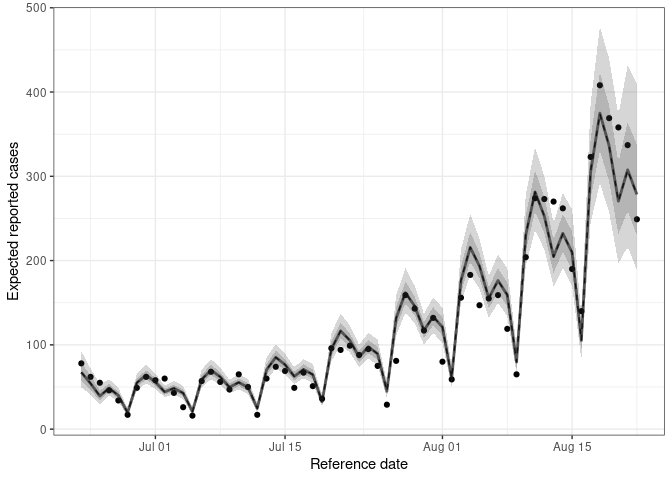
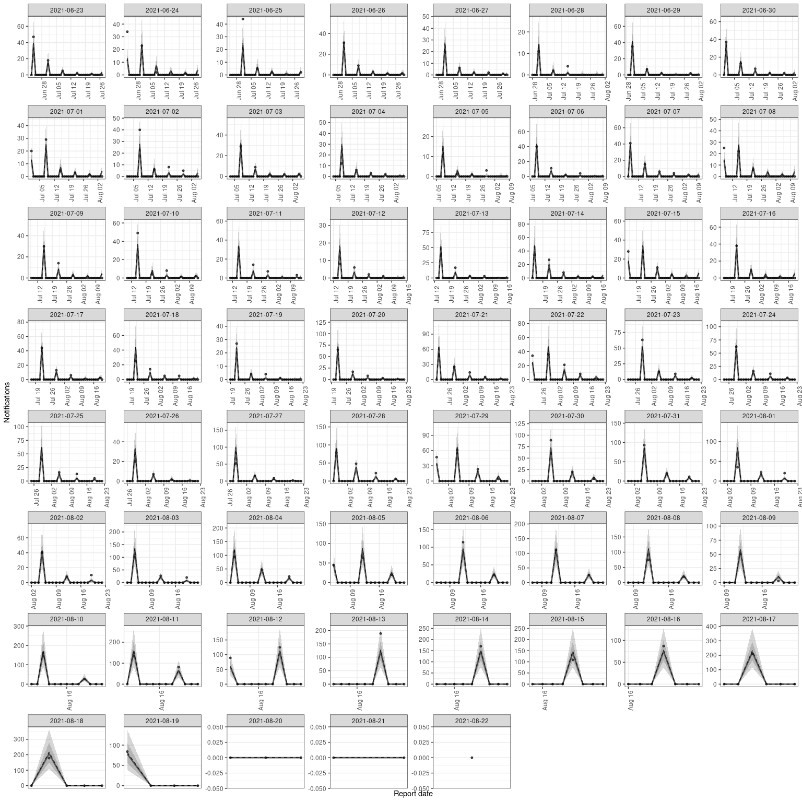

# Adapting `{epinowcast}` to have a fixed reporting schedule

## The problem

I have data that has a fixed reporting schedule (for example it is
reported weekly on a thursday at 9am). I want to use `{epinowcast}` to
nowcast the data and estimate the effective reproduction number, but I
want to be able to specify the reporting schedule.

## The solution

`{epinowcast}` doesn’t yet support this functionality, but it is
possible to adapt the package to do this.

> Before doing this note that we also have the option of pretending we
> do not know the fixed reporting schedule and so need to learn it from
> the data. This should work but it will likely not be very efficient.
> If you want to try this load the default `{epinowcast}` model in
> `main.R` rather than the adapted one.

We can do this by hardcoding the reporting day effects (`rep_beta`) to
be 0 (or a very small number in fact as on the logit scale). When
combined with a reporting model that identifies days that aren’t the
reporting day this will have the effect of encoding the reporting
schedule in the model.

> We could do better than this by modifying the likelihood to skip days
> with zero reports as these actually contain no information once the
> above change is in place. For this example we will not do this but
> this will be the approach taken once this feature is implemented in
> `{epinowcast}`.

## Getting setup with this example

1.  Clone this repository
2.  Open an R session in the root of the repository. `renv` should
    handle installing the dependencies. Note that this example was
    developed using
    [`epinowcast#58da6aa`](https://github.com/epinowcast/epinowcast/tree/58da6aabb392e224b9ae341439c28719a1dde6d7).
3.  Make sure you have `cmdstan` installed (for example via
    `cmdstanr::install_cmdstan()`). Note that this example was developed
    using `v2.33.1`.
4.  Either run through this `README` interactively or render it using
    `quarto`.

## Load Packages

``` r
library(epinowcast)
library(data.table)
library(ggplot2)
library(here)
```

    here() starts at /home/seabbs/Dropbox/academic/projects/epinowcast-fixed-reporting-example

## Load Synthetic Data

We load in the synthetic data from `data` that we generated in
`data-raw/synthetic-weekly-data.R`. We also load in the latest available
data by reference date (i.e. the data that we want to nowcast).

``` r
rt_synth_data <- fread("data/synthetic-weekly-data.csv")
latest_synth_data <- fread("data/latest-synthetic-weekly-data.csv")
```

## Filter the latest data for the period we are nowcasting

``` r
filt_latest_synth_data <- enw_filter_reference_dates(
  latest_synth_data,
  remove_days = 40, include_days = 60
)
```

## Create `.observed` indicator variable

We need to tell the model which observations are observed and which are
missing. We do this by creating a binary indicator variable `.observed`
which is 1 for observed observations and 0 for missing observations.

``` r
rt_synth_data[, .observed := ifelse(day_of_week %in% "Thu", TRUE, FALSE)]
```

## Preprocess Observations

As for all uses of `{epinowcast}` we need to first preprocess the data.

``` r
pobs <- enw_preprocess_data(rt_synth_data, max_delay = 35)
```

    Warning in enw_add_metaobs_features(metareport, ...): Pre-existing columns in
    `metaobs` will be overwritten: {day_of_week}.

    Warning in enw_add_metaobs_features(metareference, ...): Pre-existing columns
    in `metaobs` will be overwritten: {day_of_week}.

## Compile Nowcasting Model

We now load in our custom model (`model.stan`). If we would like to use
the default model we would drop the `model` - try this out and see what
difference it makes.

``` r
model <- enw_model(
  model = here("model.stan"),
  threads = TRUE, stanc_options = list("O1")
)
```

    Using model /home/seabbs/Dropbox/academic/projects/epinowcast-fixed-reporting-example/model.stan.

    include is /home/seabbs/.cache/R/renv/cache/v5/R-4.3/x86_64-pc-linux-gnu/epinowcast/0.2.3.2000/dc53985827ba0c78455151bc142191dc/epinowcast/stan.

## Define Expectation Model

This model includes:

- A random walk on the log of expected cases.
- A generation time with probability mass spread over 4 days.
- A latent reporting delay representing the incubation period and
  assumed ascertainment.
- A day of the week reporting effect.

``` r
expectation_module <- enw_expectation(
  r = ~ 1 + rw(week),
  generation_time = c(0.1, 0.4, 0.4, 0.1),
  observation = ~ (1 | day_of_week),
  latent_reporting_delay = c(0.05, 0.3, 0.6, 0.05),
  data = pobs
)
```

## Define Reference Date Model

This model assumes a log-normal reporting delay.

``` r
reference_module <- enw_reference(~ 1, data = pobs)
```

## Define Report Date Model

This model accounts for the day of the week reporting effect using a
binary indicator `not_thursday` which is present in our synthetic data.

``` r
report_module <- enw_report(~ not_thursday, data = pobs)
```

## Define the observation model

We use a negative binomial observation model to account for
overdispersion in the data. We also supply the model with the
`.observed` indicate variable which we created using
`enw_flag_observed_observations()`. This is used to tell the model which
observations are observed and which are missing (here only days with
reported cases are considered observed).

``` r
obs_module <- enw_obs(family = "negbin", observation_indicator = ".observed", data = pobs)
```

## Fit Nowcast Model

We’ll fit the model with the modules defined above and produce a
nowcast.

``` r
nowcast <- epinowcast(pobs,
  expectation = expectation_module,
  reference = reference_module,
  report = report_module,
  obs = obs_module,
  fit = enw_fit_opts(
    save_warmup = FALSE, pp = TRUE,
    # Warning: I have 16 cores and so this setting is fine for me
    # but you need to change it if you have fewer cores (or more!)
    # so that chains * threads_per_chain = your number of cores
    # of cores.
    chains = 4, threads_per_chain = 4,
    parallel_chains = 4,
    iter_warmup = 1000, iter_sampling = 1000,
    adapt_delta = 0.98, max_treedepth = 12
  ),
  model = model
)
```

> You may see warning messages from early in the warmup process. These
> are due to them model being initialised far from the posterior. These
> warnings will be mitigated once we implement improved initialisation.

## Visualizations

### Nowcast of Observed Values

``` r
plot(nowcast, filt_latest_synth_data) 
```


### Reproduction Number Estimates

``` r
rt <- enw_posterior(nowcast$fit[[1]], variables = "r")
cols <- c("mean", "median", "q5", "q20", "q80", "q95")
rt[, (cols) := lapply(.SD, exp), .SDcols = cols]
rt <- cbind(
  expectation_module$data_raw$r[, .(date)], rt
)

ggplot(rt) +
  aes(x = date) +
  geom_line(aes(y = median), linewidth = 1, alpha = 0.6) +
  geom_line(aes(y = mean), linetype = 2) +
  geom_ribbon(aes(ymin = q5, ymax = q95), alpha = 0.2, linewidth = 0.2) +
  geom_ribbon(aes(ymin = q20, ymax = q80, col = NULL), alpha = 0.2) +
  geom_hline(yintercept = 1, linetype = 2) +
  theme_bw() +
  labs(
    x = "Reference date",
    y = "Effective reproduction number"
  )
```


### Expected Latent Cases

``` r
latent_exp_cases <- enw_posterior(
  nowcast$fit[[1]],
  variables = "exp_llatent"
)
latent_exp_cases[, (cols) := lapply(.SD, exp), .SDcols = cols]
latent_exp_cases <- cbind(
  enw_extend_date(
    expectation_module$data_raw$r[, .(date, .group = 1)],
    days = nowcast$data[[1]]$expl_lrd_n,
    direction = "start"
  ),
  latent_exp_cases
)

ggplot(latent_exp_cases) +
  aes(x = date) +
  geom_line(aes(y = median), linewidth = 1, alpha = 0.6) +
  geom_line(aes(y = mean), linetype = 2) +
  geom_ribbon(aes(ymin = q5, ymax = q95), alpha = 0.2, linewidth = 0.2) +
  geom_ribbon(aes(ymin = q20, ymax = q80, col = NULL), alpha = 0.2) +
  theme_bw() +
  labs(
    x = "Reference date",
    y = "Expected latent cases"
  )
```


### Expected Reported Cases

``` r
exp_cases <- enw_posterior(
  nowcast$fit[[1]],
  variables = "exp_lobs"
)
exp_cases[, (cols) := lapply(.SD, exp), .SDcols = cols]
exp_cases <- cbind(
  expectation_module$data_raw$observation,
  exp_cases
)

exp_cases <- data.table::copy(latest_synth_data)[, date := reference_date][
  exp_cases,
  on = "date"
]

ggplot(exp_cases) +
  aes(x = date) +
  geom_point(aes(y = confirm)) +
  geom_line(aes(y = median), linewidth = 1, alpha = 0.6) +
  geom_line(aes(y = mean), linetype = 2) +
  geom_ribbon(aes(ymin = q5, ymax = q95), alpha = 0.2, linewidth = 0.2) +
  geom_ribbon(aes(ymin = q20, ymax = q80, col = NULL), alpha = 0.2) +
  theme_bw() +
  labs(
    x = "Reference date",
    y = "Expected reported cases"
  )
```



### Posterior Predictions by Report and Reference Date

``` r
plot(nowcast, type = "posterior") +
  facet_wrap(vars(reference_date), scale = "free")
```

    `geom_line()`: Each group consists of only one observation.
    ℹ Do you need to adjust the group aesthetic?
    `geom_line()`: Each group consists of only one observation.
    ℹ Do you need to adjust the group aesthetic?


